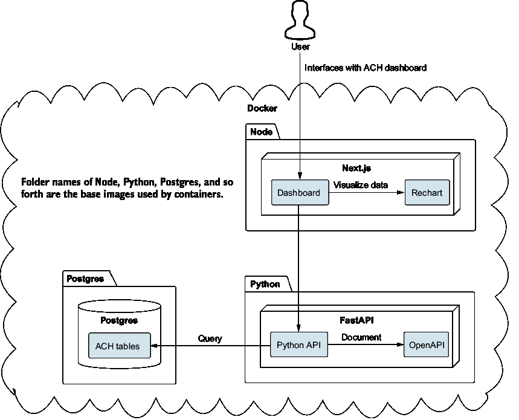
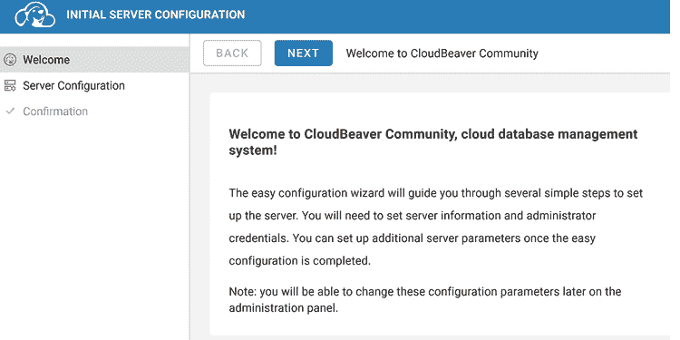
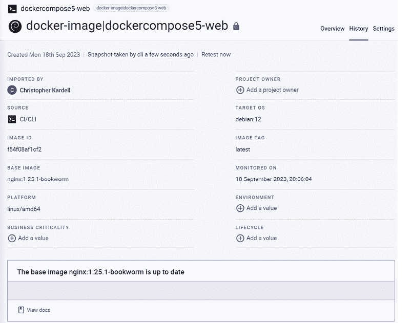
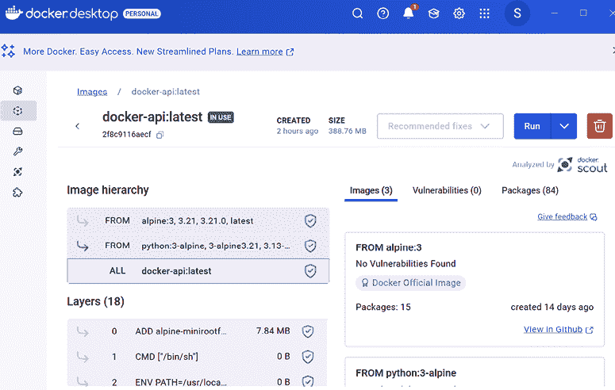

# 3 开始使用 Docker

### 本章涵盖

+   使用 Docker 和 Docker Compose 为我们的项目组件创建容器

+   优化 Docker 容器和镜像以提高安全性和维护性

+   实施通用的 Docker 维护以确保我们的容器和镜像不会消耗磁盘空间

+   使用健康检查来确保系统处于运行状态

在上一章（或者如果我们从敏捷的角度思考，是冲刺），我们创建了一个功能性的（尽管是基本的）ACH 解析器。我们还尝试了生成式 AI 工具来帮助我们更快、更有效地工作。我们在探索工具和掌握 ACH 处理方面取得了一些进展。享受这种感觉吧，因为肯定会有一些日子，当我们离开电脑时会感到完全筋疲力尽。

到目前为止，我们已经得到了项目需求和一个关于最终项目应包含内容的总体框架。当然，在处理项目时，我们可能会采取不同的方法，每种方法都有其优缺点。虽然我们可能最终会倾向于一种方法而不是其他方法，但在处理项目时，我们总是需要考虑一些因素，例如

+   项目的大小和复杂性与我们团队的经验和知识相比如何？

+   项目需求是否已经明确定义，或者业务/客户还在探索项目？需求与项目分配的时间如何比较？

+   对于像错误、延误、新技术等类似项目，我们的风险容忍度是多少？

+   我们是否有现有的项目基础设施，例如测试环境和自动化构建？如果没有，我们是否需要考虑构建该基础设施，或者它会在以后进行？

虽然在担任更多领导角色（技术负责人、架构师等）时，前面的观点可能显得更为重要，但让每个人都考虑这些观点是有益的，因为不同的观点总是有用的。我们只需要确保我们的反馈是建设性的，而不是攻击我们的同事（我们应当注意，在明显任何反馈都会被忽视的情况下要小心）。让我们回到手头的项目上来。

## 3.1 从哪里开始

首先，你可能没有选择权来决定你能够做什么工作。业务需求可能规定你必须按照这个顺序来工作这些部分。然而，假设你可以在哪里开始有选择权，你会选择什么？你可以从一个你感到舒适的部分开始——也许你是一个强大的 Python 程序员，所以你想完成对 ACH 解析器的工作。

或者，也许你应该选择你最不熟悉的事情。也许你以前从未使用过 Next.js，你想要确保你有足够的时间投入到这部分，因为你觉得其他部分不会花费太多时间。

我们喜欢从整个项目开始！好吧，不是整个项目，但我们想看看我们是否能让所有部件以某种形式相互交流。即使它只是一堆“Hello, World！”程序和组件，至少我们把部件组合在一起了，然后我们可以捡起来，开始构建它们，并让它们发展。这完全取决于你——你同样可以跳到其他章节，让各种组件启动运行。这一章的重点是设置 Docker 环境，然后放置我们的基本项目组件。后续章节将在此基础上构建，但到目前为止，我们想要创建一个类似于图 3.1 所示的环境。

如你所见，这个环境将为我们提供一个运行 Node 和 Next.js 的 UI 容器，一个由 FastAPI 提供动力的 API 容器，以及一个运行 PostgreSQL 的数据库容器。在 Docker 内部运行这些容器还允许引入其他



##### 图 3.1  我们 ACH 系统的概述

我们将在其他章节中探讨的组件。虽然这个项目采用了一种更面向服务的架构方法，但使用 Docker 将我们的软件分解的一般方法为其他架构模式铺平了道路。目标不是让你成为 Docker 专家（如果你想成为专家，可以查看 Jeff Nickoloff 和 Stephen Kuenzli 所著的《Docker in Action》（2019，Manning）），而是向你展示如何使用它来探索不同的技术和软件，而无需在主机机器上安装和配置它。这真的有助于你保持更整洁的秩序。

##### 单体架构是否已经死亡？

由于我们使用容器，你可能已经听说过微服务以及它们是如何成为最新和最伟大的，你可能会想回到公司寻找任何单体软件，并开始坚持认为他们做错了。我们建议你不要这样做。仅仅因为某件事物是新的，并不意味着它就是更好的。单体架构可能有其缺点，但技术领域没有万能的解决方案。为了改变而改变不仅是不必要的——它可能对软件有害。

因此，我们建议，如果它没有坏，就不要去修复它。如果你的公司运行着单体软件，它可能在你离开公司很久之后仍然在运行。只有在你确定了架构的问题之后，你才应该寻找替代方案。

单体架构在开发概念验证时也非常有用，因为你可以将所有内容捆绑并部署在一个简单的包中。我们相信每件事物都有其时间和地点，因此虽然我们鼓励前瞻性思维和工程实践，但请记住，敏捷的一部分是寻找在正确的时间交付正确的产品。可能现在并不是探索迁移到容器的好时机。

## 3.2 创建 docker-compose.yml 文件

如果你之前从未使用过 Docker，那么你将真正享受到一份大礼。Docker 允许我们创建和分发各种容器。容器可以看作是一种微型虚拟机，你可以以声明的方式构建它，并且可以被他人拉取。如果你是 Java 程序员，可以想想你的 pom.xml 和 Maven，在那里你可以基本上描述你的项目并将该文件提供给他人，以便他们可以使用 Maven 拉取必要的文件。容器类似，但它们工作在更大的规模上。在图 3.1 中，我们展示了具有多个容器运行 Nginx、FastAPI 和 PostgreSQL 的解决方案。当与多容器应用程序一起工作时，我们希望能够从集中位置管理一切，这就是 Docker Compose 发挥作用的地方。我们可以声明一个 docker-compose.yml 文件，并在一个位置配置所有应用程序、容器和服务。

如果你刚开始使用 Docker，你可能想尝试使用 Copilot，但我们的尝试并没有产生任何有意义的成果。我们尝试使用以下命令与 Copilot 一起使用：


```py
	# Create a sample docker compose layout for Nginx, CloudBeaver,
```

那个提示的结果显示在下述列表中。不幸的是，它并没有生成任何实际的可执行代码。

##### 列表 3.1  Docker 设置尝试失败

```py
# Create a sample docker compose layout for 
➥ nginx, cloudbeaver, postgres, and fastapi
# This is a sample docker compose file for a fastapi project
# It is not meant to be used in production
# It is meant to be used as a starting point for a fastapi project
```

直接询问 ChatGPT 我们得到了更好的结果，如下一列表所示，因为它提供了一个实际的 compose 文件。

##### 列表 3.2  ChatGPT 生成的 docker-compose.yml

```py
version: '3.7'   #1

services:
  nginx:
    image: nginx:latest
    container_name: nginx_container
    ports:
      - "80:80"
    volumes:
      - ./nginx:/etc/nginx/conf.d
    depends_on:
      - web

  web:
    build:
      context: .
      dockerfile: Dockerfile.fastapi    #2
    container_name: fastapi_container
    volumes:
      - ./app:/app
    expose:
      - "8000"
    depends_on:
      - db

  db:
    image: postgres:latest
    container_name: postgres_container
    environment:
 POSTGRES_USER: user #3
 POSTGRES_PASSWORD: password #3
 POSTGRES_DB: sample_db 
 volumes:
  - postgres_data:/var/lib/postgresql/data

  cloudbeaver:
 image: cloudbeaver:latest
 container_name: cloudbeaver_container
 ports:
  - "8080:8080"
    depends_on:
      - db

volumes:
  postgres_data:
```

#1 版本标签已经过时，但即使 3.7 在 ChatGPT 提供这个答案时也已经过时；这是需要验证响应的另一个例子。

#2 ChatGPT 给我们提供了一个非标准的名称 Dockerfile.fastapi；相反，我们应该使用没有扩展名的 Dockerfile 或 fastapi.Dockerfile（见 [`mng`](https://mng.bz/xKoB) [.bz/xKoB](https://mng.bz/xKoB)）；这是需要验证响应的另一个例子。

#3 这些环境变量允许为 Postgres 数据库进行配置。

这些是良好的开端，但我们需要退一步，以便我们可以分解代码并得到更短的内容。因为我们过度依赖生成式 AI，所以我们开始得比平时更大，这是一个我们应该吸取的好教训。我们讨论了需要快速反馈循环和短周期的必要性。在一次会话中更改太多代码从来不是一个好主意，因为当我们验证我们的更改时，我们不确定实际上解决了我们的问题。因此，在没有充分了解需要发生什么的情况下，让生成式 AI 构建四个或五个容器是一个糟糕的想法。

现在我们已经吸取了现实的一课并退了一步，让我们选择一个容器来启动并运行。

### 3.2.1 创建 CloudBeaver 容器

我们将首先构建一个 CloudBeaver 容器。CloudBeaver 是一个数据库管理工具，通过简单的基于网页的用户界面支持多种数据库。数据库管理界面并不少见。如果您正在使用 Postgres 数据库，也可以查看 pgAdmin ([`www.pgadmin.org/`](https://www.pgadmin.org/))，或者使用 JetBrains 的 DataGrip ([`www.jetbrains.com/datagrip/`](https://www.jetbrains.com/datagrip/))，因为我们将在项目中使用其他 JetBrains IDE。我们没有对任何特定产品有投资利益，只是希望分享我们在 FinTech 中看到的使用情况。

我们安装 CloudBeaver 是因为我们想有另一种方式查看和管理我们的数据库，而不仅仅是使用代码。您的公司可能有一个首选的工具，您可以自由使用它。然而，CloudBeaver 非常容易启动和运行。

那么，为什么我们在数据库之前设置数据库管理工具呢？这是一个好问题。因为 CloudBeaver 是一个网页界面，我们可以通过打开浏览器并导航到 URL 来简单地确认容器是否正在运行。因此，CloudBeaver 提供了一种快速简单的方法来开始并验证我们的进度。另一种选择是使用我们的 IDE，因为 IDE 通常提供集成（或插件）来浏览数据库。当然，使用我们的 IDE 会脱离 Docker，而我们正在探索使用 Docker 的不同容器。

考虑到这一点，让我们通过提示 ChatGPT 来开始：

**** 在 Docker Compose 中仅创建一个基本的 Cloudbeaver 服务。

我们收到了以下输出。

##### 列表 3.3  ChatGPT 的示例 CloudBeaver 容器输出

```py
version: '3.1'      #1
services:
  cloudbeaver:
    image: dbeaver/cloudbeaver:latest
    container_name: cloudbeaver
    ports:
      - "8080:8978"
```

#1 版本标签已过时，但即使 3.1 版本在 ChatGPT 提供这个答案时也已经过时；这是一个需要验证 ChatGPT 响应的例子。

输出看起来是合理的，但我们看到版本号是 `3.1`。最新的 Docker Compose 版本是 `3.8`，但现在 `version` 标签已被项目标记为过时。虽然我们目前还可以指定它，但使用它将显示警告消息。如果它将来成为错误，这肯定会引起问题。因此，我们告诉 ChatGPT：

**** 更新基本设置以删除 Docker Compose 版本，因为它现在已经过时。

这样，我们的文件就更新了。从我们的对话中更新输出的能力是生成式 AI 的一个强大方面，我们应该记住。当然，我们也可以简单地从生成的文件中删除它；然而，我们希望我们的更新提示能够反馈到系统中，我们最终将不再在生成的文件中获得 `version` 标签。

我们可以将列表 3.3 的输出复制粘贴到 docker-compose.yml 文件中，导航到文件夹，然后执行 `docker-compose up` 命令。在我们的机器上，由于以下错误，它未能完成此操作：

```py
Bind for 0.0.0.0:8080 failed: port is already allocated 
```

这个错误相当直接，但记住你正在运行可能使用该端口的程序并不总是那么直接。我们也可以更新我们的 docker-compose 文件以使用不同的端口，但在这个时候，我们可以通过在 Windows PowerShell 中使用`netstat` `-aon` `|` `findstr` `"8080"`然后`tasklist` `|` `findstr` `PID`（PID 是我们刚刚遇到的进程 ID，它们在右侧）来找到那个引起问题的进程。一旦你这样做，你可以决定是否要关闭/停止你正在运行的任何程序，或者调整正在使用的端口。在我们的情况下，另一个 Docker 容器正在使用，所以可以安全地关闭。在这个时候，运行`docker-compose` `up`是有效的，我们可以导航到 http://localhost:8080/并看到图 3.2 所示的 Web 界面。



##### 图 3.2  CloudBeaver 欢迎屏幕

### 3.2.2 创建一个 PostgreSQL 容器

现在事情会变得更有趣，因为我们有机会添加一个数据库容器。最终，数据库将存储我们的 ACH 文件和相关数据，但现在我们将保持简单。我们还可以在容器启动时填充数据库，这样我们就可以使用 CloudBeaver 连接到数据库并查看我们的数据。我们可以要求 ChatGPT 简单地

**** 更新 docker-compose 文件，以包括一个`postgres`服务。

再次强调，这提供了一个有利的起点，如下一个列表所示。

##### 列表 3.4  ChatGPT 生成的多个容器

```py
version: '3.8'
services:
  cloudbeaver:
    image: dbeaver/cloudbeaver:latest
    container_name: cloudbeaver
    depends_on:
      - postgres
    ports:
      - "8080:8978"
    environment:
      - CB_DATABASE_URL=jdbc:postgresql://postgres:5432/postgres
      - CB_DATABASE_USERNAME=postgres
      - CB_DATABASE_PASSWORD=postgrespwd

  postgres:
 image: postgres:latest
 container_name: postgres
 environment:
 POSTGRES_DB: postgres
 POSTGRES_USER: postgres
  POSTGRES_PASSWORD: postgrespwd
    volumes:
      - postgres_data:/var/lib/postgresql/data
    ports:
      - "5432:5432"

volumes:
  postgres_data
```

然而，让我们退一步，构建一个更简单的文件，这将在这个时候更好地为我们服务，因为我们仍在尽可能遵守 YAGNI（你不需要它）的原则。一些纯粹主义者可能会争论，甚至创建这些 Docker 容器也违反了这一原则。目前，我们可能并不需要我们项目的任何这些——我们甚至可能不需要数据库。也许，我们可以通过只写入文件或保持数据在内存中而逃脱！这当然可能是真的，但我们可以将这视为现有代码，因为我们的应用程序是基于 PostgreSQL 构建的，所以不管我们是否真的需要它，这都将是一个要求。

##### 什么是 YAGNI？

YAGNI 是“你不需要它”（You aren’t going to need it）的缩写。它是极限编程的一个原则，并且与我们的敏捷原则（如最小可行产品 MVP）相联系，通过试图强制执行避免不必要的工作和复杂性的想法。有时候，在编码时，很难抗拒添加那些你很确定将来会需要的额外功能，所以你可能会选择现在就编写它。然后，那段代码从未被使用，但被静态代码分析标记为需要修复，并在更新某些对象时需要更改。

所以，至少要记住这个原则，以避免额外的复杂性。

让我们回到构建我们的容器。我们添加一个简单的容器，如下所示（你可以查看 GitHub 上提供的 v2/docker 文件夹中本章的整个文件）：

```py
  Postgres:
 image: postgres:latest
 environment:
  POSTGRES_USER: admin
      POSTGRES_PASSWORD: secret
```

通过这种方式，我们可以导航到 CloudBeaver，使用 http://localhost:8080 并设置连接；然而，我们没有数据可以查看。我们希望能够在容器构建时加载数据，所以我们将现在查看如何实现这一点。注意，我们已从生成的 Dockerfile 中删除了网络和卷字段，因为我们将依赖于 Docker 设置的网络。默认情况下，所有在 docker-compose 文件下的服务中定义的容器都能够相互通信。此外，我们在这个项目中不感兴趣持久化数据（至少目前是这样），所以我们删除了卷标签。这为我们提供了一个简单的起点。

要添加一些数据，我们将创建一个 SQL 脚本，该脚本在容器首次构建时执行。我们首先创建一个`health_check`表。这个表可以用来确定我们的应用程序是否处于有效状态。对我们来说，这更像是一个“Hello, World！”场景，而不是任何有意义的内容。

##### 健康检查

由于我们的应用程序将分布在多个容器中，创建一个健康检查通常很有用。在使用微服务时，这是一个常见的模式。尽管我们最初创建了一个名为`health_check`的数据库表，但这只是开始。

Docker 允许我们在设置中为容器创建一个健康检查，我们将在稍后探讨。这个测试可以确定容器是否“不健康”。当使用 Kubernetes 之类的容器编排工具时，这些健康状态检查可以触发管理员警报，并自动重启容器。

Kubernetes 之类的工具还扩展了这些检查，以区分应用程序因初始化而不可用和因崩溃而不可用的情况。这些分别被称为“就绪”和“存活”。

现在我们有一个更健壮的容器，我们将使用四个`docker-compose`命令：

+   `docker-compose` `build`—当我们需要根据 Dockerfile 构建容器时，我们使用这个命令。对我们包含在容器中的文件/脚本所做的任何更新，都需要我们发出这个命令。

+   `docker-compose` `up`—当我们需要启动我们的容器时，使用这个命令。

+   `docker-compose` `stop`—当我们想要停止我们的容器并保留数据时，使用这个命令。虽然很重要，但我们将通常使用`down`参数，因为我们将依赖于我们的初始化脚本来填充数据库，并且每次都从一个全新的数据库开始。

+   `docker-compose` `down`—这个命令用于在需要停止并删除容器时使用。我们用它来更改任何初始化脚本，因为当数据库存在时，初始化将不会发生。

当我们修改 Dockerfile 时，我们需要这些命令。通常，对于开发，我们只是将它们链在一起作为 `docker-compose down` `&&` `docker-compose build` `&&` `docker-compose up`。你甚至可以将命令简化为 `docker-compose down` `&&` `docker-compose up` `--build`。

初始创建我们的容器可能需要一些时间，但在进行小幅度增量更改时，这个过程将会显著加快。现在我们应该能够通过 CloudBeaver 查看我们的表格及其数据。

### 3.2.3 API 容器

我们下一个容器通过构建我们的 API 容器来扩展我们的容器经验。很快，我们将开始构建处理 ACH 文件的具体 API，但到目前为止，我们将保持非常基础。我们希望利用 FastAPI 框架在 Python 中运行我们的 API。

我们将从标准的 Docker Python 镜像（Docker 中的镜像是一个标准的只读模板，用于创建容器）创建一个 Python 容器，并在其上安装 FastAPI 和一些依赖项。在我们之前的容器中，我们直接在 docker-compose 文件中创建容器。使用这个容器，我们将创建一个 Dockerfile，该文件将被 docker-compose 文件引用。为了存储镜像的依赖项和配置，我们需要引入一些新的命令：

+   `FROM`—指定一个基础镜像来从它开始构建镜像。

+   `COPY`—从本地机器复制目录/文件到镜像。在接下来的章节中，我们将创建一个 requirements.txt 文件，该文件需要被复制到包含 FastAPI 的镜像中，以及其他一些内容。

+   `RUN`—在构建过程中在镜像中执行命令。我们将执行 `pip` 来安装所需的 Python 包。

+   `CMD`—指定容器启动时运行的默认命令。我们将使用此命令来运行 Uvicorn，这是一个异步服务器网关接口（ASGI），我们需要运行 FastAPI。

如前所述，我们使用 `FROM` 命令来声明一个基础镜像来构建。如果你不指定任何内容，Docker 将默认使用最新版本，但你也可以指定一个特定的镜像标签。指定标签可能有各种原因，特别是如果你想将镜像锁定到特定版本。我们将使用 `latest` 作为我们的镜像，因为我们认为这是一个开发项目，不会立即推送到生产环境。

我们所说的开发项目是什么意思？我们只是意味着在生产环境中，更改软件版本时需要更加小心。你可能会有过时的功能，可能会有你需要注意的错误或漏洞。这些都是你在更改版本之前需要权衡的考虑因素。在这种情况下，我们在构建容器时选择 Python 的最新版本。在生产环境中，你将通过运行测试套件来控制升级，并确保不存在任何不兼容性。

这些关于容器版本的问题也扩展到应用程序本身。此容器在 Python 容器之上安装了 FastAPI，因此我们有一个 requirements.txt 文件来处理这个问题。我们选择在这个示例中只安装最新的包；然而，我们鼓励您考虑锁定特定版本和其他要求。

##### Python requirements.txt

我们的示例使用不带任何类型版本控制的包名。然而，您可以利用更好的安全措施，例如

+   *指定确切版本*—`package==1.0.0`

+   *版本范围*—`package>=1.0.0,<2.0.0`

+   *排除版本*—`package!=1.0.5`

+   *版本与 Python 版本的组合*—`package==1.1.0;python_version<'3.10'`

您也可以从版本控制系统、URL 和本地文件中进行安装。

最后，您可以通过使用`pip freeze > requirements.txt`为您的项目创建一个 requirements.txt 文件。

您应该能够使用标准的`docker-compose build`和`docker-compose up`命令来构建并使容器上线。根据您使用的端口（对我们来说是`8000`），您应该能够通过 http://localhost:8000/导航到 API，然后看到输出`{"message":"Hello World!"}`，尽管它没有做太多事情，但仍然相当酷。

### 3.2.4 Web 服务器容器

我们正在研究的容器拼图中最后一部分是一个 Web 界面。计划是提供一个仪表板，我们可以通过它上传和查看 ACH 文件。同样，目前我们只是构建一个简单的页面来确保一切正常工作。对于这个容器，我们将在 Nginx 之上构建我们的应用程序。虽然大量现有基础设施使用 Apache 作为 Web 服务器，但 Nginx 在过去几年中拥有略大的市场份额。

此容器基于我们之前探索的一些概念，例如使用基础镜像构建容器。此外，您可能还希望从 docker-compose 文件中管理端口。之前，我们指定了如`8000:8000`这样的端口，分别给出了主机和容器的端口。默认情况下，Nginx 将监听`端口``80`，虽然我们可以更新其配置文件以定义不同的监听端口，但我们可以利用这个机会来介绍在 Docker 中配置端口。假设我们希望能够保留 Nginx 的默认端口，同时只为网页浏览器提供一个不同的端口。例如，让我们假设我们希望能够导航到 http://localhost:3000/hello.xhtml 来访问我们的示例网页。我们可以通过指定`3000:80`然后启动我们的容器来实现这一点。

到目前为止，我们已经设置了我们将需要的所有容器，但我们还没有确保它们正在相互通信。

## 3.3 连接我们的容器

现在，让我们回到让我们的容器进行通信的问题。我们希望确保我们的容器可以交互。我们的用例一开始很简单，但为扩展我们的项目奠定了基础。我们希望能够访问一个使用 API 层访问我们的`health_check`数据库表的网页。这个表在这个阶段可能不会改变，但我们可以手动调整它并查看结果。这将是一个确保一切按预期运行的很好的第一步。

如前所述，港口可能会带来问题，不仅从安全角度考虑，而且仅仅记住你选择了哪些端口。因此，让我们列出我们的容器和正在使用的端口。

##### 表 3.1 容器港口列表

| 容器名称 | 主机端口 | 内部端口 |
| --- | --- | --- |
| CloudBeaver | `8080` | `8080` |
| Postgres | `-` | `5432` |
| Api | `8000` | `8000` |
| Web | `3000` | `80` |

### 3.3.1 连接到数据库

我们的第一步是让 API 容器连接到数据库并从表中获取结果。在这个阶段，我们只是想要整理好管道，所以我们不会考虑编写单元测试。随着我们构建示例，我们将能够轻松地测试这一点。首先，我们将专注于更新我们的 API 层以连接到数据库并返回我们的给定状态。

我们首先更新我们的 requirements.txt，包括`psycopg[c]`以支持连接到数据库。

##### 列表 3.5  我们更新的 requirements.txt

```py
psycopg[c]
fastapi
pydantic
uvicorn
```

`psycopg[c]`是一个适合生产的方案，但也需要更新我们的 Dockerfile 以包括额外的依赖项。你现在应该能够访问 http://localhost:8000/health/status 来查看状态。如果一切顺利，你应该会看到`[{"id":1,"status":"OK"}]`。如果不这样，你可以跳到 3.2.2 节，该节讨论了你可能遇到的一些常见问题。

在更新了这段代码之后，我们现在有几件事情需要考虑。我们的`health_check`表目前是按照顺序 ID 和状态构建的，并且我们决定在这个例子中返回所有记录。你可以通过进入 CloudBeaver（http://localhost:8080），点击`SQL`命令，并使用`INSERT` `INTO` `health_check` `VALUES(DEFAULT,` `'testing')`插入另一条记录来实验。不需要将 SQL 语句大写，但我们发现这样做有助于在处理与其他代码混合的 SQL 时使代码更易读。插入记录后，你会发现导航回健康/状态端点将返回所有记录。所以，你应该会看到类似`[{"id":1,"status":"OK"},{"id":2,"status":"testing"}]`的内容。稍后，我们可以回顾并探索解决这一问题的方法。记住，我们想要提供当前系统的健康状况，但我们目前并没有做任何事情来更新这个表。

##### 暴露的端口和内部网络

在指定我们的连接字符串时，我们选择了 `端口` `5432`。你还可以看到 `postgres` 容器正在监听 `5432`，因为应该有一个日志消息说 `监听` `IPv4 地址 0.0.0.0,` `端口` `5432`。然而，我们的端口列表显示我们没有指定它，那么问题出在哪里呢？

由于我们使用 Docker Compose，其中一个好处是创建了一个内部网络。这允许容器像在同一网络中一样相互通信。在我们的情况下，上述端口仅用于主机系统。如果我们想使用安装在桌面上的工具编写脚本或浏览数据库，那么我们可以暴露 `端口` `5432`。

为什么我们可以使用 CloudBeaver 来查看 SQL 数据？嗯，那是因为我们为 CloudBeaver 暴露了 `8080` `端口`，我们可以用我们的网页浏览器来浏览它。因此，我们与 CloudBeaver 进行外部通信，但 CloudBeaver 可以使用内部网络来访问 `端口` `5432`。

### 3.3.2 PostgreSQL 和 FastAPI 故障排除

在设置容器时，事情可能没有按预期进行，或者在其他容器设置时可能不会按预期进行。当使用 `docker-compose` `up` 启动容器时，务必注意日志，因为你可能会频繁地看到有意义的错误信息。还要注意，你可能需要向上滚动，因为之前的容器失败了，其他容器随后启动，或者错误/警告信息在混乱中丢失了。以下是在容器无法启动的情况下可能会遇到的更常见的一些错误。

我们试图从一个容器连接到另一个容器，所以你可能在控制台上看到类似的消息 `Is` `the` `server` `running` `on` `that` `host` `and` `accepting` `TCP/IP` `connections?` 这条消息可能意味着容器启动失败，并且由于它是从我们的 FastAPI 代码连接到数据库，我们的代码中可能存在语法错误，阻止了容器的启动。这个错误可能是代码中的拼写错误，也可能是由于我们未能包含的依赖项导致的。如果代码在语法上是正确的，请检查 requirements.txt 和 Dockerfile，以确保所有要求都被安装。

错误 `连接` `到` `服务器` `at` `"localhost"` `(::1),` `端口` `5432` `失败:` `无法` `分配` `请求的` `地址` 是我们可能会遇到的其他错误之一。这个错误很常见，因为许多示例可能引用了 `localhost`，并且可能会错误地使用 localhost 而不是容器的名称/地址。你也可能认为，既然我们在自己的电脑上运行，就可以使用 `localhost`。但是记住，我们是在容器中运行。我们应该在我们的连接字符串中指定容器的名称，而不是 `localhost`。

当你指定了无效的用户名或密码时，可能会发生`psycopg.OperationalError:` `connection` `failed:` `FATAL:` `password authentication` `failed` `for` `user` `"postgres"`这个错误。查看 Dockerfile 和 docker-compose.yml 文件，确保你有正确的用户名和密码。记住，在这个阶段，我们在设置数据库容器时已经在我们的 docker-compose 文件中定义了用户名和密码，但我们还必须在 Python 代码中硬编码它。

我们可能遇到的其他错误，尤其是在生成式 AI 的帮助下，是`NameError`。当本地或全局名称未找到时，会引发`NameError`，这意味着我们尝试使用尚未定义或当前作用域中不可访问的变量、函数或模块。当我们自己处理代码时遇到了`NameError:` `name` `'status'` `is` `not` `defined`这个错误，因为我们没有仔细注意生成式 AI 建议的代码。尽管这不是我们使用的变量名，Copilot 还是填充了`status`变量。因此，这只是一个简单的语法错误，我们必须返回正确的值。

## 3.4 调用我们的 API

到目前为止，我们应该能够确认 API 可以访问数据库容器。我们还想进行一次跳跃——我们希望能够创建一个可以访问 API 的网页。尽管我们已经看到我们可以在浏览器中访问 API，但我们能够通过这种方式进行测试，因为我们的 REST API 使用的是`GET`请求，这与检索网页使用的请求相同。稍后，当使用其他 HTTP 动词，如`POST`、`PUT`和`DELETE`时，我们无法以这种方式进行测试。此外，我们将构建 UI，因此我们需要确保 Web 和 API 容器之间的连接性。

我们将创建一个简单的网页，结合 d3.js 来显示我们的结果。在我们的例子中，我们不需要任何花哨的东西，所以我们只创建一个结果列表。如果你不熟悉 HTML 或 d3.js，这将是一个很好的时候看看我们的生成式 AI 工具是否可以帮助你开始。

我们用 ChatGPT（GPT-40）提示

**** 创建一个简单的 d3.js 网页，调用 API。

它生成了一个在 `chat_gpt_example.xhtml` 中可见的示例。

##### 列表 3.6  ChatGPT 生成的示例页面

```py
<!DOCTYPE html>
<html lang="en">
<head>
    <meta charset="UTF-8">
    <meta name="viewport" content="width=device-width, initial-scale=1.0">
    <title>D3.js API Call</title>
    <script src="https://d3js.org/d3.v6.min.js"></script>
</head>
<body>
    <h2>Users from JSONPlaceholder API</h2>
    <ul id="users"></ul>

    <script>
        // The URL for the API endpoint
        const apiUrl = 'https://jsonplaceholder.typicode.com/users';

        // Use D3 to fetch the data from the API
        d3.json(apiUrl).then(data => {
            // Once data is fetched, populate the list
            d3.select("#users")
                .selectAll("li")
                .data(data)
 .enter()
 .append("li")
 .text(d => `${d.name} (${d.email})`);
  });
    </script>
</body>
</html>
```

这个响应为我们提供了一个很好的起点，经过一些调整，我们就有了一个满足我们初始需求的可行解决方案。

##### 列表 3.7  更新的示例页面

```py
<!DOCTYPE html>
<html lang="en">

<head>
    <meta charset="UTF-8"> 
    <meta name="viewport" content="width=device-width, initial-scale=1.0"> 
    <title>Health Check</title> #1
    <script src="https://d3js.org/d3.v7.min.js"></script> 
</head>

<body>
    <h2>Health Check</h2> #2
    <ul id="healthStatus"></ul>  
    <script>
        // The URL for the API endpoint
        const apiUrl = 'http://localhost:8000/health/status'; #3

        // Use D3 to fetch the data from the API
        d3.json(apiUrl).then(data => {
            // Once data is fetched, populate the list
            d3.select("#healthStatus") #4
                .selectAll("li")  #4
                .data(data)  #4
 .enter() #4
 .append("li") #4
  .text(d => `${d.id} (${d.status})`);  #4
  });
    </script>
</body>
</html>
```

#1 我们首先给我们的页面一个标题并导入 d3.js。

#2 创建一个标题并更新 ID，使其对我们更有意义

#3 访问状态检查的 API 端点

#4 更新选择语句和文本字段（ID 和文本），以便我们写入预期的数据

除了定制输出以满足我们的特定需求外，我们还需要将 d3.js 的版本提升到当前水平。当与生成式 AI 一起工作时，这是一个经常出现的问题；根据模型和训练数据，最新的软件可能并不总是包含在内。快速检查所有软件发布级别以确认你正在运行适当的版本是一个好主意。

我们必须做出的最重要的定制是将页面指向正确的 API URL。你可以参考我们之前制作的端口列表；你有什么想法这个 URL 会是什么样子吗？你可能被之前连接数据库和 API 容器的例子所困扰，在那个例子中，我们必须指定容器名称。在那个例子中，我们是在 Docker 内部。现在，我们的网页是外部的，因此我们想要从外部访问它，所以使用 localhost 和端口`8000`。

测试访问时，我们得到了一个 CORS（跨源资源共享）错误：

```py
Access to fetch at 'http://localhost:8000/health/status' from origin 
'http://localhost:3000' has been blocked by CORS policy: No 'Access-
Control-Allow-Origin' header is present on the requested resource.
```

##### CORS

CORS，更广为人知的是快速完成任务的障碍，是你在工作中会遇到的问题之一。CORS 代表跨源资源共享，是一种安全机制，允许服务器指定对与外部调用者共享的资源进行控制的规则。

CORS 提供了简单请求和预请求的概念。我们并不真正关心简单请求，因为预请求是触发 CORS 异常的请求。为了绕过这些异常，我们需要配置我们的服务器以确保发送回处理 CORS 的一些特定头部信息。

需要使用以下头部信息：

+   `Access-Control-Allow-Origin`—指定哪些网站允许访问资源。我们可以使用通配符`*`，但这可能存在潜在的安全风险。记住，最小权限原则？从一个更具体的源开始，并在必要时才扩展。

+   `Access-Control-Allow-Methods`—指定哪些 HTTP 方法是被允许的。同样，你可以使用通配符，但应仅使用必要的。在我们的例子中，我们只使用`GET`，因此这是我们真正需要的唯一一个。稍后，我们将使用更多的请求，但我们建议目前保持为`GET`，不要更新为使用尚未定义的 HTTP 方法，这样 CORS 会在稍后再次提出抱怨，这提供了良好的故障排除实践。

+   `Access-Control-Allow-Headers`—允许服务器指定可以用于请求的头部信息。

+   `Access-Control-Allow-Credentials`—指示浏览器是否应在请求中包含凭据。如果你有经过身份验证的请求或需要使用 cookie 维护状态，或者有包含敏感信息的请求，请将其设置为`true`。

为了纠正这个错误，我们的 API 层需要更新以下内容。

##### 列表 3.8  将 CORS 集成到我们的 API 中

```py
from fastapi import FastAPI
from fastapi.middleware.cors import CORSMiddleware #1
import psycopg

DATABASE_URL = "dbname=postgres user=postgres 
➥ password=secret host=postgres port=5432"

app = FastAPI()

origins = [ #2
 "http://localhost:3000", #2
] 

app.add_middleware( #3
 CORSMiddleware, #3
 allow_origins=origins, #3
 allow_credentials=False, #3
 allow_methods=["GET"], #3
 allow_headers=["*"], #3
)  #3

def get_db():
    conn = psycopg.connect(DATABASE_URL)
    return conn
```

#1 我们从 fastapi 导入 CORSMiddleware。

#2 原始地址是我们期望接收请求的地方；我们将其作为一个单独的变量创建，因为我们预计会更新它几次。

#3 我们在这里传递所有参数；allow_methods 和 allow_headers 是我们保护 API 的一个不可或缺的部分。

注意我们如何尝试保持原始地址和方法尽可能窄。换句话说，我们限制了允许的原始地址和方法，仅限于我们现在需要的。抵制使用通配符和比您目前拥有/需要的更多方法的诱惑，以使代码具有未来性。这是因为当涉及到安全时，我们希望将其锁定。我们本想说“少即是多”，但不想有人回来告诉我们，因为他们有更少的保护而被黑客攻击！我们的意思是，更少的访问权限更好！

在 CORS 更新到位后，您应该能够构建容器并重新启动 Docker。希望您现在可以导航到 http://localhost:3000/health.xhtml 并看到一些结果。您应该能够再次进入 CloudBeaver 并在`health_check`表中输入额外的记录，这些记录将在您刷新网页时显示。

### 3.4.1 故障排除我们的网站

您可能会遇到的主要问题是之前讨论过的错误——CORS 错误：

```py
Access to fetch at 'http://localhost:8000/health/status' from origin 
'http://localhost:3000' has been blocked by CORS policy: No 'Access-
Control-Allow-Origin' header is present on the requested resource. 
```

如前所述，如果您选择允许一切，那么这个与安全相关的错误很容易解决。但我们警告您不要采取这种方法，因为您应该保持一定的安全性。通常，您的 API 可能内置了一定级别的重定向，因为它们可能通过其他工具，例如 WSO2 API Manager（我们在第四章中讨论过）。在这种情况下，您可能只想在您的 CORS 配置中指定那层中间层。或者，您可能想限制 HTTP 请求。再次强调，如果不需要，那么就不应该有。

如果您使用 HTTPS 并且 API 只监听 HTTP，可能会发生`ERR_SSL_PROTOCOL_ERROR`错误。您可能在浏览器控制台看到错误，如`Failed to load resource: net::ERR_SSL_PROTOCOL_ERROR`。目前，我们使用 HTTP 而不是 HTTPS，因为我们不想引入与证书相关的额外复杂性。然而，我们将在项目后期扩展这一点。

您可能会遇到来自 d3.js 的`404`错误，例如`d3.v7.min.js:2 Uncaught (in promise) Error: 404 Not Found`。这通常是因为 API 端点有拼写错误。另一个原因可能是使用了错误的 HTTP 方法（当您需要`POST`时使用`GET`），尽管更常见的是看到`405 Method Not Allowed`。我们见过一些框架也使用`404`错误代码。其他问题也存在，但当我们开始涉及服务器和网络配置时，它们开始超出本书的范围。因此，如果您排除了这些基本原因，您将需要更多的帮助。

我们在这里提到这一点，尽管它可能随时发生。如果 Docker 没有运行，那么在构建和启动项目时可能会出现错误。看到像 `error during connect:` `this error may indicate that the docker daemon is not running` 这样的错误是一个明显的消息，表明您没有运行 Docker。然而，我们可能会犯这个错误至少几次，所以最好现在就解决这个问题。

## 3.5 容器安全

希望您已经对使用容器的工作方式有了概念。是的，我们的应用程序继承了一些复杂性，但这是为了使用这种类型架构的一些好处所做的权衡。

我们也继承了部分安全风险作为这种便利的一部分。当我们使用镜像构建容器时，即使是官方镜像也可能存在与之相关的风险。这些风险以包含在软件包中的安全漏洞的形式出现。了解这些问题很重要，因为它们可能是您使用的镜像或软件包版本中的严重漏洞。一些镜像很复杂，可能不明显知道特定镜像中实际包含的内容。这就是 Snyk 和 Docker Scout 等工具发挥作用的地方。它们可以扫描您的容器，并报告任何镜像或包含的软件包中的漏洞。

Snyk 提供了一个命令行扫描工具，可以创建我们的 Docker 容器清单（图 3.3）。然后我们可以使用他们的网站来查看扫描结果并修复潜在问题。当我们的容器中发现了新的问题时，我们会自动收到警报，以便我们可以立即开始修复它们（如果需要的话）。



##### 图 3.3  Snyk 生成的示例结果

另一个需要注意的方面是容器内和暴露给世界的端口号。我们可以使用 `docker ps` 来查看可用的端口。在配置容器时，允许端口动态设置可能会有所帮助。例如，我们的 `api host port` 可以设置为 `${API_PORT:-8080}:80`，这将允许我们默认使用端口 `8080`，除非 `API_PORT` 已经定义，在这种情况下，它将优先使用。

Docker 中有许多选项可以帮助保护容器，我们将简要介绍一些及其应用：

+   `--read-only` — 它将容器标记为只读，这有助于在攻击者访问容器时限制恶意活动。

+   `--memory` 和 `–cpu` — 在内存和 CPU 方面有多个配置选项。这些选项可以配置容器从主机系统可用的资源数量。防止容器消耗过多资源对于系统的整体健康至关重要。

+   `--no-new-privileges`——它阻止应用程序获得任何新的权限。这意味着 Docker 将阻止你执行那些会给你 root 权限的脚本和命令。这种想法再次是为了保持恶意代码和用户的隔离。

##### 最小权限原则和深度防御

在安全领域，有一个常见的概念被称为最小权限原则（PoLP）。我们试图使用最小的访问权限或仅必要的权限来完成我们的工作，只有在必要时才提升权限，然后恢复到原始状态。理想情况下，即使是管理员或具有 root 访问权限的人也不应该将其作为默认的登录方式。虽然授予用户一切或更高的权限更容易，但如果他们的账户被入侵，攻击者将拥有相同的访问权限。也许更常见的是，用户只是输入了一个错误或者没有注意到他们所在的系统或目录，通过删除未预期的文件造成了损害。我们听说过不止一个脚本以 root 权限运行导致系统崩溃的故事。或者有人可能在错误的目录中执行`rm *`命令，导致系统崩溃！

“深度防御”或“分层安全”是另一种安全实践，无论你在组织中的角色如何，你都将实施。它简单指的是为了保护组织免受物理安全到网络安全再到应用安全而实施的广泛安全实践。作为开发者，你很可能会参与到应用层的安全。这也会扩展到数据安全和访问管理，因为你需要加密和隐藏数据，以及验证和授权用户访问系统。

如果你属于一个大型的组织，容器管理和安全可能不是你的领域，尤其是如果你是软件开发者角色的话。在较小的公司，你可能需要戴多顶帽子，对这些概念有一些了解将会很有用。在我们的案例中，我们使用容器来玩弄我们的开发项目，我们只需要了解 CliffsNotes。然而，安全是所有组织的一个主要考虑因素，了解一些基础知识不仅可以帮助你成为一个更好的开发者，而且当安全团队提出下一个令人烦恼的要求时，也会给你提供一个不同的视角。如果你想进一步探索 Docker 的安全性，可以查看 OWASP Docker 安全备忘录（[`mng.bz/nR8K`](https://mng.bz/nR8K)）。

## 3.6 优化 Docker

Docker 很棒，尤其是如果你是一名开发者。有大量的 Docker 图像可供使用，你可以探索不同的技术和工具，而无需在你的机器上安装它们（除了使用 Docker 图像）。因此，你不再需要用一大堆你后来会忘记的软件来弄乱你的个人机器。当然，这种便利性并非没有缺点。例如，如果你已经启动了本章附带的所有 Docker 项目，你可能有大量的浪费空间，因为 Docker 为每个项目创建了容器、图像和卷，这就是为什么我们将稍微深入一下管理和优化 Docker。

那么，为什么要优化呢？当我们谈论优化 Docker 时，我们主要是在说移除不必要的组件，也许是从不同的图像中构建它们。通过减少组件，我们通常可以实现更好的安全性、更快的部署，以及可能的运行时改进。作为开发者，我们可能随意拉取图像，而对它们基于什么构建并不关心。毕竟，我们通常试图完成我们的工作，但现在，让我们看看内部是什么样子。

### 3.6.1 通用维护

首先，我们运行命令 `docker image ls`。它将显示图像及其大小。以下是一个示例输出：

```py
REPOSITORY           TAG       IMAGE ID       CREATED          SIZE
dockercompose7-web   latest    9d0257a0f9b0   56 minutes ago   187MB
postgres             latest    e872544a957a   56 minutes ago   417MB
<none>               <none>    056294c7ea5d   58 minutes ago   187MB
<none>               <none>    531ebd9cf3db   58 minutes ago   417MB
dockercompose7-api   latest    5a2bb8fc1b02   24 hours ago     1.09GB
<none>               <none>    9552a83973a9   24 hours ago     417MB
<none>               <none>    606976f59240   24 hours ago     1.09GB
<none>               <none>    237b5dd9e45d   24 hours ago     417MB
<none>               <none>    20ec806118d6   24 hours ago     187MB
<none>               <none>    361454300c20   24 hours ago     1.09GB
```

你应该注意的第一件事是我们有一堆带有 `<none>` 的仓库。这些被称为悬挂的图像，在我们构建/重建项目时可能会出现。我们可能只是通过在开发环境中工作，并在修改项目时不断构建容器，自己引入了一些这些图像。另一个常见的原因是使用 `latest` 标签。我们之前选择使用 `latest` 标签是因为我们总是想要最新的项目。现在，我们可能正在为那个决定付出代价。在我们的当前环境中，我们个人并不特别关心这一点，但在一个生产环境中，如果我们正在构建一个特定的项目，我们会确保我们的项目被标记到特定的级别。

为了清理这些悬挂的图像，我们可以发出以下 `prune` 命令。在所有关于谨慎删除东西的先决条件警告之后，我们发出 `docker` `image` `prune` 并被提示确认我们想要继续。然后，删除了几个图像，我们接着执行 `docker` `image` `ls` 来查看剩下什么：

```py
REPOSITORY           TAG       IMAGE ID       CREATED             SIZE
dockercompose7-web   latest    9d0257a0f9b0   About an hour ago   187MB
postgres             latest    e872544a957a   About an hour ago   417MB
dockercompose7-api   latest    5a2bb8fc1b02   24 hours ago        1.09GB
dockercompose6-api   latest    d53ec48f5fec   3 days ago          1.09GB
dockercompose6-web   latest    ef65a4305bf7   3 days ago          187MB
cloudbeaver          latest    9b672f480fc7   2 weeks ago         250MB
```

然后，我们看看剩下什么，我们看到我们有一些之前的图像（`dockercompose6-api` 和 `dockercompose6-web`），我们可能并不关心。我们可以通过发出 `docker` `ps` `-a` `--filter ancestor=dockercompose6-api:latest` 来确认它们没有被任何（无论是运行还是未运行）的容器使用。此代码将返回容器的状态。当没有返回任何内容时，它可以安全地被删除。

### 3.6.2 优化图像大小

现在我们已经进行了一些基本的清理，审查我们的镜像可能稍微容易一些。我们可以再次从查看当前镜像开始，使用`docker` `image` `ls`：

```py
dockercompose7-web   latest    9d0257a0f9b0   About an hour ago   187MB
postgres             latest    e872544a957a   About an hour ago   417MB
dockercompose7-api   latest    5a2bb8fc1b02   24 hours ago        1.09GB
cloudbeaver          latest    9b672f480fc7   2 weeks ago         250MB
```

我们最大的镜像是在 1.09 GB 的`dockercompose7-api`镜像。

我们可以减少图像大小的一种方法就是检查特定的 Docker 镜像是否支持阿尔卑斯 Linux。阿尔卑斯 Linux 是 Linux 的一个轻量级版本，专注于安全性，这使得它非常适合在 Docker 中使用。

通过切换镜像，Postgres 从 417 MB 降至 239 MB，而 Web 从 187 MB 降至 42.6 MB。不幸的是，我们不能简单地切换到阿尔卑斯 Linux，因为我们的最大容器，当前位于 1.09 GB 的 API 层，不支持阿尔卑斯 Linux。这是因为我们在 Dockerfile 中使用`apt-get`，而阿尔卑斯 Linux 不是基于 Debian 的，因此不支持它。我们可以采取捷径，使用`slim`标签。通过指定`slim`而不是`alpine`，我们不需要更改我们的 Dockerfile，最终得到的镜像大小大约是 557 MB。

##### 瘦身版与阿尔卑斯版

那么，`slim`和`alpine`标签之间究竟有什么区别？两者通常都比标准镜像小，而`alpine`镜像通常比`slim`镜像更小。

如其名所示，`slim`镜像是最小化的标准镜像版本，移除了非必要组件，如文档和开发库，但保留了核心功能。记住，这些容器是专门为运行放入其中的内容而设计的。它们不是供人们登录并四处浏览的，所以我们不需要像手册页这样的文档。

相比之下，阿尔卑斯 Linux 专注于安全性，它基于`musl` `libc`库和 BusyBox。这些可能会与其他软件和库产生问题。正如我们所见，我们必须更新我们的 Dockerfile，通过一些小的改动来利用阿尔卑斯 Linux。当然，对于更大的项目，需要进行更广泛的测试以确保一切正常工作。

如果我们想要追求在 API 层使用阿尔卑斯 Linux，我们可以进一步减少镜像的大小。我们需要更新 Dockerfile，使用阿尔卑斯包管理器（`apk`）而不是`apt-get`来安装所需的软件包。具体效果可能因项目不同和需要安装的具体内容而异。在这种情况下，我们需要移除`RUN` `apt-get`行，并用以下内容替换：

```py
RUN apk -U upgrade
RUN apk add –no-cache libpq-dev python3-dev gcc musl-dev
```

使我们能够成功地将项目重新启动并运行。这减少了图像大小 200 MB，从 557 MB 降至 344 MB——与原始的 1GB 相比，差距相当大！

在 Dockerfile 中选择较小的基础镜像是减少镜像大小最直接的方法之一。开发中的一个格言是“让它工作，让它正确，让它快速。”这种方法也适用于容器。较小的镜像大小有一些好处，但在项目开始时你不需要担心这一点。当与一个大公司合作时，可能有一个整个团队会为你处理这些事情，所以你在构建和运行容器时可能没有太多灵活性。

### 3.6.3 优化构建时间

与优化镜像大小可以并行进行的一项任务也是实际构建时间。有几种工具可用于分析 Docker 镜像。其中两个流行的工具是 Docker Scout 和 dive，这是一个命令行工具。让我们看看如何运行 Docker Scout 实用工具，因为它在 Docker Desktop 中很容易获得。这次讨论也提供了使用 Docker 时经常提到的某些指标和术语的良好介绍。图 3.4 展示了分析我们的 API 镜像的结果。这个屏幕来自使用 Docker 和 Docker Scout 的个人（免费）级别。付费级别提供了更多功能（[`www.docker.com/pricing/`](https://www.docker.com/pricing/))。

当考虑优化构建的方法时，我们主要关注层。在 Dockerfile 中，指令的顺序很重要，每条指令都转换为一个层，尽管并不总是存在一对一的对应关系。我们可以看到每个层的尺寸和正在执行的命令。我们还可以看到每个命令如何影响文件系统。

优化构建的一种方法是通过确保我们适当地管理层。层应保持最小化，任何添加/删除文件的操作都应在同一层中完成。例如，可能下载临时文件的命令也应该被清理。

我们还提到，Dockerfile 中指令的顺序很重要，因为 Docker 使用缓存机制来确定是否需要重新运行命令。因此，经常变化的项目，如你的应用程序代码，通常位于指令的底部，而较少变化或可能引起大量下载的变化则执行在顶部。以相反的顺序做这件事被称为



##### 图 3.4  Docker Scout 分析

缓存失效，因为它破坏了 Docker 的缓存机制，并可能导致 Docker 在每次都重建整个镜像。

Docker squash 是另一个可以帮助移除层和其他未使用文件的工具。在互联网上可以找到这个实用工具的几个不同版本，以及 Docker 本身为了这个功能提供的实验性命令。

此外，还有一个`.dockerignore`文件，其功能类似于`.gitignore`文件（如果你熟悉 Git）。否则，概念很简单：我们可以将这些文件或目录放入这些忽略文件中，Docker 将忽略它们。所以，也许你的 IDE 中的不必要配置文件、其他与应用程序相关的信息以及如 READMEs 之类的文档都是这些文件的良好候选者。

最后，一般的应用程序维护可以走得很远，确保依赖项是最新的，并且你已经最小化了 CSS、JavaScript 等，以保持图像大小。

## 3.7 移除硬编码的用户名/密码

现在我们已经涵盖了与 Docker 和 Docker 镜像一起工作的某些维护方面，让我们借鉴我们之前的建议，并处理应用程序。我们必须做的一件事是为 PostgreSQL 实例指定用户名和密码（记得 docker 中的`POSTGRES_USER`和`POSTGRES_PASSWORD`）。

-compose 文件）。

我们能够通过环境变量做到这一点；然而，当涉及到 API 容器时，我们硬编码了值，这是我们总是想尽量避免的事情。

##### 避免使用魔法数字和硬编码的值

魔法数字具有未解释的含义，例如当我们定义日志级别为 1、2、3、4 或 5 时。哪一个是最高的严重性？1 级日志级别与 4 级日志级别有什么区别？这就是一个魔法数字的例子。

我们认为硬编码的值是魔法数字的超集，因为它们带来了类似的一系列问题。任何开始使用硬编码值，如用户名/密码、端口、服务器等的情况，都会引发问题。这不仅可能因为它们在源代码控制中不安全地存储而成为安全问题，而且当它们散布在代码中，而服务器在 10 年后移动时，也可能成为维护的噩梦。找到所有这些地方并测试是否正确更改了一切可能真的非常痛苦。

尽管我们尚未检查应用程序，但我们将通过移除硬编码的值来培养良好的习惯。

幸运的是，Docker 提供了一种方法，我们可以通过应用一个`env_file`指令来利用环境变量，该指令指定了一个环境文件。作为额外的好处，我们可以引用`gitignore`命令来防止此文件被上传到源代码控制。或者可能还有另一层重定向，其中更敏感的信息（数据库凭证）被引用并存储在别处。如果你不在源代码控制中存储环境变量，确保它们在某处有良好的文档，以便新实例或新员工知道如何设置它们。我们经常发现自己有人通过电子邮件发送随机的配置文件，因为没有人确定如何设置系统以及确切还需要什么！

首要任务是创建一个文件来存放我们的环境变量。我们需要创建一个名为 `.sql_server.conf` 的文件。文件的实际名称并不重要，但应该是有意义的。前导点（.）通常会导致操作系统隐藏文件，而“conf”扩展名是配置文件的行业标准。另一个常见的命名标准是使用 .env。我们经常在公司看到使用 .env 文件，尤其是在有源代码控制工具如 Git 的环境中，这些工具通常被设置为忽略 .env 文件。Docker 文档中的一个例子，可在 [`mng.bz/vK5M`](https://mng.bz/vK5M) 找到，展示了在定义他们的 webapp 服务时使用名为 webapp.env 的环境文件。

需要记住的主要事项是文件的命名是灵活的，文件能够正常工作并不需要特定的名称或前导点。然而，我们只是在建立一个约定，这可能与其他公司现有的标准和约定略有不同（记住那句俗语，“入乡随俗……”）。

文件创建后，我们将把用硬编码的 `POSTGRES_USER` 和 `POSTGRESS_PASSWORD` 表示的用户名和密码移动到文件中，分别以 `POSTGRES_USER` 和 `POSTGRESS_PASSWORD` 结尾

```py
POSTGRES_USER=postgres
POSTGRES_PASSWORD=secret
```

我们还需要更新 `docker-compose.yml` 文件以使用这个新创建的文件。请注意，我们移除了环境变量，并用 `env_file` 代替：

```py
  postgres:
    build: 
      context: ./db
      dockerfile: Dockerfile
    env_file:
      - ./.sql_server.conf
```

同样，我们也对 API 容器进行了更改，在 `env_file` 指令中使用了相同的 `.sql_server.conf`。在继续之前，我们应该构建并启动我们的容器以确保一切仍然正常工作。最后，我们还需要更新我们的 API 容器以也引入这些变量。我们导入 `os` 模块，然后使用 `getenv` 来检索在 .sql_server.conf 文件中设置的环境变量：

```py
import os
…
POSTGRES_USER = os.getenv("POSTGRES_USER")
POSTGRES_PASSWORD = os.getenv("POSTGRES_PASSWORD")
…
DATABASE_URL = f"dbname={POSTGRES_USER} user={POSTGRES_USER}
➥ password={POSTGRES_PASSWORD} host=postgres port=5432"
```

经过这些更改后，我们可以移除、构建并启动容器进行测试。你可能还想要更改环境中的值，以确保更改确实生效。此外，别忘了登录 CloudBeaver，以确保它也能正常工作。

`os.getenv` 命令还允许你在找不到环境变量时指定一个默认值。因此，我们可以使用 `os.getenv("POSTGRES_USER", "postgres")`，但在本例中我们避免了默认值，因为我们想确保如果设置有误（因为 Postgres 用户仍然以某种方式有效），我们的容器不会意外地工作。你的用例可能会有所不同，所以只需记住这个功能即可。

我们还更新了`DATABASE_URL`。在连接字符串中将`POSTGRES_USER`替换为`dbname`和`user`。这只是 PostgreSQL 数据库中的一个约定。`dbname`和`user`是相互独立的，但我们保持了我们的 SQL 脚本简单，因此表是在相同的用户名下创建的。你也会注意到连接字符串中包含了硬编码的主机和端口值。我们将是否用环境变量替换这些值留给你决定，这样做不会影响任何东西，也许也是你尝试之前提到的`os.getenv`中默认值的机会。

## 3.8 健康检查

在我们的示例中，我们构建了一个简单的健康检查端点。这个端点是应用程序可以用来获取系统或应用程序状态的东西。它可以细粒度到你想的程度，不仅检查可能正在运行的服务，还包括连接到其他服务的潜在问题。

在这里，我们想花一点时间从纯粹 Docker 的角度来看健康检查，而不是在应用层面可能做的事情。这些健康检查可以用来确定容器是否正在正确运行（或健康）。容器可以处于多种状态，如启动、健康或不健康，了解容器状态的重要性是使用容器的好处之一。不健康的容器会对你系统产生不利影响，可能是糟糕的应用程序代码、网络问题，或者可能是容器中使用的某个组件的更新有问题。Docker 和 Docker Compose 可以自动重启容器以尝试解决潜在问题，或者你可能构建一个更健壮的日志和通知系统来监控你的容器。

我们可以使用`docker ps`命令确定我们容器的健康状况。你现在可以运行这个命令；然而，除非你使用的镜像包含健康检查，否则你不会在状态旁边看到启动/健康/不健康；你只会看到运行时间。为了节省空间，我们将使用`format`参数格式化`docker ps`命令的输出。从命令行运行`docker ps --format `'{{.Names}}' `- `{{.Status}}'``会显示

```py
dockercompose9-web-1 - Up 5 minutes
dockercompose9-api-1 - Up 5 minutes
dockercompose9-postgres-1 - Up 5 minutes
dockercompose9-cloudbeaver-1 - Up 5 minutes
```

首先，让我们为 Postgres 容器添加一个健康检查。我们将更新 Dockerfile，如下

```py
HEALTHCHECK --interval=30s --timeout=3s --start-period=10s --retries=3 \
  CMD pg_isready -U ${POSTGRES_USER} || exit 1
```

注意到该命令有几个参数，实际工作是由`CMD`完成的。`pg_isready`是 Postgres 命令，用于确认数据库正在运行。它需要一个用户，所以我们引用了我们定义的环境变量。

如果我们按照常规程序移除容器、重建并重新启动它们，然后运行那个`docker ps`命令，我们会得到

```py
dockercompose9-web-1 - Up 11 minutes
dockercompose9-api-1 - Up 11 minutes
dockercompose9-postgres-1 - Up 11 minutes (healthy)
dockercompose9-cloudbeaver-1 - Up 11 minutes
```

我们可以看到 Postgres 容器现在显示为健康状态。包括健康检查有助于我们为生产环境做准备，在这种环境中，容器编排工具如 Docker Swarm 或 Kubernetes 将使我们的容器能够自我修复，这意味着如果容器在这些检查失败时，它们将能够重新启动或替换。但这超出了本书的范围。目前，请记住健康检查提供的力量以及与应用程序级别健康检查相比从 Docker 视角进行健康检查的潜在差异。

## 摘要

+   Docker 和 Docker Compose 可以管理我们的环境。通过将项目的小部分构建成独立的容器，我们可以独立扩展项目的每个组件。

+   在确定项目最佳方法时，评估团队经验、项目规模和风险因素至关重要。

+   生成式 AI 工具可以提高生产力，但存在局限性并需要验证。

+   Docker 为高效管理多个服务和技术创建了隔离环境。

+   向微服务架构的过渡应基于需求，而非趋势，因为单体架构仍然可能有效。

+   将项目划分为可管理的组件并确保初始连通性对于有效开发至关重要。

+   容器中的健康检查提供系统状态监控并使生产环境中的自我修复成为可能。

+   通过应用最小权限原则和使用漏洞扫描工具实现安全和高效的管理。

+   容器优化对于减少镜像大小和构建时间很重要。

+   应使用环境变量来避免硬编码敏感信息，如用户名和密码。

+   遵循存储、应用优化和依赖管理方面的最佳实践可以增强 Docker 的有效性。
