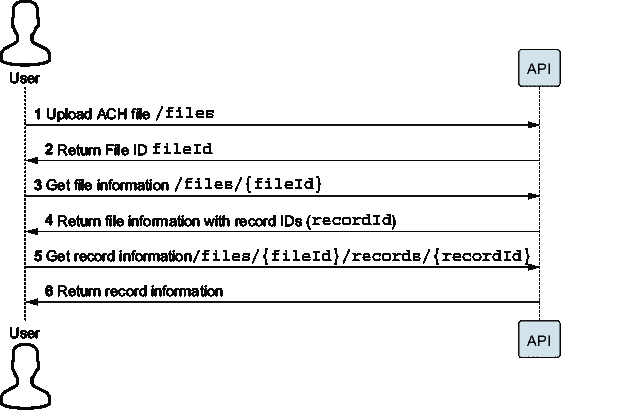
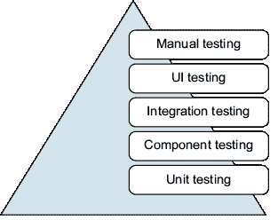
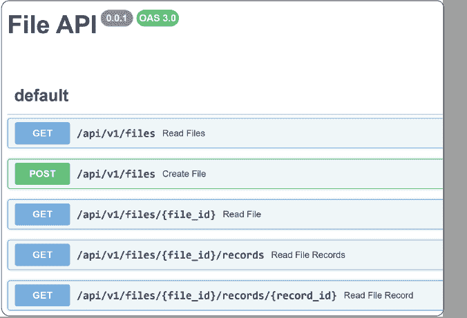
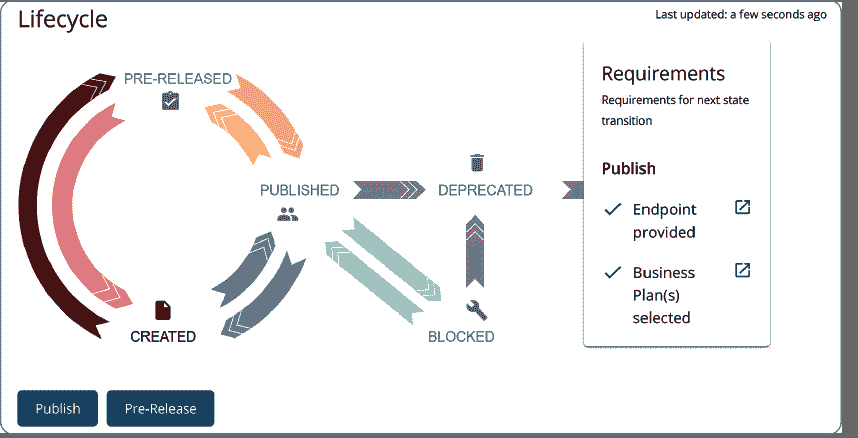
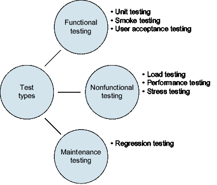
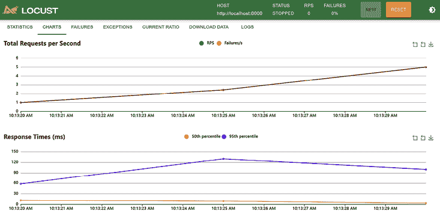

# 第四章：个 API：我们组件之间的管道

### 本章涵盖

+   FastAPI 框架简介

+   使用 OpenAPI 标准记录 API

+   使用 Postman 和 Locust 测试我们的 API

+   使用 WSO2 进行 API 管理

在这个冲刺中，我们致力于另一个研究激增，其中我们探索设计和测试应用程序程序接口（API）。API 简单来说就是与软件组件交互的一种方式。无论我们是在处理微服务和分布式系统，还是使用 `npm`/`pip` 的包，我们都利用 API。

## 4.1 API 驱动设计

通常，当我们在这本书中提到 API 时，我们是在谈论 REST（表示状态传输）API 标准。然而，还有其他标准，例如 GraphQL 和较老的 SOAP（简单对象访问协议）。我们可能还会遇到消息队列，如 IBM Websphere MQ 和 RabbitMQ。表 4.1 展示了一些常见实现 API 方法的好处和坏处。

##### 表 4.1 不同 API 的优缺点

|  | REST | SOAP | GraphQL |
| --- | --- | --- | --- |
| 优点 | 简单；基于标准 HTTP 方法支持多种数据格式，尽管 JSON 是最常用的。 | 依赖于基于 XML 的消息企业级安全 | 高效单一端点强类型 |
| 缺点 | 版本控制和破坏性变更可能难以管理。端点数量可能变得不便。 | 实施复杂基于 XML 的消息 | 学习曲线陡峭 |

API 作为各方同意遵守的合同。API 的消费者同意遵守任何使用条款和许可协议，并遵循提供者建立的任何文档和标准。反过来，API 提供者提供了一个稳定且可扩展的端点以访问。API 订阅还提供了工具，使成本、使用情况和服务水平协议（SLA）透明。

随着分布式计算的应用，许多开发者和架构师对 API 驱动的架构产生了兴趣。通常，我们可以预期我们的软件将被部署在云端或容器化环境中。在这些情况下，我们想要确保我们考虑了 API。与大多数设计目标一样，我们想要记住以下几点：

+   *清晰的用例**—API 不应作为瑞士军刀，能够处理客户、账户和交易。相反，设计应保持简单、直接和一致。

+   *版本控制**—预测版本控制并弃用旧版 API。需要维护多个版本的 API 可能会导致每次更改都增加技术债务。WSO2 API 管理器和 Mulesoft 的 Anypoint 平台等工具可以帮助进行版本控制、治理以及许多其他与 API 相关的任务。

+   *文档**—全面的最新文档确保我们的 API 容易被消费。例如，OpenAPI 等标准允许我们的 API 生成可以通过 Swagger 和 Redoc 等工具在线提供的文档。

+   *性能和扩展性*—我们的 API 应该能够扩展到更大的数据集，这意味着我们可能需要为非常大的数据集引入分页。我们还需要确定 API 请求的可接受等待时间以及如何处理长时间运行的请求。

+   *安全和验证*—记住，一个验证用户输入的 UI 只是战斗的一半。我们需要确保服务器也在验证输入，以防止黑客和不良行为者利用我们的 API。

+   *监控和分析*—确保我们的 API 在用户访问时正常工作并且有足够的容量，这只能通过适当的监控和日志记录来实现。我们可能需要考虑 OpenTelemetry 以及 Prometheus 和 Grafana 等工具来支持我们 API 的可观察性和监控。

还有其他一些考虑因素，API 是一个有很多书籍讨论的主题。在这个阶段，我们只想提供足够的知识，使你在软件开发角色中更加熟练。如果你对 RESTful API 有更多兴趣，请访问[`restfulapi.net/`](https://restfulapi.net/)。如果你想要对 API 有更深入的理解和更多的实践练习，Arnaud Lauret 的《Web API 设计》（2019 年，Manning 出版社）是一本极好的资源。

## 4.2 我们的 API

在开发我们的 API 端点之前，我们会考虑需要执行的任务。在这个阶段，我们不会处理很多复杂任务，而只是上传文件、查看文件和查看记录。表 4.2 显示了我们的 API 可能的样子。请注意，`:fileId`和`:recordId`是其他查询将返回的标识符的占位符。

##### 表 4.2 API 概述

| HTTP 方法 | 统一资源标识符 | 描述 |
| --- | --- | --- |
| `POST` | `/files` | 将文件上传到系统中 |
| `GET` | `/files` | 返回已上传文件的列表 |
| `GET` | `/files/:fileId` | 返回特定文件的详细信息 |
| `GET` | `/files/:fileId/records` | 返回特定文件的记录 |
| `GET` | `/files/:fileId/records/:recordId` | 返回特定记录的详细信息 |

虽然表格提供了我们 API 的良好概述，但考虑这些 API 的流程以及如何获取这些标识符可能会有所帮助。图 4.1 显示了用户与 API 之间的交互。

##### PlantUML

PlantUML ([`plantuml.com/`](https://plantuml.com/)) 是一个创建各种 UML 图（如序列图、用例图、状态图等）以及 UI 原型、甘特图和 WBS 图的出色工具。

PlantUML 是使用这些图的一个很好的工具，因为它是一个基于文本的界面。我们只需在编辑器中输入文本就能生成图表！这意味着它们易于更新，易于存储在版本控制中，并且可以与之前的版本进行比较。我们的 IDE 也有可用的插件，我们经常在 VS Code 中使用这个工具。

在整本书中，我们使用 PlantUML 生成的图表。



##### 图 4.1  由 PlantUML 生成的序列图

希望你现在能更好地理解用户如何使用这些初始 API。这些 API 应该为我们提供项目的良好起点，因为它们满足上传和查看数据的要求。我们可以通过包括查询参数来扩展这些 API，以帮助检索特定数据。例如，我们可能想按日期/时间选择文件，或从特定文件中选择所有批次标题记录。

## 4.3 使用 FastAPI 构建我们的 API

之前，我们使用 FastAPI 构建了一个简单的健康检查 API，但现在我们将更深入地研究 FastAPI，并开始构建我们的 API 来处理 ACH 处理。让我们首先看看构建我们的`GET` API，因为它们应该相对简单，可以提供占位符。换句话说，我们目前不需要数据库。我们可以简单地返回一个硬编码的值，以确保一切按预期工作。

虽然这种方法会给你一些关于 FastAPI 如何工作的基本理解，但这并不意味着我们不会担心诸如分页和异步处理等主题，这些主题在一个完整的生产系统中是必要的，以便拥有一个功能性的 API。目前，请记住，返回大量结果，如数千条 ACH 记录，不仅耗时（导致用户等待数据），而且在 UI 上呈现数据也变得困难。这就是允许分页的概念变得有用的地方。虽然 UI 组件可以处理大量数据集，但也将有必要允许 API 处理数据的一部分请求。同样，上传大量的 ACH 文件可能需要时间来处理，用户将不确定过程是否成功；此外，请求可能从用户端超时。使用异步处理，其中发送响应以让用户知道文件已成功上传，并且进行进一步处理以加载文件，变得至关重要。我们将在第十二章再次涉及这一点。

目前，我们从以下文件夹结构的一个简单项目开始：

```py
ApiSample/
├─ docs/
├─ app/
│  ├─ routers/
│  │  ├─ files.py
│  ├─ __init__.py
│  ├─ main.py
├─ tests/
```

我们确保为我们的 IDE 安装以下要求，这些要求应像使用 Docker 时一样维护在 requirements.txt 中。然而，如果我们只是直接跳入并开始安装 Python 包，那么像 JetBrains Pycharm 这样的 IDE 允许我们根据项目需求创建一个 requirements.txt 文件。在这个冲刺中，我们专注于获得 API 和 FastAPI 的经验，所以现在将包安装到 IDE 中是可行的：

+   `pip` `install` `fastapi`

+   `pip` `install` `pytest`

+   `pip` `install` `httpx`

我们将路由器保存在一个单独的文件夹中，这使得随着应用程序的增长更容易管理。我们也可以参考 YAGNI 原则，通过不使用路由器来保持简单，但鉴于时间和空间限制，我们将稍微提前一点。routers/files.py 包含我们在接下来的章节中将要构建的 API 端点。现在，我们只关注以下列表所示的基本内容。

##### 列表 4.1  基本 FastAPI 路由器

```py
from fastapi import APIRouter  #1

router = APIRouter()  #2
```

#1 从 fastapi 导入 APIRouter，用于定义应用程序的 URI

#2 创建一个用于定义特定 URI 的路由器

然后我们有 main.py，它将引入路由器。接下来的列表显示了如何将路由器集成到应用程序中。

##### 列表 4.2  FastAPI 入口点

```py
from fastapi import FastAPI  #1
from .routers import files  

app = FastAPI() #2

app.include_router(files.router) #3
```

#1 导入创建应用程序和之前定义的路由所需的 fastapi 类

#2 定义应用程序并将其分配给 app

#3 在应用程序中包含我们的路由

使用这个基本结构，我们现在可以看看添加一些路由！

### 4.3.1 使用 GET /files 获取文件

我们的第一个路由应该返回文件列表（以及最终从文件头记录中获取的一些信息）。现在，我们将硬编码一个响应。因为我们已经定义了路由器，所以我们只需要添加以下代码。

##### 列表 4.3  我们的第一个 API 路由

```py
@router.get("/files/")  #1
async def read_files():  #2
    return [{"file": "File_1"}, {"file": "File_2"}] 
```

#1 一个定义 /files/ 路由的装饰器

#2 一个异步函数，用于测试返回硬编码的响应

在这里，我们使用 `@router.get("/files")` 定义了路由，并调用了一个名为 `read_files` 的异步函数，该函数返回一个硬编码的文件 JSON 数组。

为了检查这段代码是否工作，让我们编写一个 `pytest`，如下所示。

##### 列表 4.4  测试我们的第一个端点

```py
from fastapi import FastAPI     #1
from fastapi.testclient import TestClient #1
from app.main import app  

client = TestClient(app)  #2

def test_read_files(): #3
    response = client.get("/files") #4
 assert response.status_code == 200 #5
 assert response.json() == #6
➥[{"file": "File_1"}, {"file": "File_2"}] 
```

#1 测试所需的必要导入

#2 定义 TestClient

#3 定义一个测试来验证 /files 端点

#4 向 /files 端点发送请求

#5 断言响应代码是 200，并且响应符合预期

我们导入 `TestClient` 和我们的应用程序。接下来，我们定义一个客户端，我们可以用它来发送请求。通过调用 `get("/files")`，我们向 URL `/files` 发送了一个 `GET` 请求，这应该是一个有效的端点。我们断言我们收到了 HTTP 状态码 `200`。然后我们有我们的硬编码 JSON 字符串。这应该与我们在 main.py 的端点返回的内容相匹配。即使运行这个测试完美无缺，我们仍然可能怀疑它是否正确地运行或验证我们的数据。当我们刚开始使用单元测试时，这有时可能是一个常见的担忧。我们可以通过更改我们正在检查的状态码（使其不是 `200` 的值）、JSON 字符串、从 `"files"` 的端点或请求类型从 `get` 来玩弄这些值。更改这些值应该导致测试失败，并验证测试是否正在验证我们的逻辑。

##### 测试类型

能够运行单元测试对我们的开发周期有很大的好处。单元测试为我们提供了一个起点，执行代码并完成整个过程——从开始到结束。但这是什么类型的测试：这是一个单元测试、集成测试，还是其他类型的测试？

我们希望您同意这样一个观点：开发者应该测试他们的代码。不同的系统、条件和代码库可能会使测试变得困难，但在极其罕见的情况下，他们才应该在没有某种测试的情况下发布。

在大多数情况下，开发者将主要关注*单元测试*。以下图显示单元测试构成了测试金字塔的基础，这是我们将在其中花费大量时间创建测试的地方，尤其是如果我们遵循测试驱动开发方法。



##### 典型的测试金字塔

*组件测试*可能是之前测试适合的地方。它通常将组件（如 API）隔离，以便我们可以单独评估它，这有助于我们捕捉到更多异常情况，如格式不正确的请求或其他异常条件。

*集成测试*通常测试多个组件，比单元测试或组件测试涉及更多的依赖项。因此，它们主要关注确保组件可以协同工作。

*UI 测试*是下一层。使用自动化工具爬取我们的 UI 验证功能来验证 UI，这类似于用户在应用程序中完成各种任务，这并不令人惊讶。

在金字塔的顶部，我们有*手动和探索性测试*。这是我们在尝试找到破坏软件或查找界面和行为不一致的方法的地方。

我们在这里只是简要地提到了一些主要的测试类别。还有其他类型的测试和分解方法，我们将在稍后介绍。

最后要注意的一点是，随着我们向上移动金字塔，测试变得越来越不独立、越来越慢、越来越脆弱。我们使用“脆弱”一词来表示测试变得越来越难以自动化，并且更有可能因为其不断变化的本性而崩溃。

测试类别的重要性仅在于设置量和测试运行所需的时间。金字塔底部的测试通常比较独立且运行速度快。因此，目前，由于 API 返回的是硬编码的值，运行这个测试作为单元测试是很容易的。一旦我们进一步发展，需要从数据库或其他 API 检索数据，组件开始发挥作用，这个测试可能不适合作为我们的开发测试套件的一部分运行，而应该作为持续集成和持续交付（CI/CD）管道的一部分运行。

虽然我们认为这些测试作为单元测试是有用的，但现实情况是，我们可能希望以 BDD 风格的测试来处理这个问题，因为它们可以被认为是更高级别的测试。

在确保`pytest-bdd`已安装（`pip install pytest-bdd`）后，我们在测试目录下创建一个`features`文件夹和一个`step_defs`文件夹。我们的测试文件夹的目录结构现在应该看起来像这样。

```py
tests/
├─ features/
│  ├─ files.feature
├─ step_defs/
│  ├─ test_files_feature.py
```

`files.feature`将存储我们的场景，以便我们可以处理/files 端点。记住，我们在这个文件中使用`Given/When/Then`格式定义了特性和各种场景。以下列表是一个确保状态码的简单示例。

##### 列表 4.5  BDD 测试的特性文件

```py
Feature: API /files

  Scenario: I get a 200 status code when we call /files
    When I make a GET request to the endpoint /files
    Then the status code should be 200
```

接下来，为了激活特性文件，我们在 test_files_feature.py 中创建相应的步骤定义。

##### 列表 4.6  BDD 测试的步骤定义

```py
import pytest    #1
from pytest_bdd import scenarios, when, then, parsers #1
from fastapi.testclient import TestClient #1
from app.main import app #1

client = TestClient(app)

scenarios("../features/files.feature") #2

@pytest.fixture #3
def api_response():  #3
    return {}  #3

@when(parsers.parse('I {http_request_type} the endpoint {endpoint}')) #4
def when_http_request_to_endpoint( #5
    api_response,  #5
 http_request_type, #5
  endpoint #5
):  #5
    if http_request_type == "GET":  #5
        response = client.get(endpoint)  #5
    else:  #5
        raise NotImplementedError #5
    api_response["data"] = response #5

@then(parsers.parse("the status code should be {status_code:d}")) #6
def then_the_status_code_is(api_response, status_code): #7
    assert (  #8
        api_response["data"].status_code == status_code #8
    ), f"Expected {status_code}, but got  
{when_http_request_to_endpoint.status_code}"  #8
```

#1 导入测试所需的模块

#2 加载我们在列表 4.5 中定义的特性

#3 创建一个固定值来存储 API 的响应；哈希将为空。

#4 使用“when”装饰器来处理特性文件中的条件。注意，端点是从特性文件中提取的，将是/files。

#5 目前，我们只处理 GET 请求，对于其他任何请求都将抛出异常。我们将重新访问此行以添加所需的功能。注意，API 的响应存储在我们的 api_response 固定值中。

#6 使用“then”装饰器来处理特性文件中的“then”短语。注意，我们在特性文件中指定的状态码被替换为 status_code。

#7 检查状态码是否是我们预期的，即特性文件指定的应该是 200

在这里，我们加载了`files.feature`并定义了处理特性文件中的`when`和`then`的函数。此外，我们有一个固定值来存储 API 响应，以便在调用之间使用。注意，尽管我们编写了`when`以接受多种类型的 HTTP 请求，但我们目前只支持 GET 请求。随着我们创建一个更健壮的 API，它包含`POST`、`PUT`和`DELETE`请求，我们需要扩展它，否则我们将收到`NotImplementedError`。

再次，我们可能想要尝试将`GET`请求改为其他请求的场景，只是为了看到`NotImplementedError`，然后更改状态码或端点，以了解我们可能在编码时遇到的不同场景。

### 4.3.2 使用 POST /files 添加文件

我们现在通过向同一/files 端点发送`POST`请求来扩展我们的示例。这种方法可能被用来上传我们的 ACH 文件。由于我们已经有了一个现有的端点和测试，让我们看看我们可能如何从更行为驱动的开发方法来处理这个任务。当处理`POST`请求时，我们通常看到`201`状态码，这意味着“已创建”。由于我们正在上传文件并期望它在服务器上存储，因此`201` `CREATED`响应对我们来说是合适的。因此，我们可以更新特性文件，如下列所示的场景。

##### 列表 4.7  `POST`请求的 BDD 测试

```py
  Scenario: I get a 201 status code when we post to /files #1
    When I make a POST request to the endpoint /files #2
    Then the status code should be 201 #2
```

#1 我们在这里重用了相同的特性文件，因此我们不需要调整任何“when”或“then”装饰器。

当我们运行这个测试时，我们首先应该收到 `NotImplementedError`，因为我们没有处理客户端发出的 `POST` 请求，我们现在用以下代码解决这个问题。

##### 列表 4.8  更新我们的步骤以支持 `POST` 请求

```py
    if http_request_type == "GET": #1
        response = client.get(endpoint) 
    elif http_request_type == "POST": #2
        response = client.post(endpoint, json={"file": "File_4"}) 
    else: #3
        raise NotImplementedError
    api_response["data"] = response
```

#1 对之前请求的处理保持不变。

#2 现在我们添加一种处理 POST 请求的方法。

#3 当开发者尝试执行我们尚未编写的功能时，会继续提醒开发者

现在我们正在发送 `POST` 请求，我们应该从我们的服务器收到一个错误，因为我们实际上没有处理 `POST` 请求。请注意，在之前的代码中，我们使用了一个硬编码的 post 值用于请求。最终，我们将更新测试以使其动态化，但就目前而言，我们只想得到基本设置。再次运行我们的测试会导致测试失败，因为我们收到了 `405` `METHOD` `NOT ALLOWED` 状态码：

```py
Expected :201
Actual   :405
```

这完全合理，因为我们实际上并没有编写服务器代码来处理我们的 `POST` 请求。让我们跳转到 `app/routers/files.py` 并实现它（在继续之前，你可以尝试一下）。

##### 列表 4.9  定义我们的 `POST` 端点

```py
from fastapi import APIRouter, Request #1
... #2
@router.post("/files/") #3
async def create_file(request: Request):  #3
    return {"file": "File_3"}  #3
```

#1 更新导入以包括请求对象

#2 之前的端点实现

#3 创建一个用 POST 动词和 URI 装饰的函数，现在将返回一个硬编码的值

重新运行测试仍然失败，但这次是因为我们返回了一个 `200` 状态码。

```py
Expected :201
Actual   :200
```

从技术上讲，这是可以的，因为我们没有创建任何东西。然而，让我们看看我们如何更新状态码，因为我们将在未来创建数据。我们将更新 `files.py` 以包含对 `status` 的导入，并更新 `@router.post`，如下所示。

##### 列表 4.10  支持状态 `201`

```py
from fastapi import APIRouter, Request, status #1
… #2
@router.post("/files/", status_code=status.HTTP_201_CREATED) #3
```

#1 我们从 fastapi 导入那个状态对象。

#2 之前的代码

#3 我们更新装饰器以指定状态码和 20 1 。

设置 `status_code` 将在所有情况下返回 `201`，现在我们可以重新运行我们的测试，并看到它通过了。请注意，以这种方式设置状态码将导致此端点始终返回 `201`。稍后，当我们扩展我们的 API 时，我们将探索其他设置状态码的方法，以便我们可以更精细地控制它们。这种更精细的控制将允许我们在 API 中遇到错误时指定额外的状态码。

### 4.3.3 完成其余的 API

在上一节中，我们创建了两个 API 来支持获取硬编码的文件列表和上传文件。你应该有足够的关于基础知识的了解来创建剩余的端点和单元测试。花几分钟时间为剩余的端点创建一些单元测试，然后编写剩余的 API 代码，以使这些测试通过。

## 4.4 将我们的 API 添加到 Docker

太棒了！现在我们已经构建了端点，我们可以在 Docker 容器中运行这些 API。在第二章中，我们获得了大量的 Docker 经验，所以我们可以在这里使用它。本质上，我们只需要将上一章中的 API 容器更新为我们这里所做的代码。让我们看看如何将这段代码在 Docker 中运行起来。

### 4.4.1 准备项目

我们已经测试了我们的代码，应该对部署感到舒适。对测试套件的信心是持续集成和交付所必需的。如果你在所有测试通过后对部署代码感到不舒服，问问自己为什么。然后找出你需要采取的额外步骤和安全措施。我们可能需要额外的测试来覆盖边缘情况、负载测试、更好的覆盖率、静态代码分析等。自动化测试的想法是帮助提高软件交付时间和质量。

因此，我们应该准备好部署代码。然而，我们之前使用 Uvicorn 来运行 FastAPI 应用程序。记住，Uvicorn 是 ASGI（异步服务器网关接口）兼容的，并且与 FastAPI 相辅相成。为了完整性，我们需要在我们的当前项目中包含它。通过在我们的项目中安装它，我们将能够生成项目的要求列表。所以，确保使用`pip install uvicorn`来安装它。

在添加了额外的依赖项之后，我们希望创建一个列表，列出将在容器上安装的要求。记住，我们之前试图将 Docker 镜像的大小保持最小；此外，我们永远不应该只假设我们的项目所需的包存在于服务器上。一些 IDE 将提供生成和管理 requirements.txt（Python 要求的标准命名约定）的选项。然而，如果我们的 IDE 没有提供，我们总是可以从命令行使用`pip freeze > requirements.txt`来生成它。一旦我们这样做，我们就可以审查要求，确保我们有我们想要的包。例如，我们可能想确保`uvicorn`和`fastapi`存在。请注意，我们可能会看到由于我们安装的其他依赖项而出现的额外要求。

拥有 requirements.txt 和应用程序文件夹，我们应该有在 Docker 中运行此代码所需的一切。

### 4.4.2 Docker 设置

使用我们之前的 Docker 经验（我们可以复制我们已有的设置或从头开始），我们最终得到一个类似于以下结构的文件夹：

```py
api/
├─ app/
├─ Dockerfile
├─ requirements.txt
docker-compose.yml
```

应用程序代码将存放在 app 文件夹中。目前，我们只需要几个源文件：main.py、files.py 以及相关的 __init__.py。尽管很可能存在一些特定于 IDE 的额外文件，但无需复制这些文件。

Dockerfile 是所有重头戏发生的地方，但由于我们的结构相同，我们不需要做任何更改。

##### 列表 4.11  我们的 Dockerfile

```py
FROM python:alpine #1

WORKDIR /code #2

COPY ./requirements.txt /code/requirements.txt #3

RUN apk -U upgrade   #4
RUN apk add --no-cache libpq-dev python3-dev gcc musl-dev
RUN pip install --upgrade pip #5#6
RUN pip install --no-cache-dir --upgrade -r requirements.txt

COPY ./app /code/app #7

CMD ["uvicorn", "app.main:app", "--host", "0.0.0.0", "--port", "8000"] #8
```

#1 使用我们的 Python 镜像的 alpine 版本，因此镜像的大小减小

#2 确保我们为容器设置了工作目录

#3 将需求复制到镜像中

#4 更新镜像并添加我们的额外依赖项

#5 更新 pip 并安装需求

#6

#7 将应用程序代码复制到镜像中

#8 使用我们的应用程序启动 uvicorn 并将其绑定到端口 8000

接下来，我们希望 docker-compose.yml 文件能为我们管理服务的构建。目前我们只有一个服务：

```py
services:
  api:
    build: 
      context: ./api
      dockerfile: Dockerfile  
    ports:
      - 8000:8000
```

一旦这些设置到位，我们应该能够运行常规的 `docker-compose` `build` 和 `docker-compose up` 命令来启动我们的容器。在将浏览器导航到 http://localhost:8000/files/ 后，我们应该看到返回的硬编码值。在我们的例子中，它是 `[{"file":"File_1"},{"file":"File_2"}]`。

## 4.5 记录我们的 API

太好了！我们正在稳步前进。虽然我们的大部分 API 都是硬编码的，但我们将继续在前进的过程中对其进行改进。然而，硬编码的值只是使我们的 API 无法使用的一部分。我们主要的问题是没有人知道这一点，如果他们知道了，他们将如何使用它？我们需要文档，而 OpenAPI ([`www.openapis.org/`](https://www.openapis.org/)) 就是我们救星。这是一个允许我们创建交互式文档的标准，并让其他人发现 API 是如何工作的，以及它是如何生成客户端代码和服务器端代码的，以及其他事情。

记得章节开头提到的 API 驱动设计吗？嗯，我们可以提供一个 OpenAPI 规范来生成不仅会消费该 API 的客户端代码，还包括处理这些请求的服务器端代码的起点。随着我们的 Docker 容器启动并运行，我们应该能够直接支持基于 OpenAPI 规范的两种文档格式。我们将在接下来的几节中介绍这两个文档框架。

### 4.5.1 Swagger

Swagger 是一组用于实现 OpenAPI 定义的工具，但由于历史原因，许多人可能仍然将 OpenAPI 定义称为 Swagger 规范、Swagger 定义或仅仅是 Swagger。你可能会发现自己使用的一个最有用的工具是 Swagger Editor ([`editor.swagger.io/`](https://editor.swagger.io/))，它提供了 OpenAPI 定义和结果输出的并排视图。我们可以通过导航到 http://localhost:8000/docs 来浏览 FastAPI 生成的 Swagger 文档。从那里，我们可以查看文档并尝试使用 API。然而，在这种情况下，我们想要点击链接，该链接应带我们到 http://localhost:8000/openapi.json 并显示 OpenAPI JSON。我们可以保存或直接复制粘贴到在线 Swagger 编辑器中。图 4.2 是我们看到的示例截图。



##### 图 4.2 在线 Swagger 编辑器

你可以尝试编辑 API 来加深理解。注意，在线编辑器会提示我们将 JSON 转换为 YAML。我们不必这样做，但这确实使就地编辑变得容易一些。

FastAPI 框架支持多种方式来自定义此文档，我们将在稍后探讨这一点。

### 4.5.2 Redoc

FastAPI 还支持 Redoc，这是一个免费的开源工具，用于创建文档。它提供了一个响应式的三个面板视图，这在处理大型 API 时特别受欢迎。同样，FastAPI 自带提供此文档，我们可以通过访问 http://localhost:8000/redoc 来查看它。图 4.3 显示了我们的示例 API 文档。


##### 图 4.3  使用 Redoc 的 FastAPI 文档

流行支付服务 Stripe 使用类似的三个面板视图来展示他们的 API。然而，他们创建了一个名为 Markdoc（[`markdoc.dev/`](https://markdoc.dev/））的工具，帮助生成他们的文档。还有更多工具用于处理 API 文档和一般文档。未来主义金融科技可能已经为这个目的提供了多个工具，因此我们希望遵循我们公司的当前标准，并在需要时建议新的工具。

### 4.5.3 API 文档有什么好处？

文档是那些可能很难做对的事情之一，这就是为什么 FastAPI 提供 OpenAPI 文档的能力如此出色。为什么？因为我们能够解决主要文档痛点之一，即它很快就会过时。使用 FastAPI，我们可以装饰我们的函数，使它们生成文档，这意味着我们不太可能使文档显示的内容与代码执行的内容不同步。

但这还不是全部。我们实际上只是触及了可用的基本内容。除了能够交互式地查看 API 并尝试它们之外，这里还有一些其他酷炫的功能：

+   提供以 URL 或电子邮件地址形式存在的联系信息，供最终用户使用

+   关于你的 API 的许可信息

+   指向不同的服务器（例如，测试服务器、沙盒或生产服务器）

+   提供请求/响应示例

+   生成服务器端代码以处理对 API 的请求

+   生成客户端代码以与 API 交互

这些只是符合 OpenAPI 规范设计的 API 的一些有趣特性。要了解更多信息，请参阅 Joshua S. Ponelat 和 Lukas L. Rosenstock 合著的《使用 Swagger 和 OpenAPI 设计 API》（2022 年，Manning）。

## 4.6 管理我们的 API

到目前为止，我们的 API 很小，只包含一个`POST`请求和四个`GET`请求。随着我们的 API 的增长，我们需要制定一个管理策略。这最好在早期确定，因为一旦 API 投入生产并被客户使用，就变得难以控制。之前，我们提到了管理 API 的挑战，如版本控制、文档、监控等。我们引入 API 管理软件的使用，以便您对其功能有所了解。我们将 API 管理作为一个总称，涵盖工具中发现的组件。

我们将把 WSO2 的 API 管理器（[https://wso2.com/](https://wso2.com/)）集成到我们的解决方案中，以突出使用 API 管理器的某些好处。有许多 API 管理解决方案，但我们已经在金融科技行业直接与 WSO2 和 Mulesoft Anypoint（[`mng.bz/4a2V`](https://mng.bz/4a2V)）合作。

WSO2 解决方案很容易集成到我们的解决方案中。此外，WSO2 的文档和教程信息量很大。正如之前提到的，使用 Docker 使得更换组件变得容易。请随意将其他 API 管理器集成到您的解决方案中，这些 API 管理器可能更适合您的环境。与 API 管理器合作的基础机制和好处应该是普遍适用的。

### 4.6.1 API 管理的优势

API 管理器可以提供更集中的方法来管理您的 API。如果您的业务有多个应用程序，它们可能运行在不同的服务器上，需要不同的身份验证，并且从网络角度来看，向外界暴露多个点。API 管理器提供了一种集中管理 API 的方法。它们提供帮助货币化 API、通过速率限制（这也可以通过提供不同层来用于货币化）来防范潜在攻击以及提供身份验证/授权的功能。

在大型企业中管理 API 的另一个方面是为我们的用户提供一个中心位置进行访问。如果我们公司有明确的服务和业务单元，它们很可能有不同服务器处理它们的 API，但仍然希望为用户提供单一体验。我们可以将所有 API 发送到单个端点，然后 API 管理器可以将请求定向到您网络中的适当服务器。

一旦我们的请求通过一个集中位置流动，我们就可以为用户提供额外的便利。其中之一是为最终用户提供一个通用的界面来查看和管理 API。如果您有使用像 Google API 这样的 API 的经验，您应该知道它们提供了一个控制台来订阅各种 API。有时，随着公司成长并收购其他公司或合并，多个产品可能属于同一公司，但提供的是不连贯的体验。通过使用 API 管理器，客户可以在一个位置查看所有 API 产品。

除了更好的用户体验外，API 管理器还为我们的 API 提供了更多的分析。我们可以找出调用的次数、正在使用的 API 版本以及大量其他见解。这些分析可以带来额外的收益，如速率限制、负载均衡和货币化。许多 API 提供按使用付费的模式，我们根据 API 使用情况付费。API 管理器有助于促进这一货币化过程。

最后，生命周期管理是使用第三方工具如 WSO2 的另一个好处。拥有一个帮助执行良好生命周期管理实践的工具有助于为您的客户和开发者提供更好的体验。我们可以看到 API 的不同阶段，并在不同状态之间移动 API。如图 4.4 所示，我们有一个当前处于发布状态的 API，可以选择将其恢复到创建或弃用状态。

### 4.6.2 将 WSO2 API 管理器添加到我们的项目中

首先，我们将 WSO2 添加到我们的 Docker 设置中，创建一个名为 wso2 的新文件夹，并将以下 Dockerfile 放在那里：

```py
FROM wso2/wso2am:latest
```

我们的 Dockerfile 中没有太多内容，但为了保持一致性，我们继续使用与之前设置相同的布局。真正的工作发生在我们的 docker-compose.yml 文件中，我们在其中添加了 WSO2 服务：

```py
  wso2:
    build: 
      context: ./wso2
      dockerfile: Dockerfile  
    ports:
      - 9443:9443 # Management Console
      - 8243:8243 # HTTPS Requests
      - 8280:8280 # HTTP Requests
```

`port` `9443` 是管理控制台，我们将在这里进行大部分工作，其他端口（8243/8280）是确保为相应请求类型公开的默认端口。一旦我们完成常规的 `docker-compose` `build` 和 `docker-compose` `up` 命令，我们应该能够使用默认用户名和密码 `admin/admin` 登录。



##### 图 4.4  WSO2 的生命周期管理

### 4.6.3 OpenAPI 版本

在定义我们的 API 到 WSO2 时，我们遇到了一个问题：`OpenAPI` `content` `validation` `failed!` 我们将 OpenAPI 规范加载到在线 Swagger 编辑器中，并收到错误 `Structural` `error` `at` `openapi` `should` `match pattern "³\.0\.\d(-.+)?$"` `pattern:` `³\.0\.\d(-.+)?$`。

在线 Swagger 编辑器提供了更多信息，尽管对于那些没有正则表达式经验的用户来说可能有点晦涩，但它指出版本号不正确。似乎我们的 WSO2 Docker 镜像和 Swagger 编辑器目前都不支持最新版本，但我们的 FastAPI 容器支持。为了确保我们使用的是正确版本，我们可以再次检查 OpenAPI 网站。

ChatGPT 知道最新版本，当我们发布规范并询问它“这是一个有效的 OpenAPI 规范吗？”时，我们收到了以下回复：

**** 您发布的 OpenAPI 规范相当广泛，乍一看，似乎是根据 OpenAPI 3.1.0 规范正确构建的。然而，这样的规范中存在一些细微之处和细节，必须正确才能使其有效。以下是一些关键点和在如此详细的规范中需要检查的常见问题。

出于好奇，我们还尝试输入了一个无效的 OpenAPI 版本（一个更高的数字），ChatGPT 说这不是有效的。

我们可以以几种方式解决这个问题。可能有一个更新的 WSO2 版本支持 3.1.0 版本。然而，在生产环境中，这可能并不总是实际或快速。我们可以将 FastAPI 降级到之前的版本，但让我们假设我们需要在当前版本中的功能或错误修复。在这种情况下，我们可以更新我们的 API 以报告 3.0.0 版本。我们也可以在将其上传到 WSO2 之前手动更新生成的文档。然而，WSO2 内部也有一个选项可以直接访问 URL，我们希望能够使用它。

我们更新了 main.py，添加了以下内容。

##### 列表 4.12 调整 OpenAPI 版本

```py
from fastapi.openapi.utils import get_openapi #1
… 
def custom_openapi(): #2
    if app.openapi_schema: 
        return app.openapi_schema
    openapi_schema = get_openapi(  #3
        title="File API",  #3
        version="0.0.1",  #3
        routes=app.routes,  #3
        openapi_version="3.0.0" #4
    )
 app.openapi_schema = openapi_schema
 return app.openapi_schema

app.openapi = custom_openapi
```

#1 导入 get_openapi 以允许我们自定义 OpenAPI 文档；我们的代码保持不变。

#2 定义一个自定义方法

#3 在调用 get_openapi 时，这些字段是必需的。

#4 这是更新 OpenAPI 版本的方法，并且我们必须修复 WSO2 API 管理器的问题。

这样一来，如果我们重新构建并重启 Docker，在查看 JSON 时应该看到`"openapi":"3.0.0"`而不是`"openapi":"3.1.0"`。我们还应该在在线 Swagger 编辑器中看到错误已解决。现在，我们可以继续在 WSO2 中创建 API。

### 4.6.4 在 WSO2 中创建一个 API

我们可以通过以下步骤创建一个 API：

1.  点击创建 API 按钮。

1.  在 REST API 下，点击导入 Open API。

1.  对于 OpenAPI URL，输入 http://api:8000/openapi.json。我们应该看到系统已验证该 URL。

1.  输入一个名称（这是 API 在 WSO2 中将被识别的名称）：

    1.  上下文是区分 WSO2 中 API URL 的一种方式。

    1.  API 的版本。

    1.  端点应该是 http://api:8000。

1.  点击创建。

1.  在左侧面板下，在部署下点击部署。

1.  点击部署。

1.  在左侧面板下，在测试下点击试用：

    1.  我们将被引导到一个与之前看到的类似的 Swagger 文档屏幕。

    1.  点击生成密钥。

1.  尝试运行你的 API。

在此 API 就绪后，需要注意的事情是，我们不再直接向我们的后端 http://api:8000 发送请求。相反，我们将向 https://localhost:8243/sample/0.0.1/files 发送请求，这是 API 管理器，我们选择的环境，版本和我们的 API。如果我们保留 API 管理器，我们将停止在 Docker 中暴露`端口` `8000`，这样就可以强制任何有兴趣使用 API 的人通过单一入口点。

注意，根据我们目前设置的配置，我们不会在管理器中永久保存 API。所以，记住如果我们花费大量时间设置和配置 API，我们所做的一切都不是永久的。我们只是想设置这个沙盒，因为我们相信，对于你来说，有一些 API 管理工具的经验是有益的，因为你很可能会遇到它们，尤其是在大公司中。

### 4.6.5 故障排除

当与 API 管理器一起尝试 API 时，最常见的错误是

```py
  "code": "900902",
  "message": "Missing Credentials",
  "description": "Invalid Credentials. Make sure your API invocation call 
has a header: 'Authorization : Bearer ACCESS_TOKEN' or 'Authorization : 
Basic ACCESS_TOKEN' or 'apikey: API_KEY'"
}
```

“缺少凭证”错误是由于在测试 API 之前没有选择生成密钥而引起的。在生产环境中与 API 一起工作时，我们必须通过仪表板或另一个 API 生成密钥来使用 API。在尝试我们的 API 时，我们只是简单地生成一个临时令牌，用于短时间内使用。

通过 API 管理器或通过 OpenAPI 文档页面进行工作是一种进行初步评估和探索性测试的有帮助的方式。然而，一旦我们确定了将要使用的 API，我们就需要开始使用更多专业化和提供更强大功能的额外工具。以下部分展示了我们将要使用的一些额外工具。

## 4.7 使用 Postman 进行测试

Postman API 平台是一个流行的工具，用于协助 API 生命周期管理，以及开发人员与其他团队之间的协作，以及 API 治理。我们主要将其用于测试功能，尽管该平台提供了许多其他功能。

我们最喜欢的一个功能是能够`导入`/`导出`命令的`curl`版本。`curl`是一个无处不在的命令行实用程序，它允许我们使用各种协议获取或发送数据。许多系统管理员在解决网络/路由问题时，会要求你提供`RESTful API`调用的`curl`等效命令，因此能够快速轻松地生成一个对于整个团队来说可能是有帮助的。

与团队成员之间的协作在 Postman 中也同样容易，我们已经与我们的 QA 部门紧密合作，帮助开发可用于组件和集成测试的测试脚本。让我们看看我们如何使用 Postman 验证从我们的 API 返回的数据。这与我们在开发时可能进行的单元测试类似。然而，视角是不同的，因为这些可能作为更大型的 CI/CD 管道的一部分或作为 QA 测试过程的一部分运行。

我们将继续使用 http://localhost:8000/files 作为我们的示例。当然，我们也可以接受挑战，使用 API 管理层构建一个 Postman 测试。在 Postman 中，我们可以创建一个用于分组各种请求的集合。然后我们可以创建一个新的`GET`请求，指向 http://localhost:8000/files 并点击发送。我们应该看到一个格式良好的 JSON 响应，我们在这里进行了简化：`[{"file":"File_1"},{"file":"File_2"}]`。

一旦我们确认我们已成功连接并从端点接收响应，我们也可以添加一些测试：点击“测试”标签页，你可以添加一些简单的测试来了解语法是如何工作的。首先，让我们使用以下列表来测试我们是否有一个有效的`200`响应代码。

##### 列表 4.13  样本 Postman 测试

```py
pm.test("Response should be JSON and have a 200 status code", function () {
    pm.response.to.be.json; #1
    pm.response.to.have.status(200); #2
});
```

#1 检查响应格式是否为 json

#2 检查响应状态是否为 200

在发送我们的请求时，我们应该看到测试结果标签页已填充，并且我们有一个通过测试。我们添加了更多测试，如以下列表所示。

##### 列表 4.14  更多 Postman 测试

```py
pm.test("Response should have a file attribute", function () {
    pm.expect(jsonData[0]).to.have.property('file');
});

pm.test("file attribute should be 'File_1'", function () {
    pm.expect(jsonData[0].file).to.eql('File_1');
});

pm.test("Response has at least 2 items", function () {
    pm.expect(jsonData).to.be.an('array').that.has.lengthOf(2);
});
```

其中一些测试是脆弱的——这意味着它们可能很容易被数据或顺序破坏——因此我们预计此代码将在已知数据上运行。让我们使用查找`File_1`的测试来使其更加健壮。因为我们的数据在数组中，我们应该保证在解析时我们总是按该顺序解析它们，而不是对象，其中`key`/`value`对可能不会总是以我们看到的方式返回。然而，JSON 的顺序取决于我们无法控制的因素。我们可能保证存在一个`File_1`，但它可能并不总是首先返回。我们如何编写一个更健壮的测试？如果我们使用`for-each`循环遍历数组会怎样？

##### 列表 4.15  在 Postman 中使用`for-each`循环

```py
pm.test("There should be one instance of File_1", () => {
    let found = false;
    jsonData.forEach(function(item, index) {
        pm.expect(item).to.have.property("file");
        if ( item.file === 'File_1' ) {
            found = true;
        }
    })
    pm.expect(found).to.be.true;
})
```

现在我们定义一个变量来指示我们是否找到了我们想要的项目，这样无论它在数组中的位置如何，我们都能找到它。这是一个更灵活的测试，并且根据你对语言的熟悉程度，这可能是你的第一次尝试，并且由于它有效，这可能就足够了。然而，我们可以使用`some`方法稍微澄清测试。

##### 列表 4.16  清理我们的测试

```py
pm.test("There should be one instance of File_1 using some", function () {
    const expectedValue = 'File_1';
    const result = jsonData.some(function (item) {
        return item.file === expectedValue;
    });
    pm.expect(result).to.be.true;
})
```

注意，`some`方法是 ECMAScript 5+的一部分，并且可以在 Postman 之外使用。我们发现使用 Postman 和这些测试脚本是一种介绍新 QA 资源到某种自动化方式的绝佳方式。我们只是触及了 Postman 所能提供的表面；它是一个我们在各种 FinTech 公司以及其他行业中看到使用的优秀工具。

## 4.8 使用 Locust 进行负载测试

之前，我们介绍了测试金字塔，它主要包含我们会考虑的功能性测试类型。在这里，我们介绍负载测试，它属于非功能性测试类别。图 4.5 概述了一些测试类型。



##### 图 4.5 软件测试类别

我们想确保我们的 API 将是响应的，看到性能瓶颈可能在哪里，并确定系统的容量以供未来规划。为此，我们可以参考一个名为 Locust 的框架。Locust 允许我们使用我们正在发展的 Python 技能来编写用于负载测试的测试脚本。

我们可以通过告诉 ChatGPT “为 http://localhost:8000/files 端点创建一个 Locust 测试示例” 来轻松开始，这提供了一些易于遵循的步骤。首先，我们想要使用 `pip install locust` 安装 Locust。同时，我们创建一个 locustfile.py 文件，如下所示。

##### 列表 4.17  简单的 Locust 文件

```py
from locust import HttpUser, task, between

class FileUser(HttpUser):
    wait_time = between(1, 2.5)

    host = "http://localhost:8000"

    @task
    def get_files(self):
        self.client.get("/files")
```

在 locustfile.py 目录下运行命令 `locust`。这将提示你打开浏览器到默认位置 http://localhost:8089。在这里，我们将输入用户数量、孵化率、主机以及它应该运行多长时间（我们点击了“高级选项”）以获取（见图 4.6）。


##### 图 4.6  使用 Locust 启动新的测试

从那里，我们可以看到测试运行并获得关于我们的 API 性能的指标。显然，在这种情况下，我们正在处理硬编码的值，所以我们将在稍后有机会回来探索我们的 API 的负载测试。然而，我们现在可以继续使用 Locust 和负载测试来获得一些经验。我们能否为其他端点添加测试？如果我们需要提醒它们是什么或者它们应该返回什么，不要忘记我们的实时文档在 http://localhost:8000/docs。通过添加额外的测试，我们的代码应该看起来像下面的列表。

##### 列表 4.18  Locust 测试

```py
from locust import HttpUser, task, between

class FileUser(HttpUser): #1
    wait_time = between(1, 2.5) #2

    host = "http://localhost:8000" #3

    @task #4
    def get_files(self): #5
        self.client.get("/files")  #6

    @task
    def get_file(self):
        self.client.get("/files/1")

    @task
    def post_file(self):
        self.client.post("/files", json={"file_id": 5})

    @task
    def get_records(self):
        self.client.get("/files/1/records")

    @task
    def get_record(self):
        self.client.get("/files/1/records/1")
```

#1 创建一个继承自 HttpUser 的 FileUser 类

#2 在请求之间设置一个 1 到 2.5 秒的随机等待时间，以模拟用户在动作之间的暂停

#3 定义 API 请求将发送到的主机

#4 任务装饰器定义了一个用户模拟的动作。

#5 对

/files URI

现在，我们可以重新运行 Locust 来查看它正在击中各种端点。虽然我们的端点目前是硬编码的，但它们将返回使用的路径参数。所以，为了使事情更有趣，让我们为这些测试中的每一个添加一些代码，使得参数是唯一的，这样我们就可以在 Locust 控制台中看到更多的端点被击中。花几分钟时间看看你是否可以用随机数替换硬编码的 `file_ids` 和 `record_ids`，然后重新运行测试。下面的列表显示了我们所提出的示例。

##### 列表 4.19  Locust

```py
import random
from locust import HttpUser, task, between

class FileUser(HttpUser):
    wait_time = between(1, 2.5)
    host = "http://localhost:8000"

    @task
    def get_files(self):
        self.client.get("/files")

    @task
    def get_file(self):
        file_id = random.randrange(1, 10) #1
        self.client.get(f"/files/{file_id}")

    @task
    def post_file(self):
        file_id = random.randrange(1, 10)
        # Sending POST request to the "/files" endpoint
        self.client.post("/files", json={"file_id": file_id})

    @task
    def get_records(self):
        file_id = random.randrange(1, 10)
        self.client.get(f"/files/{file_id}/records")

    @task
    def get_record(self):
        file_id = random.randrange(1, 10)
 record_id = random.randrange(1, 20)
  self.client.get(f"/files/{file_id}/records/{record_id}")
```

#1 在 1 到 9 的范围内生成一个随机的 file_id

重新运行我们的测试后，我们可以看到访问端点的更多多样性。在这个时候，我们可能已经注意到了在 Locust 控制台中执行测试时出现的问题。如果没有，请查看 Locust 的“失败”选项卡。你应该会看到 `/files` 上 `POST` 方法的多个失败，错误信息为 `HTTPError('405 Client Error: Method Not Allowed for url: /files')`。看起来我们在我们的 API 代码中遗漏了一些东西。但在检查它之前，让我们看看 Locust 测试的另一个大问题——没有 `assert` 语句。

与我们所有的其他测试一样，我们想要确保我们进行了一些 `assert` 语句。让我们先确保每次都得到一个有效的响应。在继续阅读之前，不妨试一试。

##### 列表 4.20  Locust 测试

```py
…  #1
@task #2
def get_files(self): #3
   response = self.client.get("/files")  #3
   assert response.status_code == 200,  #3
      f"Unexpected status code: {response.status_code}"  #3

@task
def get_file(self):
   response = self.client.get(f"/files/{file_id}")
   assert response.status_code == 200, 
      f"Unexpected status code: {response.status_code}"

@task
def post_file(self):
   response = self.client.post("/files", json={"file_id": file_id})
   assert response.status_code == 200, 
      f"Unexpected status code: {response.status_code}"

@task
def get_records(self):
   file_id = random.randrange(1, 10) #4
   response = self.client.get(f"/files/{file_id}/records")
   assert response.status_code == 200, 
      f"Unexpected status code: {response.status_code}"

@task
def get_record(self):
   file_id = random.randrange(1, 10) #5
 record_id = random.randrange(1, 20) 
 response = self.client.get(f"/files/{file_id}/records/{record_id}")
 assert response.status_code == 200, 
      f"Unexpected status code: {response.status_code}"
```

#1 列表 4.1 9 中的先前代码设置

#2 使用 Locust 任务装饰器定义 Locust 应该执行的内容

#3 定义了一个 get_files 方法，它对 /files URI 执行 GET 请求并检查 HTTP 状态码为 200

#4 使用 1 到 9 范围内的随机 file_id 发起请求

#5 使用 1 到 9 范围内的随机 file_id 和 1 到 19 范围内的随机 record_id 发起请求

现在我们有一些 assert 语句，我们可以在异常标签页中看到 `Unexpected` `status` `code:` `405`，除了失败标签页。让我们检查 API 容器的日志，看看有什么。日志显示两个有趣的问题：

```py
"GET /files/3 HTTP/1.1" 200 OK
"POST /files HTTP/1.1" 405 Method Not Allowed
"POST /files HTTP/1.1" 405 Method Not Allowed
"GET /files/6/records HTTP/1.1" 307 Temporary Redirect
"GET /files HTTP/1.1" 200 OK
```

正如我们所见，`POST` 请求得到了 `405` `Method` `Not` `Allowed` 的响应，我们还看到了一个 `307` `Temporary` `Redirect`。当我们回顾定义端点的代码时，我们发现有些端点后面有斜杠，而有些则没有：

```py
@router.get("/files")
@router.get("/files/{file_id}")
@router.post("/files/", status_code=status.HTTP_201_CREATED)
@router.get("/files/{file_id}/records/")
@router.get("/files/{file_id}/records/{record_id}")
```

所有的 Locust 请求都没有在请求中包含尾部斜杠，所以让我们确保服务器和客户端都是一致的。在我们的例子中，我们将从服务器部分移除尾部斜杠。重新构建我们的容器并重新运行测试，给我们带来了更一致的经历，没有错误日志或 Locust 中的失败。我们确实看到 Locust 中仍然有异常。这是因为我们编写了所有的 assert 语句，期望返回 `200` 状态码。然而，当我们参考文档（或查看代码）时，我们被提醒我们的 `POST` 请求响应的是 `201` 而不是 `200`。处理完这个问题后，我们看到测试正常运行，有审查失败、异常以及如图 4.7 所示的相关分析。



##### 图 4.7  连续的 Locust 运行视图

## 4.9 改进我们的代码

现在我们有了单元测试和负载测试，你应该可以在代码中工作以进行改进感到舒适。尽管代码很简单，我们仍然可以利用 FastAPI 的一些好处。本节展示了版本控制、使用前缀、文档和验证的好处。

### 4.9.1 使用前缀和版本控制

你可能已经注意到，我们路由器中的每个端点都包括`/files`。虽然这没问题，但我们还想包括一个版本号，并将端点放在 URL 中的`api`端点下。我们希望最终得到类似`/api/v1/files`的初始标准。使用`/api`有助于将我们的 API 组织在一个区域。这可以帮助进行 Web 服务器配置、防火墙规则、监控等。`v1`表示 API 版本，我们可以用它来支持多个 API 版本。记住，一旦最终用户开始使用 API，就不应该对 API 进行破坏性更改，这会迫使他们升级他们的应用程序。在这些情况下，你应该在`/v2`下提供新的 API，并在可能的情况下逐步淘汰旧版本。记住，`/api/v1`只是一个建议。你可以命名端点，并根据自己的需求使用任何版本控制方案。

我们通过使用`APIRouter`中可用的`prefix`参数重构我们的代码，为端点添加额外的`/api/v1`。我们更新了`files.py`：

```py
router = APIRouter(prefix="/api/v1/files")
```

然后，我们从我们定义的每个端点中移除`/files`。表 4.3 显示了差异。

##### 表 4.3 使用`prefix`参数对路由器的影响

| 之前 | 之后 |
| --- | --- |
| `@router.get("/files")` | `@router.get("")` |
| `@router.get("/files /{file_id}")` | `@router.get("/{file_id}")` |
| `@router.post("/files ", status_code=status.HTTP_201_CREATED)` | `@router.post("", status_code= status.HTTP_201_CREATED)` |
| `@router.get("/files /{file_id}/records")` | `@router.get("/{file_id}/records")` |
| `@router.get("/files /{file_id}/records/{record_id}")` | `@router.get("/{file_id}/records/{record_id}")` |

我们可以看到，通过使用前缀，我们现在在每个端点中需要输入的字符更少了。我们还需要重新运行我们的单元测试，看看是否仍然正常工作，正如我们可能预料的那样，我们的测试都失败了，显示`404`错误，因为它们不再指向正确的 URL。我们需要继续更新我们的单元测试，包括`/api/v1`，并重新运行它们。

### 4.9.2 添加 Pydantic

Pydantic 是一个广泛使用的数据验证库，它捆绑在 FastAPI 中。我们将在这里使用它来摆脱我们的硬编码字符串（尽管我们仍然会返回硬编码的值）。通过添加 Pydantic，我们使我们的代码更容易在未来扩展，并能够利用其一些功能进行验证和文档化。

之后，我们将致力于构建模拟实际 ACH 文件和记录的对象。目前，让我们看看 Pydantic 将如何增强我们当前的 API。我们的第一个端点在`/api/v1/files/{file_id}`上执行`GET`操作，我们之前返回的是一个 JSON 字符串。它看起来像这样（带有新定义的前缀）。

##### 列表 4.21 我们之前的硬编码函数

```py
@router.get("/{file_id}")
async def read_file(file_id: str):
    return {"file_id": file_id}
```

现在，我们创建一个`AchFile`类，它将模拟我们在上一个列表中返回的硬编码值。

##### 列表 4.22  我们第一个`Pydantic`类

```py
from pydantic import BaseModel, Field

class AchFile(BaseModel):
    file_id: str
```

在这个简单的类设置到位后，我们可以更新路由器以返回该类的实例。

##### 列表 4.23  更新我们的路由以使用我们新创建的`Pydantic`类

```py
…
from ach.AchFile import AchFile
…
@router.get("/{file_id}")
async def read_file(file_id: str) -> AchFile:
    return AchFile(file_id=file_id)
```

我们的单元测试仍然应该通过，所以我们没有破坏任何东西。如果我们开始在 Docker 中启动，我们会遇到一个`ModuleNotFoundError:` `No` `module named` `'ach'`的错误。这是因为 Python 不知道在哪里找到我们的类，甚至有可能我们忘记复制它了！在启动之前，请向您的 Dockerfile 中添加另一个`COPY`语句并设置`PYTHONPATH`。这应该能让我们的代码正常运行。

##### 列表 4.24  更新我们的 Dockerfile

```py
COPY ./app /code/app
COPY ./ach /code/ach

ENV PYTHONPATH /code
```

现在我们应该能够关闭 Docker，构建，并再次启动我们的容器。如果我们查看文档，我们将在模式部分看到一个`AchFile`。让我们通过添加一个`Field`方法来提供额外的文档来继续扩展文档。

##### 列表 4.25  扩展我们的`AchFile`类的文档

```py
from pydantic import BaseModel, Field #1
…
    file_id: str = Field(examples=["1", "2"], title="ACH File ID", #2
description="The ACH file ID used to identify the file in the system") 
```

#1 导入 Field 函数

#2 添加有助于 OpenAPI 文档的参数

通过添加一些示例、标题和描述，模式变得更加有意义。图 4.8 显示了 OpenAPI 文档是如何更新的。


##### 图 4.8  我们更新的`AchFile`模式

这只是使我们的 API 用户友好的开始。随着我们构建更多的 API，我们将扩展这个概念。

### 4.9.3 使用 Pydantic 进行验证

Pydantic 的另一个优点是其内置的验证功能。在任何生产系统中，验证进入环境中的数据是必须的（除非我们正在测试我们系统的弹性）。我们不应该依赖于 UI 或另一个系统来验证数据。如果最终用户被允许在字段中输入任何类型的数据，他们将会这样做，而且它是否有意义并不重要。通过将 Pydantic 与 FastAPI 结合使用，我们可以免费获得很多验证，而以前我们可能需要大量的模板代码。

例如，我们可以强制`file_id`至少有一个字符，并且只包含小写字母、下划线和数字。有多种方法可以强制执行此类验证。例如，在 Pydantic 中，我们可以使用正则表达式。通过简单地向字段添加一个模式参数，我们可以强制执行这个约束：

```py
pattern=r"^[a-z0-9_]+$"
```

既然我们现在正在执行验证，让我们回到 `main.py` 并在发生验证错误时添加一个异常处理程序。在这种情况下，我们将返回一个 `400` `状态`，以及一些详细的错误信息。我们需要小心，确保我们的异常消息不会泄露敏感信息。在这种情况下，这是一个由缺失或格式不正确的字段触发的验证错误。尽管如此，这可能更适合开发环境；在生产环境中，我们可能希望有一种更健壮的方法将错误转换为已知消息，以降低泄露任何敏感数据的风险。我们的异常处理程序应如下所示。

##### 列表 4.26  Pydantic 中的验证

```py
from fastapi import FastAPI, Request, status, HTTPException
from fastapi.responses import JSONResponse
…
@app.exception_handler(ValidationError)  #1
async def validation_exception_handler(request: Request, exc: ValidationError): #2
    return JSONResponse(  #2
        status_code=status.HTTP_400_BAD_REQUEST,  #2
        content={"detail": exc.errors()}  #2
    ) 
```

#1 为 ValidationError 异常注册自定义异常处理器的装饰器

#2 确保返回 HTTP 状态码 400 以及错误详情

从这里，我们可以添加额外的单元测试来确认我们的验证行为。

##### 列表 4.27  验证我们的异常行为

```py
def test_read_file_lower_case(): #1
    response = client.get("/api/v1/files/lower_case_file_id")   #1
    assert response.status_code == 200 #1
    assert response.json() == {"file_id": "lower_case_file_id"}  #1

def test_read_file_validation_error(): #2
    response = client.get("/api/v1/files/this_IS_invalid")  #3
    assert response.status_code == 400 #3
    assert response.json()["detail"][0]["msg"] ==  #3
➥"String should match pattern '^[a-z0-9_]+$'"  #3
```

#1 一个通过验证的测试

#2 测试我们收到异常条件时的情况。注意状态码为 400，以及一个详细的消息解释了模式是什么。

我们添加了积极案例来显示我们接受小写 `file_id`，并且当使用大写值时，我们看到错误告诉我们应该是什么模式。

事实上，默认情况下，我们得到了很多有用的信息。是否适合将这些信息全部展示给最终用户可能又是另一回事。在大多数情况下，API 使用返回详细信息是正常的，但我们想警告不要泄露太多信息。例如，你可能注意到大多数网站不会告诉你是否输入了错误的用户名或密码。他们只是简单地说你有一个或两个是不正确的。这是一个有意识的设计决策，旨在防止恶意用户试图确定有效用户列表。因此，我们有时会向用户返回更通用的信息，并在系统日志中记录详细信息。在这种情况下，我们是可以的，因为它充当了 API 的交互式指南。

##### 列表 4.28  从 Pydantic 收到的详细错误

```py
{
  "detail": [
    {
      "type": "string_pattern_mismatch",
      "loc": [
        "file_id"
      ],
      "msg": "String should match pattern '^[a-z0-9_]+$'",
      "input": "DFSDF",
      "ctx": {
        "pattern": "^[a-z0-9_]+$"
      },
 "url": "https://errors.pydantic.dev/2.4/v/string_pattern_mismatch"
  }
  ]
}
```

我们刚刚简要介绍了 Pydantic 和 FastAPI 中验证的基础知识。除了正则表达式之外，还有广泛的验证选项，以及创建自定义验证器的功能。我们将在后面的章节中探讨这一点。

### 4.9.4 Pydantic 故障排除

如果我们没有复制我们的更新 API 代码，我们可能会看到 `500` `内部` `服务器` `错误`。在我们的自定义处理程序中，我们正在拦截抛出的验证错误，并返回 `400` `错误`代码。如果我们看到以下列表中显示的错误类似情况，我们可能已经犯了那个疏忽，或者我们的处理程序没有正常工作。

##### 列表 4.29  FastAPI 中的 Docker 错误

```py
docker-api-1   | INFO:     192.168.0.1:37630 
 ➥- "GET /api/v1/files/DFSDF HTTP/1.1" 500 Internal Server Error
docker-api-1   | ERROR:    Exception in ASGI application
docker-api-1   | Traceback (most recent call last):
docker-api-1   |   File "/usr/local/lib/python3.12/
➥site-packages/uvicorn/protocols/http/h11_impl.py",
➥line 408, in run_asgi
docker-api-1   |     result = 
➥await app(  # type: ignore[func-returns-value]
```

## 摘要

+   API 驱动的开发促进了一种以 API 为首的开发方法，并确保你的软件满足当今的分布式特性。

+   探索 API 的设计和测试对于与微服务、分布式系统和软件包中的软件组件交互至关重要。

+   REST 是讨论的主要 API 标准，但 GraphQL 和 SOAP 也是其他重要标准，各有其独特的优缺点。

+   API 作为合同，要求遵守使用条款，并为消费者提供具有 SLA 的稳定、可扩展的端点。

+   API 驱动的设计强调清晰的使用案例、版本控制、全面文档以及强大的安全和验证。

+   有效的 API 监控和分析对于容量评估至关重要，使用 OpenTelemetry、Prometheus 和 Grafana 等工具。

+   初始的 API 任务很简单，主要关注上传和查看文件及记录，具有清晰的交互流程。

+   FastAPI 用于构建 API，从基本的 `GET` 端点开始，并支持分页和异步处理以提高性能。

+   单元测试在开发过程中验证 API 端点，而如 BDD 等附加测试可以评估 API 的行为和性能。

+   通过 OpenAPI 标准，API 文档确保了实现与用户理解之间的对齐，提供了 Swagger 和 Redoc 等工具。

+   API 管理工具如 WSO2 集中管理，提供生命周期控制，并促进 API 监控、货币化和用户体验。
