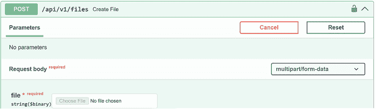
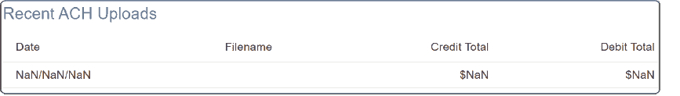
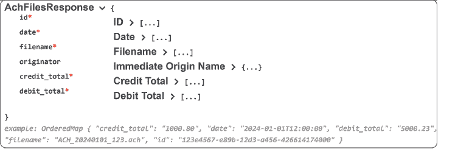

# 7 我们的最小可行产品

### 本章涵盖

+   最小可行产品（MVP）的目的

+   将一切整合到 MVP 中

+   安全问题

+   使用 Playwright 进行测试

在之前的迭代中，我们研究了检查项目各个组件的 spike 故事。你被介绍到生成式 AI 和可以加速软件开发的不同工具。我们还回顾了特定的技术，如 Python/FastAPI、Postgres、Docker 和 Next.js。现在，业务线希望看到我们劳动的成果。本章重点是将一切整合成一个最小可行产品（MVP），使用户能够

+   上传 ACH 文件

+   解析 ACH 文件并将其存储在数据库中

+   在我们的仪表板上可视化结果

功能性不会从之前迭代中开发的内容显著扩展。相反，我们想要确保这些个别组件现在可以无缝集成。在这个过程中，我们将探索系统演示中会发生什么，并使用 Playwright 验证我们的 MVP。拥有 MVP 将使我们能够向客户发布产品并收集反馈，我们将利用这些反馈在接下来的章节中改进我们的项目。

## 7.1 我们在谈论哪个最小值？

在你的职业生涯中，你可能已经听说过至少几个不同的最小值，例如

+   *最小可爱产品（MLP**）*—类似于 MVP，但专注于从一开始就提供客户喜爱的东西

+   *最小市场产品（MMP**）*—专注于提供可以销售给客户的最小功能集

+   *最小市场特性（MMF**）*—专注于提供对我们客户有价值的软件特性

最小可行产品（MVP）的概念最初由 Frank Robinson 提出，并由 Eric Ries 在其著作《精益创业》中推广。Ries 将 MVP 定义为“那种新产品版本，它允许团队以最少的努力收集关于客户的最大量的验证学习。”

让我们花点时间来分析这个声明。显然，我们的新产品代表了我们对 ACH 仪表板的现代化，但“验证学习”又是什么呢？通过验证学习，我们正在获取关于我们如何接近满足客户需求的产品进展的知识。验证学习应该是基于证据和可操作的，给我们一些东西，我们可以用它来改进下一迭代的产品。这里的“最少努力”并不意味着生产出次品，而是指在短期内以最小的投资实现的目标。

我们对 ACH 仪表板 MVP 的目标是向客户提供一款产品，它开始解决他们对现有仪表板的担忧，但最终帮助我们了解最终产品。这种方法使我们能够将产品从可能相对孤立开发的东西转变为客户可用的东西（在大型公司中，客户请求可能通过多个层级过滤给我们，每个请求都将公司的偏好体现在产品规格中）。一旦我们的客户拥有产品，我们可以利用他们的反馈来帮助推动产品的方向，并快速提供所需的功能。与此相比，其他方法可能在整个产品开发并交付过程中没有从客户群体中获得有意义的反馈。我们可能会得到一个不受欢迎的产品，因为它缺少客户可能认为重要的功能，或者它可能因为客户独特的需求而在客户环境中无法使用。确实，我们看到了完全开发的产品，因为未解决当前问题的基本担忧或未考虑它们需要运行的特定环境而被搁置。表 7.1 提供了关于 MVP、MLP、MMP 和 MMF 的关键概念的快速概述。

##### 表 7.1 MVP、MLP、MMP 和 MMF 的关键概念

|  | MVP | MMP | MLP | MMF |
| --- | --- | --- | --- | --- |
| 目的 | 测试和验证核心假设 | 创建可销售的产品版本 | 提供客户可以连接并喜爱的产品 | 提供增值功能并可单独进行市场推广 |
| 开发方法 | 优先考虑测试和学习 | 平衡功能与市场需求 | 专注于设计和情感参与 | 专注于单一有效功能 |
| 客户价值 | 为早期采用者提供核心价值 | 为目标市场需求提供完整解决方案 | 建立情感联系并在市场中脱颖而出 | 为现有产品提供渐进式改进 |
| 成功结果 | 核心假设的验证 | 销售和市场接受度 | 客户喜爱和品牌忠诚度 | 采用率和用户参与度 |

## 7.2 准备 MVP

在以下章节中，我们确保所有之前的工作都整合到最小可行产品（MVP）中。但在开始这段旅程之前，我们回顾了将构成我们的 MVP 的各个部分和组件——ACH 解析、数据库设计和用户界面，这些内容在之前的章节中已有讨论。图 7.1 展示了这个项目部分所需的组件。


##### 图 7.1  输入到 MVP 中的各个部分和组件

如果我们的初步工作做得恰当，构建 MVP 的过程应该相对直接。毕竟，我们已经做了大量的前期工作，使各种组件达到这个阶段。记住，我们之前的研究峰值为以下组件的建设：

+   Python 中的 ACH 解析器

+   使用 FastAPI 编写的 Python API 生成的 OpenAPI 文档

+   用于存储 ACH 数据的 Postgres 数据库设计

+   使用 Next.js 编写的 UI

在最坏的情况下，我们可能会遇到“方枘圆凿”的典型情况，即我们没有很好地记录（或遵守记录的功能），这可能需要一些重工作以使这些部分正确对齐。我们还有机会添加一些最后的修饰，例如使用 Playwright 进行集成/系统测试，这将使我们能够从最终用户的角度确保产品功能。最后，我们探讨了一些可能希望在项目中包含的额外安全性。

## 7.3 构建出/files API

在第四章中，你学习了如何使用 FastAPI 在 Python 中构建 API。然后，我们使用了 Next.js 和 WireMock 来创建可以返回给 UI 的模拟 API 响应，这些响应包含所需的数据。在这个阶段，我们想要验证后端和 API 是否正确对齐。

首先，我们通过 JetBrains IDE（PyCharm）调用了不同的组件，这使得我们可以启动当前数据库的 Docker、API 和仪表板 UI。通过导航到 http://localhost:8000/docs（OpenAPI 文档），我们可以利用我们在研究期间构建的`POST`请求（可能不是完美的，但应该可以加载文件）。图 7.2 显示了将允许我们选择样本的示例`POST`请求。



##### 图 7.2  示例`POST`请求

如果我们刷新页面，最近上传的 ACH 文件在许多字段中显示 NaN（不是一个数字）（见图 7.3）。出现 NaN 可能有几个原因：

+   *解析错误*——解析非数字数据，如`parseInt("abcd")`

`*   *未定义或 null 值*——使用 API 中不存在的字段*   *算术错误*——除以零`

```py`Let’s see if we can pinpoint this particular “square peg into a round hole” problem.    ##### Figure 7.3  Data being returned but displayed incorrectly    We can explore the data returned by the `/files` API by using the OpenAPI documentation page (or a tool such as Postman). The following listing shows the data being returned from the API.    ##### Listing 7.1  Data being returned from `/files` endpoint    ``` [  {  "ach_files_id": "dcb8e6a4-79e9-4cf7-a138-491e58c1ebb8",   "file_name": "sample.ach",     "file_hash": "application/octet-stream",     "created_at": "2024-02-18T01:05:37.513025"   } ] ```py    If we compare this code to the interface for `AchUpload` from RecentAchUploads.tsx, we can see the differences. Not only are we missing fields such as `creditTotal` and `debitTotal`, but we also need to map some of the field names.    ##### Listing 7.2  The `AchUpload` interface    ``` 接口 AchUpload {     id: number;     date: string;     filename: string;     creditTotal: number;     debitTotal: number; } ```py    We should also review how the database is configured and change the amount fields from the file control record (type 9) to be `NUMERIC` instead of `VARCHAR`. This is a somewhat personal choice as arguments may be made to have a more flexible character value since the fields themselves can be formatted improperly. Making this type of change can be beneficial because the database will now enforce the data to be numeric. However, we may run into errors with existing functionality that worked before. Why? It’s because we could have unknowingly been putting spaces or other non-numeric data into that field. Of course, hopefully, our unit tests would have prevented this or, at the very least, would have quickly pointed out possible adjustments.    In our case, we have tried to create a database structure that handles both unparsed records (for those times when the records are simply not parsable) and more detailed parsed records. The following listing shows the updated constraint for the numeric field. Note that the fields are 12 characters long, with a precision of 2.    ##### Listing 7.3  ACH table for the file control record    ``` total_debit_entry_dollar_amount NUMERIC(12, 2) NOT NULL, total_credit_entry_dollar_amount NUMERIC(12, 2) NOT NULL, ```py    The parsing program needs to be updated as well (see listing 7.4). We use the `Decimal` datatype since it is a bit safer than using a floating point ([`docs.python.org/3/library/decimal.xhtml`](https://docs.python.org/3/library/decimal.xhtml)). Note that we pass the fields as a string to `Decimal` instead of converting it to an `int`/`float` to avoid accidental conversion. For instance, the results of `Decimal('0.1')` and `Decimal(0.1)` are `Decimal('0.1')` and `Decimal('0.1000000000000000055511151231257827021181583404541015625')`, respectively, so we still have to be careful.    ##### Listing 7.4  Converting the string to a number that includes a decimal point    ``` total_debit_entry_dollar_amount= #1    Decimal(f"{record[31:41]}.{record[41:43]}"),  #1 total_credit_entry_dollar_amount=  #1    Decimal(f"{record[43:53]}.{record[53:55]}"),  #1 ```py  #1 Parses the fields using a Decimal object and f-strings   Having to update our database to convert from storing a string to numeric where appropriate adds extra work. We could have cut down some of the work had we tackled it in our previous research spikes when working on the database. In addition, we may be asking ourselves whether it is worth the effort to convert these fields to numeric for an MVP. That is a valid question. While at the very least we get the benefit of the database enforcing the formatting of our data, the tradeoff is increased development time.    Unfortunately, there is no right answer. Depending on the project, requirements, and timeframe, you may not have the extra time to convert the fields and may choose to do it later. In this case, we convert the fields since we need to update the API to return these fields anyway. We can make the changes, and based on the interface defined in the UI (listing 7.2), we know that a numeric was expected.    Now that we have the data stored correctly, we need to return the fields as part of the query. That brings us to another area that has to be refactored. We created schemas and used them in both the database and to represent the data being returned from our APIs. We would like to keep the models separate because this separation of concerns provides us with more flexibility, better security, and data integrity. We refactor our schemas directory to have folders for `api` and `database`, and we move all existing schemas to the database folder, which results in the structure presented in the following listing (note that not all files are shown).    ##### Listing 7.5  New schemas directory structure    ``` schemas/ ├─ api/ ├─ database/ │  ├─ ach_record/ │  │  ├─ ach_record_base_schema.py │  │  ├─ ... │  ├─ ach_file_schema.py │  ├─ ... ```py    With the updated structure, we are free to add our API responses. We can now continue with updating the API as we wanted. If you remember, we wanted to return a response with the file totals. Therefore, we created ach_files_response.py that contains the `AchFilesResponse`, as shown in the following listing. We also take the time to use more of Pydantic by providing documentation to the fields.    ##### Listing 7.6  The `AchFilesResponse` class    ``` from decimal import Decimal from datetime import datetime from pydantic import BaseModel, UUID4, Field   class AchFilesResponse(BaseModel):     id: UUID4 = Field(...,  #1         description="ACH 文件的唯一标识符", #2         title="ID")  #3     date: datetime = Field(...,         description="上传 ACH 文件的日期和时间",          title="日期")     filename: str = Field(...,         title="文件名",         description="加载 ACH 文件的文件名",         max_length=255, #4     )     credit_total: Decimal = Field(         ...,         description="ACH 文件中信用交易的总金额",         ge=0, #5         title="信用总额",     )     debit_total: Decimal = Field(         ...,         description="ACH 文件中借记交易的总金额",         ge=0,         title="借记总额",     )      class Config:                                       json_schema_extra = {                               "example": {                                        "id": "123e4567-e89b-12d3-a456-426614174000",                  "date": "2024-01-01T12:00:00",                   "filename": "ACH_20240101_123.ach",                  "creditTotal": "1000.00",                 "debitTotal": "5000.23",             }         } ```py  #1 By using Field from Pydantic, we can specify both constraints and documentation. #2 A description of our field shown as part of the API doc #3 A title for the field shown in our API doc #4 A constraint on the field; strings longer than max_length will cause validation errors. #5 Constrains the field to be ≥0   We have previously defined a simple query to return all the fields from the `ach_files` table, but now that we want to include the credit and debit totals in the response, we need to pull them from the parsed type 9 record. To work out the query, we can use CloudBeaver to run queries against our database and ensure the results are correct. Once we start pulling the required data, we can create a new method to return the data retrieved.    ##### Listing 7.7  Updating SQL query    ``` def get_files_response(     self, limit: Optional[int] = None, offset: Optional[int] = None ) -> list[AchFilesResponse]:     with get_db_connection(row_factory=dict_row) as conn:         result = conn.execute(             """             SELECT af.ach_files_id AS id, #1                    af.file_name AS filename,  #1                    af.created_at AS date,  #1                    afcr.total_debit_entry_dollar_amount AS debit_total,  #1                    afcr.total_credit_entry_dollar_amount AS credit_total #1             FROM ach_files AS af             INNER JOIN ach_records_type_1 AS art1 USING (ach_files_id) #2             INNER JOIN ach_records_type_9 AS art9                 USING (ach_records_type_1_id)             INNER JOIN ach_file_control_records AS afcr                 USING (ach_records_type_9_id)             ORDER BY af.created_at DESC  #3             LIMIT %s  #4             OFFSET %s                """,             [limit, offset],         )         return result.fetchall() ```py  #1 Fields are renamed to match the AchFilesResponse. #2 When joining tables on columns that are named the same in both tables, we can employ USING. #3 Sorts our results by the created_at date in descending order #4 Although not used at the moment, we can limit the results and allow for paging through them when we have large amounts of data.   Finally, we update our route not only to call our new `get_files_response` but also to provide more documentation for our end-user, as shown in the following listing. This documentation step is important because it makes the API more accessible to nontechnical stakeholders, such as the QA department, who may be helping us with testing the APIs, or technical writers, who may be helping us with documentation. Furthermore, this change can benefit the API consumers who do not have the advantage of viewing the underlying code.    ##### Listing 7.8  Updated API route    ``` @router.get( #1     "",  #1     response_model=list[AchFilesResponse],  #1     summary="检索上传的 ACH 文件",  #1     description="检索 ACH 文件的详细信息，包括信用/借记总额",  #1     response_description="请求的 ACH 文件的详细信息"  #1 ) async def read_files() -> list[AchFilesResponse]:     return AchFileSql().get_files_response() ```py  #1 We can use Pydantic again to document our fields.   With this completed, we have a usable API with documentation. Figure 7.4 shows the results of some of the documentation we obtained using Pydantic. So, in addition to being able to assist us with data validation, parsing, and type safety, Pydantic also provides these documentation benefits.    ##### Figure 7.4  Our API now has documented fields and examples    We are almost there—just a few finishing touches on the UI side, and everything will be hooked together.    In the RecentAchUploads.tsx, we named our interface `AchUploads`. We would prefer to name that something closer to what the API is returning. We also have a mapping problem where we have fields defined as `creditTotal`, but they are being returned as `credit_total` from the API. While Python uses `snake_case` for variable names, TypeScript prefers `camelCase`. So, we rename `AchUploads` to `AchFiles` and leave the fields as is. Then, we create a new interface—`AchFilesResponse`.    ##### Listing 7.9  The `AchFilesResponse` interface    ``` 接口 AchFilesResponse {     id: number;     date: string;     filename: string;     credit_total: number;     debit_total: number; } ```py    Next, we update the call to the `/files` endpoint in the component to transform the response from `AchFilesResponse` to `AchFiles`. We do so to maintain consistent naming standards for the language we are using. However, this can also yield another benefit—providing a level of abstraction between the UI and API. This benefit can be valuable if we change the vendor of our API (not likely in this case), or something unexpectedly changes within the API (where the API did not maintain backward compatibility, or unannounced changes were made). The following listing shows the updated `axios` call.    ##### Listing 7.10  Updated `axios` call    ``` axios.get<AchFilesResponse[]>(`${apiUrl}/files`)    .then(response => {       console.log(`Response data ➥ ${JSON.stringify(response.data)}`); #1       const transformedData: AchFiles[] = ➥ response.data.map((row: AchFilesResponse) => ({ #2  id: row.id, #2  date: row.date, #2  filename: row.filename, #2  credit
