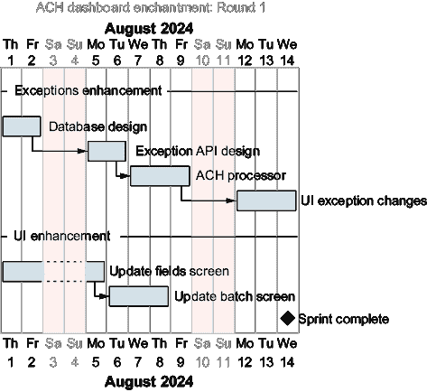
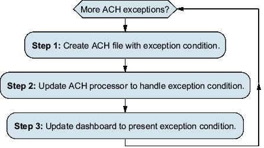
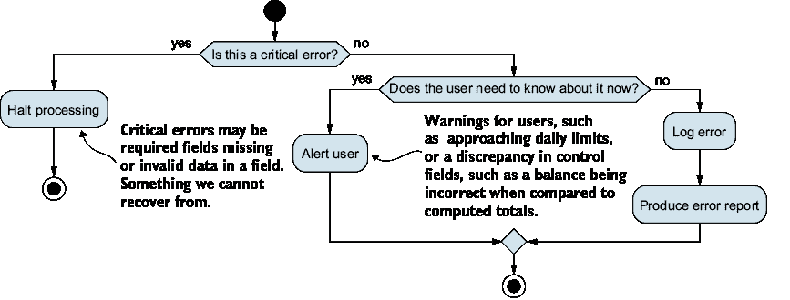
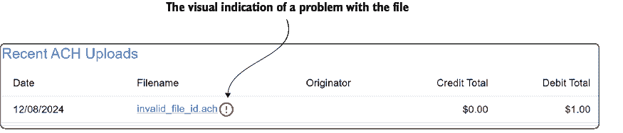
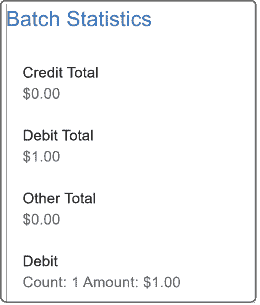
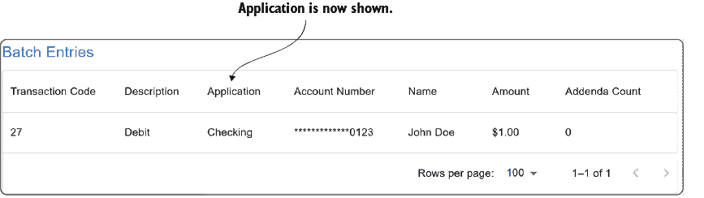

# 8 异常情况

### 本章涵盖

+   MVP 的初始反馈

+   规划和解决用户请求

+   识别不同类型的异常

+   更新仪表板

+   确保我们的 UI 响应

在第七章中，我们成功地将我们的最小可行产品（MVP）推向用户基础，以帮助征求反馈并推动产品的增强。反馈差异很大——从喜欢仪表板新方向的用户到那些表达不满的用户，他们认为它缺少太多功能，尽管它目前并不是一个完整的替代品。现在，业务希望我们既要利用做得好的地方，也要解决用户目前迫切要求的一些缺失功能。

在我们的 MVP 中，最大的需求是拥有更多种类的 ACH 相关异常，并在用户界面中实现它们的处理。本章确定了不同类别的异常以及识别和可能从中恢复的方法。

## 8.1 计划增强

向我们的目标受众提供 MVP 的好处是，我们可以从他们那里获得反馈，然后利用它来确定哪些功能需要添加到软件中。这种优势使我们能够专注于最有价值的物品。在这个例子中，我们希望专注于提供一个在用户界面中查看 ACH 异常的方法，以及搜索我们加载的文件，这将帮助我们找到用户迫切需要且实用的应用程序增强。这尤其有价值，因为我们专注于预先安排的支付和存款（PPD）ACH 交易，这意味着工资和账单支付有未处理的风险。

根据我们的情况，我们可能有一个正常的冲刺来完成我们的工作，或者如果需求迫切，我们可能需要更快地完成更改和修复。我们也可能会看到为这些项目编写的用户故事，例如

+   作为操作员，我希望能够查看处理异常并了解需要解决的潜在 ACH 问题，以确保交易不会延迟到客户账户的入账。

+   作为操作员，我希望能够搜索特定交易，以便我可以研究客户询问的项目。

在任何情况下，为项目提供时间表或甘特图都是有利的。如果我们面临硬性截止日期，这些可视化工具尤其有帮助。我们通常从截止日期开始倒推，试图完成预期任务，同时将它们全部纳入分配的时间范围内。当然，所需的时间框架可能不可能实现，将它们展示给管理层是帮助我们争取更多时间的好方法。再次强调，我们依赖 PlantUML 为我们提供一个简单的甘特图，我们可以与利益相关者分享。以下列表显示了所需的语法。

##### 列表 8.1 - Gantt 图的 PlantUML 语法

```py
@startgantt
saturday are closed  #1
sunday are closed    

header ACH Dashboard Enhancements - Round 1 #2

Project starts 2024-08-01 
-- Exceptions Enhancement -- #3
[Database Design] starts 2024-08-01 and lasts 2 days #4
[Exception API Design] starts at [Database Design]'s#5
➥ end and lasts 2 days  #5
[ACH Processor] starts at [Exception API Design]'s #5
➥ end and lasts 3 days #5
[UI Exception Changes] starts at [ACH Processor]'s #5
➥ end and lasts 3 days #5

-- UI Enhancement –
[Update fields screen] starts at 2024-08-01 and lasts 3 days
[Update batch screen] starts at [Update fields screen]'s
➥ end and lasts 3 days
[Sprint Complete] happens at [UI Exception Changes]'s end
@endgantt
```

#1 从我们的图表中排除周末，因为我们不想加班

#2 图表的标题

#3 在图表中创建一个视觉上的中断

#4 创建一个具有开始时间和持续时间的任务

#5 任务可以依赖于其他任务。

此列表生成了图 8.1 所示的图表。正如我们提到的，此类图表有助于可视化工作，并且通常受到项目利益相关者的赞赏。



##### 图 8.1 - 我们增强功能的甘特图

现在我们已经概述了这次冲刺的初始工作，我们可以开始着手添加异常到我们的应用程序所需的步骤。

## 8.2 异常和警告

记住，我们更喜欢在这里进行短的开发周期，如图 8.2 所示。在步骤 1 中，我们需要创建一个包含我们所需异常条件的 ACH 文件，这意味着我们将更新`ach_file_creation.feature`和相关的 test_create_ach_files.py，以支持创建具有我们所需异常的文件。在步骤 2 中，我们通过直接开始工作或以更测试驱动开发（TDD）的方式创建单元测试来更新 ach_file_processor.py，以支持新的异常。最后，在步骤 3 中，我们更新仪表板的实际 UI 以支持查看和显示异常。

虽然步骤将在单独的部分中介绍，但请注意，我们可能会通过这些一般步骤对每个个别异常进行工作。并且在我们处理每个异常的过程中，我们会注意到可以做出的改进/细化。



##### 图 8.2 - 表示我们的短开发周期的流程图

首先，我们需要确切地定义当我们使用“异常”、“错误”和“警告”这些术语时我们指的是什么。它们可能看起来有些可以互换，但就我们的目的而言，我们希望提供一些背景信息，说明我们谈论每个术语时的想法。请记住，这些是我们自己的定义，并不反映任何金融科技或 Nacha 标准。

+   *错误* - 阻止处理发生的条件。我们可以将错误视为诸如文件上传不完整或软件中的错误导致处理停止的条件。某些条件会导致错误，例如，记录类型代码不存在于 ACH 标准中（例如，记录类型代码 2），因为我们没有在数据库中为该记录留出位置。

+   *异常* - 一种可能阻止文件处理的业务条件，这可能包括格式不正确的文件、文件中的无效数据，或者业务定义的应停止处理的条件。这些业务条件的例子可能包括超过一定金额的交易、标记的客户或其他可能引起担忧的交易活动。

+   *警告*—需要通知的业务条件，但并不一定阻止文件被处理。警告可能允许我们在执行 ACH 规则时对文件或客户表现出宽容。例如，如果控制记录上的计数不正确，业务可能会允许这种差异并继续处理文件。

如我们所见，不同类别在条件和响应上存在细微差异。在遇到错误的情况下，我们也应清楚地记录恢复或研究步骤。我们曾参与在深夜支持软件，代码中进行了明确的检查，但没有任何指示说明条件可能发生的原因、如何解决它或它是否重要。不止一次，它并不重要到足以停止处理，代码会被注释掉以便绕过检查。这个故事说明了确定异常严重性的必要性，以及何时何地应该报告它们。图 8.3 显示了一个流程图，可以帮助你决定是否需要停止处理异常或以不同的方式处理。



##### 图 8.3  决定如何处理错误的流程图

总结来说，我们应该考虑

+   是否这是一个需要停止处理的问题

+   是否可以及时向用户报告

+   无论这是否可以等待但最终需要解决的事情

太频繁地，我们可能会创建被用户忽略和删除的警报、消息和报告，在采取纠正措施之前。这可能会是一种平衡行为，因为不同的产品或业务需求需要不同的方法。

从我们的软件和开发角度来看，我们必须考虑这些不同类型的错误和警告。同时，了解美联储有其自己的方式来查看文件的 ACH 状态也很重要。这些状态可以是`接受`、`挂起`或`拒绝`，这正是你可能会预期的：

+   `接受`—文件良好，已被美联储接受。

+   `挂起`—金融机构必须确认文件应该被接受或拒绝。这通常发生在由于文件格式或内容存在潜在异常时。

+   `拒绝`—条件/错误导致文件被拒绝。当金融机构选择拒绝之前处于`挂起`状态的文件，或者美联储直接拒绝文件时，我们可能会得到这种错误状态。

应当注意的是，当文件被纠正时，应该有一个审计跟踪。如果文件被修改，文件的原创建者可能需要被通知。否则，这些更改在尝试研究问题时可能会导致混淆。我们可以想象试图与某人讨论一个文件，其中文件 ID 从数字更改为字母，但没有任何表明这是已完成的指示。这可能会导致一些令人沮丧的互动，金融机构的某个人声称没有看到文件，尽管用户明显看到交易击中他们的账户。

## 8.3 创建带有异常的 ACH 文件

作为第七章 MVP（最小可行产品）的一部分，我们创建了`ach_file_creation.feature`，这使得我们能够轻松地使用 BDD-style 语法（称为 Gherkin）创建格式良好的文件。回想一下，它允许我们创建如下所示的文件：

```py
  Scenario: Create an ACH file with a single batch and a single debit
    Given I want to create an ACH file named "ppd-single-debit.ach"
    And I want to have an immediate destination of "123456789"
    And I want to have an immediate origin of "987654321"
    And I want to have 1 batch with ACH debits only
➥ and a standard entry class code of "PPD"
    And I want 1 entries per batch with random amounts between 100 and 100
    And I want to use individual names of "John Doe"
    And I want to have company name "My Company"
➥ and company id "1234567890"
    When my ACH is created
    Then I should have a file named "ppd-single-debit.ach"
    And there should be 1 batch in the file
    And there should be 1 entries in the file
```

这对于我们经常从快乐路径开始的情况效果很好，但现在我们需要扩展我们的代码来处理一些可能的异常，以便我们可以着手构建所需的功能。在某些情况下，我们的语法可能有助于强制执行 ACH 文件的正确格式，这显然是好事。我们希望创建过程比手动创建更容易，但现在我们还想为文件添加一些灵活性。最终，我们可能会接受 CSV 或其他格式化的文件，这将使定制字段变得容易。目前，我们可以考虑扩展并希望改进我们的语法。

### 8.3.1 创建带有文件级别异常的 ACH 文件

文件级别的错误和警告将与文件头（类型 1）或文件尾（类型 9）记录有关。我们可能遇到的大多数异常都源于文件格式问题，我们希望能够引入以下异常：

+   *文件 ID 不是 A 到 Z 范围内的字母大写或数字*。如果它是小写字母，文件可能会被拒绝，或者金融机构可能会决定修复它，因为这是一个小问题，容易纠正。

+   *直接目的地应该是我们银行的路线号*。这很重要，因为我们显然想确保我们正在处理正确的文件，为正确的银行。如果我们收到一个打算给另一个机构的文件，它可能被归类为信息泄露、未经授权的披露或不经意的数据共享。无论我们称它为什么，在客户隐私方面都有严重的后果，我们可能还有法律和监管义务。虽然这似乎是一个无害的问题（例如，字段不匹配），但它将是一场全员参与的事件。在金融科技领域，这种事情可能发生在许多地方，尤其是在处理多租户环境时。例如，它可能发生在存储/检索图像、在移动或网络银行应用程序中显示交易、发送对账单或与不正确或未经授权的地址通信时。这个变化还要求我们维护一个与银行关联的路线号列表，因为我们需要能够验证它们。由于银行的合并或收购，银行可能有多个路线号。

+   块因子不应改变，但如果改变了，则将是一个错误。这给了我们机会更新我们的语法以支持设置字段和使用 `get(field,` `默认值)`，这样我们就不需要有很多不同的语法，这可以进一步扩展以支持 `padding-left`/`right`，`fill` `value` 和 `length`。

+   记录大小类似于块因子，我们始终期望为 094。理论上，此字段可以用来更改记录格式长度，但在实践中，系统通常只假设 94 字节，并且不使用记录大小来读取不同大小的记录。这确实允许我们扩展我们的检查以变得更加通用，交换由特定上下文施加的约束，并允许更多的灵活性，但随之而来的是更大的责任，即了解如何使用它。例如，我们正在调整字段偏移量以满足 Python 的需求。我们本可以将它从 1 开始，这样与 ACH 文档更一致，并在代码中更改偏移量。

+   *文件总计*。文件尾记录应与文件计算出的总计相匹配

+   *文件哈希*。每个批量控制都有一个哈希值，该值累加，并在必要时截断结果以保留 10 个低位数字（最右侧的数字）。

### 8.3.2 使用批量异常创建 ACH 文件

随着我们解析更多文件内容，我们需要考虑批量级异常。这些异常特定于批量记录，尽管它们与其他异常有一些相似之处，但我们可能会发现它们并不一定导致整个文件被拒绝。相反，批量本身可能会被系统拒绝。这反过来又可能导致整个文件被拒绝，或者金融机构可能只需要求发起者发送一个新的文件。以下是一些批量级异常的例子：

+   无效的有效日期会导致批量错误，因为这是正确发布文件所必需的信息。所以，无论是缺失还是格式错误，都无法恢复，需要一个新的文件。

+   控制记录上的无效批量总计会导致警告。在实践中，这通常会导致文件被拒绝，但也可以纠正给定的文件，使总计与文件条目匹配，以便文件被接受。

+   批量中的不良标准入口代码（SEC）会导致错误，并使批量被拒绝。有一系列可行的 SEC 代码可以使用，其中一些会改变记录的解析。我们一直专注于 PPD（用于工资、账单支付、养老金等）的 SEC 代码，并将继续在本章中这样做。

### 8.3.3 使用入门级异常创建 ACH 文件

入门级异常很有趣，因为除了常见的格式异常之外，它们还可能更多地与系统中的账户有关。覆盖这些异常需要系统有更多的功能，但为了更好地说明我们的意思，让我们来看看一些常见的入门级异常：

+   *无效账户号码*—可能与格式有关，或者系统上找不到。

+   *无效金额*—金额格式错误（例如，包括小数或包含空格）。

+   *资金不足（NSF）*—账户没有交易的资金。这为我们项目打开了许多有趣的可能性，从维护客户和账户表到评估无法处理的交易的费用。

### 8.3.4 清理我们的文件创建语法

需要创建额外的文件时，我们将重新审视我们用来创建文件的 BDD 风格语法。通常，这是一个获得重构代码和寻找微小改进以使语法或代码更健壮的好地方。因为这些通常是面向内部的，我们可以通过重构现有代码并观察其可能产生的潜在影响来获得经验。

例如，我们曾经有`@then(parsers.re('I should have a file named "(?P<expected_file_name>.*)"'))`这一行，但再次指定文件名是没有必要的。这不仅会在我们复制/粘贴场景以创建类似场景时引起潜在问题，而且纯粹是多余的输入。相反，既然我们已经存储了文件名，我们可以更新它成为`@then("I should have a file of the same name")`。然后代码可以从`setup_info['filename']`中提取存储的文件名以执行检查。

我们可以关注的另一个改进是清理我们解析某些语句中字符串的方式。我们最初使用正则表达式来捕获使用的字符串，虽然这并不一定是问题，但它确实增加了一层潜在的混淆。我们想起了 Jamie Zawinski 的著名引言：“有些人面对问题时会想，‘我知道，我会使用正则表达式。’现在他们有两个问题。”为了解决这个问题，我们可以将我们的正则表达式，如`@given(parsers.re(r'I want to create an ACH file named "(?P<filename>.*)"'))`，替换为一个远更简单的`@given(parsers.parse('I want to create an ACH file named "{filename}"'))`。保持我们的代码简单确保它更易于维护，并且在一年或两年后返回添加更多改进时，更不容易出错。

还有哪些可以改进的地方？记住，我们应该寻求平衡功能与需求。我们可能可以添加很多花哨的功能，但如果它们未被使用，这真的值得额外的努力吗？这种平衡在讨论不一定会增加客户可见价值的内部工具时尤为重要。如果我们有一个功能齐全的 ACH 创建实用工具，但没有为他们处理这些文件的实际工具，我们的利益相关者可能不会印象深刻！

## 8.4 扩展 ACH 处理以处理异常

当我们将异常添加到解析器时，我们将通过创建一个测试来验证预期的异常是否已添加到数据库中，从而遵循 TDD（测试驱动开发）方法。使用 TDD 方法，我们预计这个测试会失败，然后我们将努力添加必要的逻辑以使测试通过。这种方法可能不适合每个人，但我们鼓励您尝试一下，至少为了从不同的角度看待开发。

### 8.4.1 数据库中的 ACH 异常

最初，我们在数据库中存储了一些异常文本。然而，我们可能希望有更精细的控制和更少冗余的数据。因此，我们创建了一个名为`ach_exception_severity`的数据库类型，以限制在创建异常时可以使用的条目。使用`ENUM`可以确保类型的一致性并减少数据库中的冗余。缺点是`ENUM`不是 SQL 标准的一部分，因此，它们可能不会被你的关系数据库管理系统（RDBMS）实现。虽然这些示例假设使用的是支持`ENUM`的 Postgres 数据库，但也可能通过一个单独的表来模拟这种功能，该表提供我们用于`ENUM`的值，并在该表中建立外键关系。

以下列表展示了创建`ENUM`类型以及我们新创建的`ach_exception_codes`表的过程，我们使用这个表来存储错误扩展描述。

##### 列表 8.2  创建数据库`ENUM`和异常代码表

```py
CREATE TYPE ach_exception_severity AS ENUM
➥ ('error', 'warning', 'info'); #1

CREATE TABLE ach_exception_codes (
    ach_exception_codes_id UUID PRIMARY KEY DEFAULT uuid_generate_v4(),
    exception_code VARCHAR(3) NOT NULL UNIQUE,
    exception_severity ACH_EXCEPTION_SEVERITY NOT NULL, #2
    exception_description VARCHAR(255) NOT NULL
);
```

#1 创建`ach_exception_severity`类型

#2 将我们的类型用作字段的数据类型

接下来，我们创建一个异常表来跟踪我们的异常。有几种方法可以做到这一点，即为每个特定条目创建多个表（类似于有多个 ACH 记录类型），然后通过视图将它们关联起来。然而，在这里，我们演示使用一个可以包含其他表引用的单一表，这些表包含我们可以查找的记录异常。以下列表包含`CREATE TABLE`语句。与之前的表相比，重要的区别是我们使用了外键约束，这使得`ach_records_type_5_id`和`ach_records_type_6_id`字段可以接受 NULL，因为只有在我们有该类型的异常记录时，这些信息才会被填充。请注意，每个异常都将与一个文件相关联，因此我们预计`ach_files_id`将在每次都填充；因此，我们仍然有一个`NOT NULL`约束。

##### 列表 8.3  创建异常表

```py
CREATE TABLE ach_exceptions (
    ach_exceptions_id UUID PRIMARY KEY DEFAULT uuid_generate_v4(),
    ach_files_id UUID NOT NULL 
       REFERENCES ach_files(ach_files_id) 
       ON DELETE CASCADE ON UPDATE CASCADE,
    ach_records_type_5_id UUID    #1
       REFERENCES ach_records_type_5(ach_records_type_5_id)  #1
       ON DELETE CASCADE ON UPDATE CASCADE,  #1
    ach_records_type_6_id UUID REFERENCES     #1
       ach_records_type_6(ach_records_type_6_id)   #1
       ON DELETE CASCADE ON UPDATE CASCADE,  #1
    record_number NUMERIC NOT NULL,
    exception_code VARCHAR(3) NOT NULL REFERENCES  #2
    ach_exception_codes(exception_code)              #2
  ON UPDATE CASCADE   
);
```

#1 这些字段不一定总是被使用，可以是 NULL。

#2 异常代码详情在`ach_exception_codes`中引用。

向我们的表中添加数据是数据库启动的一部分。我们这样做是因为这些是我们可以考虑作为产品一部分的标准错误。我们经常发现这些类型的表或设置是金融机构设置的一部分。

##### 列表 8.4  向异常表添加数据

```py
INSERT INTO ach_exception_codes (exception_code,#1
  exception_severity, exception_description)  #2
VALUES ('001', 'error', 'Record length is not 94 characters');  #2
INSERT INTO ach_exception_codes
 (exception_code, exception_severity, exception_description)
 VALUES ('002', 'error', 'Record type was an unexpected value');
…
```

#1 每个异常都需要被插入到数据库中。

添加这种持久数据对于仪表板是必要的；然而，这也增加了一层复杂性。我们的测试变得依赖于这些表的定义和数据填充。我们还遇到了一个问题，因为我们的单元测试会将所有表截断以确保数据库是干净的。以下列表显示了截断脚本的一部分更改，以便我们可以理解对 `SqlUtils.truncate_all()` 所需的更改。我们可能想要考虑更新名称（或者至少是文档），以便理解 `truncate_all` 实际上不再截断所有数据。

##### 列表 8.5 更新 `truncate` 脚本

```py
EXECUTE (
   SELECT 'TRUNCATE TABLE ' || 
          string_agg(quote_ident(table_name), ', ') || 
          ' CASCADE'
   FROM information_schema.tables
   WHERE table_schema = 'public'
   AND table_type = 'BASE TABLE'
   AND table_name NOT IN ( 'ach_exception_codes', #1
                       'ach_recovery_options',    #1
                       'bank_routing_numbers')   
);
```

#1 我们有一些表需要在截断逻辑中跳过，因为这些表包含硬编码的值。

虽然我们现在可能不会因为这个方法而过度负担，但将来我们可能需要更好地管理测试数据库。一个流行的选择是使用 Testcontainers ([`testcontainers.com/`](https://testcontainers.com/))，它允许我们创建包含我们的数据库的临时 Docker 容器，这些容器不会超出测试的生命周期。这在处理单元测试时提供了明显的优势，尤其是在 CI/CD 管道中运行的测试。

### 8.4.2 恢复选项

在更新 ACH 解析器以支持我们新的异常之前，让我们花一点时间考虑记录异常的另一方面——当遇到异常时应该做什么！我们想要确切地考虑用户应该如何从问题中恢复。这在与加载交易处理时尤其如此，仪表板最终可能会涉及到这一点。由于 ACH 文件用于移动资金，如果我们的文件加载失败或存在其他错误条件，我们可能需要考虑对用户账户的影响。换句话说，仅仅加载文件并再次尝试可能是不够的。我们需要确保交易不会再次发布到账户，导致客户被多次贷记或借记。在这个阶段，我们的担忧不需要集中在那些细节上，但为用户提供一些帮助是很重要的。

一个浮现的情景是遇到一个异常被抛出，这涉及到比较系统两部分的总额。如果总额不匹配，处理就会停止，导致凌晨 2 点时需要联系开发者。担忧的并不是异常让我们在非正常时间工作。如果发生关键处理异常，我们可以预期偶尔会出现问题。相反，担忧的是在遇到错误时应该采取的恢复步骤——没有！结果是多个开发者不得不介入以确定需要做什么。确定检查可以安全地绕过，我们可以在第二天跟进并进一步调查。最终，发现审计记录没有按照预期写入，这导致了总额不准确，但在发现这个问题之前，问题已经重复出现几次了。

虽然我们目前的项目没有这样的担忧，但为用户提供一些额外的信息当然会很不错。毕竟，仪表板最终可能需要自己的内部帮助系统，或者查看异常可能会提供一些关于可以采取哪些行动的建议。以下列表显示了创建一个与`ach_exception_codes`表关联的`ach_recovery_options`表，允许将多个条目与一个异常代码关联。

##### 列表 8.6  ACH 恢复选项表

```py
CREATE TABLE ach_recovery_options (
    ach_recovery_options_id UUID PRIMARY KEY DEFAULT uuid_generate_v4(),
    exception_code VARCHAR(3) NOT NULL REFERENCES  #1
       ach_exception_codes(exception_code) ON UPDATE CASCADE, 
  recovery_option VARCHAR NOT NULL #2
);
```

#1 每个恢复选项应引用一个特定的异常。

#2 恢复选项是用户可以查阅以获取帮助的简单文本。

然后，我们可以作为启动过程的一部分预填充表中的恢复选项。以下列表显示了将一些可能的恢复选项插入数据库的示例。

##### 列表 8.7  预填充恢复选项

```py
INSERT INTO ach_recovery_options (exception_code, recovery_option)
➥ VALUES ('001', 'Request a corrected file from the originator');
INSERT INTO ach_recovery_options (exception_code, recovery_option)
➥ VALUES ('002', 'Request a corrected file from the originator');
INSERT INTO ach_recovery_options (exception_code, recovery_option)
➥ VALUES ('004', 'Specify a new File ID Modifier');
```

恢复选项当然可以扩展。然而，在这个阶段，我们只想确保恢复和帮助是我们开发中的一个考虑因素。我们都应该意识到干净代码和注释的重要性，这样当我们不得不在 6 到 12 个月后再次深入研究代码时，我们可以理解代码。同样重要的是确保我们的软件对最终用户是可用的。否则，我们可能会发现自己需要为用户应该能够自行解决的问题提供支持。在应用程序中定义帮助，并在 Confluence 等工具中进行更广泛的文档和故障排除，对最终用户和支持人员都有帮助。最终，这将让您有更多时间用于开发，这正是我们在这里的原因！

## 8.5 更新 ACH 解析器

随着数据库能够支持更好的异常处理，我们现在可以着手更新 ACH 解析以编写我们的异常。从格式方面可能遇到的许多异常可以通过 Pydantic 处理。我们可以继续向我们的 Pydantic 定义添加约束和验证，这将从我们的手中移除许多繁琐的任务。其他异常可能需要检查我们记录的字段之外的内容。例如，确保跟踪号是递增的，这是我们更愿意在 Pydantic 之外完成的事情。

### 8.5.1 为异常创建单元测试

我们已经展示了如何更新我们的 BDD 风格语法来创建带有所需错误的文件。然后我们可以创建基本布局，如下面的列表所示。这种方法对于测试应该效果很好，无论是否遇到异常。

##### 列表 8.8  测试无效的立即目的地

```py
def test_incorrect_immediate_destination(parser):
    ach_filename = "invalid_immediate_destination.ach" #1
    dir_path = os.path.dirname(os.path.realpath(__file__))  #2
    file_path = os.path.join(dir_path, "data", "bad_files",  #2
                                             ach_filename)  #2

    expected_exceptions_count: int = 1 
    expected_exceptions_code: str = #2
       AchExceptions.INVALID_IMMEDIATE_DESTINATION.value

    ach_files_id = 
       SqlUtils.create_ach_file_record(filename, "123456789") #3

    parser.parse(ach_files_id, file_path) #4
    exceptions = SqlUtils.get_exceptions() #5

    assert (          #6
        len(exceptions) == expected_exceptions_count #6
    ), f"Expected {expected_exceptions_count}, #6
➥ but got {len(exceptions)}"  #6
 #6
    assert (  #6
        exceptions[0] == expected_exceptions_code #6
    ), f"Expected {expected_exceptions_code}, #6
➥ but got {exceptions[0]}"  #6
```

#1 定义初始变量，以便我们可以获取一个要加载的文件

#2 我们使用 ENUM 值，以便异常代码保持灵活。

#3 为我们的插入插入一个所需的虚拟记录

#4 解析文件，将其加载到数据库中

#5 获取异常

#6 断言我们有一个预期的异常

考虑到之前的示例，我们可能会注意到其中大部分代码对每个测试都是相同的。这是一个回忆重构是 TDD 阶段之一的绝佳机会。在这种情况下，我们可以重构代码，使文件的处理过程通用化到一个例程，并使用预期的值调用它，如下面的列表所示。这种方法对于这些基本测试仍然很有效，我们只是想确认异常已被捕获。由于 `assert` 引发异常，我们仍然在 `test_incorrect_file_id_modifier` 方法内部看到我们的错误被抛出。

##### 列表 8.9  重构测试

```py
def test_incorrect_file_id_modifier(parser):
    process_file_and_verify_exception(       #1
       ach_filename = "invalid_file_id.ach",  #1
       expected_exceptions_count = 1,     #1
       expected_exceptions_code =  #1
          AchExceptions.INVALID_FILE_ID_MODIFIER.value,  #1
       parser = parser)  #1

def process_file_and_verify_exception(ach_filename: str, #2
   expected_exceptions_count: int,   #2
   expected_exceptions_code: str,  #2
 #2
parser: AchFileProcessor):  #2
…
```

#1 我们创建一个函数并将所需的变量传递给它。

#2 被调用的函数包含解析和断言所需变量的相同逻辑。

通过这些基本测试，我们可以轻松地为我们的代码添加异常。当然，在某个时候，我们还将进行更广泛的测试，但这是朝着正确方向前进的一个很好的方法。

### 8.5.2 在我们的解析器中支持异常

要开始编写我们的异常，我们必须添加一个可以存储异常信息的模式。通过提供文件、批次和条目的 UUID，我们在不同级别报告异常方面具有灵活性。例如，当金额无效时，我们可以直接钻到导致问题的记录，因为我们有权访问文件、批次和条目的 UUID。与此相比，如果我们只有导致异常的 `ach_files_id`，如果我们文件中有成千上万的记录，我们将有大量工作要做，确定有问题的记录。下面的列表显示了我们的 ACH 异常模式。我们排除了字段定义，以保持简单。

##### 列表 8.10  ACH 异常架构

```py
class AchExceptionSchema(BaseModel):
    ach_exceptions_id: Optional[UUID4] = Field(…)
    ach_files_id: UUID4 = Field(…)  #1
    ach_batch_id: Optional[UUID4] = Field(…)
    ach_entry_id: Optional[UUID4] = Field(…)
    record_number: int = Field(…) #2
    exception_code: str = Field(…) #3
```

#1 我们总是将异常与特定的文件关联。

#2 记录号有助于定位未解析的记录。

#3 异常代码有助于定位错误详情。

我们继续创建我们的 `AchExceptionsSql` 类，它具有通常的 `insert_record` 和 `get_record` 方法。我们本可以将其命名为 `insert_exception` 和 `get_exception`，但为了与其他方法保持一致，我们保持代码相似。

##### 列表 8.11  ACH 异常 SQL

```py
class AchExceptionsSql: #1
    @staticmethod
    def insert_record(ach_file_exception: AchExceptionSchema) -> UUID:
        with get_db_connection() as conn:
            result = conn.execute(
                """
           INSERT INTO ach_exceptions #2
➥ (ach_files_id, record_number,  #2
              exception_code)  #2
           VALUES (%(ach_files_id)s,   #2
➥%(record_number)s, %(exception_code)s)  #2
           RETURNING ach_exceptions_id #2
            """,
                ach_file_exception.model_dump()
            )

        return result.fetchone()[0] #3

    @staticmethod
    def get_record(ach_exception_id: UUID) -> AchExceptionSchema:
        with get_db_connection
➥(row_factory=class_row(AchExceptionSchema)) as conn:
            result = conn.execute(
                """
                SELECT * FROM ach_exceptions #4
                WHERE ach_exceptions_id = %s
                """,
                [ach_exception_id]
            )

            return result.fetchone()
```

#1 包含任何 SQL 调用的异常类

#2 标准 SQL 用于插入并返回新添加的 ID

#3 返回结果中的第一个字段，即 ID

#4 标准 SQL 用于读取异常

现在我们可以创建异常记录，我们可以在 ach_file_processor.py 中需要写入异常的地方简单地调用 `_add_exception` 例程。列表 8.12 展示了这个异常例程。注意，我们接受 `AchExceptionSchema` 和未解析的行作为参数。我们选择将行作为可选参数，并将其写入无效记录表。这是因为我们在数据库中较早地将单个记录类型拆分出来。为了适应可能无法解析的记录（因为它不是有效的类型）的情况，我们仍然希望将其存储在某个地方。

##### 列表 8.12  添加异常方法

```py
    @staticmethod #1
    def _add_exception(exception: AchExceptionSchema, #1
➥ unparsed_record=None) -> None: 
        sql = AchExceptionsSql()
        sql.insert_record(exception)
        if unparsed_record is not None: #2
            sql_invalid_rec = AchRecordsSqlTypeInvalid()  #2
            sql_invalid_rec.insert_record #2
➥(AchRecordTypeInvalidSchema(  #2
                ach_files_id=exception.ach_files_id,  #2
                unparsed_record=unparsed_record,  #2
                sequence_number=exception.record_number,  #2
            ))
```

#1 当我们在处理过程中遇到异常时调用的函数

#2 当记录已传递时，我们需要将其写入一个特殊的数据库表，因为我们无法确定正确的表（例如，不存在的记录类型）。

通过创建异常的能力，我们需要更新我们的解析方法以返回自定义验证错误。单个字段解析没有变化，但我们希望捕获验证错误并将其包装在自定义错误中。

##### 列表 8.13  更新解析例程

```py
    @staticmethod
    def parse_file_header(
            ach_records_type_1_id: UUID, record: str
    ) -> AchFileHeaderSchema:
        try:  #1
            return AchFileHeaderSchema(  #1
…  #1
            ) 
        except ValidationError as e: #2
            raise AchParsingValidationError( #3
   message='Error parsing file header',  #3
   validation_errors=e.errors())  
```

#1 尝试使用 Pydantic 解析标题

#2 当遇到验证错误时进行捕获

#3 使用 raise 关键字创建一个自定义错误，用于存储我们的 ACH 相关信息

自定义 `AchParsingValidationError` 在以下列表中显示。自定义错误的目的在于我们可以将遇到的错误转换为等效的 `AchException` 代码，这有助于将它们写入数据库。

##### 列表 8.14  自定义 ACH 解析错误

```py
class AchParsingValidationError(Exception): #1
…
    def get_exception_codes(self) -> list[str]: #2
        exception_codes = []   
        for error in self.validation_errors: #3
            if error['loc'][0] == 'file_id_modifier': #4
exception_codes.append(AchExceptions.  #4
➥INVALID_FILE_ID_MODIFIER.value)  #4
            elif error['loc'][0] == 'immediate_destination':   #4
exception_codes.append(AchExceptions.  #4
➥INVALID_IMMEDIATE_DESTINATION.value)  #4
        return exception_codes
```

#1 我们的错误是 Exception 的子类。

#2 定义一个获取异常列表的函数

#3 处理数组 self.validation_errors 中的每个验证

#4 将有问题的字段翻译为我们的一种异常代码

然后，我们可以更新记录的个别解析，以在遇到异常时添加异常。

##### 列表 8.15  处理验证错误的更新

```py
case "1":
   ach_record = AchRecordType1Schema(
      ach_files_id=ach_file_id,
      unparsed_record=line,
      sequence_number=sequence_number)
   ach_record_id = AchRecordsSqlType1().insert_record(ach_record)
   current_file_header_id = ach_record_id
   try:  #1
      self._parse_file_header(ach_record_id, line)  
   except AchParsingValidationError as e:  #2
      for exception_code in e.get_exception_codes():  #2
         self._add_exception(AchExceptionSchema(  #2
            ach_files_id=ach_file_id,   #2
            record_number=sequence_number,  #2
            exception_code=exception_code,  #2
            ))  #2
```

#1 我们尝试解析记录。

#2 对于我们找到的每个错误，它都会写入一个异常。

这为 ACH 解析器中异常的处理提供了一个基本框架。相同的公式适用于其他记录类型。

### 8.5.3 Pydantic 中的验证

大部分字段级验证将在 Pydantic 中进行。让我们看看一些异常以及我们如何在 Pydantic 中实现它们。

首先，我们希望解决类型 1 记录上的文件 ID 修改符。这应该是一个从 A 到 Z 的大写字母或从 0 到 9 的数值，我们可以在 Pydantic 中轻松指定。

##### 列表 8.16  Pydantic 对文件 ID 修改符的验证

```py
file_id_modifier: Annotated[str, 
   StringConstraints(
      pattern=r'^[A-Z0-9]$', #1
      min_length=1, #2
      max_length=1)] 
```

#1 我们定义一个正则表达式模式来验证。

#2 我们还限制了字段大小，尽管模式本身应该足够。

另一个需要覆盖的条件是立即目的地。我们知道这应该匹配我们银行的路线号。我们不一定想将这些值硬编码到我们的代码中，因为它们可能会改变（尽管不经常），但如前所述，经历收购和合并的银行可能会获得（或失去）路线号。因此，我们想要一种方法，让 Pydantic 根据在运行时已知的值列表验证立即目的地。

这个任务是通过 Pydantic 中的 `field_validator` 注解完成的。为了我们的目的，我们将将其连接到数据库调用，这让我们可以验证字段与数据库中允许的值列表。

##### 列表 8.17  Pydantic 立即目的地字段验证器

```py
@field_validator('immediate_destination') #1
@classmethod 
def validate_immediate_destination(cls, v):
  try:
      if BankRoutingSql().valid_bank_routing_number(v): #2
         return v
      else:  #3
         raise ValueError('immediate_destination #3
➥ is not a valid routing number') 
   except Exception: #4
      raise ValueError('Unable to validate #4
➥ immediate_destination') 
```

#1 使用 field_validator 和 classmethod 注解

#2 使用 SQL 检查银行路由号，如果有效则返回它

#3 否则，如果没有找到，将引发 ValueError

#4 也用 ValueError 处理任何意外的错误

为了支持这一点，我们必须创建一个简单的表格，其中包含我们想要考虑为我们的银行路由号的路线号。根据我们期望验证的记录数量，对于每个记录（以及可能的多字段）执行数据库查询可能效率低下。在我们的情况下，任何我们加载的文件中都应该只有一个 ACH 文件头记录。因此，我们不太关心性能的影响，但这些潜在问题的类型应该被记住。

一旦我们开始验证立即起源，我们需要检查并纠正许多测试，在这些测试中，我们有一个有效的数字，但它不在我们的数据库中。将进行额外的单元测试清理来处理异常，并扩展传递给例程的参数，以便我们可以记录异常。当这些方法开始变得过于复杂时，将是时候将它们拆分到自己的记录类型类中，远离解析器本身。

## 8.6 更新 API

在通过 ACH 解析和错误处理单元测试后，我们可以跳转到仪表板来查看实际操作。不幸的是，如果你尝试加载其中一个异常文件，你将不会在仪表板上看到它。发生了什么？

我们已经有了支持加载文件并检查结果的 API 端点的 BDD 语法，因此不需要编写任何新代码来支持下一个列表中显示的测试。能够创建新测试而不需要编写任何新代码是 BDD 及其灵活语法的优势之一。运行这个测试确实显示没有返回任何记录。

##### 列表 8.18  使用无效文件测试我们的 API

```py
Scenario: I should get a file even when
➥ it has an exception #1
   Given that I have a clean database #2
   And that I have posted the file "invalid_file_id.ach" 
   When I request a list of files #3
   Then I should have a file that includes the
➥ file "invalid_file_id.ach" #4
```

#1 定义一个场景

#2 设置数据库并处理 ACH 文件

#3 执行 API

#4 检查我们包含的文件

另一个拥有测试的好处是，我们可以简单地添加一个断点到端点，以调试模式重新运行测试，这允许我们逐步执行代码。如果你花时间这样做，你应该会看到查询没有返回任何结果。

查询无法处理解析记录（`ach_file_headers`或`ach_file_control_records`）未找到的情况。因为我们使用了`INNER JOIN`，记录必须存在于数据库中才能返回。

##### 列表 8.19  在我们的原始查询中使用`INNER JOIN`

```py
SELECT af.ach_files_id AS id,
                       af.file_name AS filename,
                       af.created_at AS date,    
                       afh.immediate_origin_name AS originator,                 
                       afcr.total_debit_entry_dollar_amount AS debit_total, 
                       afcr.total_credit_entry_dollar_amount
➥ AS credit_total,
                FROM ach_files AS af
                INNER JOIN ach_records_type_1 AS art1 USING (ach_files_id)
                INNER JOIN ach_records_type_9 AS art9 USING
                                     (ach_records_type_1_id)
                INNER JOIN ach_file_headers AS afh USING  #1
                                     (ach_records_type_1_id)  #2
                INNER JOIN ach_file_control_records AS afcr USING #2
                                           (ach_records_type_9_id)   #2
                ORDER BY af.created_at DESC
```

#1 在这些文件上使用 INNER JOIN 可能会导致异常发生时记录不返回。

查询中需要`ach_file_headers`和`ach_file_control_records`。现在我们已经开始添加异常并且不再输出解析后的记录，我们也将需要更加关注这些查询。由于无法保证这个功能一定会存在，我们应该使用`LEFT JOIN`来返回结果。下面的列表显示了更新我们的查询以使用`LEFT JOIN`。根据我们用来处理这个问题的流程，我们可能不想在测试验证之前对两个表都进行更改。

##### 列表 8.20  更新我们的查询以使用`LEFT JOIN`

```py
INNER JOIN ach_records_type_1 AS art1 USING (ach_files_id)
INNER JOIN ach_records_type_9 AS art9 USING (ach_records_type_1_id)sd
LEFT JOIN ach_file_control_records AS afcr#1
➥ USING (ach_records_type_9_id)  #1
LEFT JOIN ach_file_headers AS afh #1
➥ USING (ach_records_type_1_id) 
ORDER BY af.created_at DESC
```

#1 将我们的查询更新为 LEFT JOIN 通过保留左表中的数据来解决问题。

随着查询的更新，我们现在看到测试通过了。我们也许会认为我们之前所有章节都在添加异常，但我们既没有任何 API 来处理它们，也没有更新我们现有的 API 来考虑它们。

当考虑在我们的仪表板上包含异常时，我们可能希望有 API 可以帮助我们完成以下任务：

+   *返回所有异常*——无论我们是寻找所有曾经遇到的异常还是只是今天遇到的异常，我们都需要对遇到的异常有所了解。此外，如果我们有兴趣允许用户对异常进行维护（更改异常级别），这是一个好的起点。

+   *返回特定文件的异常*——肯定会有获取特定文件异常的需求。

我们有更多 API 的用例，但这些应该足以让我们开始使用一些 API。我们必须做出的一个设计选择是端点布局。我们是创建一个新的端点，使我们的异常类似于现有的 `/files` 端点（类似于 `/api/v1/exceptions`），还是异常是文件的一部分（类似于 `/api/v1/files/exceptions`）。我们会使用两者的组合吗？由于异常将与加载的文件相关联，我们保持异常与 `/files` 端点相关联。

接下来，我们想要确保我们的异常 API 正在返回预期的数据。例如，当我们加载 invalid_file_id.ach 时，我们期望从数据库返回一个错误代码和消息。我们可以在 test_file_api.py 中使用我们的大部分现有代码，并只包括几个其他步骤。从这一点开始，我们可以创建一个测试，然后对其进行验证。我们创建了一个名为 ach_files_exception_endpoint.feature 的新文件，用于存储我们的异常功能。

##### 列表 8.21  测试我们的异常 API

```py
Feature: Exceptions returned for files
  Test the functionality of the exception returned for loaded ACH files

  Scenario: I get a list of exceptions for a file #1
    Given that I have a clean database #2
    And that I have posted the file "invalid_file_id.ach" 
    When I request a list of exceptions for the#3
➥ file "invalid_file_id.ach"  #3
    Then I should receive an error of "004" and a #3
➥ message of "Invalid File ID Modifier" 
```

#1 为异常 API 设置场景

#2 确保数据库为空并加载文件

#3 调用 API 并验证异常

为了支持新的 `When` 子句，我们必须添加代码来请求文件列表，以便我们可以确定 UUID。之后，我们使用获得的 ID 向异常端点发起请求。为了避免任何意外错误，我们也可以确保从响应中返回一条记录，以及一个有效的响应代码。然而，由于我们已经清空了数据库并只加载了一个文件，这应该是一个导致这种情况的异常条件。

##### 列表 8.22  添加新的 `When` 子句

```py
@when(parsers.parse('I request a list of exceptions
➥ for the file \"{filename}\"'))
def get_list_of_exceptions_for_file(api_response, filename):
    response = client.get("/api/v1/files/")  #1
    assert response.status_code == 200, response.text
    file_id = response.json()[0]["id"] #2
    response = client.get #3
➥(f"/api/v1/files/{file_id}/exceptions")  #4
    assert response.status_code == 200, response.text
  api_response["response"] = response.json() #4
```

#1 获取文件列表并确保其成功

#2 从响应中提取 file_id

#3 使用我们从响应中提取的 file_id，再次调用我们的异常 API，并验证 HTTP 响应

#4 将响应保存以供其他步骤使用

我们已经有了存储的 API 响应，现在我们想要确保我们从响应中获得了预期的错误代码和消息。为什么我们要验证错误代码和返回的消息文本？难道错误代码不应该起决定性作用吗？一方面，API 的消费者应该依赖于错误代码而不是错误消息描述。另一方面，我们想要确保错误代码和描述都符合我们的预期。此外，我们可能还想确定描述何时发生变化，因为也许我们的 API 的某些消费者直接与描述而不是与错误代码打交道。也许 API 在某个时刻是错误的，并为不同的错误返回了相同的错误代码。

errors.

为了绕过错误，消费者可能直接查询了描述，对其更改可能会破坏 API。当然，如果我们更改了该 API，我们可能会选择更改版本，以便消费者在他们准备好时迁移到更新的 API。话虽如此，我们只需意识到更改可能会以意想不到的方式影响最终用户。我们已经看到客户为了自己的目的实现了自己的日志消息抓取。当这些消息（尽管它们是应用程序内部的）更改时，基础设施就崩溃了。最后，必须将消息放回原位。因此，请非常小心——看似无害的更改可能会引起问题。

##### 列表 8.23  添加新的 `Then` 子句

```py
@then(parsers.parse('I should receive an error 
➥ of \"{error_code}\" and a message of \"{error_message}\"')) 
def check_error_code_exists_on_response(error_code, 
➥ error_message, api_response):
    assert any( 
        error_code == response["exception_code"]
➥ for response in
api_response["response"] 
    ), f"Expected {error_code} in" 
➥ f" {api_response['response']}" 
    assert any(#1
        error_message == response["description"]
➥ for response in api_response["response"]
    ), f"Expected {error_message} in" f" {api_response['response']}"
```

#1 使用 any，我们可以在我们的响应中搜索一个字段。当处理一个值数组并且我们不知道响应的顺序时，这种策略很方便。

我们现在对这些 API 进行了测试，以确定它们是否成功返回数据。作为一个编程挑战，你能创建这些 API 背后的逻辑并使测试通过吗？

我们创建了异常端点 `/{file_id}/exceptions`，如下所示。

##### 列表 8.24  文件的异常端点

```py
@router.get(   #1
    path="/{file_id}/exceptions",  #1
    response_model=list[AchExceptionsResponse],  #1
    summary="Retrieve ACH File Exceptions",  #1
    description="Retrieve the exceptions in an ACH file.",  #1
    response_description=  #1
➥"The exceptions in the requested ACH file.",  #1
    tags=["ACH Files"],  #1
)
async def read_exceptions_for_file(file_id: UUID) ->  #2
list[AchExceptionsResponse]:  #2
    return AchExceptionsSql() #2
➥.get_exceptions_response(file_id)  #2
```

#1 我们将用于 OpenAPI 文档的 API 详细信息

#2 实际的函数

接下来，我们创建了 `get_exceptions_response` 方法。

##### 列表 8.25  `get_exceptions_response` 方法

```py
    @staticmethod
    def get_exceptions_response(ach_files_id: UUID = None) -> list[AchExceptionsResponse]:
        query_parameters = []
        sql = """
                    SELECT #1
                        afe.ach_exceptions_id AS id, 
                        afe.ach_files_id AS file_id, 
                        afe.ach_records_type_5_id AS batch_id, 
                        afe.ach_records_type_6_id AS entry_id, 
                        afe.record_number AS record_number, 
                        afe.exception_code AS exception_code, 
 aec.exception_description AS description
 FROM ach_exceptions AS afe #2
 INNER JOIN ach_exception_codes AS aec #3
 USING (exception_code) 
  """
        if ach_files_id is not None:    #4
            sql += " WHERE afe.ach_files_id = %s"  #4
            query_parameters.append(ach_files_id)  #4

        with get_db_connection(row_factory=class_row(AchExceptionsResponse)) as conn:
            result = conn.execute(sql, query_parameters) #5
            return result.fetchall() 
```

#1 使用我们想要的字段的标准 SELECT 语句

#2 我们最初的表是 ach_exceptions。

#3 将我们的异常与异常代码连接起来以获取更多详细信息

#4 如果我们收到了特定的 ach_files_id，则使用它来通过附加 WHERE 子句过滤我们的结果。

#5 执行查询并返回结果

我们的测试应该通过。如果我们逐步执行代码并检查我们收到的响应，我们应该看到 `batch_id` 和 `entry_id` 都被设置为 `None`，如下例响应所示。

##### 列表 8.26  示例响应

```py
[{…, 'batch_id': None, 'entry_id': None,
➥ 'record_number': 1, 'exception_code': '004',…}]
```

我们可以考虑更新我们的 SQL 查询，使用 `COALESCE` 将返回的值设置为空字符串——例如，`COALESCE(afe.ach_records_type_5_id, '' ) AS batch_id`。然而，因为我们已经定义了 Pydantic 模型以期望一个 UUID，而空字符串不是一个有效的 UUID，我们将收到一个 `InvalidTextRepresentation` 错误。因为我们返回 JSON，更好的替代方案可能是从响应中删除此值。请注意，这不一定总是最佳选择。例如，如果我们想指出值的明确缺失，可能希望返回某种表示值缺失的东西。然而，对于我们的目的，删除值就足够了。以下列表显示了如何从我们的响应中删除 `None` 值。由于我们对此不感兴趣，我们将看到我们的 UI 将在没有我们帮助的情况下处理缺失的值。

##### 列表 8.27  从我们的模型中删除 `None` 值

```py
@router.get(
    path="/{file_id}/exceptions",
    response_model=list[AchExceptionsResponse],
    summary="Retrieve ACH File Exceptions",
    description="Retrieve the exceptions in an ACH file.",
    response_description="The exceptions in the requested ACH file.",
 response_model_exclude_none=True, #1
    tags=["ACH Files"],
)
```

#1 删除包含 None 的字段

将 `response_model_exclude_none` 设置为 `True` 后，我们应该准备好将注意力转向 UI 以开始利用我们的异常 API。现在我们已经声明了文件.py 中的多个端点，我们想要确保我们注意到的声明顺序。我们确保我们从一般端点，如 `/files` 和 `/exceptions`，到更具体的端点，如 `/{file_id}/exceptions`。如果我们遇到 `422` 错误，这可能表明 FastAPI 选择了错误的端点来使用。

### 8.6.1 获取未解析记录

我们需要为仪表板添加的另一项功能是从数据库中检索未解析记录的能力。正如我们所见，当存在解析异常时，我们不会将解析后的记录写出来。如果最终用户能够看到导致异常的记录的样子，这将很有帮助。当然，他们可以自己打开文件并查看，但这并不友好。我们还建议始终传递记录（这将使此请求更直接），因为未解析的记录可能包含非公开信息（NPI）数据。通过创建一个单独的端点来返回记录，例如当按钮或图标被点击时，我们可以调用特定的端点来检索数据，这使我们能够采取预防措施，例如

+   当用户未认证时隐藏显示记录的按钮。

+   在查看信息时创建审计跟踪

+   防止不必要的数据被返回，因为用户并不总是需要看到未解析的记录

我们可以首先创建一个场景来测试这种方法。

##### 列表 8.28  未解析记录的场景

```py
Scenario: I get the unparsed record for a
➥ specific exception #1
    Given that I have a clean database
    And that I have posted the file "invalid_file_id.ach"
    When I request the unparsed record for the exception code "004"
    Then I should receive an
➥ unparsed record of "1…i…XXXXX" #2
```

#1 未解析记录 API 的场景

#2 包含整个未解析记录

以下代码创建了一个步骤，有助于支持获取给定异常的未解析记录。我们假设我们只返回一个文件，并且唯一的异常就是我们想要的。稍后，我们可能需要使代码更健壮，但现在没有必要。

##### 列表 8.29  获取未解析记录的步骤定义

```py
@when('I request the unparsed record for the exception code "004"')
def request_unparsed_record(api_response):
    response = client.get("/api/v1/files/") #1
    assert response.status_code == 200, response.text #1
    file_id = response.json()[0]["id"]  #1
    response = client #1
➥.get(f"/api/v1/files/{file_id}/exceptions")  #1
    assert response.status_code == 200, response.text #1
 exception_id = response.json()[0]["id"] #1
 response = #1
 client.get(f"/api/v1/files/{file_id}  #1
➥/exceptions/{exception_id}")  #1
 assert response.status_code == 200, response.text #1
  api_response["response"] = response.json() #2
```

#1 与之前的 API 测试类似，我们必须进行多次调用以深入到我们感兴趣的数据。在每次 API 调用中，我们必须在继续之前验证成功的 200 响应代码，以防止后续调用中的错误。

#2 我们将最终 API 调用的结果存储起来以供进一步使用。

如果我们运行此代码，我们可能会得到 `404` 错误，因为我们尚未定义端点。你应该看到 `client.get` 调用中的一个失败，错误如下：

```py
Expected :200
Actual   :404
```

需要采取哪些步骤来修复此错误？

+   我们需要在文件.py 中创建一个新的路由来获取给定 `exception_id` 的未解析记录。

+   我们更新了 ach_exceptions_sql.py 以从数据库中返回 `unparsed_record`。

我们将在第九章讨论审计时介绍此代码。现在，请随意尝试完成它。

## 8.7 通过 UI 了解异常

在前面的章节中，我们已经构建了创建异常文件、识别这些异常、适当地记录它们，并最终通过 API 返回信息的功能。现在，我们可以看看如何将查看异常的功能整合到我们的仪表板中。我们可能希望为用户提供越来越具体的视图，以便深入到异常中。例如，

+   对于所有文件的异常有助于操作人员了解系统中的异常，并分析遇到的异常的数量/类型。

+   对于特定文件的异常可能有助于确定文件是否需要被移除并重新处理。

+   对于特定批次的异常有助于确定是否有特定公司存在问题。此外，即使只有特定批次被拒绝，文件仍然可以处理。

+   对于特定条目的异常可能有助于与客户或公司合作解决导致异常的原因。

提供所有这些视图是否必要？当然，客户将会有他们的意见，业务将为我们提供指导。此外，业务也会考虑我们的意见。这些可能更容易或更高效，具体取决于事情是如何设置的。在我们的情况下，我们可以轻松提供所有文件和特定文件的异常，所以我们将从这里开始。

### 8.7.1 显示所有异常

了解所有异常的最简单方法是在屏幕左侧提供一个导航按钮，以便查看当天所有异常（我们说“当天”，但我们将把按天过滤作为你的练习）。记住，最终，为了提供更好的用户体验，我们需要提供用户搜索和过滤的能力。每天将加载多个 ACH 文件，如果用户很快就会感到不知所措，或者如果我们不小心推送的数据量过大，仪表板可能会变得无响应。当我们到达异常数量开始影响性能和用户体验的程度时，我们需要考虑通过提供分页、搜索功能和其他策略来限制每次检索的数据量。

考虑到这一点，我们可以审查更新 NavButtons.tsx 以导航到异常页面。

##### 列表 8.30 向仪表板添加错误导航

```py
<ListItemButton onClick={() => route.push("/exceptions")}>
   <ListItemIcon>
      <Error/>
   </ListItemIcon>
   <ListItemText primary="Exceptions"/>
</ListItemButton>
```

一旦我们有了按钮，我们就需要创建实际的页面。该页面应满足以下要求：

+   显示所有异常的列表

+   允许查看导致异常的记录

+   当行被点击时，允许导航到文件

这些是一些直接的要求。让我们看看如何实现它们。首先，我们希望使用数据网格元素显示异常，就像我们在页面上的一些其他数据上所做的那样。回想一下，Material UI（MUI）的数据网格元素允许我们排序、搜索和过滤，使得它在我们很少的工作下就能完全功能化。以下列表显示了用于从 http://localhost:8000/api/v1/files/exceptions 检索异常并填充到我们的数据网格的基本 API 调用。

数据网格。

##### 列表 8.31  填充数据网格的 API 调用

```py
…
    const [entries, setEntries] = useState<AchExceptionsResponse[]>([]);
…
    useEffect(() => {
        const apiUrl = process.env #1
➥.NEXT_PUBLIC_API_URL ?? ''; 
        axios.get<AchExceptionsResponse[]> #2
➥(`${apiUrl}/files/exceptions`,  #2
            {    #2
            headers: {  #2
                'Content-Type': 'application/json' #2
            }  #2
        })  #2
            .then(response => {  #2
                console.log(`Response data 
${JSON.stringify(response.data)}`);  #2
                setEntries(response.data);  #2
            })  #2
            .catch(error => {  #2
                console.log(error);  #2
            });  #2
    }, []); #2
… #2
```

#1 我们 API 的 URL

#2 发起 Axios 调用以获取所有异常

使用数据网格，我们采取了另一种方法来展示额外的功能（列表 8.32）。我们定义了一个包含信息图标的列，并使用`renderCell`添加图标。这可以是一个方便的方式来控制单元格的内容，尤其是在我们不直接将某些内容映射到表格的情况下。我们还利用了另一个函数——`valueGetter`——来转换我们使用之前定义的`convertDateFormat`接收到的日期。

##### 列表 8.32  定义数据网格

```py
…
    const columns: GridColDef[] = [
        {field: 'view', headerName: 'View', 
➥ sortable: false, width: 10, renderCell: (params) => (
                <IconButton  #1
                    onClick={(e) => {  #1
                        e.preventDefault();  #1
                        setIsOpen(true);  #1
                    }}  #1
                    color="primary"  #1
                    ▶ #1
 <InfoIcon /> #1
 </IconButton> #1
 )},
  {field: 'file_name', headerName: 'Filename', width: 150},
        {field: 'created_at', headerName: 'Date',
➥ width: 150, valueGetter: (params) => convertDateFormat(params.value)},
        {field: 'record_number', headerName: 'Record Number', width: 150},
        {field: 'exception_code', headerName: 'Code', width: 10},
        {field: 'description', headerName: 'Description', width: 300},
    ]
…
<DataGrid columns={columns} rows={entries}/> #2
… 
            <AlertMessage open={isOpen} setOpen={setIsOpen} #3
      message="Exception Record" title="Record Exception" /> 
…
```

#1 定义了一个可点击的图标，可以用来显示未解析的记录

#2 异常网格使用 MUI 数据网格组件。

#3 重新使用我们的 AlertMessage 组件并显示异常记录

在我们的 API 和数据网格完成后，我们现在应该能够上传一个包含异常的文件，导航到这个页面，并看到我们的异常被列出。当点击信息图标时，我们渲染一个静态消息作为占位符。为什么不使用 API 调用而不是静态消息来检索实际记录，以便我们可以显示未解析的记录？我们当然可以这样做；然而，有一些原因要避免这样做：

1.  *返回不必要的数据***——由于用户不太可能点击列表中的每个异常，因此大量数据将保持未使用状态。

1.  *职责分离**——我们希望这个 API 作为我们异常的概述。使用单独的 API 调用返回数据有助于保持 API 和 SQL 代码的简单性。

1.  *安全考虑***——未解析的记录可能包含账户号码和其他我们不希望总是传递回的敏感 NPI 数据。通过将其作为单独的 API 调用，我们可以控制谁可能能够查看这些详细信息，并且可以精确记录某人何时查看这些数据。

通过理解显示未解析的记录可能会打开显示 NPI 数据的功能，我们可以调用 API 获取未解析的记录并在警告框中显示它。当然，我们最终可能希望利用我们为异常保留的其他详细信息来创建一个格式更好的窗口。目前，仅显示相关的记录就足够了。我们可以使用`params.row`从点击的行中检索所需信息。以下列表显示了放入图标按钮的更新后的代码。

##### 列表 8.33  更新的图标按钮

```py
<IconButton
   onClick={(e) => {
      e.preventDefault();
      const fileId = params.row.file_id; #1
      const exceptionId = params.row.id; 
      const apiUrl = process.env.NEXT_PUBLIC_API_URL ?? ''; #2
      axios.get<AchExceptionDetailsResponse>( #3
         `${apiUrl}/files/${fileId}/exceptions/ 
➥${exceptionId}`, { 
         headers: { 
            'Content-Type': 'application/json'
         } 
      }) 
      .then(response => { #4
         setUnparsedRecord(response.data.unparsed_record);  #4
         setIsOpen(true);  #4
      })  #4
      .catch(error => { #5
         setUnparsedRecord(error.message)  #5
         setIsOpen(true);  #5
      });  #5
   }}
color="primary">
…
</IconButton>
```

#1 获取行中文件和异常的 ID

#2 我们的 API URL

#3 Axios 调用来获取未解析的记录

#4 在响应时，设置未解析的记录和用于对话框的布尔值

#5 如果有错误，则在对话框中显示它

现在我们有了一种查看异常和导致错误记录的方法。这对我们的最终用户应该很有用。然而，当上传 ACH 文件时，他们是否应该点击异常？让我们更新我们的初始 Recent ACH Uploads 屏幕以在文件有异常时在文件名旁边显示一个指示器。

### 8.7.2 异常的视觉提示

当我们首次查看仪表板时，应该有一些指示表明已加载的文件有异常。我们通过更新仪表板，在文件包含异常时包含图标来实现这一点。我们进行以下更新：

1.  SQL 查询需要返回一个布尔值，指示文件是否有异常。

1.  API 需要返回新的字段作为 `has_exceptions`。

1.  UI 需要检查此字段，当其为真时显示图标。

我们首先创建了一些测试场景，这样我们就可以处理我们列表上的前两项。以下列表显示了新添加的场景。

##### 列表 8.34  测试 `has_exceptions` 的场景

```py
  Scenario: I should not have any exceptions
    Given that I have a clean database
    And that I have posted the file "sample.ach"
    When I request a list of files
    Then the has_exceptions field should be False

  Scenario: I should get a file even when it has an exception
    Given that I have a clean database
    And that I have posted the file "invalid_file_id.ach"
    When I request a list of files
    Then I should have a response that includes
➥ the file "invalid_file_id.ach"
    And the has_exceptions field should be True
```

可以将 `get_files_response` 更新为包含 `has_exceptions` 字段。以下列表显示了如何使用公用表表达式（CTE）获取唯一的 `ach_files_id` 值，然后将这些值转换为布尔值以用于 `has_exceptions`。

##### 列表 8.35  更新 `get_files_response` 的 SQL

```py
WITH exceptions AS (  #1
   SELECT DISTINCT(afe.ach_files_id)  #1
   FROM ach_exceptions AS afe #1
)  #1
SELECT af.ach_files_id AS id,
       af.file_name AS filename,
       af.created_at AS date,    
       afh.immediate_origin_name AS originator,                 
       afcr.total_debit_entry_dollar_amount AS debit_total, 
       afcr.total_credit_entry_dollar_amount AS credit_total,
       CASE #2
          WHEN exceptions.ach_files_id IS NOT NULL THEN TRUE #3
       ELSE FALSE #3
       END AS has_exceptions #3
       FROM ach_files AS af
INNER JOIN ach_records_type_1 AS art1 USING (ach_files_id)
INNER JOIN ach_records_type_9 AS art9 USING (ach_records_type_1_id)
LEFT JOIN ach_file_headers AS afh USING (ach_records_type_1_id)
LEFT JOIN ach_file_control_records AS afcr USING (ach_records_type_9_id) 
LEFT JOIN exceptions USING (ach_files_id) #3
ORDER BY af.created_at DESC
LIMIT %s
OFFSET %s   
```

#1 创建一个公用表表达式（CTE）以获取唯一的文件 ID

#2 使用情况语句设置一个名为 has_exceptions 的布尔字段

#3 由于并非每个文件都有异常，因此使用 LEFT JOIN

现在我们可以更新 UI 以支持新的 `has_exceptions` 字段。

##### 列表 8.36  更新的 API 映射

```py
const transformedData: AchFiles[] = response.data.map
➥((row: AchFilesResponse) => ({
   id: row.id,
   date: row.date,
   filename: row.filename,
   originator: row.originator,
   creditTotal: new Decimal(row.credit_total),
   debitTotal: new Decimal(row.debit_total),
 hasExceptions: row.has_exceptions #1
}));
```

#1 确定文件是否有异常的新字段

以及更新的 RecentAchUploads.tsx

##### 列表 8.37  显示错误图标

```py
import {ErrorOutlineOutlined} from "@mui/icons-material";
…
<TableCell>
   <Link onClick={() => route.push(`/fileDetails/${file.id}`)} 
         sx={{ cursor: 'pointer' }}>{file.filename}</Link>
 {file.hasExceptions &&
➥ <ErrorOutlineOutlined color="error" />} #1
</TableCell>
```

#1 如果文件有异常，显示图标以指示其存在

这样，当上传带有异常的 ACH 文件时，我们的 Recent ACH Uploads 应该有一个如图 8.4 所示的视觉指示。



##### 图 8.4  文件错误的视觉指示

## 8.8 其他 UI 更改

现在我们有了异常查看的基本结构，我们可以处理一些来自用户在初始 MVP 评估期间提出的要求。

1.  文件屏幕还应显示该文件的特定异常。这应该在我们的初始异常处理之后进行。我们可以重构我们的 UI 异常页面，使其成为一个组件，并将所需的异常信息传递给它。

1.  批量屏幕应包含包含总计和交易代码行项分解等统计信息的组件。

1.  我们在批次项目列表中应包含它们关联的应用程序，例如检查、储蓄等。虽然交易代码与那些应用程序相关，确保它们包含在我们的 DataGrid 中将提供更好的用户体验。

1.  我们应该对尺寸变化更加敏感。目前，我们的组件按列堆叠，我们希望它们也能使用可用宽度。

### 8.8.1 创建异常组件

我们可以将页面重构以创建一个异常组件，这有助于我们在其他地方展示错误时防止代码重复。我们需要显示的异常信息是相同的，无论我们是要查看所有异常还是仅按文件过滤它们。一方面，这意味着我们可以轻松地复制并粘贴现有页面来创建一个新的页面或组件，该页面或组件可以按我们的文件进行过滤，并且我们就完成了。另一方面，我们可以创建一个通用的异常组件，两个页面都可以使用，传递给它的是完整的异常列表或为特定文件过滤过的列表。正如我们之前所述，只要可能，我们希望避免重复工作，因为这可能在短期内通过将产品推出市场而获得回报，但未来的维护变得困难且繁琐，因为必须多次应用修复。以下列表显示了将 DataGrid 和相关调用从原始页面拉入独立组件的结果。

##### 列表 8.38  独立异常组件

```py
…
interface ExceptionsProps {
    exceptions: AchExceptionsResponse[];
}

export default function Exceptions({exceptions}:
➥ Readonly<ExceptionsProps>) {

    const [isOpen, setIsOpen] = useState(false);
    const [unparsedRecord, setUnparsedRecord] = useState('');
    const columns: GridColDef[] = [
…
           <DataGrid columns={columns} rows={exceptions}/>
…
           <AlertMessage open={isOpen} setOpen={setIsOpen}
➥ message={unparsedRecord} title="Unparsed Record" />
…
```

使用我们新的异常组件，我们可以通过调用 `/file/{fileId}/exceptions` 端点将其包含在现有的 `fileDetails` 页面上，以获取我们正在查看的文件的异常列表，并将结果传递给我们的新组件。以下列表显示了所需的更改。

##### 列表 8.39  使用我们的新组件

```py
…
import Exceptions from "@/app/components/Exceptions";
import {AchExceptionsResponse} from "@/app/interfaces/AchExceptionsResponse"; 
…  axios.get<AchExceptionsResponse[]>(`${apiUrl}/files/
➥${fileId}/exceptions`, {
            headers: {
                'Content-Type': 'application/json'
            }
        })
            .then(response => {
                console.log(`Response data ${JSON.stringify(response.data)}`);
                setExceptions(response.data); #1
            })
            .catch(error => {
                console.log(error);
 });

 }, []);
…
 <Exceptions exceptions={exceptions} /> #2
…
```

#1 设置返回的异常

#2 包含了我们新的组件，该组件将异常传递给它

我们非常喜欢通过创建组件，使其变得如此容易在任何需要的地方导入和使用。我们唯一想强调的是要小心组件可能需要或获取的数据。我们可能必须评估我们是否想传递数据给它或让它自己请求数据。正如我们之前在仪表板中看到的那样，有时我们可以通过传递所需数据来节省冗余的 API 调用。我们确实将未解析记录的获取留在了组件内部，因为这些是偶尔的调用，最好在组件中封装。

### 8.8.2 批量统计组件

我们现在可以处理批量统计组件。这个请求的目的是使用户快速了解批次的某些重要方面，如图 8.5 所示。



##### 图 8.5  批量统计组件

虽然图表和图形提供了很好的可视化效果，可以帮助比较大量数据，但我们将使用简单的列表来构建此组件，因为我们只需要提供一些概述的总数。

我们将继续使用现有的 `AchBatch-EntriesResponse` 为此组件。使用简单的列表和 MUI 中的项目，我们可以创建我们的组件。我们使用 `ListItemText` 来显示主要和次要文本。我们还使用 `createListItems` 创建了一些元素并将它们包含在渲染中。以下列表显示了我们的基本组件。

##### 列表 8.40  `AchBatchStatistics` 组件

```py
export default function AchBatchStatistics({entries}:
➥ Readonly<AchBatchStatisticsProps>) {

    const computedBatchStatistics = #1
➥ computeBatchStatistics(entries);  #1
    const computedBatchTotals =  #1
➥ computeBatchTotals(entries);  #1
    const listItems =  #1
➥ createListItems(computedBatchStatistics);  #1

    return (
        <>
           <Title>Batch Statistics</Title>
           <List dense={true}>
              <ListItem key="creditTotal">
                 <ListItemText 
                    primary="Credit Total" 
                secondary={`${formatCurrency(computedBatchTotals.credit)}`} 
                 />
              </ListItem>
              <ListItem key="debitsTotal">
                 <ListItemText
                    primary="Debit Total" 
                secondary={`${formatCurrency(computedBatchTotals.debit)}`} 
                 />
              </ListItem>
              <ListItem key="otherTotal">
                 <ListItemText 
                    primary="Other Total" 
                 secondary={`${formatCurrency(computedBatchTotals.other)}`} 
                 />
              </ListItem>
                 {listItems} #2
              </List>
        </>
    );
}
```

#1 辅助函数，用于收集、汇总和按需格式化数据

#2 包含任何额外的 ListItem 元素

在以下列表中，我们创建了 `computeBatchTotals` 函数，以提供我们的借方、贷方和其他金额的总和。我们将支持额外的交易代码，但到目前为止，我们只考虑交易代码 22 和 27。此外，由于 `AchBatchEntriesResponse` 已格式化金额，我们需要移除这些字符。理想情况下，我们希望返回并不要有格式化金额的响应，但这可能并不总是实用的。

##### 列表 8.41  `computeBatchTotals` 函数

```py
function computeBatchTotals
➥(entries: AchBatchEntriesResponse[]): BatchTotals {
    const totals: BatchTotals = {  #1
        debit: new Decimal(0),  #1
        credit: new Decimal(0),  #1
        other: new Decimal(0)  #1
    };  #1
    entries.forEach(entry => {
        const cleanAmount = entry.amount.replace(/[$,]/g, ''); #2
        const amount = new Decimal(cleanAmount);
        if (entry.transaction_code === 22) {
            totals.debit = totals.debit.plus(amount);
        } else if (entry.transaction_code === 27) {
            totals.credit = totals.credit.plus(amount);
        } else {
            totals.other = totals.other.plus(amount);
        }
    });
    return totals; #3

}
```

#1 初始化 BatchTotals 对象

#2 我们需要移除货币格式

#3 返回 BatchTotals 对象

在列表 8.42 中，我们还创建了包含每个交易的计数和金额的 `computeBatchStatistics` 函数。为了代码和测试的简便，我们创建了一个另一个函数，它会遍历批次的条目。我们根据描述对项目进行分组，因为我们将在显示时使用它。

##### 列表 8.42  `computeBatchStatistics` 函数

```py
function computeBatchStatistics
➥(entries: AchBatchEntriesResponse[]):
➥ Map<string, BatchStatistics> {
    const countMap = new Map<string, BatchStatistics>(); #1
    entries.forEach(entry => {  #2
        const cleanAmount = entry.amount.replace(/[$,]/g, ''); #3
        const stats = countMap.get(entry.transaction_description)  #4
➥ || { count: 0, amount: new Decimal(0) }; 
        stats.count += 1; #5
        stats.amount = stats.amount.plus(cleanAmount); #6
        countMap.set(entry.transaction_description, stats); #7
    });
    return countMap;
}
```

#1 定义一个新的 BatchStatistics 映射

#2 批次中的每个条目都将被处理。

#3 从金额中移除格式

#4 尝试获取描述条目；如果未找到，则初始化一个

#5 增加计数

#6 使用 Decimal 包的加法方法来维护金额

#7 保存条目

我们已经准备好将返回的 `BatchStatistics` 添加到我们的组件中。我们通过一个名为 `createListItems` 的函数动态创建我们的 `ListItem` 元素，该函数接受我们的项目映射并返回一个 React 元素数组，如下所示列表所示。使用这种方法，我们可以创建所需数量的元素，并一次性返回它们。当然，我们需要小心不要创建太多元素，否则可能会创建出不会提供有意义用户体验的东西。

##### 列表 8.43  `createListItems` 函数

```py
…
interface BatchStatistics { #1
    count: number;  #1
    amount: Decimal;  #1
}  #1
…
function createListItems
➥(entries: Map<string, BatchStatistics>): React.ReactNode[] {
    const listItems: React.ReactNode[] = []; #2
    entries.forEach((entry: BatchStatistics, key: string) => {
        const listItem = (<ListItem key={key}> #3
            <ListItemText primary={key}   #3
                  secondary={`Count: ${entry.count} Amount:  #3
${formatCurrency(entry.amount)}`} />  #3
        </ListItem>); 
        listItems.push(listItem); #4
    });
    return listItems; #5
}
```

#1 定义一个接口，以便我们可以轻松引用我们的数据

#2 创建一个空的节点数组

#3 创建一个 ListItem 元素

#4 将其添加到数组中

#5 返回数组

最后，我们可以为此组件添加一些单元测试。虽然我们可以从这种方法开始，但我们还希望展示在开发的其它阶段也可以添加单元测试。通常，我们在意识到我们需要额外的东西来处理返回的数据时添加这些单元测试。为了使我们的测试更容易，我们需要导出组件内使用的函数。这可能提供了重构代码以进一步从组件中移除逻辑的机会，但就目前而言，我们不会走那么远。

##### 列表 8.44  `computBatchTotals`的 Jest 测试

```py
…
describe('Compute Batch Totals', () => {
   it('Has a debit for 1', () => {
      const achBatchEntriesResponse: #1
➥ AchBatchEntriesResponse[] = [{  #1
         id: 'test1',  #1
         transaction_code: 27,  #1
         application: "Checking",  #1
         transaction_description: "Debit",  #1
         amount: "1.00",  #1
         individual_name: "John Doe",  #1
         account_number_last_4: "*********1234",  #1
         addenda_count: 0 #1
      }]  #1
      const result = computeBatchTotals #2
➥(achBatchEntriesResponse) 
      expect(result.debit.toNumber())   #3
                         .toBe(new Decimal("1").toNumber()) 
})
```

#1 创建模拟数据

#2 将其传递给我们的 computeBatchTotals 例程

#3 验证结果

从那里，我们可以为相同的交易代码、不同的交易代码以及我们可能感兴趣测试的任何其他内容添加额外的条目。这是测试可能需要我们故意提供数据的边缘情况的好方法，特别是如果我们需要测试异常条件。有了这个基本测试，我们可以在进行下一个增强请求之前创建额外的测试并开始评估测试覆盖率。

### 8.8.3 添加应用程序

一个相对直接的要求是添加一个应用程序列，如图 8.6 所示。虽然从交易代码中确定应用程序以获得更好的用户体验是可能的，但我们可以在返回的数据中提供映射。



##### 图 8.6  添加了列的批量输入屏幕

这种类型的请求使我们能够处理我们应用程序的所有部分，让我们再次体验使用 BDD 的全栈体验。我们可以创建一个名为`ach_entries_endpoint.feature`的特性文件，包含场景，如下所示。

##### 列表 8.45  我们的特性文件和场景

```py
Feature: The /files/{fileId}/batches/{batchId}/entries endpoint
  Test returning entries for a batch

  Scenario: I want to check the entries for a Checking Application
    Given that I have a clean database
    And that I have posted the file "ppd-single-credit.ach"
    When I request entries for a file and batch
    Then I should have a response that includes all
➥ applications of "Checking"
```

该场景与测试文件端点的方式有一些相似之处；然而，我们选择创建一个单独的步骤定义文件来支持这个功能。这个决定使我们能够将特定场景的步骤保持隔离，并赋予我们仅测试这个特定功能的能力。以下列表显示了支持运行该场景的一些步骤定义。

##### 列表 8.46  我们特性的步骤定义

```py
…
scenarios("../features/ach_entries_endpoint.feature")
…
@when('I request entries for a file and batch')
def request_unparsed_record(api_response):
    response = client.get("/api/v1/files/")
 assert response.status_code == 200, response.text
 file_id = response.json()[0]["id"]
 response = client.get(f"/api/v1/files/{file_id}/batches")
 assert response.status_code == 200, response.text
  batch_id = response.json()[0]["id"]
    response = client.get(f"/api/v1/files/{file_id}/
➥batches/{batch_id}/entries")
    assert response.status_code == 200, response.text
    api_response["response"] = response.json()

@then(parsers.parse('I should have a response
➥ that includes all applications of \"{application}\"'))
def response_that_includes_file(application, api_response):
    assert all(
        response["application"] == application for
➥ response in api_response["response"]
    ), f"Expected {application} in" f" {api_response['response']}"
…
```

在能够测试端点之后，我们现在可以着手确保应用程序将作为 API 的一部分返回。我们可以以几种不同的顺序处理这些步骤，但我们选择首先更新`AchBatchEntriesResponse`以包括应用程序字段，如下所示。这个字段不是来自数据库，并且它不是技术上的 ACH 文件布局的一部分。因此，我们将该字段的最大长度限制为我们计划拥有的最长的单词，即“checking”。

##### 列表 8.47  更新的`AchBatchEntriesResponse`

```py
…
application: str = Field(
   default=...,
   description="The application that the entry is associated with.",
   title="Application",
   max_length=8, #1
)
…
```

#1 将此字段的长度设置为预期最长的文本

接下来，我们更新我们的查询，使用 `CASE` 语句根据交易代码返回应用程序名称，如列表 8.48 所示。如前所述，在应用程序命名方面有一些自由度。我们可能选择将支票和储蓄账户都归入“活期存款账户”（DDA）的名称下，这是金融行业使用的另一个术语。应用程序的实际名称将是业务提供给我们的名称。我们喜欢在应用程序名称中拥有更多粒度，因此我们选择了使用“储蓄”、“支票”、“GL”（总账），“贷款”和“未知”（用于识别我们可能遗漏的交易代码或数据库中不正确的交易代码）。

##### 列表 8.48  更新查询以支持 `transaction_code`

```py
CASE 
   WHEN aepd.transaction_code IN (31, 32, 33,
➥ 34, 36, 37, 38, 39) #1
      THEN 'Savings' #1
   WHEN aepd.transaction_code IN (21, 22, 23, #1
➥ 24, 26, 27, 28, 29)   #1
      THEN 'Checking' #1
   WHEN aepd.transaction_code IN (41, 42, 43, 46, 47, 48)   #1
      THEN 'GL' #1
   WHEN aepd.transaction_code IN (51, 52, 53, 55, 56 )  #1
      THEN 'Loan' #1
   ELSE 'Unknown' #1
END AS application,  #2
```

#1 将交易代码映射到应用程序

#2 将结果列命名为应用程序

最后，我们想要更新我们的 DataGrid 以添加列。由于服务器已经完成了所有繁重的工作，我们只需添加列并更新界面以包含应用程序即可。

##### 列表 8.49  添加了列和字段

```py
const columns: GridColDef[] = [
…
   { field: 'application', #1
 headerName: 'Application', #1
 width: 150}, 
…
export interface AchBatchEntriesResponse {
…
    application: string;
…
}
```

#1 在我们的列定义中包含应用程序列

现在，我们应该能够导航到我们的仪表板，并深入查看应用程序列被填充。这个小例子是说明我们为什么喜欢全栈开发的一个很好的方式。我们能够从事单元测试、Python、API 和 Typescript 的工作！

### 8.8.4 使我们的 UI 更具响应性

目前，我们的仪表板组件是堆叠在一起的。我们为组件使用的 MUI 包提供了控制布局的选项，这将有助于使我们的仪表板更具响应性。我们用 `Grid` 容器和 `Grid` 项目替换了我们包裹组件的 `Box` 元素。此外，还有 `xs`、`sm`、`md`、`lg` 和 `xl` 等属性，可以根据屏幕大小提供断点。这意味着我们可以为所有不同的屏幕尺寸自定义我们的布局。以下列表显示了使用具有各种断点的网格的示例。当屏幕较小时，给定项目将显示为列，当展开时，每行将包含更多项目，当屏幕足够宽以容纳它们时，所有九个项目将位于单行中。

##### 列表 8.50  响应式网格的示例

```py
import React from 'react';
import { Paper, Typography } from '@mui/material';
import Grid from '@mui/material/Unstable_Grid2'; #1

const ResponsiveCards = () => {
    return (
        <Grid container spacing={2} sx={{pl: 1, pr: 1}}>  #2
            {[1,2,3,4,5,6,7,8,9].map((value) => ( #3
                <Grid xs={12} sm={6} md={4} 
➥lg={2} xl={1} key={value} > #4
                    <Paper elevation={3} sx={{ padding: 2 }}>
                        <Typography variant="h5" component="h3">
                            Card {value}
                        </Typography>
                        <Typography component="p">
                            This is some content
➥ inside card number {value}.
                        </Typography>
                    </Paper>
                </Grid>
            ))}
        </Grid>
    );
};
export default ResponsiveCards;
```

#1 使用最新的网格元素

#2 定义容器网格

#3 定义了九个元素

#4 网格元素的大小根据断点而不同。

在探索布局的响应性之后，我们可以将相同的方法应用到我们现有的组件上。使用 `Grid` 元素清理我们的一些现有布局，我们将纸张元素移动到我们的组件中，使得我们的 page.tsx 组件中只剩下布局元素（不包括 API 调用和其他需要的函数）。以下列表显示了批量详情屏幕的结果页面.tsx 的示例。

##### 列表 8.51  批次详情的 page.tsx

```py
return (
   <Box sx={{ display: 'flex' }}>
      <CssBaseline />
      <StandardNavigation />
      <Grid container spacing={{ xs: 2, md: 3 }} #1
            columns={{ xs: 4, sm: 8, md: 12 }}   #1
            sx={{mt: 8, pl: 1, pr: 1}}>  #1
         <Grid xs={12} sm={6} key={1} > #2
            <AchTransactionCodesPieChart entries={entries} />  #2
         </Grid> #B #2
         <Grid xs={12} sm={6} key={2} >  #2
            <AchBatchStatistics entries={entries}/>  #2
         </Grid>  #2
         <Grid xs={12} key={3} >  #2
            <Paper sx={{ minWidth: 1075 }}>  #2
               <Title>Batch Entries</Title>  #2
               <DataGrid columns={columns} rows={entries} />  #2
            </Paper>
         </Grid>
      </Grid>
   </Box>
);
```

#1 定义一个容器

#2 将我们的每个组件放置在网格元素中

断点也可以与其他属性一起使用。例如，如果我们想调整`margin-top`的量，我们可以根据屏幕大小设置它，如以下列表所示。注意，对于较小的屏幕，边距设置为较小的值 4，而对于较大的屏幕，则设置为 12。

##### 列表 8.52  基于`margin-top`的屏幕大小

```py
mt: {
   xs: 4,
   sm: 4,
   md: 12,
   lg: 12,
   xl: 12
},
```

断点提供了一种强大的方式来帮助我们进行布局和设计。我们可以更新每个断点的默认值（像素），甚至可以重命名它们，如下面的列表所示。

##### 列表 8.53  自定义断点

```py
const theme = createTheme({
  breakpoints: {
    values: {
      mobile: 0,
      tablet: 640,
      laptop: 1024,
      desktop: 1200,
    },
  },
});
```

本章涵盖了大量内容，重点是提供在上传格式不正确的文件时的反馈。异常处理提供了一种优雅地处理软件中意外情况的方法，给我们机会提醒用户并适当地恢复。

我们首先探讨了如何扩展我们的文件创建语法以支持添加这些异常。扩展生成文件的能力使得文件创建更加容易和健壮，这反过来又为我们提供了更多的文件可以加载到我们的仪表板中。

在 ACH 处理和 Pydantic 方面，我们关注了如何定义我们的字段为我们提供了验证，而无需大量代码。我们能够限制字段长度，使用正则表达式验证格式，甚至回数据库验证条目。我们还添加了对异常处理的支持，这让我们有机会再次体验全栈开发——通过更新后端，提供 API 以允许访问数据，最后提供 UI 元素来查看数据。

最后，我们有机会通过添加新组件、重构现有组件和查看如何使用 MUI 中的断点来操纵布局来扩展我们的 UI。

## 摘要

+   MVP 发布后，用户反馈突出了积极的接受和改进领域，特别是处理更广泛的 ACH 相关异常的需求。

+   规划增强功能涉及根据用户反馈优先排序功能，并制定时间表以实现 ACH 异常和搜索功能。

+   ACH 处理中的异常可以分为错误、异常和警告，每种都有不同的严重性和处理含义。

+   创建带有异常的 ACH 文件涉及扩展 BDD 语法以支持文件、批次和条目级别的异常，以实现更健壮的测试和处理。

+   在 ACH 解析中增强异常处理包括使用 Pydantic 进行字段验证和在数据库中存储详细的异常信息。

+   异常 API 开发侧重于启用有效的报告和搜索功能，提供对文件特定错误的洞察。

+   UI 已更新以显示异常，包括用于查看和过滤错误的组件，以及如 DataGrid 等用于交互式数据展示的功能。

+   其他 UI 增强包括创建可重用组件、批次的统计数据，以及使用 MUI 网格系统改进布局响应性。

+   利用单元测试和 BDD 有助于确保处理 ACH 异常时的健壮性和灵活性，同时 UI 更新提升了用户体验和数据交互。
