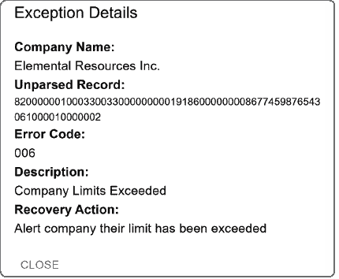

# 10 公司信息

### 本章节涵盖

+   添加支持公司仪表板的功能

+   添加公司信息组件

+   添加最近 ACH 批次组件

+   添加预期文件组件

+   添加公司限制组件

本章节探讨了我们在程序增量过程中的另一个迭代。业务部门之前已经规划了关于存储和显示公司信息的附加功能。基本上，业务部门现在要求一个公司级别的仪表板。此外，用户还提供了一些关于他们希望看到实施的附加功能的反馈，这些功能最初不在项目范围内，业务部门要求我们也将其包括在内。

## 10.1 赛跑计划

在这次赛跑中，我们创建了一个关注公司层面数据的仪表板。除了表格和 API 之外，我们的团队在此期间必须创建以下四个额外组件：

+   公司信息

+   最近批次

+   预期文件

+   公司限制

公司信息表在我们的赛跑中被识别为阻碍因素，因为它们必须在开始构建组件之前设计和构建。可能有可能从一些其他组件开始，几乎不需要重做，因为许多增强功能的表——如预期文件组件——只需要回到公司 ID 的外键要求。在这种情况下，可能可以开始工作而不需要外键，但其他更改，如显示客户信息，将需要构建到一定程度的表。图 10.1 显示了使用 PlantUML 创建的甘特图。


##### 图 10.1 ACH 仪表板增强时间线

## 10.2 公司信息

如前所述，这次赛跑完全是关于与公司合作。每个 ACH 文件都包含各种条目和附加记录的批次。这些批次与公司相关联。如果这些公司是我们金融机构的客户，我们就有机会提供各种关于它们的报告和控制。重要的是要理解，这些批次不一定来自与我们机构相关的公司——它们可能来自其他公司或我们与之合作的伙伴，以将交易交付给机构。我们为该仪表板构建的公司仪表板和组件将为我们的客户提供额外的 ACH 处理服务。虽然这些组件对公司来说可能不可或缺，因为它们提供了额外的审计、警报和控制的可能性，但它们并不是 ACH 标准的一部分。

我们必须创建数据库表和 API 来支持在数据库中存储和访问公司信息。这些公司是我们金融机构的商业客户，因此我们希望为他们提供超出通常可能需要的个人客户之外的信息和控制 ACH 文件。例如，为我们个人客户处理 ACH 批次通常会导致发布工资和其他预先安排的支付或借记。从个人的角度来看，除了批次内的交易正确记入其账户之外，他们对批次信息和统计数据没有兴趣。

如果我们将此与商业客户（公司）进行对比，他们可能非常关注批次信息，因为他们将能够知道批次内所有交易的总额。与个人客户管理单个交易的账户余额类似，公司需要了解批次内的所有交易，因为这些交易会影响公司。

虽然我们可能会从不是我们金融机构客户的公司接收和处理 ACH 批次，但在他们是客户的情况下，我们希望提供关于批次的额外详细信息。通过为这些公司创建数据库表，我们也打开了除了接收要处理的文件外，还可以生成文件的可能性，正如我们在整个项目中一直在做的那样。生成 ACH 文件超出了当前开发的范围，但它是我们可以考虑的，以增强我们的项目，作为构建一个完全功能的 ACH 系统的逻辑下一步。我们将用虚拟数据填充我们的公司表，以便我们在本章中有所作为。

### 10.2.1 数据库设计：公司信息

除了第九章（列表 9.20）中的`audit_log`和第八章中的`bank_routing_numbers`表之外，我们不得不添加许多与 ACH 无关的表。有了支持公司信息，我们现在可以添加更多表和支持类型。首先，从公司表开始，看看我们需要跟踪什么是有意义的。

列表 10.1 向我们的数据库中引入了几种自定义类型。对于`tax_id_type`和`industry`字段，我们创建了新的自定义类型以提供一些验证并协助数据录入。这些自定义类型有助于强制执行我们期望在字段中存在的数据值，从而防止输入错误数据。

`tax_id_type`和`tax_id_number`是相关的，因为在美利坚合众国，个人被分配的不仅仅是社会保险号（SSN），例如雇主识别号（EIN）和个人税务识别号（ITIN）等。因此，我们给字段一个更通用的名字，而不是简单地称之为`ssn`或`ein`。我们默认为`EIN`，因为公司更有可能使用 EIN 号码。

`行业`字段用于报告目的，以便各种报告和营销活动可以在用户希望按行业钻取或创建报告时过滤行业。`logo`字段用于存储公司的图像，以便在需要时将图像加载到公司页面上，并且仅用于使页面和报告看起来更美观。我们使用了一种新的类型`BYTEA`，可以存储二进制数据。虽然将标志存储在数据库外对于 UI 性能会有所帮助，但能够将所有内容保持在数据库中可以防止我们引入其他技术，如 AWS S3 或 CDN。

列表 10.1 显示了`create` `table`语句。`ach_company_id`用于在 ACH 中识别公司。此字段对应于 ACH 系统中批量头记录（类型 5）上的公司识别字段。虽然通常使用 EIN 号码或其变体，但使用它不是强制性的。我们只需要记住该字段长度为 10 位，在创建文件时应使用前导零进行填充，以保持文件格式。

##### 列表 10.1  存储公司详情的表

```py
CREATE TABLE company (
    company_id UUID PRIMARY KEY 
                     DEFAULT uuid_generate_v4(),
    name VARCHAR(255) NOT NULL,
    tax_id_type TIN_TYPE NOT NULL DEFAULT 'EIN',  #1
    tax_id_number VARCHAR(9) NOT NULL,
    ach_company_id NUMERIC(10) NOT NULL, #2
    duns NUMERIC(9) DEFAULT NULL,  #3
    logo BYTEA DEFAULT NULL,   #4
    website VARCHAR(255) DEFAULT NULL,
    industry INDUSTRY_TYPE DEFAULT NULL,
    created_at TIMESTAMP NOT NULL DEFAULT NOW(),
    updated_at TIMESTAMP NOT NULL DEFAULT NOW()
);
```

#1 定义了具有默认值 EIN 的`tax_id_type`，因为，很可能是将使用这种类型的值

#2 在 ACH 类型 5 记录（批量头）上使用的公司识别号

#3 许多公司有一个 DUNS 号码，在作为公司注册时，许多服务都需要这个号码。

#4 我们将标志存储为 BYTEA，这样我们就可以将图像上传到数据库。通常，这是一个存储图像位置的 URL。将图像存储在我们的数据库中只是为了方便。

之前列表中的自定义类型需要在创建表之前定义。创建类型是一个简单的过程，并且拥有这些自定义类型可以帮助我们在数据库和字段上增加一个额外的验证级别。当然，这种方法可以根据我们的应用程序需求而变化。例如，将这些值作为字符串存储在数据库中，或者可能作为数值存储，同时将标签存储在另一个位置，这也是可以接受的。

根据几个因素（公司政策、团队成员、应用程序、数据库等），可能更倾向于将值存储在另一个表中，而不是在数据库中定义类型，以避免数据库变更请求。由于我们的值有限，而且它们不需要经常更改，所以我们很乐意将它们定义为类型。以下列表显示了我们的`industry_type`和`tin_type`的创建。

##### 列表 10.2  `industry_type`和`tin_type`

```py
CREATE TYPE industry_type AS ENUM ('basic materials', …, 'utilities');

CREATE TYPE tin_type AS ENUM ('SSN', 'EIN', 'ITIN', 'ATIN', 'PTIN');
```

如所示，创建一个存储值的类型很简单。我们可能关心的另一个问题——这也是团队成员可能争论使用单独表的原因——是提取有效值列表的能力（例如，如果我们想在 UI 端构建 `tin_type` 的动态下拉列表）。以下列表显示了如何提取 `ENUM` 类型的标签。

##### 列表 10.3  在 Postgres 中返回 `ENUM` 的标签

```py
SELECT e.enumlabel AS label  #1
  FROM pg_type AS t #2
  JOIN pg_enum AS e   #2
    ON t.oid = e.enumtypid #2
 WHERE t.typname = 'tin_type'; #3
```

#1 返回我们的 ENUM 的标签

#2 需要返回 ENUM 标签的 Postgres 表

#3 我们感兴趣的特定 ENUM 类型

一旦我们建立了公司表，我们就可以创建一个地址表。它将显示两个地址——邮寄地址和街道地址——我们使用 `address_type` 来定义。表中的其余部分在需要存储的内容方面是标准的。我们允许地址有四行，以覆盖公寓/楼层编号或其他信息，以及城市、州和邮政编码等标准字段。

##### 列表 10.4  `address_type` 及其表

```py
CREATE TYPE address_type AS ENUM ('mailing', 'street'); #1

CREATE TABLE company_address (
    company_address_id UUID DEFAULT uuid_generate_v4(),
    company_id UUID NOT NULL REFERENCES company(company_id)    #2
                           ON DELETE CASCADE ON UPDATE CASCADE, 
    address_type ADDRESS_TYPE NOT NULL DEFAULT 'mailing',  #3
    address_line_1 VARCHAR(255) NOT NULL,     #4
    address_line_2 VARCHAR(255) DEFAULT NULL,  #4
    address_line_3 VARCHAR(255) DEFAULT NULL,  #4
    address_line_4 VARCHAR(255) DEFAULT NULL, 
    city VARCHAR(255) NOT NULL,   #5
    state VARCHAR(2) NOT NULL,     #5
    zip_code NUMERIC(5) NOT NULL,   #5
    zip_code_4 NUMERIC(4) DEFAULT NULL, 
    created_at TIMESTAMP NOT NULL DEFAULT NOW(), #6
    updated_at TIMESTAMP NOT NULL DEFAULT NOW(), 
    PRIMARY KEY (company_id, address_type)  #7
);
```

#1 定义可能的邮寄地址类型

#2 此记录与公司相关联，因此定义了外键。

#3 默认地址类型为邮寄地址

#4 标准地址行，留有部门或楼层编号的空间

#5 标准地址行

#6 可帮助审计的字段

#7 通过定义一个同时使用地址类型的唯一主键来防止公司有超过一个地址

我们还创建了一个名为 `company_phone` 的表来存储公司的电话号码。同样，我们定义了一个 `phone_type` 来标识不同的电话类别。我们还定义了公司和电话类型的唯一主键，以便每个公司只能定义一种电话类型。另一个限制是确保 `phone_number` 和 `extension` 的唯一性，以便电话号码不能被重复使用。

##### 列表 10.5  `company_phone` 类型及其表

```py
CREATE TYPE phone_type AS ENUM ( 'main', 'direct', 'department', #1
'fax', 'toll-free', 'mobile', 'home', 'other');   

CREATE TABLE company_phone (
    company_phone_id UUID DEFAULT uuid_generate_v4(),
    company_id UUID NOT NULL REFERENCES company(company_id) #2
                             ON DELETE CASCADE ON UPDATE CASCADE, 
    phone_type VARCHAR(25) NOT NULL,  #3
    phone_number NUMERIC(10) NOT NULL,  #3
    extension NUMERIC(5) DEFAULT NULL,  #3
    created_at TIMESTAMP NOT NULL DEFAULT NOW(), #4
    updated_at TIMESTAMP NOT NULL DEFAULT NOW(), 
    PRIMARY KEY (company_id, phone_type), #5
    UNIQUE (phone_number, extension) #6
);
```

#1 定义了电话类型的可能值

#2 该表通过外键与公司表相关联。

#3 电话号码字段

#4 审计字段

#5 防止每个公司有超过一种电话类型

#6 防止使用超过一个电话号码

现在我们应该有足够的数据库结构来支持我们在 ACH 仪表板中的公司。当处理 ACH 文件时，其中大部分信息并非绝对必要，但额外的信息将有助于我们扩展项目以实现不同的功能。

### 10.2.2 使用生成式 AI 生成模拟数据

我们可以使用生成式 AI 通过为我们的公司创建一些测试数据来帮助我们提高生产力。使用我们为 SQL 类型 `industry_type` 定义的行业，我们可以指示 ChatGPT 执行以下操作：

**** 给定以下行业列表“‘基础材料’，……‘公用事业’”，为每个行业创建虚假的公司名称、地址信息和标志。

我们提供了公司名称，例如 Elemental Resource Inc.，地址为 123 Mineral Lane，Boulder，CO 80301。我们还要求随机生成的 EIN 和 DUNS 号码。也有可能看到 ChatGPT 能否与我们分享一些有趣的电话号码，我们可以将其包含在我们的数据中。例如，如果你团队里有喜欢 Phil Collins 或 Hall and Oates 的人，这里有两个有趣的号码：

+   424-888-PHIL (7445)，被称为 Phil Call-Ins 热线，在这里你可以听到 Phil Collins 的歌曲。

+   719-266-OATES (2837)，被称为 Callin Oates 热线，在这里你可以听到 Hall and Oates 的各种歌曲。

虽然一些有趣的测试数据可以让我们的日子变得愉快，但我们还需要将这些数据全部整合到 SQL 中。到目前为止，我们一直将所有 SQL 保存在 Dockerfile 中的 init.sql 中，以创建表和数据。由于需要输入生成的公司数据，我们想要进行一些结构调整。我们创建了一个名为`sql`的子文件夹，并将目前存在于 init.sql 中的所有`SQL`命令移动到该文件夹中，同时将它们拆分成不同的文件。现在应该更容易管理和更新我们的 SQL，根据需要。以下列表显示了我们的 Docker 文件夹的新结构。

##### 列表 10.6  数据库的 Docker 文件夹结构

```py
docker/
├─ db/
│  ├─ sql_scripts/
│  │  ├─ sql/
│  │  │  ├─ create_tables.sql
│  │  │  ├─ general_ach_data.sql
│  │  │  ├─ elemental_resources_inc.sql
│  │  ├─ init.sql
```

接下来，我们更新 init.sql 文件，使其引用新的文件。

##### 列表 10.7  更新 init.sql 文件

```py
…
\i /docker-entrypoint-initdb.d/sql/create_tables.sql #1
\i /docker-entrypoint-initdb.d/sql/general_ach_data.sql #2
\i /docker-entrypoint-initdb.d/sql/ #3
➥elemental_resources_inc.sql
…
```

#1 包括创建表的操作。

#2 包括一般的 ACH 数据，如异常信息。

#3 每家公司可以存储在自己的文件中。

每家公司都使用以下 SQL 语句添加。

##### 列表 10.8  添加公司

```py
DO
$$
    DECLARE
        saved_uuid UUID; #1
    BEGIN
        WITH company_insert AS (        #2
            INSERT INTO company (name, tax_id_number, #3
                                duns, industry, logo)  #4
                VALUES ('Elemental Resources Inc.', 459876543,  #4
        123456789, 'basic materials', 'data:image/webp;base64,...') 
                RETURNING company_id #4
        ) 
        SELECT company_id INTO saved_uuid FROM company_insert; #5

        INSERT INTO company_address (saved_uuid, address_line_1, #6
                                     city, state, zip_code)   #7
        VALUES (saved_uuid, '123 Mineral Lane',  #7
               'Boulder', 'CO', 80301); 

        INSERT INTO company_phone (saved_uuid, phone_number) #7
        VALUES (saved_uuid, '7192662837'); 
    END
$$;
```

#1 创建一个名为 saved_uuid 的变量，因为我们需要在其他插入操作中用它来满足外键约束。

#2 使用 CTE（公用表表达式）来插入公司。

#3 插入包含我们的测试数据的记录。

#4 返回数据库分配的 company_id。

#5 使用我们的 CTE 将 company_id 保存到我们的 saved_uuid 中。

#6 使用存储的公司 ID 插入地址。

#7 使用存储的公司 ID 插入电话。

我们可以告诉 ChatGPT 使用之前的列表作为模板来插入它之前生成的公司数据。让 ChatGPT 生成一些这样的设置代码，使得将一些默认公司添加到数据库中变得更容易。我们当然可以自己完成它，但这会有些繁琐且容易出错，因为我们复制/粘贴了数据。

### 10.2.3 API 设计

我们从一个简单的单元测试开始，加入一些新变化以确保我们可以得到`200` `HTTP`响应码，这将表明我们已成功到达端点。正如我们所见，当我们的容器启动时，我们默认的公司会被加载到数据库中。通常，我们会在每次测试中使用`SqlUtils().truncate_all()`来清空我们的数据库，如果我们想避免截断某个表，我们需要更新那个方法以排除那个特定的表。以这种方式运行我们的测试也要求容器处于运行状态。

我们现在将创建一个测试，使用 Testcontainers 启动和停止我们的容器，以便每次都能收到一个新的数据库。这使得测试自包含，这对于我们必须将项目移入 CI/CD 环境来说非常完美。

##### 列表 10.9  使用 Testcontainers 的初始单元测试

```py
…
@pytest.fixture(scope="class") #1
def client():  #1
    return TestClient(app)  #1

@pytest.fixture(scope="module") #2
def docker_compose():   #2
    absolute_path = Path("../../../../docker/db").resolve()  #2
    with DockerCompose(absolute_path) as compose:  #2
        compose.start()  #2
        yield compose #2
        compose.stop()  #2

class TestCompanyApis:

    @pytest.fixture(autouse=True) #3
    def mock_client_host(self):  #3
        with patch(  #3
            "fastapi.Request.client",  #3
            new_callable=lambda: type("Client", (),   #3
                             {"host": "127.0.0.1"}),  #3
        ):  #3
            yield #3

    def test_get_companies(self, client, docker_compose): #4
        response = client.get("/api/v1/companies")  #5
        assert response.status_code == 200, response.text #5
```

#1 定义一个用于测试调用的工具

#2 使用 Docker Compose 定义容器，因为我们一直在整个项目中使用它。一切如预期设置。

#3 定义了我们记录的 IP 地址

#4 定义了一个测试，验证我们是否成功返回；还可以对响应进行进一步验证。

现在我们有了一种在隔离环境中运行测试的方法。我们越能隔离测试并保持其自包含，其他团队成员在自己的环境中运行它们就会越容易。这样，我们可以避免“在我的机器上工作”（WOMM）问题——这是软件开发中一个常见的主题。

我们现在遵循与之前 API 相同的公式。我们首先创建一个可以返回的记录，其中包含我们将显示为概览的一些公司信息。在这个阶段，我们只想能够显示公司列表，用户可以进一步深入了解。在下面的列表中，我们定义了一个 `IndustryType` 枚举。

##### 列表 10.10  `IndustryType` 枚举

```py
class IndustryType(Enum):
    BASIC_MATERIALS = "basic materials"
    CONSUMER_GOODS = "consumer goods"
    CONSUMER_SERVICES = "consumer services"
    FINANCIALS = "financials"
    HEALTHCARE = "healthcare"
    INDUSTRIALS = "industrials"
    OIL_AND_GAS = "oil & gas"
    TECHNOLOGY = "technology"
    TELECOMMUNICATIONS = "telecommunications"
    UTILITIES = "utilities"
```

我们定义了一个 `CompanyOverviewRecord`，如下面的列表所示。虽然你之前已经看到了大部分代码，但我们包括了一个正则表达式来验证图像是页面显示的有效格式。

##### 列表 10.11  `CompanyOverview` 记录

```py
class CompanyOverviewRecord(BaseModel):
    company_id: Optional[UUID4] = Field(
        None,
        title="Company ID",
        description="Unique identifier for the company.",
    )
    name: Optional[str] = Field(
        None,
        title="Name",
        description="Name of the company.",
        max_length=255,
    )
    industry: Optional[IndustryType] = Field( #1
        None,
        title="Industry",
        description="Type of industry the company operates in.",
    )
    logo: Optional[str] = Field(
        None,
        title="Logo",
        description="Base64 Image of the Logo.", #2
        pattern=r"^data:image\/[a-zA-Z]+; #3
➥base64,[A-Za-z0-9+/=]+$" 
  )
```

#1 我们使用 `IndustryType` 来帮助进行验证。

#2 声明标志应为 Base64 编码

#3 使用正则表达式强制执行正确的格式

接下来，我们创建了一个类来处理与公司相关的任何 SQL 调用。下面的列表显示了使用 `row_factory` 的简单 `SELECT` 语句 `class_row`。在这种情况下，我们只是返回数据而不进行数据操作，我们也可以同样容易地使用 `dict_row`——选择实际上取决于我们的应用程序需求。

##### 列表 10.12  `CompaniesSql` 类

```py
class CompaniesSql:

    def get_all_companies(self) -> list[CompanyOverviewRecord]:
        with get_db_connection(row_factory= #1
➥class_row(CompanyOverviewRecord)) as conn: 
            result = conn.execute(
                """
                SELECT company_id, name, industry, logo FROM companies #2
                """,
                [],
            )

        records = result.fetchall() #3

        return records
```

#1 获取数据库连接并将 `row_factory` 设置为 `class_row` 以用于 `CompanyOverviewRecord`

#2 限制我们返回的字段；我们更喜欢特定的字段而不是“*”。

#3 返回所有记录

我们几乎完成了！现在我们需要添加端点。我们从底部开始构建，因为我们觉得这样在开发 API 时会更合理。然而，我们也可以从定义端点开始，深入到检索数据的细节。

##### 列表 10.13  获取所有公司的端点

```py
router = APIRouter(prefix="/api/v1/companies") #1
…
@router.get(  #2
    path="",  #2
    response_model=list[CompanyOverviewRecord],  #2
    summary="Retrieve an Overview of Companies",  #2
    description="Return a list of defined companies.",  #2
    response_description="An overview of the company.",  #2
    tags=["Company"],  #2
)
@log_message("Company Overview") #3
async def get_company_overview(request: Request) ->   #4
list[CompanyOverviewRecord]: 
    return CompaniesSql().get_all_companies() #5
```

#1 我们为所有端点分配一个前缀。

#2 API 的标准文档

#3 我们使用的注解为 API 提供一些审计信息

#4 定义了函数，它将返回一个 `CompanyOverviewRecords` 列表

#5 获取所有公司的 SQL 调用

最后，我们只需要将路由器添加到我们的 main.py 中。我们进行了一些重构，将路由器添加到数组中并通过循环而不是多个`include_router`语句来处理。以下列表显示了重构的结果。

##### 列表 10.14  重构`app.include_router`

```py
routers = [files.router, audit.router, #1
➥ companies.router] 
for router in routers: #2
    app.include_router(router) 
```

#1 定义路由器数组

#2 遍历它们并将每个都包含在内，这防止了有些冗余的 include_router 语句

这样，我们通过了测试，但不应止步于此。验证返回的数据同样重要，而不仅仅是收到有效的响应代码`200`。我们应该花点时间思考还需要验证什么，以便在通过测试后自信地发布代码。

在这种情况下，我们可能会收到`200`响应代码，但没有收到任何公司。如果数据库已经填充了公司数据，我们应该检查这些公司名称是否存在？或者可能是一部分这些公司？我们只想强调测试的目的是对所编写的代码有信心。即使我们无意在成功自动测试后发布代码到生产环境，拥有一个覆盖并彻底测试我们代码的测试套件，使我们能够自信地发布它，也是一个有价值的目标。

顺便提一下，除了从数据库中读取公司的能力外，对于一个完全功能的仪表板，我们还需要添加、更新和删除的能力。这将是休息一下、拉取项目的一个版本、忙于一些全栈开发的好时机！

### 10.2.4 用户界面

创建用户界面的第一步是在 NavButtons.tsx 中添加一个按钮，以便我们可以导航到新页面。找到合适的图标应该是这个过程中最困难的部分。幸运的是，Material UI 提供了足够多的图标供选择。

##### 列表 10.15  NavButtons.tsx

```py
<ListItemButton onClick={() => route.push("/companies")}> #1
   <ListItemIcon> #2
 <Store/> #2
 </ListItemIcon> 
  <ListItemText primary="Companies"/> #3
</ListItemButton>
```

#1 当导航按钮被点击时，我们导航到公司页面。

#2 定义要显示的图标

#3 设置文本为“公司”

当导航到公司页面时，将提供公司列表。我们使用与其他页面相同的模式。page.tsx 调用 API 检索公司信息，并将其传递给另一个组件以实际显示它。

##### 列表 10.16  `CompanyListing`页面

```py
export default function CompaniesOverviewPage() { #1

    const [companies, setCompanies] =  #2
useState<CompaniesListingResponse[]>([]); 

    useEffect(() => {
        const apiUrl = process.env.NEXT_PUBLIC_API_URL ?? ''; #3
        axios.get<CompaniesListingResponse[]> #4
➥(`${apiUrl}/companies`, { 
…
            .then(response => { #5
                setCompanies(response.data); 
            })
…
                    <CompaniesListing companies={companies}/> #6
…
```

#1 定义页面函数

#2 存储公司的变量；默认为空数组

#3 API 的 URL；当环境变量未定义时默认为空字符串

#4 API 调用

#5 当响应成功时，从响应数据中设置公司

#6 将公司传递给 CompaniesListing

下面的列表中显示的 `CompaniesListing` 组件添加了几个我们没有使用的新项目。DataGrid 元素的 `onRowClick` 允许我们在行的任何地方点击并导航到该公司的详细信息，以及行高属性，这样我们可以更好地查看公司图像。我们还创建了一个 `ImageBase64` 来封装显示图像所需的一些组件。

##### 列表 10.17  `CompanyListing` 组件

```py
interface CompaniesListingProps {  #1
    companies: CompaniesListingResponse[];  #1
}  #1

export default function CompaniesListing({companies}: #2
Readonly<CompaniesListingProps>) { 

    const route = useRouter(); #3
    const columns: GridColDef[] = [ #4
        {field: 'view', headerName: '', sortable: false,
            width: 100, renderCell: (params) => (
            <ImageBase64 base64={params.row.logo} #5
                         alt={params.row.name}  #5
                         width="100%" maxWidth="200px" />  #5
            )},
        {field: 'name', headerName: 'Name', width: 300 },
        {field: 'industry', headerName: 'Industry', width: 150 },
    ];

    const handleRowClick = (params: { id: any; }) => { #6
        const companyId = params.id;  #7
        route.push(`/companies/${companyId}/dashboard`);  #7
    };  #7
…
       <DataGrid
          rowHeight={100}
          columns={columns} 
          rows={companies} 
          getRowId={(row) => row.company_id}
          onRowClick={handleRowClick} #7
       />
…
```

#1 定义此组件的属性

#2 函数将属性定义为 Readonly。

#3 获取一个路由对象，以便我们可以按需导航

#4 DataGrid 的列定义

#5 一个可以显示公司标志的图像元素

#6 定义当行被点击时执行的行点击方法，并带我们到公司仪表板

#7 使用 onRowClick 处理用户在 DataGrid 中点击行

`ImageBase64` 很简单——我们有一个程序来确保图像处于正确的格式，如下面的列表所示。这允许我们执行验证，如果没有正确格式的字符串，我们返回一个空字符串。

##### 列表 10.18  `Base64` 图像

```py
const isBase64Image = (base64: string) => {  #1
    const regex = /^data:image\/[a-zA-Z]+;base64,/;  #1
    if (!regex.test(base64)) {  #1
        return '';  #1
    } else {  #1
        return base64;  #1
    }  #1
}  #1

export default function ImageBase64({base64, #2
      alt = 'Image',  width = '100%',  maxWidth = '100px'}:  #3
➥ Readonly<ImageProps>) {  #3

    const imageSource = isBase64Image(base64); #3

    return (
        <Box  #4
            component="img"  #4
            src={imageSource}  #4
            alt={alt}  #4
            sx={{  #4
                width: width,  #4
                maxWidth: maxWidth,  #4
            }}  #4
        />  #4
    );
}
```

#1 一个函数，确保我们有一个格式正确的 src 字符串以在源标签中显示图像。如果没有，我们返回一个空字符串，这将显示图像的 alt 标签。

#2 定义组件以允许有多个属性和默认值，如果未传递则使用默认值

#3 将函数调用的结果分配给 isBase64Image 并赋值给 imageSource

#4 没有 img 组件；相反，适当的参数传递给一个 Box 元素。

我们当然可以在我们的组件或页面上直接使用 `Box` 元素，但将元素包装并作为其自身的组件处理有一些好处。我们可以在多个区域使用这种策略，并在整个代码中强制一致性。拥有一个专门的 `ImageBase64` 可能过于具体。我们可以创建一个更通用的元素，并传递一个类型给它，该类型确定我们使用的 `src` 类型并执行必要的验证。

到目前为止，我们有了存储公司信息的数据库结构和访问公司信息的 API。我们还创建了一个能够列出我们公司的组件，如图 10.2 所示。


##### 图 10.2  列出公司的组件

现在我们可以在数据库中查看公司，我们开始组装我们的公司仪表板。

## 10.3 公司仪表板

在放置了导航到公司列表的方法之后，我们希望能够显示一个公司级别的仪表板。这个功能将允许我们创建一些其他组件——尽管这些组件不一定仅针对公司（我们可以在文件级别集成这些组件的版本）——可以提供特定于公司的信息，并为我们的应用程序的增长提供其他方向。

### 10.3.1 公司仪表板的导航

通过查看所有公司的方法，我们希望能够深入挖掘并到达公司仪表板。支持公司列表和仪表板的所需结构在列表 10.19 中显示。

##### 列表 10.19  公司的 UI 结构

```py
src/
├─ app/
│  ├─ companies/
│  │  ├─ [companyId]/
│  │  │  ├─ dashboard/
│  │  │  │  ├─ page.tsx #1
│  │  ├─ page.tsx #2
```

#1 此页面将包含特定公司的仪表板；[companyID] 将是公司的 UUID。

#2 这是显示在图 10.2 中的公司列表页面。

在页面结构设置完成后，我们只需要创建一个空白的仪表板页面，该页面可以填充特定公司的组件。我们可以使用我们的文件级仪表板作为模板。

##### 列表 10.20  空公司仪表板

```py
…
export default function CompanyDashboard({params}: any) {

    const companyId: string = params.companyId; #1
    const [company, setCompany] 
                     = useState<Company | undefined>(undefined); #2
…
    useEffect(() => {   #3
        const apiUrl = process.env.NEXT_PUBLIC_API_URL ?? ''; 
axios.get<CompanyDetailResponse>(`${apiUrl} 
➥/companies/${companyId}`, { 
… 
            .then(response => { 
        console.log(`Response data ${JSON.stringify
➥(response.data)}`); 
… 
    }, []); 

    return (
…
                    <Typography>Empty Company Dashboard</Typography> #4
…
    );
}
```

#1 从 URL 中获取公司 ID；这是由于我们使用的基于文件的路由和定义的 [companyId] 目录所实现的。

#2 存储公司

#3 获取公司详细信息

#4 仪表板占位符以验证导航

虽然我们现在可以导航到仪表板并获取公司详细信息，但仪表板略显空旷。然而，在我们开始创建仪表板组件之前，我们需要为公司准备 ACH 批次。下一节将展示如何使用公司特定数据生成 ACH 文件。

### 10.3.2 为我们的公司创建 ACH 文件

我们已经创建了用于生成仪表板 ACH 文件的 BDD 风格测试。幸运的是，我们可以使用相同的代码来为我们的公司创建特定文件。以下列表显示了我们编写的用于创建构建公司仪表板测试文件的示例场景。我们仅使用 ChatGPT 获取一些可能适合公司客户的原始名称。

##### 列表 10.21  为 Elemental Resources Inc. 创建文件

```py
  Scenario: Create an ACH file for company "Elemental Resources Inc"
    Given I want to create an ACH file named "elemental_resources.ach"
    And I want to have an immediate destination of "990000013"
    And I want to have an immediate origin of "987654321"
    And I want to have 2 batch with ACH credits and debits
➥ and a standard entry class code of "PPD"
    And I want 10 entries per batch with random amounts
➥ between 100 and 5000
    And I want to use individual names of "Rocky Gravel, Sandy Stone,
 Clay Earthman, Mason Bricks, Gemmy Quartz, Rusty Ironwood, 
Flint Stoney, Dusty Boulderson, Shelly Shale"
    And I want to have company name "ElementalResourcesInc"
➥ and company id "459876543"
    When my ACH is created
    Then I should have a file of the same name
    And there should be 2 batch in the file
    And there should be 20 entries in the file
```

在这里，我们只需确保我们的公司名称不要太长，因为这可能会影响记录。在我们的原始代码中，我们确保当字段太短时，该字段本身被填充到 16 个字符。现在，我们遇到了相反的问题，我们输入了一个 22 个字符的字段。以下列表显示了一块简单的代码，可以用来截断公司名称。

##### 列表 10.22  截断和填充公司名称

```py
setup_info["company_name"] = company_name[:16].ljust(16, " ")
```

可能会诱使你遍历代码并找到所有看起来应该截断字符串的区域。如果你选择这条路，请确保为测试留出足够的时间。

##### 是修复还是不修复？

我们之前遇到过类似的生产问题，并不得不决定是否需要扩大故事的范围（例如，在特定字段上报告了无效金额）。用户故事最初是为了修复报告为错误的单个字段而编写的；然而，在研究问题和找到根本原因后，我们发现问题模式在程序的其他几个地方也被使用。由于导致向第三方发送无效数据的问题，我们决定更新故事并扩大范围（即增加故事点），以便全面解决问题。

将公司数据和特定的公司 ACH 文件加载到数据库后，我们可以开始构建仪表板。

## 10.4 公司信息组件

我们想要构建的第一个组件是一个包含更多公司详细信息的屏幕。这些信息将只是一些可以按需编辑的附加信息。

我们创建了所需的`Pydantic`类，用于返回数据。我们在`CompanyDetailRecord`中返回比我们需要显示更多的信息，因为数据还将传递到一个所有数据都可以更新的表单中。以下列表显示了返回`Address`和`Phone`对象数组的`CompanyDetailRecord`。公司对于`Address`和`Phone`类型有一个一对多关系，因此可能有多行。

##### 列表 10.23  `CompanyDetailRecord`字段

```py
class CompanyDetailRecord(BaseModel):
    company_id: Optional[UUID4] = Field(
        None,
        title="Company ID",
        description="Unique identifier for the company.",
    )
    name: Optional[str] = Field(
        None,
        title="Name",
        description="Name of the company.",
        max_length=255,
    )
…
    addresses: Optional[list[Address]] = Field( #1
        None,                    #1
        title="Addresses",  #1
        description="List of Addresses.",  #1
    )  #1
    phones: Optional[list[Phone]] = Field( #2
        None,  #2
        title="Phones",  #2
        description="List of Phone Numbers.",  #2
    )  #2
```

#1 使用数组存储公司地址的 Address 对象

#2 使用数组存储公司电话号码的 Phone 对象

由于地址和电话记录是数组，我们发现构建`CompanyDetailRecord`比我们之前的数据检索要复杂一些。这是因为，以前，我们只是从数据库中拉取一个记录并将其映射到对象。现在，我们需要处理来自多个表的多行数据。

我们可以遵循几种方法，但我们希望保持与过去一样的单一查询。然而，根据我们的查询设计，这可能会在公司表中重复字段。返回重复数据并不是世界末日；然而，这是一个表明有改进空间的指标。毕竟，我们非常小心，没有简单地使用星号（这可能导致返回我们无意使用的字段）。重复数据可能会因为性能原因而引起关注，也可能导致开发人员之间的混淆。

这可能并不明显，但对于每个地址和电话号码，列表 10.24 中的查询将返回一行。因此，如果我们有两个地址和三个电话号码，我们将从查询中接收到五行。考虑到预期的地址和电话号码数量，这一点在此阶段并不极端有问题。我们确实返回了相对大量的图像数据，但如前所述，将数据存储为`Base64`编码的字符串是出于方便考虑。

此外，我们使用`LEFT JOIN`，因为我们无法保证公司会有地址或电话信息。如果我们使用`INNER JOIN`，公司需要查询返回地址和电话号码。虽然没有地址/电话的公司记录不太可能，但并非不可能。也许最初的记录已经设置好了，但由于商业原因，地址没有填写（可能没有官方的地址文件），或者也许在转换或迁移过程中，字段没有正确传输。

##### 列表 10.24  查询以返回公司详细信息

```py
   SELECT c.company_id, c.ach_company_id, c.name, c.tax_id_type,#1
c.tax_id_number, c.duns, c.logo, c.website, c.industry, 
ca.company_address_id, ca.address_type, ca.address_type, #2
ca.address_line_1, ca.address_line_2, ca.address_line_3,  #2
ca.address_line_4, ca.city, ca.state,  #2
ca.zip_code, ca.zip_code_4,  #2
cp.company_phone_id, cp.phone_type, #3
cp.phone_number, cp.extension
FROM companies AS c
LEFT JOIN company_addresses AS ca USING (company_id) #4
LEFT JOIN company_phones AS cp USING (company_id) 
WHERE company_id = %s #5
```

#1 我们根据各自的表组织了选定的字段，这些字段来自公司表。

#2 这些字段来自公司地址表。

#3 这些字段来自公司电话表。

#4 我们使用 LEFT JOIN，因为记录不需要在这些表中。

#5 通过公司限制我们的详细信息，其中%s 是一个占位符

我们有多个行，需要应用逻辑来确保重复的数据不会被返回。以下列表显示了完成此任务的全方法。我们必须遍历每个记录，并使用哈希来确保`id`之前没有被遇到。

##### 列表 10.25  返回公司详细信息

```py
def get_company_by_id(self, company_id: UUID) -> CompanyDetailRecord:
   with get_db_connection(row_factory=dict_row) as conn:
      result = conn.execute(
…
      )

      rows = result.fetchall() #1

      if not rows: #2
         raise KeyError(f"Record with id {company_id} not found") 

      addresses = {} #3
      phones = {} 
        for row in rows: #4
           if row["company_address_id"] not in addresses: #5
              addresses[row["company_address_id"]] = Address(  #5
              …  #5
              )  #5
           if row["company_phone_id"] not in phones: #6
               …  #6
              )  #6

        company_data = {
            "company_id": rows[0]["company_id"], #7
            "name": rows[0]["name"],  #7
            "tax_id_type": rows[0]["tax_id_type"],  #7
            "ach_company_id": rows[0]["ach_company_id"],  #7
            "tax_id_number": rows[0]["tax_id_number"],  #7
            "duns": rows[0]["duns"],  #7
            "logo": rows[0]["logo"],  #7
            "website": rows[0]["website"],  #7
            "industry": rows[0]["industry"],  #7
            "addresses": list(addresses.values()), #8
            "phones": list(phones.values()), 
        }

        return CompanyDetailRecord(**company_data) #9
```

#1 获取我们 SQL 查询的所有行

#2 如果没有找到详细信息，这是一个错误，并以此方式报告。

#3 设置空的哈希来存储我们的数据

#4 遍历返回的每一行

#5 在需要时创建一个地址对象

#6 当我们遇到一个之前未遇到的电话号码时创建一个电话对象

#7 我们可以直接引用第一行的公司字段。

#8 从我们的哈希中创建一个数组

#9 使用公司数据创建一个对象

虽然这段代码按预期工作，但我们可以通过使用更复杂的 SQL 来压缩结果数据集。我们已经在之前的示例中探讨了 Postgres 中的 CTE，并且可以使用 Postgres 中的一些 JSON 处理功能。权衡是，我们的 SQL 可能变得不太便携，但 JSON 处理在 MySQL 等主要数据库中也是可用的，只需稍作修改。以下列表显示了更新的 SQL。

##### 列表 10.26  使用 Postgres CTE 获取公司数据

```py
WITH company_info AS (
   SELECT c.company_id, c.ach_company_id, c.name, c.tax_id_type,
          c.tax_id_number, c.duns, c.logo, c.website, c.industry
     FROM companies AS c
    WHERE c.company_id = %s
),
addresses AS (
   SELECT ca.company_id, #1
          JSON_AGG(   #1
             JSON_BUILD_OBJECT(  #1
                'company_address_id', ca.company_address_id,  #1
                'address_type', ca.address_type,  #1
                'address_line_1', ca.address_line_1,  #1
                'address_line_2', ca.address_line_2,  #1
                'address_line_3', ca.address_line_3,  #1
                'address_line_4', ca.address_line_4,  #1
                'city', ca.city,  #1
                'state', ca.state,  #1
                'zip_code', ca.zip_code,  #1
 'zip_code_4', ca.zip_code_4 #1
  )  #1
          ) AS addresses #1
     FROM company_addresses AS ca  #1#2
     WHERE ca.company_id = %s #3
     GROUP BY ca.company_id #4
),
phones AS ( #5
   SELECT cp.company_id, 
          JSON_AGG( 
             JSON_BUILD_OBJECT( 
                'company_phone_id', cp.company_phone_id, 
                'phone_type', cp.phone_type, 
                'phone_number', cp.phone_number, 
                'extension', cp.extension
             ) 
          ) AS phones
     FROM company_phones AS cp #6
     WHERE cp.company_id = %s
     GROUP BY cp.company_id
) 
SELECT ci.company_id, ci.ach_company_id, ci.name,
ci.tax_id_type,  ci.tax_id_number, ci.duns, 
ci.logo, ci.website, ci.industry, 
COALESCE(a.addresses, '[]'::json) AS addresses, #7
COALESCE(p.phones, '[]'::json) AS phones
FROM company_info AS ci
LEFT JOIN addresses AS a ON ci.company_id = a.company_id
LEFT JOIN phones AS p ON ci.company_id = p.company_id;
```

#1 使用`JSON_AGG`和`JSON_BUILD_OBJECT`创建公司的地址数组

#2 使用`company_addresses`表

#3 仅选择我们公司的记录

#4 按公司 _id 对记录进行分组

#5 使用`JSON_AGG`和`JSON_BUILD_OBJECT`创建公司的电话数组

#6 使用 JSON_AGG 和

JSON_BUILD_OBJECT 创建公司的电话数组

#7 使用 COALESCE 在表中没有记录时返回一个空的 JSON 数组

应用程序变得更加流畅，如下面的列表所示。我们可以使用 `**` 将返回的 JSON 解包成传递给相应对象的键值参数，从而创建一个元素列表。

##### 列表 10.27 返回数据的 Python 代码

```py
        row = result.fetchone()

        if not row:
            raise KeyError(f"Record with id {company_id} not found")

        addresses = [Address(**address) for #1
➥ address in row["addresses"]]  #2
        phones = [Phone(**phone) for phone in row["phones"]] 

        company_data = {
            "company_id": row["company_id"],
             …
            "addresses": addresses, #2
            "phones": phones, 
        }

        return CompanyDetailRecord(**company_data) #3
```

#1 遍历返回的数据以创建适当的数组

#2 将它们分配给 company_data 哈希

#3 使用我们创建的哈希创建一个 CompanyDetailRecord 对象

在选择一条路径而不是另一条路径时，应始终考虑几个因素。此选择可能取决于应用程序和数据。对应用程序进行配置文件分析以及在 SQL 查询上执行 `EXPLAIN` `ANALYZE` 是确定哪种方法表现更好的几种方法之一。还涉及人为因素；它考虑了哪个版本更清晰且更容易维护。无论如何，我们现在可以检索并显示客户数据！

##### 公司信息表挑战

由于我们正在预填充公司信息，并且完成表单涵盖了之前章节中布置的大部分材料，我们认为这是另一个很好的机会停下来，制作一个表单来显示公司信息。你可以从头开始创建，找到一个模板，或者使用生成式 AI 来看看是否可以通过这种方式更快地完成。使用生成式 AI 是一个很好的开始方式。尝试向 SQL 表或为字段定义的接口提供数据，看看它是否可以生成样板代码。

在基本表单就位后，我们转向显示最近公司批次的组件。

## 10.5 最近批次组件

当我们导航到公司仪表板时，我们希望能够了解公司的活动情况。查看为公司找到的批次是一种很好的查看活动的方式。能够提取批次信息将需要我们了解 ACH 批次布局的某些知识，因为我们需要从批次标题（类型 5）和批次控制（类型 8）记录中收集一些信息。图 10.3 显示了我们将要构建的组件示例。


##### 图 10.3 最近公司批次

要构建最近批次组件，我们遵循三个简单的步骤：

1.  在 FastAPI 中创建一个 API 端点。

1.  编写 SQL 查询以收集所需数据。

1.  在 MUI DataGrid 中显示返回的数据。

### 10.5.1 实现最近批次 API

虽然我们可以构建一个与公司其他功能相关的端点，但我们将实现这个功能作为搜索。虽然这样做确实是我们个人方法的偏好，但我们认为，而不是有像`/companies/{company_id}/batches`这样的东西，如果我们只创建一个类似于上一章中交易搜索的端点，我们将获得更多的灵活性。因此，我们创建了一个`/api/v1/files/batches/search`的端点并使用它。下面的列表来自 files.py 生成了我们的 API 端点。

##### 列表 10.28 批次搜索端点

```py
@router.get(
…
)
@log_message("Retrieving ACH batches")
async def search_ach_batches(
    request: Request,
    criteria: str = Query(..., description="Search criteria for batches"),
) -> list[BatchSearchResponse]:
    return BatchSearchSql().get_batches(criteria)
```

到现在为止，端点应该是直接的。`get_batches`例程遵循与我们交易搜索中非常相似的流程。我们从一开始就支持几种不同的搜索方法，因为我们忽略了第三章中的 YAGNI 原则。虽然这通常是我们要避免的事情，但规则是为了被打破的。因为这个例程是基于交易搜索的，所以将其编码成可用形式不会花费太多精力（当然，测试又是另一回事）。下面的列表显示了初始的`get_batches`方法。虽然这些模式将来可能会很有用，但现在我们感兴趣的是当我们不匹配任何之前的模式时，我们将使用公司的 UUID 进行搜索。回想一下，当我们处于公司仪表板时，我们在 URL 中就有公司的 UUID。所以，这将很容易作为查询参数传递给搜索。

##### 列表 10.29 `get_batches`方法

```py
    def get_batches(self, criteria: str) -> list[BatchSearchResponse]:
        amount_pattern = r"^\d+\.\d{2}$"
        multiple_amounts_pattern = r"(^\d+\.\d{2})\s+(\d+\.\d{2})$"
        company_id_pattern = r"^\d+$"
        company_name_pattern = r"^[a-zA-Z1-9\s]+$"
        if re.match(amount_pattern, criteria): #1
            return self._get_batches_using_amount(criteria)  #2
        elif match := re.match(multiple_amounts_pattern, criteria):  #2
            begin_amount, end_amount = match.groups()  #2
            return self._get_batches_using_amount_range(begin_amount,  #2
 end_amount)  #2
        elif re.match(company_id_pattern, criteria):  #2
            return self._get_batches_using_company_id(criteria)  #2
        elif re.match(company_name_pattern, criteria):  #2
            return self._get_batches_using_company_name(criteria)  #2
        else:  #2
            return self._get_batches_using_company_uuid(criteria)  #2
```

#1 我们创建了使用许多不同方法搜索批次的能力，尽管我们现在只对通过 UUID 进行搜索感兴趣。

对`_get_batches_using_company_uuid`的调用很简单。就像我们之前的搜索查询一样，我们已经将选择逻辑从查询中提取出来到一个共享方法中，因为每个这些搜索方法都共享相同的选择逻辑，只是在过滤结果的方式上有所不同。

当然，选择标准将是这次搜索工作的最大和最重要的部分。查询需要汇总几个不同的表来构建搜索响应。列表 10.30 显示了我们所使用的 SQL 语句。请注意，大多数表都是使用`INNER JOIN`，但公司表使用的是`LEFT JOIN`，因为无法保证公司名称存在于我们的数据库中。

我们知道 ACH 文件可以包含来自可能或可能不是我们客户的公司的批次。因为完全有可能我们的搜索结果可能返回一个指定公司未在我们的数据库中定义的批次，所以查询可能无法返回任何结果。我们使用 Postgres 的`COALESCE`命令从公司表中提取名称。如果它是`NULL`，我们将使用批次标题中的记录，最后是一个空字符串。下面的列表显示了 SQL 查询。

##### 列表 10.30 SQL 查询

```py
SELECT art1.ach_files_id AS file_id,
       art5.ach_records_type_5_id AS batch_header_id,
       af.file_name AS filename,
       COALESCE(c.name, abh.company_name, '') AS company_name, #1
       abh.company_identification AS company_identification,
       abcr.total_credit_entry_dollar_amount 
                          AS total_credit_entry_dollar_amount,
       abcr.total_debit_entry_dollar_amount 
                          AS total_debit_entry_dollar_amount,
       abcr.entry_addenda_count AS entry_addenda_count
  FROM ach_files af
INNER JOIN ach_records_type_1 art1 USING ( ach_files_id )
INNER JOIN ach_records_type_5 art5 USING ( ach_records_type_1_id )
INNER JOIN ach_records_type_8 art8 USING ( ach_records_type_5_id )
INNER JOIN ach_batch_headers abh USING ( ach_records_type_5_id )
INNER JOIN ach_batch_control_records abcr USING ( ach_records_type_8_id )    
 LEFT JOIN companies c ON #2
 abh.company_identification = c.ach_company_id #3
```

#1 我们使用我们在数据库中拥有的名称，就像在批次标题上显示的那样，或者一个空字符串。

#2 我们使用 LEFT JOIN，但必须使用 ON 而不是 USING，因为我们想要连接的字段名称并不相同。

我们查询的结果存储在`api/batch_search_response.py`中的`BatchSearchResponse`对象中，它是一个标准的 Pydantic 数据模型，我们不会详细说明，因为我们已经定义了相当多的这些模型。

### 10.5.2 显示最近批次

这个 UI 组件很简单，负责通过 API 调用获取数据并在 DataGrid 中显示结果。需要考虑的主要问题是，我们是否真的希望组件负责进行 API 调用。我们在处理不同组件时改变了我们的方法。当多个组件在页面上并且使用相似的数据时，我们将数据传递给组件以最小化服务器调用，希望减少延迟并提供更好的用户体验。在这种情况下，数据是针对此组件的，所以我们保持所有内容都在组件中。我们可以设想，如果我们允许用户在仪表板上自定义组件，这可能会成为问题，但需要进行一些重新设计，我们将在到达那里时再解决。

列表 10.31 展示了 UI 组件的基本知识。我们使用 MUI DataGrid 的`renderCell`属性来提供可点击的视图链接，这些链接可以直接将用户带到文件或批次。我们还在需要格式化货币时使用`formatCurrency`方法。此外，请注意我们如何使用带有传递的`companyId`参数的我们的搜索 API。因此，在这种情况下，搜索是由程序驱动的，而不是像搜索交易时那样通过用户输入来完成的。

##### 列表 10.31  `RecentCompanyBatches`组件

```py
interface RecentCompanyBatchesProps {
    companyId?: string;
}

export default function 
➥RecentCompanyBatches({companyId}: Readonly<RecentCompanyBatchesProps>) {

    const router = useRouter(); #1
    const [results, setResults] =  #2
➥ useState<AchBatchSearchResponse[]>([]); 

    useEffect(() => {

        if (!companyId) {
            return;
        }

        const apiUrl = process.env.NEXT_PUBLIC_API_URL ?? '';
        axios.get<AchBatchSearchResponse[]>(`${apiUrl}/files/ #3
➥batches/search?criteria=${companyId}`, {  #3
…  #3
    }, [companyId]); 

    const columns: GridColDef[] = [
       {field: 'file_id', headerName: 'File', 
        sortable: false, width: 50, renderCell: (params) => (
            <Link onClick={() => #4
router.push(`/fileDetails/${params.row.file_id}`)}  #5
    sx={{ cursor: 'pointer' }}>View</Link> 
            )},
        {field: 'batch_header_id', headerName: 'Batch',
         sortable: false, width: 50, renderCell: (params) => (
            <Link onClick={() => #5
router.push(`/fileDetails/${params.row.file_id}/batchDetails/  #5
   ${params.row.batch_header_id}`)}   #5
         sx={{ cursor: 'pointer' }}>View</Link>  #5
…
        {field: 'total_credit_entry_dollar_amount', 
            headerName: 'Total Credit', width: 125, 
            renderCell: (params) => ( #6
               formatCurrency(Number(  #6
                  params.row.total_credit_entry_dollar_amount))  #6
            )},  #6
        {field: 'total_debit_entry_dollar_amount',
         headerName: 'Total Debit', width: 125, 
         renderCell: (params) => (
            formatCurrency(Number(params.row.total_debit_entry_dollar_amount))
            )},
    ];

    return (
…
       <Title>Recent Company Batches</Title>
       <DataGrid rows={results}  #7
                 columns={columns}   #8
                 getRowId={(row: any) => row.batch_header_id}/>  #8
…
```

#1 `useRouter`使组件能够导航到其他页面。

#2 存储搜索响应

#3 使用 Axios 从我们的端点检索数据

#4 创建一个超链接，允许我们导航到包含批次的文件

#5 创建一个超链接，允许我们直接导航到批次

#6 重复使用我们的`formatCurrency`程序

#7 将所需字段传递给创建我们的网格；我们还需要指定行的 ID，因为我们没有名为 ID 的字段。

现在，我们可以向用户展示公司的当前活动，这非常有用，并提供了一个一目了然的用户体验。如果客户需要 ACH 支持，他们很可能是关于最近发生的事情。能够快速跳转到特定的文件将非常重要。下一个组件将提供另一种帮助客户跟踪他们的 ACH 文件的方法。

## 10.6 预期文件组件

我们公司仪表板中另一个有用的组件是允许用户跟踪公司任何预期 ACH 文件的组件。公司可能希望金融机构按照一定的日程安排处理文件，如果特定的文件没有到达，那么就需要有人被提醒并跟进。例如，如果金融机构的客户期望在 15 号看到他们的工资单，那么银行最好确保在那天之前处理完毕。

此组件显示一个简单的列表和文件是否已加载的指示器。我们将使用文件名作为文件是否已加载的基础。对于金融机构、数据中心和类似机构来说，依赖命名约定来帮助促进各种检查和平衡是很常见的，因此在我们的组件中使用文件名并不是我们仪表板中独特的方法。当然，我们也可以扩展条件以匹配任何可能从 ACH 角度有用的其他约束——无论是公司 ID 还是批次的总数。

尽管我们是从公司角度来接近这个问题，但也会从更一般的角度（例如，金融机构也会期望按照一定的日程安排文件）来考虑。图 10.4 展示了组件的一个示例。


##### 图 10.4 期望文件组件

我们使用以下步骤构建期望文件组件：

1.  定义数据库表和类型。

1.  定义 API 端点。

1.  使用 MUI DataGrid 显示数据。

### 10.6.1 存储期望文件

对于我们的数据库，我们创建了一个名为`company_expected_files`的另一个数据库表来存储文件名列表。我们之前也创建了一个`SCHEDULE_TYPE`来限制字段中的可能值。该表将只负责持有确定文件是否应该被找到所需的数据。可能存在外部作业会做出决定并在表中更新标志的情况。在我们的情况下，这不是必需的，我们可以依赖 API 调用返回额外的标志。

下面的列表显示了创建表格和类型的步骤。我们还使用了`last_file_date`，这个日期需要维护并调整。我们需要修改我们的文件上传逻辑来更新这个字段。

##### 列表 10.32  创建期望文件的类型和表

```py
CREATE TYPE schedule_type AS ENUM ('daily', 'weekly', 'bi-weekly',
       'monthly', 'quarterly', 'semi-annually', 'annually');

CREATE TABLE company_expected_files (
    company_expected_files_id UUID DEFAULT uuid_generate_v4(), #1
    company_id UUID NOT NULL REFERENCES companies(company_id)
    ON DELETE CASCADE ON UPDATE CASCADE,
    file_name VARCHAR(255) NOT NULL,
    schedule SCHEDULE_TYPE NOT NULL DEFAULT 'daily',
    last_file_date TIMESTAMP DEFAULT NULL,
    created_at TIMESTAMP NOT NULL DEFAULT NOW(),
    updated_at TIMESTAMP NOT NULL DEFAULT NOW(),
    PRIMARY KEY (company_id, file_name) #2
);
```

#1 虽然不是必需的，但我们定义了一个 UUID，记录可以通过它来引用。

#2 关键实际上是公司和文件名，因为我们只想每个公司有一个文件名。

我们采取类似的步骤向数据库中填充一些数据，以查看组件的实际运行情况。列表 10.33 显示了`company_expected_files`表的`INSERT`操作。我们可以通过使用`SELECT`语句根据公司的`tax_id_number`选择`company_id`字段来为每个公司插入这些记录。请记住，`company_id`是在记录插入时由数据库动态设置的。我们也可以选择使用已知的 UUID 插入记录，但使用前面的方法允许我们以我们预期在生产中看到的数据方式工作，并为我们没有在测试中插入已知字段的情况做好准备。

##### 列表 10.33  向预期的文件表插入记录

```py
INSERT INTO company_expected_files ( company_id, file_name,
            schedule, last_file_date )
VALUES (
   (SELECT c.company_id FROM companies AS c  #1
             WHERE tax_id_number = '345678901'), 
   'stellar_services.ach',
   'daily',
   NOW() - INTERVAL '1 day'
);
```

#1 通过搜索公司的税号来获取`company_id`

在设置好数据库后，我们现在可以着手构建将驱动`ExpectedFiles`组件的逻辑。

### 10.6.2 实现预期的文件 API

当预期的文件数据加载到数据库中后，我们需要能够检索它，并且当文件上传时，我们还需要能够更新`last_file_date`。

我们首先进行的是构建所需 SQL 逻辑的测试。同样，我们利用 Testcontainers 在测试期间运行我们的`docker_compose`容器。

列表 10.34 展示了我们的测试文件的基本结构。作为测试的一部分，我们创建了一个基本的`CompanySearchSql`类，用于通过公司的`tax_id_number`或`ach_company_id`编号来搜索公司。需要此类的一个原因是因为数据库动态分配 UUID。为了避免范围蔓延，我们只构建了足够的功能来获取单个公司，但它可以很容易地集成到搜索页面或公司页面，这样当我们有数百或数千个客户时，我们不必逐页浏览它们。

##### 列表 10.34  测试`ExpectedFilesSql`类

```py
@pytest.fixture(scope="module")
def docker_compose():
    absolute_path = Path("../../../../../docker/db").resolve()
    with DockerCompose(absolute_path, build=True, #1
                       services=["postgres"])  #2
 as compose:  #2
        compose.start() #2
        yield compose #2
        compose.stop() 
…
    def test_get_expected_files_for_company(self, docker_compose, sql):
        company_id =  #3
CompanySearchSql().get_companies("459876543").company_id #4
        assert company_id is not None #4
        results = sql.get_expected_files_for_company(company_id) #5
        assert len(results) == 2 #6
        assert any(  #7
            record.file_name == "elemental_resources.ach"  #7
                                            for record in results #7
        )  #7
        assert any(  #7
            record.file_name == "elemental_resources_daily_billpay.ach"  #7
                                            for record in results #7
        )  #7
```

#1 使用 Testcontainers 和 DockerCompose 构建容器并仅启动 Postgres 服务。对于临时测试，无需启动 CloudBeaver。

#2 确保容器为我们的测试启动和停止

#3 使用`CompanySearchSql`获取公司 UUID

#4 确保我们确实找到了某些内容

#5 运行我们想要测试的 SQL

#6 进行必要的断言以确保方法有效

在我们的单元测试就绪后，我们可以自由构建`get_expected_files_for_company`背后的逻辑。`SQL`查询创建了两个不直接存储在数据库中的额外字段。这些字段是一个布尔值，表示文件是否已加载，以及`next_file_date`，这是我们根据文件的计划预期下次看到文件的时间。目前，我们不考虑按日期过滤我们的结果，因为这会使测试变得稍微困难一些。因此，我们返回所有数据。这并不一定对组件有意义，因为当前的目标是显示今天预期的文件。然而，这足以展示功能意图。我们可以扩展此组件或创建一个新的组件，显示下周的文件，获取预期的文件数量，等等。`SQL`查询使用了`INTERVAL`函数，这使得计算给定的时间间隔变得容易。以下列表显示了`SQL`语句。

##### 列表 10.35  为预期文件组件的 SQL 语句

```py
WITH future_file_dates AS ( #1
   SELECT ef.company_expected_file_id,  #1
       ef.company_id,  #1
       ef.file_name,  #1
       CASE ef.schedule #1
          WHEN 'daily' THEN ef.last_file_date + INTERVAL '1 day' #1
          WHEN 'weekly' THEN ef.last_file_date + INTERVAL '1 week' #1
          WHEN 'bi-weekly' THEN ef.last_file_date + INTERVAL '2 weeks'  #1
          WHEN 'monthly' THEN ef.last_file_date + INTERVAL '1 month'  #1
          WHEN 'quarterly' THEN ef.last_file_date  #1
                                               + INTERVAL '3 months'  #1
          WHEN 'semi-annually' THEN ef.last_file_date   #1
                                               + INTERVAL '6 months'  #1
          WHEN 'annually' THEN ef.last_file_date + INTERVAL '1 year'  #1
          ELSE ef.last_file_date  #1
       END AS next_file_date  #1
  FROM company_expected_files AS ef  #1
 WHERE ef.company_id = %s  #1
)  #1
SELECT ef.company_expected_file_id, ef.file_name, ef.schedule, #1
    ef.last_file_date, ffd.next_file_date,
    CASE #2
       WHEN af.file_name IS NOT NULL   #2
            AND af.created_at::date = ef.last_file_date::date   #2
               THEN TRUE #2
       ELSE FALSE  #2
    END AS file_loaded  #2
   FROM company_expected_files AS ef
INNER JOIN future_file_dates AS ffd USING (company_expected_file_id)
 LEFT JOIN ach_files AS af ON ef.file_name = af.file_name
     WHERE ef.company_id = %s;
```

#1 使用 CTE（公用表表达式）确定文件下次预期的日期

#2 确定文件是否已加载

最后，我们修改文件的发布以更新表中的`last_file_date`和`updated_at`字段。这种方法目前效果良好——当预期文件加载时，日期将相应增加，一切将正常工作。然而，当文件未上传时会出现问题。也许预期的文件那天不需要加载——可能那天是公司假日。因此，许多金融机构在周末不处理文件。当文件在周五加载时，可能需要将下次预期的日期调整为周一而不是周六。处理这些边缘情况或满足用户额外需求有助于使我们的软件更加健壮。以下列表显示了为预期文件更新必要日期的添加。 

##### 列表 10.36  更新预期文件的日期

```py
    parser = AchFileProdates
    ach_file = AchFileSchema(file_name=file.filename, 
file_hash=file.content_type)
    ach_files_id = AchFileSql().insert_record(ach_file)
    try:
        print(f"Processing file {temp_file.name}")
        seq = parser.parse(ach_files_id, temp_file.name)
 ExpectedFilesSql().update_last_file_date(file.filename) #1
    except Exception as e:
        print(e)
        return {"error": "Invalid file"}
    return {
        "filename": file.filename,
        "content_type": file.content_type,
        "last_seq": seq,
```

#1 一旦文件解析完成，我们就可以更新日期。

更新日期的逻辑目前可以保持简单。`updated_at`仅用于审计目的，用于确定文件上传的时间。文件上次上传的时间也是在更新时，因此我们使用`NOW`函数进行两次更新。以下列表显示了`update_last_file_date`方法使用的简单更新逻辑。

##### 列表 10.37  简单的更新逻辑

```py
   UPDATE company_expected_files
                       SET last_file_date = NOW(), #1
                           updated_at = NOW() 
                     WHERE file_name = %s
```

#1 更新表以指示文件已上传

如果我们希望始终保持最后文件的日期设置为星期一，而处理工作落在周末，事情将会变得更加复杂。这是一个重要的问题，因为金融机构可能在周末（或联邦假日）不开放，而且在这些日子里处理文件可能并不合适。我们当然不希望只在周日午后享受时光，却突然收到大量警报，显示文件丢失！以下列表假定有一个日间隔，但我们可以根据需要轻松地改变这种动态。

##### 列表 10.38  根据需要默认设置为星期一

```py
WITH adjusted_date AS (
    SELECT
        NOW() + INTERVAL '1 day' AS initial_date
)
UPDATE company_expected_files
        SET last_file_date = (SELECT CASE #1
                           WHEN EXTRACT(DOW FROM initial_date) = 0 THEN   #2
initial_date + INTERVAL '1 day' #2
                           WHEN EXTRACT(DOW FROM initial_date) = 6 THEN  #2
initial_date + INTERVAL '2 day'  #2
                           ELSE initial_date  #2
                         END
                            FROM adjusted_date),
            updated_at = NOW()
      WHERE file_name = %s
```

#1 如果日期落在星期日或星期六，则添加适当的天数以强制将其变为星期一。请注意，如果星期一是一个假日且金融机构关闭，这就不起作用了。这需要额外的努力。

虽然我们并不特别关注解决`last_file_date`字段，但我们应该开始看到与计划任务可能出现的某些问题，尤其是在我们必须考虑文件未加载时的情况。我们的应用程序可能不需要直接处理这个问题，而且——讽刺的是——可能还有另一个计划任务需要运行并清理数据库。目前，我们可以从数据库中检索所需的数据，因此让我们继续创建组件的 UI 部分。

### 10.6.3 显示预期文件

重量级的工作应该在后端完成。UI 组件只需显示信息和返回响应作为部分返回的`file_loaded`布尔值相关的图标。UI 组件最有趣的部分（考虑到我们现在已经做了很多次）是我们用来决定是否显示`TaskAlt`或`RadioButtonUnchecked`图标的条件表达式。否则，它就是典型的将组件添加到 page.tsx 页面并让组件检索必要数据并在 DataGrid 中显示数据的流程。以下列表显示了 UI 组件。

##### 列表 10.39  `ExpectedFiles`组件

```py
…
interface ExpectedFilesProps {
    companyId?: string;
}
export default function ExpectedFiles({companyId}:
➥ Readonly<ExpectedFilesProps>) {

    const [results, setResults] = useState<CompanyExpectedFilesResponse[]>([]);
…
  axios.get<CompanyExpectedFilesResponse[]>
➥(`${apiUrl}/companies/${companyId}/expect…

    const columns: GridColDef[] = 
        {field: 'file_loaded', headerName: 'Loaded', width: 75,
         renderCell: (params) => (
                params.value ? <TaskAlt sx={{color: "green"}} /> : #1
<RadioButtonUnchecked /> 
…
        {field: 'file_name', headerName: 'File Name', width: 200},
        {field: 'schedule', headerName: 'Schedule', width: 75},
…
            field: 'last_file_date', headerName: 'Last File Date',
            width: 100,
            renderCell: (params) => (
                params.value ? new Date(params.value as 
➥ string).toLocaleDateString() : ''
…
            field: 'next_file_date', 
            headerName: 'Next Expected Date', width: 150,
            renderCell: (params) => (
                params.value ? new Date(params.value as
➥ string).toLocaleDateString() : ''
…

    return (
…
                    <Title>Expected Files</Title>
                    <DataGrid rows={results} columns={columns}
                     getRowId={(row: any) =>
                     row.company_expected_file_id}/>
```

#1 我们使用三元表达式来确定要显示哪个图标。

这就完成了预期文件组件。我们首先定义了所需的数据库表和自定义类型以支持预期文件的调度。然后我们使用 Testcontainers 创建了一个单元测试，以便每次运行都能获得一个新的数据库。这种方法使我们能够确定返回我们组件所需数据的 SQL。最后，我们从我们的 UI 中调用 API，并格式化数据以显示给用户。

接下来，我们希望添加另一个组件，可以帮助公司监控和控制可疑活动，使用公司限制。

## 10.7 公司限制组件

此组件围绕公司的主动监控。我们希望公司能够设置触发警报并可能阻止达到这些限制的交易的限制。这可以帮助公司识别和处理可能超出正常行为的交易或活动。

![信用卡截图  自动生成的描述

##### 图 10.5  公司限制组件

作为一家企业，如果你预计一天内的借记活动少于，比如说，10,000 美元，而突然，你的公司有 15,000 美元的交易批次正在发布，你很可能希望被通知这一活动。原则上，这是一个简单的组件，列出了当天的总额，并将其与公司或银行设定的限制进行比较——这是需要在未来的冲刺中构建的功能。在实践中，我们需要处理向客户发出警报，允许在公司在超出限制的情况下进行处理，否则拒绝文件加载。图 10.5 显示了我们将要实施的公司限制组件。

我们按照以下步骤创建此组件：

1.  创建数据库表。

1.  定义 API 端点。

1.  显示返回的信息

    供用户使用。

### 10.7.1 存储公司限制

我们需要一个新表来存储公司的限制。与之前的表一样，此表将使用外键，该外键引用来自 companies 表的公司 ID。记住，外键的使用帮助我们维护数据库的引用完整性。`ON DELETE CASCADE`和`ON UPDATE CASCADE`将确保在删除公司或相应地更新时删除记录。并非每个公司都需要限制，因此我们在创建使用此表的查询时要注意这一点。

##### 列表 10.40  公司限制表

```py
CREATE TABLE company_limits
(
    company_limit_id   UUID               DEFAULT uuid_generate_v4(),
    company_id         UUID      NOT NULL REFERENCES 
                                 companies (company_id) 
                   ON DELETE CASCADE ON UPDATE CASCADE,
    daily_debit_limit  NUMERIC(12, 2)     DEFAULT NULL,
    daily_credit_limit NUMERIC(12, 2)     DEFAULT NULL,
    created_at         TIMESTAMP NOT NULL DEFAULT NOW(), #1
    updated_at         TIMESTAMP NOT NULL DEFAULT NOW() 
);
```

#1 跟踪记录的创建和更新时间可以帮助审计。

实现此功能有几种方法，我们将使用一种基本方法，可以根据需要扩展。基本方法将不需要我们存储总额。相反，我们依赖 API 来收集总额并确定是否超出。这意味着我们的逻辑将在公司仪表板显示时以及文件加载完成后执行，以便我们可以添加相关的异常。记住，从第八章中我们知道，如果我们想添加异常，我们必须将其添加到数据库中，如果需要，还可以添加任何恢复选项。以下列表显示了如何更新 general_ach_data.sql 以插入这些记录。

##### 列表 10.41  设置异常数据

```py
INSERT INTO ach_exception_codes (exception_code, #1
    exception_severity, exception_description)  #1
VALUES ('006', 'warning',   #1
 'Company Limits  Exceeded');  #1
…
INSERT INTO ach_recovery_options #2
       (exception_code, recovery_option)   #3
VALUES ('006', 'Alert company their limit has been exceeded'); 
```

#1 我们可以为我们的公司限制条件添加一个新的异常代码。

#2 当遇到异常时，为用户提供一些指导是有帮助的。

我们还设置了公司限制的数据，以便数据库中已有数据。以下列表显示了简单地将数据插入到数据库表中。

##### 列表 10.42  插入公司限制记录

```py
INSERT INTO company_limits 
   ( company_id, daily_debit_limit, daily_credit_limit)
VALUES (
        (SELECT c.company_id FROM companies AS c 
              WHERE tax_id_number = '459876543'),
        400.00,
        750.00
       );
```

这样我们就应该能够启动并运行公司限制了。下一节将展示如何更新 API，以便您可以与该表一起工作。

### 10.7.2 实现公司限制 API

花一分钟时间思考一下我们希望通过公司限制 API 实现什么。当然，我们需要能够检索出限制设置为何，但我们还希望确定公司当前的总数以及一个布尔标志来指示是否超过了限制。正如之前提到的，在设计数据库表时，我们决定不存储借方和贷方的当前总数，尽管我们当然可以创建这些字段并在加载时更新它们。

在这种情况下，一个潜在的缺点是，根据我们决定何时何地执行此检查，我们可能有限的能力来缩小用户的问题。我们应该花点时间思考异常可以写入的位置。例如，我们就在文件加载后立即添加了对预期文件的检查。我们应该把检查放在同一个地方吗？这可能就是我们的第一反应，因为我们刚刚添加了类似的代码。然而，把检查放在那里，我们就无法识别出导致公司限制超过的批次，因为我们当时没有访问记录号，这还使得在异常上放置实际的批次标题变得困难。以下列表显示了我们在处理批次控制记录时包含了异常。

##### 列表 10.43  添加异常

```py
case "8":
    ach_record = AchRecordType8Schema(
        ach_records_type_5_id=current_batch_header_id,
            unparsed_record=line,
            sequence_number=sequence_number,
         )
    ach_record_id = AchRecordsSqlType8().insert_record(ach_record)
    self.last_trace_number = None
    self._parse_batch_control(ach_record_id, line)
    if CompanyLimitsSql(). #1
➥file_exceeds_company_limits(ach_file_id): 
        AchExceptionsSql().insert_record( #2
            AchExceptionSchema( #3
                ach_files_id=ach_file_id,  #4
                ach_batch_id=current_batch_header_id,  #4
                record_number=sequence_number,  #4
                exception_code=  #4
                   AchExceptions.COMPANY_LIMITS_EXCEEDED.value,  #4
            )  #4
        ) 
```

#1 检查是否超过了公司限制

#2 从 AchExceptionsSql 调用 insert_record 方法来插入记录

#3 这是我们标准的异常架构。这是我们第一次实际使用 ach_batch_id，尽管我们有很多异常需要它。

当文件超过公司限制时，我们记录新的`COMPANY_LIMITS_EXCEEDED`异常。这意味着我们需要定义`CompanyLimitsSql`类和一个方法来确定文件是否超过公司限制。我们可以从方法的使用中看出，它只需要返回一个布尔值来决定是否引发异常。该方法本身很简单，包括通常的获取连接、运行 SQL 查询和获取结果。以下列表显示了方法细节。

##### 列表 10.44  确定文件是否超过公司限制

```py
with get_db_connection(row_factory=class_row(CompanyLimitsRecord)) as conn:
   result = conn.execute(
   """
      WITH ach_batch_totals AS ( #1
         SELECT
                c.company_id,
                SUM(abcr.total_credit_entry_dollar_amount) #2
                                     AS current_credit_total,  #2
                SUM(abcr.total_debit_entry_dollar_amount)   #2
                                     AS current_debit_total 
           FROM ach_files AS af
     INNER JOIN ach_records_type_1 AS art1 USING (ach_files_id)
     INNER JOIN ach_records_type_5 AS art5 USING (ach_records_type_1_id)
     INNER JOIN ach_records_type_8 AS art8 USING (ach_records_type_5_id)
     INNER JOIN ach_batch_headers AS abh USING (ach_records_type_5_id)
     INNER JOIN ach_batch_control_records AS abcr 
        USING (ach_records_type_8_id)
     INNER JOIN companies AS c 
        ON c.ach_company_id = abh.company_identification
          WHERE af.ach_files_id = %s
       GROUP BY c.company_id
   )
   SELECT 1 #3
   FROM ach_files AS af
   INNER JOIN ach_records_type_1 AS art1 USING (ach_files_id)
   INNER JOIN ach_records_type_5 AS art5 USING (ach_records_type_1_id)
   INNER JOIN ach_records_type_8 AS art8 USING (ach_records_type_5_id)
   INNER JOIN ach_batch_headers AS abh USING (ach_records_type_5_id)
   INNER JOIN companies AS c ON c.ach_company_id = abh.company_identification
   INNER JOIN company_limits AS cl USING (company_id)
    LEFT JOIN ach_batch_totals AS abt USING (company_id)
        WHERE af.ach_files_id = %s  #4
          AND ( abt.current_credit_total > cl.daily_credit_limit #5
                OR abt.current_debit_total > cl.daily_debit_limit ) 
        LIMIT 1
   """,
   [file_id, file_id],
   )
return result.fetchone() is not None #5
```

#1 创建一个 CTE 来选择批次总数

#2 求借方和贷方的总和

#3 我们只需要返回一些内容。

#4 选择文件并求和

#5 我们希望返回一个布尔值，所以“is not None”帮助我们返回 True/False。

之前的列表帮助我们确定是否需要编写异常，但我们还需要定义一个将用于 UI 的方法。这与之前的 SQL 类似，增加了实际的限制字段、当前总额和指示是否超过限制的标志。我们更喜欢返回显式的标志供 UI 使用，而不是让 UI 自己做出判断。以下列表显示了用于返回`get_company_limits`方法所需信息的 SQL。

##### 列表 10.45  查询总额、限制和标志

```py
WITH ach_batch_totals AS (
    SELECT
        c.company_id,
        SUM(abcr.total_credit_entry_dollar_amount) 
                                AS current_credit_total,
        SUM(abcr.total_debit_entry_dollar_amount) 
                                AS current_debit_total
    FROM ach_records_type_5 AS art5
    INNER JOIN ach_records_type_8 
                         AS art8 USING (ach_records_type_5_id)
    INNER JOIN ach_batch_headers 
                         AS abh USING (ach_records_type_5_id)
    INNER JOIN ach_batch_control_records 
                         AS abcr USING (ach_records_type_8_id)
    INNER JOIN companies AS c 
              ON c.ach_company_id = abh.company_identification 
             AND c.company_id = %s
    GROUP BY c.company_id
)
SELECT cl.company_limit_id,
       cl.daily_debit_limit,
       cl.daily_credit_limit,
       COALESCE(abt.current_credit_total, 0) AS current_credit_total, #1
       COALESCE(abt.current_debit_total, 0) AS current_debit_total, 
       CASE #2
           WHEN abt.current_credit_total > cl.daily_credit_limit   #2
           THEN TRUE #2
           ELSE FALSE #2
       END AS daily_credit_exceeded,  #2
       CASE  #2
           WHEN abt.current_debit_total > cl.daily_debit_limit   #2
           THEN TRUE  #2
           ELSE FALSE  #2
       END AS daily_debit_exceeded  #2
FROM company_limits AS cl
LEFT JOIN ach_batch_totals AS abt USING (company_id)
WHERE cl.company_id = %s
```

#1 返回当前的借记/贷记总额；如果没有找到批量，则默认为零

#2 返回标志以指示是否已超过限制

只需做一些简单的维护工作来创建 API 端点和包含 UI 响应的类，但已有大量现有代码可以参考这些任务。在下一节中，我们将完成将公司限制添加到仪表板的工作。

### 10.7.3 显示公司限制

正如我们在图 10.5 中看到的，组件本身很简单，我们只是试图用最简单的术语向用户传达是否已超过限制。我们确实想通过在超过限制时显示红色金额，否则显示绿色，为组件添加一些视觉吸引力。以下列表显示了设置此功能的基礎。

##### 列表 10.46  公司信用和借记限制

```py
…
        axios.get<CompanyLimitsResponse>(`${apiUrl}/companies
➥/${companyId}/limits`, …
   return (
…
      <Title>Company Limits</Title>
      <Typography component="p" variant="h4">
         Company Credits:
      </Typography>
      <Typography component="p" variant="h6">
      <Typography component="span" 
                  variant="h6" 
                  style={{color: response.daily_credit_exceeded ? #1
                                                'red' : 'green'}}> 
         {formatCurrency(response.current_credit_total)}
      </Typography>
         {" of "}
         {formatCurrency(response.daily_credit_limit)}
      </Typography>
      <Typography component="p" variant="h4">
         Company Debits:
      </Typography>
      <Typography component="p" variant="h6">
      <Typography component="span" 
                  variant="h6" 
                  style={{color: response.daily_debit_exceeded ? #2
                                              'red' : 'green'}}> 
      {formatCurrency(response.current_debit_total)}
   </Typography>
      {" of "}
      {formatCurrency(response.daily_debit_limit)}
…
```

#1 当字段被超过时，将字段着色为红色

#2 当字段在范围内时，将字段着色为绿色

公司界面中限制的其他方面已经就绪，因为我们正在使用现有的异常逻辑。这意味着在查看仪表板时，文件会自动标记为存在异常，并且在查看异常时，异常会被返回到 DataGrid 中。这确实为查看此公司限制的异常带来了一些问题。我们看到 ACH 批量控制记录（类型 8），但无法轻易判断它处理的是哪家公司。尽管我们在创建异常时保存了批量头 UUID 作为一部分，但这是我们第一次使用它。如果能更新我们的代码，在查看异常时包含一些批量头信息，那就太好了。让我们利用这个机会对异常和异常详情屏幕进行一些修改。

首先，最简单的更改是从异常屏幕中删除错误代码列。从开发者的角度来看，这个动作是有意义的，但它可能会造成混淆，并且对用户体验没有增加任何价值，特别是由于最终用户已经有了代码所转换的描述。

接下来，异常的详情仅包括未解析的记录，它使用了我们为其他目的创建的通用警报组件。现在，我们有一些创建模态来显示详情的经验，就像在第九章中显示审计详情一样，我们可以使用这些技能构建一个更详细的屏幕。我们可以处理显示我们已有的详情（如果我们想的话，可以将错误代码移动到这个屏幕上），以及我们尚未使用的信息，例如恢复操作。图 10.6 显示了我们最终得到的异常详情模态。



##### 图 10.6  异常详情模态

`AchExceptionDetailsResponse` 将需要更新，以便返回所需的信息——如果有的话，公司名称和恢复操作。如果我们有权访问记录，当然有机会返回更多信息，但出于对 YAGNI 原则（第三章）的考虑，以及作为 KISS（保持简单，傻瓜）的提醒，我们目前只返回所需的信息。

我们需要做的主要工作是更新 `get_exception_detail_response` 的 SQL 语句。我们必须引入额外的表来获取公司名称和恢复选项。请注意，我们无法保证有恢复选项，也无法保证有公司名称。这意味着我们将想避免使用 `INNER` `JOIN`。相反，我们将使用 `LEFT` `JOIN`，就像在之前的案例中，即使后续部分没有匹配的记录，我们也需要保留查询的一侧的行。以下列表显示了需要包含的附加 SQL 逻辑。请注意，由于我们已经保存了解析的标题记录 ID，我们不需要像在之前的查询中那样进行很多连接，那时我们必须从文件级别开始并向下钻取。

##### 列表 10.47  更新以获取更多异常详情

```py
SELECT
       ae.ach_exceptions_id AS id,
       af.created_at AS created_at,
       ae.exception_code AS exception_code,
 aec.exception_description AS description,
  acr.unparsed_record AS unparsed_record,
 COALESCE(c.name, abh.company_name, '') AS company_name, #1
 aro.recovery_option AS recovery_option
FROM ach_exceptions AS ae
INNER JOIN ach_exception_codes AS aec USING (exception_code)
INNER JOIN ach_files AS af USING (ach_files_id)
INNER JOIN ach_combined_records AS acr 
             ON ae.ach_files_id = acr.ach_files_id
             AND ae.record_number = acr.sequence_number
LEFT JOIN ach_recovery_options AS aro #2
 USING (exception_code) #3
LEFT JOIN ach_batch_headers AS abh  #3
 USING(ach_records_type_5_id) #3
LEFT JOIN companies AS c   #3
 ON abh.company_identification = c.ach_company_id #3
WHERE ae.ach_files_id = %s 
AND ae.ach_exceptions_id = %s   
```

#1 这些字段对我们查询来说是新的，如果可用，则选择公司名称和任何恢复步骤。

#2 连接新的表。同样，我们需要使用 LEFT JOIN，因为我们无法保证数据将存在于表中。

现在响应中包含了字段，我们可以更新 UI 以包括它们。

##### 列表 10.48  使用 `ExceptionsModal`

```py
const [exceptionData, setExceptionData] = 
        useState<AchExceptionDetailsResponse | null>(null);
…
            setExceptionData(response.data);

            <ExceptionsModal open={isOpen} #1
                             onClose={() => setIsOpen(false)}   #2
                             exceptionData={exceptionData} /> 
…
```

#1 包含 ExceptionsModal 和所需的参数

`ExceptionsModal` 负责格式化 `exceptionData`，并基于我们在第九章中为 `AuditModal` 所做的操作。如果该组件是一个空字符串，我们不会显示公司名称，并且如果没有任何恢复选项，我们希望提供一个默认的恢复选项“未提供”。根据情况，有时显示一个确认或消息来验证这是一个预期的情况——有点像 21 世纪的“此页有意留白”消息。如果问题不是直接涉及公司（尽管可以提出将批次引用为任何条目异常的理由），则可能不包含公司名称是有意义的。然而，隐藏恢复选项可能会让用户认为出了问题，尤其是当它们可能依赖于参考恢复选项时。以下列表显示了模态的基本内容。由于查询返回异常详情使用的是 `COALESCE` 函数，我们保证至少返回一个空字符串作为公司名称，因此我们利用这一知识来检查标签和字段是否应该显示。此外，我们使用 `??` 在没有提供任何内容时默认恢复文本。

##### 列表 10.49  `ExceptionsModal` 组件

```py
…
interface ExceptionModalProps {
  open: boolean;
  onClose: () => void;
  exceptionData: AchExceptionDetailsResponse | null;
}
…
const ExceptionsModal: FC<ExceptionModalProps> = 
      ({ open, onClose, exceptionData }:
➥ Readonly<ExceptionModalProps>) => {
  return (
 …
        { exceptionData?.company_name !== '' && #1
            <Box>  #1
        <Typography id="audit-modal-description"   #1
           sx={{ mt: 2 }}  fontWeight={'fontWeightBold'}>  #1
          Company Name:  #1
        </Typography>  #1
        <Typography>{exceptionData?.company_name}</Typography>  #1
        </Box>  #1
        }  #1
  …
        <Typography> #2
          {exceptionData?.recovery_option ?? 'None Provided'}  #3
        </Typography> 
     <Button onClick={onClose} sx={{ mt: 2 }}>
          Close
        </Button>
…
```

#1 条件性地包含公司名称，如果返回了某些内容

#2 总是打印恢复步骤的内容，即使只是让用户知道他们可以自行处理

只需要对异常组件进行轻微调整，以确保数据正确传递到新的模态。以下列表显示了更新的异常组件。这里最大的变化仅仅是传递一个函数，当模态按钮被点击时，该函数将设置打开状态为 `False`。

##### 列表 10.50  异常组件

```py
…    
const [isOpen, setIsOpen] = useState(false);
    const [exceptionData, setExceptionData] = 
              useState<AchExceptionDetailsResponse | null>(null);
        {field: 'file_name', headerName: 'Filename', width: 150},
        {field: 'created_at', headerName: 'Date', width: 150, 
           valueGetter: (params) => convertDateFormat(params.value)},
        {field: 'record_number', headerName: 'Record Number', width: 150},
 {field: 'exception_code', headerName: 'Code', width: 10}, #1
        {field: 'description', headerName: 'Description', width: 300},
…
            <ExceptionsModal open={isOpen}  #2
onClose={() => setIsOpen(false)}  #3
 exceptionData={exceptionData} />  #3
…
```

#1 不再需要，因为它对用户没有提供任何有用的功能

#2 包含异常模态

因此，我们现在已经构建了一个公司仪表板，可以提供确保正确/所需文件被加载的信息，显示公司的近期批次，并在活动不符合公司预期时发送警报。

## 摘要

+   本章的冲刺计划专注于构建关键组件——公司信息、近期批次、预期文件和公司限制，强调了全面数据结构设计的重要性。

+   创建了一个公司级仪表板，以解决在初始项目范围之外存储和显示详细公司信息的需求。

+   强调了构建健壮的公司数据管理系统的重要性，该系统为需要详细批次信息的企业客户提供增强 ACH 处理服务的框架。

+   将基础公司信息表设计为阻塞器，强调了它们对进一步开发的依赖性，并考虑在早期对某些组件进行工作以减少修改。

+   生成式 AI 可以快速创建有意义的测试数据，通过生成比典型的姓名和地址信息更多的内容（包括标志），从而提高生产力。

+   实施公司仪表板展示了组织 UI 结构以实现高效导航和针对特定公司指标的详细数据展示的必要性。

+   为公司概述创建详细的 UI 组件突出了用户友好界面的重要性，这些界面有助于在公司层面实现无缝导航和交互。

+   设计用于公司数据检索的 API 强调了结构良好的响应和验证机制对于与仪表板动态用户交互的重要性。

+   开发最近批次组件突出了灵活的搜索功能对于批量数据检索的重要性，以满足多样化的业务需求。

+   创建预期文件组件强调了警报机制和调度合规性的必要性，以确保及时处理关键文件并降低风险。

+   探索对 ACH 文件进行主动监控，以从被动措施转变为主动措施，从而改善客户服务。

+   公司限制组件强调了可配置警报和阈值，以防止未经授权或意外的财务交易。

+   扩展异常功能，如警报生成，可以帮助我们在超过限制时通过各种渠道通知客户。

+   利用 Testcontainers 通过确保隔离环境、消除对开发者特定配置的依赖，以及允许进行强大且可移植的测试，增强了测试可靠性。
