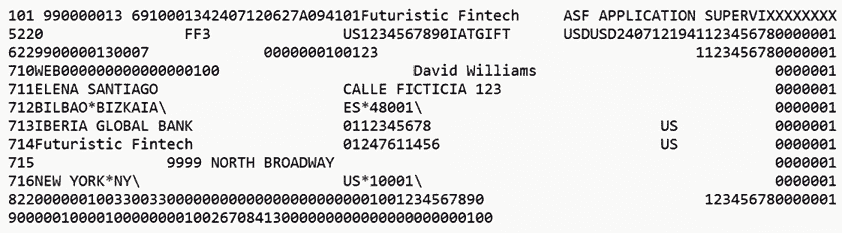
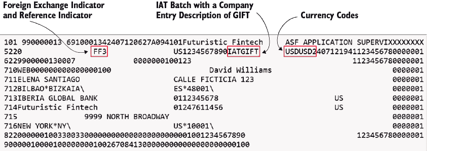
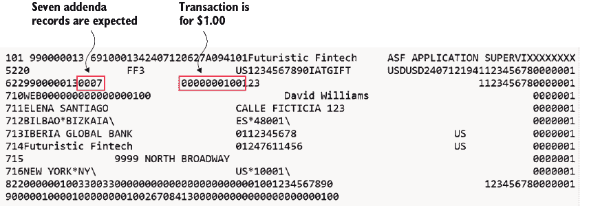

# 第十一章：国际 ACH 交易和 OFAC 扫描

### 本章涵盖

+   IAT 批次

+   增强项目以处理 IAT 批次

+   OFAC 列表

+   扫描 ACH 文件以保持合规

本章涵盖了我们项目迭代的最后冲刺。当然，业务单元将再次聚集进行另一个 PI 规划会议，整个过程将重新开始。在这个冲刺中，我们负责增强项目，使其超越国内 ACH 交易，并处理包含国际 ACH 交易（IAT）的批次，这允许在不同国家的账户之间进行电子转账。除了 IAT 处理外，还需要确保金融机构不会向目前受到美国政府限制或制裁的个人或国家发送交易。具体来说，外国资产控制办公室（OFAC）提供了一份“特别指定国民”名单，也称为 SDN 列表，这是一个资产被冻结且与其交易被禁止的个人和公司注册。

## 11.1 冲刺规划

在这次最后的冲刺中，业务线提出了一个大的请求，即启用 IAT ACH 交易。在我们的项目原始范围内，我们被告知金融机构不会承担处理国际交易额外风险。因此，数据库没有设计来支持这些类型的交易。然而，最近，金融机构一直在试图吸引更大的商业客户，并且因为这类客户需要能够接收和转移国际资金的能力，所以吸引他们遇到了困难。

正如通常在满足客户需求时发生的那样，我们现在必须更新仪表板以支持这些类型的交易，这意味着向数据库中添加额外的表格，解析文件，以及扫描涉及的客户以保持合规。图 11.1 提供了与这次冲刺相关的拟议任务的进度时间线。能够向其他利益相关者提供时间线，在回答关于我们在冲刺期间将工作的任务和我们的时间表的问题时可能会有所帮助。


##### 图 11.1  IAT ACH 交易处理时间线

在冲刺规划到位后，我们可以继续进行支持国际 ACH 交易的工作。

## 11.2 国际 ACH 交易

到目前为止，我们已经处理了预先安排的支付和存款入口（PPD）批次。正如你所知，PPD 批次通常用于工资和养老金的直接存款。我们可能也记得，ACH 在 20 世纪 70 年代初开始作为一种处理国内交易支付的方式。随着 ACH 系统的扩展，对 IAT 的支持始于 2009 年，ACH 的能力也扩展到了国内交易之外。那么，IAT 批次有什么不同之处，以至于我们需要专门一个冲刺来添加处理它们的支持呢？首先，IAT 批次必须符合对所有 ACH 记录施加的 94 个字符限制。正如我们将在本节中看到的，这影响了数据必须以何种方式传输。

### 11.2.1 IAT 批次：概述

在我们深入支持 IAT 批次之前，我们首先需要了解一个批次可能如何布局。图 11.2 展示了一个我们将要处理的样本批次，以更好地理解涉及的数据。这个批次代表了一个名叫 Elena Santiago 的西班牙毕尔巴鄂人，从她在伊比利亚全球银行的账户向她的朋友 David Wiliams 发送了 1.00 美元的礼物，他的账户在 Futuristic FinTech 的支票账户中。



##### 图 11.2  样本 IAT 批次

批次中包含了相当多的信息，所以让我们花点时间来拆解它（图 11.3），然后我们可以进入代码部分。

如图 11.4 所示，批次被标记为 IAT，公司入口描述为 GIFT。FF3 是外汇指示符，而 FF 表示固定到固定。原始金额与接收的金额相同，而 3 表示外汇参考是空格。USDUSD 分别代表原始货币代码（USD）和目标货币代码（USD）。

入口记录包含传递的附加记录数量（图 11.5）。我们预计会看到七个（0007）附加记录被传递，这恰好也是类型 7。另一个显然重要的字段是金额——在这种情况下发送的 1.00 美元。


##### 图 11.3  路由号和账户



##### 图 11.4  IAT 批次标题



##### 图 11.5  IAT 入口记录

在处理 IAT 条目时，每条记录之间有 7 到 12 个附加记录。这与我们在解析 PPD 批次时遇到的不同，因为我们有一个可选附加记录的指示器。虽然这个附加记录指示器在 IAT 条目中仍然存在，但它总是设置为 1。

为了保持相对简单，我们只会考虑七个强制附加记录。它们都以 7 开头，表示附加记录，接下来是两个位置的附加记录类型代码，强制记录的范围从 710 到 716：

+   *71**0*—外国支付金额和接收人姓名

+   *711*—发起人姓名和街道

+   *712*—发起人的城市、州、国家和邮政编码

+   *71**3*—ODFI 名称、ID 和分行

+   *71**4*—RDFI 名称、ID 和分行

+   *71**5*—接收人的 ID 号码和街道

+   *71**6*—接收人的城市、州、国家和邮政编码

拥有了新的知识，让我们创建一些 IAT 批次。

## 11.3 创建 IAT 批次

在我们开始修改和解析文件之前，我们必须有一个文件。我们在图 11.2 中提供了一个样本，结合我们已有的用于生成 ACH 文件的代码，应该足够构建了。如果你以[`achdevguide.nacha.org/ach-file-details`](https://achdevguide.nacha.org/ach-file-details)和[`mng.bz/eyOv`](https://mng.bz/eyOv)作为指南，你会看到我们可能要处理几种不同的布局。

当我们深入研究细节时，我们会发现我们正在处理新的记录和格式。这意味着在创建特定文件时，我们需要考虑我们是否有 IAT 批次，并相应地创建文件。我们已经在 ach_file_creation.feature 和 test_create_ach_files.py 中有了处理具有指定标准录入类（SEC）代码（如`And` `I` `want` `to` `have` `1` `batch` `with` `ACH` `credits` `and` `debits` `and` `a` `standard` `entry` `class` `code` `of` `"PPD"`）的批次的代码，这驱动了批次的创建。我们必须更新我们的`create_batch_header`方法，以考虑 SEC 代码。所以，如以下列表所示，我们首先默认（硬编码）一些值。像往常一样，当我们需要它们是动态的并在此点处理它们时，我们会回过头来。

##### 列表 11.1  更新的`create_batch_header`

```py
def create_batch_header(setup_info, batch_number):
…
    if setup_info["standard_entry_class"] == "IAT":
        batch_header = (
            f"5{setup_info['service_class_code']}"
            f"                "  #1
            f"FF"  #2
            f"3"  #3
            "               "  #4
            "US"  #5
            f"{setup_info['company_id']}"  #6
            f"{setup_info["standard_entry_class"]}"  #7
            "GIFT      "  #8
            "USD"  #9
            "USD"  #10
            f"{setup_info.get('effective_entry_date',  #11
➥today_yymmdd)}"  
            f"{setup_info.get('settlement_date',day_of_year)}"  #12
            f"{setup_info.get('originator_status_code','1')}"  #13
            f"{setup_info.get('odfi','06100001')}"  #14
            f"{setup_info.get('batch_number', batch_number)}\n"
        )
    else:
… #15
    return batch_header
```

#1 IAT 指示符

#2 外汇指示符

#3 外汇参考指示符

#4 外汇参考

#5 ISO 目的地国家代码

#6 发起人识别

#7 标准录入类代码

#8 公司录入描述

#9 ISO 发起货币代码

#10 ISO 目的地货币代码

#11 有效录入日期

#12 结算日期

#13 发起人状态代码

#14 发起 DFI 识别

#15 批次头部的先前创建逻辑

由于 SEC 代码存储在我们的单元测试信息中，我们可以在必要时引用它，并且在编写 IAT 批次的条目时我们还需要它。如前所述，每个 IAT 记录的条目记录至少包含七个附加记录。我们遵循相同的模式，使用 SEC 代码创建一个新的方法，该方法将负责创建所需的条目和附加记录，大部分保持硬编码，并允许动态值。创建文件的代码现在已超过 500 行，我们应该开始考虑在哪里进行重构以清理代码。创建特定类型文件的逻辑是重构的良好候选者，因为这些细节不一定需要成为此过程的一部分。

然而，目前的代码应该足以满足我们初始文件创建的需求。以下列表中的功能应该看起来很熟悉，这是好事，这意味着我们的语法足够通用，可以处理一些变化。当然，我们还有一些工作要做，以真正使事情动态化，但我们有足够的信息来创建文件。

##### 列表 11.2 创建 ACH IAT 文件

```py
  Scenario: Create an ACH for for IAT
    Given I want to create an ACH file named "iat.ach"
    And I want to have an immediate destination of "990000013"
    And I want to have an immediate origin of "987654321"
    And I want to have 1 batch with ACH credits only
➥ and a standard entry class code of "IAT"
    And I want 1 entries per batch with random amounts between 100 and 100
    And I want to use individual names of "James Smith,
➥ Sarah Johnson, David Williams, Emma Martinez, Olivia Thomas"
    And I want to have company name "My Company"
➥ and company id "1234567890"
    When my ACH is created
    Then I should have a file of the same name
    And there should be 1 batch in the file
    And there should be 1 entries in the file
```

在有了包含 IAT 批次的 ACH 文件后，我们可以开始工作，以必要的表格和结构来支持存储该文件。

### 11.3.1 数据库变更

我们需要向数据库中添加至少九个表格来支持 IAT 处理。我们目前只考虑新的批次头格式、条目格式以及所需的附加记录。我们数据库中表格的布局模仿了 ACH 记录的布局。让我们看看一些表格。记住，我们的数据库结构依赖于拥有未解析和已解析的记录，其理念是，我们的系统最终将扩展以异步处理已上传的文件。由于没有引入新的记录编号，我们不需要对未解析的记录进行任何扩展，因为 IAT 将很好地适应该结构。如果我们想存储已解析的记录（我们确实想这么做），我们需要添加九个表格。

让我们看看列表 11.3 中的`ach_iat_batch_headers`表。注意它仍然有一个外键引用到`ach_records_type_5`表。此外，大多数字段存储为`VARCHAR`，因为作为初始迭代，我们希望对结构采取简单的方法。在未来的迭代中，字段如`service_class_code`和`effective_entry_date`可以分别更新为`NUMERIC`或`DATE`。这些约束将有助于确保记录的完整性，并且值得处理。

##### 列表 11.3 IAT 批次头表

```py
CREATE TABLE ach_iat_batch_headers
(
    ach_records_type_5_id          UUID UNIQUE NOT NULL #1
         REFERENCES ach_records_type_5 (ach_records_type_5_id)  #2
                                             ON DELETE CASCADE   #2
                                             ON UPDATE CASCADE, 
    record_type_code               VARCHAR(1)  NOT NULL, #2
    service_class_code             VARCHAR(3)  NOT NULL, 
    iat_indicator                  VARCHAR(16) NOT NULL, 
    foreign_exchange_indicator     VARCHAR(2)  NOT NULL, #3
    foreign_exchange_ref_indicator VARCHAR(1)  NOT NULL, 
    foreign_exchange_reference     VARCHAR(15) NOT NULL, 
    iso_destination_country_code   VARCHAR(2)  NOT NULL, 
    originator_id                  VARCHAR(10) NOT NULL, 
    standard_entry_class_code      VARCHAR(3)  NOT NULL, 
    company_entry_description      VARCHAR(10) NOT NULL, 
    iso_originating_currency_code  VARCHAR(3)  NOT NULL, 
    iso_destination_currency_code  VARCHAR(3)  NOT NULL, 
    effective_entry_date           VARCHAR(6)  NOT NULL, 
    settlement_date                VARCHAR(3)  NOT NULL, 
    originator_status_code         VARCHAR(1)  NOT NULL, 
    originating_dfi_identification VARCHAR(8)  NOT NULL, 
    batch_number                   NUMERIC(7)  NOT NULL 
);
```

#1 批次头的外键，对于删除和更新有 CASCADEs

#2 支持解析 ACH 记录所需的其他字段。考虑使用更具体的数据类型，以确保通过在数据库级别强制正确的类型来正确格式化记录。

#3 支持解析 ACH 记录所需的其他字段。考虑使用更具体的数据类型，以确保通过在数据库级别强制正确的类型来正确格式化记录。

其余的表格以类似的方式处理，但我们应该意识到在处理附加记录时可能需要考虑的一些设计选择和标准。例如，让我们使用包含发起人城市、州、国家和邮政编码的附加记录。这个附加记录的记录类型代码为 7（因为它是一个附加记录），附加类型代码为 12（因为这是 Nacha 的决定）。

首先，我们需要命名我们的表格。那么，我们应该使用 `ach_iat_originator_address_info`、`ach_iat_addenda_712_records` 或其他类似名称吗？一般来说，这并不重要，除非我们选择一个极端的名称（即太长或太短且难以理解）。我们最初选择了 `ach_iat_addenda_712_records`，因为 712 将位于文件中此类附加记录的每一行的开头，我们可以在尝试记住表格名称时利用这一点。这也使我们免于知道我们正在处理哪种类型的附加记录（即这是发起人地址还是接收人地址）。当然，可能会有一些关于表格名称的投诉，例如

+   它包含单词附加和一个 7，这是多余的，因为类型 7 的记录总是附加记录

+   即使它们是两个单独的字段，它也没有用下划线分隔 7 和 12

+   它使用单词记录，并且之前，使用“记录”的表格包含未解析的记录

我们指出这些是为了强调一致性和标准的重要性。我们越接近既定的标准，我们可能越一致。鉴于我们想要尽量遵守标准，我们实施了以下措施：

+   对于包含解析记录的表格，使用 `_details`

+   对于包含未解析记录的表格，使用 `_records`

+   对于处理特定 ACH 格式的表格，使用前缀 `ach_ppd`、`ach_iat` 等，因为我们并不总是对表格中使用的名称 `ppd` 保持一致

因此，我们最终得到了像 `ach_iat_entry_details` 和 `ach_iat_addenda_10_details` 这样的名称。

接下来，让我们处理表格本身。列表 11.4 显示了 `ach_iat_addenda_712_records` 表。其中一些 IAT 附加记录是 ACH 标准的独特之处，因为它们包含在固定记录中分隔的字段。奇怪，对吧？

以前，其他格式严格是固定长度的记录。因此，我们可以说这 15 个字符是名称，并将存储在名称字段中。在这些附加记录中，我们有一个固定长度字段，例如 35 个字符的“发起城市及州/省”，它包含城市和州。数据元素由星号`*`分隔，反斜杠`\`是最后一个元素的终止符。这导致了一个具有七个字段（不包括 UUID）的表格，而记录有六个字段。请注意，其中一个字段是预留的，未使用，因此它未在表中表示。因此，这些解析字段在表中由单个字段表示。我们保留了每个单独字段的最大字段大小，因此尽管发起城市/州的名称都包含在一个 35 个字符的字段中，但我们仍然在表中保留了城市和州字段各 35 个字节，以避免混淆。

##### 列表 11.4  IAT 附加类型 12 的表格

```py
CREATE TABLE ach_iat_addenda_712_records
(
    ach_records_type_7_id        UUID UNIQUE NOT NULL 
            REFERENCES ach_records_type_7 (ach_records_type_7_id) 
            ON DELETE CASCADE ON UPDATE CASCADE,
    record_type_code             VARCHAR(1)  NOT NULL,
    addenda_type_code            NUMERIC(2)  NOT NULL DEFAULT 12, #1
    originator_city              VARCHAR(35), #2
    originator_state             VARCHAR(35),  #3
    originator_country           VARCHAR(35),  #3
    originator_postal_code       VARCHAR(35), 
    entry_detail_sequence_number NUMERIC(7)  NOT NULL
);
```

#1 **将附加类型代码默认设置为 12，因为此记录必须始终为 12**

#2 **将这些记录保留为 VARCHAR(35)，尽管我们可以考虑强制执行更严格的数据类型**

此代码提供了如何处理所有 IAT 表格的模式。接下来，我们看看记录是如何解析的。

## 11.4 IAT 记录解析

为了解析记录，我们使用我们之前构建的文件创建步骤来创建一个示例文件，然后使用单元测试来构建解析各种记录并将其存储在数据库中的所需代码（列表 11.5）。我们有我们正在寻找解析的样本记录——预期结果。我们通过调用`setup_iat_addenda_test`来设置必要的测试记录，它只是将所需标题和条目记录添加到数据库中，以便所有外键都能按预期工作。然后，我们调用`_parse_iat_addenda_712`和类`AchIat712AddendaSql`。有时，当我们确信我们的逻辑是正确的时候，简单地根据返回值定义`expected_result`可能会很有诱惑力。我们建议不要这样做，并确保记录以另一种方式解析，无论是手动还是使用其他工具，以便结果得到独立验证。

##### 列表 11.5  对 Type 12 附加的解析例程进行单元测试

```py
class TestParsingIat712AddendaRecords:

    TABLE_NAME: str = "ach_iat_addenda_712_records"

    @pytest.fixture(autouse=True)   #1
    def setup_teardown_method(self):  #1
        SqlUtils.truncate_all()  #1
        yield  #1

    def test_parse_iat_addenda_712_records(self):
        sample_addenda_record = "712BILBAO*BIZKAIA\ #2
➥                    ES*48001\                        #2
➥                  0000001" 

record
        expected_result = { #3
            "record_type_code": Literal["7"],  #3
            "addenda_type_code": 12,  #3
            "originator_city": "BILBAO",  #3
            "originator_state": "BIZKAIA",  #3
            "originator_country": "ES",  #3
            "originator_postal_code": "48001",  #3
            "entry_detail_sequence_number": 1,  #3
        }  #3

        _, ach_records_type_7_id = #4
            SqlUtils.setup_iat_addenda_test(  #4
               sample_addenda_record  #4
            )  #4

        parser = AchFileProcessor() #5
        parser._parse_iat_addenda_712(ach_records_type_7_id,  #5
                                      sample_addenda_record) 

        sql = AchIat712AddendaSql() #6
        retrieved_record =  #7
           sql.get_record(ach_records_type_7_id).model_dump(  #7
               exclude={"ach_records_type_7_id"}  #7
           )  #7

        assert SqlUtils.get_row_count_of_1( #7
            self.TABLE_NAME  #7
        ), f"Expected 1 row in {self.TABLE_NAME}"  #7
        assert (  #7
            retrieved_record == expected_result  #7
        ), f"Expected {expected_result}, #7
➥ but got {retrieved_record}"  #7
```

#1 确保数据库为空的固定值；由于我们已将 autouse 设置为 True，因此无需将其包含在我们的测试方法中，因为它将自动执行。

#2 从我们的测试 ACH 文件中取出的样本附加记录

#3 验证检索记录的预期结果字典

#4 设置所需的数据库记录以满足约束条件

#5 解析记录，这也会将其添加到数据库中

#6 检索记录，排除 UUID 字段。由于 UUID 由数据库分配，我们无法在预期结果中硬编码它。

#7 执行断言以确保只有一行，并且记录与之前定义的预期值匹配

之前的单元测试将失败，直到我们构建了所需的功能。我们将通过必要的代码片段来建立模式。所有这些单元测试都将遵循类似的方法。我们遇到的第一个缺失方法是`_parse_iat_addenda_712`方法，如下所示。尽管它很简单，但我们确实需要填充`expected_record_types`，这有助于解析器确定记录是否顺序错误。

我们在更新我们的 ACH 文件处理逻辑时，需要牢记验证，因为我们需要确定是否已收到所有必需的记录，并确保没有重复的附加记录。

##### 列表 11.6 `_parse_iat_addenda_712`记录

```py
def _parse_iat_addenda_712(self, ach_records_type_7_id: UUID, line: str):
     self.expected_record_types = ["6", "7", "8"] #1

     ach_iat_addenda_record = #2
        AchRecordProcessor().parse_iat_addenda_712(  #3
           ach_records_type_7_id, line  #3
        ) 
        AchIat712AddendaSql()#3
           .insert_record(ach_iat_addenda_record) 
```

#1 可以传递给我们的预期记录类型

#2 解析实际上是由 AchRecordProcessor 完成的。在这个时候，我们也可以考虑将一些解析例程移动到新的类中。

#3 使用解析后的记录，我们需要将其插入到数据库中。

接下来，我们创建`parse_iat_addenda_712`方法。这项任务也可能涉及它自己的单独单元测试，因为该类的目的是双重的。首先，它将实际的解析逻辑集中到一个中央位置，这减少了我们的 ACH 文件处理器中的代码，并允许更清晰地理解 ACH 处理流程。其次，它允许我们在不需要在数据库中进行大量设置的情况下单独测试解析逻辑。

然而，解析并不过于复杂，并且将通过此整体过程进行测试，所以目前我们不会担心它需要自己的单元测试。以下列表显示了解析 IAT 附加记录的代码。

##### 列表 11.7 解析 IAT 附加记录

```py
def parse_iat_addenda_712(
        self, ach_records_type_7_id, line
    ) -> AchIat712AddendaSchema:
   regex = r"([^*]+)\*([^\\]+)\\" #1
   match = re.match(regex, line[3:38]) #2
   if not match:  #2
      raise ValueError("Error parsing originator  #2
➥ city and state")  #2
   originator_city, originator_state = match.groups()  #2

   match = re.match(regex, line[38:73]) #3
   if not match:  #3
      raise ValueError("Error parsing originator country   #3
                                and postal code")  #3
   originator_country, originator_postal_code = match.groups()  #3

   return AchIat712AddendaSchema( #4
      ach_records_type_7_id=ach_records_type_7_id,  #4
      record_type_code=line[0],  #4
      addenda_type_code=line[1:3],  #4
      originator_city=originator_city.strip(),  #4
      originator_state=originator_state.strip(),  #4
      originator_country=originator_country.strip(),  #4
      originator_postal_code=originator_postal_code.strip(),  #4
      entry_detail_sequence_number=line[87:94],  #4
   )  #4
```

#1 创建一个正则表达式来解析记录中的分隔字段

#2 确保我们有匹配项并从中提取城市和州

#3 确保我们有匹配项并从中提取国家和邮政编码

#4 解析记录并将其作为我们模式的一部分返回

接下来，我们需要定义用于这些记录的模式。如列表 11.8 所示，我们提供了一个最小布局，以匹配我们期望插入到数据库中的内容。

##### 列表 11.8 IAT 附加 712 模式

```py
class AchIat712AddendaSchema(BaseModel):
    ach_records_type_7_id: UUID
    record_type_code: str = Literal["7"]
    addenda_type_code: int = Literal[12]
    originator_city: str = Field(..., max_length=35)
    originator_state: str = Field(..., max_length=35)
    originator_country: str = Field(..., max_length=35)
    originator_postal_code: str = Field(..., max_length=35)
    entry_detail_sequence_number: int = Field(..., ge=0)
```

最后一步是创建一个类来处理插入和检索记录的 SQL 逻辑。

##### 列表 11.9 IAT 附加类型 12 SQL

```py
class AchIat712AddendaSql: #1
 #2
    def insert_record(self,  #2
                      ach_iat_addenda: AchIat712AddendaSchema): 
        with get_db_connection() as conn: #2
            conn.execute(                 #3
                """  #3
                   INSERT INTO ach_iat_addenda_712_records (  #3
                            ach_records_type_7_id, addenda_type_code,  #3
                            originator_city, originator_state,  #3
                            originator_country, originator_postal_code,  #3
                            entry_detail_sequence_number )  #3
                        VALUES ( %(ach_records_type_7_id)s,  #3
      %(addenda_type_code)s, %(originator_city)s,  #3
      %(originator_state)s,  #3
      %(originator_country)s, %(originator_postal_code)s,   #3
      %(entry_detail_sequence_number)s)  #3
                """,  #3
                ach_iat_addenda.model_dump(), #4
            )
… #5
```

#1 定义一个类和方法来插入我们的记录模式

#2 获取数据库连接

#3 SQL 用于插入模型字段和值

#4 为 INSERT 语句创建一个模式字典

#5 其余的方法，特别是通过 UUID 获取记录

这样，我们应该能够回去确保所有导入语句都已就位，然后成功运行我们的单元测试。假设我们正确解析了记录（对于预期和实际记录），我们应该有一个通过的单位测试。

##### 单元测试 IAT 挑战

这种模式需要为所有新的数据库记录重复，现在是休息一下并编写一些代码的好时机。我们有样本文件。现在的问题仅仅是处理剩余记录的解析。如果之前的代码示例仍然有点令人畏惧，我们也可以从小规模开始，为`AchRecordProcessor`创建单元测试，它只负责解析 ACH 记录，没有数据库交互。测试`Ach-RecordParser`的简单要求意味着设置我们的单元测试需要的工作量更少。一旦在该级别验证了解析，我们可以退后一步，看看更大的图景，并开始编写涉及数据库的单元测试，如本节所述。

虽然我们应该在这个阶段验证所有的解析，但我们仍然需要更新我们的`ach_file_processor`以处理 IAT 批次并利用我们刚刚编写的所有这些美好代码。

## 11.5 IAT 文件处理

到目前为止，我们已经构建了我们 IAT 处理的部分。我们应该相当自信，我们可以处理单个记录并对它们进行解析。现在，我们需要能够在文件中结合实际的 IAT 批次的解析。我们需要记住，我们在前面的章节中测试的是单个部分。例如，我们知道当我们调用`_parse_iat_batch_header`方法并传递一个 IAT 批次头记录时，它将被解析并存储在数据库中。然而，该方法在当前通过`POST`调用加载 ACH 文件的过程中没有被调用。当我们向解析器添加功能时，我们应该牢记一些目标和要求：

+   解析 PPD 批次仍然按预期工作。

+   补充记录全部存在。

+   补充记录的顺序是正确的。

在下一节中，我们开始确保在开始对实际代码进行更改之前，我们有单元测试。

### 11.5.1 单元测试

我们希望很明显，在添加 IAT 批次后，我们仍然能够加载 PPD 批次。所以，不要忘记测试和验证我们没有因为添加 IAT 处理而破坏任何东西。这意味着我们想要确保我们实施一些回归测试——我们最不想做的事情就是花所有时间在新的处理上，而不验证之前的工作。

在这个前提下，首要任务是创建一个`test_loading_pdd_files`文件，并确保在加载 PPD 批次时我们拥有正确的记录计数。我们从简单的测试开始，以获取未解析记录的数量。我们测试单个记录的计数和记录总数，确保我们没有写入任何异常，如下所示。

##### 列表 11.10  测试 PPD 批次

```py
def test_good_unparsed_records_only(self, parser):
    filename = "ppd-mixed.ach"  #1
    dir_path = os.path.dirname(os.path.realpath(__file__)) #2
    file_path = os.path.join(dir_path, "data", filename) 

    expected_exceptions_result: int = 0 #3
    expected_total_records_result: int = 14 

    ach_file_id = SqlUtils. #4
➥create_ach_file_record(filename, "123456789")  #4
 #4
    parser.parse(ach_file_id, file_path)  #4
    exceptions = SqlUtils.get_exceptions()  #4

    with SqlUtils.get_db() as conn:   #5
        record_count_type1 = conn.execute(  #5
            "SELECT COUNT(*) FROM ach_records_type_1"  #5
        ).fetchone()[0]  #5
…                     #5
        record_count_type9 = conn.execute(  #5
            "SELECT COUNT(*) FROM ach_records_type_9"  #5
        ).fetchone()[0]  #5

        total_record_count = ( #6
            record_count_type1  #6
            + record_count_type5  #6
            + record_count_type6  #6
            + record_count_type7  #6
            + record_count_type8  #6
            + record_count_type9  #6
        )  #6

        assert record_count_type1 == 1, #7
                f"Expected 1, but got {record_count_type1}"  #7
…  #7
        assert (  #7
            total_record_count == expected_total_records_result  #7
        ), f"Expected {expected_total_records_result}, but got  #7
{total_record_count}"  #7
…  #7
```

#1 定义一个文件名，因为它将在测试的几个不同地方使用

#2 确保我们可以引用文件

#3 设置一些初始预期值

#4 设置测试，解析文件，并返回任何异常

#5 查询数据库以获取存储未解析记录的每个表的记录数。这个测试包含大量重复的代码来获取每种类型的计数。

#6 将记录计数相加以获取总数，但这有点冗余，因为我们也在单独测试计数。然而，如果没有这个，我们会被问多少次总数呢？

#7 断言记录计数是正确的

前面的测试效果足够好，但随着我们的开发工作，我们重新利用了其他测试来创建新的测试，并最终复制/粘贴代码来获取额外的记录计数和`assert`语句。事实上，Copilot 足够好，为我们填写了一些代码，所以我们甚至不需要做太多的复制/粘贴。但是有一个问题——我们应该将测试代码视为一等公民，给予它与我们给予生产代码相同的关注。

让我们看看我们如何重构上面的代码，使其更简洁、更容易理解。以下列表中的更改将代码从 53 行缩短到 45 行，虽然这不是唯一的指标，但我们应该用它来判断代码是好是坏。在我们职业生涯的早期，我们的一位导师告诉我们，当他们删除代码而不是编写代码时，他们会感到更有生产力。

##### 列表 11.11  对未解析记录的单元测试重构

```py
with SqlUtils.get_db(row_factory=dict_row) as conn: #1
    record_counts = conn.execute(
    """
    SELECT 
        record_count_type1, #2
        record_count_type5,  #2
        record_count_type6,  #2
        record_count_type7,  #2
        record_count_type8,  #2
        record_count_type9,  #2
        record_count_type1 + record_count_type5 +  #3
        record_count_type6 + record_count_type7 +   #3
        record_count_type8 + record_count_type9   #3
                             AStotal_record_count  #3
    FROM ( #4
     SELECT 
       (SELECT COUNT(*) FROM ach_records_type_1)  
                          AS record_count_type1, 
       (SELECT COUNT(*) FROM ach_records_type_5)  
                          AS record_count_type5, #5
       (SELECT COUNT(*) FROM ach_records_type_6)  
                          AS record_count_type6, 
       (SELECT COUNT(*) FROM ach_records_type_7)  
                          AS record_count_type7, 
       (SELECT COUNT(*) FROM ach_records_type_8)  
                          AS record_count_type8, 
       (SELECT COUNT(*) FROM ach_records_type_9)  
AS record_count_type9 
        ) AS counts 
   """
   ).fetchone() #6
   record_counts["exception_count"] = len(exceptions) #7

assert expected_results == record_counts #8
```

#1 更新 get_db 调用以使用 dict_row 作为 row_factory

#2 我们 ACH 表中的每个记录计数

#3 计算总记录数

#4 获取每行计数的查询

#5 获取每行计数的查询

#6 获取单个结果

#7 将异常计数添加到 record_counts 字典中

#8 比较两个字典

我们有一个类似的查询来验证解析记录存在于所有解析记录的表中。理想情况下，如果我们有任何解析问题，我们期望表中会有异常，但如果我们还没有为这种情况编写代码，或者可能错过了一个会导致解析错误的条件，那么检查这些表也是好的。

##### 列表 11.12  解析 PPD 记录的单元测试

```py
SELECT 
   record_count_type1, #1
   record_count_type5,  #1
   record_count_type6,  #1
   record_count_type7,  #1
   record_count_type8,  #1
   record_count_type9,  #1
   record_count_type1 + record_count_type5 +   #1
   record_count_type6 + record_count_type7 +  #1
   record_count_type8 + record_count_type9   #1
                                         AS total_record_count  #1
FROM (
   SELECT #2
      (SELECT COUNT(*) FROM ach_file_headers)  #2
                            AS record_count_type1,  #2
      (SELECT COUNT(*) FROM ach_batch_headers)  #2
                            AS record_count_type5,  #2
      (SELECT COUNT(*) FROM ach_entry_ppd_details)  #2
                                      AS record_count_type6,  #2
      (SELECT COUNT(*) FROM ach_addenda_ppd_records)  #2
                                      AS record_count_type7,  #2
      (SELECT COUNT(*) FROM ach_batch_control_records)  #2
                                      AS record_count_type8,  #2
      (SELECT COUNT(*) FROM ach_file_control_records)  #2
                                      AS record_count_type9  #2
   ) AS counts   #2
```

#1 选择逻辑可以保持不变。

#2 注意，计数现在发生在解析记录上，并且表是针对 PPD 批次的特定表。

我们的目标是确保我们有足够的测试来验证处理成功的文件。现在我们应该有信心，文件已经在数据库中处理过，它们的单元测试可以验证这些数据库字段，并且文件已经被正确解析。记得在第二章中，我们不仅应该测试成功的路径（成功），还应该测试不那么成功的路径（错误处理）。目前，我们有足够的测试来继续进行 IAT 处理的类似测试。

我们可以为未解析的记录创建一个类似的测试，该测试加载一个包含 IAT 批次的文件。我们创建了一个名为（相当缺乏想象力）的 iat.ach。当我们只考虑未解析的记录时，IAT 文件的处理不会改变，这也是我们需要测试未解析和解析记录的部分原因。当然，我们仍然使用单元测试测试了未解析的记录，但真正的工作是为 IAT 解析记录，如下所示。

##### 列表 11.13  解析 IAT 记录的单元测试

```py
SELECT #1
   record_count_type1, record_count_type5, record_count_type6,  #1
   record_count_type710, record_count_type711,  #1
   record_count_type712, record_count_type713,  #1
   record_count_type714, record_count_type715,   #1
   record_count_type716, record_count_type8,  #1
   record_count_type9, record_count_type1 +  #1
   record_count_type5 + record_count_type6 +  #1
   record_count_type710 + record_count_type711 +  #1
   record_count_type712 + record_count_type713 +  #1
   record_count_type714 + record_count_type715 +  #1
   record_count_type716 + record_count_type8 +   #1
                  record_count_type9 AS total_record_count  #1
FROM ( #2
   SELECT  #2
      (SELECT COUNT(*) FROM ach_file_headers)  #2
                                     AS record_count_type1,  #2
      (SELECT COUNT(*) FROM ach_iat_batch_headers)  #2
                                     AS record_count_type5,  #2
      (SELECT COUNT(*) FROM ach_iat_entry_details)  #2
                                     AS record_count_type6,  #2
      (SELECT COUNT(*) FROM ach_iat_addenda_710_records)  #2
                                     AS record_count_type710,  #2
      (SELECT COUNT(*) FROM ach_iat_addenda_711_records)  #2
                                     AS record_count_type711,  #2
      (SELECT COUNT(*) FROM ach_iat_addenda_712_records)  #2
                                     AS record_count_type712,  #2
      (SELECT COUNT(*) FROM ach_iat_addenda_713_records)  #2
                                     AS record_count_type713,  #2
      (SELECT COUNT(*) FROM ach_iat_addenda_714_records)  #2
                                     AS record_count_type714,  #2
      (SELECT COUNT(*) FROM ach_iat_addenda_715_records)  #2
                                     AS record_count_type715,  #2
      (SELECT COUNT(*) FROM ach_iat_addenda_716_records)  #2
                                     AS record_count_type716,  #2
      (SELECT COUNT(*) FROM ach_batch_control_records)  #2
                                     AS record_count_type8,  #2
      (SELECT COUNT(*) FROM ach_file_control_records)  #2
                                     AS record_count_type9  #2
) AS record_counts  #2
```

#1 我们选择所需的记录并将它们加起来以获取总数，我们也通过在任何编辑器中打开文件（因为它只是一个文本文件）并检查记录数来验证了这一点。

#2 我们需要包含 IAT 补充表。记住，批次头、条目详情和补充记录将与 PPD 批次不同。

前面的测试将失败，因为我们还没有更新文件解析以利用这些详细表格。然而，我们现在有信心，我们已经通过单元测试覆盖了 PPD 和 IAT 解析，这意味着我们可以继续使用这些新的 IAT 详细表格。

### 11.5.2 更新文件处理

在我们的 PPD 文件加载通过和 IAT 文件加载失败之后，我们开始着手支持 IAT 所需的更改。随着我们进行更改，我们将不断重新运行单元测试，以确保我们在解析 IAT 文件方面取得进展，并且我们没有无意中破坏任何东西。由于 ACH 文件是顺序处理的，我们需要首先处理的记录是批次头记录。我们添加了一个名为 `batch_type` 的新字段，我们将用它来解析批次头。以下列表显示了我们所添加的简单 `if`/`elif`/`else` 处理，根据 SEC 代码调用适当的例程，并在遇到我们不认识的头时记录异常。

##### 列表 11.14  调用适当的解析例程

```py
if line[50:53] == "IAT": #1
 self._parse_iat_batch_header(ach_record_id, line) #2
 self.batch_type = "IAT" 
elif line[50:53] == "PPD": #2
    self._parse_batch_header(ach_record_id, line)  #3
 self.batch_type = "PPD" #3
else: #3
 self._add_exception( #4
 AchExceptionSchema( #4
 ach_files_id=ach_file_id, #4
 record_number=sequence_number, #4
 exception_code=AchExceptions.INVALID_BATCH_TYPE.value, #4
 ), #4
 line, #4
 ) #4
```

#1 无论批次头是 IAT 还是 PPD，SEC 代码都在相同的位置。这一行设置了适当的 batch_type 标志以适应 SEC 类型。

#2 之前，我们只是调用了 `_parse_batch_header` 方法。现在，我们确保我们正在处理一个 PPD 批次。

#3 我们希望在处理过程中记录异常，并且我们遇到了一个未识别的 SEC 代码。这可能是因为文件格式无效或我们尚未支持的代码。

在正确解析批次头的情况下，我们应该在 IAT 处理测试中前进一点，当然，PPD 处理不应该出错。我们遇到的下一个记录是类型 6 记录。随着 `batch_type` 变量的引入，它应该遵循相同的模式。请注意，我们继续像以前一样将未解析的记录写入数据库。然而，解析记录并将其写入适当表的需要取决于 `batch_type` 标志。以下列表显示了所需的更新。

##### 列表 11.15  解析条目详情

```py
case "6": #1
    ach_record = AchRecordType6Schema(  #1
        ach_records_type_5_id=current_batch_header_id,  #1
        unparsed_record=line,  #1
        sequence_number=sequence_number,  #1
    )  #1
    ach_record_id = AchRecordsSqlType6()  #1
➥.insert_record(ach_record)  #1
    if self.batch_type == "IAT": #2
        self._parse_iat_entry_detail(  #2
            ach_file_id=ach_file_id,  #2
            current_batch_header_id=current_batch_header_id,  #2
            ach_records_type_6_id=ach_record_id,  #2
            sequence_number=sequence_number,  #2
            line=line,  #2
        )  #2
    elif self.batch_type == "PPD": #3
        self._parse_entry_ppd_detail(  #3
            ach_file_id=ach_file_id,  #3
            current_batch_header_id=current_batch_header_id,  #3
            ach_records_type_6_id=ach_record_id,  #3
            sequence_number=sequence_number,  #3
            line=line,  #3
        )  #3
    else: #4
        self._add_exception( #4
            AchExceptionSchema( #4
                ach_files_id=ach_file_id,  #4
                record_number=sequence_number,  #4
                exception_code=AchExceptions.INVALID_SEC.value,  #4
            ),  #4
            line,  #4
        )  #4
```

#1 我们未解析的记录的编写与我们正在处理的批次类型无关。

#2 当 batch_type 设置为 IAT 时，我们将调用适当的方法来解析条目。

#3 IAT 和 PPD 解析的参数完全相同。只有需要解析的字段不同。

#4 当我们遇到意外的 batch_type 时，添加一个异常

解析附加记录比解析批次头和条目详细记录稍微复杂一些。这是因为我们现在还必须处理不同的附加记录类型按照期望的顺序排列。类似于 expected_record_type 变量，我们也引入了一个 expected_addenda_type 变量。让我们直接跳到解析特定附加类型记录的方法，如下面的列表所示。在这里，这是标准的处理，增加了新的 expected_addenda_type。我们期望的下一条记录是另一个附加记录（类型 7），它应该是附加类型 11。

##### 列表 11.16 `_parse_iat_addenda_710`方法

```py
def _parse_iat_addenda_710(self, ach_records_type_7_id: UUID, line: str):
     self.expected_record_types = ["7"] #1
     self.expected_addenda_type = "11" #2

     ach_iat_addenda_record = AchRecordProcessor().parse_iat_addenda_710(
         ach_records_type_7_id, line
     )
     AchIat710AddendaSql().insert_record(ach_iat_addenda_record)
```

#1 expected_record 应该是另一个附加记录。

#2 expected_addenda_type 应该是下一个序列，因为记录需要按照特定的顺序排列。注意，我们只期望一种类型的记录，因此不需要像 expected_record_type 那样使用数组。

所有的附加记录将以相同的方式解析，expected_addenda_type 被设置为下一条记录。但是当我们到达最后的附加类型（类型 16）时会发生什么？下面的列表展示了我们如何重置我们的期望类型，一旦我们到达最后一个记录。

##### 列表 11.17 重置期望类型

```py
self.expected_record_types = ["6", "7", "8"] #1
self.expected_addenda_type = "" #2
```

#1 在 IAT 处理中存在一些可选的附加记录，因此可能会遇到这些记录，以及新的条目或批次的结束。

#2 没有更多的强制附加记录，因此 expected_addenda_type 可以被设置为空字符串。

现在我们知道了如何解析附加记录，应该很容易将这些单独的方法组合起来——因为它们遵循与我们解析记录类型相似的方法。这个过程在下面的列表中展示。

##### 列表 11.18 解析附加记录

```py
   def _parse_iat_addenda( #1
        self, ach_records_type_7_id: UUID,  #1
        line: str, sequence_number  #1
    ): 
        addenda_type = line[1:3] #2

        if addenda_type != self.expected_addenda_type: #3
            self._add_exception( 
                AchExceptionSchema( 
                    ach_files_id=ach_records_type_7_id, 
                    record_number=sequence_number, 
                    exception_code= 
                       AchExceptions.UNEXPECTED_ADDENDA_TYPE.value, 
                ) 
            ) 
            Return 

        if addenda_type == "10": #4
            self._parse_iat_addenda_710(ach_records_type_7_id, line)  #5
…  #5
        elif addenda_type == "16":  #5
            self._parse_iat_addenda_716(ach_records_type_7_id, line)  #5
        else:  #5
            self._add_exception(  #5
                AchExceptionSchema(  #5
                    ach_files_id=ach_records_type_7_id,  #5
                    record_number=sequence_number,  #5
                    exception_code=  #5
                        AchExceptions.INVALID_IAT_ADDENDA_TYPE.value,  #5
                )  #5
            )  #5
```

#1 定义我们的解析方法。这是一个总称，将调用其他方法来解析特定记录。

#2 提取附加类型，因为我们将会反复使用它

#3 如果附加类型不是我们期望的，我们需要记录一个异常。

#4 根据我们正在处理的附加类型，调用适当的方法。如果遇到意外的附加类型，它将记录不同的异常。

这样，我们应该能够解析包含 IAT 和 PPD 批次的文件。这些额外的 IAT 批次表将对我们的某些 API 产生影响。在下一节中，我们将简要看看具体哪些方面受到了影响。

## 11.6 对仪表板的影响

IAT 处理的增加如何影响我们仪表板的功能？这个问题可能需要与业务进行更多讨论。从 ACH 标准的角度来看，在同一文件中拥有 IAT 批次和 PPD 批次当然是可能的。然而，IAT 批次的字段和有趣信息可能不同，而且新表的出现确实会影响组件的功能。我们的组件是否应该包含所有批次或仅选择批次可能是一个需要来自最终用户输入的业务决策。目前，让我们看看我们如何将 IAT 批次纳入当前的仪表板组件中。

### 11.6.1 `get_batches` 方法

`/batches` 端点调用 `get_batches` 方法，该方法需要更新以包含 IAT 批次标题。我们知道 `ach_records_type_5_id` 只会存在于批次标题表中的一个。我们利用这一点和 `COALESCE` 命令来使用 `ach_batch_headers` 字段，如果它是 `NULL`，则使用 `ach_iat_batch_headers` 的值。这基于假设字段不会意外地成为 `NULL`。有关字段在数据库中都被标记为 `NOT NULL`。它们是否永远保持这种状态是另一个问题。目前，以下列表显示了我们可以如何更新我们的查询，而不会对当前的 API 过于侵入性。

##### 列表 11.19  更新的 `get_batches`

```py
SELECT COALESCE(abh.company_name, '') AS company_name, #1
       COALESCE(abh.company_identification,       #2
       aibh.originating_dfi_identification) AS company_id,
       art5.ach_records_type_5_id AS id,
       COALESCE(abh.batch_number, aibh.batch_number) #3
                                           AS batch_number, 
       abcd.total_debit_entry_dollar_amount AS debit_total,
       abcd.total_credit_entry_dollar_amount AS credit_total, 
       abcd.entry_addenda_count 
  FROM ach_files AS af
…
LEFT JOIN ach_batch_headers AS abh #4
                USING (ach_records_type_5_id)  #4
LEFT JOIN ach_iat_batch_headers AS aibh  #4
                USING (ach_records_type_5_id)  #4
    WHERE af.ach_files_id = %s
 ORDER BY COALESCE(abh.originating_dfi_identification,  #5
                   aibh.originating_dfi_identification); 
```

#1 我们无法从标题记录中访问 IAT 的公司名称。

#2 如果公司识别信息不可用，则使用 originating_dfi_identification

#3 从批次中选择适当的批次号

#4 使用 LEFT JOIN 因为批次标题是针对一个表或另一个表的

#5 按适当的识别号排序

如此所示，我们有时可以更新现有的查询；然而，并非所有情况下都如此。实际上，这可能是例外。下一节将讨论当查询太大或太复杂，无法同时包含 PPD 和 IAT 时应该做什么。

### 11.6.2 批次条目

从端点 `/{file_id}/batches/{batch_id}/entries` 收集批次条目需要一些工作。构建 `AchBatchEntriesResponse` 的查询相当大，因此可能更有意义的是保留当前的查询，并创建一个针对 IAT 交易条目的新查询。因此，我们将采取 `get_entries` 方法，将现有的查询移动到 `_get_ppd_entries` 方法中，并创建一个新的 `_get_iat_entries` 方法。拆分的成果如下所示。

##### 列表 11.20  更新的 `get_entries`

```py
@staticmethod
def get_entries(
    ach_file_id: UUID, ach_batch_id: UUID
    ) -> list[AchBatchEntriesResponse]:
    if AchFileSql._is_iat_batch(ach_file_id, ach_batch_id): #1
        return AchFileSql._get_iat_entries #2
➥(ach_file_id, ach_batch_id) 
    else:
        return AchFileSql._get_ppd_entries(ach_file_id, #3
                                           ach_batch_id) 
```

#1 确定文件中指定的批次是否为 IAT 批次的 方法

#2 返回给定文件和批次的 IAT 条目的 方法

#3 之前的 SQL 查询已移动到其自己的方法中。

在创建用于 IAT 记录的`AchBatchEntriesResponse`时，有一些细微的变化。对于获取附加记录数的原始 PPD 记录查询，我们必须自己收集这些信息。对于 IAT 批量，这些信息是记录的一部分；然而，我们仍然以相同的方式收集计数，部分是为了保持查询的相似性，但更重要的是，因为我们可能希望在将来对字段进行验证，这种方法提供了实现这一目标的机制（列表 11.21）。

##### 列表 11.21  `_get_iat_entries`查询

```py
WITH addenda_records_for_entry AS (
   SELECT art6.ach_records_type_6_id,
   COUNT(art7.*) AS addenda_count #1
   FROM ach_files AS af
…
   LEFT JOIN ach_records_type_7 AS art7 USING (ach_records_type_6_id)
   WHERE af.ach_files_id = %s
      AND art5.ach_records_type_5_id = %s
      GROUP BY (art6.ach_records_type_6_id)
)
SELECT art6.ach_records_type_6_id AS id,
       aied.transaction_code,
…
       aia10d.receiving_name AS individual_name, #2
       aied.amount, #3
       CONCAT(
          '*************',
          RIGHT(LPAD#D
➥(aied.foreign_receivers_account_number, 4, '0'), 4) #4
       ) AS account_number_last_4,
       arfe.addenda_count
…
      INNER JOIN ach_iat_entry_details AS aied  #5
                  USING (ach_records_type_6_id)  #5
      INNER JOIN addenda_records_for_entry AS arfe  #5
                  USING (ach_records_type_6_id)  #5
      INNER JOIN ach_iat_addenda_10_details AS aia10d   #5
                  USING (ach_records_type_7_id)  #5
…
```

#1 我们获取附加记录数，该数也适用于 IAT 交易的记录类型 6。最终，我们可以使用这种方法来验证传递的附加记录数。

#2 我们将接收方名称作为个人名称返回，以符合我们的响应，该响应需要从附加类型 10 记录中检索。

#3 从 IAT 记录条目中提取金额

#4 记录条目还包括账户号码。

#5 连接必要的 IAT 表

我们是将 IAT 纳入当前仪表板还是创建全新的组件，这将是业务和用户偏好的问题。一个不容协商的方面是必须遵守政府法规。下一节将讨论如何解决一些监管问题。

## 11.7 OFAC 扫描

金融机构在日常运营中必须遵守各种法规和合规要求。例如，爱国者法案（PATRIOT Act）和了解你的客户（KYC）规定，金融机构对未能报告潜在的洗钱和恐怖主义融资活动负有责任。外国资产控制办公室（Office of Foreign Asset Control, OFAC）提供了一份“特别指定国民”名单，或称 SDN 名单，其中包括个人、公司以及禁止与之进行商业往来的船只/飞机等资产，机构可能面临处罚。

注意，还有其他名单，以及一般意义上的国家，机构被禁止与之进行商业往来。与任何这些受制裁实体进行商业往来可能会给银行造成重大损失。违反美国法规的实体及其相关罚款的名单可在[`mng.bz/pKN8`](https://mng.bz/pKN8)找到。

尽管存在专门从事此类扫描的第三方软件包，但在接下来的几节中，我们将实现仪表板的基本扫描，以了解该过程。如果你对机器学习/人工智能和数据分析感兴趣，这是一个深入了解并构建一些综合检测的绝佳机会！

### 11.7.1 受制裁的个人和国家

您可以从 OFAC 网站下载 XML 文件，网址为[`sanctionslist.ofac.treas.gov/Home/SdnList`](https://sanctionslist.ofac.treas.gov/Home/SdnList)，同时还有一个在线搜索工具，网址为[`sanctionssearch.ofac.treas.gov/`](https://sanctionssearch.ofac.treas.gov/)。这两种方式都是熟悉与受制裁个人合作时可用信息的绝佳方法。

为了我们的目的，我们创建了一个包含虚构个人姓名和化名的表格，以避免使用列表中实际数据可能带来的任何潜在问题。我们还创建了一个应扫描的虚构国家列表。正如我们从民事处罚中看到的那样，许多时候，公司仅仅与在其他国家的公司/个人做生意就会陷入麻烦。列表 11.22 显示了用于存储个人姓名以及国家的表的`create`语句。

##### 列表 11.22  为 OFAC 扫描创建表

```py
CREATE TABLE sdn_list
(
    sdn_id          UUID PRIMARY KEY DEFAULT uuid_generate_v4(),
    first_name      VARCHAR(255) NOT NULL,
    middle_name     VARCHAR(255) DEFAULT NULL,
    last_name       VARCHAR(255) NOT NULL,
    alias           VARCHAR(255) DEFAULT NULL,
    created_at      TIMESTAMP    NOT NULL DEFAULT NOW(),
    updated_at      TIMESTAMP    NOT NULL DEFAULT NOW()
);

CREATE TABLE sanctioned_countries
(
    sanctioned_country_id UUID PRIMARY KEY DEFAULT uuid_generate_v4(),
    country_name          VARCHAR(255) NOT NULL,
    country_code          VARCHAR(2)   NOT NULL,
    created_at            TIMESTAMP    NOT NULL DEFAULT NOW(),
    updated_at            TIMESTAMP    NOT NULL DEFAULT NOW()
);
```

接下来，我们在创建数据库时填充这些表，如下所示。不要忘记将`sdn_list`和`sanctioned_countries`表添加到`truncate_all`实用方法中，因为在单元测试期间，您不希望默认数据被清除。

##### 列表 11.23  填充新表

```py
INSERT INTO 
sdn_list(first_name, middle_name, last_name, alias) 
VALUES ('Cash', DEFAULT, 'Steeler', 'Heister');
INSERT INTO 
sdn_list(first_name, middle_name, last_name, alias) 
VALUES ('Penny', DEFAULT, 'Pincher', 'Embezzler');
INSERT INTO 
sdn_list(first_name, middle_name, last_name, alias) 
VALUES ('Ben', 'E', 'Factor', '');
INSERT INTO 
sdn_list(first_name, middle_name, last_name, alias) 
VALUES ('Lou', DEFAULT, 'Pole', 'Evader');
INSERT INTO 
sdn_list(first_name, middle_name, last_name, alias) 
VALUES ('Mallory', DEFAULT, 'Practice', 'Biller');

INSERT INTO 
sanctioned_countries(country_name, country_code) 
VALUES ('Bribeland', 'BL');
INSERT INTO 
sanctioned_countries(country_name, country_code) 
VALUES ('Scamistan', 'SC');
INSERT INTO 
sanctioned_countries(country_name, country_code) 
VALUES ('Embezzlvania', 'EV');
INSERT INTO 
sanctioned_countries(country_name, country_code) 
VALUES ('Swindleland', 'SW');
INSERT INTO 
sanctioned_countries(country_name, country_code) 
VALUES ('Greedonia', 'GD');
```

在我们的数据被填充后，我们现在可以继续构建用于扫描的 API。

### 11.7.2 对个人进行扫描

在我们构建 API 之前，让我们定义一个查询，该查询将返回 OFAC 扫描的结果。根据我们的需求，每当有人点击我们 UI 中的 OFAC 扫描链接时，我们将扫描所有加载的文件。然而，当我们拥有更大的嫌疑人名单、更复杂的扫描算法和更多加载的文件时，这个功能将不再实用。我们将讨论一些处理这个问题的策略，但现在，让我们分解我们用来收集结果的查询。

如您所知，目标是搜索传入的 ACH 交易中的个人姓名，并将它们与 OFAC 提供的名单上已知的个人进行匹配。到目前为止，在搜索时，我们使用了 SQL 关键字，如`ILIKE`和`%`通配符。现在，我们通过在我们的查询中引入模糊匹配来变得稍微复杂一些。通过将`fuzzystrmatch`安装到我们的 Postgres 数据库中，如下所示，我们获得了额外的搜索选项。

##### 列表 11.24  安装`fuzzystrmatch`

```py
CREATE EXTENSION IF NOT EXISTS "fuzzystrmatch";
```

此扩展提供了音位匹配算法，如 Soundex 和 Meta­phone，以及 Levenshtein 距离算法，用于测量两个字符串之间的相似度。这些算法可以帮助我们创建一个更健壮的搜索算法，因为我们现在可以扩展搜索范围，以包括可能被恶意个体拼写错误或轻微更改的名称，以便他们仍然可以执行交易。尽管我们正在引入 IAT 交易的特性，但它可以融入任何在金融机构进行的交易中。通常，当客户开设账户时，会进行此类（以及各种其他检查），数据库通常定期扫描以查找任何个人。因此，我们首先创建一个公用表表达式（CTE）来收集 PPD 交易的名称。主要问题是确保我们从适当的记录中收集名称，对于 ACH PPD 交易，这些将位于类型 6 记录上。

在以下列表中，我们只想选择不同的名称以最小化跨批次的搜索，如果我们有多个名称。如果我们对某个客户而不是另一个客户有假阳性，我们可能需要考虑额外的信息。我们还使用了 `REPLACE` 来删除名称中的任何空格，但如果需要处理任何标点符号，也可以使用 `REGEXP_REPLACE(aepd.individual_name, '^[^a-zA-Z0-9]', '', 'g')`。

##### 列表 11.25 从 PPD 交易中收集单个名称

```py
WITH ach_ppd_collected_names AS (
    SELECT DISTINCT aped.individual_name, #1
           REPLACE(aped.individual_name, ' ', '')  #2
                            AS cleaned_individual_name, 
                    art1.ach_files_id, #3
                    art5.ach_records_type_5_id 
    FROM ach_files #4
    INNER JOIN ach_records_type_1 AS art1 
                     USING (ach_files_id) 
    INNER JOIN ach_records_type_5 AS art5  
                                 USING (ach_records_type_1_id) 
    INNER JOIN ach_records_type_6 AS art6  
                                 USING (ach_records_type_5_id) 
    INNER JOIN ach_ppd_entry_details AS aped  
                                 USING (ach_records_type_6_id) 
    GROUP BY art1.ach_files_id, art5.ach_records_type_5_id, #5
                      individual_name, cleaned_individual_name 
),
```

#1 使用 SELECT DISTINCT，因为我们不希望有重复的搜索；一个名称就足够了。

#2 简单替换以删除空格，但仅限于此。使用 REGEXP_REPLACE 进行更复杂的删除。

#3 查找特定交易的记录

#4 必要的 JOIN 操作以获取单个名称

#5 由于 SELECT DISTINCT 语句，必要的 GROUP BY 语句

对于 IAT 名称也需要一个类似的公用表表达式（CTE），如下所示列表所示。至于我们的一些其他 IAT 处理，我们需要从附加记录中检索名称，而不是从条目记录中检索。我们将 `receiving_name` 作为单个名称返回，以保持 CTE 之间的对齐。

##### 列表 11.26 从 IAT 交易中收集单个名称

```py
ach_iat_collected_names AS (
    SELECT DISTINCT aia10d.receiving_name #1
                                        AS individual_name, 
                    REPLACE(aia10d.receiving_name, ' ', '') #2
                           AS cleaned_individual_name, 
                    art1.ach_files_id, #3
                    art5.ach_records_type_5_id 
    FROM ach_files #4
    INNER JOIN ach_records_type_1 AS art1  #4
               USING (ach_files_id)  #4
    INNER JOIN ach_records_type_5 AS art5  #4
               USING (ach_records_type_1_id)  #4
    INNER JOIN ach_records_type_6 AS art6  #4
               USING (ach_records_type_5_id)  #4
    INNER JOIN ach_records_type_7 AS art7  #4
               USING (ach_records_type_6_id)  #4
    INNER JOIN ach_iat_addenda_10_details AS aia10d   #4
                                          USING (ach_records_type_7_id)  #4
    GROUP BY art1.ach_files_id, art5.ach_records_type_5_id, #5
             individual_name, cleaned_individual_name 
)
```

#1 在此时刻，我们不希望有重复的搜索，因为一个名称就足够了。我们需要将字段重命名为 individual_name 或找到一个字段的通用名称。

#2 简单替换以删除空格，但仅限于此。使用 REGEXP_REPLACE 进行更复杂的删除。

#3 查找特定交易的记录

#4 必要的 JOIN 操作以获取单个名称

#5 由于 SELECT DISTINCT 语句，必要的 GROUP BY 语句

下一个 CTE 用于收集我们的嫌疑人的名称（列表 11.27）。为了显示目的，我们处理将名称连接在一起，考虑到 `middle_name` 可能是 `NULL` 的可能性，使用 `CONCAT_WS`。否则，使用标准的 `CONCAT` 函数将在第一个和最后一个名称之间产生两个空白空间。当然，如果我们使用的 RDMS 没有 `CONCAT_WS` 这样的函数，还有处理这种情况的方法。

##### 列表 11.27  收集 SDN 名称

```py
sdn_names AS (
    SELECT
        CONCAT_WS(' ', first_name, middle_name, last_name) #1
                                              AS sdn_name  
        REPLACE(
           CONCAT(first_name, middle_name, last_name), ' ', '')  #2
                                               AS cleaned_sdn_name, 
        alias, #3
        REPLACE(alias, ' ', '') as cleaned_sdn_alias 
    FROM sdn_list
)
```

#1 CONCAT_WS 将跳过 NULL 字段。它非常适合将第一个、中间和最后一个名称组合成我们可以用于显示的内容。

#2 连接名称并删除任何空格

#3 对于别名采用类似的方法

收集了我们的客户和嫌疑人的名称后，我们现在可以开始比较它们。我们使用的第一种方法是函数 `LEVENSHTEIN` 来计算距离，它考虑了将一个字符串转换为另一个字符串所需的添加、删除和更新次数。我们将字符串转换为介于 0 到 100 之间的数字，其中 0 表示没有匹配，100 表示完全匹配。

另一种方法是列表 11.28 中的 `DAITCH_MOKOTOFF` 函数，该函数允许对名称进行发音匹配，试图确定名称是否听起来相似。`fuzzystrmatch` 模块中还有一些其他算法可用。此外，还有其他商业搜索算法。在生产环境中，我们需要额外的信息，如别名、地址等，以减少我们通过简单地找到发音匹配可能产生的误报数量。然而，使用这些方法是一个好的起点。

##### 列表 11.28  计算 IAT 个人的相似度得分

```py
computed_similarity_iat AS (
    SELECT
        ach_files_id, 
        ach_records_type_5_id AS ach_batch_id, 
        sdn.sdn_name,
        aicn.individual_name,
        alias,
        (1 - (LEVENSHTEIN(cleaned_individual_name, #1
sdn.cleaned_sdn_name)::FLOAT  #1
/ GREATEST(LENGTH(cleaned_individual_name),  #1
LENGTH(sdn.cleaned_sdn_name)))) * 100  #1
AS similarity_score,  #1
        CASE #2
           WHEN DAITCH_MOKOTOFF(cleaned_individual_name) &&  
               DAITCH_MOKOTOFF(sdn.cleaned_sdn_name) THEN TRUE 
           ELSE FALSE 
        END AS daitch_mokotoff_match_name,
        CASE
           WHEN daitch_mokotoff(cleaned_individual_name) &&
               DAITCH_MOKOTOFF (sdn.cleaned_sdn_alias) THEN TRUE
           ELSE FALSE
        END AS daitch_mokotoff_match_alias
    FROM ach_iat_collected_names aicn
    CROSS JOIN sdn_names sdn #3
```

#1 将 LEVENSHTEIN 函数返回的值转换为对最终用户更容易理解的百分比

#2 使用 DAITCH_MOKOTOFF 算法返回名称是否匹配

#3 我们使用 CROSS JOIN 以便每个名称都进行比较。

我们选择从两个查询返回的所有结果，如下所示列表。

##### 列表 11.29  合并结果

```py
computed_similarity AS (
    SELECT * FROM computed_similarity_ppd #1
    UNION ALL              #1
    SELECT * FROM computed_similarity_iat  #1
)
```

#1 汇总我们计算的所有评分和匹配项

最后，我们按照以下列表所示过滤结果，为每个返回的行添加一个唯一的行号作为标识符。有许多方法可以优化这一点并提高查询性能。然而，收集名称、比较、组合然后过滤的清晰性使得在这个例子中过程更容易理解。当我们讨论展示 OFAC 结果时，我们将讨论实际生成此报告的一些策略。

##### 列表 11.30  过滤结果

```py
SELECT ROW_NUMBER() #1
   OVER (ORDER BY ach_files_id, ach_batch_id) AS id, *  #1
FROM computed_similarity  #1
WHERE similarity_score >= 80 #2
   OR daitch_mokotoff_match_name = TRUE  #3
    OR daitch_mokotoff_match_alias = TRUE  #3
ORDER BY similarity_score DESC
```

#1 使用 ROW_NUMBER 函数为行生成一个唯一的 ID。

#2 过滤结果，仅返回符合特定阈值或与名称或别名发音匹配的匹配项

现在我们已经根据与这个查询一起工作的结果，对我们将要返回的内容有了很好的了解。我们将在下一节中创建一种方式，让用户可以访问这些结果。

## 11.8 应用程序编程接口

我们现在有两个关键部分：数据库中存在的数据和产生期望结果的方法。我们继续遵循创建 API 的既定模式，从单元测试开始，并着手必要的部分以确保其通过。

### 11.8.1 单元测试

下面的列表中的单元测试加载了我们之前创建的一个文件。在这里，我们专注于从名为 ofac_elemental_resources.ach 的文件中加载数据并验证我们的 API。因为我们已经使用仪表板（或另一个单元测试）创建并加载了包含相同文件的数据库，所以我们已经知道我们的查询应该返回三个匹配项。因此，单元测试只需要确保数据库是干净的，加载文件，并获取结果。

##### 列表 11.31  OFAC API 的单元测试

```py
class TestOfacApi:
    client: TestClient = TestClient(app)
    ach_files_id: Optional[str] = None

    # Get the directory of our file
    current_file_dir = Path(__file__).resolve().parent

    @pytest.fixture(autouse=True) #1
    def mock_client_host(self):  #1
        with patch(  #1
            "fastapi.Request.client",  #1
            new_callable=lambda: type("Client", (),  #1
                             {"host": "127.0.0.1"}),  #1
        ):  #1
            Yield  #1

    def get_absolute_path(self, relative_path): #2
        return self.current_file_dir / relative_path 

    def setup_method(self, _method: Callable) -> None: #3
        ach_file = "ofac_elemental_resources.ach"  #3
        absolute_path = self.get_absolute_path(  #3
            Path("../data/ofac_elemental_resources.ach")  #3
        )  #3
        SqlUtils.truncate_all()  #3
        self.ach_files_id = SqlUtils.create_ach_file_record(  #3
            ach_file, str(randint(1, 99999999))  #3
        )  #3
        AchFileProcessor().parse  #3
➥(self.ach_files_id, absolute_path)  #3

    def test_get_ofac_api_for_ppd_batches(self): #4
        response = self.client.get("/api/v1/files/ofac")  #5
 assert response.status_code == 200, response.text #5
  assert len(response.json()) == 3,  #5
➥ "Should have 3 matches"  #5
```

#1 确保客户端传递了主机和 IP 地址，因为我们的日志记录需要这些信息

#2 确保我们选择了正确的文件

#3 在进行我们的 API 调用之前，我们需要清除数据库并加载文件。

#4 一旦我们设置了数据库并准备好客户端进行请求，我们可以从 API 中提取 OFAC 结果并确保它们是正确的。我们只进行了一次快速检查返回的项目数量，但想更深入地检查结果以确保返回了预期的数据。

定义了单元测试后，我们可以持续检查我们的代码是否返回了期望的结果。让我们确保这一点发生！

### 11.8.2 创建端点

我们首先想要为测试创建端点（列表 11.32）。我们想要定义用户将要访问的路径。这个端点在 fiels.py 路由定义中定义，其中所有内容都以前缀 `/api/v1/files` 开头，所以路径参数只显示 `/ofac`。否则，我们只是返回一个空列表，这应该足以确保我们的单元测试通过第一个断言并返回 `200`-响应代码。

##### 列表 11.32  基础端点

```py
@router.get( #1
    path="/ofac",  #1
)  #1
@log_message("Performed OFAC Scan on loaded ACH files") 
async def read_files(request: Request): #2
    return [] 
```

#1 定义了路径和日志消息

#2 简单地返回一个空列表以确保我们收到 `200`-响应代码，并能够通过单元测试中的第一个断言语句

在我们有了基本的端点工作后，我们可以填充空白处，指定返回类型并调用一个实际的方法来发送结果，如下面的列表所示。

##### 列表 11.33  更新后的端点

```py
@router.get( #1
    path="/ofac",  #1
    response_model=list[OfacScanResults],  #1
    summary="Scan for OFAC issues in loaded ACH Files",  #1
    description=  #1
➥"Perform an OFAC scan and return the results",  #1
    response_description="Results of OFAC scan.",  #1
    tags=["OFAC"],  #1
)  #1
@log_message("Performed OFAC Scan on loaded ACH files")  #1
async def read_files(request: Request) #2
➥ -> list[OfacScanResults]:  #2
    return OfacSql().get_scan_results() 
```

#1 我们的 API 已文档化，并准备好从我们的文档端点供用户使用。

#2 我们已经定义了我们打算返回的数据类型以及创建它的方法。

由于新添加的 `O`facScan­Results` 和 `OfacSql` 对象，端点将不再工作，这些对象我们将在下一节中定义。

### 11.8.3 完成 API

在 API 和为其提供动力的 SQL 已经定义好的情况下，我们只需要完成两个维护步骤来完善 API 并使其通过单元测试。首先，我们希望定义`OfacScanResults`，如下所示。这是从我们的`SQL`查询返回的数据到其 Pydantic 等价的自然发展。

##### 列表 11.34  `OfacScanResults`源

```py
class OfacScanResults(BaseModel):
    id: int = Field(title="ID", description="The ID of the result")
    ach_files_id: UUID4 = Field(title="ACH Files ID",   #1
                           description="The ACH Files ID")  #2
    ach_batch_id: UUID4 = Field(title="ACH Batch ID",   #2
                           description="The ACH Batch ID") 
    sdn_name: str = Field(title="SDN Name",  #2
➥ description="The SDN Name")  #2
    individual_name: str = Field(  #2
        title="Individual Name",   #2
➥description="The Individual Name"  #2
    )  #2
    alias: str = Field(title="Alias",   #2
                      description="The Alias from the SDN List")  #2
    similarity_score: Decimal = Field( #3
        title="Similarity Score",   #4
                      description="The Similarity Score"  #4
    ) #C
    daitch_mokotoff_match_name: bool = Field(  #4
        title="Daitch Mokotoff Match Name",   #4
        description="Daitch Mokotoff Match Name"  #4
    )  #4
    daitch_mokotoff_match_alias: bool = Field(  #4
        title="Daitch Mokotoff Match Alias",   #4
        description="Daitch Mokotoff Match Alias"  #4
    )  #4
```

#1 使用这些字段，用户可以直接跳转到包含匹配项的文件或批次，进行进一步研究。

#2 疑似者的名称/别名以及它从 ACH 文件中匹配的名称

#3 计算出的数值分数。目前，它是 Levenshtein 分数，但可能最终会反映一个更复杂算法计算出的分数。

#4 这些布尔值旨在显示一个勾选标记或其他指示符，表明该记录也被此方法匹配。

在存储我们查询结果的地方，所需做的只是创建`OfacSql`类及其相关的`get_scan_results`方法（列表 11.35）。这将执行我们之前创建的 SQL 语句，因此这应该是直截了当的。

##### 列表 11.35  `OfacSql`类

```py
class OfacSql:
    def get_scan_results(self) -> list[OfacScanResults]:
        with get_db_connection(row_factory=class_row(OfacScanResults)) 
                                                               as conn:
            result = conn.execute(
                """
…   #1
                """,
                [],
            ).fetchall()#2

        return result #3
```

#1 我们之前设计的 SQL 查询

#2 获取查询的所有结果

#3 返回结果

到目前为止，API 应该是功能性的，我们应该有一个通过单元测试。我们还应该回顾并更新我们的单元测试，以确保我们正在深入结果并验证一些字段，就像我们最初检查数组大小一样。理论上，任何返回三个项目的端点都会通过那个测试。接下来，我们看看拼图的最后一块——展示我们的结果。

## 11.9 用户界面

在数据和检索它的能力到位之后，最后一步是将信息展示给用户。继续我们的通用方法，我们创建一个负责发起 API 调用并传递其结果的页面，该结果被传递到一个将显示格式化结果的组件。图 11.6 显示了拉取样本报告的结果。报告提供了嫌疑人的姓名、他们的别名以及客户的姓名。我们还包括了分数（匹配的接近程度）以及系统是否匹配了名称或别名。还有选项查找包含疑似客户的文件或批次。


##### 图 11.6  样本 OFAC 报告屏幕

### 11.9.1 OFAC 页面

如下所示，我们首先创建主页面并从 API 检索数据。我们本可以像前几节那样创建一个占位符页面，并确保在尝试填充数据之前可以导航到它。在这种情况下，因为我们已经使用了类似的方法来处理异常（第九章）和公司信息（第十章），所以我们直接进入构建页面。IDE 应该会抱怨我们没有`OfacResponse`或`OfacRecords`组件，但我们将接下来解决这些问题。

##### 列表 11.36  示例页面和 API 调用

```py
export default function OfacPage() {

    const [entries, setEntries] = useState<OfacResponse[]>([]);

    useEffect(() => {
        const apiUrl = process.env.NEXT_PUBLIC_API_URL ?? ''; #1
        axios.get<OfacResponse[]>(`${apiUrl}/files/ofac`, {  #1
            headers: {  #1
                'Content-Type': 'application/json'  #1
            }  #1
        }) #1
            .then(response => {  #1
                setEntries(response.data);  #1
            })  #1
…
    return ( #2
…  #2
                    <OfacRecords records={entries}/>  #2
…  #2
    );  #2
```

#1 使用 axios 进行 OFAC 扫描的 API 请求

#2 将结果传递给我们的组件，以便以良好的方式展示给用户

如前所述，这已成为一种相当标准的流程。根据手头的任务和需要创建的页面数量，我们有时会创建那些占位符，只是为了感受导航和流程。或者我们可能选择在开始工作时添加页面。我们应该在方法上保持灵活。

### 11.9.2 OFAC 组件

我们必须创建`OfacResponse`来保存 API 结果。正如我们与生成式 AI 合作时发现的那样，它确实可以通过生成一些标准代码来提高我们的生产力。我们可以用它从 SQL `CREATE` `TABLE`语句生成 Pydantic 定义。然后，我们从 Pydantic 类生成 TypeScript 接口，这通常能很好地捕捉到所需字段。以下列表显示了`OfacResponse`接口。

##### 列表 11.37  `OfacResponse` 接口

```py
export interface OfacResponse {
 id: number;
 ach_files_id: string;
 ach_batch_id: string;
 sdn_name: string;
 individual_name: string;
 alias: string | null;
 similarity_score: number;
 daitch_mokotoff_match_name: boolean;
 daitch_mokotoff_match_alias: boolean;
}
```

现在我们来看如何创建组件本身，就像我们在仪表板中创建之前的组件一样，使用 MUI DataGrid。

##### 列表 11.38  `OfacRecords` 组件

```py
interface OfacRecordsProps {
    records: OfacResponse[];
}

export default function OfacRecords({records}: 
➥Readonly<OfacRecordsProps>) {

    const columns: GridColDef[] = [
        {
            field: 'ach_files_id', #1
            headerName: '',  #1
            width: 100,  #1
            renderCell: (params) => (  #1
                <Link href={`/fileDetails/${params.value}`}   #1
                      color="inherit">  #1
                    View File  #1
                </Link>  #1
            ),
        },
        {
            field: 'ach_batch_id', #2
            headerName: '',  #2
            width: 100,  #2
            renderCell: (params) => (  #2
                <Link   #2
href={`/fileDetails  #2
       /${params.row.ach_files_id}/batchDetails  #2
       /${params.value}`}   #2
                      color="inherit">  #2
                    View batch  #2
                </Link>  #2
            ), 
        },
…
        {field: 'similarity_score',  #3
                   headerName: 'Score', width: 75,   #4
                   renderCell: (params) => (  #4
                <Typography>{Math.floor(params.value)}</Typography>  #4
            )},  #4
        {
            field: 'daitch_mokotoff_match_name', #4
            headerName: 'Name Match', 
            width: 100, 
            renderCell: (params) => ( #5
… 
                   {params.value ?  
                       <CheckCircle sx={{color: "green"}}/> : null} 
… 
        },
        {
            field: 'daitch_mokotoff_match_alias', #6
            headerName: 'Alias Match',  #6
 width: 100, #6
 renderCell: (params) => ( #6
…  #6
 {params.value ? #6
 <CheckCircle sx={{color: "green"}}/> : null} #6
…  #6
 },
 ];
…
 <DataGrid columns={columns} rows={records}/> #7
…
```

#1 使用 ach_files_id 创建用户可以点击以导航到匹配项所在文件的链接。

#2 要导航到具有匹配项的批次，我们需要从行对象中提取 ach_files_id 以及 params.value，尽管我们也可以使用 params.row.ach_batch_id 字段。

#3 显示相似度得分；我们使用 Math.floor 来去除任何小数，仅作为显示偏好。

#4 根据传递的布尔标志，显示带有勾选标记的绿色圆圈或无任何内容

#5 根据传递的布尔标志，显示带有勾选标记的绿色圆圈或无任何内容

#6 当别名匹配时，显示带有勾选标记的绿色圆圈

#7 我们定义的列和行被传递给 DataGrid 组件。

组件创建后，我们应该能够提取 OFAC 扫描的结果，并在我们的组件中显示它们。这应该足以满足故事的需求。在下一节中，我们将概述一些潜在的问题，以总结 OFAC 搜索。

### 11.9.3 OFAC 结果

现在我们有一个可以展示 OFAC 扫描结果的组件，并且已经满足了我们的故事需求。这很可能会在短期内足够使用，但在生产环境中，我们必须解决一些设计选择问题。

首先，扫描是在页面加载时动态进行的。虽然这对于有限的数据效果很好，但在生产环境中，页面可能会慢到几乎无法移动。SDN 列表包含超过 15,000 条记录，并且每条记录都会在我们进行的每笔 ACH 交易中被扫描。记住，有大量支付通过 ACH 系统流动（目前每年超过 3100 亿次支付），虽然我们不需要扫描所有这些支付，但显然这可能会导致大量的扫描。当我们有多个用户试图查看报告时，这种情况会进一步恶化，因为每一页的请求都会导致另一次扫描。

第二，我们无法保存或导出我们的结果。因为扫描是在请求时进行的（当用户访问页面时）使用数据库中当前存储的数据，我们没有方法来拉取之前的扫描结果。OFAC 提供的 SDN 和其他列表会不断修订，个人会被添加、删除和更新。我们今天进行的扫描可能明天会产生不同的结果，这在当前设置中可能成为合规的噩梦。如果 SDN 列表发生变化，我们无法再证明某个特定个人在某个日期或交易中被匹配，我们可能会发现自己面临章节开头概述的处罚。

第三，在生产环境中，扫描通常在 ACH 环境中文件加载时进行。数据库也可以定期扫描以识别可能违规的潜在客户和交易。所有这些扫描都会生成一份结果副本，可以供审查并存档在冷存储中，以便在需要时检索。在加载时进行扫描可以帮助减少对系统的持续请求，同时提供对可疑活动的实时反馈。然而，对于大文件，此操作仍然可能需要一些时间，并且根据我们当前的架构，我们可能希望为文件引入一个状态，以便这些任务中的一些可以异步完成。

这些只是我们可能面临的 OFAC 扫描挑战中的一部分，更不用说创建一个更复杂的算法来检测可疑活动了。尽管它提出了几个挑战，但我们可以将它们视为探索 ACH、金融、合规和安全等领域的机会，这些领域是我们需要与这个主题相关的。

在本章中，我们探讨了国际 ACH 交易的新 ACH 布局。这种新类型交易在我们的仪表板中引入的同时，也可能使我们的组织面临风险，因为可能违反了美国关于处理受制裁个人的法律和法规。为了保持合规并降低风险，我们探讨了扫描我们的 ACH 文件，寻找可能出现在 OFAC 提供的受制裁个人名单上的客户。为了完成所有这些，我们增强了我们的 ACH 文件解析，对客户姓名进行了模糊匹配，提供了一个 API 来支持这一切，并在 UI 组件中展示了结果。

## 摘要

+   国际 ACH 交易（IAT）引入了独特的监管要求，需要精确的格式，这强调了在金融系统中进行仔细规划和合规验证的必要性。

+   扩展数据库结构以适应 IAT 需要整合针对特定 ACH 组件定制的新的表格，这强调了系统可扩展性规划的重要性。

+   生成 IAT 批处理需要调整现有解决方案以处理额外的头信息和条目信息，突出了国际交易标准的复杂性。

+   综合单元测试确保新的 IAT 功能与现有的 PPD 流程保持一致，同时防止中断，展示了回归测试在软件开发中的重要性。

+   通过重构简化代码提高了可维护性并减少了冗余，这表明随着项目的演变，持续进行代码库优化是必要的。

+   在仪表板中集成 IAT 处理需要理解技术限制和用户需求，这强调了在功能开发中的跨职能一致性。

+   设计用于处理 IAT 数据的 API 确保了数据检索和处理的连续性，展示了灵活且健壮的系统接口的必要性。

+   处理 IAT 时，OFAC 合规性至关重要，以减轻与受制裁个人相关的风险，这突出了在交易处理中遵守监管规定的作用。

+   实施模糊匹配算法有助于检测嫌疑人姓名的细微变化，从而提高识别受制裁交易的准确性。

+   OFAC 结果交付的有效 UI 组件强调了用户在复杂的合规环境中导航时清晰、可操作的见解的价值。

+   持续扫描结果通过提供可追溯的审计轨迹来满足合规要求，这强调了在金融应用中可靠数据存储和检索的需求。

+   添加 IAT 处理提高了组织对风险的认识，这强调了制定严格的合规框架以有效应对国际法规的迫切需要。
