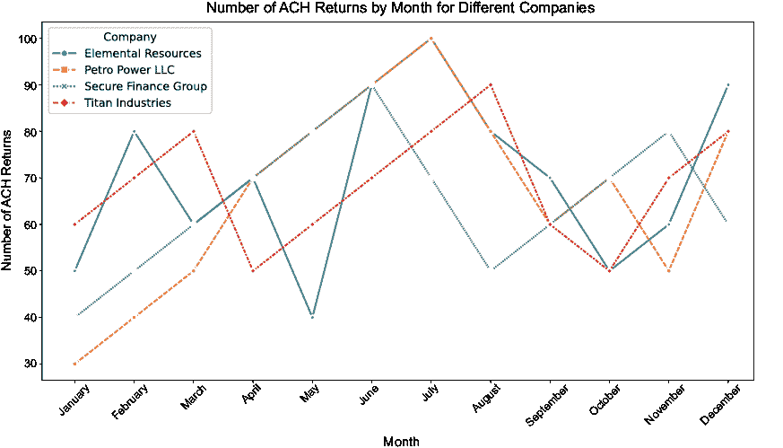

# 第十二章：接下来去哪里

### 本章涵盖

+   扩展仪表板

+   提升我们的自动清算所处理

+   深入探索金融科技

在这本书中，我们完成了一个整个程序增量——从研究激增开始，我们推导出一个最小可行产品（MVP），并根据利益相关者的反馈增强了产品。在这个过程中，我们使用 FastAPI 进行 Python 编程，以记录和驱动我们的 API。此外，我们使用 Next.js 和 Material UI 来展示存储在我们 Postgres 数据库中的数据。在这个项目中工作扩展了我们对金融科技和自动清算所处理的了解。

然而，我们只是触及了可能性的表面。通过处理自动清算所交易，我们能够驱动许多你可能在日常生活中经常遇到的有意思的功能。换句话说，项目现在处于一个可以扩展到软件开发和金融不同领域的点。本章分享了一些你可以用来改进项目的想法，图 12.1 展示了各种可能性的概述。

##### 图 12.1 扩展我们的项目

## 12.1 后端处理

我们使用 Python、FastAPI 框架和运行 Postgres 的数据库构建了后端处理。虽然我们有机会触及所有这些领域，但我们并没有真正深入地检查它们，但现在是你调查我们跳过或未能涵盖的一些可能性完美的时机。本节涉及后端的一些你可能觉得既有趣又有价值的领域。

### 12.1.1 异步处理

到目前为止，你应该对自动清算所处理有了更好的理解，因此让我们探讨一些增强上传文件解析的可能方法。在上传文件时，我们目前必须等待文件加载和处理完毕后才能返回响应。对于大文件来说，这根本不会是一个愉快的体验，因为处理过程可能会超时，用户可能不会意识到文件仍在后台加载。这个缺点可能会导致用户尝试第二次、第三次或第四次处理文件。根据我们实施的保障措施，如果没有方法可以识别文件是相同的（例如计算哈希），这很可能会导致重复的交易被记入账户。

我们不仅需要担心大文件，还需要担心与文件加载相关的辅助处理。我们在 OFAC 扫描和我们将如何可能需要将其集成到自动清算所文件处理本身中看到了这一点。你还需要将交易记入账户，根据适当的情况借记或贷记账户。当 OFAC 扫描和账户是独立的服务或需要额外的 API 调用时，当涉及大文件或远程服务时，你会看到用户体验的下降。

解决这个问题的方法之一是在文件加载中引入异步处理，然后分步骤处理文件。通过引入这种处理方式，你还将有更多机会改进用户体验。想象一下，用户正在加载一个文件。一旦你可以确认文件已成功上传，你就可以在那个点响应用户。然后文件可以被处理，用户可以通过仪表板上的消息、电子邮件或短信得到通知。要实现这个功能，你需要引入文件状态并跟踪文件通过各种阶段。

### 12.1.2 ORM 框架

对象关系映射器 (ORM) 允许将对象映射到数据库，并可以简化我们的类与数据库之间的交互。SQLAlchemy 和 Peewee 等 ORM 是 Python 中流行的选项，可以与包括我们的 Postgres 数据库在内的各种数据库一起工作。那么，我们为什么没有使用 ORM 呢？

我们认为 ORM 非常方便，但它们带来的抽象级别也带来了一定的学习曲线。当然，学习纯 SQL 也有其学习曲线！现在你已经学习了一些 SQL 概念并创建了一些查询，现在是时候看看你是否可以加入 ORM 并替换一些手写的 SQL。

### 12.1.3 应用程序编程接口

在这个阶段，RESTful API 在行业中无处不在，FastAPI 为我们在应用程序中构建 API 提供了一种很好的方法。它还允许我们轻松生成 OpenAPI 文档，因此有很多机会学习 API 开发。我们还简要地了解了一些 API 管理器，例如 WSO2。

我们构建了足够的 API 来演示 ACH 处理和一些仪表板功能，但要有一个完全功能的仪表板，我们需要生成额外的 API 和功能。例如，仪表板应该提供添加/更新/删除公司、删除上传的文件以及撤销与删除文件相关的一切（例如，OFAC 相关的扫描）的能力。你可以在项目的许多地方扩展或增强当前的 API。

另一个选择可能是开始引入 GraphQL。虽然 RESTful API 仍然是主要的 API 标准，但 GraphQL 仍然有其位置。无论我们是否想要从 REST 迁移，还是将其与我们的 RESTful API 结合使用，GraphQL 都是一个值得探索的有趣选项。至少，你可以获得一些实践经验，这样当另一个团队想要实施它时，你会有一个有根据的意见。

## 12.2 基础设施

大多数公司和项目都有强大的基础设施——它支持项目的长期可持续性。例如，项目需要以某种形式构建、打包和部署。这个过程可能需要代码合并、审查、扫描漏洞或只是确保代码符合现有标准。在本节中，我们探讨如何改进 ACH 仪表板的架构。

### 12.2.1 Docker

使用 ACH 仪表板，我们高度依赖 Docker，不仅因为理解并熟悉容器技术很重要，而且因为探索其他技术和产品时它也非常有用。

例如，Atlassian 等公司提供了允许我们运行其产品的 Docker 镜像，这有助于在沙盒环境中评估它们。我们看到了如何使用 Docker 镜像轻松地将 Postgres 启动并运行。此外，WSO2 API Manager 也可通过 Docker 下载。您应该记住，无论何时您想要探索新事物，都可能有一个容器让您快速开始工作。无论是 Docker 上的官方 Golang、MongoDB 或 Debian Linux 发行版的镜像，您都可以探索丰富的资源，而无需在您的机器上安装大量产品——只需使用容器，完成后即可丢弃。

### 12.2.2 多租户环境

虽然存在几种多租户环境版本，但我们认为多租户环境涉及两个不同的实体（金融机构）共享相同的数据库表。我们只考虑了该应用程序被 Futuristic FinTech 使用。但如果您想要或需要支持额外的金融机构呢？这可以通过几种方式来解决。首先，由于应用程序作为独立服务运行，您可以简单地启动额外的容器来处理新的金融机构。您应该能够做到这一点而无需任何额外设置。每个金融机构都会在自己的实例上运行，并且您会有不同的 DNS 名称指向这些位置，例如 http://bankA.dashboard.com 或 http://bankB.dashboard.com。

另一个选择是更新数据库，使表也利用租户 ID，这可能是银行的 ABA 号码或其他标识符。这个选项允许银行存在于同一个数据库中。标识符不一定需要添加到所有表中（例如，个人 ACH 记录表不需要标识符，因为它们依赖于 ACH 文件表），这意味着 ACH 文件本身可以与特定的银行关联，然后该文件中的所有记录将自动与该银行关联。然而，您需要审查查询以确保无法使用另一家银行的 UUID 拉取银行数据。

使用单个数据库与多个数据库相比，各有优缺点。根据行业、公司和监管法规的不同，客户可能需要将数据隔离在不同的数据库中，甚至限制使用自己的硬件。然而，添加其他可以使用自己的路由号、公司和其他类似功能的仪表板，将允许您探索不同类型的架构，并有机会解决这类问题。

### 12.2.3 持续集成和交付

我们的项目使用了在 Docker 下运行的几个容器。这种方法对我们的需求来说已经足够好了，尤其是在运行数据库在容器中时。我们能够在需要时将容器关闭并从全新的数据库开始。我们遇到的一个挑战是将我们的项目从 IDE 或 GitHub 这样的源代码控制系统转移到那些容器中，因为目前这是一个手动过程。

一个值得探索的方向（特别是如果你没有太多机会这样做）是看看自动化这些任务的各种方法。这让你朝着持续集成（CI）和持续部署（CD）的方向前进。例如，你可以从 IDE 自动化移动和/或构建代码到适当的容器中。你也可以创建一个 CI/CD 服务器（如 Jenkins）的实例，并学习从那里构建和部署代码。此外，你也可以使用 GitHub Actions 来部署代码，尽管由于当前的基础设施设置需要在本地 Docker 容器中运行，使用本地 Jenkins 服务器可能更容易。

像 Jenkins 这样的构建服务器允许你在构建过程中自动化其他任务，例如运行单元测试、扫描安全漏洞以及执行一系列其他任务。你很可能会在任何规模和任何行业的公司中找到这些类型的构建服务器。

### 12.2.4 测试

我们尝试引入了几种测试应用程序的方法，主要借鉴了 TDD 和 BDD。在引入后，我们没有机会重新审视使用 Locust 对 API 进行负载测试。我们也没有进行太多的 UI 测试，除了在 Jest 和 Playwright 中进行的一些测试。

扩展测试和审查测试覆盖率是熟悉测试过程的一个很好的方法。你也可以确保测试足够健壮，能够在 CI/CD 服务器上运行。从编写测试和确保它们通过发布管道运行中可以学到很多东西。

### 12.2.5 数据库

我们选择了 Postgres 作为我们的数据库首选，但你当然不限于使用 Postgres。更改数据库可以与探索 ORM 框架相关联，因为它们提供了一种抽象级别，当底层数据库需要更换时可能很有帮助。如果企业有其他他们偏好的供应商或数据库产品，你通常必须使用那个数据库。如果你对销售产品并允许客户在其环境中安装它感兴趣，数据库选择的灵活性可以成为一个很大的卖点。如果一家公司使用 Oracle 数据库，而你的产品需要 Postgres 数据库，客户可能不会对管理另一个数据库产品的开销感兴趣。

一种替代方案不仅仅是将 Postgres 的 RDMS（关系数据库管理系统）换成其他供应商的产品，还要考虑探索使用 NoSQL 数据库，例如 MongoDB。虽然 Postgres 是存储 ACH 仪表板数据的绝佳选择，但将一些表迁移到 MongoDB 可能也很有趣。你可以从一些小的地方开始，比如`bank_routing_numbers`表，然后寻找可以迁移的其他表。你需要 MongoDB 来用于 ACH 仪表板吗？不需要，但你已经理解了可能使探索和过渡到新数据库变得有趣的表结构和数据。

## 12.3 用户界面

如果你想探索开发的另一端，从 UI（用户界面）的角度来说，有很多事情可以做。在整个项目中，我们使用了 React 和 Next.js 框架来构建界面。你可以使用其他的 React 框架，或者转换方向使用 Angular，甚至使用传统的 HTML、CSS 和 JavaScript！这完全取决于你的兴趣和需求所在。

### 12.3.1 图表和表单

我们使用了 Recharts 来创建一些散点图、条形图和饼图。然而，我们没有深入研究，你当然可以致力于添加新的图表并可视化 ACH 文件的其他方面。图 12.2 和 12.3 展示了两个样本图表，可视化了一段时间内的 ACH 文件。由于当前的图表专注于文件中的现有内容，它们将是我们用户的一个很好的补充。

你还可以让用户选择他们想要查看数据显示的图表类型。给图表添加一些交互性也会很好，比如根据用户操作动态调整数据或导航到其他页面。通过添加额外的图表和交互性，你可能可以改善用户体验，并使仪表板更加实用。

仪表板需要更新的另一个方面是通过使用表单来管理信息的基本方式。例如，公司信息被显示出来，但无法更新它。你可以启用更新、执行验证或尝试不同的方法向用户展示数据。我们还使用了大量的 DataGrid 元素来展示我们的数据。你可能继续使用这些元素，或者设计其他组件来展示数据。这可能会引导你探索像 Yehonathan Sharvit 在《面向数据的编程》（2022，Manning）中提到的那些概念。

##### 图 12.2  一年内按月支付的工资

##### 图 12.3  按公司划分的 ACH 返回

### 12.3.2 可配置的仪表板

你可以看到，在可配置仪表板方面，至少有三个级别的发展（可能还有更多）。你可以创建一些更多的预包装组件，用户可以将它们拖放到仪表板屏幕上以配置他们在查看主仪表板和公司级别时想要看到的内容。虽然这会给用户带来更多灵活性，并且可能极大地造福他们，但我们还可以提供更多的定制。

而不是从预包装组件中选择，如果允许他们自定义和配置自己的组件会怎样？通过允许用户选择要显示的字段并根据该信息生成图表，你可以给他们提供更精细的 UI 控制。

下一个发展步骤是允许用户使用仪表板或后端提供的 API 编写自己的组件。例如，Jenkins 或 Atlassian 套件允许第三方编写扩展产品功能的外部工具。想象一下，ACH 仪表板 UI 有一个市场，其中自定义用户组件通过我们之前描述的定制方式集成到仪表板中。也许用户想要在 ACH 文件加载、处理文件时发生异常或为 VIP 客户有交易时向 Microsoft Teams 或 Slack/Discord 频道发布消息以发出警报。

### 12.3.3 移动版本

我们使用 API 来确保后端和 UI 分离。不仅使用 API 是分离组件的好方法，而且它还允许你创建其他方式（或渠道）供用户与应用程序通信。例如，你可以使用 React Native、Dart、Swift、Kotlin 或任何你想要的来设计仪表板的移动版本。

对于移动应用程序的另一种方法可能是允许客户（公司）直接从他们的移动应用程序中创建批次并输入 ACH 系统的交易！因此，即使在处理 ACH 和 FinTech 时，我们也可以在这个领域继续工作。

## 12.4 财务

如果我们在技术方面已经拥有大量知识，并希望继续扩展应用程序的功能，那么也有许多可能性。

### 12.4.1 账户和客户

我们建议首先进行的一项任务是为应用程序添加账户。这些账户是存在于同一数据库中还是作为独立服务，这是可以在整体设计中做出的决定。添加账户会带来一些可能性，其中最不重要的是，如果你有账户号码，这些账户必须属于客户。客户与账户之间的关系并非小事，你可以考虑处理账户上的关系，例如主要/次要所有者或授权签字人等。

对于数据库中的账户（或通过 API 发布到核心银行产品），ACH 交易可以入账到账户。这会产生级联效应，导致您需要处理资金不足条件（也称为 NSF）、错误的或错误的账户号码错误、利息累积和账单。

当一个账户的资金不足以支付交易时，这可能会为账户创造一个全新的转账世界。您可能在该账户上有透支保护，或者可能从另一个账户转账资金以支付费用。此外，您可能还想查看计划转账或账单支付。

当一笔交易由于资金不足、无效的账户号码或其他多种条件而未能入账时，它可能会被退回或未入账。您需要处理退回或未入账项的方式可能因客户而异，以及根据具体情况的不同。

所有这些账户活动——例如交易入账、透支转账以及相关费用——必须在客户的月度账单上反映。这些账单和通知可以通过平信、电子邮件或在线查看。

最后，之前所做的许多事情也需要被撤销。例如，如果由于某些错误，一笔交易多次入账到账户，您需要能够安全地撤销该借记或贷记。这也可能导致需要撤销透支转账以及账户可能因错误交易入账而发生的任何相关费用。

### 12.4.2 ACH 原始交易和退回

ACH 原始交易是指创建将由 ACH 网络处理的 ACH 交易，如贷记和借记。在我们的项目中，我们专注于在仪表板内接收和处理 ACH 文件。金融机构可以创建 ACH 文件以帮助促进银行与其客户之间的资金转移。我们在创建用于测试的 ACH 文件时，也稍微触及了创建文件的过程。然而，随着我们仪表板中公司的增加，在创建文件方面出现了更多的发展机会。那些定义了数据库的公司可能希望为支付员工（工资）或其他企业/公司创建文件。您需要提供创建带有交易条目/附加信息的批次的必要能力。然后，金融机构将代表公司发送这些批次。

ACH 处理的另一个方面是需要处理退回。当金融机构拒绝交易时，就会发生 ACH 退回。可能导致这种情况发生的原因包括账户信息不正确、资金不足或交易中的止付。在 ACH 退回的情况下，您将把资金退回到原始账户，并可能收取费用。

通过添加 ACH 发起和处理退回的功能，您开始构建一个更完整的 ACH 处理系统。

### 12.4.3 正面支付

您可以考虑的另一个功能是构建正面支付系统。正面支付是一种最初为支票处理而创建的欺诈预防系统，但它已经扩展到其他交易处理领域。基本上，使用正面支付，客户将在仪表板上输入交易或在仪表板上上传预期交易的列表。然后系统将检查日期、金额、账户号码、姓名等字段，与公司提供的数据进行核对，以确保已添加交易。

当进入系统的交易与项目不匹配时，它们会被标记并拒绝处理。基本上，这是为了防止银行处理未经授权的交易，降低公司和银行的风险和欺诈。正面支付通常提供给商业客户，但在理论上，任何客户都可以使用。

### 12.4.4 服务费用

这是一个广泛的领域，客户可能会因交易类型或账户问题而被收取服务费用或费用。例如，大多数人痛苦地熟悉透支或资金不足的费用，这发生在交易金额超过可用余额时，银行会收取费用。显然，如果您正在处理 ACH 交易，您可能会遇到这种情况。其他费用可能与不同的操作相关，例如发起 ACH 交易、处理 IAT 交易、创建止付或每月维护费，仅举几个例子。

由于您拥有公司、客户和账户（根据您实施了多少附加功能而定），有充足的机会向客户应用不同类型的服务费用。继续遵循 ACH 主题，您可以选择根据公司处理的交易数量或发起的交易数量收费，或者对退回或撤销的项目收费。虽然服务费用开始涉及更广泛的 FinTech 领域，但在 ACH 特定领域应用费用仍有大量机会。

## 12.5 最后的想法

我们已经到达了旅程的终点，并希望感谢您一直陪伴我们！本书的主要目标是激发您对软件开发和金融的兴趣，希望您继续探索其他领域或深入研究我们已经触及的主题。根据我们的经验，将优秀的软件开发者与伟大的软件开发者区分开来的是好奇心和愿意扩展知识以继续成长。承担这本书并完成它应该表明您具备成为一名优秀程序员所需的素质。

在这本书中，你有机会通过敏捷方法完成一个 FinTech 项目。我们希望提供一个基于现实世界的项目，并遵循你可能在任何你将工作的公司中看到的过程。

从处理 ACH 文件，到创建 API，以及在 UI 中展示一切，你工作了很多领域，覆盖了很多额外的主题。我们希望你喜欢这段旅程！

## 摘要

+   不论是扩展现有代码、替换 FastAPI 框架，还是完全转向 Python 之外，我们都可以做很多事情来继续扩展项目的后端处理。将功能从一种语言重写到另一种语言通常能提供很好的学习体验，而且能够使用在原始语言中不可用的语言或框架特性，这可以带来启发。

+   有时，由于资源限制，需要重写代码片段或整个应用程序。我们见过应用程序被重写为新的语言，因为它们是使用非标准语言编写的遗留软件，而团队没有足够的带宽或资源去学习它，只是为了维护那块软件。

+   建立良好的产品通常周围有大量的基础设施。这种基础设施通常是自制的，尤其是如果我们处理的是可能在商业工具可用之前就存在的遗留软件。

+   了解现有的工具可以很有帮助，因为自制的工具最终需要被替换。通常，随着团队成员的成熟，需要用标准产品替换现有的自制工具，以便新团队成员的学习曲线降低。

+   ACH 在美国被广泛使用，正如我们所见，它还具有国际能力。处理 ACH 交易为每年数十亿次发生但没有多少宣传的实际事件提供了真实世界的曝光。创建一个简单的系统来开始处理 ACH 交易，并查看处理过程中的情况，为我们提供了一个很好的扩展基础。

# 索引
