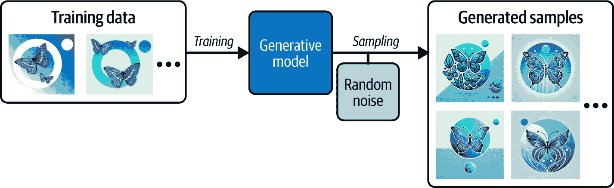
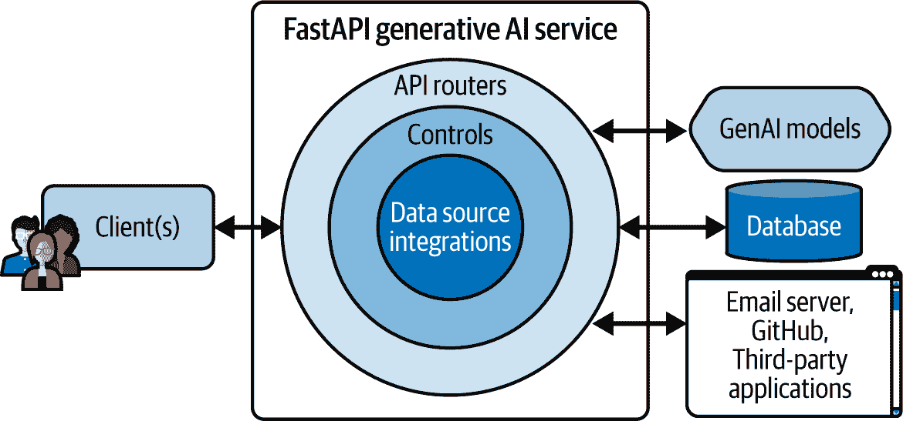

# 第一章. 简介

到本章结束时，你应该能够识别 GenAI 在你自己的应用路线图中的作用及其相关挑战。

# 什么是生成式 AI？

*生成式 AI*是机器学习的一个子集，它专注于使用在数据集上训练的模型创建新内容。*训练模型*是一个数学模型，代表训练数据中的模式和分布，可以生成与训练数据集相似的新数据。

为了说明这些概念，想象一下在一个包含蝴蝶图像的数据集上训练一个模型。该模型学习蝴蝶图像中像素之间的复杂关系。一旦训练完成，你就可以从模型中采样以创建原始数据集中不存在的蝴蝶的新图像。这些图像将包含与原始蝴蝶图像的相似性，但仍然有所不同。

###### 注意

使用训练好的生成模型根据从训练数据中学习到的模式创建新内容被称为推理。

图 1-1 展示了整个流程。



###### 图 1-1. 训练用于创建蝴蝶新照片的生成模型

由于我们不希望生成与训练数据集相同的输出，我们在采样过程中添加一些随机噪声以在输出中创建变化。这个影响生成样本的随机成分使得生成模型*概率性*。它将生成模型与固定计算函数区分开来，例如，作为例子，平均多个图像的像素以创建新的图像。

在处理 GenAI 解决方案时，你可能会遇到六种生成模型家族，包括：^(1)

变分自编码器（VAEs）

VAEs 学习将数据编码到低维数学空间（称为*潜在空间*——见图 1-2）中，以便在生成新数据时解码回原始空间。

生成对抗网络（GANs）

GANs 是一对神经网络（判别器和生成器），在训练过程中相互竞争以学习数据中的模式。一旦训练完成，你可以使用生成器来创建新数据。

自回归模型

这些模型学习根据先前值预测序列中的下一个值。

正态化流模型

这些模型将简单的概率分布（数据中的模式）转换为更复杂的分布，以生成新的数据。

基于能量的模型（EBMs）

EBMs 基于统计力学。它们定义了一个能量函数，将较低的能量分配给观察到的数据，将较高的能量分配给其他配置，并且它们被训练来区分这些配置。

扩散模型

扩散器学习向训练数据添加噪声以创建纯噪声分布。然后学习逐步从采样点（从纯噪声分布）中去除噪声以生成新数据。

转换器

Transformer 可以以极高的并行性建模大型顺序数据，如文本语料库。这些模型使用*自注意力*机制来捕捉序列中元素之间的上下文和关系。给定一个新的序列，它们可以使用学习到的模式来生成新的数据序列。Transformer 通常用作*语言模型*来处理和生成文本数据，因为它们更好地处理文本中的长距离关系。OpenAI 的 ChatGPT 是一个被称为*生成式预训练 Transformer*（GPT）的语言模型。

需要注意的一个事实是，这些生成式模型通常只能处理某些类型的数据或*模态*，例如文本、图像、音频、视频、点云，甚至 3D 网格。其中一些甚至是*多模态*的，比如 OpenAI 的 GPT-4o，它可以原生处理多种模态，如文本、音频和图像。

为了解释这些生成式 AI 概念，我将使用一个图像生成用例作为例子。其他用例包括将语言模型用作聊天机器人或文档解析器，音频模型用于音乐生成或语音合成，以及视频生成器用于创建 AI 头像和深度伪造。你可能已经见证了许多其他用例，还有数百个尚未被发现。

一个事实仍然存在。生成式 AI 服务将推动未来应用。让我们看看为什么。

# 为什么生成式 AI 服务将推动未来应用

我们使用计算机来自动化解决日常问题的方案。

在过去，自动化一个流程需要手动编写业务规则，这可能既耗时又乏味，尤其是在依赖手写规则解决复杂问题，如垃圾邮件检测时。如今，你可以训练一个模型来理解业务过程的细微差别。一旦训练完成，这个模型可以超越作为应用程序代码实现的手写规则，从而取代这些规则。

这种向基于模型自动化的转变在市场上催生了 AI 驱动的应用，解决了包括价格优化、产品推荐或天气预报在内的各种问题。作为这一波浪潮的一部分，生成式模型出现了，它们在产生多媒体内容（文本、代码、图像、音频、视频等）的能力上与其他类型的 AI 不同，而传统的 AI 更多地涉及预测和分类。

作为一名软件工程师，我相信这些模型具有某些能力，将影响未来应用的开发路线图。它们可以：

+   促进创意过程

+   提供上下文相关的解决方案

+   个性化用户体验

+   最小化解决客户查询的延迟

+   作为复杂系统的接口

+   自动化手动行政任务

+   规模化和民主化内容生成

让我们更详细地看看每一种能力。

## 促进创意过程

掌握技能和获取知识在认知上要求很高。在形成你自己的原创想法以创作新颖和有创意的内容，如文章或设计之前，你可以在学习与实践上花费很长时间。

在创作过程中，你可能会遇到写作障碍——想象和可视化场景、导航想法、构建叙事、构建论点和理解概念之间关系上的困难。创作过程需要深入理解你创作的目的，以及对你打算借鉴的灵感和想法来源的清晰认识。通常，当你坐下来写一篇原创文章时，你可能会发现从空白屏幕或纸张开始很难。你需要对某个主题进行广泛的研究，以形成你自己的观点和想要写的故事。

创作过程也适用于设计，而不仅仅是写作。例如，在设计用户界面时，在你原创设计之前，你可能需要花费几个小时进行设计研究，浏览设计网站以获取关于色彩搭配、布局和构图的想法。从一张空白画布上创造出真正原创的东西可能感觉就像徒手攀墙。你需要灵感，并遵循一个创作过程。

创造原创内容需要创造力。因此，人类从头开始产生原创想法是一项非凡的成就。新的想法和创作通常基于灵感、连接想法和对其他作品的改编。创造力涉及复杂、非线性的思维和情商，这使得它难以用规则和算法复制或自动化。然而，现在使用生成式人工智能模仿创造力是可能的。

GenAI 工具可以帮助你通过连接人类知识库中的各种想法和概念来简化流程。使用这些工具，你可以偶然发现需要理解大量相互关联的知识和几个概念之间相互作用的新想法。此外，这些工具可以帮助你想象难以可视化的场景或概念。为了说明这一点，尝试想象示例 1-1 中描述的场景。

##### 示例 1-1\. 人类难以可视化的场景描述

```py
An endless biomechanical forest where trees have metallic roots and glowing neon
leaves, each tree trunk embedded with rotating gears and digital screens
displaying alien glyphs; the ground is a mix of crystalline soil and pulsating
organic veins, while a surreal sky shifts between a digital glitch matrix and a
shimmering aurora made of liquid light.
```

除非你已经习惯了想象这样的概念，否则这可能相当难以想象。然而，有了生成模型的帮助，任何人现在都可以可视化并将具有挑战性的概念传达给他人。

在示例 1-1 中提供场景描述给像[DALL-E 3 (OpenAI)](https://oreil.ly/Z80Qm)这样的图像生成工具，会产生如图图 1-3 所示的输出。


###### 图 1-3\. 由[DALL-E 3](https://oreil.ly/Z80Qm)生成的图像

看到这些生成式 AI 工具如何帮助你可视化和传达复杂概念是非常有趣的。这些工具允许你扩展想象力并推动你的创造力。当你感到卡住或发现难以沟通或想象新想法时，你可以求助于这些工具。

在未来，我可以预见包括类似功能的应用程序将帮助用户在他们的创作过程中。如果你的应用程序为用户提供了几种建议来构建，这可以帮助他们快速上手并积累动力。

## 提出情境相关的解决方案

通常你会发现自己在面对一些没有先前解决方案的细分问题。这些问题的解决方案并不明显，需要大量的研究、试错、咨询其他专家和阅读。开发者对这种情境很熟悉，因为找到与编程问题相关的解决方案可能会很棘手，并不直接。

这是因为开发者必须带着一定的情境去解决问题。一个问题的定义不能没有对“情境”的详尽描述，而“情境”正是在*情境*中产生的。

实际上，*情境*缩小了问题的潜在解决方案范围。

使用搜索引擎时，你通过几个可能包含也可能不包含相关解决方案的关键词来寻找信息来源。当开发者寻找解决方案时，他们会将错误日志粘贴到谷歌上，并被引导到像[Stack Overflow](https://stackoverflow.com)这样的编程问答网站。开发者必须希望找到在相同情境下遇到相同问题并且有人已经提供了解决方案的人。这种方法在寻找编程问题的解决方案上并不高效。作为开发者，你并不总是能在这些网站上找到你想要的解决方案。

开发者现在正在转向生成式 AI 来解决编程问题。通过提供一个描述问题情境的提示，AI 可以生成潜在解决方案。更好的是，代码编辑器集成在为语言模型提供这种情境方面发挥了重要作用，这在谷歌搜索或 Stack Overflow 搜索时是不可能的。然后，这些 AI 模型可以生成与情境相关且基于从在线论坛和多个问答网站学习到的知识库的解决方案。有了提出的解决方案，你就可以决定是否任何一个是合适的。

由于这个原因，使用 GenAI 编码工具通常比在在线论坛和网站上搜索解决方案更快。即使是[编程问答网站，Stack Overflow](https://oreil.ly/nOX_K)也将其发布后 GPT-4 语言模型和代码生成器试用带来的平均以上的流量下降（约 14%）归因于开发者。这个数字可能更高，因为一些网站的高级用户在公司博客文章中评论说，他们感觉网站上的用户活动大幅减少。事实上，在撰写本文时，与 2018 年相比，网站上的[提问和点赞活动已报告下降约 60%](https://oreil.ly/P6Kur)。

在任何情况下，Stack Overflow 仍然预期随着 GenAI 编码工具的引入，未来流量会有起伏，这些工具民主化了编码，扩大了开发者社区，并创造了新的编程挑战。问答网站的力量不仅在于找到答案，还在于理解周围的讨论以及引用来源的重要性。2 因此，由于这些网站拥有专家社区和人工编辑的内容，它们将继续是开发者的宝贵资源，因为它们在答案或解决方案的正确性和质量方面维护着信任。3

## 个性化用户体验

现代软件的客户和用户在使用现代应用时，期望获得一定程度的个性化和互动性。

通过将生成模型，如语言模型，集成到现有应用中，你可以创新用户与系统交互的方式。不再需要通过点击多个屏幕的传统 UI 交互，你可以与聊天机器人进行自然文本对话，以获取所需信息或请求代表你执行的操作。例如，当浏览旅游规划网站时，你可以描述你理想的假期，并让聊天机器人根据平台对航空公司、住宿提供商和打包度假产品数据库的访问权限为你准备行程。或者，如果你已经预订了假期，你可以根据账户数据中的行程细节请求观光推荐。然后聊天机器人会向你描述结果，并征求你的反馈。

这些语言模型可以通过提出相关问题来充当个人助理，直到将你的偏好和独特需求映射到产品目录，以生成个性化的推荐。这些虚拟助手可以理解你的意图，并为你提出与你的情况相关的选择。如果你不喜欢这些建议，你可以提供一些反馈来细化任何建议，使其符合你的喜好。

在教育领域，这些生成式 AI 模型可以用来描述或可视化针对每个学生的学习偏好和能力定制的复杂概念。

在游戏和虚拟现实（VR）中，GenAI 可以根据用户与应用程序的交互构建动态环境和世界。例如，在角色扮演游戏（RPG）中，您可以根据用户在实时使用内置的大型语言模型时的决策和对话选择即时生成叙事和角色故事。这个过程为游戏玩家和这些应用程序的用户创造了一个独特的体验。

## 最小化解决客户查询的延迟

除了个性化用户助手外，企业通常需要支持处理大量客户服务查询。由于这个数量，客户通常不得不在长时间排队或等待几天后才能从企业那里得到回复。此外，随着企业运营复杂性和客户的增长，及时解决客户查询可能变得更加昂贵，并需要广泛的员工培训。

GenAI 可以为顾客和企业简化客户服务流程。现在，顾客可以与一个能够访问数据库和相关资源并在几分钟内解决查询的语言模型进行聊天或通话，而不是几天。当客户描述他们的问题时，该模型可以根据企业政策处理这些查询，并在必要时引导客户到相关资源。

虽然传统的聊天机器人通常依赖于一组手工编写的规则和预定义的脚本，但由 GenAI 驱动的聊天机器人可以做得更好：

+   理解对话上下文

+   考虑用户偏好

+   形成动态和个性化的回复

+   接受并调整用户反馈

+   处理意外的查询，特别是历史或更长的对话

这些因素使得 GenAI 聊天机器人能够与客户进行更自然和多样化的互动。这些机器人将成为那些希望在案件升级到人工代理之前迅速得到查询回答的客户的第一接触点。作为客户，如果您想避免长时间排队并快速解决问题，您可能也更愿意首先与这些 GenAI 聊天机器人交谈。

这些例子只是触及了可以集成到现有应用程序中的所有可能功能的一小部分。这种生成模型的灵活性和敏捷性为未来新颖的应用开辟了许多可能性。

## 作为复杂系统的接口

现在，许多人仍然在与数据库或开发者工具等复杂系统交互时遇到问题。非开发者可能需要访问信息或执行任务，而没有必要在这些复杂系统上执行命令的技能。LLMs 和 GenAI 模型可以作为这些系统与用户之间的接口。

用户可以用自然语言提供提示，GenAI 模型可以在复杂系统中编写和执行查询。例如，投资经理可以要求 GenAI 机器人汇总公司数据库中投资组合的表现，而无需提交由专家生成报告的请求。另一个例子是 Photoshop 的新生成填充工具，它为不熟悉 Photoshop 各种工具的用户生成图像图层并执行基于上下文的编辑。

已经有数家 AI 初创公司开发了 GenAI 应用，用户可以用自然语言与语言模型互动以执行工具操作。利用语言模型，这些初创公司正在取代复杂的流程和在不同 UI 屏幕上点击。

虽然 GenAI 模型可以作为数据库或 API 等复杂系统的接口，但开发者仍然需要实施护栏和安全措施，正如你将在第九章（ch09.html#ch09）关于 AI 安全中学习的那样。这些集成需要谨慎处理，以避免通过这些系统上的生成模型进行恶意查询和攻击向量。

## 自动化手动行政任务

在许多大型且历史悠久的公司中，通常有几个团队在进行一些对前台团队和客户不太明显的手动行政工作。

典型的行政任务包括手动处理具有复杂布局的文档，如发票、采购订单和汇款单。直到最近，这些任务仍然主要是手工操作，因为每份文档的布局和信息排列可能都是视觉上独特的，需要人工验证或批准。除此之外，任何旨在自动化这些流程的软件都可能很脆弱，并且需要达到很高的准确性和正确性，即使在边缘情况下也是如此。

现在，语言和其他生成模型可以使这些手动流程的部分进一步自动化并提高准确性。如果现有的自动化由于边缘情况或流程的变化而无法执行，语言模型可以介入，将输出与某些标准进行比较，填补空白或标记项目以供人工审查。

## 扩展和民主化内容生成

人们喜欢新鲜内容，总是寻找新的想法去探索。现在，作家们可以在使用 GenAI 工具撰写博客文章时进行研究和构思。通过与模型对话，他们可以头脑风暴想法并生成大纲。

对于内容生成，这种生产力提升是巨大的。您不再需要执行低级认知任务，如总结研究或自己改写句子。撰写高质量博客文章所需的时间从几天缩短到几小时。而不是从头开始，您可以在使用 GenAI 填补空白之前，专注于内容的提纲、流程和结构。当您在清晰和简洁地排列正确单词时遇到困难，GenAI 工具可以大放异彩。然而，使一篇写作有趣往往不是内容，而是写作的风格和流畅度。

许多企业已经开始使用这些工具来探索想法和起草文档、提案、社交媒体和博客文章。

总体而言，这是几个原因，我相信未来更多的开发者将把 GenAI 功能集成到他们的应用程序中。这项技术仍处于起步阶段，在生成式人工智能被广泛采用之前，还有许多挑战需要克服。

# 如何构建生成式人工智能服务

生成模型需要访问丰富的上下文信息以提供更准确和相关的响应。在某些情况下，它们可能还需要代表用户执行操作的能力——例如，通过运行自定义函数来下订单。因此，您可能需要围绕生成模型（作为包装器）构建 API，以处理与外部数据源（例如，数据库、API 等）的集成以及控制用户对模型的访问。

要构建这些 API 包装器，您可以将生成模型放置在 HTTP 网络服务器后面，并实现所需的集成、控制和路由，如图 1-4 所示。



###### 图 1-4\. 带有数据源集成以服务于生成模型的 FastAPI 网络服务器

网络服务器控制对数据源和模型的访问。在底层，您的服务器可以查询数据库和外部服务，以丰富用户提示，为生成更相关的输出提供相关信息。一旦生成输出，控制层就可以进行合理性检查，而路由器则向用户返回最终响应。

###### 小贴士

您甚至可以更进一步，通过配置语言模型来构建另一个系统的指令，并将其传递给另一个组件以执行这些命令，例如与数据库交互或进行 API 调用。

总结来说，网络服务器作为关键的中介，管理数据访问，丰富用户提示，并在将输出路由到用户之前对生成的输出进行质量控制。除了向用户提供生成模型之外，这种分层方法还增强了生成模型响应的相关性和可靠性。

# 为什么使用 FastAPI 构建生成式人工智能服务？

生成式 AI 服务需要高性能的 Web 框架作为后端引擎，以支持事件驱动的服务和应用程序。FastAPI 是 Python 中最受欢迎的 Web 框架之一，[在性能上可以与其他流行的 Web 框架竞争](https://oreil.ly/LmEg7)，如*gin (Golang)*或*express (Node.js)*，同时保持 Python 深度学习生态系统的丰富性。非 Python 框架缺乏在单个服务中与生成式 AI 模型一起工作所需的直接集成。

在 Python 生态系统内，有几个核心的 Web 框架用于构建 API 服务。最受欢迎的选项包括：

Django

一个包含电池的完整栈框架。它是一个成熟且拥有庞大社区和众多支持的框架。

Flask

一个轻量级且可扩展的微 Web 框架。

FastAPI

一个为速度和性能而构建的现代 Web 框架。它是一个包含电池的完整栈框架。

尽管 FastAPI 最近才进入 Python Web 框架领域，但它已经获得了关注和流行。截至本文撰写时，FastAPI 是 Python 中下载量增长最快的 Web 框架，在 GitHub 上也是最受欢迎的 Web 框架之一。根据其日益增长的 GitHub Star 数量（撰写时约为 80,000），它正在成为比 Django 更受欢迎的框架。

在提到的框架中，Flask 因其声誉、社区支持和可扩展性，在包下载量上领先。然而，作为一个微 Web 框架，它只提供了有限数量的默认功能，例如开箱即用的模式验证支持。

Django 还因其通过 Django Rest Framework 构建 API 和遵循模型-视图-控制器（MVC）设计模式的单体应用程序而受到欢迎。但它对异步 API 的支持不够成熟，可能存在性能限制，并且可能会增加构建轻量级 API 的复杂性和开销。

与其他 Web 框架相比，FastAPI 提供了开箱即用的几个功能，如数据验证、类型安全、自动文档和内置 Web 服务器。因此，熟悉 Python 的开发者可能会从有偏见且较旧的框架如 Django 转向 FastAPI。我假设卓越的开发者体验、开发自由、出色的性能以及通过生命周期事件提供的最近 AI 模型服务支持可能是这一转变的原因。

本书涵盖了开发能够自主执行操作并与外部服务交互的生成式 AI 服务的实现细节，这一切都由 FastAPI Web 框架提供支持。

为了学习相关概念，我将在你阅读本书的同时，引导你完成一个综合项目。让我们来看看。

# 阻碍生成式 AI 服务采纳的因素

组织在采用生成 AI 服务时面临几个挑战。存在与 GenAI 输出的不准确性、相关性、质量和一致性相关的问题。此外，还有关于数据隐私、网络安全以及如果用于生产，模型可能被滥用和误用的担忧。因此，公司不想完全赋予这些模型自主权。他们直接将它们与敏感系统（如内部数据库或支付系统）连接时存在犹豫。

将 AI 服务与现有系统（如内部数据库、Web 界面和外部 API）集成可能是一个挑战。这种集成可能由于兼容性问题、对技术专长的需求、可能破坏现有流程、对这些系统的恶意攻击以及类似的数据安全和隐私担忧而变得困难。

想要使用该服务进行面向客户的公司的希望模型响应保持一致性和相关性，并确保输出不会冒犯或不适当。

使用这些生成模型生产原创和高质量内容也存在局限性。如前所述，这些 GenAI 工具在特定领域内有效地将各种想法和概念连接起来。但它们不能产生完全未见或新颖的想法；相反，它们以看似新颖的方式重新组合和改写现有信息。此外，它们在生成过程中遵循常见的模式，这些模式可能是通用的、重复的，并且在使用时可能缺乏灵感。最后，它们可能会产生听起来合理但实际上完全错误和虚构的输出，这些输出不是基于事实或现实的。

###### 注意

当 GenAI 模型产生虚构事实和错误信息时，这些情况被称为*幻觉*。

这些模型产生幻觉的倾向阻止了它们在需要高度准确输出的敏感用例中的应用，例如医疗诊断、法律咨询和自动考试。

一些挑战，例如数据隐私和安全问题，可以通过软件工程最佳实践来解决，你将在本书中了解更多。解决其他挑战需要优化模型的输入或微调这些模型（通过特定用例中的新示例调整其参数）以提高输出的相关性、质量、连贯性和一致性。

# 核心项目概述

在这本书中，我将引导你使用 FastAPI 作为底层 Web 框架来构建一个生成 AI 服务。

该服务将：

+   与包括用于文本生成和聊天的语言模型、用于文本到语音的音频模型以及用于图像生成的 Stable Diffusion 模型在内的多个模型集成

+   以文本、音频或图像的形式生成对用户查询的实时响应

+   使用 RAG 技术通过向量数据库“交谈”上传的文档

+   在响应查询时，抓取网络并与内部数据库、外部系统和 API 进行通信，以收集足够的信息

+   在关系型数据库中记录对话历史

+   通过基于令牌的凭证和 GitHub 身份登录验证用户

+   通过授权守卫根据用户权限限制响应

+   使用护栏提供足够的保护措施以防止滥用

专注于构建 API 服务，你将学习如何使用 Python Streamlit 包和简单的 HTML 来开发用户界面。在实际应用中，你可能需要将你的生成式人工智能服务与使用 React 库或 Next.js 框架构建的定制 UI 进行接口，以实现模块化、可扩展性和可伸缩性。

# 摘要

在本章中，你学习了生成式人工智能的概念以及它是如何利用训练数据中的学习模式在文本、音频、视频等多种模态中创建数据的。你还看到了这个技术的几个实际示例和用例，以及为什么大多数未来的应用都将由生成式人工智能能力驱动。

你还学习了生成式人工智能如何促进创意过程，消除中间环节，个性化用户体验，以及使复杂系统和内容生成的访问民主化。此外，你还了解了阻碍生成式人工智能广泛应用的几个挑战以及相应的解决方案。最后，你学习了更多关于你将使用 FastAPI 网络框架构建的生成式人工智能 API 服务。

在下一章中，你将学习关于 FastAPI 的内容，这将使你能够实现自己的生成式人工智能服务。

^(1) 您可以在 David Foster（O’Reilly，2024 年）的[*生成式深度学习*](https://www.oreilly.com/library/view/generative-deep-learning/9781098134174/)一书中了解更多关于这些模型的信息。

^(2) 近期的人工智能工具现在可以提供解决方案的来源引用（例如，[phind.com](https://phind.com)）。

^(3) Stack Overflow 的[2024 开发者调查](https://oreil.ly/odPkB)显示，65000 名编码者中有 72%的开发者对人工智能工具持积极态度，但只有 43%的人信任这些工具的准确性。
