# 第三章\. AI 集成与模型服务

在本章中，你将学习各种 GenAI 模型的机制以及如何在 FastAPI 应用程序中提供服务。此外，使用[Streamlit UI 包](https://oreil.ly/9BXmn)，你将创建一个简单的浏览器客户端，用于与模型服务端点交互。我们将探讨不同的模型服务策略、如何预加载模型以提高效率，以及如何使用 FastAPI 功能进行服务监控。

为了巩固本章的学习，我们将逐步构建一个 FastAPI 服务，使用开源 GenAI 模型生成文本、图像、音频和 3D 几何形状，全部从头开始。在后续章节中，你将构建解析文档和网页内容的功能，以便你的 GenAI 服务可以使用语言模型与之交流。

###### 注意

在上一章中，你学习了如何在 Python 中设置一个新的 FastAPI 项目。在阅读本章剩余内容之前，请确保你已经准备好了新的安装。或者，你可以克隆或下载本书的[GitHub 仓库](https://github.com/Ali-Parandeh/building-generative-ai-services)。然后一旦克隆，切换到`ch03-start`分支，准备进行后续步骤。

到本章结束时，你将拥有一个 FastAPI 服务，该服务提供各种开源 GenAI 模型，你可以在 Streamlit UI 中进行测试。此外，你的服务将能够使用中间件将使用数据记录到磁盘。

# 生成模型服务

在你的应用程序中提供预训练的生成模型之前，了解这些模型的训练方式和数据生成过程是值得的。有了这种理解，你可以定制应用程序的内部结构，以增强提供给用户的结果。

在本章中，我将向你展示如何在不同模态上提供服务，包括：

+   基于转换器神经网络架构的*语言*模型

+   基于激进转换器架构的文本到语音和文本到音频服务的*音频*模型

+   基于 Stable Diffusion 和视觉转换器架构的文本到图像和文本到视频服务的*视觉*模型

+   基于条件隐函数编码器和扩散解码器架构的文本到 3D 服务的*3D*模型

这个列表并不全面，仅涵盖了少量通用人工智能（GenAI）模型。若要探索其他模型，请访问[Hugging Face 模型仓库](https://oreil.ly/-4wlQ).^(1)

## 语言模型

在本节中，我们讨论语言模型，包括转换器（Transformers）和循环神经网络（RNNs）。

### 转换器与循环神经网络的对决

人工智能的世界因里程碑式的论文“Attention Is All You Need”的发布而震动。在这篇论文中，作者们提出了一种完全不同的自然语言处理（NLP）和序列建模方法，与现有的 RNN 架构不同。

图 3-1 展示了原始论文中提出的简化版变压器架构。

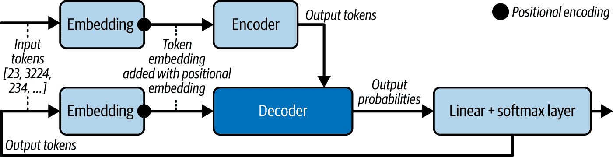

###### 图 3-1\. 变压器架构

从历史上看，文本生成任务利用 RNN 模型来学习序列数据（如自由文本）中的模式。为了处理文本，这些模型将文本分成小块，如单词或字符，称为 *标记*，可以按顺序处理。

RNN 维护一个称为 *状态向量* 的内存存储，它携带信息从全文序列中的一个标记传递到下一个标记，直到序列的末尾。这意味着当你到达文本序列的末尾时，早期标记对状态向量的影响与最近标记相比要小得多。

理想情况下，每个标记应该和任何文本中的其他标记一样重要。然而，由于 RNN 只能通过查看前面的项目来预测序列中的下一个项目，它们在捕捉长距离依赖关系和在大块文本中建模模式方面存在困难。因此，它们实际上无法记住或理解大文档中的关键信息或上下文。

随着变压器的发明，循环或卷积建模现在可以被更有效的方法所取代。由于变压器不维护隐藏状态内存并利用一种称为 *自注意力* 的新能力，它们能够建模词语之间的关系，无论它们在句子中出现的距离有多远。这个自注意力组件允许模型在句子中对上下文相关的词语“给予关注”。

当 RNN 模型句子中相邻词语之间的关系时，变压器映射文本中每个词语之间的成对关系。

图 3-2 展示了 RNN 与变压器处理句子的比较。

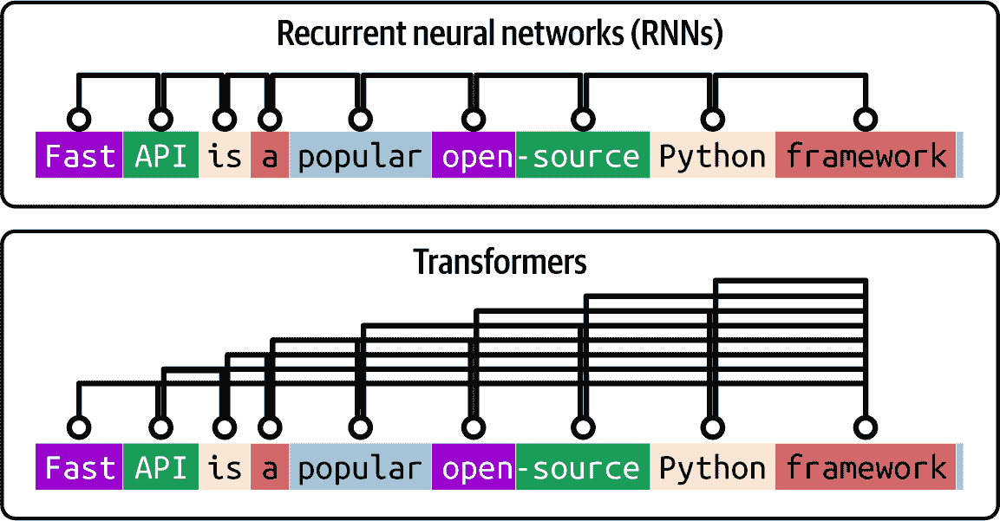

###### 图 3-2\. RNN 与变压器在处理句子时的比较

自注意力系统所依赖的是称为 *注意力头* 的专用块，它们捕获词语之间的成对模式作为 *注意力图*。

图 3-3 可视化了一个注意力头的注意力图.^(3) 连接可以是双向的，厚度表示句子中词语之间关系的强度。

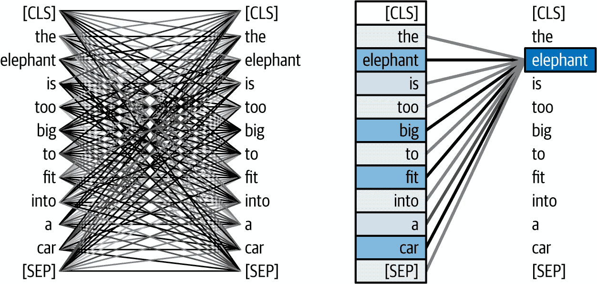

###### 图 3-3\. 注意力头内的注意力图视图

变换器模型在其神经网络层中包含多个分布的注意力头。每个头独立计算自己的注意力图，以捕获输入中某些模式之间的词语关系。使用多个注意力头，模型可以同时从不同角度和上下文中分析输入，以理解数据中的复杂模式和依赖关系。

图 3-4 展示了模型每一层中每个头（即独立的注意力权重集合）的注意力图。

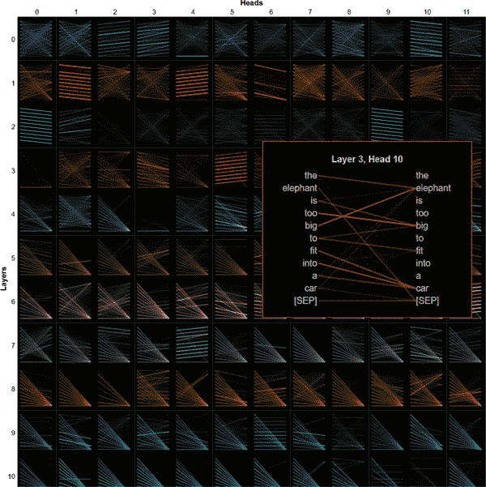

###### 图 3-4\. 模型中注意力图的视图

RNN 的训练也需要大量的计算能力，因为它们的训练过程不能在多个 GPU 上并行化，因为它们的训练算法具有顺序性。另一方面，Transformers 可以非顺序地处理单词，因此它们可以在 GPU 上并行运行注意力机制。

Transformer 架构的高效性意味着只要数据、计算能力和内存更多，这些模型就更具可扩展性。您可以使用涵盖人类产生的书籍库的语料库构建语言模型。您所需要的只是足够的计算能力和数据来训练一个 LLM。这正是 OpenAI 所做的事情，该公司推出了著名的 ChatGPT 应用程序，该应用程序由其多个专有 LLM（包括 GPT-4o）提供支持。

在撰写本文时，OpenAI 的 LLM 背后的实现细节仍然是一个商业机密。虽然许多研究人员对 OpenAI 的方法有一个大致的了解，但他们可能不一定有资源来复制它们。然而，自那时以来，已经发布了几个开源替代方案，用于研究和商业用途，包括 Llama（Facebook）、Gemma（Google）、Mistral 和 Falcon 等。在撰写本文时，模型大小在 0.05B 到 480B 参数之间（即模型权重和偏差），以满足您的需求。4

由于高内存需求，服务 LLM 仍然是一个挑战，如果需要在自己的数据集上训练和微调，需求会加倍。这是因为训练过程需要在训练批次之间缓存和重用模型参数。因此，大多数组织可能依赖于轻量级（高达 30 亿）模型或依赖于 LLM 提供商（如 OpenAI、Anthropic、Cohere、Mistral 等）的 API。

随着 LLM 的普及，了解它们是如何训练的以及它们如何处理数据变得越来越重要，因此让我们接下来讨论其背后的机制。

### 标记化和嵌入

神经网络不能直接处理单词，因为它们是运行在数字上的大型统计模型。为了弥合语言和数字之间的差距，您需要使用*标记化*。通过标记化，您将文本分解成模型可以处理的更小的部分。

任何文本都必须首先切割成代表单词、音节、符号和标点的*标记*列表。然后，这些标记被映射到唯一的数字，以便可以对模式进行数值建模。

通过向训练好的 transformer 提供输入标记的向量，网络可以预测生成文本的下一个最佳标记，一次一个单词。

图 3-5 展示了 OpenAI 标记化器如何将文本转换为标记序列，并为每个标记分配唯一的标记标识符。

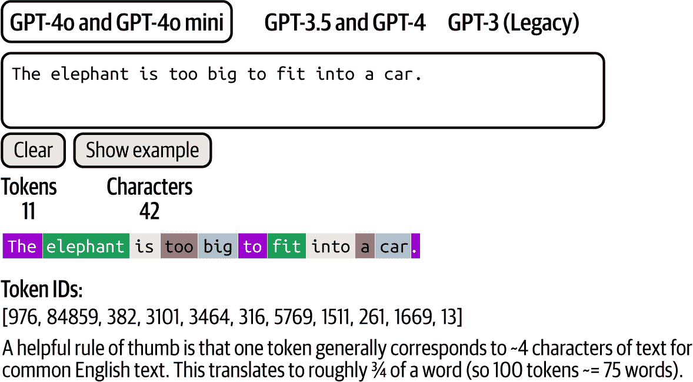

###### 图 3-5. OpenAI 分词器（来源：[OpenAI](https://oreil.ly/S-a9M))

那么，在分词一些文本之后你能做什么呢？这些标记在语言模型处理之前需要进一步处理。

在分词之后，你需要使用一个*嵌入器*^(5)将这些标记转换成实数密集向量，称为*嵌入*，在连续的向量空间中捕捉语义信息（即每个标记的含义）。图 3-6 展示了这些嵌入。

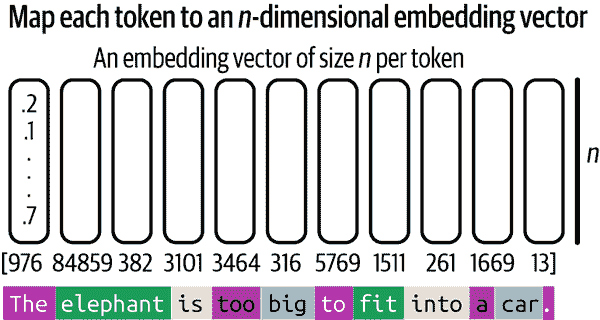

###### 图 3-6. 在嵌入过程中为每个标记分配大小为 n 的嵌入向量

###### 小贴士

这些嵌入向量使用小的*浮点数*（不是整数）来捕捉标记之间细微的关系，具有更大的灵活性和精确度。它们也倾向于*正态分布*，因此语言模型训练和推理可以更加稳定和一致。

在嵌入过程之后，每个标记都被分配了一个包含*n*个数字的嵌入向量。嵌入向量中的每个数字都专注于表示标记含义的一个特定方面的维度。

### 训练 transformer

一旦你有一组嵌入向量，你可以在你的文档上训练一个模型来更新每个嵌入中的值。在模型训练过程中，训练算法更新嵌入层的参数，使得嵌入向量尽可能准确地描述输入文本中每个标记的含义。

理解嵌入向量的工作原理可能具有挑战性，所以让我们尝试一种可视化方法。

假设你使用了二维嵌入向量，这意味着向量只包含两个数字。然后，如果你在模型训练前后绘制这些向量，你会观察到类似于图 3-7 的图表。具有相似含义的标记的嵌入向量将彼此更接近。

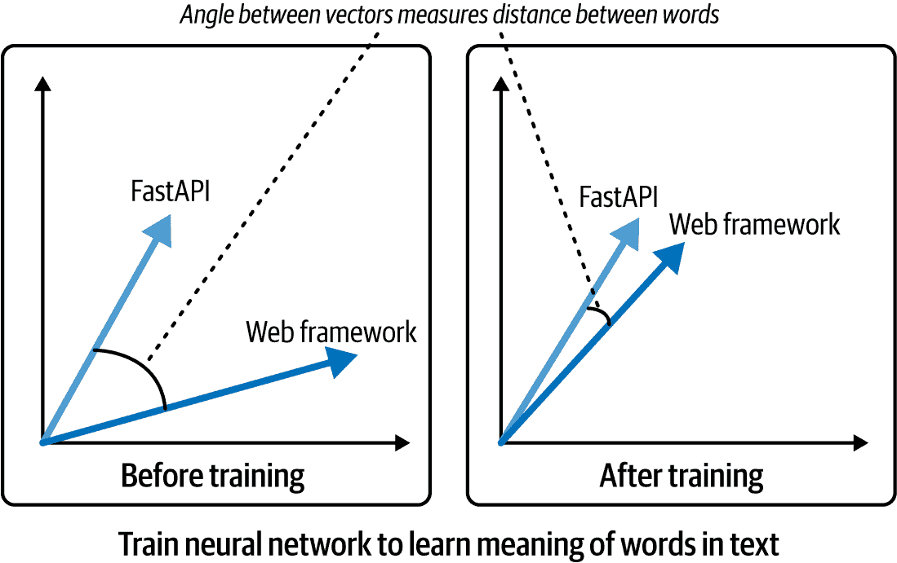

###### 图 3-7. 使用嵌入向量训练 transformer 网络的潜在空间

要确定两个单词之间的相似性，你可以通过计算称为*余弦相似度*的向量之间的角度来计算。较小的角度意味着更高的相似性，表示相似上下文和含义。在训练后，具有相似含义的两个嵌入向量的余弦相似度计算将验证这些向量彼此接近。

图 3-8 展示了完整的分词、嵌入和训练过程。

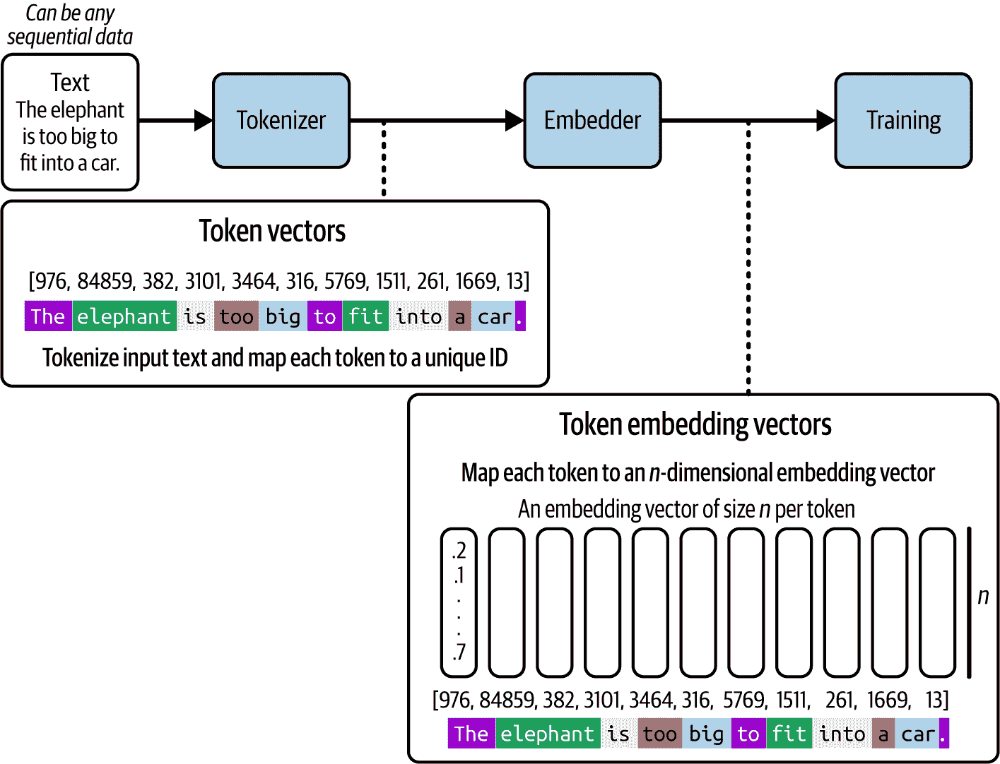

###### 图 3-8. 将文本等序列数据处理成标记和标记嵌入的向量

一旦你有一个训练好的嵌入层，你现在可以使用它来嵌入任何新的输入文本到图 3-1 中所示的 transformer 模型。

### 位置编码

在将嵌入向量转发到转换器网络中的注意力层之前的一个最终步骤是实现 *位置编码*。位置编码过程产生位置嵌入向量，然后与标记嵌入向量相加。

由于转换器是同时处理单词而不是按顺序处理，因此需要位置嵌入来记录序列数据（如句子）中的单词顺序和上下文。生成的嵌入向量捕捉了句子中单词的意义和位置信息，在它们传递到转换器的注意力机制之前。这个过程确保注意力头拥有它们学习模式所需的所有信息。

图 3-9 展示了位置编码过程，其中位置嵌入与标记嵌入相加。

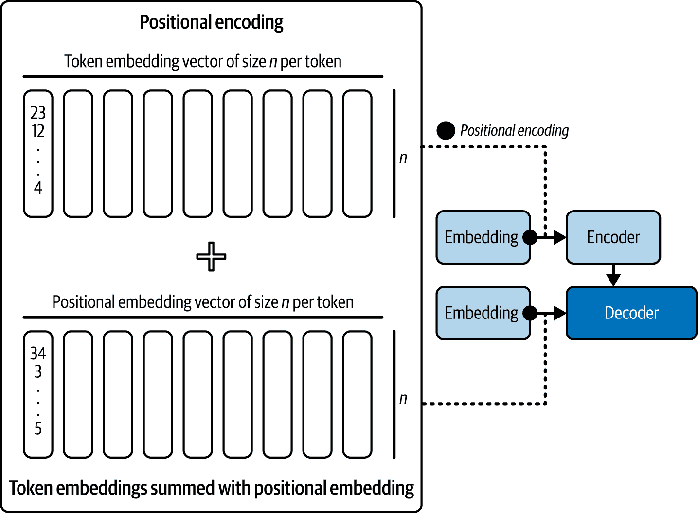

###### 图 3-9\. 位置编码

### 自回归预测

转换器是一个自回归（即顺序）模型，因为未来的预测是基于过去值的，如图 3-10 所示。自回归预测。

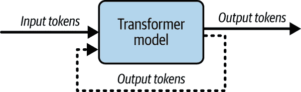

###### 图 3-10\. 自回归预测

模型接收输入标记，然后将其嵌入并通过网络传递以进行下一个最佳标记预测。这个过程会重复进行，直到生成 `<stop>` 或句子结束 `<eos>` 标记.^(6)

然而，模型在内存中存储以生成下一个标记的标记数量是有限的。这个标记限制被称为模型的 *上下文窗口*，这是在您的 GenAI 服务模型选择阶段需要考虑的一个重要因素。

如果达到上下文窗口限制，模型将简单地丢弃最近最少使用的标记。这意味着它可以 *忘记* 文档中最近最少使用的句子或对话中的消息。

###### 注意

在撰写本文时，最便宜的 OpenAI `gpt-4o-mini` 模型的上下文大约为 ~128,000 个标记，相当于超过 300 页的文本。

截至 2025 年 3 月，最大的上下文窗口属于 [Magic.Dev LTM-2-mini](https://oreil.ly/10Mj1)，拥有 1 亿个标记。这相当于约 750 本小说的约 1000 万行代码。

其他模型的上下文窗口范围在数十万个标记之间。

短窗口会导致信息丢失，难以维持对话，以及与用户查询的连贯性降低。

另一方面，长上下文窗口需要更大的内存需求，并且当扩展到数千个同时使用您服务的并发用户时，可能会导致性能问题或服务变慢。此外，您还需要考虑依赖于具有更大上下文窗口的模型的成本，因为它们由于计算和内存需求的增加而往往更昂贵。正确的选择将取决于您的预算和用例中的用户需求。

### 将语言模型集成到您的应用程序中

您可以使用几行代码在应用程序中下载和使用语言模型。在示例 3-1 中，您将下载一个具有 11 亿参数的 TinyLlama 模型，该模型在 30 万亿个令牌上进行了预训练。

##### 示例 3-1. 从 Hugging Face 仓库下载并加载语言模型

```py
# models.py

import torch
from transformers import Pipeline, pipeline

prompt = "How to set up a FastAPI project?"
system_prompt = """
Your name is FastAPI bot and you are a helpful
chatbot responsible for teaching FastAPI to your users.
Always respond in markdown.
"""

device = torch.device("cuda" if torch.cuda.is_available() else "cpu") 

def load_text_model():
    pipe = pipeline(
        "text-generation",
        model="TinyLlama/TinyLlama-1.1B-Chat-v1.0", 
        torch_dtype=torch.bfloat16,
        device=device 
    )
    return pipe

def generate_text(pipe: Pipeline, prompt: str, temperature: float = 0.7) -> str:
    messages = [
        {"role": "system", "content": system_prompt},
        {"role": "user", "content": prompt},
    ] 
    prompt = pipe.tokenizer.apply_chat_template(
        messages, tokenize=False, add_generation_prompt=True
    ) 
    predictions = pipe(
        prompt,
        temperature=temperature,
        max_new_tokens=256,
        do_sample=True,
        top_k=50,
        top_p=0.95,
    ) 
    output = predictions[0]["generated_text"].split("</s>\n<|assistant|>\n")[-1] 
    return output
```


检查是否有可用的 NVIDIA GPU，如果有，则将`device`设置为当前的 CUDA 启用 GPU。否则，继续使用 CPU。


使用`float16`精度数据类型下载并将 TinyLlama 模型加载到内存中.^(9)


在第一次加载时将整个管道移动到 GPU 上。


准备消息列表，该列表由具有角色和内容键值对的字典组成。字典的顺序决定了对话中从旧到新消息的顺序。第一条消息通常是系统提示，用于引导模型在对话中的输出。


将聊天消息列表转换为模型使用的整数令牌列表。然后要求模型以文本格式生成输出，而不是整数令牌（`tokenize=False`）。同时，在聊天消息的末尾添加一个生成提示（`add_generation_prompt=True`），以鼓励模型根据聊天历史生成响应。


将准备好的提示与几个推理参数一起传递给模型，以优化文本生成性能。其中一些关键推理参数包括：

+   `max_new_tokens`：指定在输出中生成的新令牌的最大数量。

+   `do_sample`：在生成输出时确定是否从合适的令牌列表中随机选择一个（`True`）或简单地在每个步骤中选择最可能的令牌（`False`）。

+   `temperature`：控制输出生成的随机性。较低的值会使模型的输出更精确，而较高的值则允许有更多创造性的回答。

+   `top_k`：限制模型的令牌预测为前 K 个选项。`top_k=50`表示在当前令牌预测步骤中创建一个包含前 50 个最合适令牌的列表以供选择。

+   `top_p`：在创建最合适令牌列表时实现*nucleus sampling*。`top_p=0.95`表示创建一个列表，直到您满意列表中有 95%的最合适令牌可供当前令牌预测步骤选择。


最终输出是从 `predictions` 对象中获得的。TinyLlama 生成的文本包括完整的对话历史，并将生成的响应附加到末尾。使用 `\n<|assistant|>\n` 标记跟随 `</s>` 停止标记来选择对话中的最后一条消息的内容，即模型的响应。

示例 3-1 是一个良好的起点；你仍然可以在你的 CPU 上加载此模型并在合理的时间内获得响应。然而，TinyLlama 可能也不会像其更大的版本表现得那么好。对于生产工作负载，你将希望使用更大的模型以获得更好的输出质量和性能。

你现在可以在控制器函数内使用 `load_model` 和 `predict` 函数^(10)，然后添加一个路由处理装饰器，通过端点提供模型，如 示例 3-2 所示。

##### 示例 3-2\. 通过 FastAPI 端点提供语言模型

```py
# main.py

from fastapi import FastAPI
from models import load_text_model, generate_text

app = FastAPI()

@app.get("/generate/text") 
def serve_language_model_controller(prompt: str) -> str: 
    pipe = load_text_model() 
    output = generate_text(pipe, prompt) 
    return output 
```


创建一个 FastAPI 服务器并添加一个 `/generate` 路由处理程序来提供模型服务。


`serve_language_model_controller` 负责从请求查询参数中获取提示。


模型已加载到内存中。


控制器将查询传递给模型以执行预测。


FastAPI 服务器将输出作为 HTTP 响应发送给客户端。

一旦 FastAPI 服务启动并运行，你可以访问位于 `http://localhost:8000/docs` 的 Swagger 文档页面来测试你的新端点：

```py
http://localhost:8000/generate/text?prompt="What is FastAPI?"
```

如果你在一个 CPU 上运行代码示例，它将花费大约一分钟的时间从模型那里收到响应，如 图 3-11 所示。

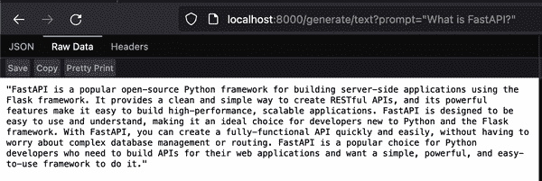

###### 图 3-11\. TinyLlama 的响应

对于在您自己的计算机上运行的 CPU 上的小型语言模型（SLM）来说，这不是一个糟糕的响应，除了 TinyLlama 幻觉了 FastAPI 使用 Flask。这是一个错误的陈述；FastAPI 使用 Starlette 作为底层 Web 框架，而不是 Flask。

*幻觉* 指的是不基于训练数据或现实的输出。尽管开源 SLMs（如 TinyLlama）已经在令人印象深刻的数量（3 万亿）的标记上进行了训练，但一小部分模型参数可能限制了它们在数据中学习真实情况的能力。此外，一些未经筛选的训练数据也可能被使用，这两者都可能导致更多幻觉实例的发生。

###### 警告

在提供语言模型时，始终让您的用户知道使用外部来源对输出进行事实核查，因为语言模型可能会 *产生幻觉* 并产生不正确的陈述。

你现在可以使用 Python 的 Web 浏览器客户端以比使用命令行客户端更多的交互性来测试你的服务。

一个优秀的 Python 包 [Streamlit](https://oreil.ly/9BXmn)，可以让你轻松快速地开发用户界面，几乎不需要任何努力就能为你的 AI 服务创建美观且可定制的 UI。

### 将 FastAPI 与 Streamlit UI 生成器连接。

Streamlit 允许你轻松创建用于测试和原型设计的聊天用户界面。你可以使用 `pip` 安装 `streamlit` 包：

```py
$ pip install streamlit
```

示例 3-3 展示了如何开发一个简单的 UI 来连接你的服务。

##### 示例 3-3\. Streamlit 聊天 UI 消费 FastAPI 的 `/generate` 端点

```py
# client.py

import requests
import streamlit as st

st.title("FastAPI ChatBot") 

if "messages" not in st.session_state:
    st.session_state.messages = [] 

for message in st.session_state.messages:
    with st.chat_message(message["role"]):
        st.markdown(message["content"]) 

if prompt := st.chat_input("Write your prompt in this input field"): 
    st.session_state.messages.append({"role": "user", "content": prompt}) 

    with st.chat_message("user"):
        st.text(prompt) 

    response = requests.get(
        f"http://localhost:8000/generate/text", params={"prompt": prompt}
    ) 
    response.raise_for_status() 

    with st.chat_message("assistant"):
        st.markdown(response.text) 
```

(#co_ai_integration_and_model_serving_CO3-1)

为你的应用程序添加一个标题，该标题将被渲染到 UI 中。

(#co_ai_integration_and_model_serving_CO3-2)

初始化聊天并跟踪聊天历史。

(#co_ai_integration_and_model_serving_CO3-3)

在应用重运行时显示聊天历史中的聊天消息。

(#co_ai_integration_and_model_serving_CO3-4)

等待用户通过聊天输入字段提交提示。

(#co_ai_integration_and_model_serving_CO3-5)

将用户或助手的消息添加到聊天历史中。

(#co_ai_integration_and_model_serving_CO3-6)

在聊天消息容器中显示用户消息。

(#co_ai_integration_and_model_serving_CO3-7)

向你的 FastAPI 端点发送带有提示作为查询参数的 `GET` 请求以从 TinyLlama 生成响应。

(#co_ai_integration_and_model_serving_CO3-8)

验证响应是否正常。

(#co_ai_integration_and_model_serving_CO3-9)

在聊天消息容器中显示助手消息。

你现在可以启动你的 Streamlit 客户端应用程序:^(11)

```py
$ streamlit run client.py
```

你现在应该能够像 图 3-12 中所示的那样在 Streamlit 中与 TinyLlama 交互。所有这些都可以通过几个简短的 Python 脚本实现。

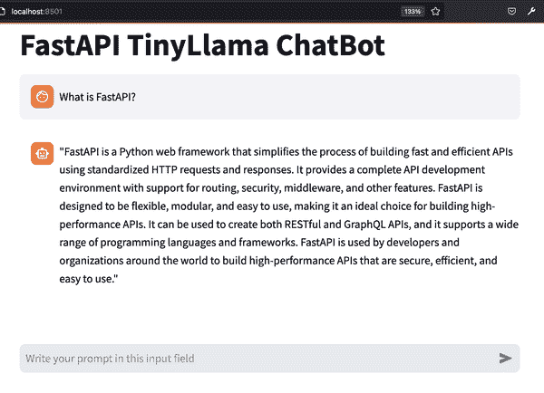

###### 图 3-12\. Streamlit 客户端

图 3-13 展示了我们迄今为止开发的解决方案的整体系统架构。

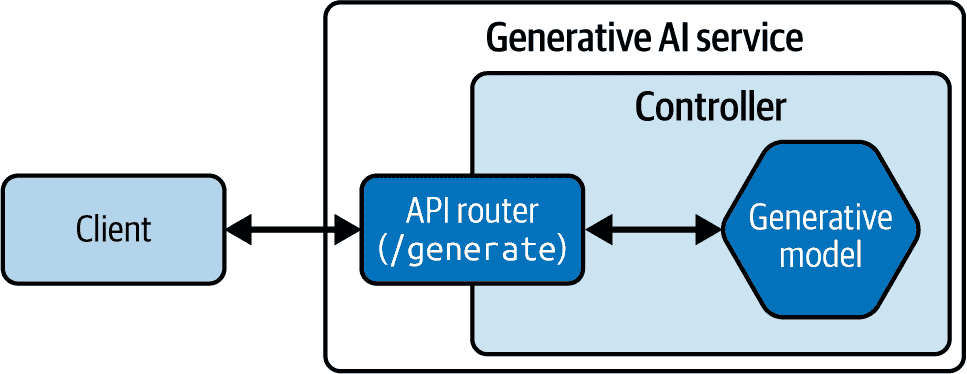

###### 图 3-13\. FastAPI 服务系统架构

###### 警告

虽然 示例 3-3 中的解决方案非常适合原型设计和测试模型，但它不适合生产工作负载，因为在这种情况下，多个用户需要同时访问模型。这是因为，在当前设置中，每次处理请求时，模型都会被加载到内存中并卸载。加载/卸载大型模型到内存中既慢又阻塞 I/O。

你刚刚构建的 TinyLlama 服务使用了一个 *解码器* 变换器，该变换器针对对话和聊天用例进行了优化。然而，[关于变换器的原始论文](https://oreil.ly/RqztC) 介绍了一个由编码器和解码器组成的架构。

你现在应该对语言模型的内部工作原理以及如何在 FastAPI 网络服务器中打包它们更有信心。

语言模型只是所有生成模型中的一小部分。接下来的几节将扩展你的知识，包括生成音频、图像和视频的模型的功能和用途。

我们可以先从音频模型开始工作。

## 音频模型

在 GenAI 服务中，音频模型对于创建交互性和逼真的声音非常重要。与你现在熟悉的、专注于处理和生成文本的文本模型不同，音频模型可以处理音频信号。有了它们，你可以合成语音、生成音乐，甚至为虚拟助手、自动配音、游戏开发和沉浸式音频环境等应用创建音效。

Suno AI 创建的 Bark 模型是功能最强大的文本到语音和文本到音频模型之一。这个基于变换器的模型可以生成逼真的多语言语音和音频，包括音乐、背景噪音和音效。

Bark 模型由四个模型串联作为管道，从文本提示中合成音频波形，如图 图 3-15 所示。

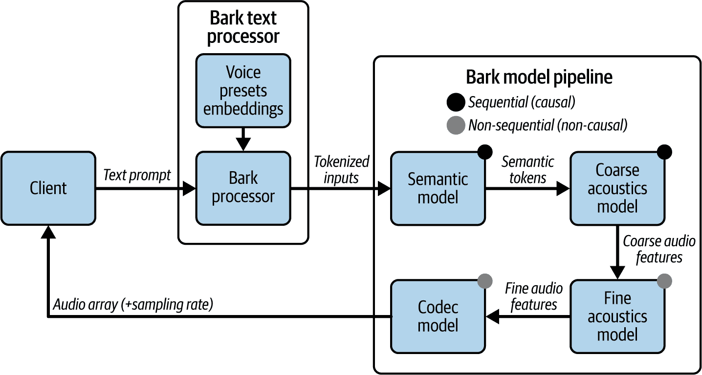

###### 图 3-15\. Bark 合成管道

1. 语义文本模型

一个因果（顺序）自回归变换器模型接受标记化的输入文本，并通过语义标记捕获意义。自回归模型通过重复使用自己的先前输出来预测序列中的未来值。

2. 粗略声学模型

一个因果自回归变换器接收语义模型的输出并生成初始音频特征，这些特征缺乏更精细的细节。每个预测都基于语义标记序列中的过去和现在信息。

3. 精细声学模型

一个非因果自动编码器变换器通过生成剩余的音频特征来精炼音频表示。由于粗略声学模型已经生成了整个音频序列，精细模型不需要是因果的。

4. Encodec 音频编解码器模型

模型解码来自所有先前生成的音频代码的输出音频数组。

Bark 通过将精炼的音频特征解码成最终音频输出（以语音、音乐或简单的音频效果的形式）来合成音频波形。

示例 3-4 展示了如何使用小的 Bark 模型。

##### 示例 3-4\. 从 Hugging Face 仓库下载并加载小的 Bark 模型

```py
# schemas.py

from typing import Literal

VoicePresets = Literal["v2/en_speaker_1", "v2/en_speaker_9"] 

# models.py
import torch
import numpy as np
from transformers import AutoProcessor, AutoModel, BarkProcessor, BarkModel
from schemas import VoicePresets

device = torch.device("cuda" if torch.cuda.is_available() else "cpu")

def load_audio_model() -> tuple[BarkProcessor, BarkModel]:
    processor = AutoProcessor.from_pretrained("suno/bark-small", device=device) 
    model = AutoModel.from_pretrained("suno/bark-small", device=device) 
    return processor, model

def generate_audio(
    processor: BarkProcessor,
    model: BarkModel,
    prompt: str,
    preset: VoicePresets,
) -> tuple[np.array, int]:
    inputs = processor(text=[prompt], return_tensors="pt",voice_preset=preset) 
    output = model.generate(**inputs, do_sample=True).cpu().numpy().squeeze() 
    sample_rate = model.generation_config.sample_rate 
    return output, sample_rate
```

[#co_ai_integration_and_model_serving_CO4-1]

使用 `Literal` 类型指定支持的语音预设选项。

[#co_ai_integration_and_model_serving_CO4-2]

下载小型的 Bark 处理器，该处理器为核心模型准备输入文本提示。

(#co_ai_integration_and_model_serving_CO4-3)

下载 Bark 模型，该模型将用于生成输出音频。这两个对象在后续的音频生成中都将被需要。

(#co_ai_integration_and_model_serving_CO4-4)

使用说话人语音预设嵌入对文本提示进行预处理，并使用`return_tensors="pt"`返回一个标记化输入的 Pytorch 张量数组。

(#co_ai_integration_and_model_serving_CO4-5)

生成包含合成音频信号随时间变化的振幅值的音频数组。

(#co_ai_integration_and_model_serving_CO4-6)

从生成音频的模型配置中获取采样率，该采样率可以用于生成音频。

当您使用模型生成音频时，输出是一个表示音频信号在每个时间点上的*振幅*（或强度）的浮点数序列。

要播放此音频，需要将其转换为可以发送到扬声器的数字格式。这涉及到以固定速率采样音频信号并将振幅值量化为固定数量的位。`soundfile`库可以通过使用*采样率*生成音频文件来帮助您。采样率越高，采样的样本越多，这提高了音频质量，但也增加了文件大小。

您可以使用`pip`安装`soundfile`音频库来使用`pip`写入音频文件：

```py
$ pip install soundfile
```

示例 3-5 展示了如何将音频内容流式传输到客户端。

##### 示例 3-5\. 返回生成音频的 FastAPI 端点

```py
# utils.py

from io import BytesIO
import soundfile
import numpy as np

def audio_array_to_buffer(audio_array: np.array, sample_rate: int) -> BytesIO:
    buffer = BytesIO()
    soundfile.write(buffer, audio_array, sample_rate, format="wav") 
    buffer.seek(0)
    return buffer 

# main.py

from fastapi import FastAPI, status
from fastapi.responses import StreamingResponse

from models import load_audio_model, generate_audio
from schemas import VoicePresets
from utils import audio_array_to_buffer

@app.get(
    "/generate/audio",
    responses={status.HTTP_200_OK: {"content": {"audio/wav": {}}}},
    response_class=StreamingResponse,
) 
def serve_text_to_audio_model_controller(
    prompt: str,
    preset: VoicePresets = "v2/en_speaker_1",
):
    processor, model = load_audio_model()
    output, sample_rate = generate_audio(processor, model, prompt, preset)
    return StreamingResponse(
        audio_array_to_buffer(output, sample_rate), media_type="audio/wav"
    ) 
```

(#co_ai_integration_and_model_serving_CO5-1)

安装`soundfile`库，使用其采样率将音频数组写入内存缓冲区。

(#co_ai_integration_and_model_serving_CO5-2)

将缓冲区光标重置到缓冲区起始位置，并返回可迭代的缓冲区。

(#co_ai_integration_and_model_serving_CO5-3)

创建一个新的音频端点，该端点返回`audio/wav`内容类型作为`StreamingResponse`。`StreamingResponse`通常用于您想要流式传输响应数据时，例如返回大文件或生成响应数据时。它允许您返回一个生成器函数，该函数产生数据块以发送给客户端。

(#co_ai_integration_and_model_serving_CO5-4)

将生成的音频数组转换为可传递给流式响应的可迭代缓冲区。

在示例 3-5 中，您使用小型的 Bark 模型生成音频数组，并流式传输了音频内容的内存缓冲区。对于较大的文件，流式传输更有效，因为客户端可以在内容被提供时消费内容。在先前的示例中，我们没有使用流式响应，因为生成的图像或文本与音频或视频内容相比可以相当小。

###### 小贴士

直接从内存缓冲区流式传输音频内容比将音频数组写入文件并从硬盘驱动器流式传输内容更快、更高效。

如果您需要为其他任务保留内存，您可以首先将音频数组写入文件，然后使用文件读取生成器从它流式传输。您将是在延迟和内存之间进行权衡。

现在您已经有了音频生成端点，您可以更新 Streamlit UI 客户端代码以渲染音频消息。按照示例 3-6 所示更新您的 Streamlit 客户端代码。

##### 示例 3-6\. Streamlit 音频 UI 消耗 FastAPI `/audio`生成端点

```py
# client.py

for message in st.session_state.messages:
    with st.chat_message(message["role"]):
        content = message["content"]
        if isinstance(content, bytes):
            st.audio(content)
        else:
            st.markdown(content)

if prompt := st.chat_input("Write your prompt in this input field"):
    response = requests.get(
        f"http://localhost:8000/generate/audio", params={"prompt": prompt}
    )
    response.raise_for_status()
    with st.chat_message("assistant"):
        st.text("Here is your generated audio")
        st.audio(response.content) 
```


更新 Streamlit 客户端代码以渲染音频内容。

使用 Streamlit，您可以交换组件以渲染任何类型的内容，包括图像、音频和视频。

现在，您应该能够在更新的 Streamlit UI 中生成高度逼真的语音音频，如图图 3-16 所示。


###### 图 3-16\. 在 Streamlit UI 中渲染音频响应

请记住，您正在使用 Bark 模型的压缩版本，但使用轻量版本，您可以在单个 CPU 上相当快速地生成语音和音乐音频。这是以一些音频生成质量为代价的。

您现在应该已经能够更舒适地通过流式响应和与音频模型协作向用户提供服务更大的内容。

到目前为止，您一直在构建对话和文本到语音服务。现在让我们看看如何与视觉模型交互以构建图像生成服务。

## 视觉模型

使用视觉模型，您可以从提示中生成、增强和理解视觉信息。

由于这些模型可以比任何人类更快地生成非常逼真的输出，并且可以理解和操纵现有的视觉内容，因此它们对于图像生成器和编辑器、目标检测、图像分类和字幕以及增强现实等应用非常有用。

用于训练图像模型的最流行的架构之一被称为*稳定扩散*（SD）。

SD 模型被训练来将输入图像编码到潜在空间。这个潜在空间是模型学习到的训练数据中模式的数学表示。如果您尝试可视化编码后的图像，您将看到的只是一个白色噪声图像，类似于您在电视信号丢失时在电视屏幕上看到的黑白点。

图 3-17 展示了训练和推理的完整过程，并可视化了图像通过正向和反向扩散过程进行编码和解码。一个使用文本、图像和语义图的文本编码器有助于通过反向扩散控制输出。

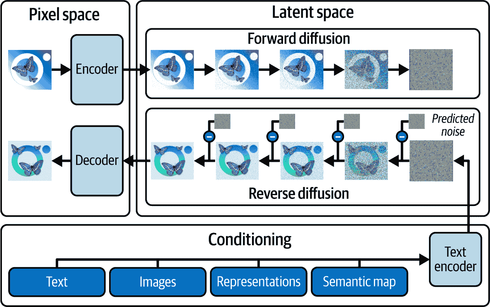

###### 图 3-17\. 稳定扩散训练和推理

这些模型之所以神奇，在于它们将噪声图像解码回原始输入图像的能力。实际上，SD 模型还学会了从编码图像中去除白噪声以重现原始图像。模型通过多次迭代执行此去噪过程。

然而，您不希望重新创建您已经拥有的图像。您希望模型创建新的、以前从未见过的图像。但 SD 模型如何为您实现这一点呢？答案在于编码的噪声图像存在的潜在空间。您可以改变这些图像中的噪声，当模型去噪并解码它们时，您会得到一个全新的图像，这是模型以前从未见过的。

仍然存在一个挑战：如何控制图像生成过程，使得模型不会生成随机的图像？解决方案是同时将图像描述编码到图像中。然后，潜在空间中的模式被映射到每个输入图像中看到的文本图像描述。现在，您使用文本提示来采样带噪声的潜在空间，以便在去噪过程后的输出图像正是您想要的。

这就是 SD 模型如何生成它们在训练数据中从未见过的新的图像。本质上，这些模型在包含各种模式和意义的编码表示的潜在空间中导航。模型通过去噪过程迭代地细化噪声，以产生一个在训练数据集中不存在的创新图像。

要下载 SD 模型，您需要安装 Hugging Face 的`diffusers`库：

```py
$ pip install diffusers
```

示例 3-7 展示了如何将 SD 模型加载到内存中。

##### 示例 3-7\. 从 Hugging Face 仓库下载并加载 SD 模型

```py
# models.py

import torch
from diffusers import DiffusionPipeline, StableDiffusionInpaintPipelineLegacy
from PIL import Image

device = torch.device("cuda" if torch.cuda.is_available() else "cpu")

def load_image_model() -> StableDiffusionInpaintPipelineLegacy:
    pipe = DiffusionPipeline.from_pretrained(
        "segmind/tiny-sd", torch_dtype=torch.float32,
        device=device
    ) 
    return pipe

def generate_image(
    pipe: StableDiffusionInpaintPipelineLegacy, prompt: str
) -> Image.Image:
    output = pipe(prompt, num_inference_steps=10).images[0]  
    return output 
```


使用内存效率较低的`float32`张量类型将 TinySD 模型下载并加载到内存中。使用具有有限精度的`float16`，对于大型和复杂模型会导致数值不稳定和精度损失。此外，对`float16`的硬件支持有限，因此尝试在 CPU 上使用`float16`张量类型运行 SD 模型可能不可行。来源：[Hugging Face](https://oreil.ly/rzw8P)。


将文本提示传递给模型以生成一系列图像，并选择第一个。一些模型允许您在单个推理步骤中生成多个图像。


`num_inference_steps=10` 指定了推理过程中要执行的扩散步骤的数量。在每一步扩散中，从之前的扩散步骤生成一个更强的噪声图像。模型通过执行多个扩散步骤生成多个噪声图像。有了这些图像，模型可以更好地理解输入数据中存在的噪声模式，并学会更有效地去除它们。推理步骤越多，你得到的结果越好，但这也需要更多的计算能力和更长的处理时间。

(#co_ai_integration_and_model_serving_CO7-4)

生成的图像将是一个 Python Pillow 图像类型，因此你可以访问 Pillow 的各种图像方法进行后期处理和存储。例如，你可以调用 `image.save()` 方法将图像存储到你的文件系统中。

###### 注意

视觉模型非常占用资源。要在 CPU 上加载和使用像 TinySD 这样的小型视觉模型，你需要大约 5 GB 的磁盘空间和 RAM。然而，你可以使用 `pip install accelerate` 安装 `accelerate` 来优化所需资源，以便模型管道使用更低的 CPU 内存使用量。

当提供视频模型时，你需要使用 GPU。在本章的后面部分，我将向你展示如何利用 GPU 为视频模型提供支持。

你现在可以将这个模型打包到另一个端点，就像 示例 3-2 一样，不同之处在于返回的响应将是一个图像二进制文件（而不是文本）。请参阅 示例 3-8。

##### 示例 3-8\. 返回生成图像的 FastAPI 端点

```py
# utils.py

from typing import Literal
from PIL import Image
from io import BytesIO

def img_to_bytes(
    image: Image.Image, img_format: Literal["PNG", "JPEG"] = "PNG"
) -> bytes:
    buffer = BytesIO()
    image.save(buffer, format=img_format)
    return buffer.getvalue() 

# main.py

from fastapi import FastAPI, Response, status
from models import load_image_model, generate_image
from utils import img_to_bytes

...

@app.get("/generate/image",
         responses={status.HTTP_200_OK: {"content": {"image/png": {}}}}, 
         response_class=Response) 
def serve_text_to_image_model_controller(prompt: str):
    pipe = load_image_model()
    output = generate_image(pipe, prompt) 
    return Response(content=img_to_bytes(output), media_type="image/png") 
```

(#co_ai_integration_and_model_serving_CO8-1)

创建一个内存中的缓冲区，以给定格式将图像保存到该缓冲区中，然后从缓冲区返回原始字节数据。

(#co_ai_integration_and_model_serving_CO8-2)

指定自动生成的 Swagger UI 文档页面的媒体内容类型和状态码。

(#co_ai_integration_and_model_serving_CO8-3)

指定响应类以防止 FastAPI 添加 `application/json` 作为另一个可接受响应媒体类型。

(#co_ai_integration_and_model_serving_CO8-4)

模型返回的响应将是 Pillow 图像格式。

(#co_ai_integration_and_model_serving_CO8-5)

我们将需要使用 FastAPI 的 `Response` 类来发送一个携带图像字节的特殊响应，并带有 PNG 媒体类型。

图 3-18 展示了通过 FastAPI Swagger 文档测试新的 `/generate/image` 端点，使用文本提示 `一个带树木的舒适客厅`。

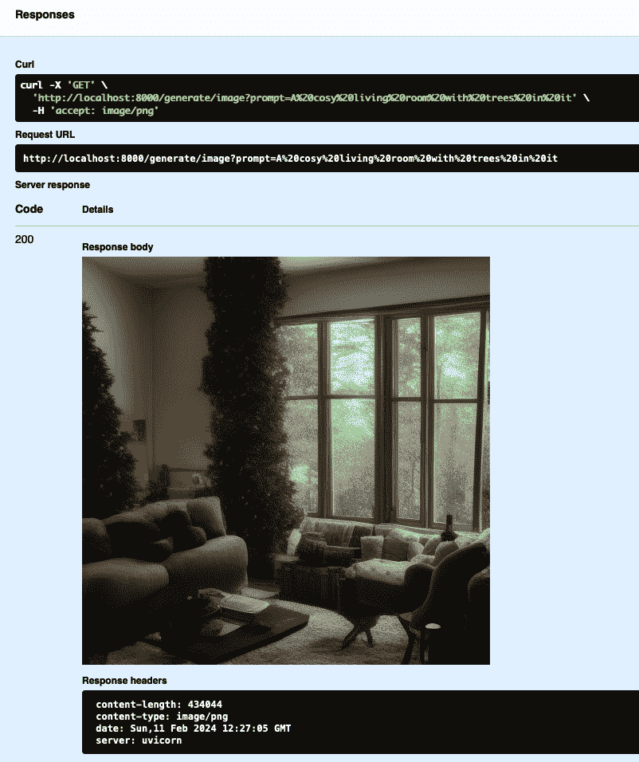

###### 图 3-18\. TinySD FastAPI 服务

现在，将你的端点连接到 Streamlit UI 进行原型设计，如图 示例 3-9 所示。

##### 示例 3-9\. Streamlit Vision UI 消费 FastAPI `*/image*` 生成端点

```py
# client.py

...

for message in st.session_state.messages:
    with st.chat_message(message["role"]):
        st.image(message["content"]) 
...

if prompt := st.chat_input("Write your prompt in this input field"):
    ...
    response = requests.get(
        f"http://localhost:8000/generate/image", params={"prompt": prompt}
    ) 
    response.raise_for_status()
    with st.chat_message("assistant"):
        st.text("Here is your generated image")
        st.image(response.content)

    ...
```

(#co_ai_integration_and_model_serving_CO9-1)

通过 HTTP 协议传输的图像将以二进制格式存在。因此，我们更新了显示函数以渲染二进制图像内容。您可以使用`st.image`方法将图像显示到 UI 上。


更新`GET`请求以访问`/generate/image`端点。然后，向用户渲染文本和图像消息。

图 3-19 显示了用户与该模型的最终用户体验结果。

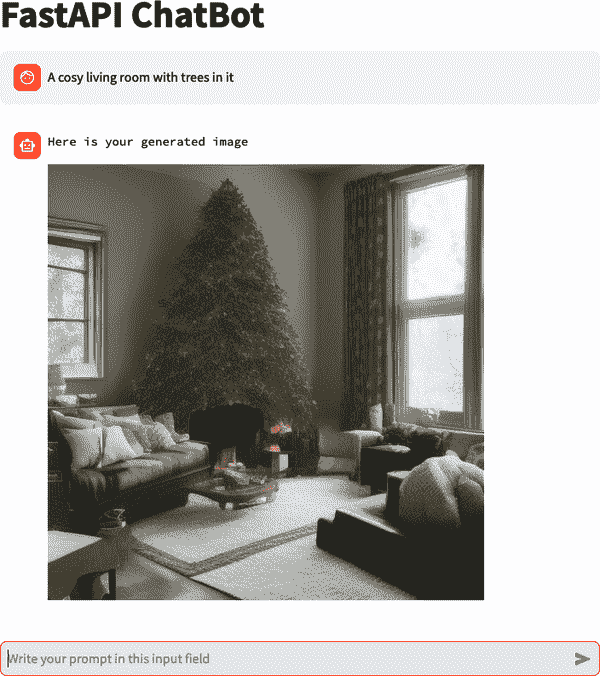

###### 图 3-19。在 Streamlit UI 中渲染图像消息

我们看到，即使是一个微小的 SD 模型，也可以生成看起来合理的图像。XL 版本可以生成更加逼真的图像，但仍然有其自身的限制。

在撰写本文时，当前的开放源代码 SD 模型确实存在某些限制：

**连贯性**

模型无法生成提示中描述的每个细节和复杂的构图。

**输出大小**

输出图像只能是预定义的大小，例如 512 × 512 或 1024 × 1024 像素。

**可组合性**

您无法完全控制生成的图像并在图像中定义构图。

**真实感**

生成的输出确实显示了细节，表明它们是由 AI 生成的。

**可读文本**

一些模型无法生成可读的文本。

您所使用的`tinysd`模型是一个早期阶段模型，它已经从更大的 V1.5 SD 模型中经历了**蒸馏**过程（即压缩）。因此，生成的输出可能不符合生产标准，或者可能不完全连贯，并且可能无法包含文本提示中提到的所有概念。然而，如果您在特定概念/风格上使用**低秩适应**（LoRA）[*微调*](https://oreil.ly/Nqtkm)这些蒸馏模型，它们可能表现良好。

您现在可以构建基于文本和图像的 GenAI 服务。然而，您可能想知道如何基于视频模型构建文本到视频服务。让我们更多地了解视频模型，了解它们的工作原理，以及如何使用它们构建图像动画服务。

## **视频模型**

视频模型是一些最资源密集型的生成模型，通常需要 GPU 来生成一段高质量的视频片段。这些模型必须生成几十帧才能产生一秒的视频，即使没有任何音频内容。

Stability AI 已经在 Hugging Face 上发布了基于 SD 架构的几个开源视频模型。我们将使用他们图像到视频模型的压缩版本来提供更快的图像动画服务。

要开始，让我们使用示例 3-10 启动一个小型的图像到视频模型。

###### **注意**

要运行示例 3-10，您可能需要访问具有 CUDA 功能的 NVIDIA GPU。

此外，对于`stable-video-diffusion-img2vid`模型的商业用途，请参阅其[模型卡片](https://oreil.ly/DM-0p)。

##### 示例 3-10。从 Hugging Face 存储库下载并加载 Stability AI 的*img2vid*模型

```py
# models.py

import torch
from diffusers import StableVideoDiffusionPipeline
from PIL import Image

device = torch.device("cuda" if torch.cuda.is_available() else "cpu")

def load_video_model() -> StableVideoDiffusionPipeline:
    pipe = StableVideoDiffusionPipeline.from_pretrained(
        "stabilityai/stable-video-diffusion-img2vid",
        torch_dtype=torch.float16,
        variant="fp16",
        device=device,
    )
    return pipe

def generate_video(
    pipe: StableVideoDiffusionPipeline, image: Image.Image, num_frames: int = 25
) -> list[Image.Image]:
    image = image.resize((1024, 576)) 
    generator = torch.manual_seed(42) 
    frames = pipe(
        image, decode_chunk_size=8, generator=generator, num_frames=num_frames
    ).frames[0] 
    return frames
```


将输入图像调整到模型输入所期望的标准尺寸。调整大小也将防止大输入。


创建一个随机张量生成器，种子设置为 42，以实现可重复的视频帧生成。


运行帧生成管道以一次性生成所有视频帧。抓取生成的第一批帧。这一步需要大量的视频内存。`num_frames`指定要生成的帧数，而`decode_chunk_size`指定一次性生成多少帧。

在模型加载函数就绪后，您现在可以构建视频服务端点。

然而，在声明路由处理程序之前，您确实需要一个实用函数来处理从帧到使用 I/O 缓冲区可流式传输的视频的视频模型输出。

要将一系列帧导出为视频，您需要使用视频库（如`av`）将它们编码到视频容器中，该库实现了对流行的`ffmpeg`视频处理库的 Python 绑定。

您可以通过以下方式安装`av`库：

```py
$ pip install av
```

现在，您可以使用示例 3-11 创建可流式传输的视频缓冲区。

##### 示例 3-11\. 使用`av`库将帧的视频模型输出导出到可流式传输的视频缓冲区

```py
# utils.py

from io import BytesIO
from PIL import Image
import av

def export_to_video_buffer(images: list[Image.Image]) -> BytesIO:
    buffer = BytesIO()
    output = av.open(buffer, "w", format="mp4") 
    stream = output.add_stream("h264", 30) 
    stream.width = images[0].width
    stream.height = images[0].height
    stream.pix_fmt = "yuv444p" 
    stream.options = {"crf": "17"} 
    for image in images:
        frame = av.VideoFrame.from_image(image)
        packet = stream.encode(frame)   
        output.mux(packet) 
    packet = stream.encode(None)
    output.mux(packet)
    return buffer 
```


打开一个用于写入 MP4 文件的缓冲区，然后配置一个使用 AV 的视频复用器的视频流.^(13)


将视频编码设置为每秒 30 帧的`h264`，并确保帧的尺寸与函数提供的帧相匹配。


将视频流的像素格式设置为`yuv444p`，以便每个像素都有完整的分辨率，包括`y`（亮度或亮度）以及`u`和`v`（色度或颜色）分量。


配置流的恒定比特率（CRF）以控制视频质量和压缩。将 CRF 设置为 17 以输出无损高质量视频，压缩量最小。


使用配置的视频流复用器将输入帧编码成编码数据包。


将编码帧添加到打开的视频容器缓冲区中。


在返回包含编码视频的缓冲区之前，清除编码器中剩余的帧并将生成的数据包组合到输出文件中。

要使用服务作为文件上传使用图像提示，您必须安装`python-multipart`库:^(14)

```py
$ pip install python-multipart
```

安装完成后，您可以使用 示例 3-12 设置新的端点。

##### 示例 3-12\. 从图像到视频模型提供生成的视频

```py
# main.py

from fastapi import status, FastAPI, File
from fastapi.responses import StreamingResponse
from io import BytesIO
from PIL import Image

from models import load_video_model, generate_video
from utils import export_to_video_buffer

...

@app.post(
    "/generate/video",
    responses={status.HTTP_200_OK: {"content": {"video/mp4": {}}}},
    response_class=StreamingResponse,
)
def serve_image_to_video_model_controller(
    image: bytes = File(...), num_frames: int = 25 
):
    image = Image.open(BytesIO(image)) 
    model = load_video_model()
    frames = generate_video(model, image, num_frames)
    return StreamingResponse(
        export_to_video_buffer(frames), media_type="video/mp4" 
    )
```


使用 `File` 对象将 `image` 指定为一个表单文件上传。


通过传递给服务的图像字节创建一个 Pillow `Image` 对象。模型管道期望输入的是 Pillow 图像格式。


将生成的帧导出为 MP4 视频并使用可迭代视频缓冲区将其流式传输到客户端。

在设置好视频端点后，您现在可以上传图像到您的 FastAPI 服务中，将其动画化为视频。

在 hub 上还有其他视频模型可供使用，允许您生成 GIF 和动画。为了进一步练习，您可以尝试使用它们构建一个 GenAI 服务。虽然开源视频模型可以产生高质量的视频，但 OpenAI 宣布的新大型视觉模型（LVM）Sora 已经震撼了视频生成行业。

### OpenAI Sora

文本到视频模型在生成能力上有限。除了需要巨大的计算能力来顺序生成连贯的视频帧之外，由于以下原因，训练这些模型可能具有挑战性：

+   *在帧之间保持时间和空间一致性，以实现逼真的无扭曲视频输出*。

+   *缺乏高质量的标题和元数据训练视频模型所需的数据*。

+   *在清晰和描述性地描述视频内容时存在标题挑战*，这需要花费时间，并且超出了起草简短文本的范围。为了使模型能够学习和映射视频中所包含的丰富模式到文本，标题必须描述每个序列的叙事和场景。

由于这些原因，直到 OpenAI 的 Sora 模型发布之前，视频生成模型没有取得突破。

Sora 是一个通用的大视觉扩散变换器模型，能够生成跨越不同时长、宽高比和分辨率的视频和图像，最高可达一分钟的高清视频。其架构基于在 LLM 中常用到的变换器和扩散过程。而 LLM 使用文本标记，Sora 使用视觉块。

###### 小贴士

Sora 模型结合了变换器和 SD 架构的元素和原则，而在 示例 3-10 中，您使用了 Stability AI 的 SD 模型来生成视频。

那么，Sora 有什么不同之处？

变压器在语言模型、计算机视觉和图像生成方面展现了卓越的可扩展性，因此索拉架构基于变压器来处理文本、图像或视频帧等多样化的输入是有意义的。此外，由于变压器能够理解序列数据中的复杂模式和长距离依赖关系，作为视觉变换器的索拉也可以捕捉视频帧之间的细粒度时间和空间关系，以生成具有平滑过渡的连贯帧（即表现出时间一致性）。

此外，索拉借鉴了 SD 模型的能力，通过迭代降噪过程以精确控制生成高质量且视觉上连贯的视频帧。使用扩散过程让索拉能够生成具有精细细节和理想特性的图像。

通过结合变换器的序列推理和 SD 的迭代细化，索拉可以从包含抽象概念的文本和图像等多模态输入中生成高分辨率、连贯且平滑的视频。

索拉的神经网络架构也被设计为通过 U 形网络来降低维度，其中高维视觉数据被压缩并编码到潜在噪声空间中。然后索拉可以通过降噪扩散过程从潜在空间中生成补丁。

扩散过程与基于图像的 SD 模型类似。OpenAI 没有使用通常用于图像的 2D U-Net，而是训练了一个 3D U-Net，其中第三个维度是时间序列的帧序列（形成视频），如图图 3-20 所示。

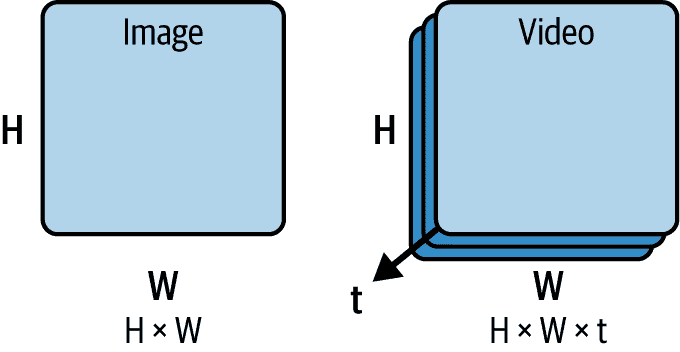

###### 图 3-20. 一系列图像形成一个视频

OpenAI 已经证明，通过将视频压缩为补丁，如图图 3-21 所示，该模型在训练时可以在不同分辨率、时长和宽高比的视频和图像上实现学习高维表示的可扩展性。

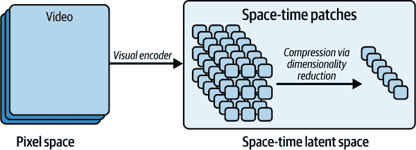

###### 图 3-21. 将视频压缩为时空补丁

通过扩散过程，索拉将输入的噪声补丁压缩以生成任何宽高比、尺寸和分辨率的干净视频和图像，直接在设备的原生屏幕尺寸上。

当文本变换器预测文本序列中的下一个标记时，索拉的视觉变换器正在预测生成图像或视频的下一个补丁，如图图 3-22 所示。

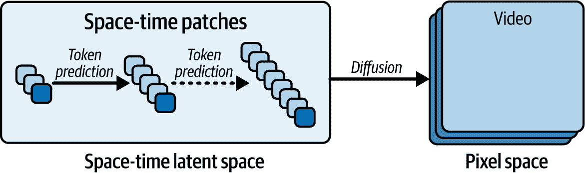

###### 图 3-22. 视觉变换器进行的标记预测

通过在各个数据集上训练，OpenAI 克服了之前提到的训练视觉模型时的挑战，例如缺乏高质量的标题、视频数据的维度高等，仅举几例。

关于索拉和可能的其他 LVMs 令人着迷的是它们展现出的新兴能力：

3D 一致性

在生成的场景中，即使摄像机在场景周围移动和旋转，物体也会保持一致性并调整到透视。

物体恒存性和大范围一致性

被遮挡或离开画面的物体在重新出现在视野中时将保持不变。在某些情况下，模型实际上会记住如何在环境中保持它们的一致性。这也被称为 *时间一致性*，这是大多数视频模型都难以处理的。

世界交互

在生成的视频中模拟的动作可以真实地影响环境。例如，Sora 理解吃汉堡的动作应该在汉堡上留下咬痕。

模拟环境

Sora 还可以模拟世界——例如游戏中的真实或虚构环境——同时遵守这些环境中交互的规则，如在一个 *Minecraft* 级别中扮演一个角色。换句话说，Sora 已经学会了成为一个数据驱动的物理引擎。

图 3-23 展示了这些能力。

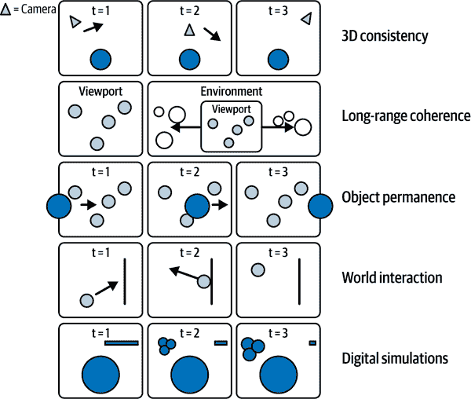

###### 图 3-23\. Sora 的涌现能力

在撰写本文时，Sora 尚未作为 API 发布，但开源替代品已经出现。一个名为“Latte”的有前景的大视觉模型允许您在自己的视觉数据上微调 LVM。

###### 谨慎

在撰写本文时，您还不能商业化一些开源模型，包括 Latte。请始终检查模型卡片和许可证，以确保任何商业用途都是允许的。

将变压器与扩散器结合以创建 LVM 是生成复杂输出（如视频）的一个有希望的研究领域。然而，我想象同样的过程可以应用于生成其他类型的高维数据，这些数据可以表示为多维数组。

现在，你应该对使用文本、音频、视觉和视频模型来构建服务感到更加舒适。接下来，让我们看看另一组能够通过构建 3D 资产生成器服务生成复杂数据（如 3D 几何形状）的模型。

## 3D 模型

您现在已经了解了之前提到的模型是如何使用变压器和扩散器来生成任何形式的文本、音频或视觉数据的。生成 3D 几何形状需要与图像、音频和文本生成不同的方法，因为您必须考虑空间关系、深度信息和几何一致性，这些在其他数据类型中并不存在，从而增加了复杂性。

对于 3D 几何形状，使用 *网格* 来定义物体的形状。可以使用像 Autodesk 3ds Max、Maya 和 SolidWorks 这样的软件包来生产、编辑和渲染这些网格。

网格实际上是一组位于三维虚拟空间中的 *顶点*、*边* 和 *面* 的集合。顶点是空间中的点，它们通过连接形成边。当边在平面上封闭时，它们形成面（多边形），通常是三角形或四边形的形状。图 3-24 展示了顶点、边和面的区别。

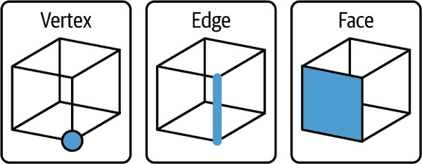

###### 图 3-24\. 顶点、边和面

您可以通过在三维空间中定义顶点的坐标来定义顶点，通常由笛卡尔坐标系（x, y, z）确定。本质上，顶点的排列和连接形成了三维网格的表面，从而定义了几何形状。

图 3-25 展示了这些特征如何组合来定义一个三维几何形状（如猴头）的网格。

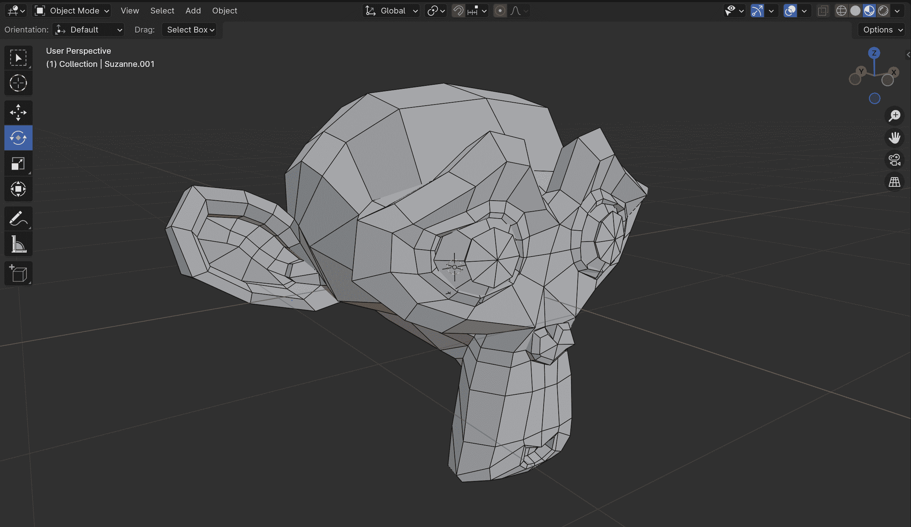

###### 图 3-25\. 使用三角形和四边形多边形（在 Blender 中显示，开源 3D 建模软件）为猴头三维几何形状创建的网格

您可以使用 transformer 模型来训练和使用，以预测序列中的下一个标记，其中序列是三维网格表面的顶点坐标。这种生成模型可以通过预测三维空间中形成所需几何形状的下一个顶点和面的集合来生成 3D 几何形状。然而，为了达到平滑的表面，几何形状可能需要成千上万的顶点和面。

这意味着对于每个三维对象，您需要等待很长时间才能完成生成，而且结果可能仍然保持低保真度。正因为如此，在生成 3D 几何形状时，最强大的模型（即 OpenAI 的 Shap-E）训练了具有许多参数的函数来隐式地定义三维空间中的表面和体积。

隐式函数对于创建平滑表面或处理对离散表示（如网格）具有挑战性的复杂细节非常有用。一个训练好的模型可以由一个将模式映射到隐式函数的编码器组成。与为网格显式生成顶点和面的序列不同，*条件* 3D 模型可以在连续的三维空间中评估训练好的隐式函数。因此，生成过程在产生高保真输出方面具有高度的自由度、控制性和灵活性，成为需要详细和复杂 3D 几何形状的应用的合适选择。

一旦模型的编码器训练成产生隐函数，它就利用解码器的一部分*神经辐射场*（NeRF）渲染技术来构建 3D 场景。NeRF 将一对输入——一个 3D 空间坐标和一个 3D 观看方向——映射到一个由对象密度和 RGB 颜色组成的输出，通过隐函数。为了在 3D 场景中合成新的视图，NeRF 方法将视口视为射线矩阵。每个对应于射线的像素，从相机位置发出，然后沿观看方向延伸。每个射线和相关像素的颜色是通过在射线上评估隐函数并积分结果来计算 RGB 颜色的。

一旦计算完 3D 场景，就使用*符号距离函数*（SDFs）来生成网格，或者通过计算任何点到 3D 对象最近表面的距离和颜色来生成 3D 对象的线框。将 SDFs 视为一种通过告诉您空间中每个点到对象表面的距离来描述 3D 对象的方法。此函数为每个点提供一个数值：如果点在对象内部，数值为负；如果在表面上，数值为零；如果在外部，数值为正。对象的表面是所有点数值为零的地方。SDFs 有助于将此信息转换为 3D 网格。

尽管使用了隐函数，但输出的质量仍然不如人类创建的 3D 资产，可能感觉像卡通。然而，使用 3D GenAI 模型，您可以生成初始的 3D 几何形状来迭代概念并快速细化 3D 资产。

### OpenAI Shap-E

*Shap-E*（由 OpenAI 开发）是一个“条件”于输入 3D 数据（描述、参数、部分几何形状、颜色等）的开源模型，以生成特定的 3D 形状。您可以使用 Shap-E 创建图像或文本到 3D 服务。

如同往常，您首先从 Hugging Face 下载并加载模型，如图示例 3-13 所示。

##### 示例 3-13\. 下载和加载 OpenAI 的 Shap-E 模型

```py
# models.py
import torch
from diffusers import ShapEPipeline

device = torch.device("cuda" if torch.cuda.is_available() else "cpu")

def load_3d_model() -> ShapEPipeline:
    pipe = ShapEPipeline.from_pretrained("openai/shap-e", device=device)
    return pipe

def generate_3d_geometry(
    pipe: ShapEPipeline, prompt: str, num_inference_steps: int
):
    images = pipe(
        prompt, 
        guidance_scale=15.0, 
        num_inference_steps=num_inference_steps, 
        output_type="mesh", 
    ).images[0] 
    return images
```

(#co_ai_integration_and_model_serving_CO13-1)

此特定的 Shap-E 管道接受文本提示，但如果您想传递图像提示，则需要加载不同的管道。

(#co_ai_integration_and_model_serving_CO13-2)

使用`guidance_scale`参数微调生成过程，以更好地匹配提示。

(#co_ai_integration_and_model_serving_CO13-3)

使用`num_inference_steps`参数来控制输出分辨率，以换取额外的计算。请求更多的推理步骤或增加指导比例可以延长渲染时间，以换取更高质量的输出，更好地满足用户的要求。

(#co_ai_integration_and_model_serving_CO13-4)

将`output_type`参数设置为生成`mesh`张量作为输出。

 (#co_ai_integration_and_model_serving_CO13-5)

默认情况下，Shap-E 管道将生成一系列图像，可以组合成对象的旋转 GIF 动画。你可以将此输出导出为 GIF、视频或 OBJ 文件，这些文件可以在 Blender 等 3D 建模工具中加载。

现在你已经有了模型加载和 3D 网格生成函数，让我们使用示例 3-14 将网格导出到缓冲区。

###### 小贴士

`open3d`是一个开源库，用于处理 3D 数据，如点云、网格和具有深度信息的颜色图像（即 RGB-D 图像）。你需要安装`open3d`来运行示例 3-14：

```py
$ pip install open3d
```

##### 示例 3-14。将 3D 张量网格导出到 Wavefront OBJ 缓冲区

```py
# utils.py

import os
import tempfile
from io import BytesIO
from pathlib import Path
import open3d as o3d
import torch
from diffusers.pipelines.shap_e.renderer import MeshDecoderOutput

def mesh_to_obj_buffer(mesh: MeshDecoderOutput) -> BytesIO:
    mesh_o3d = o3d.geometry.TriangleMesh() 
    mesh_o3d.vertices = o3d.utility.Vector3dVector(
        mesh.verts.cpu().detach().numpy() 
    )
    mesh_o3d.triangles = o3d.utility.Vector3iVector(
        mesh.faces.cpu().detach().numpy() 
    )

    if len(mesh.vertex_channels) == 3:  # You have color channels
        vert_color = torch.stack(
            [mesh.vertex_channels[channel] for channel in "RGB"], dim=1
        ) 
        mesh_o3d.vertex_colors = o3d.utility.Vector3dVector(
            vert_color.cpu().detach().numpy()
        ) 

    with tempfile.NamedTemporaryFile(delete=False, suffix=".obj") as tmp:
        o3d.io.write_triangle_mesh(tmp.name, mesh_o3d, write_ascii=True)
        with open(tmp.name, "rb") as f:
            buffer = BytesIO(f.read()) 
        os.remove(tmp.name) 

    return buffer
```

 (#co_ai_integration_and_model_serving_CO14-1)

创建一个 Open3D 三角形网格对象。

 (#co_ai_integration_and_model_serving_CO14-2)

将生成的网格从模型转换为 Open3D 三角形网格对象。为此，通过将网格顶点和面张量移动到 CPU 并将它们转换为`numpy`数组，从生成的 3D 网格中获取顶点和三角形。

 (#co_ai_integration_and_model_serving_CO14-4)

检查网格是否有三个顶点颜色通道（表示 RGB 颜色数据）并将这些通道堆叠成一个张量。

 (#co_ai_integration_and_model_serving_CO14-5)

将网格颜色张量转换为与 Open3D 兼容的格式，以设置网格的顶点颜色。

 (#co_ai_integration_and_model_serving_CO14-6)

使用临时文件创建并返回数据缓冲区。

 (#co_ai_integration_and_model_serving_CO14-7)

Windows 不支持`NameTemporaryFile`的`delete=True`选项。相反，在返回内存缓冲区之前手动删除创建的临时文件。

最后，你可以构建端点，如示例 3-15 所示。

##### 示例 3-15。创建 3D 模型服务端点

```py
# main.py

from fastapi import FastAPI, status
from fastapi.responses import StreamingResponse
from models import load_3d_model, generate_3d_geometry
from utils import mesh_to_obj_buffer

...

@app.get(
    "/generate/3d",
    responses={status.HTTP_200_OK: {"content": {"model/obj": {}}}}, 
    response_class=StreamingResponse,
)
def serve_text_to_3d_model_controller(
    prompt: str, num_inference_steps: int = 25
):
    model = load_3d_model()
    mesh = generate_3d_geometry(model, prompt, num_inference_steps)
    response = StreamingResponse(
        mesh_to_obj_buffer(mesh), media_type="model/obj"
    )
    response.headers["Content-Disposition"] = (
        f"attachment; filename={prompt}.obj"
    ) 
    return response
```

 (#co_ai_integration_and_model_serving_CO15-1)

指定 OpenAPI 规范，以包括`model/obj`作为成功响应的媒体内容类型。

 (#co_ai_integration_and_model_serving_CO15-2)

告知客户端，流响应的内容应被视为附件。

如果你向`/generate/3d`端点发送请求，一旦生成完成，就应该开始下载作为 Wavefront OBJ 文件的 3D 对象。

你可以将 OBJ 文件导入到任何 3D 建模软件中，如 Blender，以查看 3D 几何形状。使用诸如`apple`、`car`、`phone`和`donut`之类的提示，你可以生成图 3-26 中显示的 3D 几何形状。

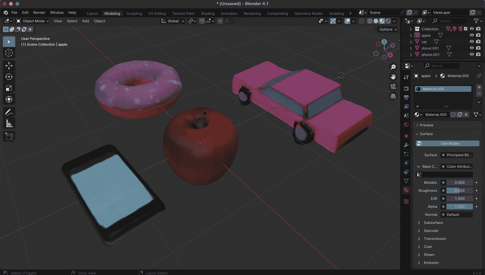

###### 图 3-26。导入到 Blender 中的汽车、苹果、手机和甜甜圈的 3D 几何形状

如果你将苹果这样的对象隔离出来并启用线框视图，你可以看到构成苹果网格的所有顶点和边，它们以三角形多边形的形式表示，如图 图 3-27 所示。

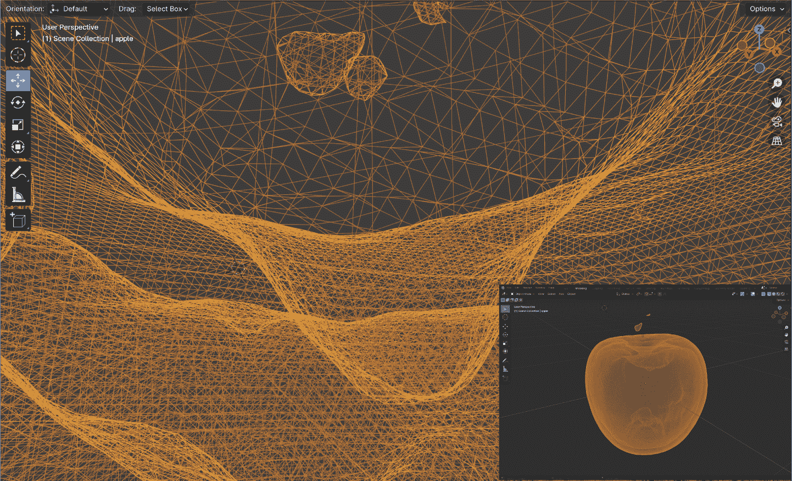

###### 图 3-27\. 放大生成的 3D 网格以查看三角形多边形；插入：查看生成的苹果几何网格（包括顶点和边）

Shap-E 取代了另一个名为 *Point-E* 的较老模型，该模型生成 3D 对象的 *点云*。这是因为与 Point-E 相比，Shap-E 收敛速度更快，尽管建模的是更高维度的多表示输出空间，但生成的形状质量相当或更好。

点云（常用于建筑行业）是一大批点坐标的集合，在现实世界空间中紧密地代表了一个 3D 对象（如建筑结构），其测量值接近现实世界环境。环境扫描设备，包括激光扫描仪，产生点云以表示 3D 空间内的对象。

随着 3D 模型的改进，生成与其实际对应物非常相似的对象可能成为可能。

# 生成 AI 模型服务策略

现在，你应该更有信心构建自己的端点，从 Hugging Face 模型存储库中提供各种模型。我们提到了一些不同的模型，包括生成文本、图像、视频、音频和 3D 形状的模型。

你使用的模型较小，因此它们可以在具有合理输出的 CPU 上加载和使用。然而，在生产场景中，你可能想使用更大的模型来生成更高品质的结果，这些结果可能只能在 GPU 上运行，并且需要大量的视频随机存取内存（VRAM）。

除了利用 GPU，你还需要从几个选项中选择一个模型服务策略：

保持模型无关性

在每个请求中加载模型并生成输出（用于模型交换）。

保持计算效率

使用 FastAPI 生命周期预加载可以重复用于每个请求的模型。

保持精简

在没有框架的情况下外部提供模型或与第三方模型 API 合作，并通过 FastAPI 与它们交互。

让我们详细看看每种策略。

## 保持模型无关性：在每个请求中交换模型

在之前的代码示例中，你定义了模型加载和生成函数，然后在路由处理控制器中使用它们。使用这种服务策略，FastAPI 将模型加载到 RAM（如果使用 GPU 则为 VRAM）中并运行生成过程。一旦 FastAPI 返回结果，模型随后从 RAM 中卸载。这个过程会为下一个请求重复进行。

在使用模型后，模型被卸载，内存被释放以供其他进程或模型使用。使用这种方法，如果处理时间不是问题，你可以在单个请求中动态交换各种模型。这意味着其他并发请求必须等待，直到服务器响应它们。

在处理请求时，FastAPI 将排队等待传入的请求，并按先入先出（FIFO）顺序处理它们。这种行为会导致长时间的等待，因为每次都需要加载和卸载模型。在大多数情况下，这种策略不推荐使用，但如果您需要在多个大型模型之间切换并且没有足够的 RAM，那么您可以采用这种策略进行原型设计。然而，在生产场景中，出于明显的原因，您绝对不应该使用这种策略——您的用户会希望避免长时间的等待。

图 3-28 展示了这种模型服务策略。

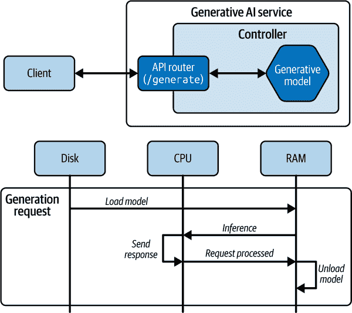

###### 图 3-28\. 每个请求加载和使用模型

如果您需要在每个请求中使用不同的模型并且内存有限，这种方法可以很好地用于在较弱的机器上快速尝试，并且只有少数用户。权衡是模型交换导致的处理时间显著变慢。然而，在生产场景中，最好是获得更大的 RAM，并使用带有 FastAPI 应用程序生命周期的模型预加载策略。

## 计算效率：使用 FastAPI 生命周期预加载模型

在 FastAPI 中加载模型的最计算高效策略是使用应用程序生命周期。采用这种方法，您在应用程序启动时加载模型，在关闭时卸载它们。在关闭期间，您还可以执行所需的任何清理步骤，例如文件系统清理或日志记录。

与前面提到的方法相比，这种策略的主要好处是您避免了每次请求时重新加载大型模型。您可以一次性加载一个大型模型，然后使用预加载的模型处理每个请求。因此，您将节省几分钟的处理时间，以换取您 RAM（或使用 GPU 时的 VRAM）的显著部分。然而，由于响应时间缩短，您的应用程序用户体验将显著提高。

图 3-29 展示了使用应用程序生命周期的模型服务策略。

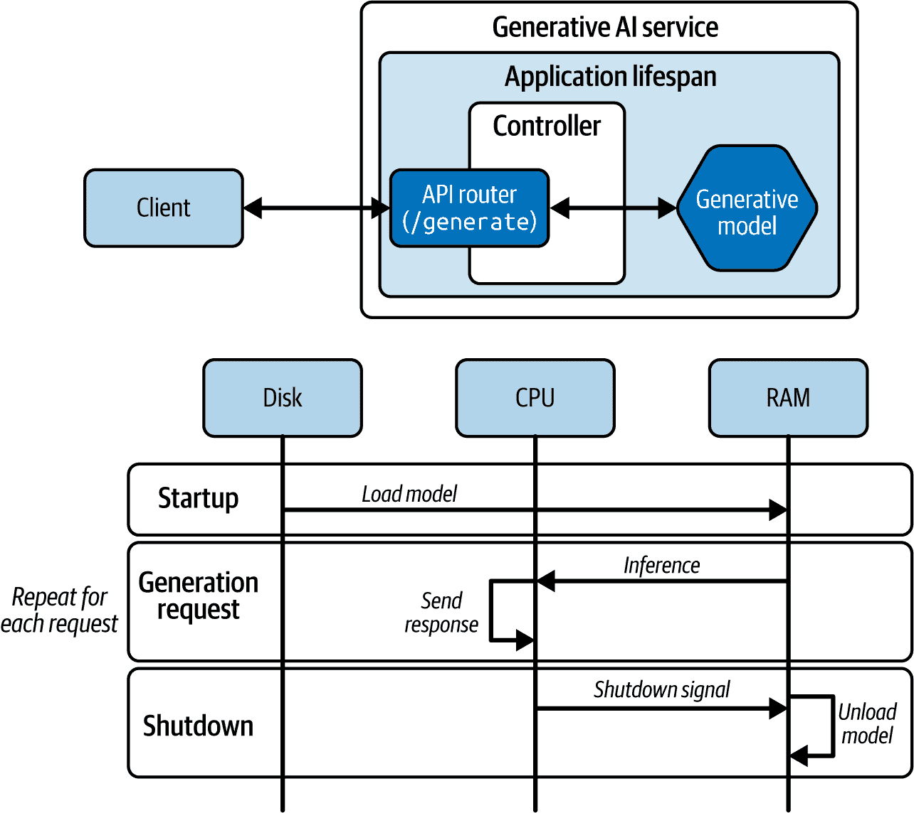

###### 图 3-29\. 使用 FastAPI 应用程序生命周期预加载模型

您可以使用应用程序生命周期实现模型预加载，如 示例 3-16 所示。

##### 示例 3-16\. 使用应用程序生命周期进行模型预加载

```py
# main.py

from contextlib import asynccontextmanager
from typing import AsyncIterator
from fastapi import FastAPI, Response, status
from models import load_image_model, generate_image
from utils import img_to_bytes

models = {} 

@asynccontextmanager 
async def lifespan(_: FastAPI) -> AsyncIterator[None]:
    models["text2image"] = load_image_model() 

    yield 

    ... # Run cleanup code here

    models.clear() 

app = FastAPI(lifespan=lifespan) 

@app.get(
    "/generate/image",
    responses={status.HTTP_200_OK: {"content": {"image/png": {}}}},
    response_class=Response,
)
def serve_text_to_image_model_controller(prompt: str):
    output = generate_image(models["text2image"], prompt) 
    return Response(content=img_to_bytes(output), media_type="image/png")
```


在全局应用程序范围内初始化一个空的可变字典以保存一个或多个模型。


使用 `asynccontextmanager` 装饰器来处理作为异步上下文管理器一部分的启动和关闭事件：

+   上下文管理器将在 `yield` 关键字之前和之后运行代码。

+   装饰的 `lifespan` 函数中的 `yield` 关键字将启动和关闭阶段分开。

+   在 `yield` 关键字之前的代码在处理任何请求之前在应用程序启动时运行。

+   当你想终止应用程序时，FastAPI 将在`yield`关键字之后作为关闭阶段的一部分运行代码。

 (#co_ai_integration_and_model_serving_CO16-3)

在启动时将模型预加载到`models`字典中。

 (#co_ai_integration_and_model_serving_CO16-4)

启动阶段完成后，开始处理请求。

 (#co_ai_integration_and_model_serving_CO16-5)

在应用程序关闭时清除模型。

 (#co_ai_integration_and_model_serving_CO16-6)

创建 FastAPI 服务器，并传递要使用的生命周期函数。

 (#co_ai_integration_and_model_serving_CO16-7)

将全局预加载的模型实例传递给生成函数。

如果您现在启动应用程序，您应该立即看到模型管道被加载到内存中。在您应用这些更改之前，模型管道仅在您第一次请求时加载。

###### 警告

您可以使用生命周期模型服务策略将多个模型预加载到内存中，但对于大型生成 AI 模型来说，这并不实用。生成模型可能需要大量资源，在大多数情况下，您需要 GPU 来加速生成过程。最强大的消费级 GPU 仅配备 24 GB 的 VRAM。一些模型需要 18 GB 的内存来进行推理，因此请尝试在单独的应用程序实例和 GPU 上部署模型。

## 精简：外部提供模型

另一种提供生成 AI 模型的方法是将它们作为外部服务通过其他工具打包。然后，您可以使用您的 FastAPI 应用程序作为客户端和外部模型服务器之间的逻辑层。在这个逻辑层中，您可以处理模型之间的协调、与 API 的通信、用户管理、安全措施、监控活动、内容过滤、增强提示或任何其他所需的逻辑。

### 云服务提供商

云服务提供商不断创新无服务器和专用计算解决方案，您可以使用这些解决方案来外部提供模型。例如，Azure Machine Learning Studio 现在提供了一个 PromptFlow 工具，您可以使用它来部署和定制 OpenAI 或开源语言模型。部署后，您将收到一个在您的 Azure 计算上运行的模型端点，可供使用。然而，使用 PromptFlow 或类似工具可能需要特定的依赖项和非传统步骤，因此存在陡峭的学习曲线。

### BentoML

另一个适合在 FastAPI 外部提供模型的优秀选择是 BentoML。BentoML 受到 FastAPI 的启发，但实现了不同的服务策略，专门为 AI 模型构建。

在处理并发模型请求方面，BentoML 能够运行在不同工作进程上的不同请求，这比 FastAPI 有巨大的改进。它可以并行化 CPU 密集型请求，而无需你直接处理 Python 多进程。在此基础上，BentoML 还可以批量处理模型推理，这样多个用户的生成过程可以通过单个模型调用完成。

我在第二章中详细介绍了 BentoML。

###### 小贴士

要运行 BentoML，你首先需要安装一些依赖项：

```py
$ pip install bentoml
```

你可以在示例 3-18 中看到如何启动 BentoML 服务器。

##### 示例 3-18\. 使用 BentoML 提供图像模型

```py
# bento.py
import bentoml
from models import load_image_model

@bentoml.service(
    resources={"cpu": "4"}, traffic={"timeout": 120}, http={"port": 5000}
) 
class Generate:
    def __init__(self) -> None:
        self.pipe = load_image_model()

    @bentoml.api(route="/generate/image") 
    def generate(self, prompt: str) -> str:
        output = self.pipe(prompt, num_inference_steps=10).images[0]
        return output
```

[#co_ai_integration_and_model_serving_CO17-1]

声明一个具有四个分配 CPU 的 BentoML 服务。如果模型没有及时生成，服务应在 120 秒后超时，并从端口`5000`运行。

[#co_ai_integration_and_model_serving_CO17-2]

声明一个 API 控制器，用于执行核心模型生成过程。此控制器将连接到 BentoML 的 API 路由处理程序。

然后，你可以在本地运行 BentoML 服务：

```py
$ bentoml serve service:Generate
```

你的 FastAPI 服务器现在可以成为一个客户端，所服务的模型在外部运行。你现在可以从 FastAPI 内部发送 HTTP `POST`请求以获取响应，如示例 3-19 所示。

##### 示例 3-19\. 通过 FastAPI 的 BentoML 端点

```py
# main.py

import httpx
from fastapi import FastAPI, Response

app = FastAPI()

@app.get(
    "/generate/bentoml/image",
    responses={status.HTTP_200_OK: {"content": {"image/png": {}}}},
    response_class=Response,
)
async def serve_bentoml_text_to_image_controller(prompt: str):
    async with httpx.AsyncClient() as client: 
        response = await client.post(
            "http://localhost:5000/generate", json={"prompt": prompt}
        ) 
    return Response(content=response.content, media_type="image/png")
```

[#co_ai_integration_and_model_serving_CO18-1]

使用`httpx`库创建一个异步 HTTP 客户端。

[#co_ai_integration_and_model_serving_CO18-2]

向 BentoML 图像生成模型端点发送`POST`请求。

### 模型提供者

除了 BentoML 和云提供商之外，你还可以使用外部模型服务提供商，如 OpenAI。在这种情况下，你的 FastAPI 应用程序将成为 OpenAI API 的服务包装器。

幸运的是，与模型提供者 API（如 OpenAI）的集成相当简单，如示例 3-20 所示。

###### 小贴士

要运行示例 3-20，你必须获取一个 API 密钥，并将`OPENAI_API_KEY`环境变量设置为这个密钥，如 OpenAI 所建议。

##### 示例 3-20\. 与 OpenAI 服务集成

```py
# main.py

from fastapi import FastAPI
from openai import OpenAI

app = FastAPI()
openai_client = OpenAI()
system_prompt = "You are a helpful assistant."

@app.get("/generate/openai/text")
def serve_openai_language_model_controller(prompt: str) -> str | None:
    response = openai_client.chat.completions.create( 
        model="gpt-4o",
        messages=[
            {"role": "system", "content": f"{system_prompt}"},
            {"role": "user", "content": prompt},
        ],
    )
    return response.choices[0].message.content
```

[#co_ai_integration_and_model_serving_CO19-1]

使用`gpt-4o`模型通过 OpenAI API 与模型聊天。

现在你应该能够通过对外部调用 OpenAI 服务来获取输出。

当使用外部服务时，请注意数据将与第三方服务提供商共享。在这种情况下，如果你重视数据隐私和安全，你可能更喜欢自托管解决方案。自托管将带来部署和管理自己的模型服务器复杂性的增加。

如果你真的想避免自己提供大型模型的服务，云提供商可以提供托管解决方案，其中你的数据永远不会与第三方共享。一个例子是 Azure OpenAI，在撰写本文时，它提供了 OpenAI 最佳 LLM 和图像生成器的快照。

您现在有几个模型服务的选项。在我们结束本章之前，需要实现的一个最终系统是服务的日志记录和监控。

# 中间件在服务监控中的作用

您可以实施一个简单的监控工具，其中可以记录提示和响应，以及它们与请求和响应令牌的使用情况。要实现日志记录系统，您可以在模型服务控制器内部编写一些日志记录函数。然而，如果您有多个模型和端点，您可能从利用 FastAPI 中间件机制中受益。

中间件是在请求由您的任何控制器处理之前和之后运行的代码块。您可以定义自定义中间件，然后将它附加到任何 API 路由处理程序。一旦请求到达路由处理程序，中间件就充当中间人，在客户端和服务器控制器之间处理请求和响应。

中间件的优秀用例包括日志记录和监控、速率限制、内容过滤和跨源资源共享（CORS）实现。

示例 3-22 展示了您如何监控模型服务处理程序。

# 通过生产环境中的自定义中间件进行使用日志记录

不要在生产环境中使用 示例 3-22，因为如果从 Docker 容器或可以删除或重启且未挂载持久卷或未记录到数据库的主机机器运行应用程序，监控日志可能会消失。

在 第七章 中，您将监控系统集成到数据库中，以在应用程序环境之外持久化日志。

##### 示例 3-22\. 使用中间件机制捕获服务使用日志

```py
# main.py

import csv
import time
from datetime import datetime, timezone
from uuid import uuid4
from typing import Awaitable, Callable
from fastapi import FastAPI, Request, Response

# preload model with a lifespan
...

app = FastAPI(lifespan=lifespan)

csv_header = [
    "Request ID", "Datetime", "Endpoint Triggered", "Client IP Address",
    "Response Time", "Status Code", "Successful"
]

@app.middleware("http") 
async def monitor_service(
    req: Request, call_next: Callable[[Request], Awaitable[Response]]
) -> Response: 
    request_id = uuid4().hex 
    request_datetime = datetime.now(timezone.utc).isoformat()
    start_time = time.perf_counter()
    response: Response = await call_next(req)
    response_time = round(time.perf_counter() - start_time, 4) 
    response.headers["X-Response-Time"] = str(response_time)
    response.headers["X-API-Request-ID"] = request_id 
    with open("usage.csv", "a", newline="") as file:
        writer = csv.writer(file)
        if file.tell() == 0:
            writer.writerow(csv_header)
        writer.writerow( 
            [
                request_id,
                request_datetime,
                req.url,
                req.client.host,
                response_time,
                response.status_code,
                response.status_code < 400,
            ]
        )
    return response

# Usage Log Example

""""
Request ID: 3d15d3d9b7124cc9be7eb690fc4c9bd5
Datetime: 2024-03-07T16:41:58.895091
Endpoint triggered: http://localhost:8000/generate/text
Client IP Address: 127.0.0.1
Processing time: 26.7210 seconds
Status Code: 200
Successful: True
"""

# model-serving handlers
...
```

 (#co_ai_integration_and_model_serving_CO21-1)

声明一个由 FastAPI HTTP 中间件机制装饰的函数。该函数必须接收`Request`对象和`call_next`回调函数，才能被认为是有效的`http`中间件。

 (#co_ai_integration_and_model_serving_CO21-2)

将请求传递给路由处理程序以处理响应。

 (#co_ai_integration_and_model_serving_CO21-3)

为跟踪所有传入请求生成请求 ID，即使请求处理期间在`call_next`中引发错误。

 (#co_ai_integration_and_model_serving_CO21-4)

将响应持续时间计算到小数点后四位。

 (#co_ai_integration_and_model_serving_CO21-5)

为处理时间和请求 ID 设置自定义响应头。

 (#co_ai_integration_and_model_serving_CO21-6)

将触发端点的 URL、请求日期和时间、客户端 IP 地址、响应处理时间和状态码记录到磁盘上的 CSV 文件中，以追加模式。

在本节中，您捕获了有关端点使用的信息，包括处理时间、状态码、端点路径和客户端 IP 地址。

中间件是一个强大的系统，用于在请求传递到路由处理程序之前和响应发送到用户之前执行代码块。你看到了中间件如何被用来为任何模型服务端点记录模型使用情况的示例。

# 在中间件中访问请求和响应体

如果你需要跟踪与你的模型的交互，包括提示和它们生成的内容，使用中间件进行日志记录比在每个处理程序中添加单独的记录器更有效。然而，在记录请求和响应体时，你应该考虑到数据隐私和性能问题，因为用户可能会提交敏感或大量数据到你的服务，这将需要谨慎处理。

# 摘要

我们在本章中涵盖了大量的概念，所以让我们快速回顾一下我们讨论过的所有内容。

你看到了如何使用 Streamlit 包在几行代码内下载、集成并使用 Hugging Face 存储库中的各种开源 GenAI 模型，并通过简单的用户界面进行服务。你还审查了几种模型类型以及如何通过 FastAPI 端点提供服务。你实验过的模型包括文本、图像、音频、视频和基于 3D 的，你看到了它们如何处理数据。你还学习了这些模型的架构和支撑这些模型的底层机制。

然后，你审查了几种不同的模型服务策略，包括按请求进行模型交换、模型预加载，以及最终使用其他框架如 BentoML 或使用第三方 API 在 FastAPI 应用程序外部进行模型服务。

接下来，你注意到较大的模型生成响应可能需要一些时间。最后，你为你的模型实现了一个服务监控机制，该机制利用 FastAPI 中间件系统为每个模型服务端点。然后，你将日志写入磁盘以供将来分析。

你现在应该更有信心构建自己的由各种开源模型驱动的 GenAI 服务。

在下一章中，你将学习更多关于类型安全及其在消除应用程序错误和减少与外部 API 和服务工作时不确定性的作用。你还将了解如何验证请求和响应模式，以使你的服务更加可靠。

# 其他参考文献

+   [“Bark”](https://oreil.ly/HKT8O)，在“Transformers”文档中，*Hugging Face*，于 2024 年 3 月 26 日访问。

+   Borsos, Z.，等人（2022）。[“AudioLM：音频生成中的语言建模方法”](https://oreil.ly/8YZBr)。arXiv 预印本 arXiv:2209.03143。

+   Brooks, T.，等人（2024）。[“视频生成模型作为世界模拟器”](https://oreil.ly/52duF)。OpenAI。

+   Défossez, A.，等人（2022）。[“高保真神经网络音频压缩”](https://oreil.ly/p4_-5)。arXiv 预印本 arXiv:2210.13438。

+   Jun, H. & Nichol, A.（2023）。[“Shap-E：生成条件 3D 隐函数”](https://oreil.ly/LzLy0)。arXiv 预印本 arXiv:2305.02463。

+   Kim, B.-K., et al. (2023). [“BK-SDM：Stable Diffusion 的轻量级、快速且经济实惠的版本”](https://oreil.ly/uErOQ). arXiv 预印本 arXiv:2305.15798。

+   Liu, Y., et al. (2024). [“Sora：关于大型视觉模型背景、技术、局限性和机会的综述”](https://oreil.ly/Zr6bJ). arXiv 预印本 arXiv:2402.17177。

+   Mildenhall, B., et al. (2020). [“NeRF：用于视图合成的场景表示为神经辐射场”](https://oreil.ly/hBiBV). arXiv 预印本 arXiv:2003.08934。

+   Nichol, A., et al. (2022). [“Point-E：一个从复杂提示生成 3D 点云的系统”](https://oreil.ly/FW-wT). arXiv 预印本 arXiv:2212.08751。

+   Vaswani, A., et al. (2017). [“注意力即是所需”](https://oreil.ly/N4MkH). arXiv 预印本 arXiv:1706.03762。

+   Wang, C., et al. (2023). [“神经编码语言模型是零样本文本到语音合成器”](https://oreil.ly/h1D0e). arXiv 预印本 arXiv:2301.02111。

+   Zhang, P., et al. (2024). [“TinyLlama：一个开源的小型语言模型”](https://oreil.ly/Idi1B). arXiv 预印本 arXiv:2401.02385。

^(1) Hugging Face 提供了访问各种预训练机器学习模型、数据集和应用的途径。

^(2) A. Vaswani 等人 (2017)，[“注意力即是所需”](https://oreil.ly/sO33r)，arXiv 预印本 arXiv:1706.03762。

^(3) 一个用于可视化注意力图的优秀工具是 [BertViz](https://oreil.ly/e2Q7X)。

^(4) 你可以在 [Open LLM GitHub 仓库](https://oreil.ly/GZaEr) 中找到最新的开源 LLM 列表。

^(5) 嵌入模型或嵌入层，例如在 Transformer 中。

^(6) 这种顺序标记生成过程也可能限制长序列的可扩展性，因为每个标记都依赖于前一个标记。

^(7) [Hugging Face 模型仓库](https://huggingface.co) 是 AI 开发者发布和共享其预训练模型的一个资源。

^(8) 有关安装说明，请参阅 [Pytorch 文档](https://pytorch.org)。

^(9) 在内存受限环境中，`float16` 张量精度在内存效率上更优。计算可能更快，但与 `float32` 张量类型相比，精度较低。有关更多信息，请参阅 [TinyLlama 模型卡片](https://oreil.ly/rsmoB)。

^(10) 正如我们在 第二章 中所看到的，控制器是处理 API 路由的传入请求并通过逻辑执行服务或提供者向客户端返回响应的函数。

^(11) Streamlit 默认收集使用统计信息，但您可以使用 [配置文件](https://oreil.ly/m_Jix) 关闭此功能。

^(12) 训练好的模型的潜在空间在可视化时可能看起来像白噪声，但实际上会包含模型学习到的结构化表示，用于编码和解码。

^(13) *复用* 是将多个流（如音频、视频和字幕）以同步方式组合成一个文件或单个流的过程。

^(14) `python-multipart` 库用于解析 `multipart/form-data`，这是文件上传表单提交中常用的编码方式。
