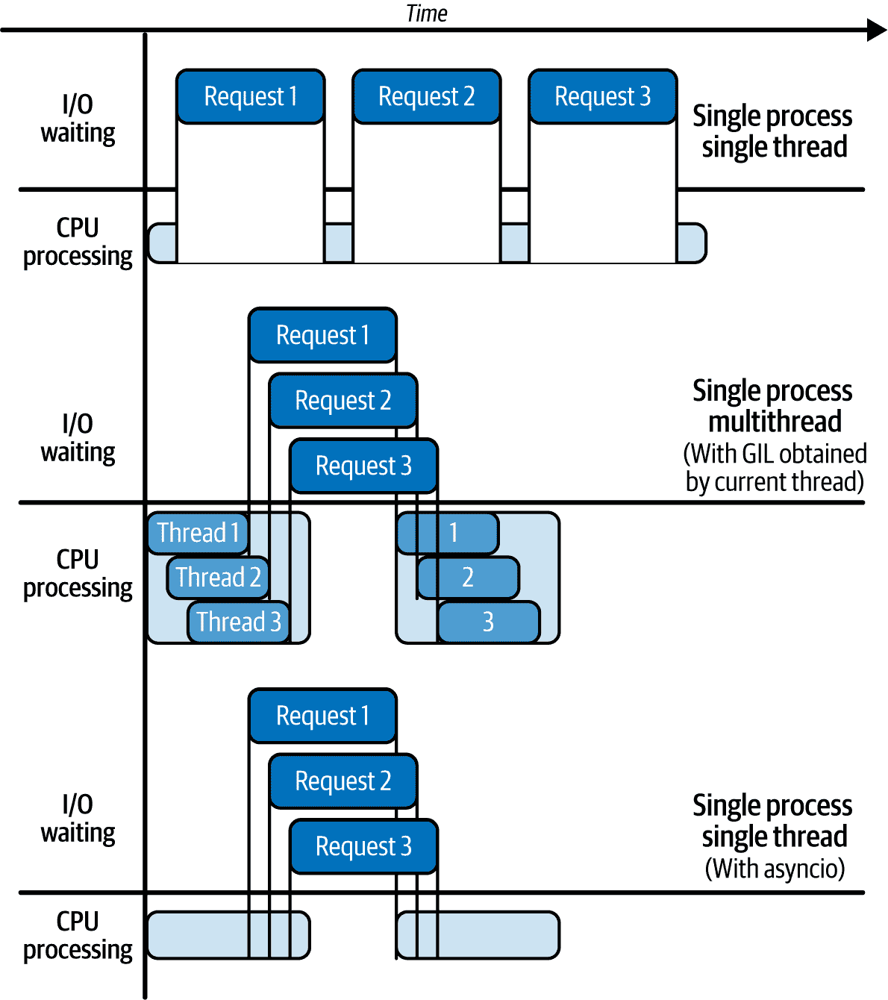
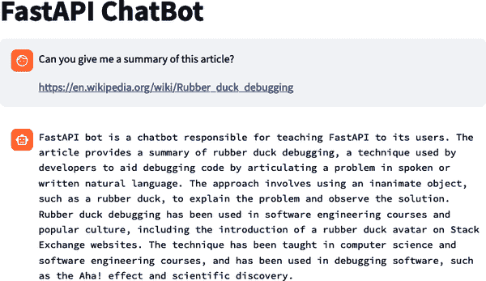
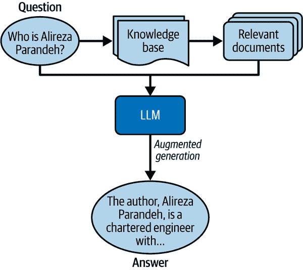
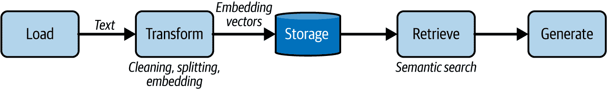
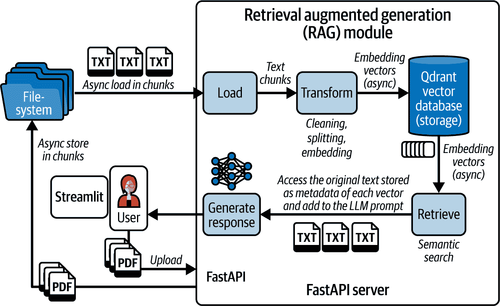
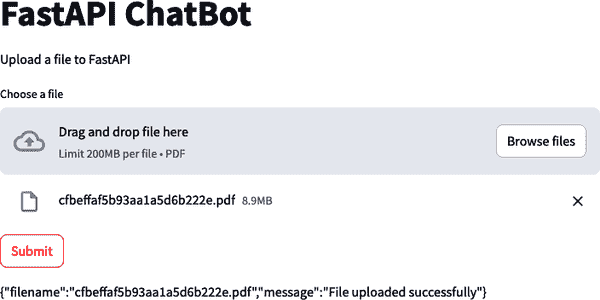
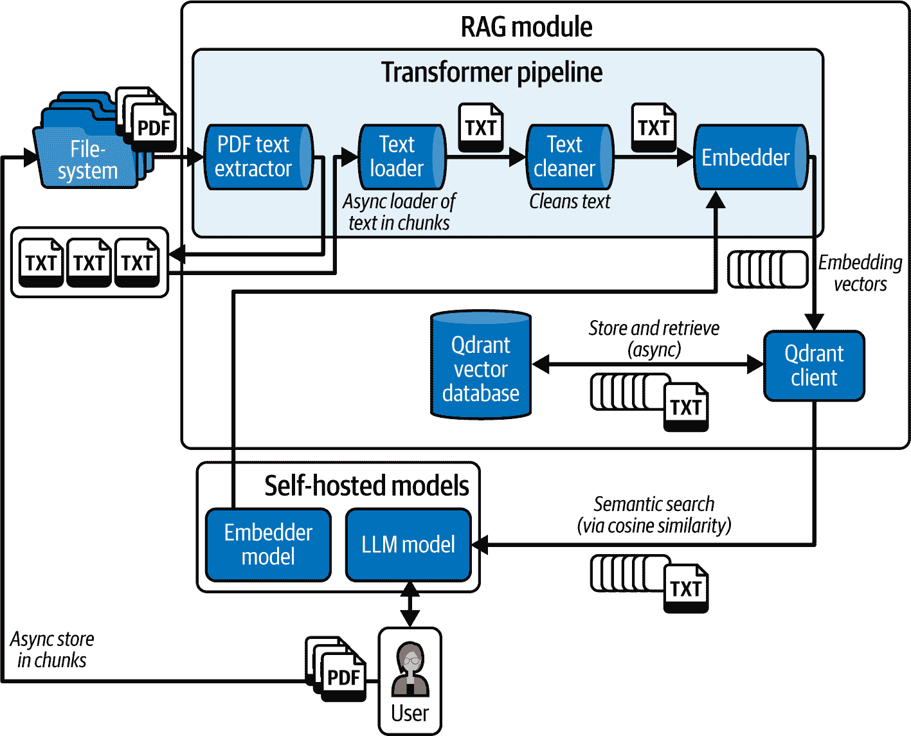
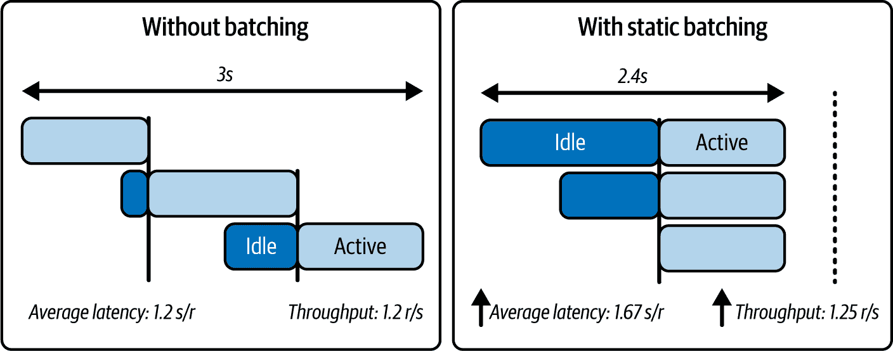
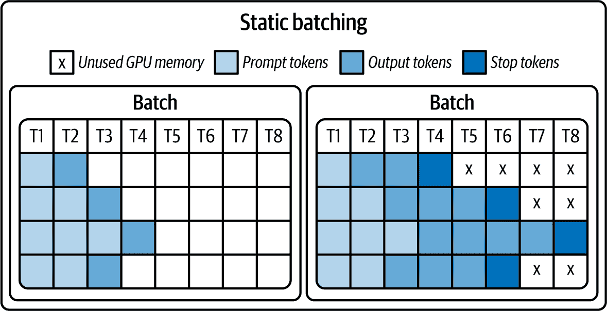
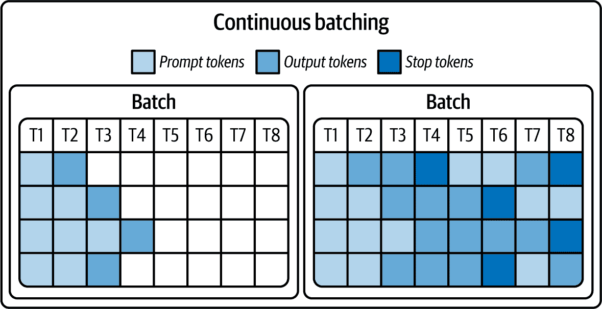

# 第五章\. 实现 AI 工作负载的并发性

在本章中，您将了解异步编程在提高您的 GenAI 服务性能和可扩展性方面的作用和好处。作为这部分内容，您将学习如何管理并发用户交互，与外部系统（如数据库）交互，实现 RAG，并读取网页以丰富模型提示的上下文。您将获得有效处理 I/O 绑定和 CPU 绑定操作的技术，尤其是在处理外部服务或处理长时间运行的推理任务时。

我们还将深入研究高效处理长时间运行的生成式 AI 推理任务的策略，包括使用 FastAPI 事件循环执行后台任务。

# 为多个用户优化 GenAI 服务

AI 工作负载是计算密集型操作，可能会阻碍您的 GenAI 服务处理多个并发请求。在大多数生产场景中，多个用户将使用您的应用程序。因此，您的服务预计将能够并发地处理请求，以便多个重叠的任务可以执行。然而，如果您与 GenAI 模型和外部系统（如数据库、文件系统或互联网）交互，将会有一些操作可能会阻塞其他任务在您的服务器上执行。可以阻止程序执行流程的长时间运行操作被认为是*阻塞*的。

这些阻塞操作可能有两方面：

输入/输出（I/O）绑定

当一个进程因为数据输入/输出操作而必须等待时，这些操作可能来自用户、文件、数据库、网络等。例如包括将文件读取或写入磁盘、进行网络请求和 API 调用、从数据库发送或接收数据，或等待用户输入。

计算密集型

当一个进程因为 CPU 或 GPU 上的计算密集型操作而必须等待时。计算密集型程序通过执行密集型计算将 CPU 或 GPU 核心推到极限，通常阻止它们执行其他任务。1 例如包括数据处理、AI 模型推理或训练、3D 对象渲染、运行模拟等。

您有几种策略来服务多个用户：

系统优化

对于 I/O 绑定任务，如从数据库获取数据、在磁盘上处理文件、进行网络请求或读取网页

模型优化

对于内存和计算密集型任务，如模型加载和推理

队列系统

为了处理长时间运行的推理任务以避免响应延迟

在本节中，我们将更详细地审视每种策略。为了帮助巩固您的学习，我们还将一起实施几个利用上述策略的功能：

+   构建一个*网页抓取器*，用于批量获取和解析粘贴在聊天中的 HTTP URL，以便您可以询问您的 LLM 关于网页内容

+   你可以通过添加一个*检索增强生成*（RAG）模块到你的服务中，并使用如`qdrant`之类的自托管向量数据库，以便你可以通过你的 LLM 服务上传和与你的文档进行交互

+   添加一个*批图像生成系统*，以便你可以将图像生成工作负载作为后台任务运行

在我可以向你展示如何构建上述功能之前，我们应该更深入地探讨*并发*和*并行性*的主题，因为理解这两个概念将帮助你确定适用于你自己的用例的正确策略。

*并发*指的是服务同时处理多个请求或任务的能力，而无需依次完成。在并发操作期间，多个任务的时序可以重叠，并且可能在不同时间开始和结束。

在 Python 中，你可以通过在单个线程（通过异步编程）或不同线程（通过多线程）之间切换任务来实现单 CPU 核心的并发。

使用多个核心，你还可以实现一种称为*并行性*的并发子集，其中任务被分配给几个独立的工作者（通过多进程），每个工作者在自己的隔离资源和单独的进程中同时执行任务。

###### 注意

虽然有计划很快从 Python 中移除全局解释器锁（GIL），但在撰写本文时，多个线程同时处理任务是不可能的。因此，单核上的并发可以给人一种并行性的错觉，尽管只有一个进程在完成所有工作。单个进程只能通过切换活动线程来多任务处理，以最小化 I/O 阻塞操作的等待时间。

你只能通过多个工作者（在多进程的情况下）实现真正的并行性。

尽管并发和并行有许多相似之处，但它们并不是完全相同的概念。它们之间的主要区别在于，并发可以通过交错执行来帮助管理多个任务，这对于 I/O 密集型任务很有用。另一方面，并行性涉及同时执行多个任务，通常在多核机器上，这对于 CPU 密集型任务更有用。

你可以使用线程或异步编程（即在单核机器上的时间切片，其中任务被交错以产生同时执行的外观）等方法实现并发。

图 5-1 展示了并发与并行之间的关系。


###### 图 5-1\. 并发与并行

在大多数可扩展系统中，你可以观察到并发和并行。

想象一下你正在访问一家快餐店并下单。在一个并发系统中，你会看到店主在烹饪汉堡的同时接受订单，不时地处理每个任务，并通过在任务之间切换来有效地进行多任务处理。在一个并行系统中，你会看到多个员工同时接受订单，同时有少数人在烹饪汉堡。这里不同的工人同时处理每个任务。

在单线程进程中，如果没有多线程或异步编程，进程必须等待阻塞操作完成才能开始新任务。如果没有在多个核心上实现并行的多进程，计算密集型操作可能会阻止应用程序启动其他任务。

图 5-2 展示了非并发执行、无并行性的并发执行（单核）和有并行性的并发执行（多核）之间的区别。

图 5-2 中显示的三个 Python 执行模型如下：

没有并发（同步）

单个进程（在一个核心上）按顺序执行任务。

并发和非并行

单个进程（在一个核心上）中的多个线程并发处理任务，但由于 Python 的 GIL，它们不是并行处理的。

并发和并行

多个核心上的多个进程并行执行任务，最大限度地利用多核处理器以实现最大效率。


###### 图 5-2\. 带和不带并行的并发

在多进程处理中，每个进程都有自己的内存空间和资源，以独立于其他进程完成任务。这种隔离可以使进程更加稳定——因为如果一个进程崩溃，它不会影响其他进程——但与共享相同内存空间的线程相比，进程间的通信更加复杂，如图图 5-3 所示。


###### 图 5-3\. 多线程和多进程中的资源共享

分布式工作负载通常使用一个管理进程来协调这些进程的执行和协作，以避免数据损坏和重复工作等问题。多进程的一个好例子是，当使用负载均衡器管理多个容器的流量时，每个容器运行你的应用程序的一个实例来提供服务。

多线程和异步编程可以减少 I/O 任务的等待时间，因为处理器可以在等待 I/O 时做其他工作。然而，它们对需要大量计算的任务（如 AI 推理）没有帮助，因为进程正忙于计算某些结果。因此，为了向多个用户提供服务的大型自托管 GenAI 模型，你应该通过多进程扩展服务或使用算法模型优化（通过专门的模型推理服务器如 vLLM）。

当您与慢速模型一起工作时，您的第一反应可能是通过在单台机器上创建多个 FastAPI 服务实例（多进程）来采用并行性，以并行处理请求。

不幸的是，在单独的进程中运行的多个工作进程将无法访问共享内存空间。因此，您不能在 FastAPI 应用程序的不同实例之间共享内存中加载的工件（例如，GenAI 模型）。遗憾的是，您的模型的新实例也需要加载，这将显著消耗您的硬件资源。这是因为 FastAPI 是一个通用型 Web 服务器，它没有原生优化托管 GenAI 模型。

解决方案不是并行本身，而是采用外部模型托管策略，如第三章所述。

你可以将 AI 推理工作负载视为 I/O 密集型，而不是计算密集型的情况，仅当你依赖于第三方 AI 提供商 API（例如，OpenAI API）时。在这种情况下，你通过网络请求将计算密集型任务卸载给模型提供商。

在您的端，AI 推理工作负载通过网络请求成为 I/O 密集型，允许通过时间切片使用并发。第三方提供商必须担心扩展他们的服务以处理跨其硬件资源的计算密集型模型推理。

您可以使用像 vLLM、Ray Serve 或 NVIDIA Triton 这样的专用服务器，将大型 GenAI 模型（如 LLM）的服务和推理外部化。

在本章的后面部分，我将详细介绍这些服务器如何在模型推理期间最大化计算密集型操作的推理效率，同时在数据生成过程中最小化模型的内存占用。

为了帮助您消化到目前为止所讨论的内容，请查看表 5-1 中并发策略的比较表，以了解何时以及为什么使用每种策略。

表 5-1\. 并发策略比较

| 策略 | 特点 | 挑战 | 用例 |
| --- | --- | --- | --- |
| 无并发（同步） |

+   简单、可读、易于理解的代码，便于调试

+   单个 CPU 核心和线程

|

+   根据 I/O 或 CPU 阻塞操作停止进程执行，可能存在潜在的长时间等待

+   不能同时服务多个用户

|

+   单用户应用程序，用户可以等待任务完成

+   不常使用的服务或应用程序

|

| 异步 I/O（异步） |
| --- |

+   单个 CPU 核心和线程

+   由 Python 进程内部的事件循环管理的多任务

+   由于 Python 进程管理任务，因此是线程安全的

+   最大化 CPU 利用率

+   对于 I/O 任务来说，比多线程和多进程更快

|

+   在代码中实现起来更困难，并且可能会使调试更困难

+   需要使用具有异步 I/O 功能的库和依赖项

+   容易出错，阻塞主进程（和事件循环）

| 具有阻塞 I/O 任务的应用程序 |
| --- |
| 多线程 |

+   单个 CPU 核心但同一进程内有多个线程

+   线程共享数据和资源

+   在代码中实现比 Async IO 更简单

+   由操作系统编排的线程间的多任务处理

|

+   难以锁定每个线程的资源以避免线程安全问题，这可能导致不可复现的错误和数据损坏

+   线程可能会无限期地阻塞彼此（死锁）

+   对资源的并发访问可能导致不一致的结果（竞争条件）

+   线程可能会因为线程垄断（饥饿）而被拒绝资源

+   创建和销毁线程是计算密集型的

| 具有阻塞 I/O 任务的应用程序或服务 |
| --- |
| 多进程 |

+   在多个 CPU 核心上运行的多个进程

+   每个进程都分配了一个 CPU 核心和隔离的资源

+   可以使用像 Celery 这样的工具将工作负载分配到 CPU 核心，并由编排进程管理

|

+   在进程之间共享硬件资源以及像大型 AI 模型或数据这样的对象可能很复杂，并且需要进程间通信（IPC）机制或专用共享内存

+   难以保持多个隔离进程的同步

+   创建和销毁进程是计算密集型的

|

+   具有阻塞计算密集型任务的应用程序或服务

+   可以在隔离的块中处理的分而治之类型的任务

+   在多个 CPU 核心之间分配工作负载或处理请求

|

现在我们已经探讨了各种并发策略，接下来让我们通过增强异步编程来提高你的服务效率，以有效地管理 I/O 密集型操作。稍后我们将专注于优化计算密集型任务，特别是通过专用服务器进行模型推理。

# 使用异步编程优化 I/O 任务

在本节中，我们将探讨使用异步编程来防止在 AI 工作负载期间因 I/O 密集型任务而阻塞主服务器进程。你还将了解`asyncio`框架，它允许在 Python 中编写异步应用程序。

## 同步与异步（Async）执行的比较

什么是异步应用程序？为了回答这个问题，让我们比较一下同步和异步程序。

当任务按顺序执行，每个任务在开始之前都等待前一个任务完成时，应用程序被认为是**同步**的。对于运行不频繁且处理时间仅几秒的应用程序，同步代码很少引起问题，并且可以使实现更快、更简单。然而，如果你需要并发并且希望服务的效率在每颗核心上最大化，你的服务应该在不等待阻塞操作完成的情况下进行多任务处理。这就是实现**异步**（async）并发可以帮助的地方。

让我们看看几个同步和异步函数的例子，以了解异步代码能给你带来多大的性能提升。在两个例子中，我将使用睡眠来模拟 I/O 阻塞操作，但你可以想象在现实场景中执行其他 I/O 任务。

示例 5-1 展示了一个使用阻塞的 `time.sleep()` 函数模拟 I/O 阻塞操作的同步代码示例。

##### 示例 5-1\. 同步执行

```py
import time

def task():
    print("Start of sync task")
    time.sleep(5) 
    print("After 5 seconds of sleep")

start = time.time()
for _ in range(3): 
    task()
duration = time.time() - start
print(f"\nProcess completed in: {duration} seconds")
"""
Start of sync task
After 5 seconds of sleep
Start of sync task
After 5 seconds of sleep
Start of sync task
After 5 seconds of sleep

Process completed in: 15.014271020889282 seconds
"""
```

 (#co_achieving_concurrency_in_ai_workloads_CO1-1)

使用 `sleep()` 模拟发送网络请求等 I/O 阻塞操作。

 (#co_achieving_concurrency_in_ai_workloads_CO1-2)

顺序调用 `task()` 三次。循环模拟依次发送多个网络请求。

在 示例 5-1 中，调用 `task()` 三次需要 15 秒才能完成，因为 Python 正在等待阻塞操作 `sleep()` 完成。

要在 Python 中开发异步程序，你可以使用 `asyncio` 包，它是 Python 3.5 及以后版本的标准库的一部分。使用 `asyncio`，异步代码看起来与顺序同步代码相似，但增加了 `async` 和 `await` 关键字以执行非阻塞 I/O 操作。

示例 5-2 展示了如何使用 `async` 和 `await` 关键字与 `asyncio` 一起异步运行 示例 5-1。

##### 示例 5-2\. 异步执行

```py
import time
import asyncio

async def task(): 
    print("Start of async task")
    await asyncio.sleep(5) 
    print("Task resumed after 5 seconds")

async def spawn_tasks():
    await asyncio.gather(task(), task(), task()) 

start = time.time()
asyncio.run(spawn_tasks()) 
duration = time.time() - start

print(f"\nProcess completed in: {duration} seconds")
"""
Start of async task
Start of async task
Start of async task
Task resumed after 5 seconds
Task resumed after 5 seconds
Task resumed after 5 seconds

Process completed in: 5.0057971477508545 seconds  """
```

 (#co_achieving_concurrency_in_ai_workloads_CO2-1)

实现一个 `task` 协程，在阻塞操作上交出控制权给事件循环。

 (#co_achieving_concurrency_in_ai_workloads_CO2-2)

非阻塞的五秒睡眠信号告知事件循环在等待的同时运行另一个任务。

 (#co_achieving_concurrency_in_ai_workloads_CO2-3)

使用 `asyncio.create_task` 创建任务实例，并通过 `asyncio.gather` 并发地链式（或收集）并运行它们。

 (#co_achieving_concurrency_in_ai_workloads_CO2-4)

使用 `asyncio.run` 方法创建事件循环以安排异步任务。

 (#co_achieving_concurrency_in_ai_workloads_CO2-5)

执行时间是同步示例的 1/3，因为这次 Python 进程没有被阻塞。

运行 示例 5-2 后，你会注意到 `task()` 函数被并发调用了三次。另一方面，示例 5-1 中的代码顺序调用了三次 `task()` 函数。异步函数在 `asyncio` 的事件循环中运行，该循环负责在不等待的情况下执行代码。

在任何异步代码中，`await` 关键字将 I/O 阻塞操作标记给 Python，以便它们以非阻塞方式（即，它们可以在不阻塞主进程的情况下运行）执行。通过了解阻塞操作，Python 可以在等待阻塞操作完成时去做其他事情。

示例 5-3 展示了如何使用 `async` 和 `await` 关键字声明和运行异步函数。

##### 示例 5-3\. 如何使用 `async` 和 `await` 关键字

```py
import asyncio

async def main():
    print("Before sleeping")
    await asyncio.sleep(3) 
    print("After sleeping for 3 seconds")

asyncio.run(main()) 

"""
Before sleeping
After sleeping for 3 seconds  """
```


通过 `await` `asyncio.sleep()` 来模拟非阻塞 I/O 操作，这样 Python 就可以在等待时去做其他事情。


你需要在 `asyncio.run()` 内部调用 `main()` 来执行它，因为它是一个异步函数。否则，它将不会执行，并返回一个 *协程* 对象。我将在稍后介绍协程。


如果你运行代码，第二个语句将在第一个语句后 3 秒打印。在这种情况下，因为没有其他操作要运行，除了睡眠操作，Python 将在空闲状态下运行，直到睡眠操作完成。

在 示例 5-3 中，我使用睡眠来模拟 I/O 阻塞操作，例如发起网络请求。

###### 警告

你只能在用 `async def` 声明的函数中使用 `await` 关键字。在 `async` 函数外部使用 `await` 将在 Python 中引发 `SyntaxError`。另一个常见的陷阱是在 `async` 函数中使用非异步的阻塞代码，这会无意中阻止 Python 在等待时执行其他任务。

因此，你现在理解了在异步程序中，为了防止主进程被阻塞，Python 一旦遇到阻塞操作就会在函数之间切换。你现在可能想知道：

+   Python 如何利用 `asyncio` 暂停和恢复函数？

+   Python 的 `asyncio` 使用什么机制从一个函数移动到另一个函数，而不会忘记那些被挂起的函数？

+   如何在不丢失其状态的情况下暂停或恢复函数？

为了回答上述问题，让我们更深入地了解 `asyncio` 内部的底层机制，因为理解这些问题的答案将极大地帮助你调试服务中的异步代码。

在 `asyncio` 的核心是一个称为 *事件循环* 的一等对象，负责高效处理 I/O 事件、系统事件和应用上下文变化。

图 5-4 展示了 `asyncio` 事件循环在 Python 中如何进行任务编排。


###### 图 5-4\. 异步 I/O 事件循环

事件循环可以比作一个 `while True` 循环，它监视 Python 进程中由 *协程函数* 发射的事件或消息，并在等待 I/O 阻塞操作完成时将事件分派给函数以切换执行。这种编排允许其他函数在不受干扰的情况下异步执行。

## 使用模型提供者 API 进行异步编程

我之前向您展示的所有三个示例都被认为是异步编程的“Hello World”示例。现在，让我们看看一个与构建 GenAI 服务相关的真实场景，其中您需要使用模型提供商的 API——例如 OpenAI、Anthropic 或 Mistral——因为自己提供 LLM 可能会更昂贵。

此外，如果您通过在短时间内发送多个请求来对第三章中创建的生成端点进行压力测试，您将注意到在处理每个请求之前会有很长的等待时间。这是因为您在同一个 Python 进程和 CPU 核心上预加载和托管模型，而服务器正在运行。当您发送第一个请求时，整个服务器在推理工作负载完成之前都会被阻塞。由于在推理过程中 CPU 正在尽可能努力工作，推理/生成过程是一个 CPU 密集型的阻塞操作。然而，这不必是这种情况。

当您使用提供商的 API 时，您不再需要担心 CPU 密集型的 AI 工作负载，因为它们对您来说变成了 I/O 密集型，并且您将 CPU 密集型工作负载卸载到提供商。因此，了解如何利用异步编程来并发交互模型提供商的 API 是有意义的。

好消息是，API 所有者通常会同时发布同步和异步的 *客户端* 和 *软件开发工具包* (SDK)，以减少与他们的端点交互所需的工作量。

###### 警告

如果您需要向其他外部服务发送请求、从数据库中获取数据或从文件中摄取内容，您将向过程中添加其他 I/O 阻塞任务。如果您不利用异步编程，这些阻塞任务可能会迫使服务器持续等待。

然而，任何同步代码都可以通过使用 [进程或线程池执行器](https://oreil.ly/hIDNI) 来异步化，以避免在事件循环中运行任务。相反，您可以在单独的进程或线程上运行异步任务，以防止阻塞事件循环。

您还可以通过检查库文档或源代码中是否提及 `async` 或 `await` 关键字来验证任何异步支持。否则，您可以在使用 `await` 时尝试测试工具是否可以在异步函数中使用而不引发 `TypeError`。

如果一个工具，例如数据库库，只有同步实现，那么您就不能使用该工具实现异步。解决方案是将该工具切换到异步等效版本，这样您就可以使用 `async` 和 `await` 关键字来使用它们。

在示例 5-4 中，您将通过同步和异步的 OpenAI 客户端与 OpenAI GPT-3.5 API 进行交互，以了解两种方式之间的性能差异。

###### 注意

您需要安装 `openai` 库：

```py
$ pip install openai
```

##### 示例 5-4\. 比较同步和异步 OpenAI 客户端

```py
import os
from fastapi import FastAPI, Body
from openai import OpenAI, AsyncOpenAI

app = FastAPI()

sync_client = OpenAI(api_key=os.environ.get("OPENAI_API_KEY"))
async_client = AsyncOpenAI(api_key=os.environ.get("OPENAI_API_KEY"))

@app.post("/sync")
def sync_generate_text(prompt: str = Body(...)):
    completion = sync_client.chat.completions.create(
        messages=[
            {
                "role": "user",
                "content": prompt,
            }
        ],
        model="gpt-3.5-turbo",
    )
    return completion.choices[0].message.content

@app.post("/async")
async def async_generate_text(prompt: str = Body(...)):
    completion = await async_client.chat.completions.create(
        messages=[
            {
                "role": "user",
                "content": prompt,
            }
        ],
        model="gpt-3.5-turbo",
    )
    return completion.choices[0].message.content
```

同步和异步客户端之间的区别在于，使用异步版本时，FastAPI 可以在不等待 OpenAI API 对前一个用户输入的响应的情况下并行处理用户输入。

通过利用异步代码，你可以获得巨大的吞吐量提升，并扩展到更大的并发请求数量。然而，在编写异步（async）代码时必须小心。

这里有一些你可能会在异步代码中遇到的一些常见陷阱和问题：

+   由于并发任务的非线性执行流程，理解和调试错误可能更加复杂。

+   一些库，如 `aiohttp`，需要嵌套异步上下文管理器才能正确实现。这可能会很快变得令人困惑。

+   混合异步和同步代码可能会抵消任何性能优势，例如，如果你忘记为函数标记 `async` 和 `await` 关键字。

+   不使用与异步兼容的工具和库也可能抵消任何性能优势；例如，使用 `requests` 包而不是 `aiohttp` 来进行异步 API 调用。

+   在任何异步函数中忘记等待协程或等待非协程可能导致意外的行为。所有 `async` 关键字之后都必须跟一个 `await`。

+   不当管理资源（例如，开放的 API/数据库连接或文件缓冲区）可能导致内存泄漏，冻结你的计算机。如果你在异步代码中不限制并发操作的数量，也可能发生内存泄漏。

+   你还可能遇到并发和竞态条件问题，其中违反了线程安全原则，导致资源死锁，进而导致数据损坏。

这个列表并不详尽，正如你所见，使用异步编程存在几个陷阱。因此，我建议首先从编写同步程序开始，以了解代码的基本流程和逻辑，然后再处理迁移到异步实现的复杂性。

## FastAPI 中的事件循环和线程池

在底层，FastAPI 可以处理异步和同步阻塞操作。它是通过在其 *线程池* 中运行同步处理程序来做到这一点的，这样阻塞操作就不会停止 *事件循环* 执行任务。

如我在第二章中提到的，FastAPI 通过 Starlette 运行在 ASGI 网络框架上。如果不是这样，服务器将实际上以同步方式运行，因此你必须等待每个进程完成，然后才能为下一个请求提供服务。然而，使用 ASGI，FastAPI 服务器通过多线程（通过线程池）和异步编程（通过事件循环）支持并发，以并行处理多个请求，同时保持主服务器进程不被阻塞。

FastAPI 通过在应用启动时实例化一组线程来设置线程池，以减少线程创建的运行时负担.^(4) 然后，它将后台任务和同步工作负载委托给线程池，以防止事件循环被同步处理程序内的任何阻塞操作阻塞。事件循环也被称为负责协调请求处理的 FastAPI 主服务器线程。

正如我提到的，事件循环是每个基于 `asyncio` 构建的应用程序的核心组件，包括实现并发的 FastAPI。事件循环运行异步任务和回调，包括执行网络 I/O 操作和运行子进程。在 FastAPI 中，事件循环还负责协调请求的异步处理。

如果可能的话，你应该在事件循环（通过异步编程）上运行处理程序，因为它可能比在线程池（通过多线程）上运行更有效率。这是因为线程池中的每个线程在执行任何代码字节之前都必须获取 GIL，这需要一些计算努力。

想象一下，如果有多个并发用户同时使用你的 FastAPI 服务中的同步和异步 OpenAI GPT-3.5 处理程序（端点），如图 示例 5-4 所示。FastAPI 将在事件循环上运行异步处理程序请求，因为该处理程序使用非阻塞的异步 OpenAI 客户端。另一方面，FastAPI 必须将同步处理程序请求委托给线程池，以保护事件循环不被阻塞。由于委托请求（到线程）和在线程池之间切换线程需要更多的工作，因此同步请求将比它们的异步对应者完成得晚。

###### 注意

记住，所有这些工作——处理同步和异步处理程序请求——都是在同一 FastAPI Python 进程的单个 CPU 内核上运行的。

这样做是为了在等待来自 OpenAI API 的响应时，将 CPU 空闲时间最小化。

性能差异在 图 5-5 中显示。



###### 图 5-5\. 多线程和异步 I/O 处理 I/O 阻塞操作

图 5-5 显示，对于 I/O 密集型工作负载，异步实现更快，如果你需要并发，这应该是你的首选方法。然而，即使 FastAPI 必须与同步的 OpenAI 客户端一起工作，它仍然能够很好地处理多个并发请求。它只是将同步 API 调用发送到线程池中的线程，为你实现某种形式的并发。这就是为什么 FastAPI 官方文档告诉你不必太担心将处理程序函数声明为 `async def` 或 `def`。

然而，请记住，当你使用 `async def` 声明处理程序时，FastAPI 信任你只执行非阻塞操作。当你打破这种信任并在 `async` 路由中执行阻塞操作时，事件循环将被阻塞，并且无法继续执行任务，直到阻塞操作完成。

## 阻塞主服务器

如果你使用 `async` 关键字来定义你的函数，请确保你在函数内部某处也使用 `await` 关键字，并且你函数内部使用的任何包依赖项都不是同步的。

如果路由处理器的实现是同步的，请避免将其声明为 `async`。否则，对受影响的路由处理器的请求将阻塞主服务器处理其他请求，直到服务器等待阻塞操作完成。无论阻塞操作是 I/O 密集型还是计算密集型，这都不会产生影响。因此，如果你不小心，任何对数据库或 AI 模型的调用都可能导致阻塞。

这是一个容易犯的错误。例如，你可能在已声明为异步的处理程序中使用同步依赖项，如示例 5-5 所示。

##### 示例 5-5\. FastAPI 中异步处理程序的错误实现

```py
import os
from fastapi import FastAPI
from openai import AsyncOpenAI, OpenAI

app = FastAPI()

@app.get("/block")
async def block_server_controller():
    completion = sync_client.chat.completions.create(...) 
    return completion.choices[0].message.content

@app.get("/slow")
def slow_text_generator():
    completion = sync_client.chat.completions.create(...) 
    return completion.choices[0].message.content

@app.get("/fast")
async def fast_text_generator():
    completion = await async_client.chat.completions.create(...) 
    return completion.choices[0].message.content
```


I/O 阻塞操作以获取 ChatGPT API 响应。因为路由处理器被标记为异步，FastAPI 信任我们不运行阻塞操作，但正如我们所做的那样，请求将阻塞事件循环（主服务器线程）。其他请求现在被阻塞，直到当前请求被处理。


一个简单的同步路由处理器，具有阻塞操作，不利用异步功能。同步请求被传递给线程池在后台运行，以便主服务器不会被阻塞。


一个非阻塞的异步路由。

请求不会阻塞主线程，也不需要将其传递给线程池。因此，FastAPI 事件循环可以使用异步 OpenAI 客户端快速处理请求。

现在，你应该更自在地在你 FastAPI 服务中实现需要执行 I/O 密集型任务的新功能。

为了帮助你巩固对 I/O 并发概念的理解，在接下来的几节中，你将使用并发在你的 FastAPI 服务中构建几个新功能。这些功能包括：

与网络对话

构建和集成一个网络爬虫模块，允许你通过提供 HTTP URL 来向你的自托管 LLM 提问有关网站内容的问题。

与文档对话

构建并集成一个 RAG 模块，将文档处理成向量数据库。向量数据库以支持高效相似性搜索的方式存储数据。然后，您可以使用理解查询含义的语义搜索，通过您的 LLM 与上传的文档进行交互。

这两个项目都将为您提供与外部系统（如网站、数据库和文件系统）异步交互的实践经验。

## 项目：与网络对话（网页抓取器）

公司通常会为手册、流程和其他文档创建一系列内部网页，以 HTML 页面形式呈现。对于较长的页面，用户在提问时可能会提供 URL，并期望你的 LLM 能够抓取并读取内容。这时，内置的网页抓取器就能派上用场。

有许多方法可以为您的自托管 LLM 构建网页抓取器。根据您的用例，您可以使用以下方法的组合：

+   将网页作为 HTML 抓取，并将原始 HTML（或内部文本内容）提供给 LLM 以解析内容到您期望的格式。

+   使用`BeautifulSoup`和`ScraPy`等网页抓取框架在抓取后解析网页内容。

+   使用 Selenium 和 Microsoft Playwright 等无头浏览器动态导航页面中的节点并解析内容。无头浏览器非常适合导航单页应用程序（SPAs）。

###### 警告

您或您的用户应避免使用 LLM 驱动的网页抓取工具进行非法目的。在从 URL 提取内容之前，请确保您已获得许可：

+   查阅每个网站的条款，特别是如果提到网页抓取。

+   当可能时使用 API。

+   如果不确定，请直接向网站所有者请求许可。

对于这个小型项目，我们只会抓取并馈送 HTML 页面的原始内部文本给我们的 LLM，因为实现一个生产就绪的抓取器可能需要一本书的内容。

构建简单异步抓取器的过程如下：

1.  开发一个函数，使用正则表达式在用户对 LLM 的提示中匹配 URL 模式。

1.  如果找到，遍历提供的 URL 列表并异步抓取页面。我们将使用名为`aiohttp`的异步 HTTP 库，而不是`requests`，因为`requests`只能进行同步网络请求。

1.  开发一个解析函数，从抓取的 HTML 中提取文本内容。

1.  将解析后的页面内容与原始用户提示一起提供给 LLM。

示例 5-6 演示了您如何实现上述步骤。

###### 注意

运行此示例需要安装一些额外的依赖项：

```py
$ pip install beautifulsoup lxml aiohttp
```

##### 示例 5-6：构建异步网页抓取器

```py
# scraper.py

import asyncio
import re

import aiohttp
from bs4 import BeautifulSoup
from loguru import logger

def extract_urls(text: str) -> list[str]:
    url_pattern = r"(?P<url>https?:\/\/[^\s]+)" 
    urls = re.findall(url_pattern, text) 
    return urls

def parse_inner_text(html_string: str) -> str:
    soup = BeautifulSoup(html_string, "lxml")
    if content := soup.find("div", id="bodyContent"): 
        return content.get_text()
    logger.warning("Could not parse the HTML content")
    return ""

async def fetch(session: aiohttp.ClientSession, url: str) -> str:
    async with session.get(url) as response: 
        html_string = await response.text()
        return parse_inner_text(html_string)

async def fetch_all(urls: list[str]) -> str:
    async with aiohttp.ClientSession() as session: 
        results = await asyncio.gather(
            *[fetch(session, url) for url in urls], return_exceptions=True
        )
    success_results = [result for result in results if isinstance(result, str)]
    if len(results) != len(success_results): 
        logger.warning("Some URLs could not be fetched")
    return " ".join(success_results)
```


一个简单的正则表达式模式，将 URL 捕获到名为`url`的命名组中，并匹配`http`和`https`协议。为了简单起见，此模式对 URL 的定义较为宽松，不验证域名或路径的结构，也不考虑 URL 中的查询字符串或锚点。

[(#co_achieving_concurrency_in_ai_workloads_CO5-2)]

在文本中找到所有非重叠的正则表达式模式匹配。

[(#co_achieving_concurrency_in_ai_workloads_CO5-3)]

使用`bs4` Beautiful Soup 包解析 HTML 字符串。在维基百科页面中，文章内容嵌套在一个具有`id="bodyContent"`的`div`容器中，因此解析逻辑假设只有维基百科 URL 会被传入。你可以更改此逻辑以处理其他 URL，或者只需使用`soup.getText()`来获取 HTML 中嵌套的任何文本内容。然而，请注意，如果你以这种方式解析原始 HTML，解析内容中会有很多噪声，这可能会混淆 LLM。

[(#co_achieving_concurrency_in_ai_workloads_CO5-4)]

给定一个`aiohttp`会话和一个 URL，执行异步的`get`请求。创建一个`response`异步上下文管理器，并在该上下文管理器内`await`响应。

[(#co_achieving_concurrency_in_ai_workloads_CO5-5)]

给定一个 URL 列表，创建一个客户端会话异步上下文管理器以异步执行多个获取调用。由于`fetch()`是一个协程函数（即它使用`await`关键字），`fetch_all()`需要在`asyncio.gather()`内部运行多个`fetch()`协程，以便在事件循环上异步执行。

[(#co_achieving_concurrency_in_ai_workloads_CO5-6)]

检查所有 URL 是否已成功获取，如果没有，则发出警告。

你现在拥有了实现`/generate/text`端点中网络爬虫功能的所需实用爬虫函数。

接下来，将文本到文本处理器升级为使用爬虫函数，通过依赖项以异步方式执行，如示例 5-7 所示。

##### 示例 5-7：将网络爬虫功能作为依赖项注入 FastAPI LLM 处理器

```py
# dependencies.py

from fastapi import Body
from loguru import logger

from schemas import TextModelRequest
from scraper import extract_urls, fetch_all

async def get_urls_content(body: TextModelRequest = Body(...)) -> str: 
    urls = extract_urls(body.prompt)
    if urls:
        try:
            urls_content = await fetch_all(urls)
            return urls_content
        except Exception as e:
            logger.warning(f"Failed to fetch one or several URls - Error: {e}")
    return ""

# main.py

from fastapi import Body, Depends, Request
from dependencies import construct_prompt
from schemas import TextModelResponse

@app.post("/generate/text", response_model_exclude_defaults=True) 
async def serve_text_to_text_controller(
    request: Request,
    body: TextModelRequest = Body(...),
    urls_content: str = Depends(get_urls_content) 
) -> TextModelResponse:
    ... # rest of controller logic
    prompt = body.prompt + " " + urls_content
    output = generate_text(models["text"], prompt, body.temperature)
    return TextModelResponse(content=output, ip=request.client.host)
```

[(#co_achieving_concurrency_in_ai_workloads_CO6-1)]

实现一个`get_urls_content` FastAPI 依赖项，它从请求体中获取用户提示并找到所有 URL。然后它返回所有 URL 的内容作为一个长字符串。该依赖项内置异常处理，以处理任何 I/O 错误，通过返回一个空字符串并在服务器上记录警告。

[(#co_achieving_concurrency_in_ai_workloads_CO6-2)]

当在 FastAPI 中使用`aiohttp`时，你不需要自己管理事件循环，因为 FastAPI 作为一个异步框架，会处理事件循环。你可以定义你的端点为一个异步函数，并在处理器内部或通过依赖项（如本例所示）使用`aiohttp`来发送异步 HTTP 请求。

[(#co_achieving_concurrency_in_ai_workloads_CO6-3)]

通过 FastAPI 的`Depends`类将`get_urls_content`依赖项调用的结果注入到处理器中。在这里使用 FastAPI 依赖项使得控制器逻辑保持小巧、简洁和可读。

现在，在浏览器中运行 Streamlit 客户端，尝试您的新特性。图 5-6 展示了我的实验。



###### 图 5-6\. 请自托管 TinyLlama 模型总结维基百科文章

恭喜！您已经学会了如何构建一个简单的非阻塞网络爬虫，与您自己的 LLM 一起工作。在这个小型项目中，您利用`re`包匹配用户提示中的 URL 模式，然后使用`aiohttp`库异步并发地抓取多个页面。然后，您使用`BeautifulSoup`包通过获取抓取的 HTML 字符串中`bodyContent` ID 的`div`容器的文本内容来解析维基百科文章的内容。对于其他网站或内部公司网页，您始终可以修改解析逻辑以进行适当的解析。最后，您将整个抓取逻辑封装在 FastAPI 依赖项中，内置异常处理，以便在升级文本模型服务处理程序时使用依赖注入。

请记住，您的爬虫无法处理具有动态布局且由服务器渲染的复杂页面。在这种情况下，您可以在您的网络爬虫中添加一个无头浏览器来导航动态页面。

此外，抓取外部网站的内容将具有挑战性，因为大多数网站可能实施了如*IP 封锁*或*CAPTCHAs*等常见的防爬措施。与外部网站保持*数据质量*和*一致性*也是一个持续性的挑战，因为您可能需要定期更新您的抓取脚本以确保准确和可靠的数据提取。

您现在应该对构建需要通过异步网络请求与网络交互的 GenAI 服务感到更加得心应手。

接下来，我们将通过构建“与您的文档对话”功能来查看其他 I/O 异步交互，例如与数据库和文件系统的交互。

这个功能允许用户通过 Streamlit 界面上传文档到您的服务。上传文档的内容随后被提取、处理并保存在数据库中。随后，在用户与 LLM 交互期间，一个异步检索系统从数据库中检索语义相关的内容，然后用于增强 LLM 提供的上下文。

这个过程被称为 RAG，我们将为您的 LLM 构建一个模块。

## 项目：与文档对话（RAG）

在这个项目中，我们将把一个 RAG 模块构建到您的 GenAI 服务中，让您亲身体验异步与外部系统（如数据库和文件系统）交互的过程。

您可能对 RAG 模块的用途及其必要性感到好奇。RAG 是一种简单的方法，用于通过为知识密集型任务提供自定义数据源来增强 LLM 提示的上下文.^(5)这是一种有效的技术，可以在不进行复杂且昂贵的 LLM 微调的情况下，将 LLM 的响应基于数据中的事实。

组织渴望使用自己的 LLM 实施 RAG，因为它允许员工通过 LLM 与他们庞大的内部知识库互动。通过 RAG，企业期望内部知识库、系统和程序对需要它们来回答问题的人变得可访问和易于获取。这种对公司信息库的访问预期将提高生产力，减少查找信息的时间和成本，并提高任何企业的利润。

然而，LLM 容易生成不符合用户指令的响应。换句话说，LLM 可以使用基于事实或现实的信息或数据来*虚构*响应。

这些虚构可能是因为模型依赖于其训练数据中的模式，而不是直接访问外部、最新和事实性的数据。LLM 可以以自信的方式呈现不正确或无意义的答案、编造的故事或缺乏事实依据的声明。

因此，对于更复杂和知识密集型任务，您希望您的 LLM 访问外部知识源以完成任务。这可以确保生成响应的事实一致性并提高其可靠性。图 5-7 展示了整个流程。



###### 图 5-7\. RAG

在这个项目中，您将为您的 LLM 服务构建一个简单的 RAG 模块，以便用户可以上传和与他们的文档进行交流。

###### 注意

关于 RAG 有很多要了解的内容。这足以用每天出版的新论文填满几本教科书，每天都有新技术和算法被发布。

我建议查看其他关于 LLM 的出版物，以了解 RAG 流程和高级 RAG 技术。

RAG 的管道包括以下阶段：

1.  *提取* 从文件系统中的文档提取以将文本内容分块加载到内存中。

1.  *转换* 通过清理、分割和准备文本内容，以便将其传递到嵌入模型中，以生成表示块语义意义的嵌入向量。

1.  *存储* 将嵌入向量及其元数据（如来源和文本块）存储在 Qdrant 等向量存储中。

1.  *检索* 通过对用户查询 LLM 的语义搜索来检索语义相关的嵌入向量。原始文本块——存储为检索向量的元数据——然后用于增强（即，增强 LLM 收到的初始提示中的上下文）。

1.  *生成* LLM 响应时绕过查询和检索的块（即上下文）直接提交给 LLM 以获取响应。

您可以在图 5-8 中看到完整的管道。



###### 图 5-8\. RAG 管道

您可以将 图 5-8 中所示的流程图应用到您现有的服务中。图 5-9 展示了启用 RAG 的“与您的文档对话”服务的系统架构。



###### 图 5-9\. 与您的文档对话系统架构

图 5-9 概述了用户通过 Streamlit 接口上传的文档的存储方式，然后用于处理并存储到数据库中，以便稍后检索以增强 LLM 提示。

在 图 5-9 中实现 RAG 系统之前的第一步是在 Streamlit 客户端和您的后端 API 中包含文件上传功能。

使用 FastAPI 的 `UploadFile` 类，您可以分块接收用户的文档并保存到文件系统或任何其他文件存储解决方案，例如 blob 存储。这里需要注意的重要事项是，通过异步编程，这种 I/O 操作是非阻塞的，FastAPI 的 `UploadFile` 类支持这种异步操作。

###### 小贴士

由于用户可能上传大文档，FastAPI 的 `UploadFile` 类支持 *分块* 存储，一次存储一个上传的文档。

这将防止您的服务内存被阻塞。您还希望通过禁止用户上传超过一定大小的文档来保护您的服务。

示例 5-8 展示了如何实现异步文件上传功能。

###### 小贴士

您需要安装 `aiofiles` 包以异步上传文件，同时安装 `python-multipart` 以从 HTML 表单接收上传的文件：

```py
$ pip install aiofiles python-multipart
```

##### 示例 5-8\. 实现异步文件上传端点

```py
# upload.py

import os
import aiofiles
from aiofiles.os import makedirs
from fastapi import UploadFile

DEFAULT_CHUNK_SIZE = 1024 * 1024 * 50  # 50 megabytes

async def save_file(file: UploadFile) -> str:
    await makedirs("uploads", exist_ok=True)
    filepath = os.path.join("uploads", file.filename)
    async with aiofiles.open(filepath, "wb") as f:
        while chunk := await file.read(DEFAULT_CHUNK_SIZE):
            await f.write(chunk)
    return filepath

# main.py

from fastapi import FastAPI, HTTPException, status, File
from typing import Annotated
from upload import save_file

@app.post("/upload")
async def file_upload_controller(
    file: Annotated[UploadFile, File(description="Uploaded PDF documents")]
):
    if file.content_type != "application/pdf":
        raise HTTPException(
            detail=f"Only uploading PDF documents are supported",
            status_code=status.HTTP_400_BAD_REQUEST,
        )
    try:
        await save_file(file)
    except Exception as e:
        raise HTTPException(
            detail=f"An error occurred while saving file - Error: {e}",
            status_code=status.HTTP_500_INTERNAL_SERVER_ERROR,
        )
    return {"filename": file.filename, "message": "File uploaded successfully"}

# client.py

import requests
import streamlit as st

st.write("Upload a file to FastAPI")
file = st.file_uploader("Choose a file", type=["pdf"])

if st.button("Submit"):
    if file is not None:
        files = {"file": (file.name, file, file.type)}
        response = requests.post("http://localhost:8000/upload", files=files)
        st.write(response.text)
    else:
        st.write("No file uploaded.")
```

您现在应该能够通过 Streamlit UI 上传文件，正如您在 图 5-10 中所看到的。



###### 图 5-10\. 通过 Streamlit 将文件上传到 FastAPI 服务

在实现上传功能后，您现在可以将注意力转向构建 RAG 模块。图 5-11 展示了详细流程，它打开了 图 5-9 中的数据转换组件。



###### 图 5-11\. 详细 RAG 数据处理流程

如 图 5-11 所示，您需要异步地从硬盘上获取存储的文件，并通过异步数据库客户端将它们传递给数据转换流程，然后再进行存储。

数据转换流程包括以下部分：

提取器

从 PDF 中提取内容并存储到硬盘上的文本文件中。

加载器

异步地将文本文件分块加载到内存中。

清洁器

从文本块中移除任何多余的空白或格式化字符。

嵌入器

使用预训练的自托管嵌入模型将文本转换为嵌入向量。

一旦用户通过示例 5-8 中所示的过程将 PDF 文件上传到您的服务器文件系统，您就可以立即通过`pypdf`库将它们转换为文本文件。由于没有用于加载二进制 PDF 文件的异步库，您可能希望首先将它们转换为文本文件。

示例 5-9 展示了如何加载 PDF 文件，提取和处理其内容，然后将它们存储为文本文件。

###### 备注

您需要安装几个包才能运行即将到来的示例：

```py
$ pip install qdrant_client aiofiles pypdf loguru
```

##### 示例 5-9. RAG PDF-to-text 提取器

```py
# rag/extractor.py

from pypdf import PdfReader

def pdf_text_extractor(filepath: str) -> None:
    content = ""
    pdf_reader = PdfReader(filepath, strict=True) 
    for page in pdf_reader.pages:
        page_text = page.extract_text()
        if page_text:
            content += f"{page_text}\n\n" 
    with open(filepath.replace("pdf", "txt"), "w", encoding="utf-8") as file: 
        file.write(content)
```

[#co_achieving_concurrency_in_ai_workloads_CO7-1]

使用`pypdf`库以`strict=True`打开指向 PDF 文件的流指针，以便将任何读取错误记录到终端。请注意，`pypdf`库没有异步实现，因此函数使用正常的`def`关键字声明。避免在异步函数中使用此函数，以避免阻塞运行主服务器线程的事件循环。您将看到 FastAPI 后台任务如何帮助解决这个问题。

[#co_achieving_concurrency_in_ai_workloads_CO7-2]

遍历 PDF 文档中的每一页，提取并追加所有文本内容到一个长字符串中。

[#co_achieving_concurrency_in_ai_workloads_CO7-3]

将 PDF 文档的内容写入文本文件以进行下游处理。指定`encoding="utf-8"`以避免在 Windows 等平台上出现问题。

文本提取器将 PDF 文件转换为简单的文本文件，我们可以使用异步文件加载器分块将其流式传输到内存中。然后，每个块可以使用开源嵌入模型（如`jinaai/jina-embeddings-v2-base-en`）进行清理和嵌入到嵌入向量中，该模型可以从[Hugging Face 模型库](https://oreil.ly/gI74r)下载。

###### 备注

我选择了 Jina 基础嵌入器，因为它与 OpenAI 的专有`text-embedding-ada-002`模型的性能相匹配。

示例 5-10 展示了 RAG 数据转换管道的实现，包括异步文本加载器、清理器和嵌入函数。

##### 示例 5-10. RAG 数据转换函数

```py
# rag/transform.py

import re
from typing import Any, AsyncGenerator

import aiofiles
from transformers import AutoModel

DEFAULT_CHUNK_SIZE = 1024 * 1024 * 50  # 50 megabytes

embedder = AutoModel.from_pretrained(
    "jinaai/jina-embeddings-v2-base-en", trust_remote_code=True 
)

async def load(filepath: str) -> AsyncGenerator[str, Any]:
    async with aiofiles.open(filepath, "r", encoding="utf-8") as f: 
        while chunk := await f.read(DEFAULT_CHUNK_SIZE): 
            yield chunk 

def clean(text: str) -> str:
    t = text.replace("\n", " ")
    t = re.sub(r"\s+", " ", t)
    t = re.sub(r"\. ,", "", t)
    t = t.replace("..", ".")
    t = t.replace(". .", ".")
    cleaned_text = t.replace("\n", " ").strip()
    return cleaned_text 

def embed(text: str) -> list[float]:
    return embedder.encode(text).tolist() 
```

[#co_achieving_concurrency_in_ai_workloads_CO8-1]

下载并使用开源的`jina-embeddings-v2-base-en`模型将文本字符串嵌入到嵌入向量中。将`trust_remote_code=True`设置为下载模型权重和分词器配置。如果没有将此参数设置为`True`，则下载的模型权重将使用随机值初始化而不是训练值。

[#co_achieving_concurrency_in_ai_workloads_CO8-2]

使用`aiofiles`库以异步方式打开文件系统上的文件连接。

[#co_achieving_concurrency_in_ai_workloads_CO8-3]

以块的形式加载文本文档的内容，以进行内存高效的 I/O 操作。

[#co_achieving_concurrency_in_ai_workloads_CO8-4]

而不是返回一个 `chunk`，生成它，使 `load()` 函数成为一个 *异步生成器*。异步生成器可以用 `async for loop` 迭代，这样它们内部的阻塞操作就可以通过 `await` 来执行，以便事件循环可以开始/恢复其他任务。异步 `for` 循环和普通 `for` 循环都按顺序遍历可迭代对象，但异步 `for` 循环允许遍历异步迭代器。

[#co_achieving_concurrency_in_ai_workloads_CO8-5]

清理文本，删除任何额外的空格、逗号、句点和换行符。

[#co_achieving_concurrency_in_ai_workloads_CO8-6]

使用 Jina 嵌入模型将文本块转换为嵌入向量。

一旦数据被处理成嵌入向量，您可以将它们存储到 *矢量数据库* 中。

与传统的替代品，如关系数据库不同，矢量数据库专门设计用于处理针对 *语义搜索* 优化的数据存储和检索操作，与可以返回次优或不完整结果的键词搜索相比，它能够提供更好的结果。

以下代码示例需要您在本地机器上运行 `qdrant` 矢量数据库的本地实例，以便使用 RAG 模块。拥有本地数据库设置将为您提供与生产级矢量数据库异步工作的实际操作经验。要在容器中运行数据库，您应该在您的机器上安装 Docker，然后从 Docker 仓库中拉取并运行 `qdrant` 矢量数据库容器.^(7) 如果您不熟悉 Docker，不要担心。您将在第十二章中学习更多关于 Docker 和容器化的知识。

```py
$ docker pull qdrant/qdrant 
$ docker run -p 6333:6333 -p 6334:6334 \  
    -v $(pwd)/qdrant_storage:/qdrant/storage:z \ 
    qdrant/qdrant
```

[#co_achieving_concurrency_in_ai_workloads_CO9-1]

从 Docker 仓库中的 `qdrant` 仓库下载 `qdrant` 矢量数据库镜像。

[#co_achieving_concurrency_in_ai_workloads_CO9-2]

运行 `qdrant/qdrant` 镜像，然后暴露并映射容器端口 `6333` 和 `6334` 到主机机器上的相同端口。

[#co_achieving_concurrency_in_ai_workloads_CO9-3]

将 `qdrant` 数据库存储挂载到主机机器文件系统的项目根目录下。

由于数据库存储和检索是 I/O 操作，您应该使用异步数据库客户端。幸运的是，`qdrant` 提供了一个异步数据库客户端来工作。

###### 提示

您可以使用其他矢量数据库提供商，例如 Weaviate、Elastic、Milvus、Pinecone、Chroma 或其他，以替代 Qdrant。每个提供商都有自己的特性和限制，您需要根据您的具体用例进行考虑。

如果您选择其他数据库提供商，请确保有可用的异步数据库客户端供您使用。

而不是编写多个函数来存储和检索数据库中的数据，您可以使用第二章中提到的存储库模式。使用存储库模式，您可以使用与您的用例匹配的默认值来抽象低级别的创建、读取、更新和删除数据库操作。

示例 5-11 展示了 Qdrant 向量数据库的存储库模式实现。

##### 示例 5-11\. 使用存储库模式设置向量数据库客户端

```py
# rag/repository.py

from loguru import logger
from qdrant_client import AsyncQdrantClient
from qdrant_client.http import models
from qdrant_client.http.models import ScoredPoint

class VectorRepository: 
    def __init__(self, host: str = "localhost", port: int = 6333) -> None:
        self.db_client = AsyncQdrantClient(host=host, port=port)

    async def create_collection(self, collection_name: str, size: int) -> bool: 
        vectors_config = models.VectorParams(
            size=size, distance=models.Distance.COSINE 
        )
        response = await self.db_client.get_collections()

        collection_exists = any(
            collection.name == collection_name
            for collection in response.collections
        )
        if collection_exists: 
            logger.debug(
                f"Collection {collection_name} already exists - recreating it"
            )
            await self.db_client.delete_collection(collection_name)
            return await self.db_client.create_collection(
                collection_name,
                vectors_config=vectors_config,
            )

        logger.debug(f"Creating collection {collection_name}")
        return await self.db_client.create_collection(
            collection_name=collection_name,
            vectors_config=models.VectorParams(
                size=size, distance=models.Distance.COSINE
            ),
        )

    async def delete_collection(self, name: str) -> bool:
        logger.debug(f"Deleting collection {name}")
        return await self.db_client.delete_collection(name)

    async def create(
        self,
        collection_name: str,
        embedding_vector: list[float],
        original_text: str,
        source: str,
    ) -> None:
        response = await self.db_client.count(collection_name=collection_name)
        logger.debug(
            f"Creating a new vector with ID {response.count} "
            f"inside the {collection_name}"
        )
        await self.db_client.upsert(
            collection_name=collection_name,
            points=[
                models.PointStruct(
                    id=response.count,
                    vector=embedding_vector,
                    payload={
                        "source": source,
                        "original_text": original_text,
                    },
                )
            ],
        )

    async def search(
        self,
        collection_name: str,
        query_vector: list[float],
        retrieval_limit: int,
        score_threshold: float, 
    ) -> list[ScoredPoint]:
        logger.debug(
            f"Searching for relevant items in the {collection_name} collection"
        )
        response = await self.db_client.query_points(
            collection_name=collection_name,
            query_vector=query_vector,
            limit=retrieval_limit,
            score_threshold=score_threshold,
        )
        return response.points
```


使用存储库模式通过异步客户端与向量数据库交互。通常，在存储库模式中，您将实现 `create`、`get`、`update` 和 `delete` 方法。但现在是时候实现 `create_collection`、`delete_collection`、`create` 和 `search` 方法了。


向量需要存储在集合中。集合是在搜索期间可以使用的命名点集，类似于关系数据库中的表。


让数据库知道此集合中的任何向量都应通过计算向量之间距离的余弦相似度来比较。


在创建新集合之前检查集合是否存在。否则，重新创建集合。


设置 `retrieval_limit` 和 `score_threshold` 以限制搜索结果中的项目数量。

`VectorRepository` 类现在应该使与数据库的交互更加容易。

当存储向量嵌入时，您还将存储一些 *元数据*，包括源文档的名称、源中文本的位置以及原始提取的文本。RAG 系统依赖于这些元数据来增强 LLM 提示并向用户显示源信息。

###### 小贴士

目前，将文本转换为嵌入向量是一个不可逆的过程。因此，您需要将创建嵌入向量时使用的文本与嵌入向量一起作为元数据存储。

您现在可以扩展 `VectorRepository` 并创建 `VectorService`，允许您将数据处理和存储管道连接起来，如 示例 5-12 所示。

##### 示例 5-12\. 向量数据库服务

```py
# rag/service.py

import os

from loguru import logger
from .repository import VectorRepository
from .transform import clean, embed, load

class VectorService(VectorRepository): 
    def __init__(self):
        super().__init__()

    async def store_file_content_in_db( 
        self,
        filepath: str,
        chunk_size: int = 512,
        collection_name: str = "knowledgebase",
        collection_size: int = 768,
    ) -> None:
        await self.create_collection(collection_name, collection_size)
        logger.debug(f"Inserting {filepath} content into database")
        async for chunk in load(filepath, chunk_size): 
            logger.debug(f"Inserting '{chunk[0:20]}...' into database")

            embedding_vector = embed(clean(chunk))
            filename = os.path.basename(filepath)
            await self.create(
                collection_name, embedding_vector, chunk, filename
            )

vector_service = VectorService() 
```


通过继承 `VectorRepository` 类创建 `VectorService` 类，以便您可以使用和扩展来自 示例 5-11 的常见数据库操作方法。


使用 `store_file_content_in_db` 服务方法异步加载、转换并将原始文本文档分块存储到数据库中。


使用异步生成器 `load()` 异步地从文件中加载文本块。


创建一个 `VectorService` 实例以导入并在整个应用程序中使用。

RAG 数据处理和存储管道的最后一步是在 `file_upload_controller` 中作为后台任务运行文本提取和存储逻辑。实现方式如 示例 5-13 所示，以便处理程序在响应用户后可以在后台触发这两个操作。

##### 示例 5-13\. 更新上传处理程序以处理和存储 PDF 文件内容到向量数据库

```py
# main.py

from fastapi import (
    BackgroundTasks,
    FastAPI,
    File,
    UploadFile,
    status,
    HTTPException,
)
from typing import Annotated
from rag import pdf_text_extractor, vector_service

@app.post("/upload")
async def file_upload_controller(
    file: Annotated[UploadFile, File(description="A file read as UploadFile")],
    bg_text_processor: BackgroundTasks, 
):
    ... # Raise an HTTPException if data upload is not a PDF file
    try:
        filepath = await save_file(file)
        bg_text_processor.add_task(pdf_text_extractor, filepath) 
        bg_text_processor.add_task( 
            vector_service.store_file_content_in_db,
            filepath.replace("pdf", "txt"),
            512,
            "knowledgebase",
            768,
        )

    except Exception as e:
        raise HTTPException(
            detail=f"An error occurred while saving file - Error: {e}",
            status_code=status.HTTP_500_INTERNAL_SERVER_ERROR,
        )
    return {"filename": file.filename, "message": "File uploaded successfully"}
```


将 FastAPI 后台任务功能注入到处理程序中，以在后台处理文件上传。FastAPI 后台任务将在处理程序向客户端发送响应后不久按顺序执行。


在向客户端返回响应后，在后台运行 PDF 文本提取函数。由于 `pdf_text_extractor` 是一个同步函数，FastAPI 将在线程池中的单独线程上运行此函数，以避免阻塞事件循环。


在 `pdf_text_extractor` 完成处理之后，立即在 FastAPI 管理的事件循环上以异步方式运行 `vector_service.store_file_content_in_db` 函数。将函数设置为以 512 个字符的块加载文本文档的内容，并将它们存储在大小为 768 的 `knowledgebase` 向量集合中。

在构建 RAG 数据存储管道后，你现在可以专注于搜索和检索系统，这将允许你使用数据库中的知识来增强 LLM 的用户提示。示例 5-14 将 RAG 搜索和检索操作与 LLM 处理器集成，以增强 LLM 提示的额外上下文。

##### 示例 5-14\. 与 LLM-serving 端点的 RAG 集成

```py
# dependencies.py

from rag import vector_service
from rag.transform import embed
from schemas import TextModelRequest, TextModelResponse

async def get_rag_content(body: TextModelRequest = Body(...)) -> str: 
    rag_content = await vector_service.search( 
        "knowledgebase", embed(body.prompt), 3, 0.7
    )
    rag_content_str = "\n".join( 
        [c.payload["original_text"] for c in rag_content]
    )

    return rag_content_str

# main.py

... # other imports
from dependencies import get_rag_content, get_urls_content

@app.post("/generate/text", response_model_exclude_defaults=True)
async def serve_text_to_text_controller(
    request: Request,
    body: TextModelRequest = Body(...),
    urls_content: str = Depends(get_urls_content),
    rag_content: str = Depends(get_rag_content), 
) -> TextModelResponse:
    ... # Raise HTTPException for invalid models
    prompt = body.prompt + " " + urls_content + rag_content
    output = generate_text(models["text"], prompt, body.temperature)
    return TextModelResponse(content=output, ip=request.client.host)
```


创建 `get_rag_content` 依赖函数以注入到 LLM-serving 处理程序中。此依赖项可以访问请求 `body` 以及随后的用户 `prompt`。


使用 `vector_service` 在数据库中搜索与用户 `prompt` 相关的内容。当传递给 `vector_service.search` 函数时，使用 `embed` 函数将用户 `prompt` 转换为嵌入。如果它们的余弦相似度分数高于 `0.7`（或 70%），则仅检索三个最相关项。


将检索到的最相关的前三个项目的文本有效负载合并为`rag_ 内容 _str`并返回。


将`get_rag_content`依赖函数的结果注入到 LLM 处理器中，以增强最终提示，将来自向量数据库`knowledgebase`的内容添加到 LLM 中。LLM 处理器现在可以获取网页内容和 RAG 向量数据库的内容。

如果你现在访问你的浏览器并上传一个 PDF 文档，你应该能够向你的 LLM 提出关于它的问题。图 5-12 展示了我的实验，通过上传这本书的原始样本并让 LLM 描述我是谁。

###### 注意

根据模型和输入的大小，你可能观察到性能下降或异常，如令牌长度限制问题。


###### 图 5-12\. 利用 RAG 响应用户查询提供答案

恭喜！你现在拥有了一个由开源模型和向量数据库支持的完全工作的 RAG 系统。

这个更长的项目作为一个动手教程，通过构建 LLM 系统的 RAG 模块来学习与异步编程和文件系统以及向量数据库相关的概念。请注意，我们刚刚一起构建的 RAG 系统仍然存在许多限制：

+   文本分割可能会将单词一分为二，导致检索效果不佳和 LLM 混淆。

+   即使有增强提示，LLM 仍然可能产生幻觉和不一致的结果。

+   搜索和检索系统在某些情况下可能表现不佳。

+   增强提示可能超过 LLM 上下文窗口。

+   由于知识库过时或不完整、模糊查询或检索算法不佳，从数据库检索的信息可能缺少相关事实。

+   检索的上下文可能不是根据与用户查询的相关性排序的。

你可以通过实施其他各种技术来进一步改进 RAG 模块，这些技术我将在本书中不涉及：

+   优化文本分割、块大小、清理和嵌入操作。

+   使用 LLM 执行查询转换，通过提示压缩、链式、精炼和聚合等技术，帮助检索和增强系统，以减少幻觉并提高 LLM 性能。

+   使用滑动窗口方法总结或分解大型增强提示，将上下文输入到模型中。

+   增强检索算法以处理模糊查询，并实现不完整数据的回退机制。

+   使用如*最大边际相关性*（MMR）等方法增强检索性能，以丰富增强过程，包含更多样化的文档。

+   实施其他高级 RAG 技术，如检索重排序和过滤、分层数据库索引、RAG 融合、检索增强思维（RAT）等，以提高整体生成性能。

我会让你更详细地研究这些技术，并将它们作为额外的练习自己实现。

在下一节中，我们将回顾其他优化 GenAI 服务的技术，以避免使用计算受限操作（如模型推理）阻塞服务器。

# 优化内存和计算受限的 AI 推理任务的服务

到目前为止，我们已经探讨了优化服务中 I/O 受限的操作。你通过构建网络爬虫和 RAG 模块，学习了如何利用异步编程与网络、数据库和文件进行交互。

使用异步工具和技术，你的服务在与网络、文件系统和数据库交互时保持响应。然而，如果你是自行托管模型，切换到异步编程技术并不能完全消除长时间的等待。这是因为瓶颈将是模型推理操作。

## 计算受限操作

你可以通过在 GPU 上运行模型来加速推理，从而大规模并行化计算。现代 GPU 的计算能力惊人，以每秒浮点运算次数（FLOPS）来衡量，现代 GPU 的计算能力达到每秒兆次（NVIDIA A100）或每秒千兆次（NVIDIA H100）。然而，尽管它们具有显著的计算能力和并行化能力，现代 GPU 核心在处理大型模型的同时并发工作负载时往往利用率不高。

当在 GPU 上自行托管模型时，模型参数从磁盘加载到 RAM（I/O 受限）中，然后由 CPU（内存受限）将它们从 RAM 移动到 GPU 的高带宽内存中。一旦模型参数加载到 GPU 内存中，就会进行推理（计算受限）。

与直觉相反，对于像 SDXL 和 LLMs 这样的大型 GenAI 模型，模型推理不是 I/O 或计算受限，而是内存受限。这意味着将 1 MB 的数据加载到 GPU 的计算核心中所需的时间，比这些计算核心处理 1 MB 数据所需的时间更长。不可避免地，为了最大限度地提高服务的并发性，你需要将推理请求进行批处理，并将尽可能大的批次大小放入 GPU 的高带宽内存中。

因此，即使使用异步技术和最新的 GPU，你的服务器在每次请求期间也可能因为等待数十亿个模型参数加载到 GPU 高带宽内存而被阻塞。为了避免阻塞服务器，你可以通过外部化模型服务，就像我们在第三章中提到的那样，将内存受限的模型服务操作与你的 FastAPI 服务器解耦。

让我们看看如何将模型服务委托给另一个进程。

## 外部化模型服务

当你外部化你的模型服务负载时，你有几个选项可供选择。你可以将模型托管在另一个 FastAPI 服务器上，或者使用专门的模型推理服务器。

专门的推理服务器仅支持有限的一组 GenAI 模型架构。然而，如果您的模型架构得到支持，您将节省大量时间，无需自己实现推理优化。例如，如果您需要自行托管 LLM，LLM-serving 框架可以为您执行多个推理优化，例如批量处理、张量并行、量化、缓存、流式输出、GPU 内存管理等。

由于我们本章主要使用 LLM，我将向您展示如何集成 vLLM，这是一个开源的 LLM 服务器，可以为您启动一个符合 OpenAI API 规范的 FastAPI 服务器。vLLM 还与流行的开源 Hugging Face 模型架构无缝集成，包括 GPT、Llama、Gemma、Mistral、Falcon 等。

###### 注意

在撰写本文时，您还可以使用其他 LLM 托管服务器，包括 NVIDIA Triton Inference Server、Ray Serve、Hugging Face Inference 和 OpenLLM 等。

使用每个服务器都有其特点、优势和劣势，包括支持的模型架构。我建议在将它们用于自己的用例之前对这些服务器进行研究。

您可以通过单个命令启动自己的 vLLM FastAPI 服务器，如示例 5-15 所示。要运行示例 5-15 中的代码，您需要使用以下命令安装 `vllm`：

```py
$ pip install vllm
```

###### 警告

在撰写本文时，vLLM 仅支持 Linux 平台（包括 WSL）以及与 NVIDIA 兼容的 GPU 来运行 CUDA 工具包依赖项。不幸的是，您无法在 Mac 或 Windows 机器上安装 vLLM 进行本地测试。

vLLM 设计用于在 Linux 环境中的 NVIDIA GPU 上进行生产推理工作负载，其中服务器可以通过 *张量并行* 将请求委派给多个 GPU 核心。它还通过其 Ray Serve 依赖项支持分布式计算，当扩展服务超出单台机器时。

请参阅 vLLM 文档以获取有关分布式推理和服务的更多详细信息。

##### 示例 5-15\. 在具有 4x 16 GB NVIDIA T4 GPU 的 Linux 机器上启动 vLLM FastAPI OpenAI API 服务器用于 TinyLlama

```py
$ python -m vllm.entrypoints.openai.api_server \ 
--model "TinyLlama/TinyLlama-1.1B-Chat-v1.0" \ --dtype float16 \ 
--tensor-parallel-size 4 \ 
--api-key "your_secret_token" 
```


使用 FastAPI 启动一个与 OpenAI 兼容的 API 服务器以提供 TinyLlama 模型。


使用 `float16` 中精度数据类型。`float16` 与 GPU 硬件兼容，而 `bfloat16` 通常与 CPU 硬件兼容。


利用 vLLM 张量并行特性在四个 GPU 上运行 API 服务器。


为基本身份验证设置一个秘密令牌以保护 LLM 服务器。这对于安全的机器到机器通信很有用，例如，直接与您的当前 FastAPI 服务进行通信。

在 vLLM FastAPI 服务器运行起来后，您现在可以用对 vLLM 服务器的网络调用替换当前服务中的模型服务逻辑。有关实现细节，请参阅示例 5-16。

##### 示例 5-16\. 用对新 vLLM 服务器的异步 API 调用替换模型服务

```py
# models.py

import os
import aiohttp
from loguru import logger

async def generate_text(prompt: str, temperature: float = 0.7) -> str:
    system_prompt = "You are an AI assistant"
    messages = [
        {"role": "system", "content": system_prompt},
        {"role": "user", "content": prompt},
    ]
    data = {"temperature": temperature, "messages": messages}
    headers = {"Authorization": f"Bearer {os.environ.get('VLLM_API_KEY')}"}
try:
   async with aiohttp.ClientSession() as session: 
        response = await session.post(
            "http://localhost:8000/v1/chat", json=data, headers=headers
        )
        predictions = await response.json()
except Exception as e:
    logger.error(f"Failed to obtain predictions from vLLM - Error: {e}")
    return (
        "Failed to obtain predictions from vLLM - "
        "See server logs for more details"
    )
try:
    output = predictions["choices"][0]["message"]["content"] 
    logger.debug(f"Generated text: {output}")
    return output
except KeyError as e:
    logger.error(f"Failed to parse predictions from vLLM - Error: {e}")
    return (
        "Failed to parse predictions from vLLM - "
        "See server logs for more details"
    )
```

[#co_achieving_concurrency_in_ai_workloads_CO15-1]

使用`aiohttp`创建异步会话，向 vLLM FastAPI 服务器发送`POST`请求。此逻辑替换了当前 FastAPI 服务器上的 Hugging Face 模型管道推理逻辑。

[#co_achieving_concurrency_in_ai_workloads_CO15-2]

由于 vLLM 服务器与 OpenAI 兼容，您可以通过遵循 OpenAI API 规范来访问输出内容。

接下来，移除与 FastAPI lifespan 相关的代码，以便您的当前服务不会加载 TinyLlama 模型。您可以通过遵循示例 5-17 中的代码来实现这一点。

##### 示例 5-17\. 移除 FastAPI lifespan 并更新文本生成处理程序以异步执行

```py
# main.py

from fastapi import FastAPI, Request
from schemas import TextModelRequest, TextModelResponse
from models import generate_text

# Remove the asynccontextmanager to remove TinyLlama from FastAPI 
# @asynccontextmanager
# async def lifespan(app: FastAPI):
#     models["text"] = load_text_model()
#     yield
#     models.clear()

# Remove the `lifespan` argument from `FastAPI()`
app = FastAPI()

@app.post("/generate/text")
async def serve_text_to_text_controller(
    request: Request, body: TextModelRequest
) -> TextModelResponse: 
    ...  # controller logic
    output = await generate_text(body.prompt, body.temperature)
    return TextModelResponse(content=output, ip=request.client.host)
```

[#co_achieving_concurrency_in_ai_workloads_CO16-1]

由于模型现在由外部 vLLM FastAPI 服务器提供服务，因此不再需要使用 FastAPI `lifespan`。

[#co_achieving_concurrency_in_ai_workloads_CO16-2]

将`serve_text_to_text_controller`设为异步路由处理程序，因为它现在正在对 vLLM 服务器执行 I/O 操作。它不再运行同步的计算密集型模型推理操作，因为这些操作已委托给 vLLM 服务器来管理。

恭喜您，您现在已经实现了 AI 推理工作负载的并发。您通过将 LLM 推理工作负载移动到另一个服务器，在单个机器上实现了一种多进程形式。这两个服务器现在在不同的核心上运行，您的 LLM 服务器将工作委托给多个 GPU 核心，利用并行性。这意味着您的服务器现在能够处理多个传入请求并执行其他任务，而不仅仅是处理一个 LLM 推理操作。

###### 小贴士

请记住，您迄今为止实现的任何并发都仅限于单个机器。

为了支持更多并发用户，您可能需要更多具有 CPU 和 GPU 核心的机器。在这种情况下，分布式计算框架如 Ray Serve 和 Kubernetes 可以帮助您通过并行性扩展和编排服务，使其超越单个工作机。

在集成 vLLM 之前，您会在请求之间经历长时间的等待，因为您的服务器太忙于运行推理操作。有了 vLLM，现在您的 LLM 服务的延迟大幅降低，吞吐量大幅增加。

除了量化等模型压缩机制之外，vLLM 还使用其他优化技术，包括连续请求批处理、缓存分区（分页注意力）、通过内存共享减少 GPU 内存占用以及流式输出，以实现更小的延迟和更高的吞吐量。

让我们更详细地看看请求批处理和分页注意力机制，以了解如何进一步优化 LLM 推理。

### 请求批处理和连续批处理

如我们在第三章中讨论的，LLM 以自回归的方式生成下一个标记预测，正如你在图 5-13 中可以看到的那样。


###### 图 5-13\. 自回归预测

这意味着 LLM 必须在循环中执行多次推理迭代以生成响应，并且每次迭代生成一个输出标记。随着每个迭代的输出标记被附加到末尾，输入序列会增长，并在下一个迭代步骤中将新序列转发给模型。一旦模型生成一个序列结束标记，生成循环就会停止。本质上，LLM 生成一系列的完成标记，只有在生成一个停止标记或达到最大序列长度后才会停止。

LLM 必须为序列中的每个标记计算几个注意力图，以便它可以迭代地做出下一个标记预测。

幸运的是，GPU 可以并行化每个迭代的注意力图计算。正如你所学的，这些注意力图正在捕捉输入序列中每个标记的意义和上下文，并且计算成本很高。因此，为了优化推理，LLM 使用 *键值* (KV) *缓存* 来在 GPU 内存中存储计算出的图。

###### 小贴士

注意力图公式根据给定的 *查询 (Q)* 和 *键 (K)* 计算一个 *值 (V)*。

> Q = KV

这个计算必须在序列中的每个标记上执行，但幸运的是，可以使用在 GPU 上进行的大矩阵乘法操作进行向量化。

然而，将参数存储在 GPU 内存中以供迭代间重用可能会消耗大量的 GPU 内存。例如，一个 1300 亿参数的模型在所有 1300 亿模型参数之上，每个序列中的每个标记会消耗近 1 MB 的状态。这意味着你可以存储在内存中用于重用的标记数量是有限的。

如果你使用的是高端 GPU，例如具有 40 GB RAM 的 A100，你一次只能保留 14 K 个标记在内存中，其余的内存用于存储 26 GB 的模型参数。简而言之，GPU 内存消耗与基础模型大小加上标记序列长度成正比。

更糟糕的是，如果你需要通过批处理请求同时服务多个用户，你的 GPU 内存必须由多个 LLM 推理共享。因此，你存储较长序列的内存更少，你的 LLM 被限制在一个较短的上下文窗口内。另一方面，如果你想保持一个大的上下文窗口，那么你无法处理更多的并发用户。例如，序列长度为 2048 意味着你的批次大小将限制在 7 个并发请求（或 7 个提示序列）。实际上，这是一个上限，没有为存储中间计算留出空间，这将进一步减少上述数字。

这一切意味着 LLM 未能充分利用 GPU 的可供资源。主要原因是一个很大的部分 GPU 的内存带宽被消耗在加载模型参数上，而不是处理输入。

减轻你的服务负载的第一步是集成最有效的模型。通常，较小且更压缩的模型可以完成你所要求的工作，其性能与其较大的对应物相似。

解决 GPU 利用率不足的另一个合适方案是实施*请求批处理*，其中模型以组的形式处理多个输入，减少了每个请求加载模型参数的开销。这更有效地利用了芯片的内存带宽，从而提高了计算利用率、吞吐量和更经济的 LLM 推理。LLM 推理服务器如 vLLM 利用批处理加上快速注意力、KV 缓存和分页注意力机制来最大化吞吐量。

你可以在图 5-14 中看到带批处理和不带批处理时的响应延迟和吞吐量的差异。



###### 图 5-14\. 带批处理和不带批处理的 LLM 服务器响应延迟和吞吐量

实现批处理有两种方式：

静态批处理

批次的大小保持不变。

动态或连续批处理

批次的大小是根据需求确定的。

在*静态批处理*中，我们在将请求批处理并通过模型处理之前，等待预定数量的传入请求到达。然而，由于请求可以在批次中的任何时间完成，我们实际上是在延迟每个请求的响应——并增加延迟——直到整个批次处理完毕。

在处理批次并添加可能处于不同完成状态的新请求时，释放 GPU 资源也可能很棘手。因此，由于批次内生成的序列变化且不匹配该批次中最长序列的长度，GPU 仍然处于低利用率状态。

图 5-15 说明了在 LLM 推理上下文中的静态批处理。



###### 图 5-15\. 固定批次大小的静态批处理

在图 5-15 中，你会注意到代表未充分利用的 GPU 计算时间的白色块。只有批次中一个输入序列在整个处理时间线上饱和了 GPU。

除了增加不必要的等待时间和没有充分利用 GPU 利用率之外，静态分批的问题在于，LLM 驱动的聊天机器人服务的用户不会提供固定长度的提示或期望固定长度的输出。生成输出的变化可能导致 GPU 的巨大低利用率。

一种解决方案是避免假设固定的输入或输出序列，而是在处理批次的期间设置动态批大小。在*动态*或*连续分批*中，批大小可以根据传入的请求序列长度和可用的 GPU 资源来设置。采用这种方法，可以通过替换完成的请求来在批次中插入新的请求，从而比静态分批提供更高的 GPU 利用率。

图 5-16 展示了动态或连续分批如何完全利用 GPU 资源。



###### 图 5-16\. 可变批量大小的动态/连续分批

当模型参数被加载时，请求可以持续流入，LLM 推理服务器会调度并将它们插入到批次中，以最大化 GPU 利用率。这种方法导致更高的吞吐量和更低的延迟。

如果你正在构建 LLM 推理服务器，你可能希望将连续分批机制嵌入到你的服务器中。然而，好消息是 vLLM 服务器已经通过其 FastAPI 服务器提供了开箱即用的连续分批，因此你不必自己实现所有这些。此外，它还附带另一个重要的 GPU 优化功能，使其与其他 LLM 推理框架不同：分页注意力。

### 分页注意力

高吞吐量服务系统，尤其是对于大型语言模型（LLMs）来说，高效使用内存是一个关键的挑战。为了实现更快的推理，当前的模型依赖于*键值缓存（KV caches）*来存储和重用注意力图，随着输入序列长度的增加，这些图会呈指数增长。

*分页注意力*是一种旨在最小化这些 KV 缓存内存需求的新颖解决方案，从而提高 LLMs 的内存效率，使它们在资源有限的设备上使用变得更加可行。在基于 transformer 的 LLMs 中，为每个输入标记生成注意力键和值张量以捕获关键上下文。而不是在每一步重新计算这些张量，它们被保存在 GPU 内存中作为 KV 缓存，充当模型的内存。然而，KV 缓存可以增长到巨大的大小，例如，对于具有 130 亿个参数的模型，其大小可达 40 GB，这对高效存储和访问构成了重大挑战，尤其是在资源受限的硬件上。

分页注意力引入了一种方法，将 KV 缓存分解成更小、更易于管理的段，称为*页面*，每个页面包含一定数量的标记的 KV 向量。通过这种分割，分页注意力可以在注意力计算期间有效地加载和访问 KV 缓存。你可以将这种技术比作操作系统如何管理虚拟内存，其中数据的逻辑排列与其物理存储分离。本质上，一个块表将逻辑块映射到物理块，允许在处理新标记时动态分配内存。核心思想是通过利用逻辑块（而不是物理块）来避免内存碎片化，并使用映射表快速访问存储在分页物理内存中的数据。

你可以将分页注意力机制分解为几个步骤：

分区 KV 缓存

缓存被分成固定大小的页面，每个页面包含部分键值对。

构建查找表

创建一个表来映射查询键到它们对应的页面，从而便于快速分配和检索。

选择性加载

在推理过程中，仅加载当前输入序列所需的必要页面，从而减少内存占用。

注意力计算

模型使用从加载的页面中提取的关键值对来计算注意力。这种方法旨在通过解决内存瓶颈，使 LLM 更加易于访问，从而可能使其能够在更广泛的设备上部署。

上述步骤通过映射物理和逻辑内存块，使 vLLM 服务器能够最大化内存使用效率，从而在生成过程中有效地存储和检索 KV 缓存。

在一篇发布在 Anyscale.com 的[博客文章](https://oreil.ly/WgRfJ)中，作者们研究了比较了各种 LLM 服务框架在推理过程中的性能。作者们得出结论，利用分页注意力和连续批处理机制在优化 GPU 内存使用方面非常强大，这使得 vLLM 服务器能够将延迟降低 4 倍，吞吐量提高至 23 倍。

在下一节中，我们将关注那些处理时间较长且计算密集型的 GenAI 工作负载。这通常适用于大型非 LLM 模型，如 SDXL，为多个用户执行批量推理（如批量图像生成）可能具有挑战性。

# 管理长时间运行的 AI 推理任务

通过在 FastAPI 事件循环之外单独的进程中托管模型，你可以将注意力转向那些需要较长时间才能完成的阻塞操作。

在上一节中，你利用了如 vLLM 之类的专用框架来外部托管和优化你的 LLM 的推理工作负载。然而，你可能仍然会遇到那些生成结果需要大量时间的模型。为了防止你的用户等待，你应该管理那些生成模型且耗时较长的任务。

一些 GenAI 模型，如 Stable Diffusion XL，即使在 GPU 上也可能需要几分钟的时间来生成结果。在大多数情况下，你可以要求用户等待生成过程完成。但如果用户同时使用单个模型，服务器将不得不排队这些请求。当用户与生成模型一起工作时，他们需要多次与之交互，以引导模型达到他们想要的结果。这种使用模式会创建大量的请求积压，队列末尾的用户将不得不等待很长时间才能看到任何结果。

如果有一种方法可以处理长时间任务而不让用户等待，那将是完美的。幸运的是，FastAPI 提供了一种机制来解决这类问题。

FastAPI 的*后台任务*是一种机制，你可以在模型忙于处理请求时利用它来响应用户。你在构建 RAG 模块时已经简要介绍了这个功能，其中后台任务正在用上传的 PDF 文档的内容填充向量数据库。

使用后台任务，用户可以继续发送请求或继续他们的日常活动，而无需等待。你可以将结果保存到磁盘或数据库中以便稍后检索，或者提供一个轮询系统，以便客户端可以在模型处理请求时获取更新。另一种选择是创建客户端和服务器之间的实时连接，以便他们的 UI 在结果可用时立即更新。所有这些解决方案都可以使用 FastAPI 的后台任务实现。

示例 5-18 展示了如何实现后台任务来处理长时间运行的模型推理。

##### 示例 5-18\. 使用后台任务处理长时间运行模型推理（例如，批量生成图像）

```py
# main.py

from fastapi import BackgroundTasks
import aiofiles

...

async def batch_generate_image(prompt: str, count: int) -> None:
    images = generate_images(prompt, count) 
    for i, image in enumerate(images):
        async with aiofiles.open(f"output_{i}.png", mode='wb') as f:
            await f.write(image) 

@app.get("/generate/image/background")
def serve_image_model_background_controller(
    background_tasks: BackgroundTasks, prompt: str, count: int 
):
    background_tasks.add_task(batch_generate_image, prompt, count) 
    return {"message": "Task is being processed in the background"} 
```

(#co_achieving_concurrency_in_ai_workloads_CO17-1)

使用外部模型服务 API 如[Ray Serve](https://oreil.ly/NjlV4)批量生成多个图像。

(#co_achieving_concurrency_in_ai_workloads_CO17-2)

使用`aiofiles`库循环遍历生成的图像，并异步将每个图像保存到磁盘。在生产环境中，你还可以将输出图像保存到客户端可以直接获取的云存储解决方案中。

(#co_achieving_concurrency_in_ai_workloads_CO17-3)

启用控制器执行后台任务。

(#co_achieving_concurrency_in_ai_workloads_CO17-4)

将`batch_generate_image`函数定义及其所需参数传递给 FastAPI 后台任务处理器。

(#co_achieving_concurrency_in_ai_workloads_CO17-5)

在处理后台任务之前向客户端返回一个通用的成功消息，这样用户就不会被长时间等待。

在示例 5-18 中，你允许 FastAPI 在后台（通过外部模型服务器 API）运行推理操作，这样事件循环就不会被阻塞以处理其他传入的请求。你甚至可以在后台运行多个任务，例如批量生成图像（在单独的进程中）和发送通知电子邮件。这些任务被添加到队列中，并按顺序处理，不会阻塞用户。然后你可以存储生成的图像，并公开一个额外的端点，客户端可以使用它来轮询状态更新并检索推理结果。

###### 警告

背景任务在同一个事件循环中运行。它们不会提供真正的并行性；它们只提供并发性。

如果你运行像 AI 推理这样的重 CPU 密集型操作作为后台任务，它将阻塞主事件循环，直到所有后台任务完成。同样，对异步后台任务也要小心。如果你不等待阻塞 I/O 操作，即使它在后台运行，任务也会阻塞主服务器响应其他请求。FastAPI 在内部线程池中运行非异步后台任务。

虽然 FastAPI 的后台任务是一个处理简单批量作业的出色工具，但它无法扩展，并且无法像专用工具那样很好地处理异常或重试。其他 ML 服务框架，如 Ray Serve、BentoML 和 vLLM，可以通过提供请求批处理等功能，在更大规模上更好地处理模型服务。更复杂的工具，如 Celery（一个队列管理器）、Redis（一个缓存数据库）和 RabbitMQ（一个消息代理），也可以组合使用，以实现更健壮和可靠的推理管道。

# 摘要

本章探讨了在 AI 系统中应用并发性的复杂方面。

你被介绍到并发和并行性概念，包括几种阻止你同时服务用户的阻塞操作类型。你发现了并发技术，如多线程、多进程和异步编程，以及它们在不同用例中的差异、相似之处、优点和缺点。

接下来，你学习了关于线程池和事件循环的知识，特别是在 FastAPI 服务器环境中，并理解了它们在处理并发请求中的作用。这包括理解如果你不仔细声明路由处理程序，服务器为什么会阻塞。

之后，你发现了如何实现异步编程来管理 I/O 阻塞操作。通过实际示例，你深入理解了与数据库和网页内容的异步交互，构建了网络爬虫和 RAG 模块。

此外，你看到了为什么更大的 GenAI 模型可能会消耗大量内存并创建内存限制的阻塞操作。作为这部分内容，你被介绍到内存优化技术，如连续批处理和分页注意力，这些技术用于在服务 LLM 时最小化内存相关的瓶颈。

最后，你学习了处理长时间运行的 AI 推理过程的方法，确保服务在长时间操作中保持响应。

通过本章的知识，你现在已经准备好将并发原则应用到自己的服务中，打造出弹性、可扩展且高性能的 AI 应用。

同时处理多个用户的能力是一个重要的里程碑。但你可以进行额外的优化，以进一步提高你的 GenAI 服务的用户体验。你可以通过流式技术提供实时更新，在生成过程中逐步向用户展示接近实时的结果。这在对话场景中可能具有较长的生成时间的 LLM 中尤其有用。

接下来的章节将探讨 AI 流式工作负载，详细介绍了实时通信技术如服务器端事件（SSE）和 WebSocket（WS）的使用。你将了解这些技术之间的区别，以及如何通过构建实时文本到文本、文本到语音和语音到文本交互的端点来实现模型流。

# 其他参考文献

+   Kwon, W. 等. (2023). [“使用 PagedAttention 进行大型语言模型服务的有效内存管理”](https://oreil.ly/PtCqL). arXiv 预印本 arXiv:2309.06180.

+   Lewis, P. 等. (2022). [“用于知识密集型 NLP 任务的检索增强生成”](https://oreil.ly/r5yVL). arXiv 预印本 arXiv:2005.11401.

^(1) 核心是 CPU 或 GPU 中的一个独立处理单元，它执行指令。现代 CPU 和 GPU 具有多个核心以同时执行任务。

^(2) 大多数语言中的多线程是并行（在多个核心上运行）而不是并发。Python 将在接下来的版本中做出改变以实现同样的效果（免费线程 Python）。

^(3) 你也可以在 GitHub 上的[OpenAI 食谱](https://oreil.ly/8E7GQ)中找到一个自定义实现。

^(4) 设置线程的成本仍然存在；只是提前完成，以避免稍后即时执行。

^(5) P. Lewis 等. (2022), [“用于知识密集型 NLP 任务的检索增强生成”](https://oreil.ly/GCk08), arXiv 预印本 arXiv:2005.11401.

^(6) 点积操作是两个向量的分量相乘然后求和。它可以用来计算向量之间角度的余弦值，以量化它们在方向上的相似性（即对齐）。向量数据库使用它来对文档嵌入进行语义搜索。

^(7) 请参阅[Docker 文档](https://oreil.ly/V4itQ)以获取安装说明。
