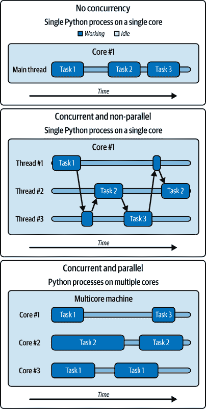
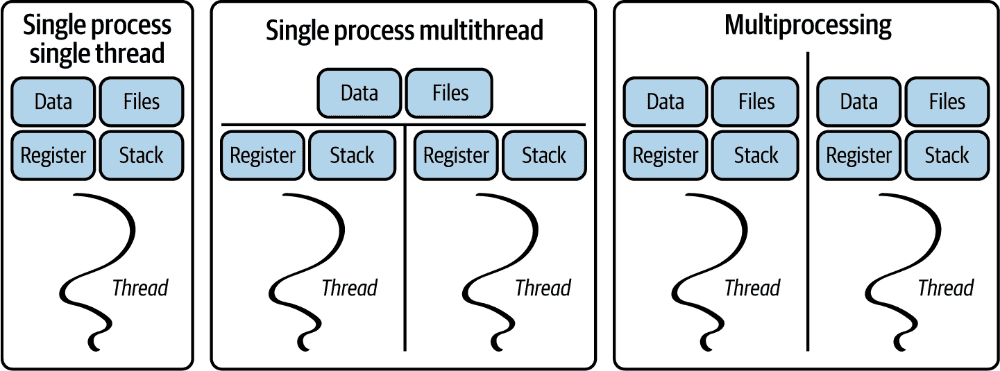
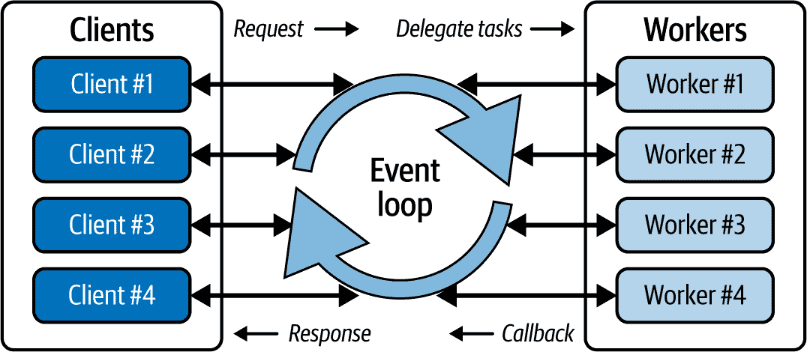

# 第五章\. 实现 IA 工作负载的同步

这项工作是用 AI 翻译的。我们很高兴收到你的反馈和评论：translation-feedback@oreilly.com

在本章中，你将了解异步编程在提高你的 GenAI 服务性能和可扩展性方面的作用和优势。你将学习如何管理与用户的并发交互，如何与外部系统（如数据库）交互，如何实现 RAG 以及如何读取网页以丰富模型的提示上下文。你将掌握有效管理受 I/O 和 CPU 限制的操作的技术，尤其是在处理外部服务或管理长期推理活动时。

我们还将探讨有效管理长期 AI 生成任务（包括使用 FastAPI 事件循环执行后台任务）的策略。

# 优化 GenAI 服务以支持更多用户

IA 工作负载是计算成本高昂的操作，可能会阻止你的 GenAI 服务处理更多并发请求。在大多数生产场景中，更多用户将使用你的应用程序。因此，你的服务需要以**同时**的方式处理请求，以便能够执行更多重叠活动。然而，如果你与 GenAI 模型和外部系统（如数据库、文件系统或互联网）交互，将会有一些可能阻塞服务器上其他活动执行的操作。可能中断程序执行流程的长时间操作被认为是**阻塞的**。

这些阻塞操作可以分为两种类型：

有限输入/输出（I/O）

当一个进程因为数据输入/输出操作而必须等待时，这些操作可能来自用户、文件、数据库、网络等。

有限计算

当一个进程因为 CPU 或 GPU 上的高计算强度操作而必须等待时。计算限制的程序通过执行密集计算将 CPU 或 GPU 核心推到极限，通常阻止其他活动的执行。¹ 一些例子包括数据处理、模型推理或训练、3D 渲染、执行模拟等。

你有一些策略可以用来服务更多用户：

系统优化

对于 I/O 相关的活动，如从数据库中检索数据、使用磁盘上的文件、网络请求或读取网页。

模型优化

对于受内存和计算限制的任务，如模型加载和推理

队列系统

为了处理长时间推断任务，以避免响应延迟。

在本节中，我们将更详细地分析每种策略。为了帮助你巩固学习，我们还将实施多种利用上述策略的功能：

+   构建一个*网页爬虫*，以从聊天中批量恢复和分析粘贴的 HTTP URL，以便你可以向你的 LLM 询问有关网页内容的详细信息。

+   将一个*检索增强生成（RAG）模块*添加到你的服务中，使用自托管数据库如`qdrant`，以便可以通过你的 LLM 服务加载和与你的文档进行对话。

+   添加一个*批量图像生成系统*，以便能够将图像生成工作作为后台活动执行

在向你展示如何构建上述功能之前，我们必须深入探讨*竞争*和*并行性*的主题，因为对这两个概念的理解将帮助你确定适用于你的用例的正确策略。

*并发性*指的是服务同时处理多个请求或活动的能力，而无需依次完成它们。在并发操作期间，多个活动的时间表可能会重叠，并且它们可以在不同的时间开始和结束。

在 Python 中，你可以通过在单个线程（通过异步编程）或多个线程之间（通过多线程）切换任务来在单个 CPU 核心上实现竞争。

使用更多核心，你还可以实现竞争的一个子集，即*并行性*，其中任务被分配给多个独立工作者（通过多进程处理），每个工作者在自己的隔离资源和独立进程中同时执行任务。

###### 注意

虽然预计很快就会从 Python 中移除 GIL，但在我们撰写本文时，多个线程同时通过任务工作是不可能的。因此，单核上的竞争可能会产生并行性的错觉，即使只有一个进程在完成所有工作。单个进程可以通过切换活动线程来执行多任务，以最大限度地减少 I/O 阻塞操作的时间。

只有通过更多的工作者（在多进程处理中）才能实现真正的并行性。

尽管竞争和并行性有很多相似之处，但它们并不是完全相同的概念。它们之间最大的区别是，竞争可以帮助你通过交叉执行来管理更多活动，这对于与 I/O 相关的活动很有用。相反，并行性涉及同时执行多个活动，通常在多核机器上，这对于与 CPU 相关的活动更有用。

您可以使用线程或异步编程（例如，在单核机器上的时间片）等方法来实现竞争，以实现任务的交错执行，从而产生同时执行的感觉。

图 5-1 展示了并发与并行之间的关系。


###### 图 5-1\. 竞争与并行

在大多数可扩展系统中，可以观察到竞争和并行。

在一个竞争系统中，你会看到餐厅老板接订单并烹饪汉堡，一次处理一个任务，有效地多任务处理从一项活动切换到另一项活动。在一个并行系统中，你会看到不同的员工同时接订单和烹饪汉堡。在这种情况下，不同的工人同时处理每个任务。

在单线程进程中没有多线程或异步编程，进程必须等待阻塞操作完成才能启动新的活动。没有实现多核并行的多进程，计算成本高昂的操作可能会阻止应用程序启动其他活动。

图 5-2 展示了非并发执行、无并行性的并发执行（单个核心）以及有并行性的并发执行（多个核心）之间的区别。

在 图 5-2 中展示的 Python 的三个执行模型如下：

Nessuna concomitanza (sincrona)

单个进程（在单个核心上）以顺序方式执行任务。

竞争且非并行

单个进程（在单个核心上）中的更多线程以并发方式管理任务，但由于 Python 的 GIL，它们不是并行执行的。

并发与并行

在多个核心上运行更多进程以并行执行任务，充分利用多核处理器以获得最大效率。



###### 图 5-2\. 有无并行性的竞争

在多进程模式下，每个进程都有自己的内存空间和资源，以独立于其他进程的方式完成活动。这种隔离可以使进程更加稳定，因为如果一个进程阻塞，不会影响到其他进程，但相对于共享相同内存空间的线程，它使得进程间的通信更加复杂，如图 图 5-3 所示。



###### 图 5-3\. 多线程和多进程中的资源共享

分布式工作负载通常使用一个管理过程来协调这些进程的执行和协作，以避免如数据损坏和工作重复等问题。一个多进程的好例子是使用负载均衡器来管理流量，该负载均衡器将流量分配到多个容器，每个容器都运行你的应用程序的一个实例。

多线程和异步编程可以减少 I/O 活动等待时间，因为处理器可以在等待 I/O 时执行其他任务。然而，对于需要大量计算的活动，如人工智能推理，它们并不适用，因为进程正忙于计算某些结果。因此，为了服务于大型自托管 GenAI 模型的多用户，需要通过多进程或使用模型算法优化（通过专门进行模型推理的服务器如 vLLM）来扩展服务。

当你与慢速模型工作时的第一个直觉可能是采用并行化，通过在单个机器上创建多个 FastAPI 服务实例（多进程）来并行处理请求。

不幸的是，在单独进程中运行的更多工作者将无法访问共享内存空间。因此，你无法在 FastAPI 应用程序的不同实例之间共享如加载到内存中的 GenAI 模型这样的工件。不幸的是，你还需要加载一个新的模型实例，这将显著消耗你的硬件资源。这是因为 FastAPI 是一个通用的 Web 服务器，它没有原生优化 GenAI 模型服务。

解决方案不是并行本身，而是采用外部模型服务的策略，如第三章 Capitolo 3 中所述。

你唯一可以将人工智能推理工作负载视为 I/O 受限而不是计算受限的情况是当你依赖第三方 AI 提供商的 API（例如，OpenAI API）时。在这种情况下，你通过网络请求将计算任务卸载给模型提供商。

从你的角度来看，人工智能推理的工作负载通过网络请求被绑定到 I/O，从而允许通过时间片使用竞争。第三方服务提供商必须关注扩展自己的服务以管理模型推理——这些推理受限于计算——通过自己的硬件资源。

你可以使用专门的服务器，如 vLLM、Ray Serve 或 NVIDIA Triton，将大型 GenAI 模型（如 LLM）的服务和推理外部化。

在本章后面，我将解释这些服务器如何通过在模型推理过程中最大化计算操作的效率，同时减少数据生成过程中的模型内存占用。

为了帮助您消化到目前为止所讨论的内容，请查看表 5-1 中的竞争策略比较表，以了解何时以及为什么使用它们。

表 5-1\. 竞争策略比较

| 策略 | 特点 | 挑战 | 用例 |
| --- | --- | --- | --- |
| 无并发（同步） |

+   简单、可读性强、易于理解的代码，便于调试

+   单个核心和 CPU 线程

|

+   由于 I/O 或 CPU 阻塞操作导致执行进程的长时间等待。

+   不能同时服务多个用户

|

+   单用户应用程序，其中用户可以等待活动完成

+   很少使用的服务或应用程序

|

| 异步 I/O（异步） |
| --- |

+   单个核心和 CPU 线程

+   Python 进程内部由事件循环管理的多任务

+   线程安全，因为 Python 进程管理任务

+   最大化 CPU 利用率

+   比多线程和多进程在 I/O 活动上更快

|

+   在代码中实现更困难，并且可能使调试更困难。

+   需要使用 Async IO 功能的库和依赖项

+   容易犯错误，这些错误会阻塞主进程（和事件循环）

| 阻塞 I/O 的应用 |
| --- |
| 多线程 |

+   单个 CPU 核心但同一进程内有更多线程

+   线程共享数据和资源

+   在代码中实现比 I/O 异步更简单

+   由操作系统协调的线程多任务处理

|

+   难以阻塞每个线程的资源以避免线程安全问题，这可能导致不可复现的 bug 和数据损坏。

+   线程可以无限期地相互阻塞（死锁）

+   并发访问资源可能导致不一致的结果（竞争条件）

+   如果一个线程垄断了线程（饥饿），则可以撤销其资源

+   线程的创建和销毁在计算上很昂贵

| 阻塞 I/O 的应用或服务 |
| --- |
| 多进程 |

+   在多个 CPU 核心上运行的多个进程

+   每个进程都被分配了一个 CPU 核心和隔离的资源。

+   可以通过使用 Celery 等工具将工作分配到 CPU 核心，并由协调进程管理

|

+   在进程之间共享硬件资源和对象，如大型 AI 模型或数据，可能很复杂，需要进程间通信（IPC）机制或专用的共享内存。

+   维护多个隔离进程的同步很困难

+   创建和销毁进程在计算上是昂贵的

|

+   具有计算任务界定和阻塞的应用或服务

+   可以独立执行的部分的“分而治之”类型活动。

+   将工作负载或计算请求分布到 CPU 的多个核心上

|

现在我们已经探索了各种并发策略，让我们继续通过异步编程来改进你的服务，以有效地管理与 I/O 相关的操作。随后我们将专注于与计算相关的活动的优化，特别是通过专用服务器进行模型推断。

# 使用异步编程优化 I/O 活动

在本节中，我们将探讨使用异步编程来避免在人工智能工作负载期间，由 I/O 界定活动阻塞服务器的主要进程。你还将了解允许在 Python 中编写异步应用的`asyncio`框架。

## 同步执行与异步执行（Async）

什么是异步应用？为了回答这个问题，我们将同步程序和异步程序进行比较。

当任务按顺序执行，每个任务在开始之前等待前一个任务完成时，一个应用程序被认为是*同步*的。对于很少执行且仅需要几秒钟即可处理的应用程序，同步代码很少引起问题，并且可以使实现更快、更简单。然而，如果你需要并发并且想要最大化每个核心的服务效率，你的服务必须在多任务处理中工作，而不必等待阻塞操作完成。这就是异步（async）并发实现可以帮助你的地方。

我们来看一些同步和异步函数的例子，以了解异步代码如何提高性能。在两个例子中，我将使用 sleep 来模拟 I/O 阻塞操作，但你可以想象在现实场景中执行的其他 I/O 操作。

esempio 5-1 示例展示了使用阻塞函数`time.sleep()`模拟 I/O 阻塞操作的同步代码示例。

##### 示例 5-1\. 同步执行

```py
import time

def task():
    print("Start of sync task")
    time.sleep(5) 
    print("After 5 seconds of sleep")

start = time.time()
for _ in range(3): 
    task()
duration = time.time() - start
print(f"\nProcess completed in: {duration} seconds")
"""
Start of sync task
After 5 seconds of sleep
Start of sync task
After 5 seconds of sleep
Start of sync task
After 5 seconds of sleep

Process completed in: 15.014271020889282 seconds
"""
```


使用`sleep()`来模拟 I/O 阻塞操作，例如发送网络请求。


连续三次调用`task()`，顺序执行。循环模拟了连续发送多个网络请求。

在 Esempio 5-1 中，三次调用`task()`需要 15 秒，因为 Python 等待阻塞操作`sleep()`完成。

为了在 Python 中开发异步程序，你可以使用 `asyncio` 包，它是 Python 3.5 及更高版本标准库的一部分。使用 `asyncio`，异步代码与同步顺序代码类似，但增加了 `async` 和 `await` 关键字来执行非阻塞 I/O 操作。

示例 5-2 展示了如何使用 `async` 和 `await` 关键字与 `asyncio` 一起异步执行 示例 5-1。

##### 示例 5-2\. 异步执行

```py
import time
import asyncio

async def task(): 
    print("Start of async task")
    await asyncio.sleep(5) 
    print("Task resumed after 5 seconds")

async def spawn_tasks():
    await asyncio.gather(task(), task(), task()) 

start = time.time()
asyncio.run(spawn_tasks()) 
duration = time.time() - start

print(f"\nProcess completed in: {duration} seconds")
"""
Start of async task
Start of async task
Start of async task
Task resumed after 5 seconds
Task resumed after 5 seconds
Task resumed after 5 seconds

Process completed in: 5.0057971477508545 seconds  """
```

[(#co_achieving_concurrency_in_ai_workloads_CO2-1)]

实现一个 `task` 协程，在阻塞操作期间将控制权交给事件循环。

[(#co_achieving_concurrency_in_ai_workloads_CO2-2)]

五秒的非阻塞 sleep 通知事件循环在等待期间执行其他活动。

[(#co_achieving_concurrency_in_ai_workloads_CO2-3)]

使用 `asyncio.create_task` 生成要连接（或合并）并使用 `asyncio.gather` 同时执行的 task 实例。

[(#co_achieving_concurrency_in_ai_workloads_CO2-4)]

使用 `asyncio.run()` 方法创建事件循环来编程异步活动。

[(#co_achieving_concurrency_in_ai_workloads_CO2-5)]

与同步示例相比，执行时间减少了 1/3，因为这次 Python 进程没有被阻塞。

执行 示例 5-2 后，你会注意到 `task()` 函数被同时调用了三次。另一方面，示例 5-1 中的代码以顺序方式三次调用 `task()` 函数。异步函数是在 `asyncio` 的事件循环中执行的，它负责在不等待的情况下执行代码。

在任何异步代码中，`await` 关键字通知 Python 哪些是阻塞 I/O 操作，以便它们可以以非阻塞方式执行（即可以在不阻塞主进程的情况下执行）。由于知道哪些操作是阻塞的，Python 可以在等待这些操作完成时去做其他事情。

示例 5-3 展示了如何使用 `async` 和 `await` 关键字来声明和执行异步函数。

##### 示例 5-3\. 如何使用 `async` 和 `await` 关键字

```py
import asyncio

async def main():
    print("Before sleeping")
    await asyncio.sleep(3) 
    print("After sleeping for 3 seconds")

asyncio.run(main()) 

"""
Before sleeping
After sleeping for 3 seconds  """
```

[(#co_achieving_concurrency_in_ai_workloads_CO3-1)]

通过模拟 `asyncio.sleep()` 的非阻塞 I/O 操作 `await`，让 Python 在等待期间执行其他任务。

[(#co_achieving_concurrency_in_ai_workloads_CO3-2)]

你必须在 `asyncio.run()` 内部调用 `main()` 来执行它，因为这是一个异步函数，否则它将不会执行并返回一个 *协程* 对象。我将在稍后处理协程。


如果执行代码，第二个指令将在第一个指令后 3 秒打印出来。在这种情况下，由于没有其他操作要执行，除了 sleep，Python 会空闲直到 sleep 操作完成。

示例 5-3，我使用了 sleep 来模拟 I/O 阻塞操作，例如网络请求。

###### 注意

你只能在用 `async def` 声明的函数中使用 `await` 关键字。在 `async` 函数外部使用 `await` 将在 Python 中引发 `SyntaxError`。另一个常见的陷阱是在 `async` 函数中使用阻塞的同步代码，这无意中阻止了 Python 在等待时执行其他活动。

现在你已经理解了在异步程序中，为了避免主进程被阻塞，Python 一旦发生阻塞操作，就会从一个函数切换到另一个函数。现在你可能想知道：

+   Python 如何利用 `asyncio` 来暂停和恢复函数？

+   Python 的 `asyncio` 使用什么机制在函数之间切换，同时不会忘记挂起的函数？

+   如何暂停或恢复函数而不会丢失其状态？

为了回答上述问题，我们深入探讨 `asyncio` 的基础机制，因为对这些问题的理解将极大地帮助你调试在服务中运行的异步代码。

`asyncio` 的核心是一个称为 *事件循环* 的一等对象，负责高效地管理 I/O 事件、系统事件和应用程序上下文变化。

图 5-4 展示了 `asyncio` 的事件循环如何对 Python 中的任务进行编排。



###### 图 5-4\. 异步 I/O 事件循环

事件循环可以比作一个 `while True` 循环，它观察 Python 进程中由 *协程函数* 发出的事件或消息，并将事件分配给其他函数，以便在 I/O 阻塞操作完成时从一个函数切换到另一个函数。这种编排允许其他函数异步执行，而不会中断。

## 使用模型提供商的 API 进行异步编程

我之前展示的所有三个示例都被视为异步编程的“Hello World”示例。现在，让我们分析一个与创建 GenAI 服务相关的实际场景，在这种情况下，需要使用模型提供商的 API，如 OpenAI、Anthropic 或 Mistral，因为单独服务 LLMs 可能会更昂贵。

此外，如果你在 第三章 中创建的生成端点上执行压力测试，发送大量请求，你会在每个请求被处理之前注意到长时间的等待。这是因为你在同一个 Python 进程和同一个 CPU 核心上预载和托管了模型。当你发送第一个请求时，整个服务器会阻塞，直到推理工作完成。由于推理期间 CPU 处于最大工作状态，推理/生成过程是受 CPU 限制的操作。然而，这并不一定必须如此。

当你使用模型提供者的 API 时，你不再需要担心与 CPU 相关的 AI 工作负载，因为这些工作负载现在与 I/O 相关。因此，了解如何利用异步编程来同时与模型提供者的 API 交互是有意义的。

好消息是，API 的所有者通常会发布同步和异步的 *客户端* 和 *软件开发工具包* (SDK)，以减少与他们的端点交互所需的工作量。

###### 注意

如果你需要向其他外部服务发出请求、从数据库中检索数据或从文件中读取内容，你将向进程添加其他阻塞 I/O 活动。如果不使用异步编程，这些阻塞活动可能会迫使服务器保持等待状态。

然而，任何同步代码都可以通过使用 [进程或线程池执行器](https://oreil.ly/hIDNI) 来异步化，以避免在事件循环中执行活动。相反，将在单独的进程或线程上执行异步活动，以避免阻塞事件循环。

你也可以通过检查库的文档或源代码来查找关键字 `async` 或 `await` 的提及，以验证是否存在异步支持。否则，你可以尝试检查该工具是否可以在一个异步函数中使用，而不会在对其使用 `await` 时引发 `TypeError`。

如果一个工具，例如数据库库，只有同步实现，那么你不能使用该工具实现异步。解决方案是将工具转换为异步等效工具，以便可以使用 `async` 和 `await` 关键字使用它。

在 示例 5-4 中，通过 OpenAI 客户端以同步和异步方式与 OpenAI GPT-3.5 API 交互，以了解两种方法之间的性能差异。

###### 注意

需要安装 `openai` 库：

```py
$ pip install openai
```

```py`##### Esempio 5-4\. Confronto tra client OpenAI sincrono e asincrono    ``` 导入 os 模块，从 fastapi 模块导入 FastAPI、Body，从 openai 模块导入 OpenAI、AsyncOpenAI。创建 FastAPI 应用实例 app，同步客户端 sync_client 和异步客户端 async_client。@app.post("/sync") 定义了一个同步生成文本的函数 sync_generate_text，它接收一个提示字符串 prompt，并使用 OpenAI 的同步客户端创建聊天完成，返回完成的选择的第一个消息的内容。@app.post("/async") 定义了一个异步生成文本的函数 async_generate_text，它同样接收一个提示字符串 prompt，并使用 OpenAI 的异步客户端创建聊天完成，返回完成的选择的第一个消息的内容。```py    La differenza tra i client sync e async è che con la versione async,FastAPI può iniziare a elaborare gli input dell'utente in parallelo senza attendere la risposta dell'API OpenAI per l'input precedente.    Sfruttando il codice asincrono, puoi ottenere un enorme aumento del throughput e scalare un volume maggiore di richieste simultanee. Tuttavia, devi fare attenzione quando scrivi codice asincrono (async).    Ecco alcune insidie e problemi comuni che potresti incontrare con il codice async:    *   La comprensione e il debug degli errori possono essere più complessi a causa del flusso di esecuzione non lineare dei task concorrenti.           *   Alcune librerie, come `aiohttp`, richiedono gestori di contesto asincroni nidificati per una corretta implementazione. Questo può creare confusione molto velocemente.           *   Mischiare codice asincrono e sincrono può annullare i vantaggi in termini di prestazioni, ad esempio se dimentichi di contrassegnare le funzioni con le parole chiave `async` e `await`.           *   Il mancato utilizzo di strumenti e librerie compatibili con l'asincronia può anche annullare i vantaggi in termini di prestazioni; ad esempio, utilizzare il pacchetto `requests` invece di `aiohttp` per effettuare chiamate API asincrone.           *   Dimenticare di attendere le coroutine all'interno di una funzione asincrona o attendere le non-coroutine può portare a un comportamento inaspettato. Tutte le parole chiave `async` devono essere seguite da un `await`.           *   Una gestione non corretta delle risorse (ad esempio, connessioni API/database aperte o buffer di file) può causare perdite di memoria che bloccano il computer. Puoi anche perdere memoria se non limiti il numero di operazioni concorrenti nel codice async.           *   Potresti anche imbatterti in problemi di concorrenza e di condizioni di gara in cui il principio di thread-safety viene violato, causando deadlock sulle risorse con conseguentecorruzione dei dati.              Questo elenco non è esaustivo e, come puoi vedere, ci sono diverse insidie nell'utilizzo della programmazione asincrona. Per questo motivo, ti consiglio di iniziare a scrivere programmi sincroni per capire il flusso e la logica di base del tuo codice, prima di affrontare le complessità della migrazione a un'implementazione asincrona.````  ```py```` ## FastAPI 的事件循环和线程池    FastAPI 能够处理同步和异步的阻塞操作，通过在其 *线程池* 中执行同步处理程序，以确保阻塞操作不会中断事件循环中的任务执行。    正如我在 第二章 中所说的，FastAPI 通过 Starlette 框架与 ASGI 框架一起工作。如果不是这样，服务器将以同步方式执行，因此您需要等待每个进程完成才能服务下一个请求。然而，使用 ASGI，FastAPI 服务器支持通过多线程（通过线程池）和异步编程（通过事件循环）来并行处理多个请求，从而避免阻塞主服务器进程。    FastAPI 通过在应用程序启动时创建线程集合来创建线程池，以减少在运行时创建线程的负担。4。随后，它将后台任务和同步工作负载委托给线程池，以避免事件循环被同步处理程序中的阻塞操作所阻塞。事件循环也被称为 FastAPI 服务器的线程主循环，负责处理请求。    正如我之前所说的，事件循环是每个基于 `asyncio` 的应用程序的核心组件，包括实现并发的 FastAPI。事件循环执行异步活动和回调，包括执行网络 I/O 操作和执行子进程。在 FastAPI 中，事件循环还负责协调异步请求的处理。    如果可能的话，您应该在事件循环中（通过异步编程）执行处理程序，因为这可能比在线程池中（通过多线程）执行更有效。这是因为线程池中的每个线程在执行任何代码字节之前都必须获取 GIL，这需要一定的计算开销。    想象一下，多个用户同时使用你的 FastAPI 服务的 OpenAI GPT-3.5 同步和异步处理程序（如 示例 5-4 所示）。FastAPI 将在事件循环中执行异步处理程序的请求，因为该处理程序使用了一个非阻塞的 OpenAI 客户端。另一方面，FastAPI 必须将同步处理程序的请求委托给线程池，以保护事件循环免受阻塞。由于将请求（到线程）和在线程池中从一个线程切换到另一个线程都需要更多的工作，因此同步请求的完成时间将比它们的异步对应物晚。    ###### 注意    请记住，所有这些工作——处理同步和异步处理程序的请求——都是在同一进程的 FastAPI Python 单个 CPU 内部执行的。    这是为了将 CPU 等待 OpenAI API 响应的空闲时间降到最低。    性能差异在 图 5-5 中显示。    ###### 图 5-5\. 多线程和 Async IO 如何处理 I/O 阻塞操作    图 5-5 显示，对于受 I/O 限制的工作负载，异步实现更快，如果您需要并发，则应首选此方法。然而，即使必须与同步的 OpenAI 客户端一起工作，FastAPI 仍然能够很好地服务多个并发请求。只需简单地将同步 API 调用发送到线程池中的线程即可实现用户层面的并发。这就是为什么 FastAPI 的官方文档告诉您不要过于担心将您的处理程序函数声明为 `async def` 或 `def`。    然而，请注意，当您使用 `async def` 声明处理程序时，FastAPI 信任您只执行非阻塞操作。当您打破这种信任并在 `async` 路由中执行阻塞操作时，事件循环将被阻塞，并且无法继续执行活动，直到阻塞操作完成。    ## 服务器主进程的阻塞    当您使用 `async` 关键字定义您的函数时，请确保在函数内部也使用 `await` 关键字，并且您使用的任何包的依赖项都不是同步的。    如果处理程序的实现是同步的，请避免将路由处理程序函数声明为 `async`。否则，相关的路由处理程序请求将阻塞主服务器处理其他请求，直到阻塞操作完成。无论阻塞操作是关于 I/O 还是计算。因此，任何数据库或人工智能模型的调用都可能导致阻塞，如果您不小心的话。    这是一个很容易犯的错误。例如，您可以在声明的异步处理程序中使用同步依赖项，如 示例 5-5 所示。    ##### 示例 5-5\. FastAPI 中异步处理程序的错误实现    ```py import os from fastapi import FastAPI from openai import AsyncOpenAI, OpenAI  app = FastAPI()  @app.get("/block") async def block_server_controller():     completion = sync_client.chat.completions.create(...)      return completion.choices[0].message.content  @app.get("/slow") def slow_text_generator():     completion = sync_client.chat.completions.create(...)      return completion.choices[0].message.content  @app.get("/fast") async def fast_text_generator():     completion = await async_client.chat.completions.create(...)      return completion.choices[0].message.content ```          阻塞 I/O 操作以获取 ChatGPT API 的响应。由于路由处理程序被标记为异步，FastAPI 信任我们不执行阻塞操作，但由于我们执行了，请求将阻塞事件循环（服务器的主线程）。其他请求现在将阻塞，直到当前请求被处理。            一个简单的同步路由处理程序，具有阻塞操作，但没有利用异步功能。同步请求被委托给线程池以在后台执行，这样就不会阻塞主服务器。            一个非阻塞的异步路由。      请求不会阻塞主线程，也不需要转移到线程池。因此，FastAPI 的事件循环可以非常快速地使用 OpenAI async 客户端处理请求。    现在，您应该对在您的 FastAPI 服务中实现需要执行 I/O 阻塞任务的新功能感到更加自在了。    为了帮助您巩固对 I/O 并发概念的理解，在接下来的几节中，您将构建几个新的功能，这些功能将使用您的 FastAPI 服务中的并发。这些功能包括：    与 Web 交谈      构建和集成一个网络爬虫模块，允许您通过提供 HTTP URL 来向您的自托管 LLM 提问网站内容。      与文档交谈      构建和集成一个 RAG 模块来处理数据库中的文档。向量数据库以支持高效相似性搜索的方式存储数据。然后，您可以使用语义搜索，它包括对查询的理解，来使用您的 LLM 与上传的文档进行交互。      这两个项目都将使您获得与网站、数据库和文件系统等外部系统进行异步交互的实践经验。    ## 项目：与 Web 交谈（Web Scraper）    企业通常在其内部托管一系列网页，用于手册、流程和其他文档，形式为 HTML 页面。对于较长的页面，您的用户可能希望在提出问题时提供 URL，并期望 LLM 恢复并读取内容。这就是集成网络爬虫可能很有用的地方。    为您的自托管 LLM 创建网络爬虫有多种方法。根据您的用例，您可以使用以下方法的组合：    *   将网页作为 HTML 恢复，并将原始的 HTML 内容（或内部文本）发送到您的 LLM 以分析所需格式的内容。           *   使用 *网络爬虫框架*，如 `BeautifulSoup` 和 `ScraPy`，在恢复网页后分析网页内容。           *   使用 *无头浏览器*，如 Selenium 和 Microsoft Playwright，在页面节点之间动态导航并分析内容。无头浏览器非常适合导航单页应用程序（SPA）。              ###### 注意    您或您的用户应避免使用由 LLM 驱动的网络爬虫进行非法目的。在从 URL 提取内容之前，请确保您有授权：    *   检查每个网站的条款和条件，特别是如果涉及网络爬虫。           *   当可能时使用 API。           *   如果不确定，请直接向网站所有者请求许可。              对于这个迷你项目，我们将仅恢复 HTML 页面的内部文本并将其发送到我们的 LLM，因为生产就绪的爬虫实现可能成为一本独立的书籍。    构建简单的异步爬虫的过程如下：    1.  开发一个函数，使用正则表达式在用户的提示中匹配 URL 模式。           2.  如果找到，则对提供的 URL 列表执行循环，并异步地恢复页面。我们将使用名为 `aiohttp` 的异步 HTTP 库而不是 `requests`，因为 `requests` 只能执行同步网络请求。           3.  开发一个解析函数，从恢复的 HTML 中提取文本内容。           4.  分析的页面内容与用户的原始提示一起发送到 LLM。              L['示例 5-6](#web_scraper) 展示了如何实现上述步骤。    ###### 注意    要运行此示例，需要安装一些额外的依赖项：    ```py $ pip install beautifulsoup lxml aiohttp ```   ```py`##### Esempio 5-6\. Creazione di uno scraper web asincrono    ``` # scraper.py  import asyncio import re  import aiohttp from bs4 import BeautifulSoup from loguru import logger  def extract_urls(text: str) -> list[str]:     url_pattern = r"(?P<url>https?:\/\/[^\s]+)"      urls = re.findall(url_pattern, text)      return urls   def parse_inner_text(html_string: str) -> str:     soup = BeautifulSoup(html_string, "lxml")     if content := soup.find("div", id="bodyContent"):          return content.get_text()     logger.warning("Could not parse the HTML content")     return ""   async def fetch(session: aiohttp.ClientSession, url: str) -> str:     async with session.get(url) as response:          html_string = await response.text()         return parse_inner_text(html_string)   async def fetch_all(urls: list[str]) -> str:     async with aiohttp.ClientSession() as session:          results = await asyncio.gather(             *[fetch(session, url) for url in urls], return_exceptions=True         )     success_results = [result for result in results if isinstance(result, str)]     if len(results) != len(success_results):          logger.warning("Some URLs could not be fetched")     return " ".join(success_results) ```py          Un semplice schema regex che raccoglie gli URL in un gruppo denominato `url`e che corrisponde ai protocolli `http` e `https`. Per semplicità, questo schema corrisponde a URL definiti in modo più generico e non convalida la struttura di un nome di dominio o di un percorso, né tiene conto delle stringhe di query o delle ancore in un URL.            Trova tutte le corrispondenze non sovrapposte del modello regex nel testo.            Utilizza il pacchetto `bs4` Beautiful Soup per analizzare la stringa HTML. Nelle pagine di Wikipedia, il contenuto dell'articolo è annidato all'interno di un contenitore `div` con `id="bodyContent"`, quindi la logica di parsing presuppone che vengano passati solo gli URL di Wikipedia. Puoi cambiare questa logica per altri URL o semplicemente utilizzare `soup.getText()`per prendere qualsiasi contenuto testuale annidato all'interno dell'HTML. Tuttavia, tieni presente che se analizzi l'HTML grezzo in questo modo, ci sarà molto rumore nel contenuto analizzato, il che può confondere LLM.            Data una sessione `aiohttp` e un URL, esegui una richiesta asincrona `get`. Crea un gestore di contesto asincrono `response` e `await` la risposta all'interno di questo gestore di contesto.            Dato un elenco di URL, crea un gestore di contesto asincrono della sessione client per eseguire in modo asincrono più chiamate di recupero. Poiché `fetch()` è una funzione coroutine (cioè utilizza la parola chiave `await` ),`fetch_all()` dovrà eseguire più coroutine `fetch()` all'interno di `asyncio.gather()` da programmare per l'esecuzione asincrona sul ciclo degli eventi.            Controlla che tutti gli URL siano stati recuperati con successo e, in caso contrario, emette un avviso.      Ora hai le funzioni di scraper di cui hai bisogno per implementare la funzione di web scraping nel tuo endpoint `/generate/text`.    Successivamente, aggiorna il gestore del testo per utilizzare le funzioni di scraper attraverso una dipendenza in modo asincrono, come mostrato nell'Esempio 5-7.    ##### Esempio 5-7\. Iniettare la funzionalità di web scraper come dipendenza nel gestore FastAPI LLM    ``` # dependencies.py  from fastapi import Body from loguru import logger  from schemas import TextModelRequest from scraper import extract_urls, fetch_all  async def get_urls_content(body: TextModelRequest = Body(...)) -> str:      urls = extract_urls(body.prompt)     if urls:         try:             urls_content = await fetch_all(urls)             return urls_content         except Exception as e:             logger.warning(f"Failed to fetch one or several URls - Error: {e}")     return ""  # main.py  from fastapi import Body, Depends, Request from dependencies import construct_prompt from schemas import TextModelResponse  @app.post("/generate/text", response_model_exclude_defaults=True)  async def serve_text_to_text_controller(     request: Request,     body: TextModelRequest = Body(...),     urls_content: str = Depends(get_urls_content)  ) -> TextModelResponse:     ... # rest of controller logic     prompt = body.prompt + " " + urls_content     output = generate_text(models["text"], prompt, body.temperature)     return TextModelResponse(content=output, ip=request.client.host) ```py          Implementa una dipendenza `get_urls_content` FastAPI che ottiene un prompt dell'utente dal corpo della richiesta e trova tutti gli URL. Restituisce quindi il contenuto di tutti gli URL come una lunga stringa. La dipendenza ha una gestione delle eccezioni integrata per gestire eventuali errori di I/O restituendo una stringa vuota e registrando un avviso sul server.            Quando utilizzi `aiohttp` all'interno di FastAPI, non devi gestire tu stesso il ciclo degli eventi perché FastAPI, in quanto framework asincrono, gestisce il ciclo degli eventi. Puoi definire il tuo endpoint come una funzione asincrona e utilizzare `aiohttp` per effettuare richieste HTTP asincrone all'interno del gestore o tramite una dipendenza come in questo esempio.            Inietta i risultati della chiamata alla dipendenza `get_urls_content` nel gestore tramite la classe `Depends` di FastAPI. L'utilizzo di una dipendenza FastAPI ha permesso di mantenere la logica del controllore piccola, pulita e leggibile.      Ora esegui il client Streamlit nel browser e prova la tua nuova funzione. LaFigura 5-6 mostra il mio esperimento.    ###### Figura 5-6\. Richiesta al modello TinyLlama self-hosted di riassumere un articolo di Wikipedia    Congratulazioni! Hai imparato a costruire un semplice scraper web non bloccante per lavorare con il tuo LLM. In questo mini-progetto, hai sfruttato il pacchetto `re` per abbinare i modelli di URL nel prompt dell'utente e poi hai usato la libreria `aiohttp` per recuperare in modo asincrono più pagine contemporaneamente. Hai poi usato il pacchetto `BeautifulSoup` per analizzare il contenuto degli articoli di Wikipedia prendendo il contenuto testuale del contenitore `div` con l'ID di `bodyContent` all'interno della stringa HTML recuperata. Per altri siti web o per le pagine interne dell'azienda, puoi sempre modificare la logica di parsing per ottenere un parsing appropriato. Infine, hai avvolto l'intera logica di scraping all'interno di una dipendenza FastAPI con gestione delle eccezioni integrata per sfruttare la dependency injection mentre aggiornavi il gestore del modello di testo.    Tieni presente che il tuo scraper non può gestire pagine complesse con layout dinamici renderizzati dal server. In questi casi, puoi aggiungere un browser headless al tuo web scraper per navigare nelle pagine dinamiche.    Inoltre, recuperare i contenuti di siti esterni sarà una sfida, poiché la maggior parte dei siti può implementare protezioni anti-scraping come il *blocco dell'IP* o i *CAPTCHA* come deterrenti comuni. Mantenere la *qualità* e la *coerenza* *dei dati* con i siti esterni è anche una sfida continua, poiché potrebbe essere necessario aggiornare regolarmente gli script di scraping per garantire un'estrazione accurata e affidabile.    Ora dovresti sentirti più a tuo agio nella costruzione di servizi alimentati da GenAI che devono interagire con il web facendo richieste di rete asincrone.    Successivamente, esamineremo altre interazioni asincrone di I/O, come quelle con i database e il filesystem, costruendo una funzione *talk to your documents*.    Questa funzionalità permette agli utenti di caricare documenti attraverso l'interfaccia Streamlit del tuo servizio. Il contenuto dei documenti caricati viene poi estratto, elaborato e salvato in un database. Successivamente, durante le interazioni dell'utente con il LLM, un sistema di recupero asincrono recupera contenuti semanticamente rilevanti dal database, che vengono poi utilizzati per aumentare il contesto fornito al LLM.    Questo processo è denominato RAG, che verrà sviluppato come modulo per il tuo LLM.````  ```py``` ## 项目：与文档交谈（RAG）    在这个项目中，我们将向您的 GenAI 服务中插入一个 RAG 模块，让您体验与数据库和文件系统等外部系统进行异步交互。    您可能想知道 RAG 模块的目的及其必要性。RAG 是一种技术，用于通过使用针对高知识密集型活动定制的自定义数据源来增加 LLM 提示的上下文。5。这是一种有效的技术，可以在不进行复杂且昂贵的 LLM 训练的情况下，基于数据中的事实来建立 LLM 的响应。    组织机构渴望使用自己的 LLM 实现 RAG，因为它允许员工通过 LLM 访问内部巨大的知识库。通过 RAG，企业期望内部知识库、系统和程序
