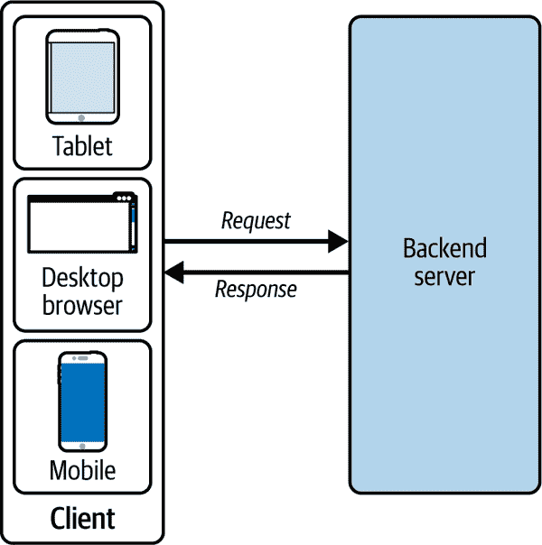
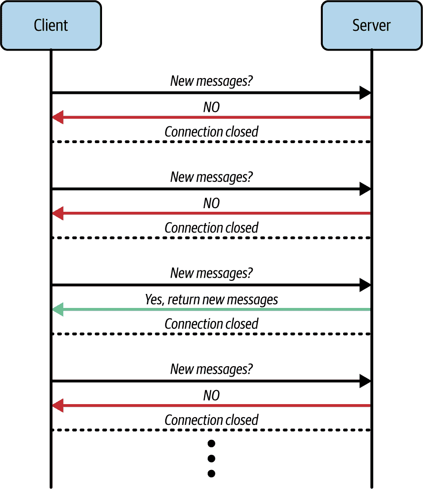
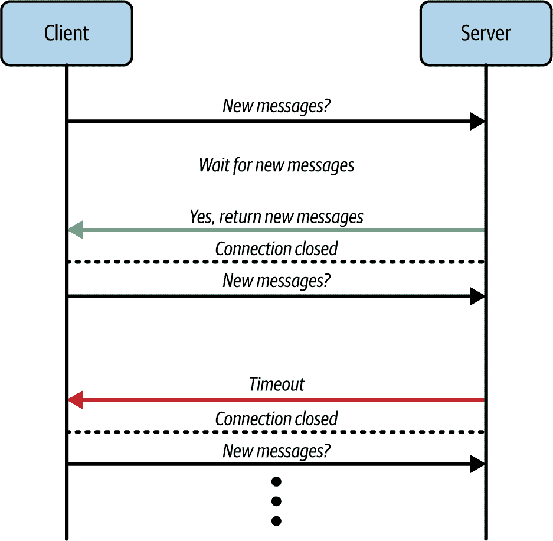
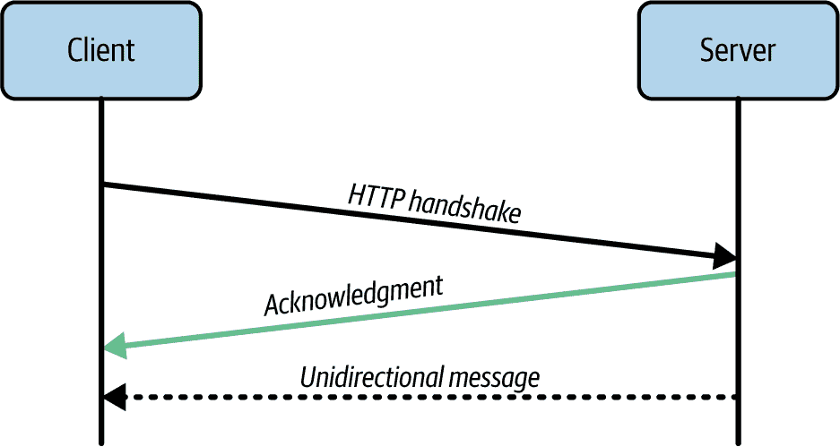
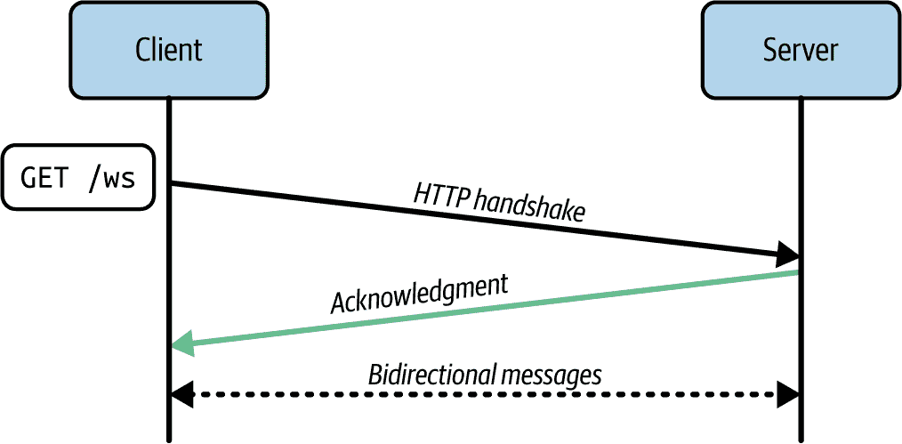
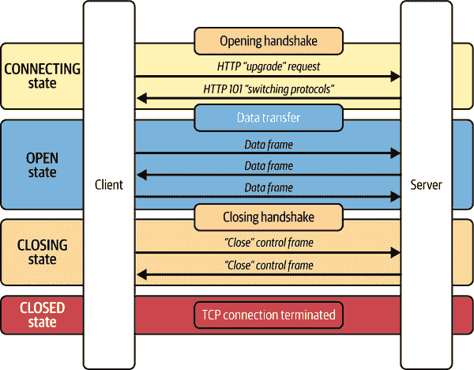
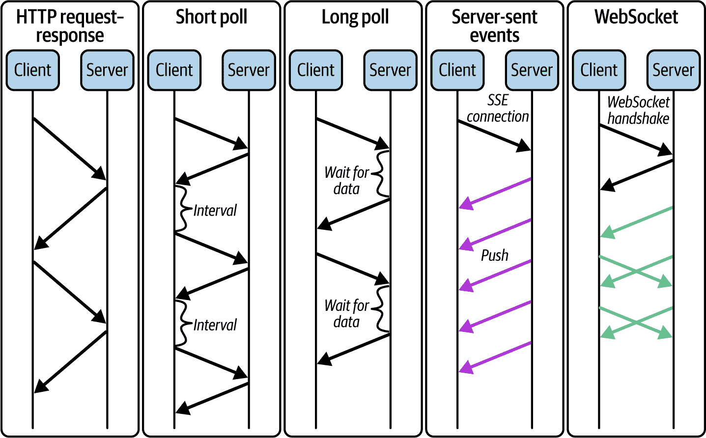
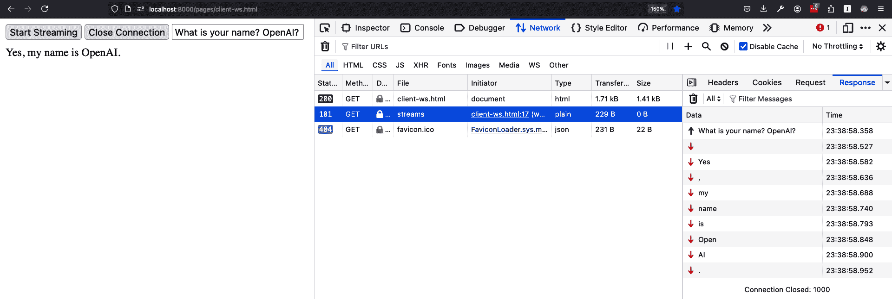

# 第六章. 使用生成模型进行实时通信

本章将探讨 AI 流式工作负载，如聊天机器人，详细介绍了实时通信技术如 SSE 和 WebSocket 的使用。你将了解这些技术的区别以及如何通过构建实时文本到文本交互的端点来实现模型流。

# 网络通信机制

在上一章中，你学习了通过利用异步编程、后台任务和连续批处理来实现 AI 工作流程的并发性。通过并发，你的服务在多个用户同时访问应用程序时能够更好地应对增加的需求。并发解决了允许同时用户访问服务的问题，并有助于减少等待时间，但 AI 数据生成仍然是一个资源密集和时间消耗的任务。

到目前为止，你一直在使用传统的 HTTP 通信来构建端点，其中客户端向服务器发送请求。网络服务器处理传入的请求并通过 HTTP 消息进行响应。

图 6-1 展示了客户端-服务器架构。



###### 图 6-1. 客户端-服务器架构（来源：[scaleyourapp.com](https://scaleyourapp.com))

由于 HTTP 协议是无状态的，服务器将每个传入请求视为完全独立且与其他请求无关。这意味着来自不同客户端的多个传入请求不会影响服务器对每个请求的响应方式。例如，在一个不使用数据库的对话式 AI 服务中，每个请求可能提供完整的对话历史并从服务器接收正确的响应。

*HTTP 请求-响应*模型是一种广泛采用的 API 设计模式，因其简单性而被广泛应用于网络。然而，当客户端或服务器需要实时更新时，这种方法就变得不适用了。

在标准的 HTTP 请求-响应模型中，你的服务通常在完全处理完用户的请求后响应。然而，如果数据生成过程漫长且缓慢，用户将等待很长时间，随后会一次性接收到大量信息。想象一下与一个需要几分钟才能回复的机器人聊天，一旦它回复，你会看到大量的文本信息。

或者，如果你在生成数据的同时将其提供给客户端，而不是等到整个生成过程完成，你可以减少长时间延迟，并以可消化的块形式提供信息。这种方法不仅提升了用户体验，而且在处理用户请求的过程中保持了用户的参与度。

在某些情况下，实现实时功能可能会过度设计，并增加开发负担。例如，一些开源模型或 API 缺乏实时生成能力。此外，添加数据流端点可能会在服务器和客户端两方面增加系统的复杂性。这意味着需要以不同的方式处理异常，并管理对数据流端点的并发连接，以避免内存泄漏。如果客户端在流传输过程中断开连接，服务器和客户端之间可能会出现数据丢失或状态漂移。而且，你可能需要实现复杂的重新连接和状态管理逻辑来处理连接断开的情况。

维护许多并发打开的连接也可能给你的服务器带来负担，并导致托管和基础设施成本的增加。

同样重要的是，你还需要考虑处理大量并发流的可扩展性、你应用的延迟要求以及浏览器与所选流协议的兼容性。

###### 注意

与具有某种形式的 I/O 或数据处理延迟的传统 Web 应用相比，AI 应用还有 AI 模型推理延迟，这取决于你使用的模型。

由于这种延迟可能很大，你的 AI 服务应该能够在服务器和客户端两方面处理更长的等待时间，包括管理用户体验。

如果你的用例确实从实时功能中获益，那么你可以实施以下几种架构设计模式：

+   定期/短轮询

+   长轮询

+   SSE

+   WS

选择取决于你对用户体验、可扩展性、延迟、开发成本和可维护性的要求。

让我们更详细地探讨每个选项。

## 定期/短轮询

要从半实时更新中获益的一种方法是使用*定期/短轮询*，如图 6-2 所示。在这种轮询机制中，客户端定期向服务器发送 HTTP 请求，以检查预配置间隔内的更新。间隔越短，你越接近实时更新，但同时也需要管理更高的流量。



###### 图 6-2\. 定期/短轮询

如果你正在构建一个用于批量生成数据（如图像）的服务，你可以使用这种技术。客户端只需提交一个请求以启动批处理作业，并得到一个唯一的作业/请求标识符。然后客户端定期与服务器联系，以确认请求作业的状态和输出。如果输出尚未计算，服务器则响应新数据或提供空响应（可能还有状态更新）。

就像你可以想象到的短轮询一样，你最终会收到大量的传入请求，服务器需要对这些请求做出响应，即使没有新的信息。如果你有多个并发用户，这种方法可能会迅速压垮服务器，这限制了应用程序的可扩展性。然而，你仍然可以通过使用缓存响应（即在可容忍的频率上在后台执行状态检查）和实现速率限制来减少服务器负载，你将在第九章和第十章中了解更多关于速率限制的内容。

在 AI 服务中，短轮询的一个潜在用例是当你有一些正在进行的批量或推理作业。你可以为客户端提供端点，让他们使用短轮询来保持这些作业状态的更新。当作业完成时，你可以获取结果。

另一个选择是利用长轮询。

## 长轮询

如果你想在继续利用实时轮询机制的同时减轻服务器的负担，你可以实现*长轮询*（见图 6-3），这是常规/短轮询的改进版本。



###### 图 6-3\. 长轮询

在长轮询中，服务器和客户端都被配置为防止（如果可能的话）当客户端或服务器放弃长时间请求时发生的*超时*。

###### 小贴士

在典型的 HTTP 请求-响应周期中，当请求需要较长时间才能解决或存在网络问题时，通常会观察到超时。

要实现长轮询，服务器会保持传入的请求打开（即挂起），直到有数据可以发送回客户端。例如，当你有一个具有不可预测处理时间的 LLM 时，这可能会很有用。客户端被指示等待较长时间，并避免过早地终止和重复请求。

如果你需要一个简单的 API 设计和应用程序架构来处理长时间作业，如多个 AI 推理，你可以使用长轮询。这项技术允许你避免实现批处理作业管理器来跟踪大量数据生成作业。相反，客户端请求保持打开状态，直到它们被处理，避免了可能使服务器过载的持续短轮询请求-响应周期。

虽然长轮询听起来与典型的 HTTP 请求-响应模型相似，但在客户端如何处理请求方面有所不同。在长轮询中，客户端通常在每个请求中接收一条消息。一旦服务器发送响应，连接就会关闭。然后客户端立即打开一个新的连接等待下一条消息。这个过程会重复，允许客户端随着时间的推移接收多条消息，但每个 HTTP 请求-响应周期只处理一条消息。

由于长轮询会保持一个打开的连接，直到有消息可用，因此与短轮询相比，它减少了请求的频率，并实现了一种近似实时的通信机制。然而，服务器仍然需要保留未满足的请求，这会消耗服务器资源。此外，如果同一客户端有多个打开的请求，可能会难以管理消息顺序，可能导致消息顺序错误。

如果你没有使用轮询机制的具体要求，那么对于实时通信，一个更现代的轮询机制替代方案是通过事件源接口的 SSE（单播服务器发送事件）。

## 服务器发送事件

*服务器发送事件*（SSE）是一种基于 HTTP 的机制，用于从服务器到客户端建立持久和单向的连接。在连接打开期间，服务器可以在数据可用时持续向客户端推送更新。

一旦客户端与服务器建立了持久的 SSE 连接，它就不再需要重新建立连接，这与长轮询机制不同，在长轮询机制中，客户端需要反复向服务器发送请求以保持连接打开。

当你提供 GenAI（生成式人工智能）模型时，与长轮询相比，SSE 将是一个更适合实时通信的机制。SSE 专门设计用于处理实时事件，比长轮询更高效。由于反复打开和关闭连接，长轮询变得资源密集，导致更高的延迟和开销。另一方面，SSE 支持自动重连和事件 ID 以恢复中断的流，这是长轮询所缺乏的。

在 SSE 中，客户端通过带有`Accept:text/event-stream`头的标准 HTTP `GET`请求，服务器响应状态码为`200`和带有`Content-Type: text/event-stream`头的响应。在此握手之后，服务器可以通过相同的连接向客户端发送事件。

虽然 SSE 应该是实时应用程序的首选，但你仍然可以选择一个更简单的长轮询机制，其中更新不频繁或如果你的环境不支持持久连接。

最后一个需要注意的重要细节是，SSE 连接是**单向的**，这意味着你向服务器发送一个常规的 HTTP 请求，并通过 SSE 接收响应。因此，它们只适用于不需要向服务器发送数据的应用程序。你可能已经在新闻源、通知和实时仪表板（如股票数据图表）中看到过 SSE 的实际应用。

令人意外的是，当需要在对话中流式传输 LLM（大型语言模型）的响应时，SSE 在聊天应用中也表现出色。在这种情况下，客户端可以建立一个独立的持久连接，直到服务器完全将 LLM 的响应流式传输给用户。

###### 注意

ChatGPT 在底层利用 SSE（单播服务器发送事件）来启用对用户查询的实时响应。

图 6-4 展示了 SSE 通信机制的工作方式。



###### 图 6-4\. SSE

为了巩固您的理解，我们将在本章中构建两个小型项目，使用 SSE。一个是从模拟数据生成器中流式传输数据，另一个是流式传输 LLM 响应。

在上述项目中，您将了解更多关于 SSE 机制的相关细节。

总结来说，SSE 非常适合建立持久的单向连接，但如果你需要在持久连接期间发送和接收消息呢？这就是 WebSocket 发挥作用的地方。

## WebSocket

最后要介绍的是实时通信机制——WebSocket。

WebSocket 是一种优秀的实时通信机制，可以用于在客户端和服务器之间建立持久的**双向连接**，用于实时聊天、以及具有 AI 模型的语音和视频应用。双向连接意味着只要客户端和服务器之间保持持久连接，双方就可以在任何顺序发送和接收实时数据。它是设计在标准 HTTP 端口上工作的，以确保与现有安全措施的兼容性。需要与服务器进行双向通信的 Web 应用程序最能从这种机制中受益，因为它们可以避免 HTTP 轮询的开销和复杂性。

您可以在各种应用程序中使用 WebSocket，包括社交动态、多人游戏、财经动态、基于位置的更新、多媒体聊天等。

与迄今为止讨论的所有其他通信机制不同，WebSocket 协议在初始握手之后不在 HTTP 上传输数据。相反，RFC 6455 规范中定义的 WebSocket 协议在单个 TCP 连接上实现了一种双向消息机制（全双工）。因此，WebSocket 在数据传输方面比 HTTP 更快，因为它具有更少的协议开销，并在网络协议栈的较低级别运行。这是因为 HTTP 位于 TCP 之上，所以回退到 TCP 将会更快。

###### 小贴士

WebSocket 在连接期间在客户端和服务器上都保持套接字打开状态。请注意，这也使得服务器具有状态性，这使得扩展变得更加困难。

您现在可能想知道 WebSocket 协议是如何工作的。

根据 RFC 6455，为了建立 WebSocket 连接，客户端向服务器发送一个 HTTP“升级”请求，请求打开一个 WebSocket 连接。这被称为**打开握手**，它启动 WebSocket 连接的生命周期，处于**连接中**状态。

###### 警告

您的 AI 服务应该能够处理多个并发握手，并在打开连接之前对它们进行身份验证。新连接可能会消耗服务器资源，因此它们必须由您的服务器正确处理。

HTTP 升级请求应包含一组必需的头部信息，如示例 6-1 所示。

##### 示例 6-1. 通过 HTTP 的 WebSocket 打开握手

```py
GET ws://localhost:8000/generate/text/stream HTTP/1.1  Origin: http://localhost:3000
Connection: Upgrade  Host: http://localhost:8000
Upgrade: websocket  Sec-WebSocket-Key: 8WnhvZTK66EVvhDG++RD0w==  Sec-WebSocket-Protocol: html-chat, text-chat  Sec-WebSocket-Version: 13
```


向 WebSocket 端点发送 HTTP 升级请求。WebSocket 端点以 `ws://` 开头，而不是典型的 `http://`。


请求升级并打开 WebSocket 连接。


使用一个随机的、16 字节的 Base64 编码字符串以确保服务器支持 WebSocket 协议。


如果 `html-chat` 不可用，请使用 `html-chat` 或 `text-chat` 子协议。子协议规定将交换什么数据。

###### 警告

在生产环境中，始终使用安全的 WebSocket `wss://` 端点。

与 `https://` 类似的 `wss://` 协议不仅加密，而且更可靠。这是因为 `ws://` 数据未加密且对任何中间代理可见。旧的代理服务器不了解 WebSocket。它们可能看到“奇怪”的头部并终止连接。

另一方面，`wss://` 是 WebSocket 的安全版本，通过传输层安全性 (TLS) 运行，它对发送方的数据进行加密，并在接收方进行解密。因此数据包通过代理加密传输。代理无法看到里面的内容，并允许其通过。

一旦 WebSocket 连接建立，文本或二进制消息可以以*消息帧*的形式在两个方向上传输。连接生命周期现在处于*打开*状态。

您可以在图 6-5 中查看 WebSocket 通信机制。



###### 图 6-5\. WS 通信

*消息帧*是客户端和服务器之间打包和传输数据的方式。它们不是 WebSocket 独有的，因为它们适用于所有基于 HTTP 的 TCP 协议连接。然而，WebSocket 消息帧由几个组件组成：

固定头部

描述消息的基本信息

扩展有效载荷长度（可选）

当有效载荷长度超过 125 字节时，提供实际有效载荷的长度

遮蔽密钥

在客户端发送到服务器的帧中屏蔽有效载荷数据，防止某些类型的网络安全漏洞，尤其是*缓存中毒*^(1)和*跨协议*^(2)攻击

有效载荷

包含实际的消息内容

与 HTTP 请求中冗长的头部不同，WebSocket 帧具有最小头部，包括以下内容：

文本帧

用于 UTF-8 编码的文本数据

二进制帧

用于二进制数据

分片

用于将消息分割成多个帧，由接收方重新组装

WebSocket 协议的美丽之处也在于其通过*控制帧*保持持久连接的能力。

*控制帧*是用于管理连接的特殊帧：

Ping/pong 帧

用于检查连接的状态

关闭帧

用于优雅地终止连接

当需要关闭 WebSocket 连接时，客户端或服务器会发送一个关闭帧。关闭帧可以可选地指定状态码和/或关闭连接的原因。此时，WebSocket 连接进入*关闭中*状态。

当另一方响应另一个关闭帧时，*关闭*状态结束。这标志着 WebSocket 连接生命周期在*关闭*状态下的完整结束，如图图 6-6 所示。



###### 图 6-6. WebSocket 连接生命周期

如你所见，对于不需要额外开销的简单应用来说，使用 WebSocket 通信机制可能有点过度。对于大多数 GenAI 应用，SSE 连接可能就足够了。

然而，有一些通用人工智能（GenAI）用例中 WebSocket 可以大放异彩，例如多媒体聊天和语音对语音应用、协作 GenAI 应用以及基于双向通信的实时转录服务。为了获得一些实际操作经验，你将在本章后面构建一个语音转文字应用。

现在你已经了解了几个独特的实时应用网络通信机制，让我们快速总结一下它们之间的比较。

## 比较通信机制

图 6-7 概述了在 Web 开发中使用的上述五种通信机制。



###### 图 6-7. Web 通信机制比较

如图 6-7 所示，不同的方法中消息模式各不相同。

*HTTP 请求-响应*是所有 Web 客户端和服务器支持的最常见模型，适用于不需要实时更新的 RESTful API 和服务。

*短/定期轮询*涉及客户端在设定的时间间隔检查数据，这很简单，但在扩展服务时可能会消耗大量资源。它通常用于需要执行不频繁更新的应用程序，例如分析仪表板。

*长轮询*通过保持连接打开直到服务器上有数据可用，对于实时更新来说更有效率。然而，它仍然可能会耗尽服务器资源，使其对于近实时功能，如通知，非常理想。

*SSE*维护一个单一的持久连接，仅从服务器到客户端，使用 HTTP 协议。它设置简单，利用浏览器的`EventSource` API，并带有内置功能，如自动重连。这些因素使 SSE 适用于需要实时流、聊天功能和实时仪表板的应用程序。

*WebSocket*提供全双工（双向）通信，低延迟和二进制数据支持，但实现起来比较复杂。它在需要高交互性和实时数据交换的应用程序中广泛使用，例如多人游戏、聊天应用、协作工具和实时转录服务。

随着 SSE 和 WebSocket 的发明及其日益流行，短/定期轮询和长轮询正在成为网络应用中较少使用的实时机制。

表 6-1 详细比较了每种机制的特点、挑战和应用。

表 6-1\. 网络通信机制比较

| 通信机制 | 特点 | 挑战 | 应用 |
| --- | --- | --- | --- |
| HTTP 请求-响应 | 简单的请求-响应模型，无状态协议，所有网络客户端和服务器都支持 | 实时更新延迟高，频繁服务器到客户端数据传输效率低 | RESTful API，实时更新不是关键点的网络服务 |
| 短/定期轮询 | 客户端定期以间隔请求数据，易于实现 | 当没有新数据时，资源浪费，延迟取决于轮询间隔 | 需要更新不频繁的应用，简单的近实时仪表板，提交作业的状态更新 |
| 长轮询 | 对于实时更新比短轮询更高效，保持开放连接直到有数据可用 | 服务器端可能资源密集，管理多个连接复杂 | 实时通知，较老的聊天应用 |
| 服务器发送事件 | 单个持久连接用于更新，内置重连和事件 ID 支持 | 仅从服务器到客户端的单向通信 | 实时流，聊天应用，实时分析仪表板 |
| WebSocket | 全双工通信，低延迟，支持二进制数据 | 实现和管理更复杂，服务器需要 WebSocket 支持 | 多玩家游戏，聊天应用，协作编辑工具，视频会议和网络研讨会应用，实时转录和翻译应用 |

在详细审查了实时通信机制之后，让我们通过使用这两种机制实现自己的流式端点来更深入地了解 SSE 和 WebSocket。在下一节中，你将学习如何实现与这两种技术一起工作的流式端点。

# 实现 SSE 端点

在 第三章 中，你学习了关于 LLMs 的内容，它们是 *自回归* 模型，根据先前输入预测下一个标记。在每个生成步骤之后，输出标记被附加到输入中并通过模型再次传递，直到生成 `<stop>` 标记以中断循环。你不必等待循环完成，可以将生成的输出标记作为数据流直接转发给用户。

模型提供者通常会提供一个选项，允许你使用 `stream=True` 将输出模式设置为数据流。设置此选项后，模型提供者可以返回一个数据生成器而不是最终输出给你，你可以直接将其传递到你的 FastAPI 服务器进行流式传输。

要演示这一功能，请参考示例 6-2，它使用 `openai` 库实现了一个异步数据生成器。

###### 小贴士

要运行示例 6-2，你需要在 Azure 门户上创建 Azure OpenAI 的实例并创建一个模型部署。注意 API 端点、密钥和模型部署名称。对于示例 6-2，你可以使用 `2023-05-15` api 版本。

##### 示例 6-2\. 实现用于流式响应的 Azure OpenAI 异步聊天客户端

```py
# stream.py

import asyncio
import os
from typing import AsyncGenerator
from openai import AsyncAzureOpenAI

class AzureOpenAIChatClient: 
    def __init__(self):
        self.aclient = AsyncAzureOpenAI(
            api_key=os.environ["OPENAI_API_KEY"],
            api_version=os.environ["OPENAI_API_VERSION"],
            azure_endpoint=os.environ["OPENAI_API_ENDPOINT"],
            azure_deployment=os.environ["OPENAI_API_DEPLOYMENT"],
        )

    async def chat_stream(
        self, prompt: str, model: str = "gpt-3.5-turbo"
    ) -> AsyncGenerator[str, None]: 
        stream = await self.aclient.chat.completions.create(
            messages=[
                {
                    "role": "user",
                    "content": prompt,
                }
            ],
            model=model,
            stream=True, 
        )

        async for chunk in stream:
            yield f"data: {chunk.choices[0].delta.content or ''}\n\n" 
            await asyncio.sleep(0.05) 

        yield f"data: [DONE]\n\n"

azure_chat_client = AzureOpenAIChatClient()
```

[#co_real_time_communication___span_class__keep_together__with_generative_models__span__CO2-1]

创建一个异步的 `AzureOpenAIChatClient` 以与 Azure OpenAI API 进行交互。聊天客户端需要 API 端点、部署名称、密钥和版本才能运行。

[#co_real_time_communication___span_class__keep_together__with_generative_models__span__CO2-2]

定义一个 `chat_stream` 异步生成器方法，用于从 API `yield` 每个输出令牌。

[#co_real_time_communication___span_class__keep_together__with_generative_models__span__CO2-3]

设置 `stream=True` 以从 API 接收输出流，而不是一次性接收完整响应。

[#co_real_time_communication___span_class__keep_together__with_generative_models__span__CO2-4]

遍历流，`yield` 每个输出令牌，如果 `delta.content` 为空，则返回一个空字符串。每个令牌应带有 `data:` 子串前缀，以便浏览器可以使用 `EventSource` API 正确解析内容。

[#co_real_time_communication___span_class__keep_together__with_generative_models__span__CO2-5]

减慢流速率以减少对客户端的背压。

在示例 6-2 中，你创建了一个 `AsyncAzureOpenAI` 的实例，这允许你通过你的私有 Azure 环境中的 API 与 Azure OpenAI 模型进行聊天。

通过设置 `stream=True`，`AsyncAzureOpenAI` 返回一个数据流（一个异步生成器函数），而不是完整的模型响应。你可以遍历数据流，并使用 `data:` 前缀 `yield` 令牌，以符合 SSE 规范。这将允许浏览器使用广泛可用的 `EventSource` 网络 API 自动解析流内容。^([3)]

###### 警告

当公开流式端点时，你需要考虑客户端可以多快消费你发送给他们的数据。一个良好的做法是像在示例 6-2 中看到的那样减少流速率，以减少对客户端的背压。你可以通过在不同的设备上使用不同的客户端测试你的服务来调整节流。

## 使用 GET 请求的 SSE

你现在可以通过将聊天流传递给 FastAPI 的 `StreamingResponse` 作为 `GET` 端点来实现 SSE 端点，如示例 6-3 所示。

##### 示例 6-3\. 使用 FastAPI 的 `StreamingResponse` 实现一个 SSE 端点

```py
# main.py

from fastapi.responses import StreamingResponse
from stream import azure_chat_client

...

@app.get("/generate/text/stream") 
async def serve_text_to_text_stream_controller(
    prompt: str,
) -> StreamingResponse:
    return StreamingResponse( 
        azure_chat_client.chat_stream(prompt), media_type="text/event-stream"
    )
```


使用 `GET` 方法实现一个 SSE 端点，以便在浏览器中使用 `EventSource` API。


将聊天流生成器传递给 `StreamingResponse`，以便将生成的输出流直接转发给客户端。根据 SSE 规范设置 `media_type=text/event-stream`，以便浏览器可以正确处理响应。

在服务器上设置了 `GET` 端点后，你可以在客户端创建一个简单的 HTML 表单，通过 `EventSource` 接口消费 SSE 流，如 示例 6-4 所示。

###### 小贴士

示例 6-4 不使用任何 JavaScript 库或 Web 框架。然而，有一些库可以帮助你在你选择的任何框架（如 React、Vue 或 SvelteKit）中实现 `EventSource` 连接。

##### 示例 6-4\. 使用浏览器 `EventSource` API 在客户端实现 SSE

```py
{# pages/client-sse.html #} <!DOCTYPE html>
<html lang="en">
<head>
    <title>SSE with EventSource API</title>
</head>
<body>
<button id="streambtn">Start Streaming</button>
<label for="messageInput">Enter your prompt:</label>
<input type="text" id="messageInput" placeholder="Enter your prompt"> 
<div style="padding-top: 10px" id="responseContainer"></div> 

<script>
    let source;
    const button = document.getElementById('streambtn');
    const container = document.getElementById('container');
    const input = document.getElementById('messageInput');

    function resetForm(){
        input.value = '';
        container.textContent = '';
    }

    function handleOpen() {
        console.log('Connection was opened');
    }
    function handleMessage(e){
        if (e.data === '[DONE]') {
            source.close();
            console.log('Connection was closed');
            return;
        }

        container.textContent += e.data;
    }
    function handleClose(e){
        console.error(e);
        source.close()
    }

    button.addEventListener('click', function() { 
        const message = input.value;
        const url = 'http://localhost:8000/generate/text/stream?prompt=' +
            encodeURIComponent(message);
        resetForm() 

        source = new EventSource(url); 
        source.addEventListener('open', handleOpen, false);
        source.addEventListener('message', handleMessage, false);
        source.addEventListener('error', handleClose, false); 
    });

</script>
</body>
</html>
```


创建一个简单的 HTML 输入和按钮以启动 SSE 请求。


创建一个空容器，用作流内容的接收器。


监听按钮 `clicks` 并运行 SSE 回调。


重置先前内容的内容表单和响应容器。


创建一个新的 `EventSource` 对象并监听连接状态变化以处理事件。


当 SSE 连接打开时记录到控制台。通过将消息内容渲染到响应容器中处理每个消息，直到接收到 `[DONE]` 消息，这表示连接现在应该关闭。此外，如果发生任何错误，关闭连接并将错误记录到浏览器的控制台。

在 示例 6-4 中实现了 SSE 客户端后，你现在可以使用它来测试你的 SSE 端点。然而，你需要首先提供 HTML 服务。

创建一个`pages`目录，然后将 HTML 文件放入其中。然后*挂载*该目录到你的 FastAPI 服务器上，以将其内容作为静态文件提供服务，如示例 6-5 所示。通过挂载，FastAPI 负责将 API 路径映射到每个文件，这样你就可以从与服务器相同的源通过浏览器访问它们。

##### 示例 6-5\. 在服务器上挂载 HTML 文件作为静态资源

```py
# main.py

from fastapi.staticfiles import StaticFiles

app.mount("/pages", StaticFiles(directory="pages"), name="pages") 
```


将`pages`目录挂载到`/pages`以将其内容作为静态资源提供服务。一旦挂载，你就可以通过访问`*<origin>*/pages/*<filename>*`来访问每个文件。

通过实现示例 6-5，你从与你的 API 服务器相同的源提供服务 HTML。这避免了触发浏览器的 CORS 安全机制，该机制可能会阻止到达服务器的出站请求。

你现在可以通过访问`http://localhost:8000/pages/sse-client.html`来访问 HTML 页面。

### 跨源资源共享

如果你尝试直接在你的浏览器中打开示例 6-4 HTML 文件并点击开始流式传输按钮，你会注意到没有任何反应。你可以检查浏览器的网络标签来查看出站请求发生了什么。

经过一些调查，你应该会注意到你的浏览器已经阻止了对服务器的出站请求，因为它的预检**跨源资源共享**（CORS）检查与你的服务器失败了。

CORS 是浏览器中实现的一种安全机制，用于控制网页上的资源如何从另一个域请求，并且仅在直接从浏览器而不是服务器发送请求时相关。浏览器使用 CORS 来检查它们是否被允许从与服务器不同的源（即域）发送请求。

例如，如果你的客户端托管在`https://example.com`，并且它需要从托管在`https://api.example.com`的 API 获取数据，浏览器将阻止此请求，除非 API 服务器启用了 CORS。

目前，你可以在服务器上添加一个 CORS 中间件来绕过这些 CORS 错误，如示例 6-6 所示，以允许来自浏览器的任何入站请求。

##### 示例 6-6\. 应用 CORS 设置

```py
# main.py

from fastapi.middleware.cors import CORSMiddleware

app.add_middleware(
    CORSMiddleware,
    allow_origins=["*"],
    allow_credentials=True,
    allow_methods=["*"],
    allow_headers=["*"], 
)
```


允许来自任何源、方法（`GET`、`POST`等）和头部的入站请求。

Streamlit 通过在其内部服务器上发送请求来避免触发 CORS 机制，尽管生成的 UI 在浏览器上运行。

另一方面，FastAPI 文档页面从与服务器相同的源（即`http://localhost:8000`）发送请求，因此默认情况下不会触发 CORS 安全机制。

###### 警告

在 示例 6-6 中，您配置了 CORS 中间件来处理任何传入的请求，有效地绕过了 CORS 安全机制以简化开发。在生产环境中，您应该只允许服务器处理少量来源、方法和头信息。

如果您遵循了示例 6-5 或 6-6，现在您应该能够查看来自您的 SSE 端点的传入流（参见 图 6-8）。


###### 图 6-8\. 从 SSE 端点传入的流

恭喜！您现在拥有了一个完整的解决方案，其中模型响应会在生成数据一可用就直接流式传输到您的客户端。通过实现此功能，您的用户在与聊天机器人交互时将获得更愉快的体验，因为他们可以实时收到对查询的响应。

您的解决方案还通过使用异步客户端与 Azure OpenAI API 交互来实现并发，以便更快地向用户流式传输响应。您可以尝试使用同步客户端来比较生成速度的差异。使用异步客户端时，生成速度可以非常快，以至于您会一次性接收到一大块文本，尽管实际上这些文本正在被流式传输到浏览器。

### 从 Hugging Face 模型流式传输 LLM 输出

现在您已经学会了如何使用 Azure OpenAI 等模型提供者实现 SSE 端点，您可能会想知道是否可以从您之前从 Hugging Face 下载的开源模型中流式传输模型输出。

尽管 Hugging Face 的 `transformers` 库实现了一个 `TextStreamer` 组件，您可以将它传递到您的模型管道中，但最简单的解决方案是运行一个单独的推理服务器，如 HF Inference Server，以实现模型流式传输。

示例 6-7 展示了如何通过提供 `model-id` 使用 Docker 设置简单的模型推理服务器。

##### 示例 6-7\. 通过 HF Inference Server 提供 HF LLM 模型

```py
$ docker run --runtime nvidia --gpus all \ 
    -v ~/.cache/huggingface:/root/.cache/huggingface \ 
    --env "HUGGING_FACE_HUB_TOKEN=<secret>" \ 
    -p 8080:8000 \ 
    --ipc=host \ 
    vllm/vllm-openai:latest \  
    --model mistralai/Mistral-7B-v0.1 
```

 (#co_real_time_communication___span_class__keep_together__with_generative_models__span__CO7-1)

使用 Docker 在所有可用的 NVIDIA GPU 上下载并运行最新的 `vllm/vllm-openai` 容器。

 (#co_real_time_communication___span_class__keep_together__with_generative_models__span__CO7-2)

与 Docker 容器共享一个卷，以避免每次运行时都下载权重。

 (#co_real_time_communication___span_class__keep_together__with_generative_models__span__CO7-3)

设置秘密环境变量以访问受保护的模型，例如 `mistralai/Mistral-7B-v0.1`。^(4)

 (#co_real_time_communication___span_class__keep_together__with_generative_models__span__CO7-4)

在本地主机端口 `8080` 上运行推理服务器，通过将主机端口 `8080` 映射到暴露的 Docker 容器端口 `8000`。

 (#co_real_time_communication___span_class__keep_together__with_generative_models__span__CO7-5)

在容器和主机之间启用进程间通信 (IPC)，以便容器可以访问主机的共享内存。

[#co_real_time_communication___span_class__keep_together__with_generative_models__span__CO7-7]

vLLM 推理服务器使用 OpenAI API 规范进行 LLM 服务。

[#co_real_time_communication___span_class__keep_together__with_generative_models__span__CO7-8]

从 Hugging Face Hub 下载并使用受控的 `mistralai/Mistral-7B-v0.1`。

当模型服务器运行时，你现在可以使用 `AsyncInferenceClient` 以流格式生成输出，如 示例 6-8 所示。

##### 示例 6-8\. 从 HF 推理流消费 LLM 输出流

```py
import asyncio
from typing import AsyncGenerator
from huggingface_hub import AsyncInferenceClient

client = AsyncInferenceClient("http://localhost:8080")

async def chat_stream(prompt: str) -> AsyncGenerator[str, None]:
    stream = await client.text_generation(prompt, stream=True)
    async for token in stream:
        yield token
        await asyncio.sleep(0.05)
```

虽然 示例 6-8 展示了如何使用 Hugging Face 推理服务器，但你仍然可以使用支持流式模型响应的其他模型服务框架，如 [vLLM](https://oreil.ly/LQAzF)。

在我们继续讨论 WebSocket 之前，让我们看看如何使用 `POST` 方法消费 SSE 端点的另一种变体。

## 使用 POST 请求的 SSE

[`EventSource` 规范](https://oreil.ly/61ovi) 预期服务器上的 `GET` 端点能够正确消费传入的 SSE 流。这使得使用 SSE 实现实时应用变得简单，因为 `EventSource` 接口可以处理诸如连接中断和自动重连等问题。

然而，使用 HTTP `GET` 请求有其自身的局限性。`GET` 请求通常比其他请求方法的安全性更低，更容易受到 *XSS* 攻击。5 此外，由于 `GET` 请求不能有任何请求体，你只能将数据作为 URL 的查询参数发送到服务器。问题是存在 URL 长度限制，你必须考虑，并且任何查询参数都必须正确编码到请求 URL 中。因此，你不能简单地将整个对话历史作为参数附加到 URL 上。你的服务器必须处理维护对话历史和跟踪对话上下文，使用 `GET` SSE 端点。

解决上述限制的一个常见方法是即使 SSE 规范不支持，也实现一个 `POST` SSE 端点。因此，实现将更加复杂。

首先，让我们在 示例 6-9 中实现服务器上的 `POST` 端点。

##### 示例 6-9\. 在服务器上实现 SSE 端点

```py
# main.py

from typing import Annotated
from fastapi import Body, FastAPI
from fastapi.responses import StreamingResponse
from stream import azure_chat_client

@app.post("/generate/text/stream")
async def serve_text_to_text_stream_controller(
    prompt: Annotated[str, Body()]
) -> StreamingResponse:
    return StreamingResponse(
        azure_chat_client.chat_stream(prompt), media_type="text/event-stream"
    )
```

在实现了流式聊天输出的 `POST` 端点后，你现在可以开发客户端逻辑来处理 SSE 流。

你将不得不手动使用浏览器 `fetch` 网络接口处理传入的流，如 示例 6-10 所示。

##### 示例 6-10\. 使用浏览器 `EventSource` API 在客户端实现 SSE

```py
{# pages/client-sse-post.html #} <!DOCTYPE html>
<html lang="en">
<head>
<title>SSE With Post Request</title>
</head>
<body>
<button id="streambtn">Start Streaming</button>
<label for="messageInput">Enter your prompt:</label>
<input type="text" id="messageInput" placeholder="Enter message">
<div style="padding-top: 10px" id="container"></div>

<script>
    const button = document.getElementById('streambtn');
    const container = document.getElementById('container');
    const input = document.getElementById('messageInput');

    function resetForm(){
        input.value = '';
        container.textContent = '';
    }

    async function stream(message){
        const response = await fetch('http://localhost:8000/generate/text/stream', {
            method: "POST",
            cache: "no-cache",
            keepalive: true,
            headers: {
                "Content-Type": "application/json",
                "Accept": "text/event-stream",
            },
            body: JSON.stringify({
                prompt: message, 
            }),
        });

        const reader = response.body.getReader(); 
        const decoder = new TextDecoder(); 

        while (true) { 
            const {value, done} = await reader.read();
            if (done) break;
            container.textContent += decoder.decode(value);
        }
    }

    button.addEventListener('click', async function() { 
        resetForm()
        await stream(input.value)

    });

</script>
</body>
</html>
```

[#co_real_time_communication___span_class__keep_together__with_generative_models__span__CO8-1]

使用浏览器的 `fetch` 接口向后端发送 `POST` 请求。将正文作为 JSON 字符串作为请求的一部分准备。添加标头以指定要发送的请求正文和从服务器期望的响应。

(#co_real_time_communication___span_class__keep_together__with_generative_models__span__CO8-2)

从响应体流中访问流的 `reader`。

(#co_real_time_communication___span_class__keep_together__with_generative_models__span__CO8-3)

为处理每条消息创建一个文本解码器实例。

(#co_real_time_communication___span_class__keep_together__with_generative_models__span__CO8-4)

运行一个无限循环，并使用 `reader` 读取流中的下一条消息。如果流已结束，则 `done=true`，因此退出循环；否则，使用文本解码器解码消息并将其追加到响应容器的 `textContent` 以进行渲染。

(#co_real_time_communication___span_class__keep_together__with_generative_models__span__CO8-5)

监听按钮 `click` 事件以运行回调，重置表单状态，并使用提示与后端端点建立 SSE 连接。

如 示例 6-10 所示，在没有 `EventSource` 的情况下消费 SSE 流可能会变得复杂。

###### 小贴士

示例 6-10 的另一种方法是使用 `GET` SSE 端点，但在此之前使用 `POST` 请求将大量有效负载发送到服务器。服务器存储数据，并在建立 SSE 连接时使用它。

SSE 还支持 cookies，因此您可以在 `GET` SSE 端点中依赖 cookies 来交换大量有效负载。

如果您想在生产中消费 SSE 端点，您的解决方案还应支持重试功能、错误处理，甚至能够断开连接的能力。

示例 6-11 展示了如何在 JavaScript 中实现具有 *指数退避延迟* 的客户端重试功能.^(6)

##### 示例 6-11\. 使用指数退避实现客户端重试功能

```py
// pages/client-sse-post.html within <script> tag 
function sleep(ms) {
    return new Promise(resolve => setTimeout(resolve, ms));
}

async function stream(
    message,
    maxRetries = 3,
    initialDelay = 1000,
    backoffFactor = 2,
) {
    let delay = initialDelay;
    for (let attempt = 0; attempt < maxRetries; attempt++) { 
        try { 
            ... // Establish SSE connection here
            return 
        } catch (error) {
            console.warn(`Failed to establish SSE connection: ${error}`);
            console.log(
                `Re-establishing connection - attempt number ${attempt + 1}`,
            );
            if (attempt < maxRetries - 1) {
                await sleep(delay); 
                delay *= backoffFactor; 
            } else {
                throw error 
            }
        }
    }
}
```

(#co_real_time_communication___span_class__keep_together__with_generative_models__span__CO9-1)

只要 `maxRetries` 没有达到，就尝试建立 SSE 连接。计算每次尝试。

(#co_real_time_communication___span_class__keep_together__with_generative_models__span__CO9-2)

使用 `try` 和 `catch` 来处理连接错误。

(#co_real_time_communication___span_class__keep_together__with_generative_models__span__CO9-3)

如果成功，则退出函数。

(#co_real_time_communication___span_class__keep_together__with_generative_models__span__CO9-4)

在重试之前暂停 `delay` 毫秒。

(#co_real_time_communication___span_class__keep_together__with_generative_models__span__CO9-5)

通过在每个迭代中将退避因子乘以延迟值来实现指数退避。


如果达到`maxRetries`，则重新抛出`error`。

您现在应该更舒适地实现自己的 SSE 端点以流式传输模型响应。SSE 是 ChatGPT 等应用程序用于与模型进行实时对话的首选通信机制。由于 SSE 主要支持基于文本的流，它非常适合 LLM 输出流场景。

在下一节中，我们将使用 WebSocket 机制实现相同的解决方案，以便您可以比较实现细节中的差异。此外，您还将了解 WebSocket 为何适合需要实时双向通信的场景，例如在实时转录服务中。

# 实现 WS 端点

在本节中，您将使用 WebSocket 协议实现一个端点。通过此端点，您将使用 WebSocket 将 LLM 输出流式传输到客户端，并与 SSE 连接进行比较。到结束时，您将了解 SSE 和 WebSocket 在实时流式传输 LLM 输出中的异同。

## 使用 WebSocket 进行 LLM 输出流

FastAPI 通过使用 Starlette web 框架的`WebSocket`接口支持 WebSocket。由于 WebSocket 连接需要管理，让我们首先实现一个连接管理器来跟踪活动连接并管理它们的状态。

您可以通过遵循示例 6-12 来实现 WebSocket 连接管理器。

##### 示例 6-12\. 实现 WebSocket 连接管理器

```py
# stream.py

from fastapi.websockets import WebSocket

class WSConnectionManager: 
    def __init__(self) -> None:
        self.active_connections: list[WebSocket] = []

    async def connect(self, websocket: WebSocket) -> None: 
        await websocket.accept()
        self.active_connections.append(websocket)

    async def disconnect(self, websocket: WebSocket) -> None: 
        self.active_connections.remove(websocket)
        await websocket.close()

    @staticmethod
    async def receive(websocket: WebSocket) -> str: 
        return await websocket.receive_text()

    @staticmethod
    async def send(
        message: str | bytes | list | dict, websocket: WebSocket
    ) -> None: 
        if isinstance(message, str):
            await websocket.send_text(message)
        elif isinstance(message, bytes):
            await websocket.send_bytes(message)
        else:
            await websocket.send_json(message)

ws_manager = WSConnectionManager() 
```


创建一个`WSConnectionManager`来跟踪和处理活动 WS 连接。


使用`accept()`方法打开 WebSocket 连接。将新连接添加到活动连接列表中。


断开连接时，关闭连接并从活动连接列表中移除`websocket`实例。


在打开连接期间接收作为文本的消息。


使用相关发送方法向客户端发送消息。


创建一个`WSConnectionManager`的单例实例，以便在整个应用程序中重用。

你还可以扩展连接管理器，如示例 6-12 所示，以**广播**消息（例如，实时系统警报、通知或更新）给所有已连接的客户端。这在群聊或协作白板/文档编辑工具等应用中非常有用。

由于连接管理器通过 `active_connections` 列表维护对每个客户端的指针，因此你可以向每个客户端广播消息，如示例 6-13 所示。

##### 示例 6-13\. 使用 WebSocket 管理器向已连接客户端广播消息

```py
# stream.py

from fastapi.websockets import WebSocket

class WSConnectionManager:
    ...
    async def broadcast(self, message: str | bytes | list | dict) -> None:
        for connection in self.active_connections:
            await self.send(message, connection)
```

在实现端点之前，遵循示例 6-14 更新 `chat_stream` 方法，使其以适合 WebSocket 连接的格式返回流内容。

##### 示例 6-14\. 更新聊天客户端流方法以返回适合 WebSocket 连接的内容

```py
# stream.py

import asyncio
from typing import AsyncGenerator

class AzureOpenAIChatClient:
    def __init__(self):
        self.aclient = ...

    async def chat_stream(
        self, prompt: str, mode: str = "sse", model: str = "gpt-4o"
    ) -> AsyncGenerator[str, None]:
        stream = ...  # OpenAI chat completion stream

        async for chunk in stream:
            if chunk.choices[0].delta.content is not None: 
                yield (
                    f"data: {chunk.choices[0].delta.content}\n\n"
                    if mode == "sse"
                    else chunk.choices[0].delta.content 
                )
                await asyncio.sleep(0.05)
        if mode == "sse": 
            yield f"data: [DONE]\n\n"
```


仅返回非空内容。


根据连接类型（SSE 或 WS）返回流内容。

在更新 `stream_chat` 方法后，你可以专注于添加 WebSocket 端点。使用 `@app.websocket` 装饰一个控制器函数，该函数使用 FastAPI 的 `WebSocket` 类，如示例 6-15 所示。

##### 示例 6-15\. 实现一个 WS 端点

```py
# main.py

import asyncio
from loguru import logger
from fastapi.websockets import WebSocket, WebSocketDisconnect
from stream import ws_manager, azure_chat_client

@app.websocket("/generate/text/streams") 
async def websocket_endpoint(websocket: WebSocket) -> None:
    logger.info("Connecting to client....")
    await ws_manager.connect(websocket) 
    try: 
        while True: 
            prompt = await ws_manager.receive(websocket) 
            async for chunk in azure_chat_client.chat_stream(prompt, "ws"):
                await ws_manager.send(chunk, websocket) 
                await asyncio.sleep(0.05) 
    except WebSocketDisconnect: 
        logger.info("Client disconnected")
    except Exception as e: 
        logger.error(f"Error with the WebSocket connection: {e}")
        await ws_manager.send("An internal server error has occurred")
    finally:
        await ws_manager.disconnect(websocket) 
```


创建一个可访问的 WebSocket 端点 `ws://localhost:8000/generate/text/stream`。


打开客户端和服务器之间的 WebSocket 连接。


只要连接打开，就持续发送或接收消息。


在 `websocket_controller` 中处理错误并记录重要事件，以识别错误的根本原因并优雅地处理意外情况。当服务器或客户端关闭连接时，中断无限循环。


当收到第一条消息时，将其作为提示传递给 OpenAI API。


异步遍历生成的聊天流，并将每个块发送到客户端。

[#co_real_time_communication___span_class__keep_together__with_generative_models__span__CO12-7]

在发送下一条消息之前等待一小段时间，以减少竞争条件问题并允许客户端有足够的时间进行流处理。

[#co_real_time_communication___span_class__keep_together__with_generative_models__span__CO12-8]

当客户端关闭 WebSocket 连接时，将引发 `WebSocketDisconnect` 异常。

[#co_real_time_communication___span_class__keep_together__with_generative_models__span__CO12-9]

如果在打开连接期间发生服务器端错误，记录错误并识别客户端。

[#co_real_time_communication___span_class__keep_together__with_generative_models__span__CO12-10]

如果流已结束、存在内部错误或客户端已关闭连接，则中断无限循环并优雅地关闭 WebSocket 连接。从活动 WebSocket 连接列表中删除连接。

现在您已经有了 WebSocket 端点，让我们开发客户端 HTML 来测试端点（见示例 6-16）。

##### 示例 6-16\. 实现具有错误处理和指数退避重试功能的客户端 WebSocket 连接

```py
{# pages/client-ws.html #} <!DOCTYPE html>
<html lang="en">
<head>
    <title>Stream with WebSocket</title>
</head>
<body>
<button id="streambtn">Start Streaming</button>
<button id="closebtn">Close Connection</button>
<label for="messageInput">Enter your prompt:</label>
<input type="text" id="messageInput" placeholder="Enter message">
<div style="padding-top: 10px" id="container"></div>

<script>
    const streamButton = document.getElementById('streambtn');
    const closeButton = document.getElementById('closebtn');
    const container = document.getElementById('container');
    const input = document.getElementById('messageInput');

    let ws;
    let retryCount = 0;
    const maxRetries = 5;
    let isError = false;

    function sleep(ms) {
        return new Promise(resolve => setTimeout(resolve, ms));
    }

    function connectWebSocket() {
        ws = new WebSocket("ws://localhost:8000/generate/text/streams"); 

        ws.onopen = handleOpen;
        ws.onmessage = handleMessage;
        ws.onclose = handleClose;
        ws.onerror = handleError; 
    }

    function handleOpen(){
        console.log("WebSocket connection opened");
        retryCount = 0;
        isError = false;
    }

    function handleMessage(event) {
        container.textContent += event.data;
    }

    async function handleClose(){ 
        console.log("WebSocket connection closed");
        if (isError && retryCount < maxRetries) {
            console.warn("Retrying connection...");
            await sleep(Math.pow(2, retryCount) * 1000);
            retryCount++;
            connectWebSocket();
        }
        else if (isError) {
            console.error("Max retries reached. Could not reconnect.");
        }
    }

    function handleError(error) {
        console.error("WebSocket error:", error);
        isError = true;
        ws.close();
    }

    function resetForm(){
        input.value = '';
        container.textContent = '';
    }

    streamButton.addEventListener('click', function() { 
        const prompt = document.getElementById("messageInput").value;
        if (prompt && ws && ws.readyState === WebSocket.OPEN) {
            ws.send(prompt); 
        }
        resetForm(); 
    });

    closeButton.addEventListener('click', function() { 
        isError = false;
        if (ws) {
            ws.close();
        }
    });

    connectWebSocket(); 
</script>
</body>
</html>
```

[#co_real_time_communication___span_class__keep_together__with_generative_models__span__CO13-1]

与 FastAPI 服务器建立 WebSocket 连接。

[#co_real_time_communication___span_class__keep_together__with_generative_models__span__CO13-2]

向 WebSocket 连接实例添加回调处理程序以处理打开、关闭、消息和错误事件。

[#co_real_time_communication___span_class__keep_together__with_generative_models__span__CO13-3]

优雅地处理连接错误，并使用带有 `isError` 标志的指数退避重试功能重新建立连接。

[#co_real_time_communication___span_class__keep_together__with_generative_models__span__CO13-4]

为流按钮添加事件监听器以将第一条消息发送到服务器。

[#co_real_time_communication___span_class__keep_together__with_generative_models__span__CO13-5]

一旦建立连接，将初始的非空提示作为第一条消息发送到服务器。

[#co_real_time_communication___span_class__keep_together__with_generative_models__span__CO13-6]

将表单重置为建立 WebSocket 连接之前的状态以开始。

[#co_real_time_communication___span_class__keep_together__with_generative_models__span__CO13-7]

为关闭连接按钮添加事件监听器，以便在按钮被点击时关闭连接。

现在，您可以访问[*http://localhost:8000/pages/client-ws.html*](http://localhost:8000/pages/client-ws.html)来测试您的 WebSocket 流式传输端点（见图 6-9）。



###### 图 6-9\. 从 WebSocket 端点传入的流

您现在应该有一个完全工作的带有 WebSocket 的 LLM 流应用程序。做得好！

您现在可能想知道哪种解决方案更好：使用 SSE 或 WS 连接进行流。答案取决于您的应用程序需求。SSE 易于实现，并且是 HTTP 协议的原生功能，因此大多数客户端都支持它。如果您只需要向客户端进行单向流传输，那么我建议实现 SSE 连接以进行 LLM 输出的流传输。

WebSocket 连接为您的流机制提供了更多控制，并允许在同一连接中进行双向通信——例如，在具有多个用户和 LLM 的实时聊天应用、语音转文本、文本转语音和语音转语音服务中。然而，使用 WebSocket 需要将连接从 HTTP 升级到 WebSocket 协议，这可能不被旧版客户端和旧浏览器支持。此外，您需要以不同的方式处理 WebSocket 端点的异常。

## 处理 WebSocket 异常

处理 WebSocket 异常与传统 HTTP 连接不同。如果您参考示例 6-15，您会注意到您不再返回带有状态码的响应或`HTTPExceptions`给客户端，而是在连接接受后保持连接开启。

只要连接保持开启状态，您就会发送和接收消息。然而，一旦发生异常，您应该通过优雅地关闭连接和/或向客户端发送错误消息来处理它，以替代`HTTPException`响应。

由于 WebSocket 协议不支持常规的 HTTP 状态码（`4xx`或`5xx`），您不能使用状态码来通知客户端服务器端的问题。相反，您应该在关闭任何从服务器发出的活动连接之前，向客户端发送 WebSocket 消息来通知他们问题。

在连接关闭期间，您可以使用几个与 WebSocket 相关的状态码来指定关闭原因。使用这些关闭原因，您可以在服务器或客户端上实现任何自定义关闭行为。

表 6-2 显示了可以与`CLOSE`帧一起发送的一些常见状态码。

表 6-2\. WebSocket 协议常见状态码

| 状态码 | 描述 |
| --- | --- |
| 1000 | 正常关闭 |
| 1001 | 客户端已导航离开或服务器已关闭 |
| 1002 | 端点（即客户端或服务器）接收到的数据违反了 WS 协议（例如，未掩码的数据包，无效的有效负载长度） |
| 1003 | 端点接收到的数据不受支持（例如，期望文本，却收到二进制数据） |
| 1007 | 接收到的端点数据编码不一致（例如，文本消息中的非 UTF-8 数据） |
| 1008 | 端点接收到的消息违反了其策略；可以用于出于安全原因隐藏关闭细节 |
| 1011 | 内部服务器错误 |

你可以在 WebSocket 协议[RFC 6455—第 7.4 节](https://oreil.ly/1L_HH)中了解更多关于其他 WebSocket 状态码的信息。

## 设计流式 API

现在你对 SSE 和 WebSocket 端点实现更加熟悉，我想讨论它们架构设计的一个最后重要细节。

设计流式 API 的一个常见陷阱是暴露过多的流式端点。例如，如果你正在构建一个聊天机器人应用程序，你可能需要暴露几个流式端点，每个端点预先配置以处理单个对话中的不同传入消息。通过使用这种特定的 API 设计模式，你要求客户端在单个对话中切换端点，在导航流式连接的同时，在每一步提供必要的信息。这种设计模式增加了后端和前端应用程序的复杂性，因为需要在双方管理会话状态，同时避免组件之间的竞争条件和网络问题。

一个更简单的 API 设计模式是为客户端提供一个单一的入口点，以启动与你的 GenAI 模型（s）的流，并使用头部、请求体或查询参数来触发后端的相关逻辑。在这种设计中，后端逻辑从客户端抽象出来，这简化了前端的状态管理，而所有路由和业务逻辑都实现在后端。由于后端可以访问数据库、其他服务和定制提示，它可以轻松执行 CRUD 操作并在提示或模型之间切换以计算响应。因此，一个端点可以作为切换逻辑的单个入口点，管理应用程序状态，并生成自定义响应。

# 摘要

本章介绍了在 GenAI 服务中通过数据流实现实时通信的几种不同策略。

你学习了包括传统 HTTP 请求-响应模型、短/常规轮询、长轮询、SSE 和 WebSocket 在内的几种网络通信机制。然后你详细比较了这些机制，以了解它们的特性、优点、缺点和用例，特别是对于 AI 工作流。最后，你使用异步 Azure OpenAI 客户端实现了两个 LLM 流式端点，以学习如何利用 SSE 和 WebSocket 实时通信机制。

在下一章中，你将学习更多关于在集成数据库时 API 开发工作流程的知识。这包括如何设置、迁移和与数据库交互。你还将学习如何通过使用 FastAPI 的背景任务来处理流式端点内的数据存储和检索操作。

下一章将涵盖设置数据库、设计模式、使用 SQLAlchemy、数据库迁移以及处理流模型输出时的数据库操作等主题。

^(1) 攻击者可以使用缓存中毒来向缓存系统注入恶意数据，然后向用户或系统提供错误的数据。为了防止这种攻击，客户端和服务器在发送之前将有效载荷伪装成随机数据。

^(2) 这些攻击涉及通过向 WebSocket 帧发送 HTTP 响应来诱骗服务器泄露敏感信息。

^(3) 更多关于 `EventSource` 接口的信息，请参阅 MDN 资源。[`EventSource` 接口](https://oreil.ly/0yuKA)。

^(4) 按照指南[“访问私有/受保护模型”](https://oreil.ly/a7KeV)生成 Hugging Face 用户访问令牌。

^(5) 攻击者利用 XSS 漏洞将有害脚本插入网页，然后由其他用户的浏览器执行。

^(6) 指数退避通过增加每次重试后的延迟来降低 API 速率限制错误的概率。
