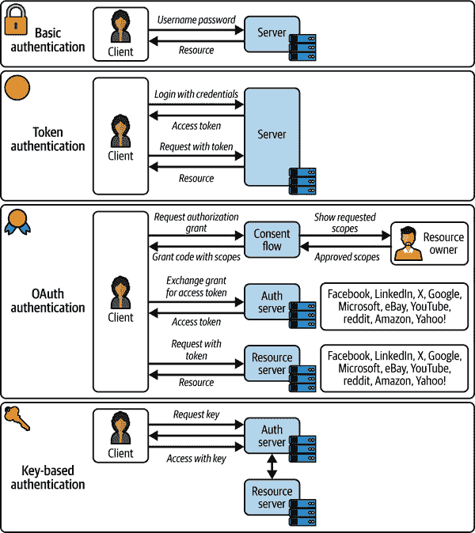
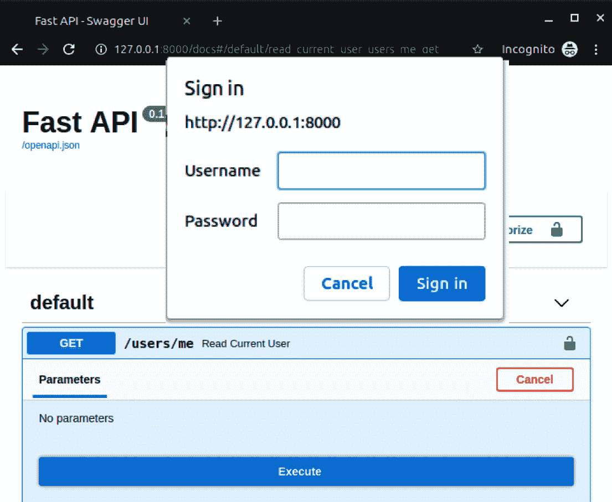
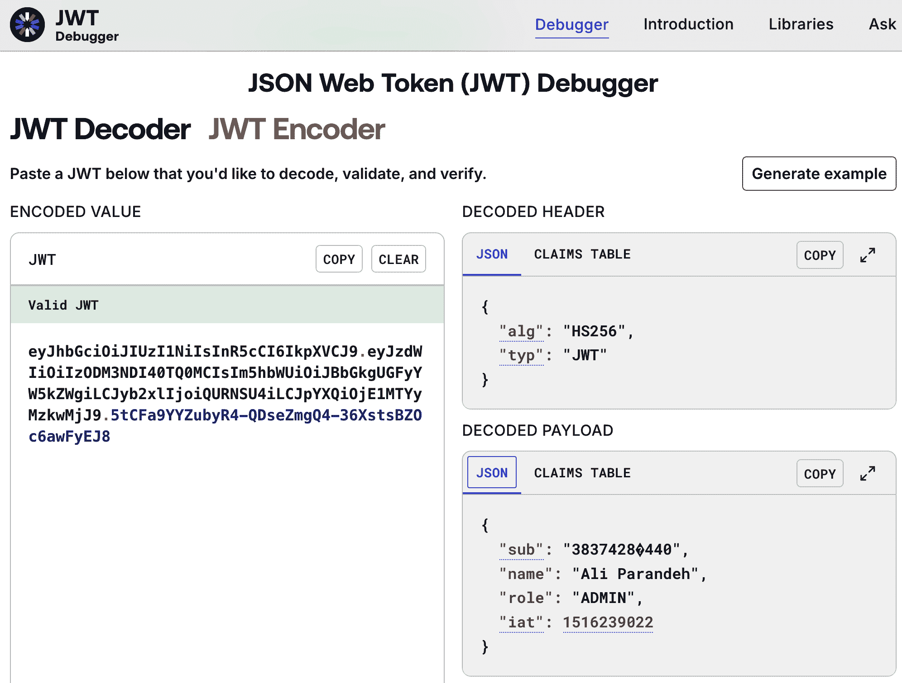
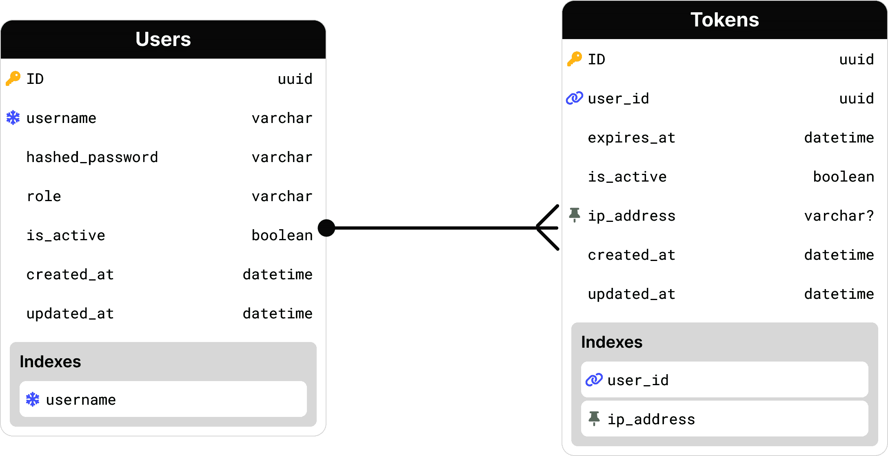
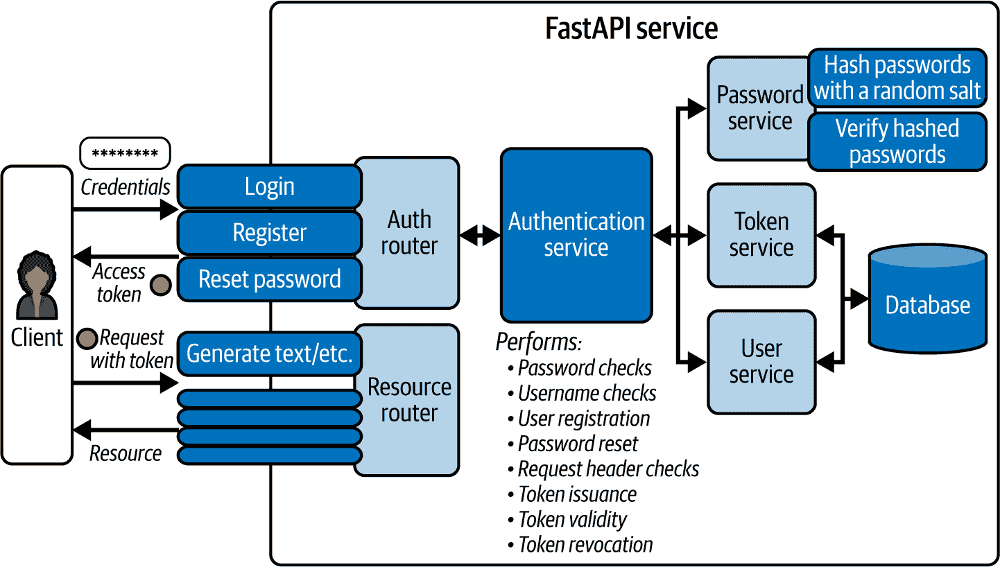
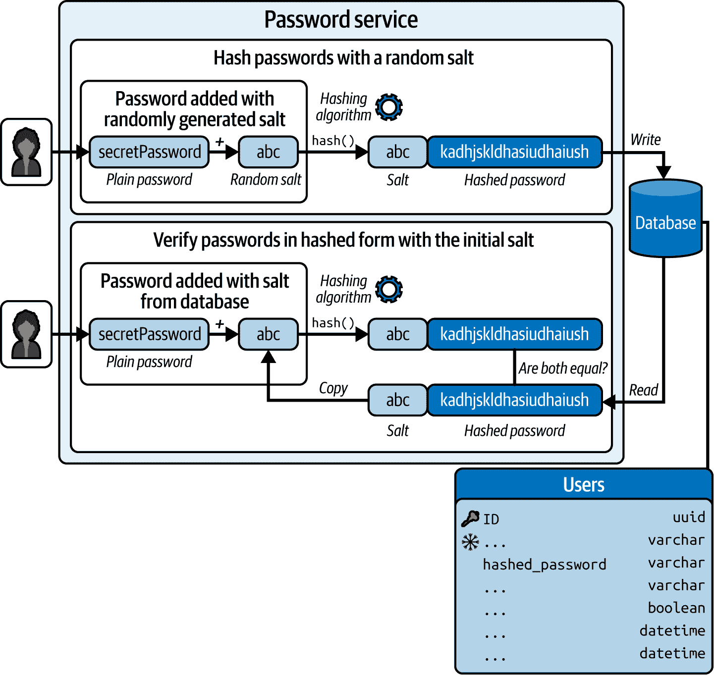

# 第八章。身份验证和授权

这项工作使用 AI 进行翻译。我们很高兴收到您的反馈和评论：translation-feedback@oreilly.com

到目前为止，你已经构建了能够与数据库交互、传输模型响应和处理同时用户的服务。

你的服务现在已激活并运行，但由于它们没有受到攻击者或恶意用户的保护，因此在生产环境中的部署可能会出现问题。

在本章中，你将学习如何通过身份验证级别来保护你的服务，并实施授权保护来防止非特权用户访问敏感资源。

为了达到这个目标，Go 将探索各种身份验证和授权模型，并实施 JWT 和基于身份的认证以及基于角色的访问控制。

# **身份验证和授权**

在讨论身份验证方法之前，我们简要说明一下，身份验证和授权是两个不同的概念，它们经常被错误地互换使用。

根据 OWASP 的定义：^(1)

> **身份验证**是验证一个人、实体或网站是否是其声明的身份的过程，通过确定一个或多个用于支持此声明的身份验证者（如密码、指纹或安全令牌）的有效性。

另一方面，美国国家标准与技术研究院（NIST）将授权定义为：

> 一个验证所需动作或服务是否被特定实体批准的过程。

虽然身份验证涉及身份的验证，但授权则集中在验证一个身份访问或修改资源的权限。

###### **建议**

身份验证就像在移民局出示护照，而授权则像是拥有正确的签证进入一个国家，指定停留时间和允许的活动。

在讨论授权这一章的后面部分之前，让我们更详细地讨论身份验证方法。

# **身份验证方法**

在你的 GenAI 服务中，你可以实施多种身份验证机制，以确保通过身份验证来提高安全性。

根据安全要求、应用程序环境、预算和项目时间表，你可以决定采用以下一个或多个身份验证机制：

**基本**

请求使用用户名和密码等凭证来验证身份。

Web JSON 令牌（JWT）

**访问令牌**可以被视为电影票，确定你是否可以进入放映厅，你正在参观哪个放映厅以及你坐在哪里。

OAuth

通过使用标准*OAuth2*通过身份提供者验证身份。

基于按钮

使用一对公钥和私钥来验证身份。而不是 token，授权服务器向客户端发布一个公钥，并存储一个关联私钥的副本，该副本可以随后用于验证.^(2)

图 8-1 展示了上述认证方法的详细数据流。



###### 图 8-1\. 认证方法

了解认证机制后，可能很难决定采用哪种方法来满足你的安全需求。为了帮助你做出选择，表 8-1 对这些认证方法进行了比较。

表 8-1\. 认证方法对比

| 类型 | 优点 | 局限性 | 用例 |
| --- | --- | --- | --- |
| 基础 |

+   简单性

+   实现快速

+   易于理解

| 以明文形式发送凭证 |
| --- |

+   原型

+   内部或非生产环境

|

| 令牌 |
| --- |

+   可扩展性

+   解耦简化了微服务架构的实施

+   token 可以进行签名和加密以提高安全性。

+   高度可定制

+   自给自足以减少数据库的旅行

+   可以通过 HTTP 头部传递

|

+   需要不断重新生成短期 token

+   客户端端 token 存储的复杂性

+   token 可能会变得很大，消耗过多的带宽。

+   无状态 token 可能使多步骤应用的实现变得困难

+   客户端端的错误配置可能会危及 token

|

+   单页应用和移动设备应用

+   需要自定义认证流程的应用

+   API REST

|

| OAuth |
| --- |

+   将认证委托给外部提供者

+   基于标准（OAuth2）并针对企业场景进行测试

+   代表用户访问外部资源

|

+   理解和实现复杂

+   每个身份提供者可以以略微不同的方式实现 OAuth 流程。

|

+   需要从外部身份提供者（如 GitHub、Google 或 Microsoft）获取用户数据的程序。

+   需要与自己的身份提供者进行 SSO 的企业应用

|

| 基于按钮 |
| --- |

+   类似于 Secure Shell (SSH)访问的认证机制

|

+   管理和维护私钥的安全可能很复杂

+   被泄露的密钥可能带来安全风险

+   可扩展性问题

|

+   小型应用

+   内部环境应用

|

在下一节中，你将实现基本认证、JWT 和 OAuth，以充分理解其底层组件及其交互。

## 基本认证

在基本认证中，客户端在从服务器请求资源时提供用户名和密码。这是最简单的方法，因为它不需要实现 cookie、会话标识符或登录表单。由于其简单性，基本认证非常适合沙盒环境和原型设计。然而，避免在生产环境中使用它，因为它会将用户名和密码明文传输到每个请求，使其容易受到拦截攻击。

要通过基本认证执行请求，你必须添加一个 `Authorization` 标头，其值为 `Basic <credentials>`，以便服务器能够进行认证。`<credentials>` 必须是用户名和密码的 Base64 编码，两者之间用一个点连接（例如，`base64.encode('ali:secretpassword')`）。

在 FastAPI 中，你可以通过基本认证保护一个端点，如 示例 8-1 所示。

##### 示例 8-1. FastAPI 中基本认证的实现

```py
import secrets
from typing import Annotated

from fastapi import Depends, FastAPI, HTTPException, status
from fastapi.security import HTTPBasic, HTTPBasicCredentials

app = FastAPI()
security = HTTPBasic() 
username_bytes = b"ali"
password_bytes = b"secretpassword"

def authenticate_user(
    credentials: Annotated[HTTPBasicCredentials, Depends(security)]
) -> str:
    is_correct_username = secrets.compare_digest(
        credentials.username.encode("UTF-8"), username_bytes 
    )
    is_correct_password = secrets.compare_digest(
        credentials.password.encode("UTF-8"), password_bytes 
    )
    if not (is_correct_username and is_correct_password):
        raise HTTPException( 
            status_code=status.HTTP_401_UNAUTHORIZED,
            detail="Incorrect credentials",
            headers={"WWW-Authenticate": "Basic"},
        )
    return credentials.username

AuthenticatedUserDep = Annotated[str, Depends(authenticate_user)] 

@app.get("/users/me")
def get_current_user_controller(username: AuthenticatedUserDep): 
    return {"message": f"Current user is {username}"}
```


FastAPI 实现了多种 HTTP 安全机制，包括 `HTTPBasic`，它可以利用 FastAPI 的依赖注入系统。


使用内置的 `secrets` 库来比较提供的用户名和密码与服务器上的值。使用 `secrets.compare_digest()` 确保验证操作的持续时间保持恒定，无论输入如何，以避免 *时间攻击*。^([3)]

注意，`secrets.compare_digest()` 只能接受类型为字节或包含 ASCII 字符的字符串（即仅英文字符）的输入。要处理其他字符，你必须在执行凭证检查之前，先将输入编码为 `UTF-8` 字节。


返回一个符合安全标准的标准化 `HTTPException` 授权，以便浏览器能够再次向用户显示访问提示。异常消息必须是通用的，以避免向攻击者泄露敏感信息，例如用户账户的存在。


使用 `HTTPBasic` 与 `Depends()` 一起返回包含提供的用户名的 `HTTPBasicCredentials` 对象。

在任何 FastAPI 端点中注入安全依赖项将使用实现的认证进行保护。你可以通过访问页面 `/docs` 并向 `/users/me` 端点发送请求来亲自体验。

L'endpoint mostrerà un'icona *a forma di lucchetto* e, al momento della richiesta, dovrebbe comparire un avviso di accesso che ti chiederà di fornire le credenziali, come puoi vedere nella Figura 8-2.



###### Figura 8-2\. Autenticazione di base in FastAPI

Con 25 righe di codice sei riuscito a implementare una forma di autenticazione di base per proteggere un endpoint. Ora puoi utilizzare l'autenticazione di base nei tuoi prototipi e nei server di sviluppo.

Tieni presente che dovresti evitare di adottare il meccanismo di autenticazione di base nei servizi GenAI di livello produttivo. Un'alternativa migliore e più sicura per i servizi rivolti al pubblico è l'*autenticazione JWT*, che elimina la necessità di sessioni lato server memorizzando tutti i dettagli dell'autenticazione all'interno di un token. Inoltre, mantiene l'integrità dei dati e funziona in diversi domini con uno standard ampiamente accettato.

## Autenticazione con token web JSON (JWT)

Ora che hai acquisito una maggiore familiarità con i concetti di base dell'autenticazione, implementiamo un livello di autenticazione JWT più complesso ma sicuro per il tuo servizio FastAPI. Come parte di questo processo, dovrai anche rifattorizzare gli endpoint esistenti per combinarli sotto un router API separato per le risorse, in modo da raggruppare, nominare, etichettare e proteggere più endpoint contemporaneamente.

### Che cos'è il JWT?

I JWT sono un modo sicuro e compatto di asserire le rivendicazioni tra le applicazioni tramite token.

Questi gettoni sono composti da tre parti:

Intestazioni

Specifica il tipo di token e l'algoritmo di firma oltre alla data e all'autorità emittente.

Carico utile

Specifica il corpo del token che rappresenta le rivendicazioni sulla risorsa insieme a metadati aggiuntivi.

Firma

La funzione che crea il token lo firma utilizzando il *payload codificato*, le *intestazioni codificate*, un *segreto* e l'algoritmo di firma.

###### Suggerimento

L'algoritmo di codifica `base64` viene spesso utilizzato per codificare e decodificare i dati per garantire la compatibilità e la sicurezza degli URL.

La Figura 8-3 mostra l'aspetto di un tipico JWT.



###### Figura 8-3\. Componenti JWT (Fonte: [jwt.io](https://jwt.io))

I JWT sono sicuri, compatti e convenienti perché possono contenere tutte le informazioni necessarie per eseguire l'autenticazione dell'utente, evitando la necessità di effettuare più viaggi nel database. Inoltre, grazie alla loro compattezza, puoi trasferirli attraverso la rete utilizzando il corpo HTTP `POST`, le intestazioni o i parametri URL.

### Come iniziare con l'autenticazione JWT

Per iniziare a implementare il meccanismo di autenticazione JWT in FastAPI, devi installare le dipendenze `passlib` e `python-jose`:

```py
$ pip install passlib python-jose
```

```py`Una volta installate le dipendenze, avrai bisogno di tabelle nel database per memorizzare gli utenti generati e i dati dei token associati. Per la persistenza dei dati, migriamo il database per creare le tabelle `users` e `tokens`, come mostrato nella Figura 8-4.    ###### Figura 8-4\. Diagramma delle relazioni tra entità delle tabelle `users` e `tokens`    Se guardi la Figura 8-4, noterai che la tabella `tokens` ha una relazione uno-a-molti con la tabella `users`. Puoi usare i record dei token per tenere traccia dei tentativi di accesso riusciti per ogni utente e per revocare l'accesso se necessario.    Definiamo quindi i modelli SQLAlchemy e gli schemi Pydantic necessari per le query al database e la validazione dei dati, come mostrato negli Esempi 8-2 e 8-3.    ##### Esempio 8-2\. Dichiarare i modelli ORM SQLAlchemy dell'utente    ``` # entities.py  导入 uuid，datetime，UTC，datetime，Index，String，DeclarativeBase，Mapped，mapped_column  class Base(DeclarativeBase):     pass  class User(Base):     __tablename__ = "users"      id: Mapped[uuid.UUID] = mapped_column(primary_key=True, default=uuid.uuid4)     email: Mapped[str] = mapped_column(String(length=255), unique=True)     hashed_password: Mapped[str] = mapped_column(String(length=255))     is_active: Mapped[bool] = mapped_column(default=True)     role: Mapped[str] = mapped_column(default="USER")     created_at: Mapped[datetime] = mapped_column(default=datetime.now(UTC))     updated_at: Mapped[datetime] = mapped_column(         default=datetime.now(UTC), onupdate=datetime.now(UTC)     )      __table_args__ = (Index("ix_users_email", "email"),) ```py    Utilizzerai i modelli ORM nel livello di accesso ai dati, mentre gli schemi Pydantic convalideranno i dati di autenticazione in entrata e in uscita nel livello endpoint.    ##### Esempio 8-3\. Dichiarare gli schemi Pydantic degli utenti con i validatori dei campi username e password    ``` # schemas.py  从 datetime，typing，pydantic 导入 UUID4，AfterValidator，BaseModel，ConfigDict，Field，validate_call  @validate_call def validate_username(value: str) -> str:      if not value.isalnum():         raise ValueError("Username must be alphanumeric")     return value  @validate_call def validate_password(value: str) -> str:      validations = [         (             lambda v: any(char.isdigit() for char in v),             "Password must contain at least one digit",         ),         (             lambda v: any(char.isupper() for char in v),             "Password must contain at least one uppercase letter",         ),         (             lambda v: any(char.islower() for char in v),             "Password must contain at least one lowercase letter",         ),     ]     for condition, error_message in validations:         if not condition(value):             raise ValueError(error_message)     return value  ValidUsername = Annotated[     str, Field(min_length=3, max_length=20), AfterValidator(validate_username) ] ValidPassword = Annotated[     str, Field(min_length=8, max_length=64), AfterValidator(validate_password) ]  class UserBase(BaseModel):     model_config = ConfigDict(from_attributes=True)       username: ValidUsername     is_active: bool = True     role: str = "USER"  class UserCreate(UserBase):      password: ValidPassword  class UserInDB(UserBase):      hashed_password: str  class UserOut(UserBase):     id: UUID4     created_at: datetime     updated_at: datetime ```py          Convalida sia il nome utente che la password per applicare requisiti di sicurezza più elevati.            Permettere a Pydantic di leggere gli attributi dei modelli ORM di SQLAlchemy invece di dover popolare manualmente gli schemi di Pydantic dai modelli di SQLAlchemy.            Usa l'ereditarietà per dichiarare diversi schemi Pydantic basati su un modello di base dell'utente.            Crea uno schema separato che accetti il campo `hashed_password` da utilizzare solo per la creazione di nuovi record utente durante il processo di registrazione. Tutti gli altri schemi devono evitare di memorizzare questo campo per eliminare il rischio di fuga della password.      La creazione dei modelli e degli schemi dei token è abbastanza simile, come puoi vedere nell'Esempio 8-4.    ##### Esempio 8-4\. Dichiarare i modelli ORM a token e gli schemi Pydantic    ``` # entities.py  从 datetime，UTC，datetime，sqlalchemy 导入 ForeignKey，Index，String，DeclarativeBase，Mapped，mapped_column，relationship  class Base(DeclarativeBase):     pass  class Token(Base):     __tablename__ = "tokens"      id: Mapped[int] = mapped_column(primary_key=True)     user_id: Mapped[int] = mapped_column(ForeignKey("users.id"))     expires_at: Mapped[datetime] = mapped_column()     is_active: Mapped[bool] = mapped_column(default=True)     ip_address: Mapped[str | None] = mapped_column(String(length=255))     created_at: Mapped[datetime] = mapped_column(default=datetime.now(UTC))     updated_at: Mapped[datetime] = mapped_column(         default=datetime.now(UTC), onupdate=datetime.now(UTC)     )      user = relationship("User", back_populates="tokens")      __table_args__ = (         Index("ix_tokens_user_id", "user_id"),         Index("ix_tokens_ip_address", "ip_address"),     )  class User(Base):     __tablename__ = "users"     # other columns...      tokens = relationship(         "Token", back_populates="user", cascade="all, delete-orphan"     )  # schemas.py  从 datetime，pydantic 导入 BaseModel  class TokenBase(BaseModel):     user_id: int     expires_at: datetime     is_active: bool = True     ip_address: str | None = None  class TokenCreate(TokenBase):     pass  class TokenOut(BaseModel):     access_token: str     token_type: str = "Bearer" ```py    Il prossimo, generiamo automaticamente un file di migrazione usando il comando `alembic revision --autogenerate -m "create users and tokens tables` in modo da poter specificare i dettagli di entrambe le tabelle seguendo l'Esempio 8-5.    ##### Esempio 8-5\. Migrazione del database per creare le tabelle `users` e `tokens`    ``` """创建用户和令牌表  修订 ID：1234567890ab  修订内容：创建日期：2025-01-28 12:34:56.789012  """  从 datetime，UTC，datetime，sqlalchemy 导入 sa，op  ...  def upgrade():     op.create_table(         "users",         sa.Column("id", sa.UUID(as_uuid=True)),          sa.Column("email", sa.String(length=255)),         sa.Column("hashed_password", sa.String(length=255)),          sa.Column(             "is_active", sa.Boolean(), server_default=sa.sql.expression.true()         ),          sa.Column("role", sa.String(), server_default=sa.text("USER")),          sa.Column("created_at", sa.DateTime(), default=datetime.now(UTC)),         sa.Column(             "updated_at",             sa.DateTime(),             default=datetime.now(UTC),             onupdate=datetime.now(UTC),          ),         sa.PrimaryKeyConstraint("id"),         sa.UniqueConstraint("email"),         sa.Index("ix_users_email", "email"),      )      op.create_table(         "tokens",         sa.Column("id", sa.UUID(as_uuid=True)),          sa.Column("user_id", sa.Integer()),         sa.Column("expires_at", sa.DateTime()),          sa.Column("is_active", sa.Boolean(), default=True),          sa.Column("ip_address", sa.String(length=255), nullable=True),         sa.Column("created_at", sa.DateTime(), default=datetime.now(UTC)),         sa.Column(             "updated_at",             sa.DateTime(),             default=datetime.now(UTC),             onupdate=datetime.now(UTC),          ),         sa.ForeignKeyConstraint(             ["user_id"],             ["users.id"],         ),         sa.PrimaryKeyConstraint("id"),         sa.Index("ix_tokens_user_id", "user_id"),         sa.Index("ix_tokens_ip_address", "ip_address"),      )   def downgrade():     op.drop_table("tokens")     op.drop_table("users") ```py          Generare automaticamente identificatori universalmente univoci (UUID) nel livello del database per i record degli utenti e dei token per impedire agli aggressori di indovinare gli identificatori delle risorse sensibili (ad esempio, i record degli utenti o dei token).            Evita di memorizzare stringhe di password grezze nel database per ridurrele vulnerabilità della sicurezza.            Aggiungi la possibilità di abilitare o disabilitare l'accesso all'account.            Aggiungi la possibilità di specificare ruoli utente come `USER` e `ADMIN` per gestire i livelli di accesso di un account. I controlli di autorizzazione utilizzeranno il campo `role` per gestire l'accesso alle risorse privilegiate.            Stampa automaticamente la creazione e gli aggiornamenti degli utenti per scopi di monitoraggio e sicurezza.            Aggiungi un vincolo univoco e un indice secondario sul campo email per ottimizzare le query degli utenti per email ed eliminare la possibilità di creare account email duplicati.            I token devono scadere dopo un breve periodo di tempo per ridurre la finestra temporale in cui i token esposti possono essere utilizzati impropriamente dagli aggressori.            Aggiungi la possibilità di disabilitare i token che non devono più essere validi perché esposti o se un utente si è disconnesso.            Traccia i tempi di creazione e aggiornamento dei token per il monitoraggio e la sicurezza.            Crea indici secondari sui campi `user_id` e `ip_address` per ottimizzare le query sui token in base a questi campi.      Ora esegui il comando `alembic upgrade head` per eseguire la migrazione dell'Esempio 8-5 nel tuo database e creare le tabelle `users` e `tokens`.    Una volta dichiarati i modelli ORM e gli schemi Pydantic, puoi concentrarti sulla logica del meccanismo di autenticazione.    LaFigura 8-5 mostra l'architettura del sistema di autenticazione JWT che implementerai nel tuo servizio FastAPI GenAI.    ###### Figura 8-5\. Architettura del sistema di autenticazione JWT    Nei seguenti esempi di codice, vedrai come implementare i flussi di autenticazione principali, a partire dalla registrazione dell'utente e dalla generazione di JWT.````  ```py`### Hashing e salatura    Il primo passo da fare dopo aver creato le tabelle `users` e `tokens` nel database è quello di memorizzare i nuovi utenti nel database al momento della registrazione. Tuttavia, dovresti evitare di memorizzare le password in chiaro, perché se il database viene compromesso, i malintenzionati avranno le credenziali di ogni utente.    Invece, il meccanismo di autenticazione sfrutterà un *algoritmo di hashing* che converte le password semplici in una stringa codificata che non può essere decodificata nella sua forma originale. Poiché il processo di decodifica non è reversibile, gli algoritmi di hashing crittografici differiscono dalle funzioni di codifica/decodifica standard come Base64.    Sebbene la memorizzazione di password con hash sia più sicura rispetto alla memorizzazione di password semplici, non fornisce una protezione sufficiente.Se un database di password con hash cade nelle mani degli aggressori, questi possono utilizzare tabelle di hash precompilate, comunemente chiamate *tabelle arcobaleno*. Gli aggressori possono utilizzare le tabelle arcobaleno per entrare nel tuo sistema con la forza bruta recuperando le password in chiaro.Per proteggerti da questi attacchi con forza bruta, devi anche introdurre un elemento di casualità nel processo di hashing utilizzando una tecnica chiamata *salatura*.    Con i sali, l'algoritmo di hashing crittografico produce password diverse, anche se gli utenti possono registrarsi con password comuni, compromesse o duplicate.    ###### Avvertenze    L'hashing delle password con un sale casuale protegge dagli attacchi brute-force che utilizzano le tabelle arcobaleno.Tuttavia, non protegge dal *password spraying*, in cui gli aggressori utilizzano un database di password comuni, o dal *credential stuffing*, in cui gli aggressori enumerano un elenco di password compromesse.    Durante la salatura, la funzione di hashing genera un sale casuale da aggiungere alla password semplice prima dell'hashing e quindi genera una password con hash.^(4) Prima di memorizzare la password con hash nel database, il sale viene aggiunto alla password con hash per poterla recuperare successivamente durante la verifica.    Quando gli utenti registrati tentano di accedere, devono fornire la stessa password che hanno usato per creare il loro account. Durante il processo di verifica della password, la password fornita dall'utente viene sottoposta a hashish utilizzando lo stesso sale usato durante la registrazione, che viene recuperato dal database. Se la password hash generata è esattamente identica a quella presente nel database, allora l'utente viene autenticato. In caso contrario, si può tranquillamente supporre che siano state fornite credenziali sbagliate.    La salatura e l'hashing sono tecniche potenti che impediscono agli aggressori di penetrare brutalmente nel tuo sistema con le tabelle arcobaleno. Puoi vedere l'intero processo di hashing e salatura nella Figura 8-6.    ###### Figura 8-6\. Meccanismo di salatura dell'hash della password    Il servizio password mostrato nella Figura 8-6 è implementato come `PasswordService` nell'Esempio 8-6.    ##### Esempio 8-6\. Implementare un servizio di password    ``` # services/auth.py  从 fastapi.security 导入 HTTPBearer，从 passlib.context 导入 CryptContext  class PasswordService:     security = HTTPBearer()     pwd_context = CryptContext(schemes=["bcrypt"])       async def verify_password(         self, password: str, hashed_password: str     ) -> bool:         return self.pwd_context.verify(password, hashed_password)       async def get_password_hash(self, password: str) -> str:         return self.pwd_context.hash(password)  ```py          Crea un `AuthService` con un contesto di segreti e password gestito dalla libreria `bcrypt` che gestirà l'hashing e la verifica delle password degli utenti.            Utilizza l'algoritmo di crittografia di `bcrypt`e il segreto dell'applicazione per eseguire l'hash e verificare le password.      La libreria crittografica `bcrypt` fornisce le funzionalità principali di `Password​Ser⁠vice` per l'hashing e la verifica delle password. Utilizzando questo servizio, le richieste possono essere autenticate.    Se una richiesta non può essere autenticata, dovrai anche sollevare delle eccezioni legate all'autorizzazione, come mostrato nell'Esempio 8-7.    ##### Esempio 8-7\. Creare eccezioni di autenticazione    ``` # exceptions.py  从 fastapi 导入 HTTPException，status  UnauthorizedException = HTTPException(     status_code=status.HTTP_401_UNAUTHORIZED,     detail="Not authenticated",     headers={"WWW-Authenticate": "Bearer"}, )  AlreadyRegisteredException = HTTPException(     status_code=status.HTTP_400_BAD_REQUEST,     detail="Username already registered", ) ```py    Le due eccezioni HTTP di autorizzazione più comuni sono legate ad accessi non autorizzati o a richieste errate dovute all'utilizzo di nomi utente già usati.    Una volta verificata l'identità di un utente tramite le sue credenziali, dovrai rilasciargli un *token di accesso*. Questi token dovrebbero avere una vita breve per ridurre l'intervallo di tempo in cui un malintenzionato può utilizzare il token per accedere alle risorse se il token viene rubato.    Per ridurre le dimensioni dei token e proteggerli da eventuali *falsificazioni*, il servizio token firmerà (utilizzando un segreto) e codificherà i payload dei token con una codifica come Base64\. Il payload conterrà normalmente i dati dell'utente come l'ID, il ruolo, il sistema di emissione e le date di scadenza.    Il servizio token può anche decodificare il payload dei token ricevuti e verificarne la validità durante il processo di autenticazione.    Infine, anche il servizio token avrà bisogno di accedere al database per memorizzare e recuperare i token per svolgere le sue funzioni. Pertanto, dovrà ereditare un `TokenRepository`, come mostrato nell'Esempio 8-8.    ##### Esempio 8-8\. Implementazione del repository di token    ``` # repositories.py  从 entities 导入 Token，从 repositories.interfaces 导入 Repository，从 schemas 导入 TokenCreate，TokenUpdate，从 sqlalchemy 导入 select，从 sqlalchemy.ext.asyncio 导入 AsyncSession  class TokenRepository(Repository):     def __init__(self, session: AsyncSession) -> None:         self.session = session      async def list(self, skip: int, take: int) -> list[Token]:         async with self.session.begin():             result = await self.session.execute(                 select(Token).offset(skip).limit(take)             )         return [r for r in result.scalars().all()]      async def get(self, token_id: int) -> Token | None:         async with self.session.begin():             result = await self.session.execute(                 select(Token).where(Token.id == token_id)             )         return result.scalars().first()      async def create(self, token: TokenCreate) -> Token:         new_token = Token(**token.dict())         async with self.session.begin():             self.session.add(new_token)             await self.session.commit()             await self.session.refresh(new_token)         return new_token      async def update(         self, token_id: int, updated_token: TokenUpdate     ) -> Token | None:         token = await self.get(token_id)         if not token:             return None         for key, value in updated_token.dict(exclude_unset=True).items():             setattr(token, key, value)         async with self.session.begin():             await self.session.commit()             await self.session.refresh(token)         return token      async def delete(self, token_id: int) -> None:         token = await self.get(token_id)         if not token:             return         async with self.session.begin():             await self.session.delete(token)             await self.session.commit() ```py    Con l'implementazione di `TokenRepository`, puoi ora sviluppare `TokenService`, come mostrato nell'Esempio 8-9.    ##### Esempio 8-9\. Implementare un servizio di token ereditando il repository dei token    ``` # services/auth.py  从 datetime 导入 UTC，datetime，timedelta，from exceptions 导入 UnauthorizedException，从 jose 导入 JWTError，jwt，从 pydantic 导入 UUID4，从 repositories 导入 TokenRepository，从 schemas 导入 TokenCreate，TokenUpdate  class TokenService(TokenRepository):     secret_key = "your_secret_key"     algorithm = "HS256"     expires_in_minutes = 60   async def create_access_token(     self, data: dict, expires_delta: timedelta | None = None  ) -> str:     to_encode = data.copy()     if expires_delta:         expire = datetime.now(UTC) + expires_delta     else:         expire = datetime.now(UTC) + timedelta(minutes=self.expires_in_minutes)     token_id = await self.create(TokenCreate(expires_at=expire))      to_encode.update(         {"exp": expire, "iss": "your_service_name", "sub": token_id}      )     encoded_jwt = jwt.encode(         to_encode, self.secret_key, algorithm=self.algorithm      )     return encoded_jwt  async def deactivate(self, token_id: UUID4) -> None:     await self.update(TokenUpdate(id=token_id, is_active=False))  def decode(self, encoded_token: str) -> dict:     try:         return jwt.decode(             encoded_token, self.secret_key, algorithms=[self.algorithm]         )     except JWTError:         raise UnauthorizedException  async def validate(self, token_id: UUID4) -> bool:     return (token := await self.get(token_id)) is not None and token.is_active ```py          Implementa un `TokenService` per l'emissione e la verifica dei token di autenticazione. Le configurazioni sono condivise da tutte le istanze del servizio.            Genera token di accesso basati sui dati forniti al servizio token con date di scadenza.            Crea un record di token nel database e ottiene un identificatore unico.            Il token di accesso deve scadere entro un'ora, quindi il campo calcolato `exp` verrà utilizzato per verificare la validità del token.            Codifica il token generato in una stringa codificata utilizzando l'algoritmo `base64`.      Ora che hai un `PasswordService` e un `TokenService`, puoi completare il meccanismo di autenticazione JWT di base con un `AuthService` dedicato di livello superiore.    L'esempio 8-10 mostra l'implementazione della classe `AuthService` che contiene diverse funzioni di dipendenza per la registrazione degli utenti, l'emissione di token di accesso e la protezione dei percorsi API.    ##### Esempio 8-10\. Implementare un servizio auth per gestire la logica di autenticazione di livello superiore    ``` # services/auth.py  从 typing 导入 Annotated，从 databases 导入 DBSessionDep，从 entities 导入 Token，User，UserCreate，UserInDB，从 exceptions 导入 AlreadyRegisteredException，UnauthorizedException，从 fastapi 导入 Depends，从 fastapi.security 导入 HTTPAuthorizationCredentials，HTTPBearer，OAuth2PasswordRequestForm，从 services.auth 导入 PasswordService，TokenService，从 services.users 导入 UserService  security = HTTPBearer() LoginFormDep = Annotated[OAuth2PasswordRequestForm, Depends()] AuthHeaderDep = Annotated[HTTPAuthorizationCredentials, Depends(security)]  class AuthService:     def __init__(self,
