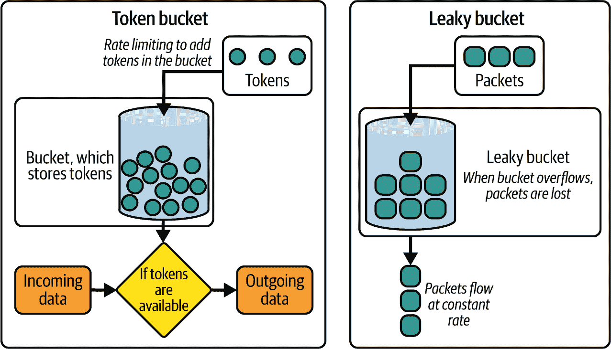

# 第九章. 保护人工智能服务

在前面的章节中，你学习了如何构建通用人工智能服务，这些服务服务于各种人工智能生成器，同时支持实时并发和数据流。此外，你集成了外部系统，如数据库，并实现了自己的身份验证和授权机制。最后，你编写了一个测试套件来验证整个系统的功能和性能。

在本章中，你将学习如何实施使用限制和滥用保护机制来确保你的通用人工智能服务安全。

# 使用限制和滥用保护

当部署你的通用人工智能服务时，你需要考虑恶意用户如何滥用和误用你的服务。这对于保护用户安全和你的声誉至关重要。你不知道用户会如何使用你的系统，因此你需要假设最坏的情况并实施*护栏*来防止任何滥用或误用。

根据[最近关于通用人工智能恶意应用的[研究](https://oreil.ly/ihmzR)]，你的服务可能被用于具有*恶意意图*，如表 9-1 中所述。

表 9-1\. 滥用通用人工智能服务背后的恶意意图

| 意图 | 示例 | 现实案例 |
| --- | --- | --- |
| **不诚实**支持谎言和不真实性 | 抄袭、伪造能力和知识、伪造文件、考试和面试作弊等 | 英国和澳大利亚大学中越来越多的学生使用 AI 作弊的案例^(a) |
| **宣传**扭曲现实感知以推进议程 | 模仿他人、推广极端主义、影响竞选活动等 | 伪造的人工智能新闻主播传播虚假信息或宣传^(b) |
| **欺骗**误导他人并创造虚假印象 | 生成虚假评论、诈骗广告和钓鱼邮件，以及合成个人资料（即网络水军）等 | 工程公司 Arup 被揭露是价值 2500 万美元深度伪造诈骗的受害者^(c) |
| ^(a) 来源：*《泰晤士高等教育》* 和 *《卫报》*^(b) 来源：*《卫报》*、*《麻省理工学院技术评论》* 和 *《华盛顿邮报》*^(c) 来源：CNN 和 *《卫报》* |

同样的研究将通用人工智能应用的滥用分为以下几类：

+   *虚假信息和错误信息* 传播宣传和假新闻

+   *偏见放大和歧视* 推进种族主义议程和社会歧视

+   *恶意内容生成* 通过创建有毒、欺骗性和极端主义内容

+   *数据隐私攻击* 通过填补被盗私人数据的空白并泄露敏感信息

+   *自动化网络攻击* 定制钓鱼和勒索软件攻击

+   *身份盗窃和社会工程* 提高诈骗的成功率

+   *深度伪造和多媒体操纵* 获利并扭曲现实和社会信念的感知

+   *诈骗和欺诈* 通过操纵股市和制定有针对性的诈骗

这可能不是一份详尽的清单，但它应该能给您一些关于考虑哪些使用监管措施的思路。

[关于 GenAI 滥用策略分类法的另一项研究](https://oreil.ly/jbG01)调查了按模式进行的滥用，并发现：

+   *音频和视频生成器* 被用于大多数模仿尝试。

+   *图像和文本生成器* 被用于大多数假身份尝试、大规模意见操纵的内容农场和伪造尝试。

+   *图像和视频生成器* 被用于大多数隐写术尝试（即在模型输出中隐藏编码信息）和非自愿亲密内容（NCII）生成尝试。

如果您正在构建支持此类模式的服务，您应该考虑其相关的滥用形式并实施相关保护机制。

除了滥用和误用之外，您还需要考虑安全漏洞。

在撰写本文时，确保 GenAI 服务仍然是一个研究领域。例如，如果您的服务利用 LLM，OWASP 已将[前 10 大 LLM 漏洞](https://oreil.ly/4zob2)分类，如表 9-2 所示。

表 9-2\. OWASP 前 10 大 LLM 漏洞

| 风险 | 描述 |
| --- | --- |
| 提示注入 | 操作输入以控制 LLM 的响应，导致未经授权的访问、数据泄露和决策受损。 |
| 不安全的输出处理 | 未对 LLM 的输出进行清理或验证，导致下游系统上的远程代码执行。 |
| 训练数据中毒 | 在模型训练的数据源中注入数据，以损害安全性、准确性或道德行为。开源模型和依赖网络数据的 RAG 服务最容易受到这些攻击。 |
| 模型拒绝服务 | 通过向 LLM 加载大量有效载荷和并发请求，导致服务中断和成本激增。 |
| 供应链漏洞 | 导致各种组件，包括数据源，被破坏，损害系统完整性。 |
| 敏感信息泄露 | 导致私人数据意外泄露，法律责任和竞争优势丧失。 |
| 不安全的插件设计 | 第三方集成中的漏洞导致远程代码执行。 |
| 过度代理 | 当 LLM 有太多自主权采取行动时，可能导致意外后果和有害行为。 |
| 过度依赖 LLM | 危害决策，导致安全漏洞和法律责任。 |
| 模型盗窃 | 与未经授权复制或使用您的模型相关。 |

###### 提示

对于其他类型的 GenAI 系统，如图像、音频、视频和几何生成器，也存在类似的安全漏洞。

我建议研究和识别与您自己的用例相关的软件漏洞。

没有防护栏，您的服务可能会被滥用，造成个人和财务损害、身份盗窃、经济损失、传播错误信息，并导致社会问题。因此，实施多项安全措施和防护栏以保护您的服务免受此类攻击至关重要。

在下一节中，您将了解在部署之前可以实施的用法调节和安全措施，以保护您的 GenAI 服务。

# 防护栏

*防护栏* 指的是旨在引导您的应用程序达到预期结果的 *检测控制*。它们极其多样，可以配置以适应您 GenAI 系统可能出现的任何错误情况。

例如，*I/O 防护栏* 被设计来验证进入 GenAI 模型的数据和发送到下游系统或用户的输出。这样的防护栏可以标记不适当的用户查询，并验证输出内容是否具有毒性、幻觉或禁止的主题。图 9-1 展示了在 LLM 系统中添加 I/O 防护栏后的样子。


###### 图 9-1\. 无防护栏和有防护栏的 LLM 系统的比较

您不必从头开始实现防护栏。在撰写本文时，存在一些预构建的开源防护栏框架，如 NVIDIA NeMo Guardrails、LLM-Guard 和 Guardrails AI，以保护您的服务。然而，它们可能需要学习与学习框架相关的语言，并且由于各种外部依赖，可能会以减慢服务速度和膨胀应用程序为代价。

市场上可用的其他商业防护栏，例如 Open AI 的 Moderation API、Microsoft Azure AI 内容安全 API 和 Google 的 Guardrails API，要么不是开源的，要么缺乏衡量质量约束的详细信息和内容。

###### 警告

防护栏仍然是研究的一个活跃领域。虽然这些防御措施可以抵御一些攻击，但由 AI 支持的强大攻击仍然可以绕过它们。这可能导致一个 [持续不断的攻击和防御的循环](https://oreil.ly/xlUmw)。

虽然在应用层面构建 I/O 防护栏可能无法提供完美的保护，但即将推出的 GenAI 模型可能包含内置的防护栏，以提高安全保证。然而，这样的防护栏可能会通过引入系统延迟来影响响应时间。

## 输入防护栏

输入防护栏的目的是防止恶意或不适当的内容到达您的模型。表 9-3 展示了常见的输入防护栏。

表 9-3\. 常见输入防护栏

| 输入防护栏 | 例子 |
| --- | --- |
| **主题** | 将输入引导远离非主题或敏感内容。 | 防止用户讨论政治话题和露骨的内容。 |
| **直接提示注入**（越狱）防止用户泄露或覆盖系统提示和秘密。输入内容越长，你的系统就越容易受到这些攻击。 | 阻止覆盖系统提示并操纵系统泄露内部 API 密钥或配置设置.^(a) |
| **间接提示注入**防止接受来自外部来源（如文件或网站）的恶意内容，这些内容可能导致模型混淆或在下层系统中执行远程代码。恶意内容可能对人类眼睛不可见，并编码在输入文本或图像中。 | 清理上传图像中的编码有效负载、上传文档中的隐藏字符或提示覆盖、远程 URL 中的隐藏脚本，甚至是 YouTube 视频字幕中的隐藏脚本。 |
| **审查**遵守品牌指南、法律和品牌要求。 | 如果用户查询中包含粗俗语言、竞争对手、露骨内容、个人可识别信息（PII）、自残等提及，则标记并拒绝无效的用户查询。 |
| **属性**验证输入属性。 | 检查查询长度、文件大小、选项、范围、数据格式和结构等。 |
| ^(a) 尽管护栏很有用，但最佳实践是首先避免让你的 GenAI 模型直接了解秘密或敏感的配置设置。 |

输入护栏也可以与内容净化器结合使用，以清理不良输入。

如果你想要实现自己的护栏，可以从在你的系统提示中使用高级提示工程技术开始。此外，你可以使用自动评估技术（即，AI 模型）。

示例 9-1 展示了一个 AI 护栏自动评估器拒绝离题查询的系统提示示例。

##### 示例 9-1\. 主题输入护栏系统提示

```py
guardrail_system_prompt = """

Your role is to assess user queries as valid or invalid

Allowed topics include:

1\. API Development
2\. FastAPI
3\. Building Generative AI systems

If a topic is allowed, say 'allowed' otherwise say 'disallowed'
"""
```

你可以在示例 9-2 中看到使用 LLM 自动评估技术实现的输入主题护栏的示例。

##### 示例 9-2\. 主题输入护栏

```py
import re
from typing import Annotated
from openai import AsyncOpenAI
from pydantic import AfterValidator, BaseModel, validate_call

guardrail_system_prompt = "..."

class LLMClient:
    def __init__(self, system_prompt: str):
        self.client = AsyncOpenAI()
        self.system_prompt = system_prompt

    async def invoke(self, user_query: str) -> str | None:
        response = await self.client.chat.completions.create(
            model="gpt-4o",
            messages=[
                {"role": "system", "content": self.system_prompt},
                {"role": "user", "content": user_query},
            ],
            temperature=0,
        )
        return response.choices[0].message.content

@validate_call
def check_classification_response(value: str | None) -> str: 
    if value is None or not re.match(r"^(allowed|disallowed)$", value):
        raise ValueError("Invalid topical guardrail response received")
    return value

ClassificationResponse = Annotated[
    str | None, AfterValidator(check_classification_response)
]

class TopicalGuardResponse(BaseModel):
    classification: ClassificationResponse

async def is_topic_allowed(user_query: str) -> TopicalGuardResponse:
    response = await LLMClient(guardrail_system_prompt).invoke(user_query)
    return TopicalGuardResponse(classification=response)
```


处理 LLM 不返回有效分类的情况

###### 小贴士

使用示例 9-2 中展示的技术，你可以实现自动评估器来检查越狱和提示注入尝试，甚至检测输入中是否存在 PII 和粗俗语言。

如第五章所述，即使在使用护栏中的自动评估技术时，你也可以尽可能多地利用异步编程。这是因为 AI 护栏需要为每个用户查询发送多个模型 API 调用。为了提高用户体验，你可以将这些护栏并行运行于模型推理过程。

一旦你有一个用于检查允许主题的自动评估护栏，你就可以使用 `asyncio.wait` 并行执行它，同时进行数据生成^(1)，如示例 9-3 所示。

###### 警告

注意，实现异步防护栏可能会触发模型提供者 API 的速率限制和节流机制。根据您的应用需求，您可能需要请求更高的速率限制或在短时间内减少 API 调用的频率。

##### 示例 9-3\. 并行运行 AI 防护栏以生成响应

```py
import asyncio
from typing import Annotated
from fastapi import Depends
from loguru import logger

...

async def invoke_llm_with_guardrails(user_query: str) -> str:
    topical_guardrail_task = asyncio.create_task(is_topic_allowed(user_query))
    chat_task = asyncio.create_task(llm_client.invoke(user_query))

    while True:
        done, _ = await asyncio.wait(
            [topical_guardrail_task, chat_task],
            return_when=asyncio.FIRST_COMPLETED,
        ) 
        if topical_guardrail_task in done:
            topic_allowed = topical_guardrail_task.result()
            if not topic_allowed:
                chat_task.cancel() 
                logger.warning("Topical guardrail triggered")
                return (
                    "Sorry, I can only talk about "
                    "building GenAI services with FastAPI"
                )
            elif chat_task in done:
                return chat_task.result()
        else:
            await asyncio.sleep(0.1) 

@router.post("/text/generate")
async def generate_text_controller(
    response: Annotated[str, Depends(invoke_llm_with_guardrails)] 
) -> str:
    return response
```


使用`asyncio.wait`创建两个并行运行的 asyncio 任务。操作会在任一任务完成时返回。


如果触发防护栏，取消聊天操作并返回硬编码的响应。您可以在数据库中记录触发事件并发送通知电子邮件。


每 100 毫秒检查一次 asyncio 事件循环，直到任务完成。


如果没有触发防护栏，利用依赖注入返回模型响应。

由于像在示例 9-3 中实现的 GenAI 启用防护栏仍然是概率性的，您的 GenAI 服务仍然可能容易受到提示注入和越狱攻击。例如，攻击者可以使用更高级的提示注入技术来绕过您的 AI 防护栏。另一方面，您的防护栏也可能错误地过度拒绝有效用户查询，导致假阳性，从而降低用户体验。

###### 提示

将防护栏与基于规则的或传统的机器学习模型结合用于检测可以帮助减轻一些上述风险。

此外，您还可以使用仅考虑最新消息的防护栏来降低模型被长时间对话所混淆的风险。

在设计防护栏时，您需要考虑*准确性*、*延迟*和*成本*之间的权衡，以平衡用户体验与您所需的安全控制。

## 输出防护栏

输出防护栏的目的是在内容传递给用户或下游系统之前验证由 GenAI 生成的内容。表 9-4 显示了常见的输出防护栏。

表 9-4\. 常见输出防护栏

| 输出防护栏 | 示例 |
| --- | --- |
| **幻觉/事实核查**阻止幻觉并返回如“我不知道”之类的标准响应 | 在 RAG 应用中，在真实数据集的语料库上对模型输出进行如*相关性*、*连贯性*、*一致性*、*流畅性*等指标的测量。 |
| **审查**应用品牌和公司指南来管理模型输出，过滤或重写违反这些指南的响应。 | 与如*可读性*、*毒性*、*情感*、*竞争对手提及次数*等指标进行核对。 |
| **语法检查**验证模型输出的结构和内容。这些守卫可以检测并重试，或者优雅地处理异常，以防止下游系统失败。在模型调用函数时验证 JSON 架构和函数参数。在 *代理工作流程* 中检查工具/代理的选择。 |

任何上述输出守卫都将依赖于 *阈值值* 来检测无效响应。

## 守卫阈值

守卫可以使用各种指标，如 *可读性*、*毒性* 等，来衡量和验证模型输出的质量。对于每个指标，您需要实验以确定适用于您用例的适当 *阈值值*，同时考虑到：

+   更多的 *假阳性* 可能会令您的用户烦恼，并降低您服务的可用性。

+   更多的 *假阴性* 可能会对您的声誉造成长期损害，并导致成本激增，因为恶意用户可能会滥用系统或执行提示注入/越狱攻击。

通常，您应该评估出现假阴性的风险和最坏情况，以及您是否愿意为了增强用户体验而牺牲一些假阴性。例如，您可以减少包含更多术语且可读性不高的输出被阻止的情况。

## 实现审查守卫

让我们使用 [*G-Eval* 评估方法](https://oreil.ly/7Nent) 的一个版本来实现审查守卫，以测量模型输出中不希望出现的内容。

G-Eval 框架使用以下组件来评分无效内容：

+   一个指定要审查的内容类型的 *域名*

+   一套 *标准*，用于明确区分有效内容与无效内容

+   一份用于评分内容的有序 *指令步骤* 列表

+   在离散评分 1 到 5 之间的 *内容* 进行评分

示例 9-4 展示了一个实现 *G-Eval* 框架的系统提示，该框架是 LLM 自动评估器将要使用的。

##### 示例 9-4\. 审查守卫系统提示

```py
domain = "Building GenAI Services"

criteria = """
Assess the presence of explicit guidelines for API development for GenAI models.
The content should contain only general evergreen advice
not specific tools and libraries to use
"""

steps = """
1\. Read the content and the criteria carefully.
2\. Assess how much explicit guidelines for API development
for GenAI models is contained in the content.
3\. Assign an advice score from 1 to 5,
with 1 being evergreen general advice and 5 containing explicit
mentions of various tools and libraries to use.
"""

f"""
You are a moderation assistant.
Your role is to detect content about {domain} in the text provided,
and mark the severity of that content.

## {domain}

### Criteria

{criteria}

### Instructions

{steps}

### Evaluation (score only!)
"""
```

使用 示例 9-4 中实现的系统提示，你现在可以按照 示例 9-2 的方式实现一个审查守卫。

接下来，让我们将审查守卫与您现有的聊天调用逻辑集成，如 示例 9-5 所示。

##### 示例 9-5\. 集成审查守卫

```py
import asyncio
from typing import Annotated
from loguru import logger
from pydantic import BaseModel, Field

...

class ModerationResponse(BaseModel):
    score: Annotated[int, Field(ge=1, le=5)] 

async def g_eval_moderate_content(
    chat_response: str, threshold: int = 3
) -> bool:
    response = await LLMClient(guardrail_system_prompt).invoke(chat_response)
    g_eval_score = ModerationResponse(score=response).score
    return g_eval_score >= threshold 

async def invoke_llm_with_guardrails(user_request):
    ...
    while True:
        ...
        if topical_guardrail_task in done:
            ...
        elif chat_task in done: 
            chat_response = chat_task.result()
            has_passed_moderation = await g_eval_moderate_content(chat_response)
            if not has_passed_moderation:
                logger.warning(f"Moderation guardrail flagged")
                return (
                    "Sorry, we can't recommend specific "
                    "tools or technologies at this time"
                )
            return chat_response
        else:
            await asyncio.sleep(0.1)
```


使用 Pydantic 限制整数类型来验证 LLM 自动评估器 G-Eval 分数。


将评分高于阈值的内标为未通过审查。


集成并运行输出审查守卫与其他守卫。

###### 提示

除了使用 LLM 自动评估器实现的创新**G-Eval**框架之外，您还可以使用更传统的自动评估框架，如[ROUGE](https://oreil.ly/_9Q9g)、[BERTScore](https://oreil.ly/jRTeL)和[SummEval](https://oreil.ly/5YtJG)来调节输出内容。

干得好。您现在已经实现了两个 I/O 安全栏，一个用于验证用户查询的主题，另一个用于调节 LLM 输出。

为了进一步提高您的安全栏系统，您可以：

+   采用**快速失败**方法，如果触发安全栏则提前退出，以优化响应时间。

+   只为您的用例选择**合适的**安全栏，而不是全部一起使用，这可能会压倒您的服务。

+   将安全栏**异步**运行而不是顺序运行，以优化延迟。

+   通过在请求样本上运行较慢的安全栏来**实现请求采样**，以减少在服务负载过重时的整体延迟。

现在，您应该更有信心使用经典或 LLM 自动评估技术来实施自己的安全栏，而不依赖于外部工具和库。

在下一节中，您将了解 API 速率限制，以便您可以为保护您的服务免受模型过载和抓取尝试而采取行动。

# API 速率限制和节流

在部署 GenAI 服务时，您需要考虑生产中的服务耗尽和模型过载问题。最佳实践是在您的服务中实施速率限制和可能的节流。

**速率限制**控制网络到和从的入出流量，以防止滥用，确保公平使用，并避免服务器过载。另一方面，**节流**通过暂时减慢请求处理速率来控制 API 吞吐量，以稳定服务器。

这两种技术都可以帮助您：

+   **防止滥用**，通过阻止恶意用户或机器人通过数据抓取和涉及过多请求或大负载的暴力攻击来压倒您的服务。

+   **强制执行公平使用政策**，以便多个用户共享容量，并防止少数用户垄断服务器资源。

+   通过调节入站流量来**维持服务器稳定性**，以保持一致的性能并防止在高峰期崩溃。

要实现速率限制，您需要在一段时间内监控入站请求，并使用队列来平衡负载。

您可以选择几种速率限制策略，这些策略在表 9-5 中进行了比较，并在图 9-2 中显示。

表 9-5\. 速率限制策略

| 策略 | 利益 | 局限性 | 用例 |
| --- | --- | --- | --- |
| **令牌桶**一个列表以恒定速率填充令牌，每个入站请求消耗一个令牌。如果入站请求没有足够的令牌，它们将被拒绝。 |

+   处理临时突增和动态流量模式

+   对请求处理进行细粒度控制

| 实现复杂 | 在大多数 API 和服务以及交互式或事件驱动的 GenAI 系统中常用，其中请求速率可能不规则 |
| --- | --- |
| **漏桶**将传入请求添加到队列中，并以恒定速率处理以平滑流量。如果队列溢出，则拒绝任何新的传入请求。 |

+   实现简单

+   维持一致的流量

|

+   对动态流量的灵活性较低

+   在突发高峰期间可能会拒绝有效请求

| 需要在 AI 推理服务中保持一致响应时间的服务 |
| --- |
| **固定窗口**在固定时间窗口内限制请求（例如，每分钟 100 个请求）。 | 实现简单 | 不擅长处理突发流量 |

+   强制执行昂贵的 AI 推理和 API 调用的严格使用策略

+   对于免费层用户或具有可预测使用模式的批处理系统来说，是理想的

+   每个请求都同等对待

|

| **滑动窗口**在滚动时间框架内计算请求。 | 提供更好的灵活性、粒度，以及突发流量平滑处理 |
| --- | --- |

+   实现更复杂

+   跟踪请求需要更高的内存使用

|

+   更擅长处理突发流量

+   对于期望随时间灵活、高频访问的对话式 AI 或高级用户来说，是理想的

|



###### 图 9-2\. 速率限制策略比较

现在你对速率限制概念更加熟悉了，让我们尝试在 FastAPI 中实现速率限制。

## 在 FastAPI 中实现速率限制

在 FastAPI 中添加速率限制的最快方法是使用 `slowapi` 这样的库，它是对 `limits` 包的包装，支持 表 9-5 中提到的大多数策略。首先，安装 `slowapi` 库：

```py
$ pip install slowapi
```

安装完 `slowapi` 包后，你可以按照 示例 9-6 进行操作，以应用全局 API 或端点速率限制。你还可以按 IP 地址跟踪和限制使用。

###### 注意

不配置外部数据存储，`slowapi` 在应用程序内存中存储和跟踪 IP 地址以进行速率限制。

##### 示例 9-6\. 配置全局速率限制

```py
from fastapi.responses import JSONResponse
from slowapi import Limiter
from slowapi.errors import RateLimitExceeded
from slowapi.middleware import SlowAPIMiddleware
from slowapi.util import get_remote_address

...

limiter = Limiter(
    key_func=get_remote_address,
    default_limits=["200 per day", "60 per hour", "2/5seconds"],
) 

app.state.limiter = limiter

@app.exception_handler(RateLimitExceeded) 
def rate_limit_exceeded_handler(request, exc):
    retry_after = int(exc.description.split(" ")[-1])
    response_body = {
        "detail": "Rate limit exceeded. Please try again later.",
        "retry_after_seconds": retry_after,
    }
    return JSONResponse(
        status_code=429,
        content=response_body,
        headers={"Retry-After": str(retry_after)},
    )

app.add_middleware(SlowAPIMiddleware)
```


创建速率限制器，跟踪每个 IP 地址的使用情况，并在应用程序中超过指定限制时拒绝请求。


为速率限制请求添加自定义异常处理器，以在请求再次接受之前计算和提供等待时间。

配置了 `limiter` 装饰器后，你现在可以在你的 API 处理器上使用它，如 示例 9-7 所示。

##### 示例 9-7\. 为每个 API 处理器设置 API 速率限制

```py
@app.post("/generate/text")
@limiter.limit("5/minute") 
def serve_text_to_text_controller(request: Request, ...):
    return ...

@app.post("/generate/image")
@limiter.limit("1/minute") 
def serve_text_to_image_controller(request: Request, ...): 
    return ...

@app.get("/health")
@limiter.exempt 
def check_health_controller(request: Request):
    return {"status": "healthy"}
```


使用速率限制装饰器在端点级别指定更细粒度的速率限制。`limiter` 装饰器必须放在最后。


将`Request`对象传递给每个控制器，以便`slowapi`限制器装饰器可以挂钩到传入的请求。否则，速率限制将不会起作用。

(#co_securing_ai_services_CO5-3)

将`/health`端点从速率限制逻辑中排除，因为云提供商或 Docker 守护进程可能会不断 ping 此端点以检查应用程序的状态。

(#co_securing_ai_services_CO5-4)

避免对`/health`端点进行速率限制，因为外部系统可能会频繁触发它以检查服务的当前状态。

现在您已经实现了速率限制，您可以使用`ab`（Apache Benchmarking）CLI 工具运行负载测试，如示例 9-8 所示。

##### 示例 9-8\. 使用 Apache Benchmark CLI 进行 API 负载测试

```py
$ ab -n 100 -p 2 http://localhost:8000 
```

(#co_securing_ai_services_CO6-1)

以每秒 2 个并行请求的速率发送 100 个请求。

您的终端输出应显示以下内容：

```py
200 OK
200 OK
429 Rate limited Exceeded
...
```

根据传入的 IP 地址，您的全局和本地限制系统现在应该按预期工作。

### 基于用户的速率限制

使用 IP 速率限制，您是根据 IP 限制过度使用，但用户可以通过使用 VPN、代理或轮换 IP 地址来绕过 IP 速率限制。相反，您希望每个用户都有一个专用的配额，以防止单个用户消耗所有可用资源。添加基于用户的限制可以帮助您防止滥用，如示例 9-9 所示。

##### 示例 9-9\. 基于用户的速率限制

```py
@app.post("/generate/text")
@limiter.limit("10/minute", key_func=get_current_user)
def serve_text_to_text_controller(request: Request):
    return {"message": f"Hello User"}
```

您的系统现在将根据用户的账户 ID 以及他们的 IP 地址来限制用户。

### 生产实例中的速率限制

由于您在扩展服务时可能会在生产中运行多个应用程序实例，因此您还希望集中跟踪使用情况。否则，每个实例将向用户提供自己的计数器，负载均衡器在实例之间分配请求；使用情况不会像您预期的那样受限。为了解决这个问题，您可以将`slowapi`的内存存储后端切换为中央内存数据库，如 Redis，如示例 9-10 所示。

###### 注意

要运行示例 9-10，您需要一个 Redis 数据库来存储用户 API 使用数据：

```py
$ pip install coredis
$ docker pull redis
$ docker run \
  --name rate-limit-redis-cache \
  -d \
  -p 6379:6379 \
  redis
```

##### 示例 9-10\. 在多个实例中添加集中使用内存存储（Redis）

```py
from slowapi import Limiter
from slowapi.middleware import SlowAPIMiddleware

app.state.limiter = Limiter(storage_uri="redis://localhost:6379")
app.add_middleware(SlowAPIMiddleware)
```

您现在有一个按预期在多个实例上工作的速率限制 API。

您可以通过实现自己的限制器，该限制器由`limits`包支持，来解决这个问题。或者，您可以通过*负载均衡器*、*反向代理*或*API 网关*来应用速率限制。

每个解决方案都可以在基础设施层执行请求路由、速率限制、协议转换和流量监控，同时执行速率限制。如果您不需要定制的速率限制逻辑，那么在您的用例中，外部应用速率限制可能更合适。

### 限制 WebSocket 连接

不幸的是，`slowapi`包在撰写本文时也不支持限制异步和 WebSocket 端点。

由于 WebSocket 连接可能是长期存在的，你可能想要限制通过套接字发送的数据转换速率。你可以依赖外部包，如`fastapi-limiter`，来限制 WebSocket 连接，如图示例 9-11 所示。

##### 示例 9-11\. 使用`fastapi_limiter`包限制 WebSocket 连接的速率

```py
from contextlib import asynccontextmanager
import redis
from fastapi import Depends, FastAPI
from fastapi.websockets import WebSocket
from fastapi_limiter import FastAPILimiter
from fastapi_limiter.depends import WebSocketRateLimiter

...

@asynccontextmanager
async def lifespan(_: FastAPI): 
    redis_connection = redis.from_url("redis://localhost:6379", encoding="utf8")
    await FastAPILimiter.init(redis_connection)
    yield
    await FastAPILimiter.close()

app = FastAPI(lifespan=lifespan)

@app.websocket("/ws")
async def websocket_endpoint(
    websocket: WebSocket, user_id: int = Depends(get_current_user) 
):
    ratelimit = WebSocketRateLimiter(times=1, seconds=5)
    await ws_manager.connect(websocket)
    try:
        while True:
            prompt = await ws_manager.receive(websocket)
            await ratelimit(websocket, context_key=user_id) 
            async for chunk in azure_chat_client.chat_stream(prompt, "ws"):
                await ws_manager.send(chunk, websocket)
    except WebSocketRateLimitException:
        await websocket.send_text(f"Rate limit exceeded. Try again later")
    finally:
        await ws_manager.disconnect(websocket)
```

[#co_securing_ai_services_CO7-1]

使用 Redis 存储后端配置`FastAPILimiter`应用程序的生命周期。

[#co_securing_ai_services_CO7-2]

配置 WebSocket 速率限制器，允许每秒一个请求。

[#co_securing_ai_services_CO7-3]

使用用户的 ID 作为速率限制的唯一标识符。

示例 9-11 展示了如何限制给定用户的活跃 WebSocket 连接数。

除了限制 WebSocket 端点之外，你还可能想要限制你的 GenAI 模型的数据流速率。接下来，让我们看看如何节流实时数据流。

## 节流实时流

当与实时流一起工作时，你可能需要减慢流速率，以便给客户端足够的时间来消费流，并提高多个客户端之间的流吞吐量。此外，节流可以帮助你管理网络带宽、服务器负载和资源利用率。

在流生成层应用*节流*，如图示例 9-12，如果你的服务处于压力之下，这是一种有效的管理吞吐量的方法。

##### 示例 9-12\. 节流流

```py
class AzureOpenAIChatClient:
    def __init__(self, throttle_rate = 0.5): 
        self.aclient = ...
        self.throttle_rate = throttle_rate

    async def chat_stream(
            self, prompt: str, mode: str = "sse", model: str = "gpt-3.5-turbo"
    ) -> AsyncGenerator[str, None]:
        stream = ...  # OpenAI chat completion stream
        async for chunk in stream:
            await asyncio.sleep(self.throttle_rate) 
            if chunk.choices[0].delta.content is not None:
                yield (
                    f"data: {chunk.choices[0].delta.content}\n\n"
                    if mode == "sse"
                    else chunk.choices[0].delta.content
                )
                await asyncio.sleep(0.05)

        if mode == "sse":
            yield f"data: [DONE]\n\n"
```

[#co_securing_ai_services_CO8-1]

设置固定的节流速率或根据使用情况动态调整。

[#co_securing_ai_services_CO8-2]

减慢流速率而不阻塞事件循环。

你可以使用节流流在 SSE 或 WebSocket 端点内使用。或者，你可以根据你自己的自定义策略限制每个活动的 WebSocket 连接数。

除了实时流的本地节流之外，你还可以在基础设施层利用*流量整形*。

使用防护措施、速率限制和节流，应该为保护你的服务免受滥用和误用提供足够的障碍。

在下一节中，你将了解更多优化技术，这些技术可以帮助你降低延迟，提高响应质量和吞吐量，同时降低你的 GenAI 服务的成本。

# 摘要

本章提供了 GenAI 服务的攻击向量全面总结以及如何防范对抗性尝试、误用和滥用。

你已经学会了在评估和内容过滤机制的同时实现输入和输出防护栏，以调节服务使用。在防护栏的基础上，你还开发了 API 速率限制和节流保护来管理服务器负载并防止滥用。

在下一章中，我们将学习通过各种技术优化 AI 服务，例如缓存、批量处理、模型量化、提示工程和模型微调。

^(1) 受到[《OpenAI 烹饪手册》中的“如何实现 LLM 防护栏”](https://oreil.ly/UQV6i)的启发。
