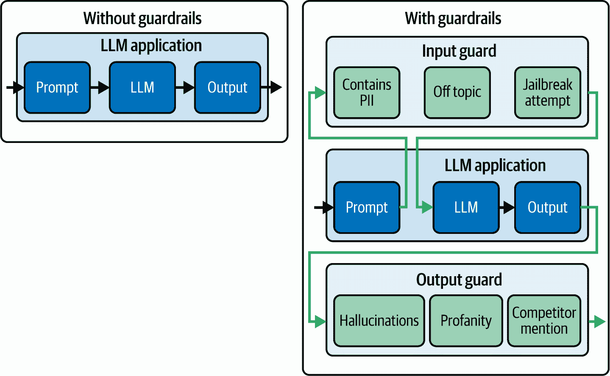

# 第九章。保护人工智能服务

这项工作是用人工智能翻译的。我们很高兴收到您的反馈和评论：translation-feedback@oreilly.com

在前面的章节中，你学习了如何构建服务于各种 IA 生成器的 GenAI 服务，支持实时数据流和竞争。此外，你集成了外部系统，如数据库，并实现了你的身份验证和授权机制。最后，你编写了一套测试来验证整个系统的功能和性能。

在本章中，你将学习如何实施使用监控和保护滥用机制来保护你的 GenAI 服务。

# 使用监控和保护滥用

当你分发你的 GenAI 服务时，你必须考虑你的服务可能会被恶意用户不当使用。这对于保护用户安全和你的声誉至关重要。你无法知道用户会如何使用你的系统，因此你必须考虑最坏的情况，并实施*保护措施*以防止任何滥用或不正当使用。

根据[关于 GenAI 有害应用的近期研究](https://oreil.ly/ihmzR)，你的服务可能被潜在地用于*恶意意图*，如表 9-1 中所述。

表 9-1. GenAI 服务滥用背后的恶意意图

| 意图 | 例子 | 实际案例 |
| --- | --- | --- |
| **不诚实**支持谎言和虚假 | 剽窃、伪造技能和知识、伪造文件、考试和面试作弊等 | 英国和澳大利亚大学中利用人工智能作弊的学生案例增加^(a) |
| **宣传**扭曲现实感知以推广议程 | 模仿他人、推广极端主义、影响竞选活动等 | 传播虚假信息或宣传的人工智能假新闻主播^(b) |
| **欺骗**欺骗他人并创造虚假印象 | 生成虚假评论、欺诈性广告和钓鱼邮件、合成资料（例如，sockpuppeting）等 | 阿鲁普工程公司成为价值 2500 万美元的 deepfake 欺诈的受害者^(c) |
| ^(a) 来源：*《泰晤士高等教育》* 和 *《卫报》*^(b) 来源：*《卫报》*、*《麻省理工学院技术评论》* 和 *《华盛顿邮报》*^(c) 来源：CNN 和 *《卫报》* |

同一研究将 GenAI 应用的滥用分类如下：

+   *虚假信息与误导* 用于传播宣传和假新闻

+   *偏见放大和歧视* 用于推广种族主义和社会歧视计划

+   *有害内容的生成* 通过创建有毒、欺骗性和极端主义的内容

+   *数据隐私攻击* 用于填补被盗数据的空白并泄露敏感信息

+   *自动化网络攻击* 用于定制钓鱼和勒索软件攻击

+   *身份盗窃和社会工程学* 用于提高诈骗成功率

+   *深度伪造和多媒体操纵* 用于获利并改变对现实和社交信念的感知

+   *欺诈和诈骗* 通过操纵股市和实施针对性诈骗

这不是一个详尽的列表，但它应该给你一些关于可以考虑采取哪些使用调节措施的思路。

[关于 GenAI 滥用策略分类的另一项研究](https://oreil.ly/jbG01)分析了滥用模式，并发现：

+   对于大多数拟人化尝试，都使用了*音频和视频生成器*。

+   *图像和文本生成器* 被用于大多数 sockpuppeting、大规模意见操纵的内容农场和伪造尝试。

+   *图像和视频生成器* 已被用于大多数隐写术尝试（即隐藏在模型结果中的编码消息）和非同意的私密内容生成。

如果你正在创建支持这些模式的服务，你必须考虑与之相关的滥用形式，并实施相应的保护机制。

除了误用和滥用之外，你还必须考虑安全漏洞。

到本文撰写时，GenAI 服务的安全性仍是一个研究领域。例如，如果你的服务利用了 LLM，OWASP 已将[10 个主要 LLM 漏洞](https://oreil.ly/4zob2)分类，如表 9-2 所示。

表 9-2\. OWASP 的 10 个主要 LLM 漏洞

| 风险 | 描述 |
| --- | --- |
| 提示注入 | 通过操纵输入来控制 LLM 的响应导致未经授权的访问、数据违规和决策过程受损。 |
| 输出管理不安全 | LLM 输出未进行消毒或验证导致在下游系统上执行远程代码。 |
| 训练数据中毒 | 将数据注入用于训练模型的来源，以损害安全性、准确性或道德行为。开源模型和基于网络数据的 RAG 服务最容易受到此类攻击。 |
| 服务拒绝模型 | 通过向 LLMs 加载重负载和并发请求来造成服务中断和成本激增。 |
| 供应链漏洞 | 导致数据源等各个组件的妥协，损害系统完整性。 |
| 敏感信息丢失 | 导致意外泄露私人数据，承担法律责任和失去竞争优势。 |
| 插件设计不安全 | 第三方集成中的漏洞导致远程代码执行。 |
| 过度授权 | LLM 在执行动作时的过度自主可能导致不希望的和有害的后果。 |
| 过度依赖 LLM | 破坏决策过程，导致安全漏洞和法律责任。 |
| 模型盗窃 | 与你的模型未经授权的复制或使用相关。 |

###### 建议

类似的漏洞也存在于其他类型的 GenAI 系统中，如图像、音频、视频和几何形状生成器。

我建议你搜索并识别与你的用例相关的软件漏洞。

没有保护措施，你的服务可能会被滥用，造成个人和财务损害、身份盗窃、经济损失、传播虚假信息和加剧社会问题。因此，实施多种安全措施和保护措施，以保护你的服务免受此类攻击至关重要。

在下一节中，你将了解你可以实施的使用和安全性措施，以在分发前保护你的 GenAI 服务。

# 防护栏

*防护栏*指的是*调查性控制*，其目的是引导你的应用程序达到预期的结果。它们极其不同，可以配置以适应任何可能对你的 GenAI 系统出错的情境。

例如，*防护栏 I/O*被设计来验证进入 GenAI 模型的输入数据和发送给下游系统或用户的输出。这些防护栏可以报告用户的不适当查询，并验证输出内容是否具有毒性、幻觉或被禁止的主题。图 9-1 展示了添加了防护栏 I/O 的系统 LLM 的外观。



###### 图 9-1. 带与不带防护栏的系统 LLM 对比

你不需要从头开始实现防护措施。在撰写本文时，存在一些预先构建的开源防护框架，如 NVIDIA NeMo Guardrails、LLM-Guard 和 Guardrails AI，用于保护你的服务。然而，它们可能需要学习与框架相关的相关语言，并且以服务速度降低和应用程序因各种外部依赖而变重为代价。

市场上可用的其他商业边界防护，如 Open AI 的 Moderation API、Microsoft Azure AI 内容安全 API 和 Google 的 Guardrails API，不是开源的，或者缺乏用于衡量质量限制的详细信息和内容。

###### 注意事项

边界防护仍然是一个活跃的研究领域。尽管这些防御措施可以抵御一些攻击，但由人工智能支持的更强大的攻击仍然可以绕过它们。这可能导致[持续不断的攻击和防御循环](https://oreil.ly/xlUmw)。

虽然在应用级别进行边界防护的 I/O 工程不能提供完美的保护，但未来的 GenAI 模型可能会包含集成到模型内部的边界防护，以提高安全保证。然而，这些边界防护可能会通过在系统中引入延迟来影响响应时间性能。

## 边界防护

边界防护的目的是阻止有害或不适当的内容到达你的模型。表 9-3 显示了最常见的输入边界防护。

表 9-3\. 输入常见边界防护

| 边界防护 | 示例 |
| --- | --- |
| **当前**避免不相关或敏感的内容。 | 阻止用户讨论政治和露骨内容。 |
| **直接提示注入**(越狱)阻止用户揭示或忽略系统提示和秘密：输入内容越长，你的系统就越容易受到这些攻击。 | 阻止忽略系统提示和操纵系统以使其揭示内部 API 密钥或配置设置的行为.^(a) |
| **间接提示注入**阻止从外部来源（如文件或网站）接受有害内容，这些内容可能导致模型混淆或远程系统上执行代码。有害内容可能对人类肉眼不可见，并编码在输入文本或图像中。 | 对上传图像中编码的负载进行消毒，隐藏字符或文档中的提示覆盖，远程 URL 中的隐藏脚本，甚至 YouTube 视频的转录。 |
| **审查**遵守品牌指南、法律要求和品牌要求。 | 如果用户查询包含诅咒、竞争对手、露骨内容、个人识别信息（PII）、自残等，则标记并拒绝这些查询。 |
| **属性**验证输入属性。 | 检查查询长度、文件大小、选项、范围、数据格式和结构等。 |
| 即使边界防护很有用，最佳实践是避免让你的 GenAI 模型直接了解秘密或敏感的配置设置。 |

输入护栏也可以与内容清洁器结合使用，以清理有缺陷的输入。

如果你想实现你的护栏，你可以从在你的系统中使用高级提示工程技巧开始。此外，你可以使用自动评估技术（例如，人工智能模型）。

esempio 9-1 展示了为拒绝离题查询而设计的 AI 护栏自动评估器的系统提示示例。

##### Esempio 9-1\. 输入主题护栏系统提示

```py
guardrail_system_prompt = """

Your role is to assess user queries as valid or invalid

Allowed topics include:

1\. API Development
2\. FastAPI
3\. Building Generative AI systems

If a topic is allowed, say 'allowed' otherwise say 'disallowed'
"""
```

你可以在 Esempio 9-2 中看到一个主题入口护栏的实现示例，它使用了 LLM 的自动评估技术。

##### Esempio 9-2\. 主题入口护栏

```py
import re
from typing import Annotated
from openai import AsyncOpenAI
from pydantic import AfterValidator, BaseModel, validate_call

guardrail_system_prompt = "..."

class LLMClient:
    def __init__(self, system_prompt: str):
        self.client = AsyncOpenAI()
        self.system_prompt = system_prompt

    async def invoke(self, user_query: str) -> str | None:
        response = await self.client.chat.completions.create(
            model="gpt-4o",
            messages=[
                {"role": "system", "content": self.system_prompt},
                {"role": "user", "content": user_query},
            ],
            temperature=0,
        )
        return response.choices[0].message.content

@validate_call
def check_classification_response(value: str | None) -> str: 
    if value is None or not re.match(r"^(allowed|disallowed)$", value):
        raise ValueError("Invalid topical guardrail response received")
    return value

ClassificationResponse = Annotated[
    str | None, AfterValidator(check_classification_response)
]

class TopicalGuardResponse(BaseModel):
    classification: ClassificationResponse

async def is_topic_allowed(user_query: str) -> TopicalGuardResponse:
    response = await LLMClient(guardrail_system_prompt).invoke(user_query)
    return TopicalGuardResponse(classification=response)
```


处理 LLM 未返回有效分类的情况

###### 建议

使用 Esempio 9-2 中展示的技术，你可以实现自动评估器来验证是否存在越狱尝试和提示注入，或者甚至检测输入中是否存在 PII 和咒骂。

正如我们在第五章中看到的，即使在使用自动评估技术时，你仍然可以充分利用异步编程。这是因为 AI 护栏需要对每个用户查询向模型 API 发送多个调用。为了提高用户体验，你可以并行执行这些护栏和模型推理过程。

一旦你有一个用于验证允许主题的自评估护栏，你就可以使用 `asyncio.wait` 在你的数据生成过程中并行执行它，如 Esempio 9-3 所示。

###### 注意事项

请记住，实现异步护栏可能会触发模型提供者的 API 速度限制和流量控制机制。根据你的应用程序需求，你可能需要请求更高的速度限制或减少 API 调用速度。

##### Esempio 9-3\. 在生成响应时并行执行 AI 护栏

```py
import asyncio
from typing import Annotated
from fastapi import Depends
from loguru import logger

...

async def invoke_llm_with_guardrails(user_query: str) -> str:
    topical_guardrail_task = asyncio.create_task(is_topic_allowed(user_query))
    chat_task = asyncio.create_task(llm_client.invoke(user_query))

    while True:
        done, _ = await asyncio.wait(
            [topical_guardrail_task, chat_task],
            return_when=asyncio.FIRST_COMPLETED,
        ) 
        if topical_guardrail_task in done:
            topic_allowed = topical_guardrail_task.result()
            if not topic_allowed:
                chat_task.cancel() 
                logger.warning("Topical guardrail triggered")
                return (
                    "Sorry, I can only talk about "
                    "building GenAI services with FastAPI"
                )
            elif chat_task in done:
                return chat_task.result()
        else:
            await asyncio.sleep(0.1) 

@router.post("/text/generate")
async def generate_text_controller(
    response: Annotated[str, Depends(invoke_llm_with_guardrails)] 
) -> str:
    return response
```


使用`asyncio.wait`创建两个并行执行的 asyncio 任务。操作会在任一任务完成时返回。


如果护栏被激活，取消聊天操作并返回一个编码后的响应。你可以将激活记录在数据库中并发送通知邮件。


每隔 100 毫秒继续检查 asyncio 事件循环，直到活动完成。


如果护栏未激活，利用依赖注入来返回模型响应。

由于为 GenAI 启用的护栏，如 Esempio 9-3 中实现的，仍然是概率性的，你的 GenAI 服务仍然可能容易受到提示注入和越狱攻击。例如，攻击者可以使用更高级的提示注入技术来绕过你的 AI 护栏。另一方面，你的护栏也可能错误地拒绝有效的用户查询，导致假阳性，这可能会恶化用户体验。

###### 建议

将护栏与基于规则或传统机器学习的检测模型相结合可以帮助减轻上述一些风险。

此外，你可以使用仅考虑最后一条消息的护栏来降低模型被长时间对话混淆的风险。

在设计护栏时，需要考虑在**精确度**、**延迟**和**成本**之间的权衡，以平衡用户体验和安全控制需求。

## 输出护栏

输出护栏的目的是在内容传递给用户或下游系统之前验证 Genai 生成的内容。表 9-4 展示了常见的输出护栏。

表 9-4\. 常见输出护栏

| 输出护栏 | 示例 |
| --- | --- |
| **幻觉/事实控制**阻止幻觉并返回如“我不知道”这样的封装响应。 | 在 RAG 应用中，测量模型结果相对于基础真实语料库的*相关性*、*一致性*、*一致性*、*流畅性*等指标。 |
| **审查**应用品牌和公司的指南来调整模型结果，过滤或重写违反这些指南的响应。 | 检查诸如*可读性*、*毒性*、*情感*、*竞争对手提及次数*等指标。 |
| **语法控制**检查模型的输出结构和内容。这些护栏可以检测并重试或优雅地处理异常，以避免下游系统出现故障。 | 在模型调用函数时验证 JSON 模式和函数参数的工作流调用函数。验证工具/代理在工作流代理中的选择。 |

所述的所有输出护栏都将基于**阈值值**来检测无效的响应。

## 护栏阈值

护栏可以使用诸如*可读性*、*毒性*等不同的指标来衡量和验证模型结果的质量。对于每个指标，你将需要通过实验来识别适合你用例的**阈值值**，同时考虑到：

+   较多的*假阳性*可能会打扰你的用户并降低你服务的可用性。

+   较多的*假阴性*可能会导致你的声誉受到长期损害，并使成本激增，因为恶意用户可能会滥用系统或执行快速注入/越狱攻击。

通常，你应该评估假阴性的风险和最坏情况，以及你是否愿意在你的用例中为了改善用户体验而牺牲一些假阴性。例如，你可以减少包含更多术语且不太易读的输出被阻止的情况。

## 实现一个审查屏障

我们使用 [G-Eval 评估方法](https://oreil.ly/7Nent) 的一个版本来实现一个审查屏障，以测量模型输出中不希望内容的存在。

G-Eval 框架使用以下组件为无效内容分配评分：

+   一个指定要审查的内容类型的*域名*

+   一系列*标准*，用于明确界定哪些内容是有效的，哪些内容是无效的。

+   一个有序的*指令阶段*列表，用于内容分类

+   *内容*必须通过 1 到 5 的离散评分进行评估。

示例 9-4 展示了一个实现 *G-Eval* 框架的系统提示，该框架将由自动 LLM 评估者使用。

##### 9-4. 系统护栏审查的示例

```py
domain = "Building GenAI Services"

criteria = """
Assess the presence of explicit guidelines for API development for GenAI models.
The content should contain only general evergreen advice
not specific tools and libraries to use
"""

steps = """
1\. Read the content and the criteria carefully.
2\. Assess how much explicit guidelines for API development
for GenAI models is contained in the content.
3\. Assign an advice score from 1 to 5,
with 1 being evergreen general advice and 5 containing explicit
mentions of various tools and libraries to use.
"""

f"""
You are a moderation assistant.
Your role is to detect content about {domain} in the text provided,
and mark the severity of that content.

## {domain} `### Criteria`

`{``criteria``}` ``` `### 指令` `{``步骤``}` `` `### 评估（仅评分！）` `"""` `` ```py
```

```py`` ````使用在 Esempio 9-4 中实现的系统提示，你现在可以按照 Esempio 9-2 的示例来实施一个 moderation barrier。    随后，我们将 moderation barrier 与现有的 chat invocation 逻辑集成，如 Esempio 9-5 所示。    ##### Esempio 9-5\. moderation barrier 集成    ```py import asyncio from typing import Annotated from loguru import logger from pydantic import BaseModel, Field  ...  class ModerationResponse(BaseModel):     score: Annotated[int, Field(ge=1, le=5)]   async def g_eval_moderate_content(     chat_response: str, threshold: int = 3 ) -> bool:     response = await LLMClient(guardrail_system_prompt).invoke(chat_response)     g_eval_score = ModerationResponse(score=response).score     return g_eval_score >= threshold   async def invoke_llm_with_guardrails(user_request):     ...     while True:         ...         if topical_guardrail_task in done:             ...         elif chat_task in done:              chat_response = chat_task.result()             has_passed_moderation = await g_eval_moderate_content(chat_response)             if not has_passed_moderation:                 logger.warning(f"Moderation guardrail flagged")                 return (                     "Sorry, we can't recommend specific "                     "tools or technologies at this time"                 )             return chat_response         else:             await asyncio.sleep(0.1) ```          使用 Pydantic 限制的整数类型来验证 LLM 自动评估器的 G-Eval 分数。            将得分高于阈值的内内容标记为未通过 moderation。            将 output moderation barrier 与其他 barrier 集成并执行。      ###### 建议    除了使用 LLM 自评估器实现的 *G-Eval* 新框架外，还可以使用更传统的自动评估框架，如 [ROUGE](https://oreil.ly/_9Q9g)，[BERTScore](https://oreil.ly/jRTeL) 和 [SummEval](https://oreil.ly/5YtJG) 来 moderation 输出内容。    你已经实现了两个 I/O barrier，一个用于验证用户查询的主题，另一个用于 moderation LLM 的输出。    为了进一步改进你的 barrier 系统，你可以：    *   采用 *快速故障* 方法，一旦 barrier 被激活就先退出，以优化响应时间。           *   根据你的用例选择合适的 *guardrail*，而不是一次性使用所有 guardrail，这可能会给你的服务带来过重负担。           *   以异步方式执行 guardrail，而不是顺序执行，以优化延迟。           *   通过对请求进行采样执行较慢的 guardrail，以降低在高负载下服务的总延迟。              现在，你应该更有信心使用传统的自评估技术或 LLM 来实现你的 barrier，而不必依赖外部工具和库。    在下一节中，你将了解如何通过限制 API 速度来保护你的服务免受模型过载和 scraping 尝试的影响。```py` `````  ```py`````` ```py````` # Limitazione e strozzatura della velocità API    Quando distribuisce i servizi GenAI, deve considerare i problemi di esaurimento del servizio e di sovraccarico del modello in produzione. La pratica migliore è quella di implementare la limitazione della velocità e potenzialmente il throttling nei servizi.    *La limitazione della velocità* controlla la quantità di traffico in entrata e in uscita da e verso una rete per prevenire abusi, garantire un uso equo ed evitare di sovraccaricare il server. D'altra parte, il *throttling* controlla il throughput dell'API rallentando temporaneamente la velocità di elaborazione delle richieste per stabilizzare il server.    Entrambe le tecniche possono aiutarti:    *   *Previeni gli abusi* bloccando gli utenti malintenzionati o i bot che possono sovraccaricare i tuoi servizi con attacchi di scraping e brute-force che comportano un numero eccessivo di richieste o payload di grandi dimensioni.           *   *Applicare politiche di utilizzo equo* in modo che la capacità sia condivisa tra più utenti e che si impedisca a una manciata di utenti di monopolizzare le risorse del server.           *   *Mantenere la stabilità del server* regolando il traffico in entrata per mantenere costanti le prestazioni e prevenire i crash durante i periodi di picco.              Per implementare la limitazione della velocità, dovrai monitorare le richieste in arrivo in un periodo di tempo e utilizzare una coda per bilanciare il carico.    Ci sono diverse strategie di limitazione della velocità che puoi scegliere, confrontate nella Tabella 9-5 e mostrate nella Figura 9-2.      Tabella 9-5\. Strategie di limitazione della velocità   | Strategia | Vantaggi | Limitazioni | Casi d'uso | | --- | --- | --- | --- | | **Secchiello per gettoni**Un elenco viene riempito di token a ritmo costante e ogni richiesta in arrivo consuma un token. Se non ci sono abbastanza token per le richieste in arrivo, queste vengono respinte. |   *   Gestisce raffiche temporanee e modelli di traffico dinamici           *   Controllo granulare sull'elaborazione delle richieste             | Complesso da implementare | Comunemente utilizzato nella maggior parte delle API e dei servizi e nei sistemi GenAI interattivi o basati su eventi, dove la frequenza delle richieste può essere irregolare. | | **Secchio che perde**Le richieste in arrivo vengono aggiunte a una coda ed elaborate a una velocità costante per fluidificare il traffico. Se la coda si riempie, le nuove richieste in arrivo vengono respinte. |   *   Semplice da implementare           *   Mantiene un flusso di traffico coerente             |   *   Meno flessibile al traffico dinamico           *   Può rifiutare richieste valide durante i picchi improvvisi             | Servizi che richiedono il mantenimento di tempi di risposta coerenti nei servizi di inferenza AI | | **Finestra fissa**Limita le richieste entro finestre temporali fisse (ad esempio, 100 richieste al minuto). | Semplice da implementare | Non gestisce bene il traffico a raffica |   *   Applicare politiche di utilizzo rigorose per le inferenze dell'intelligenza artificiale e le chiamate API costose           *   Ideale per utenti free tier o per sistemi di elaborazione batch con modelli di utilizzo prevedibili.           *   Ogni richiesta viene trattata allo stesso modo             | | **Finestra scorrevole**Conta le richieste in un arco di tempo variabile. | Fornisce una migliore flessibilità, granularità e attenuazione del traffico burst |   *   Più complesso da implementare           *   Richiede un utilizzo maggiore della memoria per le richieste di tracciamento             |   *   Gestisce molto meglio il traffico a raffica           *   Ideale per l'IA conversazionale o per gli utenti di livello premium che si aspettano un accesso flessibile e ad alta frequenza nel tempo.             |    ###### Figura 9-2\. Confronto tra le strategie di limitazione del tasso    Ora che hai una maggiore familiarità con i concetti di limitazione della velocità, proviamo a implementare la limitazione della velocità in FastAPI.    ## Implementare i limiti di velocità in FastAPI    L'approccio più veloce per aggiungere la limitazione della velocità all'interno di FastAPI è quello di utilizzare una libreria come `slowapi` che è un wrapper del pacchetto `limits` e che supporta la maggior parte delle strategie menzionate nella Tabella 9-5. Per prima cosa, installa la libreria `slowapi`:    ```py $ pip install slowapi ```   ```py```` Una volta installato il pacchetto `slowapi`, puoi seguire l'Esempio 9-6 per applicare una limitazione globale della velocità delle API o degli endpoint. Puoi anche monitorare e limitare l'utilizzo per indirizzo IP.    ###### Nota    Senza configurare un archivio dati esterno, `slowapi` memorizza e tiene traccia degli indirizzi IP nella memoria dell'applicazione per limitare la velocità.    ##### Esempio 9-6\. Configurazione dei limiti di velocità globali    ```py from fastapi.responses import JSONResponse from slowapi import Limiter from slowapi.errors import RateLimitExceeded from slowapi.middleware import SlowAPIMiddleware from slowapi.util import get_remote_address  ...  limiter = Limiter(     key_func=get_remote_address,     default_limits=["200 per day", "60 per hour", "2/5seconds"], )   app.state.limiter = limiter  @app.exception_handler(RateLimitExceeded)  def rate_limit_exceeded_handler(request, exc):     retry_after = int(exc.description.split(" ")[-1])     response_body = {         "detail": "Rate limit exceeded. Please try again later.",         "retry_after_seconds": retry_after,     }     return JSONResponse(         status_code=429,         content=response_body,         headers={"Retry-After": str(retry_after)},     )  app.add_middleware(SlowAPIMiddleware) ```          Crea un limitatore di velocità che tiene traccia dell'utilizzo di ogni indirizzo IP e rifiuta le richieste se superano i limiti specificati nell'applicazione.            Aggiungi un gestore di eccezioni personalizzato per le richieste a velocità limitata per calcolare e fornire i tempi di attesa prima che le richieste vengano accettate di nuovo.      Una volta configurato il decoratore `limiter`, puoi utilizzarlo nei tuoi gestori API, come mostrato nell'Esempio 9-7.    ##### Esempio 9-7\. Impostazione dei limiti di velocità API per ogni gestore API    ```py @app.post("/generate/text") @limiter.limit("5/minute")  def serve_text_to_text_controller(request: Request, ...):     return ...  @app.post("/generate/image") @limiter.limit("1/minute")  def serve_text_to_image_controller(request: Request, ...):      return ...  @app.get("/health") @limiter.exempt  def check_health_controller(request: Request):     return {"status": "healthy"} ```          Specifica limiti di velocità più granulari a livello di endpoint utilizzando un decoratore di limitazione della velocità. Il decoratore `limiter` deve essere ordinato per ultimo.            Passa l'oggetto `Request` a ogni controller in modo che il decoratore `slowapi` limiter possa agganciarsi alla richiesta in arrivo. Altrimenti, la limitazione della velocità non funzionerà.            Escludi l'endpoint `/health` dalla logica di limitazione della velocità, in quanto i provider Cloud o i demoni Docker potrebbero inviare continuamente ping a questo endpoint per controllare lo stato della tua applicazione.            Evita di limitare la velocità dell'endpoint `/health` perché i sistemi esterni potrebbero attivarlo spesso per verificare lo stato attuale del tuo servizio.      Ora che hai implementato i limiti di velocità, puoi eseguire dei test di carico utilizzando lo strumento CLI `ab` (Apache Benchmarking), come mostrato nell'Esempio 9-8.    ##### Esempio 9-8\. Test di carico delle API con Apache Benchmark CLI    ```py $ ab -n 100 -p 2 http://localhost:8000  ```          Invia 100 richieste con una velocità di 2 richieste parallele al secondo.      Le uscite del tuo terminale dovrebbero mostrare quanto segue:    ```py 200 OK 200 OK 429 Rate limited Exceeded ... ```    Il tuo sistema di limitazione globale e locale dovrebbe ora funzionare come previsto in base agli IP in entrata.    ### Limiti di velocità basati sull'utente    Con un limite di velocità IP, stai limitando l'uso eccessivo in base all'IP, ma gli utenti possono aggirare il limite di velocità IP utilizzando VPN, proxy o indirizzi IP a rotazione. Al contrario, vuoi che ogni utente abbia una quota dedicata per evitare che un singolo utente consumi tutte le risorse disponibili. L'aggiunta di limiti basati sull'utente può aiutarti a prevenire l'abuso, come mostrato nell'Esempio 9-9.    ##### Esempio 9-9\. Limitazione della velocità basata sull'utente    ```py @app.post("/generate/text") @limiter.limit("10/minute", key_func=get_current_user) def serve_text_to_text_controller(request: Request):     return {"message": f"Hello User"} ```    Il tuo sistema ora limiterà gli utenti in base ai loro ID account e ai loro indirizzi IP.    ### Limiti di velocità tra le istanze in produzione    Dato che potresti eseguire più istanze della tua applicazione in produzione man mano che scalerai i tuoi servizi, vorrai anche centralizzare il tracciamento dell'utilizzo. Altrimenti, ogni istanza fornirà i propri contatori agli utenti e un bilanciatore di carico distribuirà le richieste tra le istanze; l'utilizzo non sarà limitato come ti aspetteresti. Per ovviare a questo problema, puoi sostituire il backend di archiviazione in-memory `slowapi` con un database in-memory centralizzato come Redis, come mostrato nell'Esempio 9-10.    ###### Nota    Per eseguire l'Esempio 9-10, avrai bisogno di un database Redis per memorizzare i dati di utilizzo delle API degli utenti:    ```py $ pip install coredis $ docker pull redis ``$ docker run `\`   --name rate-limit-redis-cache `\`   -d `\`   -p `6379`:6379 `\`   redis`` ```   ```py``` ````` ```py`##### Esempio 9-10\. Aggiunta di un archivio di memoria d'uso centralizzato (Redis) su più istanze    ``` from slowapi import Limiter from slowapi.middleware import SlowAPIMiddleware  app.state.limiter = Limiter(storage_uri="redis://localhost:6379") app.add_middleware(SlowAPIMiddleware) ```py    Ora hai un'API funzionante a velocità limitata che funziona come previsto su più istanze.    Puoi aggirare questo problema implementando il tuo limitatore supportato dal pacchetto `limits`. In alternativa, puoi applicare la limitazione della velocità tramite un *bilanciatore di carico*, un *reverse proxy* o un *gateway API*.    Ogni soluzione è in grado di instradare le richieste eseguendo limiti di velocità, traduzione di protocollo e monitoraggio del traffico a livello di infrastruttura. L'applicazione di un limite di velocità esterno può essere più adatta al tuo caso d'uso se non hai bisogno di una logica di limitazione di velocità personalizzata.```` ```py`` ``````py  ``````py ````` ```py`### Limitare le connessioni WebSocket    Purtroppo anche il pacchetto `slowapi` non supporta la limitazione degli endpoint async e WebSocket al momento in cui scriviamo.    Poiché è probabile che le connessioni WebSocket siano di lunga durata, potresti voler limitare la velocità di transizione dei dati inviati attraverso il socket. Puoi affidarti a pacchetti esterni come `fastapi-limiter` per limitare la velocità delle connessioni WebSocket, come mostrato nell'Esempio 9-11.    ##### Esempio 9-11\. Limitare le connessioni WebSocket con il pacchetto `fastapi_limiter`    ``` from contextlib import asynccontextmanager import redis from fastapi import Depends, FastAPI from fastapi.websockets import WebSocket from fastapi_limiter import FastAPILimiter from fastapi_limiter.depends import WebSocketRateLimiter  ...  @asynccontextmanager async def lifespan(_: FastAPI):      redis_connection = redis.from_url("redis://localhost:6379", encoding="utf8")     await FastAPILimiter.init(redis_connection)     yield     await FastAPILimiter.close()  app = FastAPI(lifespan=lifespan)  @app.websocket("/ws") async def websocket_endpoint(     websocket: WebSocket, user_id: int = Depends(get_current_user)  ):     ratelimit = WebSocketRateLimiter(times=1, seconds=5)     await ws_manager.connect(websocket)     try:         while True:             prompt = await ws_manager.receive(websocket)             await ratelimit(websocket, context_key=user_id)              async for chunk in azure_chat_client.chat_stream(prompt, "ws"):                 await ws_manager.send(chunk, websocket)     except WebSocketRateLimitException:         await websocket.send_text(f"Rate limit exceeded. Try again later")     finally:         await ws_manager.disconnect(websocket) ```py          Configura la vita dell'applicazione `FastAPILimiter` con un backend di archiviazione Redis.            Configura un limitatore di velocità WebSocket per consentire una richiesta al secondo.            Usa l'ID dell'utente come identificatore unico per la limitazione della tariffa.      L'esempio 9-11 mostra come limitare il numero di connessioni WebSocket attive per un determinato utente.    Oltre a limitare la velocità degli endpoint WebSocket, potresti anche voler limitare la velocità di streaming dei dati dei tuoi modelli GenAI.Vediamo ora come limitare i flussi di dati in tempo reale.```` ```py`` ``````py ``````py`  ``````py ````` ```py`## Strozzatura dei flussi in tempo reale    Quando si lavora con flussi in tempo reale, potrebbe essere necessario rallentare la velocità di streaming per dare ai client il tempo sufficiente per consumare il flusso e migliorare il throughput dello streaming su più client. Inoltre, il throttling può aiutarti a gestire la larghezza di banda della rete, il carico del server e l'utilizzo delle risorse.    L'applicazione di un *throttle* al livello di generazione dei flussi, come mostrato nell'Esempio 9-12, è un approccio efficace per gestire il throughput se i tuoi servizi sono sotto pressione.    ##### Esempio 9-12\. Strozzatura dei flussi    ``` class AzureOpenAIChatClient:     def __init__(self, throttle_rate = 0.5):          self.aclient = ...         self.throttle_rate = throttle_rate      async def chat_stream(             self, prompt: str, mode: str = "sse", model: str = "gpt-3.5-turbo"     ) -> AsyncGenerator[str, None]:         stream = ...  # OpenAI chat completion stream         async for chunk in stream:             await asyncio.sleep(self.throttle_rate)              if chunk.choices[0].delta.content is not None:                 yield (                     f"data: {chunk.choices[0].delta.content}\n\n"                     if mode == "sse"                     else chunk.choices[0].delta.content                 )                 await asyncio.sleep(0.05)          if mode == "sse":             yield f"data: [DONE]\n\n" ```py          Imposta un tasso di strozzatura fisso o regolalo dinamicamente in base all'utilizzo.            Rallenta la velocità di streaming senza bloccare il ciclo degli eventi.      Puoi quindi utilizzare il flusso limitato all'interno di un endpoint SSE o WebSocket oppure limitare il numero di connessioni WebSocket attive in base ai tuoi criteri personalizzati.    Oltre al throttling a livello di applicazione per i flussi in tempo reale, puoi anche sfruttare il *traffic shaping* a livello di infrastruttura.    L'uso di salvaguardie, limiti di tariffa e strozzature dovrebbe costituire una barriera sufficiente per proteggere i tuoi servizi da abusi e usi impropri.    Nella prossima sezione scoprirai le tecniche di ottimizzazione che possono aiutarti a ridurre la latenza, aumentare la qualità delle risposte e il throughput, oltre a ridurre i costi dei tuoi servizi GenAI.```` ```py`` ``````py  ``` `` `# 总结    本章全面概述了 GenAI 服务的攻击向量以及如何保护它们免受恶意用户、滥用和不当使用。    你学习了如何实现输入和输出 barrier，以及内容评估和过滤机制来 moderation 服务使用。    除了 barrier，你还开发了速度限制和 API 节流保护来管理服务器负载并防止滥用。    在下一章中，我们将探讨如何通过缓存、批量处理、模型量化、提示工程和模型调优等技巧来优化人工智能服务。    ^(1) 受 OpenAI 烹饪书中的 "如何实现 LLM Barrier" 启发。```py ``````py`` ``````
