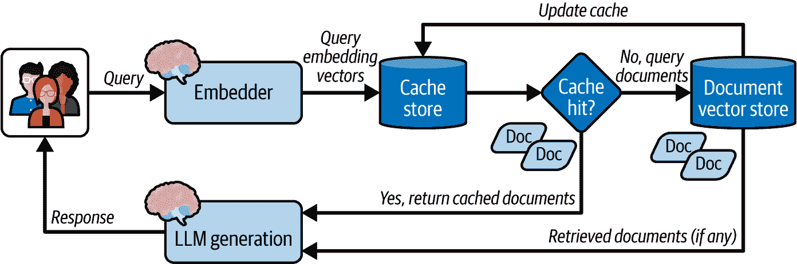
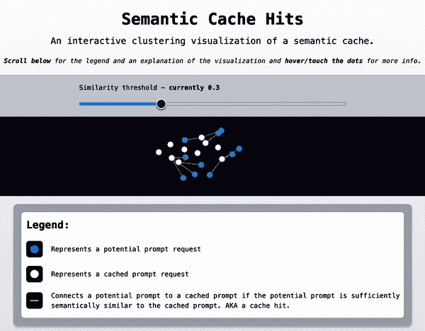
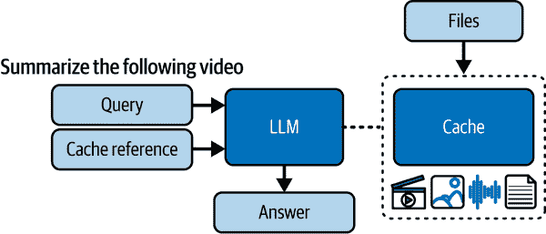
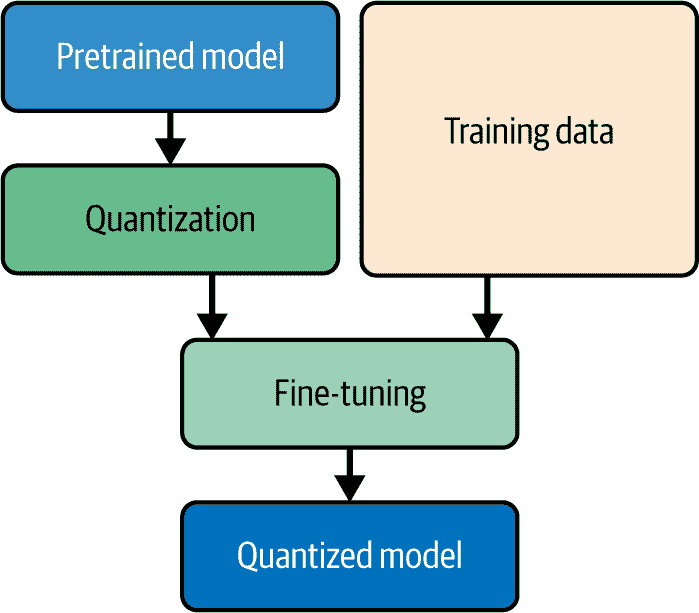
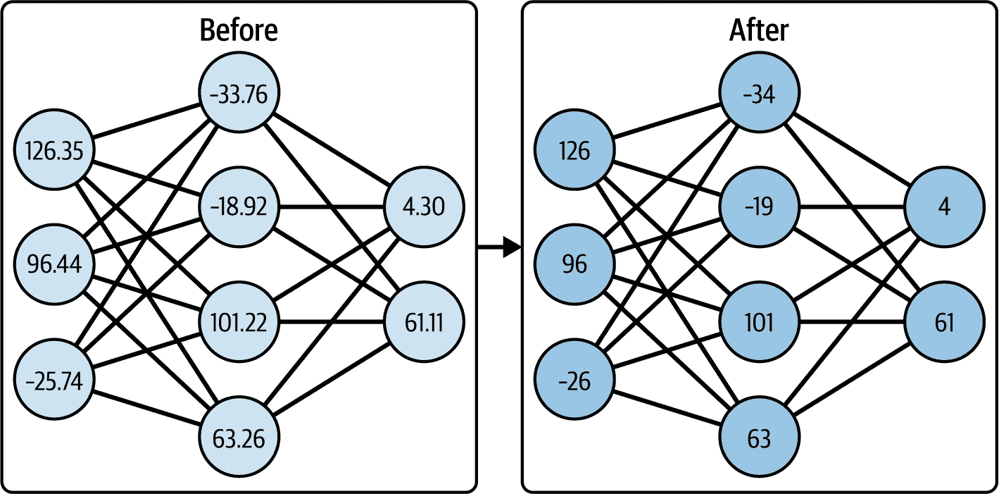
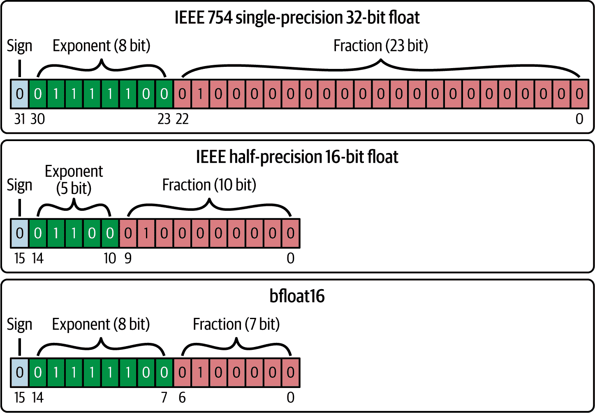
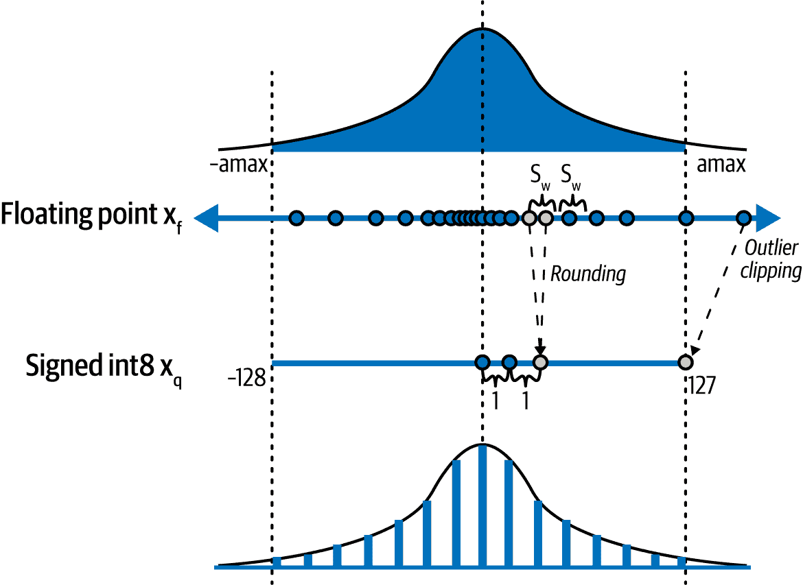

# 第十章. AI 服务优化

这项工作是用 AI 翻译的。我们很高兴收到你的反馈和评论：translation-feedback@oreilly.com

在本章中，你将学习如何通过提示工程、模型量化和缓存机制进一步优化你的服务。

# 优化技术

优化 IA 服务的目标是提高输出质量或性能（延迟、吞吐量、成本等）。

与性能相关的优化包括以下内容：

+   使用批处理 API

+   缓存（关键字、语义、上下文或提示）

+   模型量化

与质量相关的优化包括以下内容：

+   使用结构化输出

+   提示工程

+   模型调整

我们将更详细地审视每一个。

## 批处理处理

经常希望 LLM 同时处理大量条目。最明显的方法是为每个条目发送多个 API 调用。然而，这种方法可能既昂贵又缓慢，并且可能导致你的模型提供商限制费用。

在这些情况下，你可以利用两种不同的技术通过 LLM 批量处理数据：

+   更新结构化输出模式以同时返回更多示例

+   识别并使用为批处理设计的模型提供商的 API。

第一个解决方案是更新模型或 Pydantic 的提示，以便每个请求都要求一个输出列表。在这种情况下，你可以通过几个请求而不是每个条目来批量处理数据。

第一个解决方案的实现示例如下所示：示例 10-1。

##### 示例 10-1. 更新结构化输出模式以分析多个元素

```py
from pydantic import BaseModel

class BatchDocumentClassification(BaseModel):
    class Category(BaseModel):
        document_id: str
        category: list[str]

    categories: list[Category] 
```

(#co_optimizing_ai_services_CO1-1)

更新 Pydantic 模型以包含一个 `Category` 模型列表。

Ora puoi passare il nuovo schema insieme a un elenco di titoli di documenti al client OpenAI per elaborare più voci in un'unica chiamata API. Tuttavia, un'alternativa e forse la soluzione migliore sarà quella di utilizzare un'API batch, se disponibile.

幸运的是，像 OpenAI 这样的模型提供商已经为这些用例提供了合适的 API。在幕后，这些提供商可以执行代码来在后台处理单个批处理工作，并提供状态更新，直到批处理完成以检索结果。

与直接使用标准端点相比，你将能够以更低的成本（例如，与 OpenAI 相比，降低高达 50%）发送异步请求组，享受更高的速度限制，并保证完成时间。1 批处理作业服务非常适合处理不需要即时响应的工作，例如使用 OpenAI LLMs 在后台分析、分类或翻译大量文档。

为了发送批处理工作，你需要一个`jsonl`文件，其中每一行包含单个 API 请求的详细信息，如示例 10-2 所示。此外，正如这个示例所示，为了创建 JSONL 文件，你可以迭代条目并动态生成文件。

##### 示例 10-2. 从条目创建 JSONL 文件

```py
import json
from uuid import UUID

def create_batch_file(
    entries: list[str],
    system_prompt: str,
    model: str = "gpt-4o-mini",
    filepath: str = "batch.jsonl",
    max_tokens: int = 1024,
) -> None:
    with open(filepath, "w") as file:
        for _, entry in enumerate(entries, start=1):
            request = {
                "custom_id": f"request-{UUID()}",
                "method": "POST",
                "url": "/v1/chat/completions",
                "body": {
                    "model": model,
                    "messages": [
                        {
                            "role": "system",
                            "content": system_prompt,
                        },
                        {"role": "user", "content": entry},
                    ],
                    "max_tokens": max_tokens,
                },
            }
            file.write(json.dumps(request) + "\n")
```

创建后，你可以将文件发送到批处理 API 进行处理，如示例 10-3 所示。

##### 示例 10-3. 使用 OpenAI Batch API 处理批处理工作

```py
from loguru import logger
from openai import AsyncOpenAI
from openai.types import Batch

client = AsyncOpenAI()

async def submit_batch_job(filepath: str) -> Batch:
    if ".jsonl" not in filepath:
        raise FileNotFoundError(f"JSONL file not provided at {filepath}")

    file_response = await client.files.create(
        file=open(filepath, "rb"), purpose="batch"
    )

    batch_job_response = await client.batches.create(
        input_file_id=file_response.id,
        endpoint="/v1/chat/completions",
        completion_window="24h",
        metadata={"description": "document classification job"},
    )
    return batch_job_response

async def retrieve_batch_results(batch_id: str):
    batch = await client.batches.retrieve(batch_id)
    if (
        status := batch.status == "completed"
        and batch.output_file_id is not None
    ):
        file_content = await client.files.content(batch.output_file_id)
        return file_content
    logger.warning(f"Batch {batch_id} is in {status} status")
```

现在，你可以利用离线批处理端点一次处理多个条目，保证交付时间并显著降低成本。

除了利用结构化输出和批处理 API 来优化你的服务外，你还可以利用缓存技术来显著加速响应时间和服务器资源的成本。

## 缓存

在 GenAI 服务中，你通常依赖于需要大量计算或长时间处理的数据/模型响应。如果有多个用户需要相同的数据，重复相同的操作可能会很昂贵。相反，你可以使用缓存技术来存储和检索频繁访问的数据，以帮助你优化服务，通过加速响应时间、减少服务器负载和节省带宽和运营成本。

例如，在一个公共聊天机器人 FAQ 中，用户主要提出相同的问题，你可能希望将缓存中的响应重用更长时间。另一方面，对于更个性化、更动态的聊天机器人，你可以频繁更新（即使缓存中的响应失效）。

###### 建议

你应该始终根据数据的性质和可接受的陈旧程度来考虑缓存的更新频率。

对于 GenAI 服务，最重要的缓存策略包括：

+   关键字缓存

+   语义缓存

+   上下文或提示缓存

我们将更详细地考察每一个。

### 关键字缓存

如果你只需要一个简单的缓存机制来存储函数或端点的响应，你可以使用*关键字缓存*，它通过存储基于输入查询的精确匹配的键值对来存储响应。

In FastAPI, librerie come `fastapi-cache` possono aiutarti a implementare la cache delle parole chiave in poche righe di codice, su qualsiasi funzione o endpoint. Le cache FastAPI ti danno anche la possibilità di collegare backend di archiviazione come Redis per centralizzare l'archivio della cache in tutte le tue istanze.

###### Suggerimento

In alternativa, puoi implementare un meccanismo di caching personalizzato con un cache store utilizzando pacchetti di livello inferiore come `cachetools`.

Per iniziare, tutto ciò che devi fare è inizializzare e configurare il sistema di caching come parte del ciclo di vita dell'applicazione, come mostrato nell'esempio 10-4. Puoi installare la cache FastAPI utilizzando il seguente comando:

```py
$ pip install "fastapi-cache2[redis]"
```

##### Esempio 10-4\. Configurazione della durata della cache FastAPI

```py
from collections.abc import AsyncIterator
from contextlib import asynccontextmanager

from fastapi import FastAPI
from fastapi_cache import FastAPICache
from fastapi_cache.backends.redis import RedisBackend
from redis import asyncio as aioredis

@asynccontextmanager
async def lifespan(_: FastAPI) -> AsyncIterator[None]:
    redis = aioredis.from_url("redis://localhost")
    FastAPICache.init(RedisBackend(redis), prefix="fastapi-cache") 
    yield

app = FastAPI(lifespan=lifespan)
```


Inizializza `FastAPICache` con un `RedisBackend` che non decodifica le risposte in modo che i dati in cache siano memorizzati come byte (binari). Questo perché la decodifica delle risposte romperebbe la cache alterando il formato originale della risposta.

Una volta configurato il sistema di caching, puoi decorare le tue funzioni o i gestori di endpoint per mettere in cache i loro output, come mostrato nell'Esempio 10-5.

##### Esempio 10-5\. Caching dei risultati delle funzioni e degli endpoint

```py
from fastapi import APIRouter
from fastapi_cache.decorator import cache

router = APIRouter(prefix="/generate", tags=["Resource"])

@cache()
async def classify_document(title: str) -> str:
    ...

@router.post("/text")
@cache(expire=60) 
async def serve_text_to_text_controller():
    ...
```


Il decoratore `cache()` deve sempre arrivare per ultimo. Invalida la cache tra 60 secondi impostando `expires=60` per ricompilare gli output.

Il decoratore `cache()` mostrato nell'Esempio 10-5 inietta le dipendenze per gli oggetti `Request` e `Response` in modo da poter aggiungere intestazioni di controllo della cache alla risposta in uscita. Queste intestazioni di controllo della cache istruiscono i client su come mettere in cache le risposte da parte loro, specificando un insieme di direttive (cioè istruzioni).

Queste sono alcune direttive comuni per il controllo della cache durante l'invio delle risposte:

`max-age`

Definisce il tempo massimo (in secondi) in cui una risposta è considerata fresca.

`no-cache`

Forza la riconvalida in modo che i client controllino gli aggiornamenti costanti con il server.

`no-store`

Impedisce completamente il caching

`private`

Memorizza le risposte in una cache privata (ad esempio, la cache locale dei browser).

Una risposta potrebbe avere intestazioni di controllo della cache come `Cache-Control: max-age=180, private` per impostare queste direttive.^(2)

由于关键字缓存基于精确匹配，因此更适合那些预期输入具有频繁匹配的功能和 API。然而，在接收用户变量查询的 GenAI 服务中，你可能需要考虑其他基于输入意义的缓存机制，当在缓存中返回响应时。这正是语义缓存可以发挥作用的地方。

### 语义缓存

*语义缓存*是一种基于相似输入返回存储值的缓存机制。

在内部，系统使用编码器和嵌入向量来捕获输入的语义和意义，然后执行存储的关键值对的相似性搜索，以在缓存中返回一个响应。

与关键字缓存相比，相似输入可以返回相同的缓存响应。系统输入不必完全相同才能被识别为相似。即使这些输入具有不同的结构或句子结构，或者包含不精确性，只要它们具有相同的意义，它们仍然会被视为相似。此外，还要求相同的响应。例如，以下查询被认为是相似的，因为它们具有相同的意图：

+   如何使用 FastAPI 构建生成式服务？

+   FastAPI 生成式服务的开发过程是什么？

该缓存系统通过减少 API 调用（根据用例和用户基数，减少 30-40%），即以 60-70%的缓存命中率，显著降低了成本^(3))。例如，接收大量用户常见问题的 Q&A RAG 应用可以通过使用语义缓存减少 69%的 API 调用。

在典型的 RAG 系统中，有两个点可以减少需要资源和时间的操作：

+   *在 LLM 返回新响应之前，先在缓存中查找*

+   *在向量存储库之前*，用缓存中的文档丰富提示，而不是搜索和恢复新的文档。

当你在你的 RAG 系统中集成语义缓存组件时，你必须考虑缓存响应的返回是否可能对应用程序的用户体验产生负面影响。例如，如果 LLM 的响应被存储在缓存中，由于它们的高度语义相似性，以下两个查询都会返回相同的响应，导致语义缓存系统将它们视为几乎相同：

+   用 100 个词总结这篇文章

+   用 50 个词总结这篇文章

这样，你会感觉到服务没有响应用户查询。由于你可能在应用程序中还需要不同的 LLM 输出，我们将实现一个用于你的 RAG 系统的文档恢复语义缓存。图 10-1 展示了系统的完整架构。



###### 图 10-1\. RAG 系统架构中的语义缓存

让我们从零开始实现语义缓存系统，然后我们将看到如何将功能下载到外部库`gptcache`中。

#### 从零开始构建一个语义缓存服务

你可以通过实现以下组件来实施一个语义缓存系统：

+   缓存存储客户端

+   一个用于文档向量存储的客户端

+   一个嵌入模型

L'esempio 10-6 展示了如何实现缓存存储客户端。

##### Esempio 10-6\. 缓存存储客户端

```py
import uuid
from qdrant_client import AsyncQdrantClient, models
from qdrant_client.http.models import Distance, PointStruct, ScoredPoint

class CacheClient:
    def __init__(self):
        self.db = AsyncQdrantClient(":memory:") 
        self.cache_collection_name = "cache"

    async def initialize_database(self) -> None:
        await self.db.create_collection(
            collection_name=self.cache_collection_name,
            vectors_config=models.VectorParams(
                size=384, distance=Distance.EUCLID
            ),
        )

    async def insert(
        self, query_vector: list[float], documents: list[str]
    ) -> None:
        point = PointStruct(
            id=str(uuid.uuid4()),
            vector=query_vector,
            payload={"documents": documents},
        )
        await self.db.upload_points(
            collection_name=self.cache_collection_name, points=[point]
        )

    async def search(self, query_vector: list[float]) -> list[ScoredPoint]:
        return await self.db.search(
            collection_name=self.cache_collection_name,
            query_vector=query_vector,
            limit=1,
        )
```

[#co_optimizing_ai_services_CO4-1]

初始化一个运行在内存上的 Qdrant 客户端，作为缓存存储。

一旦初始化了缓存存储客户端，你可以根据 Esempio 10-7 配置文档向量存储。

##### Esempio 10-7\. 文档存储客户端

```py
from qdrant_client import AsyncQdrantClient, models
from qdrant_client.http.models import Distance, ScoredPoint

documents = [...] 

class DocumentStoreClient:
    def __init__(self, host="localhost", port=6333):
        self.db_client = AsyncQdrantClient(host=host, port=port)
        self.collection_name = "docs"

    async def initialize_database(self) -> None:
        await self.db_client.create_collection(
            collection_name=self.collection_name,
            vectors_config=models.VectorParams(
                size=384, distance=Distance.EUCLID
            ),
        )
        await self.db_client.add(
            documents=documents, collection_name=self.collection_name
        )

    async def search(self, query_vector: list[float]) -> list[ScoredPoint]:
        results = await self.db_client.search(
            query_vector=query_vector,
            limit=3,
            collection_name=self.collection_name,
        )
        return results
```

[#co_optimizing_ai_services_CO5-1]

在 Qdrant 向量存储中加载文档集合。

在准备好缓存和文档向量存储客户端之后，你现在可以像 Esempio 10-8 中展示的那样实现语义缓存服务，包括计算嵌入和执行缓存中的搜索的方法。

##### Esempio 10-8\. 语义缓存系统

```py
import time
from loguru import logger
from transformers import AutoModel

...

class SemanticCacheService:
    def __init__(self, threshold: float = 0.35):
        self.embedder = AutoModel.from_pretrained(
            "jinaai/jina-embeddings-v2-base-en", trust_remote_code=True
        )
        self.euclidean_threshold = threshold
        self.cache_client = CacheClient()
        self.doc_db_client = DocumentStoreClient()

    def get_embedding(self, question) -> list[float]:
        return list(self.embedder.embed(question))[0]

    async def initialize_databases(self):
        await self.cache_client.initialize_databases()
        await self.doc_db_client.initialize_databases()

    async def ask(self, query: str) -> str:
        start_time = time.time()
        vector = self.get_embedding(query)
        if search_results := await self.cache_client.search(vector):
            for s in search_results:
                if s.score <= self.euclidean_threshold: 
                    logger.debug(f"Found cache with score {s.score:.3f}")
                    elapsed_time = time.time() - start_time
                    logger.debug(f"Time taken: {elapsed_time:.3f} seconds")
                    return s.payload["content"]

        if db_results := await self.doc_db_client.search(vector): 
            documents = [r.payload["content"] for r in db_results]
            await self.cache_client.insert(vector, documents)
            logger.debug("Query context inserted to Cache.")
            elapsed_time = time.time() - start_time
            logger.debug(f"Time taken: {elapsed_time:.3f} seconds")

        logger.debug("No answer found in Cache or Database.")
        elapsed_time = time.time() - start_time
        logger.debug(f"Time taken: {elapsed_time:.3f} seconds")
        return "No answer available." 
```

[#co_optimizing_ai_services_CO6-1]

设置一个相似度阈值。任何高于这个阈值的分数都将被视为缓存命中。

[#co_optimizing_ai_services_CO6-2]

如果缓存中没有找到匹配项，则查询文档存储。将使用查询向量嵌入作为键将检索到的文档存储在缓存中。

[#co_optimizing_ai_services_CO6-3]

如果没有相关文档或缓存可用，则返回一个 boxed 的响应。

现在你有一个语义缓存服务，你可以使用它来根据 Esempio 10-9 从内存中恢复缓存中的文档。

##### Esempio 10-9\. 在 RAG 系统中使用 Qdrant 实现语义缓存

```py
async def main():
    cache_service = SemanticCacheService()
    query_1 = "How to build GenAI services?"
    query_2 = "What is the process for developing GenAI services?"

    cache_service.ask(query_1)
    cache_service.ask(query_2)

asyncio.run(main())

# Query 1:
# Query added to Cache.
# Time taken: 0.822 seconds

# Query 2:
# Found cache with score 0.329
# Time taken: 0.016 seconds
```

现在，你应该已经更好地理解了如何使用向量数据库客户端实现自定义的语义缓存系统。

#### 使用 GPT 缓存进行语义缓存

如果你不需要从头开始开发你的语义缓存服务，你也可以使用模块化库`gptcache`，它给你交换各种存储、缓存和嵌入组件的机会。

要使用 `gptcache` 配置语义缓存，你必须首先安装以下包：

```py
$ pip install gptcache
```

因此，在应用程序启动时加载系统，如 示例 10-10 所示。

##### Esempio 10-10\. 配置 GPT 缓存

```py
from contextlib import asynccontextmanager
from typing import AsyncIterator

from fastapi import FastAPI
from gptcache import Config, cache
from gptcache.embedding import Onnx
from gptcache.processor.post import random_one
from gptcache.processor.pre import last_content
from gptcache.similarity_evaluation import OnnxModelEvaluation

@asynccontextmanager
async def lifespan(_: FastAPI) -> AsyncIterator[None]:
    cache.init(
        post_func=random_one, 
        pre_embedding_func=last_content, 
        embedding_func=Onnx().to_embeddings, 
        similarity_evaluation=OnnxModelEvaluation(), 
        config=Config(similarity_threshold=0.75), 
    )
    cache.set_openai_key() 
    yield

app = FastAPI(lifespan=lifespan)
```


选择一个后处理回调函数来从缓存中返回的元素中选择一个随机元素。


选择一个预包含的回调函数来使用最新查询来设置新的缓存。


使用 ONNX 集成模型来计算嵌入向量。


使用 `OnnxModelEvaluation` 来计算缓存元素与特定查询之间的相似度得分。


设置缓存配置选项，例如相似度阈值。


为 GPT Cache 提供一个 OpenAI 客户端 API 密钥以自动在 LLM API 的响应上执行语义缓存。

一旦初始化，`gptcache` 将完美集成到你的应用程序中的 OpenAI LLM 客户端。现在你可以执行多个 LLM 查询，如 示例 10-11 所示，知道 `gptcache` 会将 LLM 的响应放入缓存。

##### 示例 10-11\. 使用 GPT 缓存进行语义缓存

```py
import time
from openai import OpenAI
client = OpenAI()

question = "what's FastAPI"
for _ in range(2):
    start_time = time.time()
    response = client.chat.completions.create(
        model="gpt-4o",
        messages=[{"role": "user", "content": question}],
    )
    print(f"Question: {question}")
    print("Time consuming: {:.2f}s".format(time.time() - start_time))
    print(f"Answer: {response.choices[0].message.content}\n")
```

如 示例 10-11 所示，使用 `gptcache` 等外部库使语义缓存的实现变得简单。

一旦缓存系统启动并运行，你可以调整 *相似度阈值* 来优化缓存的成功率。

#### 相似度阈值

当创建语义缓存服务时，你可能需要根据提供的查询调整相似度阈值以获得高响应率和准确率。你可以参考 图 10-2 中所示的 [语义缓存集群交互式可视化](https://semanticcachehit.com) 来更好地理解相似度阈值的概念。

在 图 10-2 中增加阈值值将得到一个连接度较低的图，而将其降至最低可能会得到一些假阳性。因此，建议为你的应用程序调整相似度阈值进行一些实验。



###### 图 10-2\. 语义缓存可视化（来源：[semanticcachehit.com](https://semanticcachehit.com)）

#### 清理策略

对于缓存来说，另一个相关的概念是 *驱逐策略*，它控制着缓存在缓存机制达到最大容量时的行为。选择合适的驱逐策略必须适合你的用例。

###### 建议

由于内存缓存的大小通常有限，你可以在你实现的 `Esempio 10-8` 中的 `SemanticCachingService` 添加一个 `evict()` 方法。

表 10-1 展示了一些你可以选择驱逐策略。

表 10-1\. 驱逐策略

| 政策 | 描述 | 用例 |
| --- | --- | --- |
| 首进先出 (FIFO) | 移除最旧的元素 | 当所有元素具有相同的优先级时 |
| 最近最少使用 (LRU) | 跟踪缓存的使用情况，并移除最后访问的元素。 | 当最近访问的元素最有可能再次被访问时 |
| 使用频率最低 (LFU) | 跟踪缓存的使用情况，并移除访问频率最低的元素。 | 当使用频率最低的文章需要首先被移除时 |
| 最近最少使用 (MRU) | 跟踪缓存的使用情况，并移除最后访问的元素。 | 使用频率低，当最近使用过的文章不太可能再次被访问时。 |
| 随机替换 (RR) | 从缓存中随机移除一个元素 | 简单快捷，当它不会影响性能时使用 |

选择合适的驱逐策略取决于你的用例和应用程序的要求。一般来说，你可以从 LRU 策略开始，然后再考虑其他替代方案。

现在，你应该在实现适用于文档检索或模型响应的语义缓存机制方面更有信心。然后，我们将了解上下文缓存或提示缓存，它根据模型的输入优化模型查询。

### 上下文和提示缓存

*上下文缓存*，也称为 *提示缓存*，是一种适合于在小型请求中反复引用大量上下文的缓存机制。它被设计用来重用频繁重用的提示预计算的注意力状态，从而消除每次进行新请求时重复编译整个输入上下文的必要性。

当你的服务预计以下情况时，你应该考虑使用上下文相关的缓存：

+   具有扩展系统指令和长轮询对话的聊天机器人

+   长视频文件的重复分析

+   对大型文档集的重复查询

+   经常对代码库进行频率分析或修复错误

+   文档、书籍、录音、播客转录以及其他长期内容摘要。

+   在提示中提供大量示例（即上下文学习）。

根据 Anthropic 的说法，提示缓存可以将成本降低至 90%，并将延迟降低至 85%，特别是对于较长的提示。

提出这种技术的 [提示缓存文档](https://oreil.ly/augpd) 的作者还声称：

> 我们发现，Prompt Cache 显著降低了首次令牌的延迟，尤其是在基于文档的问答和推荐等较长的提示中。改进从基于 GPU 的推理的 8 倍到基于 CPU 的推理的 60 倍不等，同时保持了输出准确性，且无需修改模型参数。

图 10-3 显示了上下文缓存系统的架构。



###### 图 10-3\. 上下文缓存系统架构

在我们撰写本文时，OpenAI 自动为所有 API 请求实施提示缓存，无需对代码进行修改或额外成本。示例 10-12 展示了在使用 Antropica API 时使用提示缓存的示例。

##### 示例 10-12\. 使用 Antropica API 缓存上下文和提示

```py
from anthropic import Anthropic

client = Anthropic()

response = client.messages.create(
    model="claude-3-7-sonnet-20250219", 
    max_tokens=1024,
    system=
        {
            "type": "text",
            "text": "You are an AI assistant",
        },
        {
            "type": "text",
            "text": "<the entire content of a large document>",
            "cache_control": {"type": "ephemeral"}, ![2
        },
    ],
    messages=[{"role": "user", "content": "Summarize the documents in ..."}],
)
print(response)
```


提示缓存仅适用于某些模型，包括 Claude 3.5 Sonnet、Claude 3 Haiku 和 Claude 3 Opus。


使用 `cache_control` 参数，可以在多个 API 调用中重用大型文档的内容，而无需每次都进行处理。

在内部，Anthropic 客户端将 `anthropic-beta: prompt-caching-2024-07-31` 添加到请求的头部。

在我们撰写本文时，`ephemeral` 是唯一支持的缓存类型，其对应于 5 分钟的缓存持续时间。

###### 注意

当采用上下文缓存时，通过在所有请求中保留令牌来引入请求的稳定性。这意味着在一个请求中发送的数据将影响后续请求，因为模型提供者的服务器可以使用缓存的上下文来保持交互的连续性。

使用 API Gemini 的上下文缓存功能，你可以一次性向模型提供内容，将输入令牌放入缓存，并在未来的请求中引用这些缓存中的令牌。

在缓存中使用这些令牌可以显著节省费用，如果你避免重复发送相同的大量令牌语料库。缓存的成本将取决于输入令牌的大小和期望的生存时间（TTL）持续时间。

###### 建议

当你缓存一组令牌时，你可以指定 TTL（Time To Live，即缓存存在的时间，在此之后令牌将被自动删除）的持续时间。默认情况下，TTL 通常设置为 1 小时。

你可以在 Esempio 10-13 中看到如何使用系统指令在缓存中。你还需要 Gemini API Python SDK：

```py
$ pip install google-generativeai
```

##### 10-13 示例。使用 Google Gemini API 进行上下文缓存

```py
import datetime
import google.generativeai as genai
from google.generativeai import caching

genai.configure(api_key="your_gemini_api_key")

corpus = genai.upload_file(path="corpus.txt")
cache = caching.CachedContent.create(
    model='models/gemini-1.5-flash-001',
    display_name='fastapi', 
    system_instruction=(
        "You are an expert AI engineer, and your job is to answer "
        "the user's query based on the files you have access to."
    ),
    contents=[corpus], 
    ttl=datetime.timedelta(minutes=5),
)

model = genai.GenerativeModel.from_cached_content(cached_content=cache)
response = model.generate_content(
    [
        (
            "Introduce different characters in the movie by describing "
            "their personality, looks, and names. Also list the timestamps "
            "they were introduced for the first time."
        )
    ]
)
```


提供一个可视名称作为缓存的关键字或标识符。


将语料库传递给上下文缓存系统。上下文缓存的最小尺寸是 32.768 个令牌。

如果你执行了 Esempio 10-13 并打印了`response.usage_metadata`网站，你应该会收到以下输出：

```py
>> print(response.usage_metadata)

prompt_token_count: 696219
cached_content_token_count: 696190
candidates_token_count: 214
total_token_count: 696433
```

注意，现在大部分`prompt_token_count`都被缓存了，如果与`cached_content_token_count`相比。`candidates_token_count`指的是来自模型的输出或响应令牌计数，它不受缓存系统的影响。

###### 注意事项

Gemini 模型不会区分缓存中存储的令牌和普通输入令牌。缓存中的内容会优先于提示。因此，当使用缓存时，提示的令牌数量不会减少。

使用上下文缓存，你不会看到响应时间的显著减少，但你会显著降低运营成本，因为你可以避免重新发送系统提示和上下文令牌。因此，这种缓存策略更适合于你有广泛上下文的情况，例如当你处理带有完整指令和示例的批处理文件时。

###### 注意

使用相同的上下文缓存和提示并不能保证模型给出一致的回答，因为 LLMs 的回答不是确定性的。上下文缓存并不存储任何输出。

上下文缓存仍然是一个活跃的研究领域。如果你想避免供应商锁定，在这个领域已经有一些进展，比如使用开源工具[*MemServe*](https://oreil.ly/PXm6B)，它通过一个弹性内存池实现了上下文缓存。

除了缓存之外，你还可以通过使用如*模型量化*等技术来减少模型尺寸，以加速响应时间。

## 模型量化

如果你打算自己使用像 LLMs 这样的模型，你应该考虑将你的模型*量化*（即压缩/减少）的想法，如果可能的话。通常，开源模型仓库也提供了你可以下载并立即使用的量化版本，无需经历量化过程。

*模型量化*是一个调节模型权重和激活的过程，其中模型的高精度参数通过使用原始参数分布上的缩放因子进行的精细调节操作，统计地投影到低精度值。因此，可以使用较低的精度执行所有关键的推理操作，之后可以将输出转换回高精度以保持质量和提高性能。

通过降低精度，也会减少内存需求，理论上降低能耗，并通过整数算术加速矩阵乘法等操作。这也使得模型可以在仅支持整数数据类型的嵌入式设备上运行。

图 10-4 展示了完整的量化过程。



###### 图 10-4\. 量化过程

由于低精度数据类型如 8 位整数所需的 RAM 参数量远低于 32 位浮点数据类型，因此可以在 GPU 内存消耗上节省超过一打 GB。

### 精度和质量之间的折衷

图 10-5 将未量化和量化的模型进行了对比。



###### 图 10-5\. 量化

由于每个 32 位高精度浮点参数消耗 4 个字节的 GPU 内存，一个包含 10 亿个参数的模型仅用于推理就需要 4GB 的内存。如果你打算重新训练或优化同一个模型，你至少需要 24GB 的 GPU VRAM。这是因为每个参数还需要存储梯度、训练优化器的状态、激活和临时内存空间等信息，总共消耗额外的 24 字节。这估计比仅加载模型权重所需的内存需求高出 6 倍。因此，同样的 10 亿参数模型需要 24GB 的 GPU，即使是最好的、最昂贵的显卡如 NVIDIA RTX 4090 也可能难以满足。

与使用标准的 32 位浮点格式相比，你可以选择以下格式之一：

+   *16 位浮点（FP16）*在不过度牺牲模型质量的情况下，仅使用一半的内存。

+   *8 位整数（INT8）*可以大幅节省内存，但会显著降低质量。

+   *16 位半精度浮点（BFLOAT16）*与 FP32 具有相似的区间，平衡了内存和质量的折衷。

+   *4 位整数（INT4）*在内存效率和计算精度之间提供了平衡，使其适用于低功耗设备。

+   *1 位整数（INT1）* 使用最低精度的数据类型，具有最大的模型尺寸缩减。目前正在进行创建[1 位 LLMs](https://oreil.ly/QH9nH)的高质量研究。

作为对比，表 10-2 展示了在量化 Llama 家族模型时模型尺寸的减少。

表 10-2\. 量化对 Llama 模型尺寸的影响^(a)

| 模型 | 原始 | FP16 | 8 位 | 6 位 | 4 位 | 2 位 |
| --- | --- | --- | --- | --- | --- | --- |
| Llama 2 70B | 140 GB | 128,5 GB | 73,23 GB | 52,70 GB | 36,20 GB | 28,59 GB |
| Llama 3 8B | 16,07 GB | 14,97 GB | 7,96 GB | 4,34 GB | 4,34 GB | 2,96 GB |
| ^(a) 来源：[Llama.cpp GitHub 仓库](https://oreil.ly/9iYtL) 和 [Tom Jobbins 的 Hugging Face Llama 2 70B 模型卡](https://oreil.ly/BMDtR) |

###### 建议

除了用于加载模型的 GPU VRAM 之外，你还需要额外的 5-8 GB GPU VRAM 来处理模型加载过程中的开销。

在当前的研究阶段，仅使用 INT4 和 INT1 整数类型保持精度是一个挑战，而使用 INT32 或 FP16 提高性能并不显著。因此，最常用的低精度数据类型是 INT8 用于推理。

根据研究[链接](https://oreil.ly/C7Lz3)，仅使用整数算术进行推理将比使用浮点数更高效。然而，将浮点数量化为整数可能会很复杂：例如，INT8 只能表示 256 个值，而 float32 可以表示广泛的值。

### 浮点数

为了理解为什么将浮点数投影到 32 位其他格式会在 GPU 内存方面节省这么多，我们来分析一下整个过程。

一个 32 位浮点数由以下类型的位组成：

+   *符号*位描述一个数字是正数还是负数

+   *指数*位控制数字的规模

+   *尾数*位包含确定其精度的实际数字（也称为分数位）

在图 10-6 中，你可以看到上述浮点数中的位表示。



###### 图 10-6\. 32 位浮点数、16 位浮点数和 bfloat16 的位

当将 FP32 数投影到其他格式时，实际上是将它们压缩到更小的区间，丢失了大部分尾数位，并调整了指数位，但并没有丢失大部分精度。你可以通过参考图 10-7 来观察这一现象。



###### 图 10-7\. 浮点数到整数的量化

实际上，[关于预训练 LLM 量化策略的研究](https://oreil.ly/Swfz7)表明，量化到 4 位的 LLMs 可以保持与未量化版本相似的性能。然而，一方面量化可以节省内存，另一方面可能会降低 LLMs 的推理速度。

### 如何量化预训练的 LLMs

其中一种技术，称为[*GPTQ*](https://oreil.ly/rHYKZ)，能够在大约 4 小时的 GPU 时间内量化具有 1750 亿参数的 LLMs，将权重位宽降低到 3 或 4 位，与未压缩模型相比，精度损失可以忽略不计。

Hugging Face 的`transformers`和`optimum`库的作者与`auto-gptq`库的开发者紧密合作，提供了一个简单的 API 来在 LLMs 开源项目中应用 GPTQ 量化。Optimum 是一个提供 API 以使用不同工具执行量化的库。

使用 GPTQ 量化，你可以将你偏好的语言模型量化到 8、4、3 甚至 2 位，而不会大幅降低性能，同时保持比大多数 GPT 硬件支持的更高的推理速度。你可以遵循 Esempio 10-14 来在你的 GPU 上量化预训练模型。

为了运行 Esempio 10-14 示例，你需要安装以下依赖项：

```py
$ pip install auto-gptq optimum transformers accelerate
```

##### Esempio 10-14. 使用 Hugging Face 和 AutoGPTQ 库量化 GPTQ 模型

```py
import torch
from optimum.gptq import GPTQQuantizer
from transformers import AutoModelForCausalLM, AutoTokenizer

model_name = "facebook/opt-125m" 
tokenizer = AutoTokenizer.from_pretrained(model_name)
model = AutoModelForCausalLM.from_pretrained(
    model_name, torch_dtype=torch.float16
)

quantizer = GPTQQuantizer(
    bits=4,
    dataset="c4", 
    block_name_to_quantize="model.decoder.layers", 
    model_seqlen=2048, 
)
quantized_model = quantizer.quantize_model(model, tokenizer)
```

(#co_optimizing_ai_services_CO10-1)

在量化之前，加载预训练模型`facebook/opt-125m`的`float16`版本。

(#co_optimizing_ai_services_CO10-2)

使用数据集`c4`来校准量化。

(#co_optimizing_ai_services_CO10-3)

只量化模型的解码层块。

(#co_optimizing_ai_services_CO10-4)

使用`2048`长度的模型序列来处理数据集。

###### 建议

作为参考，一个 175B 的模型需要 4 小时的 GPU 时间在 NVIDIA A100 上进行量化。然而，值得在 Hugging Face 模型库中寻找预量化模型，因为你可能发现有人已经完成了这项工作。

现在你已经理解了性能优化的技术，让我们看看如何通过使用结构化输出等方法来提高你的 GenAI 服务的质量。

## 结构化输出

基本模型，如 LLMs，可以用作数据管道的组件或连接到下游应用。例如，你可以使用这些模型从文档中提取和分析信息，或者生成可以在其他系统上运行的代码。

你可以要求 LLM 提供一个包含 JSON 信息的文本响应。然后，你需要使用正则表达式和 Pydantic 等工具提取和分析这个 JSON 字符串。然而，没有保证模型始终遵循你的指令。由于你的下游系统可能基于 JSON 输出，它们可能会抛出异常并错误地处理无效输入。

已发布了一些如 Instructor 之类的实用工具包，以提高 LLM 响应的鲁棒性，通过采用一个架构并使用不同的提示模型进行多次 API 调用以实现所需的输出。虽然这些解决方案提高了鲁棒性，但它们也由于后续对模型提供商的 API 调用而增加了你的解决方案的成本。

最近，模型提供商增加了一个功能，允许在调用模型 API 时请求结构化输出，并提供架构，如 Esempio 10-15 所示。这有助于减少你需要自己完成的提示模板工作，并旨在提高模型在返回响应时与你的意图的*对齐*。

###### 注意事项

在我们撰写本文时，只有最新的 OpenAI SDK 支持 Pydantic 模型以启用结构化输出。

##### 示例 10-15\. 结构化输出

```py
from openai import AsyncOpenAI
from pydantic import BaseModel, Field

client = AsyncOpenAI()

class DocumentClassification(BaseModel): 
    category: str = Field(..., description="The category of the classification")

async def get_document_classification(
    title: str,
) -> DocumentClassification | str | None:
    response = await client.beta.chat.completions.parse(
        model="gpt-4o",
        messages=[
            {
                "role": "system",
                "content": "classify the provided document into the following: ...",
            },
            {"role": "user", "content": title},
        ],
        response_format=DocumentClassification, 
    )

    message = response.choices[0].message
    return message.parsed if message.parsed is not None else message.refusal
```


指定用于结构化输出的 Pydantic 模型。


在调用 API 时向模型客户端提供定义的架构。

如果你的模型提供商不支持原生结构化输出，你仍然可以利用模型的聊天补全功能来提高结构化输出的鲁棒性，如 Esempio 10-16 所示。

##### 示例 10-16\. 基于预填充聊天的结构化输出

```py
import json
from loguru import logger
from openai import AsyncOpenAI
client = AsyncOpenAI()

system_template = """
Classify the provided document into the following: ...

Provide responses in the following manner json: {"category": "string"}
"""

async def get_document_classification(title: str) -> dict:
    response = await client.chat.completions.create(
        model="gpt-4o",
        max_tokens=1024, 
        messages=
            {"role": "system", "content": system_template},
            {"role": "user", "content": title},
            {
                "role": "assistant",
                "content": "The document classification JSON is {", ![2
            },
        ],
    )
    message = response.choices[0].message.content or ""
    try:
        return json.loads("{" + message[: message.rfind("}") + 1]) 
    except json.JSONDecodeError: 
        logger.warning(f"Failed to parse the response: {message}")
    return {"error": "Refusal response"}
```


限制输出 token 以提高结构化响应的鲁棒性和速度，并降低成本。


跳过前言并直接返回预编译的 JSON，通过包含字符`{`来返回助手的响应。


再次添加预过滤的`{`，然后找到关闭的`}`并提取相应的 JSON 字符串。


处理响应中不存在 JSON 的情况，例如，如果发生拒绝。

遵循上述描述的技术应该有助于提高你的数据管道的鲁棒性，如果这些管道使用 LLMs 作为组件的话。

## Ingegneria prompt

提示工程是创建和优化生成模型查询的实践，以产生最有用和优化的结果。如果不完善提示，你应该完善模型或从头开始训练一个模型以优化结果质量。

许多人都认为这个领域缺乏必要的科学严谨性，不能被视为一个工程学科。然而，当优化提示以获得最佳输出质量时，可以从工程角度来处理这个问题。

就像你与他人沟通以获得所需事物一样，通过优化的提示，你可以更有效地向模型传达你的意图，从而增加获得期望回答的可能性。因此，提示不仅是一个工程问题，也是一个沟通问题。一个模型可以比作一个经验丰富的同事，但对该领域的知识有限，愿意帮助你，但需要你提供详细的指令，可能还需要一些示例来遵循和匹配。

如果你的提示模糊且通用，你也会得到一个平均水平的回答。

另一种思考这个优化问题的方式是将模型的提示活动比作编程。你实际上是在“编码”一个模型，使其成为更大应用程序或数据管道中一个良好集成的组件。你可以采用测试驱动开发（TDD）的方法，直到测试通过为止来完善提示。或者，你可以尝试不同的模型，看看哪个模型更好地*对齐*其输出与你的意图。

###### 注意

对于许多模型提供商来说，最大化模型的*一致性*仍然是首要目标，以确保他们的结果能够最好地满足用户意图。

### 提示模型

如果系统的指令不系统、不清晰且不遵循最佳提示实践，你可能会错失潜在的质量和性能优化。

至少，你应该有一些清晰的提示，为模型提供具体的任务。最佳实践是遵循一个系统性的方法。例如，你可以按照*角色、情境和任务*（RCT）模型来编写模型的指令：

角色

研究表明，为大型语言模型（LLMs）指定角色往往会显著影响其结果。例如，如果你让一个模型扮演小学教师的角色，它可能在评估论文时更加宽容。如果没有指定具体的角色，模型可能会假设你希望评估遵循大学学术水平的标准。

###### 注意

你可以进一步扩展模型的角色，并详细描述模型需要扮演的*人物*。通过使用人物，模型将确切知道如何表现和做出预测，因为它将拥有更广泛的关于该角色应该表现为何种行为的上下文。

上下文

定义场景，描绘画面，并提供所有模型可以使用的相关和有用信息作为预测的参考。如果没有明确的上下文，模型只能使用隐含的上下文，其中包含其训练数据的平均信息。在一个 RAG 应用中，上下文可能是系统提示和从知识库中检索到的文档片段的串联。

任务

当描述任务时，确保将模型视为一个聪明且准备充分的学习者，随时准备行动，但需要非常清晰且不含糊的指示，可能还需要一些示例。

按照上述系统模型进行操作，你应该能够以最小的努力提高你模型的结果质量。

### 高级提示技术

除了基本提示原则之外，你可以使用更高级的技术，这些技术可能更适合你的用例。根据一项关于提示技术的[最近系统调查](https://oreil.ly/xynPC)，你可以将 LLM 的提示分为以下几类：

+   上下文学习

+   思维生成

+   分解

+   组装

+   自我批评

+   代理

我们将更详细地审视每一种。

#### 上下文学习

区分像 LLMs 这样的基本模型和传统机器学习模型的是它们能够对动态输入做出响应，而无需不断的调整或再训练。

当向 LLM 提供系统指令时，你也可以提供不同的示例（例如，框架）来引导输出生成。

[零样本提示](https://oreil.ly/3F4wb)指的是一种提示方法，它不指定参考示例，但模型仍然可以成功完成给定的任务。如果模型在没有参考示例的情况下遇到困难，你可能需要使用[少量样本提示](https://oreil.ly/pOSj8)，其中你提供一些示例。也有使用*动态少量样本提示*的情况，其中你动态地从数据库或向量库中检索数据来插入示例。

基于提示的方法，其中指定了示例，也被定义为*上下文学习*。实际上，你正在根据你的示例和给定的任务调整模型的结果，而不实际修改模型的权重/参数，而其他 ML 模型则可能需要修改它们的权重。

这就是为什么 LLMs 和基础模型如此强大的原因，因为它们不需要总是调整权重来适应分配给它们的数据和任务。你可以通过参考表 10-3 了解不同的上下文学习技术。

表 10-3. 上下文学习提示技术

| 提示技术 | 示例 | 用例 |
| --- | --- | --- |
| 零次打击 | 概括以下要点... | 概括、问答，没有特定训练示例的问题和答案 |
| 少量打击 | 根据以下示例对文档进行分类:[示例] | 文本分类，情感分析，带示例的数据提取 |
| 动态短片段 | 根据以下示例对以下文档进行分类:<从基于查询的向量库中注入示例>. | 定制化回答，解决复杂问题 |

上下文学习提示简单、有效，是完成一系列任务的绝佳起点。对于更复杂的任务，你可以使用更高级的提示方法，如思维生成、分解、组装、自我批评或敏捷方法。

#### 思维生成

思维生成技术，如[思维链（CoT）](https://oreil.ly/BWUYQ)，已被证明可以显著提高 LLMs 执行复杂推理的能力。

在 COT 提示中，要求模型在提供答案时解释其思维过程和推理。CoT 的变体包括[零次 CoT](https://oreil.ly/1gjSH)或[少量打击](https://oreil.ly/1gjSH)，具体取决于是否提供示例。一种更高级的思维生成技术是[思维线程（ThoT）](https://oreil.ly/1KyO4)，它系统地分割和分析混乱且非常复杂的信息或任务。

表 10-4 列出了思维生成技术。

表 10-4. 思维生成提示技术

| 提示技术 | 示例 | 用例 |
| --- | --- | --- |
| 零次打击思维链（CoT） | 逐步思考... | 解决数学问题、逻辑推理和多阶段决策过程。 |
| 零次打击 CoT | 逐步思考...以下是一些示例:[示例] | 一些示例可以引导模型达到更好性能的场景，如模糊文本分类、复杂问题的回答和创意写作提示。 |
| 思维线索 (ThoT) | 将问题分解为可管理的部分，逐步总结和分析... | 在多次交互中保持上下文，如对话系统、交互式叙事和长期内容生成。 |

#### 分解

分解提示技术集中在将复杂任务分解为更小的子任务上，以便模型可以逐步、逻辑地处理它们。你可以与思维生成一起实验这些方法，以确定哪些方法对你的用例产生最佳结果。

这些是最常见的分解提示技术：

[从少到多](https://oreil.ly/HmsSN)

要求模型通过逻辑减少将复杂问题分解为更小的问题，而不解决它们。然后，你可以要求模型逐个解决每个任务。

[计划和解决](https://oreil.ly/aWTzf)

对于一个任务，要求制定一个计划，然后要求模型解决它。

[思维树 (ToT)](https://oreil.ly/IZdj1)

创建一个树形搜索问题，其中任务被分解为多个步骤的分支，就像一棵树。然后，调用模型来评估和解决每个步骤的分支。

表 10-5 展示了这些分解技术。

表 10-5\. 分解提示技术

| 提示技术 | 示例 | 用例 |
| --- | --- | --- |
| 从少到多 | 将...任务分解为更小的任务。 | 复杂问题解决、项目管理、任务分解 |
| 计划和解决 | 设计一个计划来... | 算法开发、软件开发设计、战略规划 |
| 思维树 (ToT) | 创建一个决策树以选择一个... | 决策过程、具有多个解决方案的问题解决、具有替代方案的战略规划 |

#### 组装

*“组装”* 是一个过程，它涉及使用多个提示来解决相同的问题，并将这些响应汇总为最终的输出。你可以使用相同的模型或不同的模型生成这些响应。

集成背后的主要思想是通过提高使用成本来减少 LLM 结果的变化，从而提高准确性。

最常见的集成提示技术如下：

[自洽性](https://oreil.ly/_85WS)

通过生成更多推理路径并使用多数投票选择最一致的输出作为最终结果。

[混合推理专家 (MoRE)](https://oreil.ly/xllKs)

通过使用专门的提示将多个 LLM 的结果结合起来，以提高答案的质量。每个 LLM 都作为专注于不同推理任务的领域专家，如事实推理、逻辑简化、常识控制等。

[组装演示（DENSE）](https://oreil.ly/lPEPz)

从数据中创建多个短提示，然后通过汇总答案生成最终输出。

[提示改写](https://oreil.ly/yP_ka)

通过公式化提出原始提示的多个变体。

表 10-6 展示了这些组装技术的例子和用例。

表 10-6\. 群组提示技术

| 提示技术 | 例子 | 用例 |
| --- | --- | --- |
| 自我一致性 | 提示 #1（需要多次执行）：我们一步一步思考，完成以下活动...提示 #2：在以下答案中选择最佳/最常见的一个，并使用以下标准进行评分... | 减少算术、常识和符号推理任务中的错误或扭曲。 |
| 多专家推理混合（MoRE） | 提示 #1（为每位专家执行）：如果你是...的评论家，根据以下标准给以下内容打分...提示 #2：根据一致性评分选择专家的最佳答案... | 专门领域或知识领域的会计 |
| 组装演示（DENSE） | 创建多个翻译示例并汇总最佳答案。生成多个提示来总结文章并组合结果。 |

+   提高生产的可靠性

+   聚集不同的观点

|

| 提示改写 | 提示 #1a：重新表述这个提议...提示 #1b：澄清这个提议...提示 #1c：对这个提议进行修改...提示 #2：根据以下标准从以下答案中选择最佳提议... |
| --- | --- |

+   探索不同的解释

+   增加用于组装的数据

|

#### 自我批评

自我批评技术集中在使用模型作为人工智能的评判者、评估者或审稿人，无论是进行自我检查还是评估其他模型的结果。第一轮提示的批评或反馈可以用于提高后续提示中答案的质量。

这些是自我批评的不同策略：

[自校准](https://oreil.ly/_4YEr)

请 LLM 评估一个答案相对于一个问题/答案的正确性。

[自我优化](https://oreil.ly/bTQJI)

通过自我控制和提供反馈迭代地细化答案。

[思维链反转（RCoT）](https://oreil.ly/6ojtr)

从生成的答案出发重建问题，然后对原始问题和重建问题进行精细粒度的比较，以识别不一致之处。

[自我验证](https://oreil.ly/Fz3JH)

使用 CoT 技术生成潜在解决方案，然后为每个解决方案评分，同时隐藏问题的一部分并提供每个答案。

[验证链 (COVE)](https://oreil.ly/WrrLP)

创建一个相关查询/问题列表以验证答案的正确性。

[累积推理](https://oreil.ly/3Hb-6)

生成回答查询的潜在步骤，然后要求模型接受/拒绝每个步骤。最后，检查是否到达了最终答案以终止过程；否则，重复此过程。

你可以在表 10-7 中看到自我批评的每个提示技术的示例。

表 10-7\. 自我批评的提示技术

| 提示技术 | 示例 | 用例 |
| --- | --- | --- |
| 自我校准 | 评估以下回答的正确性：[回答]针对以下问题：[问题] | 评估对答案的信心以接受或修改原始答案。 |
| 自我优化 | prompt n. 1: 你对以下回答的看法是什么...prompt n. 2: 使用以下[反馈]来优化你在以下方面的回答... | 推理、编码和生成活动。 |
| 思维链反转 (RCoT) | prompt #1: 从这个回答中重构问题...prompt n. 2: 生成这些查询之间的精细对比... | 识别不一致之处并回顾回答。 |
| 自我验证 | prompt #1 (需要多次执行): 逐步思考 - 为以下问题生成解决方案...prompt n. 2: 根据以下[隐藏问题]为每个解决方案评分... | 提高推理任务。 |
| 验证链 (COVE) | prompt n. 1: 回答以下问题...prompt #2: 为验证这个回答提出相关问题的公式...prompt #3 (为每个新相关问题执行): 回答以下问题: ...prompt #4: 根据以下信息，选择最佳答案... | 回答问题和生成文本活动。 |
| 累积推理 | prompt n. 1: 描述回答查询的步骤: ...Prompt #2: 检查以下计划并接受/拒绝回答查询的相关步骤: ...prompt #3: 使用以下信息验证你是否到达了最终答案... | 验证复杂查询、逻辑推理和数学问题的逐步验证。 |

#### 代理

你可以比迄今为止讨论的提示技术更进一步，并添加对具有复杂评估算法的外部工具的访问。这个过程将 LLMs 专业化为*代理*，允许它们制定计划、采取行动并使用外部系统。

提示或*提示序列（链）*通过工程化方法引导代理系统，使其行为类似于 LLMs 的代理。这些代理工作流程通过在接口模型（大多是 LLMs）上执行操作来服务用户。这些工具，无论是*符号的*如计算器还是*神经的*如其他 IA 模型，都是代理系统的一个基本组成部分。

###### 建议

如果你创建了一个将输出传递到同一模型或不同模型的多个模型调用管道，你构建了一个*提示链*。原则上，当你使用提示链时，你正在使用 CoT 的提示技术。

一些代理提示技术包括：

[模块化推理、知识和语言 (MRKL)](https://oreil.ly/aWeQu)

最简单的代理系统由一个使用不同工具获取和组合信息以生成响应的 LLM 组成。

[带有工具交互式批评的自动更正 (CRITIC)](https://oreil.ly/M-9YL)

响应查询并随后自动验证响应，而不使用外部工具。最后，使用工具验证或修改响应。

[程序辅助语言模型 (PAL)](https://oreil.ly/0WtKv)

从查询生成代码并将其直接发送到 Python 等代码解释器以生成响应.^(4)

[集成在工具中的推理代理 (ToRA)](https://oreil.ly/pbfv_)

AMICO 通过在整个提供满意响应所需的时间内插入代码生成和推理阶段，又前进了一步。

[推理和行动 (React)](https://oreil.ly/aDubr)

给定一个问题，生成思考，执行操作，接收观察，并使用先前信息（即记忆）重复循环，直到问题得到解决。

如果你想让你的 LLMs 使用工具，你可以利用模型提供商的*函数调用*功能，如示例 10-17 所示。

##### 示例 10-17\. 获取函数调用

```py
from openai import OpenAI
from scraper import fetch
client = OpenAI()

tools = [
    {
        "type": "function",
        "function": {
            "name": "fetch",
            "description": "Read the content of url and provide a summary",
            "parameters": {
                "type": "object",
                "properties": {
                    "url": {
                        "type": "string",
                        "description": "The url to fetch",
                    },
                },
                "required": ["url"],
                "additionalProperties": False,
            },
        },
    }
]

messages = [
    {
        "role": "system",
        "content": "You are a helpful customer support assistant"
        "Use the supplied tools to assist the user.",
    },
    {
        "role": "user",
        "content": "Summarize this paper: https://arxiv.org/abs/2207.05221",
    },
]

response = client.chat.completions.create(
    model="gpt-4o",
    messages=messages,
    tools=tools,
)
```

正如你在示例 10-17 中看到的，你可以通过配置具有访问自定义工具和函数的专用 LLMs 来创建代理系统。

## 调整

有时候，仅通过提示工程无法提供你所需的响应质量。调整是优化技术，需要调整你的 GenAI 模型的参数以更好地适应你的数据。例如，你可以调整语言模型来学习私有知识库的内容，或者始终以遵循你品牌指南的某种语气进行响应。

这通常不是第一个尝试的技术，因为它需要收集和准备数据的努力，以及训练和评估模型。

### 你应该在何时考虑进行微调？

如果出现以下情况之一，你可能需要考虑完善预训练的 GenAI 模型：

+   你在使用令牌时面临显著的成本，例如因为你需要提供详细的系统指令或在每个提示中提供许多示例。

+   你的用例基于模型必须学习的特定领域的专业知识。

+   需要使用更精确的保守模型来减少响应中的幻觉数量。

+   你需要高质量的响应和足够的微调数据。

+   你需要更低的响应延迟。

一旦模型经过微调，就不再需要提供大量的示例在提示中，从而节省成本并允许低延迟请求。

###### 注意事项

尽可能避免微调。

与基于创建数据集和执行训练工作的微调迭代相比，提示迭代的反馈周期要快得多。

然而，如果最终你需要进行微调，你会注意到初始的提示工程努力将有助于产生高质量的训练数据。

这里有一些微调可能有用的案例：

+   教会模型回答风格、语气、格式或其他质量指标，例如生成符合法规要求和管理内部协议的标准报告。

+   提高生成所需输出的可靠性，例如始终提供符合特定结构化输出的答案。

+   对于复杂的查询，如文档分类和数百个类别的标签，获得正确的结果。

+   在特定领域执行专业任务，例如文章分类或为特定行业收集和解释数据的任务。

+   更精确地管理边缘情况。

+   在提示中执行难以表述的技能或任务，例如从非结构化文本中提取日期。

+   使用`gpt-40-mini`或甚至`gpt-3.5-turbo`代替`gpt-4o`来降低成本。

+   教会模型在调用函数时使用复杂的工具和 API。

### 如何微调预训练模型

对于任何微调工作，你都需要遵循以下步骤：

1.  准备和加载训练数据。

1.  发送一份用于开发的培训工作。

1.  评估和使用改进后的模型。

根据你使用的模型，数据应根据模型提供商的说明进行准备。

例如，为了开发一个典型的聊天模型，如`gpt-4o-2024-08-06`，你需要将你的数据准备成消息格式，如 Esempio 10-18 中所示。截至我们撰写本文时，用于调整此模型的 OpenAI API 价格是$25/1M 个训练令牌。

##### Esempio 10-18. 调整工作的训练数据示例

```py
// training_data.jsonl `{` ``````py```````py```` `"messages"`: `[` ```py```````py````` `{` ```py```````py````` `"role"`: `"system"``,` ```py```````py````` `"content"`: `"<text>"` ```py```````py``` `},` `````py`````` `{` ```py```````py` `"role"`: `"user"``,` ``````py```` `"content"``:` `"<text>"` ```py`````` `},` ```py```` `{` ```py```` `"role"`: `"assistant"``,` ```py```` `"content"`: `"<text>"` ````` `}` ```py` `]` ``` `}` `` `// more entries` `` ```py ```` ```py`` ``````py ``````py` ``````py` ` ``````py``` ``````py```` ```py```````py` ``````py`````` ```py```````py``` ``````py```````py` ``````py```````py` ``````py```````py``` ``````py```````py````

```py

 ``````py ````` ```py`Una volta preparati i dati, devi caricare il file `jsonl`, ottenere un ID del file e fornirlo quando invii un lavoro di messa a punto, come puoi vedere nell'Esempio 10-19.    ##### Esempio 10-19\. Invio di un lavoro di formazione per la messa a punto    ``` 从 openai 导入 OpenAI
