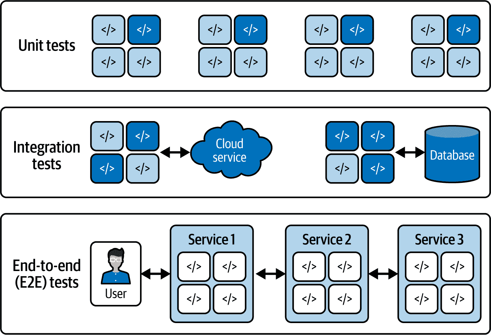
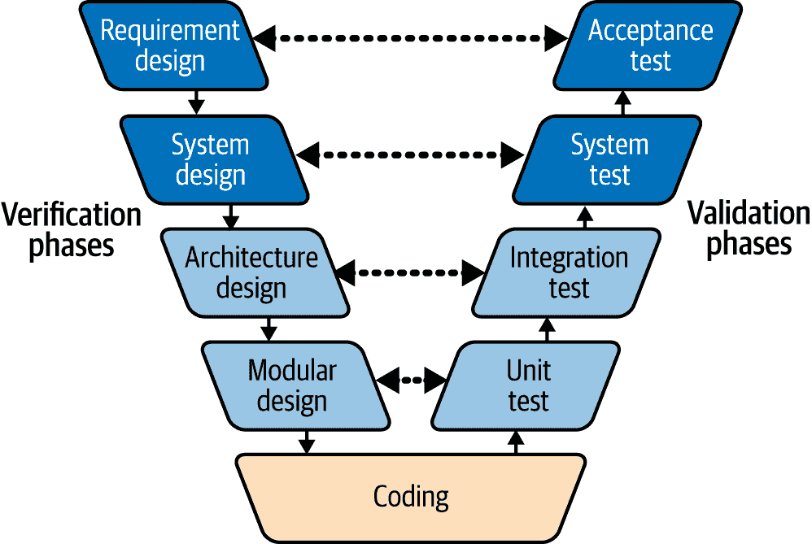
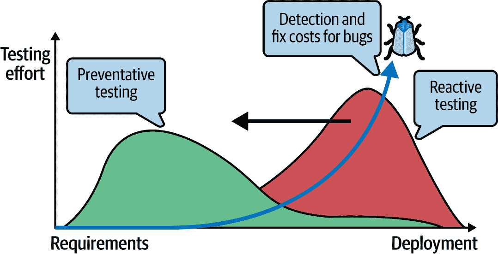
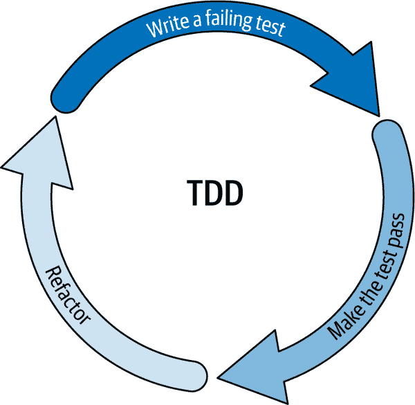
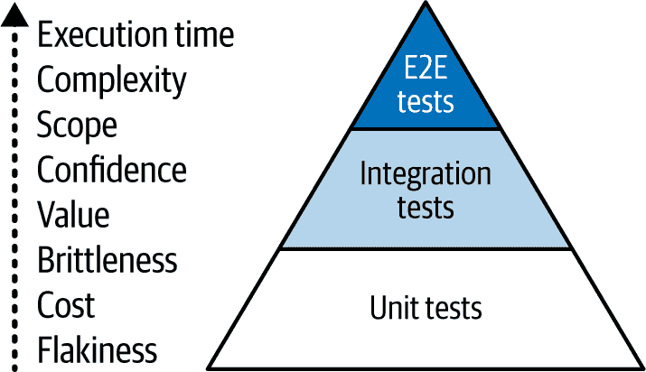
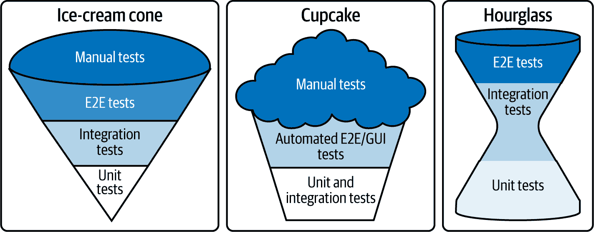
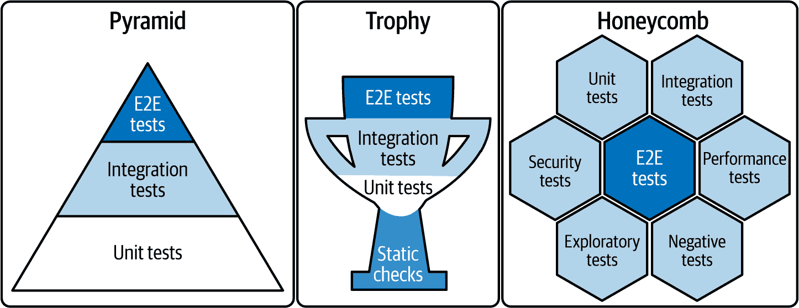
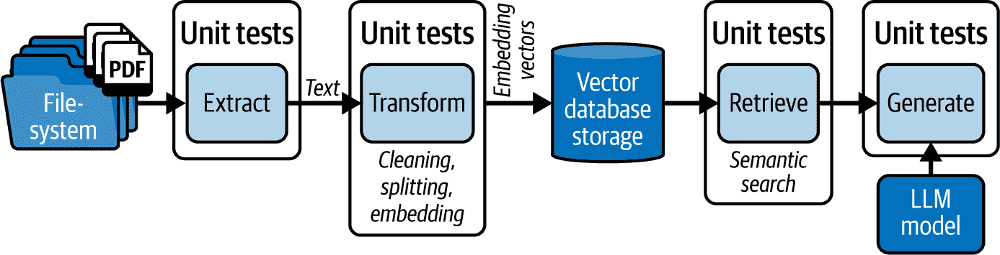
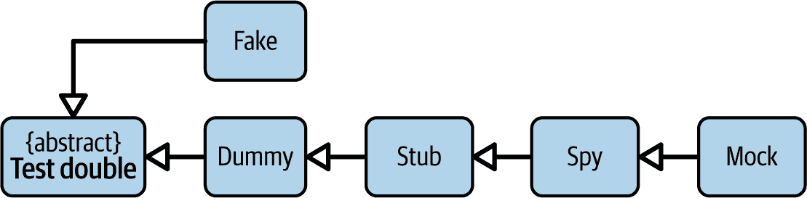

# 第十一章\. 测试人工智能服务

这项工作是用 AI 翻译的。我们很高兴收到你的反馈和评论：translation-feedback@oreilly.com

在本章中，你将了解在创建 GenAI 服务时测试的重要性和挑战，以及关键概念，如测试计划、验证和验证模型、测试金字塔以及数据、测试环境和边界的作用。

为了练习测试，你将使用`pytest`，这是一个流行的测试框架，具有测试固定装置、作用域、标记和固定装置参数化等功能。你还将了解用于修补功能的`pytest-mock`插件，并学习使用存根、模拟和间谍对象来模拟和控制测试期间的外部依赖。

由于模拟可能会使测试变得脆弱，我们还将探索依赖注入，这允许你直接将模拟或存根依赖注入到要测试的组件中，从而避免在运行时修改代码。

我们将讨论隔离和幂等性在测试中的作用，何时使用模拟，以及如何测试 GenAI 代码，无论是确定性的还是概率性的。在本章结束时，你将确信能够编写包含单元测试、集成测试、端到端测试和行为测试的完整测试套件，用于你的服务。

在深入编写测试之前，我们探索一下传统软件测试的基本概念以及如何应对 GenAI 服务的测试，这可能会因为 AI 模型的不确定性而变得具有挑战性。

# 测试的重要性

理论上，所有人都同意在实现软件时进行测试是必要的。编写测试是为了对系统的功能和性能有信心，尤其是在它们相互交互时。但现实中，由于预算、时间或与测试维护相关的人力成本等限制，项目可能会跳过手动或自动测试的实施。

跳过测试的部分或全部项目最终会以被动而非主动的方式应对软件问题。这样会积累一个*技术债务*，你需要用人力和服务器成本，加上利息，来偿还。

当何时进行测试的问题难以解决。如果你只是在快速迭代中尝试并组装原型，实际上你不需要过分担心测试。然而，一旦你有一个可销售的最小产品，一个与敏感数据交互并处理用户支付的系统，你就必须认真考虑测试计划。

All'inizio della mia carriera, stavo costruendo un sistema di gestione dell'apprendimento per un cliente. Ho scritto un endpoint webhook per interfacciarmi con i sistemi di pagamento di Stripe e con la mia soluzione di autenticazione fatta in casa che registrava gli utenti solo al primo pagamento. Il sistema doveva addebitare ed elaborare i pagamenti degli abbonamenti sia dei clienti nuovi che di quelli già esistenti e inviare email di conferma, tenendo traccia dei record degli utenti, degli abbonamenti, dei pagamenti, delle sessioni di checkout e delle fatture. La logica di questo webhook è risultata così contorta e complessa che ha portato a una mostruosità che è diventata una funzione di 1.000 righe. La funzione controllava eventi ricevuti non ordinati di vario tipo, con molteplici viaggi verso il database.

L'intera soluzione ha dovuto essere scartata alla fine, poiché il comportamento del webhook era così *incostante*, restituendo risposte non coerenti allo stesso insieme di input. Gli utenti non potevano registrarsi nemmeno dopo aver effettuato un pagamento con successo. Questa incostanza ha reso insopportabile il debug del webhook, costringendomi a riscrivere l'integrazione del sistema di pagamento da zero. Se solo avessi rallentato la pianificazione e modularizzato la logica e avessi scritto dei test in anticipo, avrei potuto risparmiarmi tanti grattacchi.

Quando rallenti per pianificare e testare i tuoi servizi, stai barattando tempo e fatica in cambio di fiducia nel tuo codice.

Altre occasioni in cui dovresti prendere in considerazione l'implementazione di test sono quando:

+   Più collaboratori aggiungono modifiche nel tempo

+   I manutentori modificano le dipendenze esterne

+   Aumenta il numero di componenti e di dipendenze nei tuoi servizi

+   All'improvviso si nota la comparsa di troppi bug

+   La posta in gioco è troppo alta se le cose vanno male: la mia esperienza è rientrata in questa categoria.

Ora dovresti capire in che modo i test possono essere utili al tuo progetto.

# Test del software

Ora che conosci le sfide e i potenziali approcci per testare i servizi GenAI, rivediamo i concetti di testing del software per capire la loro rilevanza per i casi d'uso GenAI e le insidie comuni da evitare.

## Tipi di test

Esistono tre tipi di test comuni nel testing del software che, in ordine crescente di dimensione e complessità, sono i seguenti:

Test unitari

Si concentrano sul test di singoli componenti o funzioni in modo isolato su un insieme discreto di input e casi limite per convalidare la funzionalità a livello di singolo componente. I test unitari sono atomici e hanno un ambito di applicazione minimo e spesso non si basano su sistemi o dipendenze esterne.

Test di integrazione

I test di integrazione spesso rilevano i problemi di comportamento dell'applicazione a livello di sottosistema, convalidando i flussi di dati e i contratti di interfaccia (cioè le specifiche) tra i vari componenti.

Test end-to-end (E2E)

在系统最高级别验证应用程序的功能，从开始到结束，模拟真实使用场景。端到端测试提供了对应用程序功能和性能的最高信心水平，但它们在设计和维护方面最具挑战性。

###### **建议**

端到端测试和集成测试有相似之处，使得它们难以区分。如果一个测试很大且有时有缺陷，那么你可能在处理一个端到端测试。

集成测试通常控制系统的一部分和交互，而不是整个系统或长链子系统的所有部分。

图 11-1 展示了每种测试类型的范围。左侧显示的单元测试集中在独立的组件上，而集成测试验证多个组件之间的交互，甚至包括外部服务。最后，端到端测试覆盖整个用户路径和应用程序内部的数据流，以确认预期的功能。



###### 图 11-1\. 软件测试中的测试类型

在实施上述测试之前，你也可以使用代码的**静态检查**，例如使用 `mypy` 工具来识别语法和类型错误。在编写代码时，静态检查还可以帮助你识别代码风格的违规、函数和依赖的不当使用、安全漏洞、死代码或未使用代码、数据流问题以及系统组件中的潜在错误。

随着你从静态检查和单元测试过渡到集成测试，再到端到端测试（E2E），你的测试案例变得更加宝贵，但也更加复杂、昂贵和缓慢。此外，由于端到端测试涉及更多组件的交互，它们将变得更加脆弱，容易失败，需要频繁更新以保持与代码更改的一致性。

即使端到端测试也很复杂且不可靠/非确定性的。根据 Martin Fowler 的观点^(1)，这些是非确定性的主要原因：

+   **隔离不足**会导致组件之间相互干扰，导致不可预测的结果。

+   **异步行为**，操作在非顺序或不可预测的时刻发生，可能导致非确定性的结果。

+   **远程服务**可能由于网络延迟、服务可用性或不同响应而引入可变性。

+   **资源泄露**，如果管理不当，可能导致系统行为不一致。涉及的资源包括内存、文件句柄或数据库、客户端等连接。

最后，由于端到端测试的脆弱性，重构和功能修改可能会导致测试失败。因此，在端到端测试的置信度和修改系统的灵活性之间存在权衡。

## 测试软件的最大挑战

测试服务时最大的挑战在于确定测试什么以及测试的细节。为此，你必须决定什么可以忽略、模拟或保持真实，以及配置一系列测试工具和环境。

为了克服这个挑战，你可以提前规划测试，识别系统的故障点，将问题限制在单个组件和交互中。然后，想象一下用户是谁，并列出他们与有问题的系统交互时采取的步骤。最后，你可以将这些步骤列表转换为单个测试并自动化它们。

测试的另一个挑战是每次测试的代码被修改时都需要重写测试，这会带来很多挫败感。

由于代码重构不会改变功能性但会改变实现细节，因此这可能是一个迹象，表明你没有测试正确的事情。例如，如果你正在测试`count_tokens(text)`函数的内部字符串处理逻辑，而不是仅仅测试其最终输出（即令牌计数），使用外部库来替换字符串处理逻辑可能会导致你的测试失败。

一个揭示你可能正在测试实现细节的迹象是，当修改代码时你的测试失败（例如，假阳性），或者即使引入了根本性的代码修改，测试也能通过（例如，假阴性）。你可以使用*黑盒测试*等技术来测试你的系统，提供输入并观察输出，而不考虑实现的细节。

如果你提前规划测试，你可以避免这些困难。

## 测试规划

在规划阶段确定必要的测试时，你可以使用*验证与验证*（V&V）过程。

按照此流程，首先确认拥有正确的需求（验证），然后通过测试来验证所有需求是否得到满足（验证）。

###### 注意事项

通过测试覆盖率达到 100%只能完成验证过程，而不是验证。你仍然必须确保你的服务实现了正确的功能（即验证）。

V&V（验证与验证）过程可以看作是一个 V 形模型，就像图 11-2 中所示。

当沿着 V 形模型向下走时，定义软件需求并设计解决方案，在将其以代码形式实现之前。随后，通过执行渐进式测试（单元、集成、端到端等）来上升“V”，以验证解决方案是否满足业务需求。



###### 图 11-2\. 验证和验证模型

如前所述，验证测试可能难以识别。你应实施哪些渐进式测试？

当你难以确定要测试什么时，你可以根据在应用程序中找到的问题和错误编写测试。这种方法是*反应性*的，因为你只在出现问题时编写测试，这可以帮助你克服不知道要测试什么的困难。然而，在软件开发生命周期（SDLC）的后期解决问题的测试需要大量的投入，因为你将处理一个更复杂的系统，其中有许多可移动部分需要测试。

因此，像*左移测试*这样的运动支持在开发过程中提前规划并编写的*预防性测试实践*的采用，以减少测试工作量。图 11-3 展示了如何将测试活动移至 SLDC（软件生命周期开发周期）的开始，从而减少总体负担。



###### 图 11-3\. 软件左移测试

测试左移的常见方法之一是*测试驱动开发*（TDD），如图 11-4 所示。



###### 图 11-4\. TDD

在 TDD（测试驱动开发）方法中，先编写测试，然后再编写实际代码。这是一个迭代过程，其中编写的测试最初会失败，但你的目标将是编写尽可能少的代码以确保测试通过。一旦通过，你将重构代码以优化系统，同时保持测试通过以完成 TDD 迭代过程。

###### 建议

TDD（测试驱动开发）的一个很好的例子是在*提示工程*期间测试 GenAI（生成式人工智能）服务。首先编写一系列测试，然后继续迭代提示设计，直到所有测试都通过。

使用相同的测试案例，你可以验证任何回归迹象，以及模型更改是否降低了你的服务性能。

正如你所见，TDD（测试驱动开发）的总体目标是通过提高代码质量、解决方案设计和早期问题识别来减少测试工作量。

## 测试尺寸

此外，在规划过程中，你必须决定测试的各个维度，包括*范围*、*覆盖率*和*完整性*：

应用范围

定义需要测试的组件、系统和用例。作为定义范围的一部分，你还必须跟踪*测试边界*，以明确将要测试什么以及不测试什么。

测试覆盖或测试表面

测量需要测试的系统或代码量。

完整性

指示你的测试在定义的范围和覆盖范围内将有多详细、多深入和完整。例如，你必须决定是否测试每个潜在的使用情况、成功和失败的场景以及每个组件、系统和交互的边界情况。

*体积/空间*定义了被测试内容的边界和尺寸；表面衡量测试的扩散；深度意味着测试案例的详细程度、深度和完整性。

## 测试数据

为了获得更全面的测试覆盖和完整性，你可以利用四种不同的测试数据类型：

有效数据

系统的输入在正常情况下符合预期和有效的区间内。

无效数据

预期之外、错误、NULL 或超出有效区间的输入。你可以使用负数据来验证系统在不当使用时的行为。

边界数据

测试数据位于可接受输入区间的边界上，无论是上限还是下限。

巨大的数据

用于测量系统性能和压力测试的极限。

## 测试阶段

无论你是在实现单元测试、集成测试还是端到端测试，你都可以使用*数据-当-那么*（GWT）模型来结构化不同的测试阶段，如下所示：

1.  *数据（预条件）*：在每次测试之前，你可以设置测试条件和预定义的状态或数据（例如，*固定值*）。

1.  *当（测试阶段）*：在测试过程中，你将执行一系列你想要测试的动作。在这里，你将你的测试固定值传递给*被测试系统*（SUT），根据测试范围，它可能是一个单独的函数或整个服务。

1.  *然后（预期结果）*：在用固定值执行 SUT 之后，在这个阶段，你将通过一系列断言来验证结果是否符合你的预期。

1.  *清理*：一旦完成，你可以在一个可选的*清理/剥离*阶段清理测试的工件。

`pytest`推荐使用*安排-执行-断言-清理*（arrange-act-assert-cleanup）模型来结构化测试，这直接对应于 GWT 模型，并包含一个可选的清理阶段。

## 测试环境

当你计划测试时，你也必须考虑覆盖编译时间、编译时间和运行时环境的多个*测试环境*。

在许多编程语言中，*编译时刻*是源代码被转换为可执行代码的时刻。例如，如果你正在用 C++编写代码，编译过程包括对代码类型的全面检查。如果发现类型错误，编译过程将失败。一旦所有检查都通过，C++编译器将代码转换为可执行的二进制文件。

###### 注意

C++中的强类型设计是为了提高错误检测、代码的鲁棒性以及在大而复杂的代码库中频繁变化的情况下支持开发者工具。

作为一种解释型语言，Python 没有像 C++那样的传统编译时间，但它将代码转换为字节码以执行。

在审查过程中，代码的静态检查工具如`mypy`可以识别你的代码的基本问题，作为测试努力的初步验证级别。

###### 注意事项

由于 Python 是一种动态类型语言，它默认不应用类型检查。然而，如果你在 Python 代码中使用类型提示，像`mypy`这样的类型检查器可以提供有价值的帮助。

当前的静态检查非常适合在编译阶段发现代码的基本问题，而单元测试、集成测试和端到端测试可以在执行代码时验证系统的功能。在运行时，像 Pydantic 这样的工具可以执行数据验证检查，以识别意外的数据结构。

你的 GenAI 服务可能还需要额外的配置和编译阶段，如下载权重和预加载模型，然后才能执行应用程序代码。编译、配置和依赖项安装的阶段完成的环境被定义为*编译时间*，这也可以进行测试。

## 测试策略

在软件领域，许多专家已经开发了平衡项目测试分布的策略，这些策略基于开发者多年的软件测试经验，并因此变得流行。

最常用的策略是*测试金字塔*，如图图 11-5 所示，它促进了更多单元测试的编写。



###### 图 11-5. 测试金字塔

表 11-1 展示了测试金字塔每个层次的用途，通过一个具体的 GenAI 服务示例来说明。

表 11-1. 现实世界中的测试金字塔

| 层级 | 目的 | 示例 |
| --- | --- | --- |
| 端到端测试 | 验证应用程序从开始到结束的整个流程 | 测试用户登录，根据提示生成文本并保存生成的内容 |
| 集成测试 | 验证各个模块或服务是否能够正确协同工作 | 测试文本生成 API 与存储用户提示和生成文本的数据库之间的交互 |
| 单元测试 | 以隔离方式验证单个组件或功能 | 测试各种处理模型输入的实用函数，例如移除不适当的内容。 |

金字塔模型的难题在于，虽然单元测试可以提高代码覆盖率，但并不一定能提高“业务覆盖率”，因为项目需求和用例可能没有得到充分测试。因此，仅依赖单元测试可能会产生虚假的安全感，可能会忽略测试关键的业务逻辑和用户工作流。另一方面，集成测试允许你覆盖更多领域，以及面向业务的测试。

###### 注意事项

软件测试专家还识别了一些被认为是*反模式*的策略，这些策略是无效的。

如果你遵循这些策略，你将花费过多的时间来配置测试，实现过于具体和紧密耦合的测试，最终可能会得到具有非确定性行为的测试。

表 11-2 和 图 11-6 展示了软件测试的反模式列表。

表 11-2\. 软件测试反模式

| 战略 | 测试分布 | 评论 |
| --- | --- | --- |
| 冰淇淋锥测试 | 少量的单元测试和大量的集成测试以及端到端测试，随后是手动测试。 | 避免使用。由于手动测试实现效率低下以及集成测试和端到端测试的维护成本高昂，被认为是一种反模式。 |
| 蛋糕测试 | 与冰淇淋锥测试类似；有少量的单元测试和集成自动化测试，中等数量的端到端/GUI 自动化测试，以及大量的手动测试。每种类型的测试由不同的团队执行。 | 避免使用。被认为是一种反模式，因为它可能导致反馈周期缓慢，团队间沟通成本增加，以及维护成本高昂的脆弱测试。 |
| 水晶球测试 | 底部有大量的单元测试和顶部的端到端测试，但中间的集成测试数量显著较少。 | 避免使用。被认为是一种反模式。虽然不如冰淇淋锥测试严重，但仍然会导致大量的测试失败，这些失败本可以通过中等范围的测试覆盖。 |



###### 图 11-6\. 测试反模式可视化

表 11-3 和 图 11-7 对比了软件测试策略。

表 11-3\. 测试策略对比

| 战略 | 测试分布 | 评论 |
| --- | --- | --- |
| **测试金字塔**(Mike Cohn) | 底部有大量的单元测试，中间较少的集成测试，顶部更少的端到端测试。 | 然而，金字塔可以被看作是一个物理概念，用来促进单元测试底层的构建，然后构建下一层，以此类推，直到达到顶部。如果将这种方法应用于具有广泛代码基础的遗留应用程序，则这种方法是无效的。 |
| **测试奖杯**(Kent C. Dodds) | 专注于一个坚实的静态控制基础，然后是单元测试，接着是集成测试，最后是顶部较少的端到端测试。 | 动机是端到端测试和集成测试是最有效的。然而，端到端测试是缓慢且昂贵的。集成测试代表了这两个世界的平衡。 |
| **测试蜂巢**(Stephen H. Fishman) | 代表了一个平衡的方法，对单元、集成、端到端和其他类型的测试（性能、安全等）给予同等重视。 | 如果没有得到正确管理，可能效率较低，并且可能不是每个项目的最佳选择。 |



###### 图 11-7. 测试策略可视化

对于 GenAI 服务，由于通常涉及复杂的集成和性能考虑，测试策略奖杯可能是最合适的。奖杯策略包括一个由`mypy`和 Pydantic 等工具支持的静态控制坚实基础，辅以达到价值、信任和测试成本之间平衡的集成测试。

如果你的 GenAI 服务需要通过多种类型的测试进行全面测试，包括性能测试和探索性测试，那么蜂巢模型可能更适合你的项目，因为它可以统一测试的努力。

现在你应该更自在地识别你需要参加的考试，并规划你的测试。

现在你已经了解了软件测试的概念，让我们来探讨 GenAI 服务测试的挑战和潜在的方法。

# GenAI 服务测试的挑战

如果你决定测试你的 GenAI 服务，你将面临不同的挑战。利用 GenAI 概率模型的服务的测试需要比传统软件更全面的方法。

我们来看一下为什么测试 GenAI 服务将是一个挑战。

## 结果的变异性（脆弱性）

在相同的输入和实现代码下，GenAI 服务通常会产生不同的输出。输出之所以不同，是因为这些模型使用概率技术，如从分布中进行采样，而不是依赖于确定性函数。当然，观察到的输出变异性可能取决于模型和配置的调节，如温度值，这可以减少这种变异性。

GenAI 模型的输出可变性也可能导致你可以编写的潜在测试案例数量激增（即测试的*应用范围/领域*），以覆盖所有可能性。因此，你不能完全依赖确定性测试：你的测试将无法连贯执行，并且过于*薄弱*，无法在 CI/CD 管道中可靠执行。

你应该从统计和概率的角度来处理 GenAI 测试问题：从*合法输入分布*中基于有效假设抽取多个样本，以验证模型输出的产品质量。

###### 注意

对于*合法输入分布*，我指的是选择与模型目标一致、代表现实场景且与你要用模型解决的问题相关的输入。

一种更复杂的方法是使用判别模型对你的服务可变结果进行评分，前提是你设定了某种容忍度或阈值的期望。

你将在本章后面看到如何做到这一点的一些示例。

## 性能和资源限制（慢且昂贵）

由于 GenAI 服务的测试需要更统计和/或多模型的方法，你还将面临延迟、使用和托管等问题。

你的测试无法以足够快和可靠的方式在传统的 CI/CD 管道中连续执行。你将面临因多次调用模型 API 和复杂的、缓慢的多模型测试而导致的过高成本。除非你做出假设以简化测试范围、减少模型测试频率并使用如 mocking 和 patching、依赖注入和假设统计测试等高效的测试技术，否则这些挑战将持续存在。你也可以研究使用小型调谐判别模型来减少延迟并提高性能。

## 回归

*回归测试*是当你与 GenAI 模型一起工作时需要计划的一种测试类型。

一项于 2023 年发布的[研究](https://oreil.ly/1oLQG)比较了 ChatGPT 随时间的行为，发现：

> GPT-3.5 和 GPT-4 的性能和行为可能会随时间显著变化。例如，GPT-4（2023 年 3 月）在识别素数与合数方面表现合理（准确率为 84%），但 GPT-4（2023 年 6 月）在这些相同的问题上表现不佳（准确率为 51%）。与 3 月相比，GPT-4 在 6 月对敏感问题和调查问卷问题的回答意愿降低。此外，GPT-4 和 GPT-3.5 在 6 月生成代码时的格式错误比 3 月更多。

根据这项研究，即使是“相同”的 LLM 服务在相对较短的时间内也可能发生显著变化，这突显了对 LLMs（以及任何 GenAI 服务）进行持续监控的必要性。基于这一发现，你可以假设你的 GenAI 服务的性能可能会随着时间的推移而恶化，这是由于模型的调整或重新训练、用户交互模型的变化以及训练数据或操作环境的变化。

为了深入了解，概率性人工智能模型可能会经历一种*模型漂移*，即随着时间的推移，性能下降，这种下降可以归因于训练数据。在额外数据上的开发可能会对模型在其他任务中的行为产生意外的副作用。

随着时间的推移，原始的训练数据可能会远离现实：趋势在变化，新的历史事件发生，语言在发展，人类知识以新的形式扩展或变化，而这些变化如果不能持续更新训练数据就无法捕捉到。这种导致模型漂移的现象被称为*概念漂移*，它发生在模型试图预测的目标变量的统计属性随时间变化时。概念漂移可能导致模型性能下降，因为训练期间学习的关联和模型不再有效。

此外，*数据漂移*，即数据集中输入特征分布的变化，也可能导致模型漂移。

这种漂移通常是由于采样方法、人口分布和数据收集的变化，数据中的季节性和时间效应，数据源的外部变化或数据处理管道中的质量问题所引起的。

回归测试和监控（尤其是如果你依赖外部模型提供商如 OpenAI）可以帮助你识别你的活动和特定用例中的模型漂移问题。任何潜在的数据漂移都可以通过数据验证或使用如 RAG 等技术来处理，或者在应用层面通过重新训练和调整模型来减少回归问题。

## 偏差

在测试通用人工智能服务时，另一个重大挑战是在投入生产之前检测模型的偏差。通常，偏差是在数据科学家和负责模型生产的机器学习工程师进行数据探索过程中被分析的。然而，对于范围广泛的通用人工智能模型，总有可能因为评估错误、采样方法、数据处理、训练算法或数据中隐藏的偏差而引入某种形式的偏差。

例如，如果一个语言模型在主要包含特定人口群体相关文本的数据集上训练，它可能会产生倾向于该人口群体的结果，从而排除其他潜在群体。同样，如果一个图像识别模型主要在医生和工程师等职业男性的图像上训练，它可能会学会生成带有性别偏见的图像。

在希望使用大型语言模型（LLMs）作为法官的场景中，偏见变得尤为严重，例如作为人工智能评估工具或面试评估者。

偏见可以以多种形式表现出来，如性别偏见、种族偏见、年龄偏见等等，每种偏见都需要特定的测试和指标来检测。如果不清楚要测试什么，就无法确保你的通用人工智能服务 100%没有偏见。

解决这个问题的可能方法之一是利用模型的自我控制和人工智能的判别器，其中次要模型识别或测量潜在偏见的存在。在服务运行时检测偏见时，通常需要在延迟和利用率之间做出权衡。

## 对抗性攻击

面向公众的通用人工智能服务可能容易受到对抗性攻击，如令牌操纵、数据管理不安全、请求越狱或提示注入、敏感信息泄露、数据中毒、模型盗窃、拒绝服务、过度代理以及一般的不当使用和滥用。因此，任何暴露于互联网的通用人工智能服务都必须包括保护级别。

如[OWASP LLM 应用前 10 名](https://genai.owasp.org)等资源和清单提供了为你的通用人工智能服务添加保护措施的一个起点。

然而，创建防护机制可能具有挑战性，因为目前的方法基于分类和判别模型来检测对抗攻击和有害内容。这些防护模型通常需要数百兆字节的依赖项，这可能会使应用程序变重，显著降低服务的吞吐量，并且无法识别每个潜在的攻击场景。

对抗测试确保采取的防护措施足以保护你的服务和声誉。在对抗测试的范围内，你还应验证你的身份验证和授权保护的性能。

第九章 深入探讨了这些防护层的实现和评估技术，以保护你的模型免受这些攻击。

## 测试覆盖率

GenAI 模型的潜在空间如此之大，以至于不能仅依靠单元测试来获得 100% 的使用场景覆盖率。

由于存在无限多的输入和输出，无论你测试多少你的模型，都会有一些隐藏的边界情况会逃过你的测试。因此，而不是依赖每个场景的预定义，你可以实现 *行为测试*，这些测试专注于响应的性质而不是确切的输出。

你可以测量的行为属性示例包括生成的数据结构的 *一致性*、输出相对于输入的 *相关性*、*毒性*、*正确性* 和 *忠实度*（即忠实于你的政策和伦理指南）。你还可以将人类添加到测试循环中作为额外的测试级别，以识别意外的响应。

###### 注意事项

如果你正在开发一个包含多个模型和外部依赖的 RAG 或代理应用程序，行为测试变得更加实用。测试一组固定的示例可能会丢失边界情况、组件之间的意外交互以及由于外部因素导致的响应变化。

在下一节中，你将学习如何通过实际项目来实施你的单元测试、集成测试、端到端测试和行为测试。

# 项目：实现 RAG 系统的测试

在实际项目中，你将为在第五章 中实现的 RAG 模块编写一组测试。你将测试的 RAG 系统将通过异步方法与一个 LLM、一个向量数据库和服务器文件系统接口，因此这是一个完美理解迄今为止讨论的测试原则的机会。

通过遵循代码示例，你将学习实施单元测试、集成测试和端到端测试的最佳实践，以及它们之间的差异。

## 单元测试

Puoi iniziare a testare i tuoi servizi GenAI con i test unitari. Lo scopo di un test unitario è quello di verificare che una parte isolata del tuo codice, di solito una singola funzione o metodo, funzioni come previsto.

Prima di scrivere i test, è importante pianificare i casi di test da implementare. Per un tipico sistema RAG, puoi scrivere test unitari sulle pipeline di caricamento, trasformazione, recupero e generazione dei dati.

LaFigura 11-8 visualizza i confini di questi potenziali test unitari su un diagramma di pipeline di dati.



###### Figura 11-8\. Confini dei test unitari visualizzati sul diagramma della pipeline di dati RAG

Si noti che i confini del test terminano all'inizio e alla fine di ogni funzione della pipeline di elaborazione dati, perché lo scopo di questi test unitari è quello di testare solo il codice della pipeline di elaborazione dati e non il database, il filesystem, il modello LLM o le interfacce associate.

In questi test unitari, supporrai che questi sistemi esterni restituiscano ciò che ti aspetti e concentrerai i tuoi test unitari solo su ciò che farà il tuo codice di elaborazione dei dati.

Per brevità, non testeremo tutti i componenti del sistema, ma seguendo una manciata di esempi, dovresti sentirti a tuo agio nell'implementare test successivi per ottenere una copertura completa.

### Installare e configurare pytest

Per questo progetto utilizzerai il pacchetto `pytest`, che ha componenti integrati per la gestione di test fixture, parametri, codice asincrono, collezioni di test e un ricco ecosistema di plug-in. `pytest` è più potente, flessibile ed estensibile rispetto a `unittest`, il pacchetto di test integrato di Python spesso utilizzato per semplici scenari di test.

Puoi installare `pytest` utilizzando i seguenti metodi:

```py
$ pip install pytest
```

Successivamente, crea una cartella `tests` nella radice del tuo progetto dove potrai creare moduli Python seguendo lo schema *test_xxx.py*.

`pytest`Il raccoglitore di test può quindi attraversare la cartella `tests` e trovare tutti i moduli, le classi e le funzioni di test in essa contenuti:

```py
project
|-- main.py
...
|-- tests
    |-- test_rag_loader.py
    |-- test_rag_transform.py
    |-- test_rag_retrieval.py
...
```

All'interno di ogni file di test, puoi aggiungere le tue funzioni di test che contengono sempre almeno un'istruzione `assert`. Se non viene sollevata alcuna eccezione in queste istruzioni `assert`, i tuoi test otterranno `PASSED`. Altrimenti, `pytest` li contrassegnerà come `FAILED` insieme a un motivo/traccia del perché le istruzioni `assert` sono fallite:

```py
# tests/rag/transform.py

def test_chunk_text():
    text = "Testing GenAI services"
    results = chunk(text)
    assert len(results) = 2
```

Supponiamo che tu abbia scritto due funzioni di test in ogni modulo di test:

Puoi quindi eseguire i tuoi test tramite il comando `pytest <test_dirt_path>`.

```py
$ pytest tests
=========================== test session starts ============================
platform linux -- Python 3.11, pytest-8.0.0

Collected 6 items

tests/rag/loader.py ..                                                 [100%]
tests/rag/transform.py F.                                              [100%]
tests/rag/retrieval.py ..                                              [100%]

================================= FAILURES =================================
______________________________ test_chunk_text _____________________________

def test_chunk_text():
>     assert len(results) == 2
E       assert 3 == 2

tests/rag/transform.py:6: AssertionError
========================= short test summary info ==========================
PASSED 5
FAILED tests/rag/transform.py::test_chunk_text - assert 3 == 2
============================ 1 failed in 0.12s =============================
```

###### Avvertenze

Evita di scrivere test di grandi dimensioni, perché diventano sempre più difficili da capire e da implementare correttamente.

Quando si scrivono i test unitari, ci si preoccupa solo di un componente isolato del sistema, come ad esempio una singola funzione del codice, mentre gli altri componenti non rientrano nel campo di applicazione dei test unitari. Pertanto, si verificherà solo se un singolo componente si comporta come ci si aspetta, dato un insieme di dati di test come input.

Ad esempio, puoi verificare se la tua funzione di chunking sta dividendo un documento in pezzi come ti aspetteresti. Forse vuoi sperimentare strategie di chunking diverse o complesse per la tua pipeline RAG e vuoi assicurarti che il testo in ingresso sia suddiviso correttamente. I test unitari con dati di test predefiniti o *fixture* possono darti fiducia nella tua funzione di chunking.

L'esempio 11-1 mostra un esempio di test unitario per la tua funzione di chunking.

##### Esempio 11-1\. Esempio di test unitario per una funzione di token chunking

```py
# rag/transform.py

def chunk(tokens: list[int], chunk_size: int) -> list[list[int]]: 
    if chunk_size <= 0:
        raise ValueError("Chunk size must be greater than 0")
    return [tokens[i:i + chunk_size] for i in range(0, len(tokens), chunk_size)]

# tests/rag/transform.py

import pytest
from rag.transform import chunk

def test_chunking_success():
    # GIVEN 
    tokens = [1, 2, 3, 4, 5]
    # WHEN 
    result = chunk(token_list, chunk_size=2)
    # THEN 
    assert result = [[1, 2], [3, 4], [5]]
    ... # Other relevant asserts here
```


Suddivide un elenco di token interi in elenchi più piccoli di un determinato `chunk_size`.


Specifica i dati del test nella parte *GIVEN (precondizioni)* del test.


Esegui le fasi di test nella parte *WHEN* del test che includono il passaggio dei dati di test al sistema in esame.


Controlla i risultati rispetto alle uscite previste nella parte *THEN* del test.

### Attrezzature e ambito di applicazione

I dati di input di che hai definito nell'Esempio 11-1 per i test sono chiamati anche *fixture*, poiché il loro valore rimane fisso per ogni esecuzione del test. Esistono due tipi di fixture:

Apparecchio fresco

La definisci all'interno di ogni test, che poi Python raccoglie (cioè scarta) dopo il test. L'esempio 11-1 utilizza una fixture fresca.

Apparecchio condiviso

Puoi riutilizzarlo in più test per evitare di ripetere sempre la stessa fixture per ogni nuovo test.

Puoi dichiarare una fixture condivisa al di fuori delle funzioni di test come variabile globale del modulo di test, ma è considerato un anti-pattern, in quanto potresti modificarla inavvertitamente.

###### Avvertenze

Le fixture condivise devono essere *immutabili*, altrimenti un test può cambiare la fixture, creando un effetto collaterale che si ripercuote sugli altri test. Una delle principali cause di test difettosi sono le fixture mutabili.

Invece di essere responsabile della gestione dello stato delle fixture condivise, puoi affidarti al sistema di iniezione delle dipendenze di `pytest`attraverso l'uso di *funzioni di fixture*, come mostrato nell'Esempio 11-2.

##### Esempio 11-2\. `pytest` funzione di fissaggio

```py
# tests/rag/transform.py

import pytest
from rag.transform import chunk

# GIVEN
@pytest.fixture(scope="module") 
def tokens(): 
    return [1, 2, 3, 4, 5]

def test_token_chunking_small(token_list): 
    result = chunk(tokens, chunk_size=2)
    assert result = [[1, 2], [3, 4], [5]]

def test_token_chunking_large(token_list): 
    result = chunk(tokens, chunk_size=5)
    assert result = [[1, 2, 3, 4, 5]]
```


Dichiara la funzione `input_text` come una fixture `pytest` che può essere condivisa nel modulo come specificato da `scope="module"`.


使用 `pytest` 的依赖注入来注入一个共享的 fixture 到不同的测试中。

你可以使用 `@pytest.fixture(scope)` 装饰器将一个函数声明为 `pytest` 固定值。参数 `scope` 指定了 fixture 共享在测试会话中的持续时间。

根据 `scope` 的值，`pytest` 会为每个测试函数、`class`、`module`、`package` 或整个测试 `session` 创建和销毁一次 fixture。

###### Suggerimento

在以下场景中，你可能需要一个共享的 fixture 以在模块之间或整个测试会话中持久化：当你从外部 API 恢复 fixture 并希望避免重复请求。

使用 fixture，你可以实现不同的测试，这些测试具有不同的输入，包括有效值、无效值和边界值，以验证每个组件的鲁棒性。然而，你必须为每个预期的输入和输出系列分离测试函数。为了避免重写相同的测试，`pytest` 有一个名为 *参数化* 的功能可以利用。

### 参数化

使用 `pytest` 的参数化，你可以迭代不同的测试数据和预期输出，以避免重复测试，如 `示例 11-3` 中所示。

##### 示例 11-3\. `pytest` 的参数化

```py
# tests/rag/transform.py

@pytest.mark.parametrize("tokens, chunk_size, expected",  ![1
    ([1, 2, 3, 4, 5], 2, [[1, 2], [3, 4], [5]]), # valid
    ([1, 2, 3, 4, 5], 3, [[1, 2, 3], [4, 5]]), # valid
    ([1, 2, 3, 4, 5], 1, [[1], [2], [3], [4], [5]]),  # valid
    ([], 3, []), # valid/empty input
    ([1, 2, 3], 5, [[1, 2, 3]]),   # boundary input
    ([1, 2, 3, 4, 5], 0, "ValueError"), # invalid (chunk_size <= 0)
    ([1, 2, 3, 4, 5], -1, "ValueError"), # invalid (chunk_size <= 0)
    (
        list(range(10000)), 1000, [list(range(i, i + 1000)) # huge data
        for i in range(0, 10000, 1000)]
    )
])
def test_token_chunking(tokens, chunk_size, expected) 
    if expected == "ValueError":
        with pytest.raises(ValueError):
            chunk(tokens, chunk_size)
    else:
        assert chunk(tokens, chunk_size) == expected
```

[#co_testing_ai_services_CO3-1]

使用 `@pytest.mark.parametrize` 装饰器来指定多个测试参数和预期的输出。测试参数包括有效值、空值、无效值、边界值和大值，以验证分词函数的鲁棒性。

[#co_testing_ai_services_CO3-2]

将测试参数注入到测试函数中，如果预期的输出是 `ValueError`，则使用 `pytest.raises` 来验证是否抛出了 `ValueError` 异常。否则，执行断言检查。

你还可以将测试数据存储在 JSON 文件中，并将其作为 fixture 注入到参数化测试函数中，如 `示例 11-4` 中所示。

##### 示例 11-4\. `pytest` 参数化测试中的 JSON 固定值

```py
# tests/rag/test_data.json 

[
    {"tokens": [1, 2, 3], "chunk_size": 1, "expected": [[1], [2], [3]},
    ...
]

# tests/rag/transform.py

@pytest.fixture
def test_data():
    with open('test_data.json') as f:
        return json.load(f)

@pytest.mark.parametrize("case", test_data())
def test_token_chunking(case):
```

[#co_testing_ai_services_CO4-1]

JSON 文件包含一个测试用例列表，以字典形式表示。

如你所见，fixture 和参数化技术是帮助你验证代码中每个函数的鲁棒性的强大工具。

当你编写测试时，你可能希望指定配置代码、配置和全局 fixture，以便在测试文件之间共享。幸运的是，你可以在 `pytest` 的全局配置文件 `conftest.py` 中获得这个结果。

### Modulo Conftest

如果你想让所有测试模块都能访问 fixture 和全局配置，你可以在你的 `tests` 目录中添加一个 *conftest.py* 模块。在 conftest 模块中定义的所有 fixture、设置代码和配置将被其他测试模块共享。参见 示例 11-5。

##### 示例 11-5\. 为每个模块添加共享设备

```py
# tests/conftest.py

@pytest.fixture(scope="module") 
def tokens():
    return [1, 2, 3, 4, 5]

# tests/rag/transform.py

def test_chunking(tokens):
    ....

# tests/rag/retrieval.py

def test_query(tokens):
    ....
```

(#co_testing_ai_services_CO5-1)

在 *conftest.py* 中定义一个共享 fixture，用于每个测试模块。否则，该 fixture 将仅限于单个模块。

现在你已经学会了如何使用 `pytest` 框架按照 GWT 模型编写基本测试。现在我们来看看如何在测试前后执行配置和清理操作。

### 配置和拆解

在实现测试时，可能需要在测试之前配置测试环境，并在测试之后执行拆解或清理操作。你可以在共享 fixture 中使用关键字 `yield` 来实现需要为每个测试一致执行的配置和拆解操作。

例如，你可能需要使用此函数来设置和清理数据库会话，如 示例 11-6 中所示。

##### 示例 11-6\. 在共享 fixture 中配置和关闭数据库会话

```py
# tests/conftest.py

from qdrant_client import QdrantClient

@pytest.fixture(scope="function") 
def db_client():
    client = QdrantClient(host="localhost", port=6333) 
    client.create_collection( 
        collection_name="test",
        vectors_config=VectorParams(size=4, distance=Distance.DOT),
    )
    client.upsert( 
        collection_name="test",
        points=[
            PointStruct(
                id=1, vector=[0.05, 0.61, 0.76, 0.74], payload={"doc": "test.pdf"}
            )
        ],
    )
    yield client 
    client.close() 

# tests/rag/retrieve.py

def test_search_db(db_client): 
    result = db_client.search(
        collection_name="test", query_vector=[0.18, 0.81, 0.75, 0.12], limit=1
    )
    assert result is not None
```

(#co_testing_ai_services_CO6-1)

在 *conftest.py* 中创建一个全局共享 fixture，它会在每个测试函数执行时创建和销毁。

(#co_testing_ai_services_CO6-2)

实例化数据库客户端 `qdrant`，然后创建并配置一个包含插入数据点的测试集合，作为测试配置阶段的一部分。

(#co_testing_ai_services_CO6-5)

将数据库客户端作为测试主要阶段的一部分传递给测试函数。

(#co_testing_ai_services_CO6-6)

每次测试结束后，关闭数据库客户端的连接。在关键字 `yield` 后面的拆毁代码会在完成返回操作后执行一次。

(#co_testing_ai_services_CO6-7)

在完成测试设置后，将预配置的数据库客户端注入到每个测试函数中。查询数据库以获取插入的文档，并断言已成功检索到数据点。在断言阶段完成后，作为 fixture 函数 `db_client` 的一部分执行拆毁过程。

根据 示例 11-6 的示例，你也可以为你的 API 测试客户端或任何其他外部服务创建具有设置和拆毁阶段的 fixture。

此外，你可能已经注意到，示例 11-6 使用了同步客户端而不是异步客户端。这是因为异步测试的管理可能很复杂、有问题且容易出错，并且需要安装额外的`pytest`插件来管理测试的事件循环。

为了避免单元测试变得无效，你应该使用 mock 来隔离功能组件与外部服务。这是因为单元测试的检查范围和边界不包括依赖和外部接口，而依赖和外部接口的测试，例如与数据库的交互，属于集成测试的范畴。

随后，你将学习如何管理异步测试以及 mocking/patching 技术。

### 异步测试管理

为了执行异步测试，你可以使用像`pytest-asyncio`这样的插件，这些插件将`pytest`与 Python 的`asyncio`集成：

```py
$ pip install pytest-asyncio
```

```py`Una volta installato il plug-in, puoi seguire l'Esempio 11-7 per scrivere ed eseguire un test asincrono.    ##### Esempio 11-7\. Scrivere test asincroni    ``` # tests/rag/retrieve.py  @pytest.mark.asyncio  async def test_search_db(async_db_client):      result = await async_db_client.search(         collection_name="test", query_vector=[0.18, 0.81, 0.75, 0.12], limit=1     )     assert result is not None ```py          Contrassegnare esplicitamente il test async con un decoratore `asyncio` per eseguire il test all'interno di un ciclo di eventi.            Questo presuppone che tu abbia sostituito il client del database sincrono con uno asincrono in *conftest.py*.      Quando esegui il comando `pytest`, questo cerca nell'albero delle directory del progetto i test che utilizzano i *raccoglitori* per ogni livello della gerarchia delle directory: funzioni, classi,moduli, pacchetti o sessioni. Il plug-in `pytest-asyncio` fornisce un ciclo dieventi asyncio per ognuno di questi raccoglitori. Per impostazione predefinita, i test contrassegnati da`@pytest.mark.asyncio` vengono eseguiti nel ciclo di eventi fornito dal *raccoglitore di funzioni*, per ridurre l'ambito del ciclo di eventi e massimizzare l'isolamento tra i test.    Ma perché questo isolamento è importante?    La più grande fonte di frustrazione per gli sviluppatori quando testano un software è rappresentata dai test che falliscono in modo casuale quando si esegue consecutivamente la suite di test senza modificare il codice o le configurazioni.    Spesso, quando si indaga sulla causa del comportamento difettoso dei test, si scopre che c'è una fixture o una dipendenza centrale che viene modificata da uno dei test, violando un principio fondamentale del testing: l'*isolamento dei test*. Lo scopo di questo isolamento è quello di ottenere *l'idempotenza* nei test in cui l'esecuzione ripetuta produrrebbe sempre gli stessi risultati, indipendentemente dal numero di volte in cui si esegue la suite di test.    Senza isolamento, i test possono creare effetti collaterali l'uno sull'altro, invalidando le ipotesi di base, portando a fluttuazioni nei risultati/comportamenti e a fallimenti casuali. Inoltre, i test interdipendenti e dipendenti dall'ordine spesso falliscono insieme, impedendoti di ottenere un feedback prezioso sui fallimenti.    Ma in che modo il comportamento anomalo è legato ai test asincroni?    Come abbiamo visto nel Capitolo 5, il codice asincrono sfrutta lo scheduler integrato di Python, un ciclo di eventi, per cambiare attività quando si trova di fronte a un'operazione di I/O bloccante. Questo cambio di attività in un ambiente di test può rendere i test asincroni difficili da implementare correttamente, perché le operazioni asincrone potrebbero non essere completate immediatamente e potrebbero essere eseguite in ordine sparso.    I test asincroni spesso si interfacciano con dipendenze esterne come database o filesystem che eseguono operazioni di I/O bloccanti che possono richiedere molto tempo per essere eseguite. Questo è un problema importante per i test unitari che devono essere eseguiti molto velocemente in modo da poterli eseguire frequentemente.    A differenza del codice sincrono, in cui le operazioni vengono eseguite in una sequenza prevedibile e lineare, il codice asincrono introduce anche una variabilità nei tempi, nell'ordine di esecuzione e nello stato delle fixture, riducendo la coerenza dei risultati tra i test. Inoltre, i tempi di risposta delle dipendenze esterne possono fluttuare, portando a effetti collaterali che violano il principio di isolamento dei test.    Per mitigare il rischio di effetti collaterali e di un comportamento scorretto, dovrai gestire correttamente i test asincroni:    *   In attesa di operazioni di I/O bloccanti           *   Evitare l'uso involontario di operazioni di I/O sincrone bloccanti all'interno di test asincroni           *   Utilizzare i timeout corretti per gestire i ritardi           *   Controllare esplicitamente la sequenza delle operazioni, soprattutto quando si eseguono test async in parallelo              Forse la soluzione migliore è quella di scrivere dei test sincroni utilizzando i mock delle dipendenze esterne, che disaccoppiano le tue funzioni dalle dipendenze bloccanti dell'I/O. Utilizzando i mock, puoi eseguire test veloci e affidabili senza dover aspettare che le operazioni di I/O vengano completate nell'ordine desiderato.    ###### Suggerimento    I test asincroni possono ancora essere utili con le dipendenze reali quando si testa localmente un ambiente di produzione replicato.    Vediamo poi come prendere in giro le dipendenze esterne nei test unitari, in modo da poter scrivere test sincroni in sostituzione di quelli lenti e asincroni.````  ```py`### Mocking e patching    Quando scrivi i test unitari, devi isolare i tuoi componenti dalle dipendenze esterne per evitare che i test vengano eseguiti lentamente e che consumino risorse inutili. Ad esempio, non vuoi richiamare il tuo modello GenAI ogni volta che esegui la suite di test, cosa che sarà frequente, perché questo richiederà un'elevata intensità di calcolo e potrebbe essere costoso.    Invece, puoi usare i *test double* per simulare le dipendenze reali nei tuoi test unitari senza dover dipendere da dipendenze esterne nei tuoi test. In sostanza, fingono di essere la realtà, proprio come le controfigure nei film d'azione che fingono di essere gli attori principali. I test unitari isolati che usano i test double possono verificare i cambiamenti di stato del componente o il suo comportamento quando interagisce con dipendenze esterne come un'API LLM.    ###### Avvertenze    Fai attenzione a non sostituire il comportamento del componente che stai cercando di testare con dei doppi di prova.    Ad esempio, se hai una classe `ChatBot` che utilizza un'API LLM ed esegue un filtraggio dei contenuti sulle risposte, sostituisci solo le chiamate all'API LLM con i doppi di prova, non la logica di filtraggio dei contenuti, altrimenti dovrai testare il tuo doppio di prova.    Ci sono cinque tipi di doppi di test che puoi utilizzare nei tuoi test unitari, come mostrato nella Figura 11-9.    ###### Figura 11-9\. Doppietta di prova    Questi includono i seguenti aspetti:    Falso      Un'implementazione semplificata di una dipendenza a scopo di test      Manichino      Un segnaposto utilizzato quando è necessario inserire un argomento      Stub      Fornisce dati falsi al sistema in fase di test che li sta utilizzando      Spia      Tiene traccia dell'utilizzo delle dipendenze per una verifica successiva      Finto      Controlla come verrà utilizzata la dipendenza e causa il fallimento se l'aspettativa non viene soddisfatta      Ad eccezione dei mock che verificano il comportamento del componente, gli altri double possono essere utilizzati per verificare i cambiamenti di stato. I mock hanno una configurazione e una logica di verifica completamente diversa, ma funzionano esattamente come gli altri double per far credere al componente da testare che sta interagendo con le dipendenze reali.    Vediamo i due doppi in azione per capire le loro somiglianze e differenze.    #### Falsi    *Un* esempio potrebbe essere un client di database che utilizza un database in memoria durante i test invece di un vero e proprio server di database; oppure un client LLM che recupera le risposte nella cache da un server di test locale invece di un vero e proprio LLM.    L'esempio 11-8 mostra l'aspetto di un falso client LLM.    ##### Esempio 11-8\. Doppio test fasullo    ``` class FakeLLMClient:      def __init__(self):         self.cache = dict()      def invoke(self, query):         if query in self.cache:             return self.cache.get(query)           response = requests.post("http://localhost:8001", json={"query": query})         if response.status_code != 200:             return "Error fetching result"          result = response.json().get("response")         self.cache[query] = result         return result  def process_query(query, llm_client, token):     response = llm_client.invoke(query, token)      return response  def test_fake_llm_client(query):     llm_client = FakeLLMClient()     query = "some query"     response = process_query(query, llm_client, token="fake_token")     assert response == "some response" ```py          Un client LLM completamente funzionale e in versione semplificata che imita il comportamento di quello reale interagendo con un server di test locale.            Restituisce le risposte nella cache se vengono utilizzati prompt ripetuti.      #### Dummies    *I manichini* sono oggetti che non vengono utilizzati nei test, ma che vengono passati per soddisfare i requisiti dei parametri delle funzioni. Un esempio potrebbe essere il passaggio di un token di autenticazione falso a un client API per evitare errori, anche se il token non viene utilizzato per l'autenticazione durante il test.    L'esempio 11-9 mostra come i manichini possano essere utilizzati come doppi di prova.    ##### Esempio 11-9\. Test fittizio doppio    ``` class DummyLLMClient:     def invoke(self, query, token):          return "some response"  def process_query(query, llm_client, token):     response = llm_client.invoke(query, token)      return response  def test_dummy_llm_client(query):     llm_client = DummyLLMClient()     query = "some query"     response = process_query(query, llm_client, token="fake_token")     assert response == "some response" ```py          Si noti che `token` non viene utilizzato ma è necessario per soddisfare la firma della funzione `.invoke(query, token)`.      #### Stub    Gli*stub* sono versioni semplificate dei fake: non hanno implementazioni completamente funzionali e restituiscono invece risposte in scatola alle chiamate di metodo. Ad esempio, un client LLM stub restituisce una stringa di fixture predefinita quando viene chiamato, senza effettuare alcuna richiesta di modello.    L'esempio 11-10 mostra l'aspetto di uno stub. Riesci a individuare le differenze tra questo esempio e l'esempio 11-8?    ##### Esempio 11-10\. Test stub doppio    ``` class StubLLMClient:     def invoke(self, query):         if query == "specific query":              return "specific response"         return "default response"  def process_query(query, llm_client):     response = llm_client.invoke(query)     return response  def test_stub_llm_client():     llm_client = StubLLMClient()     query = "specific query"     response = process_query(query, llm_client)     assert response == "specific response" ```py          Restituisce una risposta in scatola in base a una determinata condizione.      #### Spie    *Le spie* sono come gli stub, ma registrano anche le chiamate ai metodi e le interazioni. Sono estremamente utili quando devi verificare come un componente complesso interagisce con una dipendenza. Ad esempio, con un client LLM spia puoi verificare il numero di volte in cui è stato invocato dal componente sotto test.    L'esempio 11-11 mostra un doppio test spia in azione.    ##### Esempio 11-11\. Test spia doppio    ``` class SpyLLMClient:     def __init__(self):         self.call_count = 0         self.calls = []      def invoke(self, query):         self.call_count += 1          self.calls.append((query))         return "some response"  def process_query(query, llm_client):     response = llm_client.invoke(query)     return response  def test_process_query_with_spy():     llm_client = SpyLLMClient()     query = "some query"      process_query(query, llm_client)      assert llm_client.call_count == 1     assert llm_client.calls == [("some query")] ```py          Tiene traccia delle chiamate di funzione e degli argomenti passati.      #### Sfottò    Un mock è uno stub più intelligente. Se sai in anticipo quante volte viene chiamata una dipendenza e come (cioè, hai delle aspettative di interazione), puoi implementare un *mock*. Un mock può verificare se la dipendenza è stata chiamata correttamente con i parametri giusti per confermare che il componente da testare si è comportato correttamente.    Il modo in cui si impostano i mock e si eseguono i controlli con essi è diverso da quello degli altri double, come puoi vedere nell'Esempio 11-12.    ###### Nota    Per questo esempio, devi installare il plug-in `pytest-mocks`, che è un sottile wrapper della libreria mocks integrata di Python per semplificare l'implementazione del mocking. Usa il seguente comando per installare `pytest-mocks`:    ``` $ pip install pytest-mock ```py    ##### Esempio 11-12\. Test di simulazione doppio    ``` def process_query(query, llm_client):     response = llm_client.invoke(query)     return response  def test_process_query_with_mock(mocker):     llm_client = mocker.Mock()      llm_client.invoke.return_value = "mock response"     query = "some query"      process_query(query, llm_client)     process_query(query, llm_client)      assert llm_client.invoke.call_count == 2     llm_client.invoke.assert_any_call("some query") ```py          Creiamo e configuriamo un mock che agisca come un client LLM e che tenga traccia delle chiamate di funzione e degli argomenti passati, oltre a restituire le risposte in scatola che desideriamo.      L'uso dei mock, come mostrato nell'Esempio 11-12, sarà utile per verificare il comportamento del componente preso in giro in una logica applicativa molto annidata e complessa, come ad esempio la verifica del modo in cui una funzione presa in giro come `llm_client.invoke()` viene chiamata a diversi livelli di profondità all'interno di una funzione di ordine superiore come`process_query()`.    Ora che hai acquisito una maggiore familiarità con l'implementazione di vari test double da zero, vediamo come un pacchetto esterno come `pytest-mock` può semplificare l'uso dei test double.    #### Implementare i doppi dei test con pytest-mock    I cinque test doppi di cui sopra possono essere implementati anche con `pytest-mock`, come mostrato nell'Esempio 11-13.    ##### Esempio 11-13\. Test dei doppi con `pytest-mock`    ``` class LLMClient:     def invoke(self, query):         return openai.ChatCompletion.create(             model="gpt-4o", messages=[{"role": "user", "content": query}]         )  @pytest.fixture def llm_client():     return LLMClient()  def test_fake(mocker, llm_client):     class FakeOpenAIClient:          @staticmethod         def invoke(model, query):             return {"choices": [{"message": {"content": "fake response"}}]}      mocker.patch(openai.ChatCompletion, new=FakeOpenAIClient)      result = llm_client.invoke("test query")     assert result == {"choices": [{"message": {"content": "fake response"}}]}  def test_stub(mocker, llm_client):     stub = mocker.Mock()     stub.process.return_value = "stubbed response"     result = llm_client.invoke(stub)     assert result == "stubbed response"    def test_spy(mocker, llm_client):     spy = mocker.spy(LLMClient, 'send_request')     spy.return_value = "some_value"     llm_client.invoke("some query")     spy.call_count == 1    def test_mock(mocker, llm_client):     mock = mocker.Mock()     llm_client.invoke(mock)     mock.process.assert_called_once_with("some query")  ```py          Il falso simula un comportamento reale.            Lo stub restituisce un valore fisso.            La spia traccia le chiamate.            Controlla il comportamento delle dipendenze e fallisce se le aspettative non sono soddisfatte.      A questo punto puoi utilizzare uno qualsiasi dei doppi test menzionati per isolare i tuoi test unitari, eseguirli più velocemente coprendo vari casi limite difficili da testare e bypassare le dipendenze che introducono il non-determinismo nei tuoi test. Ma tieni presente che avere troppi test mocked è un anti-pattern in quanto questi test possono darti una falsa sicurezza e diventare un sovraccarico di manutenzione a causa della loro fragilità. Possono anche mascherare i problemi di integrazione in quanto non testano le dipendenze reali e un uso eccessivo può portare a implementazioni di test complesse e difficili da capire.    In questi casi, dovresti affidarti ai mock semplici solo quando è necessario e nei test unitari. Inoltre, dovresti integrare i test mock con test di integrazione che utilizzano le dipendenze reali per evitare di perdere eventuali problemi di produzione .    Nella prossima sezione scoprirai come implementare un test di integrazione per la tua pipeline RAG.````  ```py`` ## Test di integrazione    Fino a questo punto ti sei esercitato a scrivere test unitari isolati, ma non appena vorrai testare un componente che interagisce con un altro componente o con una dipendenza reale, dovrai implementare dei test di integrazione.    Il perimetro di verifica dei test di integrazione deve includere due componenti e l'ambito di questi test deve concentrarsi sulla verifica della funzionalità della loro interfaccia e del contratto di comunicazione tra loro.    A titolo di esempio, nella Figura 11-10 puoi vedere i potenziali test di integrazione che puoi implementare per la tua pipeline RAG.    ###### Figura 11-10\. Limiti dei test di integrazione visualizzati sul diagramma della pipeline di dati RAG    Rispetto ai confini dei test unitari che hai visto nella Figura 11-8, puoi notare che ogni integrazione si preoccupa solo di verificare il comportamento dell'interazione tra due o al massimo tre componenti alla volta.    Per esercitarci, implementeremo un test di integrazione per l'interfaccia di recupero dei documenti con il database vettoriale nella pipeline RAG. In questo test, interrogherai il database vettoriale reale per verificare se i documenti rilevanti vengono recuperati in relazione alla query.    I test sfrutteranno le metriche di reperimento legate al RAG, come la precisione del contesto e il richiamo del contesto, per misurare l'efficacia del sistema di reperimento con il database vettoriale reale.    ### Precisione e richiamo del contesto    Sia la precisione che il richiamo del contesto sono metriche di valutazione appositamente studiate per misurare la qualità del sistema di recupero dei documenti dal database vettoriale in una pipeline RAG.    Mentre la *precisione del contesto* si concentra sul rapporto segnale/rumore (cioè sulla qualità) delle informazioni recuperate dal database vettoriale, il *richiamo del contesto* misura se tutte le informazioni rilevanti per rispondere alla query dell'utente sono state recuperate dal database.    Puoi calcolare la precisione e il richiamo del contesto utilizzando l'Esempio 11-14.    ##### Esempio 11-14\. Calcolo della precisione e del richiamo del contesto    ``` def calculate_recall(expected: list[int], retrieved: list[int]) -> int:      true_positives = len(set(expected) & set(retrieved))     return true_positives / len(expected)   def calculate_precision(expected: list[int], retrieved: list[int]) -> int:      true_positives = len(set(expected) & set(retrieved))     return true_positives / len(retrieved)  expected_document_ids = [1, 2, 3, 4, 5] retrieved_documents_ids = [2, 3, 6, 7]  recall = calculate_recall(expected_document_ids, retrieved_documents_ids) precision = calculate_precision(expected_document_ids, retrieved_documents_ids)  print(f"Recall: {recall:.2f}") # Recall: 0.40 print(f"Precision: {precision:.2f}") # Precision: 0.50 ```py          Conteggio dei documenti corretti recuperati/conteggio dei documenti attesi.            Conteggio dei documenti corretti recuperati/conteggio dei documenti recuperati.      In questo caso, si presuppone che ogni documento contenga tutte le informazioni contestuali rilevanti per rispondere a una determinata query, quindi sarà sufficiente affermare che alcuni documenti sono stati recuperati.    Le librerie open source come `deep-eval` e `ragas` possono aiutarti ad automatizzare il calcolo di queste metriche considerando che il contesto rilevante è sparso tra i documenti, ma per semplicità implementeremo i nostri test di integrazione senza affidarci a queste librerie.    Con le metriche di precisione e di richiamo, il test di integrazione del sistema di reperimento dei documenti sarà simile all'Esempio 11-15.    ##### Esempio 11-15\. Test di integrazione del sistema di recupero dei documenti    ``` @pytest.mark.parametrize("query_vector, expected_ids",  ![1     ([0.1, 0.2, 0.3, 0.4], [1, 2, 3]),     ([0.2, 0.3, 0.4, 0.5], [2, 1, 3]),     ([0.3, 0.4, 0.5, 0.6], [3, 2, 1]),     ... ]) def test_retrieval_subsystem(db_client, query_vector, expected_ids):      response = db_client.search(          collection_name="test",         query_vector=query_vector,         limit=3     )      retrieved_ids = [point.id for point in response]     recall = calculate_recall(expected_ids, retrieved_ids)     precision = calculate_precision(expected_ids, retrieved_ids)      assert recall >= 0.66      assert precision >= 0.66  ```py          Specifica i dati di test parametrati che coprono vari casi.            Configura il client qdrant all'interno di *conftest.py* con la corretta implementazione di setup e teardown per avviare il test con un database di documenti precompilato.            Calcola la precisione e il richiamo per ogni caso di test per assicurarti che siano superiori a una soglia ragionevole. Spesso c'è un compromesso tra le metriche di precisione e richiamo, quindi scegli soglie ragionevoli basate sul tuo caso d'uso.      Mentre l'Esempio 11-15 controlla il sistema di recupero dei documenti, puoi anche implementare un test di integrazione per il tuo sottosistema di generazione utilizzando l'LLM. Tuttavia, tieni presente che a causa della natura non deterministica dell'LLM, può essere difficile garantire una copertura completa dei test e la coerenza dei risultati.    Se hai richiesto al tuo LLM di restituire risposte JSON, puoi scrivere test di integrazione con asserzioni di uguaglianza per verificare la struttura e il valore delle risposte JSON. Un esempio in cui puoi seguire questo approccio è la *chiamata di funzione* o i *flussi di lavoro agenziali* in cui il LLM deve selezionare lo strumento giusto o l'agente LLM specializzato da utilizzare per rispondere alla query.    Un test del genere potrebbe assomigliare all'Esempio 11-16.    ##### Esempio 11-16\. Test di integrazione del sistema di generazione delle risposte JSON di LLM    ``` @pytest.mark.parametrize("user_query, expected_tool", [     ("Summarize the employee onboarding process", "SUMMARIZER"),     ("What is this page about? https://...", "WEBSEARCH"),     ("Analyze the 2024 annual accounts", "ANALYZER"),     ... # Add 100 different cases with a balanced category distribution ])  def test_llm_tool_selection_response(user_query, expected_tool):     response = llm.invoke(user_query, response_type="json")     assert response["selected_tool"] == expected_tool     assert response["message"] is not None ```py          Iterare vari casi di test che coprono varie query degli utenti. Assicurarsi che i casi di test coprano una distribuzione equilibrata delle categorie.      Dato che il modello può commettere degli errori e che potresti non essere in grado di testare tutti i casi possibili, vorrai eseguire questo test un numero sufficiente di volte (forse fino a 100) per visualizzare i modelli di distribuzione delle risposte dell'LLM. Questo dovrebbe darti maggiore sicurezza sul modo in cui l'LLM seleziona lo strumento o l'agente giusto per una determinata query dell'utente.    Se i tuoi modelli restituiscono output strutturati, i test di integrazione possono essere semplici da implementare, come hai visto nell'esempio 11-16. Tuttavia, se i tuoi modelli GenAI rispondono con contenuti più dinamici, come ad esempio un testo naturale, come puoi testare la qualità delle risposte dei tuoi modelli?    In questo caso, puoi misurare le proprietà e le metriche relative all'output del modello. Nel caso degli LLMs, misura le proprietà di generazione del modello come la *pertinenza del contesto*, il *tasso di allucinazione*, la *tossicità* e così via, per verificare la correttezza e la qualità delle risposte basate sul contesto del prompt.    Questo approccio viene definito " *test comportamentale*", di cui parleremo in seguito.    ### Test comportamentali    La scrittura di test per i modelli che restituiscono contenuti dinamici può essere impegnativa perché gli output sono spesso vari, creativi e difficili da valutare con controlli diretti di uguaglianza. Inoltre, non puoi coprire tutti i casi nello spazio multidimensionale degli input del modello.    Al contrario, dovrai trattare il modello come una scatola nera e verificare il comportamento del modello e le caratteristiche di output utilizzando una serie di input che riflettono i potenzialimodelli di utilizzo.    ###### Suggerimento    Tieni presente che quando testi i modelli GenAI non puoi ottenere una copertura completa dell'intera distribuzione di input, ma puoi puntare alla sicurezza statistica che il tuo modello si comporti come previsto testandolo su un campione rappresentativo delladistribuzione di input.    I*test basati su comportamenti/proprietà* ti aiutano a superare queste sfide verificando gli attributi chiave dell'output del modello, piuttosto che concentrarsi sul contenuto esatto dell'output.    I seguenti sono esempi di test basati sulle proprietà che puoi implementare per un LLM:    *   Verifica del sentimento dell'output           *   Verifica della lunghezza della risposta           *   Verifica dei punteggi di leggibilità di un testo generato           *   Controlli fattuali per verificare che il modello restituisca risposte del tipo "non lo so" se una query dell'utente non può essere soddisfatta in base al contesto dato              Oltre a questo elenco, ci sono molte altre proprietà comportamentali che puoi controllare.    ###### Suggerimento    L'uso del TDD con i test comportamentali è un modo eccellente per ottimizzare i prompt del modello e le impostazioni di input come la temperatura, il top-p, ecc.    Un [documento di riferimento](https://oreil.ly/6ZnQj) su questo argomento suddivide i test comportamentali in tre categorie:    *   Test di funzionalità minima (MFT)           *   Test di invarianza (IT)           *   Test di aspettativa direzionale (DET)              Analizziamo ogni tipo di test comportamentale per capire lo scopo di ciascuno di essi nella verifica delle prestazioni del modello.    #### Test di funzionalità minima (MFT)    I*test di funzionalità minima* verificano che il sistema fornisca almeno un comportamento di base corretto su input semplici e ben definiti. Questi input possono anche includere modalità di guasto e altri segmenti ben definiti. L'obiettivo è verificare la correttezza nei casi più semplici e diretti.    Gli esempi di MFT includono il controllo della correttezza grammaticale, dei fatti comunemente noti, l'azzeramento della tossicità, il rifiuto di input chiaramente inappropriati, la dimostrazione di empatia e la produzione di output leggibili e professionali.    L'esempio 11-17 mostra l'implementazione di un MFT per il controllo della leggibilità. Per questo esempio è necessario installare la libreria `textstat`:    ``` $ pip install textstat ```py   ````##### Esempio 11-17\. Test di funzionalità minima per la leggibilità    ```py import textstat  @pytest.mark.parametrize("prompt, expected_score",  ![1     ("Explain behavioral testing", 60),     ("Explain behavioral testing as simple as you can", 70),     ... ]) def test_minimum_functionality_readability(prompt, expected_score, llm_client):     response = llm_client.invoke(prompt)      readability_score = textstat.flesch_reading_ease(response)       assert expected_score < readability_score < 90  ```          Itera su vari esempi controllando il punteggio di leggibilità anche quando un utente chiede spiegazioni semplici.            Utilizza la formula di Flesch per valutare il punteggio di leggibilità. Un buon punteggio
