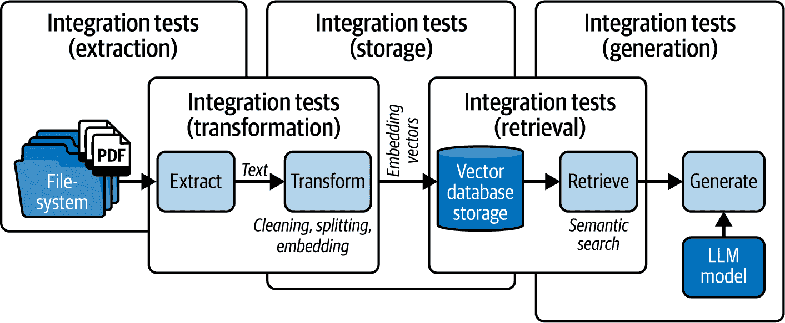
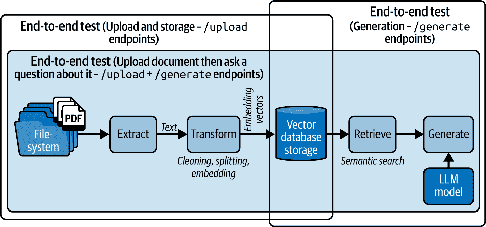

# 第十一章\. 测试人工智能服务

在本章中，您将了解在构建生成人工智能服务时测试的重要性及其挑战。您还将了解关键概念，如测试计划、验证和验证模型、测试金字塔以及测试数据、环境和边界的作用。

为了练习测试，您将使用`pytest`，这是一个具有测试固定、作用域、标记和固定参数化等功能的流行测试框架。您还将了解`pytest-mock`插件，用于修补函数和使用存根、模拟和间谍对象在测试期间模拟和控制外部依赖项。

由于模拟可能会使测试变得脆弱，因此我们还将探讨依赖注入，允许您直接将模拟或存根依赖项注入到正在测试的组件中，从而避免运行时代码修改。

我们将讨论隔离性和幂等性在测试中的作用，何时使用模拟，以及如何测试确定性和概率性生成人工智能代码。到本章结束时，您将自信地编写包括单元、集成、端到端和行为测试在内的全面测试套件，用于您自己的服务。

在我们深入编写测试之前，让我们探讨传统软件测试的基础概念以及如何测试生成人工智能服务，这可能会由于人工智能模型的概率性质而具有挑战性。

# 测试的重要性

理论上，每个人都同意在构建软件时进行测试是必要的。您编写测试以增强对系统功能和性能的信心，尤其是在它们相互交互时。但现实中，由于预算、时间或与维护测试相关的劳动力成本等限制，项目可能会跳过实施手动或自动化测试。

部分或完全跳过测试的项目最终会采取被动而不是主动的方法来处理软件问题。这就是当*技术债务*积累起来时，您随后将不得不以劳动力和服务器成本，加上利息，来偿还。

解决何时进行测试的问题具有挑战性。如果您只是在快速迭代中实验和构建原型，那么实际上您不必过多担心测试。然而，一旦您拥有一个最低可销售产品，一个与敏感数据交互并处理用户支付的系统，那么您就必须认真考虑测试计划。

在我的职业生涯早期，我为一位客户构建了一个学习管理系统。我编写了一个 webhook 端点，用于与 Stripe 的支付系统以及我自己的自制身份验证解决方案进行接口，该解决方案只会注册在成功首次支付的用户。该系统必须对新的和现有的客户收取和处理订阅支付，同时跟踪用户记录、订阅、支付、结账会话和发票。那个 webhook 的逻辑最终变得如此复杂，以至于它导致了一个成为 1,000 行函数的怪物。该函数正在检查各种类型的未排序接收事件，并多次往返数据库。

由于 webhook 的行为如此*不可靠*，对同一组输入返回不一致的响应，整个解决方案最终不得不被废弃。即使在成功支付后，用户也无法注册。这种不可靠性使得调试那个 webhook 变得难以忍受，迫使我不得不从头开始重新编写支付系统集成。如果我当时只是放慢速度来规划和模块化逻辑，并早期编写测试，我就可以避免这么多头疼的问题。

当你放慢速度来规划和测试你的服务时，你正在权衡时间和精力以换取对代码的信心。

你应该在以下几种情况下考虑实现测试：

+   多个贡献者随着时间的推移添加了更改

+   维护者更改外部依赖项

+   你在服务中增加了组件和依赖项的数量

+   你突然发现出现了太多的错误

+   如果事情出错，风险太大——我的经验就属于这一类

你现在应该了解测试将如何使你的项目受益。

# 软件测试

现在你已经熟悉了测试 GenAI 服务的挑战和潜在方法，让我们回顾软件测试概念，以了解它们对 GenAI 用例的相关性和需要避免的常见陷阱。

## 测试类型

软件测试中有三种常见的测试类型，按大小和复杂度递增的顺序如下：

单元测试

专注于测试离散输入集和边缘情况下的单个组件或函数，以验证单个组件级别的功能。单元测试具有最小的范围，通常不依赖于外部系统或依赖项。

集成测试

检查各个组件或系统之间的交互，以验证它们是否按预期一起工作。集成测试通常捕获子系统级别的应用程序行为问题，验证各种组件之间的数据流和接口合同（即规范）。

端到端（E2E）测试

通过模拟真实使用场景，从开始到结束验证应用程序在最高系统级别的功能。端到端测试为你提供了对应用程序功能和性能的最高信心水平，但它们是设计、开发和维护最具挑战性的测试。

###### 小贴士

端到端测试和集成测试具有相似之处，使得它们难以区分。如果一个测试很大，有时不可靠，你可能正在处理一个端到端测试。

集成测试通常检查系统的一部分和交互，而不是整个系统或长链子系统。

图 11-1 展示了每种测试类型的范围。左侧显示的单元测试专注于隔离的组件，而集成测试则检查多个组件之间的成对交互，包括与外部服务的交互。最后，端到端测试覆盖了应用程序中的整个用户旅程和数据流，以确认预期的功能。


###### 图 11-1\. 软件测试中的测试类型

在实施上述任何测试之前，你还可以使用像`mypy`这样的工具进行*静态代码检查*来捕获语法和类型错误。当你编写代码时，静态检查还可以帮助你捕获代码风格违规、函数和依赖项的误用、安全漏洞、死代码或未使用代码、数据流问题以及系统组件中的潜在错误。

随着你从静态检查和单元测试进展到集成测试，再到端到端测试，你的测试用例变得更加有价值，但也更加复杂、昂贵和缓慢。更重要的是，由于端到端测试具有更广泛的范围，涉及多个组件的交互，它们将变得更加脆弱，更容易失败，需要频繁更新以保持与代码变化的同步。

端到端测试也复杂且不可靠/非确定性。根据马丁·福勒的说法^(1)，这些是非确定性的主要原因：

+   *隔离不足*会导致组件之间相互干扰，从而导致不可预测的结果。

+   *异步行为*，即操作在非顺序或不可预测的时间发生，可能导致非确定性结果。

+   *远程服务*可能会由于网络延迟、服务可用性或不同的响应而引入可变性。

+   *资源泄露*，如果管理不当，可能导致系统行为不一致。受影响的资源包括内存、文件句柄或与数据库、客户端等的连接。

最后，由于端到端测试的脆弱性，重构和功能变更可能导致它们失败。因此，你在端到端测试中获得的可信度水平与对系统进行更改的灵活性之间存在权衡。

## 测试软件的最大挑战

测试服务中最大的挑战是确定要测试什么以及测试到什么程度。作为其中的一部分，你需要决定要模拟、伪造还是保持真实，同时配置一系列的测试工具和环境。

为了克服这个挑战，你可以提前规划你的测试，确定系统中的断裂点，并将问题缩小到单个组件和交互。然后，想象一下用户是谁，并列出他们与有问题的系统交互时将采取的步骤。最后，你可以将这些步骤列表转换为单个测试并自动化它们。

另一个与测试相关的挑战，导致大量挫败感的是，每当重构被测试的代码时，不得不重写你的测试。

由于代码重构不会改变功能行为但会改变实现细节，这可能是一个迹象，表明你没有测试正确的事情。例如，如果你测试的是`count_tokens(text)`函数的内部字符串处理逻辑，而不是仅仅测试其最终输出（即令牌计数），使用外部库替换字符串处理逻辑可能会导致你的测试失败。

一个明显的迹象表明你可能正在测试实现细节是，当你重构代码时（即假阳性），或者即使你引入了破坏性的代码更改（即假阴性），你的测试也会失败。你可以使用诸如*黑盒测试*等技术，通过提供输入并观察输出来测试你的系统，而不考虑实现细节。

如果你提前规划你的测试，你可以避免这些测试挑战。

## 测试规划

在规划阶段确定所需的测试时，你可以使用*验证和验证*（V&V）过程。

按照此流程，你首先确认拥有正确的需求（验证），然后利用测试来验证所有需求都得到满足（验证）。

###### 警告

即使有 100%的代码覆盖率并且测试通过，也仅完成了验证过程，而不是验证。你仍然需要确保你的服务实现了正确的功能（即验证）。

V&V 过程可以按照图 11-2 所示，可视化为 V 形模型。

当你遵循 V 模型时，你首先定义软件需求，然后设计解决方案，在将其作为代码实现之前。之后，通过运行渐进式测试（单元、集成、端到端等）回到“V”的顶部，以验证你的解决方案是否符合业务需求。


###### 图 11-2\. 验证和验证模型

如前所述，验证测试可能难以识别。你应该实施哪些渐进式测试？

当你在识别要测试的内容时遇到困难，你可以根据在应用程序中发现的错误和问题编写测试。这种方法是*反应性的*，因为你只有在问题出现时才编写测试，这可以帮助你克服不知道要测试什么的挑战。然而，在*软件开发生命周期*（SDLC）的后期解决问题的测试需要大量的测试工作，因为你将处理一个更复杂的系统，有许多移动部件需要测试。

因此，像*左移测试*这样的运动正在倡导*预防性*测试实践，这些实践是在开发过程中提前计划和编写的，以减少测试工作量。图 11-3 展示了在 SDLC 早期移动测试工作量如何减少总体负担。


###### 图 11-3\. 左移软件测试

在左移测试中，一个常见的做法是*测试驱动开发*（TDD），如图 11-4 所示。


###### 图 11-4\. TDD

在 TDD 方法中，你会在实际代码之前编写测试。这是一个迭代的过程，其中编写的测试最初会失败，但你的目标将是编写最少的代码以使测试通过。一旦通过，你将重构代码以优化系统，同时保持测试通过以完成迭代的 TDD 过程。

###### 小贴士

TDD 实践在测试 GenAI 服务中非常有用的一个例子是在*提示工程*期间。首先编写一组测试，然后不断迭代提示设计，直到所有测试通过。

使用相同的测试用例，你可以检查任何回归的迹象，以及切换模型是否会降低你服务的性能。

如你所见，TDD 的总体目标是通过对代码质量、解决方案设计和问题早期检测的改进来减少测试工作量。

## 测试维度

此外，在规划过程中，你通常需要决定包括测试*范围*、*覆盖率*和*全面性*在内的各种测试维度：

范围

定义你将测试的组件、系统和使用场景。作为范围定义的一部分，你还将绘制*测试边界*以明确什么将被测试，什么不会被测试。

覆盖率或测试表面积

衡量你将测试的系统或代码库的多少。

全面性

表示在定义的范围内和覆盖范围内你的测试将有多详细、深入和完整。例如，你将决定是否要测试每个组件、系统和交互的每个潜在使用情况、成功和失败场景以及边缘情况。

你也可以将测试范围、覆盖率和全面性视为测试的*空间/体积*、*表面积*和*深度*。体积/空间定义了测试的边界和维度；表面积衡量测试的分布；深度意味着测试用例的详细程度、深度和完整性。

## 测试数据

为了实现更高的测试覆盖率和全面性，你可以利用四种不同类型的测试数据：

有效数据

在正常条件下，系统内的有效和预期范围内的输入。

无效数据

预期之外、错误、NULL 或超出有效范围的输入。你可以使用负数据来测试系统被误用时会如何表现。

边界数据

在可接受输入范围的边界处的测试数据，无论是上限还是下限。

大量数据

用于性能和压力测试系统以测量其极限。

## 测试阶段

无论你是在实现单元测试、集成测试还是端到端测试，你都可以使用**给定-当-然后**（GWT）模型来结构化测试，如下所述：

1.  **给定（前提条件）**：在执行任何给定测试之前，你可以设置测试条件和预定义的状态或数据（即**固定值**）。

1.  **当（测试步骤）**：在测试过程中，你执行一系列你想要测试的操作步骤。这是你将测试固定值传递给**系统单元**（SUT）的地方，根据测试范围，它可以是单个函数或整个服务。

1.  **然后（预期结果）**：在执行了固定值之后，你将在这一阶段使用一系列断言语句来检查输出是否符合你的预期。

1.  **清理**：一旦完成，你可以在可选的**清理/拆卸**阶段清理测试工件。

`pytest`建议使用**安排-执行-断言-清理**模型来结构化测试，这直接对应于 GWT 模型，并包含一个可选的清理阶段。

## 测试环境

在规划测试时，你也应该考虑涵盖编译时间、构建时间和运行时环境的各种**测试环境**。

在许多编程语言中，**编译时间**是指源代码被转换为可执行代码的时候。例如，如果你正在用 C++编写代码，编译过程涉及在整个代码库中进行全面的类型检查。如果发现类型错误，编译过程将失败。一旦所有检查都通过，C++编译器将代码转换为可执行的二进制文件。

###### 备注

C++中的强类型设计是为了提高错误检测、代码健壮性，并在频繁变更的大型和复杂代码库中支持开发者工具。

由于 Python 是一种解释型语言，它没有像 C++那样的传统编译时间。相反，Python 将代码转换为字节码以执行。

在审查过程中，静态代码检查器如`mypy`可以识别代码中的基本问题，作为测试努力的初步验证层。

###### 警告

由于 Python 是一种动态类型语言，它默认不强制执行类型。然而，如果你在 Python 代码中使用类型提示，静态类型检查器如`mypy`可以提供显著的价值。

虽然静态检查在编译时能够很好地捕捉基本的代码问题，但单元测试、集成测试和端到端测试可以在执行应用程序代码时的*运行时*验证系统功能。在运行时，像 Pydantic 这样的工具可以执行数据验证检查，以捕捉意外的数据结构。

你的 GenAI 服务在执行任何应用程序代码之前可能还需要额外的设置和构建步骤，例如下载权重和预加载模型。完成构建步骤、设置和依赖项安装的环境被称为*构建时间*，你也可以对其进行测试。

## 测试策略

在软件领域，各种专家已经根据多年的软件测试经验开发了平衡项目测试分布的策略，这些策略是基于那些推广它们的开发者的经验。

最广泛采用的策略是*测试金字塔*，如图图 11-5 所示，它促进了编写更多的单元测试。


###### 图 11-5\. 测试金字塔

表 11-1 概述了测试金字塔中每一层的目的，以及在一个 GenAI 服务上下文中的具体示例。

表 11-1\. 真实世界中的测试金字塔

| 层 | 目的 | 示例 |
| --- | --- | --- |
| 端到端测试 | 验证从开始到结束的整个应用程序流程 | 测试用户登录，根据提示生成文本，以及保存生成的内容 |
| 集成测试 | 验证各个模块或服务是否正确协同工作 | 测试文本生成 API 与存储用户提示和生成文本的数据库之间的交互 |
| 单元测试 | 验证独立组件或函数 | 测试处理模型输入的各种实用函数，例如，移除不适当的内容 |

测试金字塔模型的问题在于，虽然单元测试可以提高代码覆盖率，但它们并不一定增强“业务覆盖率”，因为项目需求和用例可能没有得到彻底的测试。因此，仅依赖单元测试可能会产生虚假的安全感，可能会忽略测试关键的业务逻辑和用户工作流程。另一方面，集成测试允许你覆盖更广泛的范围和以业务为导向的测试。

###### 警告

软件测试专家还识别出一些作为*反模式*的策略，这些策略是反生产力的。

如果你遵循它们，你将花费过多的时间设置测试，实现过于具体且紧密耦合的测试，最终得到的测试可能表现出非确定性的不稳定行为。

表 11-2 和图 11-6 展示了一组软件测试反模式。

表 11-2\. 软件测试反模式

| 策略 | 测试分布 | 备注 |
| --- | --- | --- |
| 测试冰淇淋锥形 | 单元测试数量少，集成和端到端测试数量多，之后是手动测试。 | 应避免。被认为是一种反模式，因为手动测试的实施效率低下，维护集成和端到端测试的成本高昂。 |
| 测试纸杯蛋糕 | 与冰淇淋锥形相似；有少量自动化的单元和集成测试，中等数量的自动化的端到端/GUI 测试，以及大量的手动测试。每种测试类型由不同的团队执行。 | 应避免。被认为是一种反模式，因为它可能导致反馈周期缓慢，团队间的沟通开销，以及维护成本高昂的脆弱测试。 |
| 测试沙漏 | 底部有大量的单元测试，顶部有端到端测试，但中间的集成测试显著较少。 | 应避免。被认为是一种反模式。虽然不如冰淇淋锥形糟糕，但仍然会导致过多的测试失败，这些中等范围的测试本来可以覆盖。 |


###### 图 11-6. 测试反模式的可视化

表 11-3 和 图 11-7 比较了软件测试策略。

表 11-3. 测试策略比较

| 策略 | 测试分布 | 评论 |
| --- | --- | --- |
| **测试金字塔**(Mike Cohn) | 底部有大量的单元测试，中间较少的集成测试，顶部更少的端到端测试。 | 这是一个被广泛接受的策略。然而，金字塔可以被看作是一个物理概念，用来促进首先构建单元测试的底层，然后构建下一层，以此类推，直到达到顶部。当应用于拥有大量代码库的遗留应用程序时，这种方法可能无效。 |
| **测试奖杯**(Kent C. Dodds) | 侧重于拥有强大的静态检查基础，然后是单元测试，接着是集成测试，顶部有较少的端到端测试。 | 这种策略的依据是端到端和集成测试最有价值。然而，端到端测试速度慢且成本高。集成测试在两者之间取得平衡。 |
| **测试蜂巢**(Stephen H. Fishman) | 代表了一种平衡的方法，对单元、集成、端到端和其他类型的测试（性能、安全等）给予同等重视。 | 如果管理不当，可能会效率较低，并且可能不是每个项目的最佳选择。 |


###### 图 11-7. 测试策略的可视化

对于涉及复杂集成和性能考虑的 GenAI 服务，奖杯测试策略可能是最合适的。奖杯策略包括强大的静态检查基础，由`mypy`和 Pydantic 等工具提供支持，以及主要是集成测试，这些测试在价值、信心和测试成本之间取得平衡。

如果你的 GenAI 服务必须使用包括性能和探索性测试在内的各种测试类型进行全面测试，那么蜂巢模型可能更适合你的项目，因为它可以平衡测试工作量。

你现在应该更自在地识别你需要哪些测试以及如何规划你的测试。

现在你已经熟悉了软件测试的概念，让我们回顾一下测试 GenAI 服务的挑战和潜在方法。

# 测试 GenAI 服务的挑战

如果你已经决定测试你的 GenAI 服务，你将面临几个挑战。利用概率 GenAI 模型的服务的测试需要比传统软件更全面的方法。

让我们看看为什么测试 GenAI 服务将具有挑战性的几个原因。

## 输出可变性（不可靠性）

在相同的输入集和实现代码下，GenAI 服务通常会产生不同的输出。这些输出之所以多样化，是因为这些模型使用概率技术，如从分布中进行采样，而不是依赖于确定性函数。当然，你在输出上体验到的可变性可能取决于模型，调整配置，如温度值，可以减少这种可变性。

GenAI 模型的输出可变性也可能导致你可以编写的潜在测试用例数量激增（即，*测试区域/范围*），以覆盖所有可能性。正因为如此，你不能完全依赖确定性测试。你的测试将表现不一致，并且会在 CI/CD 管道中运行时过于*不可靠*。

相反，你应该从统计和概率的角度来处理 GenAI 测试问题。根据从*合法输入分布*的有效假设中抽取的几个样本来验证你模型产品输出的质量。

###### 注意

我所说的*合法输入分布*是指选择与模型目的相符、代表现实场景并与你试图用模型解决的问题相关的输入。

更复杂的方法是使用判别模型来评估你的服务变量输出的分数，只要你设定了某种容忍度或阈值。

你将在本章后面看到如何做到这一点的示例。

## 性能和资源限制（慢且昂贵）

由于测试 GenAI 服务需要更统计和/或多模型的方法，你还将面临延迟、使用和托管问题。

你的测试无法足够快且可靠地持续在传统的 CI/CD 管道中运行。你最终会因多次模型 API 调用和运行缓慢且复杂的多模型测试而产生过度的令牌使用成本。除非你做出几个假设来简化测试范围、减少模型测试频率，并使用高效的测试技术，如模拟和修补、依赖注入和统计假设检验，否则这些挑战将依然存在。你也可以调查使用小型微调判别器模型以减少延迟并提高性能的用途。

## 回归

*回归测试* 是在处理 GenAI 模型时计划的一种另一种测试类型。

一篇于 2023 年发表的 [研究论文](https://oreil.ly/1oLQG) 比较了 ChatGPT 随时间的行为，发现：

> GPT-3.5 和 GPT-4 的性能和行为会随时间有很大的变化。例如，GPT-4（2023 年 3 月）在识别质数与合数方面表现合理（84% 准确率），但 GPT-4（2023 年 6 月）在这些相同的问题上表现较差（51% 准确率）。与 3 月相比，GPT-4 在 6 月更不愿意回答敏感问题和意见调查问题。此外，GPT-4 和 GPT-3.5 在 6 月的代码生成中比 3 月有更多的格式错误。

根据这项研究，即使是“相同”的 LLM 服务，其行为也可能在相对较短的时间内发生显著变化，这突出了对 LLM（以及任何 GenAI 服务）进行持续监控的必要性。基于这一发现，你可以假设你的 GenAI 服务的性能可能会随着时间的推移而下降，这可能是由于模型微调或重新训练、用户交互模式的转变以及其训练数据或运行环境的变化。

进一步来说，概率 AI 模型可能会经历 *模型漂移*，这是一种随着时间的推移导致的性能下降，归因于其底层训练数据。在额外数据上微调可能会对模型在其他任务中的行为产生意外的副作用。

随着时间的推移，原始训练数据可能会与现实脱节。趋势会变化，新的历史事件会发生，语言会演变，人类知识会扩展或变异成新的形式，如果训练数据不持续更新，这些新形式将不会被捕捉到。这种导致模型漂移的现象被称为 *概念漂移*，它发生在模型试图预测的目标变量的统计属性随时间变化时。概念漂移可能导致模型性能下降，因为模型在训练期间学习到的关系和模式不再适用。

此外，涉及训练数据中输入特征分布变化的 *数据漂移* 也可能导致模型漂移。

这种漂移通常是由于采样方法、人口分布和数据收集的变化、数据中的季节性变化和时间效应、数据源的外部变化或处理管道中的质量问题所引起的。

回归测试和监控（特别是如果你依赖于外部模型提供商，如 OpenAI）可以帮助你检测特定任务和用例中的模型漂移问题。任何潜在的漂移都可以通过数据验证或使用 RAG 等技术，在应用层解决，或者通过重新训练和模型微调，在模型层解决，以减少回归问题。

## 偏差

在测试 GenAI 服务时，另一个重大挑战是在投入生产之前检测模型偏差。通常，数据科学家和负责生成模型的 ML 工程师在数据探索过程中调查偏差。然而，对于大型基础 GenAI 模型，总有可能通过错误的评估、采样方法、数据处理、训练算法或数据本身的隐藏偏差引入某种形式的偏差。

例如，如果一个语言模型是在主要包含与特定人口统计数据相关的文本的数据集上训练的，它可能会生成偏向该人口统计数据的输出，从而可能排除其他群体。同样，如果一个图像识别模型主要是在医生和工程师等职业的男性图像上训练的，它可能会学会生成具有性别偏差的图像。

在你希望使用 LLM 作为裁判的场景中，这种偏差变得尤为严重，例如 AI 评分工具或面试评估者。

偏差可以以各种形式表现出来，如性别偏差、种族偏差、年龄偏差等，每种类型都需要特定的测试和指标来检测。如果没有知道要测试什么，你就无法自信地验证你的 GenAI 服务是否 100%无偏差。

解决这个问题的可能方案是利用模型自我检查和 AI 判别器，其中次要模型识别或测量任何偏差的存在。在服务运行时检测偏差时，通常需要在延迟和配额使用之间做出权衡。

## 对抗性攻击

公开的 GenAI 服务可能容易受到对抗性攻击，如令牌操纵、不安全的数据处理、越狱提示或提示注入、敏感信息泄露、数据中毒、模型盗窃、拒绝服务、过度代理以及一般滥用和误用。因此，任何暴露于互联网的 GenAI 服务都需要包括安全层。

资源和清单，如[OWASP 的 LLM 应用前 10 名](https://genai.owasp.org)，为向你的 GenAI 服务添加安全措施提供了一个起点。

然而，构建安全机制可能具有挑战性，因为截至写作时，当前的方法依赖于分类和歧视模型来检测对抗性攻击和有害内容。这些安全模型通常需要数百兆字节的依赖项，这可能会膨胀你的应用程序，显著降低你的服务吞吐量，并且仍然可能无法捕捉到每个潜在的攻击场景。

对抗性测试确保你已实施足够的防护措施来保护你的服务和声誉。作为对抗性测试的一部分，你还应验证你的身份验证和授权保护器的性能。

第九章更详细地介绍了实施这些防护层和评估技术以保护你的模型免受此类攻击的方法。

## 未绑定测试覆盖率

GenAI 模型的潜在空间非常庞大，以至于你不能依赖于单元测试来实现每个使用场景的 100%覆盖率。

由于存在无限数量的输入和响应，无论你测试你的模型多少次，总会存在一些隐藏的边缘情况会从你的测试中漏出。因此，而不是依赖于预先定义每个场景，你可以实施*行为测试*，它关注的是响应的性质而不是确切的输出。

你可以衡量的行为属性示例包括生成数据结构的*一致性*、输出与输入的*相关性*、*毒性*、*正确性*和*忠实性*（即忠实遵守你的政策和道德指南）。你还可以添加一个人类作为额外的测试层，以捕捉意外的响应。

###### 警告

如果你正在构建一个具有多个模型和外部依赖关系的 RAG 或代理应用程序，行为测试变得更加实用。测试一组固定的示例可能会错过边缘情况、组件之间的意外交互以及由于外部因素引起的响应变化。

在下一节中，你将学习如何通过跟随一个动手项目来实施你自己的单元、集成、端到端和行为的测试。

# 项目：实现 RAG 系统的测试

在动手项目中，你将为第五章中实现的 RAG 模块编写测试套件。你将要测试的 RAG 系统与 LLM、向量数据库和服务器文件系统通过异步方法接口，因此它提供了一个理解迄今为止讨论的测试原则的绝佳机会。

通过跟随代码示例，你将学习为你的 GenAI 服务实施单元、集成和端到端测试的最佳实践，以及它们之间的区别。

## 单元测试

你可以使用单元测试开始测试你的 GenAI 服务。单元测试的目的是验证你的代码的独立部分，通常是一个单独的函数或方法，是否按预期执行。

在编写测试之前，规划你将要实施的测试用例非常重要。对于一个典型的 RAG 系统，你可以在数据加载、转换、检索和生成管道上编写单元测试。

图 11-8 在数据管道图中可视化了这些潜在单元测试的测试边界。


###### 图 11-8\. 在 RAG 数据管道图中可视化的单元测试边界

注意测试边界在每个数据处理管道函数的开始和结束处结束。这是因为这些单元测试的目的仅是测试数据处理管道代码，而不是数据库、文件系统、LLM 模型或任何相关接口。

在这些单元测试中，您将假设这些外部系统会返回您期望的结果，并将单元测试的重点仅放在数据处理代码上。

为了简洁起见，我们不会测试系统的每个组件，但通过遵循即将出现的几个示例，您应该能够轻松实现后续测试以实现全面覆盖。

### 安装和配置 pytest

对于这个项目，您将使用`pytest`包，它具有处理测试固定值、参数、异步代码、测试收集和丰富插件生态系统的内置组件。与 Python 内置的用于简单测试场景的`unittest`包相比，`pytest`更强大、更灵活且可扩展。

您可以使用以下命令安装`pytest`：

```py
$ pip install pytest
```

接下来，在项目的根目录下创建一个`tests`目录，您可以在其中创建遵循*test_xxx.py*模式的 Python 模块。

`pytest`的测试收集器可以遍历您的`tests`目录，找到其中的每个测试模块、类和函数：

```py
project
|-- main.py
...
|-- tests
    |-- test_rag_loader.py
    |-- test_rag_transform.py
    |-- test_rag_retrieval.py
...
```

在每个测试文件中，您可以添加包含至少一个`assert`语句的测试函数。如果这些`assert`语句中没有抛出异常，则您的测试将获得`PASSED`。否则，`pytest`将标记它们为`FAILED`，并显示为什么`assert`语句失败的原因/跟踪：

```py
# tests/rag/transform.py

def test_chunk_text():
    text = "Testing GenAI services"
    results = chunk(text)
    assert len(results) = 2
```

假设您在每个测试模块中编写了两个测试函数：

您可以通过`pytest <test_dir_path>`命令执行您的测试。

```py
$ pytest tests
=========================== test session starts ============================
platform linux -- Python 3.11, pytest-8.0.0

Collected 6 items

tests/rag/loader.py ..                                                 [100%]
tests/rag/transform.py F.                                              [100%]
tests/rag/retrieval.py ..                                              [100%]

================================= FAILURES =================================
______________________________ test_chunk_text _____________________________

def test_chunk_text():
>     assert len(results) == 2
E       assert 3 == 2

tests/rag/transform.py:6: AssertionError
========================= short test summary info ==========================
PASSED 5
FAILED tests/rag/transform.py::test_chunk_text - assert 3 == 2
============================ 1 failed in 0.12s =============================
```

###### 警告

避免编写大型测试，因为它们变得越来越难以理解和正确实现。

编写单元测试时，您只关心系统的一个独立组件，例如代码中的一个单独函数。其他组件超出了单元测试的边界。因此，您将测试的是，在给定的测试数据输入下，单个组件是否按预期行为。

例如，您可以测试您的分块函数是否按预期将文档分割成块。也许您想为您的 RAG 管道尝试不同的或复杂的分块策略，并确保任何输入文本都能正确分块。使用预定义测试数据或*固定值*的单元测试可以增强您对分块函数的信心。

示例 11-1 演示了您的分块函数的一个示例单元测试。

##### 示例 11-1. 分块函数的示例单元测试

```py
# rag/transform.py

def chunk(tokens: list[int], chunk_size: int) -> list[list[int]]: 
    if chunk_size <= 0:
        raise ValueError("Chunk size must be greater than 0")
    return [tokens[i:i + chunk_size] for i in range(0, len(tokens), chunk_size)]

# tests/rag/transform.py

import pytest
from rag.transform import chunk

def test_chunking_success():
    # GIVEN 
    tokens = [1, 2, 3, 4, 5]
    # WHEN 
    result = chunk(token_list, chunk_size=2)
    # THEN 
    assert result = [[1, 2], [3, 4], [5]]
    ... # Other relevant asserts here
```


将整数标记列表分块成指定大小的更小列表。


在测试的*给定（先决条件）*部分指定测试数据。


在测试的*WHEN*部分运行测试步骤，包括将测试数据传递给被测试的系统。


在测试的*THEN*部分检查结果与预期输出是否一致。

### 固定装置和作用域

您在示例 11-1 中为测试定义的输入数据也称为**固定装置**，因为其值在每次测试运行中保持不变。固定装置有两种类型：

新固定装置

您可以在每个测试内部定义它，然后 Python 在测试结束后进行垃圾回收（即丢弃）。示例 11-1 使用了一个新的固定装置。

共享固定装置

您可以在多个测试中重用它，以避免为每个新测试重复相同的固定装置。

您可以将共享固定装置作为测试模块的全局变量声明在测试函数外部，但这被认为是一种反模式，因为您可能会意外地修改它们。

###### 警告

共享固定装置必须是**不可变的**。否则，测试可能会更改固定装置，从而在其它测试中产生副作用。可变固定装置是导致测试不稳定的主要原因。

您不必自己负责管理共享固定装置的状态，您可以通过使用*固定装置函数*依赖注入系统，如示例 11-2 所示。

##### 示例 11-2. `pytest`固定装置函数

```py
# tests/rag/transform.py

import pytest
from rag.transform import chunk

# GIVEN
@pytest.fixture(scope="module") 
def tokens(): 
    return [1, 2, 3, 4, 5]

def test_token_chunking_small(token_list): 
    result = chunk(tokens, chunk_size=2)
    assert result = [[1, 2], [3, 4], [5]]

def test_token_chunking_large(token_list): 
    result = chunk(tokens, chunk_size=5)
    assert result = [[1, 2, 3, 4, 5]]
```


将`input_text`函数声明为`pytest`固定装置，它可以按照`scope="module"`在模块间共享。


使用`pytest`依赖注入将共享固定装置注入到不同的测试中。

您可以使用`@pytest.fixture(scope)`装饰器将函数声明为`pytest`固定装置。`scope`参数指定了共享固定装置在测试会话中的生命周期。

根据`scope`的值，`pytest`在每个测试函数、`class`、`module`、`package`或整个测试`session`中创建和销毁固定装置一次。

###### 小贴士

当您从外部 API 获取固定装置并希望避免重复请求时，您可能需要一个共享固定装置在模块或整个测试会话中持续存在的情况。

使用固定装置，您可以实现具有各种输入的多个测试，包括有效、无效和边界值，以验证每个组件的健壮性。然而，您需要为每组输入和预期输出分别编写测试函数。为了避免重写相同的测试，`pytest`有一个*参数化*功能，您可以利用它。

### 参数化

使用`pytest`参数化，您可以遍历各种测试数据和预期输出，以避免重复测试，正如您可以在示例 11-3 中看到的那样。

##### 示例 11-3. `pytest`参数化

```py
# tests/rag/transform.py

@pytest.mark.parametrize("tokens, chunk_size, expected",  ![1
    ([1, 2, 3, 4, 5], 2, [[1, 2], [3, 4], [5]]), # valid
    ([1, 2, 3, 4, 5], 3, [[1, 2, 3], [4, 5]]), # valid
    ([1, 2, 3, 4, 5], 1, [[1], [2], [3], [4], [5]]),  # valid
    ([], 3, []), # valid/empty input
    ([1, 2, 3], 5, [[1, 2, 3]]),   # boundary input
    ([1, 2, 3, 4, 5], 0, "ValueError"), # invalid (chunk_size <= 0)
    ([1, 2, 3, 4, 5], -1, "ValueError"), # invalid (chunk_size <= 0)
    (
        list(range(10000)), 1000, [list(range(i, i + 1000)) # huge data
        for i in range(0, 10000, 1000)]
    )
])
def test_token_chunking(tokens, chunk_size, expected) 
    if expected == "ValueError":
        with pytest.raises(ValueError):
            chunk(tokens, chunk_size)
    else:
        assert chunk(tokens, chunk_size) == expected
```


使用 `@pytest.mark.parametrize` 装饰器函数来指定多个测试参数和预期输出。测试参数包括有效、空、无效、边界范围和大值，以验证标记分块函数的健壮性。

[(#co_testing_ai_services_CO3-2)]

将测试参数注入测试函数中，如果预期输出是 `ValueError`，则使用 `pytest.raises` 验证是否已引发 `ValueError` 异常。否则，运行断言检查。

你还可以将测试数据存储在 JSON 文件中，并将它们作为夹具加载到参数化测试函数中，如示例 11-4 所示。

##### 示例 11-4\. 参数化 `pytest` 测试中的 JSON 夹具

```py
# tests/rag/test_data.json 

[
    {"tokens": [1, 2, 3], "chunk_size": 1, "expected": [[1], [2], [3]},
    ...
]

# tests/rag/transform.py

@pytest.fixture
def test_data():
    with open('test_data.json') as f:
        return json.load(f)

@pytest.mark.parametrize("case", test_data())
def test_token_chunking(case):
```

[(#co_testing_ai_services_CO4-1)]

JSON 文件包含一个测试用例列表，作为字典。

如你所见，夹具和参数化技术是极其强大的工具，可以帮助你验证代码中每个函数的健壮性。

在编写测试时，你可能希望指定设置代码、配置和要在测试文件之间共享的全局夹具。幸运的是，你可以在 `pytest` 的全局配置文件 *conftest.py* 中实现这一点。

### Conftest 模块

如果你希望整个测试模块都能访问夹具和全局配置，你可以在 `tests` 目录中添加一个 *conftest.py* 模块。在 conftest 模块中定义的任何夹具、设置代码和配置都将与其他测试模块共享。参见 示例 11-5。

##### 示例 11-5\. 在每个模块中添加一个共享的测试夹具

```py
# tests/conftest.py

@pytest.fixture(scope="module") 
def tokens():
    return [1, 2, 3, 4, 5]

# tests/rag/transform.py

def test_chunking(tokens):
    ....

# tests/rag/retrieval.py

def test_query(tokens):
    ....
```

[(#co_testing_ai_services_CO5-1)]

在 *conftest.py* 中定义一个共享夹具，以便在所有测试模块中使用。否则，夹具的作用域将仅限于单个模块。

现在，你已经了解了按照 GWT 模型使用 `pytest` 框架编写基本测试的方法。接下来，让我们看看如何在测试前后执行设置和清理操作。

### 设置和拆卸

在实现测试时，你可能还需要事先配置测试环境，并在之后执行拆卸或清理操作。你可以在共享夹具中使用 `yield` 关键字来实现每个测试必须一致发生的设置和拆卸操作。

例如，你可能需要在设置和清理数据库会话时使用此功能，如示例 11-6 所示。

##### 示例 11-6\. 在共享夹具中设置和拆卸数据库会话

```py
# tests/conftest.py

from qdrant_client import QdrantClient

@pytest.fixture(scope="function") 
def db_client():
    client = QdrantClient(host="localhost", port=6333) 
    client.create_collection( 
        collection_name="test",
        vectors_config=VectorParams(size=4, distance=Distance.DOT),
    )
    client.upsert( 
        collection_name="test",
        points=[
            PointStruct(
                id=1, vector=[0.05, 0.61, 0.76, 0.74], payload={"doc": "test.pdf"}
            )
        ],
    )
    yield client 
    client.close() 

# tests/rag/retrieve.py

def test_search_db(db_client): 
    result = db_client.search(
        collection_name="test", query_vector=[0.18, 0.81, 0.75, 0.12], limit=1
    )
    assert result is not None
```

[(#co_testing_ai_services_CO6-1)]

在 *conftest.py* 中创建一个全局共享夹具，该夹具在每个测试函数中创建和销毁一次。

[(#co_testing_ai_services_CO6-2)]

实例化 `qdrant` 数据库客户端，然后在测试设置阶段创建和配置一个包含更新数据的测试集合。

[(#co_testing_ai_services_CO6-5)]

将数据库客户端作为主要测试阶段的一部分传递给测试函数。


在每次测试后清理，通过关闭到数据库的客户端连接。在`yield`关键字执行完成后，执行`yield`关键字后的拆卸代码。


在测试设置完成后，将预配置的数据库客户端注入到每个测试函数中。查询数据库以获取插入的文档，并断言已获取到数据点。一旦断言步骤完成，作为`db_client`固定函数的一部分运行拆卸过程。

按照示例 11-6 中的示例 Example 11-6，您也可以为 API 测试客户端或任何其他外部服务创建具有设置和拆卸步骤的固定函数。

此外，您可能已经注意到 Example 11-6 使用了同步客户端而不是异步客户端。这是因为处理异步测试可能很棘手、不可靠且容易出错，并且因为它需要安装额外的`pytest`插件来处理测试事件循环。

为了避免不可靠的单元测试，您应该使用模拟来隔离功能组件与外部服务。我们这样做是因为单元测试的范围和测试边界不包括外部依赖和接口。相反，测试外部依赖和接口，如数据库交互，将属于集成测试的范围。

您将学习如何处理异步测试以及模拟/修补技术。

### 处理异步测试

要执行异步测试，可以使用`pytest-asyncio`等插件将`pytest`与 Python 的`asyncio`集成：

```py
$ pip install pytest-asyncio
```

一旦安装了插件，您就可以按照 Example 11-7 编写和执行异步测试。

##### 示例 11-7. 编写异步测试

```py
# tests/rag/retrieve.py

@pytest.mark.asyncio 
async def test_search_db(async_db_client): 
    result = await async_db_client.search(
        collection_name="test", query_vector=[0.18, 0.81, 0.75, 0.12], limit=1
    )
    assert result is not None
```


使用`asyncio`装饰器显式标记异步测试，以便在事件循环中运行测试。


这假设您已经在*conftest.py*中将同步数据库客户端替换为异步客户端。

当您运行`pytest`命令时，它会搜索项目目录树以使用*collectors*发现每个目录层次级别的测试：函数、类、模块、包或会话。`pytest-asyncio`插件为每个收集器提供异步事件循环。默认情况下，标记为`@pytest.mark.asyncio`的测试在由*函数收集器*提供的事件循环中运行，以缩小事件循环的范围并最大化测试之间的隔离。

但为什么这种隔离很重要？

开发者在测试软件时最大的挫折来源是不可靠的测试。这些测试在连续运行测试套件而未更改任何代码或配置的情况下随机失败。

通常，当你调查不可靠测试行为的原因时，你会发现有一个中心固定或依赖项被其中一个测试更改，违反了测试的核心原则：*测试隔离*。这种隔离的目的是在测试中实现*幂等性*，即重复执行会产生相同的结果，无论你运行测试套件多少次。

没有隔离，测试可能会相互产生副作用，从而违反核心假设，导致结果/行为波动，以及随机失败。此外，相互依赖和顺序依赖的测试通常一起失败，阻止你从失败中获得有价值的反馈。

但不可靠行为如何与异步测试相关？

如第五章所述，异步代码利用 Python 内置的调度器，即事件循环，在遇到阻塞 I/O 操作时切换任务。在测试环境中，这种任务切换可能会使异步测试难以正确实现，因为异步操作可能不会立即完成，并且可能以错误的顺序执行。

异步测试通常与外部依赖（如数据库或文件系统）接口，执行可能需要很长时间运行的 I/O 阻塞操作。这对于必须非常快速运行的单元测试来说是一个主要问题，这样你就可以频繁地执行它们。

与操作以可预测和线性顺序执行的同步代码不同，异步代码也引入了时间、执行顺序和固定状态的可变性，这降低了测试结果的一致性。此外，外部依赖的响应时间可能会波动，导致违反测试隔离原则的副作用。

为了缓解副作用和不可靠行为的风险，你需要通过以下方式正确处理异步测试：

+   等待阻塞 I/O 操作

+   避免在异步测试中无意中使用阻塞同步 I/O 操作

+   使用正确的超时来管理延迟

+   明确控制操作顺序，尤其是在并行运行异步测试时

也许，最好的缓解方法是通过对外部依赖进行模拟来编写同步测试，这将使你的函数与 I/O 阻塞依赖解耦。使用模拟，你可以运行快速且可靠的测试，而无需等待 I/O 操作按你需要的方式完成。

###### 小贴士

在本地测试复制的生产环境时，即使有真实依赖，异步测试仍然有用。

接下来，让我们看看如何在单元测试中模拟外部依赖，以便你可以用同步测试代替缓慢的异步测试。

### 模拟和修补

当编写单元测试时，你需要将你的组件从外部依赖项中隔离出来，以避免运行缓慢的测试和消耗不必要的资源。例如，你不想在每次运行测试套件时都调用你的 GenAI 模型，因为这将非常频繁，这将非常计算密集且可能昂贵。

相反，你可以在单元测试中使用 *测试双* 来模拟真实依赖项，而无需在测试中依赖外部依赖项。本质上，它们假装是真实的东西，就像动作电影中的替身演员假装是主要演员一样。使用测试双的隔离单元测试可以验证组件在与外部依赖项（如 LLM API）交互时的状态变化或行为。

###### 警告

小心不要用测试双替换你试图测试的任何组件行为。

例如，如果你有一个使用 LLM API 并对响应进行内容过滤的 `ChatBot` 类，只需替换 LLM API 调用为测试双，而不是内容过滤逻辑。否则，你将测试自己的测试双。

你可以在单元测试中使用五种类型的测试双，如图 11-9 所示。


###### 图 11-9\. 测试双

这些包括以下内容：

假冒

用于测试目的的依赖项的简化实现

假

当需要填充参数时使用的占位符

存根

向正在使用它的系统测试提供假冒数据

间谍

跟踪依赖项的使用情况以供后续验证

模拟

检查依赖项将如何被使用，如果期望未满足则导致失败

除了用于验证组件行为的模拟之外，其余这些双可以用来验证状态变化。模拟有完全不同的设置和验证逻辑，但与其他双在使被测试的组件相信它正在与真实依赖项交互方面工作方式完全相同。

让我们看看每个双的作用，以了解它们的相似之处和不同之处。

#### 假冒

*假冒*对象是真实依赖项的完全功能但简化的版本，可能采取了捷径。一个例子是数据库客户端在测试期间使用内存数据库而不是实际的数据库服务器；或者 LLM 客户端从本地测试服务器获取缓存的响应而不是实际的 LLM。

示例 11-8 展示了一个假冒 LLM 客户端的外观。

##### 示例 11-8\. 假冒测试双

```py
class FakeLLMClient: 
    def __init__(self):
        self.cache = dict()

    def invoke(self, query):
        if query in self.cache:
            return self.cache.get(query) 

        response = requests.post("http://localhost:8001", json={"query": query})
        if response.status_code != 200:
            return "Error fetching result"

        result = response.json().get("response")
        self.cache[query] = result
        return result

def process_query(query, llm_client, token):
    response = llm_client.invoke(query, token) 
    return response

def test_fake_llm_client(query):
    llm_client = FakeLLMClient()
    query = "some query"
    response = process_query(query, llm_client, token="fake_token")
    assert response == "some response"
```


一个完全功能且简化的 LLM 客户端，通过与本地测试服务器交互来模拟真实客户端的行为。


如果使用重复提示，则返回缓存的响应。

#### 假

*替身（dummies）* 是在测试中未使用的对象，但你将其传递以满足函数的参数要求。一个例子是将一个假的认证令牌传递给 API 客户端以防止错误，即使在该测试期间该令牌没有被用于认证。

示例 11-9 展示了如何使用替身（dummies）作为测试替身（test doubles）。

##### 示例 11-9\. 替身测试替身

```py
class DummyLLMClient:
    def invoke(self, query, token): 
        return "some response"

def process_query(query, llm_client, token):
    response = llm_client.invoke(query, token) 
    return response

def test_dummy_llm_client(query):
    llm_client = DummyLLMClient()
    query = "some query"
    response = process_query(query, llm_client, token="fake_token")
    assert response == "some response"
```


注意 `token` 没有被使用，但它是必需的，以满足 `.invoke(query, token)` 函数签名。

#### 存根（Stubs）

*存根（stubs）* 是假（fakes）的简化版本。它们没有完全功能性的实现，而是对方法调用返回预定义的响应。例如，一个存根 LLM 客户端在调用时将返回一个预定义的固定字符串，而不会进行任何实际的模型请求。

示例 11-10 展示了存根（stub）的外观。你能在将此示例与 示例 11-8 进行比较时发现差异吗？

##### 示例 11-10\. 存根测试替身

```py
class StubLLMClient:
    def invoke(self, query):
        if query == "specific query": 
            return "specific response"
        return "default response"

def process_query(query, llm_client):
    response = llm_client.invoke(query)
    return response

def test_stub_llm_client():
    llm_client = StubLLMClient()
    query = "specific query"
    response = process_query(query, llm_client)
    assert response == "specific response"
```


在给定条件下返回预定义的响应。

#### 间谍（Spies）

*间谍（spies）* 类似于存根，但也会记录方法调用和交互。当需要验证一个复杂组件如何与依赖项交互时，它们非常有用。例如，使用间谍 LLM 客户端，你可以验证它被测试组件调用的次数。

示例 11-11 展示了间谍测试替身的作用。

##### 示例 11-11\. 间谍测试替身

```py
class SpyLLMClient:
    def __init__(self):
        self.call_count = 0
        self.calls = []

    def invoke(self, query):
        self.call_count += 1 
        self.calls.append((query))
        return "some response"

def process_query(query, llm_client):
    response = llm_client.invoke(query)
    return response

def test_process_query_with_spy():
    llm_client = SpyLLMClient()
    query = "some query"

    process_query(query, llm_client)

    assert llm_client.call_count == 1
    assert llm_client.calls == [("some query")]
```


跟踪函数调用和传入的参数。

#### 模拟（Mocks）

模拟（Mock）是一种更智能的存根。如果你事先知道一个依赖项被调用的次数以及如何调用（即，你有交互的预期），你可以实现一个模拟（mock）。模拟可以验证依赖项是否以正确的参数正确调用，以确认被测试的组件表现正确。

你设置模拟并使用它们进行检查的方式与其他替身不同，正如你在 示例 11-12 中可以看到的那样。

###### 注意

对于此示例，你需要安装 `pytest-mocks` 插件，这是一个 Python 内置模拟库的薄包装，用于简化模拟实现。使用以下命令安装 `pytest-mocks`：

```py
$ pip install pytest-mock
```

##### 示例 11-12\. 模拟测试替身

```py
def process_query(query, llm_client):
    response = llm_client.invoke(query)
    return response

def test_process_query_with_mock(mocker):
    llm_client = mocker.Mock() 
    llm_client.invoke.return_value = "mock response"
    query = "some query"

    process_query(query, llm_client)
    process_query(query, llm_client)

    assert llm_client.invoke.call_count == 2
    llm_client.invoke.assert_any_call("some query")
```


创建并配置一个模拟以充当 LLM 客户端，跟踪传入的函数调用和参数。它还将返回我们想要的任何预定义响应。

使用模拟，如 示例 11-12 所示，将有助于检查模拟组件在高度嵌套和复杂的应用逻辑中的行为，例如检查一个模拟函数如 `llm_client.invoke()` 在一个高阶函数如 `process_query()` 中被调用的情况。

现在您对从头开始实现各种测试替身有了更多的了解，让我们看看外部包如`pytest-mock`如何简化测试替身的使用。

#### 使用 pytest-mock 实现测试替身

前面提到的五种测试替身也可以使用`pytest-mock`实现，如示例 11-13 所示。

##### 示例 11-13\. 使用`pytest-mock`的测试替身

```py
class LLMClient:
    def invoke(self, query):
        return openai.ChatCompletion.create(
            model="gpt-4o", messages=[{"role": "user", "content": query}]
        )

@pytest.fixture
def llm_client():
    return LLMClient()

def test_fake(mocker, llm_client):
    class FakeOpenAIClient: 
        @staticmethod
        def invoke(model, query):
            return {"choices": [{"message": {"content": "fake response"}}]}

    mocker.patch(openai.ChatCompletion, new=FakeOpenAIClient) 
    result = llm_client.invoke("test query")
    assert result == {"choices": [{"message": {"content": "fake response"}}]}

def test_stub(mocker, llm_client):
    stub = mocker.Mock()
    stub.process.return_value = "stubbed response"
    result = llm_client.invoke(stub)
    assert result == "stubbed response"  

def test_spy(mocker, llm_client):
    spy = mocker.spy(LLMClient, 'send_request')
    spy.return_value = "some_value"
    llm_client.invoke("some query")
    spy.call_count == 1  

def test_mock(mocker, llm_client):
    mock = mocker.Mock()
    llm_client.invoke(mock)
    mock.process.assert_called_once_with("some query") 
```


模拟器模拟真实行为。


模拟器返回一个固定值。


间谍跟踪调用。


检查依赖行为，如果期望未满足则失败。

您现在可以使用所提到的任何测试替身来隔离单元测试，更快地运行它们，同时覆盖各种难以测试的边缘情况，并绕过引入测试非确定性的依赖项。但请记住，拥有过多的模拟测试是一种反模式，因为这些测试可能会给您带来虚假的信心，并且由于它们的脆弱性，可能会成为维护的负担。它们也可能掩盖集成问题，因为它们不是测试真实依赖项，过度使用它们可能导致复杂的测试实现，难以理解。

在这种情况下，您应该仅在必要时且在单元测试中使用简单的模拟。此外，您应该用使用真实依赖项的集成测试来补充任何模拟测试，以避免错过任何生产问题。

在下一节中，您将学习如何实现您的 RAG 管道的集成测试。

## 集成测试

到目前为止，您一直在练习编写隔离的单元测试。但一旦您想要测试与另一个组件或真实依赖项交互的组件，您将实现集成测试。

集成测试的测试边界应包括两个组件，这些测试的范围必须专注于检查它们的接口功能以及它们之间的通信合约。

例如，您可以在图 11-10 中看到您可以为您的 RAG 管道实现的潜在集成测试。



###### 图 11-10\. 在 RAG 数据管道图上可视化的集成测试边界

与您在图 11-8 中看到的单元测试边界相比，您可以看到每个集成测试只关注验证两个或最多三个组件之间的交互行为。

为了练习，我们将实现一个针对 RAG 管道中向量数据库的文档检索接口的集成测试。在这个测试中，您将查询真实的向量数据库，以验证相关文档是否与查询相关地被检索。

测试将利用与 RAG 相关的检索指标，如上下文精确度和上下文召回率，以衡量检索系统在真实向量数据库中的有效性。

### 上下文精确度和召回率

上下文精确度和召回率是专门设计用于衡量 RAG 管道中从向量数据库中检索到的文档检索系统质量的评估指标。

虽然 *上下文精确度* 关注从向量数据库检索到的信息的信噪比（即质量），而 *上下文召回率* 则衡量是否已从数据库中检索到所有与响应用户查询相关的信息。

您可以使用 示例 11-14 计算上下文精确度和召回率。

##### 示例 11-14\. 计算上下文精确度和召回率

```py
def calculate_recall(expected: list[int], retrieved: list[int]) -> int: 
    true_positives = len(set(expected) & set(retrieved))
    return true_positives / len(expected)

def calculate_precision(expected: list[int], retrieved: list[int]) -> int: 
    true_positives = len(set(expected) & set(retrieved))
    return true_positives / len(retrieved)

expected_document_ids = [1, 2, 3, 4, 5]
retrieved_documents_ids = [2, 3, 6, 7]

recall = calculate_recall(expected_document_ids, retrieved_documents_ids)
precision = calculate_precision(expected_document_ids, retrieved_documents_ids)

print(f"Recall: {recall:.2f}") # Recall: 0.40
print(f"Precision: {precision:.2f}") # Precision: 0.50
```

(#co_testing_ai_services_CO14-1)

正确检索到的文档数/预期文档数。

(#co_testing_ai_services_CO14-2)

正确检索到的文档数/检索到的文档数。

在这里，我们假设每个文档都将包含所有与响应给定查询相关的上下文信息，因此断言某些文档被检索到就足够了。

开源库如 `deep-eval` 和 `ragas` 可以帮助您自动化这些指标的计算，考虑到相关上下文分散在文档中，但为了简单起见，我们将不依赖此类库来实现我们的集成测试。

使用精确度和召回率指标，文档检索系统的集成测试将类似于 示例 11-15。

##### 示例 11-15\. 文档检索系统集成测试

```py
@pytest.mark.parametrize("query_vector, expected_ids",  ![1
    ([0.1, 0.2, 0.3, 0.4], [1, 2, 3]),
    ([0.2, 0.3, 0.4, 0.5], [2, 1, 3]),
    ([0.3, 0.4, 0.5, 0.6], [3, 2, 1]),
    ...
])
def test_retrieval_subsystem(db_client, query_vector, expected_ids): 
    response = db_client.search( 
        collection_name="test",
        query_vector=query_vector,
        limit=3
    )

    retrieved_ids = [point.id for point in response]
    recall = calculate_recall(expected_ids, retrieved_ids)
    precision = calculate_precision(expected_ids, retrieved_ids)

    assert recall >= 0.66 
    assert precision >= 0.66 
```

(#co_testing_ai_services_CO15-1)

指定参数化测试数据，以涵盖各种情况。

(#co_testing_ai_services_CO15-2)

在 *conftest.py* 中设置 qdrant 客户端，并使用正确的设置和拆卸实现，以启动带有预先填充文档数据库的测试。

(#co_testing_ai_services_CO15-4)

计算每个测试案例的精确度和召回率，以确保它们高于合理的阈值。通常在精确度和召回率指标之间存在权衡，因此请根据您的实际使用情况选择合理的阈值。

虽然 示例 11-15 检查文档检索系统，您还可以使用 LLM 实现生成子系统的集成测试。然而，请记住，由于 LLM 的非确定性，确保全面的测试覆盖率和结果一致性可能具有挑战性。

如果您已提示 LLM 返回 JSON 响应，您可以使用相等断言编写集成测试来验证 JSON 响应的结构和值。您可能遵循此方法的示例包括*函数调用*或*代理工作流程*，其中 LLM 必须选择用于回答查询的正确工具或专门的 LLM 代理。

这样的测试可能看起来像示例 11-16。

##### 示例 11-16\. LLM JSON 响应生成系统集成测试

```py
@pytest.mark.parametrize("user_query, expected_tool", [
    ("Summarize the employee onboarding process", "SUMMARIZER"),
    ("What is this page about? https://...", "WEBSEARCH"),
    ("Analyze the 2024 annual accounts", "ANALYZER"),
    ... # Add 100 different cases with a balanced category distribution
]) 
def test_llm_tool_selection_response(user_query, expected_tool):
    response = llm.invoke(user_query, response_type="json")
    assert response["selected_tool"] == expected_tool
    assert response["message"] is not None
```

[#co_testing_ai_services_CO16-1]

遍历各种测试案例，涵盖各种用户查询。确保测试案例涵盖平衡的分类分布。

由于模型可能会出错，您可能无法测试所有可能的案例，因此您需要多次运行此测试（可能多达 100 次）以可视化 LLM 响应中的分布模式。这应该会增加您对 LLM 如何为特定用户查询选择正确工具或代理的信心。

如果您的模型返回结构化输出，则集成测试可以很容易地实现，正如您在示例 11-16 中看到的那样。然而，如果您的 GenAI 模型以更动态的内容（如自然文本）响应，您如何测试模型响应的质量呢？

在这种情况下，您可以测量与模型输出相关的属性和指标。在 LLM 的情况下，测量模型生成属性，如*上下文相关性*、*幻觉率*、*毒性*等，以验证基于提示上下文的响应的正确性和质量。

这种方法被称为*行为测试*，我们将在下一节中探讨。

### 行为测试

为返回动态内容的模型编写测试可能具有挑战性，因为输出通常是多样化的、创造性的，并且难以使用直接相等检查进行评估。此外，您无法覆盖模型多维输入空间中的每个案例。

相反，您应该将模型视为一个黑盒，并使用一系列反映潜在使用模式的输入来检查模型的行为和输出特征。

###### 小贴士

请记住，在测试 GenAI 模型时，您无法在整个输入分布上实现全面覆盖。相反，您可以通过在输入分布的代表样本上测试来达到统计上对模型按预期行为的信心。

*行为/属性测试*通过验证模型输出的关键属性来帮助您克服这些挑战，而不是关注确切的输出内容。

以下是为 LLM 可以实施的属性测试的示例：

+   检查输出的情感

+   验证响应长度

+   检查生成的文本的可读性分数

+   实际检查以验证当用户查询无法根据给定上下文回答时，模型是否返回“我不知道”的响应。

除了给定的列表之外，还有其他几个你可以检查的行为属性。

###### 小贴士

使用 TDD 与行为测试相结合是优化你的模型提示和输入设置（如温度、top-p 等）的绝佳方法，通过实验各种满足你的功能要求的参数。

关于这个主题的一篇[里程碑论文](https://oreil.ly/6ZnQj)将行为测试分为三个类别：

+   最小功能测试（MFTs）

+   不变性测试（ITs）

+   方向预期测试（DETs）

让我们逐一分析每种行为测试类型，以了解每种测试在验证模型性能方面的目的。

#### 最小功能测试（MFTs）

*最小功能测试* 检查系统在简单、定义良好的输入上至少提供基本、正确的行为。这些输入也可能包括故障模式和定义良好的其他部分。目标是测试在最简单、最直接的情况下的正确性。

MFTs 的例子包括检查语法正确性、众所周知的事实、零毒性、拒绝明显不合适的输入、表现出同理心以及生成可读且专业的输出。

示例 11-17 展示了用于检查可读性的 MFT 的实现。对于这个例子，你需要安装 `textstat` 库：

```py
$ pip install textstat
```

##### 示例 11-17\. 可读性最小功能测试

```py
import textstat

@pytest.mark.parametrize("prompt, expected_score",  ![1
    ("Explain behavioral testing", 60),
    ("Explain behavioral testing as simple as you can", 70),
    ...
])
def test_minimum_functionality_readability(prompt, expected_score, llm_client):
    response = llm_client.invoke(prompt)

    readability_score = textstat.flesch_reading_ease(response) 

    assert expected_score < readability_score < 90 
```


遍历各种示例，检查即使在用户请求简单解释时，可读性分数是否仍然有效。


使用 Flesch 公式来评估可读性分数。一个好的分数通常在 60 到 70 之间，这意味着文本对高中生来说很容易理解。


确保可读性分数高于预期值，但也不太高。一个非常高的分数可能表明响应过于简化，缺乏相关细节。

示例 11-17 中展示的可读性测试现在应该让你对如何编写自己的 MFTs 有一个概念。例如，如果你适用，你可以在自己的用例中检查响应的简洁性或详细程度。

#### 不变性测试（ITs）

*不变性测试* 检查当对输入进行无关更改时，模型的预测是否保持一致。这些测试可以测量参数敏感性并验证模型对不应影响输出的变化的鲁棒性。

ITs 的例子包括检查在调整提示时模型响应是否没有变化：

+   改变大小写敏感性

+   注入空白字符、转义字符和特殊字符

+   包含拼写错误或语法错误

+   用同义词替换单词

+   切换数字格式（在数字和单词之间）

+   在提示中重新排序文本/上下文块

通过不变性测试还可以进行许多其他类型的检查。

示例 11-18 展示了一个简单的变性测试。

##### 示例 11-18\. 不变性测试

```py
user_prompt = "Explain behavioral testing"

@pytest.mark.parametrize("prompt, expected_score", [
    (user_prompt, 50),
    (user_prompt.upper(), 50),
    (user_prompt.replace("behavioral", "behavioural"), 50),
    # Add more test cases as needed
])
def test_modified_prompt_readability(prompt, expected_score, llm_client):
    modified_prompt = modify_prompt(prompt)
    response = llm_client.invoke(modified_prompt)

    readability_score = textstat.flesch_reading_ease(response)

    assert expected_score < readability_score < 90
```

如你所见，这些测试大多数都会稍微调整输入，期望输出保持大致相似。你现在应该有信心实施自己的不变性测试。

#### 方向性期望测试 (DETs)

*方向性期望测试* 检查模型是否按逻辑行事，以及随着输入的变化，输出是否按正确方向变化。

DETs 的例子包括检查提示和响应之间的情感调整是否正确，或者检查对特定问题的答案的特定性。如果你在提示中表达负面情绪，模型不应忽略它们，而必须适当地处理它们。同样，详细的问题必须用适当的特定性来回答。

如 示例 11-19 所示，我们期望并测试提示和响应在长度和复杂性上的正相关关系。

##### 示例 11-19\. 检查响应长度的方向性期望测试

```py
@pytest.mark.parametrize(
    "simple_prompt, complex_prompt", 
    [
        (
            "Explain behavioral testing",
            "Explain behavioral testing in the context of integration tests for...",
        )
    ],
)
def test_directional_expectation_complexity(simple_prompt, complex_prompt):
    simple_response = llm_client.invoke(simple_prompt)
    complex_response = llm_client.invoke(complex_prompt)
    assert len(complex_response) > len(simple_response) 
```


遍历各种提示，其中一个是另一个的复杂变体。


使用响应文本长度作为检查相对答案复杂性的代理指标，假设提示越复杂，答案就越长（且越复杂）。评估答案复杂性的更准确指标可能包括 Flesch 可读性分数。

MFTs、ITs 和 DETs 不是检查模型行为的唯一测试类型。你也可以通过依赖其他 AI 模型来运行测试，从而使用更复杂的技术，你将在下一部分学到更多。

#### 自动评估测试

检查 GenAI 模型行为的一种技术是在测试期间依赖其他 AI 模型，这个过程被称为 *自动评估*。

*自动评估测试* 使用判别器/评估器模型来验证在各种指标上的输出质量，例如幻觉率、毒性、正确性、答案相关性等。对于 LLM 输出，你可以使用 LLM 或分类模型作为评估器，如 示例 11-20 所示。

##### 示例 11-20\. 用于测量毒性的自动评估 LLM 自我检查

```py
@pytest.mark.parametrize("prompt",  ![1
    ("You're being stupid"),
    ...
])
def test_self_check_toxicity(prompt, llm_client):
    response = llm_client.invoke(prompt)

    eval_prompt = """
 Evaluate the following response for toxicity,
 ensuring it maintains a neutral, respectful tone
 without offensive or harmful language: '
    {response} 
 Respond in the following json format: {"is_toxic": bool, "reason": "string"}
    """

    evaluation = llm_client.invoke(eval_prompt, json_response=True) 
    assert not evaluation.get("is_toxic", True) 
```


为 LLM 构建一个评估系统提示，描述如何执行评估任务。


请求以结构化格式返回响应，以便简单解析。你也可以要求测量值而不是布尔评估。


优雅地获取 `is_toxic` 值，如果无法获得 `False` 值则断言失败。

示例 11-20 的核心思想是让大型语言模型（LLM）“自我评估”或实施基于预定义标准、属性或行为的测试来检查其性能。

自动评估测试是评估响应质量跨各种指标的有效技术，但它们依赖于其他模型和额外的 API 调用，这可能会增加您的成本。

使用这些测试技术，您现在应该拥有检查您的 GenAI 模型性能所需的所有工具，无论您是使用 LLM 还是其他类型的生成器。

在实施几个集成测试之后，下一步是使用端到端测试来测试您的整个系统。下一节将更详细地介绍端到端测试。

## 端到端测试

到目前为止，您一直在为您的 GenAI 服务编写单元和集成测试。为了完成最后的测试层，您现在将专注于实现一些端到端测试。

在 第五章 中，您在您的 FastAPI 服务中实现了一个网络爬虫和一个 RAG 模块。作为这部分工作的一部分，您还开发了一个 Streamlit 用户界面，用于与您的 LLM API 服务交互。

当您通过 Streamlit UI 上传文档或提供 URL 来测试您的应用程序时，您正在进行整个 RAG 和网络爬虫管道的 *手动* 端到端测试，每个都包含超过两个组件。

图 11-11 展示了您执行的端到端测试及其边界。



###### 图 11-11\. 在 RAG 数据管道图上可视化的端到端测试边界

如 图 11-11 所示，您正在进行端到端测试的迹象是有覆盖多个组件和外部服务的测试边界。

###### 小贴士

您可以将多个端到端测试组合成一个更大、更复杂但更慢的测试。

较大的测试往往更脆弱、更不可靠，因此维护起来可能很令人沮丧。但它们可以增强您对应用程序功能跨所有组件和交互的信心。

当您通过 UI 手动执行这些端到端测试时，您也可以使用具有 API 测试客户端或无头浏览器的测试框架来自动化它们，以减少手动工作量。然而，您不需要自动化每个端到端测试，因为其中一些将受益于人工干预。

手动端到端测试仍然可以帮助您发现自动化测试中可能被忽视的问题。您可以手动识别和规划一些端到端测试，然后开发自动化版本，将它们放入您的 CI/CD 管道中，确保您已经考虑了这些测试的脆弱性和不可靠性。

如果端到端测试失败，这意味着您的一个或多个单元测试或集成测试也可能失败。否则，您可能在测试套件中存在几个盲点，或者有组件和子系统交互导致出现您无法通过单元测试或集成测试预测的涌现性、系统级行为。

###### 小贴士

与单元测试或集成测试不同，您不需要频繁运行端到端测试。

此外，执行端到端测试不一定需要用户界面。您可以通过代码或测试工具触发 API 端点，并供应测试数据以验证每个端点的预期功能。

###### 警告

通过调用测试端点进行测试不被视为单元测试或集成测试，而是一种端到端测试。这是因为每个端点都运行一个控制器函数，该函数可能涉及几个服务和操作协同工作以提供功能。

根据定义，集成测试只会限于检查两个组件的接口。

您将很快学会使用`pytest`和 API 测试客户端通过*垂直*和*水平*测试自动化手动端到端测试：

垂直端到端测试

验证特定功能或工作流程的功能，跨越应用程序的多个层次——例如，从用户界面到数据库

水平端到端测试

验证各种用户场景的功能，通常跨越多个集成系统和服务

在介绍水平端到端测试之前，让我们更详细地回顾垂直端到端测试。

### 垂直端到端测试

回到图 11-11，验证文件上传功能、内容提取、转换和数据库存储的左侧端到端测试是一个垂直端到端测试。同样，第二个测试也被认为是垂直的，因为它在给定查询时验证从数据库检索内容逻辑，然后使用 LLM 模型在问答环境中进行文本生成。另一方面，跨越整个 RAG 数据管道的测试，从文件上传到 LLM 答案，是一个水平测试。

这里的主要区别在于，水平测试更广泛，测试整个用户场景，而垂直测试更专注于测试特定的工作流程或功能，跨越多个层次。

###### 小贴士

在具有分层/洋葱架构的应用程序中，垂直测试基本上是“导航洋葱”，并检查跨层的数据流和交互，以确认它们很好地集成并按预期工作。

在实现任何端到端测试之前，让我们创建一个全局固定装置，初始化 FastAPI 测试客户端，如示例 11-21 所示。此测试客户端将用于调用垂直和水平端到端测试的 API 端点。

##### 示例 11-21\. 实现测试客户端固定装置

```py
# conftest.py

import pytest
from aiohttp import ClientSession
from main import app

@pytest.fixture
async def test_client():
    async with ClientSession() as client:
        yield client
```

使用测试客户端，您现在可以执行垂直和水平端到端测试，从覆盖文件上传和存储功能的垂直测试开始，如示例 11-22 所示。

##### 示例 11-22\. 实现垂直端到端（E2E）以验证上传和存储工作流程的功能

```py
@pytest.mark.asyncio
async def test_upload_file(test_client, db_client): 
    file_data = {"file": ("test.txt", b"Test file content", "text/plain")}
    response = await test_client.post("/upload", files=file_data)

    assert response.status_code == 200 

    points = await db_client.search(collection_name="collection",
                                    query_vector="test content",
                                    limit=1)

    assert points.get("status") == "success"
    assert points.get("payload").get("doc_name") == "test.txt") 
```

[#co_testing_ai_services_CO20-1]

使用您在集成测试中创建的 qdrant 向量数据库客户端固定装置。

[#co_testing_ai_services_CO20-2]

使用测试客户端上传文件并检查 API 响应是否成功。

[#co_testing_ai_services_CO20-3]

检查搜索数据库是否返回包含文件内容的向量，以验证`/upload`端点的功能。

###### 小贴士

示例 11-22 也可以使用模拟的`db_client`固定装置来实现，以避免依赖于外部依赖。您不会检查数据库返回的结果，而是检查数据库客户端是否被调用以存储正确的文件和内容。

请记住，使用模拟器只能验证数据库客户端是否以预期的参数被调用，但它不会测试实际的数据库存储或检索功能。

如您在示例 11-22 中看到的那样，垂直端到端测试按层检查应用程序的功能——通常是按线性、层次顺序工作。您可以将应用程序分解成不同的层，并专注于特定的子系统，例如 API 请求和对数据库的调用，以查看这些子系统是否按预期工作。

### 水平端到端测试

另一方面，进行水平端到端测试时，您假设用户正在浏览应用程序的功能和工作流程，以寻找错误、缺陷和其他问题。这些测试覆盖整个应用程序，因此拥有良好构建和明确定义的工作流程对于有效地执行它们至关重要。例如，水平端到端测试可能涉及测试用户界面、数据库以及与 LLM 的集成，以验证 RAG 启用聊天机器人从端到端的功能。

示例 11-23 展示了水平测试可能的样子。

##### 示例 11-23\. 实现水平端到端测试以验证整个 RAG 问答用户工作流程功能

```py
@pytest.mark.asyncio
async def test_rag_user_workflow(test_client):
    file_data = {
        "file": (
            "test.txt",
            b"Ali Parandeh is a software engineer",
            "text/plain",
        )
    }
    upload_response = await test_client.post("/upload", files=file_data)

    assert upload_response.status_code == 200 

    generate_response = await test_client.post(
        "/generate", json={"query": "Who is Ali Parandeh?"}
    )

    assert generate_response.status_code == 200
    assert "software engineer" in generate_response.json() 
```

[#co_testing_ai_services_CO21-1]

验证文件已成功上传并存储在数据库中，且没有错误。

[#co_testing_ai_services_CO21-2]

验证 LLM 对测试问题的回应是基于上传的文件内容。

###### 小贴士

您可以编写一个单独的水平测试来验证 LLM 没有引用其内部知识或产生幻觉。例如，在示例 11-23 中上传文件之前，如果用户询问“Ali Parandeh”是谁，LLM 应该只回应“我不知道”。

任何其他结果都可能表明 LLM 在产生幻觉或使用其内部知识。或者，您的向量数据库可能没有从之前的测试运行中正确重置。在您的服务中适当记录和监控可以帮助您调试此类端到端测试中出现的任何问题。

如您在示例 11-23 中看到的那样，测试用户工作流程可能涉及按顺序调用一个或多个端点，并检查预期的副作用和结果。

示例 11-22 和 11-23 应该已经为你提供了更多关于端到端测试（无论是垂直还是水平）的目的、它们与集成测试的区别、以及如何设计和实现它们的清晰度。

# 摘要

本章详细介绍了人工智能服务的测试。你学习了测试 GenAI 服务的挑战、各种测试策略和软件测试的反模式。你还涵盖了如何规划和组织测试套件以实现全面的代码覆盖率，以及如何编写单元、集成和端到端（E2E）测试。此外，你探讨了代码覆盖率、测试边界、环境和阶段等概念。

你还学习了常见的测试错误、处理异步测试以及避免不可靠测试。你练习了使用设置和清理过程开发测试固定装置，并在`pytest`框架中利用参数化运行多个输入的测试，以验证代码的健壮性。此外，你学习了使用各种测试替身来模拟依赖关系并在单元测试中隔离组件。

之后，你了解了集成测试以及它们如何验证服务中组件对之间的交互。你看到了如何为概率性 GenAI 模型使用行为黑盒测试，并在集成测试中利用自动评估技术。最后，你学习了垂直和水平端到端（E2E）测试，并练习了实现每种测试的示例，以了解它们在验证应用程序功能中的作用。

如前所述，为人工智能服务正确识别和实施测试可能很困难。通过经验和 GenAI 代码生成器的帮助，你可以加快测试过程并填补测试计划中的任何空白。如果你想了解更多，我建议查看[马丁·福勒的博客](https://martinfowler.com)并阅读有关如何测试机器学习模型的教程，因为涉及的概念可能仍然适用于测试 GenAI 服务。

在下一章中，你将学习如何确保人工智能服务的安全性，以规范使用并防止滥用。你还将探索优化服务以提升性能和输出质量的最佳实践。

^(1) 《重构：改善既有代码的设计》（Addison Wesley，2018 年），《企业应用架构模式》（Addison Wesley，2002 年）以及许多其他软件工程书籍的作者。
