# 第十二章\. 人工智能服务的部署

在本章的最后，是时候通过部署来完善你的通用人工智能解决方案了。你将学习几种部署策略，作为部署的一部分，你将使用 Docker 的最佳实践将你的服务容器化。

# 部署选项

你现在有一个可以供用户使用的通用人工智能服务。你的部署选项有哪些？你可以采用几种常见的部署策略来使你的应用程序对用户可用：

+   虚拟机（VM）

+   无服务器函数

+   管理应用程序平台

+   容器化

让我们更详细地探讨每个选项。

## 部署到虚拟机

如果你计划使用自己的本地服务器或更倾向于在承载其他应用程序的相同硬件上部署你的服务以实现高隔离和安全，你可以将你的通用人工智能服务部署到虚拟机上。

虚拟机是运行操作系统和应用程序的物理计算机的软件模拟。它与笔记本电脑、智能手机或服务器等物理计算机没有区别。

虚拟机的**宿主**系统提供资源，例如 CPU、内存和存储，而一个名为**虚拟机管理程序**的软件层则管理虚拟机并从宿主系统分配资源给虚拟机。虚拟机管理程序分配给虚拟机的资源是其在上运行的**虚拟硬件**。

虚拟机可以直接在宿主硬件（裸机）上运行，或者在一个传统的操作系统（即，托管）上运行。因此，安装在虚拟机内的操作系统被称为**客户操作系统**。

图 12-1 展示了虚拟化技术系统架构。

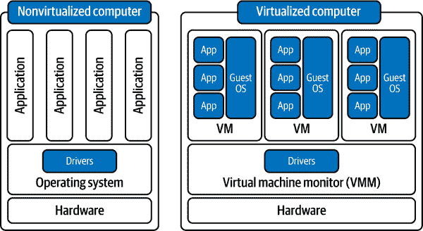

###### 图 12-1\. 虚拟化系统架构

云服务提供商或你自己的数据中心可以由多个物理服务器组成，每个服务器托管多个虚拟机，每个虚拟机都有自己的客户操作系统和托管应用程序。为了实现成本效益的资源共享，尽管这些虚拟机在完全隔离的环境中运行，但它们可能共享相同的挂载物理存储驱动器，如图图 12-2 所示。

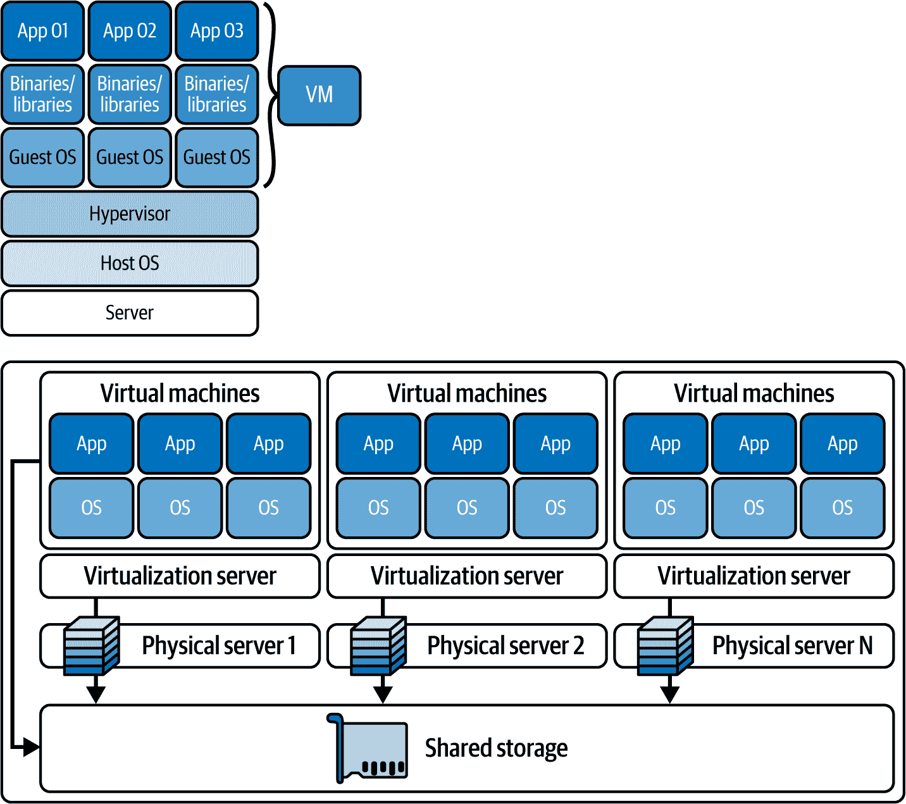

###### 图 12-2\. 数据中心中的托管虚拟机

使用虚拟机的优点是你可以直接访问客户操作系统、虚拟硬件资源和 GPU 驱动程序。如果部署过程中有任何问题，你可以通过**安全外壳传输**（SSH）协议连接到虚拟机，检查应用程序日志、设置应用程序环境以及调试生产问题。

将你的服务部署到虚拟机将像将你的代码仓库克隆到虚拟机中，然后安装所需的依赖项、软件包和驱动程序以成功启动你的应用程序一样简单。然而，推荐的做方法是使用在虚拟机上运行的容器化平台，如 Docker，以实现持续部署和其他好处。你还应该确保适当地调整虚拟机资源的大小，以确保你的服务不会因为 CPU/GPU 核心、内存或磁盘存储而资源不足。

使用本地虚拟机，你可以节省云托管或服务器租赁成本，并且可以完全保护你的应用环境，使其对少数用户安全，并从公共互联网中隔离。这些好处也可以通过云虚拟机实现，但需要额外的网络和资源配置来设置。此外，你可以访问 GPU 硬件，并为你的应用需求配置驱动程序。

请记住，使用虚拟机部署模式可能不太容易扩展，并且需要大量的维护工作。此外，虚拟机服务器通常全天候运行，产生持续的运行成本，除非你根据需要自动化它们的启动和关闭。你将负责应用安全补丁、操作系统更新和软件包升级，以及任何网络配置。由于直接访问硬件资源，你将需要做出更多决策，这可能会减慢你的速度，导致决策疲劳。

我的建议是，如果你不久内不打算扩展你的服务，或者需要为少数用户维护低服务器成本和安全的隔离应用环境，那么请部署到虚拟机（VM）。此外，确保你已经为部署、网络和虚拟机的配置预留了足够的时间。

## 部署到无服务器函数

除了虚拟机之外，你还可以将你的服务部署到云提供商提供的作为*无服务器*系统的云函数上。在无服务器计算中，你的代码会在响应事件时执行，例如数据库更改、存储中 blob 的更新、HTTP 请求或队列中添加的消息。这意味着你只需为你的服务使用的请求或计算资源付费，而不是像持续运行的虚拟机那样为整个服务器付费。

当以下情况发生时，无服务器部署通常很有用：

+   你希望拥有事件驱动的系统，而不是 24/7 运行的虚拟机

+   你希望使用高度成本效益的无服务器架构来部署你的 API 服务

+   你的服务需要执行批量处理作业

+   你需要工作流程自动化

术语*无服务器*并不意味着云函数不需要硬件资源来执行，而是意味着这些资源的管理由云提供商处理。这允许你专注于编写应用程序代码，而无需担心服务器和操作系统级别的细节。

云服务提供商实例化计算资源以满足其客户的需求。通常，需求会激增，需要他们提前创建额外的资源来处理需求峰值。然而，一旦需求下降，多余的未分配计算资源仍然存在，必须关闭或与其他客户共享。

移除和创建资源是一项密集的计算操作。在规模上，这些操作对云服务提供商来说成本很高。因此，云服务提供商更喜欢尽可能多地保持这些资源运行，并将它们分配给现有客户以最大化计费。

为了鼓励客户使用这些多余的计算资源，他们构建了云函数服务，您可以利用这些服务在多余的（即无服务器）计算上运行您的后端服务。幸运的是，有像 Magnum 这样的包允许您将 FastAPI 服务打包到 AWS 云函数上。您很快就会看到 FastAPI 服务也可以作为 Azure 云函数部署。

您需要记住的是，这些函数仅分配了少量资源，并且有较短的超时时间。然而，您可以请求更长的超时时间和分配更多的计算资源，但这可能需要更长的时间才能收到这些分配，从而导致用户的高延迟。

###### 警告

如果您的业务逻辑消耗大量资源或需要超过几分钟的时间来执行，云函数可能不是您合适的部署选项。

然而，您可以将 FastAPI 服务拆分到多个函数中，每个函数处理一个公开端点。这样，您可以将服务的一部分作为云函数部署，减少需要使用其他方法部署的 FastAPI 服务的部分。

使用无服务器函数部署您的服务的主要优势是其可伸缩性。您可以根据需要扩展应用程序，并且只需支付与预留专用虚拟机资源相比的一小部分费用。云服务提供商通常根据函数执行次数和运行时收费，通常有慷慨的月度配额。这意味着如果您的函数运行得快，并且您有适度的并发用户数量，您可能能够免费托管所有服务。

此外，云服务提供商还提供可以在本地安装以进行本地测试和开发的函数运行时，这样您可以显著缩短开发迭代周期。

每个云服务提供商都有自己部署无服务器函数的方法。通常，您需要一个入口脚本，如*main.py*，它可以按需从其他模块导入依赖项。除了入口点脚本外，您还需要上传一个函数宿主 JSON 配置文件，以及*requirements.txt*文件，以便在部署到 Python 运行时安装所需的依赖项。

你可以通过上传所有必需文件作为压缩目录或使用与提供者进行身份验证的 CI/CD 管道来部署函数，这些管道在云项目中执行部署命令。

例如，让我们尝试部署一个返回 LLM 响应的裸骨 FastAPI 应用程序。项目的结构将如下所示：

```py
project/
│
├── host.json
├── main.py
├── app.py
└── requirements.txt
```

然后，你可以按照即将提供的代码示例将 FastAPI 应用打包为 [Azure 无服务器函数](https://oreil.ly/ZaOuF)。

你需要安装 `azure-functions` 包来运行 Azure 的无服务器函数运行时进行本地开发和测试：

```py
$ pip install azure-functions
```

然后，按照示例 12-1 的说明创建 *host.json*。

##### 示例 12-1\. Azure Functions 主机配置（host.json）

```py
{
  "version": "2.0",
  "extensions": {
    "http": {
        "routePrefix": ""
    }
  }
}
```

之后，按照示例 12-2 的说明，像往常一样使用 FastAPI 服务实现你的 GenAI 服务。

##### 示例 12-2\. 简单的 FastAPI 应用程序，提供 LLM 响应

```py
# app.py

import azure.functions as func
from fastapi import FastAPI

app = FastAPI()

@app.post("/generate/text", response_model_exclude_defaults=True)
async def serve_text_to_text_controller(prompt):
...
```

最后，将你的 FastAPI `app` 包裹在 `func.AsgiFunctionApp` 中，以便 Azure 无服务器函数运行时可以连接到它，如示例 12-3 所示。

##### 示例 12-3\. 使用 Azure Functions 部署 FastAPI 服务

```py
# function.py

import azure.functions as func
from main import app as fastapi_app

app = func.AsgiFunctionApp(
    app=fastapi_app, http_auth_level=func.AuthLevel.ANONYMOUS
)
```

然后，你可以通过运行 `func start` 命令来启动函数应用，该命令在安装了 `azure-functions` 包后应作为 CLI 命令可用：

```py
$ func start

>> Found the following functions:
>> Functions:
>>        http_app_func: [GET,POST,DELETE,HEAD,PATCH,PUT,OPTIONS] \
                          http://localhost:7071//{*route}

>> Job host started
```

然后，你可以通过向简单路径和参数化路径发送 HTTP 请求来尝试与应用程序中的处理程序对应的 URL：

```py
http://localhost:7071/generate/text
http://localhost:7071/<other-paths>
```

一旦准备就绪，你可以将包装好的 FastAPI 无服务器函数部署到 Azure 云，然后运行以下命令：

```py
$ func azure functionapp publish <FunctionAppName>
```

`publish` 命令将随后将项目目录中的项目文件发布到 `<FunctionAppName>`，作为 ZIP 部署包。

部署后，你可以测试部署 URL 上的不同路径：

```py
http://<FunctionAppName>.azurewebsites.net/generate/text
http://<FunctionAppName>.azurewebsites.net/<other-paths>
```

###### 警告

你选择的云提供商可能不支持在其函数运行时内提供 FastAPI 服务器。如果是这种情况，你可能需要寻找替代的部署选项。否则，你需要将端点的逻辑迁移到函数运行时支持的 Web 框架，并为每个端点创建单独的函数。

如你所见，将你的 FastAPI 服务作为云函数部署非常简单，这允许你将服务的管理和扩展委托给云提供商。

请记住，如果你决定在你的服务中提供 GenAI 模型，由于它们的超时时间短（10 分钟），云函数不适合作为部署目标。相反，你希望在服务中使用模型提供者 API，以便你有可靠且可扩展的模型访问，而不受执行时间限制的约束。

## 部署到托管应用平台

除了云函数或虚拟机之外，您还可以将代码库作为 ZIP 文件上传到云提供商管理的应用平台。托管应用平台允许您将与服务维护和管理相关的多项任务委托给云提供商。作为交换，您只需为云提供商管理的、为您的应用程序提供服务的计算资源付费。云提供商系统根据您的应用程序需求分配和优化资源。

这种服务的例子包括 Azure App Services、AWS Elastic Beanstalk、Google App Engine 或 Digital Ocean 应用平台。

还存在第三方平台，如 Heroku、Hugging Face Spaces、railway.app、render.com 或 fly.io，可以直接从代码库中部署您的服务，这些平台从您那里抽象出某些决策，以便您能够更快、更轻松地部署。在底层，第三方托管应用平台可能会使用 Azure、Google 或 AWS 等主要云提供商的基础设施。

将服务部署到托管应用平台的主要好处是部署、网络、扩展和维护服务的简便性和速度。这些平台为您提供所需的工具，以便在不担心底层资源分配、安全或软件更新的情况下，安全、监控、扩展和管理您的服务。它们可以让您配置负载均衡器、SSL 证书、域名映射、监控和预发布环境，这样您就可以更多地关注应用程序开发而不是项目的部署工作量。

由于这些平台遵循平台即服务（PaaS）的计费模式，您将比依赖自己的基础设施或使用底层资源（如裸机虚拟机或无服务器计算选项）支付更高的费用。替代服务可能使用基础设施即服务（IaaS）的计费模式，通常更具成本效益。

个人而言，我发现托管应用平台是一种方便的方式，可以轻松部署我的应用程序而无需太多麻烦。如果我在制作原型并且需要尽可能快地将我的服务提供给用户，托管应用平台是我的首选选项。尽管如此，请记住，如果您需要访问 GPU 硬件来运行推理服务，您将不得不依赖专用虚拟机、本地服务器或专门的 AI 平台服务来托管您的模型。应用平台只能提供 CPU、内存和磁盘存储来托管后端服务或前端应用程序。

###### 小贴士

一些托管云提供商的 AI 平台包括 Azure Machine Learning Studio 或 Azure AI、Google Cloud Vertex AI 平台、AWS Bedrock 和 SageMaker 或 IBM Watson Studio。

还有第三方平台可以托管您的模型，包括 Hugging Face Inference Endpoints、Weights & Biases 平台或 Replicate。

从代码仓库进行部署通常需要您根据您将要部署到的应用程序平台，在项目的根目录中添加某些配置文件。此过程还取决于应用程序平台是否支持您使用的应用程序运行时、库和框架版本，因此成功的部署并不总是有保证。迁移到支持的运行时或版本通常也具有挑战性。

由于这些不可预见的问题，许多工程师正在转向容器化技术，如 Docker 或 Podman，以打包和部署他们的服务。这些容器化应用程序可以直接部署到支持容器的任何应用程序平台，并保证无论底层资源、运行时或依赖项版本如何，应用程序都将运行。

使用容器部署服务现在是将您的应用程序部署到生产环境以供用户访问的最可靠策略之一。

## 使用容器进行部署

*容器*是一个松散隔离的环境，用于构建和运行应用程序。容器可以通过将您的代码及其所有必需的依赖项打包，在任意计算环境中快速且可靠地运行您的服务。

在底层，容器依赖于一种操作系统虚拟化方法，使它们能够在物理硬件、云中、虚拟机上或跨多个操作系统上运行。

###### 小贴士

与托管应用程序平台和无服务器函数类似，您可以配置容器在应用程序由于任何原因退出时自动重启和自我修复。

与依赖于虚拟化的底层技术的虚拟机不同，容器依赖于容器化。

容器化将应用程序及其依赖项打包成轻量级、隔离的单位，这些单位共享宿主操作系统的内核。另一方面，虚拟化通过使用虚拟机管理程序在单个物理机上运行多个操作系统。因此，与虚拟机不同，容器不虚拟化硬件资源。相反，它们在容器运行时平台之上运行，该平台抽象化了资源，使它们轻量级（即，存储量低至几兆字节）并且比虚拟机更快，因为它们不需要每个容器都运行一个单独的操作系统。

###### 注意

从本质上讲，虚拟化是关于在宿主机器上抽象硬件资源，而容器化是关于抽象操作系统内核，并在称为*容器*的隔离单元中运行所有应用程序组件。

图 12-3 比较了虚拟化和容器化系统架构。

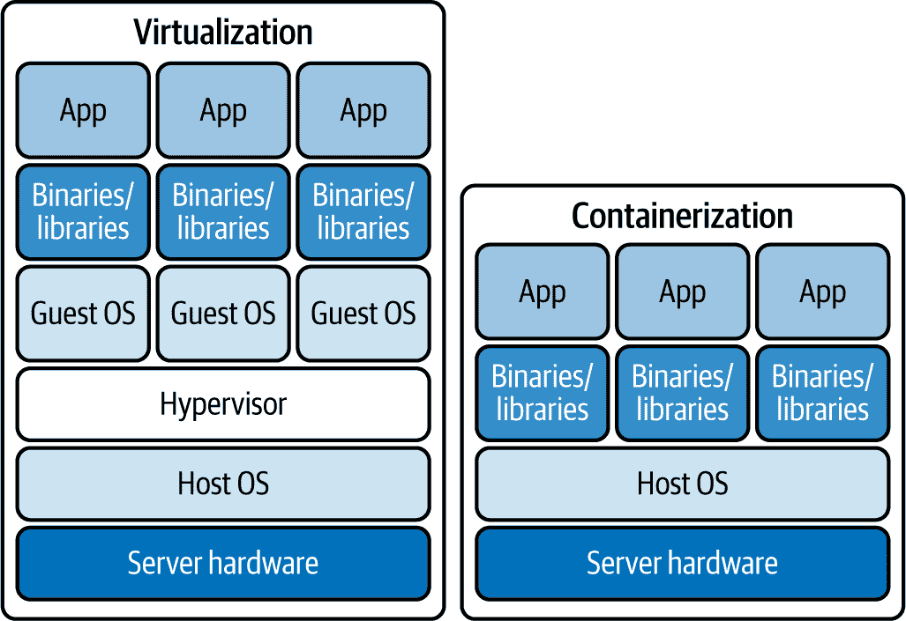

###### 图 12-3\. 容器化和虚拟化系统架构的比较

使用容器的最大好处是它们的*便携性*、*启动速度*、*紧凑性*和*可靠性*，在各种计算环境中，因为它们不需要客户操作系统和虚拟机管理程序软件层。

这使它们非常适合以最少的资源、部署努力和开销来部署你的服务。它们的启动速度比虚拟机快，扩展它们也更加直接。你可以添加更多容器来 *水平扩展* 你的服务。

为了帮助容器化你的应用程序，你可以依赖像 Docker 这样的平台，这些平台已经在 MLOps 和 DevOps 社区中得到实战检验。

# 使用 Docker 容器化

Docker 是一个用于构建、运输和运行容器的容器化平台。在撰写本文时，Docker 在虚拟化平台市场占有大约 [22% 的市场份额](https://oreil.ly/A5x63)，拥有超过 900 万开发者，以及 [11 亿次每月镜像下载](https://oreil.ly/8-wx4)，使其成为最受欢迎的容器化平台。许多服务器环境和云服务提供商在多种 Linux 和 Windows 服务器变体中支持 Docker。

如果你需要部署你的 GenAI 服务，最简单、最直接的选择可能是使用 Docker 来容器化你的应用程序。然而，为了熟悉 Docker，你需要了解其架构以及底层子系统，如存储和网络。

## Docker 架构

Docker 系统由一个引擎、一个客户端和一个服务器组成：

Docker 引擎

引擎由几个组件组成，包括在同一主机操作系统上运行的客户端和服务器。

Docker 客户端

Docker 既有名为 `docker` 的 *命令行工具*，也有名为 *Docker Desktop* 的图形用户界面（GUI）应用程序。使用客户端-服务器实现，Docker 客户端可以通过 REST API 与本地或远程服务器实例通信，通过运行命令（如运行、停止和终止容器）来管理容器。你还可以使用客户端从镜像库中拉取镜像。

Docker 服务器

服务器是一个名为 `dockerd` 的 *守护进程*。Docker 守护进程通过 REST API 对客户端 HTTP 请求做出响应，并且可以与其他守护进程交互。它还负责跟踪容器的生命周期。

Docker 平台还允许你创建和配置如 *网络*、*存储卷*、*插件* 和服务对象等对象，以支持你的部署。

最重要的是，为了使用 Docker 容器化你的应用程序，你需要构建 Docker 镜像。

一个 *Docker 镜像* 是一个包含软件的可移植包，它充当创建和运行你的应用程序容器的配方。本质上，容器是镜像的内存实例。

###### 小贴士

容器镜像是 *不可变的*，所以一旦你构建了一个，你就不能更改它。你只能向镜像中添加内容，而不能从中移除。如果你想应用更改，你必须重新创建一个新的镜像。

Docker 镜像是你将在下一节中学习的将你的服务容器化的第一步。

## 构建 Docker 镜像

让我们假设你有一个使用 FastAPI 的小型 GenAI 服务，如 示例 12-4 所示，你想要将其容器化。

##### 示例 12-4\. 一个简单的 GenAI FastAPI 服务

```py
# main.py

from fastapi import FastAPI
from models import generate_text 

app = FastAPI()

@app.post("/generate")
def generate_text(prompt: str):
    return generate_text(prompt)
```

[#co_deployment_of_ai_services_CO1-1]

假设 `generate_text` 函数正在调用模型提供者 API 或外部模型服务器。

要将此应用程序构建到容器镜像中，您需要在名为 *Dockerfile* 的文本文件中编写指令。在此 Dockerfile 中，您可以指定以下组件：

+   创建新镜像的基础镜像，提供操作系统和环境，在此之上构建额外的应用程序层

+   更新客户操作系统和安装额外软件的命令

+   要包含的构建工件，例如您的应用程序代码

+   需要公开的服务，如存储和网络配置

+   容器启动时运行的命令

示例 12-5 展示了如何在 Dockerfile 中构建应用程序镜像。

##### 示例 12-5\. 将 FastAPI 应用程序容器化的 Dockerfile

```py
ARG PYTHON_VERSION=3.12
FROM python:${PYTHON_VERSION}-slim as base 

WORKDIR /code 

COPY requirements.txt . 

RUN pip install --no-cache-dir --upgrade -r requirements.txt 

COPY . . 

EXPOSE 8000 

CMD ["uvicorn", "main:app", "--host", "0.0.0.0", "--port", "8000"] 
```

[#co_deployment_of_ai_services_CO2-1]

使用官方 Python 3.12 slim 镜像作为 `base` 镜像.^(1)

[#co_deployment_of_ai_services_CO2-2]

将容器内部的当前工作目录设置为 `/code`。

[#co_deployment_of_ai_services_CO2-3]

将 `requirements.txt` 文件从主机复制到容器当前目录。

[#co_deployment_of_ai_services_CO2-4]

不使用缓存安装 `requirements.txt` 中列出的 Python 依赖项。

[#co_deployment_of_ai_services_CO2-5]

将主机当前目录下的所有文件复制到容器当前目录。

[#co_deployment_of_ai_services_CO2-6]

通知 Docker 守护进程容器中的应用程序在运行时监听 `8000`。`EXPOSE` 命令不会自动映射或允许端口访问.^(2)

[#co_deployment_of_ai_services_CO2-7]

当容器启动时，使用应用程序模块和主机/端口配置运行 `uvicorn` 服务器。

我们在本章中不会涵盖完整的 [Dockerfile 规范](https://oreil.ly/8fJ6l)。然而，请注意每个命令如何改变镜像结构，这使您能够在容器内运行完整的 GenAI 服务。

您可以使用 `docker build` 命令在 示例 12-5 中构建镜像：

```py
$ docker build -t genai-service .
```

注意输出中列出的步骤。当每个步骤执行时，都会在您构建的镜像中添加一个新的层。

一旦您有了容器镜像，您就可以使用容器注册库来存储、共享和下载镜像。

## 容器注册库

要在版本控制环境中存储和分发镜像，您可以使用 *容器注册库*，包括公共或私有版本。

*Docker Hub* 是一个托管软件即服务 (SaaS) 容器注册库，用于存储和分发您创建的镜像。

Docker Hub 默认是公开的。但是，您还可以使用自托管或云提供商的私有注册表，例如 Azure 容器注册表（ACR）、AWS 弹性容器注册表（ECR）或 Google Cloud Artifact Registry。

您可以在图 12-4 中查看完整的 Docker 平台系统架构。

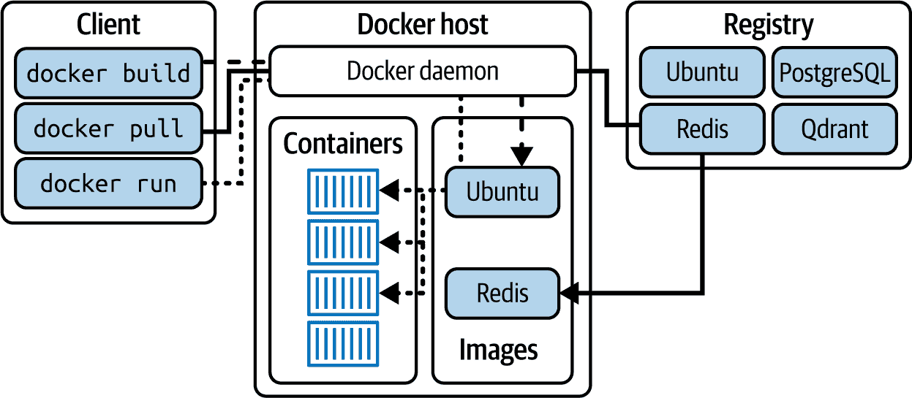

###### 图 12-4\. Docker 平台系统架构

如图 12-4 所示，Docker 守护进程管理容器和镜像。它从镜像创建容器并与 Docker 客户端通信，处理构建和运行镜像的命令。Docker 守护进程还可以从包含像 Ubuntu、Redis 或 PostgreSQL 这样的镜像的注册表（例如，Docker Hub）中拉取或推送镜像。

使用 Docker Hub 注册表，您可以在分发和版本控制自己的镜像的同时访问其他贡献的镜像。像 Kubernetes 这样的容器编排平台需要访问注册表以从镜像中拉取和运行多个容器实例，因此 Docker Hub 等注册表在扩展您的服务中起着至关重要的作用。

您可以使用`docker pull`命令从 Docker Hub 拉取公共镜像：

```py
$ docker image pull python:3.12-slim

bookworm: Pulling from library/python
Digest: sha256:3f1d6c17773a45c97bd8f158d665c9709d7b29ed7917ac934086ad96f92e4510
Status: Downloaded newer image for python:3.12-slim
docker.io/library/python:3.12-slim
```

当您推送和拉取镜像时，您需要使用`<name>:<tag>`语法指定一个*标签*。如果您不提供标签，Docker 引擎将默认使用`latest`标签。

除了拉取之外，您还可以将您自己的镜像存储在容器注册表中。首先，您需要构建并标记您的镜像，包括版本标签和镜像仓库 URL：

```py
$ docker build -t genai-service:latest .

$ docker image tag genai-service:latest docker.io/myrepo/genai-service:latest
```

一旦您的镜像构建并标记，您就可以使用`docker push`命令将其推送到 Docker Hub 容器注册表。您可能需要先登录以验证与注册表的连接：

```py
$ docker login

$ docker image push docker.io/myrepo/genai-service:latest

195be5f8be1d: Pushed
```

###### 警告

在推送过程中，请注意不要覆盖多个仓库中镜像的标签。例如，在一个仓库中构建并标记为`genai:latest`的镜像可以被标记为`genai:latest`的另一个镜像覆盖。

现在您的镜像已存储在注册表中，您可以在另一台机器上拉取它^(3)或在稍后时间运行镜像，而无需重新构建它。

## 容器文件系统和 Docker 层

在构建镜像时，Docker 使用一种特殊的文件系统，称为`Unionfs`（可堆叠统一文件系统），以合并几个目录的内容（即*分支*或 Docker 术语中的*层*），同时保持它们物理内容的分离。

使用`Unionfs`，可以将不同文件系统的目录组合并叠加，形成一个单一的虚拟文件系统，如图图 12-5 所示。

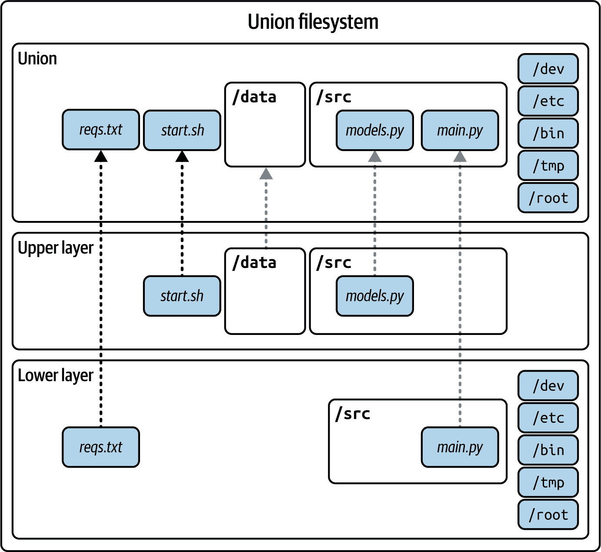

###### 图 12-5\. 来自多个文件系统的统一虚拟文件系统

使用`Unionfs`，Docker 可以在您从镜像构建容器文件系统时添加或删除分支。

为了说明容器分层架构的机制，让我们回顾示例 12-5 中的镜像。

当使用 示例 12-5 构建镜像时，您是在 Linux 发行版上运行的 Python 3.12 基础镜像之上叠加根文件系统。接下来，您在 Python 基础镜像之上添加 *requirements.txt*，然后在该层上安装依赖项。然后，您通过将项目目录的内容复制到容器中，创建一个新的层，并将其叠加到其他所有内容之上。最后，当您使用 `uvicorn` 命令启动容器时，您将一个可写层作为容器文件系统的一部分添加。因此，在构建 Docker 镜像时，层的顺序变得很重要。

图 12-6 展示了分层文件系统架构。

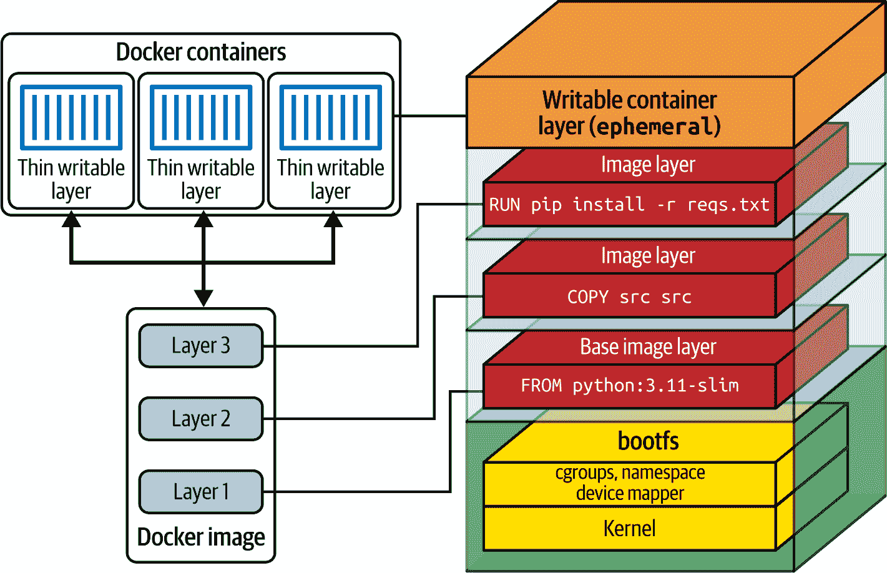

###### 图 12-6\. 分层 Unionfs 文件系统架构

在 示例 12-5 中，每个命令步骤都在构建过程中创建一个缓存镜像，以最终确定容器镜像。为了运行命令，会创建中间容器，并在之后自动删除。这些临时镜像在完成所有步骤后，会叠加到之前的镜像上，并合并成一个单独的镜像。这种优化允许未来的构建重用这些镜像以加快构建时间。

最后，当容器被销毁时，容器将包含一个或多个镜像层和一个最终的临时容器层（即不会持久化）。

## Docker 存储空间

在本节中，您将了解各种 Docker 存储机制。在您以容器形式开发服务时，您可以使用这些工具来管理数据持久化、在容器之间共享数据以及维护容器重启之间的状态。

当与容器一起工作时，您的应用程序可能需要将数据写入磁盘，这些数据将保存在 *临时* 存储中。临时存储是一种短暂、临时的存储，一旦容器停止、重启或删除，就会被删除。如果您重启容器，您会注意到之前持久化的数据不再可用。在底层，Docker 将运行时数据写入容器虚拟文件系统中的一个临时可写容器层。

###### 警告

如果您依赖于容器的默认存储配置，您将丢失在容器运行时写入磁盘的所有应用程序生成数据和日志文件。

为了避免应用运行时数据和日志的丢失，您有多种存储选项可供选择，这些选项允许您在容器生命周期内持久化数据。在开发过程中，您可以使用 *卷* 或 *绑定挂载* 将数据持久化到主机操作系统文件系统，或者依赖本地数据库来持久化数据。

表 12-1 展示了 Docker 存储挂载选项。

表 12-1\. Docker 存储挂载

| 存储 | 描述 | 用例 |
| --- | --- | --- |
| 卷 | I/O 优化且首选的存储解决方案。由 Docker 管理，存储在宿主机的特定位置，但与宿主文件系统结构解耦。 | 如果您需要在多个容器之间存储和共享数据。如果您不需要从宿主修改文件或目录。 |
| 绑定挂载 | 将宿主上的文件或目录挂载到容器中，但与卷相比功能有限。 | 如果您希望容器和宿主进程都能访问和修改宿主的文件和目录。例如，在本地开发和测试期间。 |
| 临时（tmpfs）挂载 | 将数据存储在宿主的内存（RAM）中，并且永远不会写入容器或宿主文件系统。 | 如果您需要高性能的临时存储，用于敏感或无状态数据，这些数据在容器停止后不会持久化。 |

图 12-7 显示了不同类型的挂载。

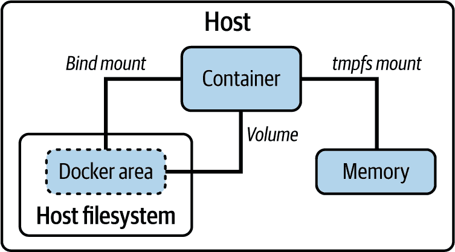

###### 图 12-7\. Docker 存储挂载

现在，我们将详细研究每个存储选项，以便您可以使用 Docker 容器在本地模拟您的生产环境，使用适当的存储。当在云环境中将容器部署到生产环境中时，您可以使用数据库或云存储服务来持久化数据，而不是使用 Docker 卷或绑定挂载来跨多个容器集中存储。

### Docker 卷

Docker 允许您创建用于在容器运行之间持久化应用程序数据的隔离**卷**。要创建卷，您可以运行以下命令：

```py
$ docker volume create -n data
```

创建后，您可以使用卷在容器运行之间持久化数据。卷还允许您在使用数据库和内存存储容器时持久化数据。

###### 警告

使用新环境变量重新启动数据库容器可能不足以通过新设置重置它们。

一些数据库系统可能要求您在需要更新设置，如管理员用户凭证时，重新创建容器卷。

默认情况下，您创建的任何卷都将存储在宿主机器文件系统上，直到您通过`docker volume remove`命令显式删除它们。

### 绑定挂载

除了卷之外，您还可以通过卷**绑定挂载**使用文件系统映射，将宿主文件系统上的目录映射到容器文件系统，如图图 12-8 所示。

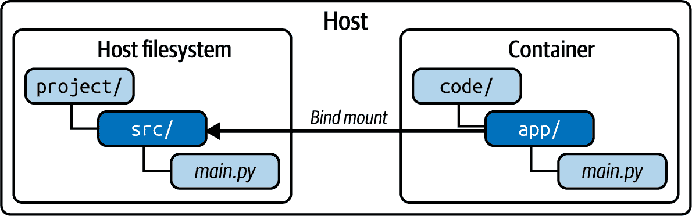

###### 图 12-8\. 宿主文件系统和容器之间的绑定挂载

挂载发生在您启动容器时。有了挂载的目录，您就可以直接从容器内部访问它们。您可以在运行和停止容器时读取和将数据持久化到挂载的目录。

要使用卷绑定挂载运行容器，您可以使用以下命令：

```py
$ docker run -v src:/app genai-service
```

在这里，`-v`标志允许您使用`<host_dir>:<container_dir>`语法将宿主目录映射到容器目录。

###### 警告

您在 Dockerfile 中使用的`COPY`命令的功能与目录挂载不同。

前者会在镜像构建过程中将主机目录的单独副本放入容器中，而后者允许你在容器内访问和更新映射的主机目录。

这意味着如果你不小心，你可能会在容器内无意中永久修改或删除主机机器上的所有原始文件。

在本地开发环境中，绑定挂载卷仍然很有用。当你更改服务的源代码时，你将能够观察到修改对运行中的应用容器实时影响。

### 临时挂载（tmpfs）

如果你有一些非持久数据，例如模型缓存或敏感文件，你不需要永久存储，你应该考虑使用临时的 *tmpfs 挂载*。

这个临时挂载将在容器运行时仅将数据持久化到主机内存（RAM）中，并通过避免写入容器的可写层来提高容器的性能。

当容器化 GenAI 应用程序时，你可以使用临时挂载来存储缓存结果、中间模型计算、临时文件和容器停止后不再需要的特定会话日志。

###### 小贴士

容器的可写层通过存储驱动程序与主机机器紧密耦合，以实现联合文件系统。因此，向容器的可写层写入会由于额外的抽象层而降低性能。

相反，你可以使用数据卷进行持久存储，它直接写入主机文件系统，或者使用 tmpfs 挂载进行临时内存存储。

与绑定挂载和卷不同，你不能在容器之间共享 tmpfs 挂载，并且该功能仅在 Linux 系统上可用。此外，如果你调整 tmpfs 挂载的目录权限，它们在容器重启时可能会重置。

这里是 tmpfs 挂载的一些其他用例：

+   在内存中临时存储数据缓存、API 响应、日志、测试数据、配置文件和 AI 模型工件

+   避免在处理需要文件样对象库 API 的工作时进行 I/O 写入。

+   通过快速文件访问和写入模拟高速 I/O

+   如果需要临时目录，可以防止过多的或不必要的磁盘写入

要设置 tmpfs 挂载，你可以使用以下命令：

```py
$ docker run --tmpfs /cache genai-service
```

在这里，你正在为模型缓存设置 `/cache` 目录的 tmpfs 挂载，一旦容器停止，该挂载将不再存在。

### 处理文件系统权限

对于许多刚开始使用 Docker 的开发者来说，管理目录权限是使用主机操作系统和容器之间的文件系统绑定挂载时的一个巨大的挫折和考虑因素。

默认情况下，Docker 以`root`用户身份运行容器，导致容器对宿主操作系统上挂载的目录具有完全的读写访问权限。如果容器内的`root`用户创建目录或文件，它们在宿主机上也将由`root`用户拥有。当你尝试访问或修改这些目录或文件时，如果你在宿主机上有一个非 root 用户账户，可能会遇到权限问题。

###### 警告

以默认的`root`用户身份运行容器也是一大安全风险，如果恶意行为者获得对容器的访问权限，因为他们将以`root`身份访问宿主系统。此外，如果你运行了一个受损害的图像，你可能会以`root`权限在宿主系统上执行恶意代码。

为了减轻在运行具有绑定挂载的容器时遇到的权限问题，你可以使用`--user`标志以非 root 用户身份运行容器：

```py
$ docker run --user genai-service
```

或者，你可以在 Dockerfile 中图像构建的最终层内创建并切换到一个非 root 用户，如图例 12-6 所示。

##### 例 12-6。在构建容器图像时创建和切换到非 root 用户（仅限 Ubuntu/Debian 容器）

```py
ARG USERNAME=fastapi 
ARG USER_UID=1001
ARG USER_GID=1002

RUN groupadd --gid $USER_GID $USERNAME \ 
    && adduser \
    --disabled-password \
    --shell "/sbin/nologin" \ 
    --gecos "" \
    --home "/nonexistent" \
    --no-create-home \ 
    --uid "${UID}" \
    --gid $USER_GID
    $USERNAME 

USER $USERNAME 

CMD ["uvicorn", "main:app", "--host", "0.0.0.0", "--port", "8000"]
```

[#co_deployment_of_ai_services_CO3-1]

使用构建参数在图像构建期间指定变量。

[#co_deployment_of_ai_services_CO3-2]

使用给定的`USER_GID`创建一个用户组。

[#co_deployment_of_ai_services_CO3-3]

完全禁用用户登录，包括基于密码的登录。

[#co_deployment_of_ai_services_CO3-4]

避免为用户创建家目录。

[#co_deployment_of_ai_services_CO3-5]

使用给定的`$USER_UID`创建一个非 root 用户账户，并将其分配给新创建的`USER_GID`组。将用户账户的名称设置为`fastapi`。

[#co_deployment_of_ai_services_CO3-6]

切换到非 root 的`fastapi`用户。

###### 小贴士

通常，你需要安装包或添加需要特权磁盘访问或权限的配置。一旦完成此类安装和配置，你应该只在图像构建的末尾切换到非 root 用户。避免在 root 和非 root 用户之间来回切换，以防止不必要的复杂性和过多的图像层。

如果你遇到在图例 12-6 中创建新组或用户的问题，尝试更改`USER_UID`和`USER_GID`，因为这些 ID 可能已经被图像中的另一个非 root 用户使用。

假设在图像创建过程中，容器内的`root`用户创建了`myscripts`文件夹。你可以使用`ls -l`命令检查文件系统权限，该命令返回以下输出：

```py
total 12
drw-r--r-- 2 root root 4096 Oct  1 10:00 myscripts
```

你可以使用以下分解读取`myscripts`目录的权限`drwxr-xr-x`：

+   `d`：指定`myscripts`是一个目录；否则将显示为`-`。

+   `rwx`：所有者`root`用户可以（r）读取、（w）写入和（e）执行此目录中的文件。

+   `r--`: 组 `root` 成员可以执行（r）只读操作，但不能写入或执行任何文件。

+   `r--`: 任何其他人都可以读取文件，但不能写入或执行它.^(4)

如果您想在 `myscripts` 目录上设置所有权或权限，您可以在 Linux 系统中使用 `chmod` 或 `chown` 命令。

使用 `chown` 命令更改主机上的目录所有者，以便您可以在代码编辑器中编辑文件：

```py
# Set file or directory ownership
$ sudo chown -R username:groupname mydir
```

或者，如果您只需要执行 `myscripts` 目录中的脚本，可以使用 `chmod` 命令更改文件或目录权限：

```py
# Set execute permissions using flags
$ sudo chmod -R +x myscripts

# Set execute permissions in a numeric form
$ sudo chmod -R 755 myscripts
```

###### 小贴士

`-R` 标志将递归地设置嵌套目录的所有权或权限。

此命令将允许 `root` 组成员和其他用户执行 `myscripts` 目录中的文件。其他人只能通过使用 `bash` 命令来执行文件。然而，只有所有者才能修改它们。

如果您再次使用 `ls -l` 检查文件系统权限，您将看到以下输出：

```py
total 12
drwxr-xr-x 2 root root 4096 Oct  1 10:00 myscripts
```

+   `rwx`: 所有者 `root` 用户仍然可以在这个目录中（r）读取、（w）写入和（e）执行文件。

+   `r-x`: 组 `root` 成员可以执行（r）读取和（e）执行操作，但不能修改任何文件。

+   `r-x`: 任何其他人不能修改 `myscripts` 目录中的文件，但可以读取和执行它们。

您可以使用示例 12-7 在镜像内部创建目录时设置权限。

##### 示例 12-7\. 创建脚本文件夹并允许执行文件（仅适用于 Ubuntu/Debian 容器）

```py
RUN mkdir -p scripts

COPY scripts scripts

RUN chmod -R +x scripts
```

示例 12-7 中的说明将允许您配置权限，以便在容器内部执行 `scripts` 目录中的文件。

###### 警告

当使用容器卷时，请注意挂载绑定，因为它们会替换容器内的权限为主机文件系统的权限。

与容器一起工作时最令人沮丧的问题将与文件系统权限相关。因此，了解如何设置和纠正文件权限将节省您在处理在主机机器上生成或修改工件时的工作时间。

## Docker 网络配置

Docker 网络是多容器项目中最难掌握的概念之一。本节将介绍 Docker 网络的工作原理以及如何设置本地容器以进行通信，在开发过程中模拟生产环境。

通常，当您将应用程序部署到云中的生产环境时，您会使用云提供商的解决方案配置网络。然而，如果您需要将容器连接到开发环境进行本地测试或部署到本地资源，那么了解 Docker 网络的工作原理将使您受益。

如果您正在开发与外部系统（如数据库）交互的 GenAI 服务，那么您可能会使用多个容器；一个用于您的应用程序，另一个用于运行您的每个数据库或外部系统。

Docker 附带了一个网络子系统，允许容器在相同或不同的主机上相互连接。您甚至可以通过面向互联网的主机连接容器。

当您使用`docker run`命令创建容器时，它们将默认在*桥接网络*上启用网络，以便它们可以建立出站连接。然而，它们不会将端口暴露或发布到外部世界。

###### 警告

默认设置下，Docker 与操作系统内核交互以配置*防火墙规则*（例如，Linux 上的`iptables`和`ip6tables`规则）以实现网络隔离、端口发布和过滤。

由于 Docker 可以覆盖这些防火墙规则，如果您的主机上有像`8000`这样的端口关闭，当您使用带有`-p 8000:8000`标志运行容器时，Docker 可以强制将其打开并暴露在主机机器之外。为了防止这种暴露，一种解决方案是使用`-p 127.0.0.1:8000:8000`标志运行容器。

为了使网络子系统正常工作，Docker 使用*网络驱动程序*，如表 12-3 所示。

表 12-3\. Docker 网络驱动程序

| 驱动 | 描述 | 用例 |
| --- | --- | --- |
| 桥接（默认） | 连接在同一 Docker 守护进程主机上运行的容器。用户定义的网络可以利用内嵌的 DNS 服务器。 | 通过简单的设置控制隔离 Docker 网络中的容器通信。 |
| 主机 | 移除容器和主机系统之间的隔离层，因此任何 TCP/UDP 连接都可以直接通过主机网络（如 localhost）访问，无需发布端口。 | 简化从主机网络（例如 localhost）访问容器或当容器需要处理大量端口时的访问。 |
| None | 禁用所有网络服务并将运行中的容器隔离在 Docker 环境中。 | 由于安全原因，隔离容器以防止任何 Docker 和非 Docker 进程。网络调试或模拟故障。为短期进程提供资源隔离和短暂容器。 |
| Overlay | 连接多个主机/引擎或 Docker Swarm 集群中的容器。**注意：**Docker 引擎具有*swarm*模式，该模式通过 Docker 守护进程/引擎的*集群*启用容器编排。 | 在连接 Docker 主机之间的容器时，无需在操作系统级别进行路由。 |
| Macvlan | 将 mac 地址分配给容器，就像它们是物理设备一样。配置错误可能导致由于 IP 地址耗尽而意外降低网络性能，导致 VLAN 扩散（大量 mac 地址）或混杂模式（地址重叠）。 | 用于旧系统或应用程序，这些系统或应用程序监控网络流量并期望直接连接到物理网络。 |
| IPVlan | 提供对容器 IPv4 和 IPv6 地址的完全控制，无需端口映射即可轻松访问外部服务。 | 一种绕过传统 Linux 网桥进行隔离的高级网络设置，提高了性能并简化了网络拓扑。 |

为了确保您的容器能够相互通信，您可能需要指定网络设置和驱动程序。您可以根据表 12-3 选择与您的用例相匹配的网络驱动程序。

###### 注意

这些驱动程序中的一些可能取决于您在哪个平台上运行 Docker（Windows、Linux 或 macOS 主机）而不可用。

最常用的网络驱动程序是网桥、主机和无。除非您需要更高级的网络配置，否则您可能不需要使用其他驱动程序（例如 overlay、Macvlan、IPVlan）。

图 12-9 展示了网桥、主机、无、overlay、Macvlan 和 IPVlan 驱动程序的功能。

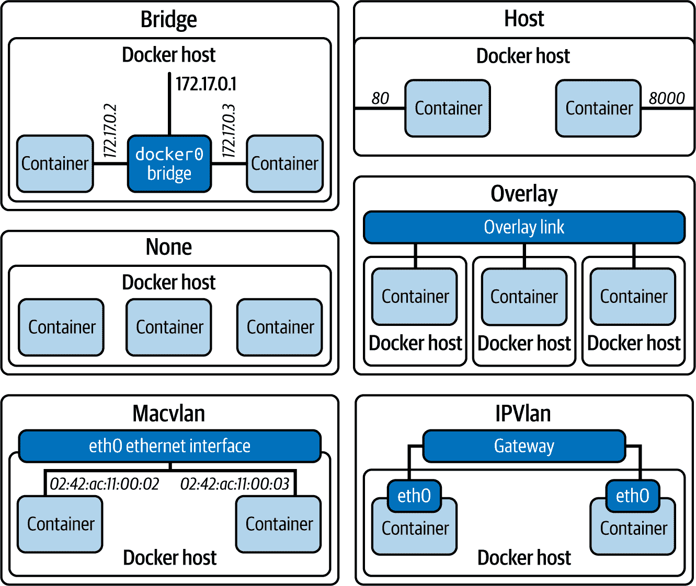

###### 图 12-9\. Docker 网络驱动程序

让我们更详细地探讨这些网络驱动程序。

### 网桥网络驱动程序

网桥网络驱动程序通过创建默认网桥网络`docker0`并将容器与它和主机的主要网络接口关联起来来连接容器（除非有其他指定）。这将允许您的容器访问主机网络（以及互联网），并允许您访问容器。

您可以使用`docker network ls`命令查看网络：

```py
$ docker network ls
NETWORK ID     NAME      DRIVER    SCOPE
72ec0b2e6034   bridge    bridge    local
53ec40b3c639   host      host      local
64368b7baa5f   none      null      local
```

Docker 中的*网络网桥*是在主机机器的内核中运行的链路层软件设备，允许连接的容器进行通信，同时隔离未连接的容器。网桥驱动程序会自动在主机机器中安装规则，使得不同网桥网络上的容器不能直接通信。

###### 小贴士

网桥网络仅适用于在同一 Docker 引擎/守护程序主机上运行的容器。要连接在其他守护程序主机上运行的容器，您可以在主机操作系统层管理路由或使用*overlay*驱动程序。

除了默认的网桥网络外，您还可以创建自己的自定义网络，这些网络可以提供更高级的隔离和数据包路由体验。

#### 配置用户定义的网桥网络

如果您需要为容器提供更高级或隔离的网络环境，您可以创建一个单独的用户定义网络。

用户定义的网络优于默认的网桥网络，因为它们提供了更好的隔离。此外，在用户定义的网桥网络上，容器可以通过名称或别名相互解析，而在默认网络中，它们只能通过 IP 地址进行通信。

###### 警告

如果您没有指定`--network`选项运行容器，它们将被连接到默认的网桥网络。这可能会成为一个安全问题，因为此时无关的服务能够相互通信和访问。

要创建网络，您可以使用 `docker network create` 命令，它默认使用 `--driver bridge` 标志：

```py
$ docker network create genai-net
```

###### 注意

当您创建用户定义的网络时，Docker 使用主机操作系统工具来管理底层网络基础设施，例如添加或删除桥接设备，以及在 Linux 上配置 `iptables` 规则。

网络创建后，您可以使用 `docker network ls` 命令列出网络：

```py
$ docker network ls
NETWORK ID     NAME         DRIVER    SCOPE
72ec0b2e6034   bridge       bridge    local
6aa21632e77e   genai-net    bridge    local
```

网络拓扑现在将看起来像 图 12-10。

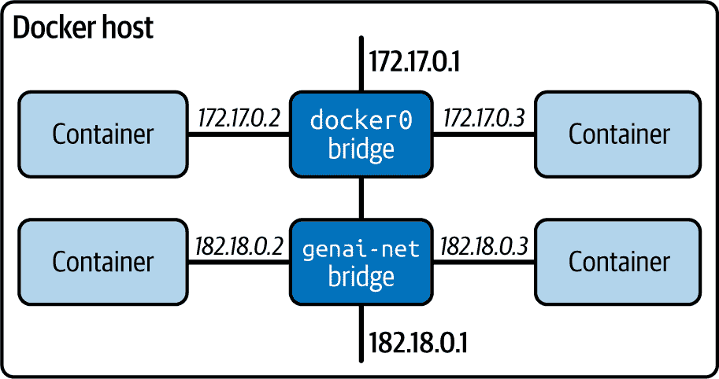

###### 图 12-10\. 隔离的桥接网络

当您运行容器时，您现在可以使用 `--network genai-net` 标志将它们附加到创建的网络：

```py
$ docker run --network genai-net genai-service
$ docker run --network genai-net postgresql
```

###### 警告

在 Linux 上，由于 Linux 内核的限制，单个桥接网络可以连接的容器数量限制为 1,000 个。将更多容器链接到单个桥接网络可能会使其不稳定并破坏容器间的通信。

您的两个容器现在可以在您更好的隔离 `genai-net` 用户定义网络上相互访问，容器之间有自动的 *DNS 解析*。

#### 嵌入式 DNS

Docker 利用嵌入的 DNS 服务器与用户定义的网络，如图 12-11 所示，来映射内部 IP 地址，以便容器可以通过名称相互访问。

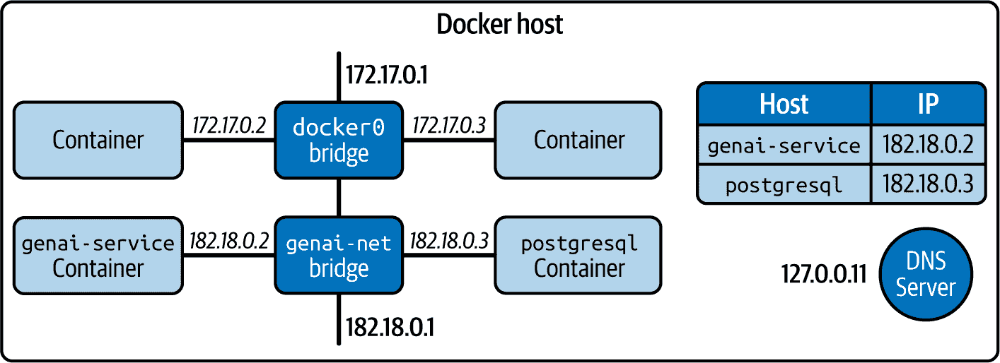

###### 图 12-11\. 嵌入式 DNS

例如，如果您将应用程序容器命名为 `genai-service`，将数据库容器命名为 `db`，那么您的 `genai-service` 容器可以通过调用 `db` 主机名与数据库进行通信。

###### 警告

您无法通过名称从 Docker 网络桥接之外访问 `db` 容器，因为嵌入的 DNS 服务器对主机机器不可见。

相反，您可以通过暴露容器端口 `5432` 并使用主机网络（例如，通过 `localhost:5432`）来访问 `db` 容器。

接下来让我们讨论如何将容器端口发布到外部环境，例如主机机器。

#### 发布端口

当您在网络上运行容器时，它们会自动向彼此暴露端口。

如果您需要从主机机器或不同网络上的非 Docker 进程访问容器，您需要通过使用 `--publish` 或 `-p` 标志发布容器端口来暴露它们：

```py
$ docker run -p 127.0.0.1:8000:8000 myimage
```

此命令允许您创建一个容器，其中暴露的端口 `8000` 映射到主机机器上的 `8000` 端口（例如，localhost），使用 `<host_port>:<container_port>` 语法。

当您未指定容器端口时，Docker 默认会发布并映射端口 `80`。

###### 警告

总是仔细检查您想要暴露的端口，并避免发布已在主机机器上使用的容器端口。否则，将会有 *端口冲突*，导致请求被路由到冲突的服务，这也会导致调试变得耗时。

如果使用网桥网络和端口映射给您带来很多麻烦，您也可以使用 *主机* 网络驱动来连接您的容器，尽管没有网桥网络相同的隔离和安全优势。

### 主机网络驱动

*主机* 网络驱动在以下情况下很有用：您想提高性能，当您想避免容器端口映射，或者当您的某个容器需要处理大量端口时。

使用主机驱动运行容器与使用 `docker run` 命令中的 `--net=host` 标志一样简单：

```py
$ docker run --net=host genai-service
```

在主机网络中，容器共享主机机的网络命名空间，这意味着容器不会与 Docker 主机隔离。因此，容器不会分配自己的 IP 地址。

###### 警告

一旦您启用主机网络驱动，之前发布的端口将被丢弃，因为容器不会有自己的 IP 地址。

主机网络驱动性能更优，因为它不需要进行 *网络地址转换* (NAT) 来映射一个命名空间（容器）到另一个（主机机）的 IP 地址，并且避免了为每个端口创建 *用户空间代理*（即端口转发）。然而，主机网络仅支持 Linux 容器——不支持 Windows 容器。此外，容器无法访问主机的网络接口，因此无法绑定到主机的 IP 地址，这导致网络配置需要额外的复杂性。

### None 网络驱动

如果您想完全隔离容器的网络堆栈，您可以在启动容器时使用 `--network none` 标志。在容器内部，仅创建 loopback 设备，这是一个容器用来与自身通信的虚拟网络接口。您可以使用以下命令指定 none 网络驱动：

```py
$ docker run --network none genai-service
```

这些是一些隔离容器有用的场景：

+   处理高度敏感数据或运行关键进程的应用程序

+   在网络攻击或恶意软件风险较高的环境中

+   通过消除外部干扰进行网络调试和模拟网络故障

+   运行无外部依赖的独立容器

+   运行短暂容器以处理短期进程，以最小化网络暴露

通常，如果您需要出于安全原因将容器与任何 Docker 和非 Docker 进程隔离，请使用 none 网络驱动。

## 启用 GPU 驱动

如果您安装了 CUDA 工具包和必要的驱动程序的 NVIDIA 图形卡，则可以使用 `--gpus=all` 标志来启用 Docker 中容器的 GPU 支持.^(5)

要测试您的系统是否具有必要的驱动程序并支持 Docker 中的 GPU，请运行以下命令以基准测试您的 GPU：

```py
$ docker run --rm -it \
             --gpus=all nvcr.io/nvidia/k8s/cuda-sample:nbody nbody \
             -gpu \
             -benchmark

> Windowed mode
> Simulation data stored in video memory
> Single precision floating point simulation
> 1 Devices used for simulation
MapSMtoCores for SM 8.9 is undefined.  Default to use 128 Cores/SM
MapSMtoArchName for SM 8.9 is undefined.  Default to use Ampere
GPU Device 0: "Ampere" with compute capability 8.9

> Compute 8.9 CUDA device: [NVIDIA GeForce RTX 4090]
131072 bodies, total time for 10 iterations: 75.182 ms
= 2285.102 billion interactions per second
= 45702.030 single-precision GFLOP/s at 20 flops per interaction
```

###### 小贴士

您还可以使用 NVIDIA 系统管理接口 `nvidia-smi` 工具来帮助管理和监控 NVIDIA GPU 设备。

深度学习框架如`tensorflow`或`pytorch`可以在 GPU 启用容器中运行您的应用程序时自动检测并使用 GPU 设备。这包括 Hugging Face 库如`transformers`，它允许您自托管语言模型。

如果使用`transformers`包，请确保还安装了`accelerate`库：

```py
$ pip install accelerate
```

您现在可以通过使用`device_map='cuda'`将模型移动到 GPU，在将其加载到 CPU 之前，如示例 12-8 所示。

##### 示例 12-8\. 将 Hugging Face 模型传输到 GPU

```py
from transformers import pipeline

pipe = pipeline(
    "text-generation",
    model="TinyLlama/TinyLlama-1.1B-Chat-v1.0",
    device_map="cuda"
)
```

您应该能够通过向`docker run`传递`--gpus=all`标志来在 GPU 上运行预测。

## Docker Compose

在多容器环境中，您可以使用*Docker Compose*工具来定义和运行应用程序容器，以获得流畅的开发和部署体验。

使用 Docker Compose 可以帮助您通过单个*YAML 配置文件*简化管理多个容器、网络、卷、变量和秘密。这简化了协调和协调各种容器的复杂任务，使得使用环境变量跨不同的应用程序环境管理和复制您的服务变得更加容易。您还可以与他人共享 YAML 文件，以便他们可以复制您的容器环境。此外，它缓存配置以防止在重启服务时重新创建容器。

示例 12-9 展示了示例 YAML 配置文件。

##### 示例 12-9\. Docker Compose YAML 配置文件

```py
# compose.yaml

services: 
  server:
    build: . 
    ports:
      - "8000:8000"
    environment:
      SHOW_DOCS_IN_PRODUCTION: $SHOW_DOCS_IN_PRODUCTION
      ALLOWED_CORS_ORIGINS: $ALLOWED_CORS_ORIGINS
    secrets:
       - openai_api_token 
    volumes:
      - ./src/app:/code/app
    networks:
      - genai-net 

  db:
    image: postgres:12.2-alpine
    ports:
      - "5433:5432"
    volumes:
      - db-data:/etc/data
    networks:
      - genai-net

volumes:
  db-data:
    name: "my-app-data"

networks:
  genai-net:
    name: "genai-net"
    driver: bridge

secrets:
  openai_api_token:
    environment: OPENAI_API_KEY
```


创建与相关卷、网络和秘密一起的容器。


使用与 Compose 文件相同的目录中的 Dockerfile 来构建`server`镜像。


使用 Docker secrets 在容器 shell 环境中隐藏敏感数据，如 API 密钥。


创建一个名为`genai-net`的桥接网络，并将`server`和`db`容器附加到它。

###### 小贴士

如果您正在自行管理 Docker 对象，如卷和网络，您可以在 compose 文件中将它们标记为`external: true`，这样 Docker Compose 就不会管理它们。

一旦您有了`compose.yaml`文件，您就可以使用简单的 compose 命令来管理您的容器：

```py
# Start services defined in compose.yaml
$ docker compose up

# Stop and remove running services (won't remove created volumes and networks)
$ docker compose down

# Monitor output of running containers
$ docker compose logs

# List all running services with their status
$ docker compose ps
```

您可以使用这些命令来启动/停止/重启服务，查看它们的日志或容器状态。此外，您还可以编辑示例 12-9 中显示的 Compose 文件，使用`watch`以便在您编辑和保存代码时自动更新您的服务。

示例 12-10 展示了如何在指定目录上使用`watch`指令。

##### 示例 12-10\. 在指定目录上启用 Docker Compose `watch`

```py
services:
  server:
    # ...
    develop:
      watch:
        - action: sync
          path: ./src
          target: /code
```

当你在主机机器上的 `./src` 文件夹中的文件发生变化时，Compose 将将其内容同步到 `/code` 并更新正在运行的应用程序（服务器服务），而无需重新启动它们。

然后，你可以使用 `docker compose watch` 运行 `watch` 进程：

```py
$ docker compose watch

[+] Running 2/2
 ✔ Container project-server-1  Created     0.0s
 ✔ Container project-db-1      Recreated   0.1s
Attaching to db-1, server-1
         ⦿ watch enabled
...
```

Docker Compose 的 `watch` 功能比使用绑定挂载更具有粒度，如示例 12-9 所示。例如，它允许你忽略监视树中的特定文件或整个目录，以避免 I/O 性能问题。

除了使用 Docker Compose 的 `watch` 功能外，你还可以合并和覆盖多个 Compose 文件，以创建针对特定构建环境的复合配置。通常，`compose.yml` 文件包含基本配置，可以被可选的 `compose.override.yml` 文件覆盖。例如，如示例 12-11 所示，你可以注入本地环境设置，挂载本地卷，并创建新的数据库服务。

##### 示例 12-11\. 为特定构建配置合并和覆盖 Compose 文件

```py
# compose.yml

services: 
  server:
      ports:
        - 8000:8000
      # ...
      command: uvicorn main:app

# compose.override.yml

services: 
  server:
    environment:
      - LLM_API_KEY=$LLM_API_KEY
      - DATABASE_URL=$DATABASE_URL
    volumes:
      - ./code:/code
    command: uvicorn main:app --reload

  database:
    image: postgres:latest
    environment:
      - POSTGRES_DB=genaidb
      - POSTGRES_USER=genaiuser
      - POSTGRES_PASSWORD=secretPassword!
    volumes:
      - db_data:/var/lib/postgresql/data

networks:
  app-network:

volumes:
  db_data:
```

[#co_deployment_of_ai_services_CO5-1]

基础 Compose 文件包含运行应用程序生产版本的说明。

[#co_deployment_of_ai_services_CO5-2]

通过替换容器启动命令、注入本地变量以及添加本地数据库服务的卷和网络配置来覆盖基本说明。

使用这些文件，请运行以下命令：

```py
$ docker compose up
```

Docker Compose 将自动合并两个 Compose 文件中的配置，应用覆盖 Compose 文件中的环境特定设置。

## 在 Docker Compose 中启用 GPU 访问

要使用 Docker Compose 管理的服务访问 GPU 设备，你需要将说明添加到组合文件中（参见示例 12-12）。

##### 示例 12-12\. 将 GPU 配置添加到 Docker Compose 应用程序服务

```py
services:
  app:
    # ...
    deploy:
      resources:
        reservations:
          devices:
            - driver: nvidia
              count: 1 
              capabilities: [gpu]
```

[#co_deployment_of_ai_services_CO6-1]

限制应用程序服务可访问的 GPU 设备数量。

这些说明将为你提供更细粒度的控制，以确定你的服务应该如何使用你的 GPU 资源。

## 优化 Docker 镜像

如果你的 Docker 镜像增大，它们在运行、构建和测试生产环境时也会变慢。你还将花费大量开发时间迭代图像的开发。

在这种情况下，了解图像优化策略很重要，包括如何使用 Docker 的分层机制来保持图像轻量级且运行效率高，尤其是在 GenAI 工作负载中。

这些是减少图像大小并加快构建过程的一些方法：

+   使用最小基础镜像

+   避免使用 GPU 推理运行时

+   外部化应用程序数据

+   分层顺序和缓存

+   使用多阶段构建

实施如图 12-4 所示的优化可能将典型镜像的大小从几个 GB 减少到不到 1GB。同样，构建时间可以从平均几分钟减少到不到一分钟。

表 12-4\. 构建优化对典型镜像的影响^(a)

| 优化步骤 | 构建时间（秒） | 镜像大小（GB） |
| --- | --- | --- |
| 初始 | 352.9 | 1.42 |
| 使用最小基础镜像 | 38.5 | 1.38 |
| 使用缓存 | 24.4 | 1.38 |
| 层次排序 | 17.9 | 1.38 |
| 多阶段构建 | 10.3 | 0.034（34 MB） |
| ^(a) 来源：[warpbuild.com](https://www.warpbuild.com) |

让我们通过代码示例来更详细地回顾每个步骤，以增加清晰度。

### 使用最小基础镜像

基础镜像允许您从一个预配置的镜像开始，这样您就不需要从头开始安装所有内容，包括 Python 解释器。然而，Docker Hub 上的一些基础镜像可能不适合生产部署。相反，您将想要选择具有最小 OS 占用空间的基础镜像，以便进行更快的构建和更小的镜像大小，可能包括预安装的 Python 依赖项以及支持安装其各种包。

Alpine 基础镜像使用轻量级的 Alpine Linux 发行版，旨在小巧和安全，仅包含运行您的应用程序所需的*基本最小*工具，但这不支持安装许多 Python 包。另一方面，slim 基础镜像可能使用其他 Linux 发行版，如 Debian 或 CentOS，包含运行应用程序所需的*必要*基本工具，这使得它们比 Alpine 基础镜像更大。

###### 小贴士

如果您关心构建时间，请使用 slim 基础镜像；如果您关心镜像大小，请使用 Alpine 基础镜像。

您可以使用`slim`基础镜像，如`python:3.12-slim`，甚至更小的 Alpine 基础镜像，如`python:3.12-alpine`，其大小可小至 71.4MB。一个裸机 Alpine 镜像甚至可以降至 12.1MB。以下命令显示了从 Docker 仓库拉取的基础镜像列表：

```py
$ docker image ls

REPOSITORY  TAG         IMAGE ID       CREATED         SIZE
alpine      3.20        3463e98c969d   4 weeks ago     12.1MB
python      3.12-alpine c6de2e87f545   6 days ago      71.4MB
python      3.12-slim   1ba4bc34383e   6 days ago      186MB
```

###### 小贴士

标准大小的镜像通常包含完整的 Linux 发行版，如 Ubuntu 或 Debian，包含各种预安装的包和依赖项，这使得它们适合本地开发，但可能不适合生产环境。

### 避免 GPU 推理运行时

在您服务于机器学习/通用人工智能模型的 AI 工作负载中，您可能需要安装深度学习框架、依赖项和 GPU 库，这可能会突然扩大您镜像的占用空间。例如，为了使用`transformers`库在 GPU 上进行推理，您需要安装 3GB 的 NVIDIA 推理包，以及 1.6GB 的`torch`进行推理。

不幸的是，如果您需要使用 GPU 进行推理，则无法减小镜像大小。但是，如果您可以避免 GPU 推理并仅依赖 CPU，则可能通过使用具有模型量化的 Open Neural Network Exchange (ONNX) 运行时将镜像大小减少多达 10 倍。

如第十章中所述，您可以使用 ONNX 模型进行 INT8 量化，以在不损失太多输出质量的情况下从模型压缩中受益。

要从 GPU 推理运行时切换到 Hugging Face transformer 模型的 ONNX 运行时，您可以使用 `transformers[onnx]` 包：

```py
$ pip install transformers[onnx]
```

然后，您可以使用 `transformers.onnx` 将任何 Hugging Face transformer 模型检查点以默认配置导出到 ONNX 格式：

```py
$ python -m transformers.onnx --model=distilbert/distilbert-base-uncased onnx/
```

此命令将 `distilbert/distilbert-base-uncased` 模型检查点导出为存储在 `onnx/model.onnx` 中的 ONNX 图，可以使用支持 ONNX 标准的任何 Hugging Face 模型加速器运行，如示例 12-13 所示。

##### 示例 12-13\. 使用量化进行 ONNX 运行时的模型推理

```py
from onnxruntime import InferenceSession
from transformers import AutoTokenizer

tokenizer = AutoTokenizer.from_pretrained("distilbert/distilbert-base-uncased")
session = InferenceSession("onnx/model.onnx")

inputs = tokenizer("Using DistilBERT with ONNX Runtime!", return_tensors="np") 
output = session.run(output_names=["last_hidden_state"], input_feed=dict(inputs))
```


ONNX 运行时期望输入 `numpy` 数组。

使用如示例 12-13 中所示的技术，您可以将图像大小从 5 到 10 GB 缩小到大约 0.5 GB，这实现了巨大的足迹减少，显著提高了成本效益和可扩展性。

### 外部化应用程序数据

图像大小的一个核心贡献者是，在构建时将模型和应用程序数据复制到镜像中。这种方法增加了构建时间和镜像大小。

一个更好的方法是，在本地开发期间使用卷，在生产环境中启动应用程序时使用外部存储解决方案下载和加载模型。在 Kubernetes 容器编排环境中，您还可以使用持久卷来存储模型。

###### 小贴士

如果您的应用程序容器从外部源下载数据和时间较长的模型工件，则健康检查可能会失败，托管平台可能会提前终止您的容器。在这种情况下，配置健康检查探测器以等待更长的时间，或者作为最后的手段，将模型烘焙到镜像中。

### 层次和缓存

Docker 使用分层文件系统在 Dockerfile 的每个指令中为每个镜像创建层。这些层就像一个堆栈，每个层在上一层的顶部添加更多内容。每当层发生变化时，该层（以及后续层）都需要重建，以便这些更改在镜像中显示出来（即，必须使构建缓存无效）。

如果指令是向容器联合文件系统写入或删除文件，则会创建一个层（即文件系统快照）。

###### 小贴士

修改文件系统的 Dockerfile 指令，如`ENV`、`COPY`、`ADD`和`RUN`，将为构建过程贡献新的层，从而有效增加镜像大小。另一方面，仅更新镜像元数据的指令，如`WORKDIR`、`ENTRYPOINT`、`LABEL`和`CMD`，不会创建任何层，也不会创建任何构建缓存。

创建后，每个层都会缓存起来，以便在镜像重建过程中重用，前提是自上次构建以来指令及其依赖的文件没有发生变化。因此，理想情况下，您希望编写一个 Dockerfile，允许您停止、销毁、重建和替换容器，同时设置和配置最小化。

您可以使用一些技术尽可能最小化和优化这些层。

#### 避免频繁缓存失效的层排序

由于早期层的更改可能导致构建缓存失效并导致重复步骤，因此您应该从最稳定的（例如，安装）到最频繁更改或易变的（例如，应用程序代码、配置文件）对 Dockerfile 进行排序。

按照此顺序，将最稳定但昂贵的指令（例如，模型下载或重型依赖安装）放在 Dockerfile 的开头，将易变、快速的操作（例如，复制应用程序代码）放在底部。

想象一下您的 Dockerfile 文件看起来像这样：

```py
FROM python:3.12-slim as base
# Changes to the
COPY . .
RUN pip install requirements.txt
```

在这里，您通过在下载和安装依赖项之前将包含应用程序代码的工作目录复制到镜像中来创建一个层。

如果任何源文件发生变化，Docker 构建者将使缓存失效，导致依赖安装重复，这既昂贵又可能需要几分钟才能完成，除非通过`pip`缓存。

为了避免重复昂贵的步骤，您可以逻辑地排序您的 Dockerfile 指令，通过重新排序这些指令来优化层缓存：

```py
FROM python:3.12-slim as base
COPY requirements.txt requirements.txt
RUN pip install requirements.txt
COPY . .
```

现在，任何对源文件的更改都不会影响漫长的依赖安装步骤，从而大大加快构建过程。

#### 最小化层

为了保持镜像大小小，您需要尽可能最小化镜像层。

实现这一点的简单方法是将多个`RUN`指令合并为一个。例如，您不必编写多个`RUN apt-get`安装指令，而是可以将它们合并为一个带有`&&`的单个`RUN`命令：

```py
RUN apt-get update && apt-get install -y
```

这将避免添加不必要的层，并使用*缓存破坏*技术防止`apt-get update`出现缓存问题。

由于构建者可能跳过更新包索引，导致安装失败或使用过时的包，使用`&&`确保如果包索引已更新，则安装最新包。

###### 小贴士

当使用`docker build`时，您也可以使用`--no-cache`标志来避免缓存命中并确保每次构建都下载和依赖最新镜像。

#### 保持构建上下文小

*构建上下文*是发送给构建器以执行 Dockerfile 指令的一组文件和目录。较小的构建上下文可以减少发送给构建器的数据量，降低缓存失效的可能性，从而加快构建速度。

当你在 Dockerfile 中使用`COPY . .`命令将工作目录复制到镜像中时，你也可以将工具缓存、开发依赖、虚拟环境和未使用的文件添加到构建上下文中。这不仅会增加镜像的大小，而且 Docker 构建器还会缓存这些不必要的文件。对这些文件的任何更改都将使构建失效，并重新启动整个构建过程。

为了防止不必要的缓存失效，你可以在 Dockerfile 旁边添加一个*.dockerignore*文件，列出你的服务在生产中不需要的所有文件和目录。例如，以下是可以包含在*.dockerignore*文件中的项目：

```py
**/.DS_Store
**/__pycache__
**/.mypy_cache
**/.venv
**/.env
**/.git
```

即使你在整个工作目录中运行`COPY`命令，Docker 构建器也会忽略这些文件。

#### 使用缓存和绑定挂载

你可以使用*绑定挂载*来避免向镜像添加不必要的层，并使用*缓存挂载*来加快后续构建。

绑定挂载临时将文件包含在构建上下文中，用于单个`RUN`指令，并在之后不会作为镜像层持久化。缓存挂载指定一个持久的缓存位置，你可以在多个构建之间读取和写入数据。

这里有一个示例，你可以从 Hugging Face 下载预训练模型到挂载的缓存中，以优化层缓存：

```py
RUN --mount=type=cache,target=/root/.cache/huggingface && \
    pip install transformers && \
    python -c "from transformers import AutoModel; \
 AutoModel.from_pretrained('bert-base-uncased')"
```

这个`RUN`指令在`/root/.cache/huggingface`创建了一个下载的预训练模型的缓存，这可以在多个构建之间共享。这有助于避免重复下载，并通过重用缓存层优化构建过程。

你也可以在`pip`包管理器中使用`--no-cache-dir`标志来避免完全缓存，以最小化镜像大小。然而，构建过程将显著变慢，因为后续构建每次都需要重新下载。

#### 使用外部缓存

如果你正在使用 CI/CD 管道构建和部署容器，你可以从远程位置托管的外部缓存中受益。外部缓存可以显著加快 CI/CD 管道中的构建过程，在这些管道中，构建器通常是短暂的，构建时间非常宝贵。

要使用外部缓存，你可以使用`docker buildx build`命令指定`--cache-to`和`--cache-from`选项：

```py
docker buildx build --cache-from type=registry,ref=user/app:buildcache .
```

除了层排序和缓存优化之外，你还可以使用多阶段构建来显著减小镜像大小。

### 多阶段构建

使用*多阶段构建*，你可以通过将 Dockerfile 指令拆分为不同的阶段来减小最终镜像的大小。常见的阶段可以被重用来包含共享组件，并作为后续阶段的起点。

您还可以选择性地从某个阶段复制工件到另一个阶段，保留您不希望在最终镜像中保留的所有内容。这确保了只有之前阶段所需的输出包含在最终镜像中，避免了任何非必要的工件。此外，您还可以并行执行多个构建阶段以加快镜像构建过程。

当您需要一个用于测试/开发的镜像和一个从共享的第一阶段镜像开始的更精简的生产镜像时，常见的多阶段构建模式。开发或测试镜像可以包含额外的工具层（例如，编译器、构建系统和调试工具），以支持所需的流程。

假设您需要在 FastAPI 服务中提供来自 Hugging Face 的 bert transformer 模型。您可以编写 Dockerfile 指令以使用三个不同的顺序阶段。

第一个阶段将转换器模型下载到 `/root/.cache/huggingface`，并在 `/opt/venv` 创建一个 Python 虚拟环境：

```py
# Stage 1: Base
FROM python:3.11.0-slim as base

RUN python -m venv /opt/venv
RUN pip install transformers && \
    python -c "from transformers import AutoModel; \
 AutoModel.from_pretrained('bert-base-uncased')"
RUN --mount=type=cache,target=/root/.cache/pip \
    --mount=type=bind,source=requirements.txt,target=requirements.txt \
    python -m pip install -r requirements.txt
```

然后第二个阶段会从`base`阶段复制模型工件和虚拟 Python 环境 `/opt/ven`，然后再复制源文件并创建 FastAPI 服务的生产版本：

```py
# Stage 2: Production
FROM base as production
RUN apt-get update && apt-get install -y
COPY --from=base /opt/venv /opt/venv
COPY --from=base /root/.cache/huggingface /root/.cache/huggingface

WORKDIR /code
COPY . .

EXPOSE 8000

ENV BUILD_ENV=PROD
CMD ["uvicorn", "main:app", "--host", "0.0.0.0", "--port", "8000"]
```

最后一个阶段复制了带有已安装包的生产阶段虚拟 Python 环境，并在其上添加了几个开发工具。然后它启动服务器，具有热重载功能：

```py
# Stage 3: Development
FROM production as development

COPY --from=production /opt/venv /opt/venv
COPY ./requirements_dev.txt ./
RUN pip install --no-cache-dir --upgrade -r requirements_dev.txt

ENV BUILD_ENV=DEV
CMD ["uvicorn", "main:app", "--host", "0.0.0.0", "--port", "8000", "--reload"]
```

使用单个 Dockerfile，我们能够创建三个不同的阶段，并在需要时通过`--target development`命令按需使用它们。

## docker init

您现在对使用 Docker 平台的容器化过程以及相关最佳实践有了深入的了解。

如果您需要将 Docker 添加到现有项目中，可以使用`docker init`命令，该命令将引导您通过向导在当前工作目录中创建所有必要的 Docker 部署文件：

```py
$ docker init
>> Answer a few questions in the terminal...

project/
│
├── .dockerignore
├── compose.yaml
├── Dockerfile
└── README.Docker.md
... # other application files
```

这将提供一个很好的起点，您可以从中添加额外的配置步骤、依赖项或服务。

###### 小贴士

我建议在入门时使用`docker init`，因为每个生成的文件都将遵循最佳实践，包括利用`dockerignore`、优化镜像层、使用绑定和缓存挂载进行包安装，以及切换到非 root 用户。

一旦您有一个优化的镜像和一组工作容器，您可以选择任何云提供商或自托管解决方案来推送镜像到注册表并部署您的新 GenAI 服务。

# 摘要

在本章中，我们回顾了部署您的 GenAI 服务的各种策略——例如，在虚拟机上、作为云函数、使用托管应用服务平台或通过容器。作为其中的一部分，我介绍了虚拟化与容器化的区别以及为什么您可能希望将服务作为容器部署。

接下来，您学习了 Docker 容器化平台以及如何使用它来构建应用程序的自包含镜像，这些镜像可以作为容器运行。

我们介绍了 Docker 存储和网络机制，这些机制允许您使用联合文件系统在容器中持久化数据，以及如何连接具有不同网络驱动的容器。

最后，您了解了各种优化技术，以减少构建时间和大小，以便尽可能高效地部署您的 GenAI 服务。

将服务容器化后，您可以将其推送到容器注册库以共享、分发，并在您选择的任何云或托管环境中运行。

^(1) 与最小化大小的 Alpine 基础 Python 镜像相比，精简的基础 Python 镜像在出厂时提供了更广泛的 Python 包，同时平衡了 Linux 发行版的尺寸和兼容性。

^(2) 在运行容器时，您可以使用`-p`或`--publish`标志来映射并启用通过端口访问容器的功能。

^(3) 在一台机器上构建的镜像只能在具有相同处理器架构的其他机器上运行。

^(4) 您可以通过使用`bash script.sh`命令而不是`./script.sh`，仅使用`r`权限来运行可执行文件。

^(5) 请参考 NVIDIA 文档了解如何为您的系统安装最新的 CUDA 工具包和图形驱动程序。
