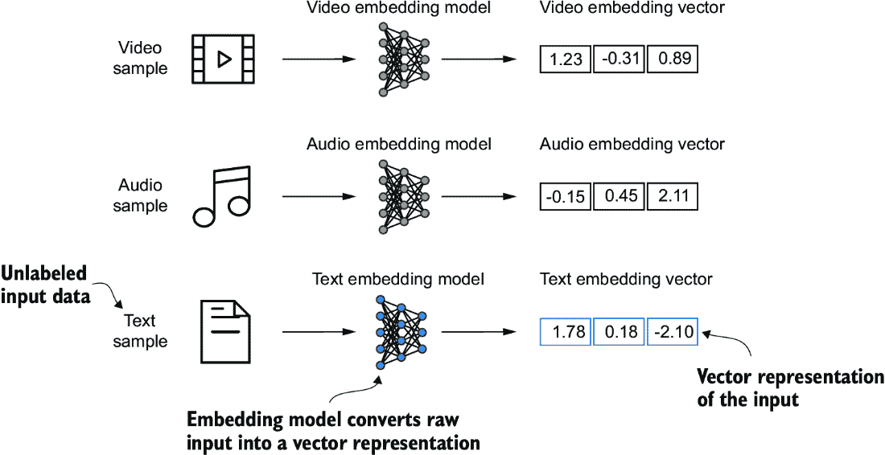
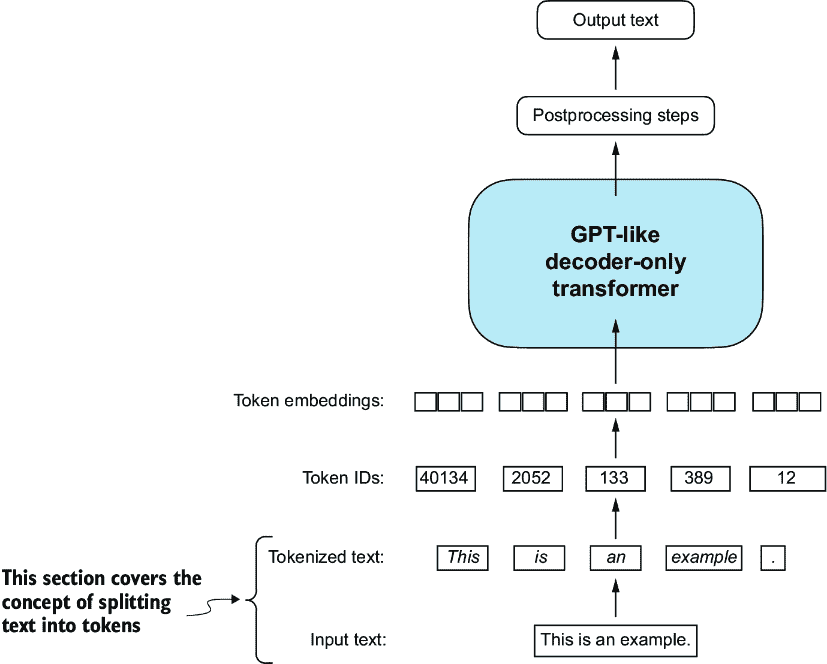
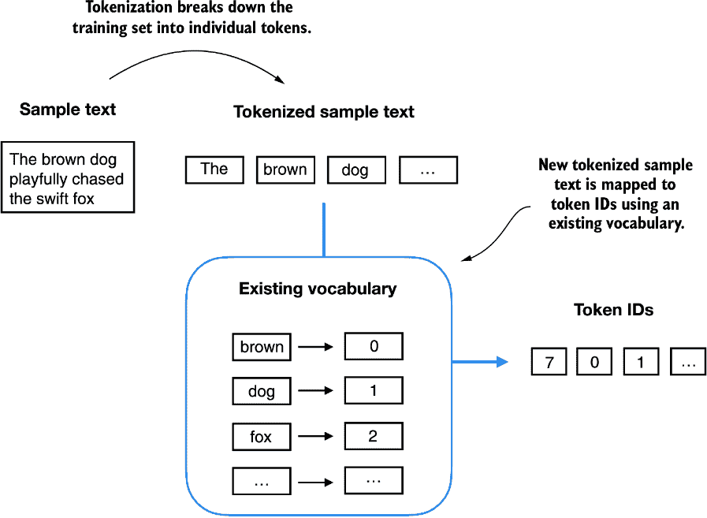
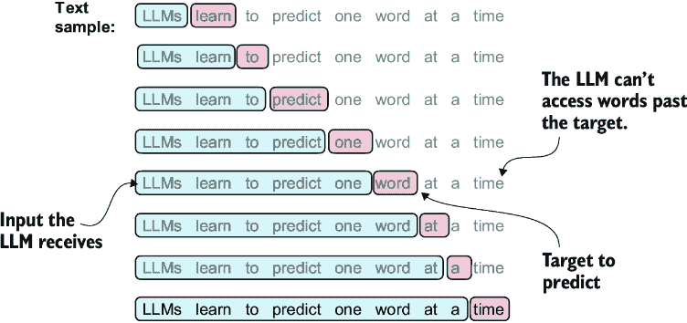
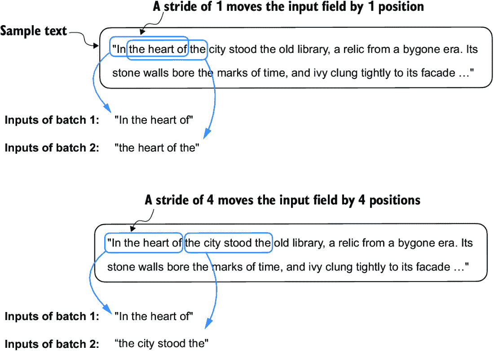
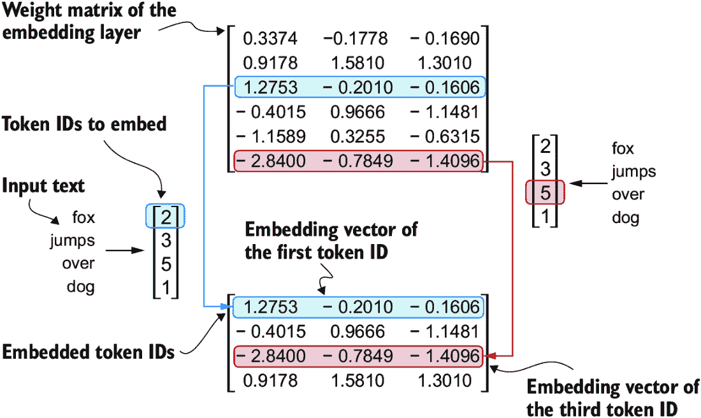
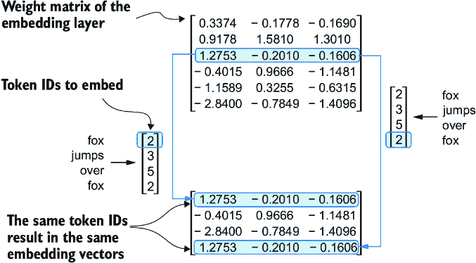

# 2 处理文本数据

### 本章涵盖了

+   为大型语言模型训练准备文本

+   将文本分割成单词和子词标记

+   字节对编码作为更高级的文本标记方法

+   使用滑动窗口方法采样训练示例

+   将标记转换为输入大型语言模型的向量

到目前为止，我们已经介绍了大型语言模型（LLMs）的一般结构，并了解到它们是在大量文本上预训练的。具体来说，我们的重点是基于 transformer 架构的仅解码器 LLMs，这是 ChatGPT 和其他流行 GPT-like LLMs 所使用的模型的基础。

在预训练阶段，LLMs 逐个单词处理文本。使用数百万到数十亿参数的下一个单词预测任务训练 LLMs，可以得到具有令人印象深刻能力的模型。然后，这些模型可以进一步微调以遵循一般指令或执行特定目标任务。但在我们能够实现和训练 LLMs 之前，我们需要准备训练数据集，如图 2.1 所示。


##### 图 2.1 编码 LLM 的三个主要阶段。本章重点介绍第一阶段的第一步：实现数据采样管道。

你将学习如何为训练 LLMs 准备输入文本。这涉及到将文本分割成单个单词和子词标记，然后可以将这些标记编码成 LLM 的向量表示。你还将了解诸如字节对编码等高级标记方案，这些方案在 GPT 等流行 LLMs 中得到应用。最后，我们将实现一个采样和数据加载策略，以生成训练 LLMs 所需的输入-输出对。

## 2.1 理解词嵌入

深度神经网络模型，包括 LLMs，不能直接处理原始文本。由于文本是分类的，它不兼容用于实现和训练神经网络所使用的数学运算。因此，我们需要一种方法将单词表示为连续值的向量。

注意：不熟悉计算环境中向量和张量的读者可以在附录 A 的第 A.2.2 节中了解更多信息。

将数据转换为向量格式的概念通常被称为*嵌入*。使用特定的神经网络层或另一个预训练的神经网络模型，我们可以嵌入不同类型的数据——例如，视频、音频和文本，如图 2.2 所示。然而，需要注意的是，不同的数据格式需要不同的嵌入模型。例如，为文本设计的嵌入模型不适合嵌入音频或视频数据。



##### 图 2.2 深度学习模型不能以原始形式处理视频、音频和文本等数据格式。因此，我们使用嵌入模型将原始数据转换为深度学习架构可以轻松理解和处理的高密度向量表示。具体来说，此图说明了将原始数据转换为三维数值向量的过程。

在本质上，嵌入是将离散对象（如单词、图像甚至整个文档）映射到连续向量空间中的点的映射——嵌入的主要目的是将非数值数据转换为神经网络可以处理的形式。

虽然词嵌入是文本嵌入最常见的形式，但也有句子、段落或整个文档的嵌入。句子或段落嵌入是*检索增强生成*的流行选择。检索增强生成结合了生成（如产生文本）和检索（如搜索外部知识库）来在生成文本时提取相关信息，这是一种超出本书范围的技术。由于我们的目标是训练类似于 GPT 的 LLMs，这些 LLMs 一次学习生成一个单词，因此我们将专注于词嵌入。

已经开发出多种算法和框架来生成词嵌入。其中一个较早且最受欢迎的例子是*Word2Vec*方法。Word2Vec 通过预测目标词或反之的上下文来训练神经网络架构以生成词嵌入。Word2Vec 背后的主要思想是，在相似上下文中出现的单词往往具有相似的含义。因此，当为了可视化目的投影到二维词嵌入时，相似术语通常会聚集在一起，如图 2.3 所示。


##### 图 2.3 如果词嵌入是二维的，我们可以将其绘制在二维散点图中进行可视化，如图所示。当使用 Word2Vec 等词嵌入技术时，对应于相似概念的单词在嵌入空间中通常彼此靠近。例如，不同类型的鸟在嵌入空间中的距离比在国家和城市中的距离更近。

词嵌入可以有不同维度，从一到数千。更高的维度可能能够捕捉更细微的关系，但会以计算效率为代价。

当我们使用预训练模型如 Word2Vec 为机器学习模型生成嵌入时，LLMs 通常会产生自己的嵌入，这些嵌入是输入层的一部分，并在训练过程中更新。将嵌入作为 LLM 训练的一部分进行优化，而不是使用 Word2Vec 的优势在于，嵌入被优化以适应特定任务和现有数据。我们将在本章后面实现这样的嵌入层。（LLMs 还可以创建上下文化的输出嵌入，如我们在第三章中讨论的。）

不幸的是，高维嵌入对可视化构成了挑战，因为我们的感官感知和常见的图形表示本质上限于三维或更少，这就是为什么图 2.3 展示了二维嵌入在二维散点图中的原因。然而，当与 LLM（大型语言模型）一起工作时，我们通常使用更高维度的嵌入。对于 GPT-2 和 GPT-3，嵌入大小（通常被称为模型隐藏状态的维度）根据具体的模型变体和大小而变化。这是性能和效率之间的权衡。最小的 GPT-2 模型（117M 和 125M 参数）使用 768 维的嵌入大小来提供具体示例。最大的 GPT-3 模型（175B 参数）使用 12,288 维的嵌入大小。

接下来，我们将介绍为 LLM 准备嵌入所需的步骤，包括将文本分割成单词、将单词转换为标记以及将标记转换为嵌入向量。

## 2.2 文本分词

让我们讨论如何将输入文本分割成单个标记，这是为 LLM 创建嵌入所需的预处理步骤。这些标记可以是单个单词或特殊字符，包括标点符号，如图 2.4 所示。



##### 图 2.4 在 LLM 的上下文中查看文本处理步骤。在这里，我们将输入文本分割成单个标记，这些标记可以是单词或特殊字符，例如标点符号。

我们将为 LLM 训练进行分词的文本是“Verdict”，这是伊迪丝·华顿的短篇小说，已经进入公有领域，因此可以用于 LLM 训练任务。该文本可在维基源[`en.wikisource.org/wiki/The_Verdict`](https://en.wikisource.org/wiki/The_Verdict)上找到，您可以将它复制并粘贴到文本文件中，我将它复制到了名为“the-verdict.txt”的文本文件中。

或者，您可以在本书的 GitHub 仓库[`mng.bz/Adng`](https://mng.bz/Adng)中找到这个`"the-verdict.txt"`文件。您可以使用以下 Python 代码下载该文件：

```py
import urllib.request
url = ("https://raw.githubusercontent.com/rasbt/"
       "LLMs-from-scratch/main/ch02/01_main-chapter-code/"
       "the-verdict.txt")
file_path = "the-verdict.txt"
urllib.request.urlretrieve(url, file_path)
```

接下来，我们可以使用 Python 的标准文件读取实用工具加载`the-verdict.txt`文件。

##### 列表 2.1 将短篇小说作为文本样本读入 Python

```py
with open("the-verdict.txt", "r", encoding="utf-8") as f:
    raw_text = f.read()
print("Total number of character:", len(raw_text))
print(raw_text[:99])
```

打印命令打印了该文件的总字符数，以及为了说明目的的前 99 个字符：

```py
Total number of character: 20479
I HAD always thought Jack Gisburn rather a cheap genius--though a good fellow enough--so it was no
```

我们的目标是将这个 20,479 个字符的短篇小说分解成单个单词和特殊字符，然后我们可以将其转换为 LLM 训练的嵌入。

注意：当与 LLM 一起工作时，通常需要处理数百万篇文章和数十万本书——许多 GB 的文本。然而，出于教育目的，使用较小的文本样本（如一本书）就足够了，以说明文本处理步骤背后的主要思想，并使其能够在消费级硬件上合理时间内运行。

我们如何最好地分割这段文本以获得一个标记列表？为此，我们进行了一次小旅行，并使用 Python 的正则表达式库`re`进行说明。（您不必学习或记住任何正则表达式语法，因为我们稍后将过渡到预构建的分词器。）

使用一些简单的示例文本，我们可以使用以下语法的`re.split`命令来在空白字符上分割文本：

```py
import re
text = "Hello, world. This, is a test."
result = re.split(r'(\s)', text)
print(result)
```

结果是一个包含单个单词、空白字符和标点符号的列表：

```py
['Hello,', ' ', 'world.', ' ', 'This,', ' ', 'is', ' ', 'a', ' ', 'test.']
```

这个简单的分词方案主要适用于将示例文本分割成单个单词；然而，一些单词仍然与我们要作为单独列表条目保留的标点符号相连。我们也不将所有文本转换为小写，因为大小写有助于大型语言模型区分专有名词和普通名词，理解句子结构，并学会生成正确大小写的文本。

让我们修改空白字符（`\s`）、逗号和句号（`[,.]`）上的正则表达式分割：

```py
result = re.split(r'([,.]|\s)', text)
print(result)
```

我们可以看到，单词和标点符号现在作为我们想要的单独列表条目分开：

```py
['Hello', ',', '', ' ', 'world', '.', '', ' ', 'This', ',', '', ' ', 'is',
' ', 'a', ' ', 'test', '.', '']
```

一个小问题仍然存在，列表中仍然包括空白字符。可选地，我们可以安全地移除这些冗余字符，如下所示：

```py
result = [item for item in result if item.strip()]
print(result)
```

结果的无空白输出如下所示：

```py
['Hello', ',', 'world', '.', 'This', ',', 'is', 'a', 'test', '.']
```

注意：当开发一个简单的分词器时，我们是否应该将空白字符编码为单独的字符或者只是简单地移除它们，这取决于我们的应用及其需求。移除空白字符可以减少内存和计算需求。然而，如果我们训练对文本精确结构敏感的模型（例如，对缩进和间距敏感的 Python 代码），保留空白字符可能是有用的。在这里，我们为了简单和分词输出的简洁性移除了空白字符。稍后，我们将切换到一个包括空白字符的分词方案。

我们在这里设计的分词方案在简单的样本文本上运行良好。让我们进一步修改它，使其也能处理其他类型的标点符号，例如问号、引号以及我们在爱迪丝·华顿短篇小说前 100 个字符中看到的破折号，以及额外的特殊字符：

```py
text = "Hello, world. Is this-- a test?"
result = re.split(r'([,.:;?_!"()\']|--|\s)', text)
result = [item.strip() for item in result if item.strip()]
print(result)
```

结果输出如下：

```py
['Hello', ',', 'world', '.', 'Is', 'this', '--', 'a', 'test', '?']
```

根据图 2.5 中总结的结果，我们可以看到，我们的分词方案现在可以成功处理文本中的各种特殊字符。


##### 图 2.5 我们迄今为止实现的分词方案将文本分割成单个单词和标点符号。在这个特定示例中，样本文本被分割成 10 个单独的标记。

现在我们有一个基本的分词器正在工作，让我们将其应用于爱迪丝·华顿的整个短篇小说：

```py
preprocessed = re.split(r'([,.:;?_!"()\']|--|\s)', raw_text)
preprocessed = [item.strip() for item in preprocessed if item.strip()]
print(len(preprocessed))
```

这个打印语句输出`4690`，这是文本中的标记数量（不含空白字符）。让我们打印前 30 个标记以进行快速视觉检查：

```py
print(preprocessed[:30])
```

结果输出显示，我们的标记化器似乎很好地处理了文本，因为所有单词和特殊字符都被整洁地分隔开：

```py
['I', 'HAD', 'always', 'thought', 'Jack', 'Gisburn', 'rather', 'a',
'cheap', 'genius', '--', 'though', 'a', 'good', 'fellow', 'enough',
'--', 'so', 'it', 'was', 'no', 'great', 'surprise', 'to', 'me', 'to',
'hear', 'that', ',', 'in']
```

## 2.3 将标记转换为标记 ID

接下来，让我们将这些标记从 Python 字符串转换为整数表示，以生成标记 ID。这种转换是在将标记 ID 转换为嵌入向量之前的中间步骤。

为了将之前生成的标记映射到标记 ID，我们首先必须构建一个词汇表。这个词汇表定义了如何将每个唯一的单词和特殊字符映射到一个唯一的整数，如图 2.6 所示。


##### 图 2.6 我们通过将训练数据集中的整个文本标记化成单个标记来构建词汇表。然后，这些单个标记按字母顺序排序，并删除重复的标记。然后，唯一的标记被汇总到一个词汇表中，该词汇表定义了从每个唯一标记到唯一整数值的映射。为了简化，图中展示的词汇表故意很小，且不包含标点符号或特殊字符。

现在我们已经将伊迪丝·华顿的短篇小说进行了标记化，并将其分配给一个名为`preprocessed`的 Python 变量，让我们创建一个包含所有唯一标记的列表，并按字母顺序排序，以确定词汇表的大小：

```py
all_words = sorted(set(preprocessed))
vocab_size = len(all_words)
print(vocab_size)
```

通过这段代码确定词汇表大小为 1,130 后，我们创建了词汇表，并打印出其前 51 个条目以供说明。

##### 列表 2.2 创建词汇表

```py
vocab = {token:integer for integer,token in enumerate(all_words)}
for i, item in enumerate(vocab.items()):
    print(item)
    if i >= 50:
        break
```

输出如下

```py
('!', 0)
('"', 1)
("'", 2)
...
('Her', 49)
('Hermia', 50)
```

如我们所见，这个字典包含与唯一整数标签关联的单个标记。我们的下一个目标是应用这个词汇表将新文本转换为标记 ID（图 2.7）。



##### 图 2.7 从一个新的文本样本开始，我们对文本进行标记化，并使用词汇表将文本标记转换为标记 ID。这个词汇表是由整个训练集构建的，可以应用于训练集本身和任何新的文本样本。为了简化，图中展示的词汇表不包含标点符号或特殊字符。

当我们想要将一个语言模型（LLM）的输出从数字转换回文本时，我们需要一种方法将标记 ID 转换成文本。为此，我们可以创建一个词汇表的逆版本，它将标记 ID 映射回相应的文本标记。

让我们在 Python 中实现一个完整的标记化器类，它包含一个`encode`方法，该方法将文本分割成标记，并通过词汇表执行字符串到整数的映射，以生成标记 ID。此外，我们还将实现一个`decode`方法，它执行反向的整数到字符串映射，将标记 ID 转换回文本。以下列表展示了这个标记化器实现的代码。

##### 列表 2.3 实现简单的文本标记化器

```py
class SimpleTokenizerV1:
    def __init__(self, vocab):
        self.str_to_int = vocab            #1
        self.int_to_str = {i:s for s,i in vocab.items()}        #2

    def encode(self, text):         #3
        preprocessed = re.split(r'([,.?_!"()\']|--|\s)', text)
        preprocessed = [
            item.strip() for item in preprocessed if item.strip()
        ]
        ids = [self.str_to_int[s] for s in preprocessed]
        return ids

    def decode(self, ids):         #4
        text = " ".join([self.int_to_str[i] for i in ids]) 

        text = re.sub(r'\s+([,.?!"()\'])', r'\1', text)    #5
        return text
```

#1 将词汇表作为类属性存储，以便在`encode`和`decode`方法中访问

#2 创建一个逆词汇表，将标记 ID 映射回原始文本标记

#3 将输入文本处理成标记 ID

#4 将标记 ID 转换回文本

#5 删除指定标点符号前的空格

使用`SimpleTokenizerV1` Python 类，我们现在可以通过现有的词汇表实例化新的令牌化器对象，然后我们可以使用它来编码和解码文本，如图 2.8 所示。


##### 图 2.8 令牌化器实现共享两种常见方法：一种编码方法和一种解码方法。编码方法接收样本文本，将其分割成单个标记，并通过词汇表将这些标记转换为标记 ID。解码方法接收标记 ID，将它们转换回文本标记，并将文本标记连接成自然文本。

让我们从`SimpleTokenizerV1`类中实例化一个新的令牌化器对象，并从伊迪丝·华顿的短篇小说中标记一段文本来实际尝试：

```py
tokenizer = SimpleTokenizerV1(vocab)
text = """"It's the last he painted, you know," 
       Mrs. Gisburn said with pardonable pride."""
ids = tokenizer.encode(text)
print(ids)
```

前面的代码打印了以下标记 ID：

```py
[1, 56, 2, 850, 988, 602, 533, 746, 5, 1126, 596, 5, 1, 67, 7, 38, 851, 1108, 754, 793, 7]
```

接下来，让我们看看我们是否可以使用解码方法将这些标记 ID 转换回文本：

```py
print(tokenizer.decode(ids))
```

这将输出：

```py
'" It\' s the last he painted, you know," Mrs. Gisburn said with 
pardonable pride.'
```

根据这个输出，我们可以看到解码方法成功地将标记 ID 转换回原始文本。

到目前为止，一切顺利。我们实现了一个令牌化器，能够根据训练集的片段对文本进行标记化和反标记化。现在，让我们将其应用于训练集中未包含的新文本样本：

```py
text = "Hello, do you like tea?"
print(tokenizer.encode(text))
```

执行此代码将导致以下错误：

```py
KeyError: 'Hello'
```

问题在于单词“Hello”没有在“The Verdict”短故事中使用。因此，它不包含在词汇表中。这突出了在处理大型语言模型（LLMs）时考虑大型和多样化的训练集以扩展词汇表的需求。

接下来，我们将进一步测试令牌化器在包含未知单词的文本上的表现，并讨论在训练 LLM 期间可以使用的其他特殊标记，以提供更多上下文。

## 2.4 添加特殊上下文标记

我们需要修改令牌化器以处理未知单词。我们还需要解决特殊上下文标记的使用和添加，这些标记可以增强模型对文本中上下文或其他相关信息的理解。这些特殊标记可以包括未知单词和文档边界的标记，例如。特别是，我们将修改词汇表和令牌化器`SimpleTokenizerV2`，以支持两个新标记`<|unk|>`和`<|endoftext|>`，如图 2.9 所示。


##### 图 2.9 我们向词汇表中添加特殊标记以处理某些上下文。例如，我们添加一个`<|unk|>`标记来表示新词和未知词，这些词不是训练数据的一部分，因此也不属于现有词汇表的一部分。此外，我们添加一个`<|endoftext|>`标记，我们可以用它来分隔两个不相关的文本源。

我们可以修改分词器，使其在遇到不在词汇表中的单词时使用`<|unk|>`标记。此外，我们在无关文本之间添加一个标记。例如，当在多个独立文档或书籍上训练类似 GPT 的 LLM 时，通常在跟随前一个文本源之后的每个文档或书籍之前插入一个标记，如图 2.10 所示。这有助于 LLM 理解，尽管这些文本源在训练时被拼接在一起，但它们实际上是无关的。


##### 图 2.10 当处理多个独立文本源时，我们在这些文本之间添加`<|endoftext|>`标记。这些`<|endoftext|>`标记作为标记，指示特定段落的开始或结束，使 LLM 能够更有效地处理和理解。

现在我们修改词汇表以包括这两个特殊标记`<unk>`和`<|endoftext|>`，通过将它们添加到我们所有独特单词的列表中：

```py
all_tokens = sorted(list(set(preprocessed)))
all_tokens.extend(["<|endoftext|>", "<|unk|>"])
vocab = {token:integer for integer,token in enumerate(all_tokens)}

print(len(vocab.items()))
```

根据这个打印语句的输出，新的词汇表大小是 1,132（之前的词汇表大小是 1,130）。

作为额外的快速检查，让我们打印更新后的词汇表的最后五个条目：

```py
for i, item in enumerate(list(vocab.items())[-5:]):
    print(item)
```

代码打印

```py
('younger', 1127)
('your', 1128)
('yourself', 1129)
('<|endoftext|>', 1130)
('<|unk|>', 1131)
```

根据代码输出，我们可以确认这两个新的特殊标记确实成功融入了词汇表。接下来，我们根据以下列表相应地调整分词器。

##### 列表 2.4 一个简单的文本分词器，可以处理未知单词

```py
class SimpleTokenizerV2:
    def __init__(self, vocab):
        self.str_to_int = vocab
        self.int_to_str = { i:s for s,i in vocab.items()}

    def encode(self, text):
        preprocessed = re.split(r'([,.:;?_!"()\']|--|\s)', text)
        preprocessed = [
            item.strip() for item in preprocessed if item.strip()
        ]
        preprocessed = [item if item in self.str_to_int            #1
                        else "<|unk|>" for item in preprocessed]

        ids = [self.str_to_int[s] for s in preprocessed]
        return ids

    def decode(self, ids):
        text = " ".join([self.int_to_str[i] for i in ids])

        text = re.sub(r'\s+([,.:;?!"()\'])', r'\1', text)    #2
        return text
```

#1 用<|unk|>标记替换未知单词

#2 替换指定标点符号前的空格

与我们在列表 2.3 中实现的`SimpleTokenizerV1`相比，新的`SimpleTokenizerV2`将未知单词替换为`<|unk|>`标记。

现在我们来实际尝试这个新的分词器。为此，我们将使用一个简单的文本样本，它是从两个独立且无关的句子中拼接而成的：

```py
text1 = "Hello, do you like tea?"
text2 = "In the sunlit terraces of the palace."
text = " <|endoftext|> ".join((text1, text2))
print(text)
```

输出是

```py
Hello, do you like tea? <|endoftext|> In the sunlit terraces of 
the palace.
```

接下来，让我们使用之前在列表 2.2 中创建的词汇表，使用`SimpleTokenizerV2`对样本文本进行分词：

```py
tokenizer = SimpleTokenizerV2(vocab)
print(tokenizer.encode(text))
```

这将打印以下标记 ID：

```py
[1131, 5, 355, 1126, 628, 975, 10, 1130, 55, 988, 956, 984, 722, 988, 1131, 7]
```

我们可以看到，标记 ID 列表中包含`1130`，这是`<|endoftext|>`分隔符标记的标记 ID，以及两个`1131`标记，这些标记用于未知单词。

让我们进行去标记化以进行快速检查：

```py
print(tokenizer.decode(tokenizer.encode(text)))
```

输出是

```py
<|unk|>, do you like tea? <|endoftext|> In the sunlit terraces of 
the <|unk|>.
```

通过比较这个去标记化的文本与原始输入文本，我们知道训练数据集，伊迪丝·华顿的短篇小说《判决》，不包含单词“Hello”和“palace”。

根据 LLM 的不同，一些研究人员还考虑了以下额外的特殊标记：

+   `[BOS]` *(序列开始)* —这个标记标记了文本的开始。它向 LLM（大型语言模型）指示内容从哪里开始。

+   `[EOS]` *(序列结束)* —此标记位于文本的末尾，当连接多个不相关的文本时特别有用，类似于 `<|endoftext|>`。例如，当合并两个不同的维基百科文章或书籍时，`[EOS]` 标记指示一个结束，下一个开始。

+   `[PAD]` *(填充)* —当使用大于一个的批量大小训练大型语言模型 (LLM) 时，批量中可能包含不同长度的文本。为了确保所有文本具有相同的长度，较短的文本将使用 `[PAD]` 标记进行扩展或“填充”，直到与批量中最长文本的长度相同。

用于 GPT 模型的分词器不需要这些标记中的任何一个；它仅为了简洁起见使用一个 `<|endoftext|>` 标记。`<|endoftext|>` 与 `[EOS]` 标记类似。`<|endoftext|>` 也用于填充。然而，正如我们将在后续章节中探讨的，在批量输入上进行训练时，我们通常使用一个掩码，这意味着我们不关注填充标记。因此，用于填充的具体标记变得无关紧要。

此外，用于 GPT 模型的分词器也不使用 `<|unk|>` 标记来处理词汇表外的单词。相反，GPT 模型使用一种称为 *字节对编码* 的分词器，它将单词分解成子词单元，我们将在下一节中讨论这一点。

## 2.5 字节对编码

让我们看看一种基于称为字节对编码 (BPE) 的概念的更复杂的分词方案。BPE 分词器被用于训练 GPT-2、GPT-3 以及 ChatGPT 中使用的原始模型等大型语言模型 (LLM)。

由于实现 BPE 可能相对复杂，我们将使用一个现有的 Python 开源库，称为 *tiktoken* ([`github.com/openai/tiktoken`](https://github.com/openai/tiktoken))，它基于 Rust 中的源代码非常高效地实现了 BPE 算法。类似于其他 Python 库，我们可以通过终端中的 Python 的 `pip` 安装程序安装 tiktoken 库：

```py
pip install tiktoken
```

我们将使用的代码基于 tiktoken 0.7.0。您可以使用以下代码来检查您当前安装的版本：

```py
from importlib.metadata import version
import tiktoken
print("tiktoken version:", version("tiktoken"))
```

安装完成后，我们可以如下实例化从 tiktoken 的 BPE 分词器：

```py
tokenizer = tiktoken.get_encoding("gpt2")
```

此分词器的使用方式与我们之前通过 `encode` 方法实现的 `SimpleTokenizerV2` 类似：

```py
text = (
    "Hello, do you like tea? <|endoftext|> In the sunlit terraces"
     "of someunknownPlace."
)
integers = tokenizer.encode(text, allowed_special={"<|endoftext|>"})
print(integers)
```

代码打印以下标记 ID：

```py
[15496, 11, 466, 345, 588, 8887, 30, 220, 50256, 554, 262, 4252, 18250,
 8812, 2114, 286, 617, 34680, 27271, 13]
```

然后，我们可以使用解码方法将标记 ID 转换回文本，类似于我们的 `SimpleTokenizerV2`：

```py
strings = tokenizer.decode(integers)
print(strings)
```

代码打印

```py
Hello, do you like tea? <|endoftext|> In the sunlit terraces of
 someunknownPlace.
```

我们可以根据标记 ID 和解码文本做出两个值得注意的观察。首先，`<|endoftext|>` 标记被分配了一个相对较大的标记 ID，即 `50256`。实际上，用于训练 GPT-2、GPT-3 以及 ChatGPT 中使用的原始模型的 BPE 分词器，其总词汇量为 50,257，其中 `<|endoftext|>` 被分配了最大的标记 ID。

第二，BPE 分词器能够正确地编码和解码未知单词，例如 `someunknownPlace`。BPE 分词器可以处理任何未知单词。它是如何在不使用 `<|unk|>` 标记的情况下实现这一点的呢？

BPE 背后的算法将不在其预定义词汇表中的单词分解成更小的子词单元或甚至单个字符，使其能够处理词汇表外的单词。因此，多亏了 BPE 算法，如果分词器在分词过程中遇到不熟悉的单词，它可以将其表示为一系列子词标记或字符，如图 2.11 所示。


##### 图 2.11 BPE 分词器将未知单词分解成子词和单个字符。这样，BPE 分词器可以解析任何单词，不需要用特殊标记（如`<|unk|>`）替换未知单词。

将未知单词分解成单个字符的能力确保了分词器以及随之训练的 LLM 可以处理任何文本，即使其中包含训练数据中未出现的单词。

##### 练习 2.1 未知单词的字节对编码

尝试使用 tiktoken 库中的 BPE 分词器对未知单词“Akwirw ier”进行分词，并打印出单个标记 ID。然后，对列表中的每个结果整数调用`decode`函数以重现图 2.11 所示的映射。最后，对标记 ID 调用 decode 方法以检查它是否可以重建原始输入，“Akwirw ier”。

BPE（字节对编码）的详细讨论和实现超出了本书的范围，但简而言之，它是通过迭代地将频繁出现的字符合并成子词，再将频繁出现的子词合并成单词来构建其词汇表。例如，BPE 首先将所有单个字符添加到其词汇表中（例如，“a”，“b”等）。在下一阶段，它将经常一起出现的字符组合合并成子词。例如，“d”和“e”可能合并成子词“de”，这在许多英语单词中很常见，如“define”，“depend”，“made”和“hidden”。合并是由一个频率阈值决定的。

## 2.6 使用滑动窗口进行数据采样

创建 LLM 嵌入的下一步是生成用于训练 LLM 的输入-目标对。这些输入-目标对看起来是什么样子？正如我们之前所学的，LLM 是通过预测文本中的下一个单词进行预训练的，如图 2.12 所示。



##### 图 2.12 给定一个文本样本，提取输入块作为 LLM 的输入子样本，LLM 在训练期间的预测任务是预测输入块之后的下一个单词。在训练过程中，我们屏蔽掉所有目标之后的单词。请注意，此图中的文本必须在 LLM 处理之前进行分词；然而，为了清晰起见，此图省略了分词步骤。

让我们实现一个数据加载器，使用滑动窗口方法从训练数据集中提取图 2.12 中的输入-目标对。为了开始，我们将使用 BPE 分词器对整个“The Verdict”短篇小说进行分词：

```py
with open("the-verdict.txt", "r", encoding="utf-8") as f:
    raw_text = f.read()

enc_text = tokenizer.encode(raw_text)
print(len(enc_text))
```

执行此代码将在应用 BPE 标记化器后返回 `5145`，这是训练集中的总标记数。

接下来，为了演示目的，我们从数据集中移除前 50 个标记，因为它在接下来的步骤中会产生一个更有趣的文本段落：

```py
enc_sample = enc_text[50:]
```

为下一词预测任务创建输入-目标对的最简单且直观的方法之一是创建两个变量 `x` 和 `y`，其中 `x` 包含输入标记，而 `y` 包含目标，即输入向右移动 1 位：

```py
context_size = 4         #1
x = enc_sample[:context_size]
y = enc_sample[1:context_size+1]
print(f"x: {x}")
print(f"y:      {y}")
```

#1 上下文大小决定了输入中包含多少个标记。

运行之前的代码将打印以下输出：

```py
x: [290, 4920, 2241, 287]
y:      [4920, 2241, 287, 257]
```

通过处理输入以及向右移动一位的目标，我们可以创建下一词预测任务（见图 2.12），如下所示：

```py
for i in range(1, context_size+1):
    context = enc_sample[:i]
    desired = enc_sample[i]
    print(context, "---->", desired)
```

代码打印

```py
[290] ----> 4920
[290, 4920] ----> 2241
[290, 4920, 2241] ----> 287
[290, 4920, 2241, 287] ----> 257
```

箭头左侧的所有内容（`---->`）指的是 LLM 会接收的输入，箭头右侧的标记 ID 代表 LLM 应该预测的目标标记 ID。让我们重复之前的代码，但将标记 ID 转换为文本：

```py
for i in range(1, context_size+1):
    context = enc_sample[:i]
    desired = enc_sample[i]
    print(tokenizer.decode(context), "---->", tokenizer.decode([desired]))
```

下面的输出显示了输入和输出在文本格式下的样子：

```py
 and ---->  established
 and established ---->  himself
 and established himself ---->  in
 and established himself in ---->  a
```

我们现在已经创建了可用于 LLM 训练的输入-目标对。

在我们将标记转换为嵌入之前，还有一个任务：实现一个高效的数据加载器，该加载器遍历输入数据集，并以 PyTorch 张量的形式返回输入和目标，这可以被视为多维数组。特别是，我们感兴趣的是返回两个张量：一个包含 LLM 看到的文本的输入张量，以及一个包含 LLM 预测的目标张量，如图 2.13 所示。虽然该图为了说明目的显示了字符串格式的标记，但代码实现将直接操作标记 ID，因为 BPE 标记化器的 `encode` 方法将标记化和转换为标记 ID 作为单个步骤执行。


##### 图 2.13 为了实现高效的数据加载器，我们在张量 `x` 中收集输入，其中每一行代表一个输入上下文。第二个张量 `y` 包含相应的预测目标（下一词），这些目标是通过将输入向右移动一位创建的。

注意：为了高效的数据加载器实现，我们将使用 PyTorch 的内置 `Dataset` 和 `DataLoader` 类。有关安装 PyTorch 的更多信息和建议，请参阅附录 A 的 A.2.1.3 节。

数据集类的代码如下所示。

##### 列表 2.5 批量输入和目标的数据集

```py
import torch
from torch.utils.data import Dataset, DataLoader
class GPTDatasetV1(Dataset):
    def __init__(self, txt, tokenizer, max_length, stride):
        self.input_ids = []
        self.target_ids = []

        token_ids = tokenizer.encode(txt)    #1

        for i in range(0, len(token_ids) - max_length, stride):     #2
            input_chunk = token_ids[i:i + max_length]
            target_chunk = token_ids[i + 1: i + max_length + 1]
            self.input_ids.append(torch.tensor(input_chunk))
            self.target_ids.append(torch.tensor(target_chunk))

    def __len__(self):    #3
        return len(self.input_ids)

    def __getitem__(self, idx):         #4
        return self.input_ids[idx], self.target_ids[idx]
```

#1 将整个文本进行标记化

#2 使用滑动窗口将书籍分成重叠的最大长度序列

#3 返回数据集中的总行数

#4 返回数据集的单行

`GPTDatasetV1`类基于 PyTorch `Dataset`类，定义了如何从数据集中获取单个行，其中每行由一个或多个 token ID（基于`max_length`）分配给`input_chunk`张量。`target_chunk`张量包含相应的目标。我建议继续阅读，以了解当我们将数据集与 PyTorch `DataLoader`结合时返回的数据是什么样的——这将带来额外的直观性和清晰度。

注意：如果你对 PyTorch `Dataset`类的结构不熟悉，例如列表 2.5 中所示，请参阅附录 A 中的 A.6 节，该节解释了 PyTorch `Dataset`和`DataLoader`类的一般结构和用法。

以下代码使用`GPTDatasetV1`通过 PyTorch `DataLoader`以批形式加载输入。

##### 列表 2.6 一个生成带有输入对的批次的加载器

```py
def create_dataloader_v1(txt, batch_size=4, max_length=256,
                         stride=128, shuffle=True, drop_last=True,
                         num_workers=0):
    tokenizer = tiktoken.get_encoding("gpt2")                         #1
    dataset = GPTDatasetV1(txt, tokenizer, max_length, stride)   #2
    dataloader = DataLoader(
        dataset,
        batch_size=batch_size,
        shuffle=shuffle,
        drop_last=drop_last,     #3
        num_workers=num_workers     #4
    )

    return dataloader
```

#1 初始化分词器

#2 创建数据集

#3 drop_last=True 在训练期间如果最后一个批次比指定的 batch_size 短则丢弃，以防止损失激增。

#4 用于预处理的 CPU 进程数

让我们测试`dataloader`，使用大小为 1 的批次和上下文大小为 4 的 LLM，以了解列表 2.5 中的`GPTDatasetV1`类和列表 2.6 中的`create_dataloader_v1`函数是如何一起工作的：

```py
with open("the-verdict.txt", "r", encoding="utf-8") as f:
    raw_text = f.read()

dataloader = create_dataloader_v1(
    raw_text, batch_size=1, max_length=4, stride=1, shuffle=False)
data_iter = iter(dataloader)      #1
first_batch = next(data_iter)
print(first_batch)
```

#1 将 dataloader 转换为 Python 迭代器，通过 Python 内置的 next()函数获取下一个条目

执行前面的代码会打印以下内容：

```py
[tensor([[  40,  367, 2885, 1464]]), tensor([[ 367, 2885, 1464, 1807]])]
```

`first_batch`变量包含两个张量：第一个张量存储输入 token ID，第二个张量存储目标 token ID。由于`max_length`设置为 4，因此两个张量都包含四个 token ID。请注意，输入大小为 4 非常小，仅为了简单起见而选择。通常使用至少 256 的输入大小来训练 LLM。

要理解`stride=1`的含义，让我们从这个数据集中获取另一个批次：

```py
second_batch = next(data_iter)
print(second_batch)
```

第二个批次包含以下内容：

```py
[tensor([[ 367, 2885, 1464, 1807]]), tensor([[2885, 1464, 1807, 3619]])]
```

如果我们比较第一和第二个批次，我们可以看到第二个批次的 token ID 向右移动了一个位置（例如，第一个批次输入中的第二个 ID 是 367，这是第二个批次输入的第一个 ID）。`stride`设置决定了输入在批次之间移动的位置数，模拟滑动窗口方法，如图 2.14 所示。



##### 图 2.14 当从输入数据集创建多个批次时，我们在文本上滑动一个输入窗口。如果将步长设置为 1，则在创建下一个批次时，我们将输入窗口移动一个位置。如果我们设置步长等于输入窗口大小，我们可以防止批次之间的重叠。

##### 练习 2.2 不同步长和上下文大小的数据加载器

为了更直观地了解数据加载器的工作原理，尝试使用不同的设置运行它，例如`max_length=2`和`stride=2,`以及`max_length=8`和`stride=2`。

批量大小为 1，如我们迄今为止从数据加载器中采样到的，在说明用途上是有用的。如果你有深度学习的先前经验，你可能知道小批量大小在训练期间需要的内存较少，但会导致模型更新更嘈杂。就像常规深度学习一样，批量大小是训练 LLM 时的权衡和超参数。

简单地看看我们如何使用数据加载器以大于 1 的批量大小进行采样：

```py
dataloader = create_dataloader_v1(
    raw_text, batch_size=8, max_length=4, stride=4,
    shuffle=False
)

data_iter = iter(dataloader)
inputs, targets = next(data_iter)
print("Inputs:\n", inputs)
print("\nTargets:\n", targets)
```

这将打印

```py
Inputs:
 tensor([[   40,   367,  2885,  1464],
        [ 1807,  3619,   402,   271],
        [10899,  2138,   257,  7026],
        [15632,   438,  2016,   257],
        [  922,  5891,  1576,   438],
        [  568,   340,   373,   645],
        [ 1049,  5975,   284,   502],
        [  284,  3285,   326,    11]])

Targets:
 tensor([[  367,  2885,  1464,  1807],
        [ 3619,   402,   271, 10899],
        [ 2138,   257,  7026, 15632],
        [  438,  2016,   257,   922],
        [ 5891,  1576,   438,   568],
        [  340,   373,   645,  1049],
        [ 5975,   284,   502,   284],
        [ 3285,   326,    11,   287]])
```

注意，我们将步长增加到 4 以充分利用数据集（我们不跳过任何单词）。这避免了批次的任何重叠，因为更多的重叠可能导致过拟合增加。

## 2.7 创建标记嵌入

准备 LLM 训练的输入文本的最后一步是将标记 ID 转换为嵌入向量，如图 2.15 所示。作为一个初步步骤，我们必须用随机值初始化这些嵌入权重。这个初始化是 LLM 学习过程的起点。在第五章中，我们将作为 LLM 训练的一部分优化嵌入权重。


##### 图 2.15 准备工作包括对文本进行分词，将文本标记转换为标记 ID，并将标记 ID 转换为嵌入向量。在这里，我们考虑之前创建的标记 ID 来创建标记嵌入向量。

连续向量表示，或嵌入，对于像 GPT 这样的 LLM 是必要的，因为它们是使用反向传播算法训练的深度神经网络。

注意：如果你不熟悉如何使用反向传播训练神经网络，请阅读附录 A 中的 A.4 节。

让我们通过一个实际例子看看标记 ID 到嵌入向量的转换是如何工作的。假设我们有以下四个输入标记，它们的 ID 分别是 2、3、5 和 1：

```py
input_ids = torch.tensor([2, 3, 5, 1])
```

为了简化起见，假设我们有一个只有 6 个单词的小型词汇表（而不是 BPE 标记器词汇表中的 50,257 个单词），并且我们想要创建大小为 3 的嵌入（在 GPT-3 中，嵌入大小是 12,288 维）：

```py
vocab_size = 6
output_dim = 3
```

使用`vocab_size`和`output_dim`，我们可以在 PyTorch 中实例化一个嵌入层，为了可重复性，将随机种子设置为`123`：

```py
torch.manual_seed(123)
embedding_layer = torch.nn.Embedding(vocab_size, output_dim)
print(embedding_layer.weight)
```

打印语句打印嵌入层的底层权重矩阵：

```py
Parameter containing:
tensor([[ 0.3374, -0.1778, -0.1690],
        [ 0.9178,  1.5810,  1.3010],
        [ 1.2753, -0.2010, -0.1606],
        [-0.4015,  0.9666, -1.1481],
        [-1.1589,  0.3255, -0.6315],
        [-2.8400, -0.7849, -1.4096]], requires_grad=True)
```

嵌入层的权重矩阵包含小的随机值。这些值在 LLM 训练过程中作为 LLM 优化的一部分进行优化。此外，我们可以看到权重矩阵有六行和三列。每一行对应词汇表中的六个可能的标记中的一个，每一列对应三个嵌入维度中的一个。

现在，让我们将其应用于一个标记 ID 以获得嵌入向量：

```py
print(embedding_layer(torch.tensor([3])))
```

返回的嵌入向量是

```py
tensor([[-0.4015,  0.9666, -1.1481]], grad_fn=<EmbeddingBackward0>)
```

如果我们将标记 ID 3 的嵌入向量与之前的嵌入矩阵进行比较，我们会看到它与第四行相同（Python 从零索引开始，所以它是与索引 3 对应的行）。换句话说，嵌入层本质上是一个查找操作，通过标记 ID 检索嵌入层权重矩阵中的行。

备注：对于那些熟悉 one-hot 编码的人来说，这里描述的嵌入层方法本质上只是实现 one-hot 编码后，在全连接层中进行矩阵乘法的一种更有效的方式，这在 GitHub 上的补充代码中有说明[`mng.bz/ZEB5`](https://mng.bz/ZEB5)。因为嵌入层只是 one-hot 编码和矩阵乘法方法的一种更有效的实现，所以它可以看作是一个可以通过反向传播进行优化的神经网络层。

我们已经看到了如何将单个标记 ID 转换为三维嵌入向量。现在，让我们将这种方法应用到所有四个输入 ID（`torch.tensor([2, 3, 5, 1])`）上：

```py
print(embedding_layer(input_ids))
```

打印输出显示这导致了一个 4×3 的矩阵：

```py
tensor([[ 1.2753, -0.2010, -0.1606],
        [-0.4015,  0.9666, -1.1481],
        [-2.8400, -0.7849, -1.4096],
        [ 0.9178,  1.5810,  1.3010]], grad_fn=<EmbeddingBackward0>)
```

输出矩阵中的每一行都是通过从嵌入权重矩阵中查找操作获得的，如图 2.16 所示。



##### 图 2.16 嵌入层执行查找操作，从嵌入层的权重矩阵中检索与标记 ID 对应的嵌入向量。例如，标记 ID 5 的嵌入向量是嵌入层权重矩阵的第六行（它是第六行而不是第五行，因为 Python 从 0 开始计数）。我们假设标记 ID 是由 2.3 节中的小词汇表生成的。

现在我们已经从标记 ID 创建了嵌入向量，接下来我们将对这些嵌入向量进行小的修改，以编码文本中标记的位置信息。

## 2.8 编码词位置

从原则上讲，标记嵌入是适合作为 LLM 输入的。然而，LLM 的一个小缺点是它们的自注意力机制（见第三章）没有对序列中标记的位置或顺序的概念。之前引入的嵌入层的工作方式是，相同的标记 ID 总是映射到相同的向量表示，无论该标记 ID 在输入序列中的位置如何，如图 2.17 所示。



##### 图 2.17 嵌入层将标记 ID 转换为相同的向量表示，无论它在输入序列中的位置如何。例如，标记 ID 5，无论它在标记 ID 输入向量中的第一个还是第四个位置，都会得到相同的嵌入向量。

从原则上讲，对于可重现性目的，标记 ID 的确定性、位置无关的嵌入是好的。然而，由于 LLMs 自身的自注意力机制本身也是位置无关的，向 LLM 中注入额外的位置信息是有帮助的。

为了实现这一点，我们可以使用两种广泛的位置感知嵌入类别：相对位置嵌入和绝对位置嵌入。绝对位置嵌入直接与序列中的特定位置相关联。对于输入序列中的每个位置，都会添加一个唯一的嵌入到标记的嵌入中，以传达其确切位置。例如，第一个标记将有一个特定的位置嵌入，第二个标记另一个不同的嵌入，依此类推，如图 2.18 所示。


##### 图 2.18 位置嵌入被添加到标记嵌入向量中，以创建 LLM 的输入嵌入。位置向量与原始标记嵌入具有相同的维度。为了简单起见，标记嵌入显示为值 1。

相对位置嵌入的 emphasis 不在于标记的绝对位置，而在于标记之间的相对位置或距离。这意味着模型通过“距离多远”而不是“在哪个确切位置”来学习关系。这里的优势是，模型可以更好地泛化到不同长度的序列，即使它在训练期间没有看到这样的长度。

这两种类型的位置嵌入旨在增强 LLMs 理解标记之间的顺序和关系的能力，确保更准确和上下文感知的预测。它们之间的选择通常取决于具体的应用和数据处理的性质。

OpenAI 的 GPT 模型使用的是在训练过程中优化的绝对位置嵌入，而不是像原始 transformer 模型中的位置编码那样固定或预定义。这个过程是模型训练本身的一部分。现在，让我们创建初始位置嵌入以创建 LLM 输入。

以前，我们为了简单起见关注了非常小的嵌入大小。现在，让我们考虑更现实和有用的嵌入大小，并将输入标记编码到 256 维向量表示中，这比原始 GPT-3 模型使用的要小（在 GPT-3 中，嵌入大小是 12,288 维）但仍然适合实验。此外，我们假设标记 ID 是由我们之前实现的 BPE 标记器创建的，该标记器具有 50,257 个词汇量：

```py
vocab_size = 50257
output_dim = 256
token_embedding_layer = torch.nn.Embedding(vocab_size, output_dim)
```

使用之前的`token_embedding_layer`，如果我们从数据加载器中采样数据，我们将每个批次中的每个标记嵌入到一个 256 维向量中。如果我们有一个包含四个标记的 8 个批次的批次大小，结果将是一个 8 × 4 × 256 的张量。

让我们先实例化数据加载器（见第 2.6 节）：

```py
max_length = 4
dataloader = create_dataloader_v1(
    raw_text, batch_size=8, max_length=max_length,
   stride=max_length, shuffle=False
)
data_iter = iter(dataloader)
inputs, targets = next(data_iter)
print("Token IDs:\n", inputs)
print("\nInputs shape:\n", inputs.shape)
```

这段代码打印

```py
Token IDs:
 tensor([[   40,   367,  2885,  1464],
        [ 1807,  3619,   402,   271],
        [10899,  2138,   257,  7026],
        [15632,   438,  2016,   257],
        [  922,  5891,  1576,   438],
        [  568,   340,   373,   645],
        [ 1049,  5975,   284,   502],
        [  284,  3285,   326,    11]])

Inputs shape:
 torch.Size([8, 4])
```

如我们所见，标记 ID 张量是 8 × 4 维的，这意味着数据批次由八个文本样本组成，每个样本有四个标记。

现在我们使用嵌入层将这些标记 ID 嵌入 256 维向量：

```py
token_embeddings = token_embedding_layer(inputs)
print(token_embeddings.shape)
```

打印函数调用返回

```py
torch.Size([8, 4, 256])
```

8 × 4 × 256 维度的张量输出表明每个标记 ID 现在都嵌入为一个 256 维的向量。

对于 GPT 模型的绝对嵌入方法，我们只需要创建另一个与 `token_embedding_ 层` 具有相同嵌入维度的嵌入层：

```py
context_length = max_length
pos_embedding_layer = torch.nn.Embedding(context_length, output_dim)
pos_embeddings = pos_embedding_layer(torch.arange(context_length))
print(pos_embeddings.shape)
```

`pos_embeddings` 的输入通常是一个占位符向量 `torch.arange(context_length)`，它包含一个从 0 到最大输入长度 -1 的数字序列。`context_length` 是一个表示 LLM 支持的输入大小的变量。在这里，我们选择它与输入文本的最大长度相似。在实践中，输入文本可能比支持的内容长度更长，在这种情况下，我们必须截断文本。

打印语句的输出是

```py
torch.Size([4, 256])
```

如我们所见，位置嵌入张量由四个 256 维向量组成。我们现在可以直接将这些向量添加到标记嵌入中，PyTorch 将 4 × 256 维的 `pos_embeddings` 张量添加到每个 4 × 256 维的标记嵌入张量中，每个批次都是八个：

```py
input_embeddings = token_embeddings + pos_embeddings
print(input_embeddings.shape)
```

打印输出是

```py
torch.Size([8, 4, 256])
```

我们创建的 `input_embeddings`，如图 2.19 所示，是现在可以被主要 LLM 模块处理的嵌入输入示例，我们将在下一章开始实现这些模块。


##### 图 2.19 作为输入处理流程的一部分，输入文本首先被分解为单个标记。然后，使用词汇表将这些标记转换为标记 ID。这些标记 ID 被转换为嵌入向量，然后添加与它们大小相似的定位嵌入，从而得到用于主要 LLM 层的输入嵌入。

## 摘要

+   LLM 需要将文本数据转换为数值向量，称为嵌入，因为它们不能处理原始文本。嵌入将离散数据（如单词或图像）转换为连续向量空间，使它们与神经网络操作兼容。

+   作为第一步，原始文本被分解为标记，这些标记可以是单词或字符。然后，这些标记被转换为整数表示，称为标记 ID。

+   可以添加特殊标记，如 `<|unk|>` 和 `<|endoftext|>`，以增强模型的理解并处理各种上下文，例如未知单词或标记无关文本之间的边界。

+   用于 GPT-2 和 GPT-3 等 LLM 的字节对编码（BPE）标记化器可以有效地通过将它们分解为子词单元或单个字符来处理未知单词。

+   我们在标记化数据上使用滑动窗口方法来生成 LLM 训练的输入-目标对。

+   PyTorch 中的嵌入层充当查找操作，检索与标记 ID 对应的向量。生成的嵌入向量提供了标记的连续表示，这对于训练像 LLMs 这样的深度学习模型至关重要。

+   虽然标记嵌入为每个标记提供了一致的向量表示，但它们缺乏标记在序列中的位置感。为了纠正这一点，存在两种主要类型的位置嵌入：绝对和相对。OpenAI 的 GPT 模型使用绝对位置嵌入，这些嵌入被添加到标记嵌入向量中，并在模型训练过程中进行优化。
