# 3 编码注意力机制

### 本章涵盖

+   在神经网络中使用注意力机制的原因

+   一个基本的自注意力框架，逐步发展到增强的自注意力机制

+   一个因果注意力模块，允许 LLM 一次生成一个标记

+   使用 dropout 随机屏蔽选定的注意力权重以减少过拟合

+   将多个因果注意力模块堆叠成多头注意力模块

到目前为止，您已经知道如何通过将文本分割成单个单词和子词标记来准备训练 LLM 的输入文本，这些标记可以编码成 LLM 的向量表示，即嵌入。

现在，我们将查看 LLM 架构本身的组成部分，即注意力机制，如图 3.1 所示。我们将主要关注注意力机制本身，并在机制层面上进行关注。然后我们将编码 LLM 围绕自注意力机制的其余部分，以观察其实际应用并创建一个生成文本的模型。

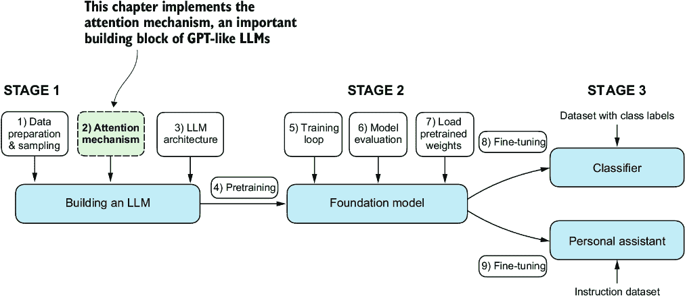

##### 图 3.1 编码 LLM 的三个主要阶段。本章重点介绍第一阶段第二步：实现注意力机制，这是 LLM 架构的组成部分。

我们将实现如图 3.2 所示的四种不同的注意力机制变体。这些不同的注意力变体相互构建，目标是达到一个紧凑且高效的多头注意力实现，然后我们可以将其插入到我们在下一章中编码的 LLM 架构中。


##### 图 3.2 该图展示了本章我们将编码的不同注意力机制，从简化的自注意力版本开始，然后添加可训练的权重。因果注意力机制为自注意力添加了一个掩码，允许 LLM 一次生成一个单词。最后，多头注意力将注意力机制组织成多个头，允许模型并行捕获输入数据的各个方面。

## 3.1 模型长序列的问题

在我们深入探讨 LLM 核心的*自注意力*机制之前，让我们考虑一下不包含注意力机制的预 LLM 架构的问题。假设我们想要开发一个语言翻译模型，将文本从一种语言翻译成另一种语言。如图 3.3 所示，由于源语言和目标语言的语法结构，我们不能简单地逐词翻译文本。

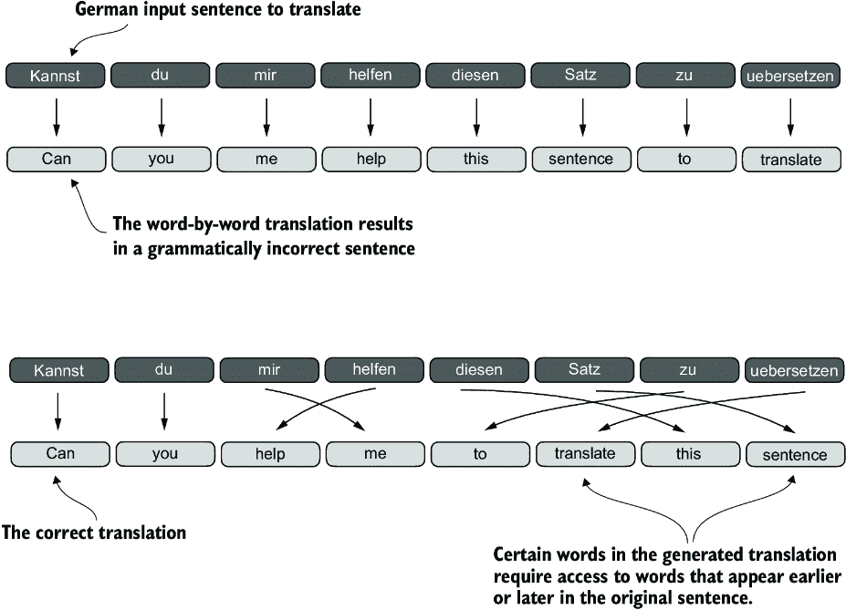

##### 图 3.3 当将文本从一种语言翻译成另一种语言，例如从德语翻译成英语时，不能仅仅逐词翻译。相反，翻译过程需要上下文理解和语法对齐。

为了解决这个问题，通常使用一个具有两个子模块的深度神经网络，一个*编码器*和一个*解码器*。编码器的任务是首先读取并处理整个文本，然后解码器生成翻译后的文本。

在变压器出现之前，*循环神经网络*（RNNs）是语言翻译中最受欢迎的编码器-解码器架构。RNN 是一种神经网络，其中前一步的输出被作为当前步骤的输入，这使得它们非常适合像文本这样的顺序数据。如果你对 RNN 不熟悉，不用担心——你不需要了解 RNN 的详细工作原理来跟随这次讨论；我们在这里更关注编码器-解码器设置的一般概念。

在编码器-解码器 RNN 中，输入文本被输入到编码器中，编码器按顺序处理它。编码器在每一步更新其隐藏状态（隐藏层的内部值），试图在最终的隐藏状态中捕获输入句子的整个含义，如图 3.4 所示。然后，解码器使用这个最终的隐藏状态开始生成翻译句子，一次一个单词。它也在每一步更新其隐藏状态，这个状态应该携带进行下一个单词预测所需的上下文。


##### 图 3.4 在变压器模型出现之前，编码器-解码器 RNN 是机器翻译的一个流行选择。编码器接收源语言的一序列标记作为输入，其中编码器的隐藏状态（一个中间神经网络层）编码了整个输入序列的压缩表示。然后，解码器使用其当前的隐藏状态开始逐个标记进行翻译。

虽然我们不需要了解这些编码器-解码器 RNN 的内部工作原理，但这里的关键思想是，编码器部分将整个输入文本处理成一个隐藏状态（记忆单元）。然后，解码器接收这个隐藏状态以生成输出。你可以将这个隐藏状态视为一个嵌入向量，这是我们第二章讨论的概念。

编码器-解码器 RNN 的一个重大限制是，RNN 在解码阶段不能直接访问编码器中的早期隐藏状态。因此，它完全依赖于当前的隐藏状态，该状态封装了所有相关信息。这可能导致上下文丢失，尤其是在复杂句子中，其中依赖关系可能跨越很长的距离。

幸运的是，构建一个 LLM 并不需要理解 RNN。只需记住，编码器-解码器 RNN 有一个不足之处，这促使了注意力机制的设计。

## 3.2 使用注意力机制捕获数据依赖

虽然 RNN 对于翻译短句效果不错，但它们对于较长的文本效果不佳，因为它们无法直接访问输入中的先前单词。这种方法的重大不足在于，RNN 必须在传递给解码器之前，在单个隐藏状态中记住整个编码输入（图 3.4）。

因此，研究人员在 2014 年为 RNN 开发了*Bahdanau 注意力*机制（以该论文的第一作者命名；更多信息，见附录 B），该机制修改了编码器-解码器 RNN，使得解码器可以在每个解码步骤中选择性访问输入序列的不同部分，如图 3.5 所示。

自注意力是一种机制，允许输入序列中的每个位置在计算序列表示时考虑同一序列中所有其他位置的相关性或“关注”。自注意力是当代基于 transformer 架构的 LLM（如 GPT 系列）的关键组件。

##### 使用注意力机制，网络中生成文本的解码器部分可以选择性访问所有输入标记。这意味着对于生成给定输出标记，某些输入标记比其他标记更重要。重要性由注意力权重决定，我们将在后面计算。请注意，此图展示了注意力背后的基本思想，并不描绘 Bahdanau 机制的确切实现，该机制是本书范围之外的 RNN 方法。

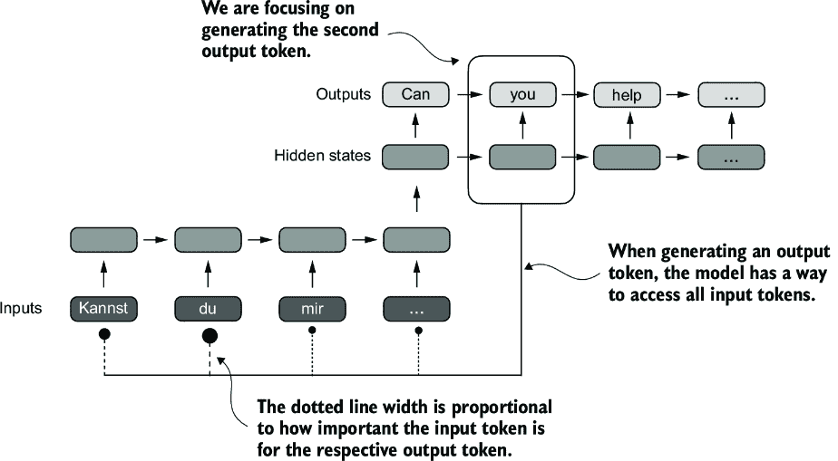


本章重点介绍编码和理解 GPT 类模型中使用的自注意力机制，如图 3.6 所示。在下一章中，我们将编写 LLM 的剩余部分。

在自注意力中，“self”指的是该机制通过关联单个输入序列内的不同位置来计算注意力权重的能力。它评估和学习输入本身各部分之间的关系和依赖性，例如句子中的单词或图像中的像素。

##### 

## 3.3 使用自注意力关注输入的不同部分

我们现在将探讨自注意力机制的内部工作原理，并学习如何从头开始编写它的代码。自注意力是每个基于 transformer 架构的 LLM 的基石。这个主题可能需要大量的关注和注意（无意中打趣），但一旦你掌握了它的基础，你将征服这本书和 LLM 实现的一般性中最具挑战性的方面之一。

##### 有趣的是，仅仅三年后，研究人员发现构建用于自然语言处理的深度神经网络不需要 RNN 架构，并提出了原始的*transformer*架构（在第一章中讨论），包括一个受 Bahdanau 注意力机制启发的自注意力机制。

自注意力中的“self”

这与传统注意力机制形成对比，传统注意力机制关注的是两个不同序列元素之间的关系，例如在序列到序列模型中，注意力可能是在输入序列和输出序列之间，如图 3.5 所示。

由于自注意力可能看起来很复杂，尤其是如果你第一次遇到它，我们将首先检查它的简化版本。然后我们将实现 LLMs 中使用的带有可训练权重的自注意力机制。

### 3.3.1 无可训练权重的简单自注意力机制

让我们从实现一个简化的自注意力变体开始，如图 3.7 所示，这个变体不包含任何可训练的权重。目标是先展示自注意力的一些关键概念，然后再添加可训练的权重。

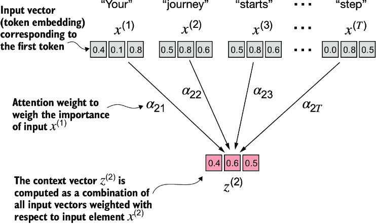

##### 图 3.7 自注意力的目标是计算每个输入元素的一个上下文向量，该向量结合了所有其他输入元素的信息。在这个例子中，我们计算上下文向量 z^((2))。每个输入元素对于计算 z^((2))的重要性或贡献由注意力权重 a[21]到 a[2T]决定。在计算 z^((2))时，注意力权重是根据输入元素 x^((2))和所有其他输入计算的。

图 3.7 展示了输入序列，用*x*表示，由*T*个元素组成，表示为*x*(1)到*x*(T)。这个序列通常代表文本，例如一个句子，它已经被转换成标记嵌入。

例如，考虑一个输入文本如“Your journey starts with one step.”在这种情况下，序列中的每个元素，如*x*(1)，对应一个*d*-维嵌入向量，代表一个特定的标记，如“Your。”图 3.7 展示了这些输入向量作为三维嵌入。

在自注意力中，我们的目标是计算输入序列中每个元素*x*(i)的上下文向量*z*(i)。上下文向量可以解释为一个丰富的嵌入向量。

为了说明这个概念，让我们关注第二个输入元素*x*(2)（对应标记“journey”）及其相应的上下文向量*z*(2)，如图 3.7 底部所示。这个增强的上下文向量*z*(2)是一个包含关于*x*(2)和所有其他输入元素*x*(1)到*x*(T)信息的嵌入。

上下文向量在自注意力机制中起着至关重要的作用。它们的目的是通过结合序列（如句子）中所有其他元素的信息，为输入序列中的每个元素（如单词）创建丰富的表示（如图 3.7 所示）。这对于 LLMs（大型语言模型）至关重要，因为 LLMs 需要理解句子中单词之间的关系和相关性。稍后，我们将添加可训练的权重，帮助 LLM 学习构建这些上下文向量，以便它们对 LLM 生成下一个标记相关。但首先，让我们实现一个简化的自注意力机制，逐步计算这些权重和结果上下文向量。

考虑以下已经嵌入为三维向量的输入句子（参见第二章）。我选择了一个小的嵌入维度，以确保它可以在不换行的情况下适应页面：

```py
import torch
inputs = torch.tensor(
  [[0.43, 0.15, 0.89], # Your     (x¹)
   [0.55, 0.87, 0.66], # journey  (x²)
   [0.57, 0.85, 0.64], # starts   (x³)
   [0.22, 0.58, 0.33], # with     (x⁴)
   [0.77, 0.25, 0.10], # one      (x⁵)
   [0.05, 0.80, 0.55]] # step     (x⁶)
)
```

实现自注意力的第一步是计算中间值 w，称为注意力分数，如图 3.8 所示。由于空间限制，图中的值以截断版本显示前一个`inputs`张量的值；例如，0.87 被截断为 0.8。在这个截断版本中，单词“journey”和“starts”的嵌入可能由于随机机会而看起来相似。

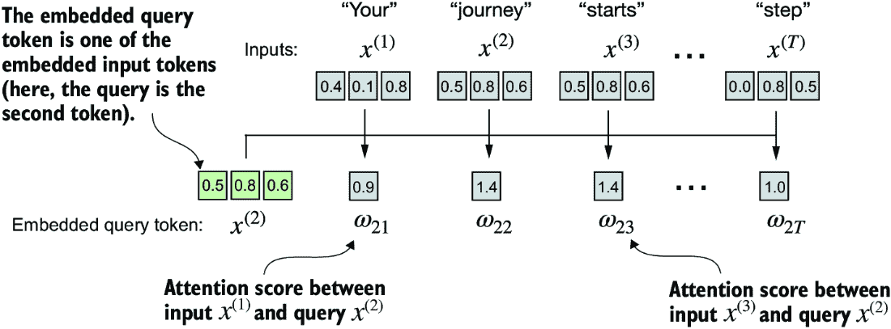

##### 图 3.8 整体目标是说明使用第二个输入元素 x^((2))作为查询计算上下文向量 z^((2))的过程。此图显示了第一个中间步骤，即计算查询 x^((2))与所有其他输入元素之间的注意力分数 w，作为点积。 （注意，数字被截断到小数点后一位，以减少视觉混乱。）

图 3.8 说明了我们如何计算查询标记和每个输入标记之间的中间注意力分数。我们通过计算查询*x*(2)与每个其他输入标记的点积来确定这些分数：

```py
query = inputs[1]                            #1
attn_scores_2 = torch.empty(inputs.shape[0])
for i, x_i in enumerate(inputs):
    attn_scores_2[i] = torch.dot(x_i, query)
print(attn_scores_2)
```

#1 第二个输入标记作为查询。

计算出的注意力分数是

```py
tensor([0.9544, 1.4950, 1.4754, 0.8434, 0.7070, 1.0865])
```

##### 理解点积

点积本质上是一种简洁地逐元素乘以两个向量并求和其乘积的方法，如下所示：

```py
res = 0.
for idx, element in enumerate(inputs[0]):
    res += inputs[0][idx] * query[idx]
print(res)
print(torch.dot(inputs[0], query))
```

输出确认了逐元素乘积的总和与点积给出相同的结果：

```py
tensor(0.9544)
tensor(0.9544)
```

除了将点积操作视为结合两个向量以产生标量值的数学工具之外，点积是相似度的度量，因为它量化了两个向量对齐的紧密程度：点积越高，向量之间的对齐或相似度就越高。在自注意力机制的情况下，点积决定了序列中每个元素对其他元素的关注程度或“注意”程度：点积越高，两个元素之间的相似度和注意力分数就越高。

在下一步中，如图 3.9 所示，我们对之前计算的所有注意力分数进行归一化。归一化的主要目标是获得总和为 1 的注意力权重。这种归一化是一种对解释和维持 LLM 训练稳定性的有用惯例。以下是一种实现这一归一化步骤的简单方法：

```py
attn_weights_2_tmp = attn_scores_2 / attn_scores_2.sum()
print("Attention weights:", attn_weights_2_tmp)
print("Sum:", attn_weights_2_tmp.sum())
```

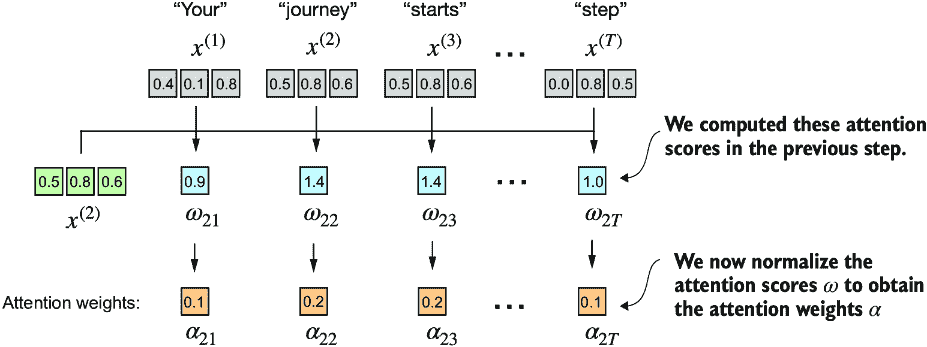

##### 图 3.9 在根据输入查询 x^((2))计算注意力分数 w[21]到 w[2T]之后，下一步是通过对注意力分数进行归一化来获得注意力权重 a[21]到 a[2T]。

如输出所示，注意力权重现在总和为 1：

```py
Attention weights: tensor([0.1455, 0.2278, 0.2249, 0.1285, 0.1077, 0.1656])
Sum: tensor(1.0000)
```

在实践中，更常见且建议使用 softmax 函数进行归一化。这种方法在处理极端值时表现更好，并且在训练期间提供了更有利的梯度属性。以下是对注意力分数进行归一化的 softmax 函数的基本实现：

```py
def softmax_naive(x):
    return torch.exp(x) / torch.exp(x).sum(dim=0)

attn_weights_2_naive = softmax_naive(attn_scores_2)
print("Attention weights:", attn_weights_2_naive)
print("Sum:", attn_weights_2_naive.sum())
```

如输出所示，softmax 函数也达到了目标，并归一化了注意力权重，使得它们的总和为 1：

```py
Attention weights: tensor([0.1385, 0.2379, 0.2333, 0.1240, 0.1082, 0.1581])
Sum: tensor(1.)
```

此外，softmax 函数确保注意力权重始终为正。这使得输出可解释为概率或相对重要性，其中较高的权重表示更大的重要性。

注意，这种原始的 softmax 实现（`softmax_naive`）在处理大或小输入值时可能会遇到数值不稳定性问题，如溢出和下溢。因此，在实践中，建议使用经过广泛优化的 PyTorch softmax 实现：

```py
attn_weights_2 = torch.softmax(attn_scores_2, dim=0)
print("Attention weights:", attn_weights_2)
print("Sum:", attn_weights_2.sum())
```

在这种情况下，它产生了与我们的先前`softmax_naive`函数相同的结果：

```py
Attention weights: tensor([0.1385, 0.2379, 0.2333, 0.1240, 0.1082, 0.1581])
Sum: tensor(1.)
```

现在我们已经计算了归一化的注意力权重，我们准备进行最终步骤，如图 3.10 所示：通过将嵌入输入标记*x*(i)与相应的注意力权重相乘，然后求和得到的向量来计算上下文向量*z*(2)。因此，上下文向量*z*(2)是所有输入向量的加权总和，通过将每个输入向量乘以其相应的注意力权重得到：

```py
query = inputs[1]         #1
context_vec_2 = torch.zeros(query.shape)
for i,x_i in enumerate(inputs):
    context_vec_2 += attn_weights_2[i]*x_i
print(context_vec_2)
```

#1 第二个输入标记是查询。

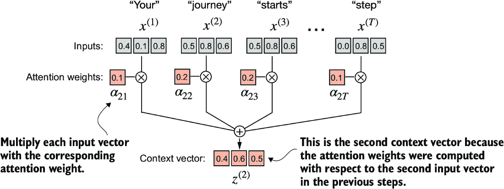

##### 图 3.10 最终步骤，在计算并归一化注意力分数以获得查询 x^((2))的注意力权重之后，是计算上下文向量 z^((2))。这个上下文向量是所有输入向量 x^((1))到 x^(^(*T *)^)的加权组合，权重由注意力权重决定。

此计算的结果是

```py
tensor([0.4419, 0.6515, 0.5683])
```

接下来，我们将将计算上下文向量的这一过程推广，以同时计算所有上下文向量。

### 3.3.2 计算所有输入标记的注意力权重

到目前为止，我们已经计算了输入 2 的注意力权重和上下文向量，如图 3.11 中高亮显示的行所示。现在让我们扩展这个计算，以计算所有输入的注意力权重和上下文向量。


##### 图 3.11 高亮行显示了作为查询的第二输入元素的注意力权重。现在我们将计算推广到获得所有其他注意力权重。（请注意，此图中的数字被截断到小数点后两位，以减少视觉杂乱。每行的值应加起来为 1.0 或 100%。）

我们遵循之前相同的三个步骤（见图 3.12），只是在代码中做了一些修改，以计算所有上下文向量而不是仅计算第二个向量 *z*(2)：

```py
attn_scores = torch.empty(6, 6)
for i, x_i in enumerate(inputs):
    for j, x_j in enumerate(inputs):
        attn_scores[i, j] = torch.dot(x_i, x_j)
print(attn_scores)
```

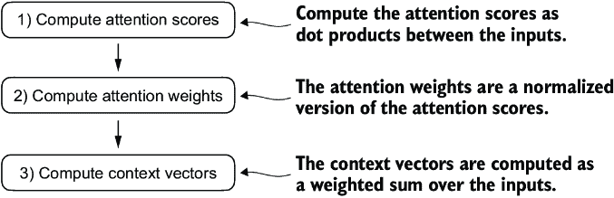

##### 图 3.12 在第 1 步中，我们添加了一个额外的 `for` 循环来计算所有输入对之间的点积。

结果注意力分数如下：

```py
tensor([[0.9995, 0.9544, 0.9422, 0.4753, 0.4576, 0.6310],
        [0.9544, 1.4950, 1.4754, 0.8434, 0.7070, 1.0865],
        [0.9422, 1.4754, 1.4570, 0.8296, 0.7154, 1.0605],
        [0.4753, 0.8434, 0.8296, 0.4937, 0.3474, 0.6565],
        [0.4576, 0.7070, 0.7154, 0.3474, 0.6654, 0.2935],
        [0.6310, 1.0865, 1.0605, 0.6565, 0.2935, 0.9450]])
```

张量中的每个元素代表每对输入之间的注意力分数，正如我们在图 3.11 中看到的。请注意，图中的值是归一化的，这就是为什么它们与前面张量中的未归一化注意力分数不同。我们将在稍后处理归一化。

在计算前面的注意力分数张量时，我们使用了 Python 中的 `for` 循环。然而，`for` 循环通常较慢，我们可以通过矩阵乘法达到相同的结果：

```py
attn_scores = inputs @ inputs.T
print(attn_scores)
```

我们可以直观地确认结果与之前相同：

```py
tensor([[0.9995, 0.9544, 0.9422, 0.4753, 0.4576, 0.6310],
        [0.9544, 1.4950, 1.4754, 0.8434, 0.7070, 1.0865],
        [0.9422, 1.4754, 1.4570, 0.8296, 0.7154, 1.0605],
        [0.4753, 0.8434, 0.8296, 0.4937, 0.3474, 0.6565],
        [0.4576, 0.7070, 0.7154, 0.3474, 0.6654, 0.2935],
        [0.6310, 1.0865, 1.0605, 0.6565, 0.2935, 0.9450]])
```

在图 3.12 的第 2 步中，我们将每一行归一化，使得每行的值加起来为 1：

```py
attn_weights = torch.softmax(attn_scores, dim=-1)
print(attn_weights)
```

这返回以下与图 3.10 中显示的值相匹配的注意力权重张量：

```py
tensor([[0.2098, 0.2006, 0.1981, 0.1242, 0.1220, 0.1452],
        [0.1385, 0.2379, 0.2333, 0.1240, 0.1082, 0.1581],
        [0.1390, 0.2369, 0.2326, 0.1242, 0.1108, 0.1565],
        [0.1435, 0.2074, 0.2046, 0.1462, 0.1263, 0.1720],
        [0.1526, 0.1958, 0.1975, 0.1367, 0.1879, 0.1295],
        [0.1385, 0.2184, 0.2128, 0.1420, 0.0988, 0.1896]])
```

在使用 PyTorch 的上下文中，函数如 `torch.softmax` 中的 dim 参数指定了函数将在哪个维度上对输入张量进行计算。通过设置 `dim=-1`，我们指示 `softmax` 函数在 `attn_scores` 张量的最后一个维度上应用归一化。如果 `attn_scores` 是一个二维张量（例如，形状为 [rows, columns]），它将在列上归一化，使得每行的值（在列维度上求和）加起来为 1。

我们可以验证行确实都加起来为 1：

```py
row_2_sum = sum([0.1385, 0.2379, 0.2333, 0.1240, 0.1082, 0.1581])
print("Row 2 sum:", row_2_sum)
print("All row sums:", attn_weights.sum(dim=-1))
```

结果是

```py
Row 2 sum: 1.0
All row sums: tensor([1.0000, 1.0000, 1.0000, 1.0000, 1.0000, 1.0000])
```

在图 3.12 的第三和最后一步中，我们使用这些注意力权重通过矩阵乘法计算所有上下文向量：

```py
all_context_vecs = attn_weights @ inputs
print(all_context_vecs)
```

在结果输出张量中，每一行包含一个三维上下文向量：

```py
tensor([[0.4421, 0.5931, 0.5790],
        [0.4419, 0.6515, 0.5683],
        [0.4431, 0.6496, 0.5671],
        [0.4304, 0.6298, 0.5510],
        [0.4671, 0.5910, 0.5266],
        [0.4177, 0.6503, 0.5645]])
```

我们可以通过将第二行与我们在 3.3.1 节中计算的上下文向量 *z*^((2)) 进行比较来双重检查代码的正确性：

```py
print("Previous 2nd context vector:", context_vec_2)
```

根据结果，我们可以看到之前计算的 `context_vec_2` 与前面张量的第二行完全匹配：

```py
Previous 2nd context vector: tensor([0.4419, 0.6515, 0.5683])
```

这完成了简单自注意力机制的代码讲解。接下来，我们将添加可训练权重，使 LLM 能够从数据中学习并提高其在特定任务上的性能。

## 3.4 使用可训练权重实现自注意力

我们接下来的步骤将是实现原始变压器架构、GPT 模型以及大多数其他流行的 LLMs 中使用的自注意力机制。这种自注意力机制也称为*缩放点积注意力*。图 3.13 展示了这种自注意力机制如何融入实现 LLM 的更广泛背景中。

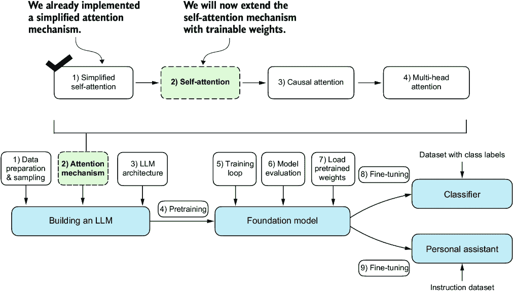

##### 图 3.13 之前，我们编写了一个简化的注意力机制来理解注意力机制背后的基本机制。现在，我们向这个注意力机制添加可训练权重。稍后，我们将通过添加因果掩码和多个头扩展这种自注意力机制。

如图 3.13 所示，具有可训练权重的自注意力机制建立在先前概念之上：我们希望计算特定输入元素的输入向量上的加权求和作为上下文向量。您将看到，与之前编写的简单自注意力机制相比，只有细微的差异。

最显著的区别是引入了在模型训练期间更新的权重矩阵。这些可训练权重矩阵对于模型（特别是模型内的注意力模块）能够学会产生“良好”的上下文向量至关重要。（我们将在第五章训练 LLM。）

我们将在两个小节中处理这种自注意力机制。首先，我们将像以前一样逐步编码它。其次，我们将代码组织成一个紧凑的 Python 类，可以导入到 LLM 架构中。

### 3.4.1 逐步计算注意力权重

我们将通过引入三个可训练权重矩阵*W*[q]、*W*[k]和*W*[v]逐步实现自注意力机制。这三个矩阵用于将嵌入输入标记*x*^((i))分别投影到查询、键和值向量，如图 3.14 所示。


##### 图 3.14 在具有可训练权重矩阵的自注意力机制的第一步中，我们为输入元素 x 计算查询(q)、键(k)和值(v)向量。与前面的章节类似，我们将第二个输入 x^((2))指定为查询输入。查询向量 q^((2))是通过输入 x^((2))与权重矩阵 W[q]之间的矩阵乘法获得的。同样，我们通过涉及权重矩阵 W[k]和 W[v]的矩阵乘法获得键和值向量。

之前，当我们计算简化注意力权重以计算上下文向量*z*^((2))时，我们将第二个输入元素*x*^((2))定义为查询。然后我们将其推广到计算六个单词输入句子“Your journey starts with one step.”的所有上下文向量*z*^((1)) *... z*^((T))。

同样，我们在这里仅为了说明目的计算一个上下文向量*z*^((2))。然后我们将修改此代码以计算所有上下文向量。

让我们从定义几个变量开始：

```py
x_2 = inputs[1]     #1
d_in = inputs.shape[1]      #2
d_out = 2         #3
```

#1 第二个输入元素

#2 输入嵌入大小，d=3

#3 输出嵌入大小，d_out=2

注意，在 GPT-like 模型中，输入和输出维度通常是相同的，但为了更好地跟踪计算，我们在这里使用不同的输入（`d_in=3`）和输出（`d_out=2`）维度。

接下来，我们初始化图 3.14 中显示的三个权重矩阵 *W*[q]、*W*[k] 和 *W*[v]：

```py
torch.manual_seed(123)
W_query = torch.nn.Parameter(torch.rand(d_in, d_out), requires_grad=False)
W_key   = torch.nn.Parameter(torch.rand(d_in, d_out), requires_grad=False)
W_value = torch.nn.Parameter(torch.rand(d_in, d_out), requires_grad=False)
```

我们将 `requires_grad=False` 设置为减少输出中的杂乱，但如果我们要使用权重矩阵进行模型训练，我们将在模型训练期间将这些矩阵设置为 `requires_grad=True` 以更新这些矩阵。

接下来，我们计算查询、键和值向量：

```py
query_2 = x_2 @ W_query 
key_2 = x_2 @ W_key 
value_2 = x_2 @ W_value
print(query_2)
```

由于我们通过`d_out`设置了相应权重矩阵的列数为 2，查询结果输出为一个二维向量：

```py
tensor([0.4306, 1.4551])
```

##### 权重参数与注意力权重对比

在权重矩阵 *W* 中，“权重”一词是“权重参数”的简称，这些参数是神经网络在训练过程中优化的值。这不同于注意力权重。正如我们之前看到的，注意力权重决定了上下文向量依赖于输入的不同部分的程度（即网络在多大程度上关注输入的不同部分）。

总结来说，权重参数是定义网络连接的基本、学习系数，而注意力权重是动态的、上下文特定的值。

尽管我们的临时目标只是计算一个上下文向量，*z*^((2))，但我们仍然需要所有输入元素的键和值向量，因为它们涉及到计算与查询 *q*^((2)) 相关的注意力权重（见图 3.14）。

我们可以通过矩阵乘法获得所有键和值：

```py
keys = inputs @ W_key 
values = inputs @ W_value
print("keys.shape:", keys.shape)
print("values.shape:", values.shape)
```

从输出中我们可以看出，我们成功地将六个输入标记从三维投影到二维嵌入空间：

```py
keys.shape: torch.Size([6, 2])
values.shape: torch.Size([6, 2])
```

第二步是计算注意力分数，如图 3.15 所示。

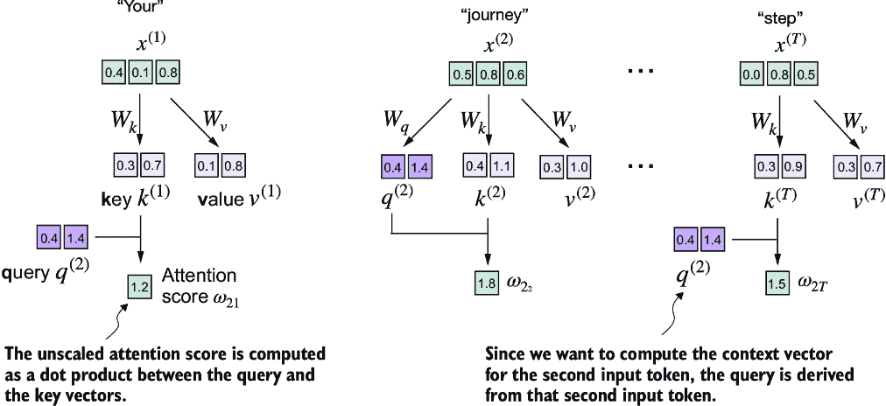

##### 图 3.15 注意力分数的计算是一种点积计算，类似于我们在 3.3 节中使用的简化自注意力机制。这里的新特点是，我们不是直接计算输入元素之间的点积，而是使用通过各自的权重矩阵变换得到的查询和键。

首先，让我们计算注意力分数 ω[22]：

```py
keys_2 = keys[1]             #1
attn_score_22 = query_2.dot(keys_2)
print(attn_score_22)
```

#1 记住 Python 从 0 开始索引。

未归一化的注意力分数结果为

```py
tensor(1.8524)
```

同样，我们可以通过矩阵乘法将此计算推广到所有注意力分数：

```py
attn_scores_2 = query_2 @ keys.T       #1
print(attn_scores_2)
```

#1 给定查询的所有注意力分数

如我们所见，作为一个快速检查，输出中的第二个元素与我们之前计算的`attn_score_22`相匹配：

```py
tensor([1.2705, 1.8524, 1.8111, 1.0795, 0.5577, 1.5440])
```

现在，我们想要从注意力分数转换到注意力权重，如图 3.16 所示。我们通过缩放注意力分数并使用 softmax 函数来计算注意力权重。然而，现在我们通过将注意力分数除以键的嵌入维度的平方根来缩放注意力分数（取平方根在数学上等同于 0.5 次幂）：

```py
d_k = keys.shape[-1]
attn_weights_2 = torch.softmax(attn_scores_2 / d_k**0.5, dim=-1)
print(attn_weights_2)
```


##### 图 3.16 计算完注意力分数 ω 后，下一步是使用 softmax 函数对这些分数进行归一化，以获得注意力权重 𝛼。

结果的注意力权重如下：

```py
tensor([0.1500, 0.2264, 0.2199, 0.1311, 0.0906, 0.1820])
```

##### 缩放点积注意力的原理

通过嵌入维度大小进行归一化的原因是通过避免小的梯度来提高训练性能。例如，当放大嵌入维度时，对于类似 GPT 的 LLM，这通常大于 1,000，由于应用了 softmax 函数，大点积在反向传播期间可能导致非常小的梯度。随着点积的增加，softmax 函数表现得越来越像阶跃函数，导致梯度接近零。这些小的梯度可以极大地减慢学习速度或导致训练停滞。

通过嵌入维度的平方根进行缩放是为什么这种自注意力机制也被称为缩放点积注意力。

现在，最终步骤是计算上下文向量，如图 3.17 所示。


##### 图 3.17 在自注意力计算的最终步骤中，我们通过结合所有值向量并通过注意力权重来计算上下文向量。

类似于我们计算上下文向量作为输入向量的加权求和（参见第 3.3 节），我们现在将上下文向量计算为值向量的加权求和。在这里，注意力权重作为加权因子，衡量每个值向量的重要性。同样，正如之前一样，我们可以使用矩阵乘法一步获得输出：

```py
context_vec_2 = attn_weights_2 @ values
print(context_vec_2)
```

结果向量的内容如下：

```py
tensor([0.3061, 0.8210])
```

到目前为止，我们只计算了一个上下文向量，*z*^((2))。接下来，我们将通用代码来计算输入序列中的所有上下文向量，*z*^((1)) 到 *z*^((T))。

##### 为什么是查询、键和值？

在注意力机制中，“键”、“查询”和“值”这些术语是从信息检索和数据库领域借用的，在这些领域中，类似的概念用于存储、搜索和检索信息。

一个 *查询* 类似于数据库中的搜索查询。它代表模型当前关注或试图理解的项目（例如，句子中的一个词或标记）。查询用于探测输入序列的其他部分，以确定对它们的注意力程度。

*键*类似于数据库键，用于索引和搜索。在注意力机制中，输入序列中的每个项目（例如，句子中的每个单词）都有一个相关的键。这些键用于匹配查询。

在这个上下文中，*值*类似于数据库中的键值对中的值。它表示输入项目的实际内容或表示。一旦模型确定哪些键（以及因此哪些输入部分）与查询（当前焦点项）最相关，它就会检索相应的值。

### 3.4.2 实现紧凑的自注意力 Python 类

在这个阶段，我们已经走过了许多步骤来计算自注意力输出。我们这样做主要是为了说明目的，以便我们可以一步一步地进行。在实践中，考虑到下一章中 LLM 的实现，将此代码组织成一个 Python 类是有帮助的，如下所示。

##### 列表 3.1 紧凑的自注意力类

```py
import torch.nn as nn
class SelfAttention_v1(nn.Module):
    def __init__(self, d_in, d_out):
        super().__init__()
        self.W_query = nn.Parameter(torch.rand(d_in, d_out))
        self.W_key   = nn.Parameter(torch.rand(d_in, d_out))
        self.W_value = nn.Parameter(torch.rand(d_in, d_out))

    def forward(self, x):
        keys = x @ self.W_key
        queries = x @ self.W_query
        values = x @ self.W_value
        attn_scores = queries @ keys.T # omega
        attn_weights = torch.softmax(
            attn_scores / keys.shape[-1]**0.5, dim=-1
        )
        context_vec = attn_weights @ values
        return context_vec
```

在此 PyTorch 代码中，`SelfAttention_v1`是一个从`nn.Module`派生的类，它是 PyTorch 模型的基本构建块，为模型层创建和管理提供必要的功能。

`__init__`方法初始化查询、键和值的可训练权重矩阵（`W_query`、`W_key`和`W_value`），每个矩阵将输入维度`d_in`转换为输出维度`d_out`。

在前向传播过程中，使用前向方法，我们通过乘以查询和键来计算注意力分数（`attn_scores`），使用 softmax 对这些分数进行归一化。最后，我们通过使用这些归一化的注意力分数来加权值，创建一个上下文向量。

我们可以使用此类如下：

```py
torch.manual_seed(123)
sa_v1 = SelfAttention_v1(d_in, d_out)
print(sa_v1(inputs))
```

由于`inputs`包含六个嵌入向量，这导致存储六个上下文向量的矩阵：

```py
tensor([[0.2996, 0.8053],
        [0.3061, 0.8210],
        [0.3058, 0.8203],
        [0.2948, 0.7939],
        [0.2927, 0.7891],
        [0.2990, 0.8040]], grad_fn=<MmBackward0>)
```

作为快速检查，请注意，第二行（`[0.3061,` `0.8210]`）与上一节中的`context_vec_2`的内容相匹配。图 3.18 总结了我们刚刚实现的自注意力机制。

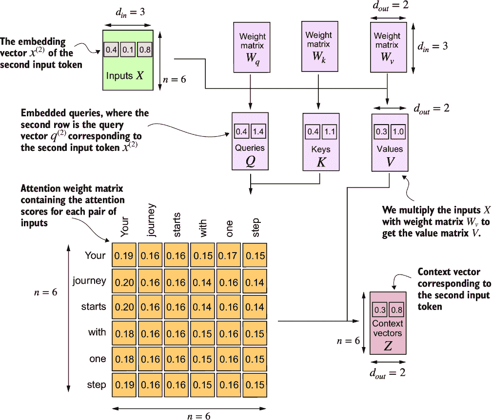

##### 图 3.18 在自注意力中，我们使用三个权重矩阵 W[q]、W[k]和 W[v]将输入矩阵 X 中的输入向量进行转换。然后我们根据生成的查询（Q）和键（K）计算注意力权重矩阵。使用注意力权重和值（V），然后计算上下文向量（Z）。为了视觉清晰，我们关注单个输入文本 n 个标记，而不是多个输入的批次。因此，在这个上下文中，三维输入张量简化为二维矩阵。这种方法允许更直观地可视化和理解涉及的过程。为了与后续的图保持一致，注意力矩阵中的值不表示真实的注意力权重。（此图中的数字被截断到小数点后两位以减少视觉杂乱。每行的值应加起来为 1.0 或 100%。）

自注意力机制涉及可训练的权重矩阵 *W*[q]、*W*[k] 和 *W*[v]。这些矩阵将输入数据转换为查询、键和值，分别是注意力机制的关键组成部分。随着模型在训练过程中接触到更多数据，它会调整这些可训练的权重，我们将在接下来的章节中看到这一点。

我们可以通过利用 PyTorch 的 `nn.Linear` 层进一步改进 `SelfAttention_v1` 的实现，这些层在禁用偏置单元时有效地执行矩阵乘法。此外，使用 `nn.Linear` 而不是手动实现 `nn.Parameter(torch.rand(...))` 的一个显著优点是 `nn.Linear` 具有优化的权重初始化方案，有助于更稳定和有效的模型训练。

##### 列表 3.2 使用 PyTorch 线性层的自注意力类

```py
class SelfAttention_v2(nn.Module):
    def __init__(self, d_in, d_out, qkv_bias=False):
        super().__init__()
        self.W_query = nn.Linear(d_in, d_out, bias=qkv_bias)
        self.W_key   = nn.Linear(d_in, d_out, bias=qkv_bias)
        self.W_value = nn.Linear(d_in, d_out, bias=qkv_bias)

    def forward(self, x):
        keys = self.W_key(x)
        queries = self.W_query(x)
        values = self.W_value(x)
        attn_scores = queries @ keys.T
        attn_weights = torch.softmax(
            attn_scores / keys.shape[-1]**0.5, dim=-1
        )
        context_vec = attn_weights @ values
        return context_vec
```

你可以使用 `SelfAttention_v2` 类似于 `SelfAttention_v1`：

```py
torch.manual_seed(789)
sa_v2 = SelfAttention_v2(d_in, d_out)
print(sa_v2(inputs))
```

输出是

```py
tensor([[-0.0739,  0.0713],
        [-0.0748,  0.0703],
        [-0.0749,  0.0702],
        [-0.0760,  0.0685],
        [-0.0763,  0.0679],
        [-0.0754,  0.0693]], grad_fn=<MmBackward0>)
```

注意，`SelfAttention_v1` 和 `SelfAttention_v2` 给出不同的输出，因为它们使用不同的初始权重进行权重矩阵的初始化，而 `nn.Linear` 使用了更复杂的权重初始化方案。

##### 练习 3.1 比较 SelfAttention_v1 和 SelfAttention_v2

注意，`SelfAttention_v2` 中的 `nn.Linear` 使用了与 `SelfAttention_v1` 中使用的 `nn.Parameter(torch.rand(d_in, d_out))` 不同的权重初始化方案，这导致两种机制产生不同的结果。为了验证 `SelfAttention_v1` 和 `SelfAttention_v2` 这两种实现方式在其他方面是相似的，我们可以将 `SelfAttention_v2` 对象的权重矩阵转移到 `SelfAttention_v1` 对象中，这样两个对象就会产生相同的结果。

你的任务是正确地将 `SelfAttention_v2` 实例的权重分配给 `SelfAttention_v1` 实例。为此，你需要理解两个版本中权重之间的关系。（提示：`nn.Linear` 以转置形式存储权重矩阵。）分配后，你应该观察到两个实例产生相同的输出。

接下来，我们将对自注意力机制进行改进，重点关注引入因果和多头元素。因果方面涉及修改注意力机制，以防止模型访问序列中的未来信息，这对于像语言模型这样的任务至关重要，其中每个单词预测应该只依赖于前面的单词。

多头组件涉及将注意力机制分割成多个“头”。每个头学习数据的不同方面，允许模型在不同的位置同时关注来自不同表示子空间的信息。这提高了模型在复杂任务中的性能。

## 3.5 使用因果注意力隐藏未来单词

对于许多 LLM 任务，你可能希望自注意力机制只考虑当前位置之前出现的标记，当预测序列中的下一个标记时。因果注意力，也称为*屏蔽注意力*，是一种特殊形式的自注意力。它限制模型在计算注意力得分时只考虑序列中的先前和当前输入。这与标准的自注意力机制形成对比，后者允许一次访问整个输入序列。

现在，我们将修改标准的自注意力机制，以创建一个*因果注意力*机制，这对于在后续章节中开发 LLM 至关重要。为了在类似 GPT 的 LLM 中实现这一点，对于每个处理的标记，我们将屏蔽掉输入文本中当前标记之后的未来标记，如图 3.19 所示。我们屏蔽掉对角线以上的注意力权重，并将非屏蔽的注意力权重归一化，使得每行的注意力权重总和为 1。稍后，我们将在代码中实现这个屏蔽和归一化过程。


##### 图 3.19 在因果注意力中，我们屏蔽掉对角线以上的注意力权重，这样对于给定的输入，LLM 在计算上下文向量时无法访问未来的标记。例如，对于第二行中的单词“journey”，我们只保留“Your”和当前位置“journey”的注意力权重。

### 3.5.1 应用因果注意力掩码

我们接下来的步骤是在代码中实现因果注意力掩码。为了实现将因果注意力掩码应用于获取掩码注意力权重，如图 3.20 所示，让我们使用上一节中的注意力得分和权重来编写因果注意力机制。

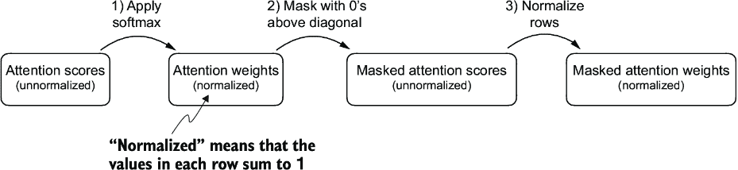

##### 图 3.20 在因果注意力中，通过应用 softmax 函数到注意力得分，将对角线以上的元素置零，并对结果矩阵进行归一化，这是一种获得掩码注意力权重矩阵的方法。

在第一步中，我们使用 softmax 函数计算注意力权重，就像我们之前做的那样：

```py
queries = sa_v2.W_query(inputs)     #1
keys = sa_v2.W_key(inputs) 
attn_scores = queries @ keys.T
attn_weights = torch.softmax(attn_scores / keys.shape[-1]**0.5, dim=-1)
print(attn_weights)
```

#1 重用上一节中 SelfAttention_v2 对象的查询和键权重矩阵以方便起见

这导致了以下注意力权重：

```py
tensor([[0.1921, 0.1646, 0.1652, 0.1550, 0.1721, 0.1510],
        [0.2041, 0.1659, 0.1662, 0.1496, 0.1665, 0.1477],
        [0.2036, 0.1659, 0.1662, 0.1498, 0.1664, 0.1480],
        [0.1869, 0.1667, 0.1668, 0.1571, 0.1661, 0.1564],
        [0.1830, 0.1669, 0.1670, 0.1588, 0.1658, 0.1585],
        [0.1935, 0.1663, 0.1666, 0.1542, 0.1666, 0.1529]],
       grad_fn=<SoftmaxBackward0>)
```

我们可以使用 PyTorch 的`tril`函数来实现第二步，创建一个对角线上方值为零的掩码：

```py
context_length = attn_scores.shape[0]
mask_simple = torch.tril(torch.ones(context_length, context_length))
print(mask_simple)
```

最终得到的掩码是

```py
tensor([[1., 0., 0., 0., 0., 0.],
        [1., 1., 0., 0., 0., 0.],
        [1., 1., 1., 0., 0., 0.],
        [1., 1., 1., 1., 0., 0.],
        [1., 1., 1., 1., 1., 0.],
        [1., 1., 1., 1., 1., 1.]])
```

现在，我们可以将这个掩码与注意力权重相乘，以屏蔽对角线以上的值：

```py
masked_simple = attn_weights*mask_simple
print(masked_simple)
```

如我们所见，对角线以上的元素已被成功置零：

```py
tensor([[0.1921, 0.0000, 0.0000, 0.0000, 0.0000, 0.0000],
        [0.2041, 0.1659, 0.0000, 0.0000, 0.0000, 0.0000],
        [0.2036, 0.1659, 0.1662, 0.0000, 0.0000, 0.0000],
        [0.1869, 0.1667, 0.1668, 0.1571, 0.0000, 0.0000],
        [0.1830, 0.1669, 0.1670, 0.1588, 0.1658, 0.0000],
        [0.1935, 0.1663, 0.1666, 0.1542, 0.1666, 0.1529]],
       grad_fn=<MulBackward0>)
```

第三步是将注意力权重重新归一化，使每行的总和再次为 1。我们可以通过将每行中的每个元素除以该行的总和来实现这一点：

```py
row_sums = masked_simple.sum(dim=-1, keepdim=True)
masked_simple_norm = masked_simple / row_sums
print(masked_simple_norm)
```

结果是一个注意力权重矩阵，其中对角线以上的注意力权重被置零，且每行的和为 1：

```py
tensor([[1.0000, 0.0000, 0.0000, 0.0000, 0.0000, 0.0000],
        [0.5517, 0.4483, 0.0000, 0.0000, 0.0000, 0.0000],
        [0.3800, 0.3097, 0.3103, 0.0000, 0.0000, 0.0000],
        [0.2758, 0.2460, 0.2462, 0.2319, 0.0000, 0.0000],
        [0.2175, 0.1983, 0.1984, 0.1888, 0.1971, 0.0000],
        [0.1935, 0.1663, 0.1666, 0.1542, 0.1666, 0.1529]],
       grad_fn=<DivBackward0>)
```

##### 信息泄露

当我们应用掩码并重新归一化注意力权重时，最初可能看起来未来标记（我们打算掩码）的信息仍然可能影响当前标记，因为它们的值是 softmax 计算的一部分。然而，关键洞察是，当我们对掩码后的注意力权重进行重新归一化时，我们实际上是在对更小的子集重新计算 softmax（因为掩码位置不贡献 softmax 值）。

Softmax 的数学优雅之处在于，尽管最初在分母中包含所有位置，但在掩码和重新归一化之后，掩码位置的影响被消除——它们不会以任何有意义的方式对 softmax 分数做出贡献。

用更简单的话说，在掩码和重新归一化之后，注意力权重的分布就像一开始只在对角线以上的位置计算一样。这确保了没有信息泄露到未来（或被掩码的）标记，正如我们打算的那样。

尽管我们可以在这一点上完成因果注意力的实现，但我们仍然可以改进它。让我们利用 softmax 函数的一个数学特性，并在图 3.21 中展示的更少的步骤中更高效地计算掩码注意力权重。

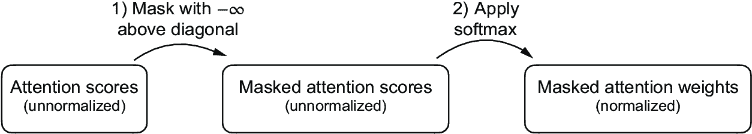

##### 图 3.21 在因果注意力中，获取掩码注意力权重矩阵的一种更高效的方法是在应用 softmax 函数之前用负无穷大值掩码注意力分数。

Softmax 函数将其输入转换为概率分布。当一行中存在负无穷大值（`-∞`）时，softmax 函数将其视为零概率。（从数学上讲，这是因为 *e*^(-∞) 趋近于 0。）

我们可以通过创建一个对角线以上的 1s 掩码，然后将这些 1s 替换为负无穷大（`-inf`）值来实现这个更高效的掩码“技巧”：

```py
mask = torch.triu(torch.ones(context_length, context_length), diagonal=1)
masked = attn_scores.masked_fill(mask.bool(), -torch.inf)
print(masked)
```

这导致了以下掩码：

```py
tensor([[0.2899,   -inf,   -inf,   -inf,   -inf,   -inf],
        [0.4656, 0.1723,   -inf,   -inf,   -inf,   -inf],
        [0.4594, 0.1703, 0.1731,   -inf,   -inf,   -inf],
        [0.2642, 0.1024, 0.1036, 0.0186,   -inf,   -inf],
        [0.2183, 0.0874, 0.0882, 0.0177, 0.0786,   -inf],
        [0.3408, 0.1270, 0.1290, 0.0198, 0.1290, 0.0078]],
       grad_fn=<MaskedFillBackward0>)
```

现在我们需要做的就是将这些掩码结果应用 softmax 函数，任务就完成了：

```py
attn_weights = torch.softmax(masked / keys.shape[-1]**0.5, dim=1)
print(attn_weights)
```

如输出所示，每行的值之和为 1，因此不需要进一步归一化：

```py
tensor([[1.0000, 0.0000, 0.0000, 0.0000, 0.0000, 0.0000],
        [0.5517, 0.4483, 0.0000, 0.0000, 0.0000, 0.0000],
        [0.3800, 0.3097, 0.3103, 0.0000, 0.0000, 0.0000],
        [0.2758, 0.2460, 0.2462, 0.2319, 0.0000, 0.0000],
        [0.2175, 0.1983, 0.1984, 0.1888, 0.1971, 0.0000],
        [0.1935, 0.1663, 0.1666, 0.1542, 0.1666, 0.1529]],
       grad_fn=<SoftmaxBackward0>)
```

我们现在可以使用修改后的注意力权重通过`context_vec` `=` `attn_weights` `@` `values`来计算上下文向量，正如 3.4 节中所述。然而，我们首先将介绍对因果注意力机制的一个小调整，这对于在训练 LLMs 时减少过拟合是有用的。

### 3.5.2 使用 dropout 掩码额外的注意力权重

深度学习中的*Dropout*是一种技术，在训练期间随机选择隐藏层单元被忽略，有效地“丢弃”它们。这种方法通过确保模型不会过度依赖任何特定的隐藏层单元集来帮助防止过拟合。重要的是要强调，dropout 仅在训练期间使用，并在之后被禁用。

在 transformer 架构中，包括 GPT 等模型，注意力机制中的 dropout 通常在两个特定时间应用：在计算注意力权重之后或应用注意力权重到值向量之后。在这里，我们将像图 3.22 所示的那样在计算注意力权重后应用 dropout 掩码，因为在实践中这是更常见的变体。


##### 图 3.22 使用因果注意力掩码（左上角），我们应用一个额外的 dropout 掩码（右上角）来置零更多的注意力权重，以减少训练过程中的过拟合。

在下面的代码示例中，我们使用 50%的 dropout 率，这意味着屏蔽掉一半的注意力权重。（当我们后续章节中训练 GPT 模型时，我们将使用较低的 dropout 率，如 0.1 或 0.2。）我们首先应用 PyTorch 的 dropout 实现到一个由 1 组成的 6×6 张量，以简化操作：

```py
torch.manual_seed(123)
dropout = torch.nn.Dropout(0.5)    #1
example = torch.ones(6, 6)      #2
print(dropout(example))
```

#1 我们选择 50%的 dropout 率。

#2 在这里，我们创建一个由 1 组成的矩阵。

如我们所见，大约一半的值被置零：

```py
tensor([[2., 2., 0., 2., 2., 0.],
        [0., 0., 0., 2., 0., 2.],
        [2., 2., 2., 2., 0., 2.],
        [0., 2., 2., 0., 0., 2.],
        [0., 2., 0., 2., 0., 2.],
        [0., 2., 2., 2., 2., 0.]])
```

当以 50%的比率对注意力权重矩阵应用 dropout 时，矩阵中一半的元素被随机设置为零。为了补偿活动元素数量的减少，矩阵中剩余元素的价值以 1/0.5 = 2 的因子放大。这种缩放对于保持注意力权重的整体平衡至关重要，确保在训练和推理阶段注意力机制的平均影响保持一致。

现在让我们将 dropout 应用于注意力权重矩阵本身：

```py
torch.manual_seed(123)
print(dropout(attn_weights))
```

结果的注意力权重矩阵现在有额外的元素被置零，剩余的 1 被重新缩放：

```py
tensor([[2.0000, 0.0000, 0 .0000, 0.0000, 0.0000, 0.0000],
        [0.0000, 0.0000, 0.0000, 0.0000, 0.0000, 0.0000],
        [0.7599, 0.6194, 0.6206, 0.0000, 0.0000, 0.0000],
        [0.0000, 0.4921, 0.4925, 0.0000, 0.0000, 0.0000],
        [0.0000, 0.3966, 0.0000, 0.3775, 0.0000, 0.0000],
        [0.0000, 0.3327, 0.3331, 0.3084, 0.3331, 0.0000]],
       grad_fn=<MulBackward0>
```

注意，由于操作系统的不同，生成的 dropout 输出可能会有所不同；你可以在 PyTorch 问题跟踪器上了解更多关于这种不一致性的信息，链接为[`github.com/pytorch/pytorch/issues/121595`](https://github.com/pytorch/pytorch/issues/121595)。

在理解了因果注意力和 dropout 掩码之后，我们现在可以开发一个简洁的 Python 类。这个类旨在促进这两种技术的有效应用。

### 3.5.3 实现紧凑的因果注意力类

我们现在将因果注意力和 dropout 修改纳入我们在 3.4 节中开发的`SelfAttention`Python 类。这个类将作为开发*多头注意力*的模板，这是我们最终要实现的注意力类。

但在我们开始之前，让我们确保代码可以处理包含多个输入的批次，这样`CausalAttention`类就能支持我们在第二章中实现的数据加载器产生的批输出。

为了简单起见，为了模拟这样的批输入，我们复制了输入文本示例：

```py
batch = torch.stack((inputs, inputs), dim=0)
print(batch.shape)                #1
```

#1 两个输入，每个输入有六个标记；每个标记的嵌入维度为 3。

这导致了一个三维张量，由两个输入文本组成，每个输入文本有六个标记，其中每个标记是一个三维嵌入向量：

```py
torch.Size([2, 6, 3])
```

以下`CausalAttention`类与我们之前实现的`SelfAttention`类相似，除了我们添加了 dropout 和因果掩码组件。

##### 列表 3.3 一个紧凑的因果注意力类

```py
class CausalAttention(nn.Module):
    def __init__(self, d_in, d_out, context_length,
                dropout, qkv_bias=False):
        super().__init__()
        self.d_out = d_out
        self.W_query = nn.Linear(d_in, d_out, bias=qkv_bias)
        self.W_key   = nn.Linear(d_in, d_out, bias=qkv_bias)
        self.W_value = nn.Linear(d_in, d_out, bias=qkv_bias)
        self.dropout = nn.Dropout(dropout)            #1
        self.register_buffer(
           'mask',
           torch.triu(torch.ones(context_length, context_length),
           diagonal=1)
        )             #2

    def forward(self, x):
        b, num_tokens, d_in = x.shape                   #3
        keys = self.W_key(x)
        queries = self.W_query(x)
        values = self.W_value(x)

        attn_scores = queries @ keys.transpose(1, 2)   
        attn_scores.masked_fill_(                    #4
            self.mask.bool()[:num_tokens, :num_tokens], -torch.inf) 
        attn_weights = torch.softmax(
            attn_scores / keys.shape[-1]**0.5, dim=-1
        )
        attn_weights = self.dropout(attn_weights)

        context_vec = attn_weights @ values
        return context_vec
```

#1 与之前的 SelfAttention_v1 类相比，我们添加了一个 dropout 层。

#2 `register_buffer`调用也是一个新增功能（更多信息将在下文提供）。

#3 我们交换维度 1 和 2，保持批维度在第一个位置（0）。

#4 在 PyTorch 中，带有尾随下划线的操作是在原地执行的，避免了不必要的内存复制。

尽管此时所有添加的代码行都应该熟悉，但我们现在在`__init__`方法中添加了一个`self.register_buffer()`调用。在 PyTorch 中，`register_buffer`的使用对于所有用例并非严格必要，但在这里提供了几个优点。例如，当我们在我们的大型语言模型（LLM）中使用`CausalAttention`类时，缓冲区会自动移动到与我们的模型相同的设备（CPU 或 GPU）上，这在训练我们的 LLM 时将是相关的。这意味着我们不需要手动确保这些张量与我们的模型参数位于同一设备上，从而避免了设备不匹配错误。

我们可以使用`CausalAttention`类如下，类似于之前实现的`SelfAttention`：

```py
torch.manual_seed(123)
context_length = batch.shape[1]
ca = CausalAttention(d_in, d_out, context_length, 0.0)
context_vecs = ca(batch)
print("context_vecs.shape:", context_vecs.shape)
```

结果上下文向量是一个三维张量，其中每个标记现在由一个二维嵌入表示：

```py
context_vecs.shape: torch.Size([2, 6, 2])
```

图 3.23 总结了我们迄今为止所取得的成果。我们专注于神经网络中因果注意力的概念和实现。接下来，我们将在此基础上扩展这个概念，并实现一个多头注意力模块，该模块并行实现多个因果注意力机制。

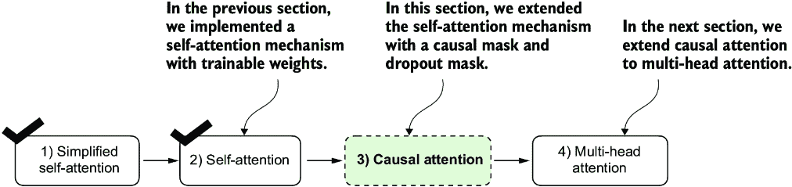

##### 图 3.23 这是我们迄今为止所做的工作。我们从简化的注意力机制开始，添加了可训练的权重，然后添加了因果注意力掩码。接下来，我们将扩展因果注意力机制，并实现多头注意力，我们将在我们的 LLM 中使用它。

## 3.6 将单头注意力扩展到多头注意力

我们的最后一步将是将之前实现的因果注意力类扩展到多个头。这也被称为*多头注意力*。

“多头”一词指的是将注意力机制分成多个“头”，每个头独立操作。在这个上下文中，一个单因果注意力模块可以被认为是单头注意力，其中只有一个注意力权重集按顺序处理输入。

我们将从这个因果注意力扩展到多头注意力。首先，我们将通过堆叠多个`CausalAttention`模块直观地构建一个多头注意力模块。然后，我们将以更复杂但更计算高效的方式实现相同的多头注意力模块。

### 3.6.1 堆叠多个单头注意力层

在实际应用中，实现多头注意力机制涉及创建多个自注意力机制的实例（见图 3.18），每个实例都有自己的权重，然后将它们的输出组合起来。使用多个自注意力机制的实例可能会计算量较大，但对于像基于 transformer 的 LLM 模型所擅长的复杂模式识别来说，这是至关重要的。

图 3.24 展示了多头注意力模块的结构，它由多个单头注意力模块组成，如图 3.18 中所示，它们相互堆叠。

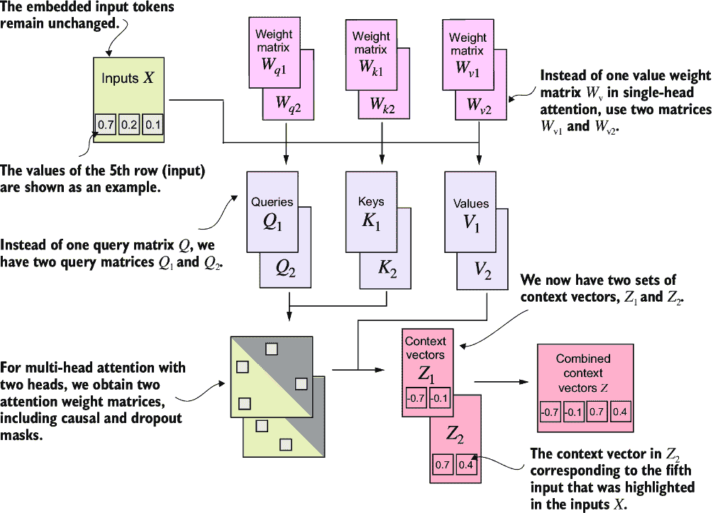

##### 图 3.24 多头注意力模块包括两个单头注意力模块，它们相互堆叠。因此，在具有两个头的多头注意力模块中，我们不再使用单个矩阵 W[v]来计算值矩阵，而是有两个值权重矩阵：W[v1]和 W[v2]。其他权重矩阵，如 W[Q]和 W[k]，也是如此。我们获得两组上下文向量 Z[1]和 Z[2]，我们可以将它们组合成一个单一的上下文向量矩阵 Z。

如前所述，多头注意力的主要思想是多次（并行）运行注意力机制，使用不同的、学习到的线性投影——通过权重矩阵乘以输入数据（如注意力机制中的查询、键和值向量）的结果。在代码中，我们可以通过实现一个简单的`MultiHeadAttentionWrapper`类来实现这一点，该类堆叠了我们之前实现的`CausalAttention`模块的多个实例。

##### 列表 3.4 实现多头注意力的包装类

```py
class MultiHeadAttentionWrapper(nn.Module):
    def __init__(self, d_in, d_out, context_length,
                 dropout, num_heads, qkv_bias=False):
        super().__init__()
        self.heads = nn.ModuleList(
            [CausalAttention(
                 d_in, d_out, context_length, dropout, qkv_bias
             ) 
             for _ in range(num_heads)]
        )

    def forward(self, x):
        return torch.cat([head(x) for head in self.heads], dim=-1)
```

例如，如果我们使用这个`MultiHeadAttentionWrapper`类，具有两个注意力头（通过`num_heads=2`）和`CausalAttention`输出维度`d_out=2`，我们得到一个四维的上下文向量（`d_out*num_heads=4`），如图 3.25 所示。


##### 图 3.25 使用`MultiHeadAttentionWrapper`，我们指定了注意力头部的数量(`num_heads`)。如果我们设置`num_heads=2`，如本例所示，我们得到一个包含两套上下文向量矩阵的张量。在每个上下文向量矩阵中，行表示与标记对应的上下文向量，列对应通过`d_out=4`指定的嵌入维度。我们沿着列维度连接这些上下文向量矩阵。由于我们有两个注意力头部和一个嵌入维度为 2，最终的嵌入维度是 2 × 2 = 4。

为了进一步用具体例子说明这一点，我们可以使用与之前的`CausalAttention`类相似的`MultiHeadAttentionWrapper`类：

```py
torch.manual_seed(123)
context_length = batch.shape[1] # This is the number of tokens
d_in, d_out = 3, 2
mha = MultiHeadAttentionWrapper(
    d_in, d_out, context_length, 0.0, num_heads=2
)
context_vecs = mha(batch)

print(context_vecs)
print("context_vecs.shape:", context_vecs.shape)
```

这导致以下张量表示上下文向量：

```py
tensor([[[-0.4519,  0.2216,  0.4772,  0.1063],
         [-0.5874,  0.0058,  0.5891,  0.3257],
         [-0.6300, -0.0632,  0.6202,  0.3860],
         [-0.5675, -0.0843,  0.5478,  0.3589],
         [-0.5526, -0.0981,  0.5321,  0.3428],
         [-0.5299, -0.1081,  0.5077,  0.3493]],

        [[-0.4519,  0.2216,  0.4772,  0.1063],
         [-0.5874,  0.0058,  0.5891,  0.3257],
         [-0.6300, -0.0632,  0.6202,  0.3860],
         [-0.5675, -0.0843,  0.5478,  0.3589],
         [-0.5526, -0.0981,  0.5321,  0.3428],
         [-0.5299, -0.1081,  0.5077,  0.3493]]], grad_fn=<CatBackward0>)
context_vecs.shape: torch.Size([2, 6, 4])
```

结果的`context_vecs`张量的第一维是 2，因为我们有两个输入文本（输入文本被复制了，这就是为什么那些上下文向量完全相同）。第二维指的是每个输入中的 6 个标记。第三维指的是每个标记的四维嵌入。

##### 练习 3.2 返回二维嵌入向量

修改`MultiHeadAttentionWrapper(...,` `num_heads=2)`调用的输入参数，使得输出上下文向量是二维的，而不是四维的，同时保持`num_heads=2`的设置。提示：您不需要修改类实现；您只需更改其他输入参数之一。

到目前为止，我们已经实现了一个`MultiHeadAttentionWrapper`，它结合了多个单头注意力模块。然而，这些模块在正向方法中是顺序处理的，通过`[head(x)` `for` `head` `in` `self.heads]`。我们可以通过并行处理头部来改进这个实现。实现这一目标的一种方法是通过矩阵乘法同时计算所有注意力头部的输出。

### 3.6.2 使用权重拆分实现多头注意力

到目前为止，我们已经创建了一个`MultiHeadAttentionWrapper`，通过堆叠多个单头注意力模块来实现多头注意力。这是通过实例化和组合几个`CausalAttention`对象来完成的。

我们可以不是维护两个独立的类，`MultiHeadAttentionWrapper`和`CausalAttention`，而是将这些概念合并成一个`MultiHeadAttention`类。此外，除了将`MultiHeadAttentionWrapper`与`CausalAttention`代码合并之外，我们还将进行一些其他修改，以更有效地实现多头注意力。

在 `MultiHeadAttentionWrapper` 中，通过创建一个 `CausalAttention` 对象列表（`self.heads`），每个对象代表一个单独的注意力头，实现了多个头。`CausalAttention` 类独立执行注意力机制，并将每个头的输出连接起来。相比之下，下面的 `MultiHeadAttention` 类在单个类中集成了多头功能。它通过重塑投影查询、键和值张量来分割输入，然后在计算注意力后结合这些头的输出。

在进一步讨论之前，让我们看看 `MultiHeadAttention` 类。

##### 列表 3.5 一个高效的多头注意力类

```py
class MultiHeadAttention(nn.Module):
    def __init__(self, d_in, d_out, 
                 context_length, dropout, num_heads, qkv_bias=False):
        super().__init__()
        assert (d_out % num_heads == 0), \
            "d_out must be divisible by num_heads"

        self.d_out = d_out
        self.num_heads = num_heads
        self.head_dim = d_out // num_heads    #1
        self.W_query = nn.Linear(d_in, d_out, bias=qkv_bias)
        self.W_key = nn.Linear(d_in, d_out, bias=qkv_bias)
        self.W_value = nn.Linear(d_in, d_out, bias=qkv_bias)
        self.out_proj = nn.Linear(d_out, d_out)    #2
        self.dropout = nn.Dropout(dropout)
        self.register_buffer(
            "mask",
            torch.triu(torch.ones(context_length, context_length),
                       diagonal=1)
        )

    def forward(self, x):
        b, num_tokens, d_in = x.shape
        keys = self.W_key(x)         #3
        queries = self.W_query(x)    #3
        values = self.W_value(x)     #3

        keys = keys.view(b, num_tokens, self.num_heads, self.head_dim)       #4
        values = values.view(b, num_tokens, self.num_heads, self.head_dim)  
        queries = queries.view(                                             
            b, num_tokens, self.num_heads, self.head_dim                    
        )                                                                   

        keys = keys.transpose(1, 2)          #5
        queries = queries.transpose(1, 2)    #5
        values = values.transpose(1, 2)      #5

        attn_scores = queries @ keys.transpose(2, 3)   #6
        mask_bool = self.mask.bool()[:num_tokens, :num_tokens]    #7

        attn_scores.masked_fill_(mask_bool, -torch.inf)     #8

        attn_weights = torch.softmax(
            attn_scores / keys.shape[-1]**0.5, dim=-1)
        attn_weights = self.dropout(attn_weights)

        context_vec = (attn_weights @ values).transpose(1, 2)   #9
 #10
        context_vec = context_vec.contiguous().view(
            b, num_tokens, self.d_out
        )
        context_vec = self.out_proj(context_vec)    #11
        return context_vec
```

#1 将投影维度减少以匹配所需的输出维度

#2 使用线性层来组合头输出

#3 张量形状：(b, num_tokens, d_out)

#4 我们通过添加一个 num_heads 维度隐式地分割了矩阵。然后我们展开最后一个维度：(b, num_tokens, d_out) -> (b, num_tokens, num_heads, head_dim)。

#5 从形状 (b, num_tokens, num_heads, head_dim) 转置到 (b, num_heads, num_tokens, head_dim)

#6 为每个头计算点积

#7 掩码截断到令牌数量

#8 使用掩码填充注意力分数

#9 张量形状：(b, num_tokens, n_heads, head_dim)

#10 合并头，其中 self.d_out = self.num_heads * self.head_dim

#11 添加一个可选的线性投影

尽管在 `MultiHeadAttention` 类内部张量的重塑（`.view`）和转置（`.transpose`）看起来非常数学复杂，但 `MultiHeadAttention` 类实现了与之前 `MultiHeadAttentionWrapper` 相同的概念。

从宏观角度来看，在之前的 `MultiHeadAttentionWrapper` 中，我们堆叠了多个单头注意力层，并将它们组合成一个多头注意力层。`MultiHeadAttention` 类采用了一种综合方法。它从一个多头层开始，然后内部将这个层分割成单独的注意力头，如图 3.26 所示。


##### 图 3.26 在具有两个注意力头的 `MultiHeadAttentionWrapper` 类中，我们初始化了两个权重矩阵 W[q1] 和 W[q2]，并计算了两个查询矩阵 Q[1] 和 Q[2]（顶部）。在 `MultiheadAttention` 类中，我们初始化了一个更大的权重矩阵 W[q]，只与输入进行一次矩阵乘法以获得查询矩阵 Q，然后将查询矩阵分割成 Q[1] 和 Q[2]（底部）。我们对键和值也做了同样的处理，这里没有展示以减少视觉混乱。

通过使用 PyTorch 的 `.view` 和 `.transpose` 方法进行张量重塑和转置操作，实现了查询、键和值张量的分割。输入首先通过查询、键和值的线性层进行转换，然后重塑以表示多个头。

关键操作是将`d_out`维度分割成`num_heads`和`head_dim`，其中`head_dim` `=` `d_out` `/` `num_heads`。然后使用`.view`方法实现这种分割：将维度为`(b, num_tokens, d_out)`的张量重塑为维度`(b, num_tokens, num_heads, head_dim)`。

然后将张量转置，以便将`num_heads`维度放在`num_tokens`维度之前，从而得到形状为`(b, num_heads, num_tokens, head_dim)`。这种转置对于正确地对齐不同头部的查询、键和值以及高效地执行批量矩阵乘法至关重要。

为了说明这种批量矩阵乘法，假设我们有一个以下张量：

```py
a = torch.tensor([[[[0.2745, 0.6584, 0.2775, 0.8573],    #1
                    [0.8993, 0.0390, 0.9268, 0.7388],
                    [0.7179, 0.7058, 0.9156, 0.4340]],

                   [[0.0772, 0.3565, 0.1479, 0.5331],
                    [0.4066, 0.2318, 0.4545, 0.9737],
                    [0.4606, 0.5159, 0.4220, 0.5786]]]])
```

#1 这个张量的形状是(b, num_heads, num_tokens, head_dim) = (1, 2, 3, 4)。

现在我们对张量本身及其一个视图执行批量矩阵乘法，其中我们转置了最后两个维度，即`num_tokens`和`head_dim`：

```py
print(a @ a.transpose(2, 3))
```

结果是

```py
tensor([[[[1.3208, 1.1631, 1.2879],
          [1.1631, 2.2150, 1.8424],
          [1.2879, 1.8424, 2.0402]],

         [[0.4391, 0.7003, 0.5903],
          [0.7003, 1.3737, 1.0620],
          [0.5903, 1.0620, 0.9912]]]])
```

在这种情况下，PyTorch 中的矩阵乘法实现处理了四维输入张量，使得矩阵乘法在最后两个维度`(num_tokens, head_dim)`之间进行，然后为每个单独的头重复执行。

例如，前面的方法成为了一种更紧凑的方式来分别计算每个头的矩阵乘法：

```py
first_head = a[0, 0, :, :]
first_res = first_head @ first_head.T
print("First head:\n", first_res)

second_head = a[0, 1, :, :]
second_res = second_head @ second_head.T
print("\nSecond head:\n", second_res)
```

结果与使用批量矩阵乘法`print(a @ a.transpose(2, 3))`得到的结果完全相同：

```py
First head:
 tensor([[1.3208, 1.1631, 1.2879],
        [1.1631, 2.2150, 1.8424],
        [1.2879, 1.8424, 2.0402]])

Second head:
 tensor([[0.4391, 0.7003, 0.5903],
        [0.7003, 1.3737, 1.0620],
        [0.5903, 1.0620, 0.9912]])
```

继续使用`MultiHeadAttention`，在计算注意力权重和上下文向量之后，所有头部的上下文向量被转置回形状`(b, num_tokens, num_heads, head_dim)`。然后这些向量被重塑（展平）为形状`(b, num_tokens, d_out)`，有效地结合了所有头部的输出。

此外，我们在将头部合并后，向`MultiHeadAttention`添加了一个输出投影层(`self.out_proj`)，这在`CausalAttention`类中不存在。这个输出投影层不是严格必要的（更多细节请见附录 B），但它被广泛应用于许多 LLM 架构中，因此我为了完整性在此添加了它。

尽管由于额外的张量重塑和转置，`MultiHeadAttention`类看起来比`MultiHeadAttentionWrapper`更复杂，但它更高效。原因是，我们只需要一次矩阵乘法来计算键，例如，`keys` `=` `self.W_key(x)`（对于查询和值也是如此）。在`MultiHeadAttentionWrapper`中，我们需要为每个注意力头重复这个矩阵乘法，这是计算上最昂贵的步骤之一。

`MultiHeadAttention`类可以像我们之前实现的`SelfAttention`和`CausalAttention`类一样使用：

```py
torch.manual_seed(123)
batch_size, context_length, d_in = batch.shape
d_out = 2
mha = MultiHeadAttention(d_in, d_out, context_length, 0.0, num_heads=2)
context_vecs = mha(batch)
print(context_vecs)
print("context_vecs.shape:", context_vecs.shape)
```

结果表明输出维度直接受`d_out`参数控制：

```py
tensor([[[0.3190, 0.4858],
         [0.2943, 0.3897],
         [0.2856, 0.3593],
         [0.2693, 0.3873],
         [0.2639, 0.3928],
         [0.2575, 0.4028]],

        [[0.3190, 0.4858],
         [0.2943, 0.3897],
         [0.2856, 0.3593],
         [0.2693, 0.3873],
         [0.2639, 0.3928],
         [0.2575, 0.4028]]], grad_fn=<ViewBackward0>)
context_vecs.shape: torch.Size([2, 6, 2])
```

我们现在已经实现了`MultiHeadAttention`类，当我们实现和训练 LLM 时将使用这个类。请注意，虽然代码完全可用，但我使用了相对较小的嵌入大小和注意力头数，以保持输出可读。

为了比较，最小的 GPT-2 模型（1.17 亿参数）有 12 个注意力头和 768 维的上下文向量嵌入大小。最大的 GPT-2 模型（15 亿参数）有 25 个注意力头和 1,600 维的上下文向量嵌入大小。在 GPT 模型中，标记输入和上下文嵌入的嵌入大小是相同的（`d_in` `=` `d_out`）。

##### 练习 3.3 初始化 GPT-2 大小注意力模块

使用`MultiHeadAttention`类，初始化一个具有与最小的 GPT-2 模型（12 个注意力头）相同数量的注意力头的多头注意力模块。同时确保您使用与 GPT-2 类似的相应输入和输出嵌入大小（768 维）。请注意，最小的 GPT-2 模型支持 1,024 个标记的上下文长度。

## 摘要

+   注意力机制将输入元素转换为增强的上下文向量表示，该表示包含有关所有输入的信息。

+   自注意力机制通过输入的加权和来计算上下文向量表示。

+   在简化的注意力机制中，注意力权重通过点积来计算。

+   点积是一种简洁的方式，通过逐元素相乘然后求和来乘以两个向量。

+   矩阵乘法，虽然不是严格必需的，但通过替换嵌套的`for`循环，有助于我们更高效和紧凑地实现计算。

+   在 LLM 中使用的自注意力机制，也称为缩放点积注意力，我们包括可训练的权重矩阵来计算输入的中间变换：查询、值和键。

+   当与从左到右读取和生成文本的 LLM 一起工作时，我们添加一个因果注意力掩码以防止 LLM 访问未来的标记。

+   除了用于将注意力权重置零的因果注意力掩码外，我们还可以添加一个 dropout 掩码以减少 LLM 中的过拟合。

+   基于 transformer 的 LLM 中的注意力模块涉及多个因果注意力实例，这被称为多头注意力。

+   我们可以通过堆叠多个因果注意力模块的实例来创建一个多头注意力模块。

+   创建多头注意力模块的更有效的方法涉及批量矩阵乘法。
