# 第四章：从零开始实现 GPT 模型以生成文本

### 本章涵盖了

+   编码一个可以训练生成类似人类文本的 GPT-like 大型语言模型（LLM）

+   将层激活值归一化以稳定神经网络训练

+   在深度神经网络中添加快捷连接

+   实现 transformer 块以创建各种大小的 GPT 模型

+   计算 GPT 模型的参数数量和存储需求

你已经学习和编码了 LLM 的核心组件之一**多头注意力**机制。现在，我们将编码 LLM 的其他构建块，并将它们组装成一个 GPT-like 模型，我们将在下一章中训练它以生成类似人类的文本。


##### 图 4.1 编码 LLM 的三个主要阶段。本章重点介绍第一阶段步骤 3：实现 LLM 架构。

图 4.1 中引用的 LLM 架构由几个构建块组成。我们将从模型架构的顶向下视图开始，然后再更详细地介绍各个组件。

## 4.1 编码 LLM 架构

LLMs，如 GPT（代表**生成预训练转换器**），是设计用来一次生成一个单词（或标记）的新文本的大型深度神经网络架构。然而，尽管它们的规模很大，但模型架构并不像你可能想象的那样复杂，因为其中许多组件是重复的，正如我们稍后将看到的。图 4.2 提供了一个类似 GPT 的 LLM 的顶向下视图，其主要组件被突出显示。

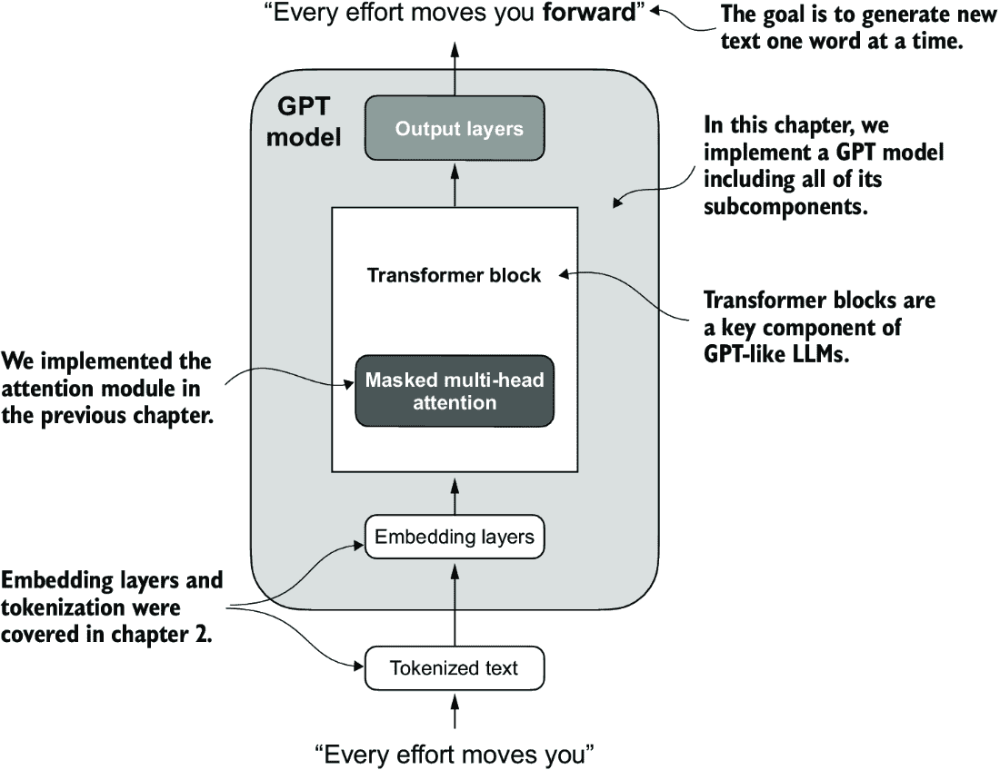

##### 图 4.2 GPT 模型。除了嵌入层外，它还包括一个或多个包含我们之前实现的掩码多头注意力模块的 transformer 块。

我们已经涵盖了 LLM 架构的几个方面，例如输入分词和嵌入以及之前实现的掩码多头注意力模块。现在，我们将实现 GPT 模型的核心结构，包括其**transformer 块**，我们将在以后训练它们以生成类似人类的文本。

以前，为了简单起见，我们使用了较小的嵌入维度，确保概念和示例可以舒适地放在一页上。现在，我们正在将其扩展到小型 GPT-2 模型的大小，具体是最小的 124 百万参数版本，如 Radford 等人所描述的“语言模型是无监督的多任务学习者”（[`mng.bz/yoBq`](https://mng.bz/yoBq)）。请注意，尽管原始报告提到 117 百万参数，但这后来被更正了。在第六章中，我们将专注于将预训练的权重加载到我们的实现中，并适应具有 345 亿、762 亿和 15.42 亿参数的更大 GPT-2 模型。

在深度学习和 GPT 等 LLM 的背景下，“参数”一词指的是模型的可训练权重。这些权重实际上是模型在训练过程中调整和优化的内部变量，以最小化特定的损失函数。这种优化使模型能够从训练数据中学习。

例如，在一个由 2,048 × 2,048 维度的权重矩阵（或张量）表示的神经网络层中，这个矩阵的每个元素都是一个参数。由于有 2,048 行和 2,048 列，这个层中的参数总数是 2,048 乘以 2,048，等于 4,194,304 个参数。

##### GPT-2 与 GPT-3

注意，我们专注于 GPT-2，因为 OpenAI 已经将预训练模型的权重公开，我们将在第六章将其加载到我们的实现中。GPT-3 在模型架构方面基本上是相同的，但它从 GPT-2 的 15 亿参数扩展到 GPT-3 的 1750 亿参数，并且训练在更多数据上。截至本文撰写时，GPT-3 的权重尚未公开。GPT-2 也是学习如何实现 LLM 的更好选择，因为它可以在单个笔记本电脑上运行，而 GPT-3 需要 GPU 集群进行训练和推理。根据 Lambda Labs ([`lambdalabs.com/`](https://lambdalabs.com/)) 的数据，在单个 V100 数据中心 GPU 上训练 GPT-3 需要 355 年，在消费者 RTX 8000 GPU 上需要 665 年。

我们通过以下 Python 字典指定小型 GPT-2 模型的配置，我们将在后面的代码示例中使用它：

```py
GPT_CONFIG_124M = {
    "vocab_size": 50257,     # Vocabulary size
    "context_length": 1024,  # Context length
    "emb_dim": 768,          # Embedding dimension
    "n_heads": 12,           # Number of attention heads
    "n_layers": 12,          # Number of layers
    "drop_rate": 0.1,        # Dropout rate
    "qkv_bias": False        # Query-Key-Value bias
}
```

在 `GPT_CONFIG_124M` 字典中，我们使用简洁的变量名以提高清晰度并防止代码行过长：

+   `vocab_size` 指的是 BPE 分词器使用的 50,257 个单词的词汇量（见第二章）。

+   `context_length` 表示模型通过位置嵌入可以处理的最大输入标记数（见第二章）。

+   `emb_dim` 表示嵌入大小，将每个标记转换为 768 维的向量。

+   `n_heads` 表示多头注意力机制中的注意力头数量（见第三章）。

+   `n_layers` 指定了模型中的 transformer 块的数量，我们将在接下来的讨论中介绍。

+   `drop_rate` 表示 dropout 机制的强度（0.1 表示隐藏单元随机丢弃 10%），以防止过拟合（见第三章）。

+   `qkv_bias` 决定了是否在多头注意力中的 `Linear` 层为查询、键和值计算包含一个偏置向量。我们最初将禁用此功能，遵循现代大型语言模型（LLM）的规范，但在第六章中，当我们从 OpenAI 加载预训练的 GPT-2 权重到我们的模型时，我们将重新审视它（见第六章）。

使用此配置，我们将实现一个 GPT 占位符架构 (`DummyGPTModel`)，如图 4.3 所示。这将为我们提供一个整体视图，了解所有组件如何组合在一起，以及我们需要编写哪些其他组件来组装完整的 GPT 模型架构。


##### 图 4.3 我们编码 GPT 架构的顺序。我们首先从 GPT 背骨，一个占位符架构开始，然后到达各个核心组件，最终将它们组装成一个 TransformerBlock，以形成最终的 GPT 架构。

图 4.3 中的编号框说明了我们解决编码最终 GPT 架构所需的各个概念的顺序。我们将从步骤 1 开始，一个我们将称之为 `DummyGPTModel` 的占位符 GPT 背骨。

##### 列表 4.1 一个占位符 GPT 模型架构类

```py
import torch
import torch.nn as nn

class DummyGPTModel(nn.Module):
    def __init__(self, cfg):
        super().__init__()
        self.tok_emb = nn.Embedding(cfg["vocab_size"], cfg["emb_dim"])
        self.pos_emb = nn.Embedding(cfg["context_length"], cfg["emb_dim"])
        self.drop_emb = nn.Dropout(cfg["drop_rate"])
        self.trf_blocks = nn.Sequential(               #1
            *[DummyTransformerBlock(cfg)               #1
              for _ in range(cfg["n_layers"])]         #1
        )                                              #1
        self.final_norm = DummyLayerNorm(cfg["emb_dim"])     #2
        self.out_head = nn.Linear(
            cfg["emb_dim"], cfg["vocab_size"], bias=False
        )

    def forward(self, in_idx):
        batch_size, seq_len = in_idx.shape
        tok_embeds = self.tok_emb(in_idx)
        pos_embeds = self.pos_emb(
            torch.arange(seq_len, device=in_idx.device)
        )
        x = tok_embeds + pos_embeds
        x = self.drop_emb(x)
        x = self.trf_blocks(x)
        x = self.final_norm(x)
        logits = self.out_head(x)
        return logits

class DummyTransformerBlock(nn.Module):    #3
    def __init__(self, cfg):
        super().__init__()

    def forward(self, x):     #4
        return x

class DummyLayerNorm(nn.Module):           #5
    def __init__(self, normalized_shape, eps=1e-5):    #6
        super().__init__()

    def forward(self, x):
        return x
```

#1 使用占位符代替 TransformerBlock

#2 使用占位符代替 LayerNorm

#3 一个简单的占位符类，稍后将由实际的 TransformerBlock 替换

#4 此块不做任何操作，只是返回其输入。

#5 一个简单的占位符类，稍后将由实际的 LayerNorm 替换

#6 这里的参数只是为了模仿 LayerNorm 接口。

代码中的 `DummyGPTModel` 类定义了一个使用 PyTorch 的神经网络模块 (`nn.Module`) 的简化版本的类似 GPT 模型。`DummyGPTModel` 类中的模型架构包括标记和位置嵌入、dropout、一系列的 TransformerBlock (`DummyTransformerBlock`)、最终的层归一化 (`DummyLayerNorm`) 和线性输出层 (`out_head`)。配置通过 Python 字典传入，例如，我们之前创建的 `GPT_CONFIG_124M` 字典。

`forward` 方法描述了数据在模型中的流动：它为输入索引计算标记和位置嵌入，应用 dropout，通过 TransformerBlock 处理数据，应用归一化，并最终通过线性输出层产生 logits。

列表 4.1 中的代码已经可以工作。然而，目前请注意，我们使用占位符（`DummyLayerNorm` 和 `DummyTransformerBlock`）来代替 TransformerBlock 和层归一化，这些我们将在以后开发。

接下来，我们将准备输入数据并初始化一个新的 GPT 模型以展示其用法。基于我们对分词器（见第二章）的编码，现在让我们考虑一个 GPT 模型中数据流入和流出的高级概述，如图 4.4 所示。

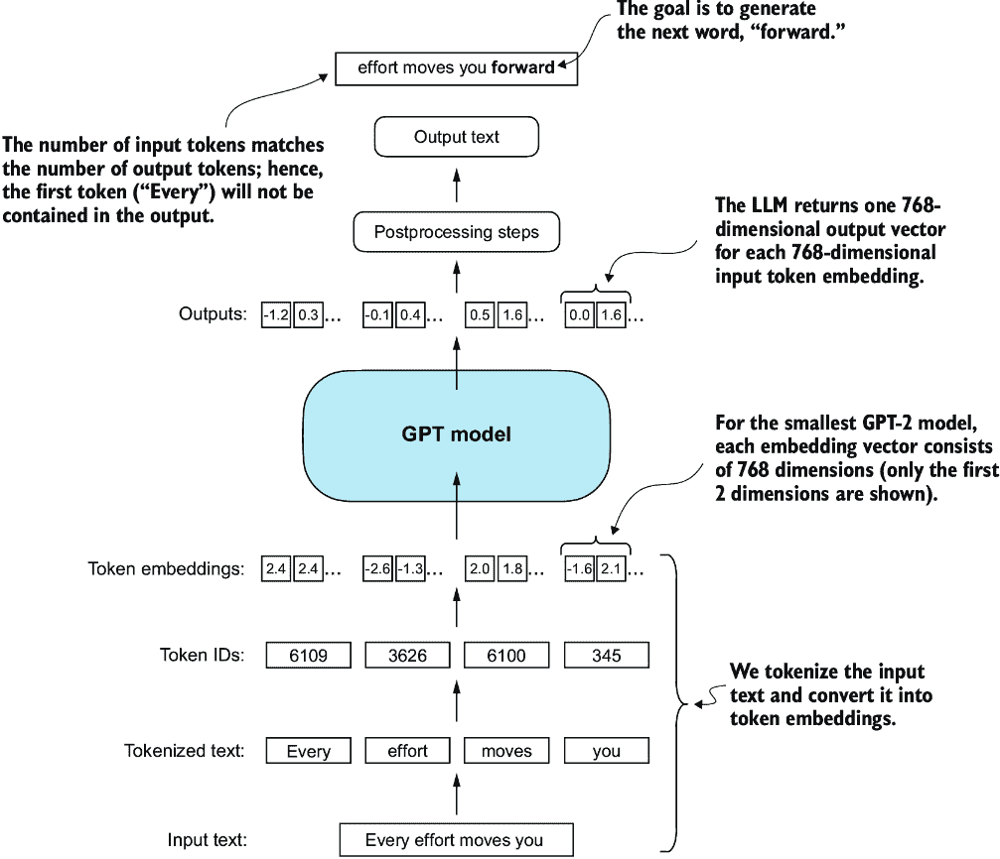

##### 图 4.4 从一个整体概述中展示了输入数据是如何被标记化、嵌入并输入到 GPT 模型中的。注意，在我们之前编写的 `DummyGPTClass` 中，标记嵌入是在 GPT 模型内部处理的。在大型语言模型 (LLM) 中，嵌入的输入标记维度通常与输出维度相匹配。这里的输出嵌入代表上下文向量（见第三章）。

为了实现这些步骤，我们使用第二章中的 tiktoken 分词器对 GPT 模型的两个文本输入进行分词：

```py
import tiktoken

tokenizer = tiktoken.get_encoding("gpt2")
batch = []
txt1 = "Every effort moves you"
txt2 = "Every day holds a"

batch.append(torch.tensor(tokenizer.encode(txt1)))
batch.append(torch.tensor(tokenizer.encode(txt2)))
batch = torch.stack(batch, dim=0)
print(batch)
```

两个文本的结果标记 ID 如下：

```py
tensor([[6109,  3626,  6100,   345],    #1
        [6109,  1110,  6622,   257]])
```

#1 第一行对应于第一段文本，第二行对应于第二段文本。

接下来，我们初始化一个新的 124 百万参数的`DummyGPTModel`实例，并给它提供分词后的`batch`：

```py
torch.manual_seed(123)
model = DummyGPTModel(GPT_CONFIG_124M)
logits = model(batch)
print("Output shape:", logits.shape)
print(logits)
```

模型输出，通常称为 logits，如下所示：

```py
Output shape: torch.Size([2, 4, 50257])
tensor([[[-1.2034,  0.3201, -0.7130,  ..., -1.5548, -0.2390, -0.4667],
         [-0.1192,  0.4539, -0.4432,  ...,  0.2392,  1.3469,  1.2430],
         [ 0.5307,  1.6720, -0.4695,  ...,  1.1966,  0.0111,  0.5835],
         [ 0.0139,  1.6755, -0.3388,  ...,  1.1586, -0.0435, -1.0400]],

        [[-1.0908,  0.1798, -0.9484,  ..., -1.6047,  0.2439, -0.4530],
         [-0.7860,  0.5581, -0.0610,  ...,  0.4835, -0.0077,  1.6621],
         [ 0.3567,  1.2698, -0.6398,  ..., -0.0162, -0.1296,  0.3717],
         [-0.2407, -0.7349, -0.5102,  ...,  2.0057, -0.3694,  0.1814]]],
       grad_fn=<UnsafeViewBackward0>)
```

输出张量有两行，对应于两个文本样本。每个文本样本由四个标记组成；每个标记是一个 50,257 维向量，这与分词器的词汇表大小相匹配。

嵌入有 50,257 维，因为这些维度的每一个都指代词汇表中的一个独特标记。当我们实现后处理代码时，我们将这些 50,257 维向量转换回标记 ID，然后我们可以将它们解码成单词。

现在我们已经从上到下审视了 GPT 架构及其输入和输出，我们将编写单个占位符的代码，从替换先前代码中的`DummyLayerNorm`的真实层归一化类开始。

## 4.2 使用层归一化归一化激活

使用多层训练深度神经网络有时可能具有挑战性，因为梯度消失或爆炸等问题。这些问题导致训练动态不稳定，使得网络难以有效地调整其权重，这意味着学习过程难以找到一组参数（权重）以最小化损失函数。换句话说，网络难以以允许其做出准确预测或决策的程度学习数据中的潜在模式。

注意：如果你对神经网络训练和梯度概念不熟悉，可以在附录 A 的 A.4 节中找到这些概念的简要介绍。然而，为了理解本书的内容，不需要对梯度有深入数学理解。

现在我们来实现*层归一化*来提高神经网络训练的稳定性和效率。层归一化的主要思想是将神经网络层的激活（输出）调整为均值为 0 和方差为 1，也称为单位方差。这种调整加快了收敛到有效权重，并确保了一致、可靠的训练。在 GPT-2 和现代变换器架构中，层归一化通常在多头注意力模块前后应用，正如我们通过`DummyLayerNorm`占位符所看到的，在最终输出层之前。图 4.5 提供了层归一化功能的视觉概述。

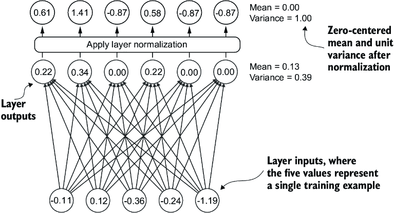

##### 图 4.5 层归一化的插图，其中层的六个输出（也称为激活）被归一化，使得它们具有 0 均值和 1 方差。

我们可以通过以下代码重现图 4.5 所示的示例，其中我们实现了一个具有五个输入和六个输出的神经网络层，并将其应用于两个输入示例：

```py
torch.manual_seed(123)
batch_example = torch.randn(2, 5)     #1
layer = nn.Sequential(nn.Linear(5, 6), nn.ReLU())
out = layer(batch_example)
print(out)
```

#1 创建两个具有五个维度（特征）的训练示例

这将打印以下张量，其中第一行列出第一个输入的层输出，第二行列出第二个输入的层输出：

```py
tensor([[0.2260, 0.3470, 0.0000, 0.2216, 0.0000, 0.0000],
        [0.2133, 0.2394, 0.0000, 0.5198, 0.3297, 0.0000]],
       grad_fn=<ReluBackward0>)
```

我们编写的神经网络层由一个`Linear`层后跟一个非线性激活函数`ReLU`（即修正线性单元）组成，这是神经网络中的标准激活函数。如果您不熟悉`ReLU`，它只是将负输入阈值设置为 0，确保层只输出正值，这也解释了为什么结果层输出不包含任何负值。稍后，我们将在 GPT 中使用另一个更复杂的激活函数。

在我们将层归一化应用于这些输出之前，让我们检查均值和方差：

```py
mean = out.mean(dim=-1, keepdim=True)
var = out.var(dim=-1, keepdim=True)
print("Mean:\n", mean)
print("Variance:\n", var)
```

输出是

```py
Mean:
  tensor([[0.1324],
          [0.2170]], grad_fn=<MeanBackward1>)
Variance:
  tensor([[0.0231],
          [0.0398]], grad_fn=<VarBackward0>)
```

均值张量的第一行包含第一个输入行的均值值，第二输出行包含第二个输入行的均值。

在均值或方差计算等操作中使用`keepdim=True`确保输出张量保留与输入张量相同的维度数，尽管操作减少了通过`dim`指定的维度。例如，如果不使用`keepdim=True`，返回的均值张量将是一个二维向量`[0.1324,` `0.2170]`，而不是一个 2 × 1 维度的矩阵`[[0.1324],` `[0.2170]]`。

`dim`参数指定了在张量中计算统计量（此处为均值或方差）应进行的维度。如图 4.6 所示，对于二维张量（如矩阵），在均值或方差计算等操作中使用`dim=-1`与使用`dim=1`相同。这是因为`-1`指的是张量的最后一个维度，在二维张量中对应于列。后来，当我们将层归一化添加到 GPT 模型中，该模型产生形状为`[batch_size,` `num_tokens,` `embedding_size]`的三维张量时，我们仍然可以使用`dim=-1`对最后一个维度进行归一化，避免从`dim=1`变为`dim=2`。

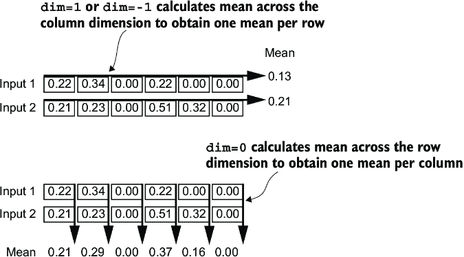

##### 图 4.6 展示了计算张量均值时的`dim`参数。例如，如果我们有一个维度为`[rows,` `columns]`的两维张量（矩阵），使用`dim=0`将在行（垂直，如图底部所示）上执行操作，结果将聚合每列的数据。使用`dim=1`或`dim=-1`将在列（水平，如图顶部所示）上执行操作，结果将聚合每行的数据。

接下来，让我们将层归一化应用于我们之前获得的层输出。这个操作包括减去平均值并除以方差的平方根（也称为标准差）：

```py
out_norm = (out - mean) / torch.sqrt(var)
mean = out_norm.mean(dim=-1, keepdim=True)
var = out_norm.var(dim=-1, keepdim=True)
print("Normalized layer outputs:\n", out_norm)
print("Mean:\n", mean)
print("Variance:\n", var)
```

根据结果，我们可以看到，归一化的层输出，现在也包含负值，具有 0 均值和 1 的方差：

```py
Normalized layer outputs:
 tensor([[ 0.6159,  1.4126, -0.8719,  0.5872, -0.8719, -0.8719],
        [-0.0189,  0.1121, -1.0876,  1.5173,  0.5647, -1.0876]],
       grad_fn=<DivBackward0>)
Mean:
 tensor([[-5.9605e-08],
        [1.9868e-08]], grad_fn=<MeanBackward1>)
Variance:
 tensor([[1.],
        [1.]], grad_fn=<VarBackward0>)
```

注意到输出张量中的值-5.9605e-08 是科学记数法表示的-5.9605 × 10^(-8)，以十进制形式表示为-0.000000059605。这个值非常接近 0，但由于计算机表示数字的有限精度可能积累的小数值误差，它并不完全等于 0。

为了提高可读性，我们还可以通过将`sci_mode`设置为`False`来关闭打印张量值时的科学记数法：

```py
torch.set_printoptions(sci_mode=False)
print("Mean:\n", mean)
print("Variance:\n", var)
```

输出是

```py
Mean:
 tensor([[    0.0000],
        [    0.0000]], grad_fn=<MeanBackward1>)
Variance:
 tensor([[1.],
        [1.]], grad_fn=<VarBackward0>)
```

到目前为止，我们已经逐步编写并应用了层归一化。现在，让我们将这个过程封装在一个 PyTorch 模块中，我们可以在后面的 GPT 模型中使用它。

##### 列表 4.2 层归一化类

```py
class LayerNorm(nn.Module):
    def __init__(self, emb_dim):
        super().__init__()
        self.eps = 1e-5
        self.scale = nn.Parameter(torch.ones(emb_dim))
        self.shift = nn.Parameter(torch.zeros(emb_dim))

    def forward(self, x):
        mean = x.mean(dim=-1, keepdim=True)
        var = x.var(dim=-1, keepdim=True, unbiased=False)
        norm_x = (x - mean) / torch.sqrt(var + self.eps)
        return self.scale * norm_x + self.shift
```

这种层归一化的具体实现操作在输入张量 x 的最后一个维度上，它代表嵌入维度（`emb_dim`）。变量`eps`是一个小的常数（epsilon），在归一化过程中添加到方差中，以防止除以零。`scale`和`shift`是两个可训练的参数（与输入具有相同的维度），在训练过程中，如果确定这样做会提高模型在训练任务上的性能，LLM 会自动调整这些参数。这允许模型学习适当的缩放和偏移，以最好地适应它正在处理的数据。

##### 偏差方差

在我们的方差计算方法中，我们通过设置`unbiased=False`使用了一个实现细节。对于那些对此感兴趣的人来说，在方差计算中，我们根据方差公式中的输入数量*n*进行除法。这种方法不应用贝塞尔校正，通常在分母中使用*n* – *1*而不是*n*来调整样本方差估计中的偏差。这个决定导致了一个所谓的偏差方差估计。对于 LLMs，其中嵌入维度*n*非常大，使用*n*和*n* – *1*之间的差异实际上可以忽略不计。我选择这种方法是为了确保与 GPT-2 模型的归一化层兼容，并且因为它反映了 TensorFlow 的默认行为，这是原始 GPT-2 模型所使用的。使用类似的设置确保我们的方法与我们在第六章中将要加载的预训练权重兼容。

现在我们来实际尝试使用`LayerNorm`模块，并将其应用于批输入：

```py
ln = LayerNorm(emb_dim=5)
out_ln = ln(batch_example)
mean = out_ln.mean(dim=-1, keepdim=True)
var = out_ln.var(dim=-1, unbiased=False, keepdim=True)
print("Mean:\n", mean)
print("Variance:\n", var)
```

结果表明，层归一化代码按预期工作，并将两个输入的值归一化，使得它们的均值为 0，方差为 1：

```py
Mean:
 tensor([[    -0.0000],
        [     0.0000]], grad_fn=<MeanBackward1>)
Variance:
 tensor([[1.0000],
        [1.0000]], grad_fn=<VarBackward0>)
```

我们现在已经涵盖了构建 GPT 架构所需的两个构建块，如图 4.7 所示。接下来，我们将查看 GELU 激活函数，这是 LLM 中使用的激活函数之一，而不是我们之前使用的传统 ReLU 函数。


##### 图 4.7 构建 GPT 架构所需的构建块。到目前为止，我们已经完成了 GPT 主干和层归一化。接下来，我们将专注于 GELU 激活和前馈网络。

##### 层归一化与批归一化

如果你熟悉批归一化，这是一种常见的神经网络传统归一化方法，你可能想知道它与层归一化相比如何。与批归一化不同，批归一化是在批维度上进行归一化，而层归一化是在特征维度上进行归一化。LLM 通常需要大量的计算资源，而可用的硬件或特定的用例可能会在训练或推理期间决定批大小。由于层归一化独立于批大小对每个输入进行归一化，因此在这些情况下它提供了更多的灵活性和稳定性。这在分布式训练或将模型部署在资源受限的环境中尤其有益。

## 4.3 使用 GELU 激活函数实现前馈网络

接下来，我们将实现一个小型神经网络子模块，该模块作为 LLM 中 transformer 块的一部分使用。我们首先实现*GELU*激活函数，它在该神经网络子模块中起着至关重要的作用。

注意：有关在 PyTorch 中实现神经网络的更多信息，请参阅附录 A 中的 A.5 节。

从历史上看，ReLU 激活函数由于其简单性和在各种神经网络架构中的有效性，在深度学习中得到了广泛应用。然而，在 LLM 中，除了传统的 ReLU 之外，还使用了其他几种激活函数。两个值得注意的例子是 GELU（高斯误差线性单元）和 SwiGLU（Swish 门控线性单元）。

GELU 和 SwiGLU 是更复杂且平滑的激活函数，分别包含高斯和 sigmoid 门控线性单元。与简单的 ReLU 相比，它们为深度学习模型提供了改进的性能。

GELU 激活函数可以通过几种方式实现；确切版本定义为 GELU(x) = x⋅𝛷(x)，其中𝛷(x)是标准高斯分布的累积分布函数。然而，在实践中，通常实现一个计算上更便宜的近似（原始 GPT-2 模型也是用这个近似进行训练的，这个近似是通过曲线拟合得到的）：

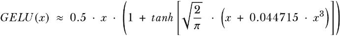

在代码中，我们可以将此函数实现为一个 PyTorch 模块。

##### 列表 4.3 GELU 激活函数的实现

```py
class GELU(nn.Module):
    def __init__(self):
        super().__init__()

    def forward(self, x):
        return 0.5 * x * (1 + torch.tanh(
            torch.sqrt(torch.tensor(2.0 / torch.pi)) * 
            (x + 0.044715 * torch.pow(x, 3))
        ))
```

接下来，为了了解这个 GELU 函数看起来像什么以及它与 ReLU 函数相比如何，让我们将这些函数并排绘制出来：

```py
import matplotlib.pyplot as plt
gelu, relu = GELU(), nn.ReLU()

x = torch.linspace(-3, 3, 100)     #1
y_gelu, y_relu = gelu(x), relu(x)
plt.figure(figsize=(8, 3))
for i, (y, label) in enumerate(zip([y_gelu, y_relu], ["GELU", "ReLU"]), 1):
    plt.subplot(1, 2, i)
    plt.plot(x, y)
    plt.title(f"{label} activation function")
    plt.xlabel("x")
    plt.ylabel(f"{label}(x)")
    plt.grid(True)
plt.tight_layout()
plt.show()
```

#1 在-3 到 3 的范围内创建 100 个样本数据点

如我们在图 4.8 的结果图中所见，ReLU（右侧）是一个分段线性函数，如果输入为正，则直接输出输入；否则，输出零。GELU（左侧）是一个平滑的非线性函数，它近似 ReLU，但几乎对所有负值（除了大约*x* = –0.75）都有一个非零梯度。


##### 图 4.8 使用 matplotlib 绘制的 GELU 和 ReLU 图。x 轴显示函数输入，y 轴显示函数输出。

GELU 的平滑性可以在训练过程中带来更好的优化特性，因为它允许对模型参数进行更细致的调整。相比之下，ReLU 在零点有一个尖锐的拐角（图 4.18，右侧），这有时会使优化更加困难，尤其是在非常深或具有复杂架构的网络中。此外，与 ReLU 不同，ReLU 对任何负输入都输出零，而 GELU 允许负值有一个小的、非零的输出。这一特性意味着在训练过程中，接收负输入的神经元仍然可以参与到学习过程中，尽管其贡献不如正输入那么大。

接下来，让我们使用 GELU 函数来实现我们将要在 LLM 的 transformer 块中使用的较小神经网络模块`FeedForward`。

##### 列表 4.4 前馈神经网络模块

```py
class FeedForward(nn.Module):
    def __init__(self, cfg):
        super().__init__()
        self.layers = nn.Sequential(
            nn.Linear(cfg["emb_dim"], 4 * cfg["emb_dim"]),
            GELU(),
            nn.Linear(4 * cfg["emb_dim"], cfg["emb_dim"]),
        )

    def forward(self, x):
        return self.layers(x)
```

如我们所见，`FeedForward`模块是一个由两个`Linear`层和一个`GELU`激活函数组成的小型神经网络。在 124 百万参数的 GPT 模型中，它通过`GPT_CONFIG_124M`字典接收输入批次，其中每个标记的嵌入大小为 768。`GPT_CONFIG_` `124M["emb_dim"]` `=` `768`。图 4.9 展示了当我们向这个小前馈神经网络传递一些输入时，如何操作嵌入大小。


##### 图 4.9 前馈神经网络层之间连接的概述。这个神经网络可以适应可变的批次大小和输入中的标记数量。然而，每个标记的嵌入大小在初始化权重时是确定和固定的。

按照图 4.9 中的示例，让我们初始化一个新的`FeedForward`模块，其标记嵌入大小为 768，并给它一个包含两个样本和每个样本三个标记的批次输入：

```py
ffn = FeedForward(GPT_CONFIG_124M)
x = torch.rand(2, 3, 768)          #1
out = ffn(x)
print(out.shape)
```

#1 创建具有批次维度 2 的样本输入

如我们所见，输出张量的形状与输入张量的形状相同：

```py
torch.Size([2, 3, 768])
```

`FeedForward`模块在增强模型从数据中学习和泛化的能力方面发挥着至关重要的作用。尽管该模块的输入和输出维度相同，但它通过第一个线性层将嵌入维度扩展到更高维的空间，如图 4.10 所示。这种扩展随后通过非线性 GELU 激活，然后通过第二个线性变换收缩回原始维度。这种设计允许探索更丰富的表示空间。


##### 图 4.10 展示了前馈神经网络中层输出的扩展和收缩。首先，输入通过 4 倍从 768 扩展到 3,072 个值。然后，第二层将 3,072 个值压缩回 768 维度的表示。

此外，输入和输出维度的均匀性通过允许堆叠多个层（正如我们稍后将要做的）来简化架构，而无需调整它们之间的维度，从而使模型更具可扩展性。

如图 4.11 所示，我们已实现了 LLM 的大部分构建模块。接下来，我们将介绍我们在神经网络的不同层之间插入的捷径连接的概念，这对于提高深度神经网络架构的训练性能至关重要。


##### 图 4.11 显示了构建 GPT 架构所需的构建模块。黑色勾号表示我们已经讨论过的内容。

## 4.4 添加捷径连接

让我们讨论一下*捷径连接*的概念，也称为跳过或残差连接。最初，捷径连接是为计算机视觉中的深度网络（特别是残差网络）提出的，以减轻梯度消失的挑战。梯度消失问题指的是梯度（在训练过程中指导权重更新的）在反向传播通过层时逐渐变小的现象，这使得有效地训练早期层变得困难。

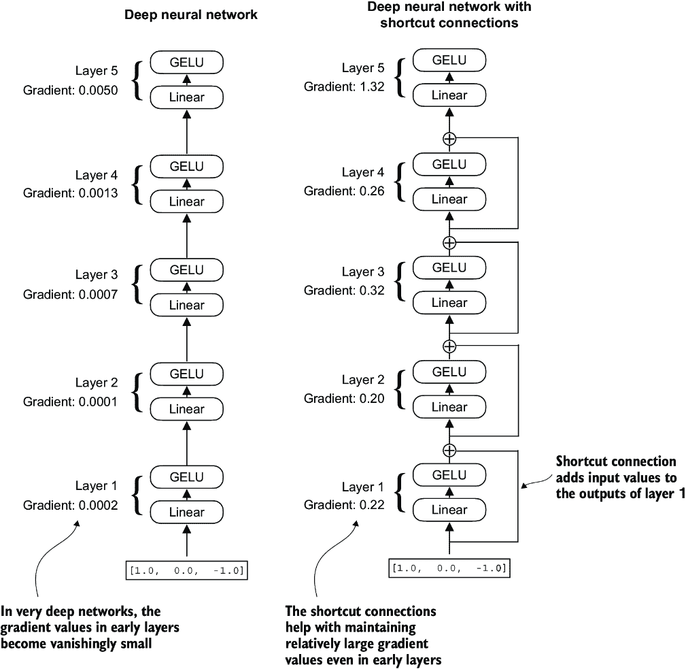

##### 图 4.12 比较了由五层组成的深度神经网络，其中左侧为无捷径连接（左），右侧为有捷径连接（右）。捷径连接涉及将某一层的输入添加到其输出中，从而有效地创建一条绕过某些层的替代路径。梯度表示每一层的平均绝对梯度，我们在列表 4.5 中计算了这些梯度。

图 4.12 表明，通过跳过一层或多层，捷径连接为梯度流动到网络中创建了一条替代的、更短的路径，这是通过将某一层的输出添加到后续层的输出中实现的。这就是为什么这些连接也被称为跳过连接。它们在训练过程中反向传递时保持梯度流动起着至关重要的作用。

在以下列表中，我们实现了图 4.12 中的神经网络，以查看我们如何在`forward`方法中添加快捷连接。

##### 列表 4.5：用于说明快捷连接的神经网络

```py
class ExampleDeepNeuralNetwork(nn.Module):
    def __init__(self, layer_sizes, use_shortcut):
        super().__init__()
        self.use_shortcut = use_shortcut
        self.layers = nn.ModuleList([       #1
            nn.Sequential(nn.Linear(layer_sizes[0], layer_sizes[1]), 
                          GELU()),
            nn.Sequential(nn.Linear(layer_sizes[1], layer_sizes[2]), 
                          GELU()),
            nn.Sequential(nn.Linear(layer_sizes[2], layer_sizes[3]), 
                          GELU()),
            nn.Sequential(nn.Linear(layer_sizes[3], layer_sizes[4]), 
                          GELU()),
            nn.Sequential(nn.Linear(layer_sizes[4], layer_sizes[5]), 
                          GELU())
        ])

    def forward(self, x):
        for layer in self.layers:
            layer_output = layer(x)         #2
            if self.use_shortcut and x.shape == layer_output.shape:    #3
                x = x + layer_output
            else:
                x = layer_output
        return x
```

#1 实现五个层

#2 计算当前层的输出

#3 检查是否可以应用快捷连接

代码实现了一个包含五个层的深度神经网络，每个层由一个`Linear`层和一个`GELU`激活函数组成。在正向传播过程中，我们迭代地将输入通过层传递，如果将`self.use_shortcut`属性设置为`True`，则可选地添加快捷连接。

让我们使用此代码初始化一个没有快捷连接的神经网络。每个层将被初始化，以便它接受一个具有三个输入值的示例，并返回三个输出值。最后一层返回一个单一的输出值：

```py
layer_sizes = [3, 3, 3, 3, 3, 1]  
sample_input = torch.tensor([[1., 0., -1.]])
torch.manual_seed(123)                            #1
model_without_shortcut = ExampleDeepNeuralNetwork(
    layer_sizes, use_shortcut=False
)
```

#1 指定初始权重的随机种子以实现可重复性

接下来，我们实现一个函数，该函数在模型的反向传播过程中计算梯度：

```py
def print_gradients(model, x):
    output = model(x)             #1
    target = torch.tensor([[0.]])

    loss = nn.MSELoss()
    loss = loss(output, target)    #2

    loss.backward()          #3

    for name, param in model.named_parameters():
        if 'weight' in name:
            print(f"{name} has gradient mean of {param.grad.abs().mean().item()}")
```

#1 正向传播

#2 根据目标和输出之间的接近程度计算损失

#3 反向传播以计算梯度

此代码指定了一个损失函数，该函数计算模型输出与用户指定的目标（这里，为了简单起见，是值 0）的接近程度。然后，在调用`loss.backward()`时，PyTorch 计算模型中每个层的损失梯度。我们可以通过`model.named_parameters()`遍历权重参数。假设我们有一个 3 × 3 的权重参数矩阵，对于给定的层。在这种情况下，该层将具有 3 × 3 的梯度值，我们打印这些 3 × 3 梯度值的平均值绝对梯度，以获得每个层的单个梯度值，以便更容易地比较层之间的梯度。

简而言之，`.backward()`方法是 PyTorch 中的一个方便的方法，它计算损失梯度，这在模型训练期间是必需的，而不需要我们自己实现梯度计算的数学，从而使得与深度神经网络的工作变得更加容易。

注意：如果您不熟悉梯度以及神经网络训练的概念，我建议阅读附录 A 中的 A.4 和 A.7 节。

让我们现在使用`print_gradients`函数并将其应用于没有跳过连接的模型：

```py
print_gradients(model_without_shortcut, sample_input)
```

输出是

```py
layers.0.0.weight has gradient mean of 0.00020173587836325169
layers.1.0.weight has gradient mean of 0.0001201116101583466
layers.2.0.weight has gradient mean of 0.0007152041653171182
layers.3.0.weight has gradient mean of 0.001398873864673078
layers.4.0.weight has gradient mean of 0.005049646366387606
```

`print_gradients`函数的输出显示，随着我们从最后一层`(layers.4)`向第一层`(layers.0)`前进，梯度值会变小，这是一种称为*梯度消失问题*的现象。

让我们现在实例化一个具有跳过连接的模型，看看它与没有快捷连接的模型相比如何：

```py
torch.manual_seed(123)
model_with_shortcut = ExampleDeepNeuralNetwork(
    layer_sizes, use_shortcut=True
)
print_gradients(model_with_shortcut, sample_input)
```

输出是

```py
layers.0.0.weight has gradient mean of 0.22169792652130127
layers.1.0.weight has gradient mean of 0.20694105327129364
layers.2.0.weight has gradient mean of 0.32896995544433594
layers.3.0.weight has gradient mean of 0.2665732502937317
layers.4.0.weight has gradient mean of 1.3258541822433472
```

最后一个层`(layers.4`)的梯度值仍然比其他层要大。然而，随着我们向第一层`(layers.0`)前进，梯度值趋于稳定，并不会缩小到一个极小的值。

总之，快捷连接对于克服深度神经网络中梯度消失问题的限制至关重要。快捷连接是像 LLM 这样的大型模型的核心构建块，它们将有助于通过确保在下一章中训练 GPT 模型时层间梯度流的连续性来促进更有效的训练。

接下来，我们将把之前涵盖的所有概念（层归一化、GELU 激活、前馈模块和快捷连接）连接到 transformer 块中，这是我们需要编码 GPT 架构的最后一个构建块。

## 4.5 在 transformer 块中连接注意力和线性层

现在，让我们实现*transformer 块*，这是 GPT 和其他 LLM 架构的基本构建块。这个块在 1.24 亿参数的 GPT-2 架构中重复了 12 次，结合了我们之前涵盖的几个概念：多头注意力、层归一化、dropout、前馈层和 GELU 激活。稍后，我们将把这个 transformer 块连接到 GPT 架构的其余部分。

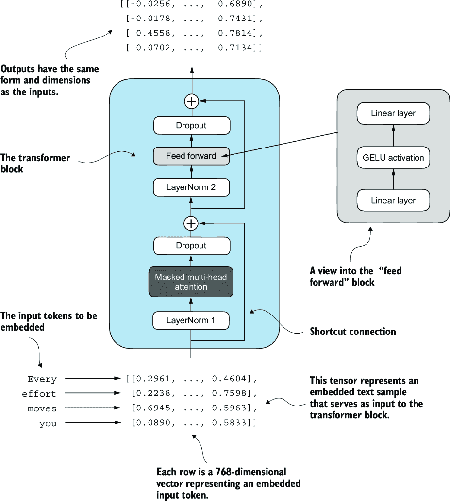

##### 图 4.13 transformer 块的示意图。输入标记已嵌入到 768 维向量中。每一行对应一个标记的向量表示。transformer 块输出的向量与输入具有相同的维度，然后可以被输入到 LLM 的后续层中。

图 4.13 展示了一个结合了多个组件的 transformer 块，包括第三章中提到的掩码多头注意力模块（见章节 3）以及我们之前实现过的`FeedForward`模块（见第 4.3 节）。当 transformer 块处理一个输入序列时，序列中的每个元素（例如，一个单词或子词标记）由一个固定大小的向量表示（在这种情况下，768 维）。transformer 块内的操作，包括多头注意力和前馈层，被设计成以保留其维度的这种方式转换这些向量。

理念在于多头注意力块中的自注意力机制识别并分析输入序列中元素之间的关系。相比之下，前馈网络在每一个位置单独修改数据。这种组合不仅使对输入的理解和处理更加细腻，而且增强了模型处理复杂数据模式的整体能力。

我们可以在代码中创建`TransformerBlock`。

##### 列表 4.6 GPT 的 transformer 块组件

```py
from chapter03 import MultiHeadAttention

class TransformerBlock(nn.Module):
    def __init__(self, cfg):
        super().__init__()
        self.att = MultiHeadAttention(
            d_in=cfg["emb_dim"],
            d_out=cfg["emb_dim"],
            context_length=cfg["context_length"],
            num_heads=cfg["n_heads"], 
            dropout=cfg["drop_rate"],
            qkv_bias=cfg["qkv_bias"])
        self.ff = FeedForward(cfg)
        self.norm1 = LayerNorm(cfg["emb_dim"])
        self.norm2 = LayerNorm(cfg["emb_dim"])
        self.drop_shortcut = nn.Dropout(cfg["drop_rate"])

    def forward(self, x):
 #1
        shortcut = x
        x = self.norm1(x)
        x = self.att(x)
        x = self.drop_shortcut(x)
        x = x + shortcut      #2

        shortcut = x         #3
        x = self.norm2(x)
        x = self.ff(x)
        x = self.drop_shortcut(x)
        x = x + shortcut      #4
        return x
```

#1 注意力块的快捷连接

#2 将原始输入添加回

#3 前馈块的快捷连接

#4 添加原始输入回

给定的代码在 PyTorch 中定义了一个 `TransformerBlock` 类，该类包含一个多头注意力机制 (`MultiHeadAttention`) 和一个前馈网络 (`FeedForward`)，这两个组件都是基于提供的配置字典 (`cfg`) 配置的，例如 `GPT_CONFIG_124M`。

在这两个组件之前应用层归一化 (`LayerNorm`)，并在它们之后应用 dropout 以正则化模型并防止过拟合。这被称为 *Pre-LayerNorm*。较老的架构，如原始的 Transformer 模型，在自注意力机制和前馈网络之后应用层归一化，称为 *Post-LayerNorm*，这通常会导致更差的训练动态。

该类还实现了前向传递，其中每个组件之后都跟着一个快捷连接，该连接将块的输入添加到其输出中。这个关键特性有助于在训练期间通过网络流动梯度，并提高深度模型的学习（参见第 4.4 节）。

使用我们之前定义的 `GPT_CONFIG_124M` 字典，让我们实例化一个 Transformer 模块并给它一些样本数据：

```py
torch.manual_seed(123)
x = torch.rand(2, 4, 768)                   #1
block = TransformerBlock(GPT_CONFIG_124M)
output = block(x)

print("Input shape:", x.shape)
print("Output shape:", output.shape)
```

#1 创建形状为 [batch_size, num_tokens, emb_dim] 的样本输入

输出结果为

```py
Input shape: torch.Size([2, 4, 768])
Output shape: torch.Size([2, 4, 768])
```

如我们所见，Transformer 模块在其输出中保持了输入维度，这表明 Transformer 架构在处理数据序列时不会改变它们的形状。

在 Transformer 模块架构中保持形状不是偶然的，而是其设计的一个关键方面。这种设计使其能够有效地应用于广泛的序列到序列任务，其中每个输出向量直接对应于一个输入向量，保持一对一的关系。然而，输出是一个上下文向量，它封装了整个输入序列的信息（参见第三章）。这意味着尽管序列的物理维度（长度和特征大小）在通过 Transformer 模块时保持不变，但每个输出向量的内容被重新编码以整合整个输入序列的上下文信息。

在实现了 Transformer 模块之后，我们现在拥有了实现 GPT 架构所需的所有构建块。如图 4.14 所示，Transformer 模块结合了层归一化、前馈网络、GELU 激活和快捷连接。正如我们最终将看到的，这个 Transformer 模块将成为 GPT 架构的主要组成部分。


##### 图 4.14 构建 GPT 架构所需的构建块。黑色勾选表示我们已完成的块。

## 4.6 编写 GPT 模型

我们以对称为`DummyGPTModel`的 GPT 架构的大图概述开始本章。在这个`DummyGPTModel`代码实现中，我们展示了 GPT 模型的输入和输出，但其构建块仍然是一个黑盒，使用`DummyTransformerBlock`和`DummyLayerNorm`类作为占位符。

现在我们将`DummyTransformerBlock`和`DummyLayerNorm`占位符替换为我们之前编写的真实`TransformerBlock`和`LayerNorm`类，以组装 GPT-2 原始 1.24 亿参数版本的完整工作版本。在第五章中，我们将预训练 GPT-2 模型，在第六章中，我们将从 OpenAI 加载预训练的权重。

在我们用代码组装 GPT-2 模型之前，让我们看看它的整体结构，如图 4.15 所示，其中包括我们迄今为止所涵盖的所有概念。正如我们所见，变换块在整个 GPT 模型架构中被重复多次。在 1.24 亿参数的 GPT-2 模型中，它被重复 12 次，我们通过`GPT_CONFIG_124M`字典中的`n_layers`条目来指定。在具有 15.42 亿参数的最大 GPT-2 模型中，变换块被重复 48 次。

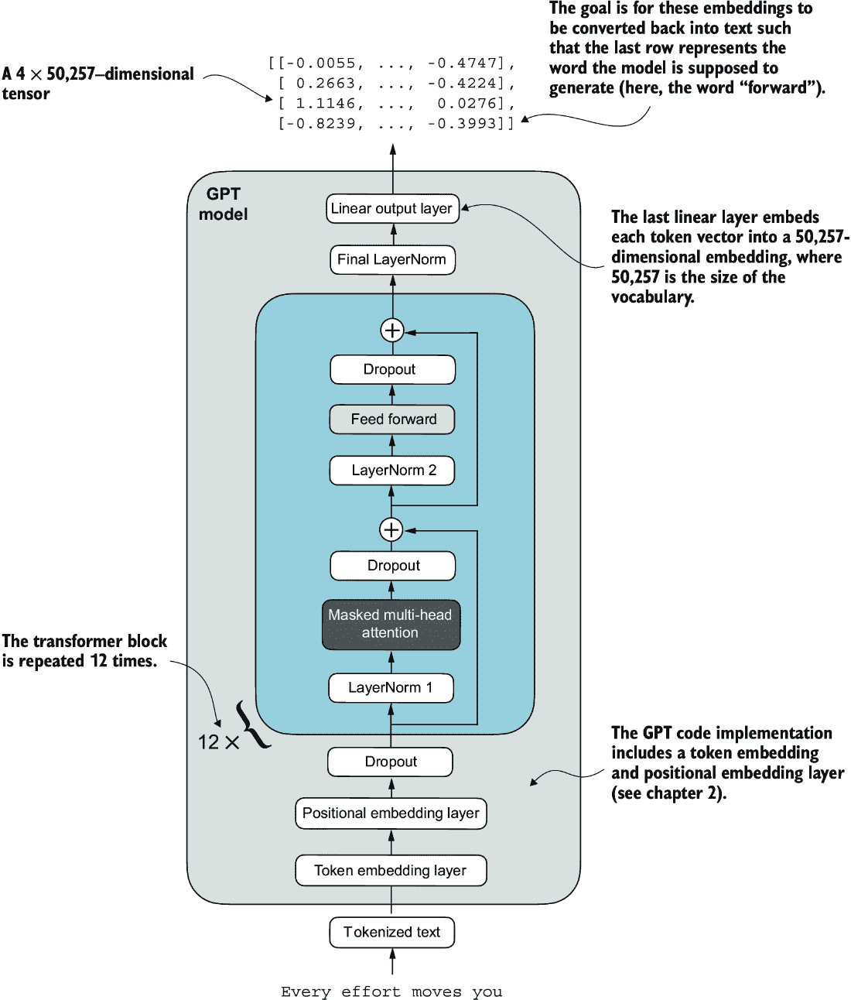

##### 图 4.15 展示了 GPT 模型架构的概述，显示了数据通过 GPT 模型流动的过程。从底部开始，标记化文本首先被转换为标记嵌入，然后添加位置嵌入。这些组合信息形成一个张量，通过中心的一系列变换块（每个包含多头注意力和具有 dropout 和层归一化的前馈神经网络层）传递，这些变换块堆叠在一起并重复 12 次。

最终变换块输出的数据在到达线性输出层之前会经过最后的层归一化步骤。这一层将变换器的输出映射到一个高维空间（在这种情况下，50,257 维，对应于模型的词汇量大小），以预测序列中的下一个标记。

现在我们来编写图 4.15 中的架构。

##### 列表 4.7 GPT 模型架构实现

```py
class GPTModel(nn.Module):
    def __init__(self, cfg):
        super().__init__()
        self.tok_emb = nn.Embedding(cfg["vocab_size"], cfg["emb_dim"])
        self.pos_emb = nn.Embedding(cfg["context_length"], cfg["emb_dim"])
        self.drop_emb = nn.Dropout(cfg["drop_rate"])

        self.trf_blocks = nn.Sequential(
            *[TransformerBlock(cfg) for _ in range(cfg["n_layers"])])

        self.final_norm = LayerNorm(cfg["emb_dim"])
        self.out_head = nn.Linear(
            cfg["emb_dim"], cfg["vocab_size"], bias=False
        )

    def forward(self, in_idx):
        batch_size, seq_len = in_idx.shape
        tok_embeds = self.tok_emb(in_idx)
 #1
        pos_embeds = self.pos_emb(
            torch.arange(seq_len, device=in_idx.device)
        )
        x = tok_embeds + pos_embeds
        x = self.drop_emb(x)
        x = self.trf_blocks(x)
        x = self.final_norm(x)
        logits = self.out_head(x)
        return logits
```

#1 设备设置将允许我们在 CPU 或 GPU 上训练模型，具体取决于输入数据所在的设备。

多亏了`TransformerBlock`类，`GPTModel`类相对较小且紧凑。

这个`GPTModel`类的`__init__`构造函数使用通过 Python 字典`cfg`传入的配置初始化标记和位置嵌入层。这些嵌入层负责将输入标记索引转换为密集向量并添加位置信息（见第二章）。

接下来，`__init__`方法创建了一个等于`cfg`中指定层数的`TransformerBlock`模块的顺序堆叠。在变换器块之后，应用了一个`LayerNorm`层，标准化变换器块的输出以稳定学习过程。最后，定义了一个没有偏置的线性输出头，它将变换器的输出投影到分词器的词汇空间，为词汇表中的每个标记生成 logits。

前向方法接收一个输入标记索引的批次，计算它们的嵌入，应用位置嵌入，将序列通过变换器块，对最终输出进行归一化，然后计算 logits，表示下一个标记的非归一化概率。我们将在下一节将这些 logits 转换为标记和文本输出。

现在，让我们使用传递给`cfg`参数的`GPT_CONFIG_ 124M`字典初始化 124 百万参数的 GPT 模型，并用我们之前创建的批文本输入进行喂养：

```py
torch.manual_seed(123)
model = GPTModel(GPT_CONFIG_124M)

out = model(batch)
print("Input batch:\n", batch)
print("\nOutput shape:", out.shape)
print(out)
```

这段代码打印了输入批次的内 容，然后是输出张量：

```py
Input batch:
 tensor([[6109,  3626,  6100,   345],      #1
         [6109,  1110,  6622,   257]])     #2

Output shape: torch.Size([2, 4, 50257])
tensor([[[ 0.3613,  0.4222, -0.0711,  ...,  0.3483,  0.4661, -0.2838],
         [-0.1792, -0.5660, -0.9485,  ...,  0.0477,  0.5181, -0.3168],
         [ 0.7120,  0.0332,  0.1085,  ...,  0.1018, -0.4327, -0.2553],
         [-1.0076,  0.3418, -0.1190,  ...,  0.7195,  0.4023,  0.0532]],

        [[-0.2564,  0.0900,  0.0335,  ...,  0.2659,  0.4454, -0.6806],
         [ 0.1230,  0.3653, -0.2074,  ...,  0.7705,  0.2710,  0.2246],
         [ 1.0558,  1.0318, -0.2800,  ...,  0.6936,  0.3205, -0.3178],
         [-0.1565,  0.3926,  0.3288,  ...,  1.2630, -0.1858,  0.0388]]],
       grad_fn=<UnsafeViewBackward0>)
```

#1 文本 1 的标记 ID

#2 文本 2 的标记 ID

如我们所见，输出张量的形状为 `[2,` `4,` `50257]`，因为我们输入了两个每个包含四个标记的文本。最后一个维度，`50257`，对应于分词器的词汇表大小。稍后，我们将看到如何将这些 50,257 维输出向量中的每一个转换回标记。

在我们继续编写将模型输出转换为文本的函数之前，让我们花更多的时间来分析模型架构本身的大小。使用`numel()`方法，即“元素数量”，我们可以收集模型参数张量中的总参数数量：

```py
total_params = sum(p.numel() for p in model.parameters())
print(f"Total number of parameters: {total_params:,}")
```

结果是

```py
Total number of parameters: 163,009,536
```

现在，一个好奇的读者可能会注意到一个差异。之前，我们提到初始化了一个 124 百万参数的 GPT 模型，那么为什么实际的参数数量是 163 百万呢？

原因是一个称为*权重绑定*的概念，它在原始 GPT-2 架构中使用。这意味着原始 GPT-2 架构在其输出层中重新使用了标记嵌入层的权重。为了更好地理解，让我们看一下我们之前通过`GPTModel`初始化在`model`上的标记嵌入层和线性输出层的形状：

```py
print("Token embedding layer shape:", model.tok_emb.weight.shape)
print("Output layer shape:", model.out_head.weight.shape)
```

如我们从打印输出中可以看到，这两个层的权重张量具有相同的形状：

```py
Token embedding layer shape: torch.Size([50257, 768])
Output layer shape: torch.Size([50257, 768])
```

由于分词器词汇表中有 50,257 个行数，标记嵌入和输出层非常大。让我们根据权重绑定从总 GPT-2 模型计数中减去输出层参数计数：

```py
total_params_gpt2 = (
    total_params - sum(p.numel()
    for p in model.out_head.parameters())
)
print(f"Number of trainable parameters "
      f"considering weight tying: {total_params_gpt2:,}"
)
```

输出是

```py
Number of trainable parameters considering weight tying: 124,412,160
```

如我们所见，该模型现在只有 124 百万参数大，与原始的 GPT-2 模型大小相匹配。

权重绑定可以减少模型的总体内存占用和计算复杂度。然而，根据我的经验，使用独立的标记嵌入层和输出层可以获得更好的训练和模型性能；因此，我们在`GPTModel`实现中使用了独立的层。对于现代大型语言模型（LLMs）也是如此。然而，我们将在第六章中重新审视并实现权重绑定概念，那时我们将从 OpenAI 加载预训练的权重。

##### 练习 4.1 前馈和注意力模块中的参数数量

计算并比较包含在前馈模块中的参数数量和包含在多头注意力模块中的参数数量。

最后，让我们计算我们的`GPTModel`对象中 1.63 亿个参数的内存需求：

```py
total_size_bytes = total_params * 4       #1
total_size_mb = total_size_bytes / (1024 * 1024)     #2
print(f"Total size of the model: {total_size_mb:.2f} MB")
```

#1 计算总大小（假设为 float32，每个参数 4 字节）

#2 转换为兆字节

结果是

```py
Total size of the model: 621.83 MB
```

总之，通过计算我们的`GPTModel`对象中 1.63 亿个参数的内存需求，并假设每个参数是一个 32 位的浮点数，占用 4 字节，我们发现模型的总大小为 621.83 MB，这说明了即使是相对较小的 LLMs 也需要相对较大的存储容量。

现在我们已经实现了`GPTModel`架构，并看到它输出形状为`[batch_size,` `num_tokens,` `vocab_size]`的数值张量，让我们编写代码将这些输出张量转换为文本。

##### 练习 4.2 初始化更大的 GPT 模型

我们初始化了一个参数数量为 1.24 亿的 GPT 模型，被称为“GPT-2 small”。除了更新配置文件外，不进行任何代码修改，使用`GPTModel`类实现 GPT-2 medium（使用 1,024 维嵌入，24 个 transformer 块，16 个多头注意力头），GPT-2 large（1,280 维嵌入，36 个 transformer 块，20 个多头注意力头），以及 GPT-2 XL（1,600 维嵌入，48 个 transformer 块，25 个多头注意力头）。作为额外奖励，计算每个 GPT 模型中的参数总数。

## 4.7 生成文本

我们现在将实现将 GPT 模型的张量输出转换回文本的代码。在我们开始之前，让我们简要回顾一下像 LLM 这样的生成模型是如何逐个单词（或标记）生成文本的。

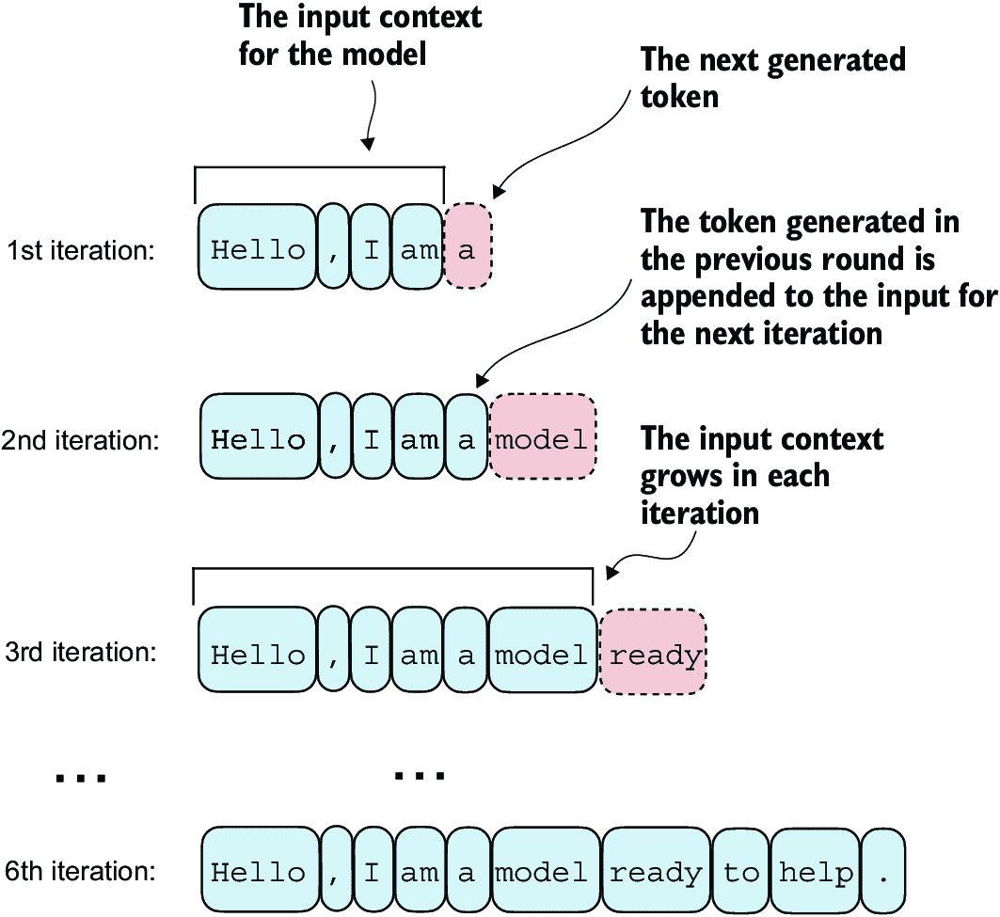

##### 图 4.16 LLM 逐个标记生成文本的逐步过程。从初始输入上下文（“你好，我是”）开始，模型在每次迭代中预测后续标记，并将其附加到下一次预测的输入上下文中。如图所示，第一次迭代添加了“a”，第二次添加了“model”，第三次添加了“ready”，逐步构建句子。

图 4.16 说明了 GPT 模型根据输入上下文（例如“你好，我是。”）生成文本的逐步过程。每次迭代，输入上下文都会增长，允许模型生成连贯且上下文适当的文本。到第六次迭代时，模型已经构建了一个完整的句子：“你好，我是一个准备帮助的模型。”我们已经看到，我们当前的 `GPTModel` 实现输出形状为 `[batch_size,` `num_token,` `vocab_size]` 的张量。现在的问题是：GPT 模型是如何从这些输出张量生成文本的？

GPT 模型从输出张量到生成文本的过程涉及几个步骤，如图 4.17 所示。这些步骤包括解码输出张量、根据概率分布选择标记，并将这些标记转换为可读文本。

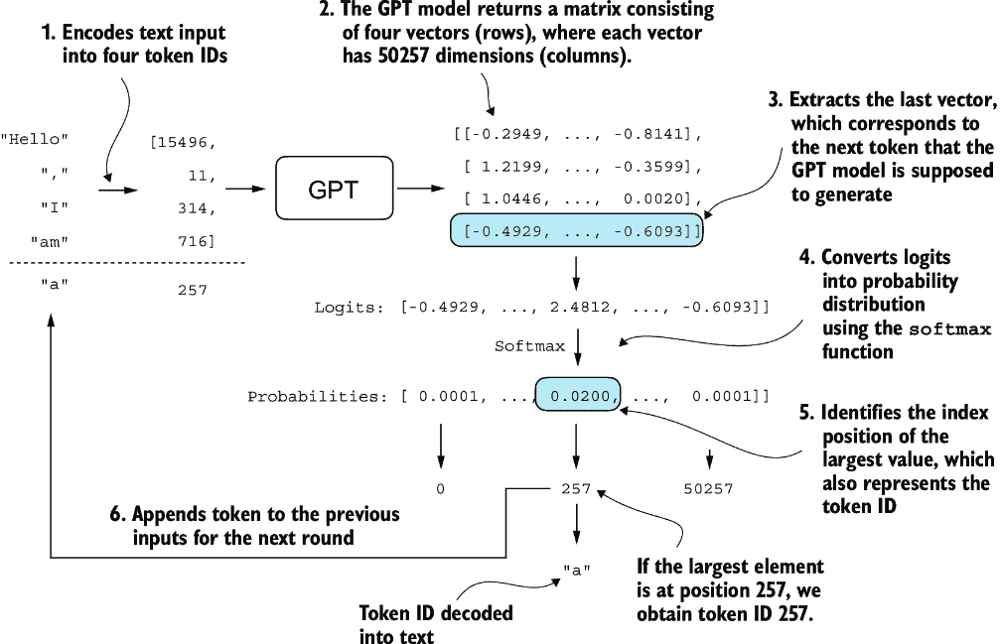

##### 图 4.17 通过展示标记生成过程中的单个迭代，展示了 GPT 模型中文本生成的机制。这个过程首先将输入文本编码为标记 ID，然后将这些 ID 输入到 GPT 模型中。模型的输出随后被转换回文本，并附加到原始输入文本上。

图 4.17 中详细说明了下一标记生成过程，展示了 GPT 模型根据其输入生成下一个标记的单个步骤。在每一步中，模型输出一个矩阵，其中包含表示潜在下一个标记的向量。与下一个标记对应的向量被提取出来，并通过 `softmax` 函数转换为概率分布。在包含结果概率分数的向量中，找到最高值的索引，这对应于标记 ID。然后，这个标记 ID 被解码回文本，生成序列中的下一个标记。最后，这个标记被附加到之前的输入上，形成新的输入序列，用于后续迭代。这个逐步过程使模型能够顺序生成文本，从初始输入上下文构建连贯的短语和句子。

在实践中，我们重复这个过程许多次迭代，例如图 4.16 所示，直到达到用户指定的生成标记数。在代码中，我们可以将标记生成过程实现如下所示。

##### 列表 4.8 GPT 模型生成文本的函数

```py
def generate_text_simple(model, idx,                 #1
                         max_new_tokens, context_size): 
    for _ in range(max_new_tokens):
        idx_cond = idx[:, -context_size:]    #2
        with torch.no_grad():
            logits = model(idx_cond)

        logits = logits[:, -1, :]                    #3
        probas = torch.softmax(logits, dim=-1)           #4
        idx_next = torch.argmax(probas, dim=-1, keepdim=True)    #5
        idx = torch.cat((idx, idx_next), dim=1)     #6

    return idx
```

#1 idx 是当前上下文中索引的 (batch, n_tokens) 数组。

#2 如果当前上下文超过支持的上下文大小，则裁剪当前上下文，例如，如果 LLM 只支持 5 个标记，而上下文大小为 10，则只使用最后 5 个标记作为上下文

#3 仅关注最后一个时间步，因此 (batch, n_token, vocab_size) 变为 (batch, vocab_size)

#4 probas 的形状为 (batch, vocab_size)。

#5 idx_next 的形状为 (batch, 1)。

#6 将采样索引添加到运行序列中，其中 idx 的形状为 (batch, n_tokens+1)

此代码演示了使用 PyTorch 实现语言模型生成循环的简单实现。它迭代指定数量的新 token 以生成，裁剪当前上下文以适应模型的最大上下文大小，计算预测，然后根据最高概率预测选择下一个 token。

要编写`generate_text_simple`函数，我们使用`softmax`函数将 logits 转换为概率分布，然后通过`torch.argmax`识别具有最高值的位。`softmax`函数是单调的，这意味着它在转换为输出时保留了输入的顺序。因此，在实践中，softmax 步骤是多余的，因为 softmax 输出张量中得分最高的位置与 logit 张量中的相同位置。换句话说，我们可以直接对 logits 张量应用`torch.argmax`函数并得到相同的结果。然而，我提供了转换的代码，以说明将 logits 转换为概率的完整过程，这可以增加额外的直观性，以便模型生成最可能的下一个 token，这被称为*贪婪解码*。

当我们在下一章实现 GPT 训练代码时，我们将使用额外的采样技术来修改 softmax 输出，使得模型不总是选择最可能的 token。这为生成的文本引入了变化性和创造性。

使用`generate_text_simple`函数逐个生成 token ID 并将其附加到上下文中的这个过程在图 4.18 中进一步说明。（每个迭代的 token ID 生成过程在图 4.17 中详细说明。）我们以迭代的方式生成 token ID。例如，在迭代 1 中，模型被提供了对应于“Hello, I am,”的 token，预测下一个 token（ID 为 257，即“a”），并将其附加到输入中。这个过程重复进行，直到模型在六次迭代后生成完整的句子“Hello, I am a model ready to help”。

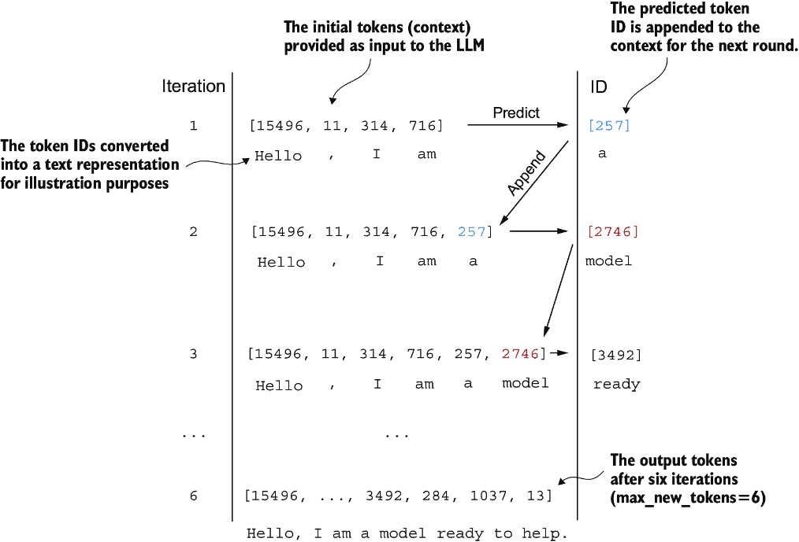

##### 图 4.18 token 预测周期的六次迭代，其中模型以一系列初始 token ID 作为输入，预测下一个 token，并将此 token 附加到下一个迭代的输入序列中。（token ID 也被转换成相应的文本以更好地理解。）

现在，让我们尝试使用`"Hello,` `I` `am"`上下文作为模型输入的`generate_text_simple`函数。首先，我们将输入上下文编码为 token ID：

```py
start_context = "Hello, I am"
encoded = tokenizer.encode(start_context)
print("encoded:", encoded)
encoded_tensor = torch.tensor(encoded).unsqueeze(0)    #1
print("encoded_tensor.shape:", encoded_tensor.shape)
```

#1 添加批处理维度

编码的 ID 是

```py
encoded: [15496, 11, 314, 716]
encoded_tensor.shape: torch.Size([1, 4])
```

接下来，我们将模型置于`.eval()`模式。这禁用了仅在训练期间使用的随机组件，如 dropout，并使用`generate_text_simple`函数对编码的输入张量进行操作：

```py
model.eval()                  #1
out = generate_text_simple(
    model=model,
    idx=encoded_tensor, 
    max_new_tokens=6, 
    context_size=GPT_CONFIG_124M["context_length"]
)
print("Output:", out)
print("Output length:", len(out[0]))
```

#1 禁用 dropout，因为我们不在训练模型

生成的输出 token ID 是

```py
Output: tensor([[15496,    11,   314,   716, 27018, 24086, 47843,
30961, 42348,  7267]])
Output length: 10
```

使用分词器的`.decode`方法，我们可以将 ID 转换回文本：

```py
decoded_text = tokenizer.decode(out.squeeze(0).tolist())
print(decoded_text)
```

模型输出的文本格式是

```py
Hello, I am Featureiman Byeswickattribute argue
```

如我们所见，模型生成了乱码，这与连贯的文本“Hello, I am a model ready to help”完全不同。发生了什么？模型无法生成连贯文本的原因是我们还没有对其进行训练。到目前为止，我们只实现了 GPT 架构，并使用初始随机权重初始化了一个 GPT 模型实例。模型训练本身是一个大主题，我们将在下一章中探讨它。

##### 练习 4.3 使用单独的 dropout 参数

在本章的开头，我们在`GPT_ CONFIG_124M`字典中定义了一个全局`drop_rate`设置，以在`GPTModel`架构的各个地方设置 dropout 率。将代码修改为为模型架构中的各个 dropout 层指定单独的 dropout 值。（提示：我们在三个不同的地方使用了 dropout 层：嵌入层、快捷层和多头注意力模块。）

## 摘要

+   层归一化通过确保每一层的输出具有一致的均值和方差来稳定训练。

+   快捷连接是通过将一层或多层的输出直接馈送到更深的一层来跳过一层或更多层的连接，这有助于缓解训练深层神经网络（如 LLM）时的梯度消失问题。

+   Transformer 块是 GPT 模型的核心结构组件，它结合了带掩码的多头注意力模块和使用了 GELU 激活函数的全连接前馈网络。

+   GPT 模型是具有数百万到数十亿参数的具有许多重复 transformer 块的 LLM。

+   GPT 模型有多种大小，例如 124、345、762 和 15.42 亿参数，我们可以使用相同的`GPTModel` Python 类来实现。

+   类似 GPT 的 LLM 的文本生成能力涉及通过按顺序预测给定输入上下文中的一个标记来解码输出张量，从而将人类可读的文本转换为文本。

+   没有训练，GPT 模型生成的文本是不连贯的，这强调了模型训练对于生成连贯文本的重要性。
