# 5 在未标记数据上的预训练

### 本章涵盖

+   计算训练和验证集损失以评估训练过程中 LLM 生成文本的质量

+   实现训练函数和预训练 LLM

+   保存和加载模型权重以继续训练 LLM

+   从 OpenAI 加载预训练权重

到目前为止，我们已经实现了数据采样和注意力机制，并编写了 LLM 架构的代码。现在是时候实现训练函数并预训练 LLM 了。我们将学习基本模型评估技术来衡量生成文本的质量，这是在训练过程中优化 LLM 的要求。此外，我们将讨论如何加载预训练权重，为我们的 LLM 提供一个坚实的微调起点。图 5.1 概述了我们的整体计划，突出了本章将讨论的内容。


##### 图 5.1 编码 LLM 的三个主要阶段。本章重点介绍第 2 阶段：预训练 LLM（步骤 4），包括实现训练代码（步骤 5）、评估性能（步骤 6）以及保存和加载模型权重（步骤 7）。

##### 权重参数

在 LLM 和其他深度学习模型的背景下，*权重*指的是学习过程调整的可训练参数。这些权重也被称为*权重参数*或简单地称为*参数*。在 PyTorch 等框架中，这些权重存储在线性层中；我们在第三章中使用了这些来实现多头注意力模块，在第四章中实现了`GPTModel`。初始化一个层（`new_layer` `=` `torch.nn.Linear(...)`）后，我们可以通过`.weight`属性访问其权重，即`new_layer.weight`。此外，为了方便起见，PyTorch 允许通过方法`model.parameters()`直接访问模型的所有可训练参数，包括权重和偏差，我们将在实现模型训练时使用此方法。

## 5.1 评估生成文本模型

在简要回顾了第四章中的文本生成后，我们将设置我们的 LLM 进行文本生成，然后讨论评估生成文本质量的基本方法。然后我们将计算训练和验证损失。图 5.2 展示了本章涵盖的主题，其中前三个步骤被突出显示。


##### 图 5.2 本章涵盖主题的概述。我们首先回顾文本生成（步骤 1），然后继续讨论基本模型评估技术（步骤 2）和训练与验证损失（步骤 3）。

### 5.1.1 使用 GPT 生成文本

让我们设置 LLM 并简要回顾我们在第四章中实现的文本生成过程。我们首先通过`GPTModel`类和`GPT_CONFIG_124M`字典（见第四章）初始化我们将要评估和训练的 GPT 模型：

```py
import torch
from chapter04 import GPTModel

GPT_CONFIG_124M = {
    "vocab_size": 50257,
    "context_length": 256,    #1
    "emb_dim": 768,
    "n_heads": 12,
    "n_layers": 12, 
    "drop_rate": 0.1,       #2
    "qkv_bias": False
}
torch.manual_seed(123)
model = GPTModel(GPT_CONFIG_124M)
model.eval()
```

#1 我们将上下文长度从 1,024 缩短到 256 个标记。

#2 将 dropout 设置为 0 是可能且常见的。

考虑到`GPT_CONFIG_124M`字典，与我们上一章相比，我们唯一做出的调整是将上下文长度（`context_length`）减少到 256 个 token。这种修改降低了训练模型的计算需求，使得在标准笔记本电脑上执行训练成为可能。

原始的 GPT-2 模型有 1240 万个参数，配置为处理最多 1,024 个 token。在训练过程之后，我们将更新上下文大小设置并加载预训练的权重，以便与配置为 1,024 个 token 上下文长度的模型一起工作。

使用`GPTModel`实例，我们采用第四章中的`generate_text_simple`函数，并引入两个实用的函数：`text_to_token_ids`和`token_ids_to_text`。这些函数便于在文本和 token 表示之间进行转换，这是我们将在本章中利用的技术。

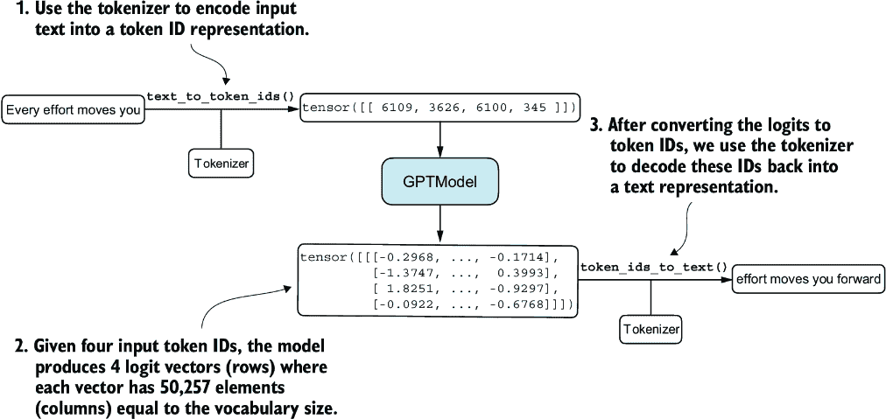

##### 图 5.3 文本生成涉及将文本编码成 LLM 处理的 token ID，然后将 logit 向量转换回 token ID，并反序列化为文本表示。

图 5.3 展示了使用 GPT 模型的三步文本生成过程。首先，分词器将输入文本转换为一系列 token ID（参见第二章）。其次，模型接收这些 token ID 并生成相应的 logit，这些 logit 是表示词汇表中每个 token 概率分布的向量（参见第四章）。第三，这些 logit 被转换回 token ID，分词器将其解码为可读文本，从而完成从文本输入到文本输出的循环。

我们可以实施如以下列表所示的文本生成过程。

##### 列表 5.1 文本到 token ID 转换的实用函数

```py
import tiktoken
from chapter04 import generate_text_simple

def text_to_token_ids(text, tokenizer):
    encoded = tokenizer.encode(text, allowed_special={'<|endoftext|>'})
    encoded_tensor = torch.tensor(encoded).unsqueeze(0)    #1
    return encoded_tensor

def token_ids_to_text(token_ids, tokenizer):
    flat = token_ids.squeeze(0)                #2
    return tokenizer.decode(flat.tolist())

start_context = "Every effort moves you"
tokenizer = tiktoken.get_encoding("gpt2")

token_ids = generate_text_simple(
    model=model,
    idx=text_to_token_ids(start_context, tokenizer),
    max_new_tokens=10,
    context_size=GPT_CONFIG_124M["context_length"]
)
print("Output text:\n", token_ids_to_text(token_ids, tokenizer))
```

#1 .unsqueeze(0) 添加批处理维度

#2 移除批处理维度

使用此代码，`model`生成了以下文本：

```py
Output text:
 Every effort moves you rentingetic wasnم refres RexMeCHicular stren
```

显然，模型还没有生成连贯的文本，因为它还没有经过训练。为了定义什么使文本“连贯”或“高质量”，我们必须实现一个数值方法来评估生成的内容。这种方法将使我们能够在整个训练过程中监控和提升模型的表现。

接下来，我们将计算生成输出的*损失指标*。这个损失作为训练进度和成功的指标。此外，在后面的章节中，当我们微调我们的 LLM 时，我们将回顾评估模型质量的额外方法。

### 5.1.2 计算文本生成损失

接下来，让我们通过计算*文本生成损失*来探索在训练过程中评估文本质量的技术。我们将通过一个实际例子逐步讲解这个主题，以使概念清晰并具有实用性，首先简要回顾如何通过`generate_text_simple`函数加载数据和生成文本。

图 5.4 展示了从输入文本到 LLM 生成文本的整体流程，使用五步程序。这个文本生成过程显示了`generate_text_simple`函数内部执行的操作。在我们能够计算衡量生成文本质量的损失之前，我们需要执行这些相同的初始步骤。

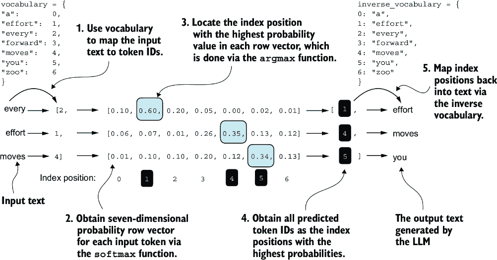

##### 图 5.4 对于左侧显示的每个三个输入标记，我们计算一个包含与词汇表中每个标记对应的概率分数的向量。每个向量中最高概率分数的索引位置代表最可能的下一个标记 ID。与最高概率分数关联的这些标记 ID 被选中并映射回表示模型生成的文本的文本。

图 5.4 概述了使用小七标记词汇表来适应单页的文本生成过程。然而，我们的`GPTModel`使用一个包含 50,257 个单词的更大词汇表；因此，以下代码中的标记 ID 将范围从 0 到 50,256，而不是 0 到 6。

此外，图 5.4 仅为了简化展示了单个文本示例（`"every` `effort` `moves"`）。在以下实现图中步骤的动手代码示例中，我们将使用两个 GPT 模型的输入示例（`"every` `effort` `moves"`和`"I` `really` `like"`）。

考虑这两个已经映射到标记 ID 的输入示例（图 5.4，步骤 1）：

```py
inputs = torch.tensor([[16833, 3626, 6100],   # ["every effort moves",
                       [40,    1107, 588]])   #  "I really like"]
```

与这些输入匹配，`targets`包含我们希望模型生成的标记 ID：

```py
targets = torch.tensor([[3626, 6100, 345  ],  # [" effort moves you",
                        [1107, 588, 11311]])  #  " really like chocolate"]
```

注意，目标输入是但向前移动了一个位置，这是我们在第二章实现数据加载器时讨论的概念。这种移动策略对于教会模型预测序列中的下一个标记至关重要。

现在，我们将输入输入到模型中，为两个输入示例计算 logits 向量，每个示例包含三个标记。然后我们应用`softmax`函数将这些 logits 转换为概率分数（`probas`；图 5.4，步骤 2）：

```py
with torch.no_grad():     #1
    logits = model(inputs)
probas = torch.softmax(logits, dim=-1)     #2
print(probas.shape)
```

#1 禁用梯度跟踪，因为我们还没有开始训练

#2 词汇表中每个标记的概率

概率分数张量（`probas`）的结果维度是

```py
torch.Size([2, 3, 50257])
```

第一个数字，2，对应于输入中的两个示例（行），也称为批量大小。第二个数字，3，对应于每个输入（行）中的标记数量。最后，最后一个数字对应于嵌入维度性，它由词汇表大小决定。通过`softmax`函数将 logits 转换为概率后，`generate_text_simple`函数随后将结果概率分数转换回文本（图 5.4，步骤 3–5）。

我们可以通过对概率分数应用`argmax`函数来完成步骤 3 和 4，以获得相应的标记 ID：

```py
token_ids = torch.argmax(probas, dim=-1, keepdim=True)
print("Token IDs:\n", token_ids)
```

由于我们有两个输入批次，每个批次包含三个标记，将`argmax`函数应用于概率分数（图 5.4，步骤 3）会产生两组输出，每组有三个预测标记 ID：

```py
Token IDs:
 tensor([[[16657],       #1
         [  339],
         [42826]],
        [[49906],        #2
         [29669],
         [41751]]])
```

#1 第一个批次

#2 第二个批次

最后，步骤 5 将标记 ID 转换回文本：

```py
print(f"Targets batch 1: {token_ids_to_text(targets[0], tokenizer)}")
print(f"Outputs batch 1:"
      f" {token_ids_to_text(token_ids[0].flatten(), tokenizer)}")
```

当我们解码这些标记时，我们发现这些输出标记与我们希望模型生成的目标标记相当不同：

```py
Targets batch 1:  effort moves you
Outputs batch 1:  Armed heNetflix
```

由于模型尚未经过训练，它产生的文本与目标文本不同。我们现在想通过损失（图 5.5）来数值评估模型生成文本的性能。这不仅有助于衡量生成文本的质量，也是实现训练函数的基石，我们将使用它来更新模型的权重，以改进生成的文本。


##### 图 5.5 本章节涵盖的主题概述。我们已经完成了步骤 1。我们现在准备实现文本评估函数（步骤 2）。

我们实施的部分文本评估过程，如图 5.5 所示，是测量生成的标记与正确预测（目标）之间的“距离”。我们稍后实施的训练函数将使用这些信息来调整模型权重，以生成更接近（或理想情况下匹配）目标文本的文本。

模型训练的目标是增加与正确目标标记 ID 对应的 softmax 概率，如图 5.6 所示。此 softmax 概率也用于我们将在下一节实施的评估指标中，以数值评估模型的生成输出：正确位置的概率越高，越好。

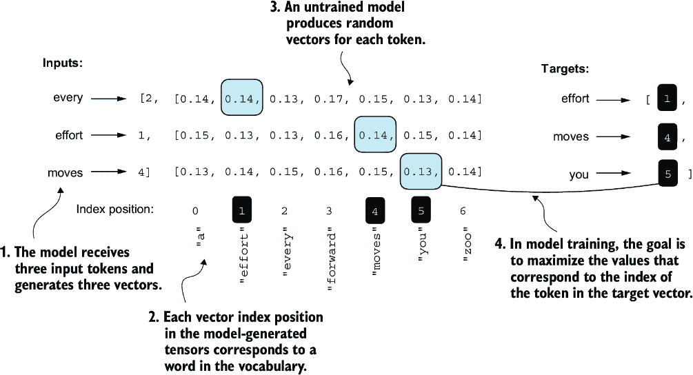

##### 图 5.6 在训练之前，模型产生随机的下一个标记概率向量。模型训练的目标是确保与突出显示的目标标记 ID 对应的概率值最大化。

记住，图 5.6 显示了紧凑的七个标记词汇表的 softmax 概率，以便将所有内容放入单个图中。这表明起始的随机值将围绕 1/7，即大约 0.14。然而，我们用于我们的 GPT-2 模型的词汇表有 50,257 个标记，所以大部分初始概率将围绕 0.00002（1/50,257）。

对于两个输入文本中的每一个，我们可以使用以下代码打印出对应于目标标记的初始 softmax 概率分数：

```py
text_idx = 0
target_probas_1 = probas[text_idx, [0, 1, 2], targets[text_idx]]
print("Text 1:", target_probas_1)

text_idx = 1
target_probas_2 = probas[text_idx, [0, 1, 2], targets[text_idx]]
print("Text 2:", target_probas_2)
```

每个批次的目标标记 ID 概率有三个

```py
Text 1: tensor([7.4541e-05, 3.1061e-05, 1.1563e-05])
Text 2: tensor([1.0337e-05, 5.6776e-05, 4.7559e-06])
```

训练一个大型语言模型（LLM）的目标是最大化正确标记的可能性，这涉及到增加其相对于其他标记的概率。这样，我们确保 LLM 始终选择目标标记——本质上句子的下一个单词——作为它生成的下一个标记。

##### 反向传播

我们如何最大化对应于目标标记的 softmax 概率值？总体来说，我们更新模型权重，使得模型对于我们想要生成的相应标记 ID 输出更高的值。权重更新是通过称为*反向传播*的过程完成的，这是一种训练深度神经网络的标准化技术（有关反向传播和模型训练的更多详细信息，请参阅附录 A 中的 A.3 到 A.7 节）。

反向传播需要一个损失函数，该函数计算模型预测输出（在这里，是针对目标标记 ID 的概率）与实际期望输出之间的差异。这个损失函数衡量模型的预测与目标值之间的偏差程度。

接下来，我们将计算两个示例批次`target_probas_1`和`target_probas_2`的概率得分的损失。主要步骤如图 5.7 所示。由于我们已经对步骤 1 到 3 进行了处理以获得`target_probas_1`和`target_probas_2`，我们继续进行步骤 4，对概率得分应用*对数*：

```py
log_probas = torch.log(torch.cat((target_probas_1, target_probas_2)))
print(log_probas)
```

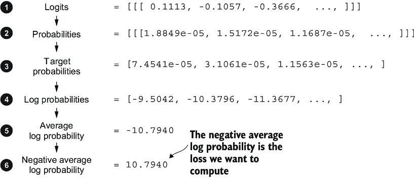

##### 图 5.7 计算损失涉及几个步骤。步骤 1 到 3，我们已经完成，计算了与目标张量对应的标记概率。然后，在步骤 4 到 6 中，这些概率通过对数变换并平均。

这导致了以下值：

```py
tensor([ -9.5042, -10.3796, -11.3677, -11.4798,  -9.7764, -12.2561])
```

在数学优化中处理概率得数的对数比直接处理得分更容易管理。这个主题超出了本书的范围，但我已经在附录 B 中的讲座中进一步详细说明了这一点。

接下来，我们将这些对数概率合并成一个单一得分，通过计算平均值（图 5.7 中的步骤 5）：

```py
avg_log_probas = torch.mean(log_probas)
print(avg_log_probas)
```

结果的平均对数概率得分是

```py
tensor(-10.7940)
```

目标是通过对模型权重进行更新作为训练过程的一部分，将平均对数概率尽可能接近 0。然而，在深度学习中，常见的做法不是将平均对数概率推到 0，而是将负的平均对数概率降低到 0。负的平均对数概率仅仅是平均对数概率乘以-1，这对应于图 5.7 中的步骤 6：

```py
neg_avg_log_probas = avg_log_probas * -1
print(neg_avg_log_probas)
```

这会打印出`tensor(10.7940)`。在深度学习中，将这个负值-10.7940 转换为 10.7940 的术语被称为*交叉熵*损失。PyTorch 在这里很有用，因为它已经内置了一个`cross_entropy`函数，可以为我们处理图 5.7 中的所有这六个步骤。

##### 交叉熵损失

在核心上，交叉熵损失是机器学习和深度学习中一种流行的度量方法，它衡量两个概率分布之间的差异——通常，是标签的真实分布（在这里，是数据集中的标记）和模型预测的分布（例如，由大型语言模型生成的标记概率）。

在机器学习的背景下，特别是在像 PyTorch 这样的框架中，`cross_entropy`函数计算离散结果这一度量，这与给定模型生成的标记概率的目标标记的负平均对数概率相似，使得“交叉熵”和“负平均对数概率”这两个术语在实践中相关且经常互换使用。

在我们应用`cross_entropy`函数之前，让我们简要回顾一下 logits 和目标张量的形状：

```py
print("Logits shape:", logits.shape)
print("Targets shape:", targets.shape)
```

结果形状是

```py
Logits shape: torch.Size([2, 3, 50257])
Targets shape: torch.Size([2, 3])
```

如我们所见，`logits`张量有三个维度：批次大小、标记数量和词汇表大小。`targets`张量有两个维度：批次大小和标记数量。

对于 PyTorch 中的`cross_entropy`损失函数，我们希望通过组合批次维度来展平这些张量：

```py
logits_flat = logits.flatten(0, 1)
targets_flat = targets.flatten()
print("Flattened logits:", logits_flat.shape)
print("Flattened targets:", targets_flat.shape)
```

结果张量维度是

```py
Flattened logits: torch.Size([6, 50257])
Flattened targets: torch.Size([6])
```

记住，`targets`是我们希望 LLM 生成的标记 ID，而`logits`包含在进入`softmax`函数以获得概率分数之前的未缩放模型输出。

之前，我们应用了`softmax`函数，选择了对应于目标 ID 的概率分数，并计算了负平均对数概率。PyTorch 的`cross_entropy`函数将为我们处理所有这些步骤：

```py
loss = torch.nn.functional.cross_entropy(logits_flat, targets_flat)
print(loss)
```

结果损失与我们在手动应用图 5.7 中的各个步骤时获得的结果相同：

```py
tensor(10.7940)
```

##### 混淆度

*混淆度*是常与交叉熵损失一起使用来评估模型在语言建模等任务中性能的度量。它可以提供一种更可解释的方式来理解模型在预测序列中下一个标记时的不确定性。

混淆度衡量模型预测的概率分布与数据集中单词的实际分布之间的匹配程度。与损失类似，较低的混淆度表明模型预测更接近实际分布。

混淆度可以计算为`perplexity` `=` `torch.exp(loss)`，当应用于之前计算的损失时，返回`tensor(48725.8203)`。

混淆度通常被认为比原始损失值更可解释，因为它表示模型在每一步对有效词汇表大小的不确定性。在给定示例中，这相当于模型不确定在词汇表中的 48,725 个标记中应该生成哪个作为下一个标记。

我们现在已计算了两个小型文本输入的损失以供说明。接下来，我们将应用损失计算到整个训练和验证集。

### 5.1.3 计算训练和验证集损失

我们必须首先准备我们将用于训练 LLM 的训练和验证数据集。然后，如图 5.8 所示，我们将计算训练和验证集的交叉熵，这是模型训练过程中的一个重要组成部分。

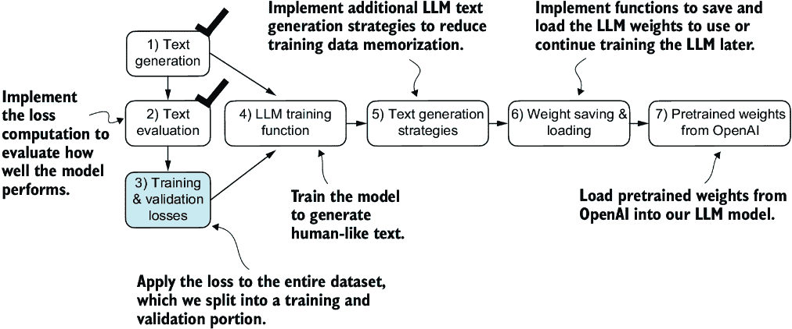

##### 完成步骤 1 和 2，包括计算交叉熵损失后，我们现在可以将这种损失计算应用于整个用于模型训练的文本数据集。

为了在训练集和验证集上计算损失，我们使用一个非常小的文本数据集，即 Edith Wharton 的短篇小说“The Verdict”，我们在第二章中已经使用过它。通过选择公共领域的文本，我们绕过了任何与使用权利相关的担忧。此外，使用如此小的数据集允许在标准笔记本电脑上几分钟内执行代码示例，即使没有高端 GPU，这对于教育目的尤其有利。

注意：对本书感兴趣的读者也可以使用本书的补充代码来准备一个更大规模的由 Project Gutenberg 的 60,000 多本公共领域书籍组成的数据库，并在这些数据上训练 LLM（详细信息请见附录 D）。

##### 预训练大型语言模型（LLM）的成本

为了将我们项目的规模放在正确的视角中，考虑一下训练 700 亿参数的 Llama 2 模型，这是一个相对流行的公开可用的 LLM。这个模型在昂贵的 A100 GPU 上需要 184,320 个 GPU 小时，处理了 2 万亿个标记。在撰写本文时，在 AWS 上运行一个 8 × A100 云服务器每小时大约花费 30 美元。粗略估计，这样一个 LLM 的总训练成本大约为 69 万美元（计算为 184,320 小时除以 8，然后乘以 30）。

以下代码加载了“The Verdict”短篇小说：

```py
file_path = "the-verdict.txt"
with open(file_path, "r", encoding="utf-8") as file:
    text_data = file.read()
```

在加载数据集后，我们可以检查数据集中的字符和标记数量：

```py
total_characters = len(text_data)
total_tokens = len(tokenizer.encode(text_data))
print("Characters:", total_characters)
print("Tokens:", total_tokens)
```

输出是

```py
Characters: 20479
Tokens: 5145
```

仅用 5,145 个标记，文本可能看起来太小，不足以训练 LLM，但如前所述，这是出于教育目的，以便我们可以在几分钟内而不是几周内运行代码。此外，稍后我们将从 OpenAI 加载预训练的权重到我们的 `GPTModel` 代码中。

接下来，我们将数据集分为训练集和验证集，并使用第二章中的数据加载器为 LLM 训练准备批次。这一过程在图 5.9 中进行了可视化。由于空间限制，我们使用 `max_length=6`。然而，对于实际的数据加载器，我们将 `max_length` 设置为 LLM 支持的 256 个标记的上下文长度，这样 LLM 在训练期间可以看到更长的文本。

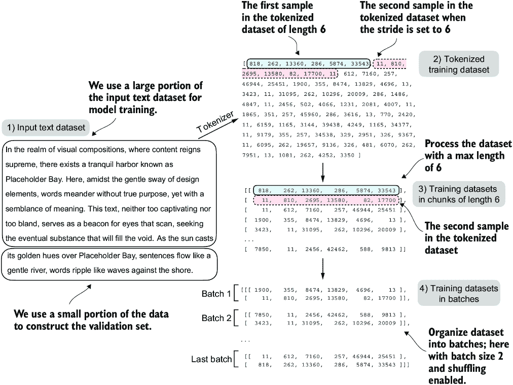

##### 图 5.9 在准备数据加载器时，我们将输入文本分为训练集和验证集部分。然后我们对文本进行分词（为了简单起见，这里只展示了训练集部分）并将分词后的文本划分为用户指定的长度块（这里为 6）。最后，我们打乱行顺序并将分块后的文本组织成批次（这里批次大小为 2），这些批次可以用于模型训练。

注意：我们以类似大小的块呈现训练数据以进行训练，以简化并提高效率。然而，在实践中，训练一个具有可变长度输入的 LLM 也有助于 LLM 在使用时更好地泛化到不同类型的输入。

为了实现数据拆分和加载，我们首先定义一个 `train_ratio`，使用 90% 的数据用于训练，剩余的 10% 作为训练期间模型评估的验证数据：

```py
train_ratio = 0.90
split_idx = int(train_ratio * len(text_data))
train_data = text_data[:split_idx]
val_data = text_data[split_idx:]
```

使用 `train_data` 和 `val_data` 子集，我们现在可以创建相应的数据加载器，重用第二章中的 `create_dataloader_v1` 代码：

```py
from chapter02 import create_dataloader_v1
torch.manual_seed(123)

train_loader = create_dataloader_v1(
    train_data,
    batch_size=2,
    max_length=GPT_CONFIG_124M["context_length"],
    stride=GPT_CONFIG_124M["context_length"],
    drop_last=True,
    shuffle=True,
    num_workers=0
)
val_loader = create_dataloader_v1(
    val_data,
    batch_size=2,
    max_length=GPT_CONFIG_124M["context_length"],
    stride=GPT_CONFIG_124M["context_length"],
    drop_last=False,
    shuffle=False,
    num_workers=0
)
```

我们使用了一个相对较小的批次大小，以减少计算资源的需求，因为我们正在处理一个非常小的数据集。在实践中，使用 1,024 或更大的批次大小来训练 LLM 并不罕见。

作为可选的检查，我们可以遍历数据加载器以确保它们被正确创建：

```py
print("Train loader:")
for x, y in train_loader:
    print(x.shape, y.shape)

print("\nValidation loader:")
for x, y in val_loader:
    print(x.shape, y.shape)
```

我们应该看到以下输出：

```py
Train loader:
torch.Size([2, 256]) torch.Size([2, 256])
torch.Size([2, 256]) torch.Size([2, 256])
torch.Size([2, 256]) torch.Size([2, 256])
torch.Size([2, 256]) torch.Size([2, 256])
torch.Size([2, 256]) torch.Size([2, 256])
torch.Size([2, 256]) torch.Size([2, 256])
torch.Size([2, 256]) torch.Size([2, 256])
torch.Size([2, 256]) torch.Size([2, 256])
torch.Size([2, 256]) torch.Size([2, 256])

Validation loader:
torch.Size([2, 256]) torch.Size([2, 256])
```

根据前面的代码输出，我们有九个训练集批次，每个批次包含两个样本和 256 个标记。由于我们只分配了 10% 的数据用于验证，因此只有一个包含两个输入示例的验证批次。正如预期的那样，输入数据 (`x`) 和目标数据 (`y`) 具有相同的形状（批次大小乘以每个批次的标记数），因为目标数据是按照第二章中讨论的偏移一个位置的目标。

接下来，我们实现一个实用函数来计算通过训练和验证加载器返回的给定批次的交叉熵损失：

```py
def calc_loss_batch(input_batch, target_batch, model, device):
    input_batch = input_batch.to(device)         #1
    target_batch = target_batch.to(device)      
    logits = model(input_batch)
    loss = torch.nn.functional.cross_entropy(
        logits.flatten(0, 1), target_batch.flatten()
    )
    return loss
```

#1 将数据传输到指定设备允许我们将数据传输到 GPU。

我们现在可以使用这个 `calc_loss_batch` 工具函数，它计算单个批次的损失，来实现以下 `calc_loss_loader` 函数，该函数计算给定数据加载器采样的所有批次的损失。

##### 列表 5.2 计算训练和验证损失的函数

```py
def calc_loss_loader(data_loader, model, device, num_batches=None):
    total_loss = 0.
    if len(data_loader) == 0:
        return float("nan")
    elif num_batches is None:
        num_batches = len(data_loader)     #1
    else:
        num_batches = min(num_batches, len(data_loader))   #2
    for i, (input_batch, target_batch) in enumerate(data_loader):
        if i < num_batches:
            loss = calc_loss_batch(
                input_batch, target_batch, model, device
            )
            total_loss += loss.item()    #3
        else:
            break
    return total_loss / num_batches    #4
```

#1 如果未指定固定的 num_batches，则迭代所有批次

#2 如果 num_batches 超过数据加载器中的批次总数，则减少批次数量以匹配数据加载器中的批次总数

#3 对每个批次的损失求和

#4 平均所有批次的损失

默认情况下，`calc_loss_loader` 函数遍历给定数据加载器中的所有批次，将损失累积在 `total_loss` 变量中，然后计算并平均所有批次的损失。或者，我们可以通过 `num_batches` 指定更少的批次数量，以加快模型训练期间的评估速度。

让我们看看这个 `calc_loss_loader` 函数的实际应用，将其应用于训练集和验证集加载器：

```py
device = torch.device("cuda" if torch.cuda.is_available() else "cpu")
model.to(device)   #1
with torch.no_grad():                                        #2
    train_loss = calc_loss_loader(train_loader, model, device)    #3
    val_loss = calc_loss_loader(val_loader, model, device)
print("Training loss:", train_loss)
print("Validation loss:", val_loss)
```

#1 如果你有一台支持 CUDA 的 GPU 的机器，LLM 将在没有对代码进行任何更改的情况下在 GPU 上进行训练。

#2 由于我们尚未开始训练，因此禁用梯度跟踪以提高效率

#3 通过“device”设置，我们确保数据被加载到与 LLM 模型相同的设备上。

产生的损失值是

```py
Training loss: 10.98758347829183
Validation loss: 10.98110580444336
```

损失值相对较高，因为模型尚未经过训练。为了比较，如果模型学会生成与训练和验证集中出现的下一个标记，损失值将接近 0。

现在我们有了衡量生成文本质量的方法，我们将训练 LLM 以减少这种损失，使其在生成文本方面变得更好，如图 5.10 所示。

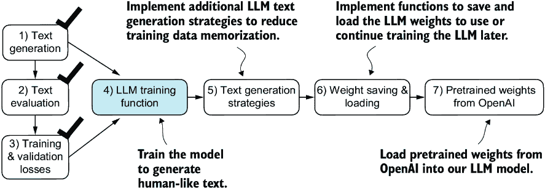

##### 图 5.10 我们回顾了文本生成过程（步骤 1）并实现了基本的模型评估技术（步骤 2）来计算训练集和验证集的损失（步骤 3）。接下来，我们将进入训练函数并预训练 LLM（步骤 4）。

接下来，我们将专注于预训练 LLM。在模型训练后，我们将实现替代文本生成策略，并保存和加载预训练模型权重。

## 5.2 训练 LLM

现在是时候实现预训练 LLM，即我们的`GPTModel`的代码了。为此，我们关注一个简单的训练循环，以保持代码简洁易读。

注意：对更高级技术感兴趣的用户可以在附录 D 中了解有关*学习率预热*、*余弦退火*和*梯度裁剪*等内容。


##### 图 5.11 PyTorch 中训练深度神经网络的典型训练循环包括多个步骤，迭代训练集中的批次数个 epoch。在每个循环中，我们计算每个训练集批次的损失以确定损失梯度，我们使用这些梯度来更新模型权重，以最小化训练集损失。

图 5.11 中的流程图描述了 PyTorch 神经网络的典型训练工作流程，我们用它来训练 LLM。它概述了八个步骤，从迭代每个 epoch 开始，处理批次，重置梯度，计算损失和新梯度，更新权重，最后以打印损失和生成文本样本等监控步骤结束。

注意：如果你相对较新于使用 PyTorch 训练深度神经网络，并且对其中任何步骤不熟悉，请考虑阅读附录 A 中的 A.5 到 A.8 节。

我们可以通过代码中的`train_model_simple`函数实现这个训练流程。

##### 列表 5.3 预训练 LLM 的主要函数

```py
def train_model_simple(model, train_loader, val_loader,
                       optimizer, device, num_epochs,
                       eval_freq, eval_iter, start_context, tokenizer):
    train_losses, val_losses, track_tokens_seen = [], [], []    #1
    tokens_seen, global_step = 0, -1

    for epoch in range(num_epochs):    #2
        model.train()
        for input_batch, target_batch in train_loader:
            optimizer.zero_grad()   #3
            loss = calc_loss_batch(
                input_batch, target_batch, model, device
            )
            loss.backward()                     #4
            optimizer.step()                    #5
            tokens_seen += input_batch.numel()
            global_step += 1

            if global_step % eval_freq == 0:    #6
                train_loss, val_loss = evaluate_model(
                    model, train_loader, val_loader, device, eval_iter)
                train_losses.append(train_loss)
                val_losses.append(val_loss)
                track_tokens_seen.append(tokens_seen)
                print(f"Ep {epoch+1} (Step {global_step:06d}): "
                      f"Train loss {train_loss:.3f}, "
                      f"Val loss {val_loss:.3f}"
                )

        generate_and_print_sample(                      #7
            model, tokenizer, device, start_context
        )
    return train_losses, val_losses, track_tokens_seen
```

#1 初始化列表以跟踪损失和已看到的标记

#2 启动主训练循环

#3 从上一批次的迭代中重置损失梯度

#4 计算损失梯度

#5 使用损失梯度更新模型权重

#6 可选评估步骤

#7 在每个 epoch 后打印一个样本文本

注意：我们刚刚创建的`train_model_simple`函数使用了我们尚未定义的两个函数：`evaluate_model`和`generate_and_print_sample`。

`evaluate_model`函数对应于图 5.11 中的步骤 7。它在每次模型更新后打印训练集和验证集的损失，以便我们可以评估训练是否改善了模型。更具体地说，`evaluate_model`函数在计算训练集和验证集的损失时，确保模型处于评估模式，并且禁用了梯度跟踪和 Dropout。

```py
def evaluate_model(model, train_loader, val_loader, device, eval_iter):
    model.eval()  #1
    with torch.no_grad():                              #2
        train_loss = calc_loss_loader(
            train_loader, model, device, num_batches=eval_iter
        )
        val_loss = calc_loss_loader(
            val_loader, model, device, num_batches=eval_iter
        )
    model.train()
    return train_loss, val_loss
```

#1 在评估期间禁用 Dropout 以获得稳定、可重复的结果。

#2 禁用梯度跟踪，这在评估期间不是必需的，以减少计算开销

与`evaluate_model`类似，`generate_and_print_sample`函数是一个方便的函数，我们用它来跟踪模型在训练过程中的改进情况。特别是，`generate_and_print_sample`函数接受一个文本片段（`start_context`）作为输入，将其转换为 token ID，并使用我们之前使用的`generate_text_simple`函数将其输入到 LLM 中生成文本样本：

```py
def generate_and_print_sample(model, tokenizer, device, start_context):
    model.eval()
    context_size = model.pos_emb.weight.shape[0]
    encoded = text_to_token_ids(start_context, tokenizer).to(device)
    with torch.no_grad():
        token_ids = generate_text_simple(
            model=model, idx=encoded,
            max_new_tokens=50, context_size=context_size
        )
    decoded_text = token_ids_to_text(token_ids, tokenizer)
    print(decoded_text.replace("\n", " "))      #1
    model.train()
```

#1 紧凑打印格式

虽然`evaluate_model`函数给我们提供了一个模型训练进度的数值估计，但这个`generate_and_print_sample`文本函数提供了一个由模型生成的具体文本示例，我们可以用它来判断模型在训练过程中的能力。

##### AdamW

*Adam*优化器是训练深度神经网络时的一个流行选择。然而，在我们的训练循环中，我们选择了*AdamW*优化器。AdamW 是 Adam 的一个变体，它改进了权重衰减方法，旨在通过惩罚较大的权重来最小化模型复杂度并防止过拟合。这种调整使得 AdamW 能够实现更有效的正则化和更好的泛化；因此，AdamW 经常用于 LLM 的训练。

让我们通过使用`AdamW`优化器和之前定义的`train_model_simple`函数训练一个`GPTModel`实例 10 个 epoch 来观察这一切的实际效果：

```py
torch.manual_seed(123)
model = GPTModel(GPT_CONFIG_124M)
model.to(device)
optimizer = torch.optim.AdamW(
     model.parameters(),           #1
    lr=0.0004, weight_decay=0.1
)
num_epochs = 10
train_losses, val_losses, tokens_seen = train_model_simple(
    model, train_loader, val_loader, optimizer, device,
    num_epochs=num_epochs, eval_freq=5, eval_iter=5,
    start_context="Every effort moves you", tokenizer=tokenizer
)
```

#1 `.parameters()`方法返回模型的所有可训练权重参数。

执行`train_model_simple`函数开始训练过程，这个过程在 MacBook Air 或类似笔记本电脑上大约需要 5 分钟才能完成。在此执行期间打印的输出如下：

```py
Ep 1 (Step 000000): Train loss 9.781, Val loss 9.933
Ep 1 (Step 000005): Train loss 8.111, Val loss 8.339
Every effort moves you,,,,,,,,,,,,.                                     
Ep 2 (Step 000010): Train loss 6.661, Val loss 7.048
Ep 2 (Step 000015): Train loss 5.961, Val loss 6.616
Every effort moves you, and, and, and, and, and, and, and, and, and, and,
 and, and, and, and, and, and, and, and, and, and, and, and,, and, and,
[...]                                                   #1
Ep 9 (Step 000080): Train loss 0.541, Val loss 6.393
Every effort moves you?"  "Yes--quite insensible to the irony. She wanted
him vindicated--and by me!"  He laughed again, and threw back the 
window-curtains, I had the donkey. "There were days when I
Ep 10 (Step 000085): Train loss 0.391, Val loss 6.452
Every effort moves you know," was one of the axioms he laid down across the
Sevres and silver of an exquisitely appointed luncheon-table, when, on a
later day, I had again run over from Monte Carlo; and Mrs. Gis
```

#1 删除中间结果以节省空间

如我们所见，训练损失显著改善，从 9.781 的值开始，收敛到 0.391。该模型的语言技能有了很大的提升。一开始，模型只能将逗号添加到起始上下文（`Every` `effort` `moves` `you,,,,,,,,,,,,`）或重复单词`and`。在训练结束时，它可以生成语法正确的文本。

与训练集损失类似，我们可以看到验证损失开始较高（9.933）并在训练过程中下降。然而，它从未变得像训练集损失那样小，并在第 10 个 epoch 后保持在 6.452。

在更详细地讨论验证损失之前，让我们创建一个简单的图，该图显示了训练集和验证集损失并排显示：

```py
import matplotlib.pyplot as plt
from matplotlib.ticker import MaxNLocator
def plot_losses(epochs_seen, tokens_seen, train_losses, val_losses):
    fig, ax1 = plt.subplots(figsize=(5, 3))
    ax1.plot(epochs_seen, train_losses, label="Training loss")
    ax1.plot(
        epochs_seen, val_losses, linestyle="-.", label="Validation loss"
    )
    ax1.set_xlabel("Epochs")
    ax1.set_ylabel("Loss")
    ax1.legend(loc="upper right")
    ax1.xaxis.set_major_locator(MaxNLocator(integer=True))
    ax2 = ax1.twiny()                   #1
    ax2.plot(tokens_seen, train_losses, alpha=0)     #2
    ax2.set_xlabel("Tokens seen")
    fig.tight_layout()
    plt.show()

epochs_tensor = torch.linspace(0, num_epochs, len(train_losses))
plot_losses(epochs_tensor, tokens_seen, train_losses, val_losses)
```

#1 创建一个与同一 y 轴共享的第二个 x 轴

#2 用于对齐刻度的不可见图

结果的训练和验证损失图如图 5.12 所示。如图所示，训练和验证损失在第一个 epoch 开始时开始改善。然而，损失在第二个 epoch 之后开始发散。这种发散以及验证损失远大于训练损失的事实表明，模型对训练数据过度拟合。我们可以通过搜索生成的文本片段来确认模型逐字逐句地记住了训练数据，例如在“The Verdict”文本文件中的“相当” “无感觉” “对” “讽刺”。

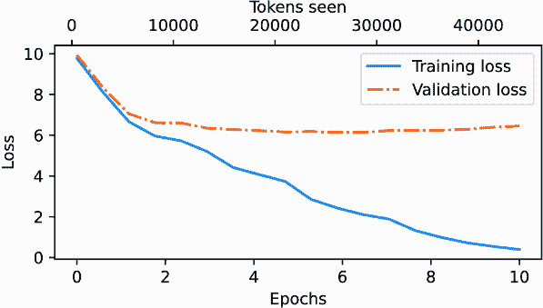

##### 图 5.12 在训练开始时，训练集和验证集损失急剧下降，这是模型正在学习的标志。然而，训练集损失在第二个 epoch 之后继续下降，而验证损失停滞不前。这是模型仍在学习，但在 epoch 2 之后对训练集过度拟合的标志。

由于我们正在使用一个非常小的训练数据集，并且对模型进行多轮训练，因此这种记忆是预期的。通常，在只有一个 epoch 的情况下，在更大的数据集上训练模型是常见的。

注意：如前所述，感兴趣的读者可以尝试在 Project Gutenberg 的 60,000 本公共领域书籍上训练模型，在那里不会发生过度拟合；参见附录 B 的详细信息。

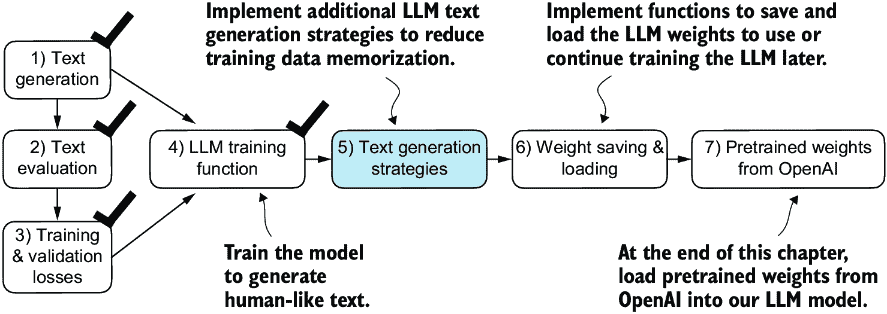

##### 图 5.13 在实现训练函数后，我们的模型可以生成连贯的文本。然而，它经常逐字逐句地记住训练集中的段落。接下来，我们将讨论生成更多样化输出文本的策略。

如图 5.13 所示，我们已经完成了本章的四个目标。接下来，在我们介绍权重加载和保存以及从 OpenAI 的 GPT 模型加载预训练权重之前，我们将讨论 LLM 的文本生成策略，以减少训练数据记忆并提高 LLM 生成文本的原创性。

## 5.3 控制随机性的解码策略

让我们看看文本生成策略（也称为解码策略），以生成更多原创文本。首先，我们将简要回顾我们之前在`generate_and_print_sample`中使用的`generate_text_simple`函数。然后，我们将介绍两种技术，*温度缩放*和*top-k 采样*，以改进此函数。

我们首先将模型从 GPU 转移到 CPU，因为使用相对较小的模型进行推理不需要 GPU。此外，在训练后，我们将模型放入评估模式以关闭随机组件，如 dropout：

```py
model.to("cpu")
model.eval()
```

接下来，我们将`GPTModel`实例（`model`）插入到`generate_text_simple`函数中，该函数使用 LLM 逐个生成标记：

```py
tokenizer = tiktoken.get_encoding("gpt2")
token_ids = generate_text_simple(
    model=model,
    idx=text_to_token_ids("Every effort moves you", tokenizer),
    max_new_tokens=25,
    context_size=GPT_CONFIG_124M["context_length"]
)
print("Output text:\n", token_ids_to_text(token_ids, tokenizer))
```

生成的文本是

```py
Output text:
Every effort moves you know," was one of the axioms he laid down across the
Sevres and silver of an exquisitely appointed lun
```

如前所述，生成的标记是在每个生成步骤中根据词汇表中所有标记的最大概率分数选择的。这意味着即使我们多次在相同的起始上下文（`Every` `effort` `moves` `you`）上运行前面的`generate_text_simple`函数，LLM 也会始终生成相同的输出。

### 5.3.1 温度缩放

现在我们来看温度缩放技术，这是一种将概率选择过程添加到下一个标记生成任务中的技术。之前，在`generate_text_simple`函数内部，我们总是使用`torch.argmax`（也称为*贪婪解码*）来采样概率最高的标记作为下一个标记。为了生成更多样化的文本，我们可以用从概率分布中采样的函数（在这里，是 LLM 在每次标记生成步骤为每个词汇条目生成的概率分数）来替换`argmax`。

为了用具体例子说明概率抽样，让我们简要讨论使用一个非常小的词汇表来演示的下一个标记生成过程：

```py
vocab = { 
    "closer": 0,
    "every": 1, 
    "effort": 2, 
    "forward": 3,
    "inches": 4,
    "moves": 5, 
    "pizza": 6,
    "toward": 7,
    "you": 8,
} 
inverse_vocab = {v: k for k, v in vocab.items()}
```

接下来，假设 LLM 被给定了起始上下文`"every"` `effort` `moves` `you"`并生成了以下下一个标记的 logits：

```py
next_token_logits = torch.tensor(
    [4.51, 0.89, -1.90, 6.75, 1.63, -1.62, -1.89, 6.28, 1.79]
)
```

如第四章所述，在`generate_text_simple`内部，我们通过`softmax`函数将 logits 转换为概率，并通过`argmax`函数获得生成的标记对应的标记 ID，然后我们可以通过逆词汇将其映射回文本：

```py
probas = torch.softmax(next_token_logits, dim=0)
next_token_id = torch.argmax(probas).item()
print(inverse_vocab[next_token_id])
```

由于最大的 logit 值以及相应的最大的 softmax 概率分数位于第四位（Python 使用 0 索引，因此索引位置为 3），生成的单词是`"forward"`。

为了实现概率抽样过程，我们现在可以在 PyTorch 中将`argmax`替换为`multinomial`函数：

```py
torch.manual_seed(123) 
next_token_id = torch.multinomial(probas, num_samples=1).item()
print(inverse_vocab[next_token_id])
```

打印的输出与之前一样是`"forward"`。发生了什么？`multinomial`函数按概率分数成比例地采样下一个标记。换句话说，`"forward"`仍然是概率最高的标记，并且大多数时候会被`multinomial`选中，但不是每次都会被选中。为了说明这一点，让我们实现一个重复此采样 1,000 次的函数：

```py
def print_sampled_tokens(probas):
    torch.manual_seed(123)
    sample = [torch.multinomial(probas, num_samples=1).item()
             for i in range(1_000)]
    sampled_ids = torch.bincount(torch.tensor(sample))
    for i, freq in enumerate(sampled_ids):
        print(f"{freq} x {inverse_vocab[i]}")

print_sampled_tokens(probas)
```

采样输出是

```py
73 x closer
0 x every
0 x effort
582 x forward
2 x inches
0 x moves
0 x pizza
343 x toward
```

如我们所见，单词`forward`在大多数时候被采样（1,000 次中有 582 次），但其他标记如`closer`、`inches`和`toward`也会被采样一些时候。这意味着如果我们将`generate_and_print_sample`函数中的`argmax`函数替换为`multinomial`函数，LLM 有时会生成如`every` `effort` `moves` `you` `toward`、`every` `effort` `moves` `you` `inches`和`every` `effort` `moves` `you` `closer`这样的文本，而不是`every` `effort` `moves` `you` `forward`。

我们可以通过一个称为**温度缩放**的概念进一步控制分布和选择过程。温度缩放只是将 logits 除以一个大于 0 的数的花哨说法：

```py
def softmax_with_temperature(logits, temperature):
    scaled_logits = logits / temperature
    return torch.softmax(scaled_logits, dim=0)
```

大于 1 的温度会导致标记概率分布更加均匀，而小于 1 的温度会导致更加自信（更尖锐或更峰值）的分布。让我们通过将原始概率与不同温度值缩放的概率一起绘制来展示这一点：

```py
temperatures = [1, 0.1, 5]                                     #1
scaled_probas = [softmax_with_temperature(next_token_logits, T)
                for T in temperatures]
x = torch.arange(len(vocab))
bar_width = 0.15
fig, ax = plt.subplots(figsize=(5, 3))
for i, T in enumerate(temperatures):
    rects = ax.bar(x + i * bar_width, scaled_probas[i], 
                   bar_width, label=f'Temperature = {T}')
ax.set_ylabel('Probability')
ax.set_xticks(x)
ax.set_xticklabels(vocab.keys(), rotation=90)
ax.legend()
plt.tight_layout()
plt.show()
```

#1 原始、较低和较高置信度

结果图如图 5.14 所示。

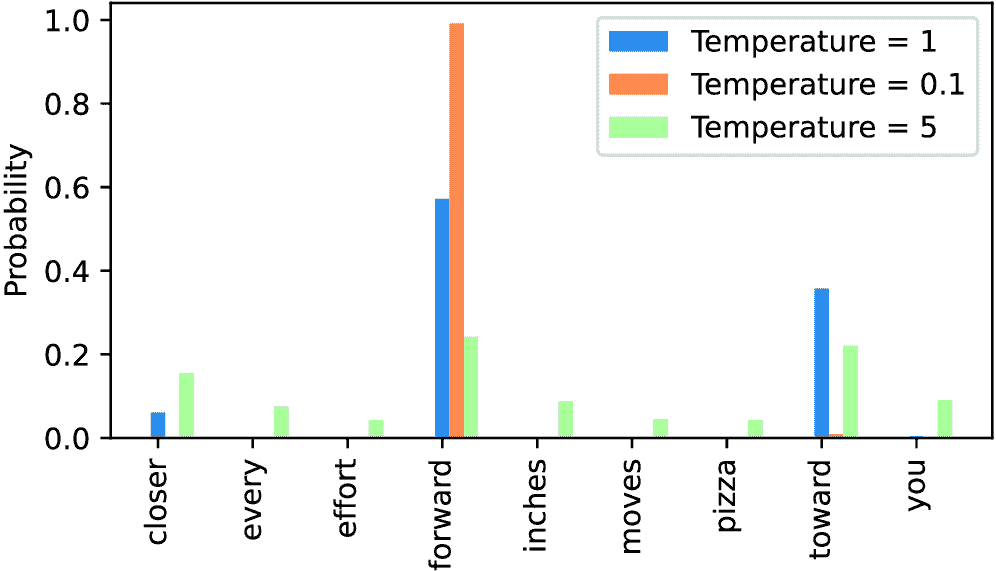

##### 图 5.14 温度为 1 表示词汇表中每个标记的未缩放概率分数。将温度降低到 0.1 会使分布更加尖锐，这样最可能的标记（在这里是“forward”）将具有更高的概率分数。同样，将温度增加到 5 会使分布更加均匀。

温度为 1 时，在将 logits 传递给 `softmax` 函数以计算概率分数之前，将其除以 1。换句话说，使用温度为 1 等同于不使用任何温度缩放。在这种情况下，通过 PyTorch 中的 `multinomial` 采样函数，以与原始 softmax 概率分数相等的概率选择标记。例如，对于温度设置 1，对应于“forward”的标记大约有 60% 的时间被选中，如图 5.14 所示。

此外，如图 5.14 所示，应用非常小的温度，如 0.1，将导致分布更加尖锐，这样 `multinomial` 函数的行为几乎 100% 选中最可能的标记（在这里是 `"forward"`），接近 `argmax` 函数的行为。同样，温度为 5 导致分布更加均匀。这可以为生成的文本添加更多多样性，但也会更频繁地产生无意义的文本。例如，使用温度为 5 时，文本中出现`every` `effort` `moves` `you` `pizza`的频率大约为 4%。

##### 练习 5.1

使用 `print_sampled_tokens` 函数打印出与图 5.14 中显示的温度缩放的 softmax 概率采样频率。在每种情况下，`pizza`这个词被采样的频率是多少？你能想到一种更快更准确的方法来确定`pizza`这个词被采样的频率吗？

### 5.3.2 Top-k 采样

我们现在已经实现了一种结合温度缩放的概率采样方法，以增加输出的多样性。我们注意到，较高的温度值会导致下一个标记的概率分布更加均匀，这减少了模型反复选择最可能标记的可能性，从而产生了更多样化的输出。这种方法允许在生成过程中探索不太可能但可能更有趣和创造性的路径。然而，这种方法的一个缺点是，有时会导致语法错误或完全不合理的输出，例如`every` `effort` `moves` `you` `pizza`。

*Top-k 采样*，当与概率采样和温度缩放结合使用时，可以提高文本生成结果。在 top-k 采样中，我们可以将采样的标记限制为最可能的 top-k 标记，并通过屏蔽它们的概率分数来排除所有其他标记的选择过程，如图 5.15 所示。


##### 图 5.15 使用 k = 3 的 top-k 采样，我们关注与最高 logits 值相关的三个标记，在应用`softmax`函数之前，用负无穷大(`–inf`)屏蔽所有其他标记。这导致一个概率分布，其中所有非 top-k 标记的概率值被分配为 0。（图中数字在小数点后截断为两位以减少视觉杂乱。在“Softmax”行中的值应加起来为 1.0。）

top-k 方法将所有未选择的 logits 替换为负无穷大值(`-inf`)，这样在计算 softmax 值时，非 top-k 标记的概率分数为 0，剩余的概率加起来为 1。（仔细的读者可能会记得我们在第三章第 3.5.1 节中实现的因果注意力模块中的这个屏蔽技巧。）

在代码中，我们可以按照以下方式实现图 5.15 中的 top-k 过程，从选择具有最大 logits 值的标记开始：

```py
top_k = 3
top_logits, top_pos = torch.topk(next_token_logits, top_k)
print("Top logits:", top_logits)
print("Top positions:", top_pos)
```

按降序排列，top 三个标记的 logits 值和标记 ID 如下

```py
Top logits: tensor([6.7500, 6.2800, 4.5100])
Top positions: tensor([3, 7, 0])
```

随后，我们应用 PyTorch 的`where`函数将位于我们 top-three 选择中最低 logits 值以下的所有标记的 logits 值设置为负无穷大(`-inf`)：

```py
new_logits = torch.where(
    condition=next_token_logits < top_logits[-1],    #1
    input=torch.tensor(float('-inf')),     #2
    other=next_token_logits     #3
)
print(new_logits)
```

#1 识别出 top 3 中低于最小值的 logits

#2 将这些较低 logits 分配为–inf

#3 保留所有其他标记的原始 logits

在九个标记词汇中的下一个标记的 logits 值如下

```py
tensor([4.5100,   -inf,   -inf, 6.7500,   -inf,   -inf,   -inf, 6.2800,
     -inf])
```

最后，让我们应用`softmax`函数将这些转换为下一个标记的概率：

```py
topk_probas = torch.softmax(new_logits, dim=0)
print(topk_probas)
```

如我们所见，这种 top-three 方法的结果是三个非零概率分数：

```py
tensor([0.0615, 0.0000, 0.0000, 0.5775, 0.0000, 0.0000, 0.0000, 0.3610,
        0.0000])
```

我们现在可以应用温度缩放和多项式函数进行概率采样，从这三个非零概率分数中选择下一个标记来生成下一个标记。我们接下来通过修改文本生成函数来实现这一点。

### 5.3.3 修改文本生成函数

现在，让我们结合温度采样和 top-k 采样来修改我们之前用于通过 LLM 生成文本的`generate_text_simple`函数，创建一个新的`generate`函数。

##### 列表 5.4 一个具有更多多样性的修改后的文本生成函数

```py
def generate(model, idx, max_new_tokens, context_size,
             temperature=0.0, top_k=None, eos_id=None):
    for _ in range(max_new_tokens):            #1
        idx_cond = idx[:, -context_size:]
        with torch.no_grad():
            logits = model(idx_cond)
        logits = logits[:, -1, :]
        if top_k is not None:                #2
            top_logits, _ = torch.topk(logits, top_k)
            min_val = top_logits[:, -1]
            logits = torch.where(
                logits < min_val,
                torch.tensor(float('-inf')).to(logits.device),
                logits
            )
        if temperature > 0.0:                  #3
            logits = logits / temperature
            probs = torch.softmax(logits, dim=-1)
            idx_next = torch.multinomial(probs, num_samples=1)
        else:    #4
            idx_next = torch.argmax(logits, dim=-1, keepdim=True)
        if idx_next == eos_id:              #5
            break
        idx = torch.cat((idx, idx_next), dim=1)
    return idx
```

#1 循环结构与之前相同：获取 logits 并仅关注最后一个时间步。

#2 使用 top_k 采样过滤 logits

#3 应用温度缩放

#4 当禁用温度缩放时，与之前一样执行贪婪的下一个标记选择

#5 遇到序列结束标记时提前停止生成

让我们现在看看这个新的`generate`函数的实际应用：

```py
torch.manual_seed(123)
token_ids = generate(
    model=model,
    idx=text_to_token_ids("Every effort moves you", tokenizer),
    max_new_tokens=15,
    context_size=GPT_CONFIG_124M["context_length"],
    top_k=25,
    temperature=1.4
)
print("Output text:\n", token_ids_to_text(token_ids, tokenizer))
```

生成的文本是

```py
Output text:
 Every effort moves you stand to work on surprise, a one of us had gone
 with random-
```

如我们所见，生成的文本与我们之前在 5.3 节中通过`generate_simple`函数生成的文本非常不同（`"Every` `effort` `moves` `you` `know,"` `was` `one` `of` `the` `axioms` `he` `laid...!`），这是训练集中的记忆段落。

##### 练习 5.2

尝试不同的温度和 top-k 设置。根据你的观察，你能想到哪些需要较低温度和 top-k 设置的用例？同样，你能想到哪些需要较高温度和 top-k 设置的用例？（建议在加载 OpenAI 的预训练权重后，在章节末尾再次回顾这个练习。）

##### 练习 5.3

`generate`函数的不同设置组合有哪些，可以强制确定性行为，即禁用随机采样，使其总是产生相同的输出，类似于`generate_simple`函数？

## 5.4 在 PyTorch 中加载和保存模型权重

到目前为止，我们已经讨论了如何数值评估训练进度和从头开始预训练一个 LLM。尽管 LLM 和数据集相对较小，但这个练习表明预训练 LLM 是计算密集型的。因此，能够保存 LLM 非常重要，这样我们就不必每次在新会话中使用它时都重新运行训练。

因此，让我们讨论如何保存和加载预训练模型，如图 5.16 所示。稍后，我们将从 OpenAI 加载一个更强大的预训练 GPT 模型到我们的`GPTModel`实例中。

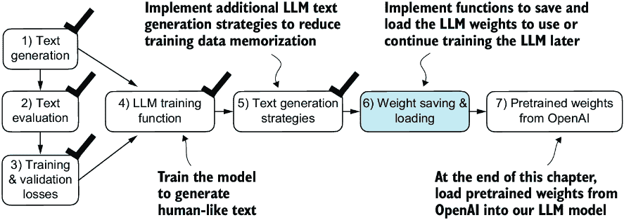

##### 图 5.16 在训练和检查模型后，保存模型通常很有帮助，这样我们就可以稍后使用或继续训练它（步骤 6）。

幸运的是，保存 PyTorch 模型相对简单。推荐的方法是使用`torch.save`函数保存模型的`state_dict`，这是一个将每一层映射到其参数的字典：

```py
torch.save(model.state_dict(), "model.pth")
```

`"model.pth"`是保存`state_dict`的文件名。`.pth`扩展名是 PyTorch 文件的约定，尽管技术上我们可以使用任何文件扩展名。

然后在通过`state_dict`保存模型权重之后，我们可以将模型权重加载到一个新的`GPTModel`模型实例中：

```py
model = GPTModel(GPT_CONFIG_124M)
model.load_state_dict(torch.load("model.pth", map_location=device))
model.eval()
```

如第四章所述，dropout 通过在训练过程中随机“丢弃”层中的神经元来帮助防止模型过度拟合训练数据。然而，在推理过程中，我们不希望随机丢弃网络学习到的任何信息。使用`model.eval()`将模型切换到评估模式进行推理，禁用`model`的 dropout 层。如果我们计划稍后继续预训练模型——例如，使用本章前面定义的`train_model_simple`函数——保存优化器状态也是推荐的。

自适应优化器，如 AdamW，为每个模型权重存储额外的参数。AdamW 使用历史数据来动态调整每个模型参数的学习率。没有它，优化器会重置，模型可能学习不佳，甚至无法正确收敛，这意味着它将失去生成连贯文本的能力。使用`torch.save`，我们可以保存模型和优化器的`state_dict`内容：

```py
torch.save({
    "model_state_dict": model.state_dict(),
    "optimizer_state_dict": optimizer.state_dict(),
    }, 
    "model_and_optimizer.pth"
)
```

然后，我们可以通过首先使用`torch.load`加载保存的数据，然后使用`load_state_dict`方法来恢复模型和优化器状态：

```py
checkpoint = torch.load("model_and_optimizer.pth", map_location=device)
model = GPTModel(GPT_CONFIG_124M)
model.load_state_dict(checkpoint["model_state_dict"])
optimizer = torch.optim.AdamW(model.parameters(), lr=5e-4, weight_decay=0.1)
optimizer.load_state_dict(checkpoint["optimizer_state_dict"])
model.train();
```

##### 练习 5.4

保存权重后，在新的 Python 会话或 Jupyter 笔记本文件中加载模型和优化器，并使用`train_model_simple`函数继续进行一个 epoch 的预训练。

## 5.5 从 OpenAI 加载预训练权重

在之前，我们使用一个包含短篇小说集的有限数据集训练了一个小的 GPT-2 模型。这种方法使我们能够专注于基础，而无需大量的时间和计算资源。

幸运的是，OpenAI 公开分享了他们的 GPT-2 模型的权重，从而消除了我们自己在大型语料库上重新训练模型所需的数十万甚至数百万美元的投资。因此，让我们将这些权重加载到我们的`GPTModel`类中，并使用该模型进行文本生成。在这里，*权重*指的是存储在 PyTorch 的`Linear`和`Embedding`层的`.weight`属性中的权重参数，例如。我们在训练模型时通过`model.parameters()`访问过它们。在第六章中，我们将重用这些预训练的权重来微调模型以进行文本分类任务，并遵循类似于 ChatGPT 的说明。

注意，OpenAI 最初通过 TensorFlow 保存了 GPT-2 的权重，我们必须安装 TensorFlow 才能在 Python 中加载权重。以下代码将使用名为`tqdm`的进度条工具来跟踪下载过程，我们同样需要安装它。

您可以通过在终端中执行以下命令来安装这些库：

```py
pip install tensorflow>=2.15.0  tqdm>=4.66
```

下载代码相对较长，主要是样板代码，并不很有趣。因此，我们不会在讨论从互联网上获取文件的 Python 代码上浪费宝贵空间，而是直接从本章的在线仓库下载`gpt_download.py` Python 模块：

```py
import urllib.request
url = (
    "https://raw.githubusercontent.com/rasbt/"
    "LLMs-from-scratch/main/ch05/"
    "01_main-chapter-code/gpt_download.py"
)
filename = url.split('/')[-1]
urllib.request.urlretrieve(url, filename)
```

接下来，在将此文件下载到 Python 会话的本地目录后，您应该简要检查此文件的内容，以确保它已正确保存并包含有效的 Python 代码。

现在，我们可以按照以下方式从`gpt_download.py`文件中导入`download_and_load_gpt2`函数，这将把 GPT-2 架构设置（`settings`）和权重参数（`params`）加载到我们的 Python 会话中：

```py
from gpt_download import download_and_load_gpt2
settings, params = download_and_load_gpt2(
    model_size="124M", models_dir="gpt2"
)
```

执行此代码将下载与`124M`参数 GPT-2 模型相关的以下七个文件：

```py
checkpoint: 100%|███████████████████████████| 77.0/77.0 [00:00<00:00, 
                                                         63.9kiB/s]
encoder.json: 100%|█████████████████████████| 1.04M/1.04M [00:00<00:00,
                                                           2.20MiB/s]
hprams.json: 100%|██████████████████████████| 90.0/90.0 [00:00<00:00,
                                                         78.3kiB/s]
model.ckpt.data-00000-of-00001: 100%|███████| 498M/498M [01:09<00:00,
                                                         7.16MiB/s]
model.ckpt.index: 100%|█████████████████████| 5.21k/5.21k [00:00<00:00,
                                                           3.24MiB/s]
model.ckpt.meta: 100%|██████████████████████| 471k/471k [00:00<00:00, 
                                                         2.46MiB/s]
vocab.bpe: 100%|████████████████████████████| 456k/456k [00:00<00:00,
                                                         1.70MiB/s]
```

注意：如果下载代码对您不起作用，可能是由于间歇性互联网连接、服务器问题或 OpenAI 分享开源 GPT-2 模型权重的变化方式。在这种情况下，请访问本章的在线代码仓库[`github.com/rasbt/LLMs-from-scratch`](https://github.com/rasbt/LLMs-from-scratch)，以获取替代和更新的说明，并通过 Manning 论坛提出进一步的问题。

假设上一段代码已执行完成，让我们检查`settings`和`params`的内容：

```py
print("Settings:", settings)
print("Parameter dictionary keys:", params.keys())
```

内容如下

```py
Settings: {'n_vocab': 50257, 'n_ctx': 1024, 'n_embd': 768, 'n_head': 12,
           'n_layer': 12}
Parameter dictionary keys: dict_keys(['blocks', 'b', 'g', 'wpe', 'wte'])
```

`settings`和`params`都是 Python 字典。`settings`字典存储了 LLM 架构设置，类似于我们手动定义的`GPT_CONFIG_124M`设置。`params`字典包含实际的权重张量。请注意，我们只打印了字典键，因为打印权重内容会占用太多的屏幕空间；然而，我们可以通过打印整个字典`print(params)`或通过选择单个张量，例如通过相应的字典键来检查这些权重张量，例如嵌入层权重：

```py
print(params["wte"])
print("Token embedding weight tensor dimensions:", params["wte"].shape)
```

令牌嵌入层的权重是

```py
[[-0.11010301 ... -0.1363697   0.01506208   0.04531523]
 [ 0.04034033 ...  0.08605453  0.00253983   0.04318958]
 [-0.12746179  ...  0.08991534 -0.12972379 -0.08785918]
 ...
 [-0.04453601 ...   0.10435229  0.09783269 -0.06952604]
 [ 0.1860082  ...  -0.09625227  0.07847701 -0.02245961]
 [ 0.05135201 ...   0.00704835  0.15519823  0.12067825]]
Token embedding weight tensor dimensions: (50257, 768)
```

我们通过`download_and_load_gpt2(model_size="124M", ...)`设置下载并加载了最小的 GPT-2 模型权重。OpenAI 还分享了更大模型的权重：`355M`、`774M`和`1558M`。这些不同尺寸的 GPT 模型的总体架构是相同的，如图 5.17 所示，除了不同的架构元素重复的次数不同，以及嵌入大小不同。本章剩余的代码也与这些更大的模型兼容。


##### 图 5.17 GPT-2 LLM 有几种不同的模型尺寸，从 1.24 亿到 1.558 亿参数不等。核心架构是相同的，唯一的区别是嵌入大小以及注意力头和 Transformer 块等单个组件重复的次数。

在将 GPT-2 模型权重加载到 Python 中之后，我们仍然需要将它们从`settings`和`params`字典转移到我们的`GPTModel`实例中。首先，我们创建一个字典，列出图 5.17 中不同 GPT 模型尺寸之间的差异：

```py
model_configs = {
    "gpt2-small (124M)": {"emb_dim": 768, "n_layers": 12, "n_heads": 12},
    "gpt2-medium (355M)": {"emb_dim": 1024, "n_layers": 24, "n_heads": 16},
    "gpt2-large (774M)": {"emb_dim": 1280, "n_layers": 36, "n_heads": 20},
    "gpt2-xl (1558M)": {"emb_dim": 1600, "n_layers": 48, "n_heads": 25},
}
```

假设我们感兴趣的是加载最小的模型`"gpt2-small"`（124M）。我们可以使用`model_configs`表中的相应设置来更新我们之前定义并使用的完整长度的`GPT_CONFIG_124M`：

```py
model_name = "gpt2-small (124M)"
NEW_CONFIG = GPT_CONFIG_124M.copy()
NEW_CONFIG.update(model_configs[model_name])
```

仔细的读者可能还记得我们之前使用的是 256 标记长度，但 OpenAI 的原始 GPT-2 模型是在 1,024 标记长度下训练的，因此我们必须相应地更新`NEW_CONFIG`：

```py
NEW_CONFIG.update({"context_length": 1024})
```

此外，OpenAI 在多头注意力模块的线性层中使用了偏置向量来实现查询、键和值矩阵的计算。偏置向量在 LLMs 中不再常用，因为它们不会提高建模性能，因此是不必要的。然而，由于我们正在使用预训练的权重，我们需要匹配设置以保持一致性并启用这些偏置向量：

```py
NEW_CONFIG.update({"qkv_bias": True})
```

现在我们可以使用更新的`NEW_CONFIG`字典来初始化一个新的`GPTModel`实例：

```py
gpt = GPTModel(NEW_CONFIG)
gpt.eval()
```

默认情况下，`GPTModel`实例使用随机权重进行预训练。使用 OpenAI 模型权重的最后一步是用我们加载到`params`字典中的权重覆盖这些随机权重。为此，我们首先定义一个小的`assign`实用函数，该函数检查两个张量或数组（`left`和`right`）是否具有相同的维度或形状，并返回正确的张量作为可训练的 PyTorch 参数：

```py
def assign(left, right):
    if left.shape != right.shape:
        raise ValueError(f"Shape mismatch. Left: {left.shape}, "
                          "Right: {right.shape}"
        )
    return torch.nn.Parameter(torch.tensor(right))
```

接下来，我们定义一个`load_weights_into_gpt`函数，该函数将`params`字典中的权重加载到`GPTModel`实例`gpt`中。

##### 列表 5.5 将 OpenAI 权重加载到我们的 GPT 模型代码中

```py
import numpy as np

def load_weights_into_gpt(gpt, params):           #1
    gpt.pos_emb.weight = assign(gpt.pos_emb.weight, params['wpe'])
    gpt.tok_emb.weight = assign(gpt.tok_emb.weight, params['wte'])

    for b in range(len(params["blocks"])):     #2
        q_w, k_w, v_w = np.split(                            #3
            (params["blocks"][b]["attn"]["c_attn"])["w"], 3, axis=-1)
        gpt.trf_blocks[b].att.W_query.weight = assign(
            gpt.trf_blocks[b].att.W_query.weight, q_w.T)
        gpt.trf_blocks[b].att.W_key.weight = assign(
            gpt.trf_blocks[b].att.W_key.weight, k_w.T)
        gpt.trf_blocks[b].att.W_value.weight = assign(
            gpt.trf_blocks[b].att.W_value.weight, v_w.T)

        q_b, k_b, v_b = np.split(
            (params["blocks"][b]["attn"]["c_attn"])["b"], 3, axis=-1)
        gpt.trf_blocks[b].att.W_query.bias = assign(
            gpt.trf_blocks[b].att.W_query.bias, q_b)
        gpt.trf_blocks[b].att.W_key.bias = assign(
            gpt.trf_blocks[b].att.W_key.bias, k_b)
        gpt.trf_blocks[b].att.W_value.bias = assign(
            gpt.trf_blocks[b].att.W_value.bias, v_b)

        gpt.trf_blocks[b].att.out_proj.weight = assign(
            gpt.trf_blocks[b].att.out_proj.weight, 
            params["blocks"][b]["attn"]["c_proj"]["w"].T)
        gpt.trf_blocks[b].att.out_proj.bias = assign(
            gpt.trf_blocks[b].att.out_proj.bias, 
            params["blocks"][b]["attn"]["c_proj"]["b"])

        gpt.trf_blocks[b].ff.layers[0].weight = assign(
            gpt.trf_blocks[b].ff.layers[0].weight, 
            params["blocks"][b]["mlp"]["c_fc"]["w"].T)
        gpt.trf_blocks[b].ff.layers[0].bias = assign(
            gpt.trf_blocks[b].ff.layers[0].bias, 
            params["blocks"][b]["mlp"]["c_fc"]["b"])
        gpt.trf_blocks[b].ff.layers[2].weight = assign(
            gpt.trf_blocks[b].ff.layers[2].weight, 
            params["blocks"][b]["mlp"]["c_proj"]["w"].T)
        gpt.trf_blocks[b].ff.layers[2].bias = assign(
            gpt.trf_blocks[b].ff.layers[2].bias, 
            params["blocks"][b]["mlp"]["c_proj"]["b"])

        gpt.trf_blocks[b].norm1.scale = assign(
            gpt.trf_blocks[b].norm1.scale, 
            params["blocks"][b]["ln_1"]["g"])
        gpt.trf_blocks[b].norm1.shift = assign(
            gpt.trf_blocks[b].norm1.shift, 
            params["blocks"][b]["ln_1"]["b"])
        gpt.trf_blocks[b].norm2.scale = assign(
            gpt.trf_blocks[b].norm2.scale, 
            params["blocks"][b]["ln_2"]["g"])
        gpt.trf_blocks[b].norm2.shift = assign(
            gpt.trf_blocks[b].norm2.shift, 
            params["blocks"][b]["ln_2"]["b"])

    gpt.final_norm.scale = assign(gpt.final_norm.scale, params["g"])
    gpt.final_norm.shift = assign(gpt.final_norm.shift, params["b"])
    gpt.out_head.weight = assign(gpt.out_head.weight, params["wte"])    #4
```

#1 将模型的定位和标记嵌入权重设置为`params`中指定的那些。

#2 遍历模型中的每个 transformer 块

#3 使用`np.split`函数将注意力和偏置权重分为查询、键和值组件的三个相等部分。

#4 OpenAI 的原始 GPT-2 模型在输出层中重用了标记嵌入权重以减少参数总数，这是一个称为权重绑定的概念。

在`load_weights_into_gpt`函数中，我们仔细地将来自 OpenAI 实现的权重与我们的`GPTModel`实现进行匹配。以一个具体的例子来说，OpenAI 将第一个 transformer 块的输出投影层的权重张量存储为`params["blocks"][0]["attn"]["c_proj"]["w"]`。在我们的实现中，这个权重张量对应于`gpt.trf_blocks[b].att.out_proj .weight`，其中`gpt`是一个`GPTModel`实例。

开发`load_weights_into_gpt`函数花费了很多猜测工作，因为 OpenAI 使用的命名约定与我们略有不同。然而，如果尝试匹配两个维度不同的张量，`assign`函数会提醒我们。此外，如果我们在这个函数中犯了错误，我们会注意到这一点，因为生成的 GPT 模型将无法生成连贯的文本。

现在我们来实际尝试使用`load_weights_into_gpt`并将 OpenAI 模型权重加载到我们的`GPTModel`实例`gpt`中：

```py
load_weights_into_gpt(gpt, params)
gpt.to(device)
```

如果模型加载正确，我们现在可以使用它通过之前的`generate`函数生成新的文本：

```py
torch.manual_seed(123)
token_ids = generate(
    model=gpt,
    idx=text_to_token_ids("Every effort moves you", tokenizer).to(device),
    max_new_tokens=25,
    context_size=NEW_CONFIG["context_length"],
    top_k=50,
    temperature=1.5
)
print("Output text:\n", token_ids_to_text(token_ids, tokenizer))
```

产生的文本如下：

```py
Output text:
 Every effort moves you toward finding an ideal new way to practice something!
What makes us want to be on top of that?
```

我们可以确信我们已经正确加载了模型权重，因为模型可以生成连贯的文本。在这个过程中出现微小的错误会导致模型失败。在接下来的章节中，我们将进一步使用这个预训练模型，并对其进行微调以分类文本和遵循指令。

##### 练习 5.5

在“The Verdict”数据集上，使用 OpenAI 提供的预训练权重计算`GPTModel`的训练和验证集损失。

##### 练习 5.6

尝试不同大小的 GPT-2 模型——例如，最大的 1,558 百万参数模型——并将生成的文本与 1.24 亿参数模型进行比较。

## 摘要

+   当 LLM 生成文本时，它们一次输出一个标记。

+   默认情况下，下一个标记是通过将模型输出转换为概率分数并选择与最高概率分数对应的词汇表中的标记来生成的，这被称为“贪婪解码”。

+   通过概率采样和温度缩放，我们可以影响生成文本的多样性和连贯性。

+   在训练过程中，LLM 生成的文本的质量可以通过训练和验证集的损失来衡量。

+   预训练一个大型语言模型（LLM）涉及调整其权重以最小化训练损失。

+   LLM 的训练循环本身是深度学习中的一个标准程序，使用传统的交叉熵损失和 AdamW 优化器。

+   在大型文本语料库上预训练一个 LLM 既耗时又耗资源，因此我们可以加载公开可用的权重，作为我们自己在大数据集上预训练模型的替代方案。
