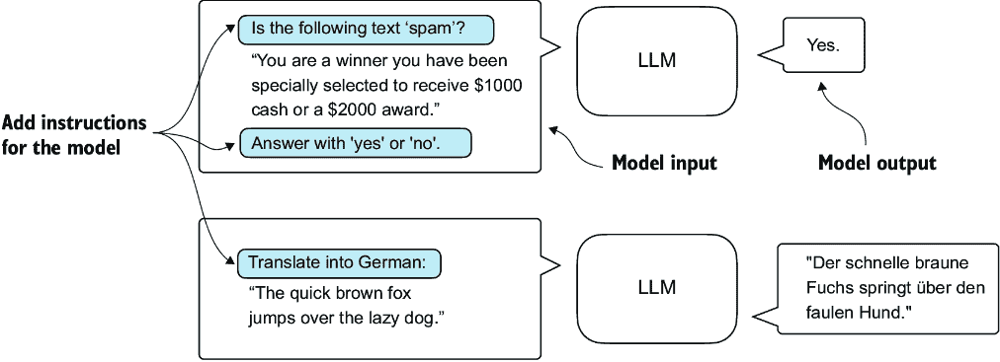
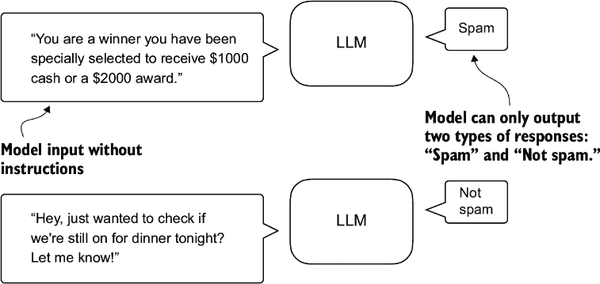
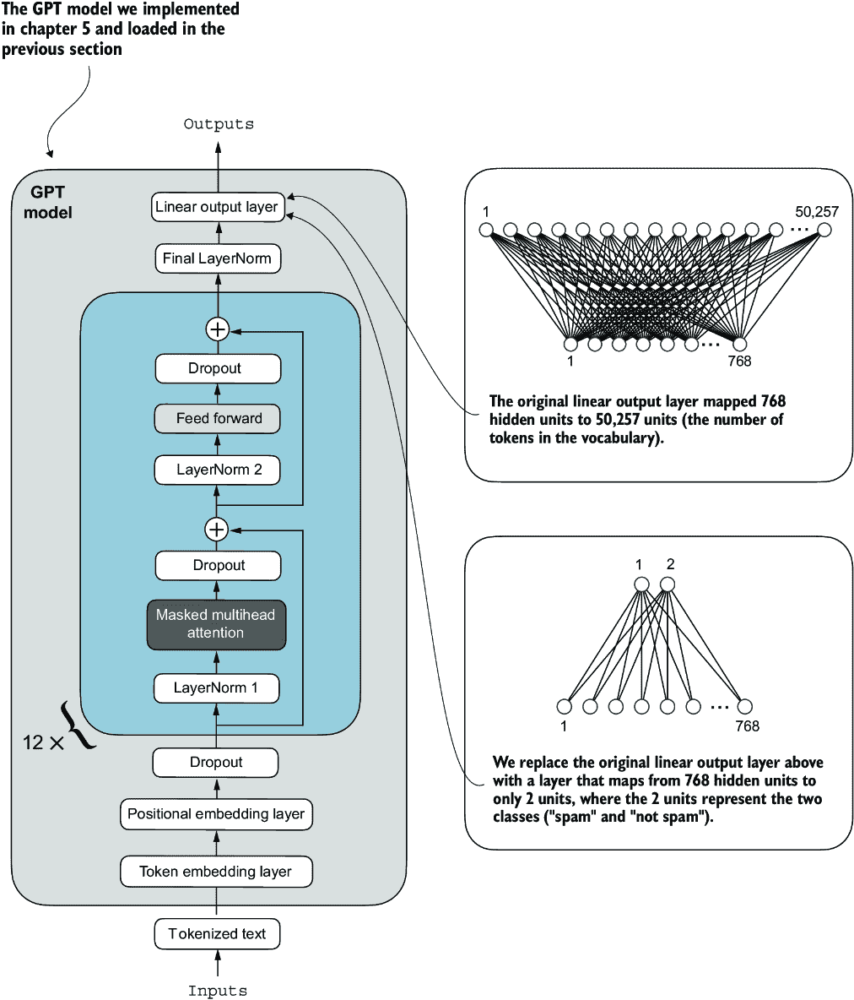
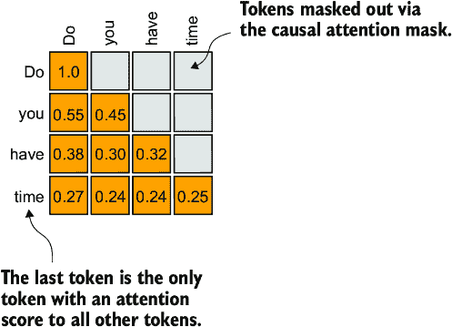
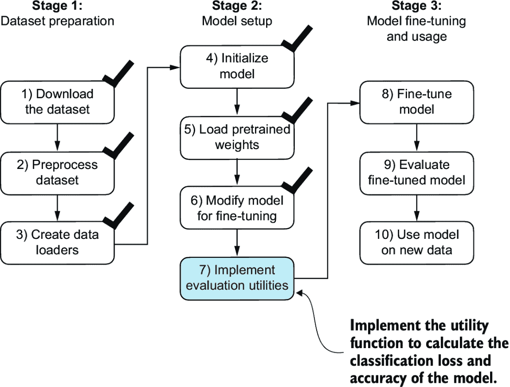
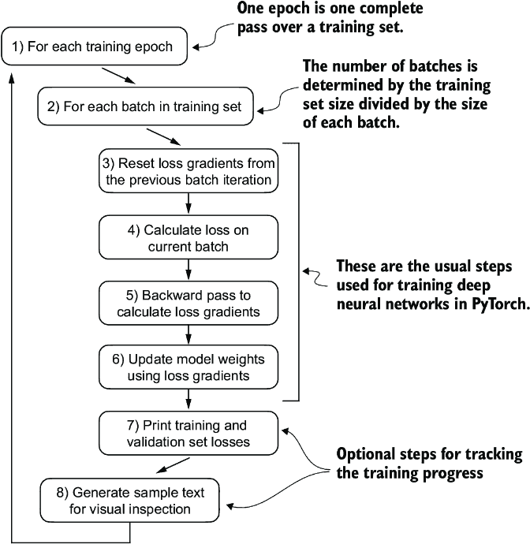
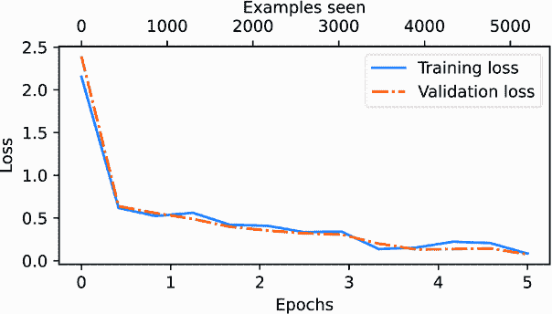
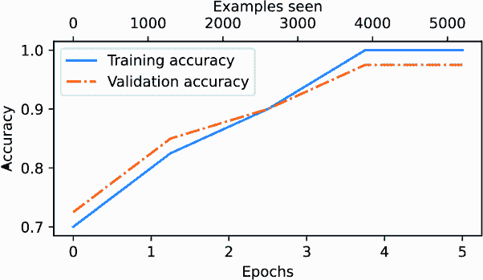

# 6 分类微调

### 本章涵盖

+   介绍不同的 LLM 微调方法

+   准备用于文本分类的数据集

+   修改预训练的 LLM 进行微调

+   微调一个 LLM 以识别垃圾邮件

+   评估微调 LLM 分类器的准确性

+   使用微调的 LLM 对新的数据进行分类

到目前为止，我们已经编写了 LLM 架构，对其进行了预训练，并学习了如何将来自外部来源（如 OpenAI）的预训练权重导入我们的模型。现在，我们将通过在特定目标任务（如文本分类）上微调 LLM 来收获我们的劳动成果。我们考察的具体例子是将短信分类为“垃圾邮件”或“非垃圾邮件”。图 6.1 突出了微调 LLM 的两种主要方式：用于分类的微调（步骤 8）和用于遵循指令的微调（步骤 9）。


##### 图 6.1 编写 LLM 的三个主要阶段。本章重点介绍第 3 阶段（步骤 8）：将预训练的 LLM 微调为分类器。

## 6.1 微调的不同类别

微调语言模型最常见的方法是*指令微调*和*分类微调*。指令微调涉及使用特定指令在一系列任务上训练语言模型，以提高其理解和执行自然语言提示中描述的任务的能力，如图 6.2 所示。



##### 图 6.2 两种不同的指令微调场景。在顶部，模型被要求判断给定的文本是否为垃圾邮件。在底部，模型被给出如何将英语句子翻译成德语的指令。

在分类微调中，如果你有机器学习背景，你可能已经熟悉了这个概念：模型被训练来识别一组特定的类别标签，例如“垃圾邮件”和“非垃圾邮件”。分类任务的例子不仅限于 LLM 和电子邮件过滤，还包括从图像中识别不同的植物种类；将新闻文章分类到体育、政治和技术等主题；以及在医学成像中区分良性肿瘤和恶性肿瘤。

关键点是，分类微调模型仅限于在训练期间遇到的类别进行预测。例如，它可以确定某物是否是“垃圾邮件”或“非垃圾邮件”，如图 6.3 所示，但它对输入文本的其他内容无话可说。



##### 图 6.3 使用 LLM 进行文本分类的场景。针对垃圾邮件分类进行微调的模型不需要在输入旁边提供进一步指令。与指令微调模型相比，它只能响应“垃圾邮件”或“非垃圾邮件”。

与图 6.3 中展示的分类微调模型相比，指令微调模型通常可以承担更广泛的任务范围。我们可以将分类微调模型视为高度专业化的，通常来说，开发一个适用于各种任务的通用模型比开发一个适用于特定类别的模型要容易。

##### 选择正确的方法

指令微调提高了模型根据特定用户指令理解和生成响应的能力。指令微调最适合需要根据复杂用户指令处理各种任务的模型，提高灵活性和交互质量。分类微调适用于需要将数据精确分类到预定义类别的项目，例如情感分析或垃圾邮件检测。

虽然指令微调更加灵活，但它需要更大的数据集和更多的计算资源来开发擅长各种任务的模型。相比之下，分类微调需要较少的数据和计算能力，但其应用范围仅限于模型已训练的特定类别。

## 6.2 准备数据集

我们将修改并微调之前实现和预训练的 GPT 模型。我们首先下载和准备数据集，如图 6.4 所示。为了提供一个直观且有用的分类微调示例，我们将使用一个包含垃圾邮件和非垃圾邮件的短信数据集。


##### 图 6.4 对分类微调 LLM 的三个阶段过程。第一阶段涉及数据集准备。第二阶段侧重于模型设置。第三阶段涵盖微调和评估模型。

注意：通常通过手机发送的短信，而不是电子邮件。然而，相同的步骤也适用于电子邮件分类，感兴趣的读者可以在附录 B 中找到电子邮件垃圾邮件分类数据集的链接。

第一步是下载数据集。

##### 列表 6.1 下载和解压数据集

```py
import urllib.request
import zipfile
import os
from pathlib import Path

url = "https://archive.ics.uci.edu/static/public/228/sms+spam+collection.zip"
zip_path = "sms_spam_collection.zip"
extracted_path = "sms_spam_collection"
data_file_path = Path(extracted_path) / "SMSSpamCollection.tsv"

def download_and_unzip_spam_data(
        url, zip_path, extracted_path, data_file_path):
    if data_file_path.exists():
        print(f"{data_file_path} already exists. Skipping download "
              "and extraction."
        )
        return

    with urllib.request.urlopen(url) as response:    #1
        with open(zip_path, "wb") as out_file:
            out_file.write(response.read())

    with zipfile.ZipFile(zip_path, "r") as zip_ref:    #2
        zip_ref.extractall(extracted_path)

    original_file_path = Path(extracted_path) / "SMSSpamCollection"
    os.rename(original_file_path, data_file_path)               #3
    print(f"File downloaded and saved as {data_file_path}")

download_and_unzip_spam_data(url, zip_path, extracted_path, data_file_path)
```

#1 下载文件

#2 解压文件

#3 添加.ts 文件扩展名

执行前面的代码后，数据集被保存为制表符分隔的文本文件，`SMSSpamCollection.tsv`，在`sms_spam_collection`文件夹中。我们可以按照以下方式将其加载到 pandas `DataFrame`中：

```py
import pandas as pd
df = pd.read_csv(
    data_file_path, sep="\t", header=None, names=["Label", "Text"]
)
df      #1
```

#1 在 Jupyter 笔记本中渲染数据框。或者使用 print(df)。

图 6.5 显示了垃圾邮件数据集的结果数据框。


##### 图 6.5 在 pandas `DataFrame`中预览`SMSSpamCollection`数据集，显示类别标签（“ham”或“spam”）和相应的文本消息。该数据集包含 5,572 行（文本消息和标签）。

让我们检查类别标签分布：

```py
print(df["Label"].value_counts())
```

执行前面的代码，我们发现数据中“ham”（即非垃圾邮件）的出现频率远高于“spam”：

```py
Label
ham     4825
spam     747
Name: count, dtype: int64
```

为了简单起见，并且因为我们更喜欢小数据集（这将有助于更快地微调 LLM），我们选择对数据集进行下采样，包括每个类别 747 个实例。

注意：处理类别不平衡的方法还有几种，但这些超出了本书的范围。对探索处理不平衡数据方法感兴趣的读者可以在附录 B 中找到更多信息。

我们可以使用以下列表中的代码进行下采样并创建一个平衡数据集。

##### 列表 6.2 创建平衡数据集

```py
def create_balanced_dataset(df):
    num_spam = df[df["Label"] == "spam"].shape[0]     #1
    ham_subset = df[df["Label"] == "ham"].sample(
        num_spam, random_state=123
    )                                         #2
    balanced_df = pd.concat([
        ham_subset, df[df["Label"] == "spam"]
    ])                               #3
    return balanced_df

balanced_df = create_balanced_dataset(df)
print(balanced_df["Label"].value_counts())
```

#1 计算“spam”实例的数量

#2 随机采样“ham”实例以匹配“spam”实例的数量

#3 将“ham”子集与“spam”合并

执行之前的代码以平衡数据集后，我们可以看到现在我们有相等数量的垃圾邮件和非垃圾邮件消息：

```py
Label
ham     747
spam    747
Name: count, dtype: int64
```

接下来，我们将“string”类标签`"ham"`和`"spam"`分别转换为整数类标签 0 和 1：

```py
balanced_df["Label"] = balanced_df["Label"].map({"ham": 0, "spam": 1})
```

此过程类似于将文本转换为标记 ID。然而，我们处理的是仅包含两个标记 ID：0 和 1，而不是使用包含超过 50,000 个单词的 GPT 词汇表。

接下来，我们创建一个`random_split`函数，将数据集分为三部分：70%用于训练，10%用于验证，20%用于测试。（这些比例在机器学习中很常见，用于训练、调整和评估模型。）

##### 列表 6.3 分割数据集

```py
def random_split(df, train_frac, validation_frac):

    df = df.sample(
        frac=1, random_state=123
    ).reset_index(drop=True)               #1
    train_end = int(len(df) * train_frac)          #2
    validation_end = train_end + int(len(df) * validation_frac)

 #3
    train_df = df[:train_end]
    validation_df = df[train_end:validation_end]
    test_df = df[validation_end:]

    return train_df, validation_df, test_df

train_df, validation_df, test_df = random_split(
    balanced_df, 0.7, 0.1)                     #4
```

#1 打乱整个 DataFrame

#2 计算分割索引

#3 分割 DataFrame

#4 测试大小隐含为 0.2，作为剩余部分。

让我们将数据集保存为 CSV（逗号分隔值）文件，这样我们以后可以重用它：

```py
train_df.to_csv("train.csv", index=None)
validation_df.to_csv("validation.csv", index=None)
test_df.to_csv("test.csv", index=None)
```

到目前为止，我们已经下载了数据集，平衡了它，并将其分为训练和评估子集。现在我们将设置用于训练模型的 PyTorch 数据加载器。

## 6.3 创建数据加载器

我们将开发与我们在处理文本数据时实现的 PyTorch 数据加载器概念上相似的数据加载器。以前，我们利用滑动窗口技术生成均匀大小的文本块，然后将它们分组到批次中，以更有效地进行模型训练。每个块作为一个单独的训练实例。然而，我们现在正在处理包含不同长度文本消息的垃圾邮件数据集。为了像处理文本块那样批量处理这些消息，我们有两种主要选项：

+   将所有消息截断到数据集或批次中最短消息的长度。

+   将所有消息填充到数据集或批次中最长消息的长度。

第一种方法在计算上更便宜，但如果较短的消息比平均或最长的消息小得多，可能会造成显著的信息损失，从而降低模型性能。因此，我们选择第二种选项，它保留了所有消息的全部内容。

为了实现批处理，将所有消息填充到数据集中最长消息的长度，我们向所有较短的消息添加填充标记。为此，我们使用 `"<|endoftext|>"` 作为填充标记。

然而，我们不必直接将字符串 `"<|endoftext|>"` 添加到每个文本消息中，我们可以将对应于 `"<|endoftext|>"` 的标记 ID 添加到编码后的文本消息中，如图 6.6 所示。`50256` 是填充标记 `"<|endoftext|>"` 的标记 ID。我们可以通过使用之前使用的 `tiktoken` 包中的 *GPT-2 分词器* 对 `"<|endoftext|>"` 进行编码来双重检查标记 ID 是否正确：

```py
import tiktoken
tokenizer = tiktoken.get_encoding("gpt2")
print(tokenizer.encode("<|endoftext|>", allowed_special={"<|endoftext|>"}))
```


##### 图 6.6 输入文本准备过程。首先，每个输入文本消息被转换成一个标记 ID 序列。然后，为了确保序列长度一致，较短的序列使用填充标记（在这种情况下，标记 ID 50256）填充到最长序列的长度。

事实上，执行前面的代码返回 `[50256]`。

我们首先需要实现一个 PyTorch `Dataset`，它指定了在实例化数据加载器之前数据的加载和处理方式。为此，我们定义了 `SpamDataset` 类，该类实现了图 6.6 中的概念。这个 `SpamDataset` 类处理几个关键任务：它将文本消息编码成标记序列，识别训练数据集中的最长序列，并确保所有其他序列都使用 *填充标记* 填充到最长序列的长度。

##### 列表 6.4 设置 Pytorch `Dataset` 类

```py
import torch
from torch.utils.data import Dataset

class SpamDataset(Dataset):
    def __init__(self, csv_file, tokenizer, max_length=None,
                 pad_token_id=50256):
        self.data = pd.read_csv(csv_file)
 #1
        self.encoded_texts = [
            tokenizer.encode(text) for text in self.data["Text"]
        ]

        if max_length is None:
            self.max_length = self._longest_encoded_length()
        else:
            self.max_length = max_length
 #2
            self.encoded_texts = [
                encoded_text[:self.max_length]
                for encoded_text in self.encoded_texts
            ]

 #3
        self.encoded_texts = [
            encoded_text + [pad_token_id] * 
            (self.max_length - len(encoded_text))
            for encoded_text in self.encoded_texts
        ]

    def __getitem__(self, index):
        encoded = self.encoded_texts[index]
        label = self.data.iloc[index]["Label"]
        return (
            torch.tensor(encoded, dtype=torch.long),
            torch.tensor(label, dtype=torch.long)
        )

    def __len__(self):
        return len(self.data)

    def _longest_encoded_length(self):
        max_length = 0
        for encoded_text in self.encoded_texts:
            encoded_length = len(encoded_text)
            if encoded_length > max_length:
                max_length = encoded_length
        return max_length
```

#1 预分词文本

#2 如果序列长度超过 max_length 则截断序列

#3 将序列填充到最长序列

`SpamDataset` 类从我们之前创建的 CSV 文件中加载数据，使用 `tiktoken` 的 GPT-2 分词器对文本进行分词，并允许我们将序列 *填充* 或 *截断* 到由最长序列或预定义的最大长度决定的统一长度。这确保了每个输入张量的大小相同，这对于创建我们接下来实现的训练数据加载器中的批次是必要的：

```py
train_dataset = SpamDataset(
    csv_file="train.csv",
    max_length=None,
    tokenizer=tokenizer
)
```

最长序列长度存储在数据集的 `max_length` 属性中。如果你想知道最长序列中标记的数量，可以使用以下代码：

```py
print(train_dataset.max_length)
```

代码输出 `120`，表明最长序列中不超过 120 个标记，这是文本消息的常见长度。考虑到其上下文长度限制，模型可以处理最多 1,024 个标记的序列。如果你的数据集中包含更长的文本，你可以在创建训练数据集时传递 `max_length=1024`，以确保数据不超过模型支持的输入（上下文）长度。

接下来，我们将验证集和测试集填充到最长训练序列的长度。重要的是，任何超过最长训练示例长度的验证集和测试集样本都会使用我们之前定义的`SpamDataset`代码中的`encoded_text[:self.max_length]`进行截断。这种截断是可选的；如果验证集和测试集中没有超过 1,024 个标记的序列，则可以将`max_length=None`设置为两者：

```py
val_dataset = SpamDataset(
    csv_file="validation.csv",
    max_length=train_dataset.max_length,
    tokenizer=tokenizer
)
test_dataset = SpamDataset(
    csv_file="test.csv",
    max_length=train_dataset.max_length,
    tokenizer=tokenizer
)
```

##### 练习 6.1 增加上下文长度

将输入填充到模型支持的标记数最大值，并观察它如何影响预测性能。

使用数据集作为输入，我们可以像处理文本数据时一样实例化数据加载器。然而，在这种情况下，目标表示类别标签，而不是文本中的下一个标记。例如，如果我们选择批大小为 8，每个批次将包含八个长度为 120 的训练示例以及每个示例对应的类别标签，如图 6.7 所示。


##### 图 6.7 显示了一个包含八个文本消息的训练批次，这些文本消息以标记 ID 表示。每个文本消息由 120 个标记 ID 组成。一个类别标签数组存储了与文本消息对应的八个类别标签，这些标签可以是`0`（“非垃圾邮件”）或`1`（“垃圾邮件”）。

下面的代码创建训练、验证和测试集数据加载器，这些加载器以 8 个批次的容量加载文本消息和标签。

##### 列表 6.5 创建 PyTorch 数据加载器

```py
from torch.utils.data import DataLoader

num_workers = 0      #1
batch_size = 8
torch.manual_seed(123)

train_loader = DataLoader(
    dataset=train_dataset,
    batch_size=batch_size,
    shuffle=True,
    num_workers=num_workers,
    drop_last=True,
)
val_loader = DataLoader(
    dataset=val_dataset,
    batch_size=batch_size,
    num_workers=num_workers,
    drop_last=False,
)
test_loader = DataLoader(
    dataset=test_dataset,
    batch_size=batch_size,
    num_workers=num_workers,
    drop_last=False,
)
```

#1 此设置确保与大多数计算机的兼容性。

为了确保数据加载器正在正常工作，并且确实返回了预期大小的批次，我们遍历训练加载器，然后打印最后一个批次的张量维度：

```py
for input_batch, target_batch in train_loader:
    pass
print("Input batch dimensions:", input_batch.shape)
print("Label batch dimensions", target_batch.shape)
```

输出是

```py
Input batch dimensions: torch.Size([8, 120])
Label batch dimensions torch.Size([8])
```

如我们所见，输入批次由八个训练示例组成，每个示例有 120 个标记，正如预期的那样。标签张量存储了与八个训练示例对应的类别标签。

最后，为了了解数据集的大小，让我们打印每个数据集中的总批次数：

```py
print(f"{len(train_loader)} training batches")
print(f"{len(val_loader)} validation batches")
print(f"{len(test_loader)} test batches")
```

每个数据集中的批次数是

```py
130 training batches
19 validation batches
38 test batches
```

现在我们已经准备好了数据，我们需要为微调准备模型。

## 6.4 使用预训练权重初始化模型

我们必须为分类微调准备模型以识别垃圾邮件。我们首先初始化我们的预训练模型，如图 6.8 所示。


##### 图 6.8 对 LLM 进行分类微调的三阶段过程。在完成阶段 1，准备数据集后，我们现在必须初始化 LLM，然后我们将对其进行微调以分类垃圾邮件。

要开始模型准备过程，我们使用与预训练未标记数据相同的配置：

```py
CHOOSE_MODEL = "gpt2-small (124M)"
INPUT_PROMPT = "Every effort moves"
BASE_CONFIG = {
    "vocab_size": 50257,          #1
    "context_length": 1024,       #2
    "drop_rate": 0.0,             #3
    "qkv_bias": True              #4
}
model_configs = {
    "gpt2-small (124M)": {"emb_dim": 768, "n_layers": 12, "n_heads": 12},
    "gpt2-medium (355M)": {"emb_dim": 1024, "n_layers": 24, "n_heads": 16},
    "gpt2-large (774M)": {"emb_dim": 1280, "n_layers": 36, "n_heads": 20},
    "gpt2-xl (1558M)": {"emb_dim": 1600, "n_layers": 48, "n_heads": 25},
}
BASE_CONFIG.update(model_configs[CHOOSE_MODEL])
```

#1 词汇量大小

#2 上下文长度

#3 Dropout 率

#4 查询-键-值偏差

接下来，我们从`gpt_download.py`文件中导入`download_and_load_gpt2`函数，并重用预训练中的`GPTModel`类和`load_weights_into_gpt`函数（参见第五章）将下载的权重加载到 GPT 模型中。

##### 列表 6.6 加载预训练的 GPT 模型

```py
from gpt_download import download_and_load_gpt2
from chapter05 import GPTModel, load_weights_into_gpt

model_size = CHOOSE_MODEL.split(" ")[-1].lstrip("(").rstrip(")")
settings, params = download_and_load_gpt2(
    model_size=model_size, models_dir="gpt2"
)

model = GPTModel(BASE_CONFIG)
load_weights_into_gpt(model, params)
model.eval()
```

在将模型权重加载到`GPTModel`之后，我们重用第四章和第五章中的文本生成实用函数，以确保模型生成连贯的文本：

```py
from chapter04 import generate_text_simple
from chapter05 import text_to_token_ids, token_ids_to_text

text_1 = "Every effort moves you"
token_ids = generate_text_simple(
    model=model,
    idx=text_to_token_ids(text_1, tokenizer),
    max_new_tokens=15,
    context_size=BASE_CONFIG["context_length"]
)
print(token_ids_to_text(token_ids, tokenizer))
```

以下输出显示模型生成了连贯的文本，这表明模型权重已正确加载：

```py
Every effort moves you forward.
The first step is to understand the importance of your work
```

在我们开始将模型作为垃圾邮件分类器进行微调之前，让我们看看模型是否已经通过提示指令来对垃圾邮件消息进行分类：

```py
text_2 = (
    "Is the following text 'spam'? Answer with 'yes' or 'no':"
    " 'You are a winner you have been specially"
    " selected to receive $1000 cash or a $2000 award.'"
)
token_ids = generate_text_simple(
    model=model,
    idx=text_to_token_ids(text_2, tokenizer),
    max_new_tokens=23,
    context_size=BASE_CONFIG["context_length"]
)
print(token_ids_to_text(token_ids, tokenizer))
```

模型输出是

```py
Is the following text 'spam'? Answer with 'yes' or 'no': 'You are a winner
you have been specially selected to receive $1000 cash 
or a $2000 award.'
The following text 'spam'? Answer with 'yes' or 'no': 'You are a winner
```

根据输出，很明显模型在遵循指令方面有困难。这个结果是预期的，因为它只经过了预训练，缺乏指令微调。因此，让我们为分类微调准备模型。

## 6.5 添加分类头

我们必须修改预训练的 LLM，以便为分类微调做准备。为此，我们用一个小型的输出层替换了原始的输出层，该输出层将隐藏表示映射到 50,257 个词汇，新的输出层映射到两个类别：`0`（“非垃圾邮件”）和`1`（“垃圾邮件”），如图 6.9 所示。我们使用与之前相同的模型，只是替换了输出层。



##### 图 6.9 通过改变其架构来适应 GPT 模型进行垃圾邮件分类。最初，模型的线性输出层将 768 个隐藏单元映射到 50,257 个标记的词汇表。为了检测垃圾邮件，我们用一个新的输出层替换了这个层，该层将相同的 768 个隐藏单元映射到仅两个类别，代表“垃圾邮件”和“非垃圾邮件”。

##### 输出层节点

从技术上讲，我们可以使用单个输出节点，因为我们处理的是一个二元分类任务。然而，这将需要修改损失函数，正如我在“损失函数学习——在 PyTorch 中优化负对数似然和交叉熵”中讨论的那样。因此，我们选择了一个更通用的方法，其中输出节点的数量与类别的数量相匹配。例如，对于将新闻文章分类为“技术”、“体育”或“政治”的三个类别问题，我们将使用三个输出节点，依此类推。

在尝试图 6.9 中显示的修改之前，让我们通过`print(model)`打印出模型架构：

```py
GPTModel(
  (tok_emb): Embedding(50257, 768)
  (pos_emb): Embedding(1024, 768)
  (drop_emb): Dropout(p=0.0, inplace=False)
  (trf_blocks): Sequential(
...
    (11): TransformerBlock(
      (att): MultiHeadAttention(
        (W_query): Linear(in_features=768, out_features=768, bias=True)
        (W_key): Linear(in_features=768, out_features=768, bias=True)
        (W_value): Linear(in_features=768, out_features=768, bias=True)
        (out_proj): Linear(in_features=768, out_features=768, bias=True)
        (dropout): Dropout(p=0.0, inplace=False)
      )
      (ff): FeedForward(
        (layers): Sequential(
          (0): Linear(in_features=768, out_features=3072, bias=True)
          (1): GELU()
          (2): Linear(in_features=3072, out_features=768, bias=True)
        )
      )
      (norm1): LayerNorm()
      (norm2): LayerNorm()
      (drop_resid): Dropout(p=0.0, inplace=False)
    )
  )
  (final_norm): LayerNorm()
  (out_head): Linear(in_features=768, out_features=50257, bias=False)
)
```

这个输出清晰地展示了我们在第四章中提出的架构。正如之前讨论的那样，`GPTModel`由嵌入层组成，随后是 12 个相同的*transformer blocks*（为了简洁起见，只显示了最后一个块），然后是一个最终的`LayerNorm`和输出层`out_head`。

接下来，我们将`out_head`替换为一个新的输出层（见图 6.9），我们将对其进行微调。

##### 微调选定层与所有层

由于我们从一个预训练模型开始，没有必要微调所有模型层。在基于神经网络的自然语言模型中，底层通常捕捉适用于广泛任务和数据集的基本语言结构和语义。因此，仅微调最后几层（即靠近输出的层），这些层更具体于细微的语言模式和特定任务的特性，通常足以使模型适应新任务。一个很好的副作用是，仅微调少量层在计算上更有效率。感兴趣的读者可以在附录 B 中找到更多关于应该微调哪些层的信息，包括实验。

为了让模型准备好进行分类微调，我们首先将模型**冻结**，这意味着我们使所有层不可训练：

```py
for param in model.parameters():
    param.requires_grad = False
```

然后，我们替换输出层（`model.out_head`），它最初将层输入映射到 50,257 维，即词汇表的大小（见图 6.9）。

##### 列表 6.7 添加分类层

```py
torch.manual_seed(123)
num_classes = 2
model.out_head = torch.nn.Linear(
    in_features=BASE_CONFIG["emb_dim"], 
    out_features=num_classes
)
```

为了使代码更通用，我们使用`BASE_CONFIG["emb_dim"]`，在`"gpt2-small` `(124M)"`模型中等于 768。因此，我们也可以使用相同的代码来处理更大的 GPT-2 模型变体。

这个新的`model.out_head`输出层默认将其`requires_grad`属性设置为`True`，这意味着它是模型中唯一将在训练期间更新的层。技术上，仅训练我们刚刚添加的输出层就足够了。然而，正如我在实验中发现的那样，微调额外的层可以显著提高模型的预测性能。（更多细节请参阅附录 B。）我们还配置了最后一个转换器块和最终的`LayerNorm`模块，该模块将此块连接到输出层，如图 6.10 所示。


##### 图 6.10 GPT 模型包含 12 个重复的转换器块。与输出层一起，我们将最终的`LayerNorm`和最后一个转换器块设置为可训练。其余的 11 个转换器块和嵌入层保持不可训练。

为了使最终的`LayerNorm`和最后一个转换器块可训练，我们将它们的`requires_grad`分别设置为`True`：

```py
for param in model.trf_blocks[-1].parameters():
    param.requires_grad = True
for param in model.final_norm.parameters():
    param.requires_grad = True
```

##### 练习 6.2 微调整个模型

而不是仅微调最后的转换器块，微调整个模型并评估其对预测性能的影响。

尽管我们添加了一个新的输出层并将某些层标记为可训练或不可训练，我们仍然可以像以前一样使用这个模型。例如，我们可以给它一个与之前使用的示例文本相同的示例文本：

```py
inputs = tokenizer.encode("Do you have time")
inputs = torch.tensor(inputs).unsqueeze(0)
print("Inputs:", inputs)
print("Inputs dimensions:", inputs.shape)    #1
```

#1 形状：`(batch_size, num_tokens)`

打印输出显示，前面的代码将输入编码成一个包含四个输入标记的张量：

```py
Inputs: tensor([[5211,  345,  423,  640]])
Inputs dimensions: torch.Size([1, 4])
```

然后，我们可以像往常一样将编码后的标记 ID 传递给模型：

```py
with torch.no_grad():
    outputs = model(inputs)
print("Outputs:\n", outputs)
print("Outputs dimensions:", outputs.shape)
```

输出张量看起来如下：

```py
Outputs:
 tensor([[[-1.5854,  0.9904],
          [-3.7235,  7.4548],
          [-2.2661,  6.6049],
          [-3.5983,  3.9902]]])
Outputs dimensions: torch.Size([1, 4, 2])
```

相似的输入之前会产生一个 `[1,` `4,` `50257]` 的输出张量，其中 `50257` 代表词汇量。输出行的数量对应于输入标记的数量（在这种情况下，四个）。然而，每个输出的嵌入维度（列数）现在为 2，而不是 50,257，因为我们替换了模型的输出层。

记住，我们感兴趣的是微调这个模型以返回一个类别标签，指示模型输入是“垃圾邮件”还是“非垃圾邮件”。我们不需要微调所有四行输出；相反，我们可以专注于单个输出标记。特别是，我们将专注于最后一行，对应于最后一个输出标记，如图 6.11 所示。


##### 图 6.11 GPT 模型，具有四个标记示例输入和输出。由于修改后的输出层，输出张量由两列组成。在微调模型进行垃圾邮件分类时，我们只对最后一个行对应最后一个标记感兴趣。

要从输出张量中提取最后一个输出标记，我们使用以下代码：

```py
print("Last output token:", outputs[:, -1, :])
```

这会打印

```py
Last output token: tensor([[-3.5983,  3.9902]])
```

我们仍然需要将值转换为类别标签预测。但首先，让我们了解为什么我们特别关注最后一个输出标记。

我们已经探讨了注意力机制，它建立了每个输入标记与每个其他输入标记之间的关系，以及*因果注意力掩码*的概念，这在 GPT-like 模型中常用（见第三章）。这个掩码限制了标记的关注点为其当前位置及其之前的那些位置，确保每个标记只能受到自身和前面标记的影响，如图 6.12 所示。



##### 图 6.12 因果注意力机制，其中输入标记之间的注意力得分以矩阵格式显示。空单元格表示由于因果注意力掩码而屏蔽的位置，防止标记关注未来的标记。单元格中的值代表注意力得分；最后一个标记`time`是唯一一个为所有先前标记计算注意力得分的标记。

在图 6.12 中设置的因果注意力掩码下，序列中的最后一个标记积累了最多的信息，因为它是有权访问所有先前标记数据的唯一标记。因此，在我们的垃圾邮件分类任务中，我们在微调过程中关注这个最后一个标记。

我们现在准备好将最后一个标记转换为类别标签预测，并计算模型的初始预测准确率。随后，我们将微调模型以进行垃圾邮件分类任务。

##### 练习 6.3 调整第一个与最后一个标记

尝试微调第一个输出标记。注意与微调最后一个输出标记相比，预测性能的变化。

## 6.6 计算分类损失和准确率

在我们微调模型之前，只剩下一个小的任务：我们必须实现微调期间使用的模型评估函数，如图 6.13 所示。



##### 图 6.13 对 LLM 进行分类微调的三个阶段过程。我们已经完成了前六个步骤。我们现在准备进行第二阶段最后一步：实现评估模型在微调前后以及分类垃圾邮件性能的函数。

在实现评估工具之前，让我们简要讨论一下我们如何将模型输出转换为类别标签预测。我们之前通过将 50,257 个输出转换为通过 `softmax` 函数的概率，然后通过 `argmax` 函数返回最高概率的位置来计算 LLM 生成的下一个标记的标记 ID。我们在这里采取相同的方法来计算模型对于给定输入输出“垃圾邮件”或“非垃圾邮件”预测，如图 6.14 所示。唯一的区别是我们处理的是二维输出而不是 50,257 维输出。


##### 图 6.14 对应于最后一个标记的模型输出被转换为每个输入文本的概率分数。通过查找最高概率分数的索引位置来获得类别标签。由于模型尚未经过训练，模型错误地预测了垃圾邮件标签。

让我们通过一个具体的例子来考虑最后一个标记的输出：

```py
print("Last output token:", outputs[:, -1, :])
```

对应于最后一个标记的张量值是

```py
Last output token: tensor([[-3.5983,  3.9902]])
```

我们可以获取类别标签：

```py
probas = torch.softmax(outputs[:, -1, :], dim=-1)
label = torch.argmax(probas)
print("Class label:", label.item())
```

在这种情况下，代码返回 `1`，意味着模型预测输入文本是“垃圾邮件。”在这里使用 `softmax` 函数是可选的，因为最大的输出直接对应于最高的概率分数。因此，我们可以简化代码而不使用 softmax：

```py
logits = outputs[:, -1, :]
label = torch.argmax(logits)
print("Class label:", label.item())
```

这个概念可以用来计算分类准确率，它衡量的是数据集中正确预测的百分比。

为了确定分类准确率，我们将基于 `argmax` 的预测代码应用于数据集中的所有示例，并通过定义一个 `calc_accuracy_loader` 函数来计算正确预测的比例。

##### 列表 6.8 计算分类准确率

```py
def calc_accuracy_loader(data_loader, model, device, num_batches=None):
    model.eval()
    correct_predictions, num_examples = 0, 0

    if num_batches is None:
        num_batches = len(data_loader)
    else:
        num_batches = min(num_batches, len(data_loader))
    for i, (input_batch, target_batch) in enumerate(data_loader):
        if i < num_batches:
            input_batch = input_batch.to(device)
            target_batch = target_batch.to(device)

            with torch.no_grad():
                logits = model(input_batch)[:, -1, :]     #1
            predicted_labels = torch.argmax(logits, dim=-1)

            num_examples += predicted_labels.shape[0]
            correct_predictions += (
                (predicted_labels == target_batch).sum().item()
            )

        else:
            break
    return correct_predictions / num_examples
```

#1 最后输出标记的对数

让我们使用该函数来确定跨各种数据集的分类准确率，这些数据集是从 10 批次中估计出来的，以提高效率：

```py
device = torch.device("cuda" if torch.cuda.is_available() else "cpu")
model.to(device)

torch.manual_seed(123)
train_accuracy = calc_accuracy_loader(
    train_loader, model, device, num_batches=10
)
val_accuracy = calc_accuracy_loader(
    val_loader, model, device, num_batches=10
)
test_accuracy = calc_accuracy_loader(
    test_loader, model, device, num_batches=10
)

print(f"Training accuracy: {train_accuracy*100:.2f}%")
print(f"Validation accuracy: {val_accuracy*100:.2f}%")
print(f"Test accuracy: {test_accuracy*100:.2f}%")
```

通过 `device` 设置，如果可用带有 Nvidia CUDA 支持的 GPU，则模型自动在 GPU 上运行，否则在 CPU 上运行。输出是

```py
Training accuracy: 46.25%
Validation accuracy: 45.00%
Test accuracy: 48.75%
```

如我们所见，预测准确率接近随机预测，在这种情况下为 50%。为了提高预测准确率，我们需要微调模型。

然而，在我们开始微调模型之前，我们必须定义我们将在训练中优化的损失函数。我们的目标是最大化模型的垃圾邮件分类准确性，这意味着前面的代码应该输出正确的类别标签：`0` 表示非垃圾邮件，`1` 表示垃圾邮件。

由于分类准确性不是一个可微分的函数，我们使用交叉熵损失作为最大化准确性的代理。因此，`calc_loss_batch` 函数保持不变，但有一个调整：我们只优化最后一个标记，`model(input_batch)[:, -1, :]`，而不是所有标记，`model(input_batch)`：

```py
def calc_loss_batch(input_batch, target_batch, model, device):
    input_batch = input_batch.to(device)
    target_batch = target_batch.to(device)
    logits = model(input_batch)[:, -1, :]     #1
    loss = torch.nn.functional.cross_entropy(logits, target_batch)
    return loss
```

#1 最后输出标记的 logits

我们使用 `calc_loss_batch` 函数计算从先前定义的数据加载器中获得的单个批次的损失。为了计算数据加载器中所有批次的损失，我们像以前一样定义 `calc_loss_loader` 函数。

##### 列表 6.9 计算分类损失

```py
def calc_loss_loader(data_loader, model, device, num_batches=None):
    total_loss = 0.
    if len(data_loader) == 0:
        return float("nan")
    elif num_batches is None:
        num_batches = len(data_loader)
    else:                                        #1
        num_batches = min(num_batches, len(data_loader))
    for i, (input_batch, target_batch) in enumerate(data_loader):
        if i < num_batches:
            loss = calc_loss_batch(
                input_batch, target_batch, model, device
            )
            total_loss += loss.item()
        else:
            break
    return total_loss / num_batches
```

#1 确保批次数不超过数据加载器中的批次数

与计算训练准确性类似，我们现在计算每个数据集的初始损失：

```py
with torch.no_grad():                 #1
    train_loss = calc_loss_loader(
        train_loader, model, device, num_batches=5
    )
    val_loss = calc_loss_loader(val_loader, model, device, num_batches=5)
    test_loss = calc_loss_loader(test_loader, model, device, num_batches=5)
print(f"Training loss: {train_loss:.3f}")
print(f"Validation loss: {val_loss:.3f}")
print(f"Test loss: {test_loss:.3f}")
```

#1 为了效率，禁用梯度跟踪，因为我们还没有开始训练

初始损失值是

```py
Training loss: 2.453
Validation loss: 2.583
Test loss: 2.322
```

接下来，我们将实现一个训练函数来微调模型，这意味着调整模型以最小化训练集损失。最小化训练集损失将有助于提高分类准确性，这是我们整体目标。

## 6.7 在监督数据上微调模型

我们必须定义并使用训练函数来微调预训练的 LLM 并提高其垃圾邮件分类的准确性。如图 6.15 所示的训练循环，与我们用于预训练的整体训练循环相同；唯一的区别是我们计算分类准确性而不是生成样本文本来评估模型。



##### 图 6.15 PyTorch 中训练深度神经网络的典型训练循环包括几个步骤，迭代训练集中的批次几个时期。在每个循环中，我们计算每个训练集批次的损失以确定损失梯度，我们使用这些梯度来更新模型权重以最小化训练集损失。

实现图 6.15 中所示概念的训练函数也与用于预训练模型的 `train_model_simple` 函数非常相似。唯一的两个区别是，我们现在跟踪看到的训练示例数量（`examples_seen`）而不是标记数量，并在每个时期后计算准确性而不是打印样本文本。

##### 列表 6.10 微调模型以分类垃圾邮件

```py
def train_classifier_simple(
        model, train_loader, val_loader, optimizer, device,
        num_epochs, eval_freq, eval_iter):
    train_losses, val_losses, train_accs, val_accs = [], [], [], []   #1
    examples_seen, global_step = 0, -1

    for epoch in range(num_epochs):    #2
        model.train()             #3

        for input_batch, target_batch in train_loader:
            optimizer.zero_grad()                      #4
            loss = calc_loss_batch(
                input_batch, target_batch, model, device
            )
            loss.backward()                          #5
            optimizer.step()                          #6
            examples_seen += input_batch.shape[0]    #7
            global_step += 1

 #8
            if global_step % eval_freq == 0:
                train_loss, val_loss = evaluate_model(
                    model, train_loader, val_loader, device, eval_iter)
                train_losses.append(train_loss)
                val_losses.append(val_loss)
                print(f"Ep {epoch+1} (Step {global_step:06d}): "
                      f"Train loss {train_loss:.3f}, "
                      f"Val loss {val_loss:.3f}"
                )

 #9
        train_accuracy = calc_accuracy_loader(
            train_loader, model, device, num_batches=eval_iter
        )
        val_accuracy = calc_accuracy_loader(
            val_loader, model, device, num_batches=eval_iter
        )

        print(f"Training accuracy: {train_accuracy*100:.2f}% | ", end="")
        print(f"Validation accuracy: {val_accuracy*100:.2f}%")
        train_accs.append(train_accuracy)
        val_accs.append(val_accuracy)

    return train_losses, val_losses, train_accs, val_accs, examples_seen
```

#1 初始化跟踪损失和已看到示例的列表

#2 主要训练循环

#3 将模型设置为训练模式

#4 重置上一批迭代中的损失梯度

#5 计算损失梯度

#6 使用损失梯度更新模型权重

#7 新增：跟踪示例而不是标记

#8 可选评估步骤

#9 计算每个轮数后的准确率

`evaluate_model`函数与我们用于预训练的函数相同：

```py
def evaluate_model(model, train_loader, val_loader, device, eval_iter):
    model.eval()
    with torch.no_grad():
        train_loss = calc_loss_loader(
            train_loader, model, device, num_batches=eval_iter
        )
        val_loss = calc_loss_loader(
            val_loader, model, device, num_batches=eval_iter
        )
    model.train()
    return train_loss, val_loss
```

接下来，我们初始化优化器，设置训练轮数，并使用`train_classifier_simple`函数开始训练。在 M3 MacBook Air 笔记本电脑上训练大约需要 6 分钟，在 V100 或 A100 GPU 上不到半分钟：

```py
import time

start_time = time.time()
torch.manual_seed(123)
optimizer = torch.optim.AdamW(model.parameters(), lr=5e-5, weight_decay=0.1)
num_epochs = 5

train_losses, val_losses, train_accs, val_accs, examples_seen = \
    train_classifier_simple(
        model, train_loader, val_loader, optimizer, device,
        num_epochs=num_epochs, eval_freq=50,
        eval_iter=5
    )

end_time = time.time()
execution_time_minutes = (end_time - start_time) / 60
print(f"Training completed in {execution_time_minutes:.2f} minutes.")
```

训练过程中我们看到的输出如下：

```py
Ep 1 (Step 000000): Train loss 2.153, Val loss 2.392
Ep 1 (Step 000050): Train loss 0.617, Val loss 0.637
Ep 1 (Step 000100): Train loss 0.523, Val loss 0.557
Training accuracy: 70.00% | Validation accuracy: 72.50%
Ep 2 (Step 000150): Train loss 0.561, Val loss 0.489
Ep 2 (Step 000200): Train loss 0.419, Val loss 0.397
Ep 2 (Step 000250): Train loss 0.409, Val loss 0.353
Training accuracy: 82.50% | Validation accuracy: 85.00%
Ep 3 (Step 000300): Train loss 0.333, Val loss 0.320
Ep 3 (Step 000350): Train loss 0.340, Val loss 0.306
Training accuracy: 90.00% | Validation accuracy: 90.00%
Ep 4 (Step 000400): Train loss 0.136, Val loss 0.200
Ep 4 (Step 000450): Train loss 0.153, Val loss 0.132
Ep 4 (Step 000500): Train loss 0.222, Val loss 0.137
Training accuracy: 100.00% | Validation accuracy: 97.50%
Ep 5 (Step 000550): Train loss 0.207, Val loss 0.143
Ep 5 (Step 000600): Train loss 0.083, Val loss 0.074
Training accuracy: 100.00% | Validation accuracy: 97.50%
Training completed in 5.65 minutes.
```

我们随后使用 Matplotlib 绘制训练和验证集的损失函数。

##### 列表 6.11 绘制分类损失

```py
import matplotlib.pyplot as plt

def plot_values(
        epochs_seen, examples_seen, train_values, val_values,
        label="loss"):
    fig, ax1 = plt.subplots(figsize=(5, 3))

 #1
    ax1.plot(epochs_seen, train_values, label=f"Training {label}")
    ax1.plot(
        epochs_seen, val_values, linestyle="-.",
        label=f"Validation {label}"
    )
    ax1.set_xlabel("Epochs")
    ax1.set_ylabel(label.capitalize())
    ax1.legend()

 #2
    ax2 = ax1.twiny()
    ax2.plot(examples_seen, train_values, alpha=0)    #3
    ax2.set_xlabel("Examples seen")

    fig.tight_layout()             #4
    plt.savefig(f"{label}-plot.pdf")
    plt.show()

epochs_tensor = torch.linspace(0, num_epochs, len(train_losses))
examples_seen_tensor = torch.linspace(0, examples_seen, len(train_losses))

plot_values(epochs_tensor, examples_seen_tensor, train_losses, val_losses)
```

#1 将训练和验证损失与轮数对比绘图

#2 为示例创建第二个 x 轴

#3 隐藏的绘图用于对齐刻度

#4 调整布局以留出空间

图 6.16 绘制了结果损失曲线。



##### 图 6.16 展示了模型在五个训练轮数中的训练和验证损失。训练损失（用实线表示）和验证损失（用虚线表示）在第一个轮数急剧下降，并逐渐稳定在第五个轮数。这种模式表明良好的学习进度，并表明模型从训练数据中学习，同时很好地泛化到未见过的验证数据。

如基于图 6.16 中急剧下降的斜率所示，模型正在很好地从训练数据中学习，几乎没有过拟合的迹象；也就是说，训练集和验证集损失之间没有明显的差距。

##### 选择训练轮数

之前，当我们开始训练时，我们将训练轮数设置为五次。训练轮数取决于数据集和任务的难度，没有通用的解决方案或建议，尽管通常五个轮数是一个良好的起点。如果在最初的几个轮数后模型出现过拟合（如损失图所示，见图 6.16），你可能需要减少轮数。相反，如果趋势线表明验证损失可以通过进一步训练而改善，你应该增加轮数。在这个具体案例中，五个轮数是一个合理的数字，因为没有出现早期过拟合的迹象，验证损失接近 0。

使用相同的`plot_values`函数，现在让我们绘制分类准确率：

```py
epochs_tensor = torch.linspace(0, num_epochs, len(train_accs))
examples_seen_tensor = torch.linspace(0, examples_seen, len(train_accs))

plot_values(
    epochs_tensor, examples_seen_tensor, train_accs, val_accs,
    label="accuracy"
)
```

图 6.17 显示了结果准确率。模型在第四和第五个轮数后实现了相对较高的训练和验证准确率。重要的是，我们之前在使用`train_classifier_simple`函数时设置了`eval_iter=5`，这意味着我们的训练和验证性能估计仅基于五个批次以提高训练效率。



##### 图 6.17 训练准确率（实线）和验证准确率（虚线）在早期 epoch 中大幅增加，然后达到平台期，几乎完美的准确率得分为 1.0。两条线在整个 epoch 中的接近表明模型并没有过度拟合训练数据。

现在，我们必须通过运行以下代码，在整个数据集上计算训练、验证和测试集的性能指标，这次不定义`eval_iter`值：

```py
train_accuracy = calc_accuracy_loader(train_loader, model, device)
val_accuracy = calc_accuracy_loader(val_loader, model, device)
test_accuracy = calc_accuracy_loader(test_loader, model, device)

print(f"Training accuracy: {train_accuracy*100:.2f}%")
print(f"Validation accuracy: {val_accuracy*100:.2f}%")
print(f"Test accuracy: {test_accuracy*100:.2f}%")
```

结果准确率值是

```py
Training accuracy: 97.21%
Validation accuracy: 97.32%
Test accuracy: 95.67%
```

训练集和测试集的性能几乎相同。训练集和测试集准确率之间的微小差异表明训练数据过拟合最小。通常，验证集准确率略高于测试集准确率，因为模型开发通常涉及调整超参数以在验证集上表现良好，这可能不会像在测试集上那样有效地推广。这种情况很常见，但通过调整模型的设置，如增加 dropout 率（`drop_rate`）或优化器配置中的`weight_decay`参数，可以最大限度地减少差距。

## 6.8 使用 LLM 作为垃圾邮件分类器

在微调和评估了模型之后，我们现在准备好对垃圾邮件进行分类（见图 6.18）。让我们使用我们的基于 GPT 的微调垃圾邮件分类模型。下面的`classify_review`函数遵循与我们在之前实现的`SpamDataset`中使用的类似的数据预处理步骤。然后，在将文本处理成标记 ID 之后，该函数使用模型预测一个整数类标签，类似于我们在第 6.6 节中实现的方法，然后返回相应的类名。


##### 图 6.18 对 LLM 进行分类微调的三阶段过程。步骤 10 是第三阶段的最后一步——使用微调后的模型对新的垃圾邮件消息进行分类。

##### 列表 6.12 使用模型对新的文本进行分类

```py
def classify_review(
        text, model, tokenizer, device, max_length=None,
        pad_token_id=50256):
    model.eval()

    input_ids = tokenizer.encode(text)          #1
    supported_context_length = model.pos_emb.weight.shape[0]

    input_ids = input_ids[:min(              #2
        max_length, supported_context_length
    )]

    input_ids += [pad_token_id] * (max_length - len(input_ids))    #3

    input_tensor = torch.tensor(
        input_ids, device=device
    ).unsqueeze(0)              #4

    with torch.no_grad():                                #5
        logits = model(input_tensor)[:, -1, :]     #6
    predicted_label = torch.argmax(logits, dim=-1).item()

    return "spam" if predicted_label == 1 else "not spam"     #7
```

#1 准备模型输入

#2 如果序列太长则截断

#3 将序列填充到最长序列

#4 添加批量维度

#5 模型推理不跟踪梯度

#6 最后输出标记的 logits

#7 返回分类结果

让我们在一个示例文本上尝试这个`classify_review`函数：

```py
text_1 = (
    "You are a winner you have been specially"
    " selected to receive $1000 cash or a $2000 award."
)

print(classify_review(
    text_1, model, tokenizer, device, max_length=train_dataset.max_length
))
```

结果模型正确预测了“垃圾邮件”。让我们再试一个例子：

```py
text_2 = (
    "Hey, just wanted to check if we're still on"
    " for dinner tonight? Let me know!"
)

print(classify_review(
    text_2, model, tokenizer, device, max_length=train_dataset.max_length
))
```

模型再次做出正确预测并返回“非垃圾邮件”标签。

最后，让我们保存模型，以防我们以后想重用模型而无需再次训练。我们可以使用`torch.save`方法：

```py
torch.save(model.state_dict(), "review_classifier.pth")
```

保存后，可以加载模型：

```py
model_state_dict = torch.load("review_classifier.pth, map_location=device")
model.load_state_dict(model_state_dict)
```

## 摘要

+   对于微调 LLM，有不同策略，包括分类微调和指令微调。

+   分类微调涉及通过一个小型分类层替换 LLM 的输出层。

+   在将文本消息分类为“垃圾邮件”或“非垃圾邮件”的情况下，新的分类层仅包含两个输出节点。之前，我们使用输出节点的数量等于词汇表中的唯一标记数量（即，50,256）。

+   与预训练时预测文本中的下一个标记不同，分类微调训练模型输出正确的类别标签——例如，“垃圾邮件”或“非垃圾邮件”。

+   微调模型的输入是转换为标记 ID 的文本，类似于预训练。

+   在微调大型语言模型（LLM）之前，我们加载预训练模型作为基础模型。

+   评估分类模型涉及计算分类准确率（正确预测的分数或百分比）。

+   微调分类模型使用与预训练 LLM 时相同的交叉熵损失函数。
