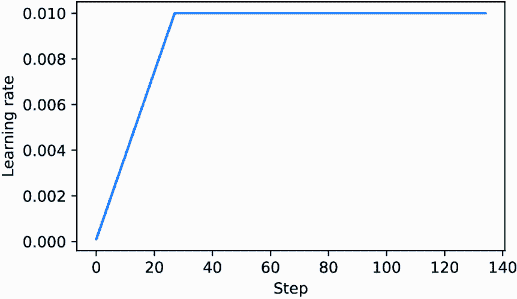
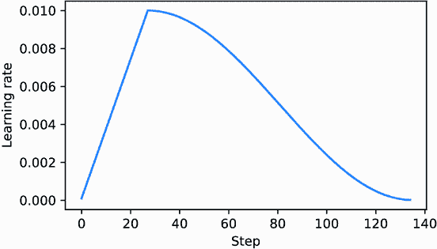
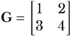

# 附录 D：为训练循环添加铃声和哨声

在这个附录中，我们增强了第 5 到 7 章中涵盖的预训练和微调过程的训练函数。特别是，它涵盖了*学习率预热*、*余弦衰减*和*梯度裁剪*。然后我们将这些技术纳入训练函数并预训练一个 LLM。

为了使代码自包含，我们重新初始化在第五章中训练的模型：

```py
import torch
from chapter04 import GPTModel

GPT_CONFIG_124M = {
    "vocab_size": 50257,          #1

    "context_length": 256,       #2
    "emb_dim": 768,           #3
    "n_heads": 12,            #4
    "n_layers": 12,           #5
    "drop_rate": 0.1,         #6
    "qkv_bias": False         #7
}
device = torch.device("cuda" if torch.cuda.is_available() else "cpu")
torch.manual_seed(123)
model = GPTModel(GPT_CONFIG_124M)
model.to(device)
model.eval()
```

#1 词汇量大小

#2 缩短上下文长度（原：1024）

#3 嵌入维度

#4 注意力头数量

#5 层数数量

#6 Dropout 率

#7 查询-键-值偏差

初始化模型后，我们需要初始化数据加载器。首先，我们加载“The Verdict”短篇小说：

```py
import os
import urllib.request

file_path = "the-verdict.txt"

url = (
    "https://raw.githubusercontent.com/rasbt/LLMs-from-scratch/"
    "main/ch02/01_main-chapter-code/the-verdict.txt"
)

if not os.path.exists(file_path):
    with urllib.request.urlopen(url) as response:
        text_data = response.read().decode('utf-8')
    with open(file_path, "w", encoding="utf-8") as file:
        file.write(text_data)
else:
    with open(file_path, "r", encoding="utf-8") as file:
        text_data = file.read()
```

接下来，我们将`text_data`加载到数据加载器中：

```py
from previous_chapters import create_dataloader_v1

train_ratio = 0.90
split_idx = int(train_ratio * len(text_data))
torch.manual_seed(123)
train_loader = create_dataloader_v1(
    text_data[:split_idx],
    batch_size=2,
    max_length=GPT_CONFIG_124M["context_length"],
    stride=GPT_CONFIG_124M["context_length"],
    drop_last=True,
    shuffle=True,
    num_workers=0
)
val_loader = create_dataloader_v1(
    text_data[split_idx:],
    batch_size=2,
    max_length=GPT_CONFIG_124M["context_length"],
    stride=GPT_CONFIG_124M["context_length"],
    drop_last=False,
    shuffle=False,
    num_workers=0
)
```

## D.1 学习率预热

实现学习率预热可以稳定复杂模型（如 LLM）的训练。这个过程涉及将学习率从非常低的初始值（`initial_lr`）逐渐增加到用户指定的最大值（`peak_lr`）。以较小的权重更新开始训练可以降低模型在训练阶段遇到大而破坏性的更新的风险。

假设我们计划训练一个 LLM 15 个 epoch，初始学习率为 0.0001，增加到最大学习率 0.01：

```py
n_epochs = 15
initial_lr = 0.0001
peak_lr = 0.01
```

预热步骤的数量通常设置在总步骤数的 0.1%到 20%之间，我们可以按以下方式计算：

```py
total_steps = len(train_loader) * n_epochs
warmup_steps = int(0.2 * total_steps)       #1
print(warmup_steps)
```

#1 20%预热

这打印出`27`，意味着我们有 20 个预热步骤，在最初的 27 个训练步骤中将初始学习率从 0.0001 增加到 0.01。

接下来，我们实现一个简单的训练循环模板来展示这个预热过程：

```py
optimizer = torch.optim.AdamW(model.parameters(), weight_decay=0.1)
lr_increment = (peak_lr - initial_lr) / warmup_steps    #1

global_step = -1
track_lrs = []

for epoch in range(n_epochs):    #2
    for input_batch, target_batch in train_loader:
        optimizer.zero_grad()
        global_step += 1

        if global_step < warmup_steps:             #3
            lr = initial_lr + global_step * lr_increment
        else:
            lr = peak_lr

        for param_group in optimizer.param_groups:    #4
            param_group["lr"] = lr
        track_lrs.append(optimizer.param_groups[0]["lr"])   #5
```

#1 这个增量由我们在每个 20 个预热步骤中增加的`initial_lr`的量决定。

#2 在每个 epoch 中遍历训练加载器中的批次执行典型的训练循环

#3 如果我们仍在预热阶段，则更新学习率

#4 将计算出的学习率应用于优化器

#5 在完整的训练循环中，会计算损失和模型更新，这里为了简单起见省略了这些内容。

在运行前面的代码后，我们通过可视化训练循环如何改变学习率来验证学习率预热是否按预期工作：

```py
import matplotlib.pyplot as plt

plt.ylabel("Learning rate")
plt.xlabel("Step")
total_training_steps = len(train_loader) * n_epochs
plt.plot(range(total_training_steps), track_lrs);
plt.show()
```

生成的图表显示，学习率从低值开始，在 20 步后增加到最大值，然后在 20 步后达到最大值（图 D.1）。



##### 图 D.1 学习率预热在最初的 20 个训练步骤中增加学习率。在 20 步之后，学习率达到峰值 0.01，并在剩余的训练中保持恒定。

接下来，我们将进一步修改学习率，使其在达到最大学习率后降低，这有助于进一步提高模型训练。

## D.2 余弦衰减

另一种广泛采用的训练复杂深度神经网络和 LLMs 的技术是*余弦衰减*。这种方法在整个训练周期中调节学习率，使它在预热阶段之后遵循余弦曲线。

在其流行的变体中，余弦衰减将学习率降低（或衰减）到几乎为零，模仿半余弦周期的轨迹。余弦衰减中学习率的逐渐降低旨在减缓模型更新其权重的速度。这尤其重要，因为它有助于在训练过程中最小化超过损失最小值的风险，这对于确保训练后期阶段的稳定性至关重要。

我们可以通过添加余弦衰减来修改训练循环模板：

```py
import math

min_lr = 0.1 * initial_lr
track_lrs = []
lr_increment = (peak_lr - initial_lr) / warmup_steps
global_step = -1

for epoch in range(n_epochs):
    for input_batch, target_batch in train_loader:
        optimizer.zero_grad()
        global_step += 1

        if global_step < warmup_steps:                     #1
            lr = initial_lr + global_step * lr_increment  
        else:                                                #2
            progress = ((global_step - warmup_steps) / 
                        (total_training_steps - warmup_steps))
            lr = min_lr + (peak_lr - min_lr) * 0.5 * (
                1 + math.cos(math.pi * progress)
            )

        for param_group in optimizer.param_groups:
            param_group["lr"] = lr
        track_lrs.append(optimizer.param_groups[0]["lr"])
```

#1 应用线性预热

#2 在预热后使用余弦退火

再次，为了验证学习率是否按预期改变，我们绘制了学习率图：

```py
plt.ylabel("Learning rate")
plt.xlabel("Step")
plt.plot(range(total_training_steps), track_lrs)
plt.show()
```

结果的学习率图显示，学习率开始于线性预热阶段，在 20 步内增加，直到 20 步后达到最大值。在 20 步的线性预热之后，余弦衰减开始，逐渐降低学习率，直到达到其最小值（图 D.2）。



##### 图 D.2 线性学习率预热的前 20 步之后是余弦衰减，它以半余弦周期降低学习率，直到训练结束时达到其最小点。

## D.3 梯度裁剪

*梯度裁剪*是增强 LLM 训练稳定性的另一种重要技术。这种方法涉及设置一个阈值，超过该阈值梯度将被缩放到预定的最大幅度。这个过程确保在反向传播过程中模型参数的更新保持在可管理的范围内。

例如，在 PyTorch 的`clip_grad_` `norm_`函数中应用`max_norm=1.0`设置确保梯度的范数不超过 1.0。在这里，“范数”表示梯度向量在模型参数空间中的长度或大小，具体指的是 L2 范数，也称为欧几里得范数。

用数学术语来说，对于一个由分量***v*** = [*v*[1], *v*[2], ..., *v**n*]组成的向量***v***，L2 范数是


这种计算方法也适用于矩阵。例如，考虑一个由以下给出的梯度矩阵



如果我们想将这些梯度裁剪到`max_norm`为 1，我们首先计算这些梯度的 L2 范数，它是


由于|**G**|[2] = 5 超过了我们的`max_norm`，我们将梯度缩放到其范数正好等于 1。这是通过一个缩放因子实现的，计算为`max_norm`/|**G**|[2] = 1/5。因此，调整后的梯度矩阵**G'**变为


为了说明这个梯度裁剪过程，我们首先初始化一个新的模型并计算一个训练批次的损失，类似于标准训练循环中的过程：

```py
from chapter05 import calc_loss_batch

torch.manual_seed(123)
model = GPTModel(GPT_CONFIG_124M)
model.to(device)
loss = calc_loss_batch(input_batch, target_batch, model, device)
loss.backward()
```

在调用`.backward()`方法后，PyTorch 计算损失梯度并将它们存储在每个模型权重（参数）张量的`.grad`属性中。

为了阐明这一点，我们可以定义以下`find_highest_gradient`实用函数，通过扫描模型权重张量的所有`.grad`属性来识别最高的梯度值，在调用`.backward()`之后：

```py
def find_highest_gradient(model):
    max_grad = None
    for param in model.parameters():
        if param.grad is not None:
            grad_values = param.grad.data.flatten()
            max_grad_param = grad_values.max()
            if max_grad is None or max_grad_param > max_grad:
                max_grad = max_grad_param
    return max_grad
print(find_highest_gradient(model))
```

前面代码确定的最大梯度值是

```py
tensor(0.0411)
```

现在我们应用梯度裁剪并看看这如何影响最大梯度值：

```py
torch.nn.utils.clip_grad_norm_(model.parameters(), max_norm=1.0)
print(find_highest_gradient(model))
```

应用梯度裁剪（最大范数为 1）后的最大梯度值比之前小得多：

```py
tensor(0.0185)
```

## D.4 修改后的训练函数

最后，我们通过添加本文中介绍的三种概念来改进`train_model_simple`训练函数（见第五章）：线性预热、余弦衰减和梯度裁剪。这些方法共同帮助稳定 LLM 的训练。

与`train_model_simple`相比，代码的变化如下所示：

```py
from chapter05 import evaluate_model, generate_and_print_sample

def train_model(model, train_loader, val_loader, optimizer, device,
                n_epochs, eval_freq, eval_iter, start_context, tokenizer,
                warmup_steps, initial_lr=3e-05, min_lr=1e-6):

    train_losses, val_losses, track_tokens_seen, track_lrs = [], [], [], []
    tokens_seen, global_step = 0, -1

    peak_lr = optimizer.param_groups[0]["lr"]   #1
    total_training_steps = len(train_loader) * n_epochs     #2
    lr_increment = (peak_lr - initial_lr) / warmup_steps    #3

    for epoch in range(n_epochs):
        model.train()
        for input_batch, target_batch in train_loader:
            optimizer.zero_grad()
            global_step += 1

            if global_step < warmup_steps:   #4
                lr = initial_lr + global_step * lr_increment  
            else:
                progress = ((global_step - warmup_steps) / 
                            (total_training_steps - warmup_steps))
                lr = min_lr + (peak_lr - min_lr) * 0.5 * (
                    1 + math.cos(math.pi * progress))

            for param_group in optimizer.param_groups:   #5
                param_group["lr"] = lr
            track_lrs.append(lr)
            loss = calc_loss_batch(input_batch, target_batch, model, device)
            loss.backward()

            if global_step >= warmup_steps:         #6
                torch.nn.utils.clip_grad_norm_(
                    model.parameters(), max_norm=1.0
                )
 #7
            optimizer.step() 
            tokens_seen += input_batch.numel()

            if global_step % eval_freq == 0:
                train_loss, val_loss = evaluate_model(
                    model, train_loader, val_loader,
                    device, eval_iter
                )
                train_losses.append(train_loss)
                val_losses.append(val_loss)
                track_tokens_seen.append(tokens_seen)
                print(f"Ep {epoch+1} (Iter {global_step:06d}): "
                      f"Train loss {train_loss:.3f}, "
                      f"Val loss {val_loss:.3f}"
                )

        generate_and_print_sample(
            model, tokenizer, device, start_context
        )

    return train_losses, val_losses, track_tokens_seen, track_lrs
```

#1 从优化器中检索初始学习率，假设我们将其用作峰值学习率

#2 计算训练过程中的总迭代次数

#3 在预热阶段计算学习率增量

#4 根据当前阶段（预热或余弦退火）调整学习率

#5 **将计算出的学习率应用于优化器**

#6 在预热阶段之后应用梯度裁剪以避免梯度爆炸

#7 以下内容与第五章中使用的 train_model_simple 函数相比保持不变。

定义了`train_model`函数后，我们可以像使用`train_model_simple`方法进行预训练一样使用它来训练模型：

```py
import tiktoken

torch.manual_seed(123)
model = GPTModel(GPT_CONFIG_124M)
model.to(device)
peak_lr = 0.001
optimizer = torch.optim.AdamW(model.parameters(), weight_decay=0.1)
tokenizer = tiktoken.get_encoding("gpt2")

n_epochs = 15
train_losses, val_losses, tokens_seen, lrs = train_model(
    model, train_loader, val_loader, optimizer, device, n_epochs=n_epochs,
    eval_freq=5, eval_iter=1, start_context="Every effort moves you",
    tokenizer=tokenizer, warmup_steps=warmup_steps, 
    initial_lr=1e-5, min_lr=1e-5
)
```

在 MacBook Air 或类似笔记本电脑上完成训练大约需要 5 分钟，并打印以下输出：

```py
Ep 1 (Iter 000000): Train loss 10.934, Val loss 10.939
Ep 1 (Iter 000005): Train loss 9.151, Val loss 9.461 
Every effort moves you,,,,,,,,,,,,,,,,,,,,,,,,,,,,,,,,,,,,,,,,,,,,,,,,,,
Ep 2 (Iter 000010): Train loss 7.949, Val loss 8.184 
Ep 2 (Iter 000015): Train loss 6.362, Val loss 6.876 
Every effort moves you,,,,,,,,,,,,,,,,,,, the,,,,,,,,, the,,,,,,,,,,, 
the,,,,,,,, 
... 
Ep 15 (Iter 000130): Train loss 0.041, Val loss 6.915 
Every effort moves you?"  "Yes--quite insensible to the irony. She wanted him vindicated--and by me!"  He laughed again, and threw back his head to look up at the sketch of the donkey. "There were days when I
```

与预训练类似，由于数据集非常小，模型在几个 epoch 后开始过拟合，我们多次迭代它。尽管如此，我们可以看到函数正在起作用，因为它最小化了训练集损失。

鼓励读者在更大的文本数据集上训练模型，并将使用此更复杂的训练函数获得的结果与使用`train_model_simple`函数获得的结果进行比较。
