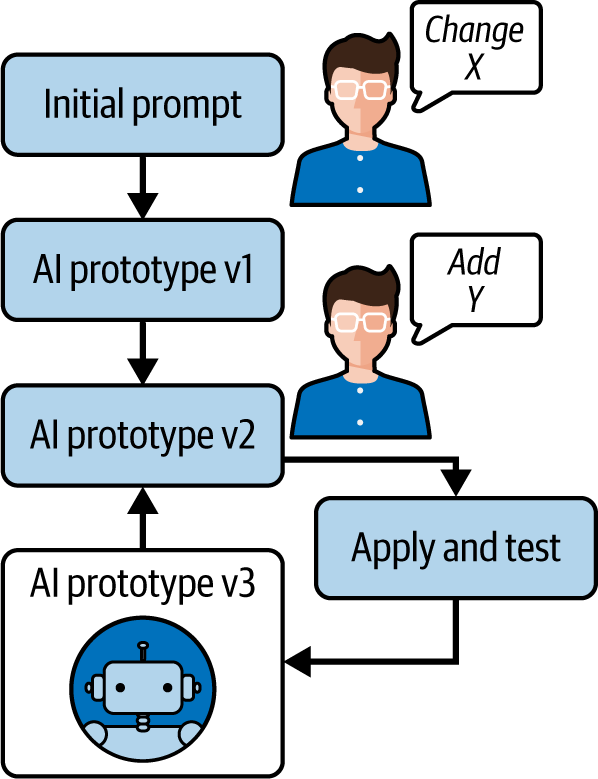

# 第六章\. AI 驱动的原型设计：工具和技术

本章探讨了 AI 驱动的动态编码如何加速软件开发的原型阶段。原型设计就是快速将想法转化为工作模型。有了 AI 助手，开发者可以在几小时内完成可能通常需要几天的工作，快速迭代概念。我将讨论使用 AI 从概念到原型的技术，比较流行的 AI 原型设计工具（包括 Vercel v0 和截图转代码工具），并检查如何在 AI 指导下迭代优化原型。我还将讨论将粗糙的 AI 生成的原型过渡到生产质量代码的关键步骤。在整个章节中，我还会分析 AI 驱动的原型设计导致成功案例的研究，并展示这种方法的潜力和陷阱。

# 使用 AI 助手进行快速原型设计

原型设计极大地受益于 AI 生成代码的速度。原型设计的目的是不是经过抛光的、生产就绪的代码，而是一个*概念验证*，你可以评估和改进。AI 编码助手在这里表现出色，因为它可以从最小的输入中快速生成功能代码。例如，开发者可以不用手动编写 UI 原型，而是用自然语言描述所需的界面，让 AI 生成 HTML/CSS 或 React 组件。这允许非常快速地从想法到实施周期的转换。

[一位用户体验工程师](https://oreil.ly/dP5U3)描述了使用生成式 AI 工具如何彻底改变他的工作流程：“我使用生成式 AI 生成功能原型时的速度令人惊叹。我几个小时就完成了通常需要几天时间才能完成的原型。”AI 可以自动处理常规的模板和重复的模式，使他能够专注于更高层次的设计决策。在原型设计中，这意味着你可以在相同的时间内尝试更多的想法。另一个好处是，AI 可以几乎瞬间填充原型中繁琐的部分（基本的 UI 组件、表单处理、示例数据），使人类开发者能够专注于被测试的核心概念或独特功能。

然而，重要的是要记住，原型的代码通常是废弃代码。AI 可能快速生成一个可行的解决方案，但该代码可能没有为维护或扩展而设计。在原型中这是可以接受的，因为速度和实验比优雅更重要——只要你计划在生产中重构或重写关键部分（我将在本章后面讨论这个过程）。正如第三章和第四章所探讨的，AI 可以自信地处理原型约 70%的编码工作，而你则指导整体架构并纠正任何关键缺陷。

在第一章中引入的概念“有意图的编程”在这里至关重要。你提供高级指令（你希望原型做什么或看起来像什么的目的）并让 AI 填充实现。为了说明，让我们通过使用 AI 助手的一个非常简单的原型示例来操作。假设你有一个为新服务创建注册页面的想法。你希望快速原型化前端，所以你从以下开发者提示开始：

> 创建一个简单的 HTML 页面，用于注册表单，包含姓名、电子邮件和密码字段，以及一个提交按钮。用基本的样式让它看起来更美观。

一个现代的代码助手，如 Cline，可能会提供一个完整的 HTML/CSS 示例：

```py
<!DOCTYPE html>
<html lang="en">
<head>
  <meta charset="UTF-8" />
  <meta name="viewport" content="width=device-width, initial-scale=1.0" />
  <title>Sign Up</title>
  <style>
    body { font-family: Arial, sans-serif; max-width: 400px; margin: 2em auto; }
    form { display: flex; flex-direction: column; }
    label { margin-top: 1em; }
    input, button { padding: 0.5em; font-size: 1em; }
    button { margin-top: 1em; background: #4CAF50; color: #fff; border: none; }
  </style>
</head>
<body>
  <h2>Sign Up</h2>
  <form>
    <label>Name: <input type="text" name="name" required></label>
    <label>Email: <input type="email" name="email" required></label>
    <label>Password: <input type="password" name="password" required></label>
    <button type="submit">Create Account</button>
  </form>
</body>
</html>
```

这段由 AI 生成的代码是注册表原型的一个不错的起点。它包括基本的布局和一些内联 CSS 用于样式。作为一个开发者，你不必手动编写任何 HTML/CSS——你只需描述结果，AI 就提供了实现。这展示了有意图的编程：你专注于 UI 应该做什么，AI 就会想出如何做。

当然，这只是一个简单的例子。在实践中，原型可能更复杂，涉及多个文件、框架或数据。但原则是相同的：你使用 AI 快速创建一个初稿。然后你可以在浏览器中打开这个原型，看看它的样子，并进一步改进它。这让我想到了下一个话题：使用超越纯语言提示的专门化 AI 原型工具。

# AI 原型工具

虽然像 Gemini、ChatGPT 和 Claude 这样的通用助手可以从提示中生成原型代码，但专门化的 AI 辅助原型工具领域仍在迅速演变。在我撰写本文时，可用的工具提供了不同的方法来解决 AI 生成原型中的基本权衡：保真度和控制度。

生态系统已经成熟，以满足不同的原型需求。一些工具擅长将视觉设计转换为代码，允许设计师上传截图或草图，并在几秒钟内接收可工作的 HTML、CSS 或 React 组件。这种“截图转代码”的能力极大地加速了设计到代码的过程，特别是当你有需要快速实施的亲手草图或 Figma 设计时非常有价值。像 Vercel v0 这样的工具就体现了这种方法，它在保持原始设计高保真的同时，牺牲了一些对代码结构的控制。

其他平台专注于通过对话界面生成完整的应用程序。这些界面允许用户用自然语言描述功能，并接收全栈实现。例如，一个想要快速应用而无需编码的设计师可能会使用 Lovable 或 Bolt.new 等工具，这些工具提供高级提示界面，可以构建整个应用程序。一些设计师报告说，他们可以在几小时内构建出传统上需要几天时间才能完成的具有功能的原型，AI 自动处理繁琐的组件和模式。

第三类将人工智能直接集成到开发环境中，在原型设计阶段充当智能配对程序员。这些 AI 增强型 IDE，如 Cursor、Windsurf 和 Cline，允许开发者在对代码生成过程保持更多控制的同时，仍然受益于 AI 加速。区别通常在于工作流程哲学：一些优先考虑自动应用更改以进行快速实验，而另一些则需要明确接受修改以进行更细致的迭代。

所有这些方法之间的共同点是它们能够压缩从概念到工作原型的旅程。然而，它们在两个关键维度上存在显著差异，这些维度决定了它们对不同用户和用例的实用性。

*保真度*指的是生成的输出与您的输入或意图的匹配程度。截图到代码的工具通常提供高保真度视觉设计，但可能生成的代码与您的架构偏好不符。对话工具可能更宽松地解释您的需求，生成功能但通用的实现，需要进一步优化。

控制包括您引导和修改生成过程的能力。一些工具作为黑盒产生完整的输出，而其他工具则允许通过持续的对话或直接代码编辑进行迭代改进。当您需要特定的架构模式、性能优化或与现有代码库集成时，这个维度变得至关重要。

理解这些权衡有助于选择适合您原型设计需求的正确工具。一个验证新交互模式的设计师可能会优先考虑保真度和速度，接受对实现细节的控制较少。一个探索技术可行性的开发者可能会重视控制和透明度，即使这意味着在生成过程中需要更多手动干预。

没有任何这些工具在没有人工监督的情况下产生生产质量的代码。它们通常交付我所说的“80%原型”——足够功能化以测试概念并向利益相关者展示，但需要额外的工作才能用于生产部署。剩余的 20%通常涉及安全加固、性能优化、错误处理和架构优化。

即使在快速原型设计过程中，快速代码审查仍然至关重要。虽然你可能不会在原型中完善每一个细节，但扫描明显的问题，如暴露的 API 密钥或不安全的数据处理，可以防止问题传播到后续的开发阶段。大多数现代工具都提供了对其生成代码的透明度，允许你检查和理解正在创建的内容。

随着 AI 原型设计领域的持续发展，具体工具无疑会发生变化，但这些关于忠实度与控制之间的基本考虑，以及需要人工监督的需求将保持不变。关键是理解你的原型设计目标，并选择与你的具体需求相一致的方法，无论是快速视觉实现、功能演示还是技术探索。

# 从概念到原型：迭代改进

AI 驱动原型设计的一个优势是*迭代循环*：你可以生成一个初始版本，然后通过与 AI 交互对其进行改进。你不必手动编辑代码，只需告诉 AI 你想要改变的内容（见图 6-1）。虽然我提倡比纯“即兴创作”的 vibe 编码更负责任的方法，但快速反馈周期在原型设计中确实值得拥抱。



###### 图 6-1\. 迭代原型改进过程：初始提示生成基线原型，开发者反馈推动后续改进，通过 AI 协作创建越来越精细的解决方案。

大多数 AI 原型设计工具都会保存你的请求历史或上下文，这非常有用。这意味着 AI 记得你应用的目的和之前的指令，因此你不必每次都重新解释一切。这种*上下文持久性*是 vibe-coding 环境的标志：与 AI 的对话变成了开发日志。

这就是典型的迭代改进可能的过程：

第 1 步：初始生成

你提供提示或输入以创建原型：

> 生成一个基本的费用追踪应用，包含一个用于添加费用的表单和一个用于列出费用的表格。

第 2 步：审查和运行代码

你得到生成的代码并运行它。可能它工作得很好，但你注意到一些可以改进的地方。例如，UI 功能正常但平淡无奇，或者表格不能对费用进行排序。

第 3 步：细化你的提示

你回到 AI 那里并提供额外的指令。例如：

> 使费用列表按金额或日期排序。

AI 可能会修改代码以包含排序逻辑或使用可排序表格的库：

> 添加一些颜色样式，也许使用现代 CSS 框架。

AI 可以集成 CSS 库（如 Tailwind 或 Bootstrap）或仅添加自定义样式以使其看起来更美观：

> 验证表单，以确保你无法添加没有名称和金额的费用。

AI 可能会添加简单的前端验证。

这些提示中的每一个都会修改原型。因为 AI 理解上下文（如 Cursor 和持续的聊天工具将保持代码状态），它通常可以在正确的地方应用更改——例如，在表单中插入验证代码或重写表格渲染以包括可排序的列。

第 4 步：重复使用

在每次细化后，你检查结果。如果 AI 引入了新的问题或没有完全按照你的意图执行，你通过提示进行澄清或修复：

+   排序是逆序的——请默认按升序排序。

+   新的颜色方案很好，但将标题改为深蓝色而不是黑色。

每个迭代周期都非常快——通常只需要几秒钟的处理时间——这意味着你可以在一个小时内完成十几个迭代。与手动编码和检查所有这些更改相比，AI 方法可以显著更快。这尤其适用于广泛的更改，如重设计或添加功能。

重要的是，使用 AI 进行迭代需要清晰的沟通。这正是你的**提示工程**技巧发挥作用的地方。你对想要的变化描述得越明确和清晰，AI 就越有可能正确执行。例如，说“让它看起来更漂亮”是模糊的。一个更具体的提示会给助手一个具体的方向：

> 应用浅色主题，带有蓝色标题，并增加字体大小以提高可读性。

如果你使用 Vercel v0 或 Lovable 这样的工具，你甚至可以使用其界面指向 UI 的一部分，并说，“将其改为 X。”

让我们看看开发者和 AI 编码助手之间简短的对话迭代过程：

> 生成一个用于待办事项列表的 React 组件。它应显示任务列表和一个用于添加新任务的文本输入框。

AI 生成一个具有状态的 React 组件，用于任务，并渲染一个列表、一个输入框和一个添加任务的按钮：

> 太好了。现在使每个任务可编辑，并添加一个复选框来标记它已完成。

AI 更新代码，渲染每个任务带有复选框和编辑功能，并相应地修改状态。开发者运行应用程序并发现编辑功能正常，但没有删除按钮：

> 为每个任务添加一个删除按钮。

AI 在代码中添加了删除功能：

> 布局有点拥挤。添加一些基本的 CSS 来分隔列表项，并使字体略大一些。

AI 输出 CSS 样式，可能作为组件中的`<style>`或单独的 CSS 片段：

> 看起来更好！

这种来回沟通可能持续到原型符合预期。最终，开发者得到了一个待办事项列表应用程序的工作原型，具有创建、编辑、完成和删除功能——所有这些都是通过自然语言请求和快速的 AI 代码输出构建的。

在整个过程中，请记住，开发者仍然是发生事情的主导者。AI 可能会提出一种实现功能的方法，但*你*决定它是否符合你的需求。有时 AI 的实现是正确的，但不是你所预期的（可能它使用了与你在意中不同的 UI 方法）。你可以接受它（如果它不影响原型目标）或指示 AI 改变到你喜欢的方案。

# 将原型演进为生产版本

原型旨在证明概念和了解哪些可行的工具。一旦它完成了这个目的——比如说，你已通过用户验证了设计或证明某个功能是可行的——下一步通常是将它转变为生产应用程序。这种转变是一个关键转折点。AI 仍然可以提供帮助，但人类开发者必须磨平原型的粗糙边缘。本节将探讨从原型到生产代码迁移时的关键考虑因素。

首先，仔细审查架构和代码结构。原型在底层可能会很混乱。也许你的所有代码都集中在一个文件中，或者为了速度而绕过了某些最佳实践。现在是引入适当结构的时候了。例如，如果原型是一个单页脚本，你可能将其拆分为多个模块；对于 Web UI，你可能引入适当的组件结构；对于后端，你可能设置正式的模型-视图-控制器（MVC）架构模式。

虽然 AI 编写了大部分原型，但你作为开发者，最了解架构目标。你可能甚至开始一个全新的项目，并将原型作为参考或脚手架，可能重用一些原型代码，但通常将其视为可丢弃的代码。其他人可能会逐步重构原型代码库，AI 建议重构或生成测试以确保清理过程中不会出错。

接下来，添加错误处理和边缘情况。原型代码通常专注于晴朗天气的场景，但 API 调用失败怎么办？输入为空怎么办？系统地审查每个功能并考虑潜在的失败模式。

给定这样的提示，AI 可以帮助你构思边缘情况：

> 这个功能的潜在错误情况有哪些？如何处理它们？

助手可能会列出一些场景（如网络错误、输入错误、并发问题），针对这些场景你可以实现处理（或请求 AI 帮助实现）。确保你的代码的健壮性是使其准备投入生产的一部分。

你的原型代码可能没有优化，因此检查任何低效或可能引发安全问题的部分。例如，原型中的 AI 可能使用了一个在小型测试数据集上工作的朴素算法，但处理真实数据时会很慢。识别这些区域并对其进行优化。（我将在第八章中介绍常见的 AI 生成代码缺陷。）

一种策略是在原型上运行性能测试或使用分析器查看瓶颈，然后请求 AI 帮助优化该函数。当然，也要审查安全功能，如身份验证和数据处理——AI 原型在没有适当参数化（风险 SQL 注入攻击）或包含[敏感信息](https://oreil.ly/gzUjn)的情况下使用 SQL 查询并不罕见。这些问题*必须*得到解决。一项[2021 年的研究](https://oreil.ly/a72lb)发现，大约 *40% 的 AI 生成的代码存在潜在漏洞*。因此，将代码投入生产的一部分是保持警惕。手动运行静态分析和安全测试，或者提示 AI “扫描此代码中的安全问题”。

原型通常缺乏文档，随着你正式化代码，你需要添加这些文档：对每个模块的清晰、经过人工审查的解释将有助于未来的团队成员，以及当你几个月后再次查看代码时，也会对你有所帮助。一旦你清理了代码，你可以提示 AI 工具根据代码生成 Markdown API 文档或 README，描述系统的工作方式。第一章讨论了 AI 如何生成代码的解释；这是一个利用这一点的绝佳时刻。

仔细测试你的原型至关重要，正如你在第五章中学到的。你可能需要为核心逻辑编写单元测试，为主要流程编写集成测试等。你可以通过请求 AI 生成测试用例来加速这个过程：

> 为待办事项组件编写 Jest 测试，涵盖添加、编辑、完成、删除任务。

然后运行并调整它生成的测试。拥有一个好的测试套件，在重构原型代码时，你会更有信心。

有时你可能会决定完全替换代码的某些部分——例如，如果原型使用了某些快速且不干净的库或长期不合适的黑客技巧。AI 也可以加速这个过程。假设你的原型代码使用本地数组进行数据存储，但现在你需要适当的数据库集成。你的提示可能如下所示：

> 将 SQLite 数据库集成用于存储任务，而不是使用内存数组。

AI 可以为此集成提供一个起点，然后你应该对其进行细化。

在进行这些更改时，明智的做法是将你的思维方式从“快速原型模式”转变为更严谨的工程方法。现在，AI 成为你提高代码质量的助手——它不再只是快速输出功能。动态也略有不同：由于稳定性和质量成为你的首要任务，你可能现在会更为批判性地评估每个 AI 建议。正如我在第四章中提到的，*高级开发者可以从 AI 中获得巨大的益处*，因为他们知道什么该接受，什么该修正。在这个阶段，你将大量运用高级思维模式：你对最终系统有一个愿景，因此你让 AI 负责特定的改进或实现。

为了使这次讨论更具体，让我们考虑一个简短的例子。想象一个独立开发者 Jane，她想要构建一个将 CSV 文件中的数据转换为图表的小型网络应用。她使用 AI 助手在仅仅一个周末内就完成了快速原型：一个基本的 Node.js 脚本，包含 API，以及一个简单的前端，用于上传 CSV 文件并使用 JavaScript 图表库渲染图表。

她向几位潜在用户展示了这个原型，并获得了积极的反馈，因此 Jane 决定将其转变为一个真实的产品（一个网络服务）。以下是她的过渡过程：

加强后端

原型的 Node.js API 没有认证（任何人都可以上传数据）。对于生产环境，她需要用户账户和认证。她使用 AI 集成了认证系统（可能是基于 JWT 的）。AI 提供了一个框架，但她仔细审查以确保密码被正确散列，令牌是安全的。她还添加了输入验证到上传端点（AI 没有做这个），结合了 AI 建议的代码和她的个人调整。

重构前端

初始的前端是一个包含指向 CDN 依赖项的 script 标签的单个 HTML 文件。Jane 决定重构为一个结构化的 React 应用以提高可维护性。她首先要求 AI 通过使用构建系统和 npm 而不是 script 标签来使她的项目更适用于生产。然后她要求 AI 帮助将这些集成到 React 组件中。例如，它将原型中的图表渲染代码转换为`<Chart>`组件。Jane 使用 AI 来加速编写这些组件，但她确保状态管理和组件层次结构遵循最佳实践（这是原型没有深入考虑的）。

测试和检查性能

Jane 为关键功能编写单元测试（CSV 解析，数据转换）。当她不确定边缘情况时，她会向 AI 查询：

> 我应该为 CSV 解析测试哪些边缘情况？

它建议了诸如空字段和不规则列等场景，她将这些场景纳入她的测试中。她还注意到原型将整个 CSV 文件加载到内存中；对于大文件，这可能会导致崩溃。她修改了代码以流式处理处理，并使用 AI 来双重检查她的流逻辑。现在，该应用可以更可靠地处理更大的文件。

精炼 UI

原型 UI 是实用的。对于她的产品，简花了一些时间在用户体验上。她要求 AI 推荐一个响应式布局，并可能集成一个 CSS 框架。AI 添加了 Bootstrap，她随后使用它来改善外观（表单、按钮、布局）。之后，她手动调整了一些 CSS。这个抛光阶段与其说是重编码，不如说是设计选择，但 AI 仍然通过提供标准 UI 模式（如导航栏和加载指示器）的快速代码来帮助。

经过这些努力，曾经粗糙的原型现在是一个更干净、更安全、更可扩展的应用程序，准备迎接真实用户。简部署了它，因为她添加了测试并审查了 AI 生成的代码，所以她感到自信。从原型到生产的这个过程可能花费了她几周时间，而从头开始编写整个产品可能需要更长的时间。AI 加速了初始原型，并在过渡过程中继续提供帮助，但简的人类监督和重构对于达到生产质量是不可或缺的。

# 解决 AI 原型设计中的挑战

虽然 AI 驱动的原型设计功能强大，但它并非没有挑战。作为一名开发者，你应该意识到这些挑战并知道如何减轻它们。两个特别感兴趣的区域是范围蔓延和集成。

由于使用 AI 添加功能非常容易，你可能会被诱惑继续添加“另一件事”到原型中，这种现象被称为*范围蔓延*。这可能导致原型不断增长，试图成为最终产品。记住原型的目的：专注于你想要回答的关键问题或要展示的核心体验。如果你发现自己正在实现登录系统、支付处理等，问问自己这些在原型阶段是否真的需要。可能更好的是，将这些功能简化（AI 可以生成一个模拟的登录流程，而不是真正的流程）。保持原型的专注将节省你的时间，并使其更容易在以后丢弃或重做。

# 保持专注

记下你原型的目标（“展示用户可以上传 CSV 文件并得到图表以测试可行性”），并以此为目标。使用 AI 快速达到这个目标，并抵制对原型进行过度美化的诱惑。

其次，是集成到真实系统中的问题。原型通常使用模拟数据或简化的子系统。如果你的 AI 原型使用模拟数据或本地文件，将其与生产中的真实数据库或服务集成可能并非易事。在原型设计时，要留意可能采取了某些捷径。例如，原型中的电子邮件可能实际上并没有发送，只是记录到控制台。在生产中，你需要一个真实的电子邮件服务。AI 可以帮助在以后集成这些服务，但最好保持跟踪：在原型设计时维护一份“如果我们继续前进需要解决的问题”清单。这样你就不会忘记哪些部分是临时的。如果在一个团队中工作，要清楚地沟通这些内容。例如，你可能在代码中留下一条注释：`// TODO: 在此处集成真实电子邮件服务`。许多 AI 工具在生成简化解决方案时实际上会包含这样的 TODO 注释，这很有帮助。

通过预见这些挑战，你可以在不陷入其陷阱的情况下有效地使用 AI 原型设计。当它被深思熟虑地使用时，结果是记录时间内开发出的稳健原型，既可以转化为最终产品，也可以在提取其提供的经验教训后搁置。

# 摘要和下一步行动

在本章中，你看到了 AI 辅助的 vibe 编码如何加速原型设计过程。通过让 AI 处理代码生成的繁重工作，开发者可以以前所未有的速度从概念到工作模型。我介绍了用于 UI 生成的 Vercel v0 工具、用于全栈原型的 Lovable，以及 Cursor 和 Windsurf 等 AI 增强型 IDE——每个都使快速原型设计的不同方面成为可能。我还强调了 AI 原型设计的迭代性质：快速循环生成、测试和改进，自然语言提示引导变化。

虽然 AI 驱动的原型设计可以在几小时内产生一个功能演示，但我们还讨论了至关重要的过渡到生产阶段。信息很明确：原型不是最终产品。它是第一稿。人类开发者必须重构和强化代码，AI 在此过程中继续提供协助（提出改进建议、生成测试等）。使用这些技术的个人和团队案例研究突出了真正的生产力提升——几天内而不是几周内构建原型，从而加快了用户反馈和商业决策。

到现在为止，你应该已经理解了 vibe 编码如何使原型设计感觉更像与助手头脑风暴而不是苦干。这是一种根本不同的感觉：更对话式、更高级，而且更快。然而，你也看到了即使在快速原型中也要保持代码质量意识的重要性——当然，在原型阶段之后演变时更是如此。

在第七章，我将关注点从快速原型设计转移到在人工智能辅助下的全面网络应用开发。虽然原型设计探索可能性，但全面开发需要系统性的方法来处理架构、实施和部署。
