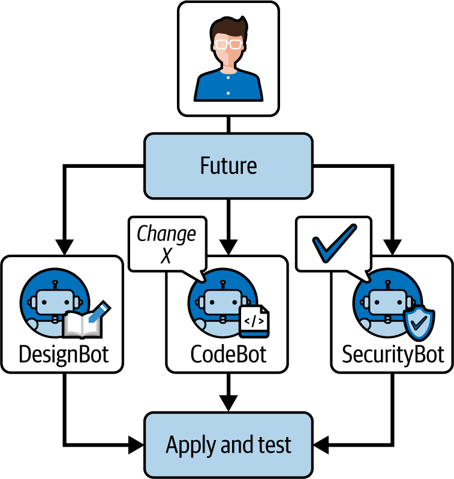

# 第十一章。超越代码生成：人工智能增强开发的未来

感官编码可能始于人工智能根据我们的提示生成代码，但其影响远远超出了仅仅编写代码的范畴。随着人工智能技术的进步，它们有望改变软件开发生命周期的**每一个**方面。在本章中，我将对人工智能在软件中未来可能发挥的作用进行推测性的、有根据的探讨。我将探讨人工智能驱动的测试、调试和维护；人工智能如何影响软件设计和用户体验个性化；在人工智能辅助下的项目管理演变；甚至编程语言的未来。目标是想象一个未来，其中人工智能不仅仅是代码生成器，而是软件工程中的全面参与者——同时将讨论建立在基本原理之上，以确保即使在具体技术来来去去的情况下，它仍然具有相关性。

# 测试、调试和维护中的 AI

想象一个未来开发环境，当你编写一个函数（无论是手动编写还是通过感官编码）时，人工智能工具立即为它编写一系列单元测试，找到潜在的错误，甚至可能在一秒钟内修复它们。这种场景正在迅速成为可能。让我们分析人工智能在质量保证和维护方面可能（以及已经出现）的贡献。

## 自动化测试生成

编写详尽的测试既耗时又常因截止日期而被忽视。正如你在第七章中看到的，当前的人工智能助手可以通过自动生成测试来缓解这一问题。例如，给定一段代码，人工智能可以建议一组单元测试，涵盖典型情况、边缘情况和错误条件。

在未来，这可能会更进一步：人工智能可以检查你的整个代码库，识别测试覆盖率不足的函数或模块，并生成额外的测试。它甚至可能模拟人类测试人员不会想到的输入（如模糊测试），从而可能捕捉到边缘情况错误。好处是拥有更健壮的代码库，而手动测试编写的工作量最小化。

但有一个前提是，测试的质量取决于人工智能对规格说明的理解。因此，人类应该审查人工智能生成的测试，以确保它们与软件的预期行为一致。例如，人工智能可能会断言某个输出是代码**技术上**所执行的，但可能需求是不同的——只要有人参与其中，实际上有助于捕捉到代码或测试中的误解。

## 智能调试

调试通常涉及通过日志或逐步执行代码来繁琐地搜索错误源。第五章（Chapter 5）向您展示了 AI 如何充当智能调试伴侣。一些当前的 AI 工具可以将错误消息和有问题的代码作为输入，并返回一个解释和代码更改来修复它。

为了了解 AI 辅助调试工作流程可能如何演变，考虑一个 AI 系统，该系统监控您的程序执行，当发生崩溃或异常时，它分析堆栈跟踪和变量状态以确定可能的原因。它可能不仅给您一个错误消息，还可能说：

> 应用程序崩溃是因为在调用 getEmail()时 userProfiles 为 null。这表明在加载用户配置文件时缺少 null 检查。

此外，AI 还可以建议一个修复方案：

> 一种可能的解决方案是在 userProfiles 为 null 时初始化它，或者在调用 getEmail()之前添加一个条件。您希望我应用这个修复吗？

未来的调试 AI 可以直接与运行时环境集成，实时捕获问题。它们甚至可以通过分析代码路径来预测问题*在发生之前*：

> 如果用 y = 0 调用此函数，可能会抛出除以零异常；请考虑处理该情况。

这类似于静态分析，但由 AI 对无数代码库和错误模式的学习知识驱动，使其可能更具洞察力或更灵活。

## 预测性维护和重构

随着时间的推移，需求发生变化，代码会变得过时或次优。维护涉及诸如重构（在不改变行为的情况下改进代码结构）、更新依赖项和优化性能等活动。AI 可以在这些领域的每个方面提供帮助：

重构

未来的 AI 可以识别代码异味（如重复代码或长函数）并自动重构它们。例如，它可能会检测到您在三个地方有相似的代码块，并建议将它们抽象成一个单独的辅助函数。或者，它可以将深层嵌套的循环集转换为更易读的形式。由于 AI 已经看到了许多“良好”代码的示例，它可以建议[风格改进](https://oreil.ly/XWXC_)以保持代码库干净和可维护。我们可能会有一天在我们的编辑器中有一个模式，AI 在后台持续重构代码，开发者审查并批准更改。

更新依赖项

未来的 AI 服务可能会监控您的项目依赖项（如库和框架），并自动生成拉取请求以将它们更新到新版本，包括任何必要的代码更改以适应破坏性更改。例如，如果一个 Web 框架的新版本更改了 API，AI 可以调整您的代码以适应新的 API。这将节省开发者阅读迁移指南和修复版本问题的重复性工作。

性能调整

维护通常包括在数据扩展或使用模式变化时提高性能。AI 可以通过分析性能配置文件并指出低效之处发挥作用。例如，AI 可能会注意到你的代码中某个数据库查询耗时较长，并建议添加索引或重写查询。它可能识别出你的代码中的循环正在执行冗余计算，并建议使用缓存。这就像有一个性能专家始终关注你的应用程序——主动检测低效之处，如冗余循环或次优数据结构。

AI 可能在预演环境中运行，模拟高负载，然后给你一份报告：“在高负载下，模块 X 由于 Y 成为瓶颈。考虑使用方法 Z 进行重构。”本质上，AI 不仅发现问题，还教育团队了解更好的模式。

# AI 驱动的设计和用户体验个性化

除去代码和逻辑，AI 将影响我们设计软件的方式以及用户体验的方式。好的软件不仅仅是内部正确；它还应该对用户直观、易于访问且令人满意。AI 将继续开发新的方法来创建更好的用户界面，并根据个人用户需求定制体验。

## 生成式设计工具

今天的 AI 设计工具使用生成对抗网络或转换器技术，根据描述生成 UI 原型。产品经理可以用自然语言描述一个功能：

> 我们需要一个带有欢迎信息、趣味插图以及姓名、电子邮件和密码表单的移动注册屏幕。它应该有我们的品牌颜色和友好的外观。

一个 AI 设计助手可以接受这个描述，并在几秒钟内生成几个候选 UI 设计，包括布局、占位文本，甚至样式化组件。然后设计师或开发者选择最接近的一个并进行细化。

在未来，这些工具可以直接集成到设计软件或编码环境中，使得“设计”和“编写 UI 代码”之间的界限变得模糊。AI 可以直接输出它生成的设计的 HTML/CSS 或 Flutter 代码，使其立即可测试。这将极大地加快设计迭代周期。你不再需要手动或使用软件绘制草图，而是可以与一个基于最佳实践和大量用户认为吸引人或有用的训练数据提出设计的 AI 协作。

即使在设计创意过程中，AI 也可以成为灵感之源。当设计师在为应用程序构思配色方案或插图风格时，一个 AI 工具可以即时生成颜色板或创建自定义图标。例如，他们可能会告诉 AI：

> 我需要一个结合代码和音乐理念的标志。

它将生成一些混合了编码符号（如花括号）和音乐符号的样本标志。虽然最终可能由专业设计师手工制作最终资产，但 AI 的建议可以激发灵感并加速探索阶段。本质上，AI 可以扮演快速原型制作者和创意伙伴的角色，拓宽设计师的选项范围。

重要的是要注意，在设计和用户体验中，人的判断至关重要。审美品味、对人类情感的理解、品牌身份——这些都是 AI 可以近似但并非天生具备的东西。因此，设计中的 AI 是一个增强人类创造力的工具，而不是取代它。它可以处理产生变体和处理用户数据的繁琐工作，让设计师能够专注于同理心和创意决策。

对于开发者来说，AI 驱动的设计意味着设计和开发之间的传统交接可能变得更加流畅。开发者可以与设计师合作，使用 AI 生成 UI 代码，反之亦然。这也意味着前端开发者可能花费更少的时间逐像素调整布局，更多的时间确保设计与功能一致，并且易于实现。他们还可能致力于创建个性化的钩子——编写允许 AI 根据用户数据在布局 A 或 B 之间进行选择的代码，并确保两种布局都表现良好且稳定。

在振动编码的未来，你可能会“振动设计”：只需描述你希望应用程序的外观和感觉所具有的“感觉”（故意为之），AI 就会帮助将其实现。结果是整体 AI 开发过程——不仅仅是使用 AI 辅助编写后端逻辑或数据库查询，而是与 AI 合作打造整个产品体验。

## AI 用于用户体验研究

设计的另一个方面是理解用户行为。AI 可以分析您应用程序的使用数据（考虑到隐私因素），以突出用户遇到的困难之处。例如，AI 可能会检测到许多用户将鼠标悬停在某个图标上，期望它可点击，但实际上不可点击——这表明存在用户体验改进的机会。或者它可能会注意到来自特定人群的用户在工作流程的特定步骤中持续流失，这表明该步骤可能对他们来说不够直观。

在未来，AI 甚至可以模拟用户交互（使用用户行为模型）来预测在真实用户遇到之前可能出现的用户体验问题。这种“虚拟用户体验测试”可以在开发过程中捕捉到像过于复杂的导航或标签不清等问题，这时它们更容易修复。

## 个性化用户体验

**个性化**已经是一个流行词一段时间了——在根据偏好或历史提供不同内容给不同用户的意义上。AI 可以通过实时微调每个用户的软件行为和界面将个性化提升到下一个层次。例如，一个应用程序的 AI 可能学会一个特定的用户倾向于通过搜索而不是菜单来导航应用程序。然后，AI 可以通过为该用户突出显示搜索栏或预先加载它认为用户可能会根据上下文（如人类助手预测老板的需求）想要的结果来适应。 

另一种场景可以提升可访问性：如果 AI 检测到用户正在使用屏幕阅读技术（因此可能是视力受损），它可以自动将应用程序切换到高对比度、大字体模式，并带有优化的屏幕阅读标签，甚至超越静态可访问性设置所能做到的。本质上，软件可以变得**自适应**。

想象一个电子商务网站可以即时调整其布局——一些用户可能会看到产品网格，而另一些用户可能会看到一个带有更多详细信息的列表，这取决于什么似乎更能吸引他们。这些变化可以是微妙且连续的，因为 AI 在实验和学习——有点像 A/B 测试的工作方式，但是在个人层面上并且是自主进行的。

# AI 与项目管理的发展

软件开发不仅仅是编写代码和设计；它还包括规划、协调和决策——这是项目管理与团队领导的领域。AI 的分析和预测能力可以极大地帮助管理项目，从任务分配到风险管理及决策支持。以下是 AI 如何重塑我们规划和执行软件项目的方式：

任务分配

管理一个团队需要了解每个开发者的优势、劣势和当前工作量，然后相应地分配任务。一个 AI 项目管理助手可以分析各种数据点——代码提交历史、专业领域（可能从开发者所工作的代码库部分中获取），甚至个人生产力模式（有些人早上编码更有效率，有些人则是在深夜），并建议谁应该处理新任务。

例如，如果新功能涉及数据库工作，而 AI 知道 Alice 已经成功完成了大量与数据库相关的任务并且没有超负荷，它可能会建议将任务分配给 Alice。此外，AI 可以通过比较过去类似任务并考虑个人的速度来预测任务可能需要多长时间。这有助于项目经理设定更现实的期限并避免过度负担任何单个团队成员。随着时间的推移，这样的 AI 可以学会像熟练的管理者一样平衡工作量，确保没有人闲着，也没有人感到不堪重负。

安排和冲刺计划

AI 可以帮助将高级目标分解为可执行的项目。您可能向 AI 提供一项功能请求或用户故事，然后它可能会建议实现它所需的子任务列表。本质上，它可以生成一个草案计划或工作分解结构。在敏捷方法中的冲刺计划期间，AI 可以分析待办事项列表，并根据团队过去的速度，建议哪些任务集适合下一个冲刺。

它甚至可以突出显示任务之间的依赖关系，确保计划逻辑有序：

> 任务 B 应在任务 A 之后完成，因为它基于该功能。

对于长期路线图规划，AI 工具可能会模拟不同的场景：

> 如果我们现在优先考虑功能 X，模型预测我们可能会因为资源重叠而推迟功能 Y 2 周。

拥有这些模拟和数据驱动的洞察力可以帮助人类管理者在优先事项上做出明智的决策。

风险分析与控制

风险管理通常涉及预测可能出错的情况——延误、技术障碍、集成问题——并规划缓解措施。AI 非常适合模式识别，因此它可以分析历史项目数据（在公司内部或甚至整个行业范围内，如果可用）以识别风险因素。

例如，AI 可能会标记如下事项：

+   根据历史数据，涉及技术栈切换的项目有 30%更高的超时风险。

+   在过去三个项目中，我们在集成测试阶段出现了延误；这个项目可能也存在风险。

因此，管理者可以预先分配更多时间或资源给这些阶段。另一个角度是监控当前进度：一个 AI 系统可以监控任务完成的速率、错误发现的速率等，并在它感觉到问题出现时发送警报：

> 本个冲刺中团队关闭任务的速率仅为预期的一半；需要关注可能的阻塞因素。

实际上，AI 可以成为一个始终警惕的项目审计员，在问题升级之前发现它们。

决策支持

项目管理涉及许多决策——比如是否为了赶截止日期而裁剪功能，或者是否投资重构而不是添加新功能。AI 不能做出这些决策，因为它们涉及商业和人为因素，但它可以提供支持这些决策的数据。例如，在讨论重构时，AI 可能会报告：

> 如果我们重构模块 Z，根据复杂度指标和团队反馈，它可能会减少相关功能未来的开发时间 20%。它可能会现在增加两周的延迟，但六个月后会有回报。

虽然这些数字将是估计值，但有一个客观分析有助于利益相关者更具体地权衡利弊。

另一个例子可能是决定是采用新的库还是内部构建。AI 可以扫描该库的文档、社区支持和已知问题，并总结其优缺点，从而节省团队数小时的研究时间。

自然语言状态查询

利益相关者或管理者有朝一日可以用自然语言查询人工智能关于项目状态：

> 支付集成功能进展如何？有哪些障碍？

人工智能，在解析了票务更新、提交信息和测试结果后，可能会回答：

> 支付集成已完成 70%。一个障碍是与货币转换相关的失败测试，目前有两名开发者正在调试。如果明天解决，该功能将按计划于周五完成。

这种易于访问的状态报告可以改善沟通，尤其是在大型团队或包含非技术利益相关者的团队中。人工智能基本上成为了一个无所不知的项目助理，它了解所有细节，并且可以根据需要总结它们。

情绪和团队健康洞察

这有点推测性质，但通过分析沟通模式（当然要尊重隐私和界限），人工智能也可以评估团队士气或压力。例如，人工智能可能会检测到代码审查评论变得简短或 Jira 工单有很多“重新打开”操作——这可能是表示困惑或挫败的迹象——并温和地提醒项目经理检查团队的福祉。在远程或分布式团队中，这些信号更难解读，监控“数字情绪”的人工智能可能很有价值。当然，这必须谨慎透明地处理，以避免感觉侵犯。

以所有这些方式，人工智能充当项目经理的倍增器。它处理重分析和工作常规建议，使人类管理者能够专注于他们最擅长的事情：做出判断，激励团队，处理协作的人性化方面。良好的项目管理既是艺术也是科学；人工智能可以加强科学部分（数据、预测、分析），从而使艺术（领导力、愿景、适应性）得以展现。开发者也应该欢迎这些增强：一个精心规划、良好监控的项目意味着更清晰的目标和更少的意外惊喜。这也意味着在状态会议或更新电子表格上的时间更少——因为人工智能负责这些细节——有更多时间进行创造性开发工作。

# 自主代理如何改变软件工程

我们还处于这项技术的早期阶段，但它发展迅速。值得思考其长期影响以及未来几年可能的发展方向。以下是基于当前趋势和一些有见地的推测，描绘了自主编码代理时代软件工程未来的愿景：

人工智能代理将成为开发团队的标配

正如今天使用源代码控制或 CI/CD 是标准做法一样，人工智能代理参与开发可能会变得常规。每天早上检查一个显示代理在夜间完成的任务的“AI 助手板”可能变得很正常——当你登录时，代码审查将等待你。今天已经有这样的迹象，代理在“你睡觉时”运行。工程师可能会在一天结束时将一批任务委托给人工智能，以便第二天早上尝试。关于“开发者工作”的心态将会转变：越来越少地涉及编写样板代码或进行例行更新，更多地是定义问题、整合解决方案和指导人工智能。你可以说，稍微有些夸张，开发者变得更加像人工智能开发者的产品经理——他们指定需要完成的工作并确保它符合要求。

多智能体协作将会更加普遍

目前，每个代理基本上都是独立地在你给出的任务上工作。但未来可能会出现多个具有不同专业特长的代理协作的场景。一个代理可能在前端任务上表现出色，而另一个可能在后端任务上表现出色，你给他们一个协调的任务（或者他们甚至可能*想出*如何分割它）。或者，一个代理可以并行探索多个解决方案路径——这就是 Kojo 所说的*多分支探索*。

想象一下，你给人工智能一个复杂的问题，它启动了三个具有不同方法或架构的子任务，然后选择最好的一个——或者甚至询问*你*你更喜欢哪个方向。这可能会显著减少评估不同实现所需的时间（目前可能需要多个工程师花费数天时间原型设计）。当然，协调这项任务是一个非平凡的任务，但随着代理框架变得更加先进，这并非不可能。

智能检查点将允许人工智能向人类寻求帮助

未来的代理可能足够聪明，能够在决策点主动寻求指导。这不是空想：关于 LLMs 的不确定性估计和自我反思正在进行积极的研究，早期迹象表明模型可以被训练或提示以识别它们不确定并寻求帮助而不是继续前进。例如，一个代理可能达到一个点，两个库都可以用来实现某物，而不是猜测，它会暂停（就像一个初级开发者可能会做的那样）并问你：

> 我可以使用库 A 或 B 来完成这项任务——你有什么偏好吗？

行业中越来越有一种信念，认为添加这种“智能检查点”使代理感觉更值得信赖，更像合作伙伴而不是黑盒。这也很好地与人类在团队中工作的方式相一致——知道何时提问而不是虚张声势。虽然还处于早期阶段，但我们开始看到更多通过工具使用反思、规划不确定性阈值和在中途为用户反馈提供明确便利等技术的模型来支持这种行为。智能检查点要求代理知道自己的不确定性，这是一个挑战，但研究人员正在研究 AI 自我意识，包括信心。

代理 UX 将得到改善

随着我们向代理卸载更多的工作，我们需要更好的方法来跟踪他们正在做什么。Kojo 提出了一个*代理收件箱*——一个统一查看代理正在处理哪些任务、已经完成了什么以及需要你注意什么的视图。这可能是一个仪表板，显示所有正在运行的代理任务及其进度（“已完成 3/5 步骤”或“等待审查”）和结果。

而不是当前的日志和 PR 混合，将出现一个清晰的界面来管理代理。也许 IDE 将有一个“代理”侧边栏，列出活动任务和更新流。你可能会收到通知：

+   代理 X 完成了任务 Y 并打开了 PR #123。

+   代理 Z 需要输入以继续。

这种基础设施对于在不失去概览的情况下扩大使用范围将非常重要。毕竟，没有人希望有 10 个无声的机器人做谁也不知道的事情，没有任何中央控制。

代理将与问题跟踪器和 CI 系统集成

我预见一个更紧密的循环，其中你的跟踪器（Jira、GitHub Issues、Linear）中的问题可以由一个代理从端到端解决。事实上，CodeGen 的 Linear 集成已经暗示了这一点。

工作流程可能如下：

1.  产品经理提交一个带有规格的工单。

1.  开发者（或技术负责人）批准它供 AI 使用。

1.  一个 AI 代理接手，完成它，并将 PR 附加到工单上。

1.  人类审查并测试修复并关闭工单。

这可能会使开发过程更加连续。同样，CI 系统可能会在某些检查失败时自动调用代理。例如，如果安全扫描发现漏洞，代理可以尝试升级有漏洞的库或重构有风险的代码，然后打开一个带有修复的 PR。或者如果 PR 后的代码覆盖率低于阈值，代理可以生成额外的测试以提高它。把它看作是*自动化维护*。

具体来说，Dependabot 目前会打开 PR 来更新依赖项。不仅 AI 代理可以打开 PR，它还可以调整由于更新而损坏的任何代码，运行测试，并确保一切正常——基本上是一个超级充电的 Dependabot。

模型改进将缩小 30%的差距

最大的 AI 模型本身（如 GPT-4、Gemini、Claude 等）将继续提高它们的代码理解和生成能力。随着它们能力的增强，那“最后的 30%”的差距可能会缩小。我们可能会看到几乎从不错过明显重用或边缘情况的代理，因为模型已经训练了更多的场景或具有更好的推理能力。

随着更好模型的采用，代理将犯更少的错误，需要更少的监督，并且可能处理更复杂的任务。尽管如此，软件本质上是复杂的，所以我怀疑人类判断的差距将始终存在。也许它变成了最后的 5%–10%，而不是最后的 30%。

我还预计模型将变得更加高效，使得那些担心数据隐私（或成本）的人能够运行本地或自托管的代理。开源编码模型可能会迎头赶上，以至于你可以在本地拥有一个几乎与大型云代理一样好的代理。

代理和工具将变得更加专业化

我们可能会看到针对不同领域或角色的专业编码代理。想象一下一个“BugFixer”代理，你可以将其指向失败的测试或错误日志，它会专注于找到错误；一个“PerformanceGuru”代理，专注于分析和优化热点；或者一个专门用于从现有代码库中编写文档和代码注释的代理。

通过专业化，代理可以整合更多特定领域的知识或工具。我们可能会看到一些与游戏引擎集成的代理，以帮助进行游戏开发任务，或者一些在数据工程管道方面非常出色的代理。一支窄 AI 专家团队可以与人类团队中专家的分布相并行，其中一些开发者以前端工作而闻名，而其他人则以基础设施而闻名。你可以拥有像 DocsBot、TestBot、RefactorBot 和 SecurityBot 这样的 AI 队友，每个都针对这些目的进行了调整。实际上，Cursor 已经有一个叫做 BugBot 的用于自动 PR 审查的工具，这是朝着这个方向迈出的一步。BugBot 不会编写代码；它会对 PR 进行评论，重点关注潜在的风险，就像类固醇化的静态分析一样。

开发者将经历文化和技能的转变

如果代理处理更多的常规编码，开发者的技能将更多地转向设计、架构和监督，正如在第四章中讨论的（ch04.html#ch04_beyond_the_70_maximizing_human_contribution_1752630043401362）。软技能，如清晰地传达需求（无论是对人类还是 AI），变得更加重要。代码阅读和审查技能可能和代码编写技能一样重要。我们可能还会更加重视测试：因为测试是验证 AI 输出的关键方式，所以擅长编写测试用例（或指导 AI 编写它们）仍然很有价值。

从本质上讲，“人类 30%”将专注于软件开发中更高层次的批判性思维和质量控制方面。我怀疑我们还会看到初级开发者提升方式的变化。也许他们将从管理一个 AI 代理执行简单任务开始，然后再自己编写大量的代码，这既可能是有益的（他们可以快速提供价值）也可能具有挑战性（他们需要学习基础知识，而不是将 AI 视为拐杖）。对于那些愿意适应的人来说，这是一个令人兴奋的时代，但对于那些更喜欢旧方法的人来说，可能会感到不舒服。正如我在第四章中提到的，在 AI 时代确保你的职业生涯“未来无忧”的一个重要部分是接受这些工具，并强调你独特的人类优势。

新的角色和流程将会出现

我们可能会看到“AI 驯兽师”或“自动化主管”等角色的兴起——这些人在利用 AI 代理、围绕它们设计工作流程以及维护它们的配置方面特别有技能。这类似于当构建系统变得复杂时“构建/发布工程师”的出现，或者随着基础设施自动化的发展，“DevOps 工程师”的出现。同样，检查 AI 是否引入了任何不安全的模式可能成为代码审查的标准。

可能会更加强调测试文化以提供额外的信心：也许每个代理 PR 都必须包含测试（由代理或人类编写）才能被考虑合并。如果 AI 代理编写了大量的代码，也许人类工程师应该编写更多的测试（或者反之），以确保独立的验证。

从本质上讲，拥有背景编码代理的未来将是一个开发者负责协调和验证，而 AI 代理执行和实施（参见图 11-1）的世界。软件工程可能更多地转变为监督一支自动化编码者的队伍，而不是手动完成每一个步骤。这可能会释放巨大的生产力，减少无聊的苦力工作，甚至允许团队处理他们以前没有时间做的技术债务和维护任务。（想象一下，现在你可以告诉 AI 处理所有那些小错误和不一致性！）这也可能降低原型新想法的门槛：你可以让 AI 草拟一个完整的原型应用程序，然后你自己稍作调整。我们也许还能在做出决定之前探索更多的解决方案，因为 AI 可以快速生成替代方案。

然而，我们的行业必须谨慎地整合这些变化。人类元素——包括其创造力、直觉和道德判断——仍然是不可替代的。AI 可以增强我们的能力，但如果没有得到适当的控制，它也可能放大错误。

我的愿景是乐观的：如果明智地使用，自主编码代理将使开发者更高效，并让我们专注于构建软件的真正具有挑战性和有趣的部分，最终使我们能够更快地构建更好的软件。实现这一点意味着培养良好的实践，并意识到我们作为开发者和工程师的角色正在演变。



###### 图 11-1. 多智能体 AI 协作架构：开发者编排专门的 AI 代理进行测试、设计、编码和安全，以协作开发全面的软件解决方案。

# 编程语言的未来：自然语言驱动的开发？

关于 vibe 编程未来的一个最引人入胜的问题是如何塑造编程语言。如果我们“只需告诉 AI 我们想要什么”，我们还需要传统的语法和语言吗？英语（或任何人类语言）会成为新的编程语言吗？本节探讨了这些可能性。

我们已经看到自然语言在工具中作为代码的迹象，在这些工具中，你可以用普通语言描述一个任务，然后 AI 编写代码。如果这一趋势继续下去，我们可能会将更多的编程工作转移到指定*意图*和*要求*，而不是实现。未来的开发环境可能允许开发者（甚至非开发者）编写类似以下内容：

> 每小时检查我们的数据库以查找不活跃的用户，并使用模板 X 向任何 90 天未登录的用户发送电子邮件提醒。如果电子邮件退回，则在数据库中将用户标记为“无效电子邮件”。

AI 可以将这个规范转换为适当的代码（例如设置 cron 作业或计划函数，编写 SQL 查询或使用 ORM，或调用电子邮件 API）。本质上，程序员的角色更多地关于政策和行为描述。

这并不意味着编程语言会一夜之间消失。相反，可能发生的是一种*分层*：自然语言用于高级编排，而现有的编程语言用于底层精细控制。

编程语言存在的一个原因是自然语言可能存在歧义。如果我们完全去除正式语言，我们可能会与机器沟通不畅。AI 可以通过根据上下文消除歧义和提出澄清问题来弥合这一差距，但可能存在一个限制；某些复杂的算法或优化可能仍然需要非常具体的指令，这些指令在代码中比在散文中更容易传达。因此，可以想象，未来的程序员在某种程度上需要双语能力：精通人类语言以与 AI 交流，并精通底层技术概念以验证和调整 AI 生成的内容。

我们还可能看到*领域特定自然语言*的兴起——受限制的英语（或其他语言）形式，AI 可以可靠地理解，针对软件领域定制：例如，一个 AI 可以将其转换为测试或代码的“需求语言”。

即使它们没有完全达到全自然语言的水平，AI 的影响很可能会将编程语言提升到更高的抽象层次。在过去，我们从汇编语言过渡到高级语言，从手动内存管理过渡到垃圾回收环境，每次都提高了抽象层次。AI 可能允许我们动态地定义抽象。从这本书中讨论的“有意图的编程”的角度来看，你指定一个目标，AI 就会找出如何实现它，可能需要编写低级代码。

另一种可能性是融合自然语言和代码的*混合*语言。例如，未来的语言可能允许以下这样的代码：

```py
// Create a list of customer names from the orders, excluding duplicates

// and sorted alphabetically, then print it.

list<Customer> customers = orders -> map(order -> order.customerName)

                                   -> unique()

                                   -> sort()

                                   -> print();
```

在这个伪示例中，英文注释几乎可以被 AI 执行。也许在实际环境中，你甚至不需要 lambda 语法；AI 可以从注释中推断出你的意图并填充它。或者，语言可能会有看起来像英语但足够正式以供 AI 解析的结构。将其视为注释和伪代码向实际代码的演变，AI 解释其背后的意图。

编程已经开始变得更加对话式。你不再需要编写完整的程序，而是与 AI 开始对话：

> *提示:* “我需要一个函数来根据客户的购买历史计算忠诚度积分。”
> 
> *AI:* “当然。所有产品是否都同等计分，还是某些产品会给出更多积分？时间因素应该如何考虑（例如，近期购买与较旧购买）？”
> 
> *提示:* “电子产品比其他类别多 2 倍积分。上个月购买的物品有 10%的额外奖励。”
> 
> *AI:* “明白了。这是实现该功能的函数……*[AI 展示代码]*。我是否也应该为不同场景生成测试？”
> 
> *提示:* “是的，还要确保它能够优雅地处理没有购买历史的情况（应返回 0 分）。”

在这种情况下，编程是与 AI 在自然语言中的来回对话，AI 编写代码并询问澄清问题。这类似于结对编程，除了搭档是 AI。我们已经看到了 ChatGPT 插件和 Copilot Chat 等早期版本。在未来，这可能会成为创建软件的主导模式：一个逐步细化软件的对话，这比从头开始编写严格的静态文本文件要流畅得多。

即使大部分编码都由自然语言驱动，理解代码和计算机的工作原理仍然很重要。计算器和电子表格并没有消除数学家或会计理解算术的需求。你需要知道当人工智能的输出在某些方面是*错误*的时候。如果人工智能误解了英语指令，熟练的开发者可能会切换到伪代码或实际代码来锁定它。因此，虽然语法的细节可能变得不那么关键（如果人工智能可以填补这些空白，就不需要记住某些 API 参数的确切顺序），但算法思维和调试仍然至关重要。语言可能会改变，但底层逻辑和解决问题的技能会持续存在。

然而，编程的入门门槛已经降低。非开发者和领域专家可以通过与人工智能通过 vibe 编码进行对话来直接创建简单的应用程序。这种民主化令人兴奋：更多的人可以创建软件解决方案，而无需深厚的编程知识。然后，专业开发者将解决更难的问题，安全地整合那些公民开发者编写的脚本，或者构建允许这种交互的平台。

即使人工智能帮助我们用自然语言进行编码，人工智能本身也可能进化出介于两者之间的新“语言”。也许会出现一些本质上对人工智能友好的新编程范式——这意味着它们为人工智能留出填补空白的空间，例如，一种允许使用占位符的局部程序语言，这些占位符可以被人工智能解决（例如，“[优化此处以提高速度]”），或者使用人工智能可以将其精炼为确定性逻辑的模糊逻辑。

最后，可能不是用英语完全取代编程语言，而是两者的融合：为开发者提供更强的表达能力，以及更直观的方式来告诉计算机要做什么。正如[安德烈·卡帕西](https://www.youtube.com/watch?v=LCEmiRjPEtQ)恰当地所说，“也许编程的未来不再在于编写完美的代码。也许它关于完美地解释你想要什么。”编程的本质——清晰地思考问题并指定解决方案——仍然存在。然而，规范的形式将演变为更自然的形式，人工智能作为翻译者，将我们的高级意图转化为低级执行。

这个未来前景广阔：更快的开发速度、更高的可访问性，以及通过关注*我们想要实现什么*而不是*如何输入细节*来创建越来越复杂的系统。一如既往，每次抽象的飞跃都导致了创造力的爆炸（高级语言使得汇编语言无法扩展的软件成为可能）。自然语言驱动的开发可能会引发另一波创新，vibe 编码者将站在最前沿，通过软件*谈论*出新世界。

# 如何 Vibe 编码重塑行业

在整本书中，一些基本原理和思想已经出现：

目标胜于实现

Vibe coding 将重点从编写逐步代码转移到表达意图或期望的结果，并让 AI 处理实现细节。这改变了我们解决问题的方法：我们更多地思考*我们想要实现什么*，而不是*如何将其输入出来*。这是一种更高层次的软件开发思维方式。

AI 作为协作伙伴

与孤立使用的工具不同，在 vibe coding 中，AI 更像是一个配对程序员或助手。它是交互性和迭代的。我们看到了引导 AI（通过提示工程）、审查其输出以及结合我们的优势与 AI 的优势是多么重要。未来不是“AI 取代程序员”，而是程序员[与 AI 协作以实现更高的生产力](https://oreil.ly/0uP00)。

伦理和责任

我们强调，强大的力量（AI）伴随着巨大的责任。减轻偏见、确保公平、保持流程透明和保持问责制都是至关重要的。行业正在认识到，在没有护栏的情况下依赖 AI 可能会导致问题，因此围绕测试 AI 输出、记录 AI 参与、解决法律问题（如 AI 生成代码的知识产权）的最佳实践正成为标准程序的一部分。

AI 不仅仅局限于代码生成

AI 的作用扩展到测试、调试、设计、项目管理等更多领域。这种整体集成意味着整个软件生命周期通过 AI 得到加速和增强。工具将越来越多地支持这些阶段——一些已经做到了，比如 IDE 中的 AI 测试生成或基于 AI 的项目调度工具。

技能正在演变，但基本原理是永恒的

采用前面提到的实践的程序员会发现，他们的技能集正在演变——从包括提示工程、AI 监督、数据分析和高层次设计，到传统的编码和算法技能。核心的解决问题的思维方式仍然至关重要，但日常任务看起来有所不同。

然而，某些基本原理仍然存在：深入理解你的问题领域、编写清晰的规范（提示基本上是规范）、保持严格的测试和验证，以及关注用户需求。AI 并没有改变这些；如果有什么不同的话，它放大了它们的重要性，因为任何含糊不清或缺乏清晰度都可以通过 AI 的超快执行放大。

这种新的 vibe coding 范式正在以实际的方式重塑行业。采用 AI 工具的团队报告说，生产力显著提高：开发者可以更快地完成功能，或者用同样的资源处理更复杂的项目。它也在降低入门门槛：经验较少的开发者可以在 AI 的指导下取得更多成就，可能更快地提升水平。另一方面，它也在推动经验丰富的开发者拓展视野，避免对旧的工作流程感到自满。

公司开始不仅仅招聘具有编程知识的人才，还招聘“人工智能素养”——有效利用人工智能工具的能力。不久的将来，职位描述可能包括对人工智能编码助手的熟悉程度，就像现在包括对版本控制或云平台熟悉一样。因此，成为振动编码的先驱提供了职业优势。

重要的是，振动编码在一定程度上使编程民主化。更多的人——包括那些不是传统软件工程师的人——可以通过描述他们想要的内容来参与软件开发。这可能导致针对特定需求的软件蓬勃发展，由领域专家在人工智能的帮助下创建（专业开发者专注于为他们提供护栏、平台和精炼的核心组件）。 

这是一个鼓舞人心的时代。我们站在一个变革的边缘，我们作为开发者有机会塑造它。回想一下计算机的早期日子：那些拥抱个人电脑革命的人最终创造了我们现在拥有的世界。今天，编程中的 AI 是一个类似的转折点。拥抱它意味着成为定义未来几十年软件构建的一部分。

# 摘要和下一步行动

编程的未来不是偶然发生的事情——这是我们将会创造出来的。开发社区中的我们每个人都有责任在振动编码和人工智能工具的采用、监管和进步中发挥作用。这是对你作为读者和实践者的行动呼吁：

实验

不要等待所有答案都给你。走出去，在不同的环境中尝试振动编码。使用人工智能来构建一些奇特而新颖的东西。推动这些工具的边界。也许你会发现一个尚未记录的新用途案例或限制。每个实验，无论成功与否，都为社区贡献了知识。

分享你的发现

写下你的经验或至少与同行讨论。如果你发现了一种效果极佳的技术，就发布它。如果你遇到了陷阱，就警告他人。在这个快速发展的过程中，社区知识共享是我们所有人保持同步的方式。你可能会通过发布你发现的解决人工智能怪癖的方案来节省某人几天的时间，或者通过分享一个酷炫的人工智能辅助项目来激发某人的创造力。

贡献工具

如果你愿意，可以为人工智能工具的开发做出贡献。这可能意味着为开源人工智能框架贡献代码，或者简单地向工具制造商提供详细的反馈（其中许多人非常渴望听到用户关于改进的建议）。通过塑造工具，你直接影响了未来的样子。许多人工智能编码助手今天已经取得了长足的进步，因为像你这样的开发者测试了测试版并提供见解。

倡导积极变革

在你的组织或社区中，倡导使用人工智能来提高生产力和培训人们正确使用它。鼓励管理者为学习人工智能工具留出时间或更新可能因误解而禁止它们的政策。展示如何安全且有益地使用它。随着更多关于人工智能积极增强团队的案例故事出现，行业将更加倾向于采用它。

保持终身学习的心态

以我们都是这个新时代的学生的心态去接受。保持谦逊和开放的心态。明天的年轻一代可能天生就熟悉人工智能工具（就像今天的毕业生可能比一些年长者更早接触编码一样）。准备好从任何经验水平的人那里学习，因为这对每个人来说都是新的。如果你保持这种学生心态，你将始终找到成长的机会，并避免陷入认为自己已经全部搞定的陷阱。

在热情与谨慎之间取得平衡

对可能实现的事情保持热情——你的兴奋会激励他人。但在需要的时候，也要成为谨慎的声音，确保兴奋不会导致粗心大意的使用。例如，提倡人工智能驱动的开发，但也要推动对人工智能输出的单元测试和代码审查。这种平衡的方法将使 Vibe 编码可持续并受到尊重。

指导下一代

随着你掌握技能，帮助新入门者。Vibe 编码降低了入门门槛，意味着更多初学者可能会投身编程。他们需要指导来学习扎实的基础知识，这些知识人工智能可能会抽象化。通过指导他们，你确保下一代开发者不会在没有理解的情况下过度依赖人工智能。你将传承由人工智能增强的优秀的软件工程实践。

我们所看到的指数级变化是一个罕见的机会。想想之前的技术飞跃，从工业革命到互联网繁荣——那些参与其中的人塑造了整个行业。我们现在正处于软件开发与人工智能的这样一个转折点。这不仅仅关乎保住工作或让它变得更简单；这是关于在技术如何演变以及它如何影响社会方面有发言权。

通过阅读这本书，你已经表明你是一个有远见的人。现在，我鼓励你将这种远见付诸行动。你用人工智能编写的每一行代码，你设计的每一个提示，你教授的每一位同事，你影响的每一项政策——这一切都为 Vibe 编码的未来做出了贡献。

在结束之前，请记住，在本质上，编码始终关乎创造和解决问题。由人工智能驱动的 Vibe 编码是一种极其强大的新创作媒介。以乐观和好奇的心态拥抱它。用它来构建有意义的事物。在这个过程中，始终将人文元素放在中心——我们的创造力、我们的判断、我们的价值观。

编程的未来正在被书写，这不仅体现在代码上，更体现在我们选择如何将这些 AI 伙伴融入我们的工作中。这是一条激动人心、未知的道路，我们每个人都是先驱。所以，勇敢地迈出步伐，大胆实验，自由分享，并带领着人类智慧和精神的最佳状态前行。通过这样做，你不仅是在适应未来——你将积极*塑造*它。

快乐的氛围编码，我会在你帮助创造的未来见到你！
