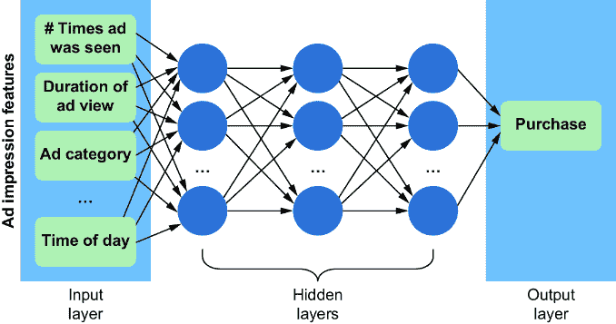
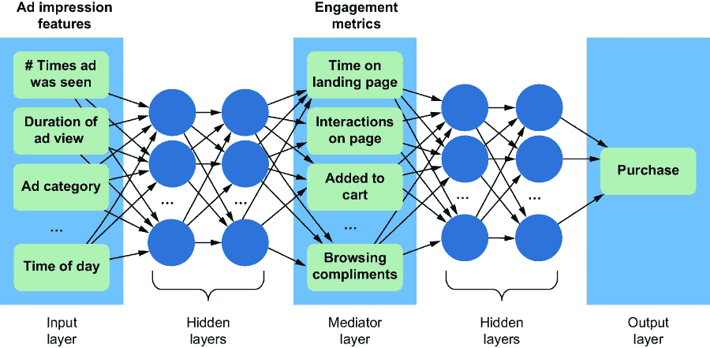
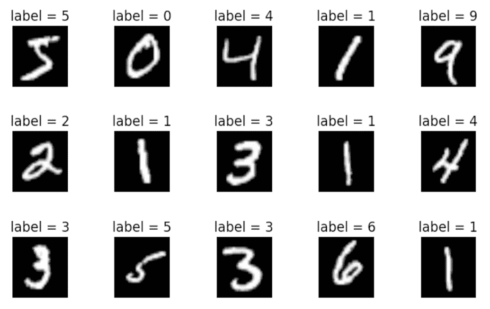
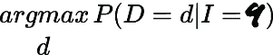
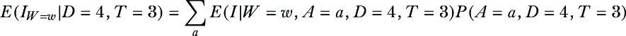
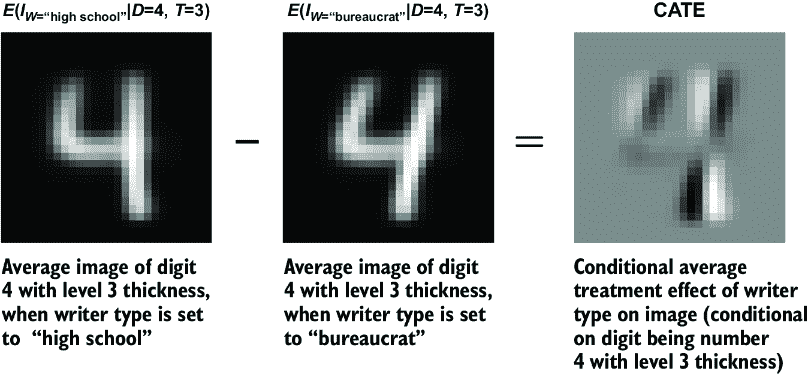

# 1 为什么因果 AI

### 本章涵盖

+   定义因果 AI 及其益处

+   将因果纳入机器学习模型

+   将因果应用到机器学习模型的一个简单例子

订阅流媒体平台如 Netflix 总是在寻找优化各种性能指标的方法。其中之一就是他们的*流失率*，即他们失去订阅者的速度。想象一下，你是一名 Netflix 的机器学习工程师或数据科学家，负责寻找减少用户流失的方法。针对这项任务，你可能会问哪些类型的*因果问题*（需要因果思考的问题）？

+   *因果发现*——给定关于谁流失和谁没有流失的详细数据，你能分析这些数据以找到导致流失的原因吗？*因果发现*研究什么原因导致什么。

+   *估计平均处理效应*（ATEs）——假设向用户推荐内容的算法是导致用户流失的原因；选择更好的算法可能会减少用户流失，但减少多少呢？量化平均而言，一个原因如何驱动一个效果的任务就是*ATE 估计*。例如，一些用户可能接触到算法的新版本，你可以测量这相对于基线算法对用户流失的影响有多大。

让我们深入一点。纪录片*办公室*（美国版）是 Netflix 上最受欢迎的节目之一。后来，Netflix 了解到 NBCUniversal 计划停止向 Netflix 许可该节目在美国流媒体播放，因此美国对*办公室*的流媒体播放将独家属于 NBCUniversal 的竞争对手流媒体平台 Peacock。鉴于该节目的受欢迎程度，流失率肯定受到影响，但影响有多大？

+   *估计条件平均处理效应*（CATEs）——失去*办公室*的影响对某些订阅者群体可能比其他群体更明显，但定义这些群体的属性是什么？一个属性当然是看过这个节目，但还有其他属性（人口统计信息、观看的其他内容等）。*CATE 估计*的任务是量化一个原因对特定人口群体中一个效果的影响程度。实际上，我们可能定义了多个群体，每个群体有不同的组内 ATE。CATE 估计任务的一部分是找到感兴趣的特定群体。

假设你拥有关于那些退出 Netflix 并注册 Peacock 以继续观看*办公室*的订阅者的可靠数据。对于这些用户中的某些人，推荐算法未能向他们展示*办公室*的可能替代品，如纪录片*公园与游憩*。这可能会引出不同类型的问题。

+   *反事实推理和归因*——如果算法在那些用户的仪表板上更突出地放置了*《公园与游憩》*，他们是否会继续使用 Netflix？这些*反事实问题*（“反”对“事实”即该节目在他们的仪表板上并不突出）对于*归因*（分配根本原因和结果的责任/责备）至关重要。

Netflix 与史蒂夫·卡瑞尔（*《办公室》*明星）和格雷格·丹尼尔斯（*《办公室》*的编剧、导演和制片人）合作，创建了 Netflix 原创内容《太空部队》。该剧在*《办公室》*移至 Peacock 几个月前发布。假设这部剧是 Netflix 试图为*《办公室》*粉丝保留订阅者的内容尝试。考虑创作此类节目会涉及到的决策：

+   *因果决策理论*——哪些演员/导演/编剧会吸引*《办公室》*粉丝继续订阅？哪些主题和内容？

+   *因果机器学习*——我们如何利用生成式 AI，例如大型语言模型，来创建节目脚本和试点，从而优化减少《办公室》粉丝流失的目标？

*因果推断*是将问题分解为这些类型的特定*因果查询*，然后使用数据来回答这些查询。*因果 AI*是关于构建自动化这种分析的算法。本书我们将探讨这两个问题领域。

## 1.1 什么是因果 AI？

要了解因果 AI 是什么，我们将从因果性和因果推断的基本概念开始，逐步深入。然后我们将回顾我们可以用因果 AI 解决的问题类型。

*因果推理*是人类理解、解释和关于世界做出决策的关键要素。每当我们在思考原因（“为什么会发生这样的事情？”）或结果（“如果我这样做会发生什么？”）时，我们都在进行因果推理。

在统计学和机器学习中，我们使用数据为我们的因果推理提供统计严谨性。但尽管因果关系驱动数据，仅凭统计相关性本身不足以从数据中得出因果结论。为此，我们必须转向*因果推断*。

统计（非因果）推断依赖于统计假设。即使在深度学习中，假设通常被称为“归纳偏差”，这也是正确的。同样，因果推断依赖于因果假设；因果推断指的是一系列理论和实用方法，这些方法通过因果假设来约束统计分析。

*因果 AI*指的是因果推断的自动化。我们可以利用机器学习算法，这些算法已经发展出自动化统计分析的稳健方法，并能够扩展到不同模态的大量数据。

人工智能的目标是自动化需要人类智能解决的问题的推理任务。人类在导航世界时严重依赖因果推理，尽管我们在因果推理上比在统计推理上更擅长，但我们的认知偏差仍然使我们的因果推理高度易出错。提高我们回答因果问题的能力是哲学家千年来的工作，科学家数百年的工作，以及统计学家数十年的工作。但现在，统计和计算进步的融合已经将重点从话语转向了我们可以基于数据进行训练并在软件中部署的算法。这是一个学习如何构建因果 AI 的迷人时期。

##### 构建因果 AI 的基础关键定义

+   *推理*—从观察和数据中得出结论

+   *假设*—指导推理的约束

+   *归纳偏差*—假设的另一种说法，通常用来指代机器学习算法选择中隐含的假设

+   *统计模型*—使用统计假设来分析数据的框架

+   *数据科学*—一个跨学科领域，使用统计模型以及其他算法和技术从结构化和非结构化数据中提取见解和知识

+   *因果推理*—使用因果假设来指导结论的技术

+   *因果模型*—基于数据生成因果假设的统计模型

+   *因果数据科学*—使用因果模型提取因果见解的数据科学

+   *因果 AI*—使用因果模型自动执行因果推理任务的算法

## 1.2 本书如何处理因果推理

本书的目标是两个强大领域的融合：因果性和 AI。通过这次旅程的结束，你将具备以下技能：

+   *设计具有因果能力的 AI 系统*—利用 AI 的力量，但增加一层因果推理。

+   *使用机器学习框架进行因果推理*—利用 PyTorch 和其他 Python 库等工具，无缝地将因果建模集成到您的项目中。

+   *构建自动化因果决策工具*—实现因果决策算法，包括因果强化学习算法。

从历史上看，因果性和 AI 来自不同的研究领域，它们被应用于不同的问题，导致了具有不同技能集的专家、使用不同语言的书籍和具有不同抽象的库。本书是为任何希望将这些领域连接成一个综合技能集的人而写的。

关于因果推理有许多书籍，包括专注于 Python 中因果推理的书籍。以下小节讨论了使本书独特的某些特点。

### 1.2.1 重视 AI

本书专注于因果人工智能。我们将不仅涵盖因果推理对人工智能的相关性，或者机器学习如何扩展因果推理，还将关注实施。具体来说，我们将把因果模型与概率机器学习中的传统模型和训练程序相结合。

### 1.2.2 专注于技术、零售和商业

实践中的因果推理方法已从计量经济学、公共卫生、社会科学和其他难以进行随机实验的领域发展而来。因此，大多数书籍中的例子往往来自这些领域。相比之下，本书大量引用了来自技术、零售和商业的例子。

### 1.2.3 平行世界反事实及其他超越因果效应的查询

当许多人想到“因果推理”时，他们会想到估计因果效应，即平均处理效应（ATEs）和条件平均处理效应（CATEs）。这些当然很重要，但也有其他类型的因果查询。本书对这些其他类型给予了适当的关注。

例如，本书深入探讨了反事实的“平行世界”解释。在这种方法中，当某些原因和某些效果发生时，我们想象一个因果事件不同的平行宇宙。例如，假设你问，“我为了钱而结婚现在很伤心。如果我为了爱情而结婚，我会更快乐吗？”在我们的平行世界方法中，你会用你为了钱而结婚并感到悲伤的经历作为输入，对你在爱情婚姻的平行宇宙中的幸福感进行基于因果模型概率模拟。这种推理在决策中很有用。例如，它可能帮助你下次选择更好的伴侣。

希望这个关于爱情和遗憾的例子说明了这种“可能发生什么”的思考对人类认知的基本性（我们将在第八章和第九章看到更多应用实例）。因此，学习如何构建具有相同能力的 AI 是有意义的。但尽管它们很有用，一些反事实推理很难或无法验证（你*不能*证明如果你为了爱情而结婚你会更快乐）。大多数因果推理书籍只关注我们可以用数据和实验验证的狭隘的反事实集合，这忽略了反事实推理的许多有趣、认知科学相关和实际的应用案例。本书深入探讨这些用例。

### 1.2.4 推理商品化的假设

许多因果推断书籍深入探讨了各种因果效应估计器的统计推断螺钉和螺栓。但过去十年中开发深度学习框架的一个主要趋势是*推断的商品化*。这指的是像 PyTorch 这样的库如何抽象掉估计和推断的困难方面——如果你能以最小化可微损失函数的术语定义你的估计/推断问题，PyTorch 将处理其余部分。推断的商品化使用户能够专注于创建更加精细和强大的模型，例如表示数据生成过程因果结构的模型。

在这本书中，我们将专注于利用推理框架，以便你可以学习建模技术的通用观点。一旦你为你的领域找到正确的建模方法，你就可以使用其他资源深入研究任何感兴趣的统计算法。

### 1.2.5 用代码分解理论

本书的一个突出特点是它对因果推断理论中高级主题的处理方法。许多入门文本回避像识别、do-演算和因果层次定理这样的主题，因为它们很难。问题是，如果你想创建具有因果能力的 AI 算法，你需要对这些概念有直觉。

在这本书中，我们将通过依赖实现其基本抽象和算法的 Python 库，使这些主题易于理解。我们将通过在代码中操作这些原语来培养对这些高级主题的直觉。

## 1.3 因果性在现代人工智能工作流程中的作用

在构建具有因果能力的 AI 的未来版本中定位自己具有很大的价值，但本书涵盖的主题也将对当今常见的应用产生影响。在本节中，我们将回顾因果性如何增强这些应用中的某些方面。

### 1.3.1 更好的数据科学

大型科技公司和科技驱动的零售组织已经认识到因果推断的重要性，为精通此领域的人提供高薪。这是因为数据科学的本质——从数据中提取可操作的见解——本质上具有因果性。

当数据科学家检查电子商务网站上某个特征与销售额之间的相关性时，他们这样做是因为他们想知道该特征是否因果地推动了销售额。因果推断可以通过几种方式帮助回答这个问题。首先，它可以帮助他们设计一个实验来量化特征对销售额的因果效应，尤其是在无法进行完美随机实验的情况下。其次，如果提议的实验不可行，数据科学家可以使用过去的观察数据和来自相关但不同过去实验的数据来推断提议实验将产生的因果效应的价值，而无需实际运行该实验。最后，即使数据科学家在运行实验方面有完全的自由，因果推断也可以帮助选择要运行的实验和要测量的变量，从而最小化运行浪费或不具信息量的实验的机会成本。

### 1.3.2 更好的归因、信用分配和根本原因分析

因果推断也支持归因。营销中的“归因问题”可能最好由一句归因于广告先驱约翰·万纳梅克的引言来阐述：

> 我花在广告上的钱有一半是浪费的；麻烦的是我不知道是哪一半。

换句话说，很难知道是什么广告、促销或其他行动导致了特定的客户行为、销售额或其他关键业务结果。即使在万纳梅克时代数据比那时更丰富、更细粒度的在线营销中，归因仍然是一个挑战。例如，用户可能在看到广告后点击，但这是否是导致点击的单个广告浏览？或者他们无论如何都会点击？也许他们在多个渠道收到的所有点击推动的累积效应导致了点击。因果建模通过使用正式的因果逻辑来回答“为什么”问题，如“为什么这个用户点击？”来解决归因问题。

归因在其他领域也有其他名称，如“信用分配”和“根本原因分析”。核心意义是相同的；我们想了解为什么某个特定事件的结果发生了。我们知道一般的原因是什么，但想知道在特定情况下，某个特定原因在多大程度上应该受到责备。

### 1.3.3 更稳健、可分解和可解释的模型

对于使用机器学习来构建软件的组织，结合因果建模可以改善过程和产品。特别是，因果性通过使机器学习更加稳健、可分解和可解释来增加价值。

#### 更稳健的机器学习

当模型训练的环境和模型部署的环境之间存在差异导致模型崩溃时，机器学习模型缺乏稳健性。因果性可以通过以下方式解决稳健性的不足：

+   *过拟合*—当学习算法过分重视训练数据中的虚假统计模式时，就会发生过拟合。因果方法可以将机器学习模型导向学习根植于因果关系的统计模式。

+   *欠指定*—当模型存在许多等效配置，在测试数据上表现相同但在部署环境中表现不同时，就会发生欠指定。欠指定的一个迹象是对模型配置的任意元素敏感，例如随机种子。因果推断可以告诉你何时因果预测是“识别”的（即，“未欠指定”），这意味着在假设和数据给定的情况下存在一个独特的答案。

+   *数据漂移*—随着时间的推移，你在部署模型的环境中的数据特征与训练数据特征不同或“漂移”。因果建模通过捕捉数据背后的因果不变性来解决这个问题。例如，假设你训练了一个使用海拔来预测平均温度的模型。如果你只使用来自高海拔城市的训练数据，如果模型成功拟合了海拔和温度之间的基于物理的因果关系，那么它应该仍然在低海拔城市中表现良好。

这就是为什么领先的科技公司部署因果机器学习技术——它们可以使他们的机器学习服务更加稳健。这也是为什么著名的深度学习研究人员正在追求将深度学习与因果推理相结合的研究。

#### 更可分解的机器学习

因果模型分解为组件，具体来说是效应及其直接原因的元组，我将在第三章中正式定义。为了说明，让我们考虑一个简单的机器学习问题，即预测看到数字广告的个人是否会进行购买。

我们可以使用广告印象的各种特征（例如，广告被看到的次数、观看持续时间、广告类别、一天中的时间等）作为特征向量，并使用神经网络预测购买，如图 1.1 所示。模型隐藏层的权重相互依赖，因此模型不能简化为更小的独立组件。

##### 图 1.1 使用与广告印象相关的特征来预测购买结果的简单多层感知器神经网络

另一方面，如果我们从因果关系的角度看待这个问题，我们可能会推断出一个广告印象可以驱动参与度，而参与度又决定了个人是否会进行购买。使用参与度指标作为另一个特征向量，我们可以训练图 1.2 中所示的模式。这个模型与领域的因果关系结构相一致（即广告印象导致参与度，参与度导致购买）。因此，它分解为两个组件：{广告印象，参与度}和{参与度，购买}。

##### 图 1.2 一个捕捉广告印象如何驱动参与度，进而驱动购买的模型。该模型分解为{广告印象，参与度}和{参与度，购买}。

这种可分解性有几个好处：

+   模型的组件可以独立测试和验证。

+   模型的组件可以单独执行，从而更有效地利用现代云计算基础设施，并支持边缘计算。

+   当有额外的训练数据可用时，只有与数据相关的组件需要重新训练。

+   旧模型的组件可以用于针对新问题的新模型。

+   由于组件可以单独优化，因此对子优化的模型配置和超参数设置不太敏感。

因果模型的组件对应于你正在建模的领域的概念。这导致了下一个好处，即可解释性。

#### 更可解释的机器学习

许多机器学习算法，尤其是深度学习算法，可以相当“黑盒”，这意味着内部工作方式不易理解，模型对给定输入产生输出的过程也不易解释。

相比之下，因果模型是高度可解释的，因为它们直接在建模领域中编码易于理解的因果关系。事实上，因果关系是解释的核心；解释一个事件意味着描述事件的起因以及它们是如何导致事件发生的。因果模型以你正在建模的领域的语言（语义解释）而不是以模型的架构（如“节点”和“激活”的句法解释）来提供解释。

考虑图 1.1 和图 1.2 中的示例。在图 1.1 中，只有输入特征和输出在领域内是可解释的；隐藏层的内部工作方式是不可解释的。因此，给定一个特定的广告印象，很难解释模型是如何得出特定的购买结果的。相比之下，图 1.2 中的示例明确提供了参与度来解释我们是如何从一个广告印象到一个购买结果的。

参与度与广告印象之间，以及购买与参与度之间的联系仍然是黑箱，但如果我们需要的话，我们可以在那些黑箱中添加额外的变量。我们只需要确保这样做的方式与我们对问题因果结构的假设相一致。

### 1.3.4 更公平的 AI

假设鲍勃申请了一笔商业贷款。一个机器学习算法预测鲍勃可能是一个不良贷款候选人，因此鲍勃被拒绝了。鲍勃是一个男性，他获取了银行的贷款数据，数据显示男性获得贷款申请批准的可能性较低。这是否是一个“不公平”的结果？

例如，如果我们说结果“不公平”，是因为算法做出预测是因为鲍勃是男性。为了成为一个“公平”的预测，它需要从与鲍勃偿还贷款能力相关的因素中制定，例如他的信用记录、他的业务领域或他可提供的抵押品。鲍勃的困境是另一个例子，说明了我们为什么希望机器学习是可解释的：这样我们就可以分析鲍勃申请中哪些因素导致了算法的决定。

假设训练数据来自贷款官员的历史决策，其中一些官员持有损害男性的性别偏见。例如，他们可能阅读了显示在财务困难时期男性更有可能违约的研究。基于这些研究，他们决定如果申请人是男性，就从他们的评分中扣除分数。

此外，假设在收集数据时，银行在社交媒体上宣传了贷款计划。当我们查看活动结果时，我们注意到回应广告的男性平均资格低于点击广告的女性。这种差异可能是因为该活动更好地针对了女性，或者因为在线广告拍卖中，当广告受众由资格较低的男性组成时，平均出价价格更低。图 1.3 绘制了可能影响贷款审批流程的各种因素，并区分了公平和不公平的原因。这些因素被绘制在一个有向无环图（DAG）中，这是一种表示因果关系的流行且有效的方法。我们将在整个书中使用 DAG 作为因果推理的主要工具。

##### 图 1.3 一个因果有向无环图（DAG），展示了统计上对特定性别的偏见可能来自算法直接惩罚该性别（不公平）以及通过数字广告算法针对的申请人的性别差异间接产生（公平）。因果推断可以将偏见分解为公平和不公平的来源。

因此，数据中存在针对男性的两种可能的统计偏差来源。一种偏差来源是吸引到平均资质较低男性的在线广告，导致男性的拒绝率较高。另一种统计偏差来源是贷款官员的偏见。其中一种偏差来源可以说是“公平的”（很难责怪银行对数字广告算法的定位行为），而另一种来源是“不公平的”（我们可以责怪银行对性别歧视的贷款政策）。但当我们只看没有这种因果背景的训练数据时，我们看到的只是针对男性的统计偏差。学习算法在做出关于鲍勃的决定时复制了这种偏差。

解决这个问题的简单方法之一就是从训练数据中移除性别标签。但即使那些性别歧视的贷款官员没有看到关于个人性别的明确指示，他们也能从申请中的某些元素，如个人姓名中推断出来。这些贷款官员将他们的偏见观点编码成性别代理变量与贷款结果之间的统计相关性。机器学习算法会发现这种统计模式，并利用它来做出预测。结果，你可能会遇到算法对两个具有相同还款风险但性别不同的个体产生不同预测的情况，即使性别并不是预测的直接输入。部署这种算法实际上会放大那些贷款官员的偏见观点所造成的伤害。

由于这些原因，我们可以看到人们对广泛部署机器学习算法的许多担忧是有道理的。如果没有纠正，这些算法可能会通过放大我们社会产生的不公平结果来对我们社会产生负面影响。

因果分析在解析这类算法公平性问题方面是很有用的。在这个例子中，我们可以使用因果分析将统计偏差分解为“不公平”的性别歧视偏差和由于外部因素（如数字广告服务如何定位广告）导致的偏差。最终，我们可以使用因果建模来构建一个只考虑与个人是否能够偿还贷款有因果关系的变量的模型。

需要注意的是，仅仅因果推理不足以解决算法公平性问题。因果推理可以帮助将统计偏差分解为公平和不公平的部分。然而，即使这样，这也取决于所有相关方就概念和结果的定义达成一致，这通常是一项艰巨的任务。为了说明这一点，假设社交媒体广告活动向更多男性推送贷款广告，因为向男性推送广告的成本更低。因此，当印象来自男性时，广告活动可以通过较低的出价赢得在线广告位拍卖，结果导致更多男性看到广告，尽管其中许多男性并不适合贷款项目。这个过程是否不公平？结果是否不公平？在性别平衡结果和广告定价公平性之间，公平性的权衡是什么？是否应该让某些广告商因为旨在鼓励平衡结果的价格机制而支付更多？因果分析无法解决这些问题，但它可以帮助在技术细节上理解这些问题。

## 1.4 因果性如何推动下一波人工智能浪潮

将因果逻辑纳入机器学习正在引领人工智能的新进展。本书突出了人工智能的三个趋势领域：表示学习、强化学习和大型语言模型。这些因果人工智能的趋势让人联想到深度学习的早期阶段。当深度学习浪潮兴起时，已经与神经网络一起工作的人们在这个领域享受了新的机会，而机会的获取会带来更多机会的获取。下一波人工智能仍在形成中，但很明显，它将从根本上纳入因果性的某种表示。本书的目标是帮助您驾驭这股浪潮。

### 1.4.1 因果表示学习

许多最先进的深度学习方法试图学习被建模对象的几何表示。然而，这些方法在学习因果上有意义的表示方面存在困难。例如，考虑一个孩子用绳子拿着充满氦气的气球的视频。假设我们有一个对应图像的向量表示。如果向量表示具有因果意义，那么通过操纵向量去除孩子，并将操纵后的向量转换为新的视频，就会得到气球向上升起的描绘。因果表示学习是深度表示学习中的一个有希望的研究领域，目前仍处于早期阶段。本书在多个章节中提供了基于深度学习架构构建的因果模型示例，为因果 AI 这一令人兴奋的新增长领域的根本思想提供了介绍。

### 1.4.2 因果强化学习

在经典的强化学习中，学习代理摄入大量数据，像巴甫洛夫的狗一样学习；它们学习与良好结果正相关、与不良结果负相关的动作。然而，众所周知，相关性并不等同于因果性。因果强化学习可以突出那些导致更高奖励的动作与与高奖励最强烈相关的动作不同的案例。此外，它通过反事实推理（即提出像“如果代理使用不同的策略，他们将获得多少奖励？”这样的问题）解决了归因问题（即正确地将奖励归因于动作）。第十二章致力于因果强化学习和其他因果决策领域。

### 1.4.3 大型语言模型和基础模型

大型语言模型（LLMs）如 OpenAI 的 GPT、Google 的 Gemini 和 Meta 的 Llama，是经过大量文本和其他数据训练的具有数十亿参数的深度神经网络语言模型。这些模型可以生成高度连贯的自然语言、代码和其他模态的内容。它们是基础模型，意味着它们为构建更特定领域的机器学习模型和产品提供了基础。这些产品，如 Microsoft 365 Copilot，已经产生了巨大的商业影响。

一项新的研究领域和产品开发调查了大型语言模型（LLMs）回答因果问题和执行因果分析的能力。另一条研究路线是使用因果方法设计和训练具有优化因果能力的新 LLMs。在第十三章中，我们将探讨 LLMs 与因果关系的交汇点。

## 1.5 因果关系的机器学习入门

现在您已经看到了因果推理如何改善机器学习的多种方式，让我们看看将因果性融入 AI 模型的过程。为此，我们将使用在机器学习中经常使用的流行基准数据集：手写数字图像的 MNIST 数据集，每个图像都标有图像中实际代表的数字。图 1.4 展示了 MNIST 中数字的多个示例。

##### 图 1.4 MNIST 数据集中的每一张图像都是一个手写数字的图像，并且每张图像都标有它所代表的数字。

MNIST 基本上是机器学习的“Hello World”。它主要用于实验不同的机器学习算法，并比较它们的相对强度。基本的预测任务是接受代表每个图像的像素矩阵作为输入，并返回正确的图像标签作为输出。让我们开始将因果思维融入应用于 MNIST 图像的概率机器学习模型的过程。

### 1.5.1 查询、概率和统计学

首先，我们将查看不包括因果推断的基本过程。机器学习可以使用关于感兴趣数量的概率进行分析。为此，概率机器学习模型学习该系统中所有变量的概率表示。我们可以使用三步过程，利用概率机器学习模型进行预测和决策。

1.  *提出问题*——你想要回答什么问题？

1.  *写下数学公式*——什么概率（或与概率相关的量）将回答给定证据或数据的问题？

1.  *进行统计分析*——哪种统计分析将给你（或估计）那个量？

这些步骤（*查询*、*估计量*和*估计值*）有更正式的术语，但我们现在将避免使用行话。相反，我们将从一个简单的统计示例问题开始。你的第一步可能是“波士顿人的身高是多少？”对于第二步，你可能会决定知道波士顿所有居民的*平均身高*（在概率术语中，称为“期望值”）将回答你的问题。第三步可能涉及随机选择 100 名波士顿人并测量他们的平均身高；统计定理保证这个样本平均数是真实总体平均数的一个接近估计。

让我们将这个工作流程扩展到 MNIST 图像建模。

#### 第一步：提出问题

假设我们正在查看图 1.5 中的 MNIST 图像，它可能是“4”也可能是“9”。在第一步中，我们明确地提出一个问题，例如“给定这个图像，图像中代表的是哪个数字？”

##### 图 1.5 这是一张数字 4 或 9 的图像吗？MNIST 数据集的典型任务是给定图像对数字标签进行分类。

#### 第二步：写下数学公式

在第二步中，我们想要找到一个概率量，它能回答给定证据或数据的问题。换句话说，我们想要找到一个可以用概率数学符号写下来的东西，它能回答第一步中的问题。对于图 1.5 的例子，证据或数据是图像。图像是 4 还是 9？让变量*I*代表图像，*D*代表数字。在概率符号中，我们可以写出给定图像*I*是时，数字是 4 的概率为*P*(*D*=4|*I*=)，其中*I*=是*I*等于某个图像向量表示的简写。我们可以将这个概率与*P*(*D*=9|*I*=)进行比较，并选择具有更高概率的*D*值。将这一过程推广到所有十个数字，第二步中我们想要的数学量如图 1.6 所示。

##### 图 1.6 根据图像选择概率最高的数字。

用普通英语来说，这就是“值*d*，它最大化了给定图像时*D*等于*d*的概率，”其中*d*是十个数字（0-9）中的一个。

#### 第 3 步：进行统计分析

第 3 步使用统计分析来为我们在第 2 步中识别的数量分配一个数字。我们可以用无数种方法来做这件事。例如，我们可以训练一个深度神经网络，它以图像作为输入并预测数字作为输出；我们也可以设计神经网络为每个值*d*分配一个概率，即*D*=*d*。

### 1.5.2 因果关系与 MNIST

那么，因果关系如何在前一节的三个步骤分析中发挥作用呢？Yann LeCun 是深度学习工作的图灵奖得主（计算机科学的诺贝尔奖），同时也是 Meta 人工智能研究部门的负责人。他也是 MNIST 创建背后的三位研究人员之一。他在个人网站上讨论了 MNIST 数据的*因果关系*背景，[`yann.lecun.com/exdb/mnist/index.xhtml`](https://yann.lecun.com/exdb/mnist/index.xhtml)：

> MNIST 数据库是由 NIST 的特别数据库 3 和特别数据库 1 构建的，其中包含手写数字的二值图像。NIST 最初将 SD-3 指定为训练集，SD-1 指定为测试集。然而，SD-3 比 SD-1 更干净、更容易识别。原因在于 SD-3 是在人口普查局员工中收集的，而 SD-1 是在高中生中收集的。从学习实验中得出合理的结论需要确保结果不受整个样本集中训练集和测试集选择的影响。因此，有必要通过混合 NIST 的数据集来构建一个新的数据库。

换句话说，作者混合了这两个数据集，因为他们认为，如果他们仅用高中生绘制的数字来训练机器学习模型，那么在应用于公务员绘制的数字时表现会不佳。然而，在现实世界的设置中，我们希望模型具有鲁棒性，能够在一种场景中学习并在另一种场景中预测，即使这些场景不同。例如，我们希望垃圾邮件过滤器在垃圾邮件发送者从尼日利亚王子转变为不丹公主时仍然有效。我们希望我们的自动驾驶汽车即使在停车标志上涂鸦时也能停下来。像洗牌一样洗数据在现实世界的设置中并不是轻易就能负担得起的奢侈。

因果建模利用了关于数字绘制背后的因果机制的知识，这将帮助模型在训练数据中的高中生和公务员之外，推广到测试数据中的高中生。图 1.7 展示了表示这一系统的因果 DAG。

##### 图 1.7 表示 MNIST 图像生成过程的示例因果 DAG。节点代表数据生成过程中的对象，边对应这些对象之间的因果关系。

这个特定的有向无环图（DAG）设想作者决定了所绘数字的粗细和弯曲度，并且高中生倾向于有与公务员不同的书写风格。该图还假设作者的分类是导致他们所绘数字的原因。也许公务员写更多的 1、0 和 5，因为这些数字在人口普查工作中出现得更频繁，而高中生在数学课上做更多长除法时更常绘制其他数字（这与主题模型中“主题”*导致*文档中单词频率的类似想法）。最后，DAG 假设年龄是作者类型和图像的共同原因；你必须低于一定年龄才能上高中，高于一定年龄才能成为人口普查官员。

一种因果建模方法将使用这种因果知识来训练一个预测模型，该模型可以从高中训练数据外推到公务员测试数据。这样的模型将更好地推广到新的情况，其中作者类型和其他变量的分布与训练数据不同。

### 1.5.3 因果查询、概率和统计学

在本章的开头，我讨论了我们可以提出的各种因果问题，例如因果发现、量化因果效应和因果决策。我们可以通过我们对之前三步分析（提出问题、写下数学、进行统计分析）的因果变体来回答这些问题以及其他各种问题：

1.  *提出因果问题*——你想要回答的问题是什么？

1.  *写下因果数学*——给定证据或数据，什么概率（或期望）将回答因果问题？

1.  *进行统计分析*——哪种统计分析将给你（或“估计”）那个因果量？

注意，第三步与原始三步相同。因果的细微差别出现在第一步和第二步。

#### 第 1 步：提出因果问题

这些是我们关于我们的因果 MNIST 模型可以提出的一些因果问题的例子：

+   “作者类型（高中生与公务员）对具有 3 级厚度的数字 4 的图像外观有多大影响？”（第十一章中讨论了*条件平均处理效应估计*）。

+   假设笔画粗细是图像的一个原因，我们可能会问：“如果尽可能弯曲，2 看起来会是什么样子？”（这是第七章中讨论的*干预预测*）。

+   “给定一个图像，如果笔画弯曲度更重，它会有什么不同？”（参见第八章和第九章中讨论的*反事实推理*）。

+   “为了得到一个美学上理想的图像，笔画弯曲度应该是多少？”（第十二章中讨论了*因果决策*）。

让我们考虑第一个项目中的 CATE。CATE 估计是应用于普通表格数据的常见因果推断问题，但在 AI 计算机视觉问题的应用中却很少见到。

#### 第 2 步：写下因果数学

因果推断理论告诉我们如何用数学方法形式化我们的因果问题。使用特殊的因果符号，我们可以将我们的 CATE 查询用以下方式数学形式化：

其中 *E*(.) 是一个期望算子。我们将在下一章回顾期望，但就现在而言，我们可以将其视为对图像像素的平均值。

前面的下标使用是一种特殊的符号，称为“反事实符号”，它代表了一种**干预**。实验中的随机分配是一种现实世界的干预，但有许多实验我们无法在现实世界中运行。例如，不可能进行一项试验，随机分配参与者要么成为高中生，要么成为人口普查局官员。尽管如此，我们想知道作者类型如何因果影响图像，因此我们依赖于因果模型及其表示干预的能力。

为了说明，图 1.8 可视化了 CATE 可能的样子。挑战在于推导出图 1.8 右侧的差分图像。因果推断理论帮助我们解决量化作者类型如何驱动图像时可能存在的年龄相关的“混杂”偏差。例如，**do-calculus**（第十章）是一组基于图的规则，允许我们从这个 DAG 算法性地推导出以下方程：

该方程的左侧定义了在第二步中用于 CATE 定义的期望——它是一个理论结构，捕捉了假设条件“如果作者类型被设置为‘w’”。但右侧是可操作的；它完全由我们可以使用机器学习方法在假设的 NIST 图像数据版本上标记作者年龄的术语组成。

##### 图 1.8 展示了作者类型在图像上的一个示例 CATE 的可视化。它是单一干预（*W*=["high school"）下期望图像与另一种干预（*W*=["bureaucrat"）下期望图像的像素级差异，两种期望都是在数字 4 的特定厚度下的图像。

#### 第 3 步：进行统计推断

第 3 步进行统计估计，并且有几种方法可以估计该方程右侧的量。例如，我们可以使用卷积神经网络来建模 *E*(*I*|*W*=*w*, *A*=*a*, *D*=*d*, *T*=*t*)，并构建联合分布 *P*(*A*, *D*, *T*) 的概率模型。统计建模方法的选择涉及通常的统计权衡，例如易用性、偏差和方差、可扩展性到大量数据以及并行化。

其他书籍对第三步中首选的统计方法进行了详细阐述。我持强烈的观点，我们应该依赖统计建模和机器学习框架中的“推理商品化”趋势来处理第三步，而将重点放在提高第一步和第二步的技能上：弄清楚要问的正确问题，并以数学方式表示可能的因果关系。

如您在本节所见，我们对因果人工智能的探索是通过一个三步过程来构建的，因果思维的精髓在前两个步骤中尤为突出。第一步邀请我们构建正确的因果问题，而第二步则阐明了这些问题背后的数学原理。第三步利用了我们在传统统计预测和推理中非常熟悉的模式。

使用这种结构化方法，在接下来的章节中，我们将从纯粹的预测机器学习模型——例如您可能从 MNIST 中熟悉的深度潜在变量模型——过渡到因果机器学习模型，这些模型能为我们提供对因果问题的更深入见解和答案。首先，我们将回顾基础数学和机器学习原理。然后，在本书的第二部分，我们将深入探讨如何为第一步和第二步构建正确的问题并从数学上阐述它们。对于第三步，我们将利用 PyTorch 和其他先进库的力量，将因果概念与最前沿的统计学习算法相结合。

## 摘要

+   因果人工智能旨在通过因果逻辑增强统计学习和概率推理。

+   因果推断帮助数据科学家从观察数据（世界上绝大多数数据）和实验数据中提取更多的因果见解。

+   当数据科学家无法进行实验时，因果模型可以从观察数据中模拟实验。

+   他们可以使用这些模拟来进行因果推断，例如估计因果效应，甚至优先考虑在现实生活中运行的有趣实验。

+   因果推断通过算法反事实推理和归因帮助数据科学家改善他们组织中的决策。

+   因果推断还使机器学习更加**稳健**、**可分解**和**可解释**。

+   因果分析有助于正式分析预测算法中的**公平性**，并通过将普通统计偏差分解为其因果来源来构建更公平的算法。

+   **推理的商品化**是机器学习中的一个趋势，指的是像 PyTorch 这样的通用建模框架如何持续自动化统计学习和概率推理的细节。这一趋势减少了模型构建者对因果推理的正式和统计细节的专家知识需求，使他们能够专注于将领域专业知识转化为更好的问题域因果模型。

+   因果推理任务的类型包括*因果发现*、*干预预测*、*因果效应估计*、*反事实推理*、*解释*和*归因*。

+   我们构建和使用概率机器学习模型的方式可以扩展到在概率机器学习工具（如 PyTorch）中实现的因果生成模型。
