# 第二章：概率生成建模基础

### 本章涵盖

+   概率模型基础

+   使用 pgmpy 和 Pyro 库进行计算概率

+   因果性统计学：数据、总体和模型

+   区分概率模型和主观贝叶斯主义

第一章阐述了学习如何编码因果 AI 的必要性。本章将介绍一些我们需要用概率机器学习来处理因果模型的基础知识，这大致指的是使用概率来模拟不确定性和模拟数据的机器学习技术。构建概率机器学习模型有一套灵活的尖端工具。本章将介绍概率、统计学、建模、推理甚至哲学中的概念，这些概念是我们用概率机器学习方法实现因果推理的关键思想。

本章不会对这些概念提供数学上的全面介绍。我将专注于本书其余部分所需的内容，并省略其他内容。任何寻求因果推理专长的数据科学家都不应忽视概率、统计学、机器学习和计算机科学的实际细微差别。有关推荐资源的章节注释，请参阅[`www.altdeep.ai/p/causalaibook`](https://www.altdeep.ai/p/causalaibook)，您可以在那里获得更深入的介绍或复习材料。

在本章中，我将介绍两个用于概率机器学习的 Python 编程库：

+   *pgmpy*是一个用于构建概率图模型的库。作为一个传统的图形建模工具，它比 Pyro 缺乏灵活性和尖端性，但更容易使用和调试。它所做的是，它做得很好。

+   *Pyro*是一个通用的概率机器学习库。它非常灵活，并利用 PyTorch 的尖端基于梯度的学习技术。

Pyro 和 pgmpy 是我们将在本书中使用的通用建模库。我们将使用的其他库是专门为因果推理设计的。

## 2.1 概率基础

让我们回顾一下您需要与本书一起工作的概率理论。我们将从一些基本的数学公理及其逻辑扩展开始，而不添加任何现实世界的解释。让我们从一个简单的三面骰子的具体想法开始（这些是存在的）。

### 2.1.1 随机变量和概率

一个 *随机变量* 是一个变量，其可能的值是随机现象的数值结果。这些值可以是离散的或连续的。在本节中，我们将关注离散情况。例如，代表三次掷骰子的离散随机变量的值可以是{1, 2, 3}。或者，在 Python 这样的 0 索引编程语言中，可能最好使用{0, 1, 2}。同样，代表抛硬币的离散随机变量可以有结果{0, 1}或{True, False}。图 2.1 说明了三面骰子。


##### 图 2.1 三个面的骰子各自代表一个有三个离散结果的随机变量。

常见的表示方法是使用大写字母如 *X*、*Y* 和 *Z* 来表示随机变量。例如，假设 *X* 代表一个掷骰子的结果，结果为 {1, 2, 3}，结果代表骰子面上的数字。*X*=1 和 *X*=2 分别代表掷出 1 和 2 的事件。如果我们想用一个变量来抽象特定的结果，我们通常使用小写字母。例如，我会用 “*X*=*x*” （例如，*X*=1）来表示事件 “我掷出了一个‘*x*’！” 其中 *x* 可以是 {1, 2, 3} 中的任何值。参见图 2.2。

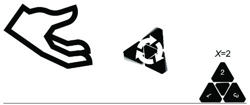

##### 图 2.2 中的 *X* 代表掷一个三面骰子的结果。如果骰子掷出 2，观察到的结果就是 *X*=2。

随机变量的每个结果都有一个 *概率值*。概率值通常被称为离散变量的 *概率质量* 和连续变量的 *概率密度*。对于离散变量，概率值介于零和一之间，将每个可能结果的概率值相加得到 1。对于连续变量，概率密度大于零，并且将概率密度在所有可能结果上积分得到 1。

给定一个结果为 {0, 1} 的随机变量，代表抛硬币，0 被分配的概率值是多少？1 呢？到目前为止，我们只知道这两个值介于零和一之间，并且它们的和为 1。要超出这个范围，我们必须讨论如何 *解释* 概率。不过，首先让我们澄清一些更多的概念。

### 2.1.2 概率分布和分布函数

*概率分布函数* 是一个将随机变量的结果映射到概率值的函数。例如，如果抛硬币的结果是 1（正面）且概率值是 0.51，分布函数将 1 映射到 0.51。我坚持使用标准的表示法 *P*(*X*=*x*)，如 *P*(*X*=1) = 0.51。对于更长的表达式，当随机变量很明显时，我省略大写字母并保留结果，所以 *P*(*X*=*x*) 变为 *P*(*x*)，而 *P*(*X*=1) 变为 *P*(1)。

如果随机变量有一个有限的离散结果集，我们可以用一个表格来表示概率分布。例如，一个代表结果 {1, 2, 3} 的随机变量可能看起来像图 2.3。

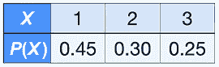

##### 图 2.3 展示了离散分布的简单表格表示。

在这本书中，我采用常见的表示法 *P*(*X*) 来表示 *X* 所有可能结果的概率分布，而 *P*(*X*=*x*) 表示特定结果的概率值。为了在 pgmpy 中将概率分布实现为一个对象，我们将使用 `DiscreteFactor` 类。

##### 列表 2.1 在 pgmpy 中实现离散分布表

```py
from pgmpy.factors.discrete import DiscreteFactor
dist = DiscreteFactor(
    variables=["X"],    #1
    cardinality=[3],    #2
    values=[.45, .30, .25],  #3
    state_names= {'X': ['1', '2', '3']}     #4
)
print(dist)
```

#1 因子中变量的名称列表

#2 因子中每个变量的基数（可能结果的数量）

#3 因子中每个变量可以取的值

#4 一个字典，其中键是变量名，值是该变量结果的名称列表

此代码打印出以下内容：

```py
+------+----------+
| X    |   phi(X) |
+======+==========+
| X(1) |   0.4500 |
+------+----------+
| X(2) |   0.3000 |
+------+----------+
| X(3) |   0.2500 |
+------+----------+
```

##### 设置环境

此代码是用 pgmpy 版本 0.1.24 和 Pyro 版本 1.8.6 编写的。使用的 pandas 版本是 1.5.3。

请参阅[`www.altdeep.ai/p/causalaibook`](https://www.altdeep.ai/p/causalaibook)获取每个章节的 Jupyter 笔记本链接，包括代码和设置工作环境的说明。

### 2.1.3 联合概率和条件概率

通常，我们感兴趣的是对多个随机变量进行推理。假设，除了图 2.1 中的随机变量*X*外，还有一个额外的随机变量*Y*，其有两个结果{0, 1}。那么存在一个*联合概率*分布函数，它将*X*和*Y*的每个组合映射到一个概率值。


##### 图 2.4 表格联合概率分布的简单表示

作为表格，它可能看起来像图 2.4。

`DiscreteFactor`对象也可以表示联合分布。

##### 列表 2.2 在 pgmpy 中建模联合分布

```py
joint = DiscreteFactor(
    variables=['X', 'Y'],   #1
    cardinality=[3, 2],     #2

values=[.25, .20, .20, .10, .15, .10],     #3
    state_names= {
        'X': ['1', '2', '3'],    #3
        'Y': ['0', '1']    #3
    }
)
print(joint)     #4
```

#1 现在我们有两个变量而不是一个。

#2 X 有 3 个结果，Y 有 2 个。

#3 现在有 2 个变量，因此我们为这两个变量的结果命名。

#4 您可以通过查看打印的输出来查看值的顺序。

上述代码打印出以下输出：

```py
+------+------+------------+
| X    | Y    |   phi(X,Y) |
+======+======+============+
| X(1) | Y(0) |     0.2500 |
+------+------+------------+
| X(1) | Y(1) |     0.2000 |
+------+------+------------+
| X(2) | Y(0) |     0.2000 |
+------+------+------------+
| X(2) | Y(1) |     0.1000 |
+------+------+------------+
| X(3) | Y(0) |     0.1500 |
+------+------+------------+
| X(3) | Y(1) |     0.1000 |
+------+------+------------+
```

注意，概率值之和为 1。此外，当我们对*Y*进行边缘化（即“求和”或“积分”）时，我们恢复原始分布*P*(*X*)，（也称为*X*的边缘分布）。图 2.5 中的行求和产生*X*的边缘分布。

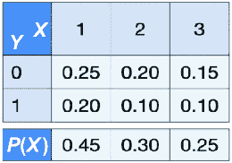

##### 图 2.5 对*Y*进行边缘化得到*X*的边缘分布。

边缘化方法将为我们对指定的变量求和。

```py
print(joint.marginalize(variables=['Y'], inplace=False))
```

这将打印出以下输出：

```py
+------+----------+
| X    |   phi(X) |
+======+==========+
| X(1) |   0.4500 |
+------+----------+
| X(2) |   0.3000 |
+------+----------+
| X(3) |   0.2500 |
+------+----------+
```

将`inplace`参数设置为`False`给我们一个新的边缘化表，而不是修改原始的联合分布表。


##### 图 2.6 对*X*进行边缘化得到*Y*的边缘分布。

类似地，当我们对*X*进行列边缘化时，我们得到*P*(*Y*)。在图 2.6 中，对列中的*X*值求和给出*Y*的边缘分布。

```py
print(joint.marginalize(variables=['X'], inplace=False))
```

这将打印出以下输出：

```py
+------+----------+
| Y    |   phi(Y) |
+======+==========+
| Y(0) |   0.6000 |
+------+----------+
| Y(1) |   0.4000 |
+------+----------+
```

我将使用符号*P*(*X*, *Y*)来表示联合分布。我将使用*P*(*X*=*x*, *Y*=*y*)来表示结果概率，并且为了简便，我将写*P*(*x*, *y*)。例如，在图 2.6 中，*P*(*X*=1, *Y*=0) = *P*(1, 0) = 0.25。我们可以在任意数量的变量上定义联合分布；如果有三个变量{*X*, *Y*, *Z*}，我将联合分布写为*P*(*X*, *Y*, *Z*)。

在这个联合概率分布的表格表示中，随着每个额外变量的增加，单元格的数量呈指数增长。有一些（但不多）是“规范”的联合概率分布（例如多元正态分布——我将在第 2.1.7 节中展示更多示例）。因此，在多元设置中，我们倾向于使用 *条件概率* 分布。

在给定 *X* 的条件下，*Y* 的条件概率是

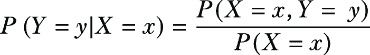

直观上，*P*(*Y*|*X*=1) 指的是在 *X* 为 1 的条件下 *Y* 的概率分布。在分布的表格表示中，我们可以通过将联合概率分布表中的单元格除以边缘概率值来推导条件分布表，如图 2.7 所示。注意，图 2.7 中条件概率表的列现在总和为 1。

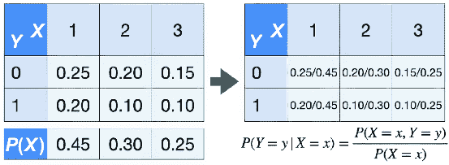

##### 图 2.7 通过将联合分布的值除以边缘分布的值来推导条件概率分布的值。

pgmpy 库允许我们使用“/”运算符进行这个除法操作：

```py
print(joint / dist)
```

那行产生了以下输出：

```py
+------+------+------------+
| X    | Y    |   phi(X,Y) |
+======+======+============+
| X(1) | Y(0) |     0.5556 |
+------+------+------------+
| X(1) | Y(1) |     0.4444 |
+------+------+------------+
| X(2) | Y(0) |     0.6667 |
+------+------+------------+
| X(2) | Y(1) |     0.3333 |
+------+------+------------+
| X(3) | Y(0) |     0.6000 |
+------+------+------------+
| X(3) | Y(1) |     0.4000 |
+------+------+------------+
```

此外，您还可以使用 `TabularCPD` 类直接指定条件概率分布表：

```py
from pgmpy.factors.discrete.CPD import TabularCPD
PYgivenX = TabularCPD(
    variable='Y',    #1
    variable_card=2,     #2
    values=[  
        [.25/.45, .20/.30, .15/.25],     #3
        [.20/.45, .10/.30, .10/.25],     #3
    ], 
    evidence=['X'],
    evidence_card=[3],
    state_names = {
        'X': ['1', '2', '3'],
        'Y': ['0', '1']
    })

**print(PYgivenX)**
```

#1 条件分布有一个变量，而不是 ΔiscreteFactor 变量列表。

#2 variable_card 是 *Y* 的基数。

#3 列表中的元素对应于 *Y* 的结果。每个列表的元素对应于 *X* 的元素。

这会产生以下输出：

```py
+------+--------------------+---------------------+------+
| X    | X(1)               | X(2)                | X(3) |
+------+--------------------+---------------------+------+
| Y(0) | 0.5555555555555556 | 0.6666666666666667  | 0.6  |
+------+--------------------+---------------------+------+
| Y(1) | 0.4444444444444445 | 0.33333333333333337 | 0.4  |
+------+--------------------+---------------------+------+
```

`variable_card` 参数是 *Y* 的基数（意味着 *Y* 可以取出的结果数量），而 `evidence_card` 是 *X* 的基数。

##### 条件化作为一个操作

在“条件概率”这个短语中，“条件”是一个形容词。将“条件”视为动词（一个动作）是有用的。您可以通过另一个随机变量 *X* 来条件化随机变量 *Y*。例如，在图 2.5 中，我可以将 *Y* 条件化为 *X*=1，本质上得到一个新的随机变量，其结果值与 *Y* 相同，但其概率分布与 *P*(*Y*|*X*=1) 相等。

对于有更多编程经验的人来说，将 *X* = 1 作为对事件 *X* == 1 的过滤来考虑；例如，“当 *X* == 1 时 *Y* 的概率分布是什么？”在这个意义上，过滤就像 SQL 查询中的 `WHERE` 子句。*P*(*Y*) 是当你的查询是 `SELECT * FROM Y` 时 *Y* 表中的行分布，而 *P*(*Y*|*X*=1) 是当你的查询是 `SELECT * FROM Y WHERE X=1` 时的行分布。

将“条件”视为一个动作有助于我们更好地理解概率机器学习库。在这些库中，你有代表随机变量的对象，条件是应用于这些对象的操作。正如你将看到的，将条件视为动作的想法也与核心因果建模概念“干预”形成鲜明对比，我们在其中“干预”一个随机变量。

Pyro 通过 `pyro.condition` 函数将条件操作化为一个操作。我们将在第三章中探讨这一点。

### 2.1.4 链式法则、全概率公式和贝叶斯法则

从概率的基本公理中，我们可以推导出概率的链式法则、全概率公式和贝叶斯法则。这些概率法则在概率建模和因果建模的背景下尤为重要，因此我们将简要介绍它们。

**概率的链式法则**表明我们可以将联合概率分解为条件概率的乘积。例如，*P*(*X*, *Y*, *Z*) 可以如下分解：

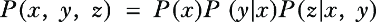

我们可以按任何我们喜欢的顺序进行分解。在上面的例子中，顺序是 *X*，然后是 *Y*，然后是 *Z*。然而，*Y*，然后 *Z*，然后 *X*，或者 *Z*，然后 *X*，然后 *Y*，以及其他顺序都是同样有效的。


**链式法则**在建模和计算方面都具有重要意义。实现一个代表 *P*(*X*, *Y*, *Z*) 的单一对象面临的挑战是，它需要将 *X*、*Y* 和 *Z* 的所有可能结果的组合映射到一个概率值。链式法则让我们可以将这个任务分解为对 *P*(*X*, *Y*, *Z*) 分解中每个因素的三个单独任务。

**全概率公式**允许你将边缘概率分布（单个变量的分布）与联合分布联系起来。例如，如果我们想从 *X* 和 *Y* 的分布，即 *P*(*X*, *Y*)，推导出 *X* 的边缘分布，即 *P*(*X*)，我们可以对 *Y* 进行求和。

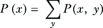

在图 2.5 中，我们通过对行中的 *Y* 进行求和来得到 *P*(*X*)。在 *X* 是连续随机变量的情况下，我们通过对 *Y* 进行积分而不是求和。

最后，我们有**贝叶斯法则**：

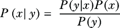

我们通过将条件概率的原始定义应用于分子来推导这一点：

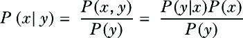

贝叶斯法则本身并不特别有趣——它是一个推导。更有趣的想法是**贝叶斯主义**，这是一种哲学，它使用贝叶斯法则来帮助模型者对其建模问题中的主观不确定性进行推理。我将在第 2.4 节中涉及这一点。

### 2.1.5 马氏假设和马氏核

当你有因子链时，建模的一个常见方法是使用 *马尔可夫假设*。这种建模方法对变量进行排序，并做出简化假设，即排序中的每个元素只依赖于它直接前面的元素。例如，再次考虑以下 *P*(*x*, *y*, *z*) 的分解：


如果我们应用马尔可夫假设，这将简化为：

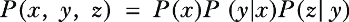

这将使我们能够用 *P*(*z*|*x*, *y*) 替换 *P*(*z*|*y*)，这更容易建模。在这本书中，当我们有一个使用马尔可夫假设简化过的因子时，比如 *P*(*z*|*y*)，我们将它称为 *马尔可夫核*。

马尔可夫假设是统计学和机器学习中常见的简化假设；在考虑 *Y* 后，*Z* 可能 *实际上* 仍然依赖于 *X*，但我们 *假设* 这种依赖性很弱，我们可以在模型中安全地忽略它。我们将看到，马尔可夫假设是图形因果的关键，在那里我们将假设效应在给定其直接原因的情况下独立于其间接原因。

### 2.1.6 参数

假设我想在代码中实现一个概率分布的抽象表示，就像图 2.1 中的表格分布，我可以用于不同的有限离散结果。首先，如果我要模拟另一个三面骰子，它可能具有不同的概率值。我想要保持的是如图 2.8 所示的基本结构。

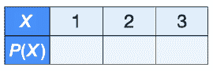

##### 图 2.8 表格概率分布数据结构的框架

在代码中，我可以将其表示为一个具有两个参数的构造函数的对象类型，即 *ρ*[1] 和 *ρ*[2]，如图 2.9 所示（“*ρ*”是希腊字母“rho”）。


##### 图 2.9 向数据结构添加参数

第三个概率值是其他两个值的函数（而不是第三个参数，*ρ*[3]），是因为概率值必须加起来等于 1。值集 {*ρ*[1], *ρ*[2]} 是分布的参数。在编程术语中，我可以创建一个表示有三个值的表的类型。然后，当我想要一个新的分布时，我可以使用这两个参数作为参数构造这个类型的新实例。

最后，在我的三面骰子示例中，有三种结果，{1, 2, 3}。也许我想要我的数据结构处理不同的预指定数量的结果。在这种情况下，我需要一个表示结果数量的参数。让我们用希腊字母 kappa，*Κ*来表示它。我的参数化是 {*Κ*, *ρ*[1], *ρ*[2], … *ρ**[Κ]*[–1]}，其中 *ρ**[Κ]*是其他 *ρ* 参数总和的 1 减去。

在 pgmpy 类的 `DiscreteFactor` 和 `TabularCPD` 中，*ρ**’*s（rho）是传递给 `values` 参数的值的列表，而 *Κ* 对应于传递给 `cardinality`、`variable_card` 和 `evidence_card` 参数的值。一旦我们有了像 `TabularCPD` 这样的概率分布表示，我们就可以使用一组参数指定该分布的一个实例。

##### 希腊字母与罗马字母

在这本书中，我使用罗马字母（*A*、*B* 和 *C*）来指代建模领域中代表对象的随机变量，例如“掷骰子”或“国内生产总值”，我使用希腊字母来表示所谓的 *参数*。在这个上下文中，*参数*是描述罗马字母变量概率分布的值。希腊字母和罗马字母之间的这种区别在统计学中并不那么重要；例如，贝叶斯统计学家将罗马和希腊字母都视为随机变量。然而，在因果建模中，这种区别很重要，因为罗马字母可以是原因和结果，而希腊字母用于表征原因和结果之间的统计关系。

### 2.1.7 概率分布的典型类别

存在几个常见的分布函数类别。例如，我们刚刚研究的表格示例是来自 *分类分布* 类别的例子。分类分布是在我们可以视为类别的离散结果上的分布，例如 {“冰淇淋”，“冷冻酸奶”，“雪芭”}。伯努利分布类是分类类的一个特殊情况，其中只有两种可能的结果。离散均匀分布是所有结果都有相同概率的分类分布。在实现中，分类分布可以直接定义在类别上（如“尾巴”和“头部”），或者定义在类别的索引上（如 0 和 1）。

##### 离散与连续随机变量

对于离散随机变量，我们一直使用带有符号 *P*(*X*=*x*) 的概率分布函数。概率分布函数返回变量取特定值的概率。对于连续随机变量，我们也有 *概率密度函数*，它描述了在连续范围内观察任何结果的相对可能性，并且通过区间积分给出概率。

当我们遇到离散或连续参数化有特定情况时，我们会将其指出并使用 *p*(*X*=*x*) 来表示概率密度函数。然而，在这本书中，我们将专注于独立于我们是在离散还是连续环境中来构建我们的因果问题。我们将主要使用概率分布函数的符号 *P*(*X*=*x*)，但请记住，因果思想在连续情况下同样适用。

对于连续的、有界的或无界的变量集合，还有其他适合的典型分布类别。例如，正态（高斯）分布类别展示了著名的“钟形曲线”。我在计算机科学的意义上使用术语“类别”（或者，可能更理想的是，“类型”），因为分布只有在我们分配了希腊字母参数后才会实现。对于一个正态（高斯）分布类别，概率密度函数是

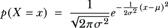

在这里，*μ*和*σ*是参数。

图 2.10 是一个流行的图表，展示了几个常用的典型分布。分布之间的箭头突出了它们之间的关系（例如，伯努利分布是二项分布的特殊情况），我们在这里不会深入探讨。

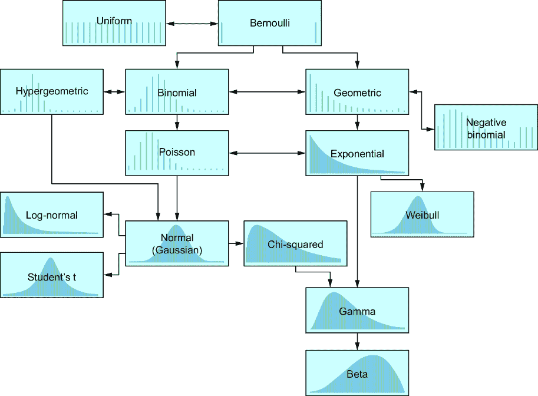

##### 图 2.10 一个流行的典型概率分布集合。边捕捉了分布之间的数学关系（我们不会在这里探讨）。浅色分布是离散的，深色分布是连续的。箭头表示存在一个转换，可以将一个分布转换为另一个分布。

#### 参数类型

在概率建模环境中，对如何解释典型参数有一个直观的理解是有用的。为此，将分布中的概率视为必须分配给所有可能结果的稀缺资源。某些结果可能比其他结果得到更多，但最终，所有结果的总和或积分必须等于 1。参数描述了有限概率如何分配给结果。

作为类比，我们将使用一个固定人口的城市。城市的参数决定了人口所在的位置。位置参数，如正态分布的“*μ*”（μ是正态分布的均值，但并非所有位置参数都是均值），就像你在谷歌地图上搜索城市名称时掉下的针。这个针表征了一个精确的点，我们可以称之为“城市中心”。在一些城市，大多数人住在城市中心附近，离中心越远人口越少。但在其他城市，城市的其他非中心区域人口密集。*尺度参数*，如正态分布的“*σ*”（σ是正态分布的标准差，但并非所有尺度参数都是标准差参数），决定了人口分布的广度；洛杉矶具有高尺度参数。*形状参数*（及其倒数，*速率参数*）以不简单是平移（如位置参数所做的那样）或拉伸或缩小（如尺度参数所做的那样）分布的方式影响分布的形状。例如，考虑香港的偏斜形状，其市中心区域密集地聚集着摩天大楼，而更住宅化的九龙则拥有更矮的建筑，分布在更广阔的空间中。

Pyro 库提供了标准分布作为建模原语。Pyro 与离散分类分布表相对应的是`Categorical`对象。

##### 列表 2.3 Pyro 中的标准参数

```py
import torch
from pyro.distributions import Bernoulli, Categorical, Gamma, Normal    #1

print(Categorical(probs=torch.tensor([.45, .30, .25])))    #2
print(Normal(loc=0.0, scale=1.0))
print(Bernoulli(probs=0.4))
print(Gamma(concentration=1.0, rate=2.0))
```

#1 Pyro 包括常用的标准分布。

#2 分类分布接受一个概率值列表，每个值对应一个结果。

这将打印出以下分布对象的表示：

```py
Categorical(probs: torch.Size([3]))
Normal(loc: 0.0, scale: 1.0)
Bernoulli(probs: 0.4000)
Gamma(concentration: 1.0, rate: 2.0)
```

与提供概率值不同，`log_prob`方法将提供概率值的自然对数，因为对数概率在计算上比常规概率有优势。对数（取*e*^(*l*，其中*l*是对数概率））转换回概率尺度。例如，我们可以创建一个参数值为 0.4 的伯努利分布对象。

```py
bern = Bernoulli(0.4)
```

该分布将 0.4 的概率分配给值 1.0。由于数值原因，我们通常使用概率值的自然对数进行工作。

我们可以使用数学库中的`exp`函数将对数概率转换回概率尺度：

```py
lprob = bern.log_prob(torch.tensor(1.0))

import math
print(math.exp(lprob))
```

对数概率进行指数运算返回以下概率值：

```py
0.3999999887335489
```

由于计算机计算中浮点精度相关的舍入误差，它接近但不等于 0.4。

#### 使用标准分布的条件概率

很少有标准的分布被广泛用于描述单个随机变量的集合，例如随机向量或矩阵。然而，我们可以使用链式法则将联合概率分布分解为条件分布，这些条件分布可以用标准分布来表示。例如，我们可以用以下正态分布来表示*Y*在*X*和*Z*条件下的情况，


其中位置参数*μ*(*x*,*z*)是*x*和*z*的函数。以下是一个线性函数的例子：

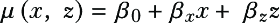

其他函数，如神经网络，也是可能的。这些*β*参数在机器学习中通常被称为*权重参数*。

### 2.1.8 可视化分布

在概率建模和贝叶斯推理设置中，我们通常用视觉来概念化分布。在离散情况下，一个常见的可视化是条形图。例如，我们可以将图 2.3 中的概率可视化成图 2.11 中的条形图。请注意，这并不是直方图；我将在第 2.3 节中强调这种区别。


##### 图 2.11 离散概率分布的可视化。分布的输出在水平轴上，概率在垂直轴上。

当分布的结果集不是有限集时，我们仍然使用可视化。例如，图 2.12 叠加了两个分布函数：一个离散的泊松分布和一个连续的正态（高斯）分布（我这样指定两个分布，使它们重叠）。离散泊松分布没有结果的上限（其下限是 0），但随着数字的增加，概率逐渐减少，导致柱状图越来越小，直到柱状图变得极其微小而无法绘制。我们通过在图中绘制概率分布函数作为曲线来可视化正态分布。正态分布没有上下限，但离中心越远，概率值越小。


##### 图 2.12 一个连续的正态分布（实线）近似了一个离散的泊松分布（灰色柱状图）。同样，结果值在水平轴上，概率值在垂直轴上。

可视化条件概率分布涉及将每个条件变量映射到图像中的某个元素。例如，在图 2.13 中，*X* 是离散的，而 *Y* 在 *X* 条件下的分布是一个正态分布，其中位置参数是 *X* 的函数。


##### 图 2.13 给定离散的 *X*，连续的 *Y* 条件概率分布的可视化。对于不同的 *X* 值，我们得到不同的 *Y* 分布。

由于 *X* 是离散的，将 *X* 映射到颜色并叠加 *P*(*Y*|*X*=1)、*P*(*Y*|*X*=2) 和 *P*(*Y*|*X*=3) 的曲线是最简单的。然而，如果我们想可视化 *P*(*Y*|*X*, *Z*)，我们需要将 *Z* 映射到除颜色之外的美学元素，例如伪 3D 图像中的第三个轴或图像网格中的行。但是，我们只能向 2D 可视化添加有限的信息。幸运的是，条件独立性帮助我们减少了条件变量的数量。

### 2.1.9 独立性与条件独立性

两个随机变量如果，非正式地说，观察一个随机变量的结果不影响另一个变量的结果概率，即 *P*(*y*|*x*)* = **P*(*y*), 则它们是 *独立* 的。我们用 *X* ⊥ *Y* 表示这一点。如果两个变量不是独立的，它们是 *相关* 的。

在给定其他变量的情况下，两个相关变量可以成为 *条件独立* 的。例如，*X* ⊥ *Y* | *Z* 意味着 *X* 和 *Y* 可能是相关的，但给定 *Z* 时它们是条件独立的。换句话说，如果 *X* 和 *Y* 是相关的，并且 *X* ⊥ *Y* | *Z*，那么 *P*(*y*|*x*) ≠ *P*(*y*) 并不成立，但 *P*(*y*|*x*, *z*) = *P*(*y*|*z*) 是成立的。

#### 独立性是一个强大的简化工具

独立性是简化概率分布表示的强大工具。考虑一个联合概率分布 *P*(*W*, *X*, *Y*, *Z*) 以表格形式表示。表格中的单元格数量将是 *W*、*X*、*Y* 和 *Z* 每个可能的输出的数量的乘积。我们可以使用链式法则将问题分解为因子 {*P*(*W*), *P*(*X*|*W*), *P*(*Y*|*X*, *W*), *P*(*Z*|*Y*, *X*, *W*)}，但这些因子跨度的总参数数量不会改变，因此总复杂性保持不变。

然而，如果 *X* 与 *W* 正交？那么 *P*(*X*|*W*) 就简化为 *P*(*X*)。如果 *Z* 与 *Y*|*X* 正交？那么 *P*(*Z*|*Y*, *X*, *W*) 就简化为 *P*(*Z*|*X*, *W*)。每次我们都可以将成对的条件独立性条件作为联合概率分布的约束来施加，这样就可以大幅度降低分布的复杂性。实际上，在统计建模中的模型构建和评估、机器学习中的正则化以及“dropout”等深度学习技术，要么是直接要么是隐含地试图在数据的联合概率分布上施加条件独立性。

#### 条件独立性和因果性

条件独立性是因果建模的基础。因果关系导致相关变量之间的条件独立性。例如，一个孩子的父母和祖父母的血型都是该孩子血型的原因；这些血型都是相关的。但你只需要父母的血型，即直接原因，就可以完全确定孩子的血型，如图 2.14 所示。在概率术语中，孩子的和祖父母的血型在给定父母的情况下条件独立。

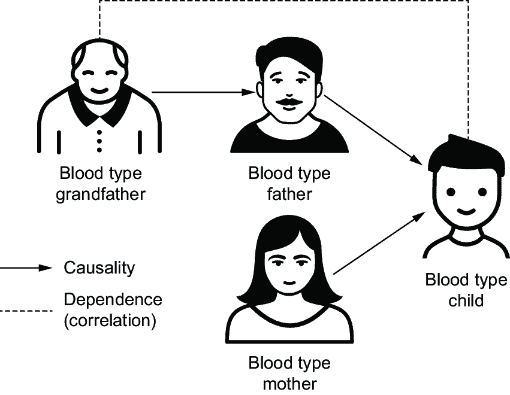

##### 图 2.14 因果性如何导致条件独立性。父母的血型导致孩子的血型。祖父的血型与孩子的血型相关（虚线）。但父母的血型是直接原因，完全决定了孩子的血型，如图 2.14 所示。这些直接原因使得孩子和祖父的血型在给定父母的情况下条件独立。

因果性导致条件独立性的事实使我们能够根据条件独立性的证据来学习和验证因果模型。在第四章中，我们将以正式术语探讨条件独立性和因果性之间的关系。

### 2.1.10 期望值

随机变量函数的 *期望值* 是函数可能输出值的加权平均值，其中权重是该结果的概率。

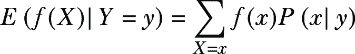

在可能结果为连续的情况下，期望值由积分定义。

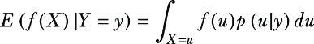

我们将要计算的一些因果量将用期望来定义。这些量只关于期望进行推理，而不是关于期望是如何计算的。与连续情况下的积分微积分相比，使用离散期望的基本算术更容易获得对问题的直观理解。因此，在这本书中，当有选择时，我使用离散随机变量和离散期望的例子。这些例子中的因果逻辑都推广到连续情况。

期望有许多有趣的数学性质。在这本书中，我们关注的是在条件独立下条件期望的简化：如果 *X* ⊥ *Y*，那么 *E*(*X*|*Y*) = *E*(*X*)。如果 *X* ⊥ *Y*|*Z*，那么 *E*(*X*|*Y*,*Z*) = *E*(*X*|*Z*)。用更简单的话说，如果两个变量 (*X* 和 *Y*) 是独立的，我们对其中一个变量的期望不会随着另一个变量的信息而改变。如果它们的独立性在第三个变量 (*Z*) 的条件下成立，那么在知道第三个变量的情况下，我们对其中一个变量的期望不会受到另一个变量信息的影响。

除了这个之外，最重要的性质是期望的线性，意味着期望通过线性函数。以下是期望线性的一些有用的参考例子：

+   对于随机变量 *X* 和 *Y*：*E*(*X* + *Y*) = *E*(*X*) + *E*(*Y*) 和

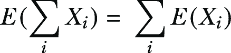

+   对于常数 *a* 和 *b*：*E*(*aX* + *b*) = *aE*(*X*) + *b*

+   如果随机变量 *X* 只有 0 和 1 两种结果，并且 *E*(*Y*|*X*) = *aX* + *b*，那么 *E*(*Y*|*X*=1) – *E*(*Y*|*X*=0) = *a*。 (这是因为 *a**1 + *b* – (*a**0 + *b*) = *a*。剧透一下：这一点对于基于线性回归的因果效应推断技术非常重要。)

随机变量分布的均值是变量的期望值本身，如在 *E*(*X*) 中（即函数是恒等函数，*f*(*X*) = *X*）。在几个典型分布中，均值是参数的简单函数。在某些情况下，例如在正态分布中，位置参数等同于期望。但位置参数和期望并不总是相同的。例如，柯西分布有一个位置参数，但它的均值是未定义的。

在下一节中，你将学习如何使用计算方法来表示分布和计算期望。

## 2.2 计算概率

我们需要*编码*概率分布和期望值，从概率到我们的模型中使用。在上一节中，你看到了如何为三面骰子编码概率分布。但我们是怎样编码*掷*三面骰子的？我们如何编写代码来表示两个条件独立的骰子掷出的结果？在此同时，我们如何让计算机做计算期望值的数学运算？我们如何让一个所有事情都是确定性的计算机掷骰子，使得结果在掷之前是未知的？

### 2.2.1 概率的物理解释

假设我有一个三面骰子。我为骰子上的每个结果分配了一些概率值。这些概率值意味着什么？我如何解释它们？

假设我反复掷骰子，并记录每次看到每个结果出现的次数。首先，掷骰子是随机的，这意味着尽管我每次都以相同的方式掷骰子，但结果却各不相同。骰子的物理形状会影响这些计数；如果骰子的一个面比其他两个面大，那么这种大小差异会影响计数。当我重复掷骰子多次后，我看到某个特定结果的比例会收敛到一个数字。假设我用这个数字作为我的概率值。进一步，假设我将这个数字解释为每次掷骰子看到该结果的机会。

这个想法被称为*物理*（或*频率主义*）*概率*。物理概率意味着想象一个可重复的物理随机过程，该过程在可能的结果集中产生一个结果。我们使用在无限次重复随机过程时出现该结果的比例来分配概率值。然后我们将那个概率解释为该物理过程产生该结果的趋势。

### 2.2.2 随机生成

根据前面的物理概率定义，我们可以定义随机生成。在*随机生成*中，算法从给定的分布中随机选择一个结果。算法的选择受到物理概率的启发；它选择结果的方式是，如果我们无限次地运行该算法，它选择该结果的比例将等于该分布对该结果的概率值。

计算机是确定性的机器。如果我们对相同的输入反复运行计算机程序，它总是会返回相同的输出；它不能产生真正的随机（除非它有随机输入）。计算机必须使用确定性算法来模拟随机生成。这些算法被称为伪随机数生成器——它们从一个起始数字开始，称为*随机种子*，并返回一系列确定性的数字。这些算法在数学上保证一系列数字在统计上与理想随机生成的概念不可区分。

在符号表示中，我这样写随机生成：


这读作“x 是从 *X* 的概率分布中生成的。”

在随机生成中，“生成”的同义词包括“模拟”和“采样”。例如，在 pgmpy 中，`DiscreteFactor` 的 `sample` 方法执行随机生成。它返回一个 pandas DataFrame。请注意，由于这是随机生成，当你运行此代码时，你可能会得到不同的输出：

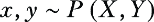

##### 列表 2.4 在 pgmpy 中从 `DiscreteFactor` 模拟随机变量

```py
from pgmpy.factors.discrete import DiscreteFactor
dist = DiscreteFactor(
    variables=["X"],
    cardinality=[3],
    values=[.45, .30, .25],
    state_names= {'X': ['1', '2', '3']}
)

dist.sample(n=1)    #1
```

#1 n 是你希望生成的实例数量。

这生成了图 2.15 所示的表格。

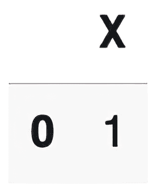

##### 图 2.15 从 *P*(*X*) 生成一个实例创建了一个包含一行数据的 pandas `DataFrame` 对象。

我们也可以从联合概率分布中生成。

```py
joint = DiscreteFactor(
    variables=['X', 'Y'],
    cardinality=[3, 2],
    values=[.25, .20, .20, .10, .15, .10],
    state_names= {
        'X': ['1', '2', '3'],
        'Y': ['0', '1']
    }
)

joint.sample(n=1)
```

这生成了图 2.16 所示的表格。


##### 图 2.16 从 *P*(*X**, * *Y*) 生成一个实例创建了一个包含一行数据的 pandas `DataFrame` 对象。

Pyro 还有一个用于规范分布的 `sample` 方法：

```py
import torch
from pyro.distributions import Categorical
Categorical(probs=torch.tensor([.45, .30, .25])).sample()
```

这生成了一个从该分类分布的样本，即 0、1 或 2。

```py
tensor(1.)
```

### 2.2.3 编码随机过程

当我们想要以特定方式生成值时，可以将自己的随机过程编写为代码。将随机过程编写为代码有时被称为 *随机函数*、*概率子程序* 或 *概率程序*。例如，考虑联合概率分布 *P*(*X*, *Y*, *Z*)。我们如何从这个联合分布中随机生成？遗憾的是，软件库通常不提供对任意联合分布的伪随机生成。

我们可以通过应用链式法则和，如果存在的话，条件独立性来解决这个问题。例如，我们可以如下分解：


假设 *Y* 在给定 *X* 的条件下与 *Z* 条件独立，那么：

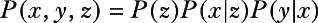

最后，假设我们可以从 *P*(*Z*)、*P*(*X*|*Z*) 和 *P*(*Y*|*X*) 中采样，给定我们软件库中的基本随机生成函数。然后我们可以使用这种分解来组合一个采样算法：


这是一个我们可以在代码中执行的随机过程。首先，我们从 *P*(*Z*) 中生成一个 *Z*-结果 *z*。然后我们根据那个 *z* 条件化 *X*，并生成一个 *X*-结果 *x*。我们以相同的方式生成一个 *Y*-结果 *y*。最后，这个程序从联合分布 *P*(*X*, *Y*, *Z*) 中生成一个元组 {*x*, *y*, *z*}。

在 pgmpy 中，我们可以使用名为 `BayesianNetwork` 的类创建随机过程。

##### 列表 2.5 在 pgmpy 和 Pyro 中创建随机过程

```py
from pgmpy.factors.discrete.CPD import TabularCPD
from pgmpy.models import BayesianNetwork
from pgmpy.sampling import BayesianModelSampling

PZ = TabularCPD(     #1
    variable='Z',     #1
    variable_card=2,     #1
    values=[[.65], [.35]],     #1
    state_names = {     #1
        'Z': ['0', '1']     #1
    })     #1

PXgivenZ = TabularCPD(     #2
    variable='X',    #2
    variable_card=2,   #2
    values=[   #2
        [.8, .6],   #2
        [.2, .4],   #2
    ],    #2
    evidence=['Z'],    #2
    evidence_card=[2],  #2
    state_names = {    #2
        'X': ['0', '1'],    #2
        'Z': ['0', '1'] #2
    })   #2

PYgivenX = TabularCPD(     #3
    variable='Y',     #3
    variable_card=3,     #3
    values=[    #3
        [.1, .8],     #3
        [.2, .1],     #3
        [.7, .1],    #3
    ],    #3
    evidence=['X'],     #3
    evidence_card=[2],    #3
    state_names = {    #3
        'Y': ['1', '2', '3'],    #3
        'X': ['0', '1']    #3
    })    #3

model = BayesianNetwork([('Z', 'X'), ('X', 'Y')])   #4
model.add_cpds(PZ, PXgivenZ, PYgivenX)     #5

generator = BayesianModelSampling(model)    #6
generator.forward_sample(size=1)    #7
```

#1 P(Z)

#2 P(X|Z=z)

#3 P(X|Z=z)

#4 P(Y|X=x)

#5 创建一个贝叶斯网络对象。参数是有向图的边，我们将在第三章中介绍。

#6 将条件概率分布添加到模型中。

#7 从贝叶斯网络对象创建一个贝叶斯模型采样对象。

#8 从结果对象中采样

这将在 pandas DataFrame 中产生一行，如图 2.17 所示。


##### 图 2.17 `forward_sample` 方法模拟了 *X*、*Y* 和 *Z* 作为一个 pandas DataFrame 中的行。

实现随机生成过程的随机过程非常强大，因为它允许从我们无法用清晰数学术语或单个典型分布表示的联合分布中生成。例如，虽然 pgmpy 与分类分布配合得很好，但 Pyro 给我们提供了使用典型分布组合的灵活性。

以下列表显示了先前随机过程的 Pyro 版本。它具有 *Z*、*X* 和 *Y* 之间的相同依赖关系，但具有不同的典型分布。

##### 列表 2.6 在 Pyro 中使用典型分布的组合

```py
import torch
from pyro.distributions import Bernoulli, Poisson, Gamma

z = Gamma(7.5, 1.0).sample()    #1
x = Poisson(z).sample()    #2
y = Bernoulli(x / (5+x)).sample()   #3
print(z, x, y)
```

#1 使用伽马分布表示 P(Z)，并采样 z。

#2 使用泊松分布表示 P(X|Z=z)，位置参数为 z，并采样 x。

#3 使用伯努利分布表示 P(Y|X=x)。概率参数是 x 的函数。

这将打印出一个示例集，例如以下内容：

```py
tensor(7.1545) tensor(5.) tensor(1.)
```

*Z* 来自伽马分布，*X* 来自均值为 *z* 的泊松分布，而 *Y* 来自参数设置为 *x* 函数的伯努利分布。

使用编程语言实现随机函数让我们可以使用细微的条件控制流。考虑以下伪代码：

```py
z ~ P(Z)
x ~ P(X|Z=z)
y = 0
for i in range(0, x){     #1
    y_i ~ P(Y|X=x)    #1
    y += y_i     #2
}
```

#1 我们可以使用控制流，如这个 for 循环，来生成值。

#2 y 是 for 循环中生成的值的总和。y 仍然依赖于 x，但通过细微的控制流。

在这里，*y* 仍然依赖于 *x*。然而，它被定义为 *x* 个单个随机成分的总和。在 Pyro 中，我们可能这样实现它。

##### 列表 2.7 Pyro 中具有细微控制流的随机过程

```py
import torch
from pyro.distributions import Bernoulli, Poisson, Gamma
z = Gamma(7.5, 1.0).sample()
x = Poisson(z).sample()
y = torch.tensor(0.0)    #1
for i in range(int(x)):     #1
    y += Bernoulli(.5).sample()     #1
print(z, x, y)
```

#1 y 被定义为随机抛硬币的总和，因此 y 是从 P(Y|X=x) 生成的，因为抛掷次数取决于 x。

在 Pyro 中，最佳实践是将随机过程实现为函数。此外，使用 `pyro.sample` 函数生成，而不是使用分布对象的 `sample` 方法。我们可以将前面的 `random_process` 代码（列表 2.7）重写如下。

##### 列表 2.8 使用函数进行随机过程和 `pyro.sample`

```py
import torch
import pyro
def random_process():
    z = pyro.sample("z", Gamma(7.5, 1.0))
    x = pyro.sample("x", Poisson(z))
    y = torch.tensor(0.0)
    for i in range(int(x)):
        y += pyro.sample(f"y{i}", Bernoulli(.5))    #1
    return y
```

#1 f"y{i}" 创建了 "y1"、"y2" 等名称。

`pyro.sample` 的第一个参数是一个字符串，用于为你要采样的变量分配一个名称。当我们开始在第三章中运行 Pyro 的推理算法时，原因将变得明显。

### 2.2.4 蒙特卡洛模拟和期望

*蒙特卡洛算法* 使用随机生成来估计从感兴趣的概率分布中的期望值。这个想法很简单。你有一些从 *P*(*X*) 中生成的方法。如果你想 *E*(*X*)，生成多个 *x*，然后取这些 *x* 的平均值。如果你想 *E*(*f*(*X*))，生成多个 *x*，并将函数 *f*(.) 应用到每个 *x* 上，然后取平均值。蒙特卡洛算法甚至在 *X* 是连续的情况下也能工作。

在 pgmpy 中，你使用 `sample` 或 `forward_sample` 方法来生成一个 pandas DataFrame。然后你可以计算 pandas 的 `mean` 方法。

```py
generated_samples = generator.forward_sample(size=100)
generated_samples['Y'].apply(int).mean()
```

在 Pyro 中，我们反复调用 `random_process` 函数。我们可以使用一个生成 100 个样本的 `for` 循环来对前面的 Pyro 生成器做这件事：

```py
generated_samples = torch.stack([random_process() for _ in range(100)])
```

此代码在 Python 列表推导式中反复调用 `random_process`。回想一下，Pyro 扩展了 PyTorch，它返回的 y 值是一个张量。我使用 `torch.stack` 将这些张量列表转换成一个单独的张量。最后，我在这个张量上调用 `mean` 方法来获得 *E*(*Y*) 的蒙特卡洛估计。

```py
generated_samples.mean()
```

当我运行这段代码时，我得到了大约 3.78 的值，但你可能会得到一个略有不同的值。

你想要了解的关于分布的大部分内容都可以用某个函数 *f*(*X*) 来表达。例如，如果你想了解 *X* 大于 10 的概率，你可以简单地生成一些 *x*，并将每个大于 10 的 *x* 转换为 1，否则为 0。然后你取 1 和 0 的平均值，得到的值将估计所需的概率。

为了说明，以下代码扩展了前面的代码块来计算 *E*(*Y*²)。

```py
torch.square(generated_samples).mean()
```

当计算随机变量 *X* 的 *E*(*f*(*X*)) 时，记得先应用函数到样本上，然后取平均值来获得蒙特卡洛估计。如果你先对样本平均数应用函数，你将得到 *f*(*E*(*X*)) 的估计，这几乎总是不同的。

### 2.2.5 编程概率推理

假设我们用代码实现一个随机过程，从 *P*(*X*, *Y*, *Z*) 中生成结果 {*x*, *y*, *z*}，如下所示：


此外，假设我们感兴趣的是从 *P*(*Z*|*Y*=3) 中生成。我们该如何做呢？我们的过程可以从 *P*(*Z*)、*P*(*X*|*Z*) 和 *P*(*Y*|*Z*) 中采样，但并不清楚我们如何从这些概率分布中得到 *P*(*Z*|*Y*)。

*概率推理算法* 通常将生成结果的随机过程和一些目标分布作为输入。然后，它们返回从该目标分布生成的方法。这类算法通常被称为贝叶斯推理算法，因为算法通常使用贝叶斯规则从 *P*(*Y*|*Z*) 转换到 *P*(*Z*|*Y*)。然而，与贝叶斯规则的联系并不总是明确的，所以我更喜欢“概率推理”而不是“贝叶斯推理算法”。

例如，一类简单的概率推理算法被称为接受/拒绝算法。将简单的接受/拒绝技术应用于从 *P*(*Z*|*Y*=3) 中生成的工作原理如下：

1.  重复使用我们的 *P*(*X*, *Y*, *Z*) 生成器生成 {*x*, *y*, *z*}。

1.  丢弃任何生成的结果，其中 *y* 不等于 3。

1.  对于 *Z* 的结果集将具有分布 *P*(*Z*|*Y*=3)。

使用 Pyro 举例，让我们重写之前的 `random_process` 函数以返回 *z* 和 *y*。之后，我们将获得 *E*(*Z*|*Y*=3) 的蒙特卡洛估计。

##### 列表 2.9 Pyro 中的蒙特卡洛估计

```py
import torch
import pyro
from pyro.distributions import Bernoulli, Gamma, Poisson
def random_process():
    z = pyro.sample("z", Gamma(7.5, 1.0))
    x = pyro.sample("x", Poisson(z))
    y = torch.tensor(0.0)
    for i in range(int(x)):

        y += pyro.sample(f"{i}", Bernoulli(.5))
    return z, y    #1

generated_samples = [random_process() for _ in range(1000)]     #2
z_mean = torch.stack([z for z, _ in generated_samples]).mean()     #3
print(z_mean)
```

#1 这个新的 random_process 版本返回了 z 和 y。

#2 使用列表推导生成 1000 个 z 和 y 的实例。

#3 将单个 z 张量合并成一个张量，然后通过均值方法计算蒙特卡洛估计。

这段代码估计 *E*(*Z*)。由于 *Z* 是从伽马分布中模拟的，所以 *Z* 的真实均值 *E*(*Z*) 是形状参数 7.5 除以速率参数 1.0，即 7.5。

现在，为了估计 *E*(*Z*|*Y*=3)，我们将过滤样本，只保留 *Y* 为 3 的样本。

```py
z_given_y = torch.stack([z for z, y in generated_samples if y == 3])
print(z_given_y.mean())
```

这段代码的一次运行产生了 `tensor(6.9088)`，但你的结果可能略有不同。如果结果 *Y*=3 发生频率较高，这个概率推理算法效果良好。如果这个结果很少见，算法将效率低下：我们需要生成许多样本以获得满足条件的样本，并且我们会丢弃许多样本。

对于概率推理，有各种其他算法，但这个主题对于我们深入探讨因果建模来说太丰富了，也太偏离主题了。尽管如此，以下算法值得我们在此书中提及。访问 [`www.altdeep.ai/p/causalaibook`](https://www.altdeep.ai/p/causalaibook) 获取有关使用 pgmpy 和 Pyro 进行推理的一些补充材料的链接。

#### 概率权重方法

这些方法从联合概率分布生成结果，然后根据其在目标分布中的概率对其进行加权。然后我们可以使用这些权重通过蒙特卡洛估计进行加权平均。这类推理的流行变体包括重要性采样和逆概率重新加权，后者在因果推理中很受欢迎，并在第十一章中介绍。

#### 使用概率图模型进行推理

概率图模型使用图来表示联合概率分布中的条件独立性。图的存在使得基于图的算法能够进行推理。两种知名的方法包括变量消除和信念传播。在图 2.5 和 2.6 中，我展示了你可以通过在概率表的列或行上求和来“消除”一个变量。变量消除使用图结构来最优地求和你要消除的变量，直到结果表代表目标分布。相比之下，信念传播是一个消息传递系统；图被用来形成相邻变量的不同“团”。例如，如果 *P*(*Z*|*Y*=1) 是目标分布，*Y*=1 是在团之间迭代传递的消息。每次收到消息时，团中的参数都会更新，然后消息被传递下去。最终，算法收敛，我们可以从这些更新的参数中推导出 *Z* 的新分布。

基于图的概率推理的一个吸引人的特点是，用户通常不需要自己实现它们；像 pgmpy 这样的软件会为你完成。虽然有一些理论上的注意事项，但在实践中通常并不重要。这个特性是我在第一章中强调的“推理商品化”趋势的一个例子。在这本书中，我们将使用因果图模型，这是一种特殊的概率图模型，它作为一个因果模型工作。这给了我们应用基于图的推理来解决因果问题的选项。

#### 变分推理

在 *变分推理* 中，我们为一个新的随机过程编写代码，该过程从类似于目标分布的“近似分布”生成样本。这个随机过程具有参数，我们使用深度学习软件中常见的基于梯度的技术来优化这些参数。优化的目标函数试图最小化近似分布与目标分布之间的差异。

Pyro 是一种概率建模语言，它将变分推理视为主要的推理技术。它将来自近似分布的随机过程称为“引导函数”，一个熟练的 Pyro 程序员会擅长编写引导函数。然而，它还提供了一套“自动引导函数生成”的工具，这是推理商品化的另一个例子。

#### 马尔可夫链蒙特卡洛

*马尔可夫链蒙特卡洛*（MCMC）是计算贝叶斯主义者中流行的一种推理算法。这些是接受/拒绝算法，其中每个新生成的结果都依赖于前一个（非拒绝）生成的结果。这产生了一系列结果，链中结果分布最终收敛到目标分布。*哈密顿蒙特卡洛*（HMC）是一个不需要用户实现生成器的流行版本。Pyro 以及类似的库，如 PyMC，实现了 HMC 和其他 MCMC 算法。

#### 高级推理方法

生成模型的研究持续发展新的推理技术。例如，包括对抗推理、基于正态流的推理和基于扩散的推理等技术。这些技术的目标是高效地从机器学习问题中常见的复杂分布中进行采样。再次，参见[`www.altdeep.ai/p/causalaibook`](https://www.altdeep.ai/p/causalaibook)获取参考文献。在第六章中，我们将看到一个利用正态流的因果模型示例。本书采用的方法是利用第一章中讨论的“推理商品化”趋势，这样我们就可以构建利用这些算法的因果模型，以及随着发布的新算法。

## 2.3 数据、总体、统计和模型

到目前为止，我们已经讨论了随机变量和分布。现在我们将转向数据和统计。让我们先定义一些术语。你无疑对数据有一个概念，但让我们用本章中已经定义的术语来定义它。*数据*是一组随机变量或随机变量集的记录结果。*统计量*是从数据中计算出的任何东西。例如，当你使用训练数据训练神经网络时，学到的权重参数值是统计量，模型的预测也是如此（因为它们通过权重依赖于训练数据）。

生成特定数据流的现实世界因果过程被称为*数据生成过程*（DGP）。*模型*是对该过程的简化数学描述。*统计模型*是一个参数经过调整以使模型与数据中的统计模式相匹配的模型。

本节介绍了与数据和相关统计有关的一些核心概念，这些概念对于理解本书至关重要。

### 2.3.1 概率分布作为总体模型

在应用统计学中，我们从数据中提取统计洞察并将其推广到总体。例如，考虑第一章中描述的 MNIST 数字分类问题。假设在 MNIST 数据上训练分类模型的目的是将模型部署到软件中，该软件将数字化文本文档。在这种情况下，总体是软件未来将看到的所有文本中的所有数字。

人口是异质的，这意味着人口中的成员各不相同。虽然网站上的某个功能可能会提高用户群体的参与度，但平均而言，该功能可能会使某些亚群体用户的参与度降低，因此你希望将该功能定位到正确的亚群体。营销人员称之为“细分”。

在另一个例子中，一种药物可能对广大患者群体平均来说帮助不大，但某些亚群体可能会体验到好处。针对这些亚群体是精准医学领域的目标。

在概率模型中，我们使用概率分布来模拟人口。针对亚群体使用条件概率特别有用。例如，假设 *P*(*E*|*F*=True) 表示所有接触到网站功能的用户中的参与度数字分布。那么 *P*(*E*|*F*=True, *G*="millennial") 表示接触到该功能的用户中也是千禧一代的亚群体。

#### 经典分布和随机过程作为人口模型

如果我们使用概率分布来模拟人口，对于给定的人口，我们应该使用哪些经典分布？图 2.18 包括了常见的分布以及它们通常模拟的现象。


##### 图 2.18 常见经典分布的示例及其通常模拟的现象和数据类型

这些选择并非凭空而来。经典分布本身是从随机函数中推导出来的。例如，二项分布是连续一系列抛硬币的结果。当某事物是许多独立（或弱相关）的小变化相加的结果时，你会得到正态分布。等待时间分布捕捉了一个人必须等待某个事件（例如，设备故障或车祸）所需时间的分布。指数分布适用于等待时间，当你已经等待的时间对你还需要等待的时间没有影响时（例如，放射性原子衰变所需的时间）。如果事件发生的时间具有指数分布，那么在固定时间段内该事件发生的次数具有泊松分布。

在概率建模中，一个有用的技巧是思考创建目标人口所涉及的随机过程。然后可以选择适当的经典分布，或者使用代码实现随机过程，在代码逻辑中将各种经典分布作为原语。在这本书中，我们将看到这种推理与因果建模非常吻合。

#### 样本、独立同分布和生成

通常，我们的数据不是整个群体的全部，而是来自群体的小子集。随机选择个体的行为被称为*抽样*。当数据是通过反复从群体中抽样创建时，得到的数据集被称为*随机样本*。如果我们能将数据视为*随机样本*，我们称这些数据为*独立同分布（IID）*。这意味着每个数据点的选择在抽样方式上是*相同*的，每个抽样都是独立于其他抽样发生的，并且它们都是从相同的群体分布中抽样的。图 2.19 说明了如何从群体中选取一个 IID 随机样本。


##### 图 2.19 通过从群体中随机选择创建随机样本。个体是从群体中随机选择的，使得样本分布类似于群体分布。样本是同质且独立分布的（IID），这意味着样本成员是以相同的方式选择的，并且是否选择某个个体并不取决于是否选择了另一个个体。

抽样和 IID 数据的理念说明了使用概率分布来模拟群体的第二个好处。我们可以使用从该分布生成的方法来模拟从群体中抽样。我们可以通过首先编写表示群体的随机过程，然后将其与生成群体过程数据的进程组合，来表示 DGP，从而模拟 IID 抽样。

在 pgmpy 中，这就像生成多个样本一样简单。

```py
generator.forward_sample(size=10)
```

这产生了显示在图 2.20 中的表格


##### 图 2.20 由 pgmpy 中的模型生成十个数据点创建的 pandas DataFrame

Pyro 进行 IID 抽样的方法是`pyro.plate`。

##### 列表 2.10 在 Pyro 中生成 IID 样本

```py
import pyro
from pyro.distributions import Bernoulli, Poisson, Gamma

def model():
    z = pyro.sample("z", Gamma(7.5, 1.0))
    x = pyro.sample("x", Poisson(z))
    with pyro.plate("IID", 10):     #1
        y = pyro.sample("y", Bernoulli(x / (5+x)))    #2
    return y

model()
```

#1 pyro.plate 是一个用于生成条件独立样本的上下文管理器。这个 pyro.plate 实例将生成 10 个 IIΔ样本。

#2 调用 pyro.sample 生成一个单个结果 y，其中 y 是一个包含 10 个 IIΔ样本的张量。

使用生成来模拟抽样在机器学习中特别有用，因为数据通常不是 IID。在第一章的 MNIST 示例中，原始 NIST 数据不是 IID——一块数据来自高中生，另一块来自政府官员。你可以在你的随机过程中将数字作者的标识作为一个变量来捕捉。然后，数据就会在该变量上成为 IID *条件*。

#### 不要把地图误认为是地形

再次考虑 MNIST 数据。该数据的人口相当模糊和抽象。如果该数字分类软件被多个客户许可，人口将是一个实际上无休止的数字流。在机器学习和统计学中，将数据推广到抽象的人口是常见场景，正如 R.A. Fisher 这位现代统计学奠基人在 Rothamsted Research 设计用于测试土壤类型对作物生长影响的实验时，他试图弄清楚如何将样本推广到未来作物的总体（尽可能少的样本数量）。

与模糊庞大的群体合作的问题在于，这可能导致将群体与概率分布心理上混淆的错误。不要这样做。不要将地图（用于模拟群体的分布）误认为是地形（群体本身）。

为了说明，考虑以下例子：在撰写本章的部分内容时，我在葡萄牙阿尔加维的 Silves 度假，这是一个拥有大城堡、深厚历史和绝佳徒步旅行地点的小镇。假设我对模拟 Silves 居民的身高感兴趣。

官方上，Silves 的人口为 11,000，所以让我们以这个数字作为基准真实值。这意味着 Silves 有 11,000 个不同的身高值。假设我亲自去到 Silves 的国家卫生中心，获取了一份每个居民身高的电子表格。那么我所拥有的数据不是随机抽样的人口子集——而是整个群体本身。

我可以对这一人群计算一个 *直方图*，如图 2.21 所示。直方图是人口或样本中值（在这种情况下，为身高）计数的可视化。对于连续值，如身高，我们计算有多少值落在某个范围或“区间”内。

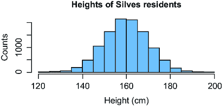

##### 图 2.21 显示所有 Silves 居民身高分布的直方图

这个直方图代表了整个群体分布。我可以通过将计数除以人数来使其看起来更像一个概率分布，如图 2.22 所示。


##### 图 2.22 Silves 居民给定身高的比例直方图

某人可能会说这个分布遵循正态（高斯）概率分布，因为我们看到了一个钟形曲线，而且确实，正态分布适用于像身高这样的进化钟形现象。但这个说法并不完全准确。为了理解这一点，考虑所有正态分布都是为负数定义的（尽管这些数字可能只有极小的概率密度），而身高不能是负数。我们真正做的是使用正态分布作为一个 *模型*——作为对这个群体分布的 *近似*。

在另一个例子中，图 2.23 展示了简·奥斯汀小说中词类的真实分布。请注意，这并非基于她小说中页面的样本；我是从她所有六部完成小说中的 725,000 个词的词类分布中创建了这个可视化。

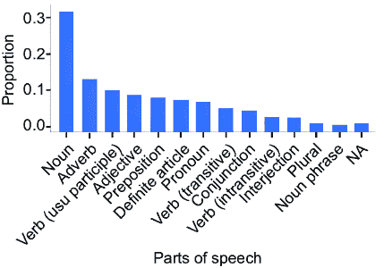

##### 图 2.23 简·奥斯汀所有小说中词类的实际分布

作为模型师，我们使用规范分布来建模人群分布，但模型并不等同于人群分布。这个观点可能看起来像是微不足道的语义，但在大数据时代，我们经常可以推理整个群体，而不仅仅是随机样本。例如，流行的在线社交网络有数亿甚至数十亿用户。这是一个巨大的规模，而整个群体只需一个数据库查询即可获得。

在因果建模中，我们思考如何建模数据和人群的精确性非常有用。因果推断是关于人群的真实世界属性，而不仅仅是数据中的统计趋势。而我们想要回答的不同因果问题将需要我们将不同的因果假设融入我们的模型中，其中一些比其他假设更强或更难验证。

### 2.3.2 从观察数据到数据生成过程

在因果建模中，了解观察数据如何映射到数据中变量的联合概率分布，以及该联合概率分布如何映射回数据生成过程（DGP）非常重要。大多数模型师对这些实体之间的关系有一定程度的直觉，但在因果建模中我们必须明确。这种明确的理解很重要，因为在普通统计建模中，你模型的是联合分布（或其元素），而在因果建模中，你需要模型的是数据生成过程（DGP）。

#### 从观察数据到经验联合分布

假设我们有一个如表 2.1 所示的五个数据点的数据集。

##### 表 2.1 一个包含五个示例的简单数据集

|  | jenny_throws_rock | brian_throws_rock | window_breaks |
| --- | --- | --- | --- |
| 1  | False  | True  | False |
| 2  | True  | False  | True  |
| 3  | False  | False  | False |
| 4  | False  | False  | False |
| 5  | True  | True  | True  |

我们可以对所有观察到的可观察结果进行计数，如表 2.2 所示。

##### 表 2.2 每种可能结果组合的经验计数

|  | jenny_throws_rock | brian_throws_rock | window_breaks | counts |
| --- | --- | --- | --- | --- |
| 1  | False  | False  | False  | 2  |
| 2  | True  | False  | False  | 0  |
| 3  | False  | True  | False  | 1  |
| 4  | True  | True  | False  | 0  |
| 5  | False  | False  | True  | 0  |
| 6  | True  | False  | True  | 1  |
| 7  | False  | True  | True  | 0  |
| 8  | True  | True  | True  | 1  |

将结果数量（5）除以得到 *经验联合分布*，如表 2.3 所示。

##### 表 2.3 数据的经验分布

|  | jenny_throws_rock | brian_throws_rock | window_breaks | proportion |
| --- | --- | --- | --- | --- |
| 1  | False  | False  | False  | 0.40  |
| 2  | True  | False  | False  | 0.00  |
| 3  | False  | True  | False  | 0.20  |
| 4  | True  | True  | False  | 0.00  |
| 5  | False  | False  | True  | 0.00  |
| 6  | True  | False  | True  | 0.20  |
| 7  | False  | True  | True  | 0.00  |
| 8  | True  | True  | True  | 0.20  |

因此，在离散结果的情况下，我们通过计数从数据到经验分布。

在连续情况下，我们可以计算经验分布的直方图、密度曲线或其他统计表示。你可以选择不同的统计方法来创建这些汇总，但这些都是同一基础经验分布的表示。

重要的是，经验联合分布不是数据中变量的实际联合分布。例如，我们看到经验分布中的一些结果在这五个数据点中从未出现过。它们出现的概率为零吗？更有可能的是，这些概率大于零，但我们没有看到这些结果，因为只采样了五个点。

作为类比，一个公平的骰子掷出 1 的概率是 1/6。如果你掷骰子五次，你几乎有（1–1/6）⁵=40%的概率在任何一次掷骰子中都不会看到 1。如果你真的这样做了，你不会想得出看到 1 的概率为零的结论。然而，如果你继续掷骰子，看到 1 的比例会收敛到 1/6。

备注：更精确地说，我们关于概率的频率主义解释告诉我们，将概率解释为当我们无限次掷骰子时得到 1 的比例。尽管是“无限次”，但在比例开始收敛到一个数字（1/6）之前，我们不需要掷很多次。

#### 从经验联合分布到观测联合分布

**观测联合概率**分布是数据中观察到的变量的真实联合分布。假设表 2.4 显示了这些观察变量的真实观测联合概率分布。

##### 表 2.4 假设这是真实的观测联合分布。

|  | jenny_throws_rock | brian_throws_rock | window_breaks | probability |
| --- | --- | --- | --- | --- |
| 1  | False  | False  | False  | 0.25  |
| 2  | True  | False  | False  | 0.15  |
| 3  | False  | True  | False  | 0.15  |
| 4  | True  | True  | False  | 0.05  |
| 5  | False  | False  | True  | 0.00  |
| 6  | True  | False  | True  | 0.10  |
| 7  | False  | True  | True  | 0.10  |
| 8  | True  | True  | True  | 0.20  |

从联合观测分布中采样产生经验联合分布，如图 2.24 所示。


##### 图 2.24 从观测联合分布中采样产生观测数据和经验分布。

#### 潜在变量：从观测联合分布到完整联合分布

在统计建模中，*潜在变量* 是那些在数据中未直接观察到但在统计模型中包含的变量。回到我们的数据示例，假设有一个第四个潜在变量，“冲击力强度”，如表 2.5 所示。

##### 表 2.5 强度 _of_impact 列中的值是未见的“潜在”变量。

|  | jenny_throws_rock | brian_throws_rock | strength_of_impact | window_breaks |
| --- | --- | --- | --- | --- |
| 1  | False  | True  | 0.6  | False  |
| 2  | True  | False  | 0.6  | True  |
| 3  | False  | False  | 0.0  | False  |
| 4  | False  | False  | 0.0  | False  |
| 5  | True  | True  | 0.8  | True  |

潜在变量模型在从机器学习到计量经济学到生物信息学等学科中都很常见。例如，在自然语言处理中，一个流行的概率潜在变量模型是*主题模型*，其中观测变量代表文档中单词和短语的出现，潜在变量代表文档的主题（例如，体育、政治、金融等）。

潜在变量被省略在观测联合概率分布中，因为正如其名所示，它们没有被观察到。观测变量和潜在变量的联合概率分布是完整的联合分布。要从完整的联合分布到观测联合分布，我们需要对潜在变量进行边缘化，如图 2.25 所示。

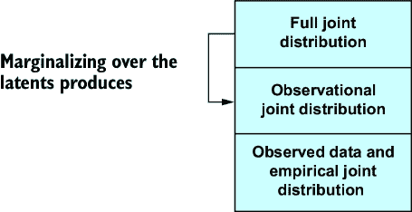

##### 图 2.25 对潜在变量进行边缘化处理，得到观测联合分布。

#### 从完整联合分布到数据生成过程

我使用以下 Python 代码编写了五个数据点的实际 DGP。

##### 列表 2.11 代码形式的 DGP 示例

```py
def true_dgp(jenny_inclination, brian_inclination, window_strength):     #1
    jenny_throws_rock = jenny_inclination > 0.5     #2
    brian_throws_rock = brian_inclination > 0.5    #2
    if jenny_throws_rock and brian_throws_rock: #3
        strength_of_impact = 0.8   #3
    elif jenny_throws_rock or brian_throws_rock:     #4
        strength_of_impact = 0.6    #4
    else:     #5
        strength_of_impact = 0.0   #5
    window_breaks = window_strength < strength_of_impact    #6
    return jenny_throws_rock, brian_throws_rock, window_breaks
```

#1 输入变量反映了珍妮和布莱恩扔石头的意愿以及窗户的强度。

#2 如果愿意，珍妮和布莱恩会扔石头。

#3 如果珍妮和布莱恩都扔石头，总冲击力为 .8。

#4 如果珍妮或布莱恩扔石头，总冲击力为 .6。

#5 否则，没有人扔石头，冲击力为 0。

#6 如果冲击力大于窗户的强度，窗户会破碎。

注意：一般来说，DGP 是未知的，我们的模型正在对其结构进行猜测。

在这个例子中，`jenny_inclination`、`brian_inclination`和`window_strength`是介于 0 和 1 之间的潜在变量。`jenny_inclination`代表 Jenny 的初始投掷欲望，`brian_inclination`代表 Brian 的初始投掷欲望，`window_strength`代表窗户玻璃的强度。这些都是导致数据中观测变量一个实例化的初始条件：(`jenny_throws_ball`、`brian_throws_ball`、`window_breaks`)。

我随后在以下五组潜在变量上调用了`true_dgp`函数：

```py
initials = [
    (0.6, 0.31, 0.83),
    (0.48, 0.53, 0.33),
    (0.66, 0.63, 0.75),
    (0.65, 0.66, 0.8),
    (0.48, 0.16, 0.27)
]
```

换句话说，以下 Python 中的`for`循环是产生五个数据点的实际采样过程：

```py
data_points = []
for jenny_inclination, brian_inclination, window_strength in initials:    
    data_points.append(
        true_dgp(
            jenny_inclination, brian_inclination, window_strength
        )
    )
```

DGP 是生成数据的因果过程。注意，全联合概率分布中完全缺失的叙事元素；如果 Jenny 和 Brian 有投掷石头的倾向，他们会向窗户投掷石头，如果他们击中了窗户，窗户可能会破裂，这取决于他们是否投掷了石头以及窗户的强度。DGP 包含完整的联合概率分布，如图 2.26 所示。换句话说，联合概率分布是基于*如何*生成数据而由 DGP 产生的结果。


##### 图 2.26 DGP 包含完整的联合分布。

总之，DGP 包含完整的联合分布，对完整联合分布进行边缘化产生观测联合分布。从这个分布中进行采样产生观测数据和相应的经验联合分布。当我们向下移动这个层次结构时，存在多对一的关系，这对因果建模和推理有影响。

#### 层次结构中的多对一关系

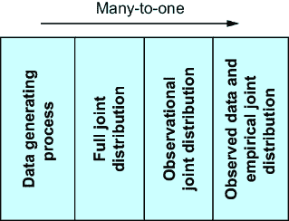

##### 图 2.27 当我们向下移动到层次结构时，存在多对一的关系。总之，存在多个与观测数据一致的 DGP。

当我们从 DGP 移动到完整的联合分布、观测联合分布和经验联合分布以及观测数据时，前一级别到后一级别之间存在多对一的关系，如图 2.27 所示。

同样，一个级别的对象与下一个级别上的多个对象是一致的：

+   *可能存在多个与经验联合分布一致的观测联合分布*。如果我们采样五个点，然后再采样五个点，我们将得到不同的数据集，从而得到不同的经验分布。

+   *可能存在多个与一个观测联合分布一致的完整联合分布*。这两个分布之间的区别是潜在变量。但如果我们对潜在变量的集合有不同的选择呢？例如，如果我们的观测分布是*P*(*X*, *Y*)，那么如果我们的潜在变量集合是{*Z*, *W*}，完整的联合分布将是*P*(*X*, *Y*, *Z*, *W*)，或者如果我们的潜在变量集合是{*Z*, *V*}，完整的联合分布将是*P*(*X*, *Y*, *Z*, *V*)。

+   *可能存在多个与一个完整的联合概率分布一致的 DGP（数据生成过程）*。假设在我们的窗口破坏例子中，珍妮有一个朋友伊莎贝尔，有时会怂恿珍妮扔石头，有时则不会，这影响了珍妮扔石头的倾向。这个 DGP 与原始的 DGP 不同，但伊莎贝尔的同伴压力的潜在变量与珍妮扔石头倾向之间的关系可能是这样的，即这个新的 DGP 导致了完全相同的联合概率分布。作为一个更简单的例子，假设我们观察的是三个骰子点数之和的分布。DGP 是掷三个骰子然后将它们相加。两个 DGP 可以在求和的顺序上有所不同；例如，(第一个 + 第二个) + 第三个或(第一个 + 第三个) + 第二个或(第二个 + 第三个) + 第一个。这些都会得到相同的分布。

那最后两个多对一关系是因果可识别性概念的基础，这是因果推理之所以困难的核心原因。正如俗话所说，这个概念是“相关性不等于因果性”的原因。

### 2.3.3 独立性统计测试

因果性将独立性和条件独立性强加给变量，因此我们依赖于条件独立性统计测试来构建和验证因果模型。

假设 *X* 和 *Y* 是独立的，或者给定 *Z*，*X* 和 *Y* 是条件独立的。如果我们有观察 *X*、*Y* 和 *Z* 的数据，我们可以运行一个独立性统计测试。标准的统计独立性程序返回一个测试统计量，该统计量量化了 *X* 和 *Y* 之间的统计关联，以及一个 p 值，该 p 值量化了在 *X* 和 *Y* 实际上给定 *Z* 条件独立的情况下，仅通过纯偶然得到这种程度或更极端的关联的概率。简单来说，这个测试量化了依赖性或独立性的统计证据。

表明有人犯下谋杀的证据并不等同于他们确实犯下谋杀的确定性事实。同样，表明两个变量之间独立性的统计证据并不等同于它们实际独立的实际事实。在这两种情况下，证据可以指向一个结论，但并不一定能最终证明它。例如，给定独立性是真实的，统计证据的强度可以因几个因素而异，例如数据的数量。而且，从这些测试中得出错误结论总是可能的。

记住，如果 *X* 和 *Y* 是独立的，那么 *P*(*Y*|*X*) 等同于 *P*(*Y*)。在预测术语中，这意味着 *X* 对 *Y* 没有预测能力。如果你不能使用经典统计测试（例如，如果 *X* 和 *Y* 是向量），那么你可以尝试训练一个预测模型并主观评估模型预测的好坏。

### 2.3.4 模型参数的统计估计

当我们“训练”或“拟合”一个模型时，我们试图估计模型参数的值，例如回归模型或神经网络中的权重。在统计建模和机器学习中，参数估计的目标是建模观测或联合概率分布。在因果建模中，目标是建模 DGP。这种区别对于做出良好的因果推断非常重要。

#### 通过最大化似然估计

在非正式的术语和参数估计的背景下，似然是在给定参数向量候选值的情况下观察数据的概率。*最大化似然*意味着选择具有最高似然性的参数向量值。通常，我们通过最大化似然的对数而不是似然本身来进行工作，因为这从数学和计算上更容易实现；最大化似然的价值与最大化对数似然的价值相同。在特殊情况下，例如线性回归，最大似然估计有我们可以通过数学推导出的解，但在一般情况下，我们必须使用数值优化技术来找到解。在某些模型中，例如神经网络，找到最大化似然性的值是不切实际的，所以我们满足于一个相对似然性较高的候选值。

#### 通过最小化其他损失函数和正则化估计

在机器学习中，有各种损失函数用于估计参数。最大化似然是最小化损失函数的一个特例，即负对数似然损失函数。

*正则化*是指在损失函数中添加额外的元素，以引导优化过程向更好的参数值靠拢。例如，L2 正则化将参数值的平方和的值添加到损失中。由于值的微小增加会导致值的平方增加更大，因此 L2 正则化有助于避免参数估计过大。

#### 贝叶斯估计

*贝叶斯估计*将参数视为随机变量，并试图根据数据中观察到的变量来建模参数的条件分布（通常称为*后验分布*）。它是通过在参数上放置一个“先验概率分布”来实现的。先验分布有自己的参数，称为“超参数”，模型必须指定这些超参数。当模型中有潜在变量时，贝叶斯推理的目标是在给定观察变量的条件下，参数和潜在变量的联合分布。

如前所述，在这本书中，我使用希腊字母表示参数，罗马字母表示 DGP 中的变量，包括潜在变量。但对于贝叶斯统计学家来说，这种区别无关紧要；参数和潜在变量都是未知的，因此是推理的目标。

贝叶斯估计的一个主要优点是，你得到的不是参数的点值，而是参数的整个条件概率分布（更具体地说，你得到的是代表该分布的样本或参数值）。这个概率分布代表了参数值的不确定性，你可以将这种不确定性纳入模型预测或其他从模型中得出的推论中。

根据贝叶斯哲学，先验分布应该捕捉模型对参数真实值的主体信念。当我们把对 DGP 的因果结构和机制的信念转化为模型中的因果假设时，我们将在因果建模中做类似的事情。

#### 估计器的统计和计算属性

由于估计参数有多种方法，让我们寻找比较估计方法质量的方法。假设我们想要估计的参数有一个真实值。统计学家思考估计方法如何很好地恢复这个真实值。具体来说，他们关心估计方法的偏差和一致性。估计器是一个随机变量，因为它来自数据（数据有分布），这意味着估计器有一个分布。如果该分布的均值等于它所估计的参数的真实值，则估计器是无偏的。一致性意味着你拥有的数据越多，估计值就越接近参数的真实值。在实践中，估计器的一致性比它是否无偏更重要。

计算机科学家知道，虽然理论上一致性很好，但要使估计方法能够处理“更多数据”比说起来容易。他们关心估计器的计算质量与数据量的关系。估计器是否随着数据量的增加而扩展？它是否可并行化？一个估计器可能是一致的，但当它在 iPhone 应用上运行时，它是否会在毫秒内收敛到真实值，而不会在这个过程中耗尽电池电量？

这本书将理解因果逻辑与因果参数估计器的统计和计算属性解耦。我们将专注于因果逻辑，并依赖像 DoWhy 这样的库，这些库使得统计和计算计算变得容易进行。

#### 拟合优度与交叉验证

当我们估计参数时，我们可以计算各种统计量来告诉我们我们做得如何。一类统计量被称为**拟合优度统计量**。统计学家将拟合优度定义为量化模型与用于训练模型的所用数据拟合程度的统计量。这里还有一个定义：拟合优度统计量告诉你你的模型在多大程度上假装是用于训练模型的数据的 DGP。然而，正如我们所看到的，对于给定的数据集，存在多个可能的 DGP。拟合优度不会提供区分真实 DGP 的因果信息。

交叉验证统计通常表明你的模型在未接受过训练的数据上的预测效果如何。可能存在一个模型相对于其他模型具有相当好的拟合度，但仍然预测效果不佳。机器学习通常关注预测任务，因此倾向于使用交叉验证。然而，一个模型可以是一个好的预测器，并提供完全错误的因果推断。

## 2.4 决定论和主观概率

本节将探讨我们进行概率因果建模所需的哲学基础。在这本书中，我们将使用概率模型来建模因果模型。在训练模型时，我们可能希望使用贝叶斯参数估计程序。在进行因果推断时，我们可能希望使用概率推断算法。当我们进行因果决策时，我们可能希望使用贝叶斯决策理论。此外，**结构因果模型**（第六章）对模型中随机性可能发生的位置有严格的要求。这意味着明确区分贝叶斯主义、不确定性、随机性、概率建模和概率推断是很重要的。

第一个关键点是把 DGP 视为决定论的。第二个关键点是认为我们 DGP 模型中的概率是主观的。

### 2.4.1 决定论

抛掷岩石 DGP 的早期代码完全是**决定论的**；给定初始条件，输出是确定的。再次考虑我们对物理概率的定义：如果我掷骰子，为什么结果是随机的？

如果我拥有超人的灵巧、感知和心智处理能力，我可以在心中计算出骰子投掷的物理学并确定结果。这个决定论哲学思想本质上说 DGP 是决定论的。18 世纪法国学者皮埃尔-西蒙·拉普拉斯用一种称为拉普拉斯恶魔的思想实验来解释决定论。拉普拉斯想象了一个实体（恶魔），它知道宇宙中每个原子的精确位置和动量。有了这些知识，这个实体将能够以完全决定论的确定性知道宇宙的未来状态，因为它可以从（牛顿）力学的定律中计算出它们。换句话说，给定所有原因，结果 100%完全确定，毫无随机性。

为了明确起见，一些系统，当我们足够仔细地观察时，具有固有的随机元素（例如，量子力学、生物化学等）。然而，这种建模的哲学观点将适用于我们关心的大多数事物。

### 2.4.2 主观概率

在我们对概率的物理解释中，当我掷骰子时，概率代表了我对骰子滚动时所有粒子位置和动量的超人类知识的缺乏。换句话说，当我构建 DGP 的概率模型时，概率反映了我的知识缺乏。这种哲学思想被称为*主观概率*或*贝叶斯概率*。这种论点超越了贝叶斯法则和贝叶斯统计估计，认为模型中的概率代表了模型构建者对 DGP 的完全知识缺乏，并不代表 DGP 中的固有随机性。

主观概率扩展了我们对概率的“随机物理过程”解释。概率的物理解释对于简单的物理过程，如掷骰子、抛硬币或洗牌，效果很好。但是，当然，我们还想对许多难以被视为可重复物理过程的现象进行建模。例如，思想如何转化为言语，或者由于气候变化，新鲜水流增加对全球洋流系统的威胁。在这些情况下，我们仍然会使用随机生成来对这些现象进行建模。随机生成中使用的概率反映了，尽管我们作为模型构建者可能对数据生成过程的一些细节有所了解，但我们永远不会达到超人的确定性细节水平。

## 摘要

+   随机变量是一个变量，其可能值是随机现象的数值结果。

+   概率分布函数是一个将随机变量的结果映射到概率值的函数。联合概率分布函数将每个 *X* 和 *Y* 结果的组合映射到概率值。

+   我们从概率的基本公理中推导出链式法则、全概率定律和贝叶斯法则。这些规则在建模中非常有用。

+   马尔可夫假设意味着变量序列中的每个变量只依赖于直接在其前面的变量。这是统计建模中常见的简化假设，但在因果建模中起着重要作用。

+   经典分布类是分布的数学描述良好的表示。它们为我们提供了使概率建模灵活且相对容易的原语。

+   经典分布是通过一组参数实例化的，例如位置、尺度、速率和形状参数。

+   当我们构建模型时，知道哪些变量是独立的或条件独立的可以极大地简化模型。在因果建模中，独立性和条件独立性将在将相关性从因果关系分离中发挥关键作用。

+   具有有限个结果的随机变量的期望值是所有可能结果的加权平均值，其中权重是该结果的概率。

+   概率只是一个值。我们需要给这个值一个解释。概率的物理定义将概率映射到如果物理过程可以无限次重复运行，则结果发生的比例。

+   与概率的物理解释相反，贝叶斯对主观概率的解释将概率解释为信念，或者相反，不确定性。

+   当编码随机过程时，Pyro 允许你使用经典分布作为构建细微随机过程模型的原始元素。

+   蒙特卡洛算法使用随机生成来估计从感兴趣分布中的期望值。

+   流行的推理算法包括基于图模型的算法、概率加权、MCMC 和变分推理。

+   经典分布和随机过程可以作为我们希望模拟的人群的代理，以及我们想要从中进行推理的人群。条件概率是模拟异质子人群的绝佳方式。

+   不同的经典分布用于模拟不同的现象，例如计数、钟形曲线和等待时间。

+   从随机过程中生成是模拟现实生活独立同分布数据采样的良好模型。

+   给定一个数据集，可能存在多个数据生成过程（DGPs）可以生成该数据集。这个事实与从相关性中解析因果关系的挑战相关联。

+   统计独立性测试验证了关于潜在分布的独立性和条件独立性声明。

+   学习模型参数的方法有几种，包括最大似然估计和贝叶斯估计。

+   决定性意味着如果我们知道一个系统的所有信息，我们就可以以零误差预测其结果。主观概率是概率代表建模者对系统缺乏完整知识的一种观点。采用这些哲学观点将有助于我们理解因果 AI。

+   构建模型的一个好方法是分解联合分布，简化条件独立性的因子，然后将因子实现为随机过程。

+   一种强大的建模技术是使用概率分布来模拟人群，尤其是当你关心这些人群中的异质性时。

+   当我们使用概率分布来模拟人群时，我们可以将随机过程中的生成映射到从人群中采样。

+   虽然传统的统计建模模型观测联合分布或完整的联合分布，因果建模则模型化 DGP（数据生成过程）。
