# 第四章：使用因果约束测试 DAG

### 本章涵盖

+   使用 d 分离来推理因果关系如何约束条件独立性

+   使用 NetworkX 和 pgmpy 进行 d 分离分析

+   使用条件独立性测试反驳因果 DAG

+   在存在潜在变量时反驳因果 DAG

+   使用和应用因果发现算法约束

我们的因果有向无环图（DAG）或任何因果模型，都捕捉了关于现实世界的一组假设。通常，这些假设可以通过数据来检验。如果我们检验一个假设，结果发现它不成立，那么我们的因果模型就是错误的。换句话说，我们的检验“证伪”或“反驳”了我们的模型。当这种情况发生时，我们回到起点，提出一个更好的模型，并再次尝试反驳它。我们重复这个循环，直到我们得到一个能够抵抗我们反驳尝试的模型。

在本章中，我们将专注于使用基于统计条件独立性的测试来检验我们的因果 DAG。随着你更多地了解我们可以放入因果模型中的假设，以及这些假设允许你做出的推断，你将学会新的测试和反驳模型的方法。本章中你将学习的运行条件独立性测试的工作流程可以应用于你可能提出的新的测试。

## 4.1 因果关系如何导致条件独立

因果关系以某种方式约束数据，其中之一是通过迫使变量条件独立。这种强制条件独立性为我们提供了一种使用独立性统计测试来用数据检验模型的方法；如果我们发现当 DAG 表明它们不应该依赖时，两个变量之间存在强烈的依赖证据，那么我们的 DAG 就是错误的。

在本章中，我们将使用这些统计独立性测试来测试我们的因果 DAG，包括当数据中的其他变量是潜在变量时，我们可以运行的关于观测变量*函数*的独立性测试。最后，我们将探讨这些想法如何使*因果发现算法*能够直接从数据中学习因果 DAG。

但在那之前，让我们看看因果关系是如何导致条件独立的。再次考虑我们的血型示例，如图 4.1 所示。你父亲的血型是你血型的直接原因，而你父亲的父亲的血型是间接原因。尽管是导致你血型的原因，但你的父亲的父亲的血型在给定你父亲血型的情况下与你血型条件独立。

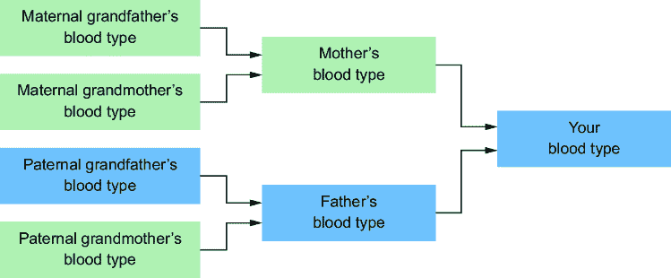

##### 图 4.1 因果关系导致条件独立。你的血型在给定你父亲血型（直接原因）的情况下与你父亲的父亲的血型（间接原因）条件独立。

我们可以从因果关系中得知这一点；父母的血型完全决定了孩子的血型。你父亲的和外祖母的血型完全决定了你父亲的血型，但你的父亲和母亲的血型完全决定了你的血型。一旦我们知道了你父亲的血型，就没有更多你外祖父的血型可以告诉我们了。换句话说，你的祖父母的血型在你父母的情况下是独立的。

### 4.1.1 碰撞器

现在我们来考虑*碰撞器*，这是一种因果如何导致通常独立的变量之间产生依赖关系的有趣方式。考虑图 4.2 中的典型例子。水龙头开启或关闭，以及是否下雨，是草地湿润与否的原因，但知道水龙头关闭并不能帮助你预测是否在下雨。换句话说，水龙头的状态和是否下雨是独立的。但是，当你知道草地是湿的，同时知道水龙头关闭就能告诉你*一定*是在下雨。所以，虽然水龙头的状态和下雨的有无是独立的，但在给定草地状态的情况下，它们变成了条件依赖的。


##### 图 4.2 水龙头开启或关闭以及是否下雨会导致草地湿润或不湿润。知道水龙头关闭并不能帮助你预测是否在下雨——水龙头状态和下雨状态是独立的。但是，如果知道草地是湿的，那么知道水龙头关闭就能告诉你一定是下雨了——在水龙头状态和下雨状态是条件依赖的，给定草地的状态。

在这种情况下，“湿草地”是一个*碰撞器*：至少有两个独立原因的效果。碰撞器之所以有趣，是因为它们说明了因果变量可以是独立的，但如果我们基于一个共享的效果变量进行条件化，它们就会变得依赖。在条件独立术语中，父母的因果是独立的（水龙头 ⊥ 雨），但在观察到孩子（基于孩子进行条件化）之后，它们变得依赖（水龙头 ⟂̷ 雨 | 湿草地）。

作为另一个例子，让我们再次看看血型，如图 4.3 所示。


##### 图 4.3 母亲和父亲通常是无关的，所以知道母亲的血型并不能帮助预测父亲的血型。但是，如果我们知道母亲的血型和孩子的血型，就能缩小父亲可能的血型范围。

如果我们假设母亲和父亲没有关系，母亲的血型并不能告诉我们父亲的血型——(母亲的血型 ⊥ 父亲的血型)。但是，如果我们知道孩子的血型是 B 型，这能帮助我们使用母亲的血型来预测父亲的血型吗？

为了回答这个问题，请查看图 4.4 中的标准血型表。我们看到，如果母亲血型是 A 型，孩子血型是 B 型，那么父亲可能的血型可能是 B 型和 AB 型。


##### 图 4.4 知道母亲的血型可以帮助你在知道孩子的血型的情况下缩小父亲的血型范围。

仅知道母亲的血型并不能告诉我们关于父亲血型的任何信息。但如果我们添加关于孩子血型（碰撞体）的信息，我们可以将父亲的血型从四种可能性缩小到两种。换句话说，(母亲的血型 ⊥ 父亲的血型)，但一旦我们对孩子的血型进行条件化，母亲和父亲的血型就会变得相关。

碰撞体出现在因果推断的各个部分。在第 4.6 节中，我们将看到碰撞体在因果发现任务中的重要性，我们试图从数据中学习一个因果 DAG。当我们查看第七章和第十一章中的因果效应时，我们将看到在推断因果效应时意外“调整”碰撞体如何引入不受欢迎的“碰撞体偏差”。

目前，我们只需注意，碰撞体可能与我们的统计直觉相矛盾，因为它们描述了因果逻辑如何导致两种事物独立，但在对第三个或更多变量进行条件化时“突然”变得相关。

### 4.1.2 使用因果图抽象独立性


##### 图 4.5 在因果效应推断中，我们感兴趣的是在统计上量化一个原因（治疗）对效应（结果）的影响程度。*混杂因素*是常见的共同原因，是治疗和结果之间非因果相关性的来源。因果效应推断需要“调整”混杂因素。D 分离是告诉我们如何做到这一点的理论的核心。

在上一节中，我们使用了血型遗传的基本规则来展示因果关系如何导致条件独立性。如果我们想要编写能够帮助我们跨不同领域进行因果推断的代码，我们需要一个将因果关系映射到条件独立性的抽象，这个抽象不依赖于特定领域的规则。“D 分离”解决了这个问题。

*D 分离*和*d-连接*指的是我们如何使用图来推理条件独立性。这些概念乍一看是新颖的，但它们将成为你在基于图的因果推理中最重要的工具之一。作为第七章的一个小小的预告，考虑一下图 4.5 中展示的因果效应推断问题。在因果推断中，你感兴趣的是在统计上量化一个原因（通常称为“治疗”）对效应（“结果”）的影响程度。

正如你在第三章中看到的，你可以用因果推断任务中变量的角色来描述 DAG 中的变量。在因果效应推断的任务中，一个角色是*混杂因素*。混杂因素是治疗和效果之间非因果相关性的共同原因。为了估计治疗对结果的影响，我们必须“调整”混杂因素。这样做理论上的依据是基于“d 分离”路径{治疗 ← 混杂因素 → 结果}并聚焦于路径{治疗 → 结果}。

## 4.2 D 分离和条件独立性

回顾一下前几章中的以下思想：

+   因果 DAG 是数据生成过程（DGP）的一个模型。

+   DGP 包含一个联合概率分布。

+   因果关系在联合概率分布中诱导变量之间的独立性和条件独立性。

D 分离和 d 连接是用于推理因果 DAG 模型中联合概率分布的条件的独立性的图形抽象。这个概念指的是因果 DAG 中的节点和节点之间的路径；节点和路径是“d 连接”或“d 分离”的，其中“d”代表“方向”。这个想法是使一个像“这些节点在图中是 d 分离的”这样的陈述与一个像“这些变量在条件独立下”这样的陈述相对应。D 分离不是关于陈述什么导致什么的；它是关于 DAG 中变量之间的路径是否表明了在联合概率分布中这些变量之间是否存在依赖。

我们想要建立这种对应关系，因为推理图形比直接推理概率分布更容易；追踪节点之间的路径比上概率理论的高级课程更容易。此外，回想一下第二章的内容，图形是算法和数据结构的基础，统计建模从做出条件独立性假设中受益。

### 4.2.1 D 分离：简化因果分析的门户

假设我们有一个陈述，即*U*和*V*在给定*Z*的情况下是条件独立的（即*U*⊥*V*|*Z*）。我们的任务是定义一个纯粹以图形术语相对应的陈述。我们将这个陈述写成*U*⊥[*G*]*V*|*Z*，并读作“*U*和*V*在图*G*中由*Z*进行 d 分离。”

用*Z*代表一组称为 d 分离集或“阻塞者”的节点。在条件独立性的术语中，*Z*对应于一组我们对其条件化的变量。我们的目标是定义 d 分离，使得*Z*中的节点在某种意义上“阻塞”了由我们的 DAG 的因果结构所暗示的*U*和*V*之间的依赖。

接下来，让*P*成为一个*路径*，意味着两个节点之间的一系列连接边（和节点）。路径上的节点是否在你的数据中被观察到并不重要（我们将在后面看到数据是如何起作用的）。我们“路径”的定义不依赖于边的方向；例如，{*x* → *y* → *z*}，{*x* ← *y* → *z*}，{*x* ← *y* ← *z*}和{*x* → *y* ← *z*}都是*x*和*z*之间的路径。

最后，让我们重新审视碰撞器。碰撞器结构指的是像*x* → *y* ← *z*这样的模式，其中中间节点*y*（碰撞器）有入边。

我们现在定义 d 分离。首先，如果两个节点*u*和*v*之间的所有*路径*都被*Z*分离，那么这两个节点*u*和*v*被认为是 d 分离（阻塞）的。如果*u*和*v*之间的任何路径没有被 d 分离，那么*u*和*v*是 d 连接的。

让我们定义路径的 d 分离。一个路径*P*如果满足以下四个标准之一，则被认为是被节点集*Z*分离的。

1.  *P*包含一个链*i* → *m* → *j*，其中中间节点*m*在*Z*中。

1.  *P*包含一个链*i* ← *m* ← *j*，其中中间节点*m*在*Z*中。

1.  *P*包含一个子父子结构*i* ← *m* → *j*，其中中间（父）节点*m*在*Z*中。

让我们暂停一下。标准 1-3 只是通过三种节点之间边的方向来分析。如果这样继续下去，那么如果*P*上的一个节点在集合*Z*中，那么*P*总是 d 分离的。那将会很棒，因为这将意味着如果 DAG 中存在任何路径，那么两个节点就是 d 连接的（即，相关的），如果所有这些路径都被集合*Z*中的节点阻塞，那么它们就是 d 分离的。

不幸的是，碰撞器使得第四个标准与其他标准相反：

1.  4. *P*包含一个*碰撞器*结构*i* → *m* ← *j*，其中中间节点*m*不在*Z*中，并且*m*的任何后代都不在*Z*中。

这第四个标准是 d 分离如何捕捉两个独立（d 分离）的项目在条件化一个碰撞器时如何变得相关。

许多作家混淆了 d 分离和条件独立性。请清晰地记住这种区别：⊥*[G]*指的是图，而⊥指的是分布。这很重要，因为正如你将在本章后面看到的，我们将使用 d 分离来测试我们的因果假设与数据中条件独立性的统计证据。


##### 图 4.6 集合{*m*, *k*}是否 d 分离路径*u* → *i* → *m* → *j* → *v*？

让我们通过几个例子来分析。

#### 以链 i → m → j 为例

考虑图 4.6 中的 DAG，其中*P*是*u* → *i* → *m* → *j* → *v*。这条路径默认是 d 连接的。现在让*Z*是集合{*m*, *k*}。*P*包含一个链*i* → *m* → *j*，并且*m*在*Z*中。如果我们阻塞在*Z*上，第一个标准就得到了满足，并且*u*和*v*是 d 分离的。

对于某些（但不是所有）情况，理解 d 分离的一个有用的类比是电子电路。没有对撞机的路径是 d 连接的，就像闭合电路，其中电流无阻碍地流动。“阻塞”路径上的节点会 d 分离路径，并“断开电路”，使电流无法流动。在 *Z* 上（特别是阻塞在 *m* 上，它在 *Z* 中）阻塞“断开电路”，如图 4.7 所示。


##### 图 4.7 路径默认是 d 连接的，但阻塞在 m **∈** *Z* 上会 d 分离路径，并形象地“断开电路”（“**∈**”表示“在...中”）。

#### 以链 i ← m → j 为例

现在考虑图 4.8 中的 DAG，其中 *P* 是 *u* ← *i* ← *m* → *j* → *v*。这条路径默认也是 d 连接的。请注意，d 连接可以与因果关系的方向相反。在图 4.7 中，从 *u* 到 *v* 的 d 连接路径是按照因果关系方向进行的：*u* 到 *i* (*u* ← *i*)，然后 *i* 到 *m* (*i* ← *m*)，然后 *m* 到 *j* (*m* → *j*)，最后 *j* 到 *v* (*j* → *v*)。但在这里，我们有两个 *反因果关系*（即与因果关系方向相反）的步骤，即从 *u* 到 *i* (*u* ← *i*) 和 *i* 到 *m* (*i* ← *m*）。

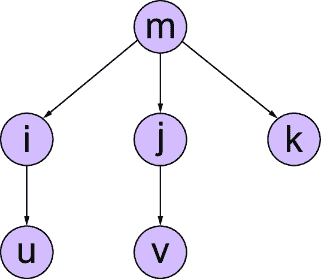

##### 图 4.8 是否集合 {*m*} d 分离路径 *u* ← *i* ← *m* → *j* → *v*？

假设我们阻塞在集合 *Z* 上，且 *Z* 只包含节点 *m*。那么条件 3 得到满足，路径是 d 分离的，如图 4.9 所示。

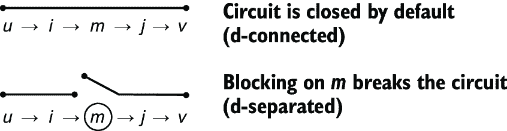

##### 图 4.9 从 *u* 到 *v* 的这条路径默认也是 d 连接的，尽管它有一些步骤（*u* 到 *i* 和 *i* 到 *m*）是违反因果关系的。再次强调，阻塞在 *m* **∈** *Z* 上会 d 分离路径，并形象地“断开电路”。

#### 对撞机使 d 分离变得奇怪

第四个标准关注对撞机模式 *i* → *m* ← *j*：*P* 包含一个 *对撞机* 结构，*i* → *m* ← *j*，其中中间节点 *m* 不在 *Z* 中，且 *m* 的任何后代都不在 *Z* 中。

让我们将这个例子与我们的血型例子联系起来。在这里，*i* 和 *j* 是父母的血型，而 *m* 是孩子的血型。我们看到了对撞机有点奇怪，因为基于对撞机（孩子的血型）的条件会导致两个独立事物（如父母的血型）之间的依赖关系。这种奇怪性使得 d 分离在第一眼看起来有点难以理解。图 4.10 说明了对撞机如何影响 d 分离。


##### 图 4.10 对撞机使 d 连接变得复杂。给定路径上的一个节点 *m*，如果 *m* 不是一个对撞机，则路径默认是 d 连接的，当你阻塞在 *m* 上时，路径是 d 分离的。如果 *m* 是一个对撞机，则路径默认是 d 分离的，当你阻塞在 *m* 上时，路径是 d 连接的。

以下是对对撞机的描述：

+   除非路径有一个对撞机模式，否则两个节点之间的所有路径默认是 d 连接的。带有对撞机的路径默认是 d 分离的。

+   在 d 连接路径上的任何节点进行阻塞都将 d 分离该路径 *除非该节点是碰撞节点*。在碰撞节点上进行阻塞将默认情况下通过 d 连接路径，如下所示

+   将阻塞应用于该碰撞的后代。

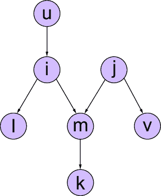

##### 图 4.11 集合{*m*}（或{*k*}或{*m*, *k*}）是否 d 分离路径 *u* → *i* → *m* ← *j* → *v*？

在电路类比中，碰撞节点类似于一个开开关，它阻止电子电路中的电流流动。当路径有一个碰撞节点时，该节点会阻止所有电流通过。碰撞节点会中断电路。在碰撞节点上进行阻塞就像关闭开关一样，之前无法通过的电流现在可以通过了（d 连接）。

在图 4.11 的 DAG 中，路径 *u* → *i* → *m* ← *j* → *v* 是否默认情况下是 d 连接的？不，因为该路径包含一个碰撞结构 *m* (*i* → *m* ← *j*）。

现在考虑如果阻塞集 *Z* 包含 *m* 会发生什么。在这种情况下，条件 4 被违反，路径 *变为 d 连接*，如图 4.12 所示。

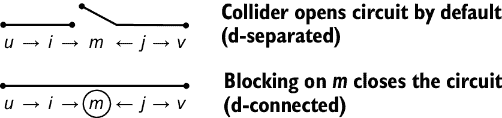

##### 图 4.12 这个从 *u* 到 *v* 的路径默认情况下是 d 分离的，因为它包含一个碰撞节点 *m*。碰撞节点类似于一个开路。在 *m* 或其任何后代上进行阻塞将连接路径，并形象地闭合电路。

如果 *Z* 没有包含 *m* 但只包含 *k*（或者如果 *Z* 包含了 *m* 和 *k*），路径也会变为 d 连接。在碰撞节点的后代上进行阻塞与在碰撞节点上进行阻塞的方式相同。

你能猜到为什么吗？这是因为碰撞的后代与碰撞节点 *d 连接*。在因果术语中，我们看到了给定母亲的血型，观察孩子的血型（碰撞节点）可能会揭示父亲的血型。假设如果我们不是观察孩子的血型，而是观察孩子的孩子的血型（称为孙子的血型）。这个孙子的血型可以帮助缩小孩子的血型，从而缩小父亲的血型。换句话说，如果母亲和父亲的血型在孩子的血型给定的情况下是相关的，并且孙子的血型为你提供了关于孩子血型的信息，那么在孙子的血型给定的情况下，母亲和父亲的血型也是相关的。

#### D 分离和节点集

D 分离不仅适用于节点对，也适用于节点集对。在符号 *u*⊥*v*|*Z* 中，*Z* 可以是阻塞集，而 *u* 和 *v* 也可以是集。我们通过阻塞每个集合成员之间的所有 d 连接路径来 d 分离两个集合。其他基于图的因果概念，如 do-calculus，也推广到节点集。如果你记住这个事实，我们就可以在单个节点上建立直觉，而这种直觉可以推广到集合。

当阻塞集 *Z* 是单元素集 `{*m*}` 时，这个集合足以阻塞图 4.7 中的路径 *u* → *i* → *m* → *j* → *v* 和图 4.8 中的路径 *u* ← *i* ← *m* → *j* → *v*。总的来说，集合 `{*i*}`, `{*m*}`, `{*j*}`, `{*i*, *m*}`, `{*i*, *j*}`, `{*m*, *j*}` 和 `{*i*, *m*, *j*}` 都可以 d-分离这两条路径上的 *u* 和 *v*。然而，`{*i*}`, `{*m*}`, 和 `{*j*}` 是 *最小 d-分离集*，这意味着所有其他 d-分离集都至少包含这些集合中的一个。最小 d-分离集足以 d-分离这两个节点。在推理 d-分离和将其实现为算法时，我们希望专注于找到最小 d-分离集；如果 *U*⊥*V*|*Z* 和 *U*⊥*V*|*Z*, *W* 都为真，我们不想在 *U*⊥*V*|*Z*, *W* 上浪费精力。

### 4.2.2 d-分离多条路径的示例

假设我们想要 d-分离两个节点。通常在这些节点之间有多条 d-连接路径。为了 d-分离这些节点，我们需要找到能够 d-分离每条路径的阻塞器。让我们通过一些例子来了解一下。

#### 寻找最小 d-分离集

在一个具有更多边的更大图中，两个节点之间的路径数量可能相当大。但通常较长的路径会作为阻塞较短路径的副作用而被阻塞。因此，我们可以从较短的路径开始，逐步到尚未被阻塞的较长路径，直到没有未阻塞的路径为止。

例如，在图 4.13 中，*U* 和 *V* 通过这些路径 d-连接。为了 d-分离它们，需要哪些节点集是必需的？

在图 4.13 中，*U* 和 *V* 通过这些路径 d-连接：

+   *U* → *I* → *V*

+   *U* → *J* → *V*

+   *U* → *J* → *I* → *V*

首先，我们可以通过在 *I* 上阻塞来 d-分离 *U* → *I* → *V*。然后，我们通过在 *J* 上阻塞来 d-分离 *U* → *J* → *V*。在这个时候，我们注意到我们的阻塞集合 `{*I*, *J*}` 已经 d-分离了 *U* → *J* → *I* → *V*，所以我们完成了。

在另一个例子中，我们如何在图 4.14 中 d-分离 *U* 和 *V*？

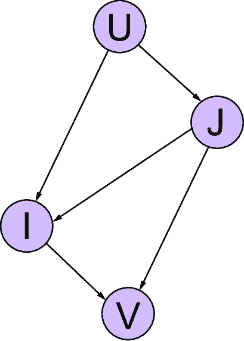

##### 图 4.13 我们可以使用集合 `{*I*, *J*}` 来 d-分离 *U* 和 *V*。


##### 图 4.14 我们可以使用集合 `{*I*, *M*, *K*, *J*}` 或 `{*I*, *M*, *K*, *L*}` 来 d-分离 *U* 和 *V*。

*U* 和 *V* 之间有许多路径。让我们首先列出三条最短的路径：

+   *U* ← *I* → *V*

+   *U* ← *M* → *V*

+   *U* ← *K* → *V*

我们至少需要在 `{*I*, *M*, *K*}` 上阻塞来 d-分离这三条路径。请注意，*U* 有另一个父节点 *J*，并且从 *U* 到 *V* 通过 *J* 有几条路径，但我们只有两条尚未 d-分离的路径；*U* ← *J* → *L* → *V* 和 *U* ← *J* → *K* ← *L* → *V*。*J* 和 *L* 都会阻塞这些路径，因此我们可以使用最小集合 `{*I*, *M*, *K*, *J*}` 或 `{*I*, *M*, *K*, *L*}` 来 d-分离 *U* 和 *V*。请注意，*U* ← *J* → *K* ← *L* → *V* 是 d-连接的，因为我们最初将 *K*，这条路径上的一个碰撞器，添加到我们的阻塞集中。接下来，我们来看另一个这种现象的例子。

#### 当 d-分离一条路径时，会连接另一条路径

当你尝试通过在另一条路径上的碰撞节点上阻塞来 d-分离 *U* 和 *V* 之间的路径时，你可能会 d-连接那条其他路径。这是可以的，只要你采取额外的步骤来 d-分离那条路径。为了说明这一点，考虑图 4.15 中的图。这个图足够简单，我们可以枚举出所有的路径。


##### 图 4.15 使用 *M* 进行阻塞将阻塞 *U* ← *M* → *V* 的路径，但会 d-连接 *U* ← *I* → *M* ← *J* → *V* 的路径，因为 *M* 是 *I* 和 *J* 之间的碰撞点。因此，我们需要在 *I* 或 *J* 上额外进行阻塞以 d-分离 *U* ← *I* → *M* ← *J* → *V*。

让我们从三个 d-连接路径开始：

+   *U* ← *M* → *V*

+   *U* ← *I* → *M* → *V*

+   *U* ← *M* ← *J* → *V*

我们还有一个路径 *U* ← *I* → *M* ← *J* → *V*，但那不是一个 d-连接路径，因为 *M* 是该路径上的一个碰撞点。

最简单的方法是使用一个节点阻塞所有这三个 d-连接路径，即在 *M* 上进行阻塞。然而，如果我们阻塞那个碰撞点，路径 *U* ← *I* → *M* ← *J* → *V* 将会 d-连接。因此，我们需要在 *I* 或 *J* 上额外进行阻塞。换句话说，我们的最小 d-分离集是 {*I*, *M*} 和 {*J*, *M*}。

### 4.2.3 代码中的 d-分离

如果你仍然对 d-分离感到困惑，不要担心。我们已定义了四个标准来描述图上节点之间的路径，这正是我们可以在图库中实现的那种类型。在 Python 中，图库 NetworkX 已经有一个用于检查 d-分离的实用工具。你可以通过这些工具进行实验，以建立对不同图上 d-分离的直觉。

##### 设置你的环境

这段代码是用 pgmpy 版本 0.1.24 编写的。pandas 版本是 2.0.3。

让我们验证之前在图 4.15 中显示的因果 DAG 的 d-分离分析。

##### 列表 4.1 图 4.15 中的 DAG 的 d-分离分析

```py
from networkx import is_d_separator      #1
from pgmpy.base import DAG     #2
dag = DAG([     #2
    ('I', 'U'),     #2
    ('I', 'M'),     #2
    ('M', 'U'),  #2
    ('J', 'V'),    #2
    ('J', 'M'),     #2
    ('M', 'V')     #2
])     #2
print(is_d_separator(dag, {"U"}, {"V"}, {"M"}))     #3
print(is_d_separator(dag, {"U"}, {"V"}, {"M", "I", "J"}))    #4
print(is_d_separator(dag, {"U"}, {"V"}, {"M", "I"}))     #5
print(is_d_separator(dag, {"U"}, {"V"}, {"M", "J"}))    #5
```

#1 图库 NetworkX 实现了针对 NetworkX 图对象（如 ΔiGraph（有向图））的 d-分离算法。

#2 ΔAG 是 BayesianNetwork 类的基类。ΔAG 的基类是 NetworkX 的 ΔiGraph。因此，is_d_separator 将在 ΔAG（和 BayesianNetwork）类的对象上工作。

#3 构建 4.11 图中的图。在碰撞点 *M* 上进行阻塞将阻塞 *U* ← *M* → *V*，但将 d-连接 *U* ← *I* → *M* ← *J* → *V* 的路径，所以这将打印 False。

#4 在 *M* 上进行阻塞将阻塞 *U* ← *M* → *V* 并打开（d-连接）*U* ← *I* → *M* ← *J* → *V*，但我们可以用 *I* 和 *J* 来阻塞那条路径，所以这评估为 True。

#5 同时在 *I* 和 *J* 上进行阻塞是多余的。最小 d-分离集是 {“M”， “I”} 和 {“M”， “J”}。

pgmpy 还在 `DAG` 类中有一个 `get_independencies` 方法，它枚举了给定图中的最小 d-分离状态。

##### 列表 4.2 在 pgmpy 中枚举 d-分离

```py
from pgmpy.base import DAG
dag = DAG([
    ('I', 'U'),
    ('I', 'M'),
    ('M', 'U'),
    ('J', 'V'),
    ('J', 'M'),
    ('M', 'V')
])
dag.get_independencies()    #1
```

#1 获取 ΔAG 中所有为真的最小 d-分离语句。

`get_independencies` 方法返回以下结果。（根据你的环境，输出的顺序可能会有细微的差异。）

```py
(I ⊥ J)
(I ⊥ V | J, M)
(I ⊥ V | J, U, M)
(V ⊥ I, U | J, M)
(V ⊥ U | I, M)
(V ⊥ I | J, U, M)
(V ⊥ U | J, M, I)
(J ⊥ I)
(J ⊥ U | I, M)
(J ⊥ U | I, M, V)
(U ⊥ V | J, M)
(U ⊥ J, V | I, M)
(U ⊥ V | J, M, I)
(U ⊥ J | I, M, V)
```

注意，`get_independencies` 函数的名称是一个误称；它并不“获取独立性”，而是获取 d-分离。再次提醒，不要将因果图中的 d-分离与 DGP 所表示的联合概率分布中的条件独立性混淆。记住这个区别将有助于你完成下一个任务：使用 d-分离来测试 DAG 与数据中条件独立性的证据。

## 4.3 反驳因果 DAG

我们已经看到了如何构建因果 DAG。当然，我们希望找到一个与数据拟合良好的因果模型，因此现在我们将评估因果 DAG 与数据。我们可以使用标准的拟合优度和预测统计来评估拟合度，但在这里我们将专注于*反驳*我们的因果 DAG，使用数据来证明我们的模型是错误的。

统计模型拟合数据中的曲线和模式。没有“正确”的统计模型；只有拟合数据良好的模型。相比之下，因果模型超越了数据，对 DGP 进行因果断言，这些断言要么是真的，要么是假的。作为因果模型构建者，我们试图找到一个拟合良好的模型，但我们还试图*反驳*我们模型的因果断言。

##### 反驳与波普尔

通过反驳构建 DAG 的方法与卡尔·波普尔的可证伪理论框架相一致。卡尔·波普尔是一位 20 世纪的哲学家，以其对科学哲学的贡献而闻名，特别是他的证伪理论。波普尔认为，科学理论不能被证明为真，但它们可以被测试，并可能被证伪，换句话说，*反驳*。

我们采用一种“波普尔式”的模型构建方法，这意味着我们不仅想要找到一个与证据拟合的模型。相反，我们积极寻找反驳我们模型证据。当我们找到它时，我们拒绝我们的模型，构建一个更好的模型，并重复。

D-分离是我们反驳的第一个工具。假设你构建了一个因果 DAG，并且它暗示了条件独立性。然后你寻找数据中的依赖性证据，在你的 DAG 中应该有条件独立性。如果你找到了这样的证据，你就反驳了你的 DAG。然后你回到因果 DAG 上进行迭代，直到在你的数据下你不能再反驳它为止。

一旦你完成了这个任务，你就可以继续进行下游的因果推理工作。但请记住这种反驳心态。如果你反复使用相同的因果 DAG，你应该始终寻求新的反驳和迭代方法。实际上，你的目标不是得到真正的 DAG，而是得到一个难以反驳的 DAG。

### 4.3.1 重新审视因果马尔可夫属性

回想一下，我们看到了因果马尔可夫属性的两个方面：

+   *局部马尔可夫属性*——一个节点在给定其父节点的情况下，与其非后裔节点条件独立。

+   *马尔可夫分解性质*—联合概率分布分解为变量的条件分布，给定因果 DAG 中的直接父节点。

现在，我们将介绍这个属性的第三个方面，称为*全局马尔可夫性质*。这个属性表明，因果 DAG 中的 d 分离意味着联合概率分布中的条件独立性。在符号上，我们写成


用简单的话说，那个符号读作“如果 *U* 和 *V* 在图 *G* 中由 *Z* 分离，那么在给定 *Z* 的条件下，它们是条件独立的。”请注意，如果因果马尔可夫性质的三个方面中的任何一个为真，那么它们都是真的。

全局马尔可夫性质为我们提供了一个直接反驳我们的因果模型的方法。我们可以使用 d 分离来指定存在条件独立性的统计检验。失败的检验反驳了模型。

### 4.3.2 使用条件独立性检验进行反驳

有多种方法可以统计地评估条件独立性，其中最明显的方法是使用条件独立性的统计检验。pgmpy 和其他库使得运行条件独立性检验相对容易。让我们重新审视运输模型，如图 4.16 所示。


##### 图 4.16 运输模型。年龄（*A*）和性别（*S*）决定教育（*E*）。教育导致职业（*O*）和居住地（*R*）。职业和居住地导致交通（*T*）。

回想一下，对于我们的运输模型，我们能够收集以下观察结果：

+   *年龄（A）*—记录为 29 岁及以下个人的“年轻”（“young”），30 至 60 岁（含）个人的“成人”（“adult”），以及 61 岁及以上个人的“老年”（“old”）。

+   *性别（S）*—个人的自我报告性别，记录为男性（“M”）、女性（“F”）或其他（“O”）。

+   *教育（E）*—个人完成的教育或培训的最高水平，记录为高中（“high”）或大学学位（“uni”）。

+   *职业（O）*—雇员（“emp”）或自雇工人（“self”）。

+   *居住地（R）*—个人居住的城市的人口规模，记录为小（“small”）或大（“big”）。

+   *旅行（T）*—个人偏好的交通方式，记录为汽车（“car”）、火车（“train”）或其他（“other”）。

在图中，*E* ⊥[*G*] *T* | *O*, *R*。因此，让我们检验条件独立性陈述 *E* ⊥ *T* | *O*, *R*。统计假设检验有一个*零假设*（表示为 *H*[0]*)和一个*备择假设*（表示为 *H*[*a*]*)。对于条件独立性的统计假设检验，标准是零假设 *H*[0] 是条件独立性的假设，而 *H*[*a*] 是变量不是条件独立的假设。

统计假设测试使用 *N* 个观察值数据点 *U*、*V* 和 *Z*（来自探索性数据集）来计算一个统计量。以下代码加载了运输数据。加载后，它创建了两个 DataFrame，一个包含所有数据，另一个只包含前 30 行，这样我们可以看到样本大小对显著性测试的影响。

##### 列表 4.3 加载运输数据

```py
import pandas as pd
survey_url = "https://raw.githubusercontent.com/altdeep/causalML/master
[CA] /datasets/transportation_survey.csv"
fulldata = pd.read_csv(survey_url)

data = fulldata[0:30]     #1
print(data[0:5])
```

#1 为了解释，仅对数据进行子集化，只包含 30 个数据点

`print(data[0:5])` 这行代码打印出 DataFrame 的前五行。

```py
       A  S     E    O      R      T
0  adult  F  high  emp  small  train
1  young  M  high  emp    big    car
2  adult  M   uni  emp    big  other
3    old  F   uni  emp    big    car
4  young  F   uni  emp    big    car
```

大多数条件独立性测试库将实现频率假设测试。这些测试将根据给定的统计量是否高于或低于某个阈值，得出有利于 *H*[*0*] 或 *H*[*a*] 的结论。“频率主义”在这个上下文中意味着测试产生的统计量被称为 *p*-值，而阈值被称为显著性水平，按照惯例通常是 .05 或 .01。

如果 *p*-值高于显著性阈值，则测试有利于条件独立性的零假设 *H*[0]；如果低于阈值，则有利于备择假设 H[*a*]。这种频率主义方法是一种优化，保证了显著性水平是当 *E* 和 *T* 实际上条件独立时，得出有利于依赖性的结论的上限。

大多数软件库提供了条件独立性测试工具，在计算 *p*-值时做出特定的数学假设。例如，我们可以运行一个特定的条件独立性测试，该测试推导出一个理论上遵循卡方概率分布的测试统计量，然后使用这个假设推导出 *p*-值。以下代码运行了测试。

##### 列表 4.4 条件独立性卡方测试

```py
from pgmpy.estimators.CITests import chi_square     #1
significance = .05     #2

result = chi_square(    #3
    X="E", Y="T", Z=["O", "R"],     #3
    data=data,     #3
    boolean=False,   #3
    significance_level=significance     #3
)     #3
print(result)
```

#1 导入卡方测试函数。

#2 将显著性水平设置为 .05。

#3 当布尔参数设置为 False 时，测试返回三个元素的元组。前两个是卡方统计量和相应的 p 值 0.56。最后一个元素是卡方分布参数，称为自由度，这是计算 p 值所需的。

这将打印出元组 `(1.1611111111111112, 0.5595873983053805, 2)`，其中值分别是卡方测试统计量、*p*-值和自由度。*p*-值大于显著性水平，因此此测试有利于条件独立性的零假设。换句话说，这个特定的测试没有提供反对我们模型的反证证据。

我们可以通过将 `chi_square` 函数的 `boolean` 参数设置为 `True` 直接跳到测试的结果。然后，如果 *p*-值大于显著性值（有利于条件独立性），函数将返回 `True`；否则返回 `False`（有利于依赖性）。

##### 列表 4.5 带布尔结果的卡方测试

```py
from pgmpy.estimators.CITests import chi_square     #1
significance = .05     #2
result = chi_square(     #3
    X="E", Y="T", Z=["O", "R"],   #3
    data=data,    #3
    boolean=True,    #3
    significance_level=significance  #3   
)    #3
print(result)
```

#1 导入卡方测试函数。

#2 将显著性水平设置为 .05。

#3 当布尔参数设置为 True 时，测试返回一个简单的 True 或 False 结果。如果 p 值大于显著性值，则表示支持条件独立性，它将返回 True。否则，它返回 False，表示支持依赖性。

这将打印出结果 `True`。现在让我们遍历从运输图可以推导出的所有 d-separation 声明，并逐一测试它们。以下脚本将打印出每个 d-separation 声明以及相应的条件独立性测试的结果。

##### 列表 4.6 对每个 d-separation 声明运行卡方测试

```py
from pprint import pprint
from pgmpy.base import DAG
from pgmpy.independencies import IndependenceAssertion

dag = DAG([
    ('A', 'E'),
    ('S', 'E'),
    ('E', 'O'),
    ('E', 'R'),
    ('O', 'T'),
    ('R', 'T')
])
dseps = dag.get_independencies()    

def test_dsep(dsep):
    test_outputs = []
    for X in list(dsep.get_assertion()[0]):
        for Y in list(dsep.get_assertion()[1]):
            Z = list(dsep.get_assertion()[2])
            test_result = chi_square(
                X=X, Y=Y, Z=Z,
                data=data,
                boolean=True,
                significance_level=significance
            )
            assertion = IndependenceAssertion(X, Y, Z)
            test_outputs.append((assertion, test_result))
    return test_outputs

results = [test_dsep(dsep) for dsep in dseps.get_assertions()]
results = dict([item for sublist in results for item in sublist])
pprint(results)
```

结果是一个包含 d-separation 声明及其是否支持（或未能反驳）该声明的数据证据的列表。

```py
{(O ⊥ A | R, E, T, S): True,
 (S ⊥ R | E, T, A): True,
 (S ⊥ O | E, T, A): True,
 (T ⊥ S | R, O, A): True,
 (S ⊥ O | R, E): True,
 (R ⊥ O | E): False,
 (S ⊥ O | E, A): True,
 (S ⊥ R | E, A): True,
 (S ⊥ R | E, T, O, A): True,
 (S ⊥ R | E, O, A): True,
 (O ⊥ A | E, T): True,
 (S ⊥ O | R, E, T): True,
 (R ⊥ O | E, S): False, 
 …
 (T ⊥ A | E, S): True}
```

我们可以计算通过测试的数量。

##### 列表 4.7 计算通过测试的 d-separation 的比例

```py
num_pass = sum(results.values())
num_dseps = len(dseps.independencies)
num_fail = num_dseps - num_pass
print(num_fail / num_dseps)
```

这里我们得到 `0.2875`。这意味着 29% 的 d-separation 在数据中缺乏相应的条件独立性证据。

这个数字似乎很高，但正如我们将在 4.4 节中看到的，这个统计量取决于数据的大小和其他因素。我们将想要将其与其他候选 DAG 的结果进行比较。目前，下一步是检查这些明显的依赖性案例，其中我们的 DAG 表示应该存在条件独立性。如果依赖性的证据很强，我们需要考虑如何改进我们的因果 DAG 来解释它。

之前，我使用了 `chi_square` 函数，该函数使用卡方测试分布构建特定的测试统计量——用于计算 *p*-值的分布。卡方分布只是另一种典型分布，类似于正态分布或伯努利分布。卡方分布经常用于离散变量，因为在离散设置中，有几个测试统计量要么具有卡方分布，要么随着数据量的增加而越来越接近卡方分布。总的来说，独立性测试具有各种测试统计量和不同的测试分布。pgmpy 通过调用 SciPy 的 stats 库提供了几种选项。

一个常见的担忧是测试做出了强烈的假设。例如，一些连续变量之间的条件独立性测试假设变量之间的任何依赖性都是 *线性的*。另一种方法是使用 *排列* 测试，这是一种算法，它构建 *p*-值而不依赖于典型测试分布*。排列测试做出的假设较少，但计算成本较高。

### 4.3.3 一些测试比其他测试更重要

之前的分析测试了由因果 DAG 暗示的所有 d-separation。但有些 d-separation 可能比其他 d-separation 更重要。一些依赖关系和条件独立性关系对于下游因果推断分析至关重要，而其他关系则根本不影响该分析。

例如，考虑图 4.17，我们在第 3.3 节中已经讨论过。我们添加变量 *Z* 到图中，因为我们可能希望将其用作估计因果效应的“工具变量”。

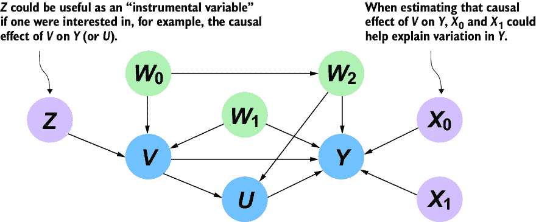

##### 图 4.17 中包含 *Z*，*X*[0] 和 *X*[1]，因为它们在分析 *U* 对 *Y* 的因果效应中发挥了有用的作用。它们的作用取决于条件独立性，并且测试它们确实能够扮演这些角色是很重要的。

我们将在第十一章中深入讨论工具变量。现在，只需说，为了 *Z* 成为工具变量，它必须与 *W*[0]、*W*[1] 和 *W*[2] 独立。因此，我们将特别注意测试这个假设。

## 4.4 条件独立性测试的注意事项

正如我提到的，条件独立性测试可能是测试你提出的因果 DAG 中隐含的条件独立性约束的最明显的方法。然而，使用统计测试来测试因果 DAG 存在一些注意事项。根据我的经验，这些问题可能会让分析师偏离他们回答因果问题的最终目标。在本节中，我将强调一些这些注意事项，并提出一些条件独立性测试的替代方案。主要启示是，统计测试是构建你的 DAG 的重要工具，但与任何统计方法一样，它不是万能的（这是可以的）。

### 4.4.1 统计测试总是存在一些错误的可能性

我提到，使用 d-separation 时，我们不应该“把地图当作地形”；d-separation 与条件独立性不是一回事。相反，如果你的模型是因果性的良好表示，d-separation *意味着*条件独立性。

同样，条件独立性并不等同于条件独立性的统计证据。DGP 的因果结构对联合概率分布施加了条件独立性约束。但你无法“看到”联合分布及其包含的独立性；你只能“看到”（并对从该分布中抽取的数据进行统计测试）。

就像预测、分类或任何其他统计模式识别过程一样，检测数据中这些独立性的方法可能会出错。你可能会得到假阴性，即一对变量实际上是条件独立的，但统计独立性测试却得出它们是相关的结论。你可能会得到假阳性，即统计独立性测试发现一对变量是条件独立的，而实际上它们并不是。

### 4.4.2 使用传统的 CI 测试来测试因果 DAG 是有缺陷的

我认为所提出的用于反驳的条件独立性检验是“有缺陷的”，因为它们违反了科学中统计假设检验的精神。假设你认为你在股票价格中发现了某种模式。你倾向于认为这种模式不仅仅是巧合，因为如果是巧合，你可以从中赚钱。为了严谨，不受到你的偏见的影响，你的备择假设应该是这种模式是真实的且可利用的，而零假设则是它只是随机噪声。频率派测试假设零假设是真实的，并给你一个*p*值，这个*p*值量化了随机噪声形成至少与你发现的模式一样强的模式的概率。这个测试迫使你拒绝这种模式是真实的，除非那个*p*值非常小。大多数主流的统计测试库都是为了这种用例设计的。

当你提出一个因果模型时，你也倾向于相信它是真实的。但因果模型会诱导条件独立性，根据定义，这些是*不存在*的模式。在这种情况下，零假设和备择假设应该互换；备择假设应该是你的模型是正确的，没有模式（并且数据中的任何模式证据只是虚假的相关性），而零假设应该是存在模式。可以实施这样的假设检验，但这在数学上并不简单，而且大多数主流的统计库，如 SciPy，不支持这种用例。

妥协是使用传统的测试，其中零假设将条件独立性更多地指定为一种理论上的严谨分析，而不是一种*启发式*——一种经验性的问题解决技术，它可能不是最优的，但足以达到足够好的解决方案。

### 4.4.3 *p*值随数据大小变化

传统条件独立性检验的结论取决于一个显著性阈值。如果*p*值低于这个阈值，你倾向于认为存在依赖性；如果它高于这个阈值，你倾向于认为存在条件独立性。阈值的选择有点随意；人们倾向于选择常见的值，如 0.1、0.05 或 0.01。

问题在于*p*值统计量随着数据大小的变化而变化。在其他条件相同的情况下，随着数据大小的增加，*p*值会降低。换句话说，数据越大，事情开始看起来越有依赖性。如果你有一个大型数据集，*p*值更有可能低于那个任意的阈值，数据看起来就像是在反驳你的 DAG 所暗示的条件独立性，即使这种条件独立性是真实的。

为了说明，4.3.2 节中关于 *E* ⊥ *T* | *O*, *R* 的检验有 30 个数据点，产生了 0.56 的 *p* 值。在我们的数据中，*E* ⊥ *T* | *O*, *R* 是真实情况（通过模拟获得），因此如果测试得出与 *E* ⊥ *T* | *O*, *R* 相反的结论，那是因为测试的统计问题，而不是数据的质量。下面的自助统计分析将展示随着数据集大小的增加，p 值的估计如何下降。

首先，我们将编写一个 `sample_p_value` 函数，用于为给定数据大小抽取一个 *p* 值。下一个函数 `estimate_p_value` 将重复进行此抽样并计算平均 *p* 值、90%置信区间以及 p 值低于显著性阈值的概率，即拒绝 *E* ⊥ *T* | *O*, *R* 正确结论的概率。

##### 列表 4.8 *E* **⊥** *T* | *O*, *R* 测试对样本大小的敏感性自助分析

```py
from numpy import mean, quantile

def sample_p_val(data_size, data, alpha):     #1
    bootstrap_data = data.sample(n=data_size, replace=True)    #1
    result = chi_square(    #1
        X="E", Y="T", Z=["O", "R"],    #1
        data=bootstrap_data,     #1
        boolean=False,     #1
        significance_level = alpha     #1
    )    #1
    p_val = result[1]    #1
    return p_val     #1

def estimate_p_val(data_size, data=fulldata, boot_size=1000, α=.05):    #2
    samples = [  #2
        sample_p_val(data_size, data=fulldata, alpha=α)  #2
        for _ in range(boot_size)     #2
    ]    #2
    positive_tests = [p_val > significance for p_val in samples]    #3
    prob_conclude = mean(positive_tests)    #4
    p_estimate = mean(samples)    #4
    quantile_05, quantile_95 = quantile(samples, [.05, .95])    #5
    lower_error = p_estimate - quantile_05     #5
    higher_error = quantile_95 - p_estimate    #5
    return p_estimate, lower_error, higher_error, prob_conclude

data_size = range(30, 1000, 20)     #6
result = list(zip(*[estimate_p_val(size) for size in data_size]))  #6
```

#1 给定一定大小的数据集，此函数从完整数据集中随机抽取相应数量的行。然后运行卡方独立性检验并返回 p 值。

#2 此函数执行一个“自助”过程，为给定数据大小抽取 1,000 个 *p* 值，并计算平均 *p* 值和 90% *p* 值置信区间。

#3 计算支持条件独立性的测试结论的概率。

#4 计算 p 值的平均值以获得自助平均值。

#5 计算第 5 和第 95 个百分位数以获得 90%的自助置信区间。

#6 运行自助分析。

最后，我们将可视化结果。我们将绘制数据大小与给定数据大小得到的 *p* 值的平均值和 90%置信区间的对比图。我们还将绘制在显著性水平为.05 的情况下，支持真实假设（*E* ⊥ *T* | *O*, *R*）的概率如何依赖于数据大小。

##### 列表 4.9 可视化条件独立性测试对数据大小的依赖关系

```py
import numpy as np
import matplotlib.pyplot as plt

p_vals, lower_bars, higher_bars, probs_conclude_indep = result    #1
plt.title('Data size vs. p-value (Ind. of E & T | O & R)')     #2
plt.xlabel("Number of examples in data")     #2
plt.ylabel("Expected p-value")   #2
error_bars = np.array([lower_bars, higher_bars])    #2
plt.errorbar(   #2
    data_size,    #2
    p_vals,     #2
    yerr=error_bars,    #2
    ecolor="grey",    #2
    elinewidth=.5   #2
)     #2
plt.hlines(significance, 0, 1000, linestyles="dashed")     #2
plt.show()
plt.title('Probability of favoring independence given data size')    #3
plt.xlabel("Number of examples in data")     #3
plt.ylabel("Probability of test favoring conditional independence")    #3
plt.plot(data_size, probs_conclude_indep)  #3
```

#1 运行自助分析以获取 p 值的分位数和得出独立性支持的结论的概率。

#2 绘制数据大小与 p 值的关系图。在较大的数据集大小下，预期的 p 值会低于阈值。

#3 绘制数据大小与在.05 显著性水平下支持独立性的概率的关系图。

图 4.18 显示了第一个图表。下降的曲线是不同数据大小下的预期 *p* 值，垂直线表示显示 90%自助置信区间的误差线。当我们得到 1,000 个数据点的数据集时，预期的 *p* 值低于阈值，这意味着测试倾向于得出 *E* ⊥ *T* | *O*, *R* 是错误的结论。

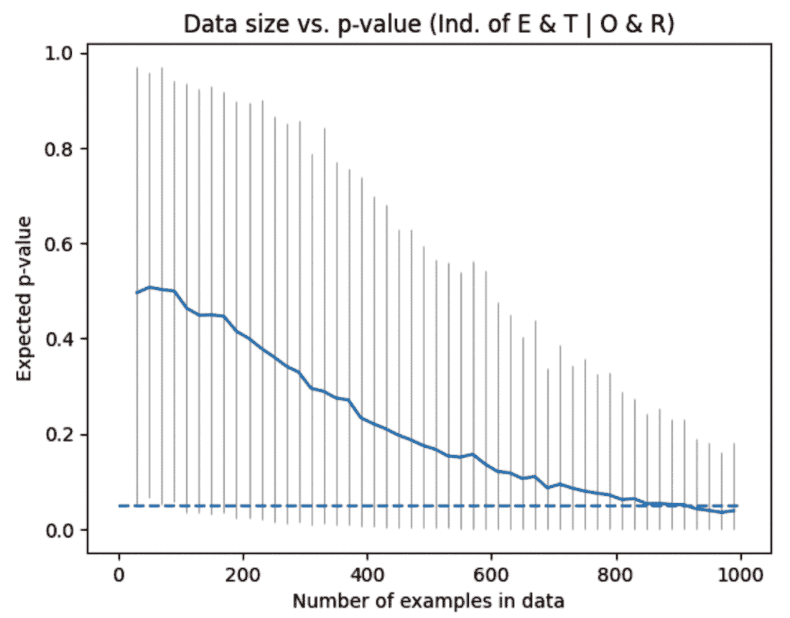

##### 图 4.18 条件独立性测试的样本量与预期 *p*-值的关系图（实线）。垂直线是误差线；它们表示 90%的 bootstrap 置信区间。水平虚线是 0.05 的显著性水平，在此之上我们倾向于接受条件独立性的零假设，在此之下我们拒绝它。随着样本量的增加，我们最终会越过这条线。因此，我们的反驳分析结果取决于数据规模。

注意到置信区间的下限在 1,000 之前就已经跨过了显著性阈值，这表明即使在更小的数据规模下，我们也有很好的机会拒绝 *E* ⊥ *T* | *O*, *R* 的真实结论。这在图 4.19 中更为明显，随着数据规模的增加，得出支持真实结论的概率降低。

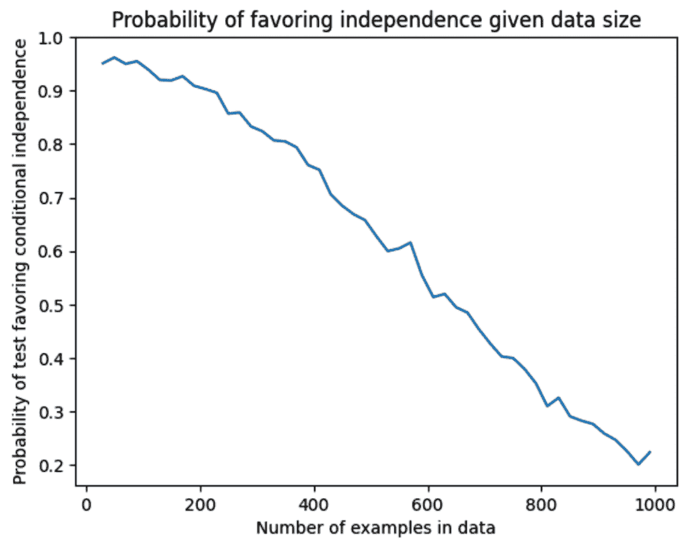

##### 图 4.19 随着数据规模的增加，得出支持这种（真实）条件独立性关系 *E* **⊥** *T* | *O*, *R* 的概率降低。

你可能会认为，随着数据规模的增加，算法能够检测到在较少数据下无法检测到的 *E* 和 *T* 之间的微妙依赖关系。并非如此，因为这种运输数据是模拟的，*E* ⊥ *T* | *O*, *R* 一定是真实的。这是一个数据更多反而导致我们拒绝独立性，因为更多数据导致更多虚假相关性的例子——这些模式实际上并不存在。

一个因果模型要么正确要么错误地描述了 DGP 中的因果关系。模型所暗示的条件独立性要么存在要么不存在。然而，如果这种条件独立性存在，当数据任意大时，测试仍然可以得出支持依赖性的结论。

再次强调，如果我们把条件独立性测试视为反驳我们的 DAG 的启发式方法，那么对数据规模的这种敏感性不应该让我们感到不安。无论数据规模和显著性阈值如何，当没有条件独立性时与当有条件独立性时，*p*-值之间的相对差异都将是很大且明显的。

### 4.4.4 多重比较问题

在统计假设检验中，你进行的测试越多，累积的测试错误就越多。当对因果有向图（DAG）中每个 d 分离进行测试时，情况也是如此。在统计学中，这个问题被称为*多重比较问题*。有解决多重比较问题的方法，例如使用*假发现率*。如果你熟悉这些方法，应用它们不会有害。如果你想了解更多，请参阅章节的笔记，在[`www.altdeep.ai/p/causalaibook`](https://www.altdeep.ai/p/causalaibook)中可以找到关于因果建模中假发现率的参考。但再次强调，我鼓励你将传统的条件独立性测试视为一种启发式方法，它有助于实现构建良好因果有向图（DAG）的最终目标。专注于这个目标，以及你将使用你的 DAG 进行的后续因果推断分析，并避免陷入统计测试的繁琐细节。

### 4.4.5 在机器学习设置中进行条件独立性测试的挑战

常用的条件独立性测试库通常仅限于具有相对简单相关模式的单变量。从 SciPy 导入的 pgmpy 的条件独立性测试也不例外。近年来，已经开发出针对更复杂分布的非参数测试，例如基于核的条件独立性测试。如果你对这类测试感兴趣，PyWhy 库中的 PyWhy-Stats 库是一个不错的起点。

然而，在机器学习中，变量通常具有多个维度，如向量、矩阵和张量。例如，因果有向图中的一个变量可能代表构成图像的像素矩阵。此外，这些变量之间的统计关联可能是非线性的。

一种解决方案是专注于预测。如果两件事物是独立的，它们就没有能力预测对方。假设我们有两个预测模型 *M*[1] 和 *M*[2]。*M*[1] 使用 *Z* 作为预测因子来预测 *Y*。*M*[2] 使用 *X* 和 *Z* 作为预测因子来预测 *Y*。预测因子可以有超过一维的维度。如果 *X* ⊥ *Y* | *Z*，那么任何 *X* 都没有比 *Z* 已经提供的更多关于 *Y* 的预测信息。因此，你可以通过比较 *M*[2] 和 *M*[1] 的模型预测准确度来测试 *X* ⊥ *Y* | *Z*。当模型表现相似时，我们就有了条件独立性的证据。请注意，你希望防止 *M*[2] 通过避免过度拟合来“作弊”，这又是虚假相关性可能悄悄进入我们分析的一种方式。

### 4.4.6 最后的想法

条件独立性测试是一个广泛且复杂的主题。你的目标是反驳你的因果 DAG，而不是创建一个条件独立性测试套件的柏拉图理想。我建议找到一个“足够好”的测试工作流程，然后专注于构建你的 DAG 并在下游因果推断中使用该 DAG。例如，如果我有一组连续和离散变量，那么我宁愿将我的连续变量离散化（例如，将出生时间以来的年龄转换为年龄组），然后使用普通的卡方检验，以保持事情顺利进行。

## 4.5 在潜在变量给定的情况下反驳因果 DAG

使用条件独立性测试 DAG 的方法存在潜在变量问题。如果我们的因果 DAG 中的一个变量是潜在的（在数据中未观察到），我们就无法运行涉及该变量的任何条件独立性测试。这是一个大问题；如果变量是 DGP 的重要部分，我们无法仅仅因为我们无法测试与该变量的独立性断言而将其排除在我们的 DAG 之外。

为了说明，考虑图 4.20 中的因果 DAG。此图表示吸烟行为 (*S*) 受香烟成本 (*C*) 以及遗传因素（用“DNA”中的 *D* 表示）的影响，这些因素使一个人更容易或更不容易上瘾于尼古丁。相同的遗传因素影响一个人患肺癌 (*L*) 的可能性。在这个模型中，吸烟对癌症的影响是通过肺部焦油积累 (*T*) 来*中介*的。

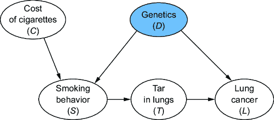

##### 图 4.20 表示吸烟对癌症影响的因果 DAG。遗传变量 (*D*) 为灰色，因为它在数据中未观察到，因此我们无法运行涉及 *D* 的条件独立性测试。然而，我们可以测试其他类型的约束。

如果我们有观察所有这些变量的数据，我们可以运行以下 d-separations 的条件独立性测试：(*C* ⊥*[G]* *T* | *S*), (*C* ⊥*[G]* *L* | *D*, *T*), (*C* ⊥*[G]* *L* | *D*, *S*), (*C* ⊥*[G]* *D*), (*S* ⊥*[G]* *L* | *D*, *T*), 和 (*T* ⊥*[G]* *D* | *S*)。但是，假设我们没有关于遗传变量 (*D*) 的数据。例如，可能需要一种不切实际昂贵且侵入性的实验室测试来测量这种遗传特征。在我们列出的所有 d-separations 中，唯一不涉及 *D* 的是 (*C* ⊥*[G]* *T* | *S*）。我们从一个可行的条件独立性测试减少到只有一个，以测试我们的 DAG。

通常，一个提出的因果模型可以对可由数据测试的联合概率分布产生各种影响。由图结构隐含的条件独立性是一种可测试的影响。但模型的一些影响在潜在变量的情况下是可测试的。在本节中，我们将探讨如何测试一个具有这些潜在变量相关约束的 DAG。

### 4.5.1 一个与潜在变量一起工作的可测试含义的例子

因果马尔可夫假设表明，d-分离意味着数据中的条件独立性。到目前为止，我们已经探讨了变量之间的直接条件独立性，但当某些变量是潜在变量时，图可以暗示观察变量函数之间的条件独立性。这些含义在文献中被称为“Verma 约束”，尽管我将使用更口语化的“功能约束”。

为了说明，图 4.20 中的 DAG 具有以下功能约束（现在不用担心它是如何导出的）：

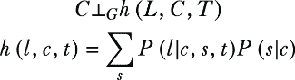

正如 d-分离（*C* ⊥*[G]* *T* | *S*）意味着条件独立性陈述（*C* ⊥ *T* | *S*）应该对观测联合分布成立一样，功能约束（*C* ⊥*[G]* *h*(*L*, *C*, *T*））意味着在观测联合分布中，*C*与变量*L*，*C*和*T*的某个函数*h*(.)是独立的。这两个含义都是可测试的，因为它们不涉及*D*。我们现在有两个测试可以运行，而不是一个。

*h*(.)有两个组成部分：

+   *P*(*l*|*c*, *s*, *t*)是一个函数，它返回*L* = *l*（假设*l*对于“有肺癌”是“真”，对于“无肺癌”是“假”），给定*C* = *c*，*S* = *s*，和*T* = *t*的概率。

+   *P*(*s*|*c*)是一个函数，它返回*S* = *s*（假设*s*根据吸烟者吸烟的强度是“低”、“中”或“高”）的概率，给定香烟的成本*C* = *c*。

*h*(.)随后对所有*S*的值进行求和。该函数的输出是一个随机变量，根据 DAG，它应该与*C*独立。*h*(*l*, *c*, *t*)是*P*(*l*|*c*, *s*, *t*)和*P*(*s*|*c*)的函数，并且从概率函数的角度考虑独立性可能感觉有些奇怪。记住，独立性关系本身只是联合概率分布的函数。

接下来，我们将从数据中拟合*P*(*l*|*c*, *s*, *t*)和*P*(*s*|*c*)的模型，并测试这个独立性关系。但首先，我们将查看允许我们从有向无环图（DAG）中枚举像(*C* ⊥[*G*] *h*(*L*, *C*, *T*）这样的功能约束的库，就像我们可以使用 pgmpy 的`get_independencies`枚举 d-分离一样。

### 4.5.2 测试功能约束的库和视角

我们如何推导出像 *C* ⊥[*G*] *h*(*L*, *C*, *T*) 这样的功能约束？就像 d-separation 一样，我们可以从图中算法性地推导出这种约束。一个实现是在 causaleffect R 库中的 `verma.constraints` 函数。这个函数接受标记为潜变量的 DAG，并返回一组可测试的约束，就像 pgmpy 的 `get_independencies` 一样。对于 Python，Y0 库（发音为“why-not”）有一个 `r_get_verma_constraints` 函数（截至版本 0.2.10），这是一个包装器，调用 causaleffect 的 R 代码。这里我将省略 Python 代码，因为它需要安装 R，但请访问 www.altdeep.ai/causalAIbook 获取库和参考链接。

##### 功能约束的数学直觉和一些建议

我们本节的目标只是表明，即使在存在潜在变量的情况下，也有测试你的因果模型的方法。功能约束是其中一种方法，但我们不想过分强调这种特定的可测试含义。更重要的是避免只限制 ourselves 只到数据中完全观察到的 DAG 的危险心态。

话虽如此，对于好奇的人来说，我将提供一个非常高级的数学直觉。回想一下，局部马尔可夫性质表明*一个节点在给定其父节点的情况下对其非后代是条件独立的*。从那里，我们推导出称为 d-separation 的图形标准，使我们能够找到适用此性质的一组节点，我们编写一个使用这些标准的图算法来枚举 d-separation，并使用该算法来枚举我们可以运行的某些条件独立性测试。

对于给定的节点 *X*，让我们说“孤儿堂兄弟”是指与 *X* 共享潜在祖先的非后代。用非正式的话说，这是一个局部马尔可夫性质的潜在变量类似物：*一个节点在给定其最近的观察祖先、其孤儿堂兄弟以及这些堂兄弟的其他最近的观察祖先的情况下对其非后代是条件独立的*。就像 d-separation 一样，我们可以推导出图形标准来识别适用此情况的个别案例。

回想一下，我们可以将联合概率分布分解，使得每个因子都是给定其父节点的节点结果的条件概率。当我们开始对潜在变量进行边缘化分解并执行后续的概率数学运算时，功能约束中的概率函数（如 *h*(*l*,*c*,*t*) 中的 *P*(*l*|*c*, *s*, *t*) 和 *P*(*s*|*c*) 项）就进入了画面。

如果你想深入了解，请参阅 [`www.altdeep.ai/p/causalaibook`](https://www.altdeep.ai/p/causalaibook) 中列出的参考文献。但请注意，前一部分的警告也适用于这里——*我们的目标是证伪我们的 DAG 并继续进行我们的目标因果推断**。在追求这个目标的过程中，要小心不要陷入统计、数学和理论上的兔子洞。

现在我们有一个新的可测试的蕴涵，形式为 *C* ⊥*[G]* *h*(*L*, *C*, *T*)，让我们来测试它。

### 4.5.3 测试功能约束

要测试 (*C* ⊥*[G]* *h*(*L*, *C*, *T*))，我们必须计算 *h*(*l*, *c*, *t*) = *∑*[S]*P*(*l*|*c*, *s*, *t*)*P*(*s*|*c*) 对于我们数据中的每个项目。这需要我们建模 *P*(*l*| *c*, *s*, *t*) 和 *P*(*s*|*c*)。我们可以选择几种建模方法，但我们将使用朴素贝叶斯分类器来举例，这样我们就可以继续使用 pgmpy 和 pandas 库。我们将采取以下步骤：

1.  将成本 (*C*) 离散化，以便我们可以将其视为一个离散变量。

1.  使用 pgmpy 将朴素贝叶斯分类器拟合到 *P*(*l*| *c*, *s*, *t*) 和 *P*(*s*|*c*)。

1.  编写一个函数，该函数接受 *L*、*C*、*T* 的值并计算 *h*(*L*, *C*, *T*)。

1.  将该函数应用于数据中的每一行，以获得新的 *h*(*L*, *C*, *T*) 值列。

1.  在该列和 *C* 列之间运行独立性测试。

##### 设置您的环境

以下代码使用 pgmpy 版本 0.1.19，因为截至编写时，版本 0.1.24 及之前的版本存在一个已报告的漏洞，可能会影响一些朴素贝叶斯分类器推理代码。如果您使用其他方法计算 *P*(*l*|*c*, *s*, *t*) 和 *P*(*s*|*c*)，则无需执行此操作。为了稳定性，我们还将使用 pandas 版本 1.4.3，这是 pgmpy 0.1.19 当前的版本。请注意，如果您已安装 pgmpy 和 pandas 的后续版本，您可能需要在安装这些版本之前卸载它们，或者您可以启动一个新的 Python 环境。有关带有代码和设置工作环境说明的 Jupyter 笔记本链接，请访问 [`www.altdeep.ai/p/causalaibook`](https://www.altdeep.ai/p/causalaibook)。

首先，我们将导入数据。我们还将离散化香烟的成本 (*C*)，使其更适合使用 pgmpy 进行建模。

##### 列表 4.10 导入和格式化香烟和癌症数据

```py
from functools import partial
import numpy as np
import pandas as pd

data_url = "https://raw.githubusercontent.com/altdeep/causalML/master
[CA] /datasets/cigs_and_cancer.csv"
data = pd.read_csv(data_url)     #1
cost_lower = np.quantile(data["C"], 1/3)    #2
cost_upper = np.quantile(data["C"], 2/3)  #2
def discretize_three(val, lower, upper):  #2
    if val < lower:   #2
        return "Low"    #2
    if val < upper:    #2
        return "Med"   #2
    return "High"    #2
    #2
data_disc = data.assign(    #2
    C = lambda df: df['C'].map(    #2
            partial(   #2
                discretize_three,   #2
                lower=cost_lower,   #2
                upper=cost_upper    #2
            )   #2
        )    #2
)    #2
data_disc = data_disc.assign(     #3
    L = lambda df: df['L'].map(str),    #3
)    #3
print(data_disc)
```

#1 将 CSV 文件加载到 pandas ΔataFrame 中。

#2 将成本 (C) 离散化为三个级别的离散变量，以方便进行条件独立性测试。

#3 将成本 (C) 离散化为三个级别的离散变量，以方便进行条件独立性测试。

#4 将肺癌 (L) 从布尔值转换为字符串，以便条件独立性测试将其视为一个离散变量。

`print(data_disc)` 行打印出 `data_disc` DataFrame 的元素。

```py
       C     S     T      L
0   High   Med   Low   True
1    Med  High  High  False
2    Med  High  High   True
3    Med  High  High   True
4    Med  High  High   True
.. ... ... ...  ...
95   Low  High  High   True
96  High  High  High  False
97   Low   Low   Low  False
98  High   Low   Low  False
99   Low  High  High   True

[100 rows x 4 columns]
```

现在我们需要建模 *P*(*l*| *c*, *s*, *t*) 和 *P*(*s*|*c*)。我们将选择朴素贝叶斯分类器，这是一个“天真”地假设在 *P*(*l*| *c*, *s*, *t*) 的情况下，成本 (*C*)、吸烟 (*S*) 和焦油 (*T*) 在肺癌状态 (*L*) 给定的情况下是条件独立的概率模型。根据我们的因果图，这显然是不正确的，但如果我们只想找到一种计算给定 *C*、*S* 和 *T* 的 *L* 的概率值的好方法，那就没关系了。朴素贝叶斯分类器可以很好地做到这一点。

##### 列表 4.11 适配 *P*(*l*| *c*, *s*, *t*) 的朴素贝叶斯分类器

```py
from pgmpy.inference import VariableElimination
from pgmpy.models import NaiveBayes

model_L_given_CST = NaiveBayes()    #1
model_L_given_CST.fit(data_disc, 'L')   #1
infer_L_given_CST = VariableElimination(model_L_given_CST)   #1
#1
def p_L_given_CST(L_val, C_val, S_val, T_val):#1
    result_out = infer_L_given_CST.query(   #1
        variables=["L"],    #1
        evidence={'C': C_val, 'S': S_val, 'T': T_val},    #1
        show_progress=False    #1
    )    #1
    var_outcomes = result_out.state_names["L"]    #1
    var_values = result_out.values    #1
    prob = dict(zip(var_outcomes, var_values))    #1
    return prob[L_val]  #1
```

#1 我们将在 pgmpy 中使用朴素贝叶斯分类器来计算给定 C, S, 和 T 的值的 L 的概率值。在这种情况下，我们将使用变量消除。

#2 我们将在 pgmpy 中使用朴素贝叶斯分类器来计算给定 C, S, 和 T 的值的 L 的概率值。在这种情况下，我们将使用变量消除。

现在，我们将对 *P*(*s*|*c*) 执行相同的操作。

##### 列表 4.12 适配 *P*(*s*|*c*) 的朴素贝叶斯分类器

```py
model_S_given_C = NaiveBayes()    
model_S_given_C.fit(data_disc, 'S')    
infer_S_given_C = VariableElimination(model_S_given_C)    
def p_S_given_C(S_val, C_val):    
    result_out = infer_S_given_C.query(    
        variables=['S'],    
        evidence={'C': C_val},    
        show_progress=False    
    )    
    var_names = result_out.state_names["S"]    
    var_values = result_out.values    
    prob = dict(zip(var_names, var_values))    
    return prob[S_val]
```

现在，我们将这些值组合起来以实现 *h*(*L*, *T*, *C*) 函数。以下代码使用 `for` 循环对 *S* 进行求和。

##### 列表 4.13 合并模型以创建 *h*(*L*, *T*, *C*)

```py
def h_function(L, C, T):    #1
    summ = 0     #2
    for s in ["Low", "Med", "High"]:   #2
        summ += p_L_given_CST(L, C, s, T) * p_S_given_C(s, C)    #2
    return summ
```

#1 实现 h(L, C, T)。

#2 实现对 P(l|c,s,t) * P(s|c) 在 s 上的求和。

现在，我们将计算集合 {*C*, *T*, *L*} 的全部结果。给定这些结果，我们可以使用前面的函数计算每个组合的 *h*(*L*, *C*, *T*)。

##### 列表 4.14 计算 *C*, *T*, 和 *L* 的结果组合

```py
ctl_outcomes = pd.DataFrame(
    [     #1
        (C, T, L)     #1
        for C in ["Low", "Med", "High"]    #1
        for T in ["Low", "High"]    #1
        for L in ["False", "True"]     #1
    ],    #1
    columns = ['C', 'T', 'L']     #1
)
```

#1 计算 L, C, 和 T 的每个可能结果组合的这些值。首先，我们使用列表推导式创建一个包含所有组合的 DataFrame。

打印这些值显示了 *C*, *T*, 和 *L* 的所有结果组合。

```py
       C     T      L
0    Low   Low  False
1    Low   Low   True
2    Low  High  False
3    Low  High   True
4    Med   Low  False
5    Med   Low   True
6    Med  High  False
7    Med  High   True
8   High   Low  False
9   High   Low   True
10  High  High  False
11  High  High   True
```

对于这些结果中的每一个，我们将应用 *h*(*L*, *C*, *T*)。

##### 列表 4.15 为 C, T, L 的每个结果计算 *h*(*L*, *C*, *T*)

```py
h_dist = ctl_outcomes.assign(    
    h_func = ctl_outcomes.apply(    
        lambda row: h_function(    
            row['L'], row['C'], row['T']), axis = 1    
    )    
)    
print(h_dist)
```

现在，对于 *C*, *T*, 和 *L* 的每个联合结果，我们都有一个 *h*(*L*, *C*, *T*) 的值。

```py
       C     T      L    h_func
0    Low   Low  False  0.392395
1    Low   Low   True  0.607605
2    Low  High  False  0.255435
3    Low  High   True  0.744565
4    Med   Low  False  0.522868
5    Med   Low   True  0.477132
6    Med  High  False  0.369767
7    Med  High   True  0.630233
8   High   Low  False  0.495525
9   High   Low   True  0.504475
10  High  High  False  0.344616
11  High  High   True  0.655384
```

最后，我们将这个 `h_func` 分布合并到数据集中，使得对于我们的数据中的每一行，我们都能得到一个 *h*(*L*, *C*, *T*) 的值。

##### 列表 4.16 合并以获取数据集中每行的 *h*(*L*, *C*, *T*) 值

```py
df_mod = data_disc.merge(h_dist, on=['C', 'T', 'L'], how='left')    #1
print(df_mod)
```

#1 添加一个表示变量 h(L, C, T) 的列。

我们通过 `print(df_mod)` 看到结果：

```py
       C     S     T      L    h_func
0   High   Med   Low   True  0.504475
1    Med  High  High  False  0.369767
2    Med  High  High   True  0.630233
3    Med  High  High   True  0.630233
4    Med  High  High   True  0.630233
..   ...   ...   ...    ...       ...
95   Low  High  High   True  0.744565
96  High  High  High  False  0.344616
97   Low   Low   Low  False  0.392395
98  High   Low   Low  False  0.495525
99   Low  High  High   True  0.744565

[100 rows x 5 columns]
```

功能约束表明 *C* 和 *h*(*L*, *C*, *T*) 应该是独立的，因此我们可以查看 `h_func` 列和 *C* 列之间的独立性证据。由于我们对 *C* 进行了离散化，我们计算 *h*(*L*, *C*, *T*) 的结果在技术上也是离散的，因此我们可以使用卡方检验。但是，从理论上讲，*h*(*L*, *C*, *T*) 是连续的，所以我们将使用箱线图来可视化两个变量之间的依赖性。功能约束表明 *C* 和 *h*(*L*, *C*, *T*) 应该是独立的，因此我们将使用一个箱线图，该图将 *h*(*L*, *C*, *T*) 的值与 *C* 的值进行对比，以直观地检查 *C* 和 *h*(*L*, *C*, *T*) 是否看起来是独立的。

##### 列表 4.17 可视化 *C* 和 *h*(*L*, *C*, *T*) 之间的独立性

```py
df_mod.boxplot("h_func", "C")
```

这生成了图 4.21。


##### 图 4.21 在 *x*-轴上显示成本 (*C*) 的箱线图可视化，以及在 *y*-轴上显示函数 *h*(*L*, *C*, *T*)（标记为“乘积和”）。对于每个 *C* 值的乘积和分布的重叠支持了功能约束断言，即这两个量是独立的。

图 4.21 中的*x*-轴表示不同的成本水平（低、中、高）。*y*-轴表示总和的值。图 4.21 是一个箱线图；每个箱子代表给定*C*值的总和乘积的分布。箱子的顶部和底部是分布的四分位数，箱子中间的线是中位数，较短的横向线是最大值和最小值（对于低成本，中位数、上四分位数和最大值非常接近）。总的来说，看起来总和乘积的分布在不同成本水平上变化不大；这正是独立性应有的样子。

我们还可以使用方差分析（ANOVA）方法推导出*p*-值，这次使用 F 检验而不是卡方检验。以下代码使用 statsmodels 库运行 ANOVA 测试。

注意： “PR(>F)”表示对于一个给定变量（在我们的例子中是*C*）看到 F 统计量的概率至少与从数据中计算出的 F 统计量一样大，假设该变量与`sum_product`（即*p*-值）独立。

##### 列表 4.18 使用 ANOVA 评估独立性

```py
from statsmodels.formula.api import ols
import statsmodels.api as sm

model = ols('h_func ~ C', data=df_mod).fit()    #1
aov_table = sm.stats.anova_lm(model, typ=2)   #1
print(aov_table["PR(>F)"]["C"])   #1

model = ols('h_func ~ T', data=df_mod).fit()    #2
aov_table = sm.stats.anova_lm(model, typ=2)    #2
print(aov_table["PR(>F)"]["T"])    #2

model = ols('h_func ~ L', data=df_mod).fit()     #3
aov_table = sm.stats.anova_lm(model, typ=2)  #3
print(aov_table["PR(>F)"]["L"])   #3
```

#1 使用 statmodels 库进行 ANOVA 的食谱

#2 返回高*p*-值，支持（未能证伪）h(L, C, T)和 C 独立的断言

#3 仅作为一个合理性检查，我们运行相同的测试来查看 h(L, C, T)是否看起来独立于 T 和 L。与*C*不同，T 和 L 不应该独立于 h(L, C, T)，正如预期的那样，这些测试返回的*p*-值要小得多，表明存在依赖性。

我们使用`print(aov_table["PR(>F)"]["C"])`打印出*C*的*p*-值，得到约 0.1876。这个*p*-值表明我们不能拒绝独立性的零假设，所以看起来数据支持约束。我们也对*T*和*L*进行了相同的测试，正如预期的那样，这些值要小得多，表明存在依赖性。它们都低于常见的 0.1 阈值，在这个阈值下，标准假设检验将拒绝*h*(*L*, *C*, *T*)独立于*T*和*L*的假设。

### 4.5.4 关于可测试含义的最终思考

一个有向无环图（DAG）的 d 分离和功能约束意味着，如果 DAG 是 DGP 的良好因果模型，那么在联合概率分布中应该存在某些条件独立性。我们可以通过运行条件独立性统计测试来证伪 DAG。

更普遍地说，因果模型可以对潜在的联合概率分布有不同的数学含义，其中一些可以进行测试。例如，如果你的模型假设原因和效果之间的关系是线性的，你可以在数据中寻找非线性证据（我们将在第六章中了解更多关于功能因果假设的内容）。当然，你也可以通过实验来证伪你的模型含义（我们将在第七章中看到）。

我们在因果建模方面越擅长，我们在测试和证伪我们的因果模型方面就越擅长。但请记住，不要让测试中的统计和数学细微差别分散你的注意力，你的目标是获得一个足够好的模型，并继续进行你的目标因果推断。

## 4.6 因果发现（及其风险）简介

在之前的流程中，我们提出了一个因果有向图（DAG），考虑了 DAG 对观测联合分布的潜在影响（如条件独立性），然后使用数据对这些影响进行测试。如果我们反过来操作会怎样？如果我们分析数据以寻找因果约束的统计证据，然后构建一个与这些约束一致的因果 DAG 呢？

这描述了*因果发现*的任务：从数据中统计学习因果 DAG。在本节中，我将提供因果发现的简要介绍，并涵盖你需要知道的内容，以便使用这类算法。

##### 警惕因果发现的虚假承诺

因果发现算法通常被宣传为神奇的工具，可以将任何数据集（无论质量如何有限）转换为因果 DAG。这种虚假承诺阻碍了建模 DGP（而不是数据）和证伪候选模型的思维模式。这也是为什么在实践中很难找到一致的发现用例。本节将采用一种方法，即阐述发现算法的工作原理和失败的地方，而不是列出一系列算法。我将通过关于如何有效地将这些算法融入你的分析工作流程的建议来结束。

我们将从支撑发现算法的关键思想概述开始。

### 4.6.1 因果发现方法

因果发现有几种方法。一些算法（通常称为*基于约束*算法）做的是我刚才建议的事情——从数据中条件独立性的证据中逆向工程一个图。其他算法（通常称为*基于评分*算法）将因果 DAG 转化为数据的解释模型，并找到具有高拟合度评分的因果 DAG。还有一种方法是假设因果 DAG 中父节点和子节点之间功能关系的额外约束，正如我们在第六章中将要看到的结构因果模型。

可能的 DAG 空间是一个离散空间。一类方法试图将这个空间软化成一个连续空间，并使用连续优化技术。深度学习自动微分库的流行加速了这一趋势。

由于 DAG 的空间可能相当大，因此引入先验知识以约束该空间的大小是有用的。这通常表现为指定必须存在的边或必须不存在的边，或者使用图结构的贝叶斯先验。

一些因果发现算法可以处理实验数据。这需要告诉算法哪些变量是由实验者设置的（或者从第七章开始，我们将说这些变量是“干预”的）。

要开始使用 Python 进行因果发现，我推荐使用 PyWhy 库进行因果发现，如 causal-learn 和 DoDiscover。

### 4.6.2 因果发现、因果忠实性和潜在变量假设

因果马尔可夫性质假设如果我们的 DAG 是真实的，那么该 DAG 中的 d 分离意味着变量联合概率中的条件独立性陈述：

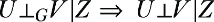

*因果忠实性*（或简称“忠实性”）是相反的陈述——联合分布中的条件独立性意味着图中 d 分离：


许多因果发现算法依赖于忠实性成立的假设。这可能并不成立。

#### 发现与忠实性违反

在 4.4 节中，我们使用了马尔可夫性质来测试一个候选 DAG；给定一个对于 DAG 成立的 d 分离语句，我们运行一个统计测试来检查该 d 分离所隐含的条件独立性的经验证据。

想象一下，你想要通过逆向构建你的图。你在数据中检测到条件独立性的实例证据，然后你将候选 DAG 的空间限制为与隐含的 d 分离一致的 DAG。你这样迭代进行，直到你缩小了候选 DAG 的空间。一些发现算法执行某种版本的此过程，并且那些执行此过程的算法依赖于忠实性假设。

注意：将条件独立性的证据与 d 分离相匹配的算法通常被称为“基于约束”的发现算法。一个著名的例子是 PC 算法。基于约束的算法找到与因果性经验证据一致的 DAG。

麻烦来自于“忠实性违反”——在联合概率分布中条件独立性不映射到真实 DAG 中的 d 分离语句的特殊情况。一个简单的忠实性违反的例子是一个可以如下分解的三变量系统：*P*(*x*, *y*, *z*) = *P*(*x*, *y*)*P*(*y*, *z*)*P*(*x*, *z*)。也就是说，对于任何一个变量的任何值，其他两个变量之间的关联总是相同的。你可以在数据中检测到这种奇特的独立性形式，但你不能在 DAG 中使用 d 分离来表示它。（如果你不相信我，可以试试。）

研究人员担心这些特殊情况，因为这意味着一个依赖于忠实性的发现算法并不能推广到所有分布。当你使用这些算法时，你是在假设忠实性在你所面临的问题域中成立，而这并不是你可以测试的事情。然而，因果忠实性的违反通常并不是实际因果发现中最大的头痛来源。这个荣誉留给了潜在变量。

#### 潜在变量的挑战

更大的问题是，大多数因果发现算法再次面临潜在变量问题。为了说明这一点，假设真实的因果图是图 4.22 中的图。


##### 图 4.22 假设这是真实的因果图。在这里，*B*、*C*和*D*在给定*A*的条件下是条件独立的。

在这个图中，变量*B*、*C*和*D*在给定*A*的条件下相互独立。现在假设数据中没有观察到*A*。以*A*作为潜在变量，发现算法无法运行*B* ⊥ *C* | *A*这样的测试。算法会检测到*B*、*C*和*D*之间的依赖性，但不会在给定*A*的情况下找到三个变量之间的条件独立性，并且它可能会返回如图 4.23 所示的图，反映了这些结果。

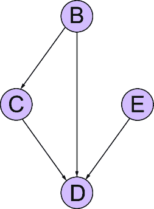

##### 图 4.23 如果*A*是潜在的，那么基于*A*的条件独立性测试无法运行。算法会检测到*B*、*C*和*D*之间的依赖性，但不会发现给定*A*的条件独立性，并且它可能会返回如图所示的图。

解决这个问题的方法是在发现算法中提供关于潜在变量结构的强领域特定假设。一些通用的发现算法为潜在变量假设提供了一些适应（例如，因果-学习库有几个）。但这很少见，因为很难在跨领域泛化的同时让用户容易地指定领域特定假设。

### 4.6.3 等价类和 PDAGs

假设我们的算法能够从数据中正确地恢复所有真实的条件独立性陈述，并将它们映射回一个真实的 d 分离陈述集（因果忠实性成立）。我们现在面临的问题是，多个因果图可能具有相同的 d 分离陈述集。这个候选因果图的集合被称为*马尔可夫等价类*。真实的因果图将是这个可能很大的集合中的一个成员。

例如，假设图 4.24 左边的图是真实因果图。图右边的图在*A*和*T*之间的边与正确的图不同。这两个图有相同的 d 分离集。实际上，我们还可以改变{*L*，*S*}和{*B*，*S*}之间的边的方向，仍然处于相同的等价类，除了引入一个碰撞器{*L* → *S* ← *B*}，因为新的碰撞器会改变 d 分离集。


##### 图 4.24 假设左边的 DAG 是真实 DAG，右边的（错误）DAG 与马尔可夫等价类相同。中间的 PDAG 代表等价类，其中无向边缘表示成员对方向存在分歧的边缘。

一些发现算法会返回部分定向无环图（PDAG），如图 4.24 中心的 DAG 所示。在 PDAG 中，无向边缘对应于马尔可夫等价类成员之间对边缘方向存在分歧的边缘。这很好，因为我们得到了等价类的图形表示，并且算法可以潜在地在 PDAG 的空间而不是更大的 DAG 空间中搜索。

##### 对撞机和发现

对撞机在因果发现中占有重要地位，因为它们使我们能够仅根据统计依赖的证据来定向 DAG 中的边缘。假设我们正在使用数据尝试构建图 4.24 中的真实 DAG。我们在数据中发现了*A*和*T*之间边缘的依赖性证据。马尔可夫等价性的想法意味着证据不足以确定该边缘的方向。通常，数据中的依赖性和独立性证据可以暗示存在边缘，但无法确定其方向。

对撞机是个例外。仅从独立性和依赖性的证据中，我们可以检测到像{*T* → *E* ← *L*}这样的对撞机；如果数据表明*T*和*L*是独立的，但在条件化*E*时变得依赖，那么你就有了具有定向边缘{*T* → *E* ← *L*}的对撞机的证据。

对撞机还可以强制对撞机外的边缘进行定向。例如，考虑图 4.23 中真实 DAG 中*E*和*X*之间的边缘。我们可能从以下数据中的证据推断出该边缘的存在：

+   *E*和*X*是相关的。

+   *T*和*X*是相关的。

+   在给定*E*的情况下，*T*和*X*是独立的。

*E*和*X*之间的边缘与该证据一致，但我们应该选择*E* → *X*还是*E* ← *X*？在这里，对撞机{*T* → *E* ← *L*}有帮助；它已经定向了边缘*T* → *E*，因此添加*E* ← *X*将诱导另一个对撞机{*T* → *E* ← *X*}。这个对撞机会表明*T*和*X*是独立的，但在条件化*E*时变得依赖，这违反了观察到的第二和第三项证据。因此，我们通过排除法得出结论，该边缘的方向是*E* → *X*。

一些因果发现算法本质上算法化了这种逻辑。但记住，当潜在变量在观测变量之间诱导依赖时，这种逻辑就会失效。

话虽如此，PDAG 和马尔可夫等价类仅捕获编码相同一组条件独立性约束的 DAG 之间的等价性。如果你想找到所有满足额外约束假设的图，例如给定某个先验概率具有相同后验概率的所有图，那么 PDAG 可能就不够了。

如果我们只依赖于条件独立性，数据无法区分马尔可夫等价类中的成员，因为拥有相同的 d 分离集合意味着在数据中拥有相同的条件独立性证据。这是一个*缺乏因果识别*的例子——当我们的数据和一组因果假设不足以区分因果问题的可能答案时（在这种情况下，“正确的因果 DAG 是什么？”）。我们将在第十章深入探讨因果识别。

### 4.6.4 如何思考因果发现

在 4.3 节中，我论证了使用现成的假设测试库来测试因果诱导的约束，如条件独立性，应被视为一种反驳你的因果 DAG 的启发式方法，而不是验证 DAG 的严格统计程序。同样，我论证了对于实际用户来说，现成的因果发现算法应被视为在人为驱动的因果 DAG 构建过程中进行探索性数据分析的工具。你能够将这些算法输入更多类型的领域知识和潜在变量的知识，就越好。但即便如此，它们仍会产生明显的错误。就像假设测试案例一样，避免陷入试图“修复”发现算法以避免这些错误的兔子洞。将因果发现作为构建一个好的因果 DAG 和进行后续因果推断分析更广泛项目中的一个不完美的工具。

## 摘要

+   因果建模在联合概率分布上引入了条件独立性约束。D 分离提供了条件独立性约束的图形表示。

+   建立对 d 分离的直觉对于推理因果效应推断和其他查询非常重要。

+   碰撞器可能会使 d 分离变得复杂，但你可以通过在 NetworkX 和 pgmpy 中使用 d 分离函数来建立直觉。

+   使用传统的条件独立性测试库来测试 d 分离有其挑战。这些测试对样本大小敏感，在许多机器学习环境中表现不佳，并且它们的假设不匹配。

+   由于这些挑战，最好将使用现成的条件独立性测试库来尝试否定 DAG 视为更多是一种启发式方法。专注于构建一个好的（即难以反驳的）因果 DAG 和继续进行下游因果推断任务的整体目标。避免在统计假设检验中过分关注理论严谨性。

+   当存在潜在变量时，因果 DAG 对于观察变量函数的测试性含义仍然可能存在。

+   因果发现是指使用统计算法从数据中恢复因果 DAG。

+   因果忠实性属性假设在联合概率分布中条件独立性映射到在真实因果 DAG 中保持的真正的 d 分离集合。

+   DAGs 的马尔可夫等价类是一组具有相同 d 分离集的 DAGs。假设你拥有真实的 d 分离集，那么真实的因果 DAG 通常与其他（错误的）DAGs 共享这个集合。

+   因果发现特别容易受到潜在变量的影响。

+   你能通过先验假设（如潜在结构和哪些边不可能存在以及哪些必须存在）来约束因果推理越多，效果越好。

+   因果发现算法在构建因果 DAG 的过程中是很有用的探索性数据分析工具，但它们并不是该过程的可靠替代品。再次强调，关注构建一个好的因果 DAG 和进行下游因果推理分析的整体目标。避免试图“修复”因果发现算法，以免在你的领域产生明显的错误。
