# 第六章：结构因果模型

### 本章涵盖

+   将一般因果图形模型转换为结构因果模型

+   掌握 SCMs 的关键要素

+   为基于规则的系统实现 SCMs

+   使用加性模型从头开始构建 SCM

+   将 SCMs 与深度学习相结合

在本章中，我将介绍一种基本的因果建模方法，称为结构因果模型（SCM）。SCM 是因果生成模型的一个特例，它可以编码超出我们用 DAG 所能捕捉的因果假设。如果一个 DAG 告诉我们“什么”导致“什么”，那么 SCM 就会告诉我们“什么”导致“什么”以及“原因”如何影响“效果”。我们可以利用这额外的“如何”信息来做出更好的因果推断。

在本章中，我们将通过代码示例来关注定义和构建 SCMs（结构因果模型）的直觉。在后续章节中，我们将看到一些因果推断的例子，这些推断我们仅使用 DAG（有向无环图）是无法做出的，但我们可以通过 SCM 来完成。

## 6.1 从一般因果图形模型到 SCM

在我们迄今为止构建的因果生成模型中，我们对每个节点定义了一个条件概率分布，该分布是在给定节点的直接父节点的情况下给出的，我们称之为“因果马尔可夫核”。然后我们使用数据来“拟合”这些核。具体来说，我们做出了一个实际的选择，即使用某些参数函数类来拟合这些核。例如，我们使用 pgmpy 的`TabularCPD`来拟合概率表的参数，因为它让我们能够使用 pgmpy 方便的 d 分离和推理工具。我们还使用 VAE 架构中的神经解码器，因为它解决了对高维变量（如图像）建模的问题。这些实际原因与因果性无关；我们的因果假设仅停留在因果 DAG 上。

现在，有了 SCMs，我们将使用参数函数类来捕捉超出因果 DAG 的额外因果假设。正如我所说，SCM 让我们能够表示关于“如何”原因影响其效果的额外假设；例如，原因的变化总是导致效果成比例的变化。确实，概率表或神经网络可能过于灵活，无法捕捉关于因果“如何”的假设；有了足够的数据，它们可以拟合任何东西，因此不暗示强烈的假设。更多的因果假设允许更多的因果推断，但代价是额外的建模错误风险。

SCM 是因果图形模型（CGM）的一个特例——比我们迄今为止构建的 CGM 具有更多的约束。为了清晰起见，我将使用 CGM 来指代更广泛的因果图形模型集合，这些模型不是 SCM。为了使区别清晰，让我们首先看看我们如何修改一个 CGM，使其满足 SCM 的约束。

### 6.1.1 法医案例研究

想象你是一名为警察工作的法医科学家。警察发现了一具由颅骨、骨盆、几根肋骨和股骨组成的腐烂的人类遗骸。颅骨上的明显钝力创伤导致警察展开谋杀调查。首先，他们需要你帮助他们识别受害者。

当遗骸到达你的实验室时，你会对其进行测量和编目。从骨盆的形状，你可以迅速判断遗骸很可能是成年男性的。你注意到股骨长 45 厘米。正如你可能怀疑的那样，股骨长度和一个人的整体身高之间存在强烈的预测关系。此外，这种关系是因果的。股骨长度是身高的原因。简单来说，拥有长股骨会使你更高，而拥有短股骨会使你更矮。

事实上，当你查阅你的法医文本时，它说身高是股骨长度的*线性函数*。它提供了以下基于股骨长度（男性）的概率模型：

*n*[*y*] ~ *N*(0, 3.3)

*y* = 25 + 3*x* + *n*[*y*]

在这里，*x*是厘米单位的股骨长度，*y*是厘米单位的身高。当然，精确的身高会因其他因果因素而变化，而*n*[*y*]代表这些因素引起的身高变化。*N*[*y*]具有均值为 0 和尺度参数 3.3 厘米的正态分布。

这是一个 SCM 的例子。我们将随着讨论的深入扩展这个例子，但这里要关注的关键要素是我们的模型假设支撑身高的因果机制（*Y*）是线性的。身高（*Y*）是其原因的线性函数，即股骨长度（*X*）和*n*[*y*]，它代表其他影响身高的因果决定因素。

线性建模是一个吸引人的选择，因为它简单，建立在几个世纪的理论之上，并且得到了无数统计和线性代数软件库的支持。但从因果的角度来看，这并不是重点。我们的 SCM 不是使用这个线性函数是因为它方便。相反，我们有意断言因果关系是线性的——即对于股骨长度的变化，身高也会成比例地变化。

让我们深入探讨这个例子，以突出 CGM 和 SCM 之间的差异。

### 6.1.2 通过重新参数化转换为 SCM

在本节中，我们将首先将我们熟悉的 CGM 类型转换为 SCM。我们的转换练习将突出这些属性，并清楚地说明 SCM 的技术结构和它与迄今为止我们所见的 CGM 之间的差异。然而，请注意，这种“转换”旨在建立直觉；一般来说，你应该从头开始构建你的 SCM，而不是试图将非 SCM 强行纳入 SCM，原因我们将在第 6.2 节中看到。

假设我们的法医供应链管理（SCM）是一个连续广义模型（CGM）。我们可能像图 6.1 中那样实现它。


##### 图 6.1 一个简单的双节点 CGM。股骨长度 (*X*) 是身高 (*Y*) 的原因。*X* 具有均值为 47 厘米和标准差为 2.3 厘米的正态分布。*Y* 具有均值为 25 + 3*x* 厘米和标准差为 3.3 厘米的分布。

从第二章回忆起，*x* ~ *P*(*X*) 和 *y* ~ *P*(*Y*|*X*=*x*) 表示我们从 *X* 的概率分布和给定 *X* 的条件概率分布 *Y* 中生成。在这种情况下，*P*(*X*)，股骨长度的分布，表示为均值为 47 厘米和标准差为 2.3 厘米的正态分布。*P*(*Y*|*X*=*x*) 是给定股骨长度的身高分布，表示为均值为 25 + 3*x* 厘米和标准差为 3.3 厘米的正态分布。我们将在列表 6.1 中按如下方式在 Pyro 中实现此模型。

##### 设置你的环境

本章中的代码使用 Python 版本 3.10，Pyro 版本 1.9.0，pgmpy 版本 0.1.25 和 torch 2.3.0 编写。有关运行代码的笔记本链接，请参阅 [`www.altdeep.ai/p/causalaibook`](https://www.altdeep.ai/p/causalaibook)。我们还使用 MATLAB 进行一些绘图；此代码已在 3.7 版本上进行了测试。

##### 列表 6.1 图 6.1 中 CGM 的 Pyro 伪代码

```py
from pyro.distributions import Normal
from pyro import sample

def cgm_model():    #1
    x = sample("x", Normal(47., 2.3))   #1
    y = sample("y", Normal(25\. + 3*x, 3.3))   #1
    return x, y    #2
```

#1 x 和 y 从它们的因果马尔可夫核中采样，在这种情况下是正态分布。

#2 重复调用 cgm_model 将返回 P(X, Y) 的样本。

我们将使用以下算法将此模型转换为 SCM：

1.  为 *X* 引入一个新的潜在因果父节点，称为 *N*[*x*]，为 *Y* 引入一个新的潜在因果父节点，称为 *N*[*y*]，它们的分布为 *P*(*N*[*x*]) 和 *P*(*N*[*y*])。

1.  将 *X* 和 *Y* 作为 *N*[*x*] 和 *N*[*y*] 的确定性函数，使得在新模型中 *P*(*X*, *Y*) 与旧模型相同。

按照这些说明并添加两个新变量，我们得到图 6.2。

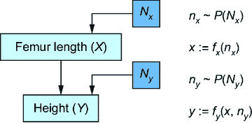

##### 图 6.2 为了将 CGM 转换为 SCM，我们引入了潜在的“外生”父节点 *N**[x]* 和 *N**[y]*，以及这些潜在的概率分布 *P*(*N**[x]*) 和 *P*(*N**[y]*)。然后，通过函数 *f**[x]* 和 *f**[y]*，根据它们的父节点确定性地设置 *X* 和 *Y*。

我们有两个新的潜在变量 *N*[*x*] 和 *N*[*y*]，它们的分布为 *P*(*N*[*x*]) 和 *P*(*N*[*y*])。*X* 和 *Y* 各自有它们自己的函数 *f*[*x*] 和 *f*[*y*]，这些函数根据图中父母的值确定性设置 *X* 和 *Y*。这种差异是关键的；*X* 和 *Y* 在图 6.1 所描述的模型中生成，但在新模型中是确定性设置的。为了强调这一点，我使用赋值运算符“:=”而不是等号“=”来强调 *f*[*x*] 和 *f*[*y*] 赋予 *X* 和 *Y* 的值。

为了达到将我们的 CGM 转换为 SCM 的目标，我们希望*P*(*X*)和*P*(*Y*|*X*=*x*)在两个模型中保持相同。为了实现这一点，我们必须选择*P*(*N*[*x*])、*P*(*N*[*y*])、*f*[*x*]和*f*[*y*]，使得*P*(*X*)仍然是 Normal(47, 2.3)且*P*(*Y*|*X*=*x*)仍然是 Normal(25 + 3.3*x*, 3.3)。一个选择是进行简单的重新参数化。正态分布随机变量的线性函数也是正态分布的。我们可以在图 6.3 中实现该模型。

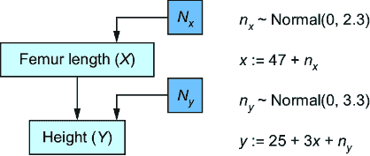

##### 图 6.3 对原始 CGM 进行简单重新参数化后，产生了一个新的 SCM 模型，其*P*(*X*)和*P*(*Y*|*X*)与原始模型相同。

在代码中，我们将其重写如下。

##### 列表 6.2 将 CGM 重写为 SCM

```py
from pyro.distributions import Normal
from pyro import sample

def scm_model():
    n_x = sample("n_x", Normal(0., 2.3))    #1
    n_y = sample("n_y", Normal(0., 3.3))   #1
    x = 47\. + n_x     #2
    y = 25\. + 3.*x + n_y    #2
    return x, y    #3
```

#1 我们从标准正态分布中采样这些新的潜在变量。

#2 X 和 Y 作为 n_x 和 n_y 的线性变换确定性地计算。

#3 返回的 P(X, Y)样本与第一个模型匹配。

通过引入新的外生变量*N*[*x*]和*N*[*y*]、一些线性函数*f*[*x*]和*f*[*y*]以及重新参数化，我们将 CGM 转换为编码相同分布*P*(*X*, *Y*)的 SCM。接下来，让我们更仔细地看看我们引入的元素。

### 6.1.3 形式化新模型

要构建一个 SCM，我们假设我们已经构建了一个因果 DAG，如图 6.1 所示。在图 6.2 和 6.3 中，我们看到两种类型的变量：外生变量和内生变量。*内生变量*是原始变量*X*和*Y*——我们将它们定义为我们要明确建模的变量。这些是我们包含在因果 DAG 中的变量。

*外生变量*（也称为*噪声变量*）是我们新的节点*N*[*x*]和*N*[*y*]。这些变量代表我们内生变量的所有未建模原因。在我们的公式中，我们将每个内生变量与其自己的外生变量父节点配对；*X*获得新的外生因果父节点*N*[*x*]，而*Y*获得外生父节点*N*[*y*]。我们将这些添加到我们的 DAG 中，如图 6.2 和 6.3 所示，以保持完整性。

在我们的公式中，我们将假设外生变量没有父节点，并且它们之间没有边。换句话说，它们是图中的根节点，并且相对于其他外生变量是独立的。此外，我们将外生变量视为潜在变量。

每个内生变量也获得其自己的*赋值函数*（也称为*结构赋值*）*f*[*x*]和*f*[*y*]。赋值函数*确定性地*根据因果 DAG 中父节点的值设置内生变量*X*和*Y*的值。

赋值函数是我们捕捉关于因果关系“如何”的假设的方式。例如，要说明身高(*Y*)和股骨长度(*X*)之间的因果关系是线性的，我们指定*f*[*x*]是一个线性函数。

虽然内生变量是确定性设置的，但 SCM 从概率分布中生成外生变量的值。在我们的股骨例子中，我们从分布 *P*(*N*[*x*]) 和 *P*(*N*[*y*]) 中生成外生变量 *N*[*x*] 和 *N*[*y*] 的值 *n*[*x*] 和 *n*[*y*]，这些分布是 *N*(0, 2.3) 和 *N*(0, 3.3)，如图 6.3 所示。

##### 生成式供应链管理模型（SCM）的元素

+   *一组内生变量（例如，X，Y）*——这是我们想要显式建模的变量。它们是我们构建到我们的因果有向图（DAG）中的模型。

+   *一组外生变量（例如，N**[x]* 和 N**[y]**）*——这些变量代表内生变量的未建模原因。在我们的公式中，每个内生变量都有一个相应的潜在外生变量。

+   *一组分配函数（例如，f**[x]* 和 f**[y]**）*——每个内生变量都有一个分配函数，它根据其父节点（其对应的外生变量和其他内生变量）确定性地设置其值。

+   *一组外生变量概率分布（例如，P(N**[x]**) 和 P(N**[y]**))——SCM 成为一个具有外生变量上的一组分布的生成模型。给定从这些分布生成的值，内生变量被确定性设置。

让我们看看另一个供应链管理模型（SCM）的例子，这次使用离散变量。

### 6.1.4 供应链管理模型（SCM）的一个离散、命令式示例

我们关于股骨的例子处理了连续变量，如身高和长度。现在让我们回到第二章中的投掷石头示例，并考虑一个离散的供应链管理模型（SCM）的例子。在这个例子中，如果珍妮或布莱恩或两者都愿意，他们会在窗户上投掷石头。窗户是否破碎取决于珍妮和布莱恩是否投掷以及窗户玻璃的强度。

我们如何将这个模型转换为供应链管理模型（SCM）？实际上，这个模型已经是供应链管理模型了。我们用以下代码捕捉了这一点。

##### 列表 6.3 第二章中的投掷石头示例是一个供应链管理模型（SCM）。

```py
import pandas as pd
import random

def true_dgp(
    jenny_inclination,     #1
    brian_inclination,     #1
    window_strength):     #1
    jenny_throws_rock = jenny_inclination > 0.5     #2
    brian_throws_rock = brian_inclination > 0.5    #2
    if jenny_throws_rock and brian_throws_rock:     #3
        strength_of_impact = 0.8     #3
    elif jenny_throws_rock or brian_throws_rock:     #3
        strength_of_impact = 0.6     #3
    else:     #3
        strength_of_impact = 0.0    #3
    window_breaks = window_strength < strength_of_impact    #4
    return jenny_throws_rock, brian_throws_rock, window_breaks

generated_outcome = true_dgp(
    jenny_inclination=random.uniform(0, 1),  #5
    brian_inclination=random.uniform(0, 1),  #5
    window_strength=random.uniform(0, 1)   #5
)
```

#1 输入值是外生变量的实例。

#2 如果珍妮和布莱恩愿意的话，他们会投掷石头。`jenny_throws_rock` 和 `brian_throws_rock` 是内生变量。

#3 `strength_of_impact` 是一个内生变量。这个整个 if-then 表达式是影响强度的分配函数。

#4 `window_breaks` 是一个内生变量。分配函数是 `lambda strength_of_impact, window_strength: strength_of_impact > window_strength`。

#5 每个外生变量具有均匀分布（Uniform(0, 1)）。

你会看到它满足供应链管理模型的要求。`true_dgp` 函数的参数（即 `jenny_inclination`、`brian_inclination`、`window_strength`）是外生变量。函数内部命名的变量是内生变量，它们由外生变量确定性设置。

在论文和教科书中遇到的大多数 SCM（软件配置管理）都是以数学形式写下的。然而，这个投掷石头的例子向我们展示了使用像 Python 这样的命令式脚本语言进行因果推理的力量。一些因果过程用代码写比用数学写更容易。直到最近，像 Pyro 这样的工具才使我们能够制作复杂的基于代码的 SCM。

### 6.1.5 为什么使用 SCM？

更多的因果假设意味着更强的因果推断能力。是否使用 SCM 而不是常规 CGM 的问题等同于询问编码在功能赋值中的额外因果假设是否能够服务于你的因果推断目标。

在我们的股骨例子中，我们的 DAG（有向无环图）表明股骨长度导致身高。我们的 SCM 更进一步，表明股骨长度每增加一个单位，身高也会相应增加。问题是这些额外信息是否有助于我们回答一个因果问题。一个这样的线性假设有助于做出因果推断的例子是使用*工具变量估计*来估计因果效应，这将在第十一章中讨论。这种方法依赖于线性假设来推断在 DAG 的假设本身不足以做出推断的情况下因果效应。另一个例子是 SCM 可以让我们使用第九章中讨论的算法来回答*反事实查询*。

当然，如果你的因果推断依赖于一个假设，而这个假设是错误的，那么你的推断可能也是错误的。DAG 中的“什么”假设比 SCM 中的额外“如何”假设简单。DAG 中的一条边是一个关于*X*导致*Y*的真是或假命题。SCM 模型中的赋值函数是关于*X*如何导致*Y*的陈述。后者的假设更加微妙，而且很难验证，因此更容易出错。考虑这样一个事实：市场上有一些长期存在的药物我们知道它们有效，但我们并不完全了解它们的药理作用机制——*它们是如何工作的*。

### 6.1.6 与相关方法的差异

SCM 在不同领域有着丰富的历史。你可能见过一些与我们所阐述的类似但又不尽相同的公式。在这里，我们将突出这个公式的区分性元素以及为什么它们对我们很重要。

#### 带有潜在外生变量的生成 SCM

我们希望将我们的 SCM 用作生成模型。为此，我们将外生变量（我们不希望明确建模的变量）视为内生变量未建模原因的潜在代理。我们只需要指定外生变量的概率分布，我们就能得到一个生成潜在变量模型。

#### 灵活选择赋值函数

你会发现 SCM 最常见的应用使用线性函数作为分配函数，就像我们在股骨示例中所做的那样。然而，在生成式 AI 环境中，我们当然不想将自己限制在线性模型上。我们希望与丰富的函数类一起工作，我们可以将其编写为代码，使用自动微分进行优化，并将其应用于高维非线性问题，如图像。这些函数类在表示因果的“如何”方面可以做得同样好。

#### 与有向无环图（DAG）的联系

我们在基于 DAG 的因果观中定位 SCM。首先，我们像第三章和第四章中那样构建一个因果 DAG。DAG 中的每个变量在 SCM 中成为内生变量（我们想要明确建模的变量）。对于每个内生变量，我们在 DAG 中添加一个单一的潜在外生父节点。接下来，我们将“分配函数”定义为这样一个函数，它根据 DAG 中父节点的值给定的内生变量分配一个值。我们基于 DAG 的所有理论仍然适用，例如因果马尔可夫性质和机制独立性。

注意，并非所有 SCM 的公式都如此紧密地遵循 DAG。一些不采用因果图形视图的从业者仍然使用类似 SCM 的模型（例如，计量经济学中的结构方程模型）。一些图形 SCM 的变体允许我们放宽无环性，并处理循环和反馈回路。

#### 独立的外生变量

为每个内生变量引入一个外生变量可能是一个麻烦；有时将原始 DAG 中没有父节点的节点视为外生变量，或者为两个内生节点有相同的外生父节点可能更容易。但这种方法使我们能够以保持原始 DAG 所蕴含的 d 分离的方式添加外生变量。它还允许我们区分*内生*变量，我们关心并希望明确建模，以及所有我们不希望明确建模的*外生*原因。这在例如，当你正在构建因果图像模型，如第五章中所述，并且你不想明确表示图像出现的所有许多原因时，非常有用。

### 6.1.7 因果决定论及其对建模的影响

供应链管理（SCM）的定义要素是，内生变量是由分配函数确定性地设置，而不是通过从基于因果父代的分布中随机抽取来概率性地设置。这种确定性分配反映了*因果决定论*的哲学观点，该观点认为，如果你知道一个结果的所有因果因素，你就会以完全的确定性知道这个结果。

SCM 建立在这样的哲学基础上。再次考虑我们的股骨高度示例，如图 6.4 所示。

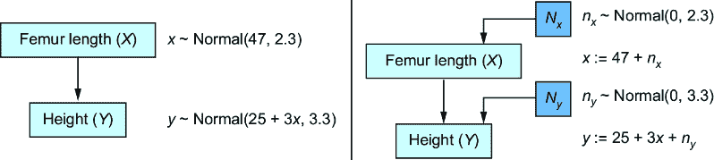

##### 图 6.4 原始的 CGM 从因果马尔可夫核中采样内生变量。新模型确定性地设置内生变量。

在图 6.4 左侧的原始 CGM 中，我们从其因果马尔可夫核的模型中生成*X*和*Y*的值。在相应的 SCM 右侧，内生变量是确定性设定的，不再从分布中抽取。SCM 表示，给定股骨长度以及由*N*[*y*]表示的所有其他未建模的高度原因，身高是确定的。

注意，尽管这种决定性观点，SCM 仍然是对内生变量联合概率分布的随机模型*P*(*X*, *Y*)。但与图 6.4 左侧的 CGM 相比，右侧的 SCM 将模型的全部随机性转移到外生变量分布上。*X*和*Y*在 SCM 中仍然是随机变量，因为它们是*N*[*x*]和*N*[*y*]的函数，而随机变量的函数仍然是随机变量。但在给定外生变量的条件下，内生变量是完全确定的（*退化的*）。

因果决定论为我们这些因果模型师带来了令人耳目一新的结论。首先，当我们将基于 DAG 的因果观应用于给定问题时*，*我们隐含地假设*真实数据生成过程*（DGP）是一个结构因果模型（SCM）。我们已经假设真实 DGP 有一个潜在的、真实的 DAG。更进一步，假设该 DAG 中的每个变量都是基于其所有原因（包括 DAG 内外的原因）确定性设定的，这相当于假设真实 DGP 是一个 SCM。SCM 可能是一个黑盒，或者我们可能无法轻易用数学或代码将其写下来，但它仍然是一个 SCM。这意味着，无论我们使用传统的 CGM 还是 SCM，我们都是在*模拟一个真实 SCM*。

其次，它暗示了如果我们从真实 SCM 生成样本，这些样本中的所有随机变化都将*完全归因于外生原因*。它*不会是由于不可还原的随机性来源*，例如，海森堡的不确定性原理或蝴蝶效应。如果这些概念驱动你的建模领域的输出，CGM 可能不是最佳选择。

现在我们知道我们想要模拟一个真实 SCM，让我们探索为什么我们不能简单地从数据中学习它。

## 6.2 SCMs 之间的等价性

关于 SCM 的一个关键理解是，我们不能完全从数据中学习它们。为了了解原因，让我们回顾一下我们将 CGM 转换为 SCM 的情况。让我们看看为什么在一般情况下，这不能给我们提供真实 SCM。

### 6.2.1 重参数化是不够的

当我们将通用的 CGM 转换为 SCM 时，我们使用了这样一个事实：正态分布随机变量的线性变换会产生一个正态分布随机变量。这确保了内生变量联合概率分布保持不变。

我们可以使用这种“重新参数化技巧”（在生成式 AI 中被称为此技术）来处理其他分布。当我们应用重新参数化技巧时，我们将所有条件概率分布中的不确定性转移到新引入的外生变量分布上。问题是不同的“重新参数化技巧”可能导致具有不同因果假设的不同 SCM（结构因果模型），从而导致不同的因果推断。

#### 伯努利分布的重新参数化技巧

例如，让*X*代表选择一个加权硬币，*Y*代表选择硬币抛掷的结果。*Y*为 1 表示抛出正面，为 0 表示抛出反面。*X*有两个值，“硬币 A”或“硬币 B”。硬币 A 抛出正面的概率为.8，硬币 B 抛出正面的概率为.4，如图 6.5 所示。


##### 图 6.5 一个简单的 CGM（因果图模型）。*X*是选择两个不同重量正反面概率的硬币中的一个。*Y*是抛硬币的结果（正面或反面）。

我们可以用变量*Y*从参数为*p*[*x*]的伯努利分布中采样来模拟抛硬币的结果，其中*p*[*x*]是.8 或.4，这取决于*x*的值。

*y* ~ 伯努利(*p*[*x*])

我们如何在这里应用重新参数化技巧，使得结果 *Y* 成为确定性过程的产物？

想象我们有一根一米的棍子（图 6.6）。

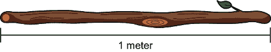

##### 图 6.6 要将抛硬币模型转换为 SCM（结构因果模型），首先想象一根一米长的棍子。

想象使用一把小刀在棍子上刻一个标记，将棍子分成两个区域：一个对应“反面”，一个对应“正面”。我们在这个点切标记，使得每个区域的长度与对应结果的概率成比例；正面的区域长度为*p*[*x*]米，反面的区域长度为 1 – *p*[*x*]米。对于硬币 A，正面的区域将是 0.8 米（80 厘米），反面的区域将是 0.2 米（图 6.7）。


##### 图 6.7 将棍子分成两个区域，分别对应每个结果。区域的长度与结果的概率成比例。

在标记分区后，我们现在将在棍子长度上随机选择一个点来折断棍子。折断发生在给定区域的概率等于该区域相关结果的概率（图 6.8）。这种等式来自于区域的长度与结果的概率相对应。如果折断点在我们用口袋刀切分的分区左侧，则*y*被分配为 0（“正面”），如果折断点在右侧，则*y*被分配为 1（“反面”）。

要随机选择一个点来折断木棍，我们可以从均匀分布中生成。假设我们从均匀分布（0, 1）中采样得到 0.15，因此将木棍折断在长度为 0.15 米的位置，如图 6.8 所示。0.15 落在“正面”区域，因此我们返回正面。如果我们重复进行多次折断木棍的程序，我们将从我们的目标伯努利分布中获得样本。

在数学上，我们可以将这个新模型写成以下形式：

*n*[*y*] ~ Uniform(0, 1)

*y* := *I*(*n*[*y*] ≤ *p*[*x*])

其中 *p*[*x*] 如果 *X* 是硬币 *A*，则为 0.8，如果 *X* 是硬币 *B*，则为 0.4。在这里，*I*(.) 是指示函数，当 *n*[*y*] < *p*[*x*] 时返回 1，否则返回 0。

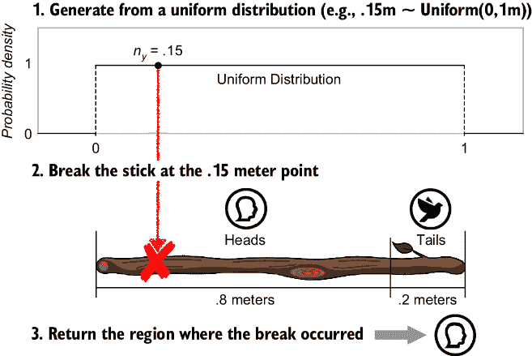

##### 图 6.8 从 0 到 1 米的均匀分布中生成，在该点折断木棍，并返回与折断发生区域相关的结果。重复生成均匀变量将导致 80%的时间在“正面”区域折断，因为其长度是整个木棍长度的 80%。

这个新模型在技术上是一个 SCM，因为不是 *Y* 从伯努利分布生成，而是由一个指示“分配”函数确定。我们进行了重新参数化，将所有随机性转移到具有均匀分布的外生变量上，并将该变量传递给分配函数。

#### 不同的“重新参数化技巧”会导致不同的 SCM。

使用 SCM 建模的主要原因是要让功能分配表示超出因果 DAG 所捕获的因果假设。重新参数化技巧的问题是，应用于相同 CGM 的不同重新参数化技巧将创建具有不同分配函数的 SCM，这意味着不同的因果假设。

为了说明，假设不是抛硬币，而是 *Y* 是一个三面骰子，就像我们在第二章中看到的（图 6.9）。*X* 决定了我们将掷哪个骰子；骰子 A 或骰子 B（图 6.10）。每个骰子的重量不同，因此它们掷出 1、2 或 3 的概率也不同。


##### 图 6.9 三面骰子

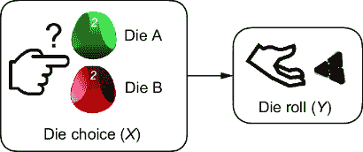

##### 图 6.10 假设我们将模型从选择硬币（两个结果）切换到选择三面骰子（三个结果）。

我们可以将原始模型从伯努利分布（等同于具有两个结果的分类分布）扩展到具有三个结果的分类分布：

*y* ~ Categorical([*p*[*x*][1], *p*[*x*][2], *p*[*x*][3]])

其中 *p*[*x*][1]、*p*[*x*][2] 和 *p*[*x*][3] 分别是掷出 1、2 和 3 的概率（注意其中一个是冗余的，因为 *p*[*x*][1] = 1 – *p*[*x*][2] – *p*[*x*][3]）。

我们也可以在这里使用基于棍子的重新参数化技巧；我们只需要将棍子扩展到一个额外的区域。假设对于骰子*A*，掷出 1 的概率是*p*[*x*][1]=.1，掷出 2 的概率是*p*[*x*][2]=.3，掷出 3 的概率是*p*[*x*][3]=.6。我们将按照图 6.11 所示标记我们的棍子。

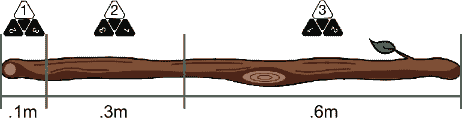

##### 图 6.11 将棍子分为三个区域，对应于三面骰子的结果。

我们将再次使用之前使用生成的均匀变量选择远程区域的方法（图 6.12）。

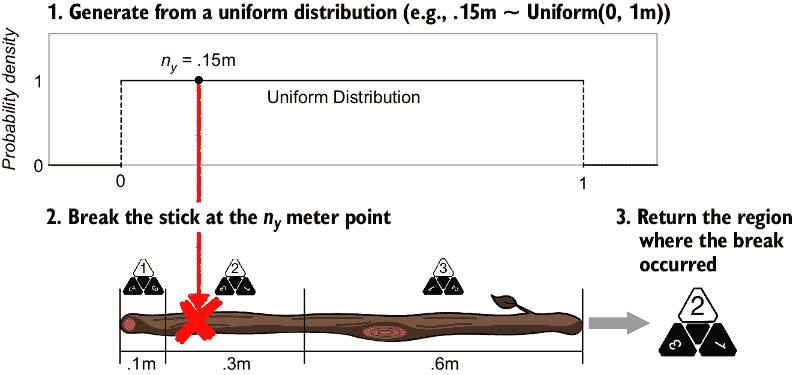

##### 图 6.12 当*Y*有三个结果时，转换为棍子打破 SCM

在数学中，我们将这样写：

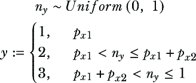

但如果我们用不同的方式标记这根棍子，从而改变棍子上区域排列的顺序呢？在第二根棍子上，区域的顺序是 3，1，然后是 2（图 6.13）。


##### 图 6.13 重新参数化因果生成模型的不同方式产生两个不同的 SCM。它们编码相同的联合概率分布，但给定相同的外生值，具有不同的内生值。

从每个结果（1、2 或 3）的概率来看，两根棍子是等价的——分配给每个骰子掷出结果的棍子区域大小在两根棍子上是相同的。但我们的因果机制已经改变！这两根棍子对于给定的*n*[*y*]值可以返回*不同*的结果。如果我们随机抽取.15 并因此将棍子折断在.15 米处，第一根棍子将在区域 2 折断，返回 2，而第二根棍子将在区域 3 折断，返回 3。

在数学上，第二个棍子打破的 SCM 具有以下形式：

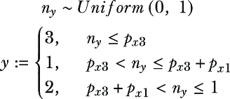

比喻地说，想象一下在你的建模领域中，棍子总是以某种方式标记，区域以某种方式排列。那么，简单的重新参数化技巧并不能保证给出正确的标记。

为了使这个观点更加明确，让我们回顾一下我们将股骨高度模型转换为 SCM 所执行的重新参数化技巧（图 6.14）。


##### 图 6.14 回顾股骨高度 SCM

假设我们创建一个新的 SCM，它与原来的相同，只是*y*的分配函数现在看起来像这样：

*y* := 25 + 3*x* – *n*[*y*]

现在我们有一个第二个 SCM，它减去*n*[*y*]而不是加上*n*[*y*]。正态分布是对称的，所以*n*[*y*]具有均值为 0 的正态分布，因此*n*[*y*]和- *n*[*y*]的概率值相同，所以*Y*的概率分布在两个模型中是相同的。但对于相同的*n*[*y*]和*x*值，*y*的实际分配值将是不同的。接下来，我们将对这个想法进行正式的详细探讨。

### 6.2.2 SCM 的唯一性和等价性

给定一个因果有向无环图（DAG）和内生变量的联合概率分布，通常可以存在多个与该 DAG 和联合概率分布一致的统计因果模型（SCM）。这意味着我们不能仅仅依靠数据来学习真实的 SCM。我们将在第十章深入探讨这个*因果可识别性*问题。现在，让我们使用我们迄今为止看到的概念来分解这个想法。

#### 许多 SCM 与一个 DAG 和相应的分布一致

回想一下我们在图 2.24 中概述的多对一关系，这里再次在图 6.15 中展示。


##### 图 6.15 当我们从数据生成过程（DGP）移动到观测数据时，存在多对一的关系。

如果我们可以将潜在的 DGP 表示为一个真实的 SCM，图 6.15 就会变成图 6.16 所示的样子。

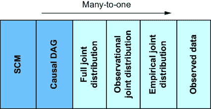

##### 图 6.16 不同的 SCM 可以蕴含相同的 DAG 结构和分布。SCM 可以在分配函数（和/或外生分布）上有所不同。

换句话说，给定一组变量的联合分布，可以存在多个与该分布一致的因果 DAG——在第四章中我们称这些 DAG 为*马尔可夫等价类*。进一步，我们可以有*SCM 的等价类*——给定一个因果 DAG 和联合分布，可以存在多个与该 DAG 和分布一致的 SCM。我们通过 stick-breaking 骰子滚动 SCM 的两个变体都是与 DAG *X*（骰子选择）→ *Y*（骰子滚动）以及分布*P*(*X*)（骰子选择的概率分布）和*P*(*Y*|*X*)（骰子滚动的概率）一致的例子看到了这一点。

#### 真实的 SCM 不能从数据中学习（没有因果假设）

当我们在前几章中努力构建因果 DAG 时，我们的隐含目标是重现真实的因果 DAG。现在我们寻求重现图 6.16 中的真实 SCM。

在第四章中，我们看到了数据无法区分等价类中的因果 DAG。同样，仅凭数据本身不足以恢复真实的 SCM。再次考虑我们推导出的 stick-breaking SCM。我们推导出两个标记的棍子，区域排序不同。当然，有三个结果排序的方式：({1, 2, 3}, {1, 3, 2}, {2, 1, 3}, {2, 3, 2}, {3, 1, 2}, {3, 2, 1})。这就是六种标记棍子的方式，因此有六个与分布*P*(*X*)和*P*(*Y*|*X*)（骰子滚动的概率）一致的可能的 SCM。

假设这些标记的棍子中的一个就是真实的 SCM，并且它被隐藏在一个黑盒子里，如图 6.17 所示。假设我们反复运行 SCM 来生成一些骰子滚动结果。基于这些骰子滚动结果，我们能否找出真实棍子的标记？换句话说，六个排序中的哪一个就是黑盒子的排序？

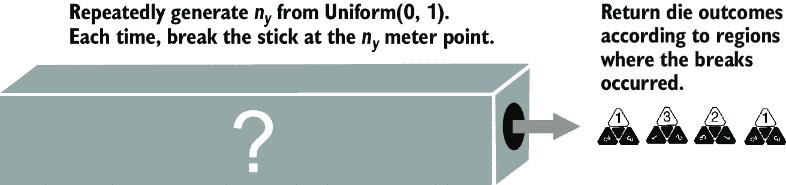

##### 图 6.17 假设我们不知道哪个“标记棒”产生了观察到的骰子滚动。仅从骰子滚动中无法推断出正确的标记棒。更普遍地说，SCM 不能仅从数据中的统计信息中学习。

答案是否定的。更普遍地说，由于 SCM 和数据之间存在多对一的关系，你无法仅从数据中的统计信息中学习到真实的 SCM。

让这个想法在脑海中停留一会儿。我在告诉你，即使拥有无限的数据，最前沿的深度学习架构，以及无限的计算预算，你甚至在这个简单的三个结果的棒子断裂例子中都无法找出真正的 SCM。从统计概率的角度来看，每个 SCM 在给定数据的情况下都是等可能的。要在等价类中偏好一个 SCM 而不是另一个，你需要额外的假设，例如，{1, 2, 3} 是最可能的标记，因为标记棒子的人可能会按顺序标记区域。这是一个很好的假设，只要你意识到你正在做出这个假设。

在机器学习的实践中，我们常常没有意识到我们正在做出这样的假设。为了说明这一点，假设你进行了以下实验。你创建了一组棒子断裂 SCM，并从这些 SCM 中模拟数据。然后你将 SCM 向量化，并将它们用作标签，将模拟数据作为特征，在图 6.18 中所示的深度监督学习训练过程中，专注于从模拟数据中预测“真实”的 SCM。

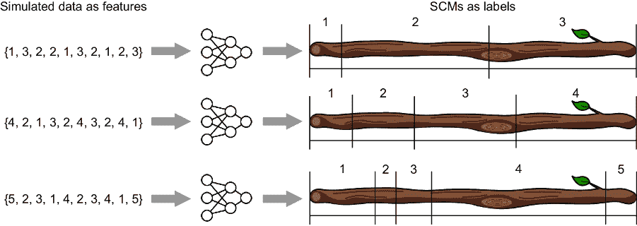

##### 图 6.18 你创建了多个 SCM，并从每个 SCM 中模拟数据。然后你可以对从模拟数据中预测真实 SCM 的深度神经网络进行监督学习。对于同一等价类中的两个 SCM，这种方法将倾向于在训练数据中出现频率更高的属性的那个 SCM。

假设然后你将训练好的模型数据实际的三面骰子滚动的样本输入，目标是预测真实的 SCM。那个预测模型的预测可能会倾向于具有{1, 2, 3}排序的棒子，而不是等效的{2, 3, 1}排序。但只有当{1, 2, 3}排序在训练数据中更常见时，它才会这样做。

##### 类比于程序归纳

从数据中学习 SCM 的问题与计算机科学中程序归纳的挑战相关。假设一个程序以“foo”和“bar”作为输入，并返回“foobar”作为输出。这个程序是什么？你可能认为程序只是简单地连接输入。但它可以是任何东西，包括一个将输入与单词“aardvark”连接起来，然后删除“aardvark”字符，并返回结果的程序。数据（许多程序的输入和输出示例）不足以区分所有可能的程序中哪一个是正确的。为此，你需要额外的假设或约束，例如奥卡姆剃刀类型的归纳偏见，它更喜欢最简单的程序（例如，具有*最小描述长度*的程序）。

尝试从数据中学习 SCM 是此类问题的特殊情况。程序的输入是外生变量值，输出是内生变量值。假设你有了因果 DAG，但没有分配函数。问题是，给定输入，有无限多的分配函数可以产生那些输出。从数据中学习 SCM 需要额外的假设来约束分配函数，例如约束函数类和使用奥卡姆剃刀（例如，模型选择标准）。

接下来，我们将深入探讨在离散的基于规则的设置中实现 SCM。

## 6.3 实现基于规则的系统的 SCM

SCM 的一个特别有用的应用是建模基于规则的系统。通过“基于规则”，我指的是已知规则，通常由人类设定，决定了因果关系的“如何”。游戏是一个很好的例子。

为了说明，考虑一下*蒙提霍尔问题*——一个以 1960 年代一个类似设置的电视游戏节目主持人命名的基于概率的智力题。

### 6.3.1 案例研究：蒙提霍尔问题

在一个游戏节目中，参赛者被要求在三个关闭的门中选择。其中一扇门后面有一辆车；其他门后面是山羊。玩家选择了第一个门。然后，知道门后面是什么的主持人打开另一扇门，例如第三扇门，那扇门后面有山羊。主持人然后问参赛者，“你想换到第二扇门，还是想坚持你的原始选择？”问题是哪种策略更好，换门还是坚持？

正确答案是换门。这个问题于 1990 年出现在《Parade》杂志的一篇文章中，并给出了正确答案。成千上万的读者邮寄了回复，包括许多受过研究生水平数学训练的人，他们试图反驳这个答案，并说换门没有优势，坚持或换门赢得比赛的概率相同。

图 6.19 说明了为什么换门是更好的直觉。换门是正确答案，因为在标准假设下，“换门”策略赢得汽车的概率是三分之二，而“留下”策略只有三分之一的概率。这看起来似乎不合逻辑，因为当游戏开始时，每个门都有相等的机会藏有汽车。似乎一旦主持人排除了一个门，剩下的每个门都应该有 50-50 的机会。这种逻辑是错误的，因为主持人不是随机排除一个门。他只排除一个既不是玩家的初始选择，又没有汽车的门。三分之一的时候，这些是同一个门，三分之二的时候是不同的门；这种三分之一到三分之二的非对称性就是为什么剩下的门不各自有 50-50 的机会藏有汽车。


##### 图 6.19 蒙提霍尔问题。每个门都有相等的机会藏有奖品。玩家最初选择一个门，主持人揭示一个输掉的门，玩家有选择是否换门的选项。与直觉相反，玩家应该换门；如果他们换门，他们将赢得三分之二的时间。这个插图假设选择了门 1，但无论初始选择哪个门，结果都是相同的。

### 6.3.2 蒙提霍尔问题的因果 DAG

因果建模使蒙提霍尔问题变得更加直观。我们可以用图 6.20 中的因果 DAG 来表示这个游戏。

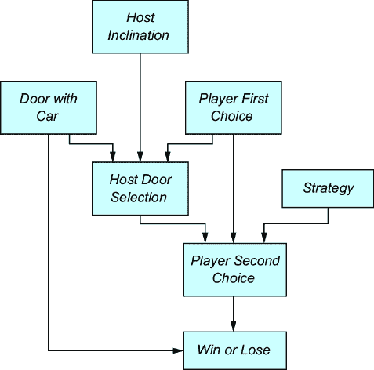

##### 图 6.20 蒙提霍尔问题的因果 DAG

每个变量的可能结果如下：

+   *藏有汽车的门*—表示后面有汽车的门。第 1 个门用 1^(st)表示，第 2 个门用 2^(nd)表示，或者第 3 个门用 3^(rd)表示。

+   *玩家第一次选择*—表示玩家最初选择的门。第 1 个门用 1^(st)表示，第 2 个门用 2^(nd)表示，或者第 3 个门用 3^(rd)表示。

+   *主持人倾向*—假设主持人面对着门，从左到右它们是按 1^(st)、2^(nd)、3^(rd)的顺序排列的。这个*主持人倾向*变量有两个结果，左和右。当结果是左时，主持人倾向于选择最左边的可用门；否则，主持人将倾向于选择最右边的可用门。

+   *主持人门选择*—结果仍然是第 1 个、第 2 个和第 3 个。

+   *策略*—结果是换门，如果策略是从第一个选择换门，或者留下，如果策略是保留第一个选择。

+   *玩家第二次选择*—表示在主持人询问玩家是否想要换门后，玩家选择的门。结果仍然是第 1 个、第 2 个和第 3 个。

+   *赢或输*—表示玩家是否赢；结果是赢或输。当*玩家第二次选择*等于*藏有汽车的门*时，即为赢。

接下来，我们将看到如何将其作为 SCM 在 pgmpy 中实现。

### 6.3.3 使用 pgmpy 实现蒙提霍尔问题作为 SCM

游戏规则为我们提供了明确的分配函数逻辑。例如，我们可以用表 6.1 表示*主持人门选择*的分配函数。

##### 表 6.1：给定*玩家第一个选择*、*带车的门*和*主持人倾向*时，*主持人门选择*的查找表。它显示了主持人根据玩家的第一个选择、有车的门以及主持人倾向（指主持人是否会在有两个选择时选择最左边的或最右边的门）选择的门。

| **主持人倾向** | 左侧 | 右侧 |
| --- | --- | --- |
| **带车的门**  | **1^(st)**  | **2^(nd)**  | **3^(rd)**  | **1^(st)**  | **2^(nd)**  | **3^(rd)**  |
| **玩家第一个选择**  | 1^(st)  | 2^(nd)  | 3^(rd)  | 1^(st)  | 2^(nd)  | 3^(rd)  | 1^(st)  | 2^(nd)  | 3^(rd)  | 1^(st)  | 2^(nd)  | 3^(rd)  | 1^(st)  | 2^(nd)  | 3^(rd)  | 1^(st)  | 2^(nd)  | 3^(rd)  |
| **主持人门选择**  | 2^(nd)  | 3^(rd)  | 2^(nd)  | 3^(rd)  | 1^(st)  | 1^(st)  | 2^(nd)  | 1^(st)  | 1^(st)  | 3^(rd)  | 3^(rd)  | 2^(nd)  | 3^(rd)  | 3^(rd)  | 1^(st)  | 2^(nd)  | 1^(st)  | 2^(nd)  |

当带车的门和玩家的第一个选择不同时，主持人只能选择剩下的门。但如果带车的门和玩家的第一个选择是同一扇门，主持人有两个门可以选择。如果*主持人倾向*是左侧，他将选择最左边的门。例如，如果*带车的门*和*玩家第一个选择*都是 1^(st)，主持人必须在 2^(nd)和 3^(rd)门之间选择。如果*主持人倾向* == 左侧，他将选择 2^(nd)门；如果*主持人倾向* == 右侧，他将选择 3^(rd)门。

使用像 Pyro 这样的库编写 if-then 逻辑来表示这种逻辑非常直接。但由于规则很简单，我们可以使用更加受限的 pgmpy 库来将此函数编写为一个条件概率表（表 6.2）。

##### 表 6.2：我们可以将*主持人门选择*的查找表（表 6.1）转换为条件概率表，我们可以在 pgmpy 中将它实现为一个`TabularCPD`对象，其中给定结果的概率为 0 或 1，因此是确定性的。

| **主持人倾向** | 左侧 | 右侧 |
| --- | --- | --- |
| **带车的门**  | **1^(st)**  | **2^(nd)**  | **3^(rd)**  | **1^(st)**  | **2^(nd)**  | **3^(rd)**  |
| **玩家第一个选择**  | **1^(st)**  | **2^(nd)**  | **3^(rd)**  | **1^(st)**  | **2^(nd)**  | **3^(rd)**  | **1^(st)**  | **2^(nd)**  | **3^(rd)**  | **1^(st)**  | **2^(nd)**  | **3^(rd)**  | **1^(st)**  | **2^(nd)**  | **3^(rd)**  | **1^(st)**  | **2^(nd)**  | **3^(rd)**  |
| **主持人门选择**  | 1^(st)  | 0  | 0  | 0  | 0  | 1  | 1  | 0  | 1  | 1  | 0  | 0  | 0  | 0  | 0  | 1  | 0  | 1  | 0  |
| 2^(nd)  | 1  | 0  | 1  | 0  | 0  | 0  | 1  | 0  | 0  | 0  | 0  | 1  | 0  | 0  | 0  | 1  | 0  | 1  |
| 3^(rd)  | 0  | 1  | 0  | 1  | 0  | 0  | 0  | 0  | 0  | 1  | 1  | 0  | 1  | 1  | 0  | 0  | 0  | 0  |

表中的条目对应于在原因值给定的情况下主持人门选择结果发生的概率。每个概率结果要么是 0 要么是 1，给定因果父节点，因此给定父节点，结果完全确定。因此，我们可以将其用作我们的分配函数，并且由于它是一个条件概率表，我们可以使用 pgmpy 中的`TabularCPD`类来实现它。

##### 列表 6.4 在 pgmpy 中实现主持人门选择分配函数

```py
from pgmpy.factors.discrete.CPD import TabularCPD
f_host_door_selection = TabularCPD(
    variable='Host Door Selection',    #1
    variable_card=3,     #2
    values=[    #3
        [0,0,0,0,1,1,0,1,1,0,0,0,0,0,1,0,1,0],     #3
        [1,0,1,0,0,0,1,0,0,0,0,1,0,0,0,1,0,1],     #3
        [0,1,0,1,0,0,0,0,0,1,1,0,1,1,0,0,0,0]     #3
    ],     #3
    evidence=[     #4
        'Host Inclination',     #4
        'Door with Car',     #4
        'Player First Choice'     #4
    ],   #4
    evidence_card=[2, 3, 3],    #5
    state_names={    #6
        'Host Door Selection':['1st', '2nd', '3rd'],    #6
        'Host Inclination': ['left', 'right'],   #6
        'Door with Car': ['1st', '2nd', '3rd'],  #6
        'Player First Choice': ['1st', '2nd', '3rd']    #6
    }    #6
)     #6
```

#1 变量的名称

#2 卡迪纳尔（结果数量）

#3 概率表。值与表 6.2 中的值匹配，只要证据参数中因果变量的顺序与表中因果变量名称的从上到下顺序一致。

#4 条件（因果）变量

#5 每个条件（因果）变量的卡迪纳尔（结果数量）

#6 每个变量的状态名称

此代码生成`f_host_door_selection`，一个我们可以添加到`BayesianNetwork`类模型的`TabularCPD`对象。然后我们可以像使用更典型的`TabularCPD`对象一样使用它。

同样，我们可以创建一个玩家第二选择的查找表，如表 6.3 所示。

##### 表 6.3 根据玩家第一选择、主持人门选择和策略条件下的玩家第二选择查找表。“玩家第二选择”单元格在玩家第一选择和主持人门选择相同的不可能情况下为空。

| 策略 | 保持 | 切换 |
| --- | --- | --- |
| **主持人门选择**  | **1^(st)**  | **2^(nd)**  | **3^(rd)**  | **1^(st)**  | **2^(nd)**  | **3^(rd)**  |
| **玩家第一选择**  | 1^(st)  | 2^(nd)  | 3^(rd)  | 1^(st)  | 2^(nd)  | 3^(rd)  | 1^(st)  | 2^(nd)  | 3^(rd)  | 1^(st)  | 2^(nd)  | 3^(rd)  | 1^(st)  | 2^(nd)  | 3^(rd)  | 1^(st)  | 2^(nd)  | 3^(rd)  |
| **玩家第二选择**  |  | 2^(nd)  | 3^(rd)  | 1^(st)  |  | 3^(rd)  | 1^(st)  | 2^(nd)  |  |  | 3^(rd)  | 2^(nd)  | 3^(rd)  |  | 1^(st)  | 2^(nd)  | 1^(st)  |  |

主持人永远不会选择与玩家第一选择相同的门，因此主持人门选择和玩家第一选择永远不会具有相同的值。在这些情况下，玩家第二选择的条目未定义。

将此扩展为条件概率表，我们得到表 6.4。同样，不可能结果单元格留空。

##### 表 6.4 将玩家第二选择的查找表（表 6.3）转换为我们可以实现为`TabularCPD`对象的条件概率表的结果

| 策略 | 保持 | 切换 |
| --- | --- | --- |
| **主持人门选择**  | **1^(st)**  | **2^(nd)**  | **3^(rd)**  | **1^(st)**  | **2^(nd)**  | **3^(rd)**  |
| **玩家第一选择**  | 1^(st)  | 2^(nd)  | 3^(rd)  | 1^(st)  | 2^(nd)  | 3^(rd)  | 1^(st)  | 2^(nd)  | 3^(rd)  | 1^(st)  | 2^(nd)  | 3^(rd)  | 1^(st)  | 2^(nd)  | 3^(rd)  | 1^(st)  | 2^(nd)  | 3^(rd)  |
| **玩家第二次选择**  | **1^(st)**  |  | 0  | 0  | 1  |  | 0  | 1  | 0  |  |  | 0  | 0  | 0  |  | 1  | 0  | 1  |  |
| **2^(nd)**  |  | 1  | 0  | 0  |  | 0  | 0  | 1  |  |  | 0  | 1  | 0  |  | 0  | 1  | 0  |  |
| **3^(rd)**  |  | 0  | 1  | 0  |  | 1  | 0  | 0  |  |  | 1  | 0  | 1  |  | 0  | 0  | 0  |  |

不幸的是，当我们指定`Tabular-CPD`时，我们不能将不可能的值留空，因此，在下面的代码中，我们需要为这些元素分配任意值。

##### 列表 6.5 在 pgmpy 中实现*玩家第二次选择*分配函数

```py
from pgmpy.factors.discrete.CPD import TabularCPD
f_second_choice = TabularCPD(
    variable='Player Second Choice',
    variable_card=3,
    values=[
        [1,0,0,1,0,0,1,0,0,0,0,0,0,0,1,0,1,0],    #1
        [0,1,0,0,1,0,0,1,0,1,0,1,0,1,0,1,0,1],    #1
        [0,0,1,0,0,1,0,0,1,0,1,0,1,0,0,0,0,0]     #1
    ],
    evidence=[
        'Strategy',
        'Host Door Selection',
        'Player First Choice'
    ],
    evidence_card=[2, 3, 3],
    state_names={
        'Player Second Choice': ['1st', '2nd', '3rd'],
        'Strategy': ['stay', 'switch'],
        'Host Door Selection': ['1st', '2nd', '3rd'],
        'Player First Choice': ['1st', '2nd', '3rd']
    }
)
```

#1 概率值是 0 或 1，所以分配函数是确定性的。在父组合不可能的情况下，我们仍然需要分配一个值。

这给我们第二个`TabularCPD`对象。我们将为每个节点创建一个。

首先，让我们设置因果 DAG。

##### 列表 6.6 实现完整的蒙提霍尔 SCM

```py
from pgmpy.models import BayesianNetwork
from pgmpy.factors.discrete.CPD import TabularCPD

monty_hall_model = BayesianNetwork([    #1
    ('Host Inclination', 'Host Door Selection'),     #1
    ('Door with Car', 'Host Door Selection'),     #1
    ('Player First Choice', 'Host Door Selection'),    #1
    ('Player First Choice', 'Player Second Choice'),    #1
    ('Host Door Selection', 'Player Second Choice'),    #1
    ('Strategy', 'Player Second Choice'),    #1
    ('Player Second Choice', 'Win or Lose'),     #1
    ('Door with Car', 'Win or Lose')  #1
])    #1
```

#1 构建因果 DAG。

`monty_hall_model`现在是一个因果 DAG。在添加外生变量分布和分配函数后，它将成为 SCM。

以下列表添加了外生变量分布。

##### 列表 6.7 创建外生变量分布

```py
p_host_inclination = TabularCPD(       #1
    variable='Host Inclination',    #1
    variable_card=2,   #1
    values=[[.5], [.5]],    #1
    state_names={'Host Inclination': ['left', 'right']}    #1
)    #1

p_door_with_car = TabularCPD(     #2
    variable='Door with Car',    #2
    variable_card=3,    #2
    values=[[1/3], [1/3], [1/3]],    #2
    state_names={'Door with Car': ['1st', '2nd', '3rd']}     #2
)     #2

p_player_first_choice = TabularCPD(     #3
    variable='Player First Choice',     #3
    variable_card=3,     #3
    values=[[1/3], [1/3], [1/3]],     #3
    state_names={'Player First Choice': ['1st', '2nd', '3rd']}     #3
)     #3

p_host_strategy = TabularCPD(    #4
    variable='Strategy',    #4
    variable_card=2,    #4
    values=[[.5], [.5]],     #4
    state_names={'Strategy': ['stay', 'switch']}    #4
)    #4
```

#1 主观倾向变量的 CPD。当玩家选择有车的门时，主持人有两个其他门可以选择。当主持人倾向于选择最左边的门时，这个变量是“left”，如果主持人倾向于选择最右边的门，则变量是“right”。

#2 表示哪个门有奖品车的变量的 CPD。假设每个门有相等的机会有车。

#3 表示玩家第一次选择门的变量的 CPD。每个门被选择的概率相等。

#4 为表示玩家策略的变量创建一个 CPD。“停留”策略是指保持最初的选择，而“切换”策略是指改变门的选择。

在创建了外生分布后，我们现在将创建分配函数。我们已经创建了`f_host_door_selection`和`f_second_choice`，所以我们将添加`f_win_or_lose`——确定玩家是赢还是输的分配函数。

##### 列表 6.8 创建分配函数

```py
f_win_or_lose = TabularCPD(    
    variable='Win or Lose',    
    variable_card=2,    
    values=[    
        [1,0,0,0,1,0,0,0,1],    
        [0,1,1,1,0,1,1,1,0],    
    ],    
    evidence=['Player Second Choice', 'Door with Car'],    
    evidence_card=[3, 3],    
    state_names={    
        'Win or Lose': ['win', 'lose'],    
        'Player Second Choice': ['1st', '2nd', '3rd'],    
        'Door with Car': ['1st', '2nd', '3rd']    
    }    
)
```

最后，我们将添加外生分布和分配函数到`monty_hall_model`并创建 SCM。

##### 列表 6.9 为蒙提霍尔问题创建 SCM

```py
monty_hall_model.add_cpds(    
    p_host_inclination,    
    p_door_with_car,    
    p_player_first_choice,    
    p_host_strategy,    
    f_host_door_selection,    
    f_second_choice,    
    f_win_or_lose    
)
```

我们可以运行变量消除推理算法来验证算法的结果。让我们查询在玩家采取“停留”策略的情况下获胜的概率。

##### 列表 6.10 推断获胜策略

```py
from pgmpy.inference import VariableElimination    #1

infer = VariableElimination(monty_hall_model)
q1 = infer.query(['Win or Lose'], evidence={'Strategy': 'stay'})     #2
print(q1)   #2
q2 = infer.query(['Win or Lose'], evidence={'Strategy': 'switch'})     #3
print(q2)   #3
q3 = infer.query(['Strategy'], evidence={'Win or Lose': 'win'})     #4
print(q3)   #4
```

#1 我们将使用名为“变量消除”的推理算法。

#2 打印当玩家使用“停留”策略时赢得和输掉的概率。

#3 打印当玩家使用“切换”策略时赢得和输掉的概率。

#4 打印当玩家获胜时，玩家使用“停留”策略与“切换”策略的概率。

这个推理产生了以下输出：

```py
+-------------------+--------------------+
| Win or Lose       |   phi(Win or Lose) |
+===================+====================+
| Win or Lose(win)  |             0.3333 |
+-------------------+--------------------+
| Win or Lose(lose) |             0.6667 |
+-------------------+--------------------+
```

在“留在原门”策略下，获胜和失败的概率分别是 1/3 和 2/3。相比之下，以下是“换门”策略的输出：

```py
+-------------------+--------------------+
| Win or Lose       |   phi(Win or Lose) |
+===================+====================+
| Win or Lose(win)  |             0.6667 |
+-------------------+--------------------+
| Win or Lose(lose) |             0.3333 |
+-------------------+--------------------+
```

在“换门”策略下，获胜和失败的概率分别是 2/3 和 1/3。我们还可以根据获胜结果进行条件化，并推断出每种策略导致该结果的概率。

```py
+------------------+-----------------+
| Strategy         |   phi(Strategy) |
+==================+=================+
| Strategy(stay)   |          0.3333 |
+------------------+-----------------+
| Strategy(switch) |          0.6667 |
+------------------+-----------------+
```

这些是普通的非因果概率推理——我们只是验证我们的 SCM 能够产生这些推理。在第九章中，我们将展示这个 SCM 如何使因果*反事实*推理成为可能，而简单的模型无法回答，例如“如果输掉游戏的玩家使用了不同的策略，会发生什么？”

### 6.3.4 规则系统中的外生变量

在这个蒙提霍尔 SCM 中，因果 DAG 中的根节点（没有入边节点的节点）充当外生变量。这与我们关于 SCM 的正式定义略有不同，该定义指出外生变量代表系统之外的因素。*主持人倾向*符合这个定义，因为这不是原始描述的一部分。*有车的门*、*玩家第一次选择*和*策略*则是另一回事。为了解决这个问题，我们可以向这些变量引入外生父节点，并给定这些父节点，将这些变量确定性地设置，就像我们在本章的其他地方所做的那样。但在使用 pgmpy 建模时，这有点多余。

### 6.3.5 基于规则的系统 SCM 建模的应用

虽然蒙提霍尔游戏很简单，但不要低估将规则纳入赋值函数的表达能力。在过去的几十年中，人工智能的一些最大成就就是通过简单的规则在棋类游戏中击败专家人类。基于如何从一个状态转换到另一个状态的简单规则，模拟软件可以模拟高度复杂的行为。我们通常希望对人类（他们知道并可以重写这些规则）设计的基于规则的系统进行因果分析，例如自动化制造系统。

## 6.4 在数据上训练 SCM

给定一个有向无环图（DAG），我们选择使用 CGM 还是 SCM。假设我们想选择 SCM，并希望“拟合”或“训练”这个 SCM 来处理数据。为此，我们为每个赋值函数选择一些*参数化*的*函数类*（例如，线性函数、逻辑函数等）。一旦我们在数据上拟合了其参数，这个函数类就变成了一个特定的函数。同样，对于每个外生变量，我们希望指定一个标准概率分布，可能包括我们可以拟合到数据中的参数。

在我们关于股骨高度示例中，所有的赋值函数都是线性函数，外生变量是正态分布。但使用像 Pyro 这样的工具，你可以逐个指定每个赋值函数和外生分布。然后你可以像使用 CGM 一样训练参数。例如，你不必从法医学教科书中获取这个股骨高度模型：

*n*[*y*] ~ *N*(0, 3.3)

*y* = 25 + 3*x* + *n*[*y*]

你可以直接在真实的法医学数据上拟合线性模型的参数 *α*、*β* 和 *δ*：

*n*[*y*] ~ *N*(0, *δ*)

*y* = *α* + *β**x* + *n*[*y*]

在这个法医学示例中，我们使用线性赋值函数，因为身高与股骨长度成正比。让我们考虑其他捕捉原因如何影响其效果的方法。

### 6.4.1 我应该选择什么样的赋值函数？

在结构因果模型（SCM）模型中，最重要的选择是赋值函数的 *函数类*，因为这些选择代表了你对因果“如何”的假设。你可以使用数学中常见的函数类，如线性模型。你还可以使用代码（包括 if-then 语句、循环、递归等），就像我们在抛掷岩石的例子中所做的那样。

记住，你正在建模一个真实的结构因果模型（SCM）。你可能会指定与真实 SCM 中的不同的赋值函数，但这没关系。你不需要你的 SCM 与真实情况完全匹配；你只需要你的模型关于它所依赖的“如何”假设是正确的，以便进行因果推断。

##### 没有关于“如何”假设的结构因果模型（SCM）只是因果图模型（CGM）

假设你构建了一个每个赋值函数都是线性函数的结构因果模型（SCM）。你使用线性高斯假设是因为你选择的库需要它（例如，在 pgmpy 中，`LinearGaussianCPD` 几乎是你建模连续变量的唯一选择）。然而，你并不打算依赖这个线性假设来进行因果推断。在这种情况下，尽管你的模型符合 SCM 的要求，但实际上它是一个具有线性因果马尔可夫核模型的因果图模型（CGM）。

假设，例如，*X* 和 *Y* 之间不是线性关系，而是遵循非线性 S 曲线，并且你的因果推断对这条 S 曲线很敏感。想象一下，真实的结构因果模型（SCM）通过一个形如希尔方程的赋值函数（在生物化学中出现的函数，可以捕捉 S 曲线）来捕捉这一点。但你的 SCM 使用的是基于数据的逻辑函数拟合。尽管你的模型是错误的，但如果你的逻辑赋值函数捕捉到了关于 S 曲线所需的所有信息，以便你的推断能够工作，那么你的模型将足以做出良好的因果推断。

### 6.4.2 我应该如何建模外生变量分布？

在 6.1.3 节中，我们以特定方式表述了我们的生成式 SCM，其中每个节点都得到一个代表其未建模原因的外部变量。根据这种表述，外部变量分布的作用仅仅是提供足够的变异，以便 SCM 可以模拟联合分布。这意味着，假设你已经选择了你的赋值函数类，你可以根据它们在参数估计后如何拟合数据来选择外部变量的规范分布。某些规范分布可能比其他分布拟合得更好。你可以使用标准的技术来对比不同的选择，这些技术用于模型比较和交叉验证。

这些规范分布可以参数化，例如在

*n*[*y*] ~ *N*(0, *δ*)

*y* = *α* + *β**x* + *n*[*y*]

在生成式 AI 中，更常见的方法是使用规范分布中的常数，并且只训练赋值函数的参数：

*n*[*y*] ~ *N*(0, 1)

*y* = *α* + *β**x* + *δ* *n*[*y*]

两种都行，只要你的选择捕捉到了你的“如何”假设。

### 6.4.3 加性模型：SCM 建模的流行选择

加性模型是 SCM 模板，它们使用流行的可训练函数类作为赋值函数。它们在 SCM 建模中是一个很好的起点。我们将探讨三种常见的加性模型：线性高斯加性模型（LiGAM）、线性非高斯加性模型（LiNGAM）和非线性加性噪声模型（ANM）。这些模型每个都封装了一对约束：一个关于赋值函数的结构，另一个关于加性外部变量的分布。

加法性使得这种方法更容易，因为通常这些加性模型从数据中学习参数的算法有唯一解。在某些情况下，这些参数有直接的因果解释。还有许多软件库用于在数据上训练加性模型。

让我们用一个例子来展示加性模型的有用性。假设你是一位生物化学家，正在研究生物样本中某种蛋白质的合成。样本中含有一部分酶，它与样本中的某些前体反应并合成你感兴趣的蛋白质。你测量了你感兴趣的蛋白质的量。让 *X* 表示酶的量，让 *Y* 表示感兴趣蛋白质的测量量。我们将使用 SCM 来模拟这个系统，其 DAG 如图 6.21 所示。


##### 图 6.21 酶（*X*）的量是蛋白质（*Y*）测量量的原因。

我们对因果关系如何影响效果有定性知识，但我们必须将这种知识转化为对赋值函数和外部变量分布的函数类进行明确选择。加性模型是一个很好的起点。

为了说明，我们将关注 *Y* 的分配函数和外生变量分布，*Y* 是我们示例中目标蛋白的量。从外生变量生成，并通过分配函数设置 *Y*，具有以下表示法：

*n*[*y*] ~ *P*(*N*[*y*])

*y* := *f**y*

*f**y* 表示 *y* 的分配函数，它以内源父代 *X* 和外生父代 *N*[*y*] 的值作为输入。

在一个 *additive* 分配函数中，外生变量始终添加到内源父代的某个函数中。在我们的例子中，这意味着 *Y* 的分配函数具有以下形式：

*y* := *f*y = *g*(*x*) + *n*[*y*]

在这里，*g*(.) 是内源父代（s）的一些可训练函数，并且 *n*[*y*] 被添加到该函数的结果中。

对于我们的蛋白 *Y*，这些模型表明测量的蛋白量 *Y* 等于酶量 *g*(*X*) 的某个函数加上一些外生因素，例如测量设备中的噪声。这种假设很有吸引力，因为它让我们将未建模的外生原因视为加性的“噪声”。从统计信号处理的角度来看，从加性噪声中分离出一些核心信号（例如，*g*(*x*））相对容易。

通常，让 *V* 代表模型中的内源变量，*V*[*PA*] 代表 *V* 的内源父代，*N*[*v*] 代表外生变量。

*v* := *f**v* = *g*(*V*[*PA*]) + *n*[*v*]

加性结构因果模型（SCM）具有几个优点，但在这里我们将关注它们作为构建 SCM 模板的益处。我们将从最简单的加性模型，即线性高斯加性模型开始。

### 6.4.4 线性高斯加性模型

在一个线性高斯加性模型中，分配函数是父代的线性函数，外生变量具有正态分布。

在我们的酶示例中，*N*[*y*] 和 *Y* 给定如下：

*n*[*y*] ~ *N*(0, *σ*[*y*])

*y* := *β*[0] + *β*[*x*]*x* + *n*[*y*]

在这里，*β*[0] 是截距项，而 *β*[*x*] 是 *X* 的系数。我们假设对于酶量 *X* 的每单位增加，预期的测量蛋白量会增加 *β*[*x*]。*N*[*y*] 考虑了由于外生因果因素导致的预期量周围的变异，并且我们假设它具有均值为 0 和尺度参数 *σ*[*y*] 的正态分布。例如，我们可能假设 *N*[*y*] 主要由测量设备的技术噪声组成，例如干扰传感器的灰尘颗粒。我们可能从使用该设备的经验中知道这种噪声具有正态分布。

通常，对于具有 *K* 个父代的变量 *V*，*V*[*PA*] = {*V*[*pa*][,1], …, *V*[*pa*][,][*K*]}：

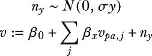

该模型定义了参数：*β*[0] 是截距项，*β*[*j*] 是附加到 *j*^(th) 父亲的系数，而 *σ*[*v*] 是 *N*[*v*] 的正态分布的尺度参数。

让我们看看 Pyro 中的 LiNGAM 模型示例。

##### 列表 6.11 Pyro 的线性高斯模型示例

```py
from pyro import sample
from pyro.distributions import Normal

def linear_gaussian():
    n_x = sample("N_x", Normal(9., 3.))
    n_y = sample("N_y", Normal(9., 3.))
    x = 10\. + n_x     #1
    y = 2\. * x + n_y     #2
    return x, y
```

#1 外生变量的分布是正态（高斯）的。

#2 功能赋值是线性的。

线性高斯 SCMs 在社会科学中使用的计量经济学方法中特别受欢迎，因为模型假设具有许多吸引人的统计特性。此外，在线性模型中，我们可以将父因果回归变量系数解释为该父变量对效应（响应）变量的因果效应（平均处理效应）。

### 6.4.5 线性非高斯加性模型

线性非高斯加性模型（LiNGAM）在对于外生变量高斯假设不适用时很有用。在我们的例子中，蛋白质 *Y* 的数量不能为负，但在线性模型中，如果 *β*[0]、*x* 或 *n*[*x*] 的值较低，这种情况很容易发生。LiNGAM 模型通过允许外生变量具有非正态分布来解决这个问题。

##### 列表 6.12 Pyro 的 LiNGAM 模型示例

```py
from pyro import sample
from pyro.distributions import Gamma

def LiNGAM():
    n_x = sample("N_x", Gamma(9., 1.))     #1
    n_y = sample("N_y", Gamma(9., 1.))   #1
    x = 10\. + n_x    #2
    y = 2\. * x + n_y    #2
    return x, y
```

#1 与正态（高斯）分布不同，外生变量具有相同均值和方差的伽马分布。

#2 这些是线性高斯模型中的相同赋值函数。

在先前的模型中，我们使用伽马分布。伽马分布中的最低可能值是 0，因此 *y* 不能为负。

### 6.4.6 非线性加性噪声模型

正如我提到的，SCM 的力量在于选择能够反映**如何**原因影响其直接效应的功能赋值。在我们的假设例子中，你是一位生物化学家。你能从生物化学中导入知识来设计赋值函数吗？以下就是这个推理可能的样子。（在这个例子中，你不需要理解生物学或数学，只需逻辑即可）。

在酶建模中有一个常见的数学假设，称为**质量作用动力学**。在这个模型中，*T* 是目标蛋白质的最大可能量。生化反应在实时发生，在这段时间内，目标蛋白质的数量在稳定在某个平衡值 *Y* 之前会波动。设 *Y*(*t*) 和 *X*(*t*) 为给定时间点的目标蛋白质和酶的量。质量作用动力学给我们以下常微分方程：


在这里，*v* 和 *α* 是**速率**参数，它们表征了不同生化反应在时间上发生的速率。这个微分方程有以下的平衡解，


其中 *Y* 和 *X* 是 *Y*(*t*) 和 *X*(*t*) 的平衡值，且 *β* = *v*/*α*。

作为一名酶生物学家，你知道这个方程捕捉了该系统生物化学实际机制的某些方面，就像物理学方程如欧姆定律和流行病学中的 SIR 模型。你选择使用这个方程作为*Y*的分配函数：

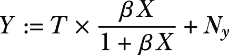

这是一个非线性加性噪声模型（ANM）。一般来说，ANMs 具有以下结构：

*V* = *g*(*V*[*pa*]) + *N*[*v*]

在我们的例子中 *g*(*X*) = *T* × *β* *X* / (1 + *β* *X*)。*N*[*y*]可以是正态（高斯）或非高斯。

##### 将动态建模和仿真与 SCMs（供应链管理）连接

动态模型描述了系统行为随时间演变的方式。正如你在酶建模示例中看到的，动态建模的使用是解决 SCMs 知识获取问题的方法之一。

在本节中，我说明了酶生物学家如何使用特定领域的动态模型，特别是常微分方程（ODE），来构建 SCM。常微分方程只是动态模型的一种类型。另一个例子是计算机仿真模型，如用于气候建模、电网建模和制造业的仿真器。仿真器还可以模拟复杂的社会过程，如金融市场和流行病。仿真软件是一个不断增长的数十亿美元的市场。

在仿真器和其他动态模型中，指定因果关系的“如何”可能比在 SCMs 中更容易。SCMs 需要分配函数来明确捕捉系统的全局行为。动态模型只需要你指定事物从瞬间到瞬间如何变化的规则。然后，通过运行仿真，你可以看到全局行为。权衡的是，动态模型可能运行起来计算成本高昂，并且通常难以在数据上训练动态模型的参数或根据数据作为证据进行推理。这促使了将动态模型的启发式便利性与 SCMs 的统计和计算便利性相结合的有趣研究。

接下来，我们将探讨如何使用回归工具来训练这些加性模型。

### 6.4.7 使用回归工具训练加性模型 SCMs

在统计学中，回归建模找到参数值，以最小化一组预测变量参数化函数与响应变量之间的差异。回归建模库无处不在，加性 SCM 模型的一个优点是它们可以使用这些库来拟合数据上的 SCM 参数。例如，加性模型的参数可以使用标准的线性和非线性回归参数拟合技术（例如，广义最小二乘法）进行拟合。我们还可以利用这些工具的回归拟合优度统计来评估模型解释数据的好坏。

注意，在一般回归模型中的预测者可以是任何你喜欢的。大多数回归建模教学法鼓励你继续添加预测者，以增加拟合优度（例如，调整 R 平方）或减少预测误差。但在 SCM 中，你的预测者仅限于直接的内因原因。

##### 我可以使用广义线性模型作为 SCM 吗？

在统计建模中，广义线性模型（GLM）是线性回归的灵活推广。在 GLM 中，响应变量与预测者的线性函数相关联，并有一个 *链接函数*。此外，响应变量的方差可以是预测者的函数。例如，包括逻辑回归、泊松回归和伽马回归。GLMs 是数据科学家的基本统计工具集。

在 CGM（非 SCM）中，GLM（广义线性模型）是因果马尔可夫核的不错选择。但一个常见的问题是 GLM 是否可以用作 SCM 中的分配函数。

几个 GLM 与加性 SCM 的结构相匹配，但通常最好不将 GLM 视为 SCM 的模板。SCM 中分配函数的功能形式旨在反映变量与其因果父变量之间的因果关系本质。GLM 的功能形式将一个（在某些情况下非线性的）链接函数应用于预测者的线性函数。链接函数的设计是为了将预测者的线性函数映射到标准分布（例如，正态分布、泊松分布、伽马分布）的均值。它并不是为了反映因果假设。

### 6.4.8 超越加性模型

如果分配函数的“如何”需要比加性模型能捕捉到的更细微的差别，不要将自己限制在加性模型上。以生物化学为例，不难想出内因和外因之间的相互作用会促使采用乘性模型的场景。

对于这些更复杂的场景，开始使用概率深度学习工具来实现 SCM（结构化因果模型）是有意义的。

## 6.5 将 SCM 与深度学习结合

让我们回顾一下酶动力学模型，其中酶 *X* 的量是目标蛋白 *Y* 量的原因，如图 6.22 所示。

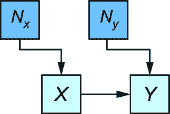

##### 图 6.22 酶 (*X*) 的量是蛋白质 (*Y*) 测量量的原因。

我之前提到，基于在酶生物学研究中流行的动态数学模型，*Y* 的加性分配函数的一个良好候选者是


此外，假设我们从实验中得知 *T* 为 100，*β* 为.08。

理想情况下，我们希望能够从数据中重现这些参数值。更好的是，我们希望利用现代深度学习背后的基于自动微分框架。

### 6.5.1 使用基本 PyTorch 实现和训练 SCM

首先，让我们创建一个 PyTorch 版本的酶模型。

##### 列表 6.13 实现 PyTorch 酶模型

```py
from torch import nn

class EnzymeModel(nn.Module):    #1
    def __init__(self):
        super().__init__()
        self.*β* = nn.Parameter(torch.randn(1, 1))     #2

    def forward(self, x):
        x = torch.mul(x, self.*β*)     #3
        x = x.log().sigmoid()     #4
        x = torch.mul(x, 100.)    #5
        return x
```

#1 创建酶模型。

#2 初始化参数 *D�*。

#3 计算酶量 X 和 *D�* 的乘积。

#4 实现函数 u / (u + 1) 作为 sigmoid(log(u))，因为 sigmoid 和 log 函数是 PyTorch 的本地转换。

#5 乘以 T = 100。

假设我们观察到了来自该系统的数据，如图 6.23 所示。

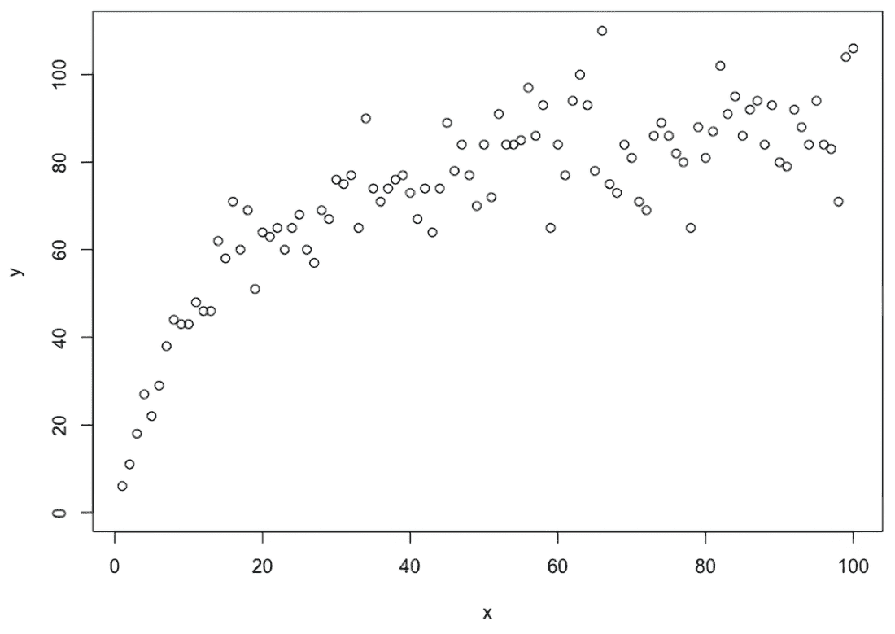

##### 图 6.23 示例酶数据。*X* 是酶的量，*Y* 是目标蛋白的量。

让我们尝试使用基本的 PyTorch 工作流程从这个数据中学习 *β*。

##### 列表 6.14 使用 PyTorch 拟合酶数据

```py
import pandas as pd
from torch import tensor
import torch

df = pd.read_csv("https://raw.githubusercontent.com/altdeep
     /causalML/master/datasets/enzyme-data.csv")    #1
X = torch.tensor(df['x'].values).unsqueeze(1).float()     #2
Y = torch.tensor(df['y'].values).unsqueeze(1).float()     #2

def train(X, Y, model, loss_function, optim, num_epochs):     #3
    loss_history = []     #3
    for epoch in range(num_epochs):    #3
        Y_pred = model(X)    #3
        loss = loss_function(Y_pred, Y)     #3
        loss.backward()   #3
        optim.step()    #3
        optim.zero_grad()     #3
        if epoch % 1000 == 0:     #4
            print(round(loss.data.item(), 6))     #4

torch.manual_seed(1)    #5
enzyme_model = EnzymeModel()
optim = torch.optim.Adam(enzyme_model.parameters(), lr=0.00001)     #6
loss_function = nn.MSELoss()     #7

train(X, Y, enzyme_model, loss_function, optim, num_epochs=60000)
```

#1 从 GitHub 加载酶数据。*#2 将数据转换为张量。

#3 创建训练算法。

#4 打印训练过程中的损失。

#5 设置随机种子以实现可重复性。

#6 初始化 Adam 优化器的一个实例。由于损失对 *D�* 的小变化非常敏感，因此使用低学习率。

#7 使用均方损失误差相当于假设 Ny 是可加的和对称的。*当我用给定的随机种子运行此代码时，它产生了一个 0.1079 的值（你可以通过打印 `enzyme_model.`*β*`.data` 来访问这个值），这个值仅略低于真实值 0.08。此实现没有明确表示外生变量 *N*[y]，但统计学理论告诉我们，使用均方误差损失函数相当于假设 *N*[y] 是可加的并且具有正态分布。然而，它还假设正态分布具有恒定的方差，而散点图中的漏斗形状表明 *N*[y] 的方差可能随着 *X* 的值而增加。

### 6.5.2 使用概率 PyTorch 训练 SCM

这种基本参数优化方法的问题在于 SCM 应该编码一个分布 *P*(*X*, *Y*)。因此，我们可以转向概率建模方法来拟合此模型。

##### 列表 6.15 在概率酶模型中进行贝叶斯估计 *β*

```py
import pyro
from pyro.distributions import Beta, Normal, Uniform
from pyro.infer.mcmc import NUTS, MCMC

def g(u):     #1
  return u / (1 + u)  #1

def model(N):     #2
    *β* = pyro.sample("*β*", Beta(0.5, 5.0))     #3
    with pyro.plate("data", N):     #4
        x = pyro.sample("X", Uniform(0.0, 101.0))     #5
        y = pyro.sample("Y", Normal(100.0 * g(*β* * x), x**.5))     #6
    return x, y

conditioned_model = pyro.condition(     #7
    model,    #7
    data={"X": X.squeeze(1), "Y":  Y.squeeze(1)}    #7
)     #7

N = X.shape[0]    #8
pyro.set_rng_seed(526)    #9

nuts_kernel = NUTS(conditioned_model, adapt_step_size=True)    #10
mcmc = MCMC(nuts_kernel, num_samples=1500, warmup_steps=500)   #10
mcmc.run(N)   #10
```

#1 用于 Y（目标蛋白的量）的分配函数中使用的简单转换

#2 概率模型

#3 我们打算用此模型拟合的参数 *β* 的先验。

#4 为 X 和 Y 的 N=100 个相同且独立分布的值提供一个“板”。

#5 酶的边缘概率 P(X) 是 0 到 101 之间的均匀分布。

#6 P(Y|X) 是给定 X（和 *β*）的 Y（蛋白质浓度）的条件分布。我用一个具有均值和方差的正态分布来模拟 P(Y|X)，这两个值都取决于 Y。

#7 在观察到的证据上对模型进行条件化。

#8 获取数据中的示例数量（100）。

#9 设置随机种子以实现可重复性。

#10 为了学习 *β*，我使用了一个基于梯度的 MCMC 算法，称为 No-U-Turn Sampler（NUTS）。这是许多概率参数学习方法之一，这个选择与你的模型因果元素无关。

这种方法的缺点是它没有显式地表示外生变量。如果我们想使用概率机器学习框架来构建 SCM，我们需要使外生变量显式化。这在前面的方法中具有挑战性，原因之一非常微妙：当我用 Pyro 代码写下以下语句时，`y` `=` `pyro.sample("Y",` `Normal(…, …))`，Pyro 知道使用那个正态分布来计算训练数据中每个 *Y* 值的概率值（更精确地说，是 *似然值*）。这些值用于概率推理算法，如 MCMC。但如果我们写一个表示分配函数的语句，如 `y` `=` `f(x,` `ny)`，Pyro 不会自动知道如何计算 *Y* 的概率值，特别是由于 Pyro 认为 *f*(.)可以是任何东西。

但还有一个比这个问题更重要的问题。到目前为止，我们一直假设我们方便地知道一个基于域的数学函数形式，用于 *Y* 的分配函数。使用深度学习来拟合分配函数会很理想，但这存在问题。

### 6.5.3 神经网络 SCM 和正态化流

假设我们使用神经网络来对 `y` `=` `f(x,` `ny)` 进行建模。实际上，对于给定的 SCM，我们可以使用多层神经网络来对每个变量进行建模，前提是已知其父变量——我们可以称之为“神经网络 SCM”。问题是，我们希望用于我们的分配函数的可训练函数类能够代表我们对因果“如何”的假设。神经网络作为通用的函数逼近器，按照定义，与曲线拟合函数一样，几乎没有假设。因此，为了使用神经网络 SCM，我们需要方法来约束神经网络分配函数，使其忠实于我们的“如何”假设。这可以通过对训练特征、损失函数和神经网络架构元素施加约束来实现。正态化流是后者的一个例子。

回到酶建模的例子，让我们首先列举一些关于酶和它们帮助合成的蛋白质之间关系的基本生物学假设：

+   蛋白质离开系统的过程与酶的量无关。因此，我们预计在酶的量一定的情况下，目标蛋白的量会 *单调递增*。

+   然而，系统往往会饱和，这意味着添加更多酶的回报递减。

我们需要一个只允许单调函数且有递减回报的神经网络方法。为此，我们将使用一种称为 *正态化流* 的深度生成建模方法。

正态化流将复杂概率密度建模为简单基密度可逆变换。我将使用流来将内生变量的分布建模为外生变量分布的可逆变换。有许多不同的变换，但我将使用 *神经样条。¹* 样条是使用分段多项式进行曲线拟合的几十年老方法；神经样条是样条的网络版本。

##### 列表 6.16 为分配函数初始化样条

```py
from pyro.distributions.transforms import conditional_spline
print(conditional_spline(input_dim=1, context_dim=1))     #1
```

#1 神经样条变换是一种可逆的 PyTorch 神经网络模块。

我们得到一个具有 ReLU 激活函数的三层神经网络：

```py
ConditionalSpline(
  (nn): DenseNN(
    (layers): ModuleList(
      (0): Linear(in_features=1, out_features=10, bias=True)
      (1): Linear(in_features=10, out_features=10, bias=True)
      (2): Linear(in_features=10, out_features=31, bias=True)
    )
    (f): ReLU()
  )
)
```

正态化流解决了我们没有 `y` `=` `f(x,` `ny)` 的似然值的问题。与其他概率机器学习模型一样，它们允许我们使用变换层将输入随机变量（如外生变量）连接到输出变量（如内生变量）。关键区别在于，正态化流模型自动计算数据中输出变量的实例的概率值（使用概率论中的 *变量变换公式*）。这种自动计算依赖于单调性；我们的因果“如何”假设是酶浓度与蛋白质丰度之间的关系是单调的，而正态化流为我们提供了单调性。

例如，在以下代码中，`NxDist` 是外生变量 *N*[*x*] 的分布。我们将分布设置为均匀分布（0, 1）。`f_x` 是 *X* 的分配函数，实现为一个将此分布映射到均匀分布（1, 101）的 `AffineTransformation`。

##### 列表 6.17 将 *N*x 的分布转换为 *X* 的分布

```py
from pyro.distributions import TransformedDistribution
from pyro.distributions.transforms import AffineTransform
NxDist = Uniform(torch.zeros(1), torch.ones(1))     #1
f_x = AffineTransform(loc=1., scale=100.0)    #2
XDist = TransformedDistribution(NxDist, [f_x])     #3
```

#1 X 的外生分布是均匀分布（0, 1）。

#2 f_x 的分配函数。AffineTransform 将 Nx 乘以 100 并加 1。

#3 XDist 是 P(X) 的显式表示。乘以 100 并加 1 得到均匀分布（1, 101）。

因此，`XDist` 允许我们在其值由分配函数确定的情况下计算 *X* 的概率值。您可以使用 `XDist.log_prob(torch.tensor([50.0]))` 计算值为 50 的对数概率值，在均匀分布（1, 101）下将是 log(1/100)。

首先，让我们明确模型。

##### 列表 6.18 指定基于流的 SCM

```py
import pyro
from pyro.distributions import (
    ConditionalTransformedDistribution,
    Normal, Uniform,
    TransformedDistribution
)
from pyro.distributions.transforms import (
    conditional_spline, spline
)
import torch
from torch.distributions.transforms import AffineTransform

pyro.set_rng_seed(348)

NxDist = Uniform(torch.zeros(1), torch.ones(1))      #1
f_x = AffineTransform(loc=1., scale=100.0)    #2
XDist = TransformedDistribution(NxDist, [f_x])    #3

NyDist = Normal(torch.zeros(1), torch.ones(1))    #4
f_y = conditional_spline(input_dim=1, context_dim=1)    #5
YDist = ConditionalTransformedDistribution(NyDist, [f_y])     #6
```

#1 X 的外生分布是均匀分布（0, 1）。

#2 f_x 的分配函数。AffineTransform 将 Nx 乘以 100 并加 1。

#3 XDist 是 P(X) 的显式表示。乘以 100 并加 1 得到均匀分布（1, 101）。

#4 Y 的外生分布是正态分布（0, 1）。

#5 我们使用神经样条实现 f_y 的分配函数。优化将优化此样条的参数。

#6 YDist 是 P(Y|X) 的显式表示。

现在我们开始训练。

##### 列表 6.19 训练 SCM

```py
import matplotlib.pyplot as plt

modules = torch.nn.ModuleList([f_y])     #1
optimizer = torch.optim.Adam(modules.parameters(), lr=3e-3)    #2
losses = []
maxY = max(Y)    #3
Ynorm = Y / maxY    #3
for step in range(800):
    optimizer.zero_grad()     #4
    log_prob_x = XDist.log_prob(X)     #5
    log_prob_y = YDist.condition(X).log_prob(Ynorm)     #6
    loss = -(log_prob_x + log_prob_y).mean()     #7
    loss.backward()    #7
    optimizer.step()   #7
    XDist.clear_cache()
    YDist.clear_cache()
    losses.append(loss.item())

plt.plot(losses[1:])     #8
plt.title("Loss")    #8
plt.xlabel("step")     #8
plt.ylabel("loss")   #8
```

#1 为 Y 注册神经样条功能分配函数。

#2 初始化优化器。

#3 对 Y 进行归一化，因为分配函数正在与神经网络一起工作。

#4 将所有梯度设置为 0。

#5 使用 P(X)计算每个 X 值的对数似然值。

#6 使用 P(Y|X)计算给定 X 的每个 Y 值的对数似然值。

#7 使用最大似然作为目标，拟合神经网络模块的参数。

#8 在训练期间可视化损失。

图 6.24 显示了训练过程中的损失。


##### 图 6.24 基于流的 SCM 训练过程的训练损失

现在我们可以从模型中生成样本，并将它们与训练数据进行比较。

##### 列表 6.20 从训练模型生成

```py
x_flow = XDist.sample(torch.Size([100,]))     #1
y_flow = YDist.condition(x_flow).sample(torch.Size([100,])) * maxY   #1

plt.title("""
Observed values of enzyme concentration X\n
and protein concentration Y""")     #2
plt.xlabel('X')     #2
plt.ylabel('Y')    #2
plt.xlim(0, 105)   #2
plt.ylim(0, 120)    #2
plt.scatter(    #2
    X.squeeze(1), Y.squeeze(1), color='firebrick',     #2
    label='Actual Data',    #2
    alpha=0.5     #2
)     #2
plt.scatter(     #2
    x_flow.squeeze(1), y_flow.squeeze(),     #2
    label='Generated values from trained model',     #2
    alpha=0.5     #2
)    #2
plt.legend()     #2
plt.show()     #2
```

#1 从训练模型生成合成示例。

#2 将合成的示例可视化在训练数据中的示例上，以验证模型拟合。

图 6.25 将生成的样本叠加在训练数据中的实际示例上。

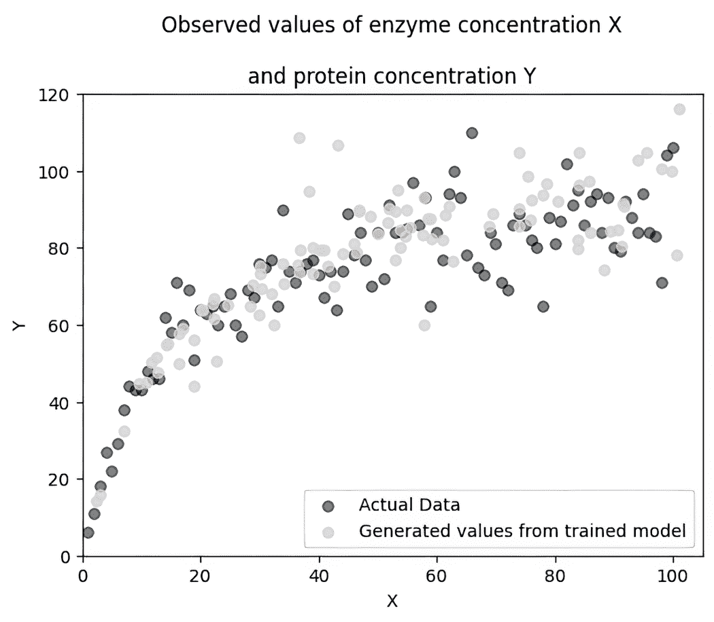

##### 图 6.25 从训练模型生成的示例叠加在训练数据中的实际示例上

能够像其他神经网络框架一样具有多层流动，这使得它成为一个极其灵活的建模类别。但这不仅仅是一个曲线拟合练习。在第五章的变分自动编码器示例中，您看到可以使用神经网络将因果父节点映射到 CGM 泛类中的子效果。但对于 SCM 来说，即使您确定性设置内生变量，这也不够。再次强调，SCM 以分配函数的形式反映了关于因果“如何”的因果假设。在这个酶示例中，我们断言酶和蛋白质丰度之间的单调关系对我们想要做的因果推断很重要，因此我们在分配函数中限制了神经网络（和其他转换）以保持单调性。

## 摘要

+   结构因果模型（SCMs）是一种因果图模型（CGM），它编码的因果假设超越了因果有向无环图（DAG）中编码的假设。因果 DAG 假设捕捉了*什么*导致*什么*。SCM 还捕捉了*如何*原因影响效果。

+   SCM 由外生变量、这些外生变量的概率分布、内生变量和功能分配组成。

+   外生变量代表未建模的原因。

+   内生变量是显式包含在模型中的变量，对应于我们在之前的因果 DAG 中看到的节点。

+   功能分配在给定其因果父变量的情况下，确定性地为每个内生变量设置。

+   SCM 的附加假设以功能分配的形式代表了因果的“如何”。

+   SCM 代表因果的确定性观点，如果所有原因都已知，则结果可以确定。

+   你可以从一个更一般的（非 SCM）CGM 中推导出 SCM。但给定一个一般的 CGM，可能存在多个 SCM，它们包含与该 CGM 相同的 DAG 和联合概率分布。

+   你不能仅从数据中的统计信息中学习 SCM 的功能分配。

+   SCM 是表示具有简单、确定性规则（如游戏）的明确系统的理想选择。

+   加性噪声模型为从头开始构建 SCMs 提供了一个有用的模板。

+   正态化流是当你的因果“如何”假设是单调性时，用于建模 SCMs 的有用概率机器学习框架。

[[1]](#footnote-source-1) 关于神经网络样条的更多信息，请参阅 C. Durkan, A. Bekasov, I. Murray, 和 G. Papamakarios 在*Advances in neural information processing systems*, *32 (NeurIPS 2019)*中的论文“Neural spline flows”。
