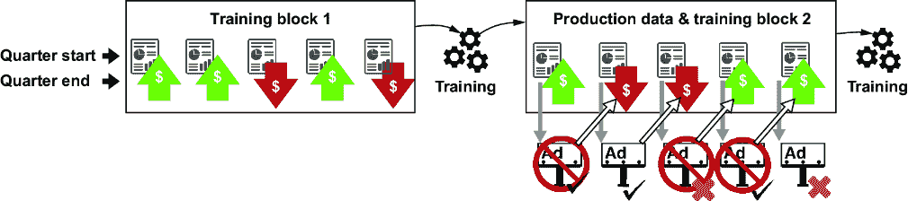
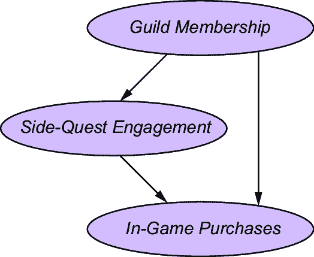
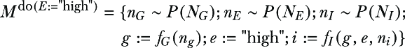
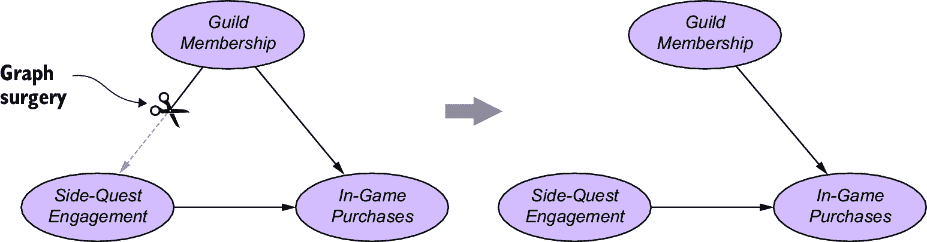
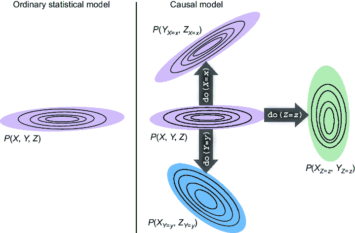
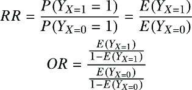
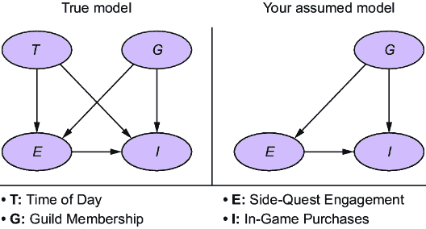
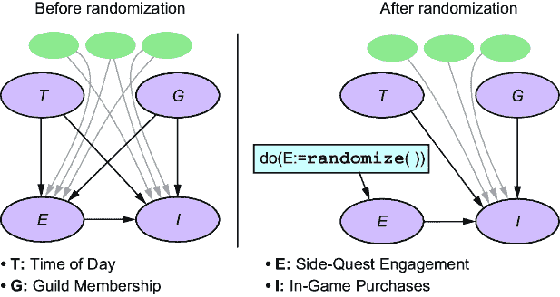

# 第七章：干预和因果关系

### 本章涵盖

+   机器学习工程背景下的干预案例研究

+   干预与 A/B 测试和随机实验的关系

+   使用干预操作符在因果模型上实施干预

+   使用因果模型来表示许多干预分布

+   因果效应作为干预分布的自然扩展

干预是代理机构为了引起其他事物发生而采取的行动。干预会改变数据生成过程（DGP）。

干预是我们定义因果关系中最基本的概念。例如，干预的概念，用“操纵”和“变化”一个因素来表述，是 1979 年一本有影响力的实验设计教科书中定义的核心：

> 因果关系中的典范断言是：对原因的操纵将导致结果的操纵……因果关系意味着通过改变一个因素，我可以使另一个因素发生变化。¹

干预是我们从相关性到因果性的途径。相关性是对称的；关于“亚马逊的笔记本电脑销量与亚马逊的笔记本电脑包销量相关”和“亚马逊的笔记本电脑包销量与亚马逊的笔记本电脑销量相关”的陈述是等价的。但干预使因果关系成为单向的：如果亚马逊推荐笔记本电脑的销售，笔记本电脑包的销量将会增加，但如果亚马逊推广笔记本电脑包的销售，我们不会期望人们通过购买新的笔记本电脑来填充它们。

一个模型必须有一种推理干预的方法才能进入因果模型俱乐部。任何允许你推理干预如何改变 DGP 的模型，按定义，就是一个因果模型。

你可能已经熟悉以实验形式进行的干预，例如 A/B 测试或随机临床试验。这类实验专注于推断因果关系。简单来说，因果关系就是比较不同干预措施（例如，治疗和控制，或 A/B 测试中的“A”和“B”）的预期结果。

在本章中，你将学习如何建模干预和因果关系，即使实际上我们无法或不能在现实生活中进行干预。我们将从激发建模干预的案例研究开始本章。所有用于执行这些案例研究的数据库和笔记本都可在[`www.altdeep.ai/p/causalaibook`](https://www.altdeep.ai/p/causalaibook)找到。

## 7.1 干预案例研究

机器学习模型可以驱动决策以进行“干预”。这些干预反过来又可能创造出与模型训练期间不同的条件。这种训练条件和部署条件的不匹配可能导致问题。

### 7.1.1 案例研究：预测天气与业务表现

每天当你醒来，望向窗外，猜测今天是否会下雨。基于这个猜测，你决定是否在早上上班的路上带上伞。有好几次你猜错了；要么你带了伞但没下雨，看起来像个傻瓜，要么你没带伞，结果下雨了，看起来很湿。你决定训练一个机器学习模型，该模型将在早上获取详细的气象数据，并预测是否会下雨。通过利用机器学习来获得更准确的预测，你期望在决定是否带伞时犯的错误更少。

你首先收集每日气象数据作为特征，并记录是否下雨作为标签。经过足够多的日子，你就有了第一块训练数据。接下来，你在这些训练数据上训练模型，并在保留数据上验证其准确性。最后，你部署了训练好的模型，这意味着你每天使用它来决定是否带伞。当你使用部署的模型时，你继续每天记录特征和标签。最终，你有了足够多的额外数据来形成第二个训练块，你重新训练模型以从这两块数据中受益，从而比仅训练第一块数据后获得更高的准确性。随着你收集更多数据块，你继续迭代地训练模型。图 7.1 说明了工作流程。


##### 图 7.1 机器学习训练工作流程的示例，其中传感器数据是特征，天气是标签，带伞是决策。在每个训练块之后，新数据用于更新旧模型，并部署新模型。在这种情况下，决策不会影响未来的数据。

现在让我们考虑一个并行于商业的例子。你是一家公司的数据科学家。你有的不是气象数据，而是经济和行业数据。你不是预测天气是否会下雨，而是预测季度是否会以低收入结束。你不是决定是否带伞，而是决定是否做广告。图 7.2 说明了工作流程，这与图 7.1 中的天气例子完全相同；图 7.1 中的晴朗和雨天映射到图 7.2 中的好季度和坏季度，而带伞或不带伞的决定映射到做广告或不做广告的决定。



##### 图 7.2 这是图 7.1 中工作流程的镜像示例。业务指标是特征，季度业绩是标签，广告是决策。在这种情况下，决策会影响未来的数据。

尽管这两个例子中的标签和决策相互对应，但商业示例的因果关系在本质上不同；带伞的行为不会影响未来几天的天气，但广告行为会影响未来几个季度的商业。因此，训练块 2 代表了一个与训练块 1 不同的 DGP，因为在训练块 2 中的收入受到了广告的影响。在训练过程中，一个简单的预测模型可能会将一个糟糕季度的迹象与*高*收入联系起来，因为在过去，糟糕季度的迹象导致你的公司进行广告宣传，从而提高了收入。

我们部署机器学习模型来驱动或自动化决策。这些决策不会影响气象学、地质学和天文学等领域的数据。但在我们想要使用机器学习的许多（如果不是大多数）领域，这些由模型驱动的决策是干预——改变 DGP 的行动。这可能导致模型训练和部署条件之间的不匹配，导致模型可靠性的问题。

这个问题的另一个现实世界例子发生在异常检测中。

### 7.1.2 案例研究：信用欺诈检测

异常检测旨在预测何时发生异常事件。一个例子是在信用卡上检测欺诈交易。信用卡公司使用交易数据对欺诈预测模型进行监督训练，其中信用卡交易属性（购买模式、位置、商品成本等）是特征，而客户是否后来报告交易为欺诈是标签。

正如天气和商业示例中一样，你在一个初始训练块上训练模型。训练完成后，你可以部署算法以实时预测欺诈。当交易启动时，算法运行，并生成预测。如果算法预测欺诈，则拒绝交易。

当这个系统处于部署状态时，第二个训练集正在被编译。一些欺诈仍然得以通过，并被客户后来报告为欺诈。这些交易在这个新数据块中被标记为欺诈，但 DGP（数据生成过程）已经从初始训练集改变。部署的 1.0 版本预测模型正在拒绝它预测为欺诈的交易，但由于它们被拒绝，你不知道它们是否真的是欺诈案例。这些被拒绝的交易因为缺乏标签而被排除在下一个训练集之外。

如果模型在第二个块上重新训练，它可能会发展出对欺诈的偏见，这种偏见在欺诈拒绝系统中被遗漏，并对被拒绝的欺诈案例产生偏见。这种偏见可能会在多次迭代中变得更加严重。这个过程类似于一个随着时间的推移在解决涉及不常见武器的案件方面做得很好但在涉及枪支的案件方面做得不好的谋杀案侦探。

在部署中过滤欺诈交易是一种干预措施。在实践中，异常检测算法通过某种方式考虑干预来解决这个问题。

### 7.1.3 案例研究：在线角色扮演游戏的统计分析

假设你是一家在线角色扮演游戏公司的数据科学家。你的领导想知道支线任务参与度（与游戏主要目标无关的迷你目标）是否是虚拟物品游戏内购买的驱动因素。如果答案是肯定的，公司将在游戏动态中干预，使玩家参与更多支线任务。

你进行了一项分析。你查询数据库并抽取了一千名玩家的记录，其中前五名显示在表 7.1 中。这是观察数据（与实验数据相对），因为数据是玩家登录和玩游戏时的自然行为记录。（完整数据集可在本章的笔记本中找到：[`www.altdeep.ai/p/causalaibook`](https://www.altdeep.ai/p/causalaibook)。)

##### 表 7.1 *支线任务参与度* 和 *游戏内购买* 观察数据的示例行

| 用户 ID | 支线任务参与度 | 游戏内购买 |
| --- | --- | --- | --- |
| 71d44ad5  | 高  | 156.77  |
| e6397485  | 低  | 34.89  |
| 87a5eaf7  | 高  | 172.86  |
| c5d78ca4  | 低  | 215.74  |
| d3b2a8ed  | 高  | 201.07  |
| dc85d847  | 低  | 12.93  |

标准的数据科学分析将涉及对假设进行统计检验，即高度参与支线任务的玩家的 *游戏内购买* 与低 *支线任务参与度* 的玩家之间存在差异。该测试计算两组 *游戏内购买* 样本均值之间的数学差异。在统计学上，这个差异估计了一个 *效应量*。该测试将检验这个估计的效应量是否与零有显著差异。

##### 设置你的环境

本章的代码是用 Pyro 版本 1.9.0、pandas 版本 2.2.1 和 pgmpy 版本 0.1.25 编写的。使用 Pyro 的 `render` 函数将 Pyro 模型可视化为 DAG 将需要 Graphviz。访问 [`www.altdeep.ai/p/causalaibook`](https://www.altdeep.ai/p/causalaibook) 获取包含代码的笔记本链接。

我们将使用 pandas 库执行这个假设检验。首先，我们将获取数据并获取每个组内的样本均值和标准差。

##### 列表 7.1 加载 *支线任务参与度* 与 *游戏内购买* 数据并总结

```py
import pandas as pd
data_url = (    #1
    "https://raw.githubusercontent.com/altdeep/causalML/master/"     #1
    "datasets/sidequests_and_purchases_obs.csv"    #1
)     #1
df = pd.read_csv(data_url)    #1
summary = df.drop('User ID', axis=1).groupby(     #2
    ["Side-quest Engagement"]     #2
).agg(     #2
    ['count', 'mean', 'std']     #2
)     #2
summary
```

#1 从数据库查询中加载数据到 pandas DataFrame。

#2 对于每个 *支线任务参与度* 的级别（“低”，“高”），计算样本计数（玩家数量）、游戏内购买的平均金额和标准差。

这生成了表 7.2 的总结。

##### 表 7.2 在线游戏数据的汇总统计

| 支线任务参与度 | 平均购买 | 标准差 | n |
| --- | --- | --- | --- |
| 低  | 73.10  | 75.95  | 518  |
| 高   | 111.61  | 55.56  | 482  |

这个数据库查询检索了 1,000 名玩家，其中 482 名高度参与支线任务，518 名没有参与。高度参与玩家的平均*游戏内购买*金额约为 112 美元，对于高*支线任务参与度*，而低*支线任务参与度*为 73 美元。将数据推广到这个范围之外，我们得出结论，高度参与支线任务的玩家平均比不参与的玩家多花费 112 - 73 = 39 美元。我们可以运行双样本*Z*测试来确保这种差异是显著的。

##### **列表 7.2 测试参与对*游戏内购买*的影响是否具有统计学意义**

```py
n1, n2 = summary['In-game Purchases']['count']    #1
m1, m2 = summary['In-game Purchases']['mean']   #2
s1, s2 =  summary['In-game Purchases']['std']     #3
pooled_std = (s1**2 / n1 + s2**2 / n2) **.5   #4
z_score = (m1 - m2) / pooled_std    #5
abs(z_score) > 2\.   #6
```

#1 n1 和 n2 是每个组（高参与度与低参与度）中的玩家数量。

#2 m1 和 m2 是组样本均值。

#3 s1 和 s2 是组标准差。

#4 通过合并（组合）组标准差来估计平均支出的差异标准误。

#5 将数据转换为 z 分数，该分数在（零假设）不同参与级别之间支出无差异的情况下具有标准正态分布。

#6 测试 z 分数是否超过 0 的 2 个标准差，这超过了 5%的显著性阈值。

运行此代码显示均值差异是显著的。太好了，你进行了一些数据科学，表明你有一个具有统计学意义的效果量：与不参与的玩家相比，高度参与支线任务的玩家的*游戏内购买*显著更高。基于你的发现，管理层决定修改游戏动态以吸引玩家参与更多支线任务。结果，*游戏内购买*量*下降*。这怎么可能发生呢？

### 7.1.4 从随机实验到干预

到现在为止，你可能已经认识到列表 7.2 的结果是相关关系不意味着因果关系的教科书式例子。如果管理层想知道干预游戏动态是否会增加*游戏内购买*，他们应该依赖于来自随机实验的分析，而不是简单的观察数据。我们将使用随机实验来增强对干预正式模型的直觉，并看看这个干预模型如何模拟随机实验。

### 7.1.5 从观察到实验

假设你运行的不是观察研究，而是实验。而不是从 SQL 查询中提取数据，你随机选择一组 1,000 名玩家，并将他们随机分配到两个 500 人的组中。在一个组中，游戏动态被修改，使得*支线任务参与度*被人为地固定在“低”，而在另一个组中则固定在“高”。然后我们将观察他们的*游戏内购买*水平。

这将创建与第 7.1.3 节中观察数据大小相同，并且参与和不参与玩家大致分割相同的实验数据。同样，我们将运行相同的前向分析。这将使我们能够对使用观察数据与实验数据进行苹果对苹果的比较。

表 7.3 显示了实验数据的示例。您可以在 [`www.altdeep.ai/p/causalaibook`](https://www.altdeep.ai/p/causalaibook) 找到数据链接。

##### 表 7.3 评估 *支线任务参与度* 对 *游戏内购买* 影响的实验数据示例行

| 用户 ID | 支线任务参与度 | 游戏内购买 |
| --- | --- | --- |
| 2828924d  | 低  | 224.39  |
| 7e7c2452  | 低  | 19.89  |
| 3ddf2915  | 低  | 221.26  |
| 10c3d883  | 高  | 93.21  |
| c5080957  | 高  | 61.82  |
| 241c8fcf  | 高  | 188.76  |

再次，我们使用以下代码总结数据。

##### 列表 7.3 加载实验数据并总结

```py
import pandas as pd
exp_data_url = (     #1
    "https://raw.githubusercontent.com/altdeep/causalML/master/"   #1
    "datasets/sidequests_and_purchases_exp.csv"     #1
)    #1
df = pd.read_csv(exp_data_url)     #1
summary = df.drop('User ID', axis=1).groupby(    #2
    ["Side-quest Engagement"]     #2
).agg(     #2
    ['count', 'mean', 'std']    #2
)
print(summary)
```

#1 从数据库查询中加载实验数据到 pandas DataFrame。

#2 对于每个支线任务参与度级别（“低”，“高”），计算样本计数（玩家数量）、样本平均游戏内购买金额和标准差。

表 7.4 显示了与表 7.2 对观察数据所做的相同汇总统计，对于实验数据。

##### 表 7.4 在线游戏实验数据的汇总统计

| 支线任务参与度 | 平均购买 | 标准差 | n |
| --- | --- | --- | --- |
| 低  | 92.99  | 51.67  | 500  |
| 高  | 131.38  | 94.84  | 500  |

实验反映了公司干预以增加*支线任务参与度*时发生的情况。与我们的第一次分析相比，效应量的符号是负的；我们得到了 –38.39，这意味着平均购买量下降了 $38.39。当我们重新运行列表 7.4 中的显著性测试时，我们看到实验数据与观察数据一样，差异是显著的。

##### 列表 7.4 对（实验）平均购买差异进行显著性测试

```py
n1, n2 = summary['In-game Purchases']['count']     #1
m1, m2 = summary['In-game Purchases']['mean']     #2
s1, s2 =  summary['In-game Purchases']['std']    #3
pooled_std = (s1**2 / n1 + s2**2 / n2) **.5    #4
z_score = (m1 - m2) / pooled_std     #5
abs(z_score) > 2\.    #6
```

#1 n1 和 n2 是每个小组（高参与度 vs 低参与度）中的玩家数量。

#2 m1 和 m2 是组样本均值。

#3 s1 和 s2 是组标准差。

#4 通过合并（组合）组标准差来估计平均花费差异的标准误差。

#5 转换为 z 分数，在（零假设）花费水平无差异的假设下具有标准正态分布。

#6 测试 z 分数是否超过 0 的 2 个标准差，这超过了 5% 的显著性阈值。

结果显示，组均值差异再次显著。如果你报告的是实验结果而不是观察研究的成果，你就会正确地得出结论：鼓励更高的*支线任务参与度*的政策会导致平均*游戏内购买*（以及你不会推荐这样做）的下降。

这个实验是有成本的。实验中包含的 1000 名玩家中，许多人如果没有被包括在实验中，他们会在*游戏内购买*上花费更多，尤其是对于被分配到高支线任务组的 500 名玩家。这相当于没有进行实验就会实现的收入损失。此外，实验为那些被分配到与其偏好水平不同的*支线任务参与度*水平的玩家创造了次优的游戏体验。这些玩家为公司支付了一定体验的费用，而实验降低了这种体验。

最不理想的结果是基于我们对观测数据的简单双样本分析进行报告；这没有成本，但给出了错误的答案。更好的结果是运行实验并得到正确的答案，尽管这需要付出代价。理想的结果是在观测数据上免费得到正确的答案。要做到这一点，我们需要一个因果模型。

### 7.1.6 从实验到干预

让我们看看如何使用因果模型来模拟从观测数据中得到的实验结果。首先，让我们假设图 7.3 中的因果 DAG。


##### 图 7.3 一个简单的 DAG，展示了*支线任务参与度*和*游戏内购买*之间的因果关系。*公会成员资格*是两者的共同原因。

在我们的在线游戏中，许多玩家是公会成员。公会是一群玩家，他们聚集资源并协调他们的游戏玩法，例如一起完成支线任务。我们的模型假设玩家进行的*游戏内购买*数量也取决于他们是否在公会中；同一公会的成员聚集资源，许多资源是他们必须购买的虚拟物品。

假设你运行了一个修改后的初始数据库查询版本。查询产生了与表 7.1 中看到的相同的观测数据，但这次它包括了一个额外的列，表示*公会成员资格*。同样，我们在表 7.5 中看到了六名玩家（与表 7.1 中显示的玩家相同）。

##### 表 7.5 与表 7.1 相同的观测数据，但增加了*公会成员资格*列

| 用户 ID | 支线任务参与度 | 公会成员资格 | 游戏内购买 |
| --- | --- | --- | --- |
| 71d44ad5  | 高  | 成员  | 156.77  |
| e6397485  | 低  | 非成员  | 34.89  |
| 87a5eaf7  | 高  | 非成员  | 12.93  |
| c5d78ca4  | 低  | 成员  | 215.74  |
| d3b2a8ed  | 高  | 成员  | 201.07  |
| dc85d847  | 低  | 非成员  | 34.89  |

我们将使用 Pyro 在这个观测数据上构建一个因果图模型。为此，我们需要对因果马尔可夫核进行建模：给定**公会成员资格**的**公会成员**、**支线任务参与度**以及给定**公会成员资格**和**支线任务参与度**的**游戏内购买**的概率分布。在我们的 Pyro 模型中，我们需要为这些变量指定一些典型分布并估计它们的参数。

#### 估计参数和构建模型

Pyro 可以联合估计我们每个因果马尔可夫核的参数，就像它可以估计复杂神经网络架构中的参数一样。但使用日常数据科学分析，通过利用第二章中讨论的**参数模块化**概念，一次估计每个核的参数会使我们的工作更简单。让我们从**公会成员资格**开始。

##### 列表 7.5 估计**公会成员资格**的概率分布

```py
import pandas as pd
full_obs_url = (     #1
    "https://raw.githubusercontent.com/altdeep/causalML/master/"     #1
    "datasets/sidequests_and_purchases_full_obs.csv"    #1
)    #1
df = pd.read_csv(full_obs_url)      #1
membership_counts = df['Guild Membership'].value_counts()    #2
dist_guild_membership = membership_counts / sum(membership_counts)     #2
print(dist_guild_membership)    #2
```

#1 从数据库查询中加载数据到 pandas DataFrame 中。

#2 计算成员与非成员的比例。

这将打印出以下结果：

```py
nonmember    0.515
member       0.485
Name: Guild Membership, dtype: float64
```

这些是数据中公会成员与非成员的比例。我们可以将这些作为估计玩家是成员或非成员的概率。如果我们直接使用这些比例，它们将是概率的最大似然估计，但为了简单起见，我们将将其设置为 50/50（成为成员的概率为.5）。

接下来，我们将对给定**公会成员资格**的**支线任务参与度**条件概率分布（CPD）做同样的处理。

##### 列表 7.6 估计**支线任务参与度**给定**公会成员资格**的 CPD

```py
member_subset = df[(df['Guild Membership'] == 'member')]     #1
member_engagement_counts = (   #1
    member_subset['Side-quest Engagement'].value_counts()   #1
)    #1
dist_engagement_member = (    #1
    member_engagement_counts / sum(member_engagement_counts)   #1
)    #1
print(dist_engagement_member)    #1

nonmember_subset = df[(df['Guild Membership'] == 'nonmember')]    #2
nonmember_engagement_counts = (   #2
    nonmember_subset['Side-quest Engagement'].value_counts()    #2
)     #2
dist_engagement_nonmember = (    #2
    nonmember_engagement_counts /   #2
sum(nonmember_engagement_counts)    #2
)     #2
print(dist_engagement_nonmember)     #2
```

#1 计算当玩家是公会成员时，**支线任务参与度**水平（“高”与“低”）的概率分布。

#2 计算当玩家不是公会成员时，**支线任务参与度**水平（“高”与“低”）的概率分布。

列表 7.6 打印了以下输出，显示了公会成员的**支线任务参与度**水平比例：

```py
high    0.797938
low     0.202062
```

以下比例适用于非公会成员：

```py
high    0.184466
low     0.815534
```

同样，我们将对这些结果进行四舍五入。公会成员有 80%的可能性在支线任务中高度参与，而非成员只有 20%的可能性高度参与。

最后，对于**公会成员资格**和**支线任务参与度**的每个组合，我们将计算**游戏内购买**的样本均值和标准差。当我们编码因果模型中**游戏内购买**的因果马尔可夫核时，我们将使用这些样本统计量作为典型分布中均值和位置参数的估计。

##### **列表 7.7 按参与度和**公会成员资格**级别计算购买统计数据***

```py
purchase_dist_nonmember_low_engagement = df[     #1
    (df['Guild Membership'] == 'nonmember') &    #1
    (df['Side-quest Engagement'] == 'low')    #1
].drop(     #1
  ['User ID', 'Side-quest Engagement', 'Guild Membership'], axis=1   #1  
).agg(['mean', 'std'])    #1
print(round(purchase_dist_nonmember_low_engagement, 2))    #1

purchase_dist_nonmember_high_engagement = df[     #2
    (df['Guild Membership'] == 'nonmember') &    #2
    (df['Side-quest Engagement'] == 'high')    #2
].drop(     #2
  ['User ID', 'Side-quest Engagement', 'Guild Membership'], axis=1     #2
).agg(['mean', 'std'])    #2
print(round(purchase_dist_nonmember_high_engagement, 2))    #2

purchase_dist_member_low_engagement = df[     #3
    (df['Guild Membership'] == 'member') &    #3
    (df['Side-quest Engagement'] == 'low')    #3
].drop(     #3
  ['User ID', 'Side-quest Engagement', 'Guild Membership'], axis=1     #3
).agg(['mean', 'std'])     #3
print(round(purchase_dist_member_low_engagement, 2))     #3

purchase_dist_member_high_engagement = df[     #4
    (df['Guild Membership'] == 'member') &    #4
    (df['Side-quest Engagement'] == 'high')    #4
].drop(    #4
  ['User ID', 'Side-quest Engagement', 'Guild Membership'], axis=1    #4
).agg(['mean', 'std'])     #4
print(round(purchase_dist_member_high_engagement, 2))   #4
```

#1 估计具有低支线任务参与度的非公会成员的游戏内购买样本均值和标准差。

#2 估计具有高支线任务参与度的非公会成员的游戏内购买样本均值和标准差。

#3 估计低支线任务参与度的公会成员的游戏内购买的样本均值和标准差。

#4 估计高支线任务参与度的公会成员的游戏内购买的样本均值和标准差。

对于低*支线任务参与度*的非公会成员，我们有这些结果：

```py
      In-game Purchases
mean              37.95
std               23.80
```

对于高*支线任务参与度*的非公会成员，我们有

```py
      In-game Purchases
mean              54.92
std                4.92
```

对于低*支线任务参与度*的公会成员，我们有

```py
      In-game Purchases
mean             223.71
std                5.30
```

对于高*支线任务参与度*的公会成员，我们有

```py
      In-game Purchases
mean             125.53
std               53.44
```

最后，在第 7.8 列表中，我们使用这些各种统计量作为在 Pyro 中构建的因果图模型中的参数估计。

##### 列表 7.8 在 Pyro 中构建*游戏内购买*的因果模型

```py
import pyro
from torch import tensor
from pyro.distributions import Bernoulli, Normal

def model():
    p_member = tensor(0.5)    #1
    is_guild_member = pyro.sample(    #1
        "Guild Membership",     #1
        Bernoulli(p_member)     #1
    )     #1
    p_engaged = (tensor(0.8)*is_guild_member +    #2
                 tensor(.2)*(1-is_guild_member))    #2
    is_highly_engaged = pyro.sample(    #2
        "Side-quest Engagement",     #2
        Bernoulli(p_engaged)     #2
    )     #2
    get_purchase_param = lambda param1, param2, param3, param4: (     #3
        param1 * (1-is_guild_member) * (1-is_highly_engaged) +     #3
        param2 * (1-is_guild_member) * (is_highly_engaged) +   #3
        param3 * (is_guild_member)   * (1-is_highly_engaged) +    #3
        param4 * (is_guild_member)   * (is_highly_engaged)     #3
    )     #3
    μ = get_purchase_param(37.95, 54.92, 223.71, 125.50)     #4
    σ = get_purchase_param(23.80, 4.92, 5.30, 53.49)    #4
    in_game_purchases = pyro.sample(    #4
        "In-game Purchases",   #4
        Normal(μ, σ)     #4
    )   #4
    guild_membership = "member" if is_guild_member else "nonmember"     #5
    engagement = "high" if is_highly_engaged else "low"   #5
    in_game_purchases = float(in_game_purchases)     #5
    return guild_membership, engagement, in_game_purchases     #5
```

#1 公会成员与非成员的概率为.5。使用这个概率，我们从伯努利分布中生成了一个公会成员资格值（成员为 1，非成员为 0）。

#2 我们从伯努利分布（高为 1，低为 0）中生成了一个支线任务参与度的值，其参数取决于公会成员资格。

#3 用于计算游戏内购买参数的辅助函数

#4 我们使用在观测数据中找到的样本均值来指定游戏内购买的正态分布的位置参数。

#5 与均值参数一样，我们使用在数据中找到的标准差来指定游戏内购买的正态分布的尺度参数。

为了确认 Pyro 模型编码了一个因果 DAG，我们可以运行`pyro.render_model(model)`，这将产生图 7.4。



##### 图 7.4 调用`pyro.render_model`与因果模型的结果

##### 利用概率编程的参数灵活性

注意我们在 Pyro 模型中建模变量的选择灵活性。例如，在建模*游戏内购买*的分布时，我们使用了正态分布，但我们可以使用其他分布。例如，*游戏内购买*不能是负数，因此我们可以选择一个仅对正数定义的规范分布，而不是对负数和正数都定义的正态分布。这对于低*支线任务参与度*的非公会成员特别有用，因为从均值为 37.95 和尺度参数为 23.80 的正态分布生成将大约有 5.5%的概率生成负值。然而，我们选择在这个情况下稍微偷懒，使用正态分布，因为几个负数的*游戏内购买*对我们的分析结果影响不大。

重点是，概率编程工具如 Pyro 为我们提供了参数灵活性，与 pgmpy 等工具不同。利用这种灵活性来反映你对 DGP 的假设是一种好的做法。

#### Pyro 的干预抽象

Pyro 在 `pyro.do` 中提供了一个表示干预的抽象。它接受一个模型并返回一个新的模型，该模型反映了干预。列表 7.9 展示了我们可以如何使用 `pyro.do` 将之前的模型转换为反映将 *侧任务参与度* 设置为“高”和“低”的干预的模型。

##### 列表 7.9 使用 `pyro.do` 表示干预

```py
int_engaged_model = pyro.do(    #1
    model,    #1
    {"Side-quest Engagement": tensor(1.)}   #1
)    #1
int_unengaged_model = pyro.do(     #2
    model,    #2
    {"Side-quest Engagement": tensor(0.)}     #2
)    #2
```

#1 将 *侧任务参与度* 设置为 1.0（即，“高”）。这将返回一个新的模型。

#2 将 *侧任务参与度* 设置为 0.0（即，“低”）。这将返回一个新的模型。

现在我们有两个新的模型：一个将 *侧任务参与度* 设置为“高”，另一个将其设置为“低”。如果我们的原始模型是正确的，从每个新干预模型中生成 500 个示例，并将它们合并成 1000 个示例，实际上 *模拟* 了实验。记住，我们仅使用表 7.4 中展示的观察数据来估计这个因果模型的参数。如果我们能在观察数据上训练一个模型，并使用它来准确模拟实验结果，那么我们就无需实际运行实验。

列表 7.10 使用 `int_engaged_model` 和 `int_unengaged_model` 来模拟实验数据。我们可以通过比较此模拟数据的汇总统计与实际实验数据的汇总统计来确认模拟的有效性。

##### 列表 7.10 使用 `pyro.do` 干预模拟实验数据

```py
pyro.util.set_rng_seed(123)    #1
simulated_experimental_data = [    #2
    int_engaged_model() for _ in range(500)    #2
] + [     #2
    int_unengaged_model() for _ in range(500)     #2
]    #2
simulated_experimental_data = pd.DataFrame(    #2
    simulated_experimental_data,    #2
    columns=[    #2
        "Guild Membership",    #2
        "Side-quest Engagement",    #2
        "In-Game Purchases"    #2
    ]    #2
)     #2
sim_exp_df = simulated_experimental_data.drop(     #3
    "Guild Membership", axis=1)    #3
summary = sim_exp_df.groupby(     #4
        ["Side-quest Engagement"]    #4
    ).agg(    #4
        ['count', 'mean', 'std']     #4
    )     #4
print(summary)    #4
```

#1 为可重复性设置随机种子。

#2 从每个干预模型中模拟 500 行，并将它们合并以创建模拟的实验数据。

#3 模拟数据将包括一个公会会员资格列。我们可以删除它以获得看起来像原始实验的模拟数据。

#4 重新创建每个参与度级别的游戏内购买统计摘要。

此代码模拟了实验，提供了表 7.6 中的总结。同样，这些是从我们创建的模拟实验中获得的样本统计，我们首先在观察数据上估计了一些参数，其次，使用这些参数构建了一个因果生成模型，第三，使用 `pyro.do` 来模拟干预的结果。将这些与表 7.7 中的统计数据进行对比，后者是我们从 *实际* 实验数据中获得的。

##### 表 7.6 模拟实验的汇总统计

| 侧任务参与度 | 数量 | 平均值 | 标准差 |
| --- | --- | --- | --- |
| 高 | 500 | 89.897309 | 52.696709 |
| 低 | 500 | 130.674021 | 93.921543 |

##### 表 7.7 实际实验的汇总统计

| 侧任务参与度 | 数量 | 平均值 | 标准差 |
| --- | --- | --- | --- |
| 高 | 500 | 92.99054 | 51.673631 |
| 低 | 500 | 131.38228 | 94.840705 |

这两组汇总数据足够相似，我们可以断言我们已经成功地从观察数据中复制了实验结果。

### 7.1.7 概述

让我们回顾一下。因果 DAG 与 Pyro 干预抽象的结合使我们能够在观察数据集上进行分析，其结果与在实验数据集上进行分析的结果相同。如果您在初始观察数据上运行此分析而不是简单的双样本统计检验，您就会为领导提供正确的答案，他们就不会改变动态来增加 *Side-Quest Engagement*。

注意，这并不是免费的午餐。这项分析需要以因果 DAG 形式表示的因果假设。在指定因果 DAG 时出现的错误可能导致分析输出的错误。但假设您的因果 DAG 是正确的（或足够接近），这将为您节省实际成本和机会成本。

那么 `pyro.do` 究竟是如何工作的？它是如何修改模型来表示干预的？我们将通过理想干预和干预算子的概念来回答这些问题。

## 7.2 理想干预和干预算子

为了理解我们的模拟实验是如何工作的，我们需要干预的明确定义。我们将使用一个特定的定义，称为 *理想干预*，也称为 *原子干预*、*结构干预*、*外科干预* 和 *独立干预*。

理想干预的定义可以分为三个部分：

+   理想干预针对 DGP 中的特定变量或一组变量。

+   该操作将那些变量设置为固定值。

+   通过将变量设置为固定值，干预阻止了来自目标原因的影响，使得目标现在在统计上与其原因独立。

我们将使用符号 do(*X*=*x*) 来表示一个理想干预，即将 *X* 设置为 *x*。请注意，我们可以在一组变量上执行干预，例如 do(*X*=*x*, *Y*=*y*, *Z*=*z*)。

### 7.2.1 干预算子

因果模型表示 DGP 中的关系。理想干预的前述定义描述了它是如何 *改变* DGP 的。现在，剩下的任务是我们如何定义我们的因果模型将如何反映这种变化。

*干预算子* 是一种改变我们的因果模型以反映干预的方式。创建任何新颖的因果计算表示的第一个任务之一就是为理想干预定义干预算子。

干预算子可以实施理想干预、随机干预（在第 7.5 节中讨论）和其他类型的干预。除非我另有说明，否则您可以假设“干预算子”指的是“理想干预的干预算子”。

幸运的是，结构因果模型和一般因果图模型都有明确定义的干预算子。我们将探讨这些，以及查看为因果程序如 `pyro.do` 设计的干预算子。

### 7.2.2 结构因果模型中的理想干预

我们将从结构因果模型开始。让*M*代表在线游戏的结构因果模型。我们会将*M*写成如下形式：


*f*[*G*]，*f*[*E*]，和*f*[*I*]分别是*G*（公会会员资格），*E*（支线任务参与），和*I*（游戏内购买）的分配函数。

理想干预 do(*E*=“高”)将模型转换如下：



SCM 的干预算子用干预值“高”替换干预目标*E*的分配函数。

假设你有一个包含变量（或一组变量）*X*的 SCM。你想要应用干预 do(*X*=*x*)。干预算子用干预值替换干预目标的分配函数。

考虑这一点如何满足我们理想干预定义的三个要素：

+   干预 do(*X*=*x*)只直接影响*X*的分配函数。其他分配函数不受影响。

+   干预明确地将*X*设置为特定的值。

+   由于*X*的值被设定为常数，它不再依赖于其直接的因果父节点。

### 7.2.3 图形手术：因果 DAG 和因果图形模型中的理想干预

现在，我们将考虑如何图形化地思考理想的干预。首先，让我们重新审视图 7.5 中在线游戏的因果 DAG。


##### 图 7.5 在线游戏的因果 DAG

根据我们的图表，*公会会员资格*是*支线任务参与*的因果父节点。这种父子关系决定了因果马尔可夫核——在*公会会员资格*给定的情况下，*支线任务参与*的条件概率分布。回想一下我们展示在表 7.8 中的这个因果马尔可夫核模型。

##### 表 7.8 支线任务参与的因果马尔可夫核的条件概率表

*|  | 公会会员资格 |

| --- | --- |
| --- | --- |
| 非成员 | 成员 |
| --- | --- |
| 支线任务参与 | 低  | .8  | .2  |

| 高  | .2  | .8  |*   *想象一下我们实验的机制。玩家登录，数字实验平台选择一些玩家参与实验。其中一些玩家是公会成员，而另一些则不是。

考虑一个名为 Jojo 的玩家，他不是公会成员，正在登录。根据我们的模型，仅凭这些信息，他在这次游戏会话中高度参与支线任务的概率将是 20%。

但实验平台选择他进行实验。它随机将他分配到高**支线任务参与度**组。一旦他进入这个组，Jojo 在支线任务中高度参与的概率是多少？答案是 100%。在实验术语中，被分配到处理组的人接触到治疗的可能性是多少？100%。对于熟悉 A/B 测试术语的数据科学家来说，被分配到 A 组的人接触到变体 A 的可能性是多少？100%。

事实上，假设实验对象不是 Jojo，而是 Ngozi，她是一名公会成员。虽然最初 Ngozi 有 80%的可能性在支线任务中高度参与，但在实验中被分配到高**支线任务参与度**组后，她改变为有 100%的可能性高度参与。

我们需要重写我们的**支线任务参与度**的条件概率分布，以反映这些新的概率，如表 7.9 所示。

##### 表 7.9 重写**支线任务参与度**的条件概率表，以反映在实验中被分配到高参与度组后参与度的确定性

|  | 公会成员 |
| --- | --- |
| 非成员 | 成员 |
| --- | --- |
| 支线任务参与度 | 低   | 0.0  | 0.0  |
| 高   | 1.0  | 1.0  |

现在我们看到，无论是否为**公会成员**，这种修改后的**支线任务参与度**分布都是相同的。这就是概率独立的定义，因此我们应该简化这个条件概率表以反映这一点；我们可以将表 7.9 简化为表 7.10。

##### 表 7.10 重写**支线任务参与度**的条件概率表，以反映参与度不再依赖于**公会成员**

| 支线任务参与度 | 低   | 0.0  |
| --- | --- | --- |
| 高   | 1.0  |

当我们以这种方式简化分布时，我们必须记住这是一个因果马尔可夫核的模型，它由图定义。我们的初始图表明**支线任务参与度**是由**公会成员**引起的。但似乎在实验随机将玩家分配到高参与度或低参与度组之后，这种因果依赖性被打破了；玩家的参与度完全由他们被分配到的组决定。

我们需要一个干预操作符，以改变我们的因果图来反映这种断裂的因果依赖性。这个干预操作符被称为**图手术**（也称为**图突变**），如图 7.6 所示。



##### 图 7.6 图手术移除了干预目标**支线任务参与度**的入边。

虽然*公会成员资格*在正常设置中是*支线任务参与*的原因，但实验对*支线任务参与*的干预打破了该变量对*公会成员资格*的因果依赖。由于这种因果依赖已经消失，图手术改变了图，使得从*公会成员资格*到*支线任务参与*的边被剪断。

通常，假设你有一个带有节点*X*的因果图。你想应用一个干预 do(*X*=*x*)。然后你通过“手术”移除所有指向*X*的入边来在因果 DAG 上表示该干预。图手术在如 pgmpy 之类的库中可用。例如，以下是使用 pgmpy 对在线游戏 DAG 应用图手术的方法。

##### 列表 7.11 pgmpy 中对 DAG 的图手术

```py
from pgmpy.base import DAG

G = DAG([     #1
    ('Guild Membership', 'Side-quest Engagement'),     #1
    ('Side-quest Engagement', 'In-game Purchases'),     #1
    ('Guild Membership', 'In-game Purchases')    #1
])     #1
G_int = G.do('Side-quest Engagement')    #2
```

#1 构建因果 DAG。

#2 DAG 类中的 do 方法应用图手术。

我们现在可以绘制原始 DAG 和转换后的 DAG，并比较它们。

##### 列表 7.12 绘制转换后的 DAG

```py
import pylab as plt
import networkx as nx

pos = {     #1
    'Guild Membership': [0.0, 1.0],     #1
    'Side-quest Engagement': [-1.0, 0.0],     #1
    'In-game Purchases': [1.0, -0.5]     #1
}     #1

ax = plt.subplot()     #2
ax.margins(0.3)    #2
nx.draw(G, ax=ax, pos=pos, node_size=3000,    #2
        node_color='w', with_labels=True)   #2
plt.show()    #2

ax = plt.subplot()     #3
ax.margins(0.3)     #3
nx.draw(G_int, ax=ax, pos=pos,    #3
        node_size=3000, node_color='w', with_labels=True)     #3
plt.show()     #3
```

#1 创建一个节点位置的字典，我们可以用它来可视化两个图。

#2 可视化原始图。

#3 可视化转换后的图。

这些可视化产生了与图 7.6 相同的 DAG。

接下来，我们将研究图手术对 d 分离及其对条件独立性的影响。

### 7.2.4 图手术和 d 分离

考虑图手术如何影响 d 分离推理，如图 7.7 所示。最初，我们有*支线任务参与*和*游戏内购买*之间的两个 d 连通路径：一条是直接因果路径，另一条是通过*公会成员资格*的共同原因。图手术之后，只剩下直接因果路径。


##### 图 7.7 在原始 DAG 的左侧，*支线任务参与*和*游戏内购买*之间存在两个 d 连通路径。这些路径等于两个变量之间的统计依赖来源。图手术之后，只剩下因果路径，反映了因果依赖。

回想一下，两个变量之间的每个 d 连通路径都是这些变量之间统计依赖的来源。当我们用一个通过图手术移除干预目标（的）入边来表示干预时，我们移除了通过该变量原因的任何路径。只剩下到其他节点的出路径。因此，从该变量剩余的路径反映了该变量对其他变量的因果影响所导致的依赖。理想干预消除了目标变量从其直接父变量接收的因果影响。因此，它消除了通过这些父变量流动到其他变量的任何依赖。

### 7.2.5 理想干预和因果马尔可夫核

在因果 DAG 上进行的图手术移除了目标节点（的）入边。然而，对于因果图模型，我们需要一个干预算子，该算子不仅改变图，而且进一步重写干预目标的因果马尔可夫核，就像我们将表 7.9 折叠成表 7.10 时所做的那样。

最初，我们的在线游戏模型具有因果马尔可夫核{*P*(*G*), *P*(*E*|*G*), 和 *P*(*I*|*E*, *G*)}。在表 7.9 中，我们看到了*P*(*E*|*G*)的条件概率表表示以及如何通过干预将其减少到表 7.10，其中 100%的概率被放置在结果“高”上。

通常，因果图模型的干预算子用退化分布替换干预目标的因果马尔可夫核（们），这意味着一个将 100%的概率放在一个值上的分布，即干预值。

当我们将图手术与用退化分布替换目标节点因果马尔可夫核结合起来时，我们得到了一个因果图模型的干预算子，该算子符合理想干预定义的三个要素：

+   你只为干预目标节点移除入边。

+   将 100%的概率分配给一个固定值。

+   移除干预目标节点的入边意味着该变量不再因果依赖于其父节点。

在列表 7.11 中，图手术在`DAG`类的`do`方法中实现。我们的默认构建因果图模型的`BayesianNetwork`类也有一个`do`方法。与`DAG`方法类似，它接受一个干预目标。在撰写本文时，该方法不接受干预值，因此不满足理想干预定义的第二要素。

pgmpy 使用`BaseFactor`类（例如，`TabularCPD`类）的子类对象来表示因果马尔可夫核。`BayesianNetwork`类的`do`方法首先进行图手术，然后替换表示干预目标因果马尔可夫核的因子对象。然而，那个替换因子对象不是退化的；它不会将所有概率值分配给一个结果。相反，它返回一个对象，表示在原始未修改图中对其父节点进行边缘化后的目标变量的概率分布。技术上，这是一个随机干预的干预算子，我将在第 7.5 节中讨论。要构建理想干预的干预算子，你需要编写额外的代码来修改因子，使其将所有概率分配给干预值。

### 7.2.6 因果程序中的理想干预

回想一下，在列表 7.10 中，我们使用`pyro.do`运算符模拟了一个实验，其中玩家被分配到高参与度和低参与度组。具体来说，我们像以下列表那样调用`pyro.do`。

##### 列表 7.13 回顾`pyro.do`

```py
int_engaged_model = pyro.do(     #1
    model,    #1
    {"Side-quest Engagement": tensor(1.)}    #1
)    #1
int_unengaged_model = pyro.do(     #2
    model,     #2
    {"Side-quest Engagement": tensor(0.)}     #2
)     #2
```

#1 一种将 Side-Quest Engagement 设置为 1.0（即，“高”）的干预。这将返回一个新的模型。

#2 一种将 Side-Quest Engagement 设置为 0.0（即，“低”）的干预。这将返回一个新的模型。

`pyro.do` 究竟做了什么？`pyro.do` 是 Pyro 的干预操作符。我们通过使用 `pyro.render_model` 生成图 7.4，看到 Pyro 中的在线游戏模型有一个潜在的因果有向图（DAG），因此它是一个因果图模型。

但是，像 Pyro 这样的深度概率机器学习框架允许你做一些我们难以用因果有向图（DAG）表示的事情，例如递归、条件控制流，或者有随机数量的变量直到运行时才实现。作为一个干预操作符，`pyro.do` 也必须在这些情况下工作。

Pyro 中的干预操作符通过查找对 `pyro.sample` 的调用，并用对干预值的赋值来替换这些调用来实现。例如，在线游戏模型有以下一行：

```py
is_highly_engaged = pyro.sample("Side-quest Engagement", Bernoulli(p_engaged))
```

`pyro.sample` 调用为 *Side-Quest Engagement* 生成一个值。`pyro.do(model, {"Side-quest Engagement": tensor(1.)})` 在本质上用以下内容替换了那一行：

```py
is_highly_engaged = tensor(1.)
```

（我说“本质上”是因为 `pyro.do` 还做了几件其他事情，我将在第十章中讨论）。

这种替换类似于在系统动力学（SCM）中替换赋值函数，或者在因果图模型中使用退化核。作为一个干预操作符，它满足了理想干预的标准。它针对一个特定的变量，并给它赋予一个特定的值。通过消除其依赖性（通过移除程序中先前语句执行的结果的依赖性），它消除了其因果关系。

使用像 Pyro 这样的灵活深度概率机器学习工具构建因果模型，允许你构建超越 DAG 和简单理想干预的因果表示。这样做将你置于理论基础尚不发达的领域，但这可能导致有趣的新应用。

在下一节中，我们将考虑干预如何影响概率分布。

## 7.3 干预变量和分布

理想干预固定了它所针对的随机变量，本质上将其转变为一个常数。但是，干预间接影响了目标变量下游的所有随机变量。因此，它们的概率分布（联合、条件或边缘）从它们原本的状态发生了变化。

### 7.3.1 “Do” 和反事实符号

因果建模使用特殊的符号来帮助推理干预如何影响随机变量及其分布。一种常见的方法是使用*“do”-notation*。以我们的在线游戏为例，*P*(*I*)是所有玩家中*In-Game Purchases*的概率分布，*P*(*I*|*E*=“high”)是在具有“高”参与度的玩家中*In-Game Purchases*的概率分布，而*P*(*I*|do(*E*= “high”))是在将玩家的参与度设置为“高”的干预下*In-Game Purchases*的概率分布。表 7.11 的第二列说明了这种符号扩展到联合分布、多个干预以及将干预与观察混合。

##### 表 7.11 Do-notation 和 Counterfactual notation 的示例

| 文字描述 | Do-notation | Counterfactual notation |
| --- | --- | --- |
| 所有玩家中*In-Game Purchases*的概率分布 | *P*(*I*)  | *P*(*I*)  |
| 具有高参与度的玩家的*In-Game Purchases*的概率分布 | *P*(*I*&#124;*E*=“high”)  | *P*(*I*&#124;*E*=“high”)  |
| 当玩家的参与度（通过干预）设置为“高”时，*In-Game Purchases*的概率分布 | *P*(*I*&#124;do(*E*= “high”))  | *P*(*I**[E]*[= “high”])  |
| 当参与度设置为“高”时，*In-Game Purchases*和*Guild Membership*的联合概率分布 | *P*(*I*, *G*&#124;do(*E*=“high”))  | *P*(*I*[E=“high”], *G*[E=“high”])  |
| 当参与度设置为“高”且会员设置为“非会员”时，*In-Game Purchases*的概率分布 | *P*(*I*&#124;do(*E*=“high”, *G*=“nonmember”))  | *P*(*I**[E]*[= “high”,] *[G]*[=“nonmember”])  |
| 当参与度设置为“高”时，公会成员的*In-Game Purchases*的概率分布 | *P*(*I*&#124;do(*E*=“high”), *G*=“member”)  | *P*(*I**[E]*[=][“high”]&#124;*G*=“member”)  |

另一种方法是使用反事实符号，它使用下标来表示系统暴露于干预后变量的新版本。例如，如果*I*是一个表示*In-Game Purchases*的变量，*I*[*E*][=“high”]表示在将*Side-Quest Engagement*设置为“高”的干预下*In-Game Purchases*。如果*P*(*I*)是*In-Game Purchases*的概率分布，那么*P*(*I*[*E*][=“high”])也是概率分布。同样，表 7.11 在第三列中对比了 do-notation 与 counterfactual notation。接下来，我将主要使用 counterfactual notation。

##### 从因果语言到符号

在统计学和机器学习的许多情况下，符号仅用于给可以用普通语言轻松解释的东西增加形式化和严谨性。然而，在因果关系中，符号很重要，因为它清楚地区分了我们是在谈论因果关系还是不是。这很重要，因为在普通英语中区分这一点更困难。例如，考虑以下两个问题：

“对于在支线任务中高度参与的玩家，*游戏内购买*会是什么样子？”

“如果玩家在支线任务中高度参与，*游戏内购买*会是什么样子？”

你是否明显地认为第一个问题对应于*P*(*I*|*E*=“high”)，第二个对应于*P*(*I*[*E*][=“high”])？第一个问题对应于高度参与的玩家子集。当我们想聚焦于分布或人群的子集时，传统的条件概率符号是合适的。第二个问题询问“如果”有人高度参与。在下一章中，我们将看到“如果”假设性问题意味着干预。但是，由于语言的模糊性，有人可能问一个问题，而实际上意味着另一个。符号给我们提供了一个无歧义的方式来构建我们的因果查询。

再次，在第八章中，我们将探讨更多将语言映射到反事实符号的例子。

### 7.3.2 当因果符号简化为传统符号时

认识到变量及其干预下的同一变量是否相同至关重要。考虑图 7.8 中的干预参与度。


##### 图 7.8 在原始 DAG（左）中，*支线任务参与度*和*游戏内购买*之间存在两条 d-连接路径。这些路径等同于两个变量之间的统计依赖来源。经过图手术，只有因果路径保留，反映了因果依赖。

*P*(*G*|*E*=“high”)（在*高* *支线任务参与度*下*公会成员资格*的概率分布）是否与*P*(*G*)相同？不。在图形术语中，*G*和*E*是 d-连接的。在概率术语中，我们可以推理出，知道玩家的*支线任务参与度*水平可以预测他们是否在公会中。

但是，*P*(*G*[*E*][=“high”])是否与*P*(*G*)相同？是的。*公会成员资格*不受*支线任务参与度*干预的影响，因为它只能影响*支线任务参与度*下游的变量。因此，*P*(*G*[*E*][=“high”])等价于*P*(*G*).

在一般意义上，从经验上学习变量 *Y*[*X*][=][*x*] 的分布需要在实际生活中进行干预。然而，这种实际生活中的干预，至多是有成本的，在最坏的情况下是不可行的或不可能的。所以如果我们能将 *Y*[*X*][=][*x*] 等同于一些包含 *Y* 的分布，我们可以从观察数据中学习，那将是一个胜利。这是从相关性到因果性的转变。在简单的情况下，我们可以通过查看图表来完成这项工作，就像我们对 *G* 和 *G*[*E*][=“high”] 所做的那样。但通常，我们需要进行一些数学推导，无论是手动还是使用算法。

这个任务被称为 *识别*，它是因果推断理论的核心。我们将在第十章详细探讨识别问题。

### 7.3.3 因果模型表示所有干预分布

作为生成模型，我们处理过的因果模型编码了 DGP 组件的联合概率分布。推理算法使这些模型能够表示（例如，通过蒙特卡洛抽样）给定其他组件状态的某些组件子集的条件分布。

我们现在已经介绍了理想的干预以及它是如何改变数据生成过程（DGP）和变量的联合概率分布的。图 7.9 说明了生成因果模型如何捕捉原始 DGP（及其对应的概率分布）以及通过干预原始过程创建的任何新的 DGP（及其对应的概率分布）。



##### 图 7.9 假设我们的数据生成过程（DGP）包含变量 *X*、*Y* 和 *Z*。一个传统的生成模型（左侧）使用 *X*、*Y* 和 *Z* 的观测值来统计学习 *P*(*X*, *Y*, *Z*) 的表示。一个生成因果模型（右侧）编码 *P*(*X*, *Y*, *Z*) 的表示以及通过对 *X*、*Y* 和 *Z* 进行干预得到的分布。通过这种方式，生成因果模型表示了一组广泛的分布。

考虑这个想法的统计含义。给定数据，一个普通生成模型学习联合概率分布的表示。但一个生成因果模型不仅学习那个分布，还学习通过应用一些理想干预所得到的新分布。这就是我们的在线游戏因果模型能够仅通过观察数据重现实验结果的原因。

## 7.4 干预和因果效应

我们干预的正式模型最常见的用途将是建模 *因果效应*。现在我们已经定义和形式化了干预，因果效应就很容易考虑了；它们仅仅是干预结果的比较。

### 7.4.1 二元原因的平均处理效应

最常见的因果效应查询是平均处理效应 (ATE)。在这里，我们将关注我们感兴趣于 *X* 对 *Y* 的因果效应的情况，且 *X* 是二元的，意味着它有两个结果：1 和 0。二元原因涉及实验，其中原因有一个“治疗”值和一个“控制”值，例如“A/B 测试”。使用 do-notation，ATE 是 *E*(*Y*|do(*X*=1)) – *E*(*Y*|do(*X*=0))（回忆 *E*(…) 表示“…的期望”）。使用反事实符号，ATE 是 *E*(*Y*[*X*][=][1]) – *E*(*Y*[*X*][=][0])。反事实符号的优点是我们可以将它简化为一个期望项，*E*(*Y*[*X*][=1] – *Y*[*X*][=0])。

### 7.4.2 有类别原因的平均处理效应

当原因是有类别的，ATE 需要选择你想要比较的原因的哪些水平。例如，如果 *X* 有可能的取值 {a, b, c}，你可能会选择“a”作为基线，并使用两个 ATE，*E*(*Y*[*X*][=][*b*] – *Y*[*X*][=][*a*]) 和 *E*(*Y*[*X*][=][*c*] – *Y*[*X*][=][*a*])。或者，你也可以选择处理 *X* 的所有成对比较的水平，或者仅仅将 *X* 转换为一个二元变量，其结果为“a”和“非 a”。选择取决于哪个 ATE 对你最有意义。

### 7.4.3 连续原因的平均处理效应

如果我们要将 *E*(*Y*[*X*][=][1] – *Y*[*X*][=][0]) 推广到 *X* 连续的情况，我们就会进入微分学的领域。对于一些基线 do(*X*=*x*)，想象一下通过改变干预值 *x* 的某个小量 Δ，即 do(*X*=*x*+Δ)。取两个结果之间的差值，我们得到 *E*(*Y*[*X*][=][*x*][+][Δ] – *Y*[*X*][=][*x*])。然后我们可以问，当我们使 Δ 无限小的时候，*E*(*Y*[*X*]) 的变化率是多少。这带我们来到了导数的定义：


注意，这是一个函数，而不是一个点值；当你插入一个 *x* 的值时，你得到的是 *X* 与 *Y*[*x*] 曲线的 *Y*[*X*][=][*x*] 的变化率。

作为实际例子，考虑药理学的情况，我们想要建立药物剂量对健康结果的平均处理效应。药物剂量是连续的，通常遵循非线性 S 形曲线；随着剂量的增加，我们得到更多的效果，但最终在较高剂量时效果会递减。导数给出了给定剂量在剂量-反应曲线上的平均响应变化率。

### 7.4.4 条件平均处理效应

条件平均处理效应 (CATE) 是基于其他协变量的 ATE。例如，在我们的在线游戏示例中，*E*(*I*[*E*][=“high”] – *I*[*E*][=“low”]) 是 *Side-Quest Engagement* 的 *In-Game Purchases* 上的 ATE。如果我们想了解公会成员的 ATE，我们想要 *E*(*I*[*E*][=“high”] – *I*[*E*][=“low”]| *G*=“member”)。

在实际设置中，通常重要的是使用 CATEs 而不是 ATEs，因为 CATEs 可能与 ATEs 和其他在不同条件下有不同的 CATEs 有很大的差异。换句话说，CATEs 更好地反映了人群中处理效应的*异质性*。例如，可能 ATE 在整体人群中对于一个健康结果的影响是正的，但基于特定亚群体（例如，有某种过敏的人）的条件 CATE 可能是负的。同样，在广告中，某些广告文案可能会使你的客户平均购买更多，但可能使某些客户群体购买更少。通过理解每个细分市场的 CATEs，你可以优化广告活动的投资回报率，或者使用基于 CATE 的推理来进行客户细分。

专家们经常强调使用 CATEs 来衡量*异质处理效应*的重要性，以免人们认为 ATE 的点值估计就能说明全部情况。但在我们的概率建模方法中，异质性是核心。如果我们有一个因果图模型和一个理想干预模型，那么我们可以建模*P*(*Y*[*X*][=][*x*])。如果我们能建模*P*(*Y*[*X*][=][*x*])，那么我们就可以建模*P*(*Y*[*X*][=][1] – *Y*[*X*][=][0])。然后我们可以使用这个模型来检查*P*(*Y*[*X*][=][1] – *Y*[*X*][=][0])中的所有变异，包括目标群体中谁高于或低于 0 或某个其他阈值。

### 7.4.5 关联性和因果性的统计度量

在统计学中，效应量是一个衡量两个变量或群体之间关系强度或强度的值。例如，在我们对在线游戏数据的观察性分析中，我们量化了*Side-Quest Engagement* *E*和*In-Game Purchases* *I*之间的关系，表示为*E*(*I*|*E*=“high”) – *E*(*I*|*E*=“low”)。我们的统计程序通过两组样本平均数之间的差异来估计这个*真实*效应量。然后我们进行了一个假设检验。我们指定了一个零假设*E*(*I*|*E*=“high”) – *E*(*I*|*E*=“low”) = 0，然后通过在某个零假设分布（通常是正态分布或 t 分布）下计算出的*p*-值来测试这个效应量估计是否与 0 有统计学上的差异。

因果效应只是一个*干预性*效应量；在我们的例子中，它是*E*(*I*|do(*E*=“high”)) – *E*(*I*|do(*E*=“low”)) = *E*(*I*[*E*][=][“high”] – *I*[*E*][=][“low”])，这就是 ATE。统计假设检验程序与之前相同。实际上，我们仍然需要测试基于样本的 ATEs 和 CATEs 的估计是否具有统计学上的显著性。当你对一个有处理组和对照组的实验数据进行统计显著性测试时，你按照定义是在测试 ATE 的估计。

### 7.4.6 因果性与回归模型

假设 *X* 是连续的，但与 *Y*[*X*] 的关系是线性的。那么平均处理效应（ATE）*d* *E*(*Y*[*X*][=][*x*])/*dx* 是一个点值，因为线性函数的导数是一个常数。因此，如果你使用 *E*(*Y*[*X*]) 的线性模型，那么该模型中 *X* 的系数对应于 *X* 的 ATE。


因此，线性回归建模是建模因果效应的一种流行方法（即使人们并不真正相信因果关系的线性）。

这种便利性也扩展到其他广义线性模型。假设泊松回归或逻辑回归比线性回归更好地模拟了 *E*(*Y*[*X*])。这些模型将两个变量之间的关联度量不是作为均值差异，而是作为比率。例如，我们可以直接从泊松回归模型中读取相对风险（RR），并直接从逻辑回归模型中读取优势比（OR）。一般来说，这些关联度量没有因果解释，但一旦我们使用它们与干预变量一起使用，我们就给予它们因果解释。例如，如果我们正在模拟 *E*(*Y*[*X*])，并且 *Y*[*X*] 是二元的，那么相对风险和优势比如下：



因此，一旦我们在干预背景下使用它们，传统的非因果统计关联量化方法就变成了因果关联的度量。并且当我们将这些回归模型拟合到数据中时，我们仍然可以使用所有传统的回归方法进行显著性检验（Wald 检验、F 检验、似然比检验等）。

## 7.5 随机干预

随机干预是理想干预的一种重要推广。理想干预的第二条规则是干预被设定为固定值。在随机干预中，这个值是随机过程的输出；即，它本身是一个随机变量。大多数文本将随机干预视为因果建模导论范围之外的先进主题，但我特别提到它们，因为它们在机器学习中非常重要，在那里我们经常寻求数据驱动的自动化。随机干预对于自动选择干预措施非常重要。

### 7.5.1 实验中的随机分配是一种随机干预

例如，我们在线游戏实验中的数字实验平台自动将玩家分配到高参与度和低参与度组。它是随机这样做的。随机分配是一种随机干预；它针对 *Side-Quest Engagement* 变量，并通过数字抛硬币来设定其值。

注意，随机化不仅仅是我们需要达到正确答案的方法。事实上，在我们的实验模拟中，没有随机化，只有理想化的干预。这些理想化的干预足以 d 分离路径*支线任务参与* ← *公会会员* → *游戏内购买*，消除了由此路径带来的统计依赖。如果随机化不是量化因果关系所必需的，为什么它被称为“因果推断的黄金标准？”答案在于，当你的因果 DAG 错误时，随机化是有效的。

例如，假设当我们进行实验时，并不是将玩家随机分配到高*支线任务参与*组或低*支线任务参与*组，而是数字实验平台自动将前 500 名登录的玩家分配到高*支线任务参与*组，接下来的 500 名玩家分配到低*支线任务参与*组。这种干预足以 d 分离路径*支线任务参与* ← *公会会员* → *游戏内购买*。但如果我们 DAG 错误，并且存在其他路径通过未知的共同原因连接*支线任务参与*和*游戏内购买*，会怎样呢？

图 7.10 考虑了当我们的 DAG（有向无环图）错误时会发生什么——我们的模型是右侧的 DAG。考虑如果真正的 DAG 是左侧的 DAG，会发生什么。对于左侧的 DAG，玩家登录的时间驱动了*支线任务参与*和*游戏内购买*。



##### 图 7.10 左：真实的因果关系。右：你（错误）的因果 DAG。

例如，假设登录较早的人往往不太可能与朋友一起登录。他们更倾向于参与支线任务，因为支线任务适合单人游戏。那些与朋友计划任务的人往往登录较晚，因为一些朋友在白天有现实世界的约会。一起玩的朋友更专注于游戏的主要叙事，并避免支线任务。此外，玩家往往在一天晚些时候在*游戏内购买*上花费更多，这与电子商务中晚些时候的广泛消费趋势相呼应。

当我们根据玩家的登录信息将他们分配到某一组或另一组时，这种干预的价值现在取决于一天中的时间，如图 7.11 所示。

图 7.11 的左侧展示了基于一天中某个时间点的 *Side-Quest Engagement* 介入的结果。正如我们所预期的那样，介入执行了图手术，移除了指向 *Side-Quest Engagement* *E* 的入边：*T*→*E* 和 *G*→*E*。然而，现在介入设置的价值由时间 *T* 决定，通过一个 `time_select` 函数。`time_select` 函数将“高”参与度分配给那些登录时间早于第 501 位登录玩家的玩家，而对于那些登录时间晚于第 501 位玩家的玩家则分配“低”参与度。在图手术之后，我们添加了一个新的因果边 *T*→*E*，其机制是 `time_select`。因此，仍然存在一个非因果的统计关联，通过 d 连通路径 *I*←*T*→*E* 偏斜了实验。


##### 图 7.11 一个基于登录时间变化设置 *Side-Quest Engagement* 水平的介入，但没有消除 T→*E* 的因果关系。相比之下，随机化消除了指向 *E* 的入边。

与之相反，图 7.11 右侧的随机化实现了我们希望的效果，移除了所有指向 *E* 的入边。它甚至移除了来自 *T*→*E* 的边，尽管我们假设的 DAG 并不知道 *T*→*E* 存在。实际上，如果 *E* 和 *I* 之间存在其他未知的共同原因，随机化将移除指向 *E* 的这些入边，如图 7.12 所示。



##### 图 7.12 随机化消除了来自未知共同原因的入边。

随机化能够消除我们假设中未能考虑到的共同原因的统计偏差，这就是为什么它被认为是“因果推断的黄金标准”。但为了理解随机介入，请注意，两种分配机制：一种基于登录时间，另一种使用随机化，都是随机介入。两者都使用随机过程设置玩家的 *Side-Quest Engagement* 水平；一个取决于登录时间，另一个取决于抛硬币的结果。

### 7.5.2 介入策略

随机介入与自动化决策领域的策略密切相关，例如赌博算法和强化学习。在这些领域，一个代理（例如，机器人、推荐算法）在某个环境中操作。一个 *策略* 是一个算法，它接受环境中的某些变量的状态作为输入，并为代理返回一个执行的动作。如果该动作的选择中存在随机元素，则它是一个随机介入。

在我们之前的例子中，随机化是一种选择干预措施的政策。但在自动化决策中，大多数政策都是基于系统中其他变量的状态来选择干预措施，就像基于*一天中的时间*变量进行干预的有偏实验一样。当然，自动化决策中的政策通常试图优化某个效用函数，而不是使实验有偏见。我们将在第十二章中关注自动化决策中的因果关系。

## 7.6 建模干预措施的实际考虑

我将以一些关于建模干预措施的实际考虑来结束这一章。我们将考虑理想（和随机的）干预措施如何使我们能够模拟不可能发生的事情。然后，我们将确保将这种建模建立在实用主义的基础上。

### 7.6.1 关于现实中无法实施的干预措施的推理

在我们的在线游戏示例中，我们使用因果模型上的干预操作来复制实验结果。我提出了实际运行实验和模拟实验之间的选择。模拟避免了运行实验的成本，但运行实验对因果假设中的错误更稳健，特别是使用随机化等工具时。

然而，有许多时候我们无法进行实验，因为这样做要么不可行，要么不道德，或者不可能。

+   *不可行实验的例子*——一项随机实验，测试利率对代际财富的影响。

+   *不道德实验的例子*——一项随机实验，测试咖啡因对流产的影响。

+   *不可能实验的例子*——一项随机实验，测试黑洞大小对光谱红移的影响。

在这些情况下，使用因果模型进行模拟是我们的唯一选择。

### 7.6.2 反驳和现实世界干预

假设你的因果模型预测了干预措施的结果。然后你在现实世界中实施该干预措施，例如通过一个受控实验。如果你的预测干预结果与实际干预结果相冲突，那么你的因果模型就是错误的。

在第四章中，我们讨论了通过检查数据以寻找违反模型 DAG 条件独立性含义的依赖性证据来验证（或更确切地说，*反驳*）因果模型的概念。在第十一章中，我们将反驳从因果 DAG 扩展到感兴趣的因果推断（例如，估计因果效应）。然而，比较预测和实际干预结果给我们提供了一个比第四章和第十一章中的方法更强的反驳标准。当然，问题是进行这些现实世界干预必须是可行的。

假设它们是，比较预测和现实世界干预的结果提供了一个很好的迭代框架来构建因果模型。首先，列出你可以在现实世界中应用的干预措施。选择其中之一，使用你的模型来预测其结果，然后在现实世界中实施干预。如果结果不匹配，更新你的模型，使其匹配。重复此过程，直到你耗尽进行现实世界干预的能力。

在现实世界中进行干预通常需要资源和时间。为了节省成本，使用你的因果模型来预测你可以进行的所有干预，根据哪个更有趣或更令人惊讶来排序预测的结果，然后根据这个排序优先进行现实世界的干预。有趣或令人惊讶的干预预测可能是你的模型错误的迹象，所以优先考虑它们意味着你将更快、成本更低地对你的模型进行重大更新。如果你的模型最终证明是正确的，你将花费更少的代价来获得对 DGP 的一些重要见解。

### 7.6.3 “没有操纵就没有因果关系”

“没有操纵就没有因果关系”背后的想法是，应该在因果模型中定义变量，使得如何干预的机制是清晰的。这里的清晰意味着你可以运行一个实施干预的现实世界实验，或者如果实验不可行、不道德或不可能，你至少可以清楚地阐述假设实验将如何进行。“没有操纵就没有因果关系”本质上是在尝试将因果模型的抽象与实验语义联系起来。

例如，这个想法的支持者可能会反对在因果模型中将“种族”作为一个原因，因为从实验中应用干预的角度来看，种族的概念是模糊的——你如何在保持一个人除种族之外的所有其他因素不变的情况下改变他们的种族呢？他们更愿意用足够精确的术语来定义变量，以便在理论上可以进行干预，例如“贷款官员的种族偏见”或“申请表上的种族指标”。当然，我们对像“种族”这样的模糊抽象有很多重要问题要问，所以我们不希望增加太多的精确度，以至于我们无法以有助于回答这些问题的方式推广我们分析的结果。

建立这种与实验的联系的一种策略是在我们的模型中包含我们可以在假设实验中操纵的变量。例如，如果我们对财富→焦虑的因果关系感兴趣，我们可以添加一个“现金补贴”变量和现金补贴→财富边。现金补贴代表对个人的直接支付，这在实验中比直接操纵个人的财富更容易实现。

### 7.6.4 模拟“非理想”干预

通常，我们在实际设置中使用的干预类型可能难以映射到理想干预。例如，一位生物学家可能正在研究细胞中不同基因表达的因果关系，如基因 A → 基因 B → 基因 C。生物学家可能想知道细胞环境中的应激源（例如，毒素或缺氧）如何影响基因表达。应激源是一个干预；它改变了数据生成过程（DGP）。然而，将其建模为理想干预是具有挑战性的，因为这可能不清楚哪些基因会受到应激源的直接影响的基因，或者应激源设置的特定基因表达量是多少。对这些干预的实际解决方案是将它们明确地建模为因果 DAG 中的根节点，如图 7.13 中的缺氧节点。


##### 图 7.13“缺氧”是一个没有特定目标的干预。将其作为根节点包含，并连接到所有可能受影响的变量。

将干预明确表示为 DGP 的一部分不如理想（或随机）干预表达性强，后者捕捉了任意干预如何*改变*DGP。

## 摘要

+   干预是改变数据生成过程（DGP）的行为。干预对于定义因果关系和因果模型是基本的。

+   许多，如果不是大多数，由机器学习驱动的决策都是可以改变模型部署环境与训练环境不同的干预。

+   能够建模干预使得人们可以模拟实验的结果。

+   使用干预模型模拟实验可以节省成本或在实际实验不可行、不道德或不可能时进行模拟实验。

+   理想干预针对特定变量，将其固定到特定值，并使目标变量独立于其因果父变量。

+   因果效应是干预分布的简单扩展。例如，X 对 Y 的平均处理效应（ATE）是 E(Y[X=1]) – E(Y[X=0])，即两个干预分布对 Y 的均值差异。条件平均处理效应（CATEs）是干预分布对 Y 的条件期望的差异。

+   随机干预类似于理想干预，但它们将干预目标固定在由某个随机过程确定的值。这个值可能取决于系统中其他变量的状态。因此，它们与自动决策领域的策略相关，如多臂老虎机算法和强化学习。

+   干预算子描述了如何改变因果模型以反映理想（或随机）干预。

+   结构因果模型的干预算子用干预值替换目标变量赋值函数。

+   图手术是因果有向无环图（DAG）的干预算子。

+   因果图模型的干预算子应用图手术，并用一个将所有概率都放在干预值上的退化分布替换目标上的因果马尔可夫核。

+   因果模型可以使用观察数据来统计地学习观察分布以及可以通过干预算子推导出的任何干预分布。

+   随机化是一种随机干预，它消除了未知原因对干预目标的因果影响。

+   “无干预则无因果”建议定义你的因果模型，使得干预与假设实验相关联。

+   你可以将不符合理想干预标准的干预建模为具有指向它们可能影响的变量的出度根节点。

[[1]](#footnote-source-1) D.T. Campbell 和 T.D. Cook，*准实验：实地设置的设计与分析问题*（Rand McNally，1979），第 36 页。
