# 第八章：反事实与平行世界

### 本章涵盖了

+   反事实推理的激励示例

+   将反事实问题转化为符号形式

+   为反事实推理构建平行世界图

+   实现反事实推理算法

+   构建图像的反事实深度生成模型

Marjani，我的一个好朋友，曾经不得不在两个约会对象之间做出选择。她有一个理想的长期伴侣的心理成绩单。她和一个男人有很好的化学反应，但在成绩单上排名不高。相比之下，第二个男人满足了所有的条件，所以她选择了第二个。但过了一段时间，尽管他满足了她的所有标准，她对他没有任何感觉。这就像一个失败的召唤仪式；星星完美对齐，但被召唤的灵魂从未出现。因此，就像我们中的任何人在那种情况下会做的那样，她提出了*反事实问题*：

> 我根据自己的标准选择伴侣，但结果并不好。如果我是根据化学反应来选择，结果会怎样？

类似这样的反事实查询描述了没有发生但可能发生的事件。反事实是我们定义因果关系的基础；如果 Marjani 的问题答案是肯定的，这意味着根据她的成绩单选择*导致了*她的爱情生活不成功。

反事实是因果效应推断的基本问题，其中我们比较观察到的结果与“潜在结果”，例如 Marjani 的爱情生活如果她根据化学反应选择伴侣的结果。更广泛地说，回答反事实问题对于学习更好的决策策略是有用的。当某个行动导致某个结果时，如果你问不同的行动可能会导致不同的结果，一个好的答案可以帮助你在未来选择更好的行动。例如，在这段经历之后，Marjani 修改了她的成绩单，在考虑后来的浪漫前景时考虑了化学反应。

本章我们将探讨实际示例，但我首先以爱情和浪漫的例子开始，因为它具有普遍的关联性。它说明了反事实推理对人类认知的基本性——我们对世界的判断是由我们对可能发生的事情的想象所驱动的。

注意，Marjani 的反事实推理涉及一种预测。就像漫威超级英雄电影一样，她想象了一个*平行世界*，在这个世界里她根据化学反应做出选择，并且她*预测*在这个世界里她爱情生活的结果。但统计机器学习算法在预测方面比人类更擅长。这个洞察力引导我们展望构建使用统计机器学习工具自动进行类似人类反事实推理的 AI 的前景。

在本章中，我们将通过学习使用概率形式化反事实问题来追求这一目标。在下一章中，我们将实现一个概率反事实推理算法，可以回答这些问题。让我们先探索一些激发算法反事实推理动机的实际案例研究。

## 8.1 激发反事实推理的动机

在这里，我将介绍一些案例研究，展示回答反事实问题在商业上的价值。然后，我将论证它们如何有助于提高决策能力。

### 8.1.1 在线游戏

回想第七章中的在线游戏例子，其中玩家的游戏内购买量是由他们在支线任务中的参与程度以及他们是否在公会中驱动的。假设我们观察到一个高度参与支线任务并且有很多游戏内购买的玩家。一个有趣的反事实问题可能是，“如果他们的参与度低，他们的游戏内购买量会是多少？”

### 8.1.2 流媒体战争

订阅流媒体公司之间在有限的市场中争夺订阅者，这种激烈的竞争被称为“流媒体战争”。Netflix 是这个领域的领头羊，拥有丰富的经验。它学会了通过从头开始建立大片系列来吸引新订阅者，例如 *纸牌屋*、*怪奇物语* 和 *鱿鱼游戏*。

然而，Netflix 与拥有极其雄厚资金实力的亚马逊、苹果和迪士尼竞争。他们可以通过简单地购买现有的成功系列（例如，*星球大战*）并在该系列内制作新颖的内容（例如，*曼达洛人*）来与 Netflix 从零开始建立系列的能力竞争。

假设迪士尼正在与购买有史以来最有价值的间谍惊悚片系列 *詹姆斯·邦德* 进行谈判，而 Netflix 认为一个成功的邦德交易可能会导致它失去迪士尼的订阅者。Netflix 希望通过与一位著名剧集制作人达成协议，创建一个名为 *Dead Drop* 的新间谍惊悚片系列来防止这种情况。这个新系列将结合经过考验的间谍惊悚片元素（例如， gadgets、异国情调的背景、汽车追逐、夸张的动作场面）以及 Netflix 制作的剧集所特有的复杂角色、多样化的表现和情感上引人入胜的故事情节。Netflix 高管能否与候选剧集制作人达成协议存在不确定性，因为双方必须就创意控制、预算、版税等达成一致。

假设邦德交易成功，迪士尼+ 现在运行了以“邦德宇宙”为背景的新系列和电影。然而，*Dead Drop* 交易失败了。Netflix 随后获得了数据，这些数据确定了某些随后离开 Netflix、订阅了迪士尼+ 并观看新邦德内容的订阅者。

一个 Netflix 高管可能会提出以下反事实问题：“如果“Dead Drop”交易成功，那些流失的订户会留下吗？” 假设答案是“不会”，因为邦德内容吸引力如此之强，以至于“Dead Drop”交易的结果并不重要。在这种情况下，未能关闭交易的工作人员不应该因为失去订户而受到责备。

或者，假设“Dead Drop”交易成功，Netflix 订户现在可以观看新的“Dead Drop”系列。 “如果交易失败，那些观看“Dead Drop”的订户会转向迪士尼的新邦德系列吗？” 再次，如果答案是“不会”，那么成功关闭交易的工作人员不应该因为保留所有这些订户而获得赞誉。

在这两种情况下，回答这些问题将有助于指导未来的交易决策。

### 8.1.3 机器学习模型的反事实分析

在本章中，我们专注于使用因果模型来对某些数据生成过程进行反事实推理。在机器学习中，通常的目标是对机器学习模型本身进行反事实分析；即，给定一些输入特征和一些输出预测，如果输入不同，预测会有何不同？这种反事实分析支持可解释人工智能（XAI）、人工智能公平性以及其他任务。

#### 分类中的反事实分析

考虑分类任务——一个训练好的算法接受一些给定示例的特征集合，并为该示例生成一个预测类别。例如，给定一个贷款申请的详细信息，一个算法将申请分类为“拒绝”或“批准”。

给定一个被拒绝的申请，一个自然出现的反事实问题是：“如果申请中的某些元素不同，申请会被批准吗？” 通常，反事实分析的目标是找到对应于分类变化的最小特征向量变化。图 8.1 说明了这个想法。

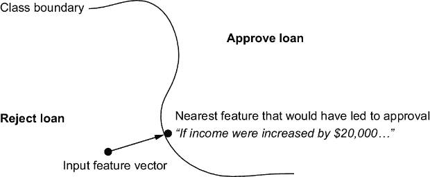

##### 图 8.1 什么是最小的输入特征变化，会导致批准？在这种情况下，如果收入高出 20,000 美元，贷款就会被批准。

找到导致批准的最小变化需要定义特征空间中的距离度量，然后找到类别边界另一侧的特征值。在这个例子中，假设条件“如果申请人有每年 20,000 美元更多的收入……”对应于特征向量（在决策表面的距离方面）的最小变化，这将导致批准。这种分析对 XAI 很有用；即，理解特征如何逐个案例驱动分类。

#### 反事实算法回溯

对于大多数贷款申请人来说，增加$20,000 的薪水是不现实的。这就是基于反事实的算法回溯可以发挥作用的地方。*算法回溯*寻找最近的假设条件，该条件可能导致不同的分类。它是在假设条件对申请人来说是*可实现的*或*可操作的*的约束下运行的。图 8.2 展示了这是如何工作的。

在这个例子中，假设是根据某些标准（而增加$20,000 的收入则不是），增加$5,000 的收入并提高信用评分是可实现的。

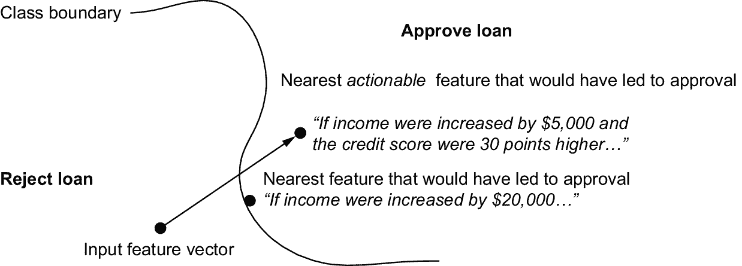

##### 图 8.2 在算法回溯中，我们通常对决策边界另一侧最近的*可操作*特征向量感兴趣。

算法回溯旨在为受到基于机器学习决策的个人提供他们可以操作的信息。如果一个人考试不及格并询问原因，解释“因为你不是天才”不如“因为你没有复习练习考试”有用，尽管两者可能都是真的。

#### 反事实公平性

反事实公平性分析是一种类似的分析，适用于某些输入特征对应于个人属性的情况。其理念是，个人的某些属性在道德上不应影响分类。例如，使用一个人的种族或性别来决定是否提供贷款是不道德的。即使这样的“受保护属性”没有明确编码到输入特征中，分类算法也可能已经学会了受保护属性的代理，例如一个人居住的社区、社交网络、购物习惯等。在模型中包含这样的特征是有意义的，而且当这些特征作为受保护属性的代理时，可能并不明显。

图 8.3 使用贷款算法示例来说明反事实公平性分析将如何提出反事实问题。在这种情况下，反事实问题是“如果这个人属于不同的种族，他会被批准吗？”分析师会找到代表种族的特征，然后看看这些代理特征的变化是否会导致“批准”的分类。一些技术试图在训练期间使用这种分析来产生更公平的算法。

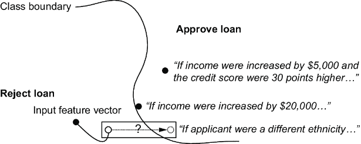

##### 图 8.3 对于反事实公平性，假设我们想测试算法是否对某些种族存在偏见。对于给定的特征向量、种族元素和相应的“拒绝”结果，我们测试如果种族元素改变，结果是否会改变。

虽然反事实公平性分析不足以解决人工智能公平性的广泛问题，但它是在人工智能公平性工具包中的一个基本要素。

### 8.1.4 悔恨与为什么我们关心“本会发生什么？”

传统机器学习通常是面向未来的。给定数据，你做出一个预测，这个预测将驱动现在做出一些决策，而这个决策将带来一些未来的成本或收益。我们希望得到好的预测，以便获得更多的未来收益。想象一下，例如，一个能够准确预测股票投资组合表现的机器学习算法——这显然是非常有价值的。

现在，想象一个不同的算法，它能够准确地告诉你，如果你买了不同的股票，你的投资组合今天会表现如何；这肯定比预测未来要少有价值。这种对比突出了对建模反事实的常见批评，即它是面向过去的。例如，我们动机案例研究中的反事实问题集中在过去发生的决策和结果上。事情已经发生；得到这些问题的答案不会改变过去。

但是，首先，并非所有反事实都是回顾性的。在第 8.3 节中，我们将建模类似“如果你不发促销信息，订阅者会有多大几率流失？如果你发了促销信息，他们就不会流失？”的问题（“流失”意味着在特定时间段内停止使用产品或服务。）这个问题没有过去时态，具有商业价值，并且是我们能够建模的。

其次，*回顾性反事实*有助于你了解如何在未来做出更好的决策。确实，分析在给定不同分配的情况下你的投资组合会如何表现——投资者称之为“回测”——是对比各种投资策略的理想方式。同样，从失败的*Dead Drop*交易中得到的反事实洞察可能有助于 Netflix 高管与另一位著名剧集制作人达成交易。

当我们考虑关于“本会”或“本可能”发生的事情的回顾性推理时，我们就会得到*遗憾*的概念。遗憾是关于回顾性反事实对比的；在给定选择的情况下，遗憾是所选择选项的结果与所拒绝选项的想象中的反事实结果之间的比较。用通俗的话说，当你拒绝的选项的反事实结果比你所选择的选项更好时，你会感到一种不良的感觉。但认知科学称之为*负面遗憾*；也存在*正面遗憾*，这是当你与想象中的反事实结果比较时，意识到你选择了更好的选项时所获得的良好感觉（例如，“哎呀，我真是躲过了一劫”）。

遗憾对于学习做出更好的决策是有用的。假设你做出一个选择，你付出了一定的代价（时间、精力、资源等），并导致了一个结果。这为你提供了一个基线单点数据用于学习。现在，假设你从后见之明中可以想象，如果你做出了不同的选择，会发生什么样的结果，并且你可以以 100%的准确性想象出来。现在你有了两个可比较的学习数据点，而你只需为其中一个付出代价。

通常，你想象被拒绝的选项的反事实结果的能力并不是 100%准确的。即使有后见之明，对反事实结果仍然存在一些不确定性。但这不是问题——我们可以用概率来模拟这种不确定性。只要后见之明知识为你提供了有关反事实结果的一些信息，你就可以比从单一数据点学习做得更好。

在强化学习和其他自动化决策中，我们通常将我们的决策标准称为“策略”。我们可以在评估和更新策略时纳入反事实分析和遗憾。

### 8.1.5 强化学习和自动化决策

在自动化决策中，“策略”是一个函数，它接受有关决策问题的信息，并自动选择某些行动方案。强化学习算法旨在找到随着时间的推移优化良好结果的策略。

自动反事实推理可以将好的结果归因于适当的行为。在投资示例中，我们可以想象一个算法，随着更近期的价格进入数据，定期回测不同的投资组合分配策略。同样，想象我们正在编写一个强化学习（RL）算法来学习玩游戏。我们可以让算法使用保存的游戏实例来模拟如果它使用了不同的策略，那个游戏实例会有怎样的不同结果。算法可以通过比较这些模拟结果和实际结果来量化遗憾的概念，并使用这些结果来学习更好的策略。这将减少 AI 学习良好策略所需的游戏数量，并使其能够从游戏中通常不会出现的情况下学习。在第十二章中，我们将更多地关注自动化决策、投币机和强化学习。

### 8.1.6 回答反事实查询的步骤

在这些应用的每个方面，我们可以使用以下工作流程来回答这些反事实推理问题：

1.  *提出反事实问题*—用最简单的术语清晰地阐述我们想要提出的反事实问题（们）。

1.  *转换为数学查询*—将查询转换为数学符号，使其形式足够正式，可以应用数学或算法分析。

1.  *进行推理*—运行一个推理算法，生成问题的答案。

在接下来的章节中，我们将专注于步骤 1 和 2。在第九章，我们将使用基于 SCM 的算法来处理步骤 3，该算法用于推断我们在步骤 2 中创建的查询。在第十章，我们将看到在没有 SCM 但只有数据和 DAG 的情况下如何进行步骤 3。

## 8.2 反事实的符号表示

在第七章，我们看到了“反事实符号”，它使用下标来表示干预。现在我们将使用这个符号来表示反事实表达式。关键是记住，正如我们将看到的，反事实查询只是*干预性查询*的一种特殊类型。我们将通过回顾我们的在线游戏案例来了解干预性查询如何流入反事实查询。

### 8.2.1 假设性陈述和问题

考虑我们的在线游戏案例研究。在考虑玩家赚取多少时，我们可能会这样说：

> 对于一个典型玩家，游戏内购买的金额将会超过 50 美元。

我们将这称为*假设性陈述*。在语法上，我使用*情态动词*（例如，“would”，“could”，“should”在“would be more”中）来有意标记*假设性语言*，而不是使用*陈述性语言*（例如，“is more”或“will be more”），后者我们用来陈述客观事实。

我们想用概率符号形式化这个陈述。对于这个陈述，我们将写*P*(*I*>50)—回想一下，我们使用了随机变量*I*来表示*游戏内购买*，*E*表示*支线任务参与度*，*G*表示*公会会员资格*。

我们在我们的开放问题中也会使用假设性语言，如下所示：

> 对于一个典型玩家，游戏内购买的金额会是多少？

我在询问变量*I*可能取的值的范围，我用*P*(*I*)来表示。

##### 陈述性语言与假设性语言及概率

陈述性语言表达确定性，例如“游戏内购买金额超过 50 美元。”相比之下，假设性语言用于传达推测、想象和假设的陈述，例如“游戏内购买金额*将会是*超过 50 美元。”

我们中的许多人将概率符号与陈述性语言联系起来，因为概率理论与命题逻辑的联系：*P*(*I*>50)量化了陈述性陈述“游戏内购买金额超过 50 美元”为真的概率。但我们将深入使用假设性语言。

假设性语言隐含着不确定性的缺乏——我们谈论的是*可能发生*的事情，而不是*已经发生*的事情。不确定性与不确定性相当，而本书中我们采用的贝叶斯哲学引导我们使用概率来模拟不确定性，因此使用假设性语言将使我们更容易用概率符号形式化问题。我们会发现这有助于我们形式化因果陈述和问题。

注意，当我们将其映射到概率符号时，问题或陈述的时态并不重要。例如，我们可以使用这种表述：

> 典型玩家的游戏内购买金额会是多少？

无论时态如何，我们使用符号 *P*(*I*) 来表示我们对问题中感兴趣变量的不确定性。

### 8.2.2 事实过滤假设到子群体

假设我的陈述如下：

> 具有高支线任务参与度的玩家的游戏内购买水平将超过 50 美元。*P*( *I*>50| *E*=“high”)

在这里，我是在对玩家子集（那些具有高支线任务参与度的玩家）做出陈述，而不是对所有玩家。当我提出这个问题时，我在做同样的事情：

> 具有高支线任务参与度的玩家的游戏内购买水平会是多少？*P*( *I*| *E*=“high”)

事实“支线任务参与度”很高有助于将玩家群体过滤到那些事实为真的玩家。如第二章所述，我们使用条件概率来聚焦于一个子群体。在这个例子中，我们使用 *P*(*I*>50|*E*=“high”）作为陈述，*P*(*I*|*E*=“high”）作为问题。

我将使用“事实条件”来指代事实、事件和证据，如 *E*=“high”，这些条件可以缩小目标人群。这些事实条件出现在条件概率符号 *P*(.|.) 中“|”的右侧。我们通常可能会称它们为“条件”，但我想避免与“条件假设”混淆，我将在下文中介绍。

### 8.2.3 条件假设、干预和模拟

现在，假设我做出了以下陈述：

> 如果玩家的支线任务参与度很高，他们会在游戏内购买上花费超过 50 美元。*P*（*I* [*E*] [=“high”] > 50）

我们将称这为*条件假设*陈述。我们将称“如果支线任务参与度很高”的部分为*假设条件*，而“他们会在游戏内购买上花费超过 50 美元”是*假设结果*。

条件假设问题中的假设条件通常遵循类似的“如果……会怎样”的表述风格：

> *如果*玩家的支线任务参与度很高，他们的游戏内购买金额会是多少？*P*（*I* [*E*] [=“high”]）

我们将使用干预符号（即反事实符号中的下标）来表示这些条件。对于陈述，我们将使用 *P*(*I*[*E*][=“high”]>50)，而对于问题，*P*(*I*[*E*][=“high”])。

#### 想象力、条件和干预

使用理想干预来模拟条件假设陈述中的假设条件是我们因果建模方法的一个哲学基石。这个想法是，当我们提出假设条件时，*我们只关注假设条件的因果后果*。

##### 复习：理想干预

理想干预是对数据生成过程的改变，它做以下事情：

1.  针对固定变量（例如，X）

1.  将该变量设置为特定的值（例如，x）

1.  这样做就切断了该变量父代变量的因果影响

这个定义可以推广到一组变量。

我们有时用 *do-notation* 来表示干预，例如 do(*X*=*x*)。在反事实符号中，对于一个变量 *Y*，我们写 *Y*[*X*][=][*x*] 来表示变量 *Y* 受到对 *X* 的干预的影响。在 DAG 中，我们通过图手术来表示理想的干预，这意味着我们切断指向目标变量的入边。在 SCM 中，我们通过用干预值替换目标变量的赋值函数来表示理想的干预。因果库通常为我们实现这些操作，通常是通过一个名为“do”的函数或方法。

让我通过反例来说明。假设我们提出这样的问题：

> 如果玩家的 *side-quest engagement* 水平很高，他们进行游戏内购买的金额会是多少？

假设我们用 *P*(*I*|*E*=“high”) 来建模这个情况。那么对这个查询的推理将不仅使用高参与度对 *In-Game Purchases* 的影响，还会通过路径 *E* ← *G* → *I* 的非因果关联；你可以从玩家的 *Side-Quest Engagement* 水平推断出玩家是否在公会中，而 *Guild Membership* 也会推动 *In-Game Purchases*。但这个问题不是关于 *Guild Membership* 的；我们只是对 *Side-Quest Engagement* 如何推动 *In-Game Purchases* 感兴趣。

“如果...会怎样”的假设性问题使用理想的干预，因为它们只关注条件的因果后果。为了说明这一点，让我们重新表述前面的问题，使隐含的理想干预变得明确：

> 如果玩家的 *side-quest engagement* 被设置为高，他们进行 *In-Game Purchases* 的数量会是多少？ *P* ( *I* [*E*] [=“high”])

动词“set”暗示了干预的行为。用理想的干预建模假设条件论证说，原始表述和这种表述意味着相同的事情（从现在开始，我将使用原始表述）。

作为人类，我们通过想象一个假设条件为真的世界，然后想象假设情景如何作为后果展开来回答“如果...会怎样”的问题，就像前面 *P*(*I*[*E*][=“high”]) 问题（无论是原始版本还是重新表述的版本）那样。我们的假设条件中的变量可能在数据生成过程中有自己的因果驱动因素（例如，*Guild Membership* 是 *Side-Quest Engagement* 的原因），但我们忽略这些驱动因素，因为我们只对假设条件的后果感兴趣。我们在想象中隔离假设条件中的变量，就像我们在实验中做的那样。理想的干预是设置变量独立于其因果的正确工具。

#### 避免混淆事实条件和假设条件

很容易将“事实条件”与“假设条件”混淆。为了重申，在问题“如果 *X* 是 *x*，*Y* 会是什么？”中，*X* = *x* 是一个假设条件，我们使用符号 *P*(*Y*[*X*][=][*x*])。相比之下，事实条件用于缩小我们询问的群体。例如，在问题“对于 *X* 是 *x* 的情况，*Y* 会是什么？”中，*X* = *x* 是一个实际条件，用于筛选出 *X* = *x* 的情况。在这里，我们使用符号 *P*(*Y*|*X*=*x*)。

请记住，我们可以结合事实条件和假设条件，就像以下问题中那样：

> 如果一个玩家的支线任务参与度很高，那么在公会中的玩家在游戏中的购买量会是多少？*P* ( *I* [*E*] [=“high”]| *G*= *g*)

在这里，我们正在询问一个子集玩家的条件假设，这些玩家是公会成员。这个查询与以下不同：

> 如果一个玩家的支线任务参与度很高，并且他们是公会成员，那么这个玩家在游戏中的购买量会是多少？*P* ( *I* [*E*] [=“high”], [*G*] [=“member”])

话虽如此，由于自然语言的歧义性，有人可能会问第二个问题，而他们真正想要的是第一个问题的答案。澄清混淆、明确意义并写下正确的符号是模型构建者的责任。

### 8.2.4 反事实陈述

在自然语言中，*反事实陈述*是一种条件假设性陈述，其中事实条件与假设条件或结果之间存在某种冲突。换句话说，它是一种“与事实相反”的条件假设性陈述。

在日常语言中，那些冲突的事实条件可以在陈述之前陈述或由上下文暗示。为了我们的目的，我们将要求反事实陈述明确陈述冲突的事实条件：

> *对于参与度低且游戏内购买金额少于 50 美元的玩家，如果他们的支线任务参与度很高，他们会在游戏内购买超过 50 美元。*P* ( *I* [*E*] [=“high”]>50| *E*=“low”， *I*  £50)

作为问题，我们可能会问：

> 如果一个玩家的支线任务参与度很高，并且游戏内购买金额少于 50 美元，那么这个玩家的游戏内购买量会是多少？*P* ( *I* [*E*] [=“high”] | *E*=“low”， *I*  £50)

在陈述和问题中，低参与度的事实条件与高参与的假设条件相冲突。在陈述中，假设结果是在游戏中购买超过 50 与实际条件（少于或等于 50）相冲突。同样，问题考虑了所有可能的假设结果，其中大多数与实际条件（少于或等于 50）相冲突。我们使用反事实符号来写这些查询，就像我们写其他条件假设一样。

##### 形式化反事实术语概述

*假设性语言*—用于表达假设、推测、设想和想象的可能性。在英语中，它通常涉及“would”或“could”，与陈述性语言形成对比。可以说，用假设性语言来形式化因果陈述和问题更为容易。

*假设性陈述*—关于世界的假设性语言陈述，例如“*Y*将是*y,*”，我们将其写成数学形式为 *P*(*Y*=*y*）。

*事实条件*—指代事实、事件和证据，这些证据缩小了所讨论内容的范围（目标群体）。在条件概率中用作条件。例如，我们会写成“*Z*是*z*，*Y*将是*y*”为 *P*(*Y*=*y*|*Z*=*z*）。

*假设性条件*—构成假设情景的条件，例如“如果*x*是*x*？”或“如果*x*是*x*…”。我们用反事实符号中的理想干预和下标[*X*][=][*x*]来表示假设条件。

*条件假设陈述*—具有假设条件的假设陈述，例如“如果*x*是*x*，*Y*将是*y*，”这成为 *P*(*Y*[*X*][=][*x*]=*y*）。我们可以添加事实条件，如“*Z*是*z*，如果*x*是*x*，*Y*将是*y*”变为 *P*(*Y*[*X*][=][*x*]=*y*|*Z*=*z*）。

*反事实陈述*—反事实陈述是一种条件假设陈述，其中事实条件中的变量与假设条件或假设结果中的变量重叠。例如，在“*X*是*x*，如果*X*是*x'*，*Y*将是*y*” (*P*(*Y*[*X*][=][*x*]*[']*=*y*|*X*=*x*)) 中，事实条件“*X*是*x*”与假设条件“如果*X*是*x'*”重叠。在“*Y*是*y*，如果*X*是*x'*，*Y*将是*y'*” (*P*(*Y*[*X*][=][*x*]*[']*=*y'*|*Y*=*y*)) 中，事实条件“*Y*是*y*”与假设结果“*Y*将是*y.*”重叠。

*一致性规则*—如果一个事实条件和假设条件重叠但不冲突，你可以省略假设条件。例如，*P*(*Y*[*X*][=][*x*]|*X*=*x*) = *P*(*Y*|*X*=*x*）。

注意，许多文本将使用“反事实”一词来描述不必然基于事实条件的正式因果查询，例如 *Y*[*X*][=][*x*] 或 *P*(*Y*[*X*][=][*x*]=*y*) 或 *P*(*Y*[*X*][=][*x*]=1, *Y*[*X*][=][*x*]*[']*=0)。我在上面使用“反事实陈述”和其他短语来描述常见的假设和反事实自然语言，并有助于将它们转换为形式化的反事实符号。

注意，我们可以将冲突的事实条件与其他非冲突的事实条件结合起来，例如在这个例子中成为行会成员：

> 如果一个玩家在支线任务参与度低且游戏内购买少于 50 美元的情况下，他们的支线任务参与度很高，那么他们游戏中的购买量会是多少？*P*( *I* [*E*] [=“high”] | *E*=“low”, *I* £50, *G*=“member”)

图 8.4 展示了形式化反事实查询的元素。

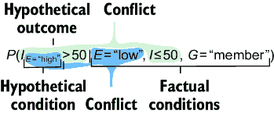

##### 图 8.4 以反事实符号形式形式化的条件反事实假设元素

##### 使用大型语言模型形式化反事实

将反事实问题形式化为反事实符号是一个大型语言模型（LLM）的绝佳任务。最先进的 LLM 在将自然语言查询转换为符号查询（如 SQL 语句）的基准测试中表现相当出色，形式化反事实问题就是这类任务的例子。我们将在第十三章中更详细地探讨 LLM 和因果关系，但现在你可以尝试提示你最喜欢的 LLM 将问题转换为反事实符号。

### 8.2.5 一致性规则

考虑分布 *P*(*I*[*E*][=“high”]|*E*=“low”)。假设我们不是用下标 [*E*][=“high”]，而是用 [*E*][=“low”]，那么分布就是 *P*(*I*[*E*][=“low”] |*E*=“low”)。*一致性规则*指出，这个分布等同于更简单的 *P*(*I*|*E*=“low”)。更一般地，*P*(*Y*[*X*][=][*x*]|*X*=*x*, *Z*=*z*) = *P*(*Y* |*X*=*x*, *Z*=*z*) 对于任何 *z*。

直观上，*P*(*I*[*E*][=“low”]|*E*=“low”) 对应的是一个相当奇怪的问题，“如果一个玩家的支线任务参与度低，那么他们的支线任务参与度也会低，那么这个玩家在游戏中的购买量会是多少？”在这个问题中，事实条件和假设条件重叠但不冲突。*一致性规则*指出，在这种情况下，我们放弃假设条件，认为这相当于询问“如果一个玩家的支线任务参与度低，那么他们在游戏中的购买量会是多少？”

现在考虑一个反事实的版本，其中我们观察到游戏内购买的实际结果。具体来说，考虑 *P*(*I*[*E*][=“high”]|*E*=“low”, *I*=75)。这是相应的反事实问题：

> 如果一个玩家的支线任务参与度低且游戏内购买等于 75 美元，那么他们的支线任务参与度很高，他们游戏中的购买量会是多少？

现在，相反，假设我们将其改为 *P*(*I*[*E*][=“low”]|*E*=“low”, *I*=75)。根据一致性规则，这会缩减为 *P*(*I*|*E*=“low”, *I*=75)：

> 如果一个玩家的支线任务参与度低且游戏内购买等于 75 美元，那么他们游戏中的购买量会是多少？

当然，答案是 75 美元。如果我们询问在 *I*=75 条件下的 *I* 的分布，那么我们得到一个所有概率值都集中在 75 的分布。

在反事实推理中，我们经常想知道关于与事实条件中观察到的相同变量的假设结果。一致性规则指出，如果假设条件与实际发生的情况相同，那么假设结果必须与实际发生的情况相同。

回想一下，我们使用干预来模拟假设条件。该规则确保我们，如果一个玩家有低*支线任务参与度*和一定数量的*游戏内购买*，如果他们被选入一个随机选择他们进入低*支线任务参与度*组的实验，他们将会有相同数量的*游戏内购买*。如果我们期望我们的因果推断能够预测实验的结果，这一点很重要。

### 8.2.6 更多示例

表 8.1 展示了将反事实问题映射到反事实符号的几个附加示例。

##### 表 8.1 反事实符号示例

| 问题 | 类型 | 反事实符号中的分布 |
| --- | --- | --- |
| 对于一个典型的玩家，他们的游戏内购买金额会是多少？ | 假设 | *P*( *I*) |
| 对于一个对支线任务有高度参与度的玩家，他们的游戏内购买金额会是多少？ | 假设，专注于高度参与的玩家 | *P*( *I*&#124; *E*=“high”) |
| 如果玩家对支线任务有高度参与，他们进行游戏内购买的金额会是多少？ | 条件假设 | *P*( *I* [*E*] [=“high”]) |
| 如果玩家是公会成员，他们的参与度*和*游戏内购买金额会是多少？ | 对两个感兴趣的结果的条件假设 | *P*( *E* [*G*] [=“member”], *I* [*G*] [=“member”]) |
| 如果玩家有高度支线任务参与度，并且他们不是公会成员，他们的游戏内购买水平会是多少？ | 具有两个假设条件的条件假设 | *P*( *I* [*E*] [=“high”,] [*G*] [=“nonmember”]) |
| 如果玩家在公会中有高度支线任务参与度，他们的游戏内购买水平会是多少？ | 专注于公会成员的条件假设 | *P*( *I* [*E*] [=“high”]&#124; *G*=“member”) |
| 对于参与度低的玩家，如果他们的参与度很高，他们的游戏内购买水平会怎样？ | 反事实。事实条件与假设条件冲突。 | *P*( *I* [*E*] [=“high”]&#124; *E*=“low”) |
| 对于最多花费 50 英镑进行游戏内购买的玩家，如果他们的参与度很高，他们的游戏内购买水平会怎样？ | 反事实。事实条件（游戏内购买 50 英镑）与可能的假设结果（游戏内购买可能超过 50 英镑）冲突。 | *P*( *I* [*E*] [=“high”]&#124; *I* £50) |
| 对于一个参与度低且游戏内消费不超过 50 美元的玩家，如果他们的参与度很高，他们的游戏内消费水平会是多少？ | 反事实。事实条件与假设条件以及可能的假设结果相冲突。 | *P*( *I* [*E*] [=“high”]&#124; *E*=“low”, *I* £50) |
| 对于一个参与度低的公会玩家，如果他们的参与度很高且不是公会成员，他们的游戏内消费水平会是多少？ | 反事实。事实条件与假设条件相冲突。 | *P*( *I* [*E*] [=“high”,] [*G*] [=“nonmember”]&#124; *E*=“low”, *G*=“member”) |
| 如果玩家是公会成员，他们的参与度会是多少？此外，如果他们不是公会成员，他们的游戏内消费水平会是多少？ | 反事实。涉及两个不同结果上的两个相互冲突的假设条件。 | *P*( *E* [*G*] [=“member”], *I* [*G*] [=“nonmember”]) |

表 8.1 中的最后一个案例是一个特殊情况，在理论中比实践中更常见，它不涉及事实条件，而是具有相互冲突的假设条件。

接下来，我们将探讨一类特定的反事实，这些反事实涉及二元原因和结果。

## 8.3 二元反事实

反事实查询的一个重要子类是我们称之为二元反事实的。这些反事实涉及二元假设条件和结果变量。当我们从观察性和实验性研究的角度思考时，二元变量，尤其是二元原因，就会出现，例如我们有“暴露”组和“未暴露”组，或者“治疗”组和“控制”组。但二元变量在推理事件发生时也非常有用；一个事件要么发生，要么不发生。

二元反事实查询值得特别提及，因为它们通常更容易思考，具有简化数学属性，这是非二元变量查询所缺乏的，并且在本节中我们将介绍它们的一些实际应用。此外，你通常可以用二元术语表述你想要回答的问题，这样你就可以在正式化查询时将非二元变量转换为二元变量。为了说明，在我们的在线游戏示例中，假设一个玩家在在线购物中花费了 152.34 美元，我们问“为什么这个玩家支付了这么多？”我们并不关心他们为什么支付了确切的那笔金额，而是为什么支付了如此高的金额，其中“如此高的金额”定义为，例如，超过 120 美元。因此，我们的二元指标变量是 *X* = {1 if *I* ≥ 120 else 0}。

### 8.3.1 因果关系的概率

因果关系的概率是二元反事实的一个特别有用的类别。它们的效用在于帮助我们回答“为什么”的问题。它们是实际应用中的基础概念，包括市场营销中的归因、强化学习中的信用分配、工程中的根本原因分析以及个性化医疗。

让我们在流失归因问题的背景下展示因果概率的有用性。在订阅业务模式中，流失是服务失去订阅者的速度，这对企业或业务单元的价值有重大影响。通常，公司部署一个预测算法，将订阅者评估为具有某种程度的流失风险。公司希望阻止那些有高流失风险的订阅者真正流失。在我们的例子中，公司会发送一个促销活动，以吸引订阅者留下（不流失）。因果概率可以帮助我们了解用户为什么会流失或留下。

给定二元（真/假）原因 *X* 和结果 *Y*，我们将定义以下因果概率：必要性概率、充分性概率、必要性和充分性概率、启用概率和禁用概率。

#### 必要性概率

对于二元原因 *X* 和二元结果 *Y*，*必要性概率*（PN）是查询 *P*(*Y*[*X*][=][0]=0|*X*=1, *Y*=1)。用简单的话来说，PN 背后的问题是“对于 *X* 和 *Y* 都发生的情况，如果 *X* 没有发生，*Y* 会不会也没有发生？”换句话说，*X* 是否必须发生才能导致 *Y* 发生？

让我们考虑我们的流失问题。让 *X* 代表我们是否发送了促销，让 *Y* 代表用户是否留下（没有流失）。在这个例子中，*P*(*Y*[*X*][=][0]=0|*X*=1, *Y*=1) 代表查询“对于一个收到促销并留下的订阅者，如果没有收到促销，他们流失的可能性有多大？”换句话说，促销优惠是否是维持订阅者的必要条件？

#### 充分性概率

*充分性概率*（PS）是 *P*(*Y*[*X*][=][1]=1|*X*=0, *Y*=0)。PS 的常见简单表述是“对于既没有 *X* 也没有 *Y* 发生的情况，如果 *X* 发生了，*Y* 会发生吗？”换句话说，*X* 的发生是否足以导致 *Y* 发生？例如，“对于没有获得晋升且没有留下（流失）的用户，如果他们获得了晋升，他们会留下吗？”换句话说，晋升是否足够（充分）让他们留下？

充分性的通俗解释可能会令人困惑。反事实查询的事实条件聚焦于 *X*=0 和 *Y*=0 的情况（即 *X* 和 *Y* 都没有发生的情况）。然而，我们通常对查看 *X*=1 和 *Y*=1 的情况感兴趣，并询问 *X* 是否足以单独导致 *Y*=1。换句话说，鉴于 *X* 和 *Y* 都发生了，即使影响 *Y* 的各种其他事件的结果不同，*Y* 仍然会发生吗？但 *P*(*Y*[*X*][=1]=1|*X*=0, *Y*=0) 包含这种解释，而无需我们列举查询中所有“影响 *Y* 的各种其他事件”。有关对充分性进行更深入研究的讨论，请参阅章节注释[`www.altdeep.ai/p/causalaibook`](https://www.altdeep.ai/p/causalaibook)。

##### 因果概率和法律

因果概率与法律概念密切相关。了解这种关系是有帮助的，因为实际应用往往与法律交叉，我们在实际环境中与之合作的许多利益相关者都接受过法律培训。

+   *但非因果关系和必要性概率*——但非测试是确定侵权法和刑法中因果关系的测试之一。我们表述必要性概率的方式是但非测试的概率等价物，将“如果 *X* 没有发生，*Y* 会不会没有发生？”重新表述为“如果没有 *X* 的发生，*Y* 会发生吗？”

+   *近因因果关系和充分性概率*——在法律中，近因因果关系指的是原因 *X* 在导致结果的直接事件链中的首要地位（例如，伤害或损害）。确实存在与充分性的联系，尽管不是等价关系。近因因果关系确实考虑了因果事件是否足以导致结果，但近因因果关系的法律理论通常超越了充分性，还涉及道德判断。

#### 必要性和充分性概率

必要性和充分性概率（PNS）是 *P*(*Y*[*X*][=1]=1, *Y*[*X*][=0]=0)。用通俗的话说，*P*(*Y*[*X*][=1]=1, *Y*[*X*][=0]=0) 可以理解为，“如果 *X* 为 0，则 *Y* 为 0；如果 *X* 为 1，则 *Y* 为 1。”例如，“如果一个用户没有收到晋升，他们有多大可能流失，而如果他们收到了晋升，他们有多大可能保留？”PNS 可以分解为以下几部分：

#### 禁用和启用概率

*禁用概率*（PD）和*启用概率*（PE）与 PN 和 PS 类似，但它们不基于原因 *X* 进行条件化。

PD 是查询 *P*(*Y*[*X*][=][0]=0|*Y*=1)，意味着“对于 *Y* 发生的案例，如果 *X* 没有发生，*Y* 会不会没有发生？”对于流失问题，PD 提出的问题是“如果我们不发送晋升，整体流失概率是多少？仅针对没有流失的用户子群体（无论他们是否收到晋升）。

PE 是查询 *P*(*Y*[*X*][=1]=1|*Y*=0)，或“对于没有发生 *Y* 的情况，如果 *X* 发生了，*Y* 会发生吗？”在我们的流失问题中，PE 询问，“如果我们发送促销，保留的整体概率是多少？”仅针对流失的用户子群体（无论他们是否收到了促销）。

因果概率可以作为反事实分析高级应用中的基本反事实原语。接下来，我将在归因的背景下给出一个例子。

### 8.3.2 因果概率和归因

因果概率是量化给定结果发生原因的方法的核心成分。例如，假设一家公司的网络有一个有故障的服务器，访问该服务器可能导致网络崩溃。假设网络崩溃了，你被要求分析日志以找到根本原因。你发现你的同事 Lazlo 访问了那个有故障的服务器。Lazlo 应该承担责任吗？

为了回答这个问题，你可能需要量化 Lazlo 成为崩溃的充分原因的可能性；即，Lazlo 访问服务器的可能性足以触发最终导致网络崩溃的多米诺效应。其次，Lazlo 成为必要原因的可能性有多大？例如，也许 Lazlo 不是必要原因，因为即使他没有访问服务器，其他人最终也会这么做。

因果概率需要与其他元素结合，以提供一个完整的归因视图。一个例子是异常的概念。因果事件的异常性描述了该事件在某种意义上是否违反了预期。例如，如果访问那个服务器对员工来说非常不寻常，Lazlo 可能会因为网络崩溃而受到更多的责备。我们可以用概率来量化因果事件的异常性；如果事件 *X*=1 是异常的，那么它不太可能发生，因此我们给 *P*(*X*=1) 分配一个低值。一个称为实际因果强度（ACS）的归因度量，如下结合了异常性和因果概率：

换句话说，这种方法将归因视为在成为一个*异常*的必要原因和一个*正常*的充分原因之间的权衡。

此外，还有越来越多的方法将可解释人工智能领域的归因方法（例如，Shapley 和 SHAP 值）与异常和因果关系概念相结合，如因果概率。有关参考文献列表，包括实际的因果强度和可解释人工智能方法，请参阅[`www.altdeep.ai/p/causalaibook`](https://www.altdeep.ai/p/causalaibook)。

### 8.3.3 二元反事实和提升建模

在商业、政治和研究中，对影响人类行为的活动的统计分析很常见。例如，在我们的流失率示例中，提供促销的目标是说服人们不要流失。同样，企业做广告是为了说服人们购买他们的产品，政治家们接触选民是为了让他们投票或为竞选活动捐款。

影响行为活动的挑战之一是确定谁可能对你的影响尝试做出积极反应，这样你就可以只将有限的资源用于影响这些人。营销领域的先驱约翰·华纳马克（John Wanamaker）说得最好：

> 我花在广告上的钱有一半是浪费的；麻烦的是我不知道哪一半。

*提升建模*指的是一类统计技术，它试图通过数据来回答这个问题。然而，第一次接触这个领域的数据科学家会发现各种统计方法，这些方法在术语、假设数据类型、建模假设和建模方法上有所不同，导致混淆。二元反事实在理解问题的高层次以及各种解决方案如何成功或失败地解决它非常有用。

#### 将用户分为可说服者、确定无疑的事情、无望的人和睡狗

在我们的流失率示例中，我们可以假设有两种类型的订阅者。对于一些订阅者，促销会影响他们决定流失。其他人是不响应者，意味着促销对他们没有任何影响。我们可以将后者的不响应者分为两组：

+   *无望的人*——无论他们是否收到促销，都会流失的人

+   *确定无疑的事情*——无论他们是否收到促销，都会留下来的人

对于对促销做出反应的人，我们有两种群体：

+   *可说服者*——可以通过促销说服他们不离开服务的人

+   *睡狗*——如果你不发促销，就不会流失的订阅者，以及如果你发了促销就会流失的人

睡狗的名字来源于“让睡狗躺着”（最后它们醒来咬你）这个表达。如果你让他们独处，这些人会做你想做的事，但如果你不让他们独处，他们就会违背你的意愿。你有没有收到过订阅服务的营销邮件，心想，“这些人给我发太多垃圾邮件了！我要取消订阅。”你就是一个“睡狗”——公司的邮件就是唤醒你的那一脚，你因此咬了它们。图 8.5 展示了我们的订阅者如何分为这四个部分。

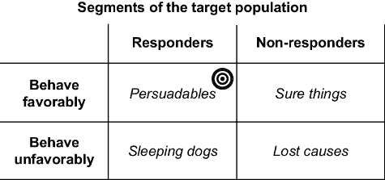

##### 图 8.5 在试图影响行为的过程中，我们将目标人群分为这四个部分。鉴于资源有限，我们希望将我们的影响努力集中在可说服的人群上，避免其他人，尤其是睡狗。

促销在给订阅者提供额外价值的同时也带来成本。你希望避免将这笔成本花在那些无论如何都会流失（确定无疑）和那些无论如何都会流失（无望的事业）的订阅者身上。而且你肯定不希望只为了导致某人流失而花费这笔成本（沉睡的狗）。因此，在这四组人中，你只想向那些可能被说服的人发送促销。统计分析的任务是将我们的用户分成这四个组。

这就是反事实可以帮助我们的地方；我们可以用概率反事实术语来定义每个组：

+   *无望的事业*—这类人无论我们是否发送促销，都可能流失；即，*P*(*Y*[*X*][=1]=0, *Y*[*X*][=0]=0) 的概率很高。

+   *确定无疑*—如果我们发送促销，他们可能会留下，如果我们不发送促销，他们也会留下；即，*P*(*Y*[*X*][=1]=1, *Y*[*X*][=0]=1) 的概率很高。

+   *可能被说服的人*—如果我们发送促销，他们可能会留下，如果我们不发送促销，他们可能会流失；即，*P*(*Y*[*X*][=1]=1, *Y*[*X*][=0]=0) 的概率很高。换句话说，PNS（流失可能性）很高。

+   *沉睡的狗*—如果我们发送促销，他们可能会流失，如果我们不发送促销，他们可能会留下；即，*P*(*Y*[*X*][=1]=0, *Y*[*X*][=0]=1) 的概率很高。

你可以在图 8.6 中看到人口是如何被细分的。

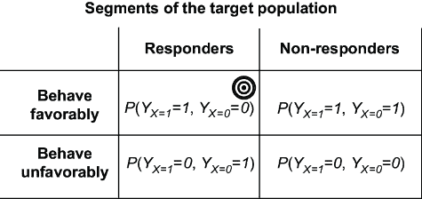

##### 图 8.6 我们可以用反事实术语对人口进行细分。

#### 使用反事实进行细分

每个订阅者都有一些属性集合（人口统计信息、使用习惯、内容偏好等）。我们的目标是把这些属性转换成预测订阅者是否可能被说服、沉睡的狗、无望的事业或确定无疑。

用 *C* 表示一组订阅者属性。给定一个具有属性 *C*=*c* 的订阅者，我们感兴趣的因果查询是 *P*(*Y*[*X*][=1], *Y*[*X*][=0]|*C*=*c*)。各种统计细分方法试图定义 *C*，使得用户落入具有高概率的 *P*(*Y*[*X*][=1], *Y*[*X*][=0]|*C*=*c*) 四种结果之一的组。但在我们应用统计方法之前，我们的首要任务是确保我们能够使用足够的假设和数据来估计这个查询。我们将在第九章中介绍如何使用 SCM 估计反事实，在第十章中介绍如何使用更广泛的估计技术进行识别。

现在我们已经学会了如何提出因果查询并将其形式化为数学，让我们回顾一下图 8.7 中反事实推理的步骤。

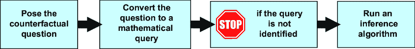

##### 图 8.7 反事实推理工作流程

在下一节中，我们将研究可能世界和并行世界图的概念。这些概念对于识别（确定我们是否能够回答问题）和推理算法都至关重要。

## 8.4 可能世界和并行世界图

在本节中，我将介绍可能世界和并行世界图的概念，这是对支持跨可能世界进行反事实推理的 SCM 中因果 DAG 的扩展。

### 8.4.1 可能世界中的潜在结果

反事实推理涉及对*可能世界*的推理。可能世界是世界的一种存在或可能存在的方式。*实际世界*是我们观察到的具有事件结果的那个可能世界。所有其他可能世界都是*假设世界*。

在数据生成过程（DGP）方面，实际世界是 DGP 展开产生我们的数据的方式。其他可能世界是由 DGP 可能产生不同数据的所有方式定义的。

*潜在结果*是因果效应推断中的基本概念。“潜在结果”指的是在不同可能世界中同一变量的结果。如果你头疼并服用阿司匹林，你可能会说在两个可能世界中存在两种潜在结果：一个是你头疼好转，另一个是你头疼没有好转。

##### 可能世界术语的回顾

*可能世界*—世界的一种存在或可能存在的方式

*实际世界*—具有观察到的事件结果的可能世界

*假设世界*—没有观察到的事件结果的可能世界

*潜在结果*—在不同可能世界中同一变量的结果

*并行世界*—正在推理的一组可能世界，共享共同和不同的属性

*并行世界图*—用于识别反事实查询和在反事实推断算法中使用的并行世界的图形表示

### 8.4.2 并行世界图

并行世界图是因果 DAG 的一个简单扩展，它捕捉了可能世界之间的因果关系。继续使用在线游戏示例，假设我们感兴趣的问题是：“对于一个参与度低且游戏内消费少于 50 美元的玩家，如果他们的参与度高，他们的游戏内消费水平会是什么？”即*P*(*I*[*E*][=“high”]|*E*=“low”，*I*<50)。对于这个反事实查询，我们可以在图 8.8 中可视化实际和假设世界。

##### 图 8.8 为了回答在线游戏示例的反事实查询，我们首先在可能世界中复制因果 DAG。

我们将在线游戏示例的因果 DAG 在两个可能世界中复制。每个世界都有一个 DAG 反映了 DGP 在每个世界中的因果结构相同。但我们需要以某种方式连接这些 DAG 来跨世界进行推理。

我们将使用因果 DAG 上定义的 SCM 连接两个世界。我们假设 DAG 的原始节点是 SCM 的内生变量，并通过添加外生变量来扩展 DAG 的可视化。此外，两个因果 DAG 将使用相同的外生节点。我们将结果图称为*并行世界图*（或，对于这种有两个可能世界的典型情况，称为“双世界图”）。图 8.9 可视化了并行世界图。

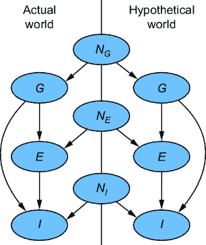

##### 图 8.9 在并行世界图中，我们使用 SCM 中的外生变量来统一不同世界中的重复因果 DAG。结果是具有重复内生变量的单个 SCM。

##### 复习：结构因果模型（SCM）

SCM 是一个具有以下组件的因果模型：

+   *内生变量*—内生变量是我们特别想要建模的变量。

+   *外生变量*—一组外生变量。外生变量是我们不希望显式建模的、我们内生变量的所有原因的代理。在我们的公式中，我们将每个内生变量 *X* 与单个外生变量 *N**[X]* 配对（存在更通用的公式）。

+   *外生分布*—为了将 SCM 用作生成模型，我们需要每个外生变量的边缘概率分布集，例如 *P*(*N**[X]*)，它代表模型器对 *N**[X]* 值的不确定性。

+   *功能分配*—每个内生变量都有一个功能分配，它根据其父节点确定性地设置其值。

例如，以生成模型的形式，我们在线游戏模型的 SCM 可能如下所示。

分配函数诱导因果 DAG；每个变量是一个节点，外生变量是根节点，一个变量的分配函数的输入对应于 DAG 中的父节点。SCM 是因果图形模型的一个特例，其中内生变量由确定性函数设置，而不是从因果马尔可夫核中采样。

结果是一个具有一组共享的外生变量和重复的内生变量集的单一 SCM——每个可能世界一组。请注意，在 SCM 中，内生变量在外生变量的给定下是确定性地设置的。因此，当我们观察到实际世界中的 *E*=“低”和 *I*<50 时，我们知道 *E* 和 *I* 的假设结果必须相同。事实上，尽管 *Guild Membership* (*G*) 是实际世界中的潜在变量，但我们知道 *G* 在实际世界中的任何值都必须与假设世界中的相同。换句话说，我们的 SCM 维护了一致性规则，如图 8.10 所示。在图 8.10 中，实际世界中的 *E* 和 *I* 是观察变量，因为我们根据它们在查询 *P*(*I*[*E*][=“high”]|*E*=“low”， *I* < 50) 中进行了条件化。

##### 图 8.10 在供应链管理（SCM）中，内生变量在给定外生变量的情况下被确定性地设置。在这个模型中，内生变量在各个世界中是复制的。因此，在观察实际世界中低参与度和低于 50 美元的游戏内购买时，我们知道这些值在假设世界中必须相同，除非我们在假设世界中改变某些东西。

### 8.4.3 通过图手术应用假设条件

假设世界通常与实际世界不同，因为假设条件不同。例如，在 *P*(*I*[*E*][=“高”]|*E*=“低”， *I* < 50)中，“如果参与度是高的”([*E*][=“高”])与实际条件“参与度是低的”(*E*=“低”)不同。正如我们讨论的那样，我们使用理想的干预措施来模拟假设条件——我们在假设世界中干预 *E*，将其设置为“高”。我们通过图手术来模拟理想的干预措施——我们将在假设世界中移除指向 *E* 变量的入边，如图 8.11 所示。

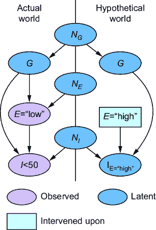

##### 图 8.11 理想干预和图手术表示假设世界中的假设条件。在这种情况下，假设世界中 *I* 的结果现在可以采取与实际世界中不同的结果，因为其父节点 *E* 的结果与实际世界中不同。

现在，假设世界中“游戏内购买”(*I*)的结果可以不同于实际世界中 *I*=50 的结果，因为其因果父节点 *E* 在每个世界中都有不同的结果。

### 8.4.4 跨越两个以上可能世界的推理

反事实符号和并行世界图形式支持跨越两个以上可能世界的反事实推理。为了说明，让我们回顾本章开头提到的 Netflix 示例。总结这个故事，该叙述中的关键变量如下：

+   迪士尼正在尝试达成一项购买邦德系列的交易。如果交易达成，则 *B* = “成功”，否则 *B* = “失败”。

+   Netflix 正在尝试达成一项新间谍系列电影“Dead Drop”的交易。如果“Dead Drop”交易达成，则 *D* = “成功”，否则为“失败”。如果邦德交易达成，它将影响这项交易的条款。因此，*B* 导致 *D*。

+   如果“Dead Drop”交易达成，它将影响 Netflix 上与间谍惊悚片相关内容的参与度。如果订阅者在 Netflix 的间谍惊悚片内容中的参与度是“高”，则令 *E* = “高”，否则为“低”。

+   邦德交易和“Dead Drop”交易的结果都将影响间谍惊悚片粉丝向迪士尼的流失。令 *A* 为向迪士尼的流失率。

通过这个案例研究，以下的多世界反事实是合理的。假设邦德交易成功（*B* = “success”），但 Netflix 的*Dead Drop* 交易失败，结果参与度低（*E* = “low”），Netflix 向迪士尼的流失率为 10%。图 8.12 展示了这个实际世界的成果。

作为 Netflix 的执行高管，你开始思考归因问题。你假设如果 Dead Drop 交易成功，参与度将会很高。你提出了以下反事实问题：

> 迪士尼的邦德交易成功，Dead Drop 交易失败，因此，Netflix 的间谍惊悚片参与度低，向迪士尼的流失率为 10%。我假设如果 Dead Drop 交易成功，参与度将会很高。在这种情况下，会有多少归因？

我们可以在图 8.13 的并行世界图中使用世界 2 来实现这个假设。

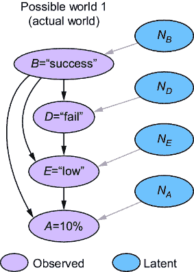

##### 图 8.12 展示了 Netflix 案例研究的因果 DAG 图。浅灰色节点是实际世界中的观测结果。深色节点是潜在变量。

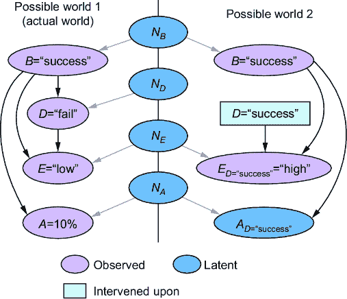

##### 图 8.13 第二个可能的世界代表了这样的假设：如果*Dead Drop* 交易成功（通过干预 *D=*“success”），参与度将会很高（*E**[D]*[=“success”]=“high”）。

最后，你可能会想知道，如果邦德交易失败，Netflix 的流失率会是多少。但你基于第二个世界的假设，即如果*Dead Drop* 交易成功，参与度将会很高。由于邦德交易失败是一个与第二个世界中的邦德交易成功条件相冲突的假设条件，你需要一个第三世界，如图 8.14 所示。

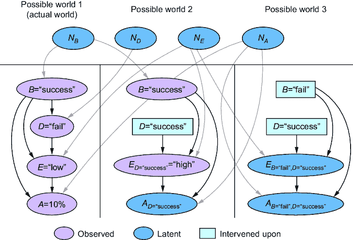

##### 图 8.14 在世界 1 的实际结果基础上，你提出了世界 2 的假设条件和结果，并在世界 3 中设定条件，并对世界 3 的流失率进行推理。

总结来说，这是一个反事实问题：

> 迪士尼的邦德交易成功，*Dead Drop* 交易失败，因此，Netflix 的间谍惊悚片参与度低，向迪士尼的流失率为 10%。我假设如果*Dead Drop* 交易成功，参与度将会很高。在这种情况下，如果邦德交易失败，会有多少归因？

注意，前面的推理与以下不同：

> 迪士尼的邦德交易成功，*Dead Drop* 交易失败，因此，Netflix 的间谍惊悚片参与度低，向迪士尼的流失率为 10%。我假设如果*Dead Drop* 交易成功而邦德交易失败，参与度将会很高。在这种情况下，会有多少归因？

图 8.15 说明了后一个问题。

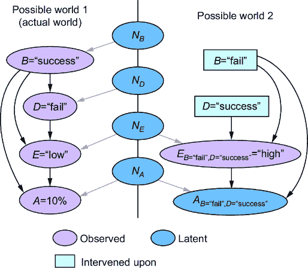

##### 在假设 *E**[B]*[=“fail”,]*[D]*[=“success”] 的情况下，只需要两个世界。

后一个问题假设如果邦德交易失败*并且*“死信”交易成功（*E*[*B*][=“fail”，] [*D*][=“success”][=][“][high”]），参与度会很高。相比之下，前一个“三个世界”问题假设如果两个交易都成功，参与度会很高。然后，在第三个世界中，它允许在邦德交易失败的情况下假设情景中有不同的可能参与度水平。例如，可能由于 Netflix 拥有其间谍惊悚片系列而迪士尼没有，因此参与度会很高。或者，如果没有邦德重启，对间谍惊悚片的整体兴趣可能会减少，导致“死信”的参与度低。

### 8.4.5 经验法则：假设世界应该更简单

再次考虑图 8.16 中的在线游戏示例中的内生节点。注意，在这个例子中，两个世界有相同的一组内生节点，假设世界中的边是实际世界中边的子集。换句话说，我们干预的可能世界比基于证据的条件可能世界简单。

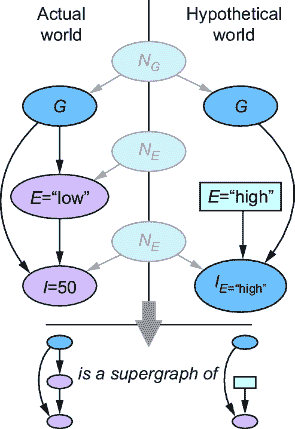

##### 图 8.16 表示具有假设条件的可能世界的图比表示实际世界的图简单。

类似地，在 Netflix 案例研究的三个世界图中，世界 3 是世界 2 的子图，而世界 2 又是世界 1 的子图。作为一个算法规则，对可能世界有这种递减顺序是有用的。这个经验法则可以降低算法不稳定的可能性。

话虽如此，存在更复杂假设世界的用例。例如，模型师可以在假设世界中引入新的节点作为条件。或者他们可以使用随机干预，在假设世界中随机引入新的边。确实，人类的反事实推理可以非常富有想象力。探索这些方法可能导致因果 AI 的新颖算法。

在下一章中，我们将深入探讨在通用反事实推理算法中使用并行世界图。

## 摘要

+   反事实陈述描述了可能与实际事件冲突的假设事件。它们是定义因果关系的根本。

+   反事实推理支持学习策略以做出更好的决策。

+   反事实推理涉及对可能世界的推理。一个*可能世界*是世界存在或可能存在的方式。*实际世界*是我们观察到的结果事件的可能世界。其他可能世界是假设世界。

+   在机器学习中，通常的目标是对机器学习模型本身进行反事实分析。在这里，我们推理如果输入特征向量的元素不同，预测会有何不同。

+   在分类中的反事实分析可以帮助找到导致不同分类的最小特征变化。

+   反事实分析通过帮助识别会改变每个案例预测结果的特征变化，从而支持可解释人工智能。

+   反事实分析通过识别会改变预测结果的特征的*可操作*变化，从而支持算法回溯。

+   反事实分析通过识别与受保护属性相对应的特征，这些特征的变化会改变预测结果，从而支持人工智能的公平性。

+   “潜在结果”是一个常用术语，指的是从可能世界中给定变量的结果。

+   我们可以使用理想干预和并行世界图来模拟自然语言反事实陈述和问题中的假设条件。

+   反事实符号有助于用概率语言表示假设性陈述和问题。概率可以用来量化关于假设性陈述和问题（包括反事实）的真实性的不确定性。

+   使用假设性语言而不是陈述性语言有助于将反事实陈述或问题形式化为反事实符号。使用假设性语言意味着想象的可能性，因此存在不确定性，这促使我们思考假设性陈述为真的概率。

+   二进制反事实查询是指对二元变量（假设条件和结果）的查询。

+   *因果概率*，例如*必要性概率*（PN）、*充分性概率*（PS）和*必要性和充分性概率*（PNS），是作为因果归因方法和其他类型高级因果查询原语的有用二进制反事实查询。

+   二进制反事实查询在提升建模问题中区分“可说服者”、“确定无疑”、“无望的案例”和“沉睡的狗”也是很有用的。

+   并行世界图是因果 DAG 的一个简单扩展，它捕捉了可能世界中因果关系的跨世界。它表示一个在共享一组外生变量和重复的内生变量集合的可能世界上的 SCM。
