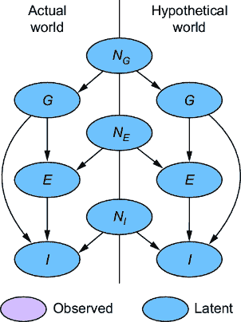
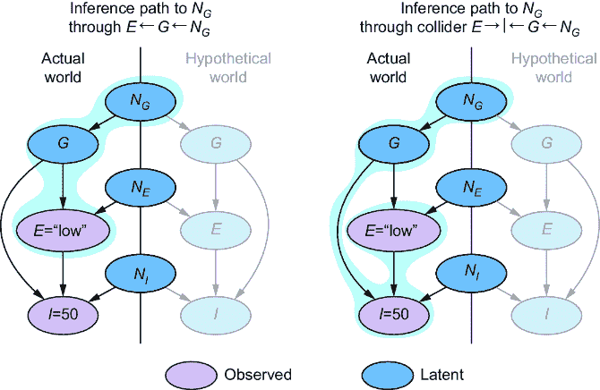
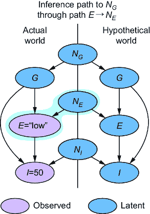
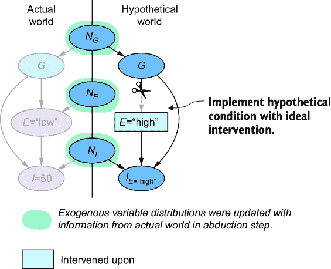
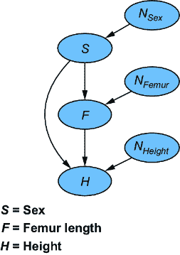
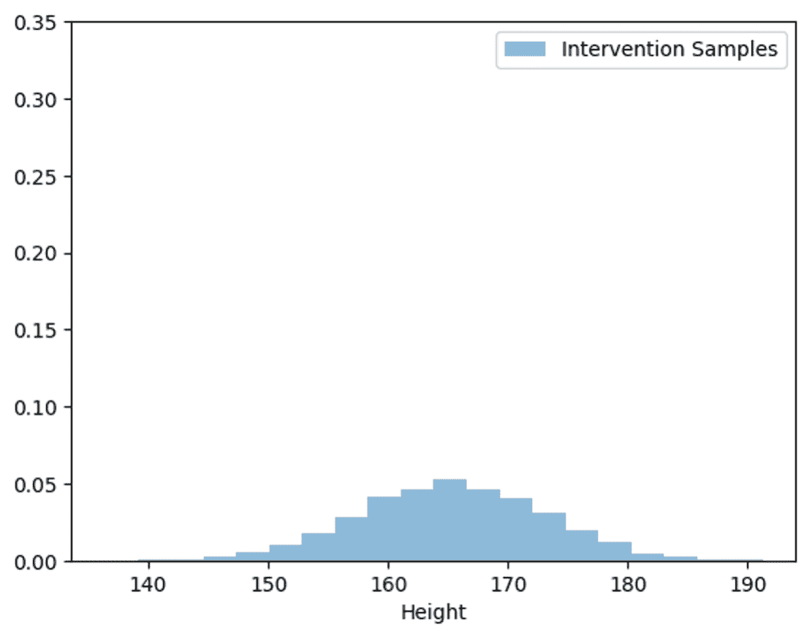
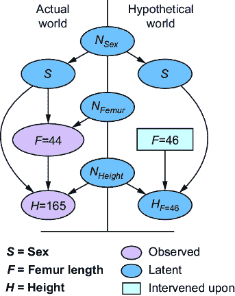
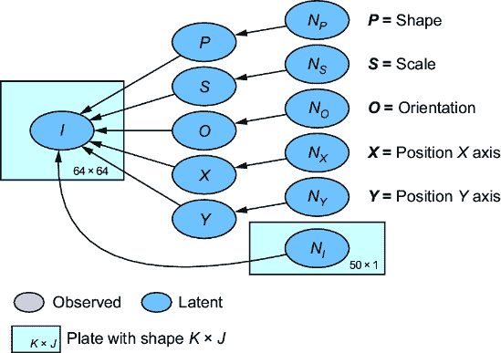
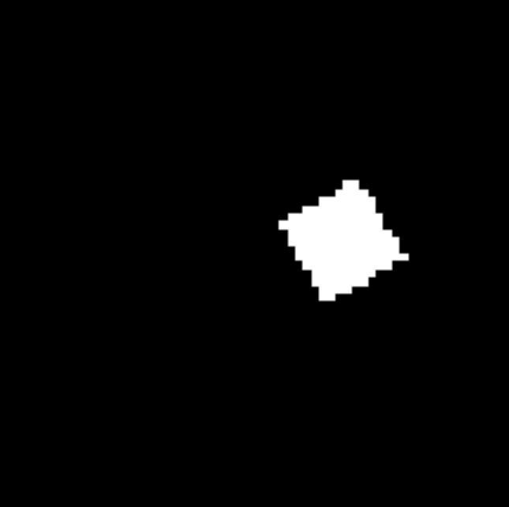
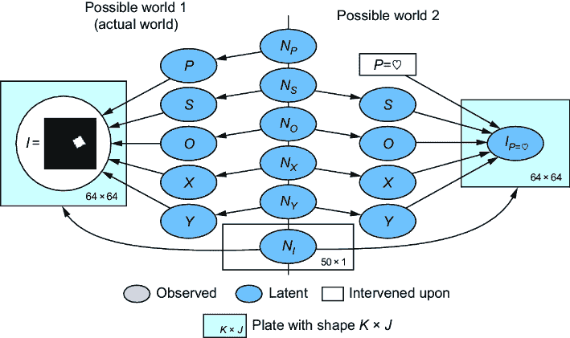

# 9 一般反事实推理算法

### 本章涵盖

+   实现一般反事实推理算法

+   直接将并行世界 DAG 作为因果图模型实现

+   使用变分推理实现算法

+   构建图像的反事实深度生成模型

上一章教了你如何形式化反事实并使用并行世界图在可能的世界中进行推理。在本章中，我将介绍一个用于推断反事实查询的算法。然后，我将展示三个案例研究，展示使用不同的概率机器学习方法实现该算法。

我将本章中我们将讨论的算法称为“一般”概率反事实推理算法，因为你可以使用这个算法推断任何反事实查询。问题是你需要一个 SCM。此外，你的 SCM 与真实 SCM 之间的差异可能导致你的反事实推理不准确。我们将在第十章讨论识别问题时更仔细地研究这个问题，你也将学习到在不了解真实 SCM 的情况下推断反事实的方法。在本章中，你将看到基于 SCM 的方法的强大之处，尤其是在机器学习中。

## 9.1 算法概述

在本节中，我们将对概率反事实推理的一般算法进行高级概述。该算法有三个步骤，通常被称为*归因*、*行动*和*预测*：

1.  *归因*—在给定事实条件的情况下推断外生变量的分布。

1.  *行动*—在假设世界中将假设条件作为理想干预（图手术）实现。

1.  *预测*—使用步骤 1 中的外生变量的条件分布来推导假设结果的分布。

我将使用我们的在线游戏示例的并行世界图来说明如何执行这些步骤，如图 9.1 所示。



##### 图 9.1 在线游戏示例的并行世界图

回想一下，在这个例子中，公会成员*G*是侧任务参与度*E*和游戏内购买*I*的原因。侧任务参与度也是游戏内购买的原因。

备注：这个例子将第八章中使用的条件*I* < $50 更改为*I* = $50，以便使解释更加简洁。这两种条件都可以与我们所讨论的算法一起使用。

假设我们的反事实问题是“对于一个低侧任务参与度和 50 美元游戏内购买的玩家，如果他们的侧任务参与度很高，他们的游戏内购买水平会是什么？”相应的查询是*P*(*IE* =“high”|*E*=“low”，*I*=50)。让我们看看如何将算法应用于这个查询。

### 9.1.1 归因：在给定的观察到的内生变量下推断外生变量

“推理”这个术语指的是进行*推理推断*，意味着我们从观察到的结果中推断原因。在我们的在线游戏 SCM 中，我们想要从事实条件(*E*=“低”和*I*=50)中推断潜在的变量(*N**[G*], *N**[E*], 和*N**[I*])。

在我们的概率建模方法中，我们将外生变量视为潜在变量，并使用概率推理针对它们进行目标定位。在我们的例子中，我们从观察*E*=“低”推断*N**[E*]。图 9.2 和图 9.3 分别说明了到*N**[G*]和*N**[I*]的 d 连通路径。

正如你在图 9.2 中可以看到的，我们有一条从*E*到*N**[G*]的路径，通过路径*E*←*G*←*N**[G]*。此外，观察*E*和*I*通过路径*E*→*I*←*G*←*N**[G*]开启了到*N**[G*]的碰撞路径。同样，在图 9.3 中，观察*E*和*I*也通过路径*E*→*I*←*N**[I*]开启了到*N**[I*]的碰撞路径。



##### 图 9.2 为了推断反事实结果，我们在实际世界中观察到的结果条件下推断外生变量。从*E*到*N**[G]*有一条路径，通过路径*E*←*G*←*N**[G]*。此外，观察*E*和*I*通过路径*E*→*I*←*G*←*N**[G]*开启了碰撞路径。


##### 图 9.3 观察*E*和*I*通过*E*→*I*←*N**[I]*开启了通往*N**[I]*的碰撞路径。

最后，观察*E*有一个直接连接到*N**[E]*的路径，如图 9.4 所示。



##### 图 9.4 *E*是*N**[E]*的直接子节点，因此观察*E*会直接提供关于*N**[E]*的信息。

我们的结构化因果模型（SCM）是一个概率模型。在推理步骤中，我们使用此模型来推断*P*(*N**[G*], *N**[E*], *N**[I*]| *E*=“低”，*I*=50)。这个推断将遵循这些依赖路径。

### 9.1.2 行动：实施假设原因

回想第八章，我们使用理想干预来实施假设条件。我们的假设条件是“如果他们的支线任务参与度很高”，我们通过将假设世界中的*E*设置为“高”的理想干预来实施这个条件。由于我们使用的是图，所以我们通过如图 9.5 所示的图手术来实施干预。



##### 图 9.5 在假设世界中，将假设条件作为理想干预（通过图手术）实施。

现在平行世界不同了。请注意，在推理步骤中，外生变量的概率分布已经根据实际世界的信息进行了更新。在最后一步，我们将通过这个修改后的假设世界传播这些信息。

### 9.1.3 预测：推断假设结果

我们正在处理一个结构化因果模型（SCM），因此假设世界中变量的值是由外生变量确定性设置的。在更新了实际世界中观察到的外生变量分布之后，我们现在将实际世界信息从外生变量传播到假设世界中的内生变量。如果我们没有在假设世界中应用干预，根据一致性法则，假设世界将反映我们在实际世界中观察到的所有内容（参见第八章的定义）。然而，由于我们在假设世界中应用了干预，干预之后的假设变量分布可能与实际世界中的不同。


##### 图 9.6 从外生变量条件分布 *P*(*N**[G]*, *N**[E]*, *N**[I]*| *E*=“low”, *I*=50) 推断假设分布 *I* 的路径，给定观察到的实际世界结果

在我们的游戏示例中，我们的查询 *P*(*I*[*E*][=“high”]|*E*=“low”，*I* = 50) 旨在获取 *I*[*E*][=][“high”] 的假设值。图 9.6 说明了从外生变量到 *I*[*E*][=][“high”] 假设值的推理路径。请注意，在这个例子中，影响路径仅来自 *N*[*G*] 和 *N*[*I*]，因为对 *E* 的干预切断了 *N*[*E*] 与假设世界之间的桥梁。

##### 在平行世界图上小心处理 d 连接和 d 分离

回想一下，使用因果有向图（DAG），我们可以使用一个称为 d 分离/d 连接的图形标准来使用因果 DAG 在数据生成过程中推理条件独立性。实际上，这就是我在通过 *N**[I]* 和 *N**[G]* 高亮 *E* 和 *I* 给定 *I**[E]*[=“high”] 的推理路径时所做的事情。我这样做是为了解释算法的归纳和预测步骤。然而，在一般情况下，人们不能依赖于 d 分离和 d 连接来推理不同世界之间内生变量之间的依赖关系。这是因为一致性法则要求不同世界中的相同内生变量必须具有相同的值（除非一对受到干预的影响）。两个变量总是具有相同的值是一种*完美*的依赖；d 分离的规则没有捕捉到平行世界图上的这种依赖。

在下一章中，我将介绍*反事实图*，这是一种从平行世界图中导出的因果 DAG，其中 d 分离和独立性之间的联系在各个世界之间保持。

我们可以从实际世界中事实条件 *E*=“low” 和 *I*=50 的信息流，通过外生变量，到假设世界中我们的目标变量 *I*[*E*][=“high”]，来观察推理过程中的信息流动。我们如何实现推理取决于我们对推理算法的偏好。例如，假设 *f*[*G*] 和 *f*[*I*] 代表 SCM 对 *G* 和 *I* 的分配函数。我们可以使用一个简单的正向采样算法：

1.  从 *P*(*N*[*G*], *N*[*E*], *N*[*I*]| *E*=“low”， *I*=50) 中抽取外生值 *n*[*G*]， *n*[*E*]，和 *n*[*I*] 的样本。

1.  推导出公会成员假设值 *g*^* = *f**G* 的样本。

1.  推导出游戏内购买假设值 *i*^* = *f**I* 的样本。

1.  重复多次以从分布 *P*(*I*[*E*][=“high”]|*E*=“low”， *I* = 50) 中获取样本。

1.  这将给我们提供目标 *P*(*I*[*E*][=“high”]|*E*=“low”， *I* = 50) 的样本。

### 9.1.4 反事实蒙特卡洛

通用概率反事实推理算法的输出产生分布的样本。回想第二章，一旦你可以从分布中采样，你就可以应用蒙特卡洛技术来根据该分布进行推理。反事实分布也是如此。

例如，在第八章中，我介绍了遗憾的概念，其中我们比较反事实结果。对于参与度低且仅花费 50 美元的玩家，我们可能会问，如果参与度高，他们的游戏内购买会多出多少。鉴于玩家花费了 50 美元，我们可以定义一个遗憾变量为 *R*[*E*][=][*e*] = *I*[*E*][=][*e*] – 50。通过从 *P*(*I*[*E*][=“high”] |*E*=“low”， *I*=50) 中采样并减去 50，我们得到 *P*(*R*[*E*][=“high”] |*E*=“low”， *I* = 50) 的样本。我们还可以取这些差异的平均值来估计期望遗憾 *E*(*R*[*E*][=“high”] |*E*=“low”， *I* = 50)。请注意，这里的 *E*(…) 指的是期望算子，而不是支线任务参与度。

当我们想在自动化决策算法中使用这些反事实蒙特卡洛技术时，我们通常是在提出关于 *policies* 的反事实问题。例如，假设一个推荐算法根据玩家的个人资料向玩家推荐某些内容。我们可以对比他们在一种推荐策略下做出的游戏内购买量与在另一种策略下会做出的购买量。然后我们可以调整推荐算法，以最小化玩家之间的累积遗憾。我们将在第十二章更详细地探讨自动化决策。

接下来，我们将探讨几种在代码中实现此算法的案例研究。

### 9.1.5 案例研究简介

我们可以通过多种方式使用现代概率机器学习工具来实现此算法。在第 9.2-9.4 节中，我们将探讨三个案例研究。

#### 蒙提霍尔问题

第一个案例研究将专注于第 6.3 节中讨论过的蒙提霍尔问题。我们将使用 pgmpy 库来实现一个完整的并行世界图形 SCM。我们将使用 pgmpy 的`TabularCPD`来实现 SCM 分配函数，这是它没有设计来做的。作为这种尴尬的交换，我们将能够利用 pgmpy 基于图的推理算法（`VariableElimination`）将推理和预测步骤合并为一个推理步骤。使用基于图的推理将使我们免于实现推理算法；我们只需要构建模型，应用动作步骤，并运行推理。

#### 股骨长度和身高

接下来，我们将回顾第 6.1 节中的法医示例，其中我们有一个 SCM，其中股骨长度是身高的原因。这个例子将向我们展示如何使用变分推理来完成推理步骤，这是一种现代且流行的概率推理技术，与最前沿的深度学习框架配合得很好。

在这个例子中，我们将使用 Pyro 实现 SCM，Pyro 是一个基于 PyTorch 的概率机器学习库。使用 Pyro 会比 pgmpy 感觉不那么尴尬，因为 Pyro 建模抽象更灵活。权衡是，我们必须为推理步骤编写显式的推理代码。

这个例子很简单：数据很小，每个变量只有一个维度，关系是线性的。然而，我们可以使用相同的基于变分推理的推理技术，在大型、高维和非线性数据设置中使用，在这些设置中变分推理表现出色。

#### 基于反事实的语义图像编辑

在最后的案例研究中，我们将研究如何使用预训练的生成图像模型在 PyTorch 中应用反事实推理算法。虽然蒙提霍尔和股骨长度问题是简单的问题，简单的数学，但这个案例研究展示了算法在现代问题上的应用，即深度生成人工智能中的图像生成。

## 9.2 案例研究 1：蒙提霍尔问题

我们将首先回顾蒙提霍尔问题的 SCM。再次总结，这是一个游戏节目，玩家从三个门的选择开始。其中一扇门后面有一辆车。玩家选择一扇门，比如说第一扇门，主持人，他知道门后面是什么，会打开另一扇门，比如说第三扇门，这扇门后面没有车。主持人给玩家一个换门的机会。在这种情况下，因为玩家选择了第一扇门，而主持人揭示车不在第三扇门后面，玩家可以切换到第二扇门。问题是坚持原来的选择还是换门哪种策略更好。

答案是，对许多人来说反直觉，换门策略更好——三分之二的情况下，换门策略会导致胜利。图 9.7 说明了换门的可能结果。


##### 图 9.7 摩纳哥大厅问题。假设玩家最初选择了第一个门，三分之二的情况下，换门策略将导致获胜。这个插图假设选择了第一个门，但无论初始选择哪个门，结果都是相同的。

我们将探讨两个反事实问题：

+   对于一个坚持最初选择的大门并输掉游戏的玩家，如果他们换门，他们获胜的概率是多少？

+   对于一个输掉游戏的玩家，如果他们换门，他们获胜的概率是多少？

我们将通过以下步骤回答这些问题：

1.  在 pgmpy 中将并行世界模型构建为生成性图形模型。

1.  在一个世界中基于证据进行推理，以推断另一个世界中的结果。

在我们开始之前，我们将下载一些工具来帮助我们进行分析。列表 9.1 下载了一些用于与 pgmpy 一起工作的辅助函数：用于实现理想干预的 `do` 函数和用于复制 `TabularCPD` 对象的 `clone`。此外，为了生成可视化，你需要安装 Graphviz 可视化库。

##### 设置你的环境

本章中的代码使用 pgmpy 版本 0.1.25 和 Pyro 版本 1.9.1 进行了测试。我使用 Matplotlib 3.7 进行绘图。DAG 的绘图依赖于 Graphviz。

Graphviz 的安装取决于你的环境。使用 Ubuntu 22.04，我通过 libgraphviz-dev 安装了 graphvizl，然后我安装了 Python 库 Graphviz 版本 0.20.3、PyGraphviz 版本 1.13 和 NetworkX 版本 3.3。

根据你的环境，你可能需要安装 pydot 版本 3.0。Graphviz 和 pydot 仅用于绘图，所以如果你遇到困难，你可以放弃在其余代码中的绘图。

##### 列表 9.1 安装 Graphviz 和辅助函数

```py
import graphviz     #1
import networkx as nx   #1
from networkx.drawing.nx_agraph import write_dot     #1
def plot_graph(G):    #1
    dot_format = nx.nx_pydot.to_pydot(G).to_string()    #1 
    return graphviz.Source(dot_format)   #1

import requests     #2
def download_code(url):     #2
    response = requests.get(url)     #2
    if response.status_code == 200:   #2
        code_content = response.text   #2
        print("Code fetched successfully.")    #2
        return code_content    #2
    else:    #2
        print("Failed to fetch code.")   #2
        return None     #2

url_do = (      #3
    "https://raw.githubusercontent.com/altdeep/"      #3
    "causalML/master/book/pgmpy_do.py"    #3
)     #3
code_do = download_code(url_do)      #3

url_clone = (     #4
    "https://raw.githubusercontent.com/altdeep/"      #4
    "causalML/master/book/chapter%209/hyp_function.py"      #4
)      #4
code_clone = download_code(url_clone)     #4

print(code_do)     #5
print(code_clone)      #5
#exec(code_do)      #5
#exec(code_clone)     #5
```

#1 安装用于可视化的 Graphviz 库，并创建一个用于绘图的帮助函数。这在 Ubuntu 22.04.3 上进行了测试，但可能取决于你的环境。如果你遇到麻烦，你可以放弃图形绘图并运行其余的代码。

#2 用于从 GitHub 下载一些实用工具的辅助函数

#3 下载用于应用理想干预的“do”函数的代码。

#4 下载用于跨世界复制分配函数的“clone”辅助函数的代码。

#5 在执行之前检查下载的代码是良好的安全实践。取消注释“exec”调用以执行下载的代码。

接下来，我们将构建完整的并行世界模型作为图形模型。我们的第一步是指定外生变量分布。

### 9.2.1 指定外生变量

我们希望将模型实现为 SCM，因此我们将创建具有分布的外生变量，这些分布包含游戏中的所有随机元素。换句话说，给定这些随机元素的结果以及主持人和玩家的选择，游戏的结果将是确定的。

具体来说，我们将介绍两个三面骰子和一次抛硬币。我们将第一个骰子滚动称为**车门骰子滚动**；它选择放置汽车的车门。玩家滚动第二个骰子，我们将称之为**第一次选择骰子滚动**，以选择玩家的第一个门选择。这两个骰子滚动将每个结果分配 1/3 的概率。接下来，我们有一个抛硬币，我们将其称为**硬币抛掷**，我将稍后解释。

##### 列表 9.2 建模：指定外生变量的分布

```py
from pgmpy.factors.discrete.CPD import TabularCPD

p_door_with_car = TabularCPD(     #1
    variable='Car Door Die Roll',     #1
    variable_card=3,     #1
    values=[[1/3], [1/3], [1/3]],     #1
    state_names={'Car Door Die Roll': ['1st', '2nd', '3rd']}     #1
)     #1

p_player_first_choice = TabularCPD(    #2
    variable='1st Choice Die Roll',     #2
    variable_card=3,     #2
    values=[[1/3], [1/3], [1/3]],    #2
    state_names={'1st Choice Die Roll': ['1st', '2nd', '3rd']}    #2
)     #2

p_coin_flip = TabularCPD(        #3
    variable='Coin Flip',     #3
    variable_card=2,     #3
    values=[[.5], [.5]],     #3
    state_names={'Coin Flip': ['tails', 'heads']}     #3
)     #3
```

#1 为选择哪个门得到汽车的三面骰子滚动的外生变量的先验分布

#2 为选择玩家第一个选择门的三个面骰子滚动的外生变量的先验分布

#3 对硬币抛掷的外生变量的先验分布。主持人抛硬币以确定主持人选择揭示为无车的门以及玩家选择保持或换门策略。

接下来，我们将为我们的内生变量构建分配函数。

### 9.2.2 指定内生变量的分配函数

我们的内生变量将是**主持人门选择**、**策略**（是否采取换门或保持策略）、**第二次选择**（根据策略选择门 1、2、3）和**赢或输**（游戏的结局）。

我们在第六章中定义的 SCM 假设内生变量和外生变量之间是一对一的配对——我们通常假设外生变量是独立的，因为如果我们知道一个共同的原因，我们通常会明确地建模它。在这里，我们将放宽这个假设，将每个外生变量匹配到两个内生变量：

+   **第一次选择骰子滚动**将驱动**主持人门选择**和**第二次选择**

+   **硬币抛掷**将驱动**主持人门选择**和**策略**

+   **车门骰子滚动**将驱动**主持人门选择**和**赢或输**

我们将使用这种简化的方法，将一个外生变量匹配到两个内生变量，因为它将需要更少的代码。在这种情况下，这种方法很有效，因为外生变量精确地编码了游戏的所有外生随机元素——这些元素完全决定了游戏的结果。我们也可以使用传统的公式（其中每个内生变量都有一个独特的外生变量）并得到相同的结果。

让我们逐步分析游戏步骤，然后构建 DAG。

#### 策略

玩家将使用**硬币抛掷**作为他们**策略**决策的基础——如果主持人抛出正面，玩家将采用换门策略。否则，他们将保持他们的原始选择。

##### 列表 9.3 为**策略**创建分配函数

```py
f_strategy = TabularCPD(    
    variable='Strategy',    
    variable_card=2,    
    values=[[1, 0], [0, 1]],    
    evidence=['Coin Flip'],    
    evidence_card=[2],    
    state_names={    
        'Strategy': ['stay', 'switch'],    
        'Coin Flip': ['tails', 'heads']}    
)
```

#### 主持人门选择

*主持人门选择*取决于哪个门有车（*汽车门骰子滚动*）以及玩家的初始门选择（*第一次选择骰子滚动*）。如果获胜门和第一次选择门相同，主持人将使用*硬币翻转*从两个可用的门中选择一个门。如果*硬币翻转*是正面，他们将选择最右边的门，否则是左边的。

##### 列表 9.4 为*主持人门选择*创建分配函数

```py
f_host_door_selection = TabularCPD(    
    variable='Host Door Selection',    
    variable_card=3,    
    values=[    
        [0,0,0,0,1,1,0,1,1,0,0,0,0,0,1,0,1,0],    
        [1,0,1,0,0,0,1,0,0,0,0,1,0,0,0,1,0,1],    
        [0,1,0,1,0,0,0,0,0,1,1,0,1,1,0,0,0,0]    
    ],    
    evidence=['Coin Flip',    
              'Car Door Die Roll',    
              '1st Choice Die Roll'],    
    evidence_card=[2, 3, 3],    
    state_names={    
        'Host Door Selection':['1st', '2nd', '3rd'],    
        'Coin Flip': ['tails', 'heads'],    
        'Car Door Die Roll': ['1st', '2nd', '3rd'],    
        '1st Choice Die Roll': ['1st', '2nd', '3rd']    
    }    
)
```

#### 第二选择

*第二选择*，玩家在第二轮中选择哪个门的决策，取决于*策略*、*主持人门选择*（玩家不能切换到主持人打开的门）以及*第一次选择骰子滚动*（玩家必须坚持或从第一轮选择的门切换）。

##### 列表 9.5 为*第二选择*创建一个分配函数

```py
f_second_choice = TabularCPD(    
    variable='2nd Choice',    
    variable_card=3,    
    values=[    
        [1,0,0,1,0,0,1,0,0,0,0,0,0,0,1,0,1,0],    
        [0,1,0,0,1,0,0,1,0,1,0,1,0,1,0,1,0,1],    
        [0,0,1,0,0,1,0,0,1,0,1,0,1,0,0,0,0,0]    
    ],    
    evidence=['Strategy', 'Host Door Selection',    
              '1st Choice Die Roll'],    
    evidence_card=[2, 3, 3],    
    state_names={    
        '2nd Choice': ['1st', '2nd', '3rd'],    
        'Strategy': ['stay', 'switch'],    
        'Host Door Selection': ['1st', '2nd', '3rd'],    
        '1st Choice Die Roll': ['1st', '2nd', '3rd']    
    }    
)
```

#### 胜或负

*胜或负*取决于玩家在*第二选择*中选择的门以及该门是否是获胜门（*汽车门骰子滚动*）。

##### 列表 9.6 为*胜或负*创建一个分配函数

```py
f_win_or_lose = TabularCPD(    
    variable='Win or Lose',    
    variable_card=2,    
    values=[    
        [1,0,0,0,1,0,0,0,1],    
        [0,1,1,1,0,1,1,1,0],    
    ],  
    evidence=['2nd Choice', 'Car Door Die Roll'],    
    evidence_card=[3, 3],    
    state_names={  
        'Win or Lose': ['win', 'lose'],    
        '2nd Choice': ['1st', '2nd', '3rd'],    
        'Car Door Die Roll': ['1st', '2nd', '3rd']  
    }    
)
```

在完成外生变量分布和分配函数后，我们可以构建完整的并行世界图形模型。

### 9.2.3 构建并行世界图形模型

我们现在可以开始构建完整的并行世界模型。首先，我们将添加图中存在的边。

##### 列表 9.7 构建并行世界图形模型

```py
exogenous_vars = ["Car Door Die Roll",    #1
                  "Coin Flip",    #1
                  "1st Choice Die Roll"]   #1
endogenous_vars = ["Host Door Selection",    #1
                   "Strategy",    #1
                   "2nd Choice", "Win or Lose"]   #1

actual_world_edges = [     #2
    ('Coin Flip', 'Host Door Selection'),     #2
    ('Coin Flip', 'Strategy'),    #2
    ('Car Door Die Roll', 'Host Door Selection'),   #2
    ('1st Choice Die Roll', 'Host Door Selection'),     #2
    ('1st Choice Die Roll', '2nd Choice'),     #2
    ('Host Door Selection', '2nd Choice'),     #2
    ('Strategy', '2nd Choice'),     #2
    ('2nd Choice', 'Win or Lose'),     #2
    ('Car Door Die Roll', 'Win or Lose')     #2
]     #2

possible_world_edges = [     #3
    (a + " Hyp" if a in endogenous_vars else a,     #3
     b + " Hyp" if b in endogenous_vars else b)     #3
    for a, b in actual_world_edges     #3
]     #3
```

#1 在因果 DAG 中指定外生和内生变量的列表。

#2 指定 SCM 的边。

#3 复制假设世界的边。

接下来，我们将编译并绘制图形。

##### 列表 9.8 编译和可视化并行世界图

```py
from pgmpy.models import BayesianNetwork

twin_world_graph = BayesianNetwork(     #1
    actual_world_edges +     #1
    possible_world_edges     #1
)   #1

twin_world_graph.add_cpds(    #2
    p_door_with_car,    #3
    p_player_first_choice,     #3
    p_coin_flip,     #3
    f_strategy,     #4
    f_host_door_selection,    #4
    f_second_choice,   #4
    f_win_or_lose, #4
    clone(f_strategy),   #5
    clone(f_host_door_selection),     #5
    clone(f_second_choice),    #5
    clone(f_win_or_lose),     #5
) 

plot_graph(twin_world_graph)
```

#1 创建并行世界图。

#2 绘制并行世界图。

#3 在外生变量上添加概率分布。

#4 添加来自 SCM 的分配函数。

#5 复制分配函数。

上述代码打印出图 9.8 中的并行世界图。


##### 图 9.8 我们反事实问题的完整并行世界图。假设的世界变量有“Hyp.”后缀

在我们回答反事实问题之前，我们将进行快速合理性检查，以确认我们的模型可以生成切换策略导致三分之二的时间获胜的结果。

##### 列表 9.9 确认给定切换策略的正确获胜概率

```py
from pgmpy.inference import VariableElimination    #1
infer = VariableElimination(twin_world_graph)   #1
strategy_outcome = infer.query(    #2
    ['Win or Lose'],    #2
    evidence={"Strategy": "switch"}    #2
)   #2
print(strategy_outcome)
```

#1 使用变量消除实例化推理算法。

#2 推断玩家使用切换策略时“胜或负”的概率分布。

这将打印出以下表格。

```py
+-------------------+--------------------+
| Win or Lose       |   phi(Win or Lose) |
+===================+====================+
| Win or Lose(win)  |             0.6667 |
+-------------------+--------------------+
| Win or Lose(lose) |             0.3333 |
+-------------------+--------------------+
```

如我们所预期，当我们采用换门策略时，我们三分之二的时间会获胜。

### 9.2.4 运行反事实推理算法

最后，我们将使用推理来回答我们的反事实问题：

+   对于坚持第一门并输掉的玩家，如果他们换门，他们获胜的概率是多少？

+   对于一个输掉游戏的玩家，如果他们换门，他们获胜的概率是多少？

再次，我们使用变量消除作为我们的推理算法选择。我们将使用`do`函数来执行动作步骤并实现切换的假设条件。然后我们将使用`VariableElimination`推理算法一次性完成推理和预测步骤。

##### 列表 9.10 推理反事实分布

```py
cf_model = do(twin_world_graph, {'Strategy Hyp': 'switch'})     #1
infer = VariableElimination(cf_model)    #2

cf_dist1 = infer.query(     #3
    ['Win or Lose Hyp'],    #3
    evidence={'Strategy': 'stay', 'Win or Lose': 'lose'}    #3
)   
print(cf_dist1)

cf_dist2 = infer.query(    #4
    ['Win or Lose Hyp'],    #4
    evidence={'Win or Lose': 'lose'}    #4
)   
print(cf_dist2)
```

#1 动作步骤：使用“do”将“策略假设”设置为“切换”，这是一个理想干预的实现。

#2 在并行世界图中应用变量消除作为我们的推理算法。

#3 这个推理查询回答了“对于一个使用停留策略并输掉的玩家，如果他们使用切换策略，他们会赢吗？”在“策略 == 停留”和“赢或输 == 输”的条件下，我们在并行世界图中推断“赢或输假设”的概率分布。

#4 这个推理查询回答了“对于一个输掉的玩家，如果他们使用切换策略，他们会赢吗？”在“赢或输 == 输”的条件下，我们在并行世界图中推断“赢或输假设”的概率分布。

对于问题“对于一个坚持第一个门并输掉的玩家，他们如果换门会赢的概率是多少？”我们有以下概率表：

```py
+-----------------------+------------------------+
| Win or Lose Hyp       |   phi(Win or Lose Hyp) |
+=======================+========================+
| Win or Lose Hyp(win)  |                 1.0000 |
+-----------------------+------------------------+
| Win or Lose Hyp(lose) |                 0.0000 |
+-----------------------+------------------------+
```

第一个问题的结果是显而易见的。如果玩家在停留策略中输了，他们的第一个选择没有车。因此，另外两个门中必有一个有车。在这两个门中，主持人必须打开那个没有车的门。剩下的门就会有车。这就是玩家在切换策略中唯一可以切换的门。所以，在停留策略输的条件下，他们通过切换策略获胜的概率是 100%。

对于问题“对于一个输掉的玩家，他们如果换门会赢的概率是多少？”我们有以下概率表：

```py
+-----------------------+------------------------+
| Win or Lose Hyp       |   phi(Win or Lose Hyp) |
+=======================+========================+
| Win or Lose Hyp(win)  |                 0.6667 |
+-----------------------+------------------------+
| Win or Lose Hyp(lose) |                 0.3333 |
+-----------------------+------------------------+
```

第二个问题的答案扩展自第一个。我们知道从模型的原有结果来看，如果一个玩家输了，他们有 2/3 的概率使用了停留策略。正如我们从第一个问题中看到的，在这种情况下，切换到切换策略有 100%的获胜机会。有 1/3 的概率是停留策略，在这种情况下，根据一致性规则，有 100%的输掉概率。

使用 pgmpy 的图形模型推理算法可以为离散变量问题（如蒙提霍尔问题）进行反事实推理。在下一个案例研究中，我们将使用变分推理来解决推理步骤，这可以推广到更广泛的问题类别，并利用现代深度学习。

## 9.3 案例研究 2：反事实变分推理

在下一个案例研究中，我们将使用基于 PyTorch 的概率建模库 Pyro 中的生成模型来实现反事实推理算法。在这里，我们将关注一个法医 SCM 的例子，其中股骨长度是人类身高（在 6.1 节中讨论过）的原因。

在蒙提霍尔例子中，所有变量都是离散的，外生原因完全捕捉了游戏的随机元素。这使得我们能够在 pgmpy 中使用`TabularCPD`为分配函数实现 SCM（尽管有些笨拙），然后显式创建一个并行世界图形模型。一旦完成，图形建模推理算法`VariableElimination`就为我们处理了推理和预测步骤。

相比之下，我们的第二个案例研究提出了一种可以推广到更多类型问题的方法。我们将使用基于 PyTorch 的深度概率建模库 Pyro。我们将使用变分推理处理推理步骤，这是深度学习时代的一种流行推理算法。

在这个例子中，我们将使用这种建模方法来对比两个问题：

+   一个条件假设：“如果一个人的股骨长度是 46 厘米，那么他的身高会是多少？” *P*(*H*[*F*][=46])

+   一个并行世界的反事实：“一个人的股骨长度是 44 厘米，身高是 165 厘米。如果股骨长度是 46 厘米，那么他的身高会是多少？” *P*(*H*[*F*][=46]|*F*=44, *H*=165)

在这两种情况下，我们推断*H*[*F*][=46]（其中*H*是身高，*F*是股骨长度）上的分布，但在反事实情况下，我们基于观察到的*F*=44 和*H*=165 进行条件推断。实现对比这两个分布的*H*[*F*][=46]的代码将帮助我们理解反事实查询的独特之处。

### 9.3.1 构建模型

为了使事情更有趣，我们将通过添加一个生物性别变量来修改模型，该变量驱动股骨长度和身高。图 9.9 说明了新的因果图。请注意，我们的问题没有提到任何关于性别的内容，因此我们预计会在我们的分布*P*(*H*[*F*][=46])和*P*(*H*[*F*][=46]|*F*=44, *H*=165)中看到与性别相关的方差。



##### 图 9.9 股骨长度与身高之间关系的原因图。两者都由生物性别驱动。

下面的代码在 Pyro 中实现了模型。注意创建和使用`PseudoDelta`分布函数。内生变量是外生变量的确定性函数，但为了变分推理能够工作，我们必须使用`pyro.sample`为内生变量分配一个分布。我们可以使用狄拉克 delta 分布，它将所有概率值分配给变量的分配函数的输出。但在这种情况下，基于梯度的优化将不起作用。相反，我们将使用“伪 delta”分布——一个具有非常小的尺度参数的正态分布。

##### 列表 9.11 在 Pyro 中实现股骨 SCM

```py
from torch import tensor
from pyro.distributions import Bernoulli, Normal
from pyro import sample

from functools import partial    #1
PseudoDelta = partial(Normal, scale=.01)   #1

def f_sex(N_sex):    #2
    return sample("sex", Bernoulli(N_sex))    #2

def f_femur(sex, N_femur):     #3
    if sex == tensor(1.0):     #3
        μ = 43.7 + 2.3 * N_femur     #3
    else:     #3
        μ = 40.238 + 1.9 * N_femur    #3
    return sample("femur", PseudoDelta(μ))     #3

def f_height(femur, sex, N_height):     #4
    if sex == tensor(1.0):     #4
        μ = 61.41 + 2.21 * femur + 7.62 * N_height     #4
    else:  #4
        μ = 54.1 + 2.47 * femur + 7 * N_height    #4
    return sample("height", PseudoDelta(μ))    #4

def model(exogenous):
    N_sex = sample("N_sex", exogenous['N_sex'])    #5
    N_femur = sample("N_femur", exogenous['N_femur'])    #5
    N_height = sample("N_height", exogenous['N_height'])     #5
    sex = f_sex(N_sex)    #6
    femur = f_femur(sex, N_femur)   #6
    height = f_height(femur, sex, N_height)    #6
    return sex, femur, height

exogenous = {    #7
    'N_sex': Bernoulli(.5),    #7
    'N_femur': Normal(0., 1.),     #7
    'N_height': Normal(0., 1.),    #7
}   #7
```

#1 使用“伪 delta”分布启用近似推理以模拟确定性 delta 分布。

#2 生物性别的分配函数

#3 厘米单位股骨长度的分配函数。分配使用两个线性函数，每个性别一个。

#4 身高分配函数。同样，它使用两个线性函数，每个性别一个。

#5 从外生变量先验分布中提取样本

#6 在给定外生变量的情况下获取内生变量。

#7 指定外生变量的先验分布。

再次，我们的反事实推理算法有三个步骤：

1.  归纳

1.  行动

1.  预测

与我们的 pgmpy 模型不同，我们不需要克隆并行世界中的所有变量。我们只需使用干预操作符`pyro.do`来应用干预并获取干预模型。对于*P*(*H*[*F*][=][46])，我们将根据从*P*(*N*[*Sex*]，*N*[*Femur*]，*N*[*Height*])中采样的样本从干预模型中生成。对于反事实分布，我们将使用变分推理算法进行归纳步骤，以学习*P*(*N*[*Sex*]，*N*[*Femur*]，*N*[*Height*]|F=44, H=165)。然后我们再次从干预模型中生成，但这次是基于从*P*(*N*[*Sex*]，*N*[*Femur*]，*N*[*Height*]|F=44, H=165)中采样的样本。

##### 处理难以处理的似然

我们使用变分推理来进行归纳步骤，根据观察到的内生变量推断外生变量。变分推理是一种基于似然的技术。通常，我们通过从分布中采样并使用分布的概率质量/密度函数来获取该采样值的概率值来获得似然。但对于 SCMs，我们无法这样做，因为内生变量的值是由分配函数设置的，而不是通过采样。在这个法医示例中的代码使用从“伪”狄拉克δ分布中进行采样，这意味着一个具有非常小的尺度参数的正态分布。这种方法，它从正态分布中提供似然值，属于称为*近似贝叶斯计算*的方法类别，并且与其他该类成员共享一些权衡。

一种替代方法是使用*摊销推理*。在这种方法中，你采样许多外生变量值，并使用这些值来计算许多内生变量值。最后，你使用这些样本来训练一个模型，该模型根据内生变量值预测外生变量值。然后你在归纳步骤中使用这个训练好的模型。

处理难以处理的似然是概率机器学习中的一个更广泛挑战，这超出了本书的范围。有关附加参考文献和资源的链接，请参阅章节注释[`www.altdeep.ai/p/causalaibook`](https://www.altdeep.ai/p/causalaibook)。

### 9.3.2 使用 pyro.do 实现干预

现在，让我们提出条件假设，“如果股骨长度为 46 厘米，身高会是什么样子？”图 9.10 说明了表示将股骨长度设置为 46 的理想干预措施的修改后的 DAG。


##### 图 9.10 我们用理想的干预措施表示假设条件，并在因果 DAG 上表示图手术。

在 Pyro 中，我们将对原始模型应用`pyro.do`以获取干预模型。然后我们将反复调用算法，使用外生变量分布的先验，并返回生成的内生值。我们将重复几次，并使用直方图可视化身高上的干预分布。

##### 列表 9.12 从“如果股骨长度为 46cm”的干预分布中抽取样本

```py
import matplotlib.pyplot as plt
import pyro

int_model = pyro.do(model, data={"femur": tensor(46.0)})    #1
int_samples = []     #2
for _ in range(10000):   #2
    _, _, int_height = int_model(exogenous)     #2
    int_samples.append(float(int_height))    #2

plt.hist(     #3
    int_samples,     #3
    bins=20,    #3
    alpha=0.5,   #3
    label="Intervention Samples",    #3
    density=True     #3
)    #3
plt.ylim(0., .35)    #3
plt.legend()  #3
plt.xlabel("Height")    #3
plt.show()    #3
```

使用 pyro.do 实现假设条件“...如果股骨长度为 46 厘米”的模拟，这将返回一个实现干预措施的新模型。

#2 从干预分布中抽取样本。

#3 使用样本直方图可视化干预分布。

图 9.11 显示了从*P*(*H*[*F*][=46])中抽取的样本的直方图。我们将将其与*P*(*H*[*F*][=46]|*F*=44, *H*=165)的直方图进行对比。



##### 图 9.11 这个样本直方图可视化了干预分布——*x*轴对应不同的身高值范围，*y*轴是落在每个范围内的抽样身高的比例。

现在我们将进行反事实推理。

### 9.3.3 使用变分推理实现推理步骤



##### 图 9.12 股骨长度反事实的平行世界图

我们的假设条件问题是，“如果一个人的股骨长度是 46 厘米，那么这个人的身高会是多少？”现在我们想要回答反事实问题：“一个人的股骨长度是 44 厘米，身高是 165 厘米。如果他们的股骨长度是 46 厘米，他们的身高会是多少？”换句话说，我们想要将*P*(*H*[*F*][=][46])扩展到*P*(*H*[*F*][=][46]|*F*=44, *H*=165)。图 9.12 说明了相应的平行世界图。

遵循反事实推理算法，我们需要进行推理步骤并推断*P*(*N*[*性别*], *N*[*股骨*], *N*[*身高*]|*F*=44, *H*=165)。我们将使用变分推理，其中我们将指定一个*引导函数*——一个具有可训练参数的函数，代表一个分布*Q*(*N*[*性别*], *N*[*股骨*], *N*[*身高*])。训练过程优化引导函数的参数，使得*Q*(*N*[*性别*], *N*[*股骨*], *N*[*身高*])与*P*(*N*[*性别*], *N*[*股骨*], *N*[*身高*]|*F*=44, *H*=165)紧密近似。

##### 复习：提议分布和 Pyro 的引导函数

Pyro 使用“引导函数”允许开发者编写他们自己的提议分布，为目标分布中的变量“提议”值。基于抽样的推理算法（例如，重要性抽样或 MCMC）使用提议生成样本，然后对样本进行操作，以便它们代表目标分布。变分推理优化提议分布的参数，使其接近（或“近似”）目标分布。与 pgmpy 的自动推理算法相比，引导函数允许开发者根据他们的需求“引导”推理。

##### 列表 9.13 指定变分推理的引导函数

```py
import torch.distributions.constraints as constraints
from pyro.primitives import param
from pyro.distributions import Delta

def guide(exogenous):   #1
    p = param("p", tensor(.5),     #2
              constraint=constraints.unit_interval)   #2
    n_sex = sample("N_sex", Bernoulli(p))   #2
    sex = sample("sex", Bernoulli(n_sex))    #3
    n_femur_loc = param("n_femur_loc", tensor(0.0))     #4
    n_femur_scale = param(     #4
        "n_femur_scale",    #4
        tensor(1.0),     #4
        constraint=constraints.positive    #4
    )     #4
    femur_dist = Normal(n_femur_loc, n_femur_scale)    #5
    n_femur = sample("N_femur", femur_dist)     #5
    n_height_loc = param("n_height_loc", tensor(0.0))    #5
    n_height_scale = param(    #5
        "n_height_scale",   #5
        tensor(1.0),     #5
        constraint=constraints.positive    #5
    )     #5
    height_dist =  Normal(n_height_loc, n_height_scale) #5
    n_height = sample("N_height", height_dist)     #5
    femur = sample("femur", Delta(n_femur))     #6
    height = sample("height", Delta(n_height))     #6
```

#1 将外生先验分布传递给引导函数。该函数不会使用此参数，但引导函数和模型函数的签名必须匹配。

#2 引导函数试图从伯努利分布中近似 P(N_sex|femur, height)。优化目标是这个伯努利分布的参数。

#3 n_sex 要么是 0，要么是 1。当作为伯努利分布的参数传递时，结果是确定的。

#4 引导函数试图从正态分布中近似 P(N_femur|femur, height)。优化目标是这个正态分布的位置和尺度参数。

#5 引导函数试图从正态分布中近似 P(N_height|femur, height)。

#6 由于我们对股骨和身高进行了条件化，它们在引导函数中不是必需的。但如果我们想在新的分析中对不同的结果进行条件化，它们是有用的。

##### 确定性归因

当以下两个条件都成立时，归因步骤是一个特殊情况：

1.  你观察到所有内生变量。

1.  SCM 赋值函数是可逆的。

在那种情况下，给定所有内生变量的观测值，你可以使用逆赋值函数计算外生变量的精确点值。因此，你在假设世界中应用赋值函数以获得假设结果的点值。然而，大多数实际例子都落在以下一般情况中：

1.  你只对一些内生变量进行条件化。

1.  SCM 赋值函数是不可逆的。

在我们的归因步骤中，我们首先根据股骨和身高的观测值对模型进行条件化。

##### 列表 9.14 基于股骨和身高实际值的条件化

```py
conditioned_model = pyro.condition(    
    model,    
    data={"femur": tensor(44.0), "height": tensor(165.0)}    
)
```

接下来，我们使用变分推理根据股骨和身高推断外生变量。

##### 列表 9.15 使用变分推理实现归因步骤

```py
from pyro.infer import SVI, Trace_ELBO
from pyro.optim import Adam

pyro.util.set_rng_seed(123)    #1
pyro.clear_param_store()     #2
svi = SVI(     #3
          model=conditioned_model,
          guide=guide,
          optim=Adam({"lr": 0.003}),    #4
          loss=Trace_ELBO()     #5
)

losses = []    #6
num_steps = 5000     #7
for t in range(num_steps):    #7
    losses.append(svi.step(exogenous))    #7

plt.plot(losses)     #8
plt.title("Loss During Training")    #8
plt.xlabel("step")    #8
plt.ylabel("loss")     #8
```

#1 设置一个种子以实现可重复性。

#2 清除任何当前的参数值。

#3 初始化随机变分推理算法。

#4 使用学习率为 .003 优化参数。

#5 使用（负）证据下界（ELBO）作为损失函数。

#6 初始化一个列表以存储用于绘图的损失值。

#7 运行优化 5,000 步。SVI 的步骤对象与模型和引导函数具有相同的签名，因此必须在此处传递任何模型/引导参数。

#8 绘制训练过程中的损失图。

图 9.13 显示了训练过程中的损失，表明变分推理已收敛。


##### 图 9.13 显示了近似 *P*(*N**[Sex]*, *N**[Femur]*, *N**[Height]*|*F*=44, *H*=165) 分布的参数优化过程中的损失

训练完成后，我们提取更新后的外生变量分布的优化参数。

##### 列表 9.16 提取更新后的外生分布的参数

```py
n_sex_p = param("p").item()     #1
n_femur_loc = param("n_femur_loc").item()   #1
n_femur_scale = param("n_femur_scale").item()   #1
n_height_loc = param("n_height_loc").item()   #1
n_height_scale = param("n_height_scale").item()  #1

exogenous_posterior = {    #2
    'N_sex': Bernoulli(n_sex_p),   #2
    'N_femur': Normal(n_femur_loc, n_femur_scale),   #2
    'N_height': Normal(n_height_loc, n_height_scale),     #2
}     #2
```

#1 提取参数值。

#2 使用优化后的参数进行推理，创建新的“后验”外生变量分布。

需要注意的一点是，虽然我们在结构因果模型（SCM）中通常为外生变量指定独立的先验分布，但外生变量在给定内生变量的情况下通常是条件相关的（因为存在碰撞路径！）。然而，我编写了一个指导函数，独立地采样外生变量，忽略了这种条件相关性。编写将依赖变量视为独立的指导函数既方便又是常见做法，但这样做会在结果中引入一些偏差。你可以通过编写一个维护图中隐含依赖关系的指导函数来避免这种情况。

##### 使用 ChiRho 进行反事实建模

ChiRho 是 Pyro 的因果扩展，旨在更无缝地将 Pyro 的概率建模方法与因果推理相结合。ChiRho 具有并行世界抽象以及使用正态化流和本例中讨论的变分推理方法实现反事实推理的抽象。作为 Pyro 的扩展，本案例研究中讨论的建模技术也将适用于 ChiRho。

### 9.3.4 实现行动和预测步骤

在蒙提霍尔例子中，我们明确构建了并行世界模型。在这个例子中，我们可以通过使用 `pyro.do` 来执行行动步骤，从而获取假设的世界模型，并使用更新后的外生变量分布从该模型中采样。

我们将重复从设置股骨长度为 46 厘米的干预模型中生成样本的步骤。回想一下，我们已经在列表 9.11 中创建了该干预模型，如下所示：

```py
int_model = pyro.do(model, data={"femur": tensor(46.0)})
```

为了从干预分布中采样，我们在原始的外生变量分布上调用 `int_model`。现在，在预测步骤中，我们再次调用它，这次使用 `exogenous_posterior` 而不是 `exogenous`，因为 `exogenous_posterior` 编码了实际世界中的所有信息。

##### 列表 9.17 从反事实分布中采样

```py
cf_samples = []    
for _ in range(10000):    
    _, _, cf_height = int_model(exogenous_posterior)    
    cf_samples.append(float(cf_height))
```

最后，我们在图 9.14 中叠加了来自反事实分布的样本直方图与干预分布直方图，我们可以清楚地看到这些分布之间的差异。

##### 列表 9.18 比较干预和反事实分布

```py
plt.hist(    
    int_samples,    
    bins=20,    
    alpha=0.5,    
    label="Intervention Samples",    
    density=True    
)
plt.hist(    
    cf_samples,   
    bins=20,    
    alpha=0.5,    
    label="Counterfactual Samples", 
    density=True    
)  
plt.ylim(0., .35)    
plt.legend()    
plt.xlabel("Height")    
plt.show()
```

结果图，如图 9.14 所示，对比了干预和反事实样本的直方图。


##### 图 9.14 由因果模型编码的干预和反事实分布生成的样本直方图

图 9.14 说明了反事实分布通常比表示相同假设条件的干预分布具有更小的分散。反事实分布本质上将干预分布过滤到实际世界中观察到的条件为真的案例。在这种情况下，我们有两个对应于两种性别的身高钟形曲线。这些钟形曲线在干预分布中具有更强的重叠。

在最后一个例子中，我们将评估如何在生成式 AI 图像模型的背景下运行反事实推理算法。

## 9.4 案例研究 3：使用深度生成模型进行反事实图像生成

在生成式 AI 中，用户提供输入，算法生成一些输出。例如，假设我想写一个关于哈丽特·塔布曼成为海盗船长的替代历史的脚本。我转向一个生成式图像模型来获取一些概念艺术，提出了文本问题：“哈丽特·塔布曼作为海盗船长的样子会是什么样子？”该模型生成了图 9.15 中的图像。


##### 图 9.15 生成式 AI 图像模型根据自然语言输入提示“哈丽特·塔布曼作为海盗船长的样子会是什么样子？”的输出。

这个问题本身就是一个反事实——哈丽特·塔布曼并不是海盗。在第十三章中，我们将探讨使用大型语言模型进行自然语言反事实。在这里，我们将对图 9.15 中的图像进行反事实推理。

假设我喜欢这幅图像，但我想进行编辑——我想将这幅图像修改为去除眼镜。一种方法是用像“填充”这样的工具，我选择带有眼镜的像素，并指示我希望像素中的内容消失。这将直接编辑图像的形式。

另一种方法可以是**语义编辑**，在这种方法中，我并不是直接操作图像中的像素，而是操作与“眼镜”相对应的图像的某些潜在表示。实际上，我提出了一个反事实问题：“如果主体没有戴眼镜，这幅图像会是什么样子？”图 9.16 对比了图像的原始版本和“反事实”版本。


##### 图 9.16 给定左侧生成的图像，用户可能会向生成式 AI 提出一个反事实问题：“如果没有眼镜，这幅图像会是什么样子？”他们期望得到类似右侧的图像，其中图像的概念元素在眼镜去除后不应受到影响。

这是一个有吸引力的用例，因为操纵基本概念通常比操纵形式更可取，尤其是在你想要进行的编辑不是所有都位于像素的同一特定区域时。如果我们的概念模型是一个因果模型，那么特别有吸引力，因为改变概念的下流因果后果会反映在图像中，而一致性法则会防止图像中不受概念改变影响的部分发生变化。

考虑到这个用例，本节将使用我们的反事实算法实现一种语义编辑形式。我们将从实际图像开始。在推理步骤中，我们将推断图像的一些潜在表示。在动作步骤中，我们将提出所需的编辑，在预测步骤中，我们将生成新的图像。

在这个例子中，我们将使用在 PyTorch 中构建的变分自动编码器构建的 SCM。我们还将使用一个名为 dSprites 的简单数据集来证明概念。dSprites 数据展示了这个想法，并且足够简单，可以在普通笔记本电脑上快速训练模型。有关更多实际反事实图像建模示例的参考，请参阅章节注释[`www.altdeep.ai/p/causalaibook`](https://www.altdeep.ai/p/causalaibook)。

### 9.4.1 dSprites 数据

dSprites 数据集由 2D 形状组成，每个形状渲染在 8 个可能的位置、6 个可能的尺度和 40 个可能的旋转中。形状由 5 个独立因素组成：形状、尺度、旋转、*x*-位置和*y*-位置。图 9.17 展示了数据集的样本。


##### 图 9.17 dSprites 数据具有由五个独立因果因素（形状、尺度、旋转、*x*-位置和*y*-位置）因果决定的图像特征。

我们将把这些因素视为图像变量的原因，如图 9.18 中的因果 DAG 所示。



##### 图 9.18 dSprites 图像的因果 DAG，以板模型的形式显示以突出*N**[I]*和*I*的形状。*N**[i]*是图像的外生变量。该模型使用编码器-解码器框架进行训练，该框架使用 50 × 1 维度的图像编码来表示*N**[I]*。

在以下代码中，我们加载 dSprites 数据集中的一个特定图像。

##### 列表 9.19 加载 dSprites 图像

```py
import torch
from matplotlib import pyplot as plt

import io   #1
import urllib.request    #1
import numpy as np     #1
url = ('https://github.com/altdeep/causalML/blob/master/'    #1
       'book/chapter%209/sprites_example.npz?raw=true')    #1
with urllib.request.urlopen(url) as response:    #1
    data = response.read()    #1
file = io.BytesIO(data)    #1
npzfile = np.load(file)    #1
img_dict = dict(npzfile)     #1
img = torch.tensor(img_dict['image'].astype(np.float32) )    #2
plt.imshow(img, cmap='Greys_r', interpolation='nearest')     #2
plt.axis('off')  #2
plt.title('original')     #2
plt.show()    #2
causal_factor = torch.from_numpy(img_dict['label']).unsqueeze(0)     #3
print(causal_factor)     #3
```

#1 从 GitHub 下载 dSprites 示例并加载它。

#2 绘制 dSprites 图像。

#3 示例的因果因素为[0 0 1 13 26 14]，第一个元素始终为 0，第二个元素对应于“正方形”并由 0 表示。其余元素对应于尺度、方向和 X 和 Y 位置。

这张图显示了图 9.19 中的图像。



##### 图 9.19 dSprites 数据的一个示例

打印`causal_factor`产生`tensor ([[ 0, 0, 1, 13, 26, 14]])`。对于数据中的所有示例，第一个元素都是 0。因果因素向量的第二个元素对应于形状。正方形、椭圆和心形分别用 0、1 和 2 表示。图像包含一个正方形（*P*=0），比例*S*=1，方向*O*=13，位置*X*=26 和*Y*=14。

在这个案例研究中，我们将问：“如果形状是心形而不是正方形，这幅图像会是什么样子？”这暗示了图 9.20 中的并行世界网络。



##### 图 9.20 问题“给定图像，如果形状是心形会是什么样子？”所暗示的并行世界图。

首先，我们将加载一个预训练的编码器，将图像映射到因果因素的因果变量。在这个简单模型中，我们将假设因果因素的外生变量的赋值函数是恒等函数，即因果因素及其外生变量将具有相同的值。让我们先初始化编码器。

##### 列表 9.20 加载因果因素的编码器

```py
import requests
import torch.nn as nn

CARDINALITY = [1, 3, 6, 40, 32, 32]    #1

class EncoderCausalFactors(nn.Module):     #2
    def __init__(self, image_dim, factor_dim):
        super(EncoderCausalFactors, self).__init__()
        self.image_dim = image_dim
        self.factor_dim = factor_dim
        hidden_dim = 1000     #3
        self.fc1 = nn.Linear(image_dim, hidden_dim)    #4
        self.fc2 = nn.Linear(hidden_dim, hidden_dim)   #4
        self.fc3 = nn.Linear(hidden_dim, factor_dim)    #4
        self.softplus = nn.Softplus()  #4
        self.sigmoid = nn.Sigmoid()     #5

    def forward(self, img):
        img = img.reshape(-1, self.image_dim)    #6
        hidden1 = self.softplus(self.fc1(img))     #7
        hidden2 = self.softplus(self.fc2(hidden1))    #7
        p_loc = self.sigmoid(self.fc3(hidden2))     #8
        return p_loc    #8

encoder_n_causal_factors = EncoderCausalFactors( #9
    image_dim=64*64,   #9
    factor_dim=sum(CARDINALITY)   #9
)  #9
```

#1 因果因素在每个维度上的基数

#2 因果因素的外生父向量编码器

#3 隐藏层长度为 1,000。

#4 使用通过 Softplus 激活函数传递的线性变换

#5 最终激活是一个 sigmoid 函数。

#6 展平图像。

#7 计算隐藏层。

#8 输出层生成一个概率向量，用作 OneHotCategorical 分布的参数。

#9 初始化编码器。图像维度是 64 × 64 像素，因果因素向量的六个元素被 one-hot 编码成一个长度为 1 + 3 + 6 + 40 + 32 + 32 = 114 的向量。

接下来，我们将从本书的 GitHub 仓库下载并加载预训练的权重到这个编码器中。

##### 列表 9.21 下载并加载预训练权重到因果因素编码器

```py
url = ('https://github.com/altdeep/causalML/raw/master/'    
       'book/chapter%209/sprites-model-encoder-causal-factors.pt')    
response = requests.get(url)    
response.raise_for_status()    
with open('temp_weights.pt', 'wb') as f:    
    f.write(response.content)    
state_dict = torch.load(    
    'temp_weights.pt',    
    map_location=torch.device('cpu')    
)    
encoder_n_causal_factors.load_state_dict(state_dict)
```

首先，我们将测试编码器能否从图像中恢复出因果因素。

##### 列表 9.22 生成因果外生因素的示例

```py
from pyro import distributions as dist

def decode_one_hot(factor_encoded, cardinality=CARDINALITY):  
    split = [   
        torch.split(element, cardinality)     #1
        for element in factor_encoded   #1
    ]   #1
    labels = [[int(torch.argmax(vec)) for vec in item]    #1
              for item in split]    #1
    return torch.tensor(labels)   #1

def sample_one_hot(p_encoded, cardinality=CARDINALITY):     #2
    split = [torch.split(element, cardinality)    #2
             for element in p_encoded]  #2
    sample_list = [   #2
        [     #2
            dist.OneHotCategorical(p_vec).sample()    #2
            for p_vec in item    #2
        ] for item in split  #2
    ]     #2
    sample = torch.stack([    #2
        torch.cat(samples, -1)     #2
        for samples in sample_list    #2
    ])    #2
    return sample     #2

inferred_cause_p = encoder_n_causal_factors.forward(img)     #3
sampled_factors = sample_one_hot(     #3
    inferred_cause_p   #3
)     #3
print(decode_one_hot(sampled_factors))     #3
```

#1 解码编码器 one-hot 编码输出的辅助函数

#2 来自编码器 _causal_factors 输出概率向量的样本

#3 使用编码器预测因果因素。

对采样图像进行编码会打印出因果因素：`[ 0, 0, 1, 13, 26, 14]`。编码器准确地从图像中恢复了因果因素。

接下来，我们将初始化一个编码器，我们将用它来推理*N*[*I*]，图像的外生变量。这个编码器接受一个图像和一个因果因素向量的实例作为输入。

##### 列表 9.23 用于*N**[I]*推理的编码器

```py
class EncoderNImage(nn.Module):     #1
    def __init__(self, image_dim, factor_dim, n_image_dim):
        super(EncoderNImage, self).__init__()
        self.image_dim = image_dim
        self.factor_dim = factor_dim
        self.n_image_dim = n_image_dim
        hidden_dim = 1000
        self.fc1 = nn.Linear(
            self.image_dim + self.factor_dim, hidden_dim   #2
        )    #2
        self.fc2 = nn.Linear(hidden_dim, hidden_dim)     #2
        self.fc31 = nn.Linear(hidden_dim, n_image_dim)     #2
        self.fc32 = nn.Linear(hidden_dim, n_image_dim)     #2
        self.softplus = nn.Softplus()    #2

    def forward(self, img, factor):
        img = img.reshape(-1, self.image_dim)    #3
        inputs = torch.cat((img, factor), -1)    #4
        hidden1 = self.softplus(self.fc1(inputs))    #5
        hidden2 = self.softplus(self.fc2(hidden1))     #5
        n_image_loc = self.fc31(hidden2)     #6
        n_image_scale = torch.exp(self.fc32(hidden2))    #6
        return n_image_loc, n_image_scale    #6

encoder_n_image = EncoderNImage(     #7
    image_dim=64*64,    #7
    factor_dim=sum(CARDINALITY),     #7
    n_image_dim=50     #7
)     #7
```

#1 用于*N*[*I*]推理的编码器，它既是图像的因果外生变量，也是 VAE 中的图像编码

#2 使用传递到 Softplus 激活函数的线性变换

#3 展平图像。

#4 连接图像和因果因素向量。

#5 计算隐藏层。

#6 在 N [I]上计算多元正态分布的位置和尺度参数。

#7 初始化编码器。

噪声变量的编码器需要因果因素进行 one-hot 编码，因此我们将创建一个辅助函数来完成这项工作。

##### 列表 9.24 创建一个用于 one-hot 编码的函数

```py
def encode_one_hot(factor, cardinality=CARDINALITY):    
    new_factor = []    
    for i, factor_length in enumerate(cardinality):    
        new_factor.append(    
            torch.nn.functional.one_hot(    
                factor[:,i].to(torch.int64), int(factor_length)    
            )    
        )    
    new_factor = torch.cat(new_factor, -1)    
    return new_factor.to(torch.float32)
```

再次，我们将下载并加载编码器的预训练权重。

##### 列表 9.25 加载用于推理*N**[I]*的编码器预训练权重

```py
weight_url = ("https://github.com/altdeep/causalML/raw/master/"    #1
              "book/chapter%209/sprites-model-encoder-n-image.pt")   #1
response = requests.get(weight_url)   #1
response.raise_for_status()   #1
with open('temp_weights.pt', 'wb') as f:   #1
    f.write(response.content)   #1
state_dict = torch.load(  #1
    'temp_weights.pt',   #1
    map_location=torch.device('cpu')   #1
)    #1
encoder_n_image.load_state_dict(state_dict)    #1
n_image_loc, n_image_scale = encoder_n_image.forward(     #2
    img,    #2
    encode_one_hot(causal_factor)     #2
)    #2
n_image = torch.normal(n_image_loc, n_image_scale)    #3
```

#1 加载预训练的权重。

#2 将图像和因果因素传递到编码器中，并获取 N [I]位置和尺度参数。

#3 从 N [I]的后验分布中生成。

最后，我们将加载一个将*N*[*I*]和因果因素映射回图像的解码器。在因果意义上，解码器是图像的分配函数的一部分。

##### 列表 9.26 加载并初始化将原因和*N**[I]*映射到图像的解码器

```py
class Decoder(nn.Module):     #1
    def __init__(self, image_dim, factor_dim, n_image_dim):
        super(Decoder, self).__init__()
        hidden_dim = 1000
        self.fc1 = nn.Linear(n_image_dim + factor_dim, hidden_dim)     #2
        self.fc2 = nn.Linear(hidden_dim, hidden_dim)   #2
        self.fc3 = nn.Linear(hidden_dim, hidden_dim)   #2
        self.fc4 = nn.Linear(hidden_dim, image_dim)    #2
        self.softplus = nn.Softplus()    #2
        self.sigmoid = nn.Sigmoid()   #2

    def forward(self, n_image, factor):
        inputs = torch.cat((n_image, factor), -1)     #3
        hidden1 = self.softplus(self.fc1(inputs))     #4
        hidden2 = self.softplus(self.fc2(hidden1))     #4
        hidden3 = self.softplus(self.fc3(hidden2))     #4
        p_img = self.sigmoid(self.fc4(hidden3))     #5
        return p_img     #5

decoder = Decoder(     #6
    image_dim=64*64,    #6
    factor_dim=sum(CARDINALITY),   #6
    n_image_dim=50    #6
)     #6
```

#1 解码器将因果因素和 N_image 映射以生成图像上多元伯努利分布的参数。

#2 模型使用线性变换，隐藏层使用 Softplus 激活，输出层使用 sigmoid 激活。

#3 网络在输入层中连接 n_image 和因素。

#4 输入通过三个具有 Softplus 激活函数的隐藏层。

#5 输出是一个传递到图像像素上多元伯努利分布的概率参数。

#6 初始化编码器。

再次，我们将下载并加载解码器的预训练权重。

##### 列表 9.27 下载并加载解码器权重

```py
dcdr_url = ("https://github.com/altdeep/causalML/raw/master/"    
       "book/chapter%209/sprites-model-decoder.pt")    
response = requests.get(dcdr_url)    
response.raise_for_status()    
with open('temp_weights.pt', 'wb') as f:    
    f.write(response.content)    
state_dict = torch.load(    
    'temp_weights.pt',    
    map_location=torch.device('cpu')    
)    
decoder.load_state_dict(state_dict)
```

在我们生成反事实图像之前，我们将创建一个辅助函数来绘制它。

##### 列表 9.28 用于绘制反事实图像的辅助函数

```py
def compare_reconstruction(original, generated):    
    fig = plt.figure()    
    ax0 = fig.add_subplot(121)    
    plt.imshow(    
        original.cpu().reshape(64, 64),    
        cmap='Greys_r',    
        interpolation='nearest'    
    )    
    plt.axis('off')    
    plt.title('actual')    
    ax1 = fig.add_subplot(122)    
    plt.imshow(    
        generated.reshape(64, 64),    
        cmap='Greys_r', interpolation='nearest')    
    plt.axis('off')    
    plt.title('counterfactual')    
    plt.show()
```

现在，我们将指定 SCM。我们将编写一个`p_n_image`函数，它从*P*(*N*[*image*])生成，并为图像编写一个`f_image`分配函数。

##### 列表 9.29 创建图像的外生分布和分配函数

```py
def p_n_image(n_image_params):    #1
    n_image_loc, n_image_scale, n_unif_upper = n_image_params     #2
    n_image_norm = dist.Normal(     #3
        n_image_loc, n_image_scale     #3
    ).to_event(1).sample()     #3
    n_image_unif = dist.Uniform(0, n_unif_upper).expand(     #4
        torch.Size([1, 64*64])    #4
    ).sample()    #4
    n_image = n_image_norm, n_image_unif    #5
    return n_image

def f_image(factor, n_image):    #6
    n_image_norm, n_image_unif = n_image     #7
    p_output = decoder.forward(     #8
        n_image_norm,     #8
        encode_one_hot(factor)     #8
    )
    sim_img = (n_image_unif <= p_output).int()     #9
    return sim_img
```

#1 一个从 N_image 外生分布生成随机变量的函数

#2 N_image 分布的参数包括正态分布的位置和尺度参数以及均匀分布的上限。

#3 从正态分布中采样一个正态随机变量。

#4 从均匀分布中采样一个均匀随机变量。

#5 将这些合并成一个 n_image 对象。

#6 图像的分配函数

#7 外生噪声变量分解为一个正态随机变量和一个均匀随机变量。

#8 正态随机变量通过解码器传递以获得像素的概率向量。

#9 每个像素都通过一个指示函数确定性地设置，如果均匀随机变量的一个元素小于概率向量的相应元素，则返回 1，否则返回 0。

最后，我们可以运行反事实推理算法的步骤来回答问题：“如果这张图像是心脏，它会是什么样子？”

##### 列表 9.30 生成反事实图像

```py
def abduct(img, factor, smoother=1e-3):     #1
    n_image_loc, n_image_scale = encoder_n_image.forward(     #2
        img, encode_one_hot(factor)    #2
    )   #2
    n_unif_upper = decoder.forward(     #3
        n_image_loc,     #3
        encode_one_hot(factor)     #3
    )     #3
    n_unif_upper = n_unif_upper * (1 - 2 * smoother) + smoother     #3
    p_image_params = n_image_loc, n_image_scale, n_unif_upper     #4
    return p_image_params

def do_action(factor, element=1, val=2):     #5
    intervened_factor = factor.clone()   #5
    intervened_factor[0][element] = val    #5
    return intervened_factor     #5

def predict(intervened_factor, n_image_params):     #6
    n_image = p_n_image(n_image_params)    #6
    sim_img = f_image(intervened_factor, n_image)     #6
    return sim_img    #6

def counterfactual(img, factor):    #7
    p_image_params = abduct(img, factor)    #7
    intervened_factor = do_action(factor)   #7
    pred_recon = predict(intervened_factor, p_image_params)    #7
    compare_reconstruction(img, pred_recon)    #7

counterfactual(img, causal_factor)    #8
```

#1 推理步骤：根据图像推断外生变量。

#2 推断 N_I 的参数。首先，这包括正态分布的两个参数。

#3 其次，我们推断均匀分布的上限，并应用平滑使其不是正好为 1 或 0。

#4 将这些合并成一个推断参数集。

#5 行动步骤：应用将形状元素设置为“心形”（用整数 2 表示）的干预措施。

#6 预测步骤：从 P(N_image)生成 n_image，并通过一个赋值函数生成一个图像。

#7 应用所有三个步骤：推断 n_image，应用干预措施，并正向生成反事实图像。

#8 绘制结果。

图 9.21 显示了结果。


##### 图 9.21 原始图像（左）和反事实生成的图像（右）

这是一个概念验证——在反事实图像生成中存在一些额外的细微差别。我在这个 dSprites 示例中有点作弊。反事实生成之所以有效，是因为因果因素是独立的，而且数据相当简单。为了使反事实图像生成在一般情况下有效，我们需要理解和满足某些假设。

### 9.4.2 反事实图像生成所需的假设

在下一章中，我们将解决识别问题。识别是在给定的建模假设和我们可用的数据的基础上确定我们可以回答哪些因果问题。反事实推理算法假设您拥有真实世界的结构化因果模型（SCM）。如果您能做出这个假设，您就可以使用该算法来回答任何反事实（或干预）查询。

在大多数情况下，我们无法实际假设我们拥有真实世界的 SCM。最多，您将有一个作为真实世界近似值的 SCM。例如，生成 dSprites 图像的真实过程肯定没有涉及解码器神经网络——我们使用具有这种解码器架构的深度学习来近似这个过程。您将在下一章中看到，这种学习到的近似并不保证产生忠实于真实数据生成过程的反事实。

但在图像和其他媒体模态（例如，文本、音频、视频）的反事实生成方面，有一些特殊之处。在这些情况下，当我们可以直接查看（阅读、聆听等）生成的反事实媒体并评估其是否符合我们想象中的样子时，数学保证就不那么关键了。图 9.21 中的图像看起来像你想象中将正方形换成心形的样子吗？没有眼镜的哈里特·塔布曼海盗船长的形象是否符合你的预期？如果是这样，这个工具就非常有用，即使没有识别保证。在这里，效用是指与人类的反事实想象相一致，而不是与事实准确性相符。我有了我想要的塔布曼船长的概念图像，然后我可以继续我的下一个创意任务。

## 摘要

+   反事实推理算法需要一个 SCM，并涉及三个步骤：归纳、行动和预测。

+   在归纳步骤中，我们根据观察到的内生变量推断外生变量。

+   在行动步骤中，我们使用理想干预措施来实现反事实查询中的假设条件。

+   在预测步骤中，我们根据假设条件和在归纳步骤中学习到的外生变量分布，预测假设结果。

+   我们可以使用不同的概率机器学习框架来实现反事实推理算法。

+   我们可以使用像 pgmpy 这样的因果图模型库，在并行世界图上直接实现生成性结构因果模型（SCM），并使用图形模型推理算法和图手术来推断反事实查询。

+   我们可以使用现代概率深度学习技术，如变分推理和归一化流，来完成反事实推理算法的归纳步骤。

+   深度生成模型通常可以被修改以实现媒体的反事实生成（文本、图像、音频、视频等）。虽然可能存在识别问题，但通常可以检查生成的反事实工件并验证其是否符合你的预期。
