# 12 因果决策与强化学习

### 本章涵盖

+   使用因果模型来自动化决策

+   设置因果伯努利算法

+   如何将因果关系融入强化学习

当我们应用来自统计学和机器学习的方法时，通常是为了做出决策或自动化决策。自动化决策算法，如 *伯努利* 和 *强化学习* (RL) 算法，涉及学习如何做出良好决策的代理。在这两种情况下，决策本质上是一个因果问题：采取某些行动的决策会导致后果，目标是选择对决策者有利的后果。这促使我们采用因果框架。

通常，从行动到后果的路径具有一定的随机性。例如，你选择如何玩一副扑克牌可能是最优的，但你仍然可能因为运气而输掉。这促使我们采用概率建模方法。

我们在这本书中迄今为止使用的因果概率建模方法是一块同时击中这两只鸟的石头。本章将提供一个 *因果优先* 的介绍，介绍统计决策理论、顺序决策、伯努利和 RL 的基本思想。这里的“因果优先”意味着我将使用我们在前几章中建立的基础，以因果的角度介绍这些思想。我还会以与我们的概率机器学习框架兼容的方式呈现这些思想。即使你已经熟悉这些决策和 RL 概念，我也鼓励你继续阅读，并通过因果的视角再次审视它们。一旦我们这样做，我们就会看到因果方法在 RL 中比非因果方法得到更好的结果的情况。

## 12.1 决策理论的因果入门

决策理论关注的是代理选择某些行动路线背后的推理。这里的“代理”是一个选择行动的实体。

例如，假设你正在决定是否通过购买股权或购买债务（即向公司贷款并收取利息）来投资一家公司。我们将这个变量称为 *X*。公司是否成功 (*Y*) 取决于它所获得的投资类型。


##### 图 12.1 一个简单的因果 DAG，其中行动 *X* 导致某些结果 *Y*。决策理论是一个因果问题，因为如果决定采取的行动没有因果后果，那么做出决策的意义何在？

由于 *X* 因果地驱动 *Y*，我们可以立即引入一个因果 DAG，如图 12.1 所示。

我们将使用这个例子来从因果的角度说明决策理论的基本概念。

### 12.1.1 效用、奖励、损失和成本

代理通常选择那些能让他们获得一些效用（或最小化一些损失）的行动。在决策建模中，你可以定义一个效用函数（也称为奖励函数），它量化了决策各种结果的吸引力。假设你投资了$1,000：

+   如果公司变得成功，你将得到$100,000。你的效用是 100,000 – 1,000 = $99,000。

+   如果公司失败，你将得到$0 并损失你的投资。你的效用是 –1,000。

我们可以在图上添加这个效用节点，如图 12.2 所示。

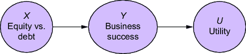

##### 图 12.2 效用节点可以代表效用/奖励，损失/成本。

注意，在这个模型中，效用是 *Y* 的确定性函数，我们将用 *U*(*Y*) 表示。


而不是效用/奖励函数，我们可以定义一个损失函数（也称为成本函数），它只是效用/奖励函数的-1 倍。例如，在第二个情景中，你购买股票而公司失败的情况下，你的效用是 –$1,000，你的损失是$1,000。

虽然代理的目标是决定一条将最大化效用的行动路线，但这样做是有挑战性的，因为通常在某个行动是否会导致期望的结果方面存在一些不确定性。在我们的例子中，投资股票可能看起来很明显，因为股票将导致商业成功，而商业成功无疑将导致更多的效用。但是，股票投资是否会导致商业成功存在一些不确定性。换句话说，我们不假设 *P*(*Y*=success|*X*=equity) = 1。在 *P*(*Y*|*X*=equity) 中，成功和失败都有非零的概率。

### 12.1.2 不确定性来自其他原因

在因果术语中，给定行动 *X*，结果 *Y* 仍然存在一些不确定性，因为还有其他因果因素在推动这个结果。例如，假设商业的成功取决于经济条件，如图 12.3 所示。


##### 图 12.3 我们在决策中通常存在不确定性。从因果的角度来看，不确定性是由于我们无法控制的其他因果因素影响我们行动下游的变量。

或者，那些其他因果因素可能直接影响效用。例如，而不是我为我们商业投资概述的两个离散情景——盈利或亏损，效用（或损失）可能取决于经济表现的好坏，如图 12.4 所示。我们可以利用统计和概率建模来应对这种不确定性。


##### 图 12.4 中，我们无法控制的因素可能直接影响效用（或损失）。

假设你在考虑是否要投资这个业务。你希望你的决策是基于数据的，因此你研究了这个市场中其他投资者之前都做了什么。你考虑了图 12.5 中的因果 DAG。


##### 图 12.5 在这个 DAG 中，经济条件驱动投资者选择如何投资。

根据你的研究，你得出结论，过去投资者的股票与债务选择也取决于经济条件。*P*(*X*|*C*)代表一个行动分布——你正在研究的投资者群体采取的行动分布。

然而，你分析的目标是围绕你自己，而不是其他投资者。你想要回答像“如果我买股票会怎样？”这样的问题。这个问题让我们进入了因果领域。我们不是在推理观察到的投资趋势；我们是在推理条件假设。这是一个我们需要引入基于干预的推理和反事实记号的指标。

## 12.2 因果决策理论

在本节中，我们将强调决策作为因果查询，并探讨这对建模决策意味着什么。

### 12.2.1 决策作为第二层查询

因果决策建模的混淆来源之一是行动和干预之间的区别。在许多决策情境中，特别是在强化学习（RL）中，行动是代理人*做*的事情，它改变了他们的环境。然而，行动也是由环境*驱动*的变量。当我们查看投资例子时，我们会看到这一点，如图 12.6 所示。

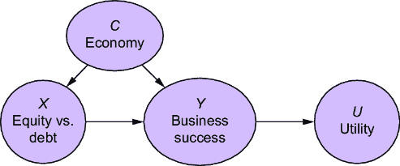

##### 图 12.6 在这个投资 DAG 版本中，行动的选择是由外部因素引起的。

选择股票或债券的行为是由经济因素因果驱动的变量。这意味着什么？这个行为是一个有原因的变量，还是一个干预措施？

答案是**两者都是**，这取决于上下文。当我们谈论通常会发生什么行为，例如当我们观察其他代理人的行为（甚至当我们反思我们自己的过去行为）以及这些行为导致了什么结果时，我们正在反思人口趋势，我们处于因果层次的第一层。在我们的投资例子中，我们正在推理*P*(*C*, *X*, *Y*, *U*)。但如果我们问的问题是“如果我进行股票投资会发生什么？”那么我们就是在问一个第二层的问题，我们需要将提议的行为作为干预措施。

接下来，我们将使用我们的因果符号来描述常见的决策规则。

### 12.2.2 决策规则和策略的因果特征

决策规则是基于效用分布*P*(*U*(*Y*[*X*][=][*x*]))选择行动的规则。代理人根据决策规则选择最优行动。例如，一个常见的决策规则是选择最小化损失或成本或最大化效用或奖励的行动。

在自动决策中，决策规则通常被称为“策略”。在公共卫生环境中，决策规则有时被称为“治疗方案”。

#### 最大化预期效用

最直观且最常见的决策规则是选择最大化预期效用的行动。首先，我们可以查看效用分布的期望值。由于效用是 *Y*[*X*][=][*x*] 的确定性函数，这仅仅是 *U*(*Y*[*X*][=][*x*]) 在 *Y* 的干预分布上的期望。

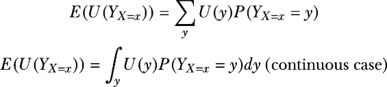

我们然后选择最大化预期效用的行动（*x* 的值）：


在我们的投资示例中，这意味着选择预期能让你赚最多钱的投资方法。

#### 最小-最大决策规则

要理解最小-最大决策规则，请记住，“效用”和“损失”是同一枚硬币的两面；效用 == 负损失。设 *L*(*y*) = –*U*(*y*)。那么最小-最大决策规则是

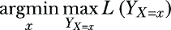

用简单的话说，这意味着“选择一个行动，以最小化可能的最大损失。”在我们的投资示例中，这意味着选择一个投资方法，以最小化在最坏情况下的损失。存在许多最小-最大规则变体，但它们有相同的味道——在困难时期最小化损失或最大化效用。

#### Softmax 规则

softmax 决策规则随机选择一个行动，其概率与结果的效用成比例。

让我们定义 *C*(*x*) 为选择行动 *x* 的概率。那么 *C*(*x*) 被定义为与以下成比例的概率值


噪声参数 *α* 在两种极端之间调节。当 *α*=0 时，我们在所有选择上都有均匀分布。随着 *α* 的增大，我们接近最大化预期效用。

有时我们的目标是模拟其他智能体的决策，例如在逆强化学习（inverse RL）中。当智能体不总是做出效用优化的选择时，softmax 决策规则很有用。softmax 决策规则提供了一个简单、可分析的、经验验证的次优选择模型。

另一个我们可能想要使用 softmax 规则的原因是在 *探索* 和 *利用* 之间存在权衡，例如在老虎机问题中。假设智能体对分布 *P*(*Y*[*X*][=][*x*]) 的形状不确定。根据 *P*(*Y*[*X*][=][*x*]) 的错误模型所采取的最优行动可能与根据正确模型 *P*(*Y*[*X*][=][*x*]) 所做的最优选择不同。softmax 决策规则允许我们选择各种行动，获取一些关于结果的数据，并使用这些数据来更新我们对 *P*(*Y*[*X*][=][*x*]) 的模型。当这些操作按顺序进行时，通常被称为 *汤普森抽样*。

在我们的投资类比中，假设我们要投资几个企业。也许，根据我们的当前模型，股权投资最大化预期效用，但我们对我们当前模型并不完全自信，所以我们选择选择债务投资，尽管当前模型表示它不太优。目标是增加我们的数据集的多样性，这样我们就可以学习更好的模型。

#### 其他类型的决策规则

还有其他类型的决策规则，并且它们可能会变得复杂，尤其是在涉及统计估计时。例如，在统计假设检验中使用*p*值涉及一个微妙的效用函数，它平衡了假阳性（错误地选择备择假设）和假阴性（错误地选择零假设）的机会。

幸运的是，当我们与概率因果模型一起工作时，数学通常更容易，我们得到一个称为*可接受性*的保证。

### 12.2.3 因果概率决策建模和可接受性

在本节中，我将简要说明选择因果概率建模方法进行决策的理由。当你在一个生产环境中实施自动化决策算法时，你可能需要解释为什么你的实现比另一个更好。在这种情况下，如果你知道你的算法是*可接受的*，那将是有用的。

如果没有其他规则支配它，则决策规则是*可接受的*。一个决策规则支配另一个规则，如果前者的性能在某些情况下比后者好，并且永远不会比后者差，相对于效用函数而言。例如，softmax 决策规则被最大化预期效用所支配（假设你知道*P*(*Y**[X]*[=]*[x]*)的真实形状），因为它有时会选择次优行动，因此是不可接受的。确定*可接受性*是决策理论中的一个关键任务。

对于我们来说，挑战出现在我们使用数据和统计来处理未知情况时，例如参数或潜在变量。如果我们想使用数据来估计一个参数或处理潜在变量，通常有多种统计方法可供选择。如果我们的决策算法依赖于一个统计过程，过程的选择可能会影响被认为最优的行动。我们如何知道我们的统计决策过程是可接受的？

概率建模库如 Pyro 利用贝叶斯推理来估计参数或推断潜在变量。贝叶斯决策理论告诉我们，*贝叶斯规则*（不要与贝叶斯定理混淆），即优化后验期望效用的决策规则，在温和的正规性条件下具有可接受性保证。这意味着如果我们使用 Pyro 或类似库中的贝叶斯推理来计算和优化后验期望损失，我们就有可接受性保证（如果这些温和的条件成立，通常都是成立的）。这意味着你不必担心别人的决策模型（做出相同的建模假设，具有相同的效用函数，并使用相同的数据）会打败你。

### 12.2.4 因果和非因果期望的 argmax 值的欺骗性对齐

大多数传统的决策方法，包括在强化学习（RL）中，都侧重于最大化 *E*(*U*(*Y*)|*X*=*x*) 而不是 *E*(*U*(*Y*[*X*][=][*x*])). 让我们使用 pgmpy 在图 12.6 中实现模型，并比较两种方法。

首先，我们将构建模型中的 DAG。

##### 设置你的环境

这段代码是用 pgmpy 版本 0.1.24 编写的。有关运行此代码的笔记本链接，请参阅章节注释 [`www.altdeep.ai/p/causalaibook`](https://www.altdeep.ai/p/causalaibook)。

##### 列表 12.1 投资决策模型的 DAG

```py
from pgmpy.models import BayesianNetwork
from pgmpy.factors.discrete import TabularCPD
from pgmpy.inference import VariableElimination
import numpy as np

model = BayesianNetwork([     #1
    ('C', 'X'),    #1
    ('C', 'Y'),     #1
    ('X', 'Y'),     #1
    ('Y', 'U')    #1
])    #1
```

#1 设置 DAG

接下来，我们将为 *Economy* (*C*)、*Debt vs. Equity* (*X*) 和 *Business Success* (*Y*) 构建因果马尔可夫核。*Economy* (*C*) 的因果马尔可夫核将取两个值：“熊”代表不良经济状况，“牛”代表良好。*Debt vs. Equity* (*X*) 的因果马尔可夫核将取决于 *C*，反映投资者在牛市倾向于偏好股权，在熊市倾向于偏好债务的事实。*Success* (*Y*) 取决于经济状况和债务或股权投资的选择。

##### 列表 12.2 创建 *C*、*X* 和 *Y* 的因果马尔可夫核

```py
cpd_c = TabularCPD(    #1
    variable='C',   #1
    variable_card=2,   #1
    values=[[0.5], [0.5]],   #1
    state_names={'C': ['bear', 'bull']}   #1
)    #1

cpd_x = TabularCPD(    #2
    variable='X',     #2
    variable_card=2,   #2
    values=[[0.8, 0.2], [0.2, 0.8]],     #2
    evidence=['C'],     #2
    evidence_card=[2],     #2
    state_names={'X': ['debt', 'equity'], 'C': ['bear', 'bull']}     #2
)    #2

cpd_y = TabularCPD(     #3
    variable='Y',     #3
    variable_card=2,    #3
    values= [[0.3, 0.9, 0.7, 0.6], [0.7, 0.1, 0.3, 0.4]],    #3
    evidence=['X', 'C'],    #3
    evidence_card=[2, 2],     #3
    state_names={     #3
        'Y': ['failure', 'success'],   #3
        'X': ['debt', 'equity'],     #3
        'C': ['bear', 'bull']     #3
    }    #3
)     #3
```

#1 为 C（经济）设置因果马尔可夫核。它有两个值：“牛”代表良好经济状况，“熊”代表不良。

#2 为行动 X 设置因果马尔可夫核，根据经济状况，要么是债务投资，要么是股权投资。

#3 为业务结果 Y 设置因果马尔可夫核，成功或失败取决于提供的投资类型（X）和经济状况（C）。

最后，我们将添加 *Utility* 节点 (*U*)。我们使用概率 1 和 0 来表示 *Y* 的确定性函数。我们通过添加所有核到模型中结束。

##### 列表 12.3 实现效用节点并初始化模型

```py
cpd_u = TabularCPD(     #1
    variable='U',    #1
    variable_card=2,    #1
    values=[[1., 0.], [0., 1.]],  #1
    evidence=['Y'],   #1
    evidence_card=[2],    #1
    state_names={'U': [-1000, 99000], 'Y': ['failure', 'success']}  #1 
)    #1
print(cpd_u)    #1
model.add_cpds(cpd_c, cpd_x, cpd_y, cpd_u)   #1
```

#1 设置效用节点。

#2 设置效用节点。

此代码打印出以下因果马尔可夫核的条件概率表。这是针对 *Utility* 变量的：

```py
+----------+------------+------------+
| Y        | Y(failure) | Y(success) |
+----------+------------+------------+
| U(-1000) | 1.0        | 0.0        |
+----------+------------+------------+
| U(99000) | 0.0        | 1.0        |
+----------+------------+------------+
```

这反映了投资者在牛市倾向于偏好股权投资，在熊市倾向于偏好债务投资的趋势。

下面的概率表是针对 *Business Success* 变量 *Y* 的：

```py
+------------+---------+---------+-----------+-----------+
| X          | X(debt) | X(debt) | X(equity) | X(equity) |
+------------+---------+---------+-----------+-----------+
| C          | C(bear) | C(bull) | C(bear)   | C(bull)   |
+------------+---------+---------+-----------+-----------+
| Y(failure) | 0.3     | 0.9     | 0.7       | 0.6       |
+------------+---------+---------+-----------+-----------+
| Y(success) | 0.7     | 0.1     | 0.3       | 0.4       |
+------------+---------+---------+-----------+-----------+
```

这反映了在熊市中，由于利率支付较高，债务融资不如债券融资受欢迎，而在牛市中，由于债券更便宜，债券融资更受欢迎。

最后，*效用*节点是一个简单的确定性函数，将 *Y* 映射到效用值：

```py
+----------+------------+------------+
| Y        | Y(failure) | Y(success) |
+----------+------------+------------+
| U(-1000) | 1.0        | 0.0        |
+----------+------------+------------+
| U(99000) | 0.0        | 1.0        |
+----------+------------+------------+
```

*接下来，我们将计算* *E*(*U*(*Y*[*X*][=][*x*])) 和 *E*(*U*(*Y*)|*X*=*x*). 在继续之前，下载并加载一个实现理想干预的辅助函数。为了缓解直接执行下载代码可能带来的安全担忧，代码会打印下载的脚本并提示您在执行脚本之前确认。*

##### 列表 12.4 下载实现理想干预的辅助函数

```py
import requests

url = "https://raw.githubusercontent.com/altdeep/causalML/master/book/pgmpy_do.py"    #1
response = requests.get(url)    #1
content = response.text    #1

print("Downloaded script content:\n")     #2
print(content)    #2
confirm = input("\nDo you want to execute this script? (yes/no): ")    #2
if confirm.lower() == 'yes':    #2
    exec(content)   #2
else:    #2
    print("Script execution cancelled.")    #2
```

#1 加载理想干预的实现。

#2 为了缓解安全担忧，您可以检查下载的脚本并在运行之前确认。

到现在为止，在这本书中，您不应该对 *E*(*U*(*Y*[*X*][=][*x*])) 与 *E*(*U*(*Y*)|*X*=*x*) 不同感到惊讶。让我们看看这些值。

##### 列表 12.5 计算 *E*(*U*(*Y*)|*X*=*x*) 和 *E*(*U*(*Y**[X]*[=]*[x]*))

```py
def get_expectation(marginal):     #1
    u_values = marginal.state_names["U"]    #1
    probs = marginal.values    #1
    expectation = sum([x * p for x, p in zip(u_values, probs)])   #1
    return expectation    #1

infer = VariableElimination(model)     #2
marginal_u_given_debt = infer.query( #2
    variables=['U'], evidence={'X': 'debt'})     #2
marginal_u_given_equity = infer.query( #2
    variables=['U'], evidence={'X': 'equity'})    #2
e_u_given_x_debt = get_expectation(marginal_u_given_debt)    #2
e_u_given_x_equity = get_expectation(marginal_u_given_equity)    #2
print("E(U(Y)|X=debt)=", e_u_given_x_debt)    #2
print("E(U(Y)|X=equity)=", e_u_given_x_equity)     #2

int_model_x_debt = do(model, {"X": "debt"})     #3
infer_debt = VariableElimination(int_model_x_debt)    #3
marginal_u_given_debt = infer_debt.query(variables=['U'])    #3
expectation_u_given_debt = get_expectation(marginal_u_given_debt)    #3
print("E(U(Y_{X=debt}))=", expectation_u_given_debt)     #3
int_model_x_equity = do(model, {"X": "equity"})     #3
infer_equity = VariableElimination(int_model_x_equity)     #3
marginal_u_given_equity = infer_equity.query(variables=['U'])    #3
expectation_u_given_equity = get_expectation(marginal_u_given_equity)     #3
print("E(U(Y_{X=equity}))=", expectation_u_given_equity)     #3
```

#1 用于计算预期效用的辅助函数

#2 通过干预将 X 设置为债务和债券，并计算每个干预下的 U 的期望值。

#3 在 X = debt 和 X = equity 的条件下，计算 U 的期望值。

这给我们以下条件预期效用（我已经用 * 标记了最高的）：

+   *E*(*U*(*Y*)|*X*=debt) = 57000 *

+   *E*(*U*(*Y*)|*X*=equity) = 37000

它还给我们以下干预预期效用：

+   *E*(*U*(*Y*[*X*][=debt])) = 39000 *

+   *E*(*U*(*Y*[*X*][=equity])) = 34000

因此，*E*(*U*(*Y*)|*X*=debt) 与 *E*(*U*(*Y*[*X*][=debt])) 不同，*E*(*U*(*Y*)|*X*=equity) 与 *E*(*U*(*Y*[*X*][=][equity])) 不同。然而，我们的目标是优化预期效用，在这种情况下，债务最大化了 *E*(*U*(*Y*)|*X*=x) 和 *E*(*U*(*Y*[*X*][=][*x*]))。

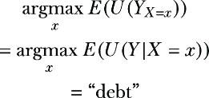

如果“债务”最大化了两个查询，因果决策理论有什么用？如果最优行动对于两者都是相同的，*E*(*U*(*Y*)|*X*=*x*) 和 *E*(*U*(*Y*[*X*][=][*x*])) 是否不同又有什么关系？

在决策问题中，通常情况下，问题的因果表述与更传统的非因果表述提供相同的答案。这在 RL 中常见的更高维问题中尤其如此。您可能会观察到这一点，并想知道为什么因果表述是必需的。

为了回答这个问题，观察当我们对模型中 *Y* 的参数进行轻微修改时会发生什么。具体来说，我们将把 *P*(*Y*=success|*X*=equity, *C*=bull) 的参数从 .4 改为 .6。首先，我们将使用参数更改重建模型。

##### 列表 12.6 修改 *Y* 的因果马尔可夫核中的参数

```py
model2 = BayesianNetwork([   #1
    ('C', 'X'),    #1
    ('C', 'Y'),    #1
    ('X', 'Y'),    #1
    ('Y', 'U')     #1
])

cpd_y2 = TabularCPD(    #2
    variable='Y',
    variable_card=2,
    values=[[0.3, 0.9, 0.7, 0.4],  [0.7, 0.1, 0.3, 0.6]],   #3
    evidence=['X', 'C'],
    evidence_card=[2, 2],
    state_names={
        'Y': ['failure', 'success'],
        'X': ['debt', 'equity'],
        'C': ['bear', 'bull']
    }
)

model2.add_cpds(cpd_c, cpd_x, cpd_y2, cpd_u)   #4
```

#1 初始化一个新的模型。

#2 为 Y 创建一个新的条件概率分布。

#3 将第一个列表中的最后一个参数 P(Y=success|X=equity, C=bull) = 0.4 改为 0.6。

#4 将因果马尔可夫核添加到模型中。

接下来，我们重新运行推理。

##### 列表 12.7 比较改变参数后的结果

```py
infer = VariableElimination(model2)    #1
marginal_u_given_debt = infer.query(variables=['U'],    #1
↪evidence={'X': 'debt'})    #1
marginal_u_given_equity = infer.query(variables=['U'],   #1
↪evidence={'X': 'equity'})    #1
e_u_given_x_debt = get_expectation(marginal_u_given_debt)   #1
e_u_given_x_equity = get_expectation(marginal_u_given_equity)     #1
print("E(U(Y)|X=debt)=", e_u_given_x_debt)   #1
print("E(U(Y)|X=equity)=", e_u_given_x_equity)   #1

int_model_x_debt = do(model2, {"X": "debt"})    #2
infer_debt = VariableElimination(int_model_x_debt)    #2
marginal_u_given_debt = infer_debt.query(variables=['U'])   #2
expectation_u_given_debt = get_expectation(marginal_u_given_debt)    #2
print("E(U(Y_{X=debt}))=", expectation_u_given_debt)     #2
int_model_x_equity = do(model2, {"X": "equity"})     #2
infer_equity = VariableElimination(int_model_x_equity)    #2
marginal_u_given_equity = infer_equity.query(variables=['U'])    #2
expectation_u_given_equity = get_expectation(marginal_u_given_equity)     #2
print("E(U(Y_{X=equity}))=", expectation_u_given_equity)    #2
```

#1 通过干预将 X 设置为 debt 和 equity，并计算每种干预下的 U 的期望。

#2 在 X = debt 和 X = equity 的条件下进行条件化，并计算 U 的期望。

这给我们以下条件期望（*表示最优选择）：

+   *E*(*U*(*Y*)|*X*=debt) = 57000 *

+   *E*(*U*(*Y*)|*X*=equity) = 53000

它还给我们以下干预期望：

+   *E*(*U*(*Y*[*X*][=debt])) = 39000

+   *E*(*U*(*Y*[*X*][=equity])) = 44000 *

在单个参数的微小变化下，“债务”仍然是 *E*(*U*(*Y*)|*X*=*x*) 中 *x* 的最优值，但现在“股权”是 *E*(*U*(*Y*[*X*][=][*x*])) 中 *x* 的最优值。这是一个因果答案与基于证据的条件答案不同的情况。由于我们正在尝试回答一个第二级查询，因果方法是正确的方法。

这意味着虽然简单地优化条件期望通常可以得到正确答案，但在某些情况下，你可能会得到错误答案。这与我们在第四章中关于半监督学习的讨论类似——通常未标记数据可以帮助学习，但在特定情况下，未标记数据不会增加任何价值。因果分析帮助我们以精确的术语描述了这些情况。同样，在这种情况下，有特定的场景，因果问题的因果表述相对于传统的非因果表述将导致不同的、更正确的结果。即使是包括在深度强化学习中使用的基于深度学习的最流行的决策优化算法，也可以通过利用决策问题的因果结构来提高性能。

接下来，我们将看到另一个 Newcomb 悖论的例子。

### 12.2.5 Newcomb 悖论

一个著名的思想实验，称为 Newcomb 悖论，对比了决策理论中的因果方法，即在干预下最大化效用，与传统的在某种行动条件下最大化效用的方法。在本节中，我们将探讨这个思想实验的 AI 版本，下一节将展示如何使用形式化的因果模型来处理它。

如图 12.7 所示，有两个标记为 A 和 B 的盒子。盒子 A 总是包含$1,000。盒子 B 包含$1,000,000 或$0。决策代理必须选择只拿盒子 B 或*两个*盒子。代理在做出决定之前不知道盒子 B 里有什么。根据这个信息，很明显代理应该拿两个盒子——选择两个盒子可以得到$1,000 或$1,001,000，而只选择 B 可以得到$0 或$1,000,000。


##### 图 12.7 Newcomb 悖论中盒子的示意图

现在，假设有一个 AI 可以高精度地预测代理打算做出的选择。如果 AI 预测代理打算选择两个盒子，它将不会在盒子 B 中放钱。如果 AI 预测正确，代理选择两个盒子，代理只能得到 $1,000。然而，如果 AI 预测代理打算只选择盒子 B，它将在盒子 B 中放入 $1,000,000。如果 AI 预测正确，代理将在盒子 B 中得到 $1,000,000，但不会在盒子 A 中得到 $1,000。代理在做出选择之前不知道 AI 的预测或盒子 B 中有什么。

传统悖论的产生如下。一个因果论者认为，AI 的行为超出了他们的控制。他们只关注他们能控制的部分——他们选择因果后果。他们不能 *造成* 盒子 B 的内容，所以他们选择两个盒子，以备万一盒子 B 有钱，就像 AI 不存在时一样。但如果代理知道 AI 的工作原理，选择只选择盒子 B 并确定性地获得一百万不是更有意义吗？

通过列举可能的结果及其概率来进一步深入探讨。假设 AI 的预测准确率为 95%。如果代理选择两个盒子，那么 AI 有 95% 的可能性猜对了代理的选择，将没有钱放入 B，在这种情况下，代理只能得到 $1,000。有 5% 的可能性算法会猜错，在这种情况下，它会将 1,000,000 放入盒子 B，代理赢得 $1,001,000。如果代理只选择盒子 B，那么 AI 有 95% 的可能性预测了选择，并将 1,000,000 放入盒子 B，给代理 $1,000,000 的奖金。有 5% 的可能性它不会这样做，代理将一无所获。我们在表 12.1 中看到这些结果。预期效用计算显示在表 12.2 中。

##### 表 12.1 新科姆问题的结果及其概率

| 策略 | AI 行动 | 奖金 | 概率 |
| --- | --- | --- | --- |
| 选择两者 | 将 $0 放入盒子 B | $1,000 | .95 |
| 选择两者 | 将 $1,000,000 放入盒子 B | $1,001,000 | .05 |
| 只选择盒子 B | 将 $1,000,000 放入盒子 B | $1,000,000 | .95 |
| 只选择盒子 B | 将 $0 放入盒子 B | $0 | .05 |

##### 表 12.2 新科姆问题中每个选择的预期效用

| 策略 ( *x*) | *E*( *U*&#124; *X*= *x*) |
| --- | --- |
| 选择两者 | 1,000 × .95 + 1,001,000 × .05 = $51,000 |
| 只选择盒子 B | 1,000,000 × .05 + 0 × .05 = $950,000 |

传统方法建议只选择盒子 B。

当悖论被创造出来时，对问题采取因果方法意味着只关注自己行为的因果后果。记住，AI 在代理行动之前做出预测。由于效果不能在时间上先于原因，AI 的行为不是代理行为的后果，因此具有因果观点的代理忽略 AI，并坚持选择两个盒子的原始策略。

看起来，具有因果观点的代理在未能考虑人工智能的行动时犯了错误。但我们可以通过让代理使用正式的因果模型来解决这个问题。

### 12.2.6 带有因果模型的 Newcomb 悖论

在 Newcomb 悖论的传统表述中，假设是使用因果决策理论的代理只关注他们行动的后果——他们在图 12.8 中的因果有向图中进行推理。但真实的数据生成过程（DGP）被图 12.9 更好地捕捉。

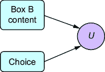

##### 图 12.8 Newcomb 悖论假设了一种因果决策理论版本，其中天真代理使用这个错误的因果有向图。


##### 图 12.9 代表 Newcomb 悖论框架的更好的因果有向图

代理的选择不能 *cause* 人工智能的预测，因为预测先发生。因此，我们假设人工智能代理正在推断代理的 *intent*，因此代理的意图是人工智能预测的原因。

因果决策代理会更喜欢图 12.9 中的图，因为它更好地代表了 DGP。聪明的代理不会专注于最大化 *E*(*U*[*choice*][=][*x*])。聪明的代理意识到自己的意图，并知道这种意图是盒子 B 内容的原因，它专注于优化 *E*(*U*[*choice*][=][*x*]|*intent*=*i*)，其中 *i* 是他们最初选择哪个盒子的原始意图。

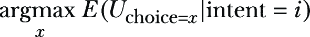

我们将假设代理的初始意图是一种它无法控制的冲动。但尽管他们无法控制他们的初始意图，他们可以进行一些内省并意识到这种意图。进一步，我们将假设，在这样做之后，他们有能力在人工智能做出预测并设置盒子 B 的内容之后，将他们的选择改变为与最初意图不同的东西。让我们在 pgmpy 中模拟这个系统并评估最大化 *E*(*U*[*choice*][=][*x*]|*intent*=*i*)。

首先，让我们构建 DAG。

##### 列表 12.8 创建 DAG

```py
model = BayesianNetwork(    
    [    
        ('intent', 'AI prediction'),    
        ('intent', 'choice'),    
        ('AI prediction', 'box B'),    
        ('choice', 'U'),    
        ('box B', 'U'),    
    ]    
)
```

接下来，我们将为意图和选择创建因果马尔可夫内核。

##### 列表 12.9 创建意图和选择的因果马尔可夫内核

```py
cpd_intent = TabularCPD(     #1
    'intent', 2, [[0.5], [0.5]],    #1
    state_names={'intent': ['B', 'both']}    #1
)   #1
print(cpd_intent)

cpd_choice = TabularCPD(    #2
    'choice', 2, [[1, 0], [0, 1]],    #2
    evidence=['intent'],     #2
    evidence_card=[2],    #2
    state_names={     #2
        'choice': ['B', 'both'],     #2
        'intent': ['B', 'both']   #2
    }     #2
)   #2
print(cpd_choice)
```

#1 我们假设代理将更喜欢两个盒子而不是盒子 B 的概率为 50-50。

#2 我们假设代理的选择是由他们的意图决定性地驱动的。

同样，我们将为人工智能的决策和盒子 B 的内容创建因果马尔可夫内核。

##### 列表 12.10 创建人工智能预测和盒子 B 内容的因果马尔可夫内核

```py
cpd_AI = TabularCPD(     #1
    'AI prediction', 2, [[.95, 0.05], [.05, .95]],   #1
    evidence=['intent'],   #1
    evidence_card=[2],   #1
    state_names={    #1
        'AI prediction': ['B', 'both'],    #1
        'intent': ['B', 'both']    #1
    }    #1
)    #1
print(cpd_AI)

cpd_box_b_content = TabularCPD(    #2
    'box B', 2, [[0, 1], [1, 0]],    #2
    evidence=['AI prediction'],    #2
    evidence_card=[2],    #2
    state_names={    #2
        'box B': [0, 1000000],    #2
        'AI prediction': ['B', 'both']   #2
    }     #2
)    #2
print(cpd_box_b_content)
```

#1 人工智能的预测准确率为 95%。

#2 盒子 B 的内容是由人工智能的预测决定性地设置的。

最后，我们将为效用创建一个因果马尔可夫内核，并将所有内核添加到模型中。

##### 列表 12.11 创建效用内核并构建模型

```py
cpd_u = TabularCPD(    #1
    'U', 4,    #1
    [    #1
        [1, 0, 0, 0],  #1
        [0, 1, 0, 0],   #1
        [0, 0, 1, 0],   #1
        [0, 0, 0, 1],    #1
    ],   #1
    evidence=['box B', 'choice'],    #1
    evidence_card=[2, 2],    #1
    state_names={    #1
        'U': [0, 1000, 1000000, 1001000],    #1
        'box B': [0, 1000000],    #1
        'choice': ['B', 'both']    #1
    }   #1
)    #1
print(cpd_u)

model.add_cpds(cpd_intent, cpd_choice, cpd_AI, cpd_box_b_content, cpd_u)  #2
```

#1 设置效用节点。

#2 构建模型。

现在，我们将评估最大化 *E*(*U*[*choice*][=][*x*]|*intent*=*i*)。

##### 列表 12.12 使用干预和基于意图的条件推断最佳选择

```py
int_model_x_both = do(model, {"choice": "both"})    #1
infer_both = VariableElimination(int_model_x_both)   #1
marginal_u_given_both = infer_both.query(   #1
    variables=['U'], evidence={'intent': 'both'})    #1
expectation_u_given_both = get_expectation(marginal_u_given_both)    #1
print("E(U(Y_{choice=both}|intent=both))=", expectation_u_given_both)    #1
int_model_x_box_B = do(model, {"choice": "B"})     #2
infer_box_B = VariableElimination(int_model_x_box_B)    #2
marginal_u_given_box_B = infer_box_B.query(    #2
    variables=['U'], evidence={'intent': 'both'})     #2
expectation_u_given_box_B = get_expectation(marginal_u_given_box_B)    #2
print("E(U(Y_{choice=box B}|intent=both))=", expectation_u_given_box_B)    #2
int_model_x_both = do(model, {"choice": "both"})     #3
infer_both = VariableElimination(int_model_x_both)     #3
marginal_u_given_both = infer_both.query(     #3
    variables=['U'], evidence={'intent': 'B'})    #3
expectation_u_given_both = get_expectation(marginal_u_given_both)     #3
print("E(U(Y_{choice=both}|intent=B))=", expectation_u_given_both)     #3
int_model_x_box_B = do(model, {"choice": "B"})     #4
infer_box_B = VariableElimination(int_model_x_box_B)  #4
marginal_u_given_box_B = infer_box_B.query(    #4
    variables=['U'], evidence={'intent': 'B'}) #4
expectation_u_given_box_B = get_expectation(marginal_u_given_box_B)     #4
print("E(U(Y_{choice=box B}|intent=B))=", expectation_u_given_box_B)     #4
```

#1 推断 E(U(Y [选择=两个]|意图=两个))。

#2 推断 E(U(Y [选择=盒子 B]|意图=两个))。

#3 推断 E(U(Y [选择=两个]|意图=B))。

#4 推断 E(U(Y [选择=盒子 B]|意图=B))。

这段代码产生了以下结果（*表示给定意图的最优选择）：

+   *E*(*U*(*Y*[*选择*][=两个]|*意图*=两个)) = 51000 *

+   *E*(*U*(*Y*[*选择*][=盒子 B]|*意图*=两个)) = 50000

+   *E*(*U*(*Y*[*选择*][=两个]|*意图*=B)) = 951000 *

+   *E*(*U*(*Y*[*选择*][=盒子 B]|*意图*=B)) = 950000

当代理的初始意图是选择两个时，最佳选择是选择两个。当代理意图只选择盒子 B 时，最佳选择是忽略那些意图并选择两个。无论如何，代理都应该选择两个。请注意，当代理最初意图只选择盒子 B 时，切换到两个盒子给了他们$951,000 的预期效用，这比非因果方法中最佳选择效用$950,000 要高。

然而，代理无法控制他们的初始意图；如果他们能，他们会故意‘意图’选择盒子 B，然后在最后时刻切换到选择两个盒子，在 AI 将一百万放入盒子 B 之后。然而，他们可以进行一种内省，将他们的初始意图纳入他们的决策中，并在此过程中，考虑到 AI 的行为而不是忽略它。

### 12.2.7 因果决策理论中的内省

新问题说明了因果决策理论的关键能力——我们能够将内省包括在 DGP 中。

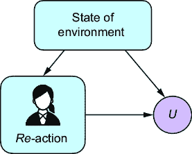

##### 图 12.10 我们的行为通常是环境反应，而不是故意决策的结果。

为了说明，考虑我们的行为通常是环境反应，就像图 12.10 所示。

例如，你可能会因为饥饿而购买一盒巧克力，因为它在你等待在杂货店的结账通道时被放置在诱惑你的位置。你不会经历一些深思熟虑的决策过程，而是对你的渴望有一个简单、甚至可能是无意识的反应，并有一种简单的方法来满足它。

然而，人类能够进行内省——观察和思考他们的内部状态。一个人可能会将他们的正常反应行为视为 DGP 的一部分。这种内省在图 12.11 中得到了说明。

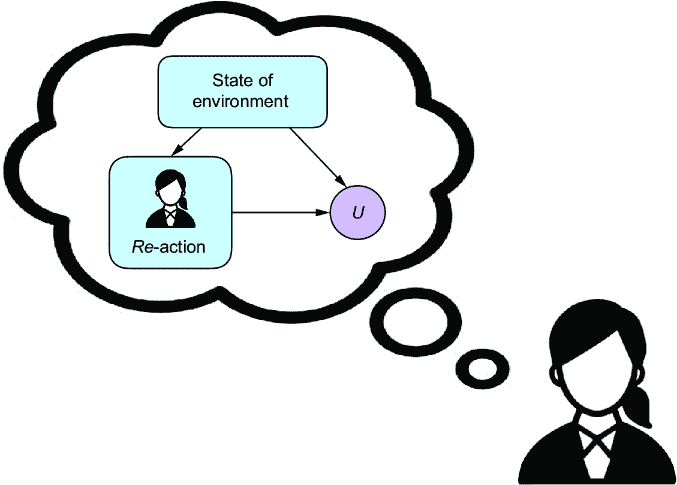

##### 图 12.11 人类和一些其他代理可以思考一个包括他们作为该过程组成部分的 DGP。

通过这种内省，代理可以对以下情况进行 2 级分层推理：如果他们不按常规反应，而是故意行动（例如，坚持饮食并不要买巧克力棒），如图 12.12 所示。

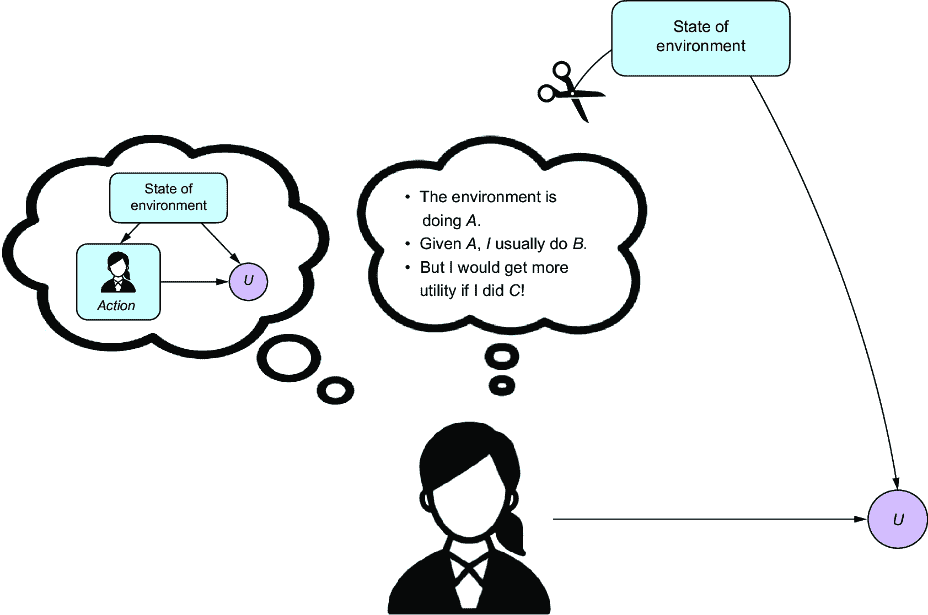

##### 图 12.12 代理对包括他们作为组成部分的 DGP 进行推理。然后他们使用这种推理来询问关于该过程的 2 级“如果...会发生什么”问题。

在许多情况下，代理可能不知道他们环境的完整状态。然而，如果代理能够将他们想要以某种方式反应的冲动与他们的行为分开，他们可以使用这种“冲动”作为深思熟虑的决策的证据，如图 12.13 所示。


##### 图 12.13 代理可能不知道环境中其他变量的状态，但通过内省，他们可能对这些变量有一种直觉。这种直觉可以用作条件因果推断的证据。

我们在 Newcomb 例子中看到了这种模式；代理不知道 AI 的预测是什么，但通过内省，他们可以使用他们的初始意图选择两个盒子作为 AI 选择的*证据*。

你有没有注意到你在工作中开始犯一些笨拙的错误，并以此作为你疲劳的证据，尽管你并不觉得如此，你心想，“如果我休息一下会怎样？” 你有没有一种直觉，觉得某件事不对劲，尽管你不知道是什么，基于这种感觉开始做出不同的决策？因果建模，尤其是因果生成模型，使得编写能够捕捉这种自我内省的决策算法变得容易。

接下来，我们将探讨顺序决策的因果建模。

## 12.3 因果图和顺序决策

顺序决策过程是连续决策的过程。这些过程可能涉及人类或算法和工程代理做出的顺序决策。

当我按顺序建模决策过程时，我使用下标来表示序列中的离散步骤，例如 *Y*[1]，*Y*[2]，*Y*[3]。当我想要表示干预下标时，我将它放在时间步下标的右侧，例如 *Y*[1,][*X*][=][*x*]，*Y*[2,][*X*][=][*x*]，*Y*[3,][*X*][=][*x*]。

在本节中，我将展示几个典型顺序决策过程的因果图，但你应该将这些视为模板，而不是固定结构。你可以根据给定问题适当添加或删除边。

让我们看看最简单的情况，即投币机反馈。

### 12.3.1 投币机反馈

*投币机反馈*指的是在序列中的每个步骤，都有一个导致结果 *Y* 的行为 *X*，并伴随一些效用 *U*(*Y*)。投币机序列有两个关键特征。第一个特征是，在每个步骤，行为发生后立即有反馈。第二个特征是独立试验，意味着在 *t*^(th) 时间步的变量与其他时间步的变量是独立的。术语“投币机”来自对“单臂老虎机”的类比，这是一个用于赌场的老虎机的俚语，传统上有一个玩家拉动以启动游戏的手臂。老虎机游戏提供投币机反馈——你投入代币，拉动手臂，并立即知道你是否赢了或输了。这个结果与之前的游戏无关。

我们可以用图 12.14 中的因果 DAG 捕捉多臂老虎机反馈。

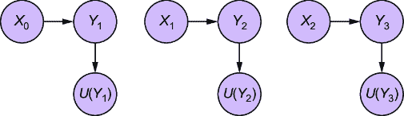

##### 图 12.14 一个因果 DAG，说明了简单的多臂老虎机反馈

图 12.14 中的因果 DAG 通过每个时间步的效用节点捕捉即时反馈，并且由于缺乏边，反映了变量在时间步之间的独立性。

### 12.3.2 上下文多臂老虎机反馈

在上下文多臂老虎机反馈中，一个或多个变量是动作和结果的共同原因。在图 12.15 中，上下文变量 *C* 是序列中每个 {*X*, *Y*} 元组的共同因素。在这种情况下，上下文变量 *C* 可以代表某个特定个体的档案，而动作变量 *X* 是该用户的行为。

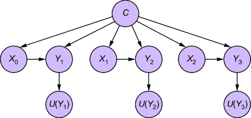

##### 图 12.15 一个因果 DAG，说明了上下文多臂老虎机反馈

或者，上下文变量可以在每一步改变，如图 12.16 所示。

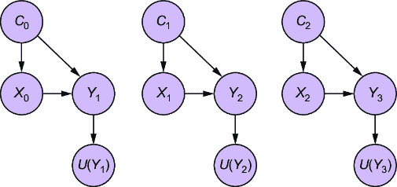

##### 图 12.16 一个因果 DAG，说明了上下文多臂老虎机反馈，其中上下文在每个时间步改变

我们可以以不同的方式改变这个模板。例如，我们可以在下一个时间步中让动作驱动上下文变量，如图 12.17 所示。选择取决于你的具体问题。

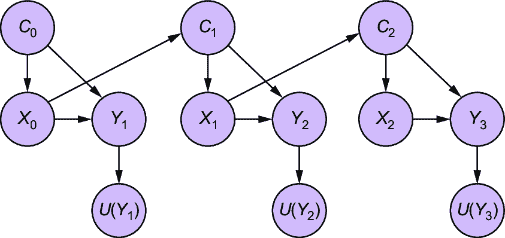

##### 图 12.17 一个因果 DAG，其中一个时间步的动作影响下一个时间步的上下文

### 12.3.3 延迟反馈

在延迟反馈设置中，结果变量和相应的效用不再是即时反馈。相反，它们在序列的末尾出现。让我们考虑一个上下文变量驱动动作的例子。动作影响上下文变量的下一个实例。


##### 图 12.18 带有延迟反馈的顺序决策因果 DAG 示例

再次，图 12.18 展示了基于先前模型此方法的一个示例。在这里，时间 *k* 的动作影响时间 *k* + 1 的上下文变量 (*C*)，这反过来又影响时间 *k* + 1 的动作。

考虑一个慢性疼痛的案例。在这里，上下文变量代表受试者是否正在经历疼痛 (*C*)。疼痛的存在驱动了服用止痛药的动作 (*X*)。服用止痛药（或不服用）影响下一个步骤中是否有疼痛。图 12.19 说明了这个 DAG。


##### 图 12.19 表示慢性疼痛治疗的因果 DAG

*Y* 这里是受试者的最终健康结果，它既由随时间推移的总疼痛量驱动，也由受试者所服用的药物量驱动（因为可能过度使用止痛药会有害健康）。

### 12.3.4 对顺序模型进行因果查询

我们可能想要计算我们的顺序决策问题的一些因果查询。例如，给定图 12.19 中的 DAG，我们可能想要计算 *X*[0] 对 *U*(*Y*) 的因果效应：


或者，我们可能对一系列行为对 *U*(*Y*) 的因果效应感兴趣：

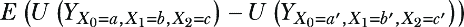

无论哪种方式，现在我们已经将顺序问题作为因果模型来构建，我们进入了熟悉的领域；我们可以简单地使用我们在前几章中学到的因果推断工具来使用这个模型回答因果查询。

如同往常，我们必须注意潜在原因的可能性，这些原因可能会混淆我们的因果推断。在因果效应的情况下，我们的关注点是行为 (*X*) 和结果 (*Y*) 之间，或者行为 (*X*) 和效用 (*U*) 之间的潜在共同混淆原因。图 12.20 与图 12.15 相同，除了它引入了一个潜在的 *Z* 混淆因子。


##### 图 12.20 具有潜在混淆因子的上下文 Bandit

同样，我们可以在每个时间步长有一个独特的混淆因子，如图 12.21 所示。

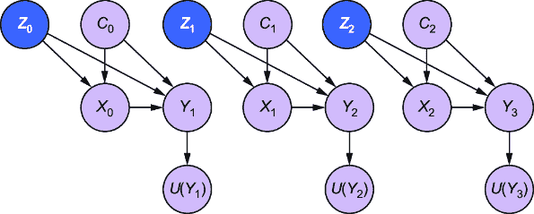

##### 图 12.21 每个时间步长都有不同上下文和潜在混淆因子的 Bandit 反馈

同样，图 12.22 显示了慢性疼痛图的第二个版本，其中混淆因子相互影响，并且影响上下文变量。这个混淆因子可能是影响疼痛和福祉的受试者环境中的某些外部因素。

当我们想要推断一系列行为对 *U*(*Y*) 的因果效应时，这些混淆因子成为一个问题。


##### 图 12.22 一个慢性疼痛 DAG 的版本，其中混淆因子相互影响，并且影响上下文变量

接下来，我们将探讨如何将顺序决策过程中的自动决策策略视为随机干预。

## 12.4 政策作为随机干预

在自动顺序决策中，术语“策略”比“决策规则”更受欢迎。我将介绍一个用于策略的特殊符号：*π*(.). 它将是一个函数，它接受其他变量的观察结果并返回一个动作。

为了考虑策略如何影响模型，我们将比较实施策略前后的 DAG。图 12.23 展示了带有上下文变量 *C* 和潜在变量 *Z* 的简单示例。策略使用上下文 *C* 来选择 *X* 的值。


##### 图 12.23 虚线表示由策略调节的边。策略像理想的干预一样打破了混淆因子 *Z* 的影响，但通过策略对 *C* 的依赖仍然存在。

策略是一种随机干预；它从依赖于 C 的某个过程中为 X 选择一个干预值。像理想的干预一样，它改变了图。图 12.23 的左侧显示了策略部署前的 DAG。右侧是策略部署后的 DAG。我在图中添加了一个特殊的策略节点来展示策略如何调节图。虚线边强调了由策略调节的边。就像理想的干预一样，策略生成的干预移除了 X 原始的输入边 C→X 和 Z→X。然而，因为策略依赖于 C，虚线边说明了从 C 到 X 的新影响流。

假设我们感兴趣的是策略选择的动作 X=Π对于值 Y 会有什么影响。在反事实记法中，我们写成


在序列设置中，策略在序列的多个步骤中应用随机干预。从可能世界视角来看，每个干预都会诱导一个新的假设世界。这可能会使反事实记法变得有些复杂，所以从现在开始，我将简化反事实记法，使其看起来像这样：


这意味着 Y[3]（第 3 个时间步的 Y）受到策略在时间 0、1 和 2 的效用结果的影响。

### 12.4.1 序列决策中的例子

在奖励机反馈的情况下，动作由一个奖励机算法产生，这是一种将整个动作和效用结果的历史纳入决定当前最优动作的策略。尽管在每一个时间步中，奖励机反馈过程中的动作和结果都是独立的，但策略引入了对过去动作和结果的依赖，如图 12.24 所示。


##### 图 12.24 奖励机反馈，其中奖励机策略算法根据过去的行为和奖励结果选择下一个动作

回想我们之前关于一个代理对疼痛发作做出药物反应的例子。图 12.25 显示了策略如何接受疼痛程度的历史以及提供的药物剂量。


##### 图 12.25 在疼痛示例中，策略考虑了记录的疼痛程度和相应的药物剂量历史。

策略就像在医院病房里巡视的医生。他们来到病人的床边，病人报告了某种程度的疼痛。医生查看该病人的疼痛报告历史和随后的药物剂量，并使用这些信息来决定这次提供多少剂量。医生的效用函数是以疼痛、超量风险和成瘾风险为标准的。他们需要考虑历史数据，而不仅仅是当前的疼痛水平，以优化这个效用函数。

### 12.4.2 策略如何引入混杂因素

作为随机干预，策略在图中的其他节点上引入条件干预。正因为如此，策略可能会引入新的后门路径，这可能会混淆因果推断。例如，再次考虑图 12.26 中的 DAG。

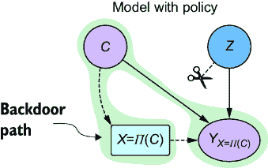

##### 图 12.26 政策消除了通过*Z*的后门路径，但没有消除通过*C*的后门路径。

政策打破了从*X*到*Y*通过*Z*的后门路径，但仍然存在从*X*到*Y*通过*C*的路径。因此，涉及*X*和*Y*的典型因果查询将不得不对*C*进行条件化或调整。

在下一节中，我们将用因果关系来描述因果强化学习。

## 12.5 因果强化学习

强化学习（RL）是机器学习的一个分支，通常涉及代理学习最大化累积奖励（效用）的策略。代理从其行动的后果中学习，而不是从被明确教导中学习，并根据它收到的奖励或损失（强化）调整其行为。许多序列决策问题都可以表示为 RL 问题。

### 12.5.1 因果关系与马尔可夫决策过程的连接

RL 通常将决策过程表示为马尔可夫决策过程（MDP）。一个典型的 MDP 玩具示例是网格世界，如图 12.27 所示。

图 12.27 展示了一个 3 × 4 的网格世界。代理可以在这个网格世界中执行一组固定的动作，向上、向下、向左和向右移动。代理想要执行一组动作，将其带到右上角{0, 3}，在那里它获得 100 的奖励。代理想要避开中间右边的方块{1, 3}，在那里它有-100 的奖励（损失 100）。位置{1, 1}包含代理无法穿越的障碍物。

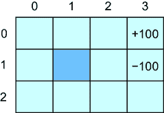

##### 图 12.27 简单的网格世界

我们可以将其视为一个游戏。当游戏开始时，代理“随机”出现在一个方块中，除了{0, 3}、{1, 3}和{1, 1}。当代理移动到目标方块时，游戏结束。为了获胜，代理必须绕过{1, 1}中的障碍物，避开{1, 3}，并到达{0, 3}。

马尔可夫决策过程使用状态、动作、转移函数和奖励的抽象来模拟这个和更多复杂的“世界”（即领域、问题等）。

#### 状态

状态集表示代理在其环境中当前所处的情况或上下文。在网格世界示例中，一个状态表示代理位于特定的单元格。在这个网格中，有 12 种不同的状态（{1, 1}单元格是不可达状态）。我们假设代理有某种方式知道他们处于哪个状态。

我们将用变量*S*表示状态。在网格世界中，*S*是一个离散变量，但在其他问题中，*S*可能是连续的。

#### 动作

动作是智能体可以执行的事情，并且会导致状态的变化。某些动作在特定状态下可能不可用。例如，在网格世界中，网格的边缘是智能体运动的约束。如果智能体处于左下角方格 {2, 0}，并且尝试向左或向下移动，它们将保持在原地。同样，{1, 1} 中的单元格是智能体必须绕过的障碍。我们用变量 *A* 表示动作，它有四种可能的结果 {上，下，右，左}。

#### 转移函数

转移函数是一个概率分布函数。它告诉我们，在给定当前状态和采取的动作的情况下，移动到特定下一个状态的概率。

如果状态是离散的，转移函数看起来像这样：

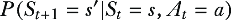

在这里，*S**[t]*=*s* 表示智能体当前处于状态 *s*。*A**[t]*=*a* 表示智能体执行动作 *a*。*P*(*S**[t]**[+1]*=*s'|S**[t]*=*s, A**[t]*=*a*) 是智能体在处于状态 s 并执行动作 *a* 的情况下过渡到新状态 s' 的概率。当动作以完全确定的方式导致新状态时，这个概率分布函数变得退化（所有概率都集中在单个值上）。

#### 奖励

在强化学习（RL）中，“奖励”一词比“效用”更受欢迎。在 MDP 的上下文中，奖励函数将始终以状态 *s* 作为参数。我们将它写成 *U*(*s*)。

在网格世界示例中，*U*({0, 3}) = 100，*U*({1, 3}) = –100。所有其他状态的奖励为 0。请注意，有时在 MDP/RL 文献中，*U*()是状态和动作的函数，如*U*(*s*, *a*)。仅仅让动作成为状态的函数并不会失去任何东西，因为你可以总是将动作折叠到状态的定义中。

### 12.5.2 MDP 作为因果 DAG

图 12.28 展示了 MDP 作为一个因果 DAG。

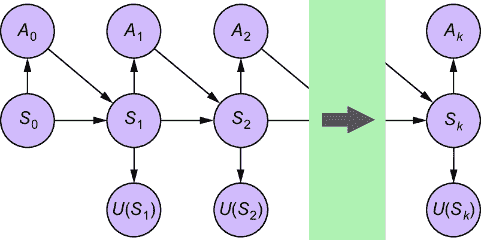

##### 图 12.28 以 DAG 表示的马尔可夫决策过程

作为因果 DAG，MDP 看起来像我们概述的其他顺序决策过程，只不过我们限制了自己只关注状态、动作和奖励。在图 12.28 中，过程一直持续到我们达到终端状态 (*S*[*k*])，例如在网格世界示例中到达终端单元格。

#### 因果马尔可夫性质和 MDP

“马尔可夫决策过程”中的“马尔可夫”一词来源于当前状态在给定最后一个状态的情况下与状态的完整历史无关的事实。这与因果 DAG 的因果马尔可夫性质形成对比：在 DAG 中，一个节点在其直接因果父节点给定的情况下，与间接“祖先”原因无关。我们可以看到，当我们把 MDP 看作因果 DAG 时，这个马尔可夫假设等价于因果马尔可夫性质。这意味着我们可以在 MDP 图形设置中使用基于 d-separation 的因果推理，包括 do-calculus。

#### 转移函数和因果马尔可夫核

注意，基于这个 DAG，状态 *S*[(]*[t]*[+1)] 的父节点是先前的状态 *S**[t]* 和在先前状态下采取的动作 *A**[t]*。因此，因果马尔可夫核是 *P*(*S**[t]**[+1]*=*s'|S**[t]*=*s, A**[t]*=*a*)，即转移函数。因此，转移函数是给定状态的因果马尔可夫核。

### 12.5.3 部分可观察 MDP

MDP 的扩展是 *部分可观察 MDP*（POMDP）。在 POMDP 中，代理不能确定他们处于什么状态，他们必须根据从环境中的不完整证据对该状态进行推断。这适用于许多实际问题，其中代理无法观察到环境的完整状态。

一个 POMDP 可以根据我们对未观察状态和观察状态之间因果关系的假设具有不同的因果结构。例如，假设一个潜在状态 *S* 是观察状态 *X* 的原因。现在观察状态 *X* 驱动行为 *A* 而不是 *S*。图 12.29 展示了将 POMDP 作为因果有向无环图（DAG）的这种表述。


##### 图 12.29 展示了潜在状态 *S* 导致观察状态 *X* 的 POMDP。*X* 驱动动作 *A*。

相比之下，图 12.30 展示了一个例子，其中潜在状态是观察状态（通过代理的动作中介）和效用（注意从 *U*(*S*[*i*]) 到 *U*[*i*] 的符号略有变化）的潜在共同原因（表示为 Z）。在这里，未观察因素影响代理的行为以及该行为的效用。

再次强调，基本的 MDP 和 POMDP DAG 应被视为我们分析的模板。一旦我们理解了我们感兴趣回答的因果查询，我们就可以将观察状态和未观察状态的各个组成部分明确地表示为图中的特定节点，然后使用识别和调整技术来回答我们的因果查询。


##### 图 12.30 展示了未观察状态是潜在共同原因的 POMDP 表述，这些原因可能作为因果推断中的混杂因素。

### 12.5.4 MDP 中的策略

与之前一样，MDP 中的策略作为随机干预。图 12.31 展示了在当前状态下选择最优动作的策略，这种方式会破坏任何来自混杂因素的影响。


##### 图 12.31 展示了 MDP DAG 的修改

图 12.31 在简单性上，它仅基于当前状态选择一个动作。挑战在于实现，因为在大多数 RL 设置中，状态可以是高维对象。

### 12.5.5 因果 Bellman 方程

强化学习（RL）是关于寻找最优策略，该策略由 Bellman 方程表征，通常如下所示：

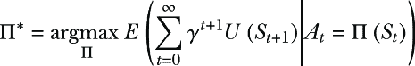

用简单的话说，我们正在寻找一个策略Π^*，它最大化了随时间累积的奖励。在这里，*γ*是一个折现率，其值在 0 和 1 之间，确保智能体更重视近期的奖励而不是远期的奖励。

由于我们在推理如果我们部署了策略会发生什么，因此因果公式如下：


注意，我们可以对贝尔曼方程的其他变体执行相同的因果重写，例如 Q 学习中使用的 Q 函数。

贝尔曼方程的非因果和因果公式的区别与第 12.2.4 节中优化*E*(*U*(*Y*)|*X*=*x*)和*E*(*U*(*Y*[*X*][=][*x*]))的区别相同。解决贝尔曼方程因果天真版本的进程可能会引入来自潜在混杂因素或来自对碰撞者和中介条件的条件的偏差。我们调整因果的方法可以帮助避免这些偏差。在许多情况下，天真方法的解决方案将与因果方法一致，因为那些偏差可能不会影响相对于其他策略的顶级策略的排名。然而，正如*E*(*U*(*Y*)|*X*=*x*)与*E*(*U*(*Y*[*X*][=][*x*]))的例子一样，将会有一些情况下非因果和因果公式的解决方案不同，你的强化学习问题可能是那些情况之一。

## 12.6 决策理论中的反事实推理

到目前为止，我们已经讨论了在因果层次结构中作为第二级查询的，关于根据效用函数选择最优动作的问题。在决策理论中，第三级反事实推理有什么用？在本节中，我们将简要回顾一些第三级推理的应用。

### 12.6.1 反事实策略评估

反事实策略评估涉及从生产中的策略中提取日志数据，并问自己，“既然我们使用了这个策略并获得了这个累积奖励，如果我们使用了不同的策略，我们会获得多少累积奖励？”参见章节注释[`www.altdeep.ai/p/causalaibook`](https://www.altdeep.ai/p/causalaibook)，了解诸如*反事实引导策略搜索*和*反事实风险最小化*等技术。

### 12.6.2 反事实遗憾最小化

在第八章和第九章中，我介绍了*遗憾*作为一个反事实概念。现在我们已经引入了决策语言，我们可以进一步阐明这个想法；遗憾是在给定特定动作或一组动作时实现的效用/奖励与如果采取了另一个动作或一组动作本应实现的效用/奖励之间的差异。

*反事实遗憾最小化*是一种优化策略的方法，旨在最小化遗憾。为了说明，假设我们有一个策略变量*Π*，它可以返回几个可用的策略之一。这些策略接受上下文并返回一个动作。这个动作导致一些奖励*U*。

假设，在我们的日志数据中，对于单个实例，策略是 *Π*=*π*，上下文是 *C*=*c*。我们得到一个特定的动作 *A*=*π*(*c*) 和奖励 *U*=*u*。对于某个策略 *π**'*)，遗憾是对反事实问题的回答，“如果策略是 *π*=*π**'*，我们会得到多少更多的奖励？”从期望的角度来看，


再次强调，这是在日志数据中单个实例的遗憾，其中上下文是 *C*=*c*，效用是 *u*。有许多变化，但总体思想是找到能够最小化所有 *C*=*c* 情况的累积遗憾的策略，目标是优先考虑在未来的 *C*=*c* 情况下该策略。

### 12.6.3 在决策问题中做出第 3 级假设

当然，问题是如何做出第 3 级假设，以实现反事实推理。一种方法可能是指定一个 SCM 并使用反事实推理的通用算法（在第九章中讨论）。例如，在强化学习（RL）中，转移函数 *P*(*S**[t]**[+1]*=*s'|S**[t]*=*s, A**[t]*=*a*) 捕获环境状态变化的规则。正如我提到的，*P*(*S**[t]**[+]**[1]**|S**[t]*=*s, A**[t]*=*a*) 是给定状态 *S**[t]**[+1]* 的因果马尔可夫核。我们可以指定一个具有赋值函数的 SCM，该赋值函数包含因果马尔可夫核，并将该赋值函数写成


在这里，*n*[*s*]*[']* 是外生变量 *S**[t]* 的值。

挑战在于指定编码正确反事实分布的赋值函数。在我们对底层因果机制了解更多的领域里，这更容易做到。一个关键例子是在基于规则的博弈中；游戏规则可以提供第 3 级约束，从而实现反事实的模拟。回想一下，在第九章中，蒙特霍尔问题的简单规则使我们能够模拟保持和切换策略的反事实结果。或者考虑像扑克这样的多人游戏，在每一轮游戏中，每位玩家都会被发一手牌，并可以采取某些行动（检查、下注、跟注、加注或弃牌），这些行动基于简单的规则，进而决定该轮赢得或输掉筹码的数量。玩家的反事实遗憾是他们实际获得的筹码与如果他们决定采取不同的行动可能获得的最多筹码之间的差异。这是在考虑决策时可用信息的同时完成的，而不是使用关于对手牌的后见之明。

该领域的反事实后悔最小化算法试图找到游戏策略，以最小化多个玩家之间的反事实后悔。游戏的规则具体，使得可以模拟反事实的游戏轨迹。挑战在于在由于多轮游戏中的多个玩家交互而相当大的可能反事实轨迹空间中寻找最优策略。有关多智能体游戏中反事实后悔最小化的章节注释，请参阅[`www.altdeep.ai/p/causalaibook`](https://www.altdeep.ai/p/causalaibook)。

## 摘要

+   决策天然是一个因果问题，因为决策导致后果，我们的目标是做出导致有利后果的决策。

+   选择最优决策是一个二级查询，因为我们是在问“如果我做出这个决策会发生什么？”

+   *E*(*U*(*Y*|*X*=*x*)) 和 *E*(*U*(*Y*[*X*][=][*x*])) 是不同的量。通常，人们想知道优化 *E*(*U*(*Y*[*X*][=][*x*])) 的 *X* 的值，但优化 *E*(*U*(*Y*|*X*=*x*)) 通常会在不指定因果模型的情况下得到相同的答案。

+   这在强化学习（RL）中尤其如此，其中 *E*(*U*(*Y*|*X*=*x*)) 和 *E*(*U*(*Y*[*X*][=][*x*])) 分别是 Bellman 方程的传统和因果形式。在解决 Bellman 方程的传统方法中可能存在混杂因子、中介因子和碰撞因子偏差。但那些偏差通常不会影响相对于其他策略的顶级策略的排名。

+   尽管如此，有时优化 *E*(*U*(*Y*|*X*=*x*)) 的 *X* 的值与优化 *E*(*U*(*Y*[*X*][=][*x*])) 的值不同。同样，在解决 Bellman 方程时处理因果细微差别可能会导致与忽略它们时不同的策略。如果你的决策问题属于此类，因果方法是一个更好的选择。

+   新 comb 悖论是一个旨在对比决策理论中因果和非因果方法的思维实验。“悖论”一旦我们使用正式的因果模型，就会显得不那么神秘。

+   结合概率建模工具如 Pyro 和 pgmpy 的因果决策理论非常适合于建模内省，其中智能体反思其内部状态（感觉、直觉、冲动、意图），并使用这些信息来预测决策的“如果”结果。

+   当我们用一个因果有向图（DAG）来表示一个顺序决策过程时，我们可以在这个决策问题中运用所有图形因果推理的工具。

+   策略像随机干预一样运作。它们改变图，但仍然依赖于过去观察到的节点，这种依赖可能会引入后门混杂。

+   在因果 RL 中，我们可以将 MDPs 和 POMDPs 表示为因果 DAG，并再次利用图形因果推理理论。

+   我们可以使用模板有向无环图（DAG）来表示顺序决策过程，但你应该根据你的问题对这些模板进行定制。

+   决策理论中关于反事实推理的常见用例包括反事实政策评估和反事实后悔最小化。

+   如果你能够访问你的马尔可夫决策过程（MDP）中状态转换的底层规则，例如在物理系统或游戏中，你可以构建一个与这些规则反事实忠实对应的 SCM（结构化因果模型），并利用它来处理决策中的反事实用例。
