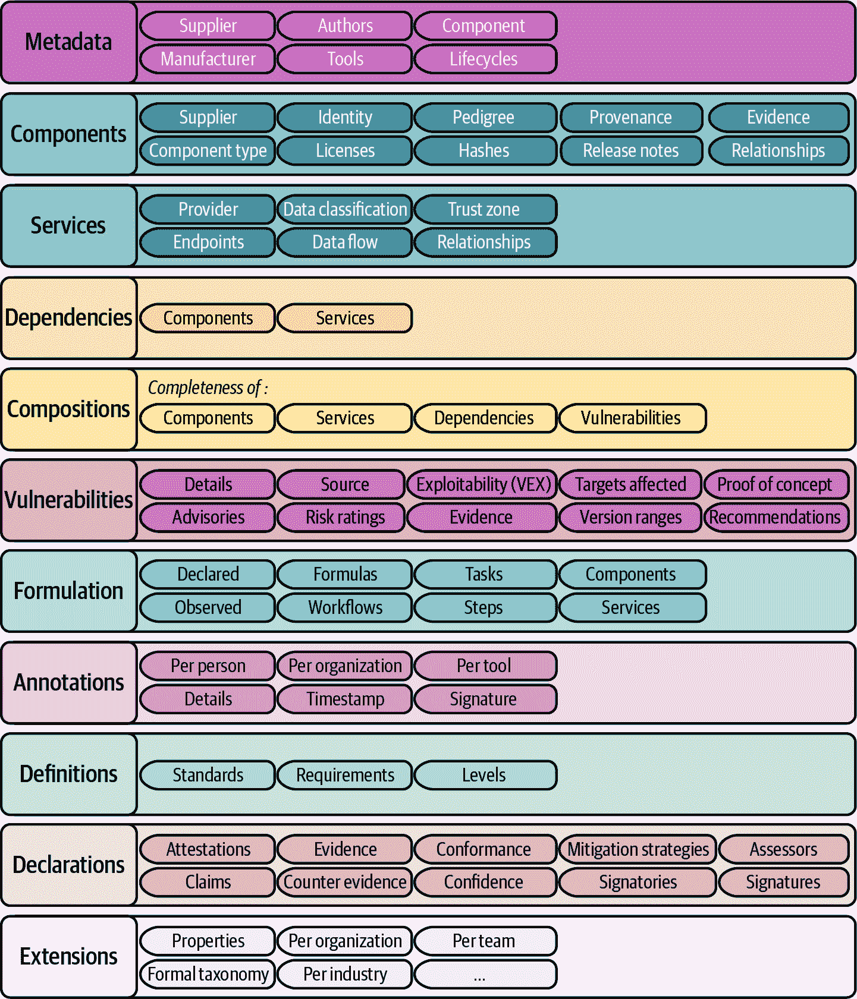

# 第九章。找到薄弱环节

> 你是薄弱环节。再见！
> 
> *《最薄弱的环节》*游戏节目（BBC/NBC）的每一集

2021 年 12 月 10 日早上，我醒来时收到了公司首席信息官（CISO）大卫·林德的一封夜间信息。他说：“你一醒来就给我打电话。很重要。”我知道这不会是好消息。你的 CISO 在半夜打电话给高管是最后不想看到的事情。

一旦我联系上大卫，他就告诉我，在过去 24 小时内，全球各大公司都在遭受黑客攻击。问题被追溯到嵌入到**数百万**个应用程序中的一个单一开源库。*Wired*杂志发表了一篇关于这一事件的报道，标题为[“互联网着火了！”](https://oreil.ly/I26Ux)

在本章的后面部分，我会告诉你更多关于这个故事。我现在提供这个片段，是为了让你深刻认识到**软件供应链安全**问题对于今天的软件开发是多么关键。这本书的一些读者可能来自应用安全（AppSec）背景，他们阅读这一章节是为了获得关于保护大型语言模型（LLMs）的具体指导。然而，我相信其他读者已经对 LLMs 有所了解，并正在寻找关于安全最佳实践的指导。了解这一点后，我将设置本章内容涵盖这两方面。

我们将首先介绍供应链安全的基本概念。然后，我们将检查 LLM 应用程序供应链的独特结构和挑战。我们将讨论一些最佳实践，但我们也必须承认这是 LLM 安全领域快速发展的一个部分。因此，我们将以对这个领域未来的讨论结束。

# 供应链基础知识

对于那些可能对人工智能很熟悉但对应用安全概念较新的读者，我将从供应链的一些基础知识开始，并讨论一些涉及未能妥善管理供应链安全而导致的著名案例研究。

我在大学时并没有主修计算机科学。我学习的是商业。我可以继续谈论商业课程如何经常为我提供对软件开发独特的见解。供应链就是其中之一。这是商业研究人员研究了数十年的一个概念。

###### 注意

术语**供应链**指的是从采购原材料到将产品或服务交付给最终用户的全过程。它包括各种步骤，如采购、制造、运输和分销，涉及包括供应商、制造商和零售商在内的实体网络。有效的供应链管理对于企业确保效率、成本效益和产品及服务的及时交付至关重要。

随着世界的工业化，我们的经济模式从基于工匠的系统转变为以大规模生产为主导的系统。这种转变导致了广泛的全球供应链，取代了之前个人或小团体使用本地材料生产商品的做法。在这些复杂的全球网络中，制造商依赖来自不同国家的供应商提供其产品所需的具体组件。例如，世界上某个部分的单一延误或质量问题，如中国某特定半导体的短缺，可能会使 iPhone 的生产停滞，导致普遍短缺。同样，如果第三方供应商提供的座椅带组件未能达到安全标准，这可能会迫使像福特这样的公司发布大规模的安全召回。这些情况说明了现代供应链的复杂相互依赖性和物流挑战如何对产品的可用性和质量产生重大影响。

###### 注意

谚语“链条的强度取决于最薄弱的环节”用来传达一个系统或组织由于其最薄弱的组成部分而容易受到攻击。它强调了确保每个部分都坚固可靠的重要性，因为即使是微小的弱点也可能导致整个系统的失败。这一概念常应用于各种情境，包括安全、团队合作和质量保证。

## 软件供应链安全

现在，由于现代大规模软件开发方法与传统大规模生产的日益相似，大型软件开发团队通常被称为软件工厂，这使得供应链的概念变得高度相关。

软件供应链安全是网络安全中越来越关键的一个方面。它涉及一系列旨在确保软件在其整个生命周期中（从开发到部署）的完整性和安全性的措施。该领域包括审查第三方组件，如库和包，以发现漏洞；确保代码库的安全；以及保护持续集成和交付流程。

软件供应链安全的本质是识别、管理和减轻可能损害软件在其开发或部署的任何阶段的任何风险。严格的管理至关重要，因为供应链中的任何漏洞都可能导致严重的数据泄露、客户信任的丧失以及重大的财务和声誉损害。最近的高调泄露事件表明，供应链中的漏洞可能产生深远的影响，影响无数用户和多个组织。

随着组织越来越多地依赖开源组件和第三方软件，软件供应链的复杂性和相互关联性也在增长。因此，开发人员、安全专业人士和商业领袖必须了解风险并实施策略来保护他们的软件供应链。这包括对第三方组件进行严格的审查、维护软件中使用的所有元素的最新清单（通常通过软件物料清单），定期扫描漏洞，并采用全面、主动的安全方法。

现在，让我们看看一些严重的泄露事件、它们的后果以及从中吸取的教训。

## Equifax 数据泄露事件

2017 年 3 月，研究人员披露了 Apache Struts 流行网络框架中的一个严重漏洞（[CVE-2017-5638](https://oreil.ly/k4KTx)）。该漏洞允许通过恶意输入执行远程代码，MITRE 公司（我们将在本章后面了解更多）将其严重性评分定为最高 10 分。Equifax 是最大的消费者信用报告机构之一，在其一个公共网络门户中使用了 Struts。然而，该公司未能修补披露的漏洞超过两个月，暴露了他们的系统。

2017 年 5 月，黑客利用未修补的 Struts 漏洞入侵 Equifax 系统，并窃取了与 1.48 亿消费者相关的敏感个人和财务数据。Equifax 直到 2017 年 7 月才发现这一泄露事件。这次大规模的数据泄露导致 Equifax 损失超过 10 亿美元。

### 影响

Equifax 数据泄露事件影响了近一半的美国人口，并产生了巨大的后果：

+   被窃取的敏感 PII（个人身份信息），如 SSN（社会安全号码）、地址和出生日期，导致身份盗窃。

+   对 Equifax 提起了多项集体诉讼。

+   为受影响的消费者赔偿了数十亿美元。

+   Equifax 的高级管理人员被解雇并遭受了严重的声誉损害。

### 从中学到的教训

该事件突显了关键软件安全问题：

+   快速修补开源组件，特别是如果它们面向互联网的话。

+   了解您的外部攻击面和第三方风险。

+   使用多层安全控制来限制泄露影响。

+   为“何时”而不是“是否”实施事件响应计划。

Equifax 数据泄露事件是一个里程碑事件，它展示了未修补的软件对公司和个人公民造成的巨大风险。关键教训包括迅速应用补丁、限制组件访问、监控系统以及制定事件响应计划。

## SolarWinds 黑客攻击

2020 年 12 月，发现了一起针对全球数千家组织使用的 IT 管理工具提供商 SolarWinds 的重大网络攻击。黑客将恶意代码植入 SolarWinds Orion 网络监控软件中，该软件随后在 2020 年 3 月至 6 月期间作为软件更新不知情地分发给 SolarWinds 的客户。

这场供应链攻击利用了 SolarWinds 软件的广泛使用，渗透了美国政府机构、包括微软和 FireEye 在内的主要科技公司以及其他大型企业和组织的网络和系统。黑客，据信是俄罗斯复杂网络间谍活动的一部分，通过模仿合法用户活动并融入正常网络流量，巧妙地避免了近一年的检测。

###### 注意

攻击者破坏了 SolarWinds 的构建管道以插入恶意代码。确保您的构建管道的安全性对于您软件的整体安全性至关重要。未能做到这一点可能会影响您的客户，而不仅仅是您自己！

### 影响

SolarWinds 黑客攻击在规模和受影响受害者数量方面产生了前所未有的影响。通过渗透软件供应链，攻击者获得了对数千个下游客户的广泛访问。除了 SolarWinds 之外，被破坏的 Orion 软件所提供的访问还开辟了途径，可以突破其客户和合作伙伴的网络。估计显示，超过一百家美国公司和政府机构受到了影响。

全部影响仍在被发现中，但后果包括：

+   敏感政府和企业数据盗窃

+   核心基础设施和内部通信的访问

+   横跨互联合作伙伴和供应链的级联式数据泄露

+   事件响应和修复的重大成本

### 经验教训

SolarWinds 攻击突显了日益互联的软件供应链中的主要风险和更好的安全实践的需求，包括：

+   多因素认证、特权访问管理和日志记录，以帮助检测异常访问

+   软件验证、代码审计和供应商增强的供应链控制

+   在系统之间提高隔离度以限制横向移动

+   假设发生数据泄露并积极参与更主动的威胁狩猎

+   公共和私营部门之间的更快协调和信息共享

SolarWinds 黑客攻击通过利用受信任的第三方软件来突破无数下游目标，展示了供应链网络攻击的潜在规模和影响。在软件供应链安全方面，更多的警惕性和合作将至关重要。

## Log4Shell 漏洞

在本章的开头，我分享了一个故事，我的首席信息安全官深夜打电话给我，告诉我一个重大问题。这迅速成为供应链安全史上最大的故事之一。以下是这个故事的具体细节。

2021 年 11 月，在 Java 日志库 Log4j 中发现了关键的零日远程代码执行漏洞。该漏洞被追踪为[CVE-2021-44228](https://oreil.ly/7sGbm)并被称为“Log4Shell”，这个漏洞允许攻击者获得对易受攻击服务器的完全控制和远程访问。

###### 警告

零日漏洞是开发者无法在创建补丁之前暴露的未知软件漏洞（即，他们没有时间准备）。由于攻击者可以在修复可用之前利用这些漏洞，它们构成了重大的安全风险。零日漏洞的紧迫性和潜在影响使它们在网络安全中成为一个关键问题，需要立即采取行动以保护系统和数据免受损害。零日漏洞是复杂网络攻击的首选目标，包括间谍活动和网络战争。

Log4j 库允许从许多来源进行数据记录，包括来自用户的不可信数据。漏洞源于不正确的输入验证，使得精心制作的请求能够在服务器上触发恶意 Java 代码执行。攻击者可以通过互联网、短信和聊天应用发送有效载荷。当这些不可信的输入被无辜地写入 Log4j 时，它可能允许远程代码执行，使攻击者能够获得对服务器的完全 shell 访问权限——因此得名 Log4Shell。

### 影响

由于 Log4j 的广泛应用，Log4Shell 的影响是巨大的。在披露后的几天内，数百万面向互联网的系统被恶意扫描以寻找漏洞。成功的攻击激增，包括僵尸网络、加密货币挖掘者、勒索软件团体和受国家资助的黑客都利用了 Log4Shell。

后果包括：

+   从受损害的服务器中窃取数据

+   安装恶意软件、后门和加密货币挖掘器

+   停止运营的勒索软件攻击

+   随着合作伙伴网络的访问权限开放而发生的级联供应链泄露

+   在云和本地基础设施上进行的繁重、紧急的周期外补丁作业

### 经验教训

Log4Shell 带来了几个关键教训：

+   尽管开源组件有其好处，但它们可能带来巨大的系统性风险。

+   需要更加关注库中的输入验证和安全卫生。

+   需要更加重视漏洞的快速协调和披露。

+   软件物料清单有助于理解组件风险。

+   供应商应假设发生泄露并寻找入侵，而不仅仅是防止利用。

Log4Shell 的影响范围显示，互联性如何放大供应链威胁。在事后，软件完整性和了解组件的来源对于管理风险变得至关重要。

# 理解 LLM 供应链

现在你已经熟悉了供应链安全的基础知识，并看到了管理不当的典型例子及其代价，让我们来看看是什么使得 LLM 软件供应链独特。LLM 供应链的独特性主要源于它们对大量和多样化数据集的依赖，以及它们与各种外部数据源和服务的复杂交互。

集成第三方基础模型将关键依赖引入到您的应用程序供应链中。这种依赖不仅限于软件组件；它还包括模型开发中使用的数据。跟踪模型的更新、补丁和更改变得至关重要，因为它们可能会显著影响您应用程序的性能和安全。即使您从预训练的基础模型开始，您也可能决定微调模型。在这种情况下，您需要考虑您供应链中使用的任何训练数据。

LLMs，尤其是使用 RAG 等技术的方法，经常与外部 API、数据库和在线资源进行交互。这种集成对于模型访问实时信息或某些应用程序所需的特定数据集至关重要。然而，这也为潜在的安全漏洞、数据隐私问题和合规性问题打开了新的途径。确保与这些外部系统的安全且道德的集成是 LLM 供应链管理的另一个关键方面。

为了更好地了解这一领域，让我们看看一些 LLM 特定的供应链风险示例。

## 开源模型风险

虽然许多开发团队选择使用专有、托管的大型语言模型（LLM）基础模型，如 OpenAI 的 GPT 系列，但越来越多的团队正在尝试开源基础模型。如果您选择管理和托管一个模型，您的模型的版本和配置必须作为您供应链的一部分进行跟踪。最近的事件表明，开源模型软件的供应链高度不成熟，可能会让用户意外获取被恶意行为者污染的模型。让我们看看这种情况可能如何发生，以便您了解风险。

###### 注意

到目前为止，最受欢迎的 LLM 模型交换平台被称为[Hugging Face](https://huggingface.co)。它将自己描述为“构建未来的 AI 社区。一个机器学习社区在模型、数据集和应用上协作的平台。”

在 2023 年，与 Hugging Face 相关的多起事件提高了人们对盲目信任从这类网站获取的模型的意识。2023 年 7 月，[Hugging Face 推特账号发布](https://oreil.ly/iWC2X)，“我们正在调查一个事件，其中恶意用户通过在另一个网站数据泄露中泄露的重复使用的员工密码控制了 Meta/Facebook & Intel 的 Hub 组织。我们将持续向您更新。”

虽然该事件的全部影响尚不清楚，但它揭示了恶意行为者可能将自己插入供应链并更改被认为来自可信来源（在这种情况下是 Meta 或 Intel）的组件的可能性。它引发了 AI 社区关于供应链安全的更广泛讨论。

虽然第一个事件并未广泛报道，似乎孤立，但在 2023 年 12 月，Lasso Security 团队发布的研究显示，超过 1,600 个 Hugging Face API 令牌被暴露。该团队可以使用这些令牌访问 700 多个组织的 Hugging Face 账户，包括 Meta、微软、谷歌和 VMware 等主要玩家。这表明了一个明显的风险，即恶意第三方可能会用一个经过修改的模型替换一个知名、受信任的模型——这对任何可能下载和使用此类模型的任何应用都是一个巨大的风险。

###### 警告

Pickle，常用于机器学习中的序列化，是流行 PyTorch ML 工具包中模型权重的默认格式。Hugging Face 的文档警告称，加载受污染的 Pickle 文件可能导致任意代码执行攻击。为了解决这些漏洞，Hugging Face 正在开发一个名为 Safetensors 的项目。该项目处于早期阶段，但跟踪这一重要进展对于增强您的安全态势至关重要。

虽然这是一个道德黑客研究小组负责任地披露风险的情况，但这一事件进一步巩固了模型供应链至关重要的观点。在本章的后面部分，我们将讨论如何跟踪您模型的来源和来源，以便如果问题浮出水面，您能够迅速应对。

## 训练数据中毒

*数据中毒*是对训练数据的操纵，可能会将漏洞引入 LLM。这可以通过各种方式完成，例如注入虚假信息、数据偏差或创建对抗性示例。数据中毒的目的是让 LLM 产生不准确或有害的输出。

训练数据中毒是人工智能领域研究多年的一个主题。经典例子包括垃圾邮件发送者反复尝试污染用于训练谷歌 Gmail 垃圾邮件过滤器的数据。最近的研究表明，这可能是任何 LLM 应用的大问题。2023 年初，[来自谷歌、ETH 苏黎世、英伟达和 Robust Intelligence 的研究人员](https://oreil.ly/J2fMz)展示了，只需 60 美元，研究人员就能将数据插入到像维基百科这样的资源中，这可能会影响训练结果，即使是对这样互联网规模资源也是如此。

上文提到的 Hugging Face API 令牌泄露暴露了模型和数据集。Hugging Face 托管超过 250,000 个预构建的数据集，开发者可以使用这些数据集来训练或微调他们的模型，这些数据集与模型一样，也是操纵的目标。这意味着管理用于微调的数据集与跟踪您的基模型一样重要。

## 意外的不安全训练数据

虽然数据中毒意味着恶意行为者正在积极工作以污染您的模型，但这种情况可能意外发生，尤其是在从公共互联网来源提炼的训练数据集中。

我们在第五章中讨论了你的模型可能会“知道太多”的想法。在这些情况下，我们考虑了模型可能会重复其训练或访问的信息的可能性。2023 年 12 月，斯坦福大学的研究人员表明，用于训练图像生成算法（如 Stable Diffusion）的非常受欢迎的数据集（LAION-5B）包含超过三千张与“儿童性虐待材料”相关的图片。

这个例子让 AI 图像生成工具的开发者急忙确定他们的模型是否使用了这种训练数据，以及这可能对他们的应用产生什么影响。如果一个特定应用的开发团队没有仔细记录他们使用的训练数据，他们就不会知道他们是否面临模型生成不适当和非法图像的风险。

## 不安全插件

2023 年 3 月，OpenAI 通过插件对其平台的功能进行了重大扩展。这些插件引入了来自第三方提供商（包括 Expedia、Zillow、Kayak、Instacart 和 OpenTable）的功能，使用户能够执行各种任务，如求职、房地产列表、产品推荐、购物、游戏和食谱检索。这一扩展极大地增强了平台的功能性和用户参与度。

然而，这项创新并非没有风险。研究人员迅速识别出安全担忧，例如将插件用作向 ChatGPT 会话中注入恶意代码的载体。这样的漏洞可能导致严重后果，包括数据盗窃、恶意软件安装，甚至完全控制用户的电脑。

此外，还存在插件被用于未经授权的数据收集的风险。例如，一个插件可能会跟踪用户的浏览活动或记录与 ChatGPT 的对话，而无需用户的知情或同意，这引发了重大的隐私担忧。

创建安全的插件架构是一个复杂且具有挑战性的任务。如果你的应用利用插件，仔细追踪它们的来源和版本至关重要。确保这些第三方组件的安全性涉及对漏洞的持续监控、定期更新和全面的网络安全审计。这种警惕性对于防范潜在的安全漏洞、维护用户的信任和安全至关重要。

# 创建用于追踪您的供应链的工件

正如我们所看到的，跟踪进入您应用程序的组件至关重要。本章前面提到的 Equifax、SolarWinds 和 Log4Shell 例子推动了软件供应链安全的重要性，并导致了这样一个观点：您必须跟踪进入软件的任何工件。特别是，它们引发了软件物料清单（SBOM）的流行。在本章中，我们将回顾 SBOM 的概念，以及对我们 LLM 供应链重要的相关工件，如模型卡和 ML-BOM。

## SBOM 的重要性

*软件物料清单* 是一个综合清单或详细列表，列出了构成软件的所有组件、库和模块。将其视为软件的清单或成分列表，详细说明了最终产品中的每个元素。这包括软件开发团队编写的代码以及集成到软件中的任何开源或第三方组件。

###### 注意

软件物料清单（SBOM）源自制造术语“物料清单”（BOM），这是一个综合清单，列出了制造产品所需的所有材料、组件和子组件。它通常包括零件名称、编号、数量和其他描述性信息。

SBOM 的目的是提供对软件组成的清晰可见性，这对于安全、合规和管理至关重要。通过精确了解其软件中的内容，组织可以更好地监测漏洞、遵守法律和许可要求，并更有效地管理更新和补丁。在供应链安全方面，SBOM 是识别潜在风险和确保软件组件完整性的重要工具。

在您的 SBOM 中的信息跟踪对于快速响应和修复至关重要，这减少了攻击者的机会窗口。此外，SBOM 有助于您的公司遵守安全标准和法规，因为它提供了使用安全且许可的组件的尽职调查证明。在日益复杂的软件开发领域中，其中依赖关系错综复杂，SBOM 充当了一幅地图，指引着通往更安全、更弹性的软件基础设施的道路。

让我们看看如何将 SBOM 概念应用到我们的 LLM 模型和应用中。

## 模型卡

在本章的前面部分，我们了解到 Hugging Face 已经成为交易机器学习模型和训练集的事实上场所。随着跟踪重要模型信息和依赖关系的需要，公司开发了一个标准化的工件，称为 *模型卡*。

Hugging Face 的模型卡片旨在为其平台上托管的每个 AI 模型提供全面的信息。目标是向用户提供——无论是开发者、研究人员还是最终用户——对模型的能力、局限性和预期用例的清晰理解。这种方法与 AI 社区更广泛的努力相一致，以确保 AI 模型被道德和有效地使用。

下面是 Hugging Face 模型卡片的一些关键方面：

模型描述

每个模型卡片通常以对模型的描述开始，包括其目的、架构和训练数据。这使用户能够对模型设计要做什么以及它是如何工作的有一个高级别的理解。

训练数据

模型卡片通常会详细说明用于训练模型的数据集。理解模型的潜在偏差和局限性至关重要，因为训练数据的性质可以显著影响模型的表现和行为。

预期用途

模型卡片包括有关模型预期用途的信息，这有助于用户了解模型预期表现良好的上下文。本节还可能包括使用建议或指南。

伦理考量

许多模型卡片解决了伦理考量，例如模型中的潜在偏差及其部署对各种利益相关者的影响。这反映了越来越认识到考虑 AI 技术更广泛社会和可持续性影响的需求。

性能指标

卡片通常包括各种性能指标，以展示模型的表现。这些指标通常基于模型在基准数据集或其设计的特定任务上的表现。

局限性

模型卡片的一个关键组成部分是对模型局限性的讨论。这包括模型可能无法按预期表现的区域、某些应用中的潜在风险或模型应谨慎使用的区域。

使用示例和教程

许多模型卡片提供了使用模型的示例，包括代码片段或指向笔记本的链接。这对于希望将模型集成到其应用程序中的开发者特别有帮助。

###### 注意

其他 LLM 供应商，如 AWS，已经开始开发他们自己的模型卡片格式。这个领域将出现碎片化，因此您需要考虑为特定项目选择哪个。然而，从概念上讲，您应该会发现它们与这里讨论的内容相似。

## 模型卡片与 SBOMs 的比较

模型卡片和 SBOMs 是旨在增加复杂软件系统（包括 AI 模型）透明度和理解的工具。尽管如此，它们服务于不同的目的，包含不同类型的信息。

### 目的和重点

模型卡的 主要目的是提供对机器学习模型的能力、行为和限制的清晰、易懂的描述。它们关注性能、伦理考量、用例以及用于训练模型的数据。模型卡对于需要理解机器学习模型的操作特性和伦理影响的最终用户和开发者来说非常方便。

SBOM 实质上是所有软件产品组件的详细清单。SBOMs 专注于列出和详细说明软件产品中包含的每个第三方和开源软件。它们对于理解软件的组成至关重要，特别是对于跟踪漏洞、许可证和依赖关系。请注意，正在开发针对特定于人工智能的 SBOMs；我们将在本章后面讨论这一点。

### 内容

模型卡通常包括模型架构、训练数据、性能指标、预期用途、伦理考量以及限制等信息。它们还可能提供关于模型开发过程和模型中任何潜在偏见的见解。

SBOMs 包含了每个软件组件、版本、补丁状态、许可证的详细列表，有时还包括每个组件的来源。这些信息对于漏洞管理、合规性检查和软件维护至关重要。

### 在安全和合规性方面的应用

虽然模型卡并没有直接解决安全漏洞问题，但它们可以间接表明模型的可靠性和稳健性，这些是人工智能系统中安全的关键方面。它们还可以突出可能具有安全影响的伦理风险或偏见。

SBOMs 直接用于安全和合规性的情境中。它们对于漏洞管理至关重要，因为它们允许安全团队快速确定新发现的第三方组件中的漏洞是否会影响他们的软件。它们也用于许可证合规性和风险管理。

### 行业应用

模型卡是特定于人工智能和机器学习的，是向负责任人工智能更广泛运动的一部分。

SBOMs 在所有软件开发中都有广泛的应用，并且正日益成为软件文档的标准部分，尤其是在安全和合规性至关重要的行业中。

## CycloneDX：SBOM 标准

由 OWASP 基金会管理的 CycloneDX 已经成为 SBOMs 最强大的标准。它是一种标准化的格式，提供了项目或系统中所有软件组件的结构化、机器可读的清单，包括它们的关系和依赖关系详情。将 CycloneDX 想象成软件的全面成分清单，但更加详细和有洞察力。

CycloneDX 的创建是由对日益复杂的软件依赖网络中透明度和安全性的需求所驱动的。这种复杂性带来了重大的安全和合规性挑战。通过明确概述软件组成，CycloneDX 增强了识别漏洞和有效管理风险的能力。其发展的另一个关键因素是标准化需求。在 CycloneDX 之前，不同工具使用的 SBOM 格式多样性阻碍了共享和互操作性。CycloneDX 通过提供描述软件组件的统一语言来解决这一问题，促进了跨各种工具和平台的无缝集成。

作为 OWASP 托管的开源项目，CycloneDX 受益于社区驱动的模式。这确保了它不断进化以满足行业不断变化的需求，并且对每个人都是可访问的。对您系统软件组件的清晰理解对于有效的漏洞管理和补丁至关重要。CycloneDX 简化了识别和解决漏洞的过程，从而增强了整体的安全态势。

从合规性的角度来看，尤其是在像美国关于改善国家网络安全的行政命令这样的规定要求政府软件必须提供软件物料清单（SBOM）的情况下，CycloneDX 在满足这些要求方面发挥着关键作用。此外，CycloneDX 在许可证管理中发挥着至关重要的作用，通过为每个组件存储许可证信息，帮助组织遵守软件许可证并避免法律纠纷。

将 CycloneDX 集成到 DevOps 和持续集成流程中，自动化了 SBOM 的生成，在整个开发生命周期中提供了对软件组成的持续洞察。这种集成增强了透明度，并在组织共享其 CycloneDX SBOM 时，在用户或客户之间建立信任。

## ML-BOM 的兴起

2023 年 6 月发布的 CycloneDX 1.5 代表了 CycloneDX 标准的重大进步。这次更新对于使用机器学习（如 LLM 应用）的应用程序尤其重要，它引入了显著的透明度、安全性和合规性改进。

CycloneDX 1.5 的一个关键创新是*ML-BOM*（机器学习物料清单），这是机器学习应用的一个变革者。该功能允许在 SBOM 中全面列出机器学习模型、算法、数据集、训练管道和框架。它捕捉了模型来源、版本、依赖关系和性能指标等关键细节，促进了机器学习系统的可重复性、治理、风险评估和合规性。

在透明度和理解方面，ML-BOM 为 ML 开发和部署中涉及的组件和流程提供了清晰的可见性。这有助于利益相关者掌握 ML 系统的组成，识别潜在风险，并考虑伦理影响。在安全领域，它能够识别和修复 ML 组件和依赖项中的漏洞。这一功能对于进行安全审计和风险评估至关重要，对开发安全可信的 ML 系统做出了重大贡献。

合规性是另一个 ML-BOM 具有重大影响的领域。它通过确保系统的透明度和治理来支持遵守监管要求，例如 GDPR 和 CCPA。这个功能对于合规审计和展示负责任的 AI 实践至关重要。

除了这些核心领域之外，ML-BOM 还提供了额外的优势。它增强了可重复性，允许复制实验和结果，这对于科学严谨性和对 ML 系统的信任至关重要。协作也变得更加简单，因为 ML-BOM 使得跨团队和组织在项目上的共享和协作更加容易。最后，它也是知识管理的一个有效工具，可以保存有关系统的重要信息，以供未来的维护、更新和审计。

图 9-1 显示了规范定义的高级对象模型。这显示了各种字段和选项，这应该能让你了解实体及其属性是如何定义的。此模型将定义你将创建的 SBOM/ML-BOM 文档的结构。在下一节中，我们将深入探讨为 LLM 应用程序构建此类文档简单版本的示例。



###### 图 9-1\. CycloneDX 1.5 对象模型（由 OWASP 提供）

CycloneDX 1.5 将推进 ML 应用开发和部署中的透明度、安全性和合规性。它赋予组织构建更负责任、可信和安全的 AI 系统的能力。

## 构建示例 ML-BOM

在本节中，我们将使用 CycloneDX 标准为示例应用程序创建一个简单的 ML-BOM。我们将展示如何表示应用程序的预训练基础模型以及用于微调模型以满足我们应用程序需求的训练数据集。

正如我们在上一节中看到的，ML-BOM 工件可能相当广泛！为了让你了解它们是如何工作的，我们将为名为客户服务机器人的基于 LLM 的应用程序创建一个简化的 ML-BOM。该模型基于从 Hugging Face 下载的[Mixtral-8x7B-v0.1 基础模型](https://oreil.ly/juffo)。然后，我们使用从[GitHub](https://oreil.ly/sc5jT)获取的开源客户服务应用程序数据集对该模型进行了微调。表 9-1 显示了一个仅涵盖这些组件的简单 ML-BOM。

表 9-1\. 客户服务机器人的机器学习物料清单（ML-BOM）；BOM 格式：CycloneDX；规范版本：1.5；BOM 版本：1

|  | 应用：客户服务机器人 | 组件：客户支持 LLM 聊天机器人训练数据集 |
| --- | --- | --- |
| 类型 | 应用 | 数据集 |
| 名称 | 客户服务机器人 | 客户支持 LLM 聊天机器人训练数据集 |
| 版本 | 1.0.0 | 1.0.0 |
| 描述 | 为公司 XYZ 构建的客户服务机器人 |  |

| 许可证 |  | ID: CDLA-Sharing-1.0 名称: Apache 2.0 |

URL：[*https://choosealicense.com/licenses/apache-2.0*](https://choosealicense.com/licenses/apache-2.0) |

| 外部引用 | VCS：[*https://huggingface.co/mistralai/Mixtral-8x7B-v0.1*](https://huggingface.co/mistralai/Mixtral-8x7B-v0.1) Mixtral-8x7B LLM 是一个预训练的生成稀疏专家混合。 | VCS：[*https://github.com/bitext/customer-support-llm-chatbot-training-dataset*](https://github.com/bitext/customer-support-llm-chatbot-training-dataset)

Bitext：基于 LLM 的虚拟助手客户服务标记训练数据集

许可文件：[*https://github.com/bitext/customer-support-llm-chatbot-training-dataset/blob/main/LICENSE.txt*](https://github.com/bitext/customer-support-llm-chatbot-training-dataset/blob/main/LICENSE.txt)；数据集许可文本的直接链接 |

虽然我们这个版本的 ML-BOM 是可读的，因此可以说明概念，但 SBOM/ML-BOM 的重要特性之一是它必须是高度结构化和机器可读的。这就是为什么 CycloneDX 为您的 BOM 提供了标准的 JSON 格式。以下是它在 JSON 中的样子：

```py
{
  "bomFormat": "CycloneDX",
  "specVersion": "1.5",
  "version": 1,
  "components": [
    {
      "type": "application",
      "name": "Customer Service Bot",
      "version": "1.0.0",
      "description": "A customer service bot built for company XYZ",
      "externalReferences": [
        {
          "type": "vcs",
          "url": "https://huggingface.co/mistralai/Mixtral-8x7B-v0.1"
        }
      ]
    },
    {
      "type": "dataset",
      "name": "Customer Support LLM Chatbot Training Dataset",
      "version": "1.0.0",
      "licenses": [
        {
          "license": {
            "name": "Apache 2.0",
            "url": "https://choosealicense.com/licenses/apache-2.0/"
          }
        }
      ],
      "externalReferences": [
        {
          "type": "vcs",
          "url": "https://github.com/bitext/customer-support-dataset"
        },
        {
          "type": "license",
          "url": "https://github.com/bitext/customer-support-dataset/LICENSE.txt"
        }
      ]
    }
  ]
}
```

`数据集`部分详细说明了用于微调模型的训练数据，指向 GitHub 上的特定数据集。在`组件`和`外部引用`部分中填写关于您特定用例的准确细节非常重要，包括任何其他依赖项、服务或训练数据。

在 ML-BOM 中，标签 VCS 指的是版本控制系统。提供的 URL 与一个版本控制仓库相关，该仓库管理并存储组件的源代码、模型或相关数据。

总结来说，模型卡片和 ML-BOM 在某些方面有相似之处，但它们的细节存在实质性差异，如表 9-2 所述。在有人开发出单一、综合的结构之前，您可能需要在许多情况下同时使用它们。

表 9-2\. 模型卡片和 ML-BOM 的相似性与差异

| 功能 | 模型卡片 | ML-BOM |
| --- | --- | --- |
| 目的 | 记录机器学习模型的伦理考量、预期用途和性能 | 列出用于管理和保护应用程序的机器学习系统中使用的所有组件 |
| 列出的组件 | 模型细节、性能指标和伦理考量 | 机器学习模型、算法、数据集、训练管道和框架 |
| 安全细节 | 一般伦理考虑和使用案例限制 | 详细的安全漏洞、依赖关系和版本控制 |
| 使用上下文 | 伦理和负责任的 AI 开发 | 在 ML 应用的整个生命周期中确保安全 |
| 侧重透明度 | 高，侧重于伦理透明度 | 高，侧重于安全和合规 |
| 法律合规 | 伦理使用指南 | 监管合规性，漏洞管理 |
| 开发生命周期中的集成 | 主要在模型评估和部署阶段 | 整个开发和部署过程中。 |

# LLM 供应链安全的未来

供应链安全是网络应用的一个成熟领域，但对于 AI 和 LLM 应用来说，仍然相对不成熟。鉴于这个领域最近受到的关注，我预计在不久的将来我们将看到大量的创新和扩展。为了使您为这一变化做好准备，本节将回顾该领域的一些早期动向，并指导您寻找 LLM 供应链安全未来改进和创新的地方。

## 数字签名和水印

随着大型语言模型的普及，建立稳健的模型真实性和完整性方法变得至关重要。验证模型是否来自预期的来源且未被篡改对于责任和安全至关重要。为此，已经出现了两种主要技术：数字签名和水印。

*数字签名*允许使用私钥对模型进行加密签名，以标记其为真实。然后任何一方都可以使用相应的公钥来验证签名是否与模型匹配，从而证明来源和完整性。这项技术在供应链安全中非常重要，因为模型是通过云服务进行分发或部署的。签名确保模型在系统之间移动时可以被验证。

*水印*直接嵌入到模型的权重或架构中。水印通过微妙地改变参数插入一个唯一的指纹，以指示模型的来源。水印能够抵抗复制，因此克隆或被盗的模型仍然包含标记，允许使用提取工具进行检测，这证实水印与模型预期的签名相匹配。签名通过密码学验证来源并防止篡改。

###### 小贴士

由于这项技术发展迅速，建议访问[内容来源与真实性联盟（C2PA）](https://c2pa.org)，该组织在制定内容真实性标准方面处于领先地位，以获取最新的资源和标准。

数字签名和水印技术都应该是您在保护大型语言模型（LLM）时的工具库中的技术。这些技术结合在一起，可以在模型的生命周期和使用过程中唯一地验证模型。随着模型变得更加强大，建立真实性和防止干扰变得至关重要。嵌入签名和带有水印的指纹为模型在整个供应链中的完整性提供了所需的控制。

###### 小贴士

一些谷歌研究人员一直在推广一种工具组合，即[Sigstore](https://oreil.ly/9EX-q)和名为软件工件供应链级别（SLSA）的管理框架，用于签名和管理机器学习模型。目前还没有很多标准化的方法，因此您可能想关注这种组合的发展。

## 漏洞分类和数据库

*漏洞分类*是指根据软件组件的特性、影响和可利用性对安全弱点进行分类。这些分类提供了一个标准化的框架，用于识别和描述漏洞，促进利益相关者之间的共同理解。例如，软件弱点的通用弱点枚举（CWE）和安全漏洞严重性评估的通用漏洞评分系统（CVSS）。

漏洞数据库是收集和记录软件组件中已识别漏洞的必要存储库。这些数据库对于监控和参考已知漏洞至关重要，为用户提供深入的信息，包括漏洞描述、其潜在影响、建议的缓解策略和相关参考。此类数据库的一个显著例子是国家漏洞数据库（NVD），这是一个全面的安全漏洞目录。NVD 与通用漏洞和暴露（CVE）系统集成，为每个列出的漏洞提供一个唯一的 CVE 标识符，便于数据库之间的参考和交叉链接。

漏洞分类和数据库在供应链安全中至关重要，原因有以下几点：

识别和意识

它们提供了一种系统化的方式来识别和记录软件组件中的已知漏洞。这种意识是保护免受潜在利用的第一步。

标准化沟通

漏洞分类为描述安全弱点提供了一个标准化的语言，这对于开发人员、安全专业人士和其他利益相关者之间的清晰沟通至关重要。

风险评估和优先级排序

通过对漏洞进行分类，组织可以评估其潜在影响，并根据此优先考虑缓解措施。这有助于更有效地分配资源，首先解决最关键的安全漏洞。

追踪和监控

漏洞数据库使组织能够持续跟踪新出现的和现有的漏洞。定期监控这些数据库有助于组织了解最新的安全威胁并采取主动措施。

合规性和报告

许多监管框架要求组织有效管理已知漏洞。访问全面的漏洞数据库有助于合规性，并在审计和报告目的上可能至关重要。

促进补丁管理

通过保持最新的漏洞记录，这些数据库有助于及时修补软件组件，这是维护安全系统的一个关键方面。

提升整体安全态势

定期参考漏洞分类和数据库有助于组织通过能够及时预测、准备和应对各种安全威胁来建立更强大的安全态势。

在供应链安全方面，各种组件和依赖关系可能会引入漏洞，漏洞分类和数据库对于维护整个链的完整性和安全性至关重要。

### MITRE CVE

*MITRE.org* 是美国麻省理工学院雷丁学院（MITRE Corporation）的在线平台，该学院是一家非营利组织，在美国运营多个由联邦政府资助的研究与发展中心。MITRE 的工作主要支持各种美国政府机构，其使命是为更安全的世界解决问题。它管理 CVE 项目，并开发了几个关键框架和模型，例如 ATT&CK 框架，该框架提供了一个综合矩阵，列出了威胁行为者在网络攻击中使用的策略和技术。

MITRE CVE 数据库是一个公开的在线漏洞和暴露报告库。它是网络安全的一个关键环节，作为识别和分类软件和固件中漏洞的参考点。

以下是 CVE 的关键功能概述：

标准化标识符

CVE 数据库中的每个条目都由一个 CVE ID 唯一标识。这种标准化使得安全专家和软件开发人员在讨论安全漏洞时能够使用相同的语言。

广泛的来源范围

数据库包括由供应商、研究人员和用户报告的漏洞。这个广泛的来源确保了已知问题的全面收集。

详细描述

条目通常包括漏洞的详细描述，提供有关恶意行为者可能如何利用它们、它们可能的影响以及有时建议的缓解措施的见解。

漏洞评分

许多 CVE 条目包括 CVSS 评分，它提供了对漏洞严重程度的定量度量，有助于确定修补或缓解的优先级。

免费和开放访问

CVE 数据库对所有人开放，促进了透明度和广泛的安全漏洞信息共享。这种开放方法对于及时有效地应对安全威胁至关重要。

与其他工具的集成

该数据库通常与各种安全工具和平台集成，增强了漏洞管理和威胁评估能力。

MITRE CVE 数据库主要关注软件和固件漏洞，强调传统的网络安全关注点，如网络安全、应用安全和操作系统缺陷。该数据库包括各种软件产品和系统的漏洞，包括您可能在 AI 或 LLM 应用中使用的产品，如服务器软件、数据库和操作系统。

然而，该数据库并非设计用于捕获 AI 系统或 LLMs 特有的漏洞。AI 特定的漏洞通常需要与传统软件漏洞不同的方法。

### MITRE ATLAS

MITRE ATLAS（人工智能系统对抗性威胁景观）是一个专注于与 AI 系统相关的特定漏洞和威胁的倡议，尤其是在国家安全背景下。这标志着理解并减轻 AI 技术带来的独特风险的重要一步。

这里是 MITRE ATLAS 的一些重要方面：

专注于 AI 安全

与像 CVE 这样的传统漏洞数据库不同，CVE 覆盖了广泛的软件和硬件漏洞，ATLAS 则专门针对 AI。ATLAS 包括对抗性攻击等威胁，其中故意设计的输入会操纵或欺骗 AI 模型。

综合威胁建模

ATLAS 提供了针对 AI 系统特定潜在对抗性策略、技术和程序（TTPs）的详细模型。这种威胁建模对于理解 AI 系统如何被利用以及开发强大的防御机制至关重要。

协作努力

MITRE ATLAS 是一个涉及 AI 和网络安全社区中各种利益相关者的协作努力，包括研究人员、行业专家和政府机构。这种合作确保了多元化的视角和专业知识，这对于应对复杂的 AI 安全挑战至关重要。

教育资源

ATLAS 是 AI 和网络安全专业人士的教育资源。它提供了对 AI 威胁本质的见解以及如何防范它们的指导。这些指导对于开发 AI 系统的培训计划和安全性协议非常有价值。

政策和标准指南

通过提供对 AI 威胁的详细理解，ATLAS 可以为 AI 技术的政策制定和安全标准的发展提供信息。随着 AI 越来越成为关键基础设施和国家安全的组成部分，这一点变得越来越重要。

就本书撰写时的情况而言，尽管已经启动了几个项目，但还没有权威的 AI 或 LLM 特定安全事件或漏洞信息来源。在未来几年，我们将看到像 MITRE、OWASP 和 Hugging Face 这样的组织推动前进，创建更多关于 AI 和 LLM 漏洞的标准分类，并允许创建或扩展数据库以跟踪漏洞。此类数据库的增长对于 LLMs 供应链安全成熟至关重要。

# 结论

实际利用漏洞的例子，如数据中毒，比其他漏洞（如提示注入）更难以找到。然而，从网络软件以及针对人工智能和大型语言模型（LLMs）的研究中吸取的教训告诉我们，在 LLMs 应用中我们必须认真对待供应链安全。

您的模型、训练数据和甚至通过 RAG 等技术访问的数据都可能成为您软件供应链的一部分。您应该仔细跟踪每个依赖项，以便在您的应用程序供应链中发现漏洞时能够迅速采取行动。考虑使用如 CycloneDX 这样的标准化格式来做这件事，因为它将使您能够利用围绕该标准的日益增长的工具生态系统。

最后，密切关注这一领域的发展。在我研究过的 LLM 漏洞中，供应链安全挑战是最不为人所理解的，但也是最复杂的。密切关注水印和数字签名等领域的发展，以追踪您资产的原产地。还要关注围绕 LLM 特定漏洞和事件跟踪的生态系统如何演变，因为这将在未来为您提供更丰富的信息资源。
