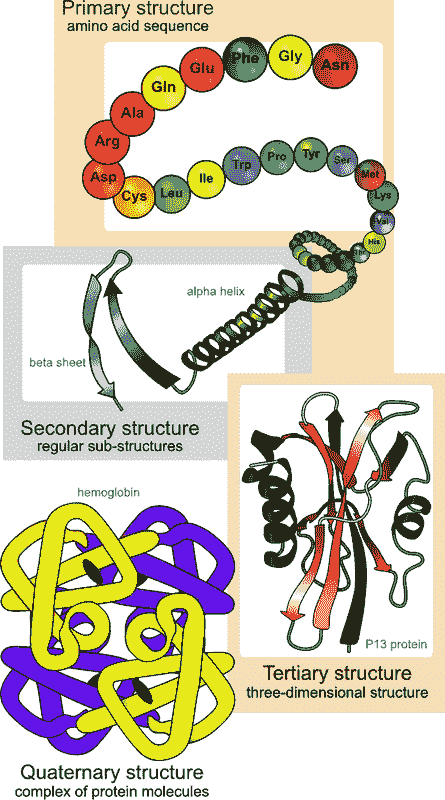
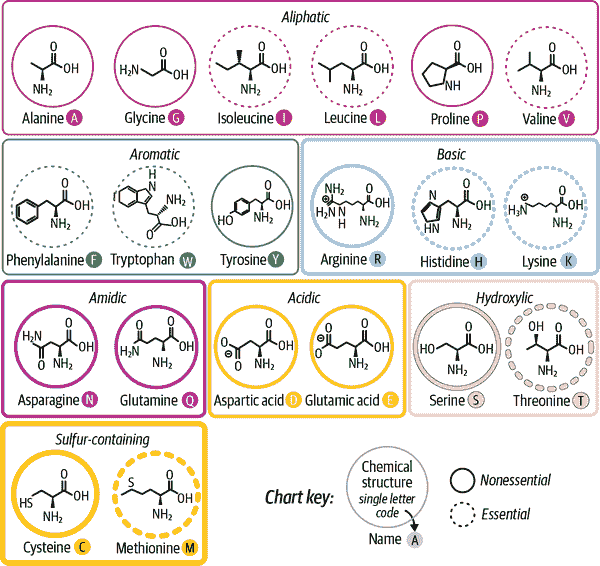
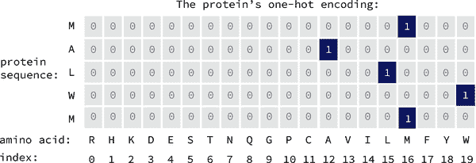
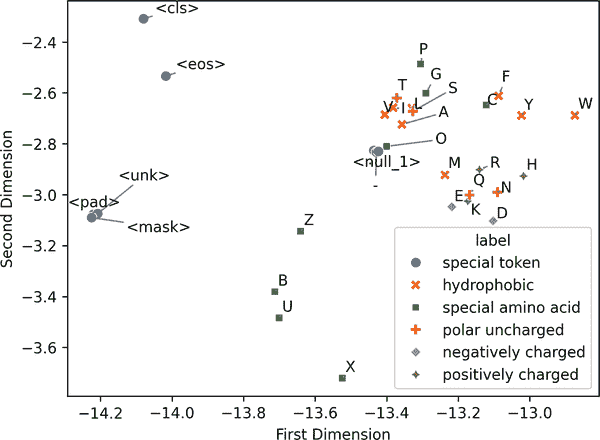
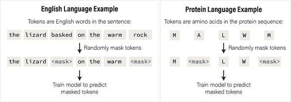
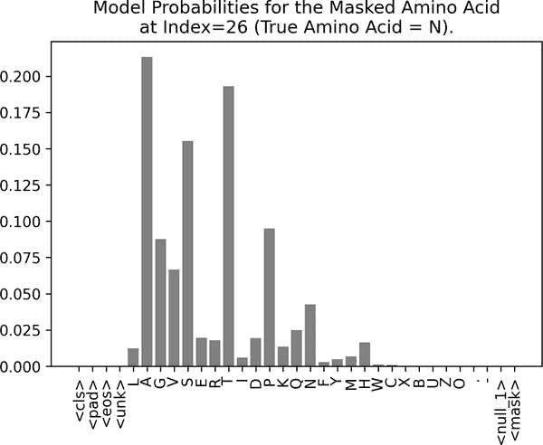
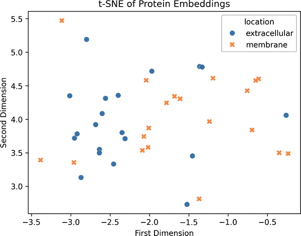
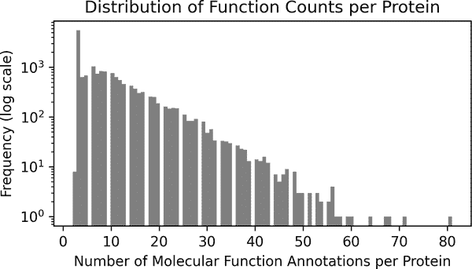
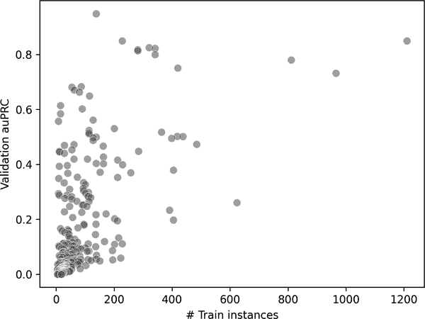

# 第二章\. 学习蛋白质的语言

我们所知的生活依赖于*蛋白质*。人类基因组大约有 20,000 个*基因*，每个基因由 DNA 组成，作为构建不同蛋白质的蓝图。一些蛋白质具有简单、易于理解的函数——如胶原蛋白，它为组织提供结构支持和弹性，或血红蛋白，它在肺部和身体其他部位之间运输氧气和二氧化碳。其他蛋白质则具有稍微抽象的角色：它们作为信使、调节剂或信号载体，在细胞内和细胞间传递信息。例如，胰岛素是一种蛋白质激素，它向细胞发出吸收血液中糖分的信号。

我们很快将更详细地探讨 DNA 和蛋白质的工作原理。但到目前为止，想象一下蛋白质作为一个在拥挤的细胞环境中四处碰撞的粘稠分子机器，偶尔进行有成效的碰撞。其形状和运动可能看起来很混乱，但经过数百万年的进化，它们都已经被精细调整以执行非常具体的分子功能。

本章的一个关键细节：蛋白质可以被表示为其构成单元的序列，这些单元被称为*氨基酸*。正如英语使用 26 个字母来形成单词一样，蛋白质使用 20 种氨基酸的字母表来形成具有特定形状和功能的长期链。考虑到这一点，本章的目标很简单：我们将训练一个模型，根据蛋白质的氨基酸序列来预测其功能。例如：

+   给定 COL1A1 胶原蛋白蛋白的序列（`MFSFVDLR...`），我们可能会预测其功能很可能是`结构性`的，概率为 0.7，`酶促`的，概率为 0.01，等等。

+   给定 INS 胰岛素蛋白的序列（`MALWMRLL...`），我们可能会预测其功能很可能是*代谢性*的，概率为 0.6，*信号传导*的，概率为 0.3，等等。

###### 小贴士

为了立即动手实践，打开配套的 Colab 笔记本，在阅读章节的同时尝试运行代码。交互式探索示例是建立直觉和使想法牢固的最佳方式之一。

# 生物入门

我们已经强调过，蛋白质是细胞内功能的基本单位，承担着广泛的生物角色。蛋白质的功能与其 3D 结构密切相关，而 3D 结构又由其一级氨基酸序列决定。

回顾信息流：一个基因编码蛋白质的一级氨基酸序列。这个序列决定了蛋白质的结构，而结构又决定了其功能。

## 蛋白质结构

蛋白质结构通常用四个层次来描述：

一级结构

氨基酸的线性序列

二级结构

局部折叠成如α螺旋和β片层等结构元素

三级结构

完整氨基酸链形成的整体 3D 形状

四级结构

将多个蛋白质亚基组装成功能复合体（并非所有蛋白质都有这种结构）

例如，图 2-1 展示了血红蛋白的结构组织层次。

人类遗传密码指定了 20 种主要氨基酸。每种氨基酸都有独特的化学结构，但它们可以根据共享的生化特性进行分组——例如疏水性（它们与水的相互作用）、电荷（正、负或中性）和极性（电荷在分子上的分布均匀性）。

尽管生物化学学生通常被期望记住所有 20 种氨基酸，包括名称、结构和单字母代码（不要问我们如何知道），但在这里更实际的做法是关注它们的机能作用（总结在图 2-2 中）。



###### 图 2-1。蛋白质结构的四个层次，如图中血红蛋白蛋白所示。来源：[维基百科](https://oreil.ly/BD2Qa)。

例如，`D`（天冬氨酸）和`E`（谷氨酸）都是带负电荷的，并且通常可以互换，而不会极大地改变蛋白质的功能。但其他氨基酸扮演着更加具体的角色，甚至一个氨基酸的替换也可能极大地改变蛋白质的折叠或功能——有时会产生严重影响。事实上，许多遗传疾病都是由这种点突变引起的。一个著名的例子是镰状细胞性贫血，这是由于血红蛋白基因中的一个字母变化，将亲水性氨基酸（`E`）替换为疏水性氨基酸（`V`），最终导致红细胞变形。



###### 图 2-2。显示生物体中发现的 20 种标准氨基酸的化学结构图，按生化相似性分组，按侧链特性（例如，酸性、碱性、极性、非极性）着色编码，并标注了它们的名称、一字母和三字母代码以及示例 DNA 密码子（编码该氨基酸的三联 DNA 碱基）。改编自[Compound Interest](https://oreil.ly/o7Lyq)的信息图。

通过对蛋白质结构的介绍，我们现在来看看功能——蛋白质在细胞中实际上做什么。

## 蛋白质功能

蛋白质执行生命所需的几乎所有任务：它们催化化学反应、传递信号、运输分子、提供结构支持和调节基因表达。由于这种多样性，系统地编制蛋白质功能目录是一项庞大的工作——而最广泛使用的框架之一是*基因本体*（GO）项目。

GO 系统将蛋白质功能组织成三个广泛的类别，每个类别都捕捉到蛋白质在细胞中行为的不同方面：

生物过程

这有助于——如细胞分裂、对压力的反应、碳水化合物代谢或免疫信号。

分子功能

这描述了蛋白质本身的特定生化活性——例如结合 DNA 或 ATP（一种在细胞中储存和转移能量的分子），作为激酶（一种将称为磷酸基团的小化学标签附着到其他分子上以改变其活性的酶），或跨膜运输离子。

细胞组分

这表示蛋白质通常驻留在细胞中的位置——例如细胞核、线粒体或细胞外空间。尽管这从技术上讲是一个位置标签，而不是一个功能本身，但它通常提供了关于蛋白质作用的重要线索（例如，线粒体内的蛋白质可能参与能量产生）。我们将在第六章中回到这个主题。

每个蛋白质可以在这几个类别中具有多个 GO 注释。例如，一个单一的蛋白质可能结合 ATP（分子功能），驱动肌肉收缩（生物过程），并定位到肌纤维（细胞组分）。一些注释来自直接的实验检测，而其他注释则是通过与其他已知蛋白质的相似性通过计算推断出来的。在本章中，我们将使用一组经过精心挑选的高置信度、实验验证的 GO 注释。

## 预测蛋白质功能

为什么要从序列中预测蛋白质的功能？这实际上是现代生物学中的一个基本挑战。以下是一些最常见和最有影响的应用：

生物技术和蛋白质工程

如果我们可以从序列中可靠地预测功能，我们就可以开始设计具有所需特性的新蛋白质。这可以用于设计工业化学中的酶、医学中的治疗蛋白质或合成生物学组件。

理解疾病机制

许多疾病是由特定的序列变化（变异或突变）引起的，这些变化破坏了蛋白质的功能。一个好的预测模型可以帮助识别特定突变如何改变功能，从而为疾病机制和潜在的治疗靶点提供见解。

基因组注释

随着我们继续测序新物种的基因组，我们正在发现大量功能未知的蛋白质。对于新发现的蛋白质——尤其是那些与已知蛋白质在进化上关系较远的蛋白质——计算预测对于分配功能假设是必不可少的。

原核生物学和微生物组分析

当测序整个微生物群落，如肠道细菌或海洋微生物群时，许多蛋白质编码基因在现有数据库中没有接近的匹配。从序列中预测功能有助于揭示这些未知蛋白质的作用，推进我们对微生物生态系统及其对宿主或环境的影响的理解。

###### 备注

尽管这项任务听起来可能有些简单——输入一个序列，输出一个功能——准确的蛋白质功能预测是一个极其具有挑战性的问题。为了成功，模型必须隐式地理解一系列高度复杂的生物学原理：氨基酸序列如何决定 3D 结构（一个本身也是诺贝尔奖获奖的机器学习问题），结构如何使功能得以实现，以及这些功能如何在细胞动态、拥挤的环境中运作。

在本章中，我们不会追求最先进的性能。相反，我们的目标是构建一个简单的可工作模型，并培养对蛋白质序列如何映射到功能注释的直觉。在这个过程中，我们将介绍几种有用的机器学习技术——包括使用预训练模型提取嵌入、可视化这些嵌入以及在它们之上训练轻量级分类器——这些技术将成为后续章节中反复出现的工具。

# 机器学习入门

我们简要回顾了蛋白质的生物背景以及它们的函数是如何编码的。现在，我们将转向那些允许我们从蛋白质序列中学习的机器学习技术。

## 大型语言模型

这些天，无论走到哪里都难以避开*大型语言模型*（LLMs）。许多最近在人工智能领域的突破性模型，如 ChatGPT、Gemini、Claude 和 Llama，都属于这一类别。虽然这些模型涉及大量的工程，但它们背后的基本思想却出奇地简单：它们被训练来根据先前的上下文预测下一个标记（例如，一个单词或字符）。虽然有一些细微的差别——例如，掩码语言模型在训练过程中隐藏随机标记以鼓励上下文推理——但核心原则保持不变。

现代人工智能中最令人惊讶的发现之一是，如果你在足够多的数据（以总标记数衡量）上训练足够大的模型（以参数数量衡量），那么在无需明确监督的情况下，会突然出现非凡的能力。这些模型可以突然总结文本，在不同语言之间进行翻译，甚至生成像诗歌和故事这样的创造性写作——尽管它们从未被直接训练来做这些事情。

这对生物学来说很有希望。在许多方面，生物学就像是一种语言：DNA 和蛋白质是由离散的字母表构建的序列，具有复杂的模式和上下文相关的“语法”。通过在大量的生物序列语料库上训练语言模型——使用相同的下一个标记预测目标——我们应该能够学习到丰富的生物信息表示。

这些学习到的表示可以用于广泛的下游任务，例如预测蛋白质的功能、推断突变的影响或识别结构特性——而无需从头开始重新训练一个新模型。

在本章的后面部分，我们将探讨迄今为止最成功的蛋白质语言模型之一：ESM2。

## 嵌入

语言模型最强大和最通用的输出之一是它们生成*嵌入*的能力。嵌入是一个数值向量——一系列浮点数，它编码了一个实体（如单词、句子或蛋白质序列）的意义或结构。例如，一个蛋白质可能由一个嵌入表示，如`[0.1, -0.3, 1.3, 0.9, 0.2]`，这可以以紧凑的数值形式捕捉其生化或结构特性的某些方面。

语言模型的嵌入不仅仅是任意数字——它们是有结构的，使得相似的输入产生相似的嵌入。像“狮子”、“老虎”和“豹”这样的相关词汇在语言“语义空间”中聚集在一起。同样，具有相似结构或功能的蛋白质序列——例如胶原蛋白 I 和胶原蛋白 II——往往会在我们可能称之为“蛋白质空间”的地方具有接近的嵌入。

这个想法推广到*潜在空间*的概念——一个连续的、抽象的空间，其中根据学习到的模式，相似的实体被放置在一起。在这样的空间中，我们可以执行强大的操作，如插值、聚类和生成设计。对于蛋白质，潜在空间可以捕捉仅从序列中不明显的功能关系——例如，两个序列和进化历史非常不同的蛋白质可能已经收敛到相似的功能，因此在潜在空间中看起来很接近。这些表示还可以通过将它们与空间中注释的邻近蛋白质进行比较，帮助预测未表征蛋白质的新功能。

###### 注意

要识别具有相似结构或功能的蛋白质，你可以使用*余弦相似度*来比较它们的嵌入——这是一个衡量两个向量如何对齐的度量，无论它们的幅度如何。即使序列在氨基酸水平上有显著差异，这也适用。通过计算查询蛋白质和一组已知蛋白质之间的余弦相似度，你可以在嵌入空间中对最接近的匹配进行排序。这些顶级命中通常具有功能角色、结构特征或进化历史。

## 预训练和微调

许多机器学习任务具有共同的底层结构。无论你的目标是检测仇恨言论、回答法学院入学问题，还是写关于水豚的诗，你的模型首先需要在语言工作原理方面有一个坚实的基础。我们通常不是为每个任务从头开始训练，而是从一个在大量、多样化的数据集上预训练的通用模型开始。

*预训练*给模型提供了广泛的知识和一般能力。对于特定的应用，我们通常随后进行一个较小的、专注的训练步骤，称为*微调*，其中模型在特定领域的数据集上进一步训练。这个两阶段过程现在在许多机器学习领域都是标准的，尤其是在预训练语言模型变得越来越强大的情况下。

在本书的第一章技术章节中，我们将采取一种略有不同的方法。我们不会微调整个预训练模型，而是将其视为一个冻结的特征提取器：我们将使用其嵌入作为输入，到一个我们从零开始训练的小型分类器。这种策略效率高，所需数据少，并且仍然利用了预训练模型学习到的丰富表示。我们将在后面的章节中探讨带有微调的全迁移学习。

# 蛋白质和蛋白质 LM 的表示

之前，我们讨论了蛋白质是什么以及它们的结构是如何分层组织的——从氨基酸的线性链到局部折叠，再到最终的功能性 3D 形态。为了使这一点不那么抽象，让我们使用`py3Dmol`库加载并可视化一个蛋白质结构示例：

```py
import py3Dmol
import requests

def fetch_protein_structure(pdb_id: str) -> str:
  """Grab a PDB protein structure from the RCSB Protein Data Bank."""
  url = f"https://files.rcsb.org/download/{pdb_id}.pdb"
  response = requests.get(url)
  return response.text

# The Protein Data Bank (PDB) is the main database of protein structures.
# Each structure has a unique 4-character PDB ID. Below are a few examples.
protein_to_pdb = {
  "insulin": "3I40",  # Human insulin – regulates glucose uptake.
  "collagen": "1BKV",  # Human collagen – provides structural support.
  "proteasome": "1YAR",  # Archaebacterial proteasome – degrades proteins.
}

protein = "collagen"  # @param ["insulin", "collagen", "proteasome"]
pdb_structure = fetch_protein_structure(pdb_id=protein_to_pdb[protein])

pdbview = py3Dmol.view(width=400, height=300)
pdbview.addModel(pdb_structure, "pdb")
pdbview.setStyle({"cartoon": {"color": "spectrum"}})
pdbview.zoomTo()
pdbview.show()

```

在我们的配套 Colab 笔记本中运行此代码将显示您选择的蛋白质的交互式 3D 渲染。图 2-3 展示了胶原蛋白的可视化截图。图 2-3。


###### 图 2-3. 使用`py3Dmol`渲染的胶原蛋白的 3D 结构。胶原蛋白是一种结构蛋白，形成三螺旋纤维，在此处可见为交织的带状结构。

尝试查看其他示例，例如`insulin`和`proteasome`，以欣赏蛋白质的惊人结构多样性。它们的形状通常反映了它们的专门角色。例如，胶原蛋白的长弹簧状结构与其作为灵活、支持性支架的功能有关，这种支架遍布身体许多组织。

## 蛋白质的数值表示

虽然 3D 可视化对于探索很有用，但机器学习模型需要数值输入。要使用机器学习技术分析或建模蛋白质，我们通常从它们的 1D 氨基酸序列开始。

大多数已知生物的蛋白质序列可以从公共数据库中检索，例如[Uniprot](https://oreil.ly/9OqAK)。例如，以下是人体胰岛素的氨基酸序列：

```py
# Precursor insulin protein sequence (processed into two protein chains).
insulin_sequence = (
  "MALWMRLLPLLALLALWGPDPAAAFVNQHLCGSHLVEALYLVCGERGFFYTPKTRREAEDLQVGQVELGG"
  "GPGAGSLQPLALEGSLQKRGIVEQCCTSICSLYQLENYCN"
)
print(f"Length of the insulin protein precursor: {len(insulin_sequence)}.")

```

输出：

```py
Length of the insulin protein precursor: 110.

```

这种序列表示法易于存储和处理，但在使用机器学习模型之前，仍需将其转换为数值格式。

## 蛋白质序列的一热编码

将蛋白质序列转换为数值形式的最简单方法是使用*一热编码*。以下是它是如何工作的：

+   有 20 种标准氨基酸。

+   每种氨基酸都由一个长度为 20 的二进制向量表示，其中只有一个位置是 1（表示该氨基酸的身份），其他所有位置都是`0`。

+   然后，将蛋白质序列转换为这些一热向量的序列——每个氨基酸一个。

让我们通过一个玩具示例来了解：编码短的蛋白质`MALWN`（胰岛素前体蛋白的前五个氨基酸）。

首先，让我们定义氨基酸字母代码到整数索引之间的映射：

```py
from dlfb.utils.display import print_short_dict

amino_acids = [
  "R", "H", "K", "D", "E", "S", "T", "N", "Q", "G", "P", "C", "A", "V", "I",
  "L", "M", "F", "Y", "W",
]

amino_acid_to_index = {
  amino_acid: index for index, amino_acid in enumerate(amino_acids)
}

print_short_dict(amino_acid_to_index)

```

输出：

```py
{'R': 0, 'H': 1, 'K': 2, 'D': 3, 'E': 4, 'S': 5, 'T': 6, 'N': 7, 'Q': 8, 'G': 9}
…(+10 more entries)

```

给定一个蛋白质序列，我们可以将其转换为整数序列：

```py
# Methionine, alanine, leucine, tryptophan, methionine.
tiny_protein = ["M", "A", "L", "W", "M"]

tiny_protein_indices = [
  amino_acid_to_index[amino_acid] for amino_acid in tiny_protein
]

tiny_protein_indices

```

输出：

```py
[16, 12, 15, 19, 16]

```

给定一个整数序列，我们可以将其转换为独热编码（见图 2-4）。



###### 图 2-4。独热编码将蛋白质的氨基酸序列转换为二进制矩阵，其中每一行对应一个氨基酸，每一列对应一个可能的残基。大多数值都是零，只有一个“1”表示在每个位置上存在特定的氨基酸。

在图 2-4 中，我们看到：

+   结果矩阵的形状为 `[5, 20]`，其中五行中的每一行对应序列中的一个氨基酸，每一列代表 20 种标准氨基酸之一。

+   每一行除了对应氨基酸身份的位置有一个单独的 1 之外，其余都是零，这保留了其分类性质，而没有暗示任何数值排序或相似性。

###### 注意

为什么不直接跳过独热编码步骤，而使用氨基酸索引呢？

问题在于，数值索引（如 3 与 17）暗示了一种人为的顺序和相对相似性，尽管氨基酸是分类实体，没有有意义的数值关系。

独热编码通过为每个氨基酸分配一个独特的二进制向量来避免这一点——确保模型将它们视为完全分开的，并避免从任意索引值中推断不存在的模式。

在代码中，我们可以使用 JAX 库中的便捷的`jax.nn.one_hot`实用工具来获取这个嵌入：

```py
import jax

one_hot_encoded_sequence = jax.nn.one_hot(
  x=tiny_protein_indices, num_classes=len(amino_acids)
)

print(one_hot_encoded_sequence)

```

输出：

```py
[[0\. 0\. 0\. 0\. 0\. 0\. 0\. 0\. 0\. 0\. 0\. 0\. 0\. 0\. 0\. 0\. 1\. 0\. 0\. 0.]
 [0\. 0\. 0\. 0\. 0\. 0\. 0\. 0\. 0\. 0\. 0\. 0\. 1\. 0\. 0\. 0\. 0\. 0\. 0\. 0.]
 [0\. 0\. 0\. 0\. 0\. 0\. 0\. 0\. 0\. 0\. 0\. 0\. 0\. 0\. 0\. 1\. 0\. 0\. 0\. 0.]
 [0\. 0\. 0\. 0\. 0\. 0\. 0\. 0\. 0\. 0\. 0\. 0\. 0\. 0\. 0\. 0\. 0\. 0\. 0\. 1.]
 [0\. 0\. 0\. 0\. 0\. 0\. 0\. 0\. 0\. 0\. 0\. 0\. 0\. 0\. 0\. 0\. 1\. 0\. 0\. 0.]]

```

我们可以将生成的独热编码矩阵可视化为热图，如图 2-5 所示（本质上是在重新创建早期的图 2-4）：

```py
import seaborn as sns

fig = sns.heatmap(
  one_hot_encoded_sequence, square=True, cbar=False, cmap="inferno"
)
fig.set(xlabel="Amino Acid Index", ylabel="Protein Sequence");

```


###### 图 2-5。使用热图可视化的玩具蛋白质序列（`MALWM`）的独热编码表示。这个二进制矩阵编码了每个残基的身份，而没有暗示它们之间的任何相似性。

现在我们已经构建了一个蛋白质的基本数值表示，我们准备超越这种简单格式，探索*学习嵌入*——密集向量表示，它编码了关于每个氨基酸的更多生物学意义。

## 氨基酸的嵌入学习

在本章的其余部分，我们将使用 Meta 在 2023 年发布的预训练蛋白质语言模型[ESM2](https://oreil.ly/iZmXA)（ESM 代表*进化尺度建模*）。这些模型托管在[Hugging Face 平台](https://huggingface.co)。如果你还没有遇到它，Hugging Face 是一个极好的资源，拥有[数千个预训练模型](https://huggingface.co/models)供你使用和探索。

我们将在稍后更详细地探讨 ESM2 模型的工作原理，但首先，让我们检查它如何表示单个氨基酸。我们将使用 Hugging Face transformers 库访问模型。ESM2 基于 2017 年 [介绍](https://oreil.ly/XPvFW) 的 *transformer* 神经网络架构，它已成为建模文本和蛋白质等序列的标准。

###### 注意

理想情况下，我们会使用 JAX/Flax 加载 ESM2 模型，但目前它仅在 PyTorch 中官方可用。在实践中，熟悉多个深度学习框架是有用的——因此，我们将使用 PyTorch 加载模型并提取嵌入，然后我们将使用 JAX 进行处理和构建。

本书其余部分将仅使用 JAX/Flax，但这种框架的短暂混合是现实工作流程灵活性的好例子。

```py
from transformers import AutoTokenizer, EsmModel

# Model checkpoint name taken from this GitHub README:
# https://github.com/facebookresearch/esm#available-models-and-datasets-
model_checkpoint = "facebook/esm2_t33_650M_UR50D"
tokenizer = AutoTokenizer.from_pretrained(model_checkpoint)
model = EsmModel.from_pretrained(model_checkpoint)

```

我们可以检查模型的标记到索引映射：

```py
vocab_to_index = tokenizer.get_vocab()
print_short_dict(vocab_to_index)

```

输出：

```py
{'<cls>': 0, '<pad>': 1, '<eos>': 2, '<unk>': 3, 'L': 4, 'A': 5, 'G': 6, 'V': 7,
'S': 8, 'E': 9}
…(+23 more entries)

```

这与我们在前面进行的氨基酸索引手动操作类似，但它包括 `<unk>`（未知残基）、`<eos>`（序列结束）以及像 `U`（硒半胱氨酸）和 `O`（吡咯赖氨酸）这样的稀有氨基酸等特殊标记。

让我们使用 ESM2 分词器对我们的微型蛋白质序列进行编码：

```py
tokenized_tiny_protein = tokenizer("MALWM")["input_ids"]
tokenized_tiny_protein

```

输出：

```py
[0, 20, 5, 4, 22, 20, 2]

```

如果需要，我们可以删除特殊的起始 (`<cls>`) 和结束 (`<eos>`) 标记：

```py
tokenized_tiny_protein[1:-1]

```

输出：

```py
[20, 5, 4, 22, 20]

```

现在我们将使用 `model.get_input_embeddings()` 从模型中提取学习到的标记嵌入：

```py
token_embeddings = model.get_input_embeddings().weight.detach().numpy()
token_embeddings.shape

```

输出：

```py
(33, 1280)

```

33 个可能的标记被嵌入到一个 1,280 维的空间中。虽然人类无法直接可视化这样高维的空间，但我们可以应用 t-SNE 或 UMAP 等降维技术将嵌入投影到二维。这使我们能够以更可解释的形式检查模型如何组织不同的标记：

```py
import pandas as pd
from sklearn.manifold import TSNE

tsne = TSNE(n_components=2, random_state=42)
embeddings_tsne = tsne.fit_transform(token_embeddings)
embeddings_tsne_df = pd.DataFrame(
  embeddings_tsne, columns=["first_dim", "second_dim"]
)
embeddings_tsne_df.shape

```

输出：

```py
(33, 2)

```

我们可以看到，t-SNE 变换后的数组形状为 `(33, 2)`，这意味着每个 33 个标记都被投影到了一个二维空间中。图 2-6 展示了这些点的散点图，让我们直观地感受到模型如何组织标记嵌入：

```py
fig = sns.scatterplot(
  data=embeddings_tsne_df, x="first_dim", y="second_dim", s=50
)
fig.set_xlabel("First Dimension")
fig.set_ylabel("Second Dimension");

```


###### 图 2-6\. ESM2 模型学习到的标记嵌入的 2D t-SNE 投影。即使没有标签，簇也开始出现——这表明模型已经学会了以有意义的方式组织标记。

为了验证是否相似的标记类型在二维嵌入空间中聚集，我们可以使用已知的氨基酸属性（如本章前面所示）对每个标记进行标记，并重新绘制 图 2-7 中的 t-SNE 投影：

```py
from adjustText import adjust_text

embeddings_tsne_df["token"] = list(vocab_to_index.keys())

token_annotation = {
  "hydrophobic": ["A", "F", "I", "L", "M", "V", "W", "Y"],
  "polar uncharged": ["N", "Q", "S", "T"],
  "negatively charged": ["D", "E"],
  "positively charged": ["H", "K", "R"],
  "special amino acid": ["B", "C", "G", "O", "P", "U", "X", "Z"],
  "special token": [
    "-",
    ".",
    "<cls>",
    "<eos>",
    "<mask>",
    "<null_1>",
    "<pad>",
    "<unk>",
  ],
}

embeddings_tsne_df["label"] = embeddings_tsne_df["token"].map(
  {t: label for label, tokens in token_annotation.items() for t in tokens}
)

fig = sns.scatterplot(
  data=embeddings_tsne_df,
  x="first_dim",
  y="second_dim",
  hue="label",
  style="label",
  s=50,
)
fig.set_xlabel("First Dimension")
fig.set_ylabel("Second Dimension")
texts = [
  fig.text(point["first_dim"], point["second_dim"], point["token"])
  for _, point in embeddings_tsne_df.iterrows()
]
adjust_text(
  texts, expand=(1.5, 1.5), arrowprops=dict(arrowstyle="->", color="grey")
);

```



###### 图 2-7\. 通过氨基酸属性着色 t-SNE 投影，揭示了具有相似生化功能的氨基酸簇，这些簇倾向于在嵌入空间中聚集，反映了模型捕捉有意义生物结构的能力。技术非氨基酸标记也在此潜在空间中聚集。

具有相似生化性质的标记词往往会聚集在一起。例如，疏水性氨基酸如`F`、`Y`和`W`聚集在右上角，而特殊用途的标记词如`<cls>`和`<eos>`则出现在图的左侧。这种结构表明，模型已经根据氨基酸在蛋白质序列中扮演的角色，学会了氨基酸之间有意义的区分。

现在我们已经探索了这些标记嵌入看起来像什么，让我们深入了解 ESM2 模型实际上是如何工作的——以及它是如何首先学习这些表示的。

## ESM2 蛋白质语言模型

现在你对标记嵌入更熟悉了，让我们讨论 ESM2 模型实际上是如何工作的。ESM2 是一个*掩码语言模型*（MLM），这意味着它是通过重复在每个蛋白质序列中随机掩码氨基酸的子集来训练的，并要求模型预测它们。在 ESM2 的情况下，每个序列中随机选择的 15%的氨基酸在训练期间被掩码。图 2-8 直观地说明了这一点，并将其与自然语言任务中的掩码语言建模进行了比较：



###### 图 2-8。自然语言和蛋白质语言模型中掩码语言建模的比较。在自然语言中，模型被训练来预测缺失的单词（或有时是子词）从周围上下文中。蛋白质语言模型使用相同的原理：随机掩码序列中的氨基酸，并训练模型从周围上下文中预测它们。

让我们尝试在胰岛素蛋白质序列中掩码一个氨基酸，看看模型是否能预测它：

```py
insulin_sequence = (
  "MALWMRLLPLLALLALWGPDPAAAFVNQHLCGSHLVEALYLVCGERGFFYTPKTRREAEDLQVGQVELGG"
  "GPGAGSLQPLALEGSLQKRGIVEQCCTSICSLYQLENYCN"
)

masked_insulin_sequence = (
  # Let's mask the `L` amino acid in the 29th position (0-based indexing):
  #       ...LALLALWGPDPAAAFVNQH  L   CGSHLVEALYLVCGERGFF...
  "MALWMRLLPLLALLALWGPDPAAAFVNQH<mask>CGSHLVEALYLVCGERGFFYTPKTRREAEDLQVGQVELGG"
  "GPGAGSLQPLALEGSLQKRGIVEQCCTSICSLYQLENYCN"
)

# Tokenize the masked insulin sequence.
masked_inputs = tokenizer(masked_insulin_sequence)["input_ids"]

# Check that we indeed have a <mask> token in the place that we expect it. Note
# that the tokenizer adds a <cls> token to the start of the sequence, so we in
# fact expect the <mask> token at position 30 (not 29).
assert masked_inputs[30] == vocab_to_index["<mask>"]

```

`<mask>`标记词告诉模型预测该位置的氨基酸。为此，我们加载了完整的语言模型`EsmForMaskedLM`，它包括语言预测头。

###### 注意

为了加速推理，我们将使用较小的 ESM2 模型变体（150M 参数，640 维嵌入）而不是之前使用的较大、650M 参数、1,280 维嵌入的模型。这是一个很好的提醒，许多 Hugging Face 上的模型有不同的尺寸，并且在这些模型之间切换通常只需更改模型检查点。

当然，这里有一个权衡——较小的模型可能捕捉到的信息较少，通常在复杂任务上的表现较差。然而，它们非常适合快速原型设计和探索模型行为。

我们加载了模型：

```py
from transformers import EsmForMaskedLM

# Model checkpoint name taken from this GitHub README:
# https://github.com/facebookresearch/esm#available-models-and-datasets-
model_checkpoint = "facebook/esm2_t30_150M_UR50D"
tokenizer = AutoTokenizer.from_pretrained(model_checkpoint)
masked_lm_model = EsmForMaskedLM.from_pretrained(model_checkpoint)

```

我们将运行它以获取对掩码标记词的预测。我们看到模型以非常高的概率正确预测了标记词`L`（亮氨酸），如图 2-9 所示。

```py
import matplotlib.pyplot as plt

model_outputs = masked_lm_model(
  **tokenizer(text=masked_insulin_sequence, return_tensors="pt")
)
model_preds = model_outputs.logits

# Index into the predictions at the <mask> position.
mask_preds = model_preds[0, 30].detach().numpy()

# Apply softmax to convert the model's predicted logits to probabilities.
mask_probs = jax.nn.softmax(mask_preds)

# Visualize the predicted probability of each token.
letters = list(vocab_to_index.keys())
fig, ax = plt.subplots(figsize=(6, 4))
plt.bar(letters, mask_probs, color="grey")
plt.xticks(rotation=90)
plt.title("Model Probabilities for the Masked Amino Acid");

```


###### 图 2-9。胰岛素序列中掩码亮氨酸（`L`）的模型预测。模型自信地以高概率预测了正确的氨基酸（`L`），这表明它已经学会了蛋白质中的常见序列模式。

让我们将这段代码重写为一个更通用的形式，称为`MaskPredictor`，其中包含掩码序列、进行预测和绘制预测的方法：

```py
class MaskPredictor:
  """Predict masked amino acids using a protein language model."""

  def __init__(self, tokenizer: PreTrainedTokenizer, model: PreTrainedModel):
    """Initialize with a tokenizer and pretrained model."""
    self.tokenizer = tokenizer
    self.model = model

  def plot_predictions(self, sequence: str, mask_index: int) -> Figure:
    """Plot predicted probabilities for the masked amino acid."""
    mask_probs = self.predict(sequence, mask_index)
    fig, _ = plt.subplots(figsize=(6, 4))
    plt.bar(list(self.tokenizer.get_vocab().keys()), mask_probs, color="grey")
    plt.xticks(rotation=90)
    plt.title(
      "Model Probabilities for the Masked Amino Acid\n"
      f"at Index={mask_index} (True Amino Acid = {sequence[mask_index]})."
    )
    return fig

  def predict(self, sequence: str, mask_index: int) -> jax.Array:
    """Return model probabilities for masked amino acid at a position."""
    masked_sequence = self.mask_sequence(sequence, mask_index)
    masked_inputs = self.tokenizer(masked_sequence, return_tensors="pt")
    model_outputs = self.model(**masked_inputs)
    mask_preds = model_outputs.logits[0, mask_index + 1].detach().numpy()
    mask_probs = jax.nn.softmax(mask_preds)
    return mask_probs

  @staticmethod
  def mask_sequence(sequence: str, mask_index: int) -> str:
    """Insert mask token at specified index in the input sequence."""
    if mask_index < 0 or mask_index > len(sequence):
      raise ValueError("Mask index outside of sequence range.")
    return f"{sequence[0:mask_index]}<mask>{sequence[(mask_index + 1):]}"

```

让我们在不同的位置尝试一下——索引 26，正确的氨基酸是`N`（天冬酰胺）。结果如图图 2-10 所示：

```py
MaskPredictor(tokenizer, model=masked_lm_model).plot_predictions(
  sequence=insulin_sequence, mask_index=26
);

```



###### 图 2-10\. 对胰岛素序列中掩码天冬酰胺（`N`）的模型预测。在这里，模型更加不确定——它对几个可能的氨基酸分配了适中的概率，这表明基于周围上下文，这个位置更难以预测。

在这种情况下，模型并不强烈偏好任何一种氨基酸。它对包括`A`、`T`和`S`在内的几个氨基酸分配了适中的概率（模型将真正的氨基酸`N`分配了相当低的概率）。这种不确定性可能反映了该位置的生化灵活性——由于冗余、结构灵活性或缺乏严格的功能约束，蛋白质的一些区域可以容忍不同的残基。这些通常被称为“宽容”位置，在蛋白质的无序（非结构化）或表面区域中很常见。

这个例子说明模型已经学习和理解了蛋白质的概率语法。下一个问题是：我们如何利用这种理解来表示整个蛋白质，而不仅仅是单个氨基酸？

## 提取整个蛋白质嵌入的策略

到目前为止，我们已经探讨了 ESM2 模型如何表示单个氨基酸。但许多下游任务——如预测蛋白质功能——需要整个蛋白质序列的固定长度表示。我们如何将氨基酸的可变长度序列转换成一个单一的嵌入向量，该向量能够捕捉蛋白质的整体结构和意义？

常用的几种策略是：

氨基酸嵌入的连接

一种简单的方法是遍历序列中的每个氨基酸，提取其嵌入，并将它们连接成一个长向量。例如，如果一个蛋白质长度为 10，每个氨基酸有一个 640 维的嵌入，这将产生一个长度为`10 × 640 = 6400`的蛋白质嵌入。虽然这种方法保留了每个氨基酸的细粒度信息，但它有几个缺点：

可变长度

不同的蛋白质会产生不同长度的嵌入，这使模型输入格式化变得复杂。

可扩展性

长蛋白质会产生巨大的嵌入。例如，肌球蛋白——已知最长的已知人类蛋白质，约 34,000 个氨基酸——会产生一个包含超过*4300 万*个值的嵌入。这对大多数模型来说难以处理。

有限的建模

这种方法独立地处理氨基酸，忽略了蛋白质功能中至关重要的上下文关系。

氨基酸嵌入的平均值

一种更紧凑的方法是在序列中平均标记嵌入。使用相同的长度为 10 的蛋白质和 640 维嵌入的例子，我们取所有 10 个嵌入的平均值，以产生一个最终的 640 维向量。

+   这具有产生固定大小向量的优势，无论蛋白质长度如何。

+   它既高效又有时被使用，但也很粗糙——平均会丢弃顺序和交互信息。这就像通过平均所有单词向量来总结一部小说：一些意义幸存，但细微差别丢失了。

使用模型的上下文序列嵌入

一种更原则的方法是直接从语言模型中提取整个序列的隐藏表示。由于 ESM2 被训练根据周围上下文预测掩码标记，其内部层为序列中的每个氨基酸编码了丰富的、上下文化的嵌入。

+   具体来说，我们可以将蛋白质序列通过 ESM2 传递，并提取最终的隐藏层激活，结果是一个形状为(`L', D`)的张量，其中`L'`是输出标记的数量（可能不同于输入长度`L`），`D`是模型的隐藏大小（例如，640）。

+   然后，我们在序列长度上应用平均池化以产生形状为(`D,`)的固定长度嵌入，其中`D`是嵌入的维度。虽然平均可能看起来很简单，但它通常出奇地好——因为模型已经使用自注意力将上下文信息整合到每个标记的表示中，因此池化向量仍然可以捕捉到序列中的有意义依赖关系。

这种最终的方法在实践中最常见且最强大——我们将在下一节中探讨它。

## 细胞外与膜蛋白嵌入

我们将在下一节关于蛋白质功能预测中正确介绍 GO 数据集。现在，让我们用它来关联每个 UniProt 蛋白质访问号和序列与其已知的细胞位置：

```py
import pandas as pd

from dlfb.utils.context import assets

protein_df = pd.read_csv(assets("proteins/datasets/sequence_df_cco.csv"))
protein_df = protein_df[~protein_df["term"].isin(["GO:0005575", "GO:0110165"])]
num_proteins = protein_df["EntryID"].nunique()
print(protein_df)

```

输出：

```py
       EntryID             Sequence  taxonomyID        term aspect  Length
0       O95231  MRLSSSPPRGPQQLSS...        9606  GO:0005622    CCO     258
1       O95231  MRLSSSPPRGPQQLSS...        9606  GO:0031981    CCO     258
2       O95231  MRLSSSPPRGPQQLSS...        9606  GO:0043229    CCO     258
...        ...                  ...         ...         ...    ...     ...
337551  E7ER32  MPPLKSPAAFHEQRRS...        9606  GO:0031974    CCO     798
337552  E7ER32  MPPLKSPAAFHEQRRS...        9606  GO:0005634    CCO     798
337553  E7ER32  MPPLKSPAAFHEQRRS...        9606  GO:0005654    CCO     798

[294731 rows x 6 columns]

```

对于每个由`EntryID`识别的蛋白质序列，`term`列提供了其细胞定位的 GO 注释。

让我们关注两个特定的位置：

`细胞外` (GO:0005576)

分泌到细胞外的蛋白质，通常涉及信号传导、免疫反应或结构作用

`膜` (GO:0016020)

嵌入或与细胞膜相关的蛋白质，通常在运输、信号传导或细胞间相互作用中发挥作用

我们将过滤数据集，只包含以下两种位置之一注释的蛋白质：

```py
# Filter protein dataframe to proteins with a single location.
num_locations = protein_df.groupby("EntryID")["term"].nunique()
proteins_one_location = num_locations[num_locations == 1].index
protein_df = protein_df[protein_df["EntryID"].isin(proteins_one_location)]

go_function_examples = {
  "extracellular": "GO:0005576",
  "membrane": "GO:0016020",
}

sequences_by_function = {}

min_length = 100
max_length = 500  # Cap sequence length for speed and memory.
num_samples = 20

for function, go_term in go_function_examples.items():
  proteins_with_function = protein_df[
    (protein_df["term"] == go_term)
    & (protein_df["Length"] >= min_length)
    & (protein_df["Length"] <= max_length)
  ]
  print(
    f"Found {len(proteins_with_function)} human proteins\n"
    f"with the molecular function '{function}' ({go_term}),\n"
    f"and {min_length}<=length<={max_length}.\n"
    f"Sampling {num_samples} proteins at random.\n"
  )
  sequences = list(
    proteins_with_function.sample(num_samples, random_state=42)["Sequence"]
  )
  sequences_by_function[function] = sequences

```

输出：

```py
Found 164 human proteins
with the molecular function 'extracellular' (GO:0005576),
and 100<=length<=500.
Sampling 20 proteins at random.

Found 65 human proteins
with the molecular function 'membrane' (GO:0016020),
and 100<=length<=500.
Sampling 20 proteins at random.

```

我们现在将从这些序列中提取嵌入。函数`get_mean_embeddings`计算每个序列的平均隐藏状态，总结模型对蛋白质序列的表示：

```py
def get_mean_embeddings(
  sequences: list[str],
  tokenizer: PreTrainedTokenizer,
  model: PreTrainedModel,
  device: torch.device | None = None,
) -> np.ndarray:
  """Compute mean embedding for each sequence using a protein LM."""
  if not device:
    device = get_device()

  # Tokenize input sequences and pad them to equal length.
  model_inputs = tokenizer(sequences, padding=True, return_tensors="pt")

  # Move tokenized inputs to the target device (CPU or GPU).
  model_inputs = {k: v.to(device) for k, v in model_inputs.items()}

  # Move model to the target device and set it to evaluation mode.
  model = model.to(device)
  model.eval()

  # Forward pass without gradient tracking to obtain embeddings.
  with torch.no_grad():
    outputs = model(**model_inputs)
    mean_embeddings = outputs.last_hidden_state.mean(dim=1)

  return mean_embeddings.detach().cpu().numpy()

```

现在，我们将使用较小的 ESM2 模型提取嵌入，该模型产生 320 维度的表示，并且比更大的变体需要显著更少的内存：

```py
model_checkpoint = "facebook/esm2_t6_8M_UR50D"
tokenizer = AutoTokenizer.from_pretrained(model_checkpoint)
model = EsmModel.from_pretrained(model_checkpoint)

```

我们接下来计算嵌入：

```py
# Compute mean protein embeddings for each location.
protein_embeddings = {
  loc: get_mean_embeddings(sequences_by_function[loc], tokenizer, model)
  for loc in ["extracellular", "membrane"]
}

# Reformat data.
labels, embeddings = [], []
for location, embedding in protein_embeddings.items():
  labels.extend([location] * embedding.shape[0])
  embeddings.append(embedding)
  print(f"{location}: {embedding.shape}")

```

输出：

```py
extracellular: (20, 320)
membrane: (20, 320)

```

现在每一组 20 个采样的蛋白质现在表示为一个`(20, 320)`嵌入矩阵。这意味着对于每个序列——无论其原始长度如何——我们都获得一个固定大小的 320 维向量。这些向量对应于序列中所有标记的最终隐藏层激活的平均值，并且应该包含关于蛋白质整体结构的某些信息。

为了可视化这些嵌入如何与蛋白质定位相关，我们使用 t-SNE（一种用于可视化高维数据的常用方法）将它们投影到二维空间。图 2-11 图 2-11 显示，细胞外和膜蛋白在这个空间中倾向于形成不同的簇。

```py
import numpy as np
import seaborn as sns
from sklearn.manifold import TSNE

embeddings_tsne = TSNE(n_components=2, random_state=42).fit_transform(
  np.vstack(embeddings)
)
embeddings_tsne_df = pd.DataFrame(
  {
    "first_dimension": embeddings_tsne[:, 0],
    "second_dimension": embeddings_tsne[:, 1],
    "location": np.array(labels),
  }
)

fig = sns.scatterplot(
  data=embeddings_tsne_df,
  x="first_dimension",
  y="second_dimension",
  hue="location",
  style="location",
  s=50,
  alpha=0.7,
)
plt.title("tSNE of Protein Embeddings")
fig.set_xlabel("First Dimension")
fig.set_ylabel("Second Dimension");

```



###### 图 2-11. 来自小型 ESM2 模型的 320 维嵌入的二维 t-SNE 投影。即使在这个轻量级模型中，我们也观察到细胞外和膜蛋白倾向于形成单独的簇，这表明嵌入包含与细胞定位相关的信息。

虽然分离并不完美，但有一个明显的趋势：细胞外蛋白倾向于在嵌入空间的一个不同区域聚集，与膜蛋白不同。模型仅从序列中捕捉到这一点是非常引人注目的。这表明学习到的嵌入反映了生物上有意义的模式——即使没有对细胞位置的任何明确监督。

在完成初步探索之后，我们现在转向本章的核心机器学习任务：预测蛋白质功能。让我们首先准备数据集。

# 准备数据

许多机器学习书籍和博客文章都尽可能快地直接跳到令人兴奋的部分——训练和评估模型。但在实践中，训练通常只是整个工作流程的一小部分。大量时间花在理解、清理和结构化数据上。当模型出现问题的时候，根本原因通常在数据中。因此，我们不会从虚无中给你一个完美的 CSV 文件，而是会一步一步地展示数据准备过程——从现实世界的资源开始，逐步完成将其转化为模型可以使用的过程。

我们的目标是微调一个模型来从序列中预测蛋白质功能，这意味着组装一个`(蛋白质序列，蛋白质功能)`对的数据库。幸运的是，生物学家已经开发了定义蛋白质功能的系统框架，并且已经存在经过整理的数据集。最广泛使用的资源之一是[CAFA（功能注释关键评估）](https://oreil.ly/87EN_)挑战，这是一个由社区驱动的比赛，团队构建模型来预测蛋白质功能。我们将使用 CAFA 数据作为我们的原材料，但我们仍然需要自己处理和结构化它。

###### 注意

如果你熟悉 AlphaFold 和蛋白质结构预测，你可能听说过同名的 CASP（结构预测关键评估），它在蛋白质结构社区中扮演着类似的角色。这类公开基准在推动计算生物学广泛问题上的进步中起到了关键作用。

现在，让我们探索 CAFA 数据集。

## 加载 CAFA3 数据

CAFA 已经进行了几轮，但 CAFA3 数据集是最新的公开可用数据集。我们首先从[CAFA 网站](https://oreil.ly/87EN_)下载了“CAFA3 Targets”和“CAFA3 Training Data”文件。让我们先加载标签文件，它告诉我们每个蛋白质的功能注释：

```py
labels = pd.read_csv(
  assets("proteins/datasets/train_terms.tsv.zip"), sep="\t", compression="infer"
)
print(labels)

```

输出：

```py
            EntryID        term aspect
0        A0A009IHW8  GO:0008152    BPO
1        A0A009IHW8  GO:0034655    BPO
2        A0A009IHW8  GO:0072523    BPO
...             ...         ...    ...
5363860      X5M5N0  GO:0005515    MFO
5363861      X5M5N0  GO:0005488    MFO
5363862      X5M5N0  GO:0003674    MFO

[5363863 rows x 3 columns]

```

这个数据框包含三列：

`EntryID`

蛋白质的 UniProt ID

`term`

描述特定蛋白质功能的 GO 访问号

`aspect`

函数所属的 GO 类别；介绍中描述的三种功能类型之一：生物过程（BPO）、分子功能（MFO）和细胞组分（CCO）

`term`列只包含 GO 访问号。为了使这些更易于理解，我们最好知道它们对应的人类可读描述。这些信息没有直接包含在 CAFA 文件中，但可以通过[基因本体下载页面](https://oreil.ly/uNhm2)获得。本体以`.obo`文件格式存储为图形格式，我们可以使用`obonet` Python 库来解析它。以下是检索术语描述的方法：

```py
import obonet

def get_go_term_descriptions(store_path: str) -> pd.DataFrame:
  """Return GO term to description mapping, downloading if needed."""
  if not os.path.exists(store_path):
    url = "https://current.geneontology.org/ontology/go-basic.obo"
    graph = obonet.read_obo(url)

    # Extract GO term IDs and names from the graph nodes.
    id_to_name = {id: data.get("name") for id, data in graph.nodes(data=True)}
    go_term_descriptions = pd.DataFrame(
      zip(id_to_name.keys(), id_to_name.values()),
      columns=["term", "description"],
    )
    go_term_descriptions.to_csv(store_path, index=False)

  else:
    go_term_descriptions = pd.read_csv(store_path)
  return go_term_descriptions

```

如果该功能已存在于本地文件中，则该函数将加载注释，否则将下载并缓存它们：

```py
go_term_descriptions = get_go_term_descriptions(
  store_path=assets("proteins/datasets/go_term_descriptions.csv")
)
print(go_term_descriptions)

```

输出：

```py
             term          description
0      GO:0000001  mitochondrion in...
1      GO:0000002  mitochondrial ge...
2      GO:0000006  high-affinity zi...
...           ...                  ...
40211  GO:2001315  UDP-4-deoxy-4-fo...
40212  GO:2001316  kojic acid metab...
40213  GO:2001317  kojic acid biosy...

[40214 rows x 2 columns]

```

然后，我们可以将可读的术语描述合并回标签数据框：

```py
labels = labels.merge(go_term_descriptions, on="term")
labels

```

输出：

```py
            EntryID        term aspect          description
0        A0A009IHW8  GO:0008152    BPO    metabolic process
1        A0A009IHW8  GO:0034655    BPO  nucleobase-conta...
2        A0A009IHW8  GO:0072523    BPO  purine-containin...
...             ...         ...    ...                  ...
4933955      X5M5N0  GO:0005515    MFO      protein binding
4933956      X5M5N0  GO:0005488    MFO              binding
4933957      X5M5N0  GO:0003674    MFO   molecular_function

[4933958 rows x 4 columns]

```

在本章中，我们将特别关注分子功能（`MFO`）——也就是说，蛋白质在生化层面的作用。稍后，你可能希望将本章的方法扩展到包括其他两个 GO 类别。

让我们看看在数据集中哪些分子功能被标注得最频繁：

```py
labels = labels[labels["aspect"] == "MFO"]
print(labels["description"].value_counts())

```

输出：

```py
description
molecular_function                            78637
binding                                       57380
protein binding                               47987
                                              ...  
kaempferide 7-O-methyltransferase activity        1
protopine 6-monooxygenase activity                1
costunolide 3beta-hydroxylase activity            1
Name: count, Length: 6973, dtype: int64

```

我们已经可以看到功能注释的分布非常倾斜。一些术语——如`molecular_function`、`binding`和`protein binding`——出现了数万次，而其他术语只出现一次。像`molecular_function`这样的标签可能过于通用，提供的有意义信息很少，对机器学习没有帮助。我们将在后续步骤中过滤掉这些标签。

接下来，让我们加载与每个蛋白质 ID 相关的蛋白质序列。这些信息存储在文件*train_sequences.fasta*中，这是表示蛋白质和 DNA 等生物序列的标准格式。我们可以使用 BioPython 的`SeqIO`模块将*.fasta*文件解析为我们能处理的形式。

###### 备注

简单地说：没有人一开始就知道 BioPython 的`SeqIO`模块是什么，或者*.fasta*文件是如何工作的，或者 GO 注释意味着什么——这是完全正常的。在生物学和机器学习的交叉领域工作意味着不断遇到新的工具和术语。频繁查阅新术语和工具不仅是可以接受的，而且是预期的。

我们将把*.fasta*序列转换为 pandas 数据框，以便更容易地操作：

```py
from Bio import SeqIO

sequences_file = assets("proteins/datasets/train_sequences.fasta")
fasta_sequences = SeqIO.parse(open(sequences_file), "fasta")

data = []
for fasta in fasta_sequences:
  data.append(
    {
      "EntryID": fasta.id,
      "Sequence": str(fasta.seq),
      "Length": len(fasta.seq),
    }
  )
sequence_df = pd.DataFrame(data)
print(sequence_df)

```

输出：

```py
           EntryID             Sequence  Length
0           P20536  MNSVTVSHAPYTITYH...     218
1           O73864  MTEYRNFLLLFITSLS...     354
2           O95231  MRLSSSPPRGPQQLSS...     258
...            ...                  ...     ...
142243      Q5RGB0  MADKGPILTSVIIFYL...     448
142244  A0A2R8QMZ5  MGRKKIQITRIMDERN...     459
142245  A0A8I6GHU0  HCISSLKLTAFFKRSF...     138

[142246 rows x 3 columns]

```

我们还计算了每个序列的长度，因为蛋白质长度可能差异很大，这些信息将在稍后过滤数据时很有用。

一个重要的细节：CAFA 数据集包括来自许多不同生物体的蛋白质。为了隔离人类蛋白质，我们将使用下载中提供的关联分类文件：

```py
taxonomy_file = assets("proteins/datasets/train_taxonomy.tsv.zip")
taxonomy = pd.read_csv(taxonomy_file, sep="\t", compression="infer")
print(taxonomy)

```

输出：

```py
           EntryID  taxonomyID
0           Q8IXT2        9606
1           Q04418      559292
2           A8DYA3        7227
...            ...         ...
142243  A0A2R8QBB1        7955
142244      P0CT72      284812
142245      Q9NZ43        9606

[142246 rows x 2 columns]

```

此文件包含每个蛋白质的物种分类 ID (`taxonomyID`)，基于 NCBI 的物种分类系统。我们将将其合并到我们的序列数据框中，并仅保留`taxonomyID == 9606`的蛋白质，这对应于*Homo sapiens*：

```py
sequence_df = sequence_df.merge(taxonomy, on="EntryID")
sequence_df = sequence_df[sequence_df["taxonomyID"] == 9606]

```

现在让我们概述一下我们过滤后的数据集中独特蛋白质和分子功能术语的数量：

```py
sequence_df = sequence_df.merge(labels, on="EntryID")
print(
  f'Dataset contains {sequence_df["EntryID"].nunique()} human proteins '
  f'with {sequence_df["term"].nunique()} molecular functions.'
)

```

输出：

```py
Dataset contains 16336 human proteins with 4101 molecular functions.

```

让我们也看看合并功能标签后的结果`sequence_df`：

```py
print(sequence_df)
```

输出：

```py
       EntryID             Sequence  Length  taxonomyID        term aspect  \
0       O95231  MRLSSSPPRGPQQLSS...     258        9606  GO:0003676    MFO   
1       O95231  MRLSSSPPRGPQQLSS...     258        9606  GO:1990837    MFO   
2       O95231  MRLSSSPPRGPQQLSS...     258        9606  GO:0001216    MFO   
...        ...                  ...     ...         ...         ...    ...   
152523  Q86TI6  MGAAAVRWHLCVLLAL...     347        9606  GO:0005515    MFO   
152524  Q86TI6  MGAAAVRWHLCVLLAL...     347        9606  GO:0005488    MFO   
152525  Q86TI6  MGAAAVRWHLCVLLAL...     347        9606  GO:0003674    MFO   

                description  
0       nucleic acid bin...  
1       sequence-specifi...  
2       DNA-binding tran...  
...                     ...  
152523      protein binding  
152524              binding  
152525   molecular_function  

[152526 rows x 7 columns]

```

从这张表中，我们已能看出许多蛋白质与多个分子功能相关。为了量化这一点，我们检查了每个蛋白质的功能数量的分布图 2-12：

```py
sequence_df.groupby("EntryID")["term"].nunique().plot.hist(
  bins=100, figsize=(5, 3), color="grey", log=True
)
plt.xlabel("Number of Molecular Function Annotations per Protein")
plt.ylabel("Frequency (log scale)")
plt.title("Distribution of Function Counts per Protein")
plt.tight_layout()

```



###### 图 2-12\. 每个蛋白质注释的分子功能数量的分布。y 轴以对数尺度显示，以便使罕见情况更明显。虽然大多数蛋白质的注释功能少于 20 个，但少数蛋白质与超过 50 个不同的分子角色相关。

这种模式反映了复杂的生物现实：虽然许多蛋白质执行单一、明确的功能，但其他蛋白质参与广泛的分子角色。例如，一些蛋白质作为酶，结合其他分子，并参与多个途径。从机器学习的角度来看，这意味着我们的模型必须能够为单个蛋白质分配多个功能标签，并且还要应对某些标签比其他标签更罕见的事实。

现在我们来仔细看看最频繁的分子功能标签。一些术语非常宽泛且普遍分配，因此它们提供的意义不大。例如，`分子功能`适用于几乎所有蛋白质，`结合`覆盖了 93%，而`蛋白质结合`出现在 89%的情况下。这些标签往往会主导训练过程中的损失，并可能导致模型专注于预测这些标签，而牺牲更有意义的函数。作为数据集预处理步骤，我们将明确删除这些过于通用的术语：

```py
uninteresting_functions = [
  "GO:0003674",  # "molecular function". Applies to 100% of proteins.
  "GO:0005488",  # "binding". Applies to 93% of proteins.
  "GO:0005515",  # "protein binding". Applies to 89% of proteins.
]

sequence_df = sequence_df[~sequence_df["term"].isin(uninteresting_functions)]
sequence_df.shape

```

输出：

```py
(106501, 7)

```

在光谱的另一端，一些分子功能非常罕见——例如，`GO:0099609`（微管侧向结合）只出现一次。为了学习有意义的关联，我们的模型需要每个功能足够的训练示例。因此，我们将过滤掉最罕见的标签，只保留那些至少出现在 50 个蛋白质中的标签：

```py
common_functions = (
  sequence_df["term"]
  .value_counts()[sequence_df["term"].value_counts() >= 50]
  .index
)

sequence_df = sequence_df[sequence_df["term"].isin(common_functions)]
sequence_df["term"].value_counts()

```

输出：

```py
term
GO:0003824    3875
GO:1901363    2943
GO:0003676    2469
              ... 
GO:0031490      51
GO:0019003      50
GO:0015179      50
Name: count, Length: 303, dtype: int64

```

这为我们提供了一个更干净的功能标签集，更适合学习。

###### 注意

在数据处理过程中使用的阈值——例如，一个标签必须出现多少次才能被包含——是相当任意的，但它们可以显著影响模型性能。这些决策实际上是超参数，应根据具体任务、数据集大小和模型容量进行调整。

现在我们将重新塑形数据框，使得每一行对应一个蛋白质，每一列对应一个分子功能标签。我们将使用 pandas 中的`pivot`函数创建这种多标签格式：

```py
sequence_df = (
  sequence_df[["EntryID", "Sequence", "Length", "term"]]
  .assign(value=1)
  .pivot(
    index=["EntryID", "Sequence", "Length"], columns="term", values="value"
  )
  .fillna(0)
  .astype(int)
  .reset_index()
)
print(sequence_df)

```

输出：

```py
term      EntryID             Sequence  Length  GO:0000166  GO:0000287  ...  \
0      A0A024R6B2  MIASCLCYLLLPATRL...     670           0           0  ...   
1      A0A087WUI6  MSRKISKESKKVNISS...     698           0           0  ...   
2      A0A087X1C5  MGLEALVPLAMIVAIF...     515           0           0  ...   
...           ...                  ...     ...         ...         ...  ...   
10706      Q9Y6Z7  MNGFASLLRRNQFILL...     277           0           0  ...   
10707      X5D778  MPKGGCPKAPQQEELP...     421           0           0  ...   
10708      X5D7E3  MLDLTSRGQVGTSRRM...     237           0           0  ...   

term   GO:1901702  GO:1901981  GO:1902936  GO:1990782  GO:1990837  
0               0           0           0           0           0  
1               0           0           0           0           0  
2               0           0           0           0           0  
...           ...         ...         ...         ...         ...  
10706           0           0           0           0           0  
10707           0           0           0           0           0  
10708           0           0           0           0           0  

[10709 rows x 306 columns]

```

太好了——这个数据集现在几乎已经准备好用于机器学习了。在我们继续之前，让我们运行一些最后的合理性检查。

首先，我们有多少种独特的蛋白质？

```py
sequence_df["EntryID"].nunique()

```

输出：

```py
10709

```

这个数字在合理的范围内。人类基因组中大约有 21,000 个蛋白质编码基因，由于我们应用了几个过滤步骤，我们预计这个数字会小一些。始终值得记住粗略的数量级预期——如果我们在这里看到 1,000 或 1,000,000，我们会怀疑有什么问题。

接下来，让我们检查是否有任何蛋白质序列是重复的：

```py
sequence_df["Sequence"].nunique()

```

输出：

```py
10698

```

看起来有一些蛋白质序列是重复的。例如，条目`P0DP23`、`P0DP24`和`P0DP25`都共享相同的序列：

```py
print(sequence_df[sequence_df["EntryID"].isin(["P0DP23", "P0DP24", "P0DP25"])])

```

输出：

```py
term EntryID             Sequence  Length  GO:0000166  GO:0000287  ...  \
1945  P0DP23  MADQLTEEQIAEFKEA...     149           0           0  ...   
1946  P0DP24  MADQLTEEQIAEFKEA...     149           0           0  ...   
1947  P0DP25  MADQLTEEQIAEFKEA...     149           0           0  ...   

term  GO:1901702  GO:1901981  GO:1902936  GO:1990782  GO:1990837  
1945           0           0           0           0           0  
1946           0           0           0           0           0  
1947           0           0           0           0           0  

[3 rows x 306 columns]

```

这些似乎是合法的生物重复——具有不同 Uniprot 标识符但序列相同的蛋白质——因此我们将它们保留在数据集中。

在这个阶段，我们有一个最终数据集，将 10,709 个人类蛋白质与 303 个分子功能中的一个或多个联系起来。

由于我们的简单平均嵌入方法可能非常占用内存，我们将过滤数据集，只包含最大长度为 500 个氨基酸的蛋白质。这有助于避免在模型推理和训练过程中出现内存不足错误：

```py
print(sequence_df.shape)
sequence_df = sequence_df[sequence_df["Length"] <= 500]
print(sequence_df.shape)

```

输出：

```py
(10709, 306)
(5957, 306)

```

这大约将数据集减半，这对于初始原型设计来说完全没问题。如果时间和内存允许，你总是可以稍后移除这个限制。

现在我们有一个干净且紧凑的数据集，让我们进一步处理它以适应机器学习。

## 将数据集分割成子集

我们将把数据集分成三个不同的子集：

训练集

用于拟合模型。模型在训练期间看到这些数据，并使用它来学习模式。

验证集

用于在开发期间评估模型的性能。我们使用它来调整超参数并比较模型变体。

测试集

仅用于最终评估。关键的是，我们避免使用这些数据来指导模型设计决策。它作为我们对模型如何泛化到完全未见过的数据的最佳估计。

我们将蛋白质按其`EntryID`分割，确保每个蛋白质只出现在一个子集中：

```py
from sklearn.model_selection import train_test_split

# 60% of the proteins will go into the training set.
train_sequence_ids, valid_test_sequence_ids = train_test_split(
  list(set(sequence_df["EntryID"])), test_size=0.40, random_state=42
)

# Split the remaining 40% evenly between validation and test sets.
valid_sequence_ids, test_sequence_ids = train_test_split(
  valid_test_sequence_ids, test_size=0.50, random_state=42
)

```

现在我们将从我们的`sequence_df`数据框中提取每个分割的行：

```py
sequence_splits = {
  "train": sequence_df[sequence_df["EntryID"].isin(train_sequence_ids)],
  "valid": sequence_df[sequence_df["EntryID"].isin(valid_sequence_ids)],
  "test": sequence_df[sequence_df["EntryID"].isin(test_sequence_ids)],
}

for split, df in sequence_splits.items():
  print(f"{split} has {len(df)} entries.")

```

输出：

```py
train has 3574 entries.
valid has 1191 entries.
test has 1192 entries.

```

这为我们提供了干净、不重叠的训练、验证和测试集——每个集都包含我们将用于整个模型开发和评估的蛋白质子集。

## 将蛋白质序列转换为它们的平均嵌入

我们现在将每个数据集分割的序列转换为相应的平均嵌入，就像我们之前做的那样。由于这一步可能很耗时——特别是对于更大的模型——值得考虑如何高效地完成它。使用 GPU 可以显著加快计算速度，但我们也可以通过只计算一次嵌入、将其存储到磁盘并在以后加载来避免重复工作。

为了使这个过程更加方便，我们将使用一对辅助函数来存储和加载序列嵌入：

```py
def store_sequence_embeddings(
  sequence_df: pd.DataFrame,
  store_prefix: str,
  tokenizer: PreTrainedTokenizer,
  model: PreTrainedModel,
  batch_size: int = 64,
  force: bool = False,
) -> None:
  """Extract and store mean embeddings for each protein sequence."""
  model_name = str(model.name_or_path).replace("/", "_")
  store_file = f"{store_prefix}_{model_name}.feather"

  if not os.path.exists(store_file) or force:
    device = get_device()

    # Iterate through protein dataframe in batches, extracting embeddings.
    n_batches = ceil(sequence_df.shape[0] / batch_size)
    batches: list[np.ndarray] = []
    for i in range(n_batches):
      batch_seqs = list(
        sequence_df["Sequence"][i * batch_size : (i + 1) * batch_size]
      )
      batches.extend(get_mean_embeddings(batch_seqs, tokenizer, model, device))

    # Store each of the embedding values in a separate column in the dataframe.
    embeddings = pd.DataFrame(np.vstack(batches))
    embeddings.columns = [f"ME:{int(i)+1}" for i in range(embeddings.shape[1])]
    df = pd.concat([sequence_df.reset_index(drop=True), embeddings], axis=1)
    df.to_feather(store_file)

def load_sequence_embeddings(
  store_file_prefix: str, model_checkpoint: str
) -> pd.DataFrame:
  """Load stored embedding DataFrame from disk."""
  model_name = model_checkpoint.replace("/", "_")
  store_file = f"{store_file_prefix}_{model_name}.feather"
  return pd.read_feather(store_file)

```

让我们使用更强大（但计算成本更高）的 ESM2 模型，具有 640 维嵌入，并使用`store_sequence_embeddings`函数存储每个分割的嵌入：

```py
model_checkpoint = "facebook/esm2_t30_150M_UR50D"
tokenizer = AutoTokenizer.from_pretrained(model_checkpoint)
model = EsmModel.from_pretrained(model_checkpoint)

for split, df in sequence_splits.items():
  store_sequence_embeddings(
    sequence_df=df,
    store_prefix=assets(f"proteins/datasets/protein_dataset_{split}"),
    tokenizer=tokenizer,
    model=model,
  )

```

嵌入存储后，我们可以在需要时将其加载回内存。以下是从模型学习的训练数据集的预览：

```py
train_df = load_sequence_embeddings(
  assets("proteins/datasets/protein_dataset_train"),
  model_checkpoint=model_checkpoint,
)

print(train_df)

```

输出：

```py
         EntryID             Sequence  Length  GO:0000166  GO:0000287  ...  \
0     A0A0C4DG62  MAHVGSRKRSRSRSRS...     218           0           0  ...   
1     A0A1B0GTB2  MVITSENDEDRGGQEK...      48           0           0  ...   
2         A0AVI4  MDSPEVTFTLAYLVFA...     362           0           0  ...   
...          ...                  ...     ...         ...         ...  ...   
3571      Q9Y6W5  MPLVTRNIEPRHLCRQ...     498           0           0  ...   
3572      Q9Y6W6  MPPSPLDDRVVVALSR...     482           0           0  ...   
3573      Q9Y6Y9  MLPFLFFSTLFSSIFT...     160           0           0  ...   

        ME:636    ME:637    ME:638    ME:639    ME:640  
0     0.062926  0.040286  0.030008 -0.033614  0.023891  
1     0.129815 -0.044294  0.023842 -0.020635  0.125583  
2     0.153848 -0.075747  0.024440 -0.123321  0.020945  
...        ...       ...       ...       ...       ...  
3571 -0.001535 -0.084161 -0.014317 -0.141801 -0.040719  
3572  0.120192 -0.086032 -0.016481 -0.108710 -0.077937  
3573  0.114847 -0.028570  0.084638  0.038610  0.087047  

[3574 rows x 946 columns]

```

你会注意到一系列标记为`ME:1`到`ME:640`的列。这些代表 ESM2 模型最终层的平均池化隐藏状态——实际上是每个蛋白质序列的固定长度数值摘要。这些嵌入捕获了预训练期间学习的生化结构和信息，并将作为我们分类器的输入特征。

这个数据框成为`convert_to_tfds`函数的输入，我们定义了这个函数，以便更容易为每个分割准备数据集：

```py
import tensorflow as tf

def convert_to_tfds(
  df: pd.DataFrame,
  embeddings_prefix: str = "ME:",
  target_prefix: str = "GO:",
  is_training: bool = False,
  shuffle_buffer: int = 50,
) -> tf.data.Dataset:
  """Convert embedding DataFrame into a TensorFlow dataset."""
  dataset = tf.data.Dataset.from_tensor_slices(
    {
      "embedding": df.filter(regex=f"^{embeddings_prefix}").to_numpy(),
      "target": df.filter(regex=f"^{target_prefix}").to_numpy(),
    }
  )
  if is_training:
    dataset = dataset.shuffle(shuffle_buffer).repeat()
  return dataset

```

现在我们使用我们的`convert_to_tfds`函数从训练数据框构建一个 TensorFlow 兼容的数据集：

```py
train_ds = convert_to_tfds(train_df, is_training=True)
```

从这些数据集中获取一批数据很简单。我们只需将数据集分批，将其转换为 NumPy 迭代器，然后通过调用`next`来检索一批：

```py
batch_size = 32

batch = next(train_ds.batch(batch_size).as_numpy_iterator())
batch["embedding"].shape, batch["target"].shape

```

输出：

```py
((32, 640), (32, 303))
```

这些形状确认了每个输入都是一个 640 维的嵌入向量（来自 ESM2 模型），每个目标是一个 303 维的二进制向量，表示每个分子功能标签的存在或不存在。

###### 小贴士

因为训练数据集包括`.repeat()`，它通过循环数据无限期地产生批次。这在训练中很有用，因为我们希望多次循环数据集。相比之下，验证和测试数据集不会被重复——因此它们的批次最终会耗尽，这正是我们在评估期间想要的，因为在评估期间每个示例只应被看到一次。

为了简化数据集设置，我们将整个管道封装到一个单一的辅助函数`build_dataset`中：

```py
def build_dataset(
  store_file_prefix: str, model_checkpoint: str
) -> dict[str, tf.data.Dataset]:
  """Build train/valid/test TensorFlow datasets from stored embeddings."""
  dataset_splits = {}

  for split in ["train", "valid", "test"]:
    dataset_splits[split] = convert_to_tfds(
      df=load_sequence_embeddings(
        store_file_prefix=f"{store_file_prefix}_{split}",
        model_checkpoint=model_checkpoint,
      ),
      is_training=(split == "train"),
    )
  return dataset_splits

```

这个函数从磁盘加载保存的平均嵌入，并为所有三个分割构建`tf.data.Dataset`对象，这些对象已准备好用于训练：

```py
dataset_splits = build_dataset(
  assets("proteins/datasets/protein_dataset"), model_checkpoint=model_checkpoint
)

```

因此，我们现在已经完全预处理了数据，并准备好用于训练模型。

# 训练模型

我们现在将训练一个简单的[Flax](https://oreil.ly/MjH5C)线性模型，基于平均蛋白质嵌入。回想一下，每个蛋白质序列的长度是可变的，但我们已经将它们转换成了固定大小的嵌入。我们的目标是预测每个蛋白质执行的可能分子功能中的哪一个。这是一个*多标签分类*问题，意味着每个蛋白质可能同时与几个功能标签相关联。

在这个设置中，我们将训练一个轻量级的 MLP（多层感知器）——一个具有非线性函数的密集层堆叠。重要的是，我们并没有微调原始的 ESM2 模型：它保持冻结状态，我们的模型只是在它的嵌入之上进行学习。

这里是模型代码：

```py
import flax.linen as nn
from flax.training import train_state

class Model(nn.Module):
  """Simple MLP for protein function prediction."""

  num_targets: int
  dim: int = 256

  @nn.compact
  def __call__(self, x):
    """Apply MLP layers to input features."""
    x = nn.Sequential(
      [
        nn.Dense(self.dim * 2),
        jax.nn.gelu,
        nn.Dense(self.dim),
        jax.nn.gelu,
        nn.Dense(self.num_targets),
      ]
    )(x)
    return x

  def create_train_state(self, rng: jax.Array, dummy_input, tx) -> TrainState:
    """Initialize model parameters and return a training state."""
    variables = self.init(rng, dummy_input)
    return TrainState.create(
      apply_fn=self.apply, params=variables["params"], tx=tx
    )

```

关于这个非常轻量级的模型的一些说明：

+   它使用`nn.Sequential`堆叠层，这对于这个简单的模型来说，保持了定义的清晰和可读性。

+   我们使用 GELU（高斯误差线性单元）激活函数，它是一个平滑的非线性替代品，用于 ReLU。

+   最后一层是一个`nn.Dense`层，将投影到功能标签的数量（`num_targets`）。它返回 logits，而不是概率——因此我们将在损失函数内部应用合适的激活（如 sigmoid），将这些 logits 转换为预测概率。

+   这个模型在 ESM2 嵌入之上冻结——这意味着它不会更新转换器的权重。它只学习将固定嵌入映射到功能标签。这是高效且可解释的，并且在训练期间减少了内存使用。

你可能也注意到了，我们为模型类添加了一个便利函数`create_train_state`，用于创建训练状态。这个函数将模型初始化、参数注册和优化器设置封装成一个单一的`TrainState`对象。这特别有用，因为它允许我们在所有需要的元素——模型、用于形状推断的虚拟输入和优化器配置——都 readily available 的时候构建训练状态。

让我们根据训练数据框中 GO 项列的数量，实例化具有正确数量输出目标的模型：

```py
targets = list(train_df.columns[train_df.columns.str.contains("GO:")])

mlp = Model(num_targets=len(targets))

```

这个模型现在已准备好接受训练，以预测蛋白质参与的分子功能，使用预计算的嵌入作为输入。

## 定义训练循环

当模型和数据集准备就绪后，我们现在可以定义一个函数来执行单个训练步骤。这个步骤包括：

+   模型前向传递

+   计算损失

+   计算梯度

+   使用这些梯度更新模型参数

这里是如何实现的：

```py
@jax.jit
def train_step(state, batch):
  """Run a single training step and update model parameters."""

  def calculate_loss(params):
    """Compute sigmoid cross-entropy loss from logits."""
    logits = state.apply_fn({"params": params}, x=batch["embedding"])
    loss = optax.sigmoid_binary_cross_entropy(logits, batch["target"]).mean()
    return loss

  grad_fn = jax.value_and_grad(calculate_loss, has_aux=False)
  loss, grads = grad_fn(state.params)
  state = state.apply_gradients(grads=grads)
  return state, loss

```

在这个设置中：

+   我们使用 sigmoid 激活和二元交叉熵损失，这适用于多标签分类。logits 通过 sigmoid 激活，而不是 softmax——因为我们希望对每个可能的蛋白质功能进行独立的是/否预测。记住，每个蛋白质可能同时具有许多功能。

+   `@jax.jit`编译训练步骤以获得更好的性能。

接下来，让我们实现一些指标来评估模型除了损失之外的表现，使用`sklearn`中的工具：

```py
import sklearn

def compute_metrics(
  targets: np.ndarray, probs: np.ndarray, thresh=0.5
) -> dict[str, float]:
  """Compute accuracy, recall, precision, auPRC, and auROC."""
  if np.sum(targets) == 0:
    return {
      m: 0.0 for m in ["accuracy", "recall", "precision", "auprc", "auroc"]
    }
  return {
    "accuracy": metrics.accuracy_score(targets, probs >= thresh),
    "recall": metrics.recall_score(targets, probs >= thresh).item(),
    "precision": metrics.precision_score(
      targets,
      probs >= thresh,
      zero_division=0.0,
    ).item(),
    "auprc": metrics.average_precision_score(targets, probs).item(),
    "auroc": metrics.roc_auc_score(targets, probs).item(),
  }

```

我们将跟踪以下评估指标，针对每个功能标签：

准确度

所有标签中正确预测的比例。在多标签分类和不平衡数据（如本例）中，准确度可能会误导——大多数标签为零，因此总是预测“无功能”的模型看起来很准确。尽管如此，它是一个直观的指标，我们目前将其包括在内。

召回率

模型正确预测的实际功能标签的比例（即，真阳性/所有实际阳性）。高召回率意味着模型不会错过许多真功能。

精确度

预测功能标签中正确的比例（即，真阳性/所有预测阳性）。高精确度意味着模型避免了误报。

精确度-召回率曲线下的面积（auPRC）

总结了在不同阈值下精确度和召回率之间的权衡。在高度不平衡的设置中，如本例中，特别有用。

接收器操作特征曲线下的面积（auROC）

衡量模型在所有阈值下区分正例和负例的能力。虽然它是区分能力的标准指标，但在高度不平衡的数据集中，它有时可能会误导，因为它对两个类别给予相同的权重。

在多标签设置中，我们针对每个蛋白质功能（即，每个目标/标签）计算这些指标，然后取平均值以获得模型性能的整体视图。

我们在评估步骤`eval_step`中应用这些指标计算：

```py
def eval_step(state, batch) -> dict[str, float]:
  """Run evaluation step and return mean metrics over targets."""
  logits = state.apply_fn({"params": state.params}, x=batch["embedding"])
  loss = optax.sigmoid_binary_cross_entropy(logits, batch["target"]).mean()
  target_metrics = calculate_per_target_metrics(logits, batch["target"])
  metrics = {
    "loss": loss.item(),
    **pd.DataFrame(target_metrics).mean(axis=0).to_dict(),
  }
  return metrics

def calculate_per_target_metrics(logits, targets):
  """Compute metrics for each target in a multi-label batch."""
  probs = jax.nn.sigmoid(logits)
  target_metrics = []
  for target, prob in zip(targets, probs):
    target_metrics.append(compute_metrics(target, prob))
  return target_metrics

```

评估计算批次中每个蛋白质的指标。对于每个蛋白质，我们：

+   将 sigmoid 应用于其 303 个 logits 以获得功能概率。

+   将这些概率（例如，在 0.5 处）阈值化以获得二元预测。

+   将这些与真实的函数标签进行比较，以计算准确度、精确度、召回率、auPRC 和 auROC 等指标。

我们对批次中的每个蛋白质重复此操作，然后平均蛋白质间的结果指标。这告诉我们模型如何预测每个蛋白质的功能集。它不报告每个 GO 术语的性能。如果我们想要每个功能的指标（例如，模型如何预测`GO:0003677`），我们需要按列计算指标。

在下一部分代码中，所有内容都整合到一个`train`函数中，并且这种基本设置将在每一章中重复。我们有训练循环，首先初始化我们的模型训练状态，然后以批处理的方式遍历数据集以训练模型，并时不时地评估它：

```py
def train(
  state: TrainState,
  dataset_splits: dict[str, tf.data.Dataset],
  batch_size: int,
  num_steps: int = 300,
  eval_every: int = 30,
):
  """Train model using batched TF datasets and track performance metrics."""
  # Create containers to handle calculated during training and evaluation.
  train_metrics, valid_metrics = [], []

  # Create batched dataset to pluck batches from for each step.
  train_batches = (
    dataset_splits["train"]
    .batch(batch_size, drop_remainder=True)
    .as_numpy_iterator()
  )

  steps = tqdm(range(num_steps))  # Steps with progress bar.
  for step in steps:
    steps.set_description(f"Step {step + 1}")

    # Get batch of training data, convert into a JAX array, and train.
    state, loss = train_step(state, next(train_batches))
    train_metrics.append({"step": step, "loss": loss.item()})

    if step % eval_every == 0:
      # For all the evaluation batches, calculate metrics.
      eval_metrics = []
      for eval_batch in (
        dataset_splits["valid"].batch(batch_size=batch_size).as_numpy_iterator()
      ):
        eval_metrics.append(eval_step(state, eval_batch))
      valid_metrics.append(
        {"step": step, **pd.DataFrame(eval_metrics).mean(axis=0).to_dict()}
      )

  return state, {"train": train_metrics, "valid": valid_metrics}

```

关于这个训练循环的一些注意事项：

高效的批量采样

训练数据通过 `.as_numpy_iterator()` 流式传输，数据集中的 `.repeat()` 确保数据无限循环。

定期评估

每 `eval_every` 步，模型将在整个验证集上评估，以使用我们之前定义的指标（如 auPRC 和 auROC）来监控进度。

指标聚合

验证指标是按批计算，然后使用 `pd.DataFrame(...).mean(axis=0)` 在所有批次上平均，这给出了整个验证集性能的稳定估计。

现在，让我们训练模型。但首先，一个快速技巧：为了避免每次重新运行代码单元格时都从零开始不必要地重复训练，我们使用 `@restorable` 装饰器。这个轻量级实用工具检查指定路径上是否已存在已训练的模型。如果存在，它：

+   跳过重新训练

+   将模型恢复到有效的 `TrainState`

+   返回模型以及任何保存的指标

这使得你的工作流程更快、更可重复，尤其是在迭代开发和调试期间。让我们看看它是如何使用的：

```py
import optax

from dlfb.utils.restore import restorable

# Initiate training state with dummy data from a single batch.
rng = jax.random.PRNGKey(42)
rng, rng_init = jax.random.split(key=rng, num=2)

state, metrics = restorable(train)(
  state=mlp.create_train_state(
    rng=rng_init, dummy_input=batch["embedding"], tx=optax.adam(0.001)
  ),
  dataset_splits=dataset_splits,
  batch_size=32,
  num_steps=300,
  eval_every=30,
  store_path=assets("proteins/models/mlp"),
)

```

一些值得注意的额外参数包括优化器（这里，`optax.adam`）和总训练步数（`num_steps`）。鉴于我们有 2,100 个训练示例和批大小为 32，模型需要大约 66 步才能看到整个训练集一次。设置 `num_steps=300` 意味着模型将多次看到每个训练数据点。

使用之前的 `train` 调训练模型后，我们现在可以评估其在验证集上的训练动态和性能，如图 图 2-13 所示：

```py
import matplotlib.pyplot as plt
import seaborn as sns

from dlfb.utils.metric_plots import DEFAULT_SPLIT_COLORS

fig, ax = plt.subplots(nrows=1, ncols=2, figsize=(9, 4))

# Plot training loss curve.
learning_data = pd.concat(
  pd.DataFrame(metrics[split]).melt("step").assign(split=split)
  for split in ["train", "valid"]
)

sns.lineplot(
  ax=ax[0],
  x="step",
  y="value",
  hue="split",
  data=learning_data[learning_data["variable"] == "loss"],
  palette=DEFAULT_SPLIT_COLORS,
)
ax[0].set_title("Loss over training steps.")

# Plot validation metrics curves.
sns.lineplot(
  ax=ax[1],
  x="step",
  y="value",
  hue="variable",
  style="variable",
  data=learning_data[learning_data["variable"] != "loss"],
  palette="Set2",
)
plt.legend(loc="center left", bbox_to_anchor=(1, 0.5))
ax[1].set_title("Validation metrics over training steps.");

```


###### 图 2-13\. 在 300 步中训练和评估 MLP 模型。在左侧，训练和验证分割的损失曲线显示快速收敛，在 ~30 步后达到稳定性。在右侧，auPRC、精确度和召回率逐渐提高。由于类别不平衡，准确率和 auROC 指标非常高，但这些指标对于这个问题并不很有信息量。

在左侧面板中，我们观察到训练和验证损失在最初的 ~30 步骤内急剧下降，然后趋于稳定。这是一个典型的学习曲线，表明模型快速收敛且没有实质性的不稳定性（例如，没有大的峰值或发散）。这表明该模型——一个在冻结预训练嵌入之上运行的浅层 MLP 模型——能够快速捕捉数据中的低垂信号。

在右侧面板中，我们随着时间的推移跟踪几个评估指标：

+   准确率和 auROC 开始很高并保持平稳，但在这种不平衡、多标签设置中可能会误导。由于大多数功能标签是负的（即，蛋白质缺乏所有可能功能的大多数），一个主要预测零的模型仍然可以在这些指标上获得高分。因此，我们在这个背景下不太重视这些指标。

+   auPRC 稳步提高且没有完全达到平台期，表明模型继续学习细微的区别，并可能从进一步训练中受益（例如，通过增加`num_steps`）。

+   精度比召回率提高得更快，表明模型对其预测越来越有信心，但仍未能捕捉到一些真实正例。

这些趋势共同表明，尽管大部分学习发生在早期，但如果进一步延长训练时间或使用更强大的架构，召回率和 auPRC 可能仍有提升空间。

###### 小贴士

在每个训练循环中手动记录指标并连接自定义绘图代码以可视化它们可能会有些繁琐。为了简化这个过程，后面的章节将介绍 MetricsLogger（用于捕获值）和 MetricsPlotter（用于渲染它们）。

此外，许多现代机器学习工作流程使用托管（或自托管）仪表板来自动收集、存储和实时显示指标。这些工具有助于监控实验、比较训练运行并在团队间共享结果。我们鼓励您去了解一下。流行的选项包括：

+   [TensorBoard](https://oreil.ly/tSPIP)

+   [Weights & Biases (W&B)](https://oreil.ly/Loybs)

+   [MLflow](https://oreil.ly/A1faJ)

看到模型训练成功，损失和指标曲线趋势正确——但这只是开始。真正的洞察来自于分析模型的预测，了解其表现良好的地方，并确定其局限性。

## 检查模型预测

拥有一个训练好的模型后，是时候探索其优势和劣势了。我们将首先为整个验证集生成预测，并将它们存储在数据框中以方便检查：

```py
valid_df = load_sequence_embeddings(
  store_file_prefix=f"{assets('proteins/datasets/protein_dataset')}_valid",
  model_checkpoint=model_checkpoint,
)

# Use batch size of 1 to avoid dropping the remainder.
valid_probs = []
for valid_batch in dataset_splits["valid"].batch(1).as_numpy_iterator():
  logits = state.apply_fn({"params": state.params}, x=valid_batch["embedding"])
  valid_probs.extend(jax.nn.sigmoid(logits))

valid_true_df = valid_df[["EntryID"] + targets].set_index("EntryID")
valid_prob_df = pd.DataFrame(
  np.stack(valid_probs), columns=targets, index=valid_true_df.index
)

```

为了获得模型性能的高层次感知，我们可以将完整的预测矩阵可视化为热图。在图 2-14 中，我们并列展示了两个热图：一个显示真实的蛋白质-功能注释（左侧），另一个显示模型的预测概率（右侧）。每一列对应一个蛋白质功能，每一行对应一个蛋白质：

```py
fig, ax = plt.subplots(nrows=1, ncols=2, figsize=(11, 4))

sns.heatmap(
  ax=ax[0],
  data=valid_true_df,
  yticklabels=False,
  xticklabels=False,
  cmap="flare",
)
ax[0].set_title("True functional annotations by protein.")
ax[0].set_xlabel("Functional category")

sns.heatmap(
  ax=ax[1],
  data=valid_prob_df,
  yticklabels=False,
  xticklabels=False,
  cmap="flare",
)
ax[1].set_title("Predicted functional annotations by protein.")
ax[1].set_xlabel("Functional category");

```


###### 图 2-14. 蛋白质功能预测的热图概述。左侧面板显示了验证集中每个蛋白质的真实功能注释，而右侧面板显示了模型预测的概率。这两个矩阵都是稀疏的，垂直带反映了常见功能标签。

这种可视化相当放大且高层次，但它有助于建立对整体模型行为的直觉：

+   一些蛋白质功能在数据集中出现频率较高（表现为垂直条纹），模型倾向于对这些功能进行相对较好的预测。

+   稀有功能更难捕捉——模型经常完全错过它们，导致预测热图中出现稀疏或空列。

+   一些函数被过度预测，表现为许多蛋白质中的微弱垂直线，这表明模型对这些类别过于自信。

+   预测矩阵中的许多单元格显示中间色调，这反映了更不确定的概率（不是自信的接近 0 或接近 1）。

我们现在将从这个定性观点转向定量观点，通过评估每个蛋白质功能的模型性能来进行：

```py
metrics_by_function = {}
for function in targets:
  metrics_by_function[function] = compute_metrics(
    valid_true_df[function].values, valid_prob_df[function].values
  )

overview_valid = (
  pd.DataFrame(metrics_by_function)
  .T.merge(go_term_descriptions, left_index=True, right_on="term")
  .set_index("term")
  .sort_values("auprc", ascending=False)
)
print(overview_valid)

```

输出：

```py
            accuracy    recall  precision     auprc     auroc  \
term                                                            
GO:0004930  0.958858  0.000000   0.000000  0.948591  0.982272   
GO:0004888  0.945424  0.177215   1.000000  0.849885  0.968354   
GO:0003824  0.848027  0.731591   0.819149  0.849362  0.909372   
...              ...       ...        ...       ...       ...   
GO:0003774  0.000000  0.000000   0.000000  0.000000  0.000000   
GO:0051015  0.000000  0.000000   0.000000  0.000000  0.000000   
GO:1902936  0.000000  0.000000   0.000000  0.000000  0.000000   

                    description  
term                             
GO:0004930  G protein-couple...  
GO:0004888  transmembrane si...  
GO:0003824   catalytic activity  
...                         ...  
GO:0003774  cytoskeletal mot...  
GO:0051015  actin filament b...  
GO:1902936  phosphatidylinos...  

[303 rows x 6 columns]

```

这项分析揭示了模型在蛋白质功能上的性能存在很大差异。例如，模型在`GO:0004930`（G 蛋白偶联受体活性）等函数上表现良好，但在其他函数上，如`GO:0003774`（细胞骨架马达活性）上则表现不佳。然而，解释这些结果需要谨慎：一些指标可能基于非常少的验证示例，并且对于在训练过程中代表性不足的函数，性能自然会有限。频繁函数的高分可能仅仅反映了充足的训练数据，而罕见函数的低分可能是预期的。

让我们更仔细地看看蛋白质功能在训练数据中出现的频率与模型在验证集中预测它的好坏之间是否存在关系：

```py
# Compute number of occurrences of each function in the training set.
overview_valid = overview_valid.merge(
  pd.DataFrame(train_df[targets].sum(), columns=["train_n"]),
  left_index=True,
  right_index=True,
)
print(overview_valid)

```

输出：

```py
            accuracy    recall  precision     auprc     auroc  \
GO:0004930  0.958858  0.000000   0.000000  0.948591  0.982272   
GO:0004888  0.945424  0.177215   1.000000  0.849885  0.968354   
GO:0003824  0.848027  0.731591   0.819149  0.849362  0.909372   
...              ...       ...        ...       ...       ...   
GO:0003774  0.000000  0.000000   0.000000  0.000000  0.000000   
GO:0051015  0.000000  0.000000   0.000000  0.000000  0.000000   
GO:1902936  0.000000  0.000000   0.000000  0.000000  0.000000   

                    description  train_n  
GO:0004930  G protein-couple...      138  
GO:0004888  transmembrane si...      228  
GO:0003824   catalytic activity     1210  
...                         ...      ...  
GO:0003774  cytoskeletal mot...        5  
GO:0051015  actin filament b...       17  
GO:1902936  phosphatidylinos...       18  

[303 rows x 7 columns]

```

乍一看，似乎预测性能更高的函数（例如，更高的 auPRC）也往往有更多的训练示例。在图 2-15 中，我们通过散点图更清楚地可视化这种关系：

```py
fig = sns.scatterplot(
  x="train_n", y="auprc", data=overview_valid, alpha=0.5, s=50, color="grey"
)
fig.set_xlabel("# Train instances")
fig.set_ylabel("Validation auPRC");

```



###### 图 2-15. 蛋白质功能训练频率与预测性能（auPRC）之间的关系。训练集中常见的功能往往被模型更准确地预测。

这个图显示了明显的趋势：在训练集中出现频率更高的蛋白质功能，在验证集中被模型更准确地预测（以 auPRC 衡量）。这与预期相符——机器学习模型通常在代表性良好的类别上表现更好。这也突出了类别不平衡的挑战：罕见的功能往往预测不佳，这不一定是因为生物复杂性，而是因为模型学习的数据有限。

但我们如何知道特定的 auPRC 分数是否真的很好？例如，对于某种蛋白质功能，auPRC 值为 0.8 可能听起来很有希望——但这是否比随机更好？它是否有意义？为了解释这些分数，我们需要一些东西来比较它们。

## 评估模型的有用性

为了使我们的评估有据可依，我们将把我们的模型与两个简单的基线进行比较：

抛硬币

对于每个蛋白质功能，以相等的概率随机预测 0 或 1。这为我们提供了一个完全无知的基础。

比例猜测

对于每个函数，预测其出现概率等于其在训练集中的频率。这反映了先验的类别分布知识，但没有任何学习。

这些基线有助于将模型的性能置于上下文中。如果我们的训练模型没有优于这些简单的启发式方法，这可能是一个迹象，表明它可能没有从数据中学习到有意义的结构。

这里是基线的实现：

```py
def make_coin_flip_predictions(
  valid_true_df: pd.DataFrame, targets: list[str]
) -> pd.DataFrame:
  """Make random coin flip predictions for each protein function."""
  predictions = np.random.choice([0.0, 1.0], size=valid_true_df.shape)
  return pd.DataFrame(predictions, columns=targets, index=valid_true_df.index)

def make_proportional_predictions(
  valid_true_df: pd.DataFrame, train_df: pd.DataFrame, targets: list[str]
) -> pd.DataFrame:
  """Make random protein function predictions proportional to frequency."""
  percent_1_train = dict(train_df[targets].mean())
  proportional_preds = []
  for target_column in targets:
    prob_1 = percent_1_train[target_column]
    prob_0 = 1 - prob_1
    proportional_preds.append(
      np.random.choice([0.0, 1.0], size=len(valid_true_df), p=[prob_0, prob_1])
    )
  return pd.DataFrame(
    np.stack(proportional_preds).T, columns=targets, index=valid_true_df.index
  )

```

这些基线应该给我们提供简单但信息丰富的参考点。现在，让我们将这些预测方法应用于我们的训练模型：

```py
prediction_methods = {
  "coin_flip_baseline": make_coin_flip_predictions(valid_true_df, targets),
  "proportional_guess_baseline": make_proportional_predictions(
    valid_true_df, train_df, targets
  ),
  "model": valid_prob_df,
}

```

现在，让我们以与我们的模型完全相同的方式评估基线——通过计算每个蛋白质的指标并取平均值：

```py
metrics_by_method = {}
for method, preds_df in prediction_methods.items():
  metrics_by_method[method] = pd.DataFrame(
    [
      compute_metrics(valid_true_df.iloc[i], preds_df.iloc[i])
      for i in range(len(valid_true_df))
    ]
  ).mean()

print(pd.DataFrame(metrics_by_method))

```

输出：

```py
           coin_flip_baseline  proportional_guess_baseline     model
accuracy             0.500916             0.956447          0.978569
recall               0.499229             0.093555          0.128532
precision            0.023883             0.079994          0.424301
auprc                0.025307             0.039701          0.412350
auroc                0.500027             0.535605          0.882679

```

我们的模型在所有指标上都明显优于两个基线——特别是在精确度、auPRC 和 auROC 方面。这是预期的，因为训练模型利用实际的序列特征做出更明智的预测。如前所述，准确性在这个设置中不是一个可靠的指标，即使是简单的比例猜测也由于类别不平衡而达到欺骗性的高准确性。

模型的性能提升主要来自精确度的显著提高，而召回率的提升则更为适度。这意味着当模型做出预测时，它擅长正确识别正例，但它往往错过许多真实正例——它谨慎且倾向于预测“无功能”。

这突出了一个关键权衡：模型保守但准确。根据您的应用，您可能希望调整这种行为——例如，通过降低决策阈值以提高召回率，如前所述。

接下来，我们将通过单个蛋白质功能分解模型的优缺点，并与两个基线进行比较。这使我们能够看到模型预测得好的具体功能，以及它遇到困难的地方：

```py
auprc_by_function = {}

for method, preds_df in prediction_methods.items():
  metrics_by_function = {}

  for function in targets:
    metrics_by_function[function] = compute_metrics(
      valid_true_df[function], preds_df[function]
    )

  auprc_by_function[method] = (
    pd.DataFrame(metrics_by_function)
    .T.merge(go_term_descriptions, left_index=True, right_on="term")
    .set_index("term")
    .sort_values("auprc", ascending=False)
  )["auprc"].to_dict()

```

在图 2-16 中，我们将函数级别的 auPRC 分数可视化为条形图，以突出模型处理最好的功能类别：

```py
best_performing = (
  pd.DataFrame(auprc_by_function)
  .merge(go_term_descriptions, left_index=True, right_on="term")
  .set_index("term")
  .sort_values("model", ascending=False)
  .head(20)
  .melt("description")
)

fig, ax = plt.subplots(figsize=(8, 5))
sns.barplot(
  x="description",
  y="value",
  hue="variable",
  data=best_performing,
)
ax.set_title("The model's 20 best performing protein functions")
ax.set_ylabel("Validation auPRC")
plt.xticks(rotation=90);

```


###### 图 2-16\. 模型在验证集上按 auPRC 排名的前 20 个蛋白质功能。条形图显示了模型实现的 auPRC，与两个简单基线（即抛硬币和比例猜测）进行比较。

图表中表现最好的蛋白质功能大多与膜或信号传导作用相关（例如，GPCR 活性、激酶活性、跨膜受体活性）。一个可能的原因是，这些功能通常涉及高度保守的序列特征，如跨膜螺旋或催化结构域，这可能更容易让模型学习。虽然这是推测性的，但这与这样一个观点相一致：与强大的结构或生化基序相关的功能可能比更依赖上下文的作用产生更清晰的序列水平信号。

这些结果共同表明，该模型能够检测到某些蛋白质功能类别的有意义的生物信号，并且它显著优于简单基线。

## 在测试集上进行最终检查

查看下一节，了解如何扩展和改进这个模型。一旦你对探索结果满意，我们就可以继续进行这个项目的最后一步：在测试集上进行最终预测。记住，在项目最后阶段之前不要触碰测试集。

###### 警告

确保在完全最终确定你的模型（包括所有超参数、架构和训练选择）之前不要触碰测试集。在测试集上重复评估可能导致过于乐观的结果，并损害你发现的有效性。

我们将以与验证集相同的方式对蛋白质的测试集进行预测：

```py
eval_metrics = []

for split in ["valid", "test"]:
  split_metrics = []

  for eval_batch in dataset_splits[split].batch(32).as_numpy_iterator():
    split_metrics.append(eval_step(state, eval_batch))

  eval_metrics.append(
    {"split": split, **pd.DataFrame(split_metrics).mean(axis=0).to_dict()}
  )
print(pd.DataFrame(eval_metrics))

```

输出：

```py
   split      loss  accuracy    recall  precision     auprc     auroc
0  valid  0.080156  0.978457  0.126869   0.418515  0.411870  0.880883
1   test  0.080675  0.978032  0.125820   0.435193  0.410439  0.879234

```

测试集的指标与验证集上观察到的指标非常相似，这是好的。在许多工作流程中，由于在开发过程中重复使用验证集，测试性能略低，可能导致轻微的过拟合。然而，在这种情况下，我们没有进行广泛的调整，因此差距很小。因为测试集在整个过程中都被保留出来，其结果提供了对模型如何泛化到真正未见数据的更可靠估计。这些是我们将对外报告的指标。

# 改进和扩展

我们构建的模型表明，可以使用预训练嵌入和轻量级分类器从序列中预测蛋白质功能。然而，还有很多方向需要改进、解释和扩展这项工作。我们将这些想法分为两大类：分析驱动的见解和机器学习改进。

但在深入技术升级之前，值得退一步重新审视更大的图景：

你为什么要这样做？

谁将使用这个模型，他们实际上需要什么？你现在可以与用户分享这个原型以收集早期反馈吗？

你什么时候才算完成？

当前模型已经足够好吗？哪些具体的改进可以有意义地增加其效用？这个或类似任务有哪些基准？

什么最重要？

所有功能的表现是否同等重要，或者你是否关心特定的类别（例如，酶与非酶）？相应地专注于优化可以节省时间。

你需要可解释性吗？

对于某些应用来说，理解模型为何做出预测可能比最大化性能更重要。

理想情况下，你在开始建模之前就已经考虑过一些这些问题——但现在重新审视这些问题可以帮助指导你的下一步。

## 生物和解析探索

即使是固定的模型，通过探究其行为并将其与生物预期进行比较，我们也能学到更多：

阈值调整

我们的结果显示，模型在默认概率阈值 0.5 下具有高 auPRC 但召回率低。你可以使用 F1 分数等指标优化这个阈值（例如，按蛋白质功能或全局优化），以找到精度和召回率之间更好的权衡。

物种泛化

当前数据集仅包含人类数据，但这可能是不必要的限制。尝试包括来自其他物种的蛋白质-功能对，看看性能是否有所提升。

功能特定的性能驱动因素

为什么模型在某些功能（例如，GPCR 活性）上表现良好，而在其他功能（例如，生长因子活性）上表现不佳？你可以调查功能普遍性、序列长度或其他属性是否与性能相关。

检查蛋白质的多功能性

模型是否在具有许多功能的蛋白质上遇到更多困难？按注释的功能数量对蛋白质进行分组，并绘制性能（例如，auPRC）图，以查看是否存在趋势。

可能是真实的假阳性

找到模型自信地预测了未标记功能的蛋白质。模型可能是正确的，而注释缺失了吗？你将如何跟进？

## 机器学习改进

从机器学习的角度来看，这里有几个你可以探索的方向：

调整 MLP

我们的模型是在冻结嵌入之上的小型 MLP。尝试添加更多层、dropout 或批量归一化，以增加容量同时控制过拟合。

替代输入编码

我们使用了平均池化嵌入，这会丢失序列顺序信息。尝试使用注意力池化或在小型 1D CNN 或 transformer 上使用标记级嵌入。

特征工程

你可以增强输入，包括蛋白质长度、物种（如果你扩展到人类之外），或者甚至简单的统计数据，如嵌入范数。这些附加特征可能有助于模型更有效地区分蛋白质类型。

训练每个功能的头部：

而不是联合预测所有功能，尝试为每个功能训练单独的模型（或头部）。当任务高度不平衡或不相关时，这可能会很有帮助。或者，你也可以将 GO 功能聚类到几个类别中，并为每个聚类训练一个模型。

层次预测功能

而不是独立处理每个功能，你可以使用 GO 层次结构为预测添加结构——例如，首先预测广泛的功能类别，然后细化到更具体的功能。

尝试替代基础模型

你可以插入 Hugging Face 上的其他蛋白质语言模型，或者探索通过连接它们来组合多个模型的嵌入。

解冻语言模型

ESM2 嵌入是在通用任务上预训练的。直接微调语言模型以进行蛋白质功能分类可能会提高性能，尽管这需要更多的计算和更复杂的训练设置。

###### 注意

虽然通过越来越复杂的模型追求性能提升很有吸引力，但始终将你的努力与项目的实际目标保持一致。提高可解释性或扩展生物学覆盖范围可能比在排行榜上提高一点更重要。

# 摘要

在本章中，我们迈出了在生物学深度学习领域的第一个实际操作步骤。从人类蛋白质数据集开始，我们探讨了如何使用预训练的蛋白质语言模型提取有意义的表示，训练了一个简单的分类器来预测蛋白质功能，并使用定量指标评估其性能。

在这个过程中，我们遇到了典型的生物学建模的实践挑战：适应新的建模设置，处理不平衡的标签分布，以及仔细解释评估指标。

在下一章中，我们将在此基础上构建，将焦点从蛋白质转移到 DNA。你将从头开始定义卷积神经网络，并在 Flax 中训练它们，以建模调控序列，预测功能元素，并直接从基因组数据中发现基序模式。
