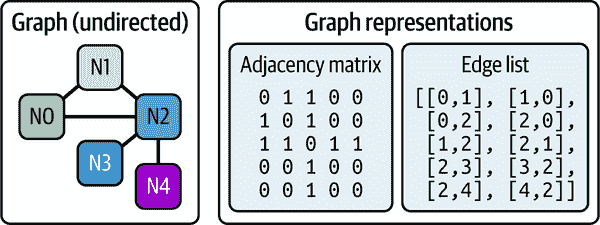
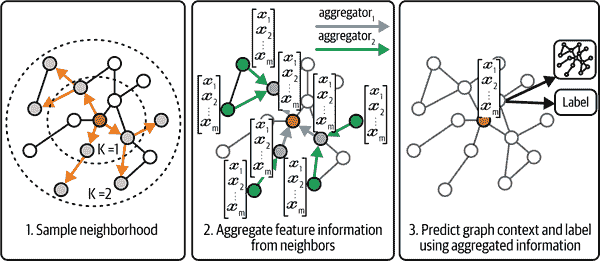
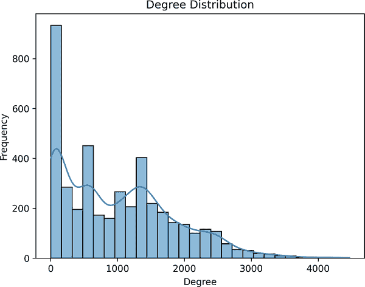
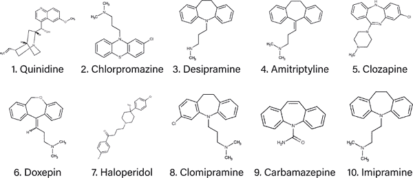
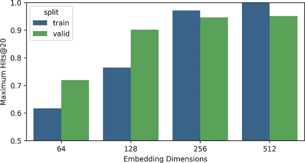
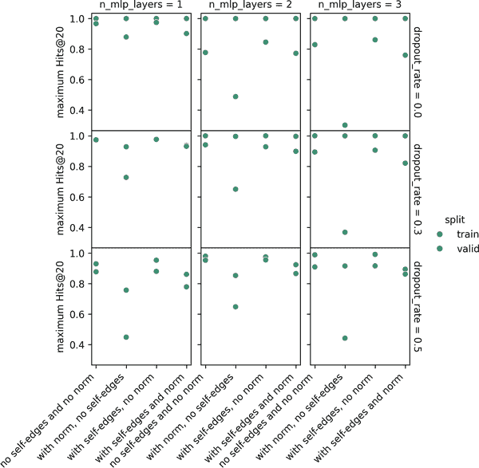
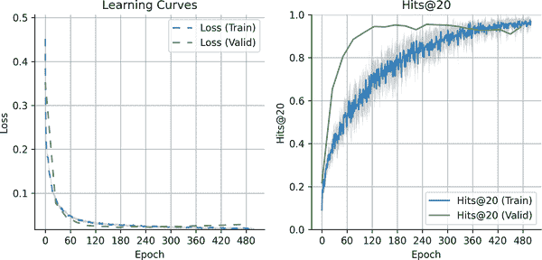
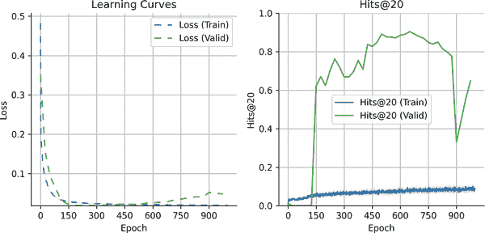

# 第四章\. 使用图理解药物-药物相互作用

*图* 是我们周围世界中无处不在的基本结构。一个熟悉的例子是社交网络，其中 *节点* 代表个人，而 *边* 捕获他们之间的关系。在铁路系统中，节点可以代表车站，而边则是连接它们的路线。不那么明显的例子包括通过共同作者关系相连的研究合作，通过超链接相互连接的网页，以及超市购物篮，其中经常一起购买的商品是相互连接的。

生物学也是如此，其中充满了自然适合网络框架的数据——基因相互作用以控制细胞功能，蛋白质在物理上相互结合，细胞相互发送信号，所有这些都形成了类似图的结构。甚至分子也可以表示为图，其中原子作为节点，化学键作为边，如图图 4-1 所示。在更大的生物尺度上，生态食物网捕捉捕食者-猎物和其他物种之间的相互作用，而疾病传播网络则映射病原体在人群中的传播。


###### 图 4-1\. 不同上下文中的图示例。社交网络显示人们作为节点通过表示关系的边连接。铁路网络说明车站作为节点，火车路线作为边。分子网络描绘了咖啡因的分子结构，其中节点代表原子，边代表化学键（未显示氢原子）。

这些类型的网络关系可以使用 *图神经网络* (GNNs) 进行建模。最近，图上的深度学习变得越来越流行和有效。在本章中，我们将探索一个 *药物-药物相互作用* (DDIs) 的图，以了解其连通性。具体来说，我们旨在预测两个节点是否应该连接，这是一个被称为 *链接预测* 的任务。链接预测在这里很有价值，因为我们虽然有一个现有的 DDI 图，但它可能是不完整的——由于研究有限或未测试的组合，一些药物之间的真实连接可能缺失。通过准确预测这些链接，人们可以通过识别潜在的负面相互作用来提高药物的安全性，甚至可以通过预测哪些药物可能产生积极的相互作用来发现新的联合疗法。

###### 小贴士

与前面的章节一样，我们建议你在阅读本章时保持其配套的 Colab 笔记本打开。亲自运行代码有助于巩固材料，并为你提供一个立即实验新想法的地方。

# 生物学入门

当一种药物的效果因另一种药物的存在而改变时，就会发生 DDIs。DDIs 可以增强每种药物的效果，抵消它们，或改变药物在体内的处理方式，这可能导致治疗益处或不良后果。

## 有益的药物-药物相互作用

在某些情况下，药物相互作用（DDI）可以被利用来获得治疗优势。例如，在癌症治疗中，联合疗法将针对癌细胞不同途径的药物配对。一种药物可能抑制肿瘤生长，而另一种则限制肿瘤的血液供应，进一步削弱它。这种多靶点方法不仅改善了患者的预后，还降低了药物耐药性的可能性。

同样，某些抗生素在联合使用时效果更好。例如，青霉素和庆大霉素常联合使用来治疗心内膜炎等感染。青霉素削弱了细菌细胞壁，使庆大霉素能够穿透细胞并破坏蛋白质合成，从而实现更有效的抗生素治疗。

## 有害的药物-药物相互作用

有害的药物相互作用通常比有益的更常见——大多数药物在设计时并没有考虑与其他药物相互作用，这往往会导致患者服用多种药物时出现意外的副作用。此外，许多药物影响相似的生物途径，增加了其中一种药物会增强或抵消另一种药物效果的可能性。例如：

增强示例

阿司匹林，常作为止痛药或抗凝血剂使用，可以增强其他抗凝剂（如华法林）的效果。当两者同时服用时，两种药物都会使血液比预期更薄，从而增加过度出血或瘀伤的风险。

抵消示例

布洛芬会降低抗高血压药物（如 ACE 抑制剂和β-阻滞剂）的有效性。布洛芬会导致身体保留钠和液体，从而升高血压并抵消这些药物。

大多数负面的药物相互作用实际上更为 *间接*。例如，许多药物在肝脏通过细胞色素 P450 酶系统代谢，因此抑制该系统的药物可能会影响广泛的其它药物。尽管葡萄柚在传统意义上不是“药物”，但它含有抑制细胞色素 P450 系统的化合物。最严重的葡萄柚相互作用之一是某些用于控制胆固醇的降脂药。葡萄柚化合物抑制了本应分解这些降脂药的酶，导致高于预期的药物水平在血液中积累。这种积累可能导致非常严重的副作用，包括肝损伤和肌肉组织分解。

## DrugBank

DrugBank 是最大的药物相互作用数据库之一，提供有关药物及其已知相互作用的详细信息。它已被广泛应用于各种药物相互作用（DDI）研究中。例如，在 图 4-2 中，2016 年的一项早期研究将 DrugBank 的 DDI（当时数据库包含约 1,000 个节点；在本章中，我们使用包含超过 4,000 个节点的较新版本）进行聚类，以揭示主要的药物聚类，包括之前讨论过的与细胞色素 P450 相互作用相关的聚类。1


###### 图 4-2\. 使用 DrugBank 4.1 数据构建的基于社区的药物-药物相互作用网络，包含 1,141 个节点（药物）和 11,688 条边（药物-药物相互作用）。聚类是通过使用 Force Atlas 2 布局算法进行的，该算法通过模拟物理系统来定位节点，根据它们的相互作用将节点放置得更近，并使用颜色来突出显示相互作用的药物的不同社区。

在本章中，我们将使用 DrugBank 的 DDI 数据的处理版本，该版本可通过斯坦福大学研究人员提供的公开可访问的基准数据集[Open Graph Benchmark](https://oreil.ly/S_wR-)获得.^(2) 在深入数据集及其应用之前，让我们先简要介绍图上的机器学习。

# 机器学习入门

你可能已经对图有一个直观的感觉，但要更精确，图是表示成对对象之间关系的结构。它由两个主要组件组成：

节点（或顶点）

这些代表单个实体，如社交网络中的人或相互作用网络中的蛋白质。

边

这些是节点之间的连接，表示关系或相互作用。例如，在一个社交网络中，边可能代表友谊，而在蛋白质相互作用网络中，边表示两个蛋白质之间观察到的物理相互作用。

图可以是*有向的*（边有方向，表示单向关系）或*无向的*（表示双向关系）。一个有向生物图的例子是生态系统中山种之间的捕食者-猎物关系——猫头鹰捕食老鼠；通常不是相反的情况。一个无向生物图的例子是基因共表达网络，其中节点是基因，边是每对基因表达水平之间的相关性。

边可以有*属性*，例如*权重*，它反映了连接的强度。节点也可以有属性来捕获额外的信息。例如，在捕食者-猎物示例中，边权重可能表示一个物种捕食另一个物种的次数，每个节点可能包含有关该物种的额外信息，例如其估计的种群大小。图在连接密度（稀疏与密集）上有所不同，可能包括自环（节点连接到自身），并且可以是动态的（随时间变化，如社交网络）或静态的。

某些图属性具有重大的计算影响。例如，*图大小*可能是一个挑战，因为大型图可能需要分布在多个处理单元上以避免内存过载。*图稀疏性*——即现有边与图中可能存在的总边数的比例——影响存储和计算效率，专门的技术被设计来处理稀疏连接的网络。此外，稀疏图允许更高效的卷积操作，因为需要考虑的邻居更少（将在本章稍后进一步解释）。最后，*连通性*的水平起着至关重要的作用。虽然具有许多小型、不连接的子图的图通常可以并行处理，但密集连接的图更难以并行化。

## 表示图结构

在图 4-3 中，我们看到一个包含五个节点（N0、N1、N2、N3、N4）和五个边的无向图：



###### 图 4-3\. 无向图的视觉表示。相同的图被表示为邻接矩阵和双向边列表，其中每个无向边在两个方向上显示。在实际应用中，许多 GNN 库需要这样的双向边列表。默认情况下，通常还包括自环（此处未显示）以帮助保留节点身份。每个节点通常与一个特征向量相关联（此处未显示），但并非总是如此（如本章所示）。

我们可以通过两种主要方式数值地表示图结构：

邻接矩阵

每个节点都列在矩阵的行和列中，边由对应单元格中的值表示。

边列表

列表中的每一行通过指定其起始节点和结束节点来表示一条边。

表示的选择影响内存使用，尤其是在图稀疏性方面。邻接矩阵具有固定的较高内存使用，因为它考虑了所有可能存在的边，而边列表则更紧凑，因为它只存储存在的边。对于边数远小于总可能边的稀疏图，边列表通常更节省内存。

## 图神经网络

通过对图的基础理解，我们可以探索图神经网络如何从图中学习。GNNs 是一类直接在图结构上操作、从节点及其连接中捕获信息的模型。从高层次来看，GNNs 通过迭代地聚合来自节点邻居的信息，产生丰富的表示（嵌入），这些表示反映了节点的特征及其在更广泛的图结构中的位置。我们将在稍后更详细地分解这个过程——但首先，为什么我们最初需要 GNNs 呢？它们可以解决哪些与图相关的问题？

GNNs 通常用于以下主要任务：

节点分类

预测图中节点类型或属性；例如，在 DDI 网络中确定药物的类别（例如，抗抑郁药、抗组胺药或抗生素）。

边分类

预测两个节点之间连接的类型或存在性；例如，确定两种药物是否可能相互作用。

边回归

估计节点之间连接的连续值。在 DDI 网络的情况下，这可能涉及预测交互的严重性或强度，而不仅仅是其存在或类型。

图分类

预测整个图的属性；例如，确定表示为原子和键的药物分子是否具有特定的属性，例如水溶性或与特定疾病相关蛋白结合。

这些任务都依赖于 GNN 从图结构中提取有意义表示的能力。无论是为了对节点进行分类、预测边还是评估整个图的属性，核心机制都是相同的：通过迭代信息交换学习表达性嵌入。这使我们来到了大多数 GNN 架构背后的核心思想：**消息传递**。

## 图嵌入和消息传递

在 GNN 中，一个主要目标是通过对每个节点生成一个捕获其邻域信息的节点嵌入向量来学习每个节点周围的结构。与图像不同，图像中的像素具有固定的空间排列，图连接缺乏固有的顺序，这使得传统的卷积方法不太适用。

为了解决这个问题，现代 GNN 使用一种称为**消息传递**的框架，其中每个节点与其邻居迭代交换消息并聚合它们的信息以更新其自身的表示。这一想法在 Gilmer 等人提出的消息传递神经网络（MPNN）框架中得到形式化，这已成为许多当代 GNN 架构的基础。3 早期形式的 GNN 由 Scarselli 等人引入，他们提出了用于图学习的递归神经网络模型，尽管没有今天看到的模块化消息传递抽象。4

消息传递是一个灵活的框架，是许多 GNN 模型的基础。它通常指的是**发送者**和**接收者**节点之间的交互，其中发送者传输信息，接收者将其聚合以更新其自身的表示。**图卷积**是消息传递的一种具体实现，其中节点使用求和、平均值或最大值等函数从其邻居聚合信息。相比之下，非卷积方法，如图注意力网络（GATs），使用注意力机制根据邻居的相对重要性分配不同的权重。聚合函数的选择——是求和、平均值、最大值还是注意力——会影响 GNN 可以学习的模式类型。

增加消息传递层的数量（即节点可以“看到”的跳数）扩展了每个节点的感受野，使其能够整合来自图更远部分的信息。然而，更深的 GNN 可能会遇到两个关键挑战：

过度平滑

随着消息传递层数量的增加，每个节点从更广泛的邻域中整合信息。虽然这在一定程度上是有益的，但堆叠过多的层会导致节点嵌入越来越相似——最终无论节点的局部结构或特征如何，都会接近于相同的表示。这降低了模型区分节点的能力，尤其是在分类任务中，细微的差异可能非常重要。

过度压缩

当长距离信息必须通过有限数量的中间节点或边传递时，它变得过于压缩。这个瓶颈阻止了远距离信号被准确保留——特别是在具有长而窄路径的图中，如生物中常见的树或层次结构（例如，基因调控网络或系统发育树）。因此，来自遥远节点的关键上下文在能够有意义地影响预测之前就被“压缩”了。

为了缓解这些问题，常见的策略包括添加跳过连接、整合注意力机制或重新布线图以缩短路径长度。在实践中，仅使用两到三个消息传递层——捕获几跳之外的信息——通常在表达性和稳定性之间提供了良好的平衡。

###### 小贴士

在 GNN 中，“层”更好地理解为消息传递迭代，而不是传统的神经网络层。与 MLP 不同，MLP 的每一层应用一个不同的学习转换，每个 GNN 层则从节点的直接邻居中聚合信息。因此，具有三层模型的模型使每个节点能够整合来自图上最多三跳的信息。

## 冷启动问题

GNN 中的一个重大挑战是预测*未见过*的节点，通常被称为*冷启动问题*。许多传统的图模型在*归纳*设置中运行，其中训练发生在固定的图上，限制预测仅限于训练期间看到的节点之间的关系。

然而，现实世界的应用通常涉及动态图，其中会引入新的节点。例如：

+   在社交网络中，新用户加入，平台需要预测他们可能建立的联系。

+   在推荐系统中，新发布的产品必须根据用户的偏好与相关用户匹配。

+   在药物发现中，新合成的化合物必须评估其与现有分子的相互作用。

为了解决冷启动问题，GNN 可以采用*归纳学习*方法，使其能够泛化到新的、未见过的节点。这种能力对于动态图至关重要，因为新节点经常被添加，它消除了每次图发生变化时都需要重新训练模型的需求。这是通过学习在整个图中可转移的模式和关系来实现的。例如：

+   模型不是记住特定的连接，而是识别结构相似性（例如，节点在其局部邻域中的作用）或共享特征（例如，节点之间的共同属性）。

+   当添加新节点时，其特征向量和与现有节点的直接连接为模型提供了足够的上下文，以便在图中嵌入它并做出预测。

类似于 GraphSAGE 这样的知名框架通过采样邻域和聚合局部特征来生成未见节点的嵌入，专注于归纳学习。技术如特征传播和注意力机制进一步增强了这一能力，使 GNN 能够高度适应不断发展的现实世界图。

###### 注意

对于一个更详细（但易于理解）的 GNN 介绍，我们推荐 YouTube 上 Petar Veličković的出色讲座[“Graph Neural Networks 的理论基础”](https://oreil.ly/GXy3v)。它提供了来自该领域领先专家的清晰 GNN 解释。

## GraphSAGE

在本章中，我们实现了一个 GraphSAGE 模型，^(5)，这是一种归纳方法，可以通过聚合其邻居的信息来预测它之前从未见过的节点的属性。在原始论文中，GraphSAGE 在诸如将学术论文分类到六个与生物学相关的类别、根据用户互动将 Reddit 帖子分配到 50 个社区以及预测多个蛋白质-蛋白质相互作用图中的蛋白质功能等任务上进行了评估。这些基准测试展示了 GraphSAGE 泛化到未见节点并优于传统方法的能力，突显了其在动态、现实世界图中的多功能性。

GraphSAGE 的一个关键优势是其可扩展性，能够处理大规模图。在大型图上进行训练可能需要大量资源，因为每个节点的嵌入更新都需要遍历其邻居。GraphSAGE 通过使用*子采样*来应对这一挑战，即对每个节点只采样一小部分固定数量的邻居。这些子图以小批量进行处理，显著降低了内存和计算成本。

如图 4-4（来自原始论文[`oreil.ly/wz_mG`](https://oreil.ly/wz_mG)）所示，GraphSAGE 有两个主要组件：采样子图和为每个节点聚合邻域信息。生成的嵌入可以用于下游任务，如节点分类或链接预测。虽然 GraphSAGE 可以包含边或节点注释，但它不依赖于它们，在本章的大部分内容中，我们将专注于图结构。



###### 图 4-4。GraphSAGE 代表 Graph SAmple and AggreGatE，表示其两个主要步骤：（1）采样一个节点的邻居，（2）聚合它们的特征以生成嵌入。这些嵌入可以用于下游任务，例如（3）预测图中的节点属性或关系。

# 选择数据集

在本章中，我们将使用一个独特的数据源：处理过的 DrugBank DDIs 的 Open Graph Benchmark (OGB)数据集，称为[`ogbl-ddi`](https://oreil.ly/WWr52)。这个数据集有两个特别方便的原因：

1.  它已经得到了很好的研究，提供了丰富的现有研究以供借鉴。

1.  这使我们能够使用[排行榜](https://oreil.ly/VPv1R)将我们的模型性能与其他方法进行比较。

此外，OGB 通过提供与各种深度学习框架兼容的内置数据加载器和用于计算特定问题度量的`Evaluator`类，简化了工作流程。这使得我们能够专注于构建和改进我们的模型，而不是花费大量时间在数据准备上。

## 描述数据集

我们已经讨论了 DDI 网络的一般情况。特别是，OGBL DDI 数据集是一个无权重的、无向的 DDI 图，其中每个节点是 FDA 批准或实验性药物，边表示药物之间的有益或有害相互作用。

为了使问题更具挑战性，数据集以有趣的方式分割——通过每个药物靶向的蛋白质。这种“蛋白质-靶点分割”确保测试集包含主要与训练和验证集中不同蛋白质结合的药物，这意味着它们更有可能通过不同的生物机制起作用。这迫使模型学习更具普遍性的生物学。如果我们创建了自己的分割——例如药物的随机分割——训练和测试集之间在生物机制上可能会有更大的重叠，这会使问题更容易，但最终会降低模型将未见过的药物推广到现实世界场景中的能力。

## 探索数据集

像往常一样，让我们先对数据集进行一些探索性分析，以了解我们正在处理的内容。我们首先加载数据：

```py
from ogb.linkproppred import LinkPropPredDataset

from dlfb.utils.context import assets

# Quite a large graph, may take a few minutes to load.
dataset = LinkPropPredDataset(name="ogbl-ddi", root=assets("graphs/datasets"))

```

这将下载`ogbl-ddi`数据集，并将其整齐地打包成一个可供检查的对象。完整的图可以通过`.graph`访问：

```py
dataset.graph

```

输出：

```py
{'edge_index': array([[4039, 2424, 4039, ...,  338,  835, 3554],
        [2424, 4039,  225, ...,  708, 3554,  835]]),
 'edge_feat': None,
 'node_feat': None,
 'num_nodes': 4267}

```

图被存储在`edge_index`键下的*边列表*格式中。`edge_feat`和`node_feat`都是`None`，这意味着图只包含结构——没有额外的边特征，如相互作用强度或节点特征，如药物属性。接下来，让我们检查图中的节点和边的数量：

```py
print(
  f'The graph contains {dataset.graph["num_nodes"]} nodes and '
  f'{dataset.graph["edge_index"].shape[1]} edges.'
)

```

输出：

```py
The graph contains 4267 nodes and 2135822 edges.

```

我们可以绘制*度分布*，即每个节点的连接数分布，以了解图的高级结构（如图 4-5 所示）：

```py
import matplotlib.pyplot as plt
import numpy as np
import seaborn as sns

degrees = np.bincount(dataset.graph["edge_index"].flatten())

sns.histplot(degrees, kde=True)
plt.xlabel("Degree")
plt.ylabel("Frequency")
plt.title("Degree Distribution");

```



###### 图 4-5。DDI 网络中节点的度分布遵循幂律分布，其中一些药物与许多其他药物相互作用，但大多数药物更加孤立。

我们观察到一些药物充当*中心节点*，与许多其他药物有高度的相互作用，而大多数药物的度数较低，只与其他少数药物相互作用。这种模式与在生物和社会网络中常见的[*幂律分布*](https://oreil.ly/pcVKt)一致，其中少数元素具有非常高的连接性（中心节点），而大多数元素具有较低的连接性。然而，需要注意的是，这个特征可能只针对这个数据集，可能不适用于所有 DDI 网络。

我们可以计算图的*密度*，即边数与可能边数的比率，以量化我们的图连接的密集程度：

```py
num_nodes = dataset.graph["num_nodes"]
num_observed_edges = dataset.graph["edge_index"].shape[1]

# Since each edge in an undirected graph can be represented in two ways, we
# multiply by 2 to account for the bidirectionality.
num_observed_edges = 2 * num_observed_edges

# For any graph with n nodes, the maximum number of edges (assuming no
# self-loops) is n * (n-1).
num_possible_edges = num_nodes * (num_nodes - 1)

density = num_observed_edges / num_possible_edges

print(
  f"There are {num_observed_edges} observed edges and {num_possible_edges} "
  f"possible edges,\ngiving a graph density of {round(density, 2)}"
)

```

输出结果：

```py
There are 4271644 observed edges and 18203022 possible edges,
giving a graph density of 0.23

```

这表明，尽管数据集包含看似大量的边，但它并不极端密集，因为 77%的可能连接不存在。以 23%的密度计算，该图可能被认为是适度互联的，尽管这个标签有点主观，并且取决于具体上下文。

数据集附带其自己的方法来提取有用信息。例如，`.get_edge_split`将列出图在不同数据拆分中的边：

```py
data_split = dataset.get_edge_split()
data_split

```

输出结果：

```py
{'train': {'edge': array([[4039, 2424],
         [4039,  225],
         [4039, 3901],
         ...,
         [ 647,  708],
         [ 708,  338],
         [ 835, 3554]])},
 'valid': {'edge': array([[ 722,  548],
         [ 874, 3436],
         [ 838, 1587],
         ...,
         [3661, 3125],
         [3272, 3330],
         [1330,  776]]),
  'edge_neg': array([[   0,   58],
         [   0,   84],
         [   0,   90],
         ...,
         [4162, 4180],
         [4168, 4260],
         [4180, 4221]])},
 'test': {'edge': array([[2198, 1172],
         [1205,  719],
         [1818, 2866],
         ...,
         [ 326, 1109],
         [ 911, 1250],
         [4127, 2480]]),
  'edge_neg': array([[   0,    2],
         [   0,   16],
         [   0,   42],
         ...,
         [4168, 4259],
         [4208, 4245],
         [4245, 4259]])}}

```

我们可以看到，`valid`和`test`拆分实际上包含两种类型的边：

+   `edge`键包含正数据，表示已知的药物相互作用。在这里，*正*指的是这些相互作用是已知的，而不是它们是有益的还是有害的。

+   `edge_neg`键包含负边，表示没有已知相互作用的药物对。然而，由于一些相互作用可能只是未被发现，因此这些数据被认为是*弱标签*，可能包含不准确（假阴性）。

重要的是，训练数据集不包含显式的负边（即在`train`中没有预定义的`edge_neg`列表）。然而，由于稀疏图中大多数节点对都是未连接的，因此可以在训练期间从这个大量非边集中抽取负样本。用于抽取这些负样本的方法是一个重要的超参数，因为它可以显著影响性能。一些负边很容易区分，这可能导致指标膨胀。相比之下，验证和测试数据集包括一个预定义的`edge_neg`键，它指定了用于评估的未连接节点对。

让我们现在检查`train`、`valid`和`test`拆分的相对大小：

```py
print(
  f'Number of edges in train set: {data_split["train"]["edge"].shape[0]}\n'
  f'Number of edges in valid set: {data_split["valid"]["edge"].shape[0]}\n'
  f'Number of edges in test set: {data_split["test"]["edge"].shape[0]}'
)

```

输出结果：

```py
Number of edges in train set: 1067911
Number of edges in valid set: 133489
Number of edges in test set: 133489

```

在这个数据集中，训练集包含的正边数大约是验证和测试集的 10 倍。

另一个重要的考虑因素是验证集和测试集中的所有节点是否也出现在训练集中。这决定了模型在评估过程中是否会遇到完全未见的节点——这是归纳学习和推理学习之间的一个关键区别。您可以使用以下代码进行检查：

```py
train_nodes = np.unique(data_split["train"]["edge"])
valid_nodes = np.unique(data_split["valid"]["edge"])
test_nodes = np.unique(data_split["test"]["edge"])

# Check if all nodes in valid and test sets are present in train set.
valid_in_train = np.isin(valid_nodes, train_nodes).all()
test_in_train = np.isin(test_nodes, train_nodes).all()

print(f"All validation nodes are in training nodes: {valid_in_train}")
print(f"All test nodes are in training nodes: {test_in_train}")

```

输出结果：

```py
All validation nodes are in training nodes: True
All test nodes are in training nodes: True

```

在我们的案例中，验证集和测试集中的所有节点确实都存在于训练图中。这定义了一个推理设置，其中模型在训练期间看到所有节点，并且只需要预测它们之间是否存在特定的边。这种设置比归纳情况简单，在归纳情况下，模型必须对涉及完全未见节点的预测进行预测。

从推理评估开始，我们可以在一个受控的环境中评估模型性能，然后再处理更复杂的归纳场景。像 GraphSAGE 这样的模型非常适合归纳任务，因为它们根据局部邻域生成节点嵌入。这意味着即使未见过的节点也可以有意义地嵌入，前提是它们连接到图中的已知部分。

现在，我们将专注于推理情况，并确保当所有节点都已知时，模型表现良好。

## 检查药物名称

虽然这些附加注释数据在图对象中不是立即可用的，但`ogbl-ddi`数据集附带了一些额外的注释数据。让我们检查这些信息：

```py
import pandas as pd

ddi_descriptions = pd.read_csv(
  assets("graphs/datasets/ogbl_ddi/mapping/ddi_description.csv.gz")
)
print(ddi_descriptions)

```

输出结果：

```py
        first drug id   first drug name second drug id     second drug name  \
0             DB00001         Lepirudin        DB06605             Apixaban   
1             DB00001         Lepirudin        DB06695  Dabigatran etexi...   
2             DB00001         Lepirudin        DB01254            Dasatinib   
...               ...               ...            ...                  ...   
2669761       DB15657  Ala-geninthiocin        DB14055         (S)-Warfarin   
2669762       DB15657  Ala-geninthiocin        DB00581            Lactulose   
2669763       DB15657  Ala-geninthiocin        DB14443  Vibrio cholerae ...   

                 description  
0        Apixaban may inc...  
1        Dabigatran etexi...  
2        The risk or seve...  
...                      ...  
2669761  The risk or seve...  
2669762  The therapeutic ...  
2669763  The therapeutic ...  

[2669764 rows x 5 columns]

```

我们可以看到每一行都是一个药物-药物相互作用（DDI），每个药物都有一个 ID（[DrugBank 数据库](https://oreil.ly/CfISy)中的访问号）以及描述其相互作用性质的描述。

###### 注意

本章的数据集最终来源于[DrugBank](https://oreil.ly/MYb6A)，它提供了关于药物及其相互作用的广泛信息。虽然其中一些信息包含在基准数据集中，但还可以添加更多，例如化学性质、靶基因和其他药物特定细节。然而，非学术用户访问完整的 DrugBank 资源并非免费。

当我们处理我们的图时，我们主要会处理节点索引，但我们始终可以查找节点 ID 和 DrugBank 药物 ID 之间的映射：

```py
node_to_dbid_lookup = pd.read_csv(
  assets("graphs/datasets/ogbl_ddi/mapping/nodeidx2drugid.csv.gz")
)
print(node_to_dbid_lookup)

```

输出结果：

```py
      node idx  drug id
0            0  DB00001
1            1  DB00002
2            2  DB00004
...        ...      ...
4264      4264  DB15617
4265      4265  DB15623
4266      4266  DB15657

[4267 rows x 2 columns]

```

这种查找允许我们更深入地观察之前观察到的度分布。哪些药物与许多其他药物结合？让我们检查具有最高边数的药物。由于除了 14 个药物相互作用之外，这个数据框中的所有药物相互作用都表示了两次（一次作为“A-B”，一次作为“B-A”），我们可以依靠“第一个药物名称”列来获取最频繁结合的药物：

```py
ddi_descriptions["first drug name"].value_counts().head(10)

```

输出结果：

```py
first drug name
Quinidine         2477
Chlorpromazine    2431
Desipramine       2345
Amitriptyline     2338
Clozapine         2324
Doxepin           2273
Clomipramine      2269
Haloperidol       2269
Carbamazepine     2267
Imipramine        2260
Name: count, dtype: int64

```

图 4-6 展示了这些顶级相互作用药物的结构。有趣的是，许多这些药物，如去甲替林、阿米替林和氯米帕明，共享一个常见的三环（三环）核心结构，这可能会对它们的相似相互作用特征做出贡献。



###### 图 4-6。数据集中药物-药物相互作用次数最多的前 10 种药物的化学结构。有趣的是，许多这些药物，如去甲替林、阿米替林和氯米帕明，具有一个共同的三个环（三环）核心结构，这可能会通过促进广泛的靶点结合和通过细胞色素 P450 酶的广泛代谢来促进它们相似的相互作用模式。结构来自 DrugBank。

如果你不习惯于记忆药物名称，这个药物列表可能看起来有点晦涩，但这里有一些明显的模式：

影响转运蛋白

交互次数最多的药物（2,477 次）是奎尼丁，用于治疗某些心律失常。像列表上的其他药物，如氯氮平和卡马西平一样，奎尼丁与转运蛋白（最著名的是一种称为 P-糖蛋白的蛋白质）强烈相互作用，这些蛋白调节许多药物在细胞间的吸收和运输。这种对药物水平广泛的影响在很大程度上解释了它在数据集中高交互次数的原因。

影响药物代谢

许多这些药物，如抗抑郁药（去甲替林、阿米替林、氯米帕明、丙咪嗪）、抗精神病药（氯丙嗪、氯氮平、氟哌啶醇）和情绪稳定剂卡马西平，在肝脏中被细胞色素 P450 酶家族代谢。这个系统在药物代谢中起着重要作用，并且是许多药物相互作用的核心，因为抑制或激活细胞色素 P450 酶的药物可以改变同时使用的其他药物的代谢。

剂量敏感性

最后，这些顶级相互作用药物也往往具有狭窄的*治疗范围*，这意味着血液浓度的小幅变化可能导致不良反应。这使得相互作用更有可能发生并被注意到。

从这个额外的药物信息表中，我们可以构建一个`node_id`到 DrugBank `dbid`再到药物名称的查找表，这样我们就可以在我们开始建模时为我们的项目带来更多的生物背景：

```py
first_drug = ddi_descriptions[["first drug id", "first drug name"]].rename(
  columns={"first drug id": "dbid", "first drug name": "drug_name"}
)
second_drug = ddi_descriptions.loc[
  :, ["second drug id", "second drug name"]
].rename(columns={"second drug id": "dbid", "second drug name": "drug_name"})
dbid_to_name_lookup = (
  pd.concat([first_drug, second_drug]).drop_duplicates().reset_index(drop=True)
)

drugs_lookup = pd.merge(
  node_to_dbid_lookup.rename(
    columns={"drug id": "dbid", "node idx": "node_id"}
  ),
  dbid_to_name_lookup,
  on="dbid",
  how="inner",
)

drugs_lookup.iloc[935]

```

输出：

```py
node_id            935
dbid           DB01043
drug_name    Memantine
Name: 935, dtype: object

```

例如，使用这个查找表，我们可以看到节点 ID 935 对应的是药物美金刚，其 DrugBank ID 为 DB01043。

## 图形可视化

现在，让我们看看这些图数据的一部分实际看起来是什么样子。整个图太大，无法一次性有意义地可视化，但我们可以采样一个子图并可视化它。这里的策略是从原始训练图中选择一组节点，然后通过这些节点对分割数据集进行子集划分：

```py
import numpy as np

np.random.seed(42)

def get_subgraph(edges: np.ndarray, node_limit: int) -> np.ndarray:
  """Gets a subgraph by sampling nodes and their edges."""
  nodes = np.unique(edges)
  sampled_nodes = np.random.choice(nodes, size=node_limit, replace=False)
  filtered_edges = edges[
    np.isin(edges[:, 0], sampled_nodes) & np.isin(edges[:, 1], sampled_nodes)
  ]
  print(f"Subgraph has {filtered_edges.shape[0]} edges")
  return filtered_edges

# Sample 50 nodes from the training set.
subgraph = get_subgraph(node_limit=50, edges=data_split["train"]["edge"])

```

输出：

```py
Subgraph has 152 edges

```

这个操作从训练集中提取了一个包含 50 个节点的子图。我们可以使用`plot_ddi_graph`函数将其可视化，该函数利用了流行的`networkx`库——一个广泛使用的 Python 工具，用于创建和可视化图结构：图 4-7

```py
import networkx as nx
from adjustText import adjust_text

def plot_ddi_graph(graph: np.ndarray, drugs_lookup: pd.DataFrame) -> plt.Figure:
  """Plots a drug–drug interaction graph with labeled nodes."""
  fig = plt.figure(figsize=(15, 15))
  G = nx.Graph()
  G.add_edges_from(graph)
  pos = nx.spring_layout(G)
  nx.draw(
    G=G,
    pos=pos,
    with_labels=False,
    node_color="lightgray",
    edge_color="gray",
    node_size=10,
    alpha=0.3,
  )
  names = (
    drugs_lookup[drugs_lookup["node_id"].isin(G.nodes)]
    .set_index("node_id")["drug_name"]
    .to_dict()
  )
  labels = nx.draw_networkx_labels(G=G, pos=pos, labels=names, font_size=20)
  adjust_text(list(labels.values()))
  return fig

plot_ddi_graph(subgraph, drugs_lookup);

```


###### 图 4-7\. DDI 网络的采样子图，节点以药物名称标注。虽然为了清晰起见，这个图只采样了 50 个节点，但可视化已经突出了交互的多样性，包括密集连接的药物和更孤立的药物。

图 4-7 突出了交互的多样性，包括密集连接的簇（例如，围绕抗抑郁药氯米帕明）和孤立或稀疏连接的药物。虽然这个图是为了清晰起见而采样的，但它说明了某些药物如何作为中心节点，反映了它们广泛的交互特征，而其他药物则更具有选择性，这可能是由于特定的生物机制。

在完成初步的数据探索后，我们准备开始构建数据集。

# 构建数据集

在探索了`LinkPropPredDataset`中的数据集后，我们现在将注意力转向准备它用于 JAX/Flax 框架的过程。尽管数据集不是即插即用的，但这为我们更好地理解图处理细节提供了一个宝贵的机会。在本节中，我们将介绍必要的调整，以确保数据集以适当格式为我们的模型准备。

幸运的是，我们不必从头开始。JAX 生态系统中的`jraph`是一个图库，它提供了基础、图感知的类和数据结构，使我们能够在利用 JAX 的速度和效率的同时构建灵活的图处理模型。如果你想在深入我们的实现之前更详细地了解`jraph`，我们推荐 DeepMind 提供的这篇关于使用`jraph`的图网的优秀教程.^(6)

###### 备注

PyTorch，尤其是其扩展库`pytorch-geometric`，可以说是用于处理图的最为全面的深度学习框架。它提供了一个强大的工具包，简化了从模型库中选择图模型、处理高效数据加载以及使用方便的数据类的工作。像 OGBL 这样的数据集有针对该框架定制的数据加载器。然而，在本章中，我们使用`jraph`，因为它与 JAX 无缝集成，更好地符合我们为本书制定的整体方法。

让我们开始构建一个可以训练模型的数据集。如前所述，有几种方式来表示图，例如使用邻接矩阵或边列表。由于我们使用`jraph`，我们选择了边列表格式，这是默认格式，对于像 DDI 网络这样的稀疏数据集来说，它更加内存高效。

## 创建数据集构建器

我们将数据集构建封装到一个名为`DatasetBuilder`的类中。随着我们的进行，你会认识到许多来自上一节的内容，我们在那里探讨了原始数据集。让我们一步一步地来，从主方法`build`开始：

```py
  def __init__(self, path):
    """Initializes the dataset builder with a path to the dataset."""
    self.path = path

  def build(
    self,
    node_limit: int | None = None,
    rng: jax.Array | None = None,
    keep_original_ids: bool = False,
  ) -> dict[str, Dataset]:
    """Builds and returns a dictionary of dataset splits."""
    dataset_splits = {}
    n_nodes, split_pairs = self.download()
    annotation = self.prepare_annotation()

    for name, split in split_pairs.items():
      pos_pairs, neg_pairs = split["edge"], split["edge_neg"]
      graph = self.prepare_graph(n_nodes, pos_pairs)
      pairs = self.prepare_pairs(graph, pos_pairs, neg_pairs)
      dataset_splits.update({name: Dataset(n_nodes, graph, pairs, annotation)})

    if node_limit and (rng is not None):
      dataset_splits = self.subset(
        dataset_splits, rng, node_limit, keep_original_ids
      )

    return dataset_splits

```

在实例化过程中，构建器接收一个`path`以确保数据集存储在指定的位置，从而消除了每次都需要重新下载的需求。然后`build`方法生成一个字典，其中键表示数据分割，每个键都与一个`Dataset`值相关联。我们将在稍后更详细地检查`Dataset`类，但到目前为止，可以将其视为一个数据集包，它具有在训练期间便于处理的便利方法。传递给`build`的参数有助于子集化图，我们稍后会详细介绍这一点。

## 下载原始数据集

查看`build`代码，我们可以看到首先下载了原始数据集，利用了之前看到的`LinkPropPredDataset`。由于训练分割没有负样本对，我们添加了一个`neg_edges`键以简化后续处理：

```py
  def download(self) -> tuple[int, dict]:
    """Downloads the dataset and returns the number of nodes and edge splits."""
    raw = LinkPropPredDataset(name="ogbl-ddi", root=self.path)
    n_nodes = raw[0]["num_nodes"]
    split_pairs = raw.get_edge_split()
    split_pairs["train"]["edge_neg"] = None  # Placeholder for negative edges.
    return n_nodes, split_pairs

```

## 准备标注

在这个项目中训练我们的模型时，数据集标注不是直接有用的，但它便于随时可用以执行各种合理性检查。您将从前面的实现中认出它：

```py
    def prepare_annotation(self) -> pd.DataFrame:
      """Annotates nodes by mapping node IDs to database IDs and drug names."""
      ddi_descriptions = pd.read_csv(
        f"{self.path}/ogbl_ddi/mapping/ddi_description.csv.gz"
      )
      node_to_dbid_lookup = pd.read_csv(
        f"{self.path}/ogbl_ddi/mapping/nodeidx2drugid.csv.gz"
      )
      # Merge first and second drug descriptions into a single lookup.
      first_drug = ddi_descriptions.loc[
        :, ["first drug id", "first drug name"]
      ].rename(columns={"first drug id": "dbid", "first drug name": "drug_name"})

      second_drug = ddi_descriptions.loc[
        :, ["second drug id", "second drug name"]
      ].rename(
        columns={"second drug id": "dbid", "second drug name": "drug_name"}
      )
      dbid_to_name_lookup = (
        pd.concat([first_drug, second_drug])
        .drop_duplicates()
        .reset_index(drop=True)
      )

      # Merge with node-to-DBID lookup.
      annotation = pd.merge(
        node_to_dbid_lookup.rename(
          columns={"drug id": "dbid", "node idx": "node_id"}
        ),
        dbid_to_name_lookup,
        on="dbid",
        how="inner",
      )
      return annotation

```

标注对所有数据集分割都是相同的；因此，我们只需要准备一次并将其分配给`Dataset`。

## 准备图

接下来，我们看看`prepare_graph`，这是数据集构建器的主要函数之一：

```py
  def prepare_graph(
    self, n_nodes: int, pos_pairs: jax.Array
  ) -> jraph.GraphsTuple:
    """Prepares a Jraph graph from positive edge pairs."""
    senders, receivers = self.make_undirected(pos_pairs[:, 0], pos_pairs[:, 1])
    graph = jraph.GraphsTuple(
      nodes={"gid": jnp.arange(n_nodes)},  # Optional global node ID.
      edges=None,
      senders=senders,
      receivers=receivers,
      n_node=jnp.array([n_nodes]),
      n_edge=jnp.array([len(senders)]),
      globals=None,
    )
    return graph

```

`make_undirected`方法确保 DDI 图是无向的，这意味着药物*A-B*之间的关系等同于*B-A*。由于`jraph`不提供在有向图和无向图之间切换的功能，我们需要以两种方向表示所有边。这个过程称为*对称化*图，使得邻接关系对称，有效地将有向图转换为无向图。这种转换应用于所有数据集分割。

实际上，实现这种转换很简单。我们从`pos_pairs`开始，添加一组相应的边，其中发送者和接收者节点被交换：

```py
  @staticmethod
  def make_undirected(
    senders: jax.Array, receivers: jax.Array
  ) -> tuple[jax.Array, jax.Array]:
    """Makes an undirected graph by duplicating edges in both directions."""
    # Jraph requires undirected graphs to have both A->B and B->A edges
    # explicitly.
    senders_undir = jnp.concatenate((senders, receivers))
    receivers_undir = jnp.concatenate((receivers, senders))
    return senders_undir, receivers_undir

```

接下来，我们使用`GraphsTuple`期望的主要参数来准备图：`senders`和`receivers`，通过指定源节点和目标节点来定义边。每个节点或边都可以进行标注（尽管这里没有），节点标注存储在`nodes`中，边标注存储在`edges`中。此外，`GraphsTuple`还包含元数据，如`n_nodes`和`n_edges`，分别表示节点和边的数量，以及`globals`，可以存储图级别的信息，如唯一的图标识符或聚合特征。虽然我们在这里不会使用`globals`，但它仍然可用于需要适用于整个图的数据的场景。

###### 警告

您可能会想知道为什么有时我们需要独立于图传递节点数。为什么不能从边中推断出来？这是因为从边中推断节点数可能会错过孤立节点，这些节点没有与其他节点（即没有与其他药物）的连接（即没有交互）。

通常，`GraphsTuple` 是一种灵活的数据结构，可以以多种方式存储数据。我们不必为每个数据分割创建一个 `GraphsTuple`，而是可以构建一个包含训练集和评估数据集的单个图，使用 `nodes` 属性来指定每个节点属于哪个集合。

## 准备样本对

图构建完成后，我们使用 `prepare_pairs` 方法获取模型将分类为连接或不连接的药物-药物对——包括正负样本：

```py
  def prepare_pairs(
    self, graph: int, pos_pairs: jax.Array, neg_pairs: jax.Array | None = None
  ) -> Pairs:
    """Prepares positive and negative edge pairs."""
    if neg_pairs is None:
      neg_pairs = self.infer_negative_pairs(graph)
    return Pairs(pos=pos_pairs, neg=neg_pairs)

```

对于评估数据集，准备样本对很简单，因为我们可以直接使用 OGBL 数据集提供的正负样本对。

###### 注意

你可能会想知道为什么我们不使用我们刚刚创建的图中的边来生成正样本对。原因是，由于我们使图无向，每个正样本对被表示了两次，这可能导致评估过程中的冗余和错误。

对于训练数据集，准备样本对稍微复杂一些，因为负样本对没有提供，必须使用 `infer_negative_pairs` 方法推断：

```py
  def infer_negative_pairs(self, graph: jraph.GraphsTuple) -> jax.Array:
    """Infers negative edge pairs in a graph."""
    # Initialize a matrix where all possible edges are marked as potential
    # negative edges (1).
    neg_adj_mask = np.ones((graph.n_node[0], graph.n_node[0]), dtype=np.uint8)

    # Mask out existing edges in the graph (set to 0).
    neg_adj_mask[graph.senders, graph.receivers] = 0

    # Use the upper triangular part of the matrix to avoid duplicate pairs and
    # self-loops.
    neg_adj_mask = np.triu(neg_adj_mask, k=1)
    neg_pairs = jnp.array(neg_adj_mask.nonzero()).T  # Extract indices.
    return neg_pairs

```

该方法首先使用 NumPy 构建一个邻接矩阵，并用零初始化。然后，它将所有现有边标记为 1。为了识别负边，该方法翻转矩阵值，使得连接变为 0，非连接变为 1。最后，它仅保留矩阵的上三角部分（不包括对角线），以避免自环和重复样本对。剩余的非零条目被转换为负节点对的边列表。

由于图稀疏性，生成的负样本对远多于正样本对。这种不平衡可能是有利的，因为它提供了更多负边的样本。然而，如前所述，负样本对的采样方式会显著影响性能，因为有些对很容易预测为未连接。在训练过程中，我们需要仔细选择一个公平的负样本子集。

###### 注意

使用邻接矩阵方法假设它可以适应内存。如果这不可行，生成负节点对的替代方法包括采样一个非全面子集或使用依赖于稀疏邻接矩阵的高效实现。

正负样本对随后被封装在一个名为 `Pairs` 的数据类中，我们将在训练过程中进一步探讨它。这是一个简单的数据类，用于存储正负样本对数组，并包括在学习过程中对样本进行子采样和在批量中访问样本的实用工具。

## 图的子集

为了有效地探索模型如何从图中学习，能够创建数据集的一个较小子集非常有用。这允许我们在实验中使用更易于管理的图大小。子集方法正是这样做的：

```py
  def subset(
    self,
    dataset_splits: dict[str, Dataset],
    rng: jax.Array,
    node_limit: int,
    keep_original_ids: bool = False,
  ) -> dict[str, Dataset]:
    """Creates subset of dataset splits by sampling a fixed number of nodes."""
    # Get a random subset of node_ids.
    node_ids = jax.random.choice(
      rng, dataset_splits["train"].n_nodes, (node_limit,), replace=False
    )

    # Subset every dataset split by the same node_ids.
    dataset_subset_splits = {}
    for name, dataset in dataset_splits.items():
      dataset_subset_splits[name] = dataset.subset(node_ids, keep_original_ids)

    return dataset_subset_splits

```

它根据指定的`node_limit`选择节点子集，并在所有数据集分割（即训练、验证、测试）中一致地应用此子集。默认情况下，子集图重新编号节点 ID 以创建一个更小、更紧凑的图。然而，您可以通过将`keep_original_ids`参数设置为`True`来保留来自完整数据集的原始节点 ID。

## 数据集类

最后，我们已经准备好所有组件来创建一个`Dataset`类，它将允许灵活地探索图及其注释：

```py
@dataclass
class Dataset:
  """Graph dataset with nodes, pairs, and optional annotations."""

  n_nodes: int
  graph: jraph.GraphsTuple
  pairs: Pairs
  annotation: pd.DataFrame = field(default_factory=pd.DataFrame)

```

在这里，我们只展示了`Dataset`字段，但该类还提供了几个有用的方法。值得注意的是，它在幕后处理图的子集和注释管理。虽然我们鼓励您在线探索代码以更好地了解其功能，但理解每个细节并不是开始训练所必需的。

# 构建原型

让我们从简单开始。我们需要构建一个预测节点之间链接的模型。我们将仅使用图的连通性——没有节点特征或注释来完成这项工作。令人惊讶的是，仅凭这种连通性信息本身就可以非常强大，用于学习哪些节点对可能连接在一起。

虽然链接预测可以被视为一个二元分类任务（即连接与不连接），但它与典型的分类问题在关键方面有所不同。模型的输入不是一个单独的节点或特征向量，而是一对节点，并且预测取决于它们在图中的结构关系。

我们的原型模型将由几个关键组件组成，其中一些直接在模型中定义，而其他则作为训练过程的一部分进行处理：

+   模型组件：

    +   邻域编码：生成反映局部图结构的节点嵌入

    +   链接预测：使用这些嵌入来评估节点对之间连接的可能性

+   训练组件：

    +   负采样：选择未连接的节点对以与真实边进行对比

    +   损失函数：计算训练信号以优化模型性能

我们首先关注最关键的部分：我们如何编码每个节点的局部邻域。

## 节点编码器

对于我们的模型来说，最具影响力的选择可能是我们如何编码节点的邻域。为此，我们使用一个受 GraphSAGE 启发的实现：

```py
class NodeEncoder(nn.Module):
  """Encodes nodes into embeddings using a two-layer GraphSAGE model."""

  n_nodes: int
  embedding_dim: int
  last_layer_self: bool
  degree_norm: bool
  dropout_rate: float

  def setup(self):
    """Initializes node embeddings, which cover the full graph's n_nodes."""
    self.node_embeddings = nn.Embed(
      num_embeddings=self.n_nodes,
      features=self.embedding_dim,
      embedding_init=jax.nn.initializers.glorot_uniform(),
    )

  @nn.compact
  def __call__(self, graph: jraph.GraphsTuple, is_training: bool) -> jax.Array:
    """Encodes the nodes of a graph into embeddings."""
    # Graph can be a subgraph and thus we use a subset of embeddings
    x = self.node_embeddings(graph.nodes["gid"])

    # First convolutional layer.
    x = SAGEConv(
      self.embedding_dim, with_self=True, degree_norm=self.degree_norm
    )(graph, x)
    x = nn.relu(x)
    x = nn.Dropout(rate=self.dropout_rate, deterministic=not is_training)(x)

    # Second convolutional layer.
    x = SAGEConv(
      self.embedding_dim,
      with_self=self.last_layer_self,
      degree_norm=self.degree_norm,
    )(graph, x)

    return x

```

模块的主要输入参数包括：

`n_nodes`

定义原始图中的节点总数。

`embedding_dim`

指定节点嵌入的维度。这控制了模型可以多么丰富地表示邻域信息。较低的值（例如，16 或 32）可能会限制表达能力，而较高的值（例如，128 或 256）提供了更多的容量，但代价是增加了计算量。在实践中，较小的图可以支持较高的嵌入维度，而较大的图则受益于较低的值。

`dropout_rate`

设置在训练期间随机失活的神经元比例，以减少过拟合。

`last_layer_self`和`degree_norm`

配置图卷积行为的一些方面，这些方面将在下一节中更详细地描述。

GraphSAGE 的核心是`node_embeddings`矩阵。在`setup`方法中，这个矩阵被初始化为一个可学习的参数，使用`nn.Embed`，其形状为`[n_nodes, embedding_dim]`。这些嵌入使用`glorot_uniform`方法初始化，以促进稳定的训练动态。在训练过程中，这些嵌入通过聚合每个节点的邻居信息来更新，逐渐编码更高阶的结构模式。目标是让这些嵌入收敛到反映节点对之间连接可能性的表示。

编码器的主要逻辑在`__call__`方法中实现。这里的一个重要（尽管是硬编码的）设计选择是`SAGEConv`层的数量，它定义了应用多少轮消息传递：

+   在一层中，每个节点从其直接邻居那里聚合信息。

+   在两层中，每个节点可以访问到两跳远的邻居信息。

因此，层的数量控制了每个节点的感受野。层之间，ReLU 激活引入了非线性，并且应用 dropout 进行正则化以防止过拟合。

## 图卷积

我们现在已经到达了我们模型的核心架构组件：`SAGEConv`层。让我们深入探讨它：

```py
class SAGEConv(nn.Module):
  """GraphSAGE convolutional layer with optional self-loops."""

  embedding_dim: int
  with_self: bool
  degree_norm: bool

  @nn.compact
  def __call__(self, graph: jraph.GraphsTuple, x) -> jax.Array:
    n_nodes = self.get_n_nodes(graph)

    # Add self-loops if enabled.
    if self.with_self:
      senders, receivers = self._add_self_edges(graph, n_nodes)
    else:
      senders, receivers = graph.senders, graph.receivers

    # Aggregate node features from neighbors.
    if not self.degree_norm:
      x_updated = jraph.segment_mean(
        x[senders], receivers, num_segments=n_nodes
      )
    else:

      def get_degree(n):
        return jax.ops.segment_sum(jnp.ones_like(senders), n, n_nodes)

      x_updated = self.normalize_by_degree(x, get_degree(senders))
      x_updated = jraph.segment_mean(
        x_updated[senders], receivers, num_segments=n_nodes
      )
      x_updated = self.normalize_by_degree(x_updated, get_degree(receivers))

    # Combine node and neighbor embeddings by concatenation.
    combined_embeddings = jnp.concatenate([x, x_updated], axis=-1)

    return nn.Dense(self.embedding_dim)(combined_embeddings)

  @staticmethod
  def _add_self_edges(
    graph: jraph.GraphsTuple, n_nodes: int
  ) -> tuple[jax.Array, jax.Array]:
    """Adds self-loops to the graph."""
    all_nodes = jnp.arange(n_nodes)
    senders = jnp.concatenate([graph.senders, all_nodes])
    receivers = jnp.concatenate([graph.receivers, all_nodes])
    return senders, receivers

  @staticmethod
  def normalize_by_degree(x: jax.Array, degree: jax.Array) -> jax.Array:
    """Normalizes node features by the square root of the degree."""
    # We set the the degree to a minimum of 1.
    return x * jax.lax.rsqrt(jnp.maximum(degree, 1.0))[:, None]

  @staticmethod
  def get_n_nodes(graph):
    """Returns the number of nodes in the graph in a jittable way."""
    return tree.tree_leaves(graph.nodes)[0].shape[0]

```

在设置`SAGEConv`层时，我们指定嵌入维度（使用`embedding_dim`），是否添加自环（`with_self`），以及是否应用度数归一化（`degree_norm`）。后两个选项是可选的，因为它们对模型性能的影响取决于数据集的特征，如大小和连接模式。启用或禁用这些功能可以显著影响模型行为。

每个`SAGEConv`层执行以下关键步骤：

可选地添加自环

允许每个节点在聚合时考虑其自身的嵌入

聚合邻域嵌入

收集并平均每个节点邻居的嵌入

可选地按度数进行归一化

根据邻居的度数缩放邻居的贡献，减少高度连接节点的偏差

将嵌入与邻居结合

将原始节点嵌入与聚合的邻居嵌入合并

###### 注意

当阅读`SAGEConv`卷积层的实现时，你可能想知道：*卷积在哪里？*

与用于图像或序列的卷积神经网络（CNNs）不同，其中`nn.Conv`在规则网格上应用空间滤波器，图神经网络（GNNs）对“卷积”的定义更为抽象。在 GNNs 中，卷积意味着从节点的局部邻域聚合信息，并将其与自身的嵌入相结合。这通过使用如`segment_mean`之类的操作来实现，随后是一个可学习的转换——通常通过`nn.Dense`。因此，虽然你不会在`SAGEConv`中看到显式的`nn.Conv`，但最后的密集层充当了“图卷积”的核心可训练部分。

值得注意的是，`SAGEConv`仅关注聚合和线性转换。它不包括非线性激活、批量归一化或 dropout——这些通常在模型级别应用，以允许更大的灵活性和重用。

### 添加自环

在`NodeEncoder`中，我们使用两个`SAGEConv`层，第一层的`with_self`参数设置为`True`。添加自环确保在邻域更新过程中（通过将节点包含在其自己的发送者列表中）包含节点自身的嵌入。没有自环，节点的更新嵌入将仅反映其邻居的信息，可能会使表示偏离其原始身份。包括自环允许每个节点对其自身的更新做出贡献，平衡其现有特征与邻域上下文。

这可以通过向邻接矩阵的对角线添加 1 来实现，有效地将每个节点连接到自身。在我们的实现中，`with_self`和`last_layer_self`参数分别控制是否在第一和第二`SAGEConv`层中包含自环。

###### 注意

即使没有显式的自环，模型也可以通过使用跳过连接来保留节点的身份。例如，在我们的实现中，我们使用`combined_embeddings = jnp.concatenate([x, x_updated], axis=-1)`将原始和更新后的嵌入连接起来。这有助于保留节点的原始特征。然而，这与自环不同，原始嵌入是在邻域聚合之后添加的，而不是作为其一部分。包括自环确保节点的身份直接贡献于聚合步骤本身。

### 聚合邻域

我们现在转向消息传递的核心操作：从每个节点的邻域聚合信息。

这是第一次明确使用图结构。对于每条边，发送节点的嵌入（或特征）被收集并按接收者进行聚合。换句话说，每个接收节点通过结合所有连接的发送者的信息来更新其嵌入。结果是新的表示，反映了其局部邻域的结构和特征。

在我们的实现中，我们使用`jraph.segment_mean`作为聚合函数，它为每个接收者计算发送者嵌入的平均值。其他常见的选择包括求和、最大值，甚至像 GAT 风格模型中使用的注意力加权聚合。最佳的聚合方法通常取决于图的拓扑结构和下游任务，因此尝试不同的策略可能很有价值。

### 通过度数归一化

度数归一化确保所有节点，无论其连接性如何，在训练期间都更均匀地贡献。这可以帮助稳定优化，避免梯度爆炸或消失。然而，过度归一化可能会*过度平滑*节点嵌入，可能抹去节点局部结构的细微细节。

在我们的实现中，我们应用*对称度数归一化*，其工作原理如下：

+   在聚合之前，消息被除以*发送者的度数*的平方根。

+   然后将聚合结果除以*接收者的度数*。

这种平方根缩放——在各种 GNN 变体中都很常见——平衡了节点间的消息影响，同时避免了意外的缩放效应。

###### 小贴士

度数归一化是否提高性能取决于数据集及其结构属性。它在具有高度可变性的图中特别有帮助，在这些图中，一些高度节点可能会在其他情况下主导消息传递。它还通过保持信号幅度在控制范围内，提高了深层 GNN 的稳定性。

然而，在原始连接强度或节点中心性具有重要意义的图中——例如物理交互网络、引用图或交通系统——归一化可能会抑制信息信号。如果时间允许，在模型开发过程中通常值得比较归一化和未归一化的变体。

### 结合嵌入与邻域

在聚合（和可选的归一化）之后，我们将更新的节点嵌入与原始嵌入结合——通常是通过连接。这产生了一个统一表示，它捕捉了节点的初始特征以及从其局部邻域收集的信息。这一丰富步骤确保嵌入反映了个体身份和结构背景。

将原始嵌入和聚合嵌入连接起来，将特征维度翻倍。为了将这个结果还原到预期的嵌入大小，将组合向量通过一个全连接的`Dense`层。这一层有两个关键作用：

保持一致的维度

将连接的向量投影回原始嵌入大小，确保与下一个模型层的兼容性

学习更好的表示

学习如何最优地融合原始和邻域特征，使模型能够细化要保留或强调的信息

因为`Dense`转换是可学习的，模型在训练过程中会适应，以最有效地使用这两种类型的输入。

###### 备注

在模型训练过程中，图结构保持不变。只有 `node_embeddings` 被更新，随着时间的推移，随着模型从邻域聚合和特征转换过程中学习而演变。

## 链接预测

我们现在使用学习到的节点嵌入来预测给定的节点对是否连接。如果嵌入有效地捕捉了图的结构，该模型应该能够为真实边分配高分数，为无关节点对分配低分数。

让我们看看嵌入如何在 `LinkPredictor` 模块中使用：

```py
class LinkPredictor(nn.Module):
  """Predicts interaction scores for pairs of node embeddings."""

  embedding_dim: int
  n_layers: int
  dropout_rate: float

  @nn.compact
  def __call__(
    self,
    sender_embeddings: jax.Array,
    receiver_embeddings: jax.Array,
    is_training: bool,
  ) -> jax.Array:
    """Computes scores for node pairs."""
    x = sender_embeddings * receiver_embeddings  # Element-wise multiplication.

    # Apply MLP layers with ReLU activation and dropout.
    for _ in range(self.n_layers)[:-1]:
      x = nn.Dense(self.embedding_dim)(x)
      x = nn.relu(x)
      x = nn.Dropout(self.dropout_rate, deterministic=not is_training)(x)

    # Final output layer is a single neuron. Logit output used for binary link
    # classification.
    x = nn.Dense(1)(x)

    return jnp.squeeze(x)

```

`LinkPredictor` 接收一对节点嵌入——一个来自发送者，一个来自接收者——并估计它们之间边的可能性。以下是其工作原理：

嵌入组合

发送者和接收者的嵌入通过逐元素乘法结合。这个操作捕捉了每个嵌入对应维度的交互，产生一个固定大小的向量，反映了它们的成对兼容性。

表示转换

合并向量通过一个多层感知器（MLP），由几个带有 ReLU 激活和 dropout 的 `Dense` 层组成。这些层由 `n_layers` 和 `embedding_dim` 参数定义，旨在学习节点对交互的越来越抽象的表示。

输出层

最终层是一个单神经元 `Dense` 层，输出一个 logit——一个未归一化的分数，表示边的可能性。在训练过程中，这个 logit 通过 sigmoid 函数转换，产生一个介于 0 和 1 之间的概率。

总体目标是让模型学会输出高分数给真实（正）边，低分数给负边，这构成了二元链接预测的基础。

## 药物-药物相互作用模型

现在我们将所有内容组合成一个 `DdiModel`，我们可以对其进行训练：

```py
class DdiModel(nn.Module):
  """Graph-based model for predicting drug-drug interactions (DDIs)."""

  n_nodes: int
  embedding_dim: int
  dropout_rate: float
  last_layer_self: bool
  degree_norm: bool
  n_mlp_layers: int = 2

  def setup(self):
    """Initializes the node encoder and link predictor modules."""
    self.node_encoder = NodeEncoder(
      self.n_nodes,
      self.embedding_dim,
      self.last_layer_self,
      self.degree_norm,
      self.dropout_rate,
    )
    self.link_predictor = LinkPredictor(
      self.embedding_dim, self.n_mlp_layers, self.dropout_rate
    )

  def __call__(
    self,
    graph: jraph.GraphsTuple,
    pairs: dict,
    is_training: bool,
    is_pred: bool = False,
  ):
    """Generates interaction scores for node pairs."""
    # Compute node embeddings. The 'h' stands for hidden state or embedding.
    h = self.node_encoder(graph, is_training)

    if is_pred:
      scores = self.link_predictor(h[pairs[:, 0]], h[pairs[:, 1]], False)

    else:
      pos_senders, pos_receivers = pairs["pos"][:, 0], pairs["pos"][:, 1]
      neg_senders, neg_receivers = pairs["neg"][:, 0], pairs["neg"][:, 1]
      scores = {
        "pos": self.link_predictor(
          h[pos_senders], h[pos_receivers], is_training
        ),
        "neg": self.link_predictor(
          h[neg_senders], h[neg_receivers], is_training
        ),
      }
    return scores

  def create_train_state(self, rng: jax.Array, dummy_input, tx) -> TrainState:
    """Initializes the training state with model parameters."""
    rng, rng_init, rng_dropout = jax.random.split(rng, 3)
    variables = self.init(rng_init, is_training=False, **dummy_input)
    return TrainState.create(
      apply_fn=self.apply, params=variables["params"], tx=tx, key=rng_dropout
    )

  @staticmethod
  def add_mean_embedding(embeddings: jax.Array) -> jax.Array:
    """Concatenates a mean embedding to the existing embeddings."""
    mean_embeddings = jnp.mean(embeddings, axis=0, keepdims=True)
    embeddings = jnp.concatenate([embeddings, mean_embeddings], axis=0)
    return embeddings

```

让我们浏览一下这段代码的主要组件：

+   `setup` 方法：初始化两个核心子模块：

    +   `node_encoder`：从输入图中生成节点嵌入

    +   `link_predictor`：根据节点嵌入对节点对进行评分，以预测边的存在或不存在

+   `__call__` 方法：定义模型的正向传递并支持训练和推理：

    +   `node_encoder` 计算图中所有节点的嵌入 `h`。将 `h` 作为变量名遵循一个常见的约定，其中 `h` 代表“隐藏状态”或嵌入。

    +   如果 `is_pred=False`（训练模式）：

        +   正对：模型通过 `link_predictor` 传递发送者和接收者嵌入来估计连接可能性。

        +   负对：类似地处理以估计非连接分数。

        +   返回一个包含预测分数的字典，针对“正”和“负”对。

    +   如果 `is_pred=True`（推理模式）：接受一个任意的节点对数组，并返回预测分数。这允许在训练后应用模型到新的或未见的节点对。

+   `create_train_state` 方法：设置训练过程：

    +   使用虚拟输入和随机种子初始化模型参数

    +   使用模型的`apply_fn`、参数、优化器（`tx`）和训练的 dropout 键构建`TrainState`对象

+   `add_mean_embedding`静态方法：将全局平均嵌入追加到现有的嵌入矩阵中。这在需要图级别摘要表示的下游任务中可能很有用。

这些组件共同定义了一个药物-药物相互作用图的完整链接预测管道。接下来，我们将探讨如何从头到尾训练此模型。

# 训练模型

从前面的章节中，我们已经确定了如何准备数据集和定义模型。现在，在继续训练之前，我们将创建这两个实例。

## 创建可管理的数据集

我们将创建一个包含大约 10%总图数据的子集：

```py
node_limit = 500
rng = jax.random.PRNGKey(42)
rng, rng_dataset = jax.random.split(rng, 2)

dataset_splits = DatasetBuilder(path=assets("graphs/datasets")).build(
  node_limit, rng_dataset
)

```

通过减少数据集大小，我们创建了一个在初始实验中更容易处理的图。这个较小的图使我们能够更有效地测试模型架构和训练设置。

现在我们有一个包含一组正负节点对的图，我们可以从中学习。图图 4-8 中的可视化提供了训练数据集结构的概述，其中节点代表药物，边代表它们之间的相互作用。圆形布局将所有节点围绕一个圆排列，相关节点通过边连接。


###### 图 4-8\. 500 个节点的训练数据集的圆形布局。每个节点代表一种药物，边代表它们之间的相互作用。

虽然在此图中单个节点标签和细节可能不够清晰，但它提供了一个关键图属性的广泛概述。这包括连接密度、整体稀疏性和集群或孤立节点的存在。这种可视化说明了尽管是小的子采样集，但图的复杂性。

```py
from dlfb.graphs.inspect import plot_graph

plot_graph(dataset_splits["train"]);

```

## 创建训练循环

接下来，让我们检查训练循环：

```py
@restorable
def train(
  state: TrainState,
  rng: jax.Array,
  dataset_splits: dict[str, Dataset],
  num_epochs: int,
  loss_fn: Callable,
  norm_loss: bool = False,
  eval_every: int = 10,
) -> tuple[TrainState, dict[str, dict[str, list[dict[str, float]]]]]:
  """Training loop for the drug-drug interaction model."""
  # Initialize metrics and estimate optimal batch sizes.
  metrics = MetricsLogger()
  batch_size = optimal_batch_size(dataset_splits)

  # Epochs with progress bar.
  epochs = tqdm(range(num_epochs))
  for epoch in epochs:
    epochs.set_description(f"Epoch {epoch + 1}")
    rng, rng_shuffle, rng_sample = jax.random.split(rng, 3)

    # Training loop.
    for pairs_batch in dataset_splits["train"].pairs.get_train_batches(
      batch_size, rng_shuffle, rng_sample
    ):
      rng, rng_dropout = jax.random.split(rng, 2)
      state, batch_metrics = train_step(
        state,
        dataset_splits["train"].graph,
        pairs_batch,
        rng_dropout,
        loss_fn,
        norm_loss,
      )
      metrics.log_step(split="train", **batch_metrics)

    # Evaluation loop.
    if epoch % eval_every == 0:
      for pairs_batch in dataset_splits["valid"].pairs.get_eval_batches(
        batch_size
      ):
        batch_metrics = eval_step(
          state, dataset_splits["valid"].graph, pairs_batch, loss_fn, norm_loss
        )
        metrics.log_step(split="valid", **batch_metrics)

    metrics.flush(epoch=epoch)
    epochs.set_postfix_str(metrics.latest(["hits@20"]))

  return state, metrics.export()

```

`train`函数协调整个训练过程，分为几个关键阶段：

1.  *初始化*

    +   初始化一个`MetricsLogger`以跟踪训练和评估指标

    +   使用`optimal_batch_size`函数估计最佳批次大小

    +   使用`tqdm`进度条显示训练进度

1.  *在多个 epoch 中进行训练*

    对于每个 epoch：

    +   设置随机数生成器（`rng`）以进行洗牌和采样训练对

    +   使用`get_train_batches`以批次迭代训练集，该函数采样正负节点对。

    +   每个批次都传递给`train_step`，该步骤根据当前损失更新模型参数。

    +   每个批次后通过`metrics.log_step`记录训练指标（例如，损失和 hits@20）。

1.  *评估*

    +   在`eval_every`定义的间隔内，使用`get_eval_batches`和`eval_step`在验证集上评估模型。

    +   通过`metrics.log_step`记录评估指标，并使用`metrics.latest()`打印摘要统计信息。

此训练循环的附加功能包括：

支持自定义损失函数

可以传递用户定义的`loss_fn`来控制优化目标。

可选的损失归一化

由`norm_loss`标志控制。当`True`时，损失在示例之间平均，以确保不同批量大小的尺度不变性。

可恢复的训练状态

函数用`@restorable`装饰，启用检查点和训练过程中的恢复。

使用`Pairs`类对数据集进行批处理，该类处理训练和评估中节点对的持续采样。我们将在下一节更详细地了解这个类的工作原理。

## 创建`Pairs`类

`Pairs`类是一个实用工具，简化了在训练和评估过程中处理正负节点对的操作。您已经在训练循环中看到了它的实际应用。在这里，我们将更明确地分解其功能：

```py
@dataclass
class Pairs:
  """Represents positive and negative pairs of drug-drug interactions."""

  pos: jax.Array
  neg: jax.Array

  def get_eval_batches(
    self, batch_size: int
  ) -> Generator[dict[str, jax.Array], None, None]:
    """Generates evaluation batches of positive and negative pairs."""
    indices = jnp.arange(self._n_pairs())
    for i in range(self._n_batches(batch_size)):
      batch_indices = jnp.array(indices[i * batch_size : (i + 1) * batch_size])
      yield Pairs(
        pos=self.pos[batch_indices], neg=self.neg[batch_indices]
      ).to_dict()

  def _n_batches(self, batch_size: int) -> int:
    """Calculates number of batches in the dataset given a batch size."""
    return int(np.floor(self._n_pairs() / batch_size))

  def _n_pairs(self) -> int:
    """Returns the smaller number of positive or negative pairs."""
    return int(min(self.pos.shape[0], self.neg.shape[0]))

  def get_train_batches(
    self, batch_size: int, rng_shuffle: jax.Array, rng_sample: jax.Array
  ) -> Generator[dict[str, jax.Array], None, None]:
    """Generates shuffled training batches with sampled negative pairs."""
    # Shuffle indices for positive pairs.
    indices = jax.random.permutation(rng_shuffle, jnp.arange(self._n_pairs()))

    # Get sample of negative pairs.
    neg_sample = self._global_negative_sampling(rng_sample)

    for i in range(self._n_batches(batch_size)):
      batch_indices = jnp.array(indices[i * batch_size : (i + 1) * batch_size])
      yield Pairs(
        pos=self.pos[batch_indices], neg=neg_sample[batch_indices]
      ).to_dict()

  def _global_negative_sampling(self, rng_sample: jax.Array) -> jax.Array:
    """Samples negative pairs from the entire set to match positive set size."""
    return jax.random.choice(
      rng_sample, self.neg, (self.pos.shape[0],), replace=False
    )

  def get_dummy_input(self) -> dict[str, jax.Array]:
    """Returns a small dummy subset of positive and negative pairs."""
    return Pairs(pos=self.pos[:2], neg=self.neg[:(2)]).to_dict()

  def to_dict(self) -> dict:
    """Converts the Pairs object back to a dictionary."""
    return {"pos": self.pos, "neg": self.neg}

```

该类提供了几个关键的批处理和采样方法：

`get_eval_batches`

返回正负对的评估批次，确保形状对齐和大小平衡。它使用相同的索引切片`pos`和`neg`数组，直到较小集合的大小。

`get_train_batches`

返回打乱顺序的训练批次。正对使用`rng_shuffle`打乱，新的负对使用`_global_negative_sampling`进行采样。这引入了 epoch 之间的变化，并提高了泛化能力。

`get_dummy_input`

返回一个非常小的批次（两个正对和两个负对）。这对于获取我们可以用来初始化模型参数的正确数据形状非常有用。

这些方法共同实现了训练和评估的持续和高效批生成，同时引入了足够的变异性以改善学习。

### 按对进行批处理

在每个 epoch 中，我们必须处理大量的正负节点对。正如我们在图卷积层介绍中看到的，为大型网络计算节点嵌入可能会变得计算成本高昂。为了解决这个问题，我们使用批处理——一次处理数据的一个子集。这种策略应用于训练和评估数据，有一些关键的区别：

+   训练批次

    +   `get_train_batches`方法提供正负对的批次，在每个 epoch 开始时对数据进行打乱，以引入对顺序的多样性。

    +   使用`_global_negative_sampling`方法在每个 epoch 中重新采样负对。这种变化有助于模型从更多样化的示例集中学习。

+   评估批次

    +   `get_eval_batches`方法根据指定的`batch_size`返回正负对的批次。

    +   为了确保兼容性，`_n_pairs`方法将批大小限制为正负集合中较小的一个，以便两个数组在形状上匹配。

    +   评估批次以固定顺序处理，以确保可重复性和运行之间的指标一致性。这种确定性行为简化了调试，并确保像 Hits@K 和 MRR 这样的顺序敏感指标是稳定的。

为了保持均匀的批量大小，`Pairs`类在训练和评估期间都会丢弃最后的未完成批次。这避免了计算中的不规则性。在多个 epoch 中，洗牌确保所有数据点最终都会被看到，即使在某些运行中有些被跳过。

为了最大化效率，我们使用`optimal_batch_size`实用函数：

```py
def optimal_batch_size(
  dataset_splits: dict[str, Dataset], remainder_tolerance: float = 0.125
) -> int:
  """Calculates optimal batch size for optimizing JAX compilation."""
  # Calculate the minimum length of positive and negative pairs for each
  # dataset.
  lengths = [
    min(dataset.pairs.pos.shape[0], dataset.pairs.neg.shape[0])
    for dataset in dataset_splits.values()
  ]

  # Determine the allowable remainders per split based on the remainder
  # tolerance.
  remainder_thresholds = [
    int(length * remainder_tolerance) for length in lengths
  ]
  max_possible_batch_size = min(lengths)

  for batch_size in range(max_possible_batch_size, 0, -1):
    remainders = [length % batch_size for length in lengths]
    if all(
      remainder <= threshold
      for remainder, threshold in zip(remainders, remainder_thresholds)
    ):
      return batch_size
  return max_possible_batch_size

```

此函数计算最小化丢失数据并确保训练和评估之间一致性的最大批量大小。它通过选择既大又与数据集结构兼容的大小来平衡计算效率和数据利用率。

一致的批量大小对于优化静态输入形状依赖的即时函数至关重要。它们防止不必要的重新编译，提高在 GPU 和 TPU 等加速器上的内存和计算效率，并减少处理不规则输入的复杂性。

### 采样负对

训练的一个重要方面是我们如何采样负对。由于没有连接的对比有连接的对多得多，我们不能使用所有负例；这样做会创建一个高度不平衡的训练数据集。相反，我们选择负对的一个子集来平衡数据集。这就是`_global_negative_sampling`发挥作用的地方。

负样本子集可以显著影响训练。在此实现中，我们使用最简单的方法：*全局采样*，其中我们从所有可能的负对中均匀采样。这种策略在我们在整个图中广泛关注潜在节点连接时是合适的：

```py
  def _global_negative_sampling(self, rng_sample: jax.Array) -> jax.Array:
    """Samples negative pairs from the entire set to match positive set size."""
    return jax.random.choice(
      rng_sample, self.neg, (self.pos.shape[0],), replace=False
    )

```

虽然全局采样简单且有效，但存在许多替代策略，可以驱动模型学习不同的模式。例如：

本地采样

确保负对至少共享一个发送节点，专注于与正对在结构上相似的配对。这可以帮助模型学习更精细的区分。

硬负采样

选择模型难以将其分类为负例的负对（即，即使它们不相连，预测概率也很高的对）。这种方法迫使模型在具有挑战性的案例上改进，并可以加速学习。

对抗性负采样

使用对抗性方法生成具有挑战性的负对，其中次要模型选择最大化主模型损失的负例。虽然计算成本高昂，但它可以导致鲁棒的嵌入和改进的性能。

正负对比例

平衡数据集中正样本和负样本对的数量。虽然 1:1 的比例很常见，但某些任务可能从更高的负样本比例中受益（例如，1:5）。在我们的 DDI 问题中，我们探索了改变比例，但它并没有显著影响性能（未显示）并引入了不必要的复杂性。

## 创建训练步骤函数

`train_step` 函数是训练过程中实际发生学习的地方。它执行前向传递，计算损失，并将梯度应用于更新模型的参数。此函数在整个每个 epoch 中对节点对批次进行应用。

```py
@partial(jax.jit, static_argnames=["loss_fn", "norm_loss"])
def train_step(
  state: TrainState,
  graph: jraph.GraphsTuple,
  pairs: dict[str, jax.Array],
  rng_dropout: jax.Array,
  loss_fn: Callable = binary_log_loss,
  norm_loss: bool = False,
) -> tuple[TrainState, dict[str, jax.Array]]:
  """Performs a single training step, updating model parameters."""

  def calculate_loss(params):
    """Computes loss and hits@20 metric for the given model parameters."""
    scores = state.apply_fn(
      {"params": params},
      graph,
      pairs,
      is_training=True,
      rngs={"dropout": rng_dropout},
    )
    loss = loss_fn(scores)
    metric = evaluate_hits_at_20(scores)
    return loss, metric

  # to additional variables (e.g., state, graph, pairs) without requiring them
  # to be explicitly passed, while maintaining compatibility with
  # jax.value_and_grad.
  grad_fn = jax.value_and_grad(calculate_loss, has_aux=True)
  (loss, metric), grads = grad_fn(state.params)
  state = state.apply_gradients(grads=grads)

  metrics = {"loss": loss, "hits@20": metric}
  if norm_loss:
    metrics["loss"] = metrics["loss"] / (
      pairs["pos"].shape[0] + pairs["neg"].shape[0]
    )

  return state, metrics

```

你会注意到该函数使用 `@partial(jax.jit, static_argnames=["loss_fn", "norm_loss"])` 装饰。这种模式允许这些参数——损失函数（`loss_fn`）以及是否标准化损失（`norm_loss`）——在 JAX 的即时（JIT）编译期间被视为静态。通过将这些参数标记为静态，JAX 避免了每次它们更改时重新编译函数。

在函数内部，嵌套的 `calculate_loss` 方法定义了计算的核心：

+   使用 `state.apply_fn(...)` 将模型应用于当前批次，为正节点对和负节点对生成预测（分数）。

+   指定的 `loss_fn` 用于计算训练损失。

+   `evaluate_hits_at_20` 函数计算 `hits@20` 指标，以跟踪模型在顶部正确节点对排名方面的表现。

然后使用 JAX 的 `value_and_grad` 计算损失及其相对于模型参数的梯度。这些梯度通过 `state.apply_gradients` 应用到训练状态。

如果 `norm_loss=True`，则将总损失除以批次中训练对的数量（正样本+负样本），以确保在不同批次大小或采样比率下损失幅度保持可比性。

训练中使用的默认损失函数是二元对数损失函数：

```py
@jax.jit
def binary_log_loss(scores: dict[str, jax.Array]) -> jax.Array:
  """Computes the binary log loss for positive and negative drug pairs."""
  # Clip probabilities to avoid numerical instability.
  probs = jax.tree.map(
    lambda x: jnp.clip(nn.sigmoid(x), 1e-7, 1 - 1e-7), scores
  )

  # Compute positive and negative losses.
  pos_loss = -jnp.log(probs["pos"]).mean()
  neg_loss = -jnp.log(1 - probs["neg"]).mean()

  return pos_loss + neg_loss

```

此损失函数执行以下步骤：

Sigmoid 变换

将原始的 logits（无界分数）转换为范围在（0，1）之间的概率。这些概率代表模型对给定节点对是正类（即真正的药物-药物相互作用）的置信度。

剪裁

通过将概率约束在（0，1）略微范围内，确保数值稳定性。这避免了诸如 `log(0)` 的问题，这可能导致损失发散或在训练期间返回 `NaN`。

损失计算

确保当正样本对的预测概率远离 1 时，它们会受到惩罚，而当负样本对的预测概率远离 0 时，它们也会受到惩罚。总损失是正样本和负样本对数损失的平均值。

这种损失为训练模型区分相互作用和非相互作用药物对提供了一个简单而有效的目标。

## 创建评估指标

最后，我们想要评估模型的表现。这遵循与 `train_step` 类似的方法：

```py
@partial(jax.jit, static_argnames=["loss_fn", "norm_loss"])
def eval_step(
  state: TrainState,
  graph: jraph.GraphsTuple,
  pairs: dict[str, jax.Array],
  loss_fn: Callable = binary_log_loss,
  norm_loss: bool = False,
) -> dict[str, jax.Array]:
  """Performs an evaluation step, computing loss and hits@20 metric."""
  scores = state.apply_fn(
    {"params": state.params}, graph, pairs, is_training=False
  )
  metrics = {"loss": loss_fn(scores), "hits@20": evaluate_hits_at_20(scores)}
  if norm_loss:
    metrics["loss"] = metrics["loss"] / (
      pairs["pos"].shape[0] + pairs["neg"].shape[0]
    )

  return metrics

```

`eval_step` 中的显著差异是：

没有训练模式

将`is_training`标志设置为`False`，这将禁用诸如 dropout 之类的行为，并确保模型评估是确定的。

评估指标

该函数不仅返回损失，还计算`hits@20`，这是一种基于排名的指标，常用于链接预测任务中。

Hits@20 评估模型在正节点对和负节点对之间的排名效果，为排名质量提供了一个直观的信号。具体来说，它将负对中得分最高的 20 个作为阈值，并计算超过此阈值的正得分比例；然后计算超过此阈值的正得分比例。更高的 Hits@20 表明，模型正确地将许多真实交互排在甚至最自信的假交互之上。

下面是它的实现方式：

```py
@jax.jit
def evaluate_hits_at_20(scores: dict[str, jax.Array]) -> jax.Array:
  """Computes the hits@20 metric capturing positive pairs ranking."""
  # Implementation inspired by the OGB benchmark: https://oreil.ly/Oej2Y
  # Find the 20th highest score among negative edges.
  kth_score_in_negative_edges = jnp.sort(scores["neg"])[-20]

  # Compute the proportion of positive scores greater than the threshold.
  return (
    jnp.sum(scores["pos"] > kth_score_in_negative_edges)
    / scores["pos"].shape[0]
  )

```

###### 注意

我们本可以从 Open Graph Benchmark (OGB)库中导入`ogb.linkproppred.Evaluator`，该库计算 Hits@20。然而，通过直接实现该指标，我们使评估过程更加透明，并针对我们的特定用例进行了定制。这种方法提供了更大的灵活性，以便进行修改和扩展，同时清楚地显示了模型是如何被评估的。

## 训练最简单的模型

我们终于准备好训练模型了。我们将从一个相对简单的架构开始，并监控其性能：

```py
import optax

rng, rng_init, rng_train = jax.random.split(rng, 3)

model = DdiModel(
  n_nodes=dataset_splits["train"].n_nodes,
  embedding_dim=128,
  last_layer_self=False,
  degree_norm=False,
  dropout_rate=0.3,
)

state, metrics = train(
  state=model.create_train_state(
    rng=rng_init,
    dummy_input={
      "graph": dataset_splits["train"].graph,
      "pairs": dataset_splits["train"].pairs.get_dummy_input(),
    },
    tx=optax.adam(0.001),
  ),
  rng=rng_train,
  dataset_splits=dataset_splits,
  num_epochs=500,
  eval_every=1,
  loss_fn=binary_log_loss,
  norm_loss=False,
  store_path=assets("graphs/models/initial_model"),
)

```

图 4-9 中的学习曲线显示了 500 个 epoch 的训练过程。训练损失稳步下降，且在训练集和验证集上，Hits@20 指标都有所提升。然而，训练曲线和验证曲线之间的逐渐增大差异——尤其是在后期 epoch 中尤为明显——表明存在适度的过拟合。这表明，虽然模型捕捉到了有意义的模式，但其对未见数据的泛化能力可能需要提高。

```py
from dlfb.graphs.inspect import plot_learning

plot_learning(metrics);

```


###### 图 4-9。显示 500 个 epoch 内训练损失（左侧）和 Hits@20 指标（右侧）的学习曲线。虽然这两个指标在训练集上都有所提升，但训练集和验证集之间不断扩大的差距表明存在适度的过拟合。

提醒一句：在这个图表中，两种方差来源可能导致指标曲线出现惊人的不同——即使使用相同的模型和训练设置。

随机节点采样

使用邻域采样的图神经网络对随机种子非常敏感。在药物-药物相互作用预测中，一些节点连接到许多容易预测的链接，而另一些则没有。你训练数据中包含哪些节点可能会对学习到的表示、损失和评估指标产生重大影响。

不连续的指标

Hits@20 是一个基于排名的指标，它将每个正评分与第 20 个最高的负评分进行比较。这种阈值引入了不连续性：任何接近阈值的评分的微小变化——尤其是在排名靠前的负评分中——都可能将许多正评分的结果从成功变为失败或反之亦然。这使得 Hits@20 对评分的微小变化特别敏感，即使模型或损失似乎没有变化。这并不意味着它是一个不好的指标——只是需要注意的一点。

为了减少这种可变性，我们可以增加数据集中包含的节点数量（如“在更大的数据集上训练”所示）。

现在我们已经训练了一个初步工作的模型，我们将探讨减少过拟合并提高整体性能的策略。

# 改进模型

整个流程都是端到端工作的——我们已经准备了一个数据集，构建了一个模型，并对其进行了训练。然而，该模型的表现并不理想。在本节中，我们将探讨一些调整方法，看看我们是否能取得更好的结果。

## 转换为 AUC 损失

到目前为止，我们使用二元对数损失来训练我们的模型。然而，对于我们的任务，主要目标是确保正对被排名高于负对。虽然概率也可以用来优先排序，但它们在自信预测时通常接近 1 或 0，这使得区分高度排名的对更加困难。相比之下，基于排名的指标关注评分的相对顺序，这更好地符合识别和优先考虑最有希望的药物相互作用的任务。这在 DDI 预测中尤其有价值，其目标通常是关注得分最高的对以进行进一步研究。

受一篇关于神经网络链接预测成对学习的论文（PLNLP）的启发，该论文概述了链接预测管道的关键阶段，我们将交换损失函数以更好地符合我们的目标。我们不再关注二元分类，而是采用基于排名的方法，鼓励模型将连接对评分高于未连接对，从概念上与曲线下面积（AUC）指标相一致。

AUC 衡量随机选择的正实例（连接节点对）的评分高于随机选择的负实例（非连接对）的概率。虽然直接优化 AUC 是理想的，但由于其梯度通常未定义或为零，因此计算上具有挑战性。为了解决这个问题，我们使用一个*代理损失函数*，该函数模仿 AUC 的特性，同时易于优化。

一个简单而有效的代理损失函数是平方损失，它惩罚正负对之间目标分数差异为 1 的偏差。这意味着当差异小于 1（低估）或大于 1（高估）时，模型都会受到惩罚。通过最小化这种惩罚，模型学会始终对连接对分配更高的分数，同时保持对未连接对适当的间隔。以下是实现方式：

```py
@jax.jit
def auc_loss(scores: dict[str, jax.Array]) -> jax.Array:
  """Computes AUC-based loss for positive and negative drug pairs."""
  return jnp.square(1 - (scores["pos"] - scores["neg"])).sum()

```

这个损失函数鼓励模型对连接对评分高于非连接对，从而提高其排名性能。放弃交叉熵损失的原因是，Open Graph Benchmark (OGB)在评估链接预测基准时常用的 Hits@N 指标并不衡量预测概率的质量。相反，它仅关注确保真实边比虚假边排名更高。尽管这两种方法之间的差异很微妙，但它具有重大的实际意义。让我们探索损失函数切换对模型的影响：

```py
rng, rng_init, rng_train = jax.random.split(rng, 3)

model = DdiModel(
  n_nodes=dataset_splits["train"].n_nodes,
  embedding_dim=128,
  last_layer_self=False,
  degree_norm=False,
  dropout_rate=0.3,
)

_, metrics = train(
  state=model.create_train_state(
    rng=rng_init,
    dummy_input={
      "graph": dataset_splits["train"].graph,
      "pairs": dataset_splits["train"].pairs.get_dummy_input(),
    },
    tx=optax.adam(0.001),
  ),
  rng=rng_train,
  dataset_splits=dataset_splits,
  num_epochs=500,
  eval_every=1,
  loss_fn=auc_loss,
  norm_loss=True,
  store_path=assets("graphs/models/initial_model_auc"),
)

```

从图 4-10 的学习曲线中，我们可以看到将损失函数更改为基于 AUC 的目标函数已经导致了更好的结果。首先，训练过程明显更加平滑：训练和验证损失几乎同步下降，几乎没有差距。其次，在验证集上，Hits@20 的上升速度更快，并且达到更高的水平，这反映了更强的泛化能力。简而言之，将目标与我们的排名指标直接对齐可以直接转化为更好和更可靠的性能。

```py
plot_learning(metrics);

```


###### 图 4-10。用 AUC 优化损失替换二元交叉熵后的损失（左）和 Hits@20（右）的学习曲线。新的目标使训练和验证损失紧密耦合，并将验证集的 Hits@20 推向更高、更稳定的值。

从我们选择的指标来看，这个模型似乎已经相当强大，但让我们看看是否可以通过探索超参数扫描来进一步提高性能并进一步减少过拟合。

## 设置模型扫描和训练参数

我们的模式和训练循环包括几个超参数，并且不清楚哪些组合会产生最佳性能。一个自然的起点是嵌入维度，它直接控制模型丰富地表示图结构的能力。

### 改变嵌入维度

我们将改变`embedding_dim`参数，并为每个值训练新的模型以评估其对性能的影响。由于之前的实验表明更长的训练时间会产生更好的结果，我们还将在这个扫描中增加 epoch 的数量：

```py
embedding_dims = [64, 128, 256, 512]
model_params = {
  "n_nodes": dataset_splits["train"].n_nodes,
  "last_layer_self": False,
  "degree_norm": False,
  "dropout_rate": 0.3,
}
training_params = {
  "rng": rng_train,
  "dataset_splits": dataset_splits,
  "num_epochs": 500,
  "eval_every": 25,
  "loss_fn": auc_loss,
  "norm_loss": True,
}

```

下面的循环自动在一系列`embedding_dim`值上执行训练，并将评估指标存储起来以供后续分析：

```py
from dlfb.utils.metric_plots import to_df

all_metrics = []
for embedding_dim in embedding_dims:
  model = DdiModel(**{"embedding_dim": embedding_dim, **model_params})
  _, metrics = train(
    state=model.create_train_state(
      rng=rng_init,
      dummy_input={
        "graph": dataset_splits["train"].graph,
        "pairs": dataset_splits["train"].pairs.get_dummy_input(),
      },
      tx=optax.adam(0.001),
    ),
    **training_params,
    store_path=assets(f"graphs/models/sweep_embedding_dim:{embedding_dim}"),
  )
  df = to_df(metrics).assign(**{"embedding_dim": embedding_dim})
  all_metrics.append(df)
all_metrics_df = pd.concat(all_metrics, axis=0)

```

如 图 4-11 所示，嵌入大小与模型性能之间存在明显的关系：较大的嵌入向量往往会产生更好的验证指标。这可能是由于高维嵌入提供了更大的能力来捕捉图中复杂的关系和模式：

```py
import seaborn as sns
from matplotlib import pyplot as plt

from dlfb.utils.metric_plots import DEFAULT_SPLIT_COLORS

data = all_metrics_df
data = data[(data["metric"] == "hits@20")]
data = data.groupby(["metric", "split", "embedding_dim"], as_index=False)[
  "mean"
].max()
data = data.sort_values(by=["split", "mean"])

plt.figure(figsize=(7, 3.5))
sns.barplot(
  data=data,
  x="embedding_dim",
  y="mean",
  hue="split",
  palette=DEFAULT_SPLIT_COLORS,
)
plt.ylim(0.5, 1)
plt.xlabel("Embedding Dimensions")
plt.ylabel("Maximum Hits@20");

```



###### 图 4-11\. 具有不同嵌入维度的模型实现的最大 Hits@20，突出了嵌入大小对性能的影响。

将嵌入维度设置为 512 的模型在训练集上似乎实现了完美的 Hits@20 大约 ~1，这表明它具有足够的容量来完全（甚至过度）拟合训练数据。

###### 注意

增加嵌入大小并延长训练时间，如本节所述，会带来更高的计算成本。这种权衡是否值得取决于可用的资源以及提高模型性能在您特定用例中的相对重要性。

### 调整多个超参数

对于这个实验，我们通过同时扫描多个模型超参数来扩大搜索范围。这基于之前的实验，但探索了超参数空间更广泛的区域，希望发现性能更好的配置。

我们将调整以下参数：

+   Dropout 率：0、0.3 或 0.5

+   最后卷积层中的自环：是否包含自环 (`last_layer_self`: True 或 False)

+   度规范化：是否通过节点嵌入的度数进行规范化 (`degree_norm`: True 或 False)

+   链接预测器中的 MLP 层数数：1、2 或 3 (`n_mlp_layers`)

对于这个实验，我们将嵌入维度固定在 512，因为它在早期的扫描中是表现最好的设置之一。虽然嵌入大小为 256 也表现相当好，并且可以降低计算成本，但我们选择 512 以期待扩展到更大的图。更大的嵌入大小提供了更大的能力来模拟复杂的关系模式。

让我们设置扫描：

```py
import itertools

model_params = {
  "n_nodes": dataset_splits["train"].n_nodes,
  "embedding_dim": 512,
}

model_params_sweep = {
  "dropout_rate": [0, 0.3, 0.5],
  "last_layer_self": [True, False],
  "degree_norm": [True, False],
  "n_mlp_layers": [1, 2, 3],
}
keys, values = zip(*model_params_sweep.items())
model_param_combn = [
  dict(zip(keys, combo)) for combo in itertools.product(*values)
]
print(pd.DataFrame(model_param_combn))

```

输出：

```py
    dropout_rate  last_layer_self  degree_norm  n_mlp_layers
0   0.0           True             True         1
1   0.0           True             True         2
2   0.0           True             True         3
..  ...           ...              ...          ...
33  0.5           False            False        1
34  0.5           False            False        2
35  0.5           False            False        3

[36 rows x 4 columns]

```

为了训练具有每个参数组合的模型，我们采用以下方法：

```py
def name_from_params(params: dict) -> str:
  """Generates a string from a parameters dictionary"""
  return "_".join([f"{k}:{v}" for k, v in params.items()])

all_metrics = []

for combn in model_param_combn:
  model = DdiModel(**{**combn, **model_params})
  _, metrics = train(
    state=model.create_train_state(
      rng=rng_init,
      dummy_input={
        "graph": dataset_splits["train"].graph,
        "pairs": dataset_splits["train"].pairs.get_dummy_input(),
      },
      tx=optax.adam(0.001),
    ),
    **training_params,
    store_path=assets(f"graphs/models/sweep_all_{name_from_params(combn)}"),
  )
  df = to_df(metrics).assign(**combn)
  all_metrics.append(df)

all_metrics_df = pd.concat(all_metrics, axis=0)

```

与早期的实验类似，这个循环自动化了在所有参数组合上训练模型的过程。评估每个模型的性能，并记录如 Hits@20 等指标以供后续分析。

然后，我们计算每个参数组合和分割的最大 Hits@20 指标，并生成用于编码器中卷积层配置的更易读的表示。这种系统性的探索帮助我们确定优化模型的最有效的超参数组合。

然后，我们提取每个参数组合和分割的最大 Hits@20 指标：

```py
def conv_layer_annot(row):
  if row["last_layer_self"] and row["degree_norm"]:
    return "with self-edges and norm"
  elif row["last_layer_self"]:
    return "with self-edges, no norm"
  elif row["degree_norm"]:
    return "with norm, no self-edges"
  else:
    return "no self-edges and no norm"

data = all_metrics_df
data = data[(data["metric"] == "hits@20")]
data = data.groupby(
  ["metric", "split", *list(model_params_sweep.keys())], as_index=False
)["mean"].max()
data = data.sort_values(by=["split", "mean"])
data["conv_layer"] = data.apply(conv_layer_annot, axis=1)

```

接下来，在图 4-12 中，我们可视化了模型在不同超参数组合下的性能概述。这个图表包含了很多信息，所以让我们首先明确如何解读它。每一对点代表单个模型配置的训练和验证 Hits@20 分数。我们的目标是识别那些验证性能高且与训练性能接近的配置——这表明模型具有良好的泛化能力且没有过拟合。这一点尤为重要，因为数据集是根据蛋白质靶点划分的，这意味着验证集包含的药物靶标与训练过程中看到的靶标不同。

###### 小贴士

在训练和验证集上表现相似的模式更有可能具有良好的泛化能力。优先考虑这些配置可以帮助指导稳健的模型选择。

```py
fig = sns.relplot(
  data=data,
  x="conv_layer",
  y="mean",
  row="dropout_rate",
  col="n_mlp_layers",
  hue="split",
  palette=DEFAULT_SPLIT_COLORS,
  facet_kws=dict(margin_titles=True, despine=False),
  height=2,
)
fig.figure.subplots_adjust(wspace=0.1, hspace=0)
for ax in fig.axes.flat:
  for label in ax.get_xticklabels():
    label.set_rotation(45)
    label.set_ha("right")
fig.set_axis_labels("", "maximum Hits@20");

```



###### 图 4-12\. 在我们的超参数网格中，每个配置达到的最大 Hits@20 分数。行对应于 dropout_rate（0.0，0.3，0.5）；列变化了链接预测器中 MLP 层的数量（1-3）。每个 x 轴类别切换自环和度归一化。最佳泛化来自最小模型（最左侧，第一行）。

在这个图表中有很多模型，但左上角的一个模型特别突出：没有 dropout 的最佳性能模型。它使用了一个简单的卷积设置（没有自环，没有归一化）和一个单层链接预测器。值得注意的是，这样一个最小配置表现如此之好，表明简单的模型仍然可以非常有效。

从图表中观察到的其他现象：

+   度归一化几乎在所有地方都会造成损害。两个“带归一化”的列相对于它们的“无归一化”对应列，验证性能都有明显下降。

+   深度 MLP 头部更容易过拟合。从一层到三层的 MLP 层，训练-验证差距扩大，并且很少能产生更高的峰值验证分数。

+   Dropout 并不总是有帮助，尽管一些具有高 dropout 的模型表现良好，这表明它也不是严格有害的。

+   自环几乎没有影响。两个“带自环”的类别与它们的“无自环”双胞胎紧密跟踪，表明这个图已经传达了足够的互反信息。总体而言，任务似乎相当宽容——许多配置在验证中超过了 0.8，但最简单、容量最低的模型仍然是最可靠的选择。

现在，让我们检查最佳性能配置的学习曲线，如图图 4-13 所示。

```py
from dlfb.utils.metric_plots import from_df

metrics = all_metrics_df
metrics = from_df(
  metrics[
    (metrics["dropout_rate"] == 0.0)
    & (metrics["last_layer_self"] == False)
    & (metrics["degree_norm"] == False)
    & (metrics["n_mlp_layers"] == 1)
  ]
)

plot_learning(metrics);

```

回想一下，之前的指标代表的是最大值——这意味着它们可能不在训练的同一时间点发生，并且如果继续训练，不能排除最终过拟合的可能性。绘制完整的训练曲线提供了额外的见解。在图 4-13 中，我们看到训练集上有强大的学习效果，但配置似乎容易过拟合，如果没有提前停止。这一点从训练和验证指标随时间拉大的差距中可以看出。


###### 图 4-13. 最佳配置的损失（左）和 Hits@20（右）的学习曲线。模型实现了接近完美的训练性能，但验证指标达到平台期后下降，表明过拟合。

让我们再看看图 4-14 中另一个高性能模型的训练曲线。此配置来自超参数空间的不同区域：它在链接预测器中包含更多层，并应用高 dropout 率以鼓励泛化。它还使用了不同的卷积设置。值得注意的是，训练和验证曲线更接近，这表明该模型学习到了更具泛化性的表示，并且不太容易过拟合：

```py
metrics = all_metrics_df
metrics = from_df(
  metrics[
    (metrics["dropout_rate"] == 0.5)
    & metrics["last_layer_self"]
    & (metrics["degree_norm"] == False)
    & (metrics["n_mlp_layers"] == 2)
  ]
)

plot_learning(metrics);

```



###### 图 4-14. 另一个高性能模型的损失（左）和 Hits@20（右）的学习曲线。此配置展示了改进的泛化能力，训练和验证指标保持稳定且紧密一致。

虽然只关注顶级指标以识别最佳配置很有吸引力，但检查训练动态可以提供对模型性能的更深入见解。基于最大指标和学习曲线行为，我们推荐这个最新的模型，因为它性能强大且稳定。

###### 注意

有许多其他超参数可以探索——包括我们模型和训练循环中已经存在的，以及尚未考虑的。例如，我们可以尝试不同的负采样策略，改变负对正对的比例，或者增加图卷积层的深度。然而，对于这个较小的数据集，当前的性能已经足够强大，我们认为进一步调整是不必要的。

## 在更大的数据集上训练

最后，我们在一个更大的 DDI 数据集上训练了一个模型——从使用大约十分之一的数据增加到大约一半的数据。

如前所述，最佳模型配置通常取决于数据集大小和图连接性。在这个更大的数据集中，额外的超参数探索表明*度归一化*对于强大性能至关重要。此外，0.3 的适度 dropout 率在此设置中在正则化和学习容量之间取得了最佳平衡。

这是完整的`DdiModel`设置：

```py
node_limit = 2134
rng = jax.random.PRNGKey(42)
rng, rng_dataset, rng_init, rng_train = jax.random.split(rng, 4)
dataset_splits = DatasetBuilder(path=assets("graphs/datasets")).build(
  node_limit, rng_dataset
)

model = DdiModel(
  n_nodes=dataset_splits["train"].n_nodes,
  embedding_dim=512,
  dropout_rate=0.3,
  last_layer_self=True,
  degree_norm=True,
  n_mlp_layers=2,
)

_, metrics = train(
  state=model.create_train_state(
    rng=rng_init,
    dummy_input={
      "graph": dataset_splits["train"].graph,
      "pairs": dataset_splits["train"].pairs.get_dummy_input(),
    },
    tx=optax.adam(0.001),
  ),
  rng=rng_train,
  dataset_splits=dataset_splits,
  num_epochs=1000,
  eval_every=25,
  loss_fn=auc_loss,
  norm_loss=True,
  store_path=assets("graphs/models/larger_model"),
)

```

图 4-15 中的学习曲线与较小集的运行结果截然不同。验证 Hits@20 上升到∼0.9——与我们的最佳早期模型相当——但训练 Hits@20 仍然出人意料地低，徘徊在 0.1 左右。这个巨大的差距可能反映了在更密集的图中区分正例和大量更多样化的负例的难度增加。这也可能表明，即使使用类似于 AUC 的损失，在规模上实现 top-k 排名指标如 Hits@20 仍然具有挑战性。无论如何，进一步的工作——例如改进负采样或 top-k 特定的目标——可能需要充分利用更大的数据集，我们鼓励您进一步探索。

```py
plot_learning(metrics);

```



###### 图 4-15。在较大数据集上训练的最佳性能模型的学习曲线（左）和 Hits@20（右）。最大验证性能很高，但与在较小数据集上训练的模型相比没有显著改进，这表明可能需要进一步调整超参数或模型调整。

###### 注意

强验证性能表明，该模型可以扩展到更大的数据集。然而，由于内存限制，扩展到超过数据集 50%的部分变得困难。对于所有节点使用 512 的嵌入大小，当前实现可能在 XLA 编译期间遇到内存不足（OOM）问题。

一个更好的解决方案是采用类似于 GraphSAGE 的采样策略，在该策略中，模型以批处理的方式处理子图。这使得在不减少嵌入大小或影响性能的情况下，扩展到更大的数据集成为可能。然而，实现这一点超出了当前章节的范围。

## 扩展

本章探讨了多种扩展模型和训练设置的方法：

可扩展性的图采样

用邻域采样替换全批训练，以扩展到更大的图而不会超过内存限制。

集成节点特征

集成药物特定的信息，例如化学结构或药理学注释，以丰富学习到的嵌入并提高预测精度。

改进负采样

使用更有信息量的策略，如硬负样本挖掘，其中模型被展示出它认为难以区分的负对（例如，具有高预测交互分数的）。这鼓励模型关注具有挑战性的区分，并提高泛化能力。

尝试替代的 GNN 架构

探索其他模型，如 Graph Attention Networks，这些模型权衡了相邻节点的重要性，这在理论上更具表现力。

转移到新的生物学问题

将相同的建模框架应用于其他交互网络，例如基因调控、蛋白质-蛋白质或药物-靶点交互图。

此外，这里还有一些您可以探索的分析思路：

按药物类别进行错误分析

通过治疗类别或化学类别分解模型性能，以确定模型最挣扎的地方。

预测确定性

检查预测概率的分布。模型对哪些药物对高度自信（接近 0 或 1）？哪些接近 0.5？调查不确定的预测是否具有共同特征（例如，不寻常的结构，稀疏的连接性）。

嵌入可视化

使用降维方法（例如，t-SNE，UMAP）将节点嵌入投影到二维空间，并检查具有相似功能的药物是否聚集在一起。

时间验证

如果有药物相互作用的时间戳，在训练过去相互作用后，在未来的数据上评估模型。这模仿了现实世界的部署场景。

反事实分析

扰动图结构——例如，移除已知的相互作用或引入一个合理但错误的相互作用——并观察预测如何变化。这有助于探测模型敏感性并识别有影响力的边。

# 摘要

在本章中，我们开发了图神经网络模型来预测节点之间的链接，并将它们应用于生物上有意义的任务——药物-药物相互作用（DDI）预测。从简单的架构开始，我们系统地探索了模型组件和训练策略，最终通过仔细调整损失函数和关键超参数，实现了强大的验证性能。在这个过程中，我们介绍了评估性能、诊断过拟合以及扩展到更大数据集的实用工具。这些技术广泛应用于 DDI 之外，扩展到广泛的生物图问题。

我们的结果表明，即使相对简单的图模型，当经过深思熟虑的设计和优化时，也能学习到有意义的生物结构。随着基于图的数据在生物学中变得越来越重要，这里介绍的方法为解决更复杂的任务提供了坚实的基础——在药物发现、基因组学、系统生物学以及更多领域。

^(1) Udrescu，L.等人。[“使用能量模型布局对药物-药物相互作用网络进行聚类：社区分析和药物再利用”](https://oreil.ly/rdShs)。*Scientific Reports*，6（2016 年）：32745。

^(2) 胡伟华，马蒂亚斯·费伊，玛林卡·齐特尼克，董宇晓，任红玉，刘波，米歇尔·卡塔斯塔，以及尤雷·莱斯科夫。2020 年。[“开放图基准：图上机器学习的数据集”](https://oreil.ly/eK20s)。arXiv.Org。2020 年 5 月 2 日。

^(3) 吉尔默等人，“神经消息传递在量子化学中的应用”，*第 34 届国际机器学习会议论文集*（悉尼，新南威尔士州，澳大利亚），第 70 卷（2017 年）：1263–1272，JMLR.org。

^(4) F. Scarselli 等人，“图神经网络模型”，*IEEE Transactions on Neural Networks* 20，第 1 期（2009 年）：61–80。

^(5) 汉密尔顿，W. L.，英，Z.，& 莱斯科夫，J. (2017). [大型图上的归纳表示学习](https://oreil.ly/8mNRd). *神经信息处理系统*, 30, 1024–1034.

^(6) 谷歌 DeepMind. [“使用 JAX/Jraph 的图神经网络入门”](https://oreil.ly/r6MCp).

^(7) 王志，周毅，洪磊，邹宇，苏辉，& 陈思 (2021). [神经网络链接预测的成对学习](https://doi.org/10.48550/arxiv.2112.02936). arXiv (康奈尔大学).
