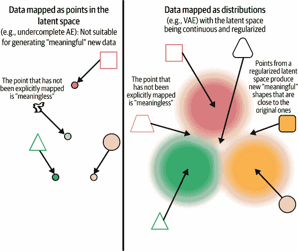
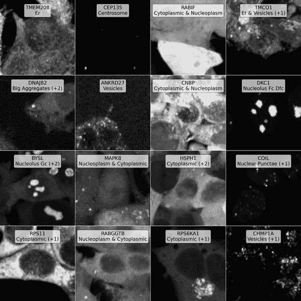
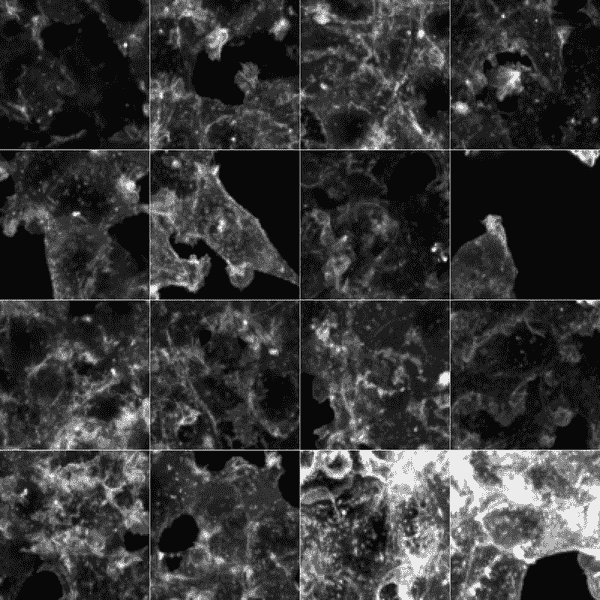
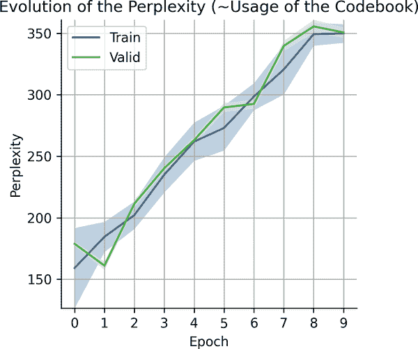
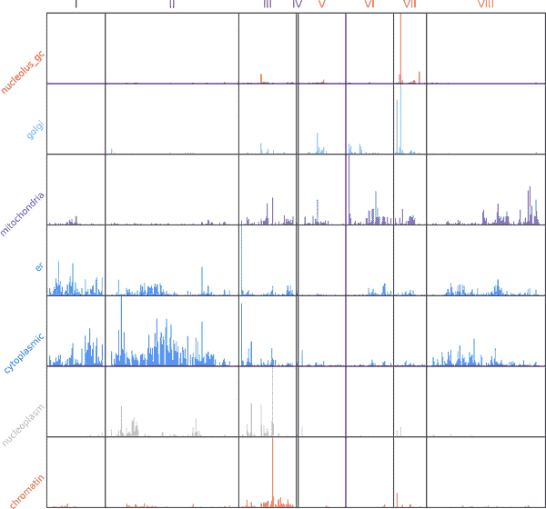
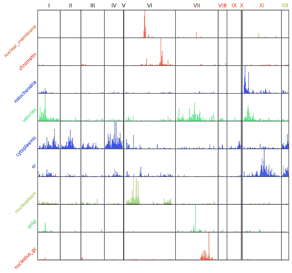
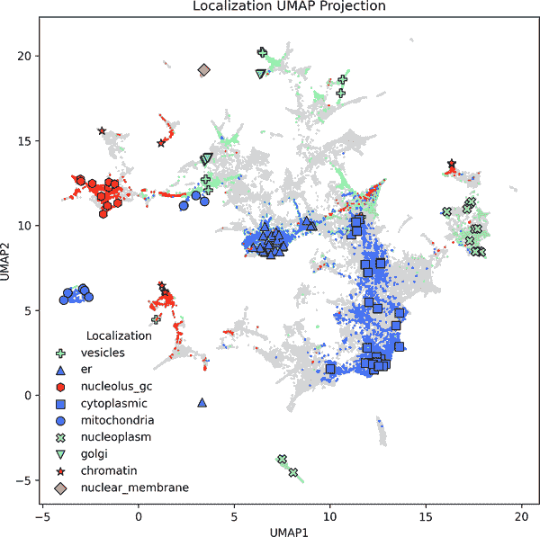

# 第六章\. 在细胞内学习空间组织模式

在本章中，我们将重点从分类高级细胞状态（例如区分癌组织与正常组织）转移到更基础和低级的内容：理解单个细胞内的*空间组织*。具体来说，我们将训练一个深度学习模型来分析显微镜图像，并学习蛋白质在细胞中的确切位置，这项任务被称为*蛋白质定位*。

蛋白质定位在细胞生物学中起着至关重要的作用。蛋白质在细胞内的位置——例如，它是否位于细胞核或线粒体中——通常决定了其功能。蛋白质的错误定位与许多疾病有关，即使蛋白质的结构是正常的（即，没有突变或改变）。多亏了现代荧光显微镜，我们可以直接观察蛋白质在细胞中的位置，但产生的图像通常是高维的、噪声的，并且难以大规模解释。

与前面的章节不同，这里的目的是不是严格优化特定分类或回归任务上的准确度、召回率或精确度等指标。相反，我们将训练一个模型，直接从原始显微镜图像中学习蛋白质定位的*潜在表示*。你可以将*潜在空间*视为模型的内部地图——一个压缩的表示，其中具有相似定位模式的蛋白质被分组在一起，即使没有明确的标签。这种方法属于*表示学习*：目标是揭示数据中的有意义结构，反映生物模式。

为什么关注表示学习而不是仅仅为特定感兴趣的任务训练一个分类器？在许多生物环境中，尤其是在蛋白质定位中，我们没有干净、全面的标签。我们不想强迫模型解决一个狭窄、预定义的任务，而是希望它学习数据的*丰富内部表示*，捕捉蛋白质之间的空间模式和相似性。这些表示可以用于聚类、可视化、识别未知的细胞区室，或理解蛋白质定位在细胞类型或条件之间的变化。这与大型语言模型学习通用表示的单词或句子类似，这些表示可以用于许多下游任务。

本章中我们建模蛋白质定位的方法基于*cytoself*，这是一种在 2022 年发表在*Nature Methods*上的自监督深度学习方法.^(1) 该模型结合了图像重建（重建显微镜输入图像）和预测蛋白质身份的辅助任务，以学习一个丰富且可解释的嵌入空间，反映生物定位模式。

与前几章不同，模型的输出主要不是一个分类标签或回归分数。相反，对于给定的一种荧光标记蛋白的显微镜图像，它产生一个*嵌入*——在潜在空间中的一个位置——该位置捕捉了蛋白定位的空间特征。然后，这些嵌入可以被可视化、聚类或与已知的注释进行比较。

这是本书中最先进的一章。你将使用一个大型、真实世界的显微镜数据集，并从头开始实现自定义的向量量化变分自编码器（VQ-VAE）。这一章带你深入到自监督学习、大规模图像处理和细胞的空间组织，并重现了最近一篇深度学习生物学论文的核心结果。

###### 警告

比任何前几章都强烈建议，在阅读时保持配套的 Colab 笔记本打开。你可能需要缩小模型以适应内存限制，但积极运行代码将巩固你的理解，并为你提供探索的空间。

要运行完整规模的模型，我们建议使用像 A100 这样的强大 GPU。这些 GPU 可以通过 Google Colab Pro、Kaggle Notebooks（带升级）、Google Cloud Platform（GCP）或 AWS EC2 等平台获得。

# 生物学入门

细胞首次由英国科学家[罗伯特·胡克](https://oreil.ly/6JmDd)在 1665 年观察到，他使用显微镜描述了其在软木组织中的结构。从那时起，显微镜已经成为生物学最基本工具之一。现代显微镜允许研究人员以惊人的细节可视化活细胞，并且越来越多地，能够以大规模捕获这些数据。

显微镜现在在生物医学研究的许多领域都处于核心地位。例如，制药公司通常会通过成像成千上万的处理过的细胞来常规筛选药物候选物的效果，然后使用机器学习模型以自动化的方式评估细胞反应。细胞看起来是活的还是死的？它的可观察结构是否会对特定的药物化合物做出反应而发生变化？细胞在治疗后的分裂速度是加快还是减慢？

尽管显微镜在捕捉生物细节方面具有强大的能力，但显微镜数据可能难以分析。细胞在大小、形状和外观上自然存在差异，成像和样本制备过程本身也会引入噪声和伪影。此外，与基因组不同，基因组在一定程度上可以与一个普遍的“参考”基因组进行比较，细胞没有“基准细胞”或标准化的坐标系，这可能会使分析变得困难。而且显微镜可能会挑战计算资源：高分辨率显微镜产生大量数据，可能会对内存和计算造成压力。

传统上，显微镜图像分析依赖于手动定义的手工工程特征。例如，在药物筛选实验中，科学家可能会测量化合物是否会导致细胞缩小、膨胀或变形——这些迹象表明药物正在影响细胞健康或行为。为此，研究人员会使用经典图像处理技术（包括阈值、边缘检测和形态学操作，这些操作在图像中操纵形状以清除噪声、填充间隙或分离接触的细胞）提取诸如细胞大小、形状、亮度或纹理等属性。然后，将这些特征输入相对简单的模型，如逻辑回归或决策树，以预测细胞结果。

###### 注意

这种早期的显微镜图像分析方法需要领域专业知识来决定哪些特征是重要的，而且它们经常错过人类肉眼不易察觉的微妙模式。深度学习改变了这一点：现代卷积神经网络（CNN）可以直接从原始像素中学习提取有意义的特征，捕捉复杂的视觉线索，而不依赖于手工制定的规则。

这些在图像分析方面的进步为探索更深入的生物学问题打开了大门——包括蛋白质在细胞内的空间组织方式。

## 细胞内的空间组织

细胞不仅仅是分子的袋子；它们是错综复杂的。亚细胞隔室在数十亿年前进化而来，代表了生物学最基本的原则之一：通过空间组织实现**专业化**。细胞不是让所有东西都在未分化的汤中自由漂浮，而是发展了内部结构，以分隔和协调不同的功能。

所有三个生命领域——细菌、古菌和真核生物——都显示出这种空间复杂性的迹象。在真核细胞（人类、植物、真菌等生物体内的细胞）中，这种组织结构尤为明显。这些细胞包含称为**细胞器**的膜结合隔室，每个细胞器都有其专门的功能，如图图 6-1 所示。


###### 图 6-1\. 欧洲细胞内复杂组织的视觉表示。不同的细胞器将细胞分隔成执行不同专门功能的区域（来自美国国家卫生研究院的插图）。

我们在这里不会深入探讨完整的细胞器闪卡（无需重温高中生物的痛苦经历），但这里简要回顾一下本章中将最相关的结构：

质膜

一层脂质双分子层包裹着细胞，保护其内部环境，并控制物质进出。

核

细胞的指挥中心。它被自己的膜所包围，并容纳着 DNA——遗传蓝图。

细胞质

填充细胞的一种凝胶状物质。大多数细胞活动都发生在这里，许多其他细胞器也在这里。

线粒体

常被称为细胞的“动力工厂”。它们以 ATP 的形式产生能量。从进化的角度来看，它们曾经是自由生活的细菌，与早期细胞形成了互利共生的合作关系。

内质网（ER）

有两种类型。*粗面内质网*上布满了核糖体（蛋白质制造工厂）并帮助合成蛋白质。*平滑内质网*处理脂质和解毒。

高尔基体

细胞的配送中心。它修改、包装并将蛋白质和脂质运送到它们的最终目的地。

在了解了细胞区室的基础知识后，让我们转向蛋白质定位。

## 蛋白质定位

每种蛋白质的生命开始方式都是相同的：它从基因转录成信使 RNA（mRNA）在细胞核中，然后由细胞质中的核糖体将其翻译成氨基酸链。但从那里开始，事情变得在空间上更加复杂。

蛋白质一旦合成，它不会随意漂浮。它会被运送到细胞内的一个特定目的地，由一种分子邮政编码引导。一些蛋白质被运送到细胞核，其他被运送到线粒体、细胞膜或内质网。这个过程被称为*蛋白质定位*，对于正常的细胞功能至关重要。

蛋白质的位置通常与其分子结构一样重要。即使是一个结构完美的蛋白质，如果它出现在错误的位置，也无法发挥作用。例如，DNA 聚合酶蛋白质需要在细胞核内才能执行其复制 DNA 的功能。如果它最终出现在细胞质中，它实际上就变得毫无用处。另一方面，一些蛋白质并不局限于特定的位置。例如，肌动蛋白蛋白质遍布整个细胞，它有助于维持细胞的形状并使细胞能够移动。

蛋白质定位错误——当蛋白质最终出现在错误的空间时——是疾病的关键驱动因素。例如，在肌萎缩侧索硬化症（ALS）中，蛋白质 TDP-43 积累在神经元的细胞质中，尽管它的正常位置是在细胞核中。2 蛋白质并没有发生突变、错误折叠或以异常的数量存在——它只是简单地出现在了错误的位置。而仅仅这一点就足以破坏细胞功能并引发疾病。

另一个例子是肿瘤抑制因子 BRCA1，它通常有助于修复细胞核中的 DNA。在一些乳腺癌和卵巢癌中，BRCA1 被错误地定位到细胞质中，在那里它无法再执行其修复功能，尽管蛋白质本身在结构上可能完全正常。3

## 理解蛋白质定位

蛋白质一旦合成，它是如何最终到达细胞正确部分的？答案在于蛋白质中嵌入的短氨基酸序列，这些序列就像分子邮政编码。这些地址标签被细胞的运输机械识别，并将蛋白质引导到它们正确的目的地：细胞核、线粒体、质膜等。

###### 警告

这个系统的规则仍然只有部分被理解。许多蛋白质定位到多个细胞器中。有些在压力或疾病条件下会误定向。还有一些似乎难以归类。

即使在健康细胞中，我们还没有一个完整的地图来显示所有人类蛋白质的去向——或者这些定位如何随细胞类型、发育阶段或环境条件的变化而变化。

详细绘制蛋白质定位景观是细胞生物学中的一个重大开放挑战。大规模理解蛋白质定位可能：

揭示新的、以前未知的亚细胞器

可能会令人惊讶，但我们仍在发现细胞内部的根本结构。近年来，研究人员已经确定了*外核区*（哺乳动物细胞中的细胞质 DNA 区室）、*旁核小体*和*核小体*（参与 RNA 处理的膜无核体），甚至发现了新的整个细胞器。最新的例子是*硝化体*，这是一种在 2024 年最近在海洋藻类中发现的固氮细胞器。^([4)] 这些发现显示了关于细胞内部结构的更多未知领域。

帮助分配功能给注释不良的蛋白质

如果一个蛋白质持续定位到线粒体，你可以假设它在能量代谢或细胞凋亡（程序性细胞死亡）中发挥作用，这些是线粒体的关键功能。例如，我们在本章研究的细胞自体模型将几个以前未表征的蛋白质与已知的线粒体蛋白质分组，导致研究人员提出它们可能参与氧化磷酸化——细胞在细胞器基质中生成 ATP 的过程。

检测标记疾病的早期细胞变化

蛋白质定位的改变可以作为各种疾病的早期预警信号。例如，我们之前提到在肌萎缩侧索硬化症（ALS）中，蛋白质 TDP-43 从细胞核移动到细胞质，但令人惊讶的是，这种变化已经在携带疾病相关突变的先兆症状个体中被观察到。^([5)] 更广泛地说，对定位模式的规模化分析可以帮助检测广泛条件下早期细胞功能障碍。

纠正蛋白质错位定位的疗法

在蛋白质在物理上功能正常但最终定位错误的地方，一种治疗策略是使用工程化的定位信号恢复其正确的定位。例如，研究人员已经使用核定位信号将肿瘤抑制因子如 p53 或 BRCA1 重新定向回细胞核，在那里它们可以恢复其正常功能。

更好的治疗靶向

另一种方法是引导药物、蛋白质或纳米颗粒到特定的亚细胞器，如溶酶体或线粒体，以最大化其效果并最小化副作用。这种策略在新兴的纳米医学平台上被使用。^([6)]

想象一下，你不仅能说出蛋白质做什么，还能说出它在哪里做——以及它的旅程如何随着细胞的分裂、分化或开始疾病分解而改变。

理想情况下，这让你对蛋白质定位空间有多么激动人心有了感觉。现在让我们深入了解机器学习如何帮助我们探索它。

# 机器学习入门

本章我们将构建的模型——来自之前提到的 Kobayashi 论文中的细胞自我——基于一种称为*向量量化变分自动编码器（VQ-VAE）*的神经网络类型。如果你之前没有见过这种类型的模型，不要担心：我们将逐步介绍导致此模型的关键思想，以便你不仅理解我们正在构建什么，还理解它为什么有效。

为什么使用 VQ-VAE？与大多数将图像映射到连续特征空间的模型不同，VQ-VAE 迫使模型使用一组有限的、学习到的视觉模式来描述每张图像，这些模式被称为*代码簿*。你可以将其想象成一个瓷砖集或视觉词汇表，其中每个模式在许多输入中都被重复使用。这鼓励模型使用离散的构建块来表示每个蛋白质图像，使其更容易根据相似的定位对蛋白质进行分组，并揭示共享的视觉模式。换句话说，模型不是为每个输入发明新的坐标，而是说：“这种蛋白质看起来像是瓷砖#7 和瓷砖#241 的混合体。”

这种类型的表示在生物学中特别有用，因为我们试图在数据中*发现*结构，而不仅仅是重建它。这种离散性也使得模型更具可解释性，并允许下游工具（如聚类或降维）更有效地工作。

## 自动编码器（AEs）

让我们从 VQ-VAE 缩写中最后也是 arguably 最重要的一部分开始：AE，*自动编码器*。

自动编码器是一种经过训练以重建其输入的神经网络。它通过以下两个步骤来完成：

1.  一个*编码器*将输入压缩成一个低维度的表示。

1.  然后，一个*解码器*试图从那个压缩版本中重建原始输入。

在最简单的情况下，编码器和解码器可能都由全连接线性层组成。内部表示，称为瓶颈，通常比输入具有更少的神经元，迫使模型压缩数据，如图图 6-2（来自“自动编码器简介”的图表）所示。（^(7）


###### 图 6-2\. 自动编码器通过强制输入通过一个低维度的“瓶颈”来学习其输入的压缩内部表示。该网络被训练从瓶颈表示尽可能精确地重建原始输入。

瓶颈层迫使模型提炼数据中最重要的模式，同时丢弃无关的细节。这是一种降维形式，与主成分分析（PCA）等技术精神相似。但与 PCA 不同，自动编码器可以学习非线性变换并扩展到大型、复杂的数据集，这使得它们对于像显微镜图像这样的数据特别强大。

一个重要的细节：在标准自动编码器中，内部表示——瓶颈层中神经元的激活——是*连续的*。这意味着瓶颈层中的每个神经元可以取任何实数（如 1.27、-3.14 等），因此每个输入的表示都存在于一个连续空间中。这给模型带来了很大的灵活性，但也可以使潜在空间的结构更少，更难以解释。两个看起来相当相似输入可能映射到潜在空间中的遥远点，理解每个维度代表什么可能很困难。

之后，我们将看到 VQ-VAEs 如何通过引入一组固定的允许*代码*来解决这一问题。不是让编码器输出任意值，而是迫使它从一组离散的潜在向量字典中选择——这种设计使表示更有结构、可压缩和可解释。当然，这也伴随着权衡：模型牺牲了连续表示的一些表达能力，以换取一个更受限制和可解释的潜在空间。

###### 小贴士

Cytoself 使用 ResNet 风格的 CNN 作为其编码器。如果您想复习 CNN 和 ResNets，请参阅前一章对这些主题的解释。

## 变分自动编码器（VAEs）

现在我们已经介绍了常规自动编码器，让我们看看一种添加了转折——并开启了强大生成能力之门的变体。在*VAE*中的*V*代表*变分*。在*变分自动编码器*中，我们不再将每个输入（如显微镜图像）压缩到潜在空间中的单个点。相反，模型学习将每个输入表示为潜在空间上的*概率分布*。这有点难以理解，所以让我们一步一步地分解它。

在标准自动编码器中：

+   编码器接收输入并生成一组固定的数字：每个瓶颈层中神经元的激活值。

+   这些数字描述了潜在空间中的一个单一点。

+   解码器随后使用该点来重建输入。

在变分自动编码器中：

+   编码器为每个潜在维度输出两个数字：一个*均值*和一个*标准差*。

+   这些定义了潜在空间中每个坐标的正态分布——一个钟形曲线。

+   而不是向解码器提供固定数量的值，模型从每个分布中采样一个值。

为了使这一点更具体：

+   在标准自动编码器中，给定的输入可能被压缩到潜在空间中的一个单独的点，例如，瓶颈层有三个神经元时，`[1.3, -0.7, 1.9]`。这个确切的向量被*直接*传递给解码器以重建输入。

+   在变分自动编码器中，编码器相反地输出两个独立的向量：

    +   一个用于均值（例如，`[1.3, -0.7, 1.9]`）

    +   以及一个用于标准差（例如，`[0.2, 0.5, 0.1]`）

这通常是通过一个共享的隐藏层后面跟着两个并行线性层来完成的：一个预测均值，另一个预测标准差。所以，在这个例子中，编码器总共输出六个值：三个均值和三个标准差。

一起，这些描述了一个 3D 高斯分布：不是一个单独的点，而是一团可能的值。在训练过程中，模型从这个分布中随机采样一个向量；例如：

+   类似于从以`1.3 ± 0.2`为中心的分布中得到的`1.1`

+   `-0.5` 来自 `-0.7 ± 0.5`

+   `1.7` 来自 `1.9 ± 0.1`

样本向量——在这个例子中，`[1.1, -0.5, 1.7]`——实际上是传递给解码器进行重建的。

### 为什么添加随机性？

起初，引入随机性可能听起来像是不必要的模糊：为什么不坚持使用固定的编码呢？但这个设计选择有几个强大的好处：

它平滑了潜在空间。

因为模型为相同的输入采样了略微不同的编码，它学会了将附近的点解码成相似输出。这迫使潜在空间变得平滑、连续且有意义——空间中的小移动会导致输出中的小、现实的变化。

它将相似的输入分组在一起。

相似的输入产生相似的分布，因此它们的样本在潜在空间中重叠。这自然会将相似的数据点拉近，帮助模型在数据集中学习结构。

它防止过拟合。

通过在训练过程中引入可控的随机性，模型不能只是记住精确的输入输出对。它必须学习在扰动中保持的规律。

它使生成成为可能。

一旦训练完成，模型可以通过简单地从潜在空间中采样来生成新的、看起来逼真的输出，即使在训练期间没有看到的区域。这使得 VAEs 不仅对重建有用，而且对创意或探索性任务也很有用。

### 连续潜在空间

我们可以使用图 6-3 中的图表来可视化 VAEs 与标准自动编码器中潜在空间结构的不同（基于 Saul Dobilas 的图表）。（^(8）



###### 图 6-3\. 关于正则化连续潜在空间的一种直观思考方式。在标准自动编码器中，点被离散映射，可能无法有意义地推广。在变分自动编码器中，点是从平滑分布中采样的，这使有意义的插值和生成采样成为可能。

此图突出了 VAEs 如何鼓励平滑且连续的潜在空间，从而实现插值和生成，这是与常规自编码器的一个关键区别。

###### 注意

你可能会想：不能使用常规自编码器来将相似的输入分组并用于生成采样吗？

在理论上，是的；相似的输入通常在潜在空间中会靠近，你可以尝试从中采样。但无法保证空间是平滑、连续或具有意义的。某些区域可能解码成无意义的内容，而在潜在空间中的微小变化可能会导致输出中出现大而不可预测的跳跃。

VAEs 通过明确 *塑造潜在空间* 来解决这个问题。它们使用概率分布和正则化来鼓励模型以更结构化和一致的方式使用空间。

在我们能够理解这一章架构之前，还有一个概念需要介绍：*向量量化*。

## 向量量化变分自编码器（VQ-VAEs）

在 *VQ-VAE* 中的 *VQ* 代表 *向量量化*，这是一种从信号处理和数据压缩中借用的经典技术。其核心是，向量量化意味着将连续的输入，例如浮点向量，捕捉到一组允许的向量中的最近匹配项。这个集合被称为 *码本*。

为了使这一点具体化：

+   假设我们的码本中只包含两个向量：`[2, 0.5]` 和 `[1, -3]`。

+   现在假设编码器输出 `[1.8, 0.3]`。

+   VQ-VAE 不将这个连续向量传递给解码器，而是找到最近的码本条目——在这种情况下，`[2, 0.5]` ——并用该向量 *替换* 编码器的输出。

这个“捕捉”过程被称为 *量化*。你可以将其想象为将连续输入四舍五入到最近的可用选项。解码器从未看到原始编码器的输出，只看到捕捉到的码本向量。

这使得 VQ-VAEs 与变分自编码器或标准自编码器不同：而不是学习一个连续的潜在空间，该模型学习一个 *离散的嵌入词汇表* 并使用它来表示它所看到的一切。通过将编码器的输出压缩到一组有限的离散向量中，模型鼓励其在表示中的鲁棒性、可解释性和可重用性，这些都特别有助于下游任务，如聚类或生物发现。

### 码本从哪里来？

VQ-VAE 中的码本是在训练过程中 *学习到的*。就像编码器和解码器中的权重一样，码本中的向量最初是随机的，并通过反向传播逐渐细化。随着时间的推移，向量适应以表示数据中的重复和有意义模式，因此模型在将编码器输出捕捉到有用的表示方面变得更好。

### 码本应该有多大？

没有一种适合所有情况的答案：最优的向量数量取决于你的数据和目标。一个*更大的代码簿*（例如，1,024+条条目）允许在输入之间进行更精细的区分。一个*较小的代码簿*（例如，64–128）迫使模型更频繁地重用模式，这有助于泛化和可解释性。

在像蛋白质定位这样的生物成像任务中，代码簿的大小通常在 128 到 512 之间，这取决于蛋白质的数量、定位模式的分辨率以及表达性和可解释性之间所期望的平衡。例如，Cytoself 使用两个包含 2,048 个条目的代码簿，每个由 64D 向量组成——一个用于全局表示，一个用于局部——使模型具有丰富的能力来表示复杂的空间模式。

## 解构 VQ-VAE 图表

现在我们已经涵盖了关键构建块——自动编码器、变分推理和向量量化——我们准备解释原始的 VQ-VAE 图表，如图图 6-4^(9)所示。


###### 图 6-4\. 基于 van den Oord 等人（2017）的 VQ-VAE 主要组件的示意图。

下面是对上述 VQ-VAE 图表中发生的事情的逐步分解：

1. 输入图像（最左边是狗的照片）

该过程从原始输入图像开始；这里，输入是一张狗的照片。在我们的案例中，这将是一张显示蛋白质定位的显微镜图像。图像被传递到一个 CNN 编码器，它提取有意义的特征并将图像转换成一个压缩的潜在表示。

这种表示形式显示为*标记为`ze`的立方体*（变量`z`通常用来表示嵌入）。它是一个 3D 张量，因为 CNN 将图像处理成伪图像，称为特征图，这些特征图突出了输入的特定部分。这个立方体包含了输入的蒸馏、连续版本，它将是接下来使用代码簿进行量化的内容。

2. 量化步骤（左立方体右侧的点）

立方体`ze`中的每个向量——连续编码器的输出——都被传递到*向量量化步骤*。这一步骤将网格中的每个 D 维向量（D = 64 对于 cytoself）与学习到的*代码簿*（`e[1]`，`e[2]`，…，`e[k]`）中的每个条目进行比较，如图表顶部所示。

模型然后将该向量替换为最近的代码簿向量，将其固定到最接近的匹配项。这创建了一个新的张量`zq`，它是编码器输出的量化版本，其中每个原始向量都被代码簿中的一个离散向量所替换。

3. 解码器（右边的立方体）

一旦量化，解码器输入 `zq`（右侧立方体）被传递到**解码器**（“CNN”箭头），它也是一个 CNN。其任务是尽可能精确地重建原始图像。在这个图中，解码器输出显示为狗的第二幅图像，视觉上与输入相似。对于我们这一章来说，这将是一个重建的显微镜图像。

重构与原始输入越接近（即，重构损失越低），则模型在量化表示中编码有意义信息的程度就越好。

4. 代码簿嵌入空间（最右侧）

最右侧的图面板显示了嵌入空间的**放大视图**，即代码簿中的向量集。中心点（带有边框和箭头）代表编码器的原始输出向量 `ze`，它位于连续空间中的某个位置。模型将其映射到最近的代码簿向量，这里显示为 `e[2]`。这个映射值成为量化输出 `zq`。

箭头表示**训练信号**：在学习过程中，编码器被微调以产生更接近它们映射到的代码簿条目的输出。这随着时间的推移提高了量化的效率，并确保代码簿条目实际上被使用。

这开始涉及到 VQ-VAE 的训练策略，因此现在让我们明确地讨论这个主题。

## 训练 VQ-VAE

现在我们已经大致了解了 VQ-VAE 的结构，让我们看看它是如何被训练的。

训练 VQ-VAE 涉及到优化不仅仅是**重构损失**，即输出图像与原始输入的匹配程度。模型还需要随着时间的推移**细化代码簿向量**，并确保编码器学习到的表示能够干净利落地映射到这些向量上。这在这三个组件之间创造了一个有趣的平衡：

编码器表示的质量

编码器如何有效地捕捉输入数据中的有意义信号？

代码簿的有用性和覆盖率

代码簿是否提供了足够的多样性来表示广泛的输入，并且所有条目是否都被有效地使用？

解码器从量化码中重建的能力

解码器仅使用压缩的离散表示，能有多准确地恢复原始输入？

在训练 VQ-VAEs 时存在一些独特的挑战需要我们注意：

量化误差

如果最近的代码簿向量匹配不佳，则在量化过程中会丢失一些细节，导致重构受损。

关键是确保你的代码簿足够大，并且你的编码器足够灵活，能够产生接近有用条目的嵌入。

代码簿坍缩

如果在训练过程中只重复使用少数代码簿向量，而忽略其他向量，则模型会浪费容量。防止这种情况需要训练过程中的额外关注：

承诺损失

这个损失项鼓励编码器通过惩罚编码器输出与其最近的代码簿条目之间的大差异来坚持选择一个代码簿向量。它防止编码器偏离代码簿太远。

熵惩罚

这鼓励模型更均匀地使用更广泛的代码簿条目，增加了表示的多样性并减少了崩溃。

尽管存在这些挑战，VQ-VAE 仍然是一个强大的架构，尤其是在你需要一个能够产生离散、可解释的表示同时还能直接从数据中学习的模型时。

###### 注意

如果这感觉有点复杂，你并不孤单——最初与现代深度学习模型打交道可能会很有挑战性。但动手实践是建立直觉和流畅性的最佳方式。在下一节中，你将开始自己构建和训练一个 VQ-VAE，应用我们迄今为止所涵盖的所有内容。

# 构建数据集

所有模型都需要良好的数据。在本节中，我们将更详细地探讨如何准备细胞成像数据集以了解蛋白质定位。

## 数据要求

一个高质量的数据集对于成功应用深度学习至关重要。幸运的是，有几种出色的蛋白质定位资源可用。其中之一是 [OpenCell](https://oreil.ly/km_v9)，它提供了标准化、高分辨率的细胞内人类蛋白质图像，如图 图 6-5 所示。

由于所有图像都是使用单个、一致的成像流程拍摄的，因此它们特别适合机器学习。这种一致性确保模型专注于学习蛋白质定位中的生物变异，而不是被无关的成像条件或处理流程的差异所分散。

###### 注意

想要自己探索数据集吗？请访问 [OpenCell](https://opencell.sf.czbiohub.org)，它拥有一个设计精美的界面，使得浏览数据变得快速直观。

本章我们将构建的模型完全依赖于成像数据；在训练过程中不使用任何标签或注释。这是一个主要优势：它直接从原始显微镜图像中学习定位模式，而不需要任何人工监督。虽然 OpenCell 提供了定位注释，但我们只会在最后使用它们来验证我们的结果。过度依赖精心制作的标签可能会引入偏差并限制可扩展性，因为人工标注既昂贵又主观。这正是自监督学习发光的地方——它使模型能够在不需要预定义标签的情况下发现有意义的模式。


###### 图 6-5。OpenCell 数据库中蛋白质 ACTB（β-肌动蛋白）的示例条目。每个蛋白质都有一个详细的摘要页面，包括其标识符（例如，UniProt ID）、序列信息、表达水平（细胞中基因和蛋白质的拷贝数）和亚细胞定位注释。在右侧，你可以看到显示 ACTB 定位（灰色）和核染色（蓝色）的荧光显微镜图像。这些多通道图像与蛋白质特定的元数据一起，构成了本章所使用的数据集的基础。

## 数据来源

为深度学习准备图像本身可能就是一个挑战，尤其是在格式、一致性和规模方面。我们之前在第五章中看到这一点，其中仔细的预处理是必不可少的。幸运的是，cytoself 的作者已经发布了他们在论文中使用的数据集的预处理版本，因此我们在这里不必从头开始。

数据集中包含 1,311 种荧光标记的蛋白质，每种蛋白质在大约 18 个不同的视野中进行成像。从每个视野中，提取大约 45 个单独的裁剪图像，每个裁剪图像通常包含大约三个细胞。这为每个蛋白质产生了大约 800 个图像裁剪，整个数据集总共有超过 1,048,800 个图像。每个图像包括两个通道：

+   绿色的**蛋白质通道**，显示感兴趣荧光标记蛋白质的位置。这是本章训练中使用的唯一通道。

+   使用 Hoechst 的**核染色**，这是一种强烈结合 DNA 的蓝色荧光染料。这突出了细胞的核，提供了空间背景，例如，有助于确定蛋白质是否位于核内、细胞质或膜结合。

从核染色中，计算第三个表示：**到核距离图**。这不是一个单独的成像通道，而是从 Hoechst 信号派生出的空间图，为模型提供了更多关于相对位置的信息：

+   核内的像素被分配正值，代表到核边界的最短距离。

+   核外的像素被分配负值，同样基于到核边缘的最短距离。

为了简化任务，我们将仅使用标记的蛋白质通道进行模型训练。其他通道（Hoechst）和派生的距离图提供了有用的空间背景，但对于这个自监督学习设置不是必需的。

除了图像数据外，数据集还包括：

+   蛋白质注释：例如基因名称和唯一 ID

+   精心定位的标签：手动分配的细胞器或区室类别

这些精心挑选的标签在训练过程中**不**被使用。相反，它们仅在之后用于评估模型是否已经自行学习了具有生物学意义的表示。

###### 警告

与前几章中使用的数据集相比，这个数据集显著更大，在内存使用、数据加载速度和训练效率方面引入了新的挑战。

确保你有足够的磁盘空间，并且能够访问一个强大的 GPU。例如，使用 Colab Pro+提供的 A100，或者准备缩小模型或批量大小以使训练可行。

## 概览数据集

对于更复杂的数据集，通常会将数据加载和预处理逻辑封装在一个自定义的 `Dataset` 类中，正如我们在本书的前几章中所做的那样。这有助于使数据更容易探索并在训练中使用。

首先，让我们使用实用函数 `get_dataset` 来检查数据集中的一些图像帧；参见图 6-6。随机抽取几个帧可以快速揭示数据集中模式和强度变化的多样性：

```py
import jax
from dlfb.localization.dataset.utils import get_dataset
from dlfb.utils.context import assets

rng = jax.random.PRNGKey(42)
rng, rng_frames = jax.random.split(rng, 2)

dataset = get_dataset(data_path=assets("localization/datasets"))
n_frames = 16
dataset.plot_random_frames(n=n_frames, rng=rng_frames);

```

这种多样性是预期的：每张图像对应不同的标记蛋白质，许多蛋白质并不局限于单个细胞器。相反，它们定位到细胞的不同区域，通常具有不同的丰度。这给学习任务增加了另一层复杂性。

有趣的是，这种异质性不仅存在于不同的蛋白质之间，也存在于同一蛋白质的不同细胞中。即使蛋白质和成像装置保持不变，定位模式也可能从细胞到细胞有所不同。



###### 图 6-6\. 随机子集帧的图。每个帧给出了蛋白质符号及其主要定位（数字表示测量的额外次级定位）。

为了说明这一点，我们将加载包含单个蛋白质 ACTB（β-肌动蛋白）所有图像帧的数据集，并绘制几个随机样本。在图 6-7 中，你会看到即使是这种单一蛋白质，由于生物变异性的本质，信号强度、形状和定位也存在相当大的变化——记住，所有帧都是在相同的实验条件下捕获的。

```py
selected_protein = "ACTB"
dataset.plot_random_frames(
  n=n_frames, with_labels=False, rng=rng_frames, gene_symbols=[selected_protein]
);

```



###### 图 6-7\. 显示蛋白质 ACTB（β-肌动蛋白）定位的 16 个图像帧的随机子集，该蛋白质被标注为定位于*膜*、*细胞骨架*和*细胞质*。尽管这些帧都代表在相同实验条件下相同的蛋白质，但它们在形状、亮度和定位模式上显示出相当大的变化，突显了细胞间的固有生物变异性。

让我们现在更仔细地看看图 6-8 中的单个帧，这将让我们更好地了解模型在训练过程中将处理什么。该图故意放大，以便您可以清楚地看到单个像素。试着不要只把图像看作是一幅画，而要把它看作是一个数字矩阵：白色像素的值接近 255，黑色像素接近 0，所有灰度值介于两者之间：

```py
dataset.plot_random_frames(n=1, with_labels=False, rng=rng_frames);

```


###### 图 6-8. 蛋白质 ACTB 的单个图像帧的特写视图。像素化的外观反映了模型将看到的原始输入：一个强度值的二维矩阵。明亮区域对应于高荧光信号（值接近 255），而暗区域对应于低信号（值接近 0）。这是用于学习空间定位模式的实际数值输入。尽管图像在人类眼中可能看起来嘈杂或不清晰，但模型必须学会从中提取一致的模式。

## 实现 DatasetBuilder 类

在这里，我们实现了一个名为`DatasetBuilder`的辅助类，它在幕后处理数据集设置和缓存：

```py
class DatasetBuilder:
  """Builds a dataset with splits for learning."""

  def __init__(self, data_path: str, force_recreate: bool = False):
    self.images = ImageLoader(data_path).load(force_recreate=force_recreate)
    self.labels = LabelLoader(data_path).load(force_recreate=force_recreate)

  def build(
    self,
    rng: jax.Array,
    splits: dict[str, float],
    exclusive_by: str = "fov_id",
    n_proteins: int | None = None,
    max_frames: int | None = None,
  ) -> dict[str, Dataset]:
    """Retrieve a dataset of proteins split into learning sets."""
    validate_splits(splits)

    if not n_proteins:
      n_proteins = self.labels.get_n_proteins()

    # Sample frames from chosen proteins.
    rng, rng_proteins = jax.random.split(rng, num=2)
    frames = self.labels.get_frames_of_random_proteins(rng_proteins, n_proteins)

    n_frames = frames.shape[0]
    if max_frames is not None and n_frames > max_frames:
      # Limit number of frames used.
      frames = frames.head(max_frames)
      n_frames = max_frames

    # Get random entities to exclusively be assigned across splits
    rng, rng_perm = jax.random.split(rng, 2)
    set_ids = jnp.array(frames[exclusive_by].to_numpy(np.int32))
    shuffled_set_ids = jax.random.permutation(rng_perm, jnp.unique(set_ids))

    # Assign consecutive ids to proteins across all frames
    frame_ids = jnp.array(frames["frame_id"].to_numpy(np.int32))
    lookup_with_protein_encoding = self._encode_proteins_across_frames(
      self.labels.lookup.iloc[frame_ids.tolist()]
    )

    # Assemble the dataset by splits considering exclusive sets
    dataset_splits, start = {}, 0
    for name, size in self._get_split_sizes(
      splits, n_sets=len(shuffled_set_ids)
    ):
      mask = jnp.isin(set_ids, shuffled_set_ids[start : (start + size)])
      dataset_splits[name] = Dataset(
        images=self.images,
        labels=Labels(
          lookup=lookup_with_protein_encoding.loc[
            frame_ids[mask].tolist()
          ].reset_index(drop=True)
        ),
      )
      start += size

    return dataset_splits

  def _get_split_sizes(self, splits, n_sets):
    """Convert split fractional sizes to absolute counts."""
    names = list(splits.keys())
    sizes = [int(n_sets * splits[name]) for name in names[:-1]]
    sizes.append(n_sets - sum(sizes))  # Ensure total adds up
    for name, size in zip(names, sizes):
      yield name, size

  def _encode_proteins_across_frames(self, lookup) -> pd.DataFrame:
    """Encode protein labels across dataset to consecutive integers."""
    protein_ids_in_frames = lookup["protein_id"].to_list()
    unique_protein_ids = sorted(set(protein_ids_in_frames))
    mapping = pd.DataFrame(
      [
        {"protein_id": id_, "code": idx}
        for idx, id_ in enumerate(unique_protein_ids)
      ]
    )
    return lookup.merge(mapping, how="left", on="protein_id").set_index(
      "frame_id", drop=False
    )

```

在初始化过程中，我们提供数据存储的路径。这允许`DatasetBuilder`创建`Images`和`Labels`的链接实例。您还可以看到`DatasetBuilder`有一个公共方法`.build`，它返回一个`dict[str, Dataset]`，其中每个键是数据集分割，值对应于数据集。此方法允许您将数据集子集化到随机选择的有限数量的蛋白质（`n_proteins`）和/或最大帧数（`max_frames`）。

它还将数据集分割成不同的学习阶段集合。可以通过`splits`参数提供集合，其中可以请求名称和分数大小。最后，可以通过`exclusive_by`参数请求在分割之间，视场或蛋白质永远不会共享（分别使用`fov_id`或`protein_id`）。前者确保在学习过程中，我们不会无意中在分割之间泄露信息，因为两个帧可能在其他情况下捕获视场中的重叠区域。在训练和评估集中不使用相同的蛋白质确保学习到更通用的表示，正如原始论文中所做的那样。在这里，我们使用`fov_id`，因为我们将限制数据集中的蛋白质数量以加快训练速度。在实现上，我们首先通过独特的视场随机分割数据集，然后在构建分割时，我们屏蔽帧以避免在分割中出现。您还会注意到，我们正在将原始蛋白质 ID 编码为连续整数，正如您稍后将会看到的，这是在训练循环中损失函数所必需的。

### 构建第一个数据集实例

我们现在将查看如何使用`DatasetBuilder`创建`Dataset`分割的实例：

```py
from dlfb.localization.dataset import Dataset
from dlfb.localization.dataset.builder import DatasetBuilder
from dlfb.utils.context import assets

builder = DatasetBuilder(data_path=assets("localization/datasets"))

rng, rng_dataset = jax.random.split(rng, 2)
dataset: dict[str, Dataset] = builder.build(
  rng=jax.random.PRNGKey(42),
  splits={"train": 0.80, "valid": 0.10, "test": 0.10},
  exclusive_by="fov_id",
  n_proteins=50,
)

```

现在我们有了数据集。拥有数据集构建器提供了灵活性，这使得在扩展到完整训练集之前，探索、调试和用数据集的小部分进行原型设计变得容易。

### 访问数据集内部

在幕后，`Dataset` 类包含两个主要组件：`Images` 和 `Labels`。它们分别处理原始显微镜图像数据和元数据注释。

你不需要深入研究它们的实现来跟随本章的内容，但如果你有兴趣，完整的源代码是可用的。底层方法让你可以加载特定的蛋白质，对数据进行子采样，或查询定位注释——这些是进行更深入生物探索或交互式实验的有用工具。

如果你阅读了前面的章节，这种模块化数据结构应该很熟悉。我们组装来自不同块的数据，使用内存映射处理大型数组，并将所有内容包装成 Python 类以提高便利性和速度。当然，你可以进行许多改进，以允许更快地访问更大的数据集，而 [TensorStore](https://oreil.ly/m29ho) 在这里确实勾选了很多框。

现在我们已经检查了数据的结构和加载方式，让我们继续训练我们的第一个模型。

# 构建原型模型

在本节中，我们将构建我们之前介绍的细胞自我模型的简化版本。目标是提取核心架构思想，形成一个易于理解、训练和修改的相对紧凑的原型。这里的代码实现部分改编自官方 [Haiku VQ-VAE 仓库](https://oreil.ly/KF0A0) 和 Arnaud Aillaud 的 [VQ-VAE Flax 实现](https://oreil.ly/z-ZXk)。

我们故意省略了原始工作中的一些更复杂的功能，例如分割量化、分层向量量化和多分辨率训练，以便使代码易于访问并专注于关键机制。这也使得对模型进行修改和探索自己的架构实验变得更加容易。关于模型可能的扩展，请参阅本章的最后一节以获取更多信息。

## 定义 `LocalizationModel`

以下代码定义了本章我们将使用的核心模型：

```py
class LocalizationModel(nn.Module):
  """VQ-VAE model with a fully connected output head."""

  embedding_dim: int
  num_embeddings: int
  commitment_cost: float
  num_classes: int | None
  dropout_rate: float
  classification_head_layers: int

  def setup(self):
    """Builds the encoder, decoder, quantizer, and output head."""
    self.encoder = Encoder(latent_dim=self.embedding_dim)
    self.vector_quantizer = VectorQuantizer(
      num_embeddings=self.num_embeddings,
      embedding_dim=self.embedding_dim,
      commitment_cost=self.commitment_cost,
    )
    self.decoder = Decoder(latent_dim=self.embedding_dim)
    self.classification_head = ClassificationHead(
      num_classes=self.num_classes,
      dropout_rate=self.dropout_rate,
      layers=self.classification_head_layers,
    )

  def __call__(self, x: jax.Array, is_training: bool):
    """Runs a forward pass."""
    ze = self.encoder(x)
    zq, perplexity, codebook_loss, commitment_loss = self.vector_quantizer(ze)
    decoded = self.decoder(zq)
    logits = self.classification_head(
      zq.reshape((zq.shape[0], -1)), is_training
    )
    return decoded, perplexity, codebook_loss, commitment_loss, logits

  def create_train_state(
    self, rng: jax.Array, dummy_input: jax.Array, tx
  ) -> TrainState:
    """Initializes training state."""
    rng, rng_init, rng_dropout = jax.random.split(rng, 3)
    variables = self.init(rng_init, dummy_input, is_training=False)
    return TrainState.create(
      apply_fn=self.apply, params=variables["params"], tx=tx, key=rng_dropout
    )

  def get_encoding_indices(self, x: jax.Array) -> jax.Array:
    """Returns nearest codebook indices for input."""
    ze = self.encoder(x)
    encoding_indices = self.vector_quantizer.get_closest_codebook_indices(ze)
    return encoding_indices

```

这个模型是用我们之前介绍的主要组件定义的：

编码器

将输入图像映射到潜在空间

向量化量化器

使用学习到的代码簿将这个潜在空间离散化

解码器

从量化表示中重建输入图像

这些都在模型的 `setup` 方法中连接在一起。你还会注意到一个额外的组件，即 `ClassificationHead`，我们稍后会回到这个话题。现在，只需知道它用于缓解之前提到的代码簿崩溃问题，这是一种模型只使用代码簿中一小部分条目，从而降低潜在空间表示能力的失败模式。

在接下来的章节中，我们将逐一介绍模型的各个部分，从 `Encoder` 开始，它负责从输入显微镜图像中提取潜在特征。

## 编码器：处理输入图像

`编码器` 是我们模型的第一部分，负责将原始输入图像转换为连续的潜在表示。其主要任务是处理输入，使其成为 `VectorQuantizer` 可以处理的形式——每个像素都有丰富、表达性强的空间特征图。这种潜在表示将随后被 `VectorQuantizer` 离散化，因此它需要具有正确的形状和维度。

编码器由三个卷积层和两个残差块组成：

+   前两个卷积层将图像整体下采样为 4 倍（每个的步长为 2），降低空间分辨率同时增加特征维度性。

+   第三个卷积层保持空间分辨率，但加深了特征图。

+   两个 `ResnetBlock` 通过归一化、非线性跳过连接进一步细化特征。

一起，这形成了一个管道，将 100 × 100 的灰度图像转换为 `latent_dim` 维度的特征向量的小网格，为量化做好准备：

```py
class Encoder(nn.Module):
  """Convolutional encoder producing latent feature maps."""

  latent_dim: int

  def setup(self):
    """Initializes convolutional and residual layers."""
    self.conv1 = nn.Conv(
      self.latent_dim // 2, kernel_size=(4, 4), strides=(2, 2), padding=1
    )
    self.conv2 = nn.Conv(
      self.latent_dim, kernel_size=(4, 4), strides=(2, 2), padding=1
    )
    self.conv3 = nn.Conv(
      self.latent_dim, kernel_size=(3, 3), strides=(1, 1), padding=1
    )
    self.res_block1 = ResnetBlock(self.latent_dim)
    self.res_block2 = ResnetBlock(self.latent_dim)

  def __call__(self, x):
    """Forward pass applying convolution and residual blocks to input."""
    x = self.conv1(x)
    x = nn.relu(x)
    x = self.conv2(x)
    x = nn.relu(x)
    x = self.conv3(x)
    x = self.res_block1(x)
    x = self.res_block2(x)
    return x

class ResnetBlock(nn.Module):
  """Residual convolutional block with GroupNorm and Swish activation."""

  latent_dim: int

  def setup(self):
    """Initializes normalization and convolutional layers."""
    self.norm1 = nn.GroupNorm()
    self.conv1 = nn.Conv(
      self.latent_dim, kernel_size=(3, 3), strides=(1, 1), padding=1
    )
    self.norm2 = nn.GroupNorm()
    self.conv2 = nn.Conv(
      self.latent_dim, kernel_size=(3, 3), strides=(1, 1), padding=1
    )

  def __call__(self, x):
    """Applies two conv layers with Swish activation and skip connection."""
    h = nn.swish(self.norm1(x))
    h = self.conv1(h)
    h = nn.swish(self.norm2(h))
    h = self.conv2(h)
    return x + h

```

如您所见，我们传递给 `Encoder` 的唯一参数是 `latent_dim`。这控制着网络将输出多少通道；换句话说，潜在空间中每个空间位置的表达性如何。在我们的完整模型中，这被设置为 `embedding_dim`，以确保编码器的输出与 `VectorQuantizer` 预期的维度相匹配。

在 `LocalizationModel` 模型实例化的上下文中，它被设置为 `self.embedding_dim`，因为 `Encoder` 必须将原始输入图像编码成与量化步骤兼容的形式；换句话说，它需要具有兼容的形状。在 VQ-VAE 的上下文中，这与量化潜在空间维度直接相关，因为它需要返回正确形状的编码图像，以便进行量化过程。

`ResnetBlock` 使用 *分组归一化* 和 *swish* 激活函数，这是一个受到更近期的扩散模型（如 *stable diffusion*）启发的选择。快速提醒一下，残差块的关键思想是输出通过残差学习进行细化：而不是从头开始尝试学习输入的完整变换，网络学习在输入之上进行校正。这通常有助于梯度流和泛化。

在编码器结束时，我们得到一个形状为 `[batch_size, height, width, latent_dim]` 的空间特征图，然后将其传递到 `VectorQuantizer`。这完成了 VQ-VAE 架构的编码阶段。

###### 注意

你可以更改此编码器的各个部分——卷积核、层数、激活函数、步长等。为了简单起见，我们在这里不将这些作为参数暴露给`Encoder`，但这些都是你可以尝试调整以优化性能的超参数。

## 向量量化器：将嵌入离散化

`VectorQuantizer`是 VQ-VAE 的核心——这是我们连续嵌入转换为离散代码的地方。这一步迫使模型承诺于一个有限的学习特征向量词汇表，提高压缩并鼓励有意义的、可重用的表示。

让我们分解`VectorQuantizer`模块的关键组件：

```py
class VectorQuantizer(nn.Module):
  """Vector quantization module for VQ-VAE."""

  num_embeddings: int
  embedding_dim: int
  commitment_cost: float

  def setup(self):
    """Initializes the codebook as trainable parameters."""
    self.codebook = self.param(
      "codebook",
      nn.initializers.lecun_uniform(),
      (self.embedding_dim, self.num_embeddings),
    )

  def __call__(self, inputs: jax.Array):
    """Applies quantization and returns outputs with losses and perplexity."""
    quantized, encoding_indices = self.quantize(inputs)
    codebook_loss, commitment_loss = self.compute_losses(inputs, quantized)
    perplexity = self.calculate_perplexity(encoding_indices)
    ste = self.get_straight_through_estimator(quantized, inputs)
    return ste, perplexity, codebook_loss, commitment_loss

  def quantize(self, inputs: jax.Array):
    """Snaps inputs to nearest codebook entries."""
    encoding_indices = self.get_closest_codebook_indices(inputs)
    flat_quantized = jnp.take(self.codebook, encoding_indices, axis=1).swapaxes(
      1, 0
    )
    quantized = jnp.reshape(flat_quantized, inputs.shape)
    return quantized, encoding_indices

  def get_closest_codebook_indices(self, inputs: jax.Array) -> jax.Array:
    """Returns indices of closest codebook vectors."""
    distances = self.calculate_distances(inputs)
    return jnp.argmin(distances, 1)

  def calculate_distances(self, inputs: jax.Array) -> jax.Array:
    """Computes Euclidean distances between inputs and codebook vectors."""
    flat_inputs = jnp.reshape(inputs, (-1, self.embedding_dim))
    distances = (
      jnp.sum(jnp.square(flat_inputs), 1, keepdims=True)
      - 2 * jnp.matmul(flat_inputs, self.codebook)
      + jnp.sum(jnp.square(self.codebook), 0, keepdims=True)
    )
    return distances

  def compute_losses(self, inputs: jax.Array, quantized: jax.Array):
    """Computes codebook and commitment losses."""
    codebook_loss = jnp.mean(jnp.square(quantized - lax.stop_gradient(inputs)))
    commitment_loss = self.commitment_cost * jnp.mean(
      jnp.square(lax.stop_gradient(quantized) - inputs)
    )
    return codebook_loss, commitment_loss

  def calculate_perplexity(self, encoding_indices: jax.Array) -> jax.Array:
    """Computes codebook usage perplexity."""
    encodings = jax.nn.one_hot(
      encoding_indices,
      self.num_embeddings,
    )
    avg_probs = jnp.mean(encodings, 0)
    perplexity = jnp.exp(-jnp.sum(avg_probs * jnp.log(avg_probs + 1e-10)))
    return perplexity

  @staticmethod
  def get_straight_through_estimator(
    quantized: jax.Array, inputs: jax.Array
  ) -> jax.Array:
    """Applies straight-through estimator to pass gradients through
 quantization.
 """

    ste = inputs + lax.stop_gradient(quantized - inputs)
    return ste

```

下面是`VectorQuantizer`类的关键部分：

代码簿

一个形状为`(embedding_dim, num_embeddings)`的可学习矩阵，使用`lecun_uniform`初始化。每一列是一个代码簿向量——本质上，是一个模型可以与之匹配的原型。这个矩阵定义了离散潜在空间。

量化

`quantize()`函数根据欧几里得距离将每个编码输入向量替换为最近的代码簿向量。这迫使模型使用固定的学习视觉模式词汇表来表达对每个输入帧的理解。

损失

`codebook_loss`

鼓励代码簿向量向编码器输出移动。这更新了代码簿。

`commitment_loss`

鼓励编码器输出承诺于所选的代码簿向量而不是波动。这更新了编码器。两个损失结合以保持编码器稳定性和代码簿使用之间的平衡。

直通估计器（STE）

量化是非可微的：你不能通过硬查找操作进行反向传播。STE 通过复制用于前向传播的量化向量来解决此问题，但传递梯度时仿佛量化从未发生。这是一个标准的技巧，允许通过近似梯度进行训练。

困惑度

一个指标，告诉我们模型使用了多少代码簿向量。高困惑度（接近`num_embeddings`）意味着模型在其许多条目之间分散其注意力。低困惑度意味着崩溃——只使用少数几个向量，这限制了模型的能力。

你可以看到，此模块的参数是`num_embeddings`、`embedding_dim`和`commitment_cost`，它们定义了离散潜在空间的结构：

嵌入数量

确定模型必须从多少个离散向量中选择。更高的数量允许更精细和多样化的表示。

嵌入维度（也称为潜在维度）

定义了每个向量的丰富性。例如，如果它是 64，则每个代码簿条目有 64 个值。更高维度的嵌入可以捕捉更细微的模式，但需要更多数据和计算来有效地训练。

承诺成本

在损失函数中使用的加权因子，用于惩罚偏离其选定码本向量的编码器输出。如果这个值太低，编码器可能会忽略码本。如果太高，编码器可能会过度约束，学习到的表示能力会降低。

这里是`VectorQuantizer`在正向传播过程中通过其`__call__`方法执行的主要工作：

```py
  def __call__(self, inputs: jax.Array):
    """Applies quantization and returns outputs with losses and perplexity."""
    quantized, encoding_indices = self.quantize(inputs)
    codebook_loss, commitment_loss = self.compute_losses(inputs, quantized)
    perplexity = self.calculate_perplexity(encoding_indices)
    ste = self.get_straight_through_estimator(quantized, inputs)
    return ste, perplexity, codebook_loss, commitment_loss

```

此函数执行四个关键操作：

+   量化：它通过用码本中最接近的条目替换每个编码向量来量化输入。

+   损失计算：它计算两个损失项：一个将码本条目拉向编码器输出（`codebook_loss`），另一个鼓励编码器保持在码本条目附近（`commitment_loss`）。

+   混淆度：它计算码本混淆度以评估模型如何充分利用码本条目的全部范围。

+   STE：它通过非可微量化步骤启用反向传播。

让我们更详细地了解一下量化步骤：

```py
  def quantize(self, inputs: jax.Array):
    """Snaps inputs to nearest codebook entries."""
    encoding_indices = self.get_closest_codebook_indices(inputs)
    flat_quantized = jnp.take(self.codebook, encoding_indices, axis=1).swapaxes(
      1, 0
    )
    quantized = jnp.reshape(flat_quantized, inputs.shape)
    return quantized, encoding_indices

  def calculate_distances(self, inputs: jax.Array) -> jax.Array:
    """Computes Euclidean distances between inputs and codebook vectors."""
    flat_inputs = jnp.reshape(inputs, (-1, self.embedding_dim))
    distances = (
      jnp.sum(jnp.square(flat_inputs), 1, keepdims=True)
      - 2 * jnp.matmul(flat_inputs, self.codebook)
      + jnp.sum(jnp.square(self.codebook), 0, keepdims=True)
    )
    return distances

```

在`quantize`中，目标是替换每个输入向量为其在码本中的最近邻。这是通过几个步骤完成的：

+   展平输入，以便我们可以将所有空间位置作为向量列表处理。

+   使用欧几里得距离计算每个输入向量与所有码本向量之间的距离。

+   为每个输入位置找到最近的码本向量（在距离上`argmin`）。

+   使用索引收集相应的码本条目。

+   将量化结果重塑回原始输入形状。

距离是通过`calculate_distances`计算的，它实现了展平输入向量`x`和码本向量`y`之间的平方欧几里得距离。这是基于以下恒等式：

`<mrow><msup><mrow><mo>∥</mo><mi>x</mi><mo>-</mo><mi>y</mi><mo>∥</mo></mrow> <mn>2</mn></msup> <mo>=</mo> <msup><mrow><mo>∥</mo><mi>x</mi><mo>∥</mo></mrow> <mn>2</mn></msup> <mo>-</mo> <mn>2</mn> <mrow><mo>〈</mo> <mi>x</mi> <mo lspace="0%" rspace="0%">,</mo> <mi>y</mi> <mo>〉</mo></mrow> <mo>+</mo> <msup><mrow><mo>∥</mo><mi>y</mi><mo>∥</mo></mrow> <mn>2</mn></msup></mrow>`

这种公式通过矩阵运算有效地计算距离。

总结来说，在正向传播过程中，`VectorQuantizer`为每个编码输入找到最佳匹配的码本向量，将其替换，并使用 STE 启用梯度流动。结果是离散化的潜在表示，它既更有结构又更可解释。

### 计算 VQ-VAE 特定的损失

在手头有了量化嵌入之后，大部分艰苦的工作已经完成。但我们仍然需要评估原始输入被捕捉得有多好。换句话说，我们需要计算*VQ-VAE 特定的*损失：

```py
  def compute_losses(self, inputs: jax.Array, quantized: jax.Array):
    """Computes codebook and commitment losses."""
    codebook_loss = jnp.mean(jnp.square(quantized - lax.stop_gradient(inputs)))
    commitment_loss = self.commitment_cost * jnp.mean(
      jnp.square(lax.stop_gradient(quantized) - inputs)
    )
    return codebook_loss, commitment_loss

```

这里有两个组成部分：

码本损失

这个项衡量了量化向量与原始编码器输出之间的距离。我们希望这个差异很小。理想情况下，量化版本应该几乎与编码器最初产生的输出相同。关键细节是 `inputs` 被包裹在 `lax.stop_gradient` 中。这防止了梯度流向编码器，以便只有代码簿被更新以更好地匹配编码器输出。

承诺损失

这鼓励编码器产生接近代码簿中某个条目的输出。这有助于避免偏离量化值太远。

在这里，`quantized` 被包裹在 `lax.stop_gradient` 中。梯度只流向编码器而不流向代码簿，鼓励它“承诺”使用现有的代码簿向量之一。`self.commitment_cost` 参数将此损失缩放以控制编码器被拉向现有代码簿条目的强度。

这两个损失起着互补的作用：一个将代码簿拉向编码器输出，另一个将编码器拉向代码簿。共同作用，确保模型的这两个部分能够共同适应并随时间稳定，从而产生高质量的量化潜在空间。

### 使用困惑度来衡量代码簿的使用

量化之后，我们想了解模型使用其代码簿的效果如何。它是依赖于几个条目，还是将其注意力分散在许多条目上？这正是 *困惑度* 指标所捕捉的：

```py
  def calculate_perplexity(self, encoding_indices: jax.Array) -> jax.Array:
    """Computes codebook usage perplexity."""
    encodings = jax.nn.one_hot(
      encoding_indices,
      self.num_embeddings,
    )
    avg_probs = jnp.mean(encodings, 0)
    perplexity = jnp.exp(-jnp.sum(avg_probs * jnp.log(avg_probs + 1e-10)))
    return perplexity

```

让我们分解一下：

+   `encoding_indices` 提供了每个输入所选代码簿条目的索引。

+   我们将这些索引进行 one-hot 编码，以统计每个代码簿向量被使用的频率。

+   将这个 one-hot 矩阵的平均值给出代码簿条目的频率分布。

+   我们然后计算这个分布的熵，并将其指数化以获得困惑度。

结果是一个介于 1 和 `num_embeddings` 之间的数字，表示有多少代码簿条目实际上在使用。

### 使用直通估计器

`VectorQuantizer` 的 `__call__` 方法中的最终操作是计算 STE：

```py
  @staticmethod
  def get_straight_through_estimator(
    quantized: jax.Array, inputs: jax.Array
  ) -> jax.Array:
    """Applies straight-through estimator to pass gradients through
 quantization.
 """
    ste = inputs + lax.stop_gradient(quantized - inputs)
    return ste

```

在典型的神经网络中，梯度是通过一系列可微操作的反向传播来计算的。然而，*量化是不可微分的*。它涉及将连续值捕捉到最近的离散代码簿条目，而你不能通过那个步骤来计算梯度。这给基于梯度的优化带来了挑战。

为了解决这个问题，我们使用 STE 技巧。它的工作原理如下：

前向传递

这个表达式的输出是量化的，因此解码器接收离散的代码簿条目。

反向传递

因为 `quantized - inputs` 被包裹在 `stop_gradient` 中，它 *对梯度没有影响*。在反向传播过程中，只有 `inputs` 贡献于梯度。换句话说，STE 输出相对于编码器输入的梯度被视为量化步骤从未发生。

这意味着虽然模型在推理和重建时表现得像量化，但在训练过程中，编码器接收有用的梯度——将量化视为一个恒等函数。使用 STE 对于训练具有离散瓶颈的模型（如 VQ-VAEs）至关重要。它允许我们保持离散潜在空间的表示优势，同时仍然使用梯度下降进行优化，这是现代深度学习的基础。

这涵盖了 VQ-VAE 的核心以及本章最复杂的部分。现在剩下的只是解码器——将量化潜在代码转换回重建图像的最后一部分。

## 解码器：将离散嵌入解码回图像

`Decoder` 是我们 VQ-VAE 模型的最终阶段。从概念上讲，它反映了 `Encoder`，但它不是压缩图像，而是将量化的潜在表示转换回原始图像空间。其任务是将离散、低分辨率的特征图转换回全分辨率灰度图像。

下面是代码：

```py
class Decoder(nn.Module):
  """Decoder module for reconstructing input from quantized representations."""

  latent_dim: int

  def setup(self) -> None:
    """Initializes residual blocks and upsampling layers."""
    self.res_block1 = ResnetBlock(self.latent_dim)
    self.res_block2 = ResnetBlock(self.latent_dim)
    self.upsample1 = Upsample(latent_dim=self.latent_dim // 2, upfactor=2)
    self.upsample2 = Upsample(latent_dim=1, upfactor=2)

  def __call__(self, x: jax.Array) -> jax.Array:
    """Applies the decoder to input and returns the reconstructed output."""
    x = self.res_block1(x)
    x = self.res_block2(x)
    x = self.upsample1(x)
    x = nn.relu(x)
    x = self.upsample2(x)
    return x

class Upsample(nn.Module):
  """Upsampling block using bilinear interpolation followed by convolution."""

  latent_dim: int
  upfactor: int

  def setup(self) -> None:
    """Initializes the convolutional layer for post-interpolation refinement."""
    self.conv = nn.Conv(
      self.latent_dim, kernel_size=(3, 3), strides=(1, 1), padding=1
    )

  def __call__(self, x: jax.Array) -> jax.Array:
    """Upsamples input using bilinear interpolation and applies convolution."""
    batch, height, width, channels = x.shape
    hidden_states = jax.image.resize(
      x,
      shape=(
        batch,
        height * self.upfactor,
        width * self.upfactor,
        channels,
      ),
      method="bilinear",
    )
    x = self.conv(hidden_states)
    return x

```

下面是这个结构的说明：

+   两个 `ResnetBlock` 精炼潜在表示。

+   接着两个 `Upsample` 层逐步增加空间分辨率。

+   最终输出具有形状 `[batch_size, height, width, 1]`，即单通道图像。

`Upsample` 模块的工作方式如下：

+   它使用双线性插值将特征图调整到更大的空间尺寸（例如，宽度和高度加倍）。

+   然后，它应用一个 3 × 3 卷积来学习上采样特征的变化。

作为提醒，**双线性插值**通过估计四个最近邻的新像素值来调整图像大小。它执行两次线性插值：首先沿着一个轴（例如，从左到右）然后沿着另一个轴（从上到下）。例如，当将 2 × 2 的图像上采样到 3 × 3 时，新的中心像素被计算为四个角值的加权平均值，从而创建平滑的过渡。这避免了最近邻调整大小的块状外观，后者简单地将每个新像素的值分配为单个最接近的原始像素，导致边缘尖锐、锯齿状。

## 分类头：一个简单但至关重要的模块

我们模型中需要讨论的最后一个组件是 `ClassificationHead`。这个模块执行一个看似简单的任务——预测蛋白质 ID，但它实际上是该架构最重要的部分之一。Kobayashi 的原始论文发现，这个模型块，他们称之为 *FcBlock*，实际上在引导模型学习蛋白质定位的一般模式方面至关重要。

从本质上讲，`ClassificationHead` 接收量化嵌入并尝试分类输入显微镜图像包含哪种蛋白质。这实现为一个小型全连接网络（因此称为“Fc”），包含一个或两个密集层、ReLU 激活和 dropout：

```py
class ClassificationHead(nn.Module):
  """Fully connected MLP head with optional dropout."""

  num_classes: int
  dropout_rate: float
  layers: int

  @nn.compact
  def __call__(self, x: jax.Array, is_training: bool) -> jax.Array:
    for i in range(self.layers - 1):
      x = nn.Dense(features=1000)(x)
      x = nn.relu(x)
      x = nn.Dropout(rate=self.dropout_rate)(x, deterministic=not is_training)

    x = nn.Dense(features=self.num_classes)(x)
    return x

```

参数包括：

+   `num_classes`：数据集中蛋白质 ID 的数量

+   `dropout_rate`: 帮助正则化模型并防止过拟合

+   `layers`: 是否使用单层或双层分类器

尽管它很简单，但这个块在原始的 cytoself 论文中对性能的影响最大。它作为一种辅助任务：模型被明确要求从其嵌入中预测蛋白质身份；只有当嵌入编码有用的空间特征时，这个任务才可能完成。

这改变了嵌入的作用：模型现在不仅试图最小化重建损失，还被鼓励以有助于蛋白质区分的方式组织潜在空间。这有助于防止代码簿崩溃，并导致更好的定位特定特征。

###### 注意

有趣的是，这个辅助蛋白质分类任务对模型来说很难——这从直觉上讲是合理的。许多蛋白质是同一复杂体的一部分，并且具有相同的定位，这使得它们的图像帧在视觉上难以区分。但这就是重点：通过尝试这个困难的任务，模型被推动提取与定位相关的微妙、可泛化的线索，即使它没有达到完美的分类。

在本章的后面部分，您将看到当移除此组件时的差异。这也展示了一个更广泛的教训：*添加正确的辅助任务可以改变模型的学习能力*。您可以通过`classification_weight`参数来控制这个辅助任务对训练的影响程度。

我们现在有一个模型。让我们开始训练它。

## 设置模型训练

我们现在将训练我们构建的`LocalizationModel`模型。首先，我们将使用较少的图像帧数量，以便进行更快的迭代和调试。

主训练循环在`train`函数中定义。它设置训练状态，将数据分成批次，并在多个 epoch 上迭代数据集：

```py
@restorable
def train(
  state: TrainState,
  rng: jax.Array,
  dataset_splits: dict[str, Dataset],
  num_epochs: int,
  batch_size: int,
  classification_weight: float,
  eval_every: int = 10,
) -> tuple[TrainState, dict[str, dict[str, list[dict[str, float]]]]]:
  """Train the VQ-VAE model with optional classification."""
  # Setup metrics logging
  metrics = MetricsLogger()

  epochs = tqdm(range(num_epochs))
  for epoch in epochs:
    epochs.set_description(f"Epoch {epoch + 1}")
    rng, rng_batch = jax.random.split(rng, 2)

    # Perform a training step on a batch of train data and log metrics.
    for batch in dataset_splits["train"].get_batches(
      rng_batch, batch_size=batch_size
    ):
      rng, rng_dropout = jax.random.split(rng, 2)
      state, batch_metrics = train_step(
        state, batch, rng_dropout, classification_weight
      )
      metrics.log_step(split="train", **batch_metrics)

    # Evaluate on the validation split
    if epoch % eval_every == 0:
      rng, rng_batch = jax.random.split(rng, 2)
      for batch in dataset_splits["valid"].get_batches(
        rng_batch, batch_size=batch_size
      ):
        batch_metrics = eval_step(state, batch, classification_weight)
        metrics.log_step(split="valid", **batch_metrics)

    metrics.flush(epoch=epoch)
    epochs.set_postfix_str(metrics.latest(["total_loss"]))

  return state, metrics.export()

```

首先要注意的是，训练是在 epoch 中进行的，这些 epoch 形成了主循环。提醒一下，一个*epoch*是对整个训练集的一次完整遍历；每个训练示例只被看到一次。在我们第一次进入循环之前，我们初始化训练状态，以便有一个起点。然后，训练从第一个 epoch 开始。

在深入训练逻辑之前，让我们简要地看看数据集是如何输入到模型中的。这其中的关键部分是`Dataset.get_batches`方法，它处理了在训练期间如何提供图像示例：

```py
def get_batches(
    self,
    rng: jax.Array,
    batch_size: int,
  ):
    """Yields batches of image and label data for training or evaluation."""
    frame_ids = self.labels.get_frame_ids()

    n_frames = len(frame_ids)
    batches_per_epoch = n_frames // batch_size

    # Shuffle data.
    _, rng_perm = jax.random.split(rng, num=2)
    shuffled_idx = jax.random.permutation(rng_perm, n_frames)

    # The model has a softmax layer and expects consecutive integers.
    all_labels = self.labels.lookup[["frame_id", "code"]].set_index("frame_id")

    for idx_set in shuffled_idx[: batches_per_epoch * batch_size].reshape(
      (batches_per_epoch, batch_size)
    ):
      frame_id_set = frame_ids[idx_set]
      yield {
        "frame_ids": frame_id_set,
        "images": self.images.frames[frame_id_set],
        "labels": all_labels.loc[frame_id_set]["code"].to_numpy(dtype=int),
      }

```

您可以看到我们首先选择图像帧的*训练集*或*测试集*，将它们分成预设大小的批次，并打乱它们的索引。然后，每个帧的蛋白质标签被编码为整数，以便可以使用`optax.softmax_cross_entropy_with_integer_labels`损失函数。最后，每个批次产生图像数据、整数编码的蛋白质标签和相应的帧 ID（这可能对分析或可视化很有用）。

一旦数据被批处理，它就会被传递到两个关键函数中：`train_step`用于更新模型，`eval_step`用于监控性能。让我们更详细地看看`train_step`：

```py
@jax.jit
def train_step(
  state: TrainState,
  batch: dict[str, jax.Array],
  rng_dropout: jax.Array,
  classification_weight: float,
) -> tuple[TrainState, dict[str, float]]:
  """Train for a single step."""

  def calculate_loss(params: dict) -> tuple[jax.Array, dict[str, float]]:
    """Forward pass and loss computation."""
    (
      x_recon,
      perplexity,
      codebook_loss,
      commitment_loss,
      logits,
    ) = state.apply_fn(
      {"params": params},
      batch["images"],
      is_training=True,
      rngs={"dropout": rng_dropout},
    )

    loss_components = {
      "recon_loss": optax.squared_error(
        predictions=x_recon, targets=batch["images"]
      ).mean(),
      "codebook_loss": codebook_loss,
      "commitment_loss": commitment_loss,
      "classification_loss": classification_weight
      * optax.softmax_cross_entropy_with_integer_labels(
        logits=logits, labels=batch["labels"]
      ).mean(),
    }

    metrics = {
      "total_loss": sum_loss_components(**loss_components),
      "perplexity": perplexity,
      "accuracy": accuracy_score(batch["labels"], y_pred=logits.argmax(-1)),
      **loss_components,
    }
    return metrics["total_loss"], metrics

  # Compute gradients and apply update.
  grad_fn = jax.value_and_grad(calculate_loss, has_aux=True)
  (_, metrics), grads = grad_fn(state.params)
  state = state.apply_gradients(grads=grads)
  return state, metrics

```

在`train_step`函数内部，内部的`calculate_loss`定义了模型损失的计算方式。这个函数是训练步骤的核心。它决定了模型的性能如何，并指导权重更新以最小化损失。

首先，我们调用`state.apply_fn`，它运行`LocalizationModel`模型的`__call__`方法。这返回了重构（`x_recon`）、与代码簿相关的损失（`codebook_loss`和`commitment_loss`）、分类的对数几率以及量化的`perplexity`。

然后，我们计算两个额外的损失：

+   `recon_loss`: 重构图像与原始图像之间的差异，使用平方误差

+   `classification_loss`：模型使用交叉熵从图像嵌入中预测蛋白质 ID 的有效性

这些损失被组装成`loss_components`，然后它们被组合成一个`total_loss`，驱动训练。值得注意的是，分类损失乘以一个`classification_weight`，允许我们控制它对学习的贡献程度。将其设置为零*消除*（移除）分类任务，我们将在本章后面进行测试。

最后，我们计算评估指标以跟踪训练进度。这些包括：

+   `perplexity`：模型使用代码簿的有效性

+   `accuracy`：模型预测蛋白质 ID 的有效性

所有这些都被用来通过`jax.value_and_grad`计算梯度，然后使用`state.apply_gradients`更新模型。这种设计清晰地分离了不同的目标（重构、量化、分类），并允许你通过调整损失权重来实验不同的权衡。

在每个 epoch 之后，我们存储跨批次的收集的指标。这些包括重构损失、代码簿和承诺损失、分类准确率和`perplexity`。这些指标在批次之间平均，以给出每个 epoch 的摘要，使我们能够监控模型进度和收敛。

`eval_step`基本上与`train_step`相同，但有一个关键的区别：它不会更新模型权重。相反，它以推理模式运行模型，用于评估当前模型在保留的测试集上的表现如何。这为我们提供了关于泛化性能的无偏信号。

我们现在已经涵盖了模型、数据集和训练逻辑。现在是时候给它一个尝试，看看它能学到什么。

# 使用小图像集进行训练

让我们看看模型的实际效果。我们将从在数据的一个小子集上训练它开始：50 个蛋白质，分为 80%的训练数据、10%的验证数据和 10%的测试数据，使用固定的随机种子以确保可重复性。

我们通过设置`embedding_dim`、`num_embeddings`、`commitment_cost`、`dropout_rate`和`classification_head_layers`来定义我们的模型架构。然后，我们指定训练参数：`epochs`数量、`batch_size`、`learning_rate`和`classification_weight`。

```py
from dlfb.localization.dataset.utils import count_unique_proteins
from dlfb.localization.model import LocalizationModel
from dlfb.localization.train import train

model = LocalizationModel(
  num_classes=count_unique_proteins(dataset_splits),
  embedding_dim=64,
  num_embeddings=512,
  commitment_cost=0.25,
  dropout_rate=0.45,
  classification_head_layers=2,
)

```

现在我们可以开始训练了：

```py
rng, rng_init, rng_train = jax.random.split(rng, 3)

state, metrics = train(
  state=model.create_train_state(
    rng=rng_init,
    dummy_input=dataset_splits["train"].get_dummy_input(),
    tx=optax.adam(0.001),
  ),
  rng=rng_train,
  dataset_splits=dataset_splits,
  num_epochs=10,
  batch_size=256,
  classification_weight=1,
  eval_every=1,
  store_path=assets("localization/models/small"),
)

```

训练完成后，我们现在有一个`LocalizationModel`模型，它已经学会了压缩、量化和重建蛋白质定位模式，同时执行辅助分类。但它实际上学得怎么样呢？让我们找出答案。我们将从检查其重建开始。

## 检查图像重建

在深入探讨之前，让我们先进行一个快速的合理性检查：我们刚刚训练的`LocalizationModel`模型能否完全重建输入图像？如果它已经学会了输入数据的任何有意义的表示，其重建应该至少大致类似于原始帧。我们将在数据集的验证集上评估这一点，即那些在训练过程中从未见过的帧。

的确，该模型捕捉到了输入中存在的一些结构特征（参见图 6-9）。重建远非完美——模糊且分辨率低，但这是可以接受的。记住，我们的目标不是生成逼真的图像，而是学习编码空间定位模式的离散表示。重建只是帮助指导这一过程的训练目标。

```py
from dlfb.localization.inspect.reconstruction import show_reconstruction

show_reconstruction(dataset["valid"], state, n=8, rng=rng_frames);

```


###### 图 6-9\. 来自小规模模型的随机蛋白质的重建图像。每一对显示一个输入图像（左）及其重建（右）。虽然模糊，但重建通常捕捉到核心结构特征——这是模型正在学习编码与定位相关的信息的迹象。蛋白质在每个面板中指示（数字表示测量的额外二级定位）。

## 检查随时间变化的评估指标

现在，让我们更仔细地观察训练的进展情况，通过检查损失曲线（参见图 6-10）。左面板显示了训练期间使用的四个单个损失组件，而右面板显示了随时间变化的总训练和测试损失。

```py
from dlfb.localization.inspect.metrics import plot_losses

plot_losses(metrics);

```


###### 图 6-10\. 由训练集上的单个损失组件表示的训练动态（左）以及随时间变化的总训练与验证损失（右）。所有损失组件随时间下降。虽然训练损失持续稳步改善，但验证损失在早期就趋于平稳，表明模型泛化能力相当好，但进一步训练的收益可能有限。

如预期的那样，所有损失组件随着时间的推移稳步下降——尤其是分类损失，由于其较大的幅度，它主导了总损失。这是有道理的：仅基于蛋白质的定位模式来区分 50 种蛋白质是一项具有挑战性的任务。记住，我们总是可以使用`classification_weight`参数来调整分类损失的相对权重。

同时，验证损失在整个过程中紧密跟踪训练损失，两者之间只有微小的稳定差距。没有过度拟合的明显迹象，考虑到数据集很小，这是令人鼓舞的。

接下来，让我们检查代码簿是如何被使用的——通过查看其*困惑度*随时间的变化。在 VQ-VAEs 中，困惑度衡量在向量量化过程中有效使用多少代码簿条目。如果模型仅依赖于少数嵌入（例如，512 个中的 10 个），则困惑度会很低。如果它在许多条目之间更均匀地分配使用，则困惑度上升，接近可用的代码簿向量的总数。在图 6-11 中，我们看到困惑度的演变：

```py
from dlfb.localization.inspect.metrics import plot_perplexity

plot_perplexity(metrics);

```



###### 图 6-11。在训练集和验证集上，困惑度随 epoch 的推移而增加。上升的困惑度表明模型正在使用更多的可用代码簿条目，而不是缩小到一个小子集。训练和验证困惑度之间的紧密一致性表明，这种更丰富、更多样化的表示在训练数据之外很好地泛化。

如您在图 6-11 中可以看到，训练集和验证集的困惑度在各个 epoch 中稳步上升。这是一个强烈的信号，表明模型正在学习使用广泛的代码簿条目词汇来编码多样化的空间模式。它不是依赖于一组常见的特征，而是在表示蛋白质定位的变异性方面找到了更细腻的方法——有效地将复杂的显微镜图像浓缩成紧凑、富有表现力的代码。

## 无分类任务的模型训练

接下来，我们将在相同的数据上训练完全相同的模型，但这次将分类权重设置为 0。这模拟了移除辅助蛋白质 ID 分类任务，换句话说，禁用了`ClassificationHead`。请注意，我们使用相同的随机种子来提供尽可能接近的比较。这让我们可以看到该组件在引导模型学习方面有多大帮助。

###### 小贴士

作为一项一般的设计原则，将您的代码结构化以便通过设置配置或标志将模型组件的权重设置为零（即有效地移除它们）是有帮助的——而不是重写或注释掉架构的部分。这使得测试假设、比较模型变体和运行受控实验变得容易得多。这是一种简单的实践，有助于促进模块化和可重复的研究。

让我们试一试：

```py
state_alt, metrics_alt = train(
  state=model.create_train_state(
    rng=rng_init,
    dummy_input=dataset_splits["train"].get_dummy_input(),
    tx=optax.adam(0.001),
  ),
  rng=rng_train,
  dataset_splits=dataset_splits,
  num_epochs=10,
  batch_size=256,
  classification_weight=0,  # i.e. the protein id are ignored
  eval_every=1,
  store_path=assets("localization/models/small_alt"),
)

```

这次，模型的性能大幅下降，其困惑度崩溃（下降到约 30，之前约为 350），如图 6-12 所示。

```py
plot_perplexity(metrics_alt);

```


###### 图 6-12。在模型架构中没有`ClassificationHead`的情况下，困惑度随 epoch 的推移而崩溃，这表明辅助蛋白质识别任务在鼓励多样化且信息丰富的表示中起着关键作用。

可能出人意料的是，这个模型重建的显微镜图像实际上在图 6-13 中看起来有点*更好*。

```py
show_reconstruction(dataset["valid"], state_alt, n=8, rng=rng_frames);

```

乍一看，这似乎是一个改进，但实际上它揭示了模型目标中的一个关键权衡。

没有辅助分类任务（即，没有`ClassificationHead`），模型可以更多地将其精力集中在最小化重建损失上。这鼓励它尽可能精确地记住输入数据，通常是通过减少到少量频繁使用的代码簿条目。这就是为什么重建看起来更清晰：模型过度拟合到像素级细节而不是学习可泛化的表示。

但 VQ-VAEs 不仅仅是关于漂亮的重建。它们是关于学习输入的离散、结构化表示。当启用分类任务时，模型被迫以对预测蛋白质身份有用的方式组织其内部表示。这鼓励它捕捉高级生物特征，如定位模式，但以略微模糊的重建为代价。

原始的 cytoself 论文中也强调了同样的观察：添加分类似的目标通过推动模型编码有意义的、可区分的特征来提高潜在空间的质量。事实上，cytoself 表明，仅训练用于重建图像的模型在聚类定位或识别复合体方面远不如有效，即使它们的重建在视觉上看起来很好。


###### 图 6-13. 当移除`ClassificationHead`时，重建的图像看起来更忠实于输入——这可能是由于模型可以将精力集中在重建任务上，从而减少模糊。

# 理解模型

模型实际上关于细胞内空间组织学到了什么？为了回答这个问题，我们需要更仔细地观察模型的*潜在空间*：它是从输入图像中构建的内部表示。特别是，由于我们的模型使用了一个代码簿，我们可以分析*哪些*条目被使用以及每个蛋白质*如何频繁地使用*。这为我们提供了一种*特征谱*或每个蛋白质如何映射到学习到的视觉词汇的总结。

## 理解定位聚类

一个自然的问题是模型是否可以区分不同的亚细胞区室。测试这一点的 一种方法是将均匀流形近似和投影（UMAP）降维技术应用于学习到的嵌入。UMAP 将高维数据投影到二维，同时保留局部结构，这使得可视化复杂关系更容易。

###### 小贴士

还有其他降维技术，如*t-SNE*和*PCA*，但*UMAP*特别适合这项任务。与 PCA 不同，它能够捕捉复杂的非线性关系。UMAP 在许多方面与 t-SNE 相似，但有一个关键优势：它更有效地保留了局部和全局结构。这使得它在可视化像这样多样化的数据集的图案时特别有用。

UMAP 已成为蛋白质组学和基因组学等领域的一个首选工具——不仅因为其性能，还因为它开箱即用，超参数调整最小。

如果模型已经学习到了有意义的空间特征，我们预计来自相似细胞区室的图像帧——如线粒体、细胞核或内质网——将在 UMAP 空间中聚集在一起。为了可视化这一点，我们需要提取模型对每张图像的内部表示。

函数`get_frame_encoding_index_histogram`通过为每个帧计算代码簿使用直方图来完成这项工作：

```py
def get_frame_embeddings(
  state: TrainState,
  dataset_split: Dataset,
  batch_size: int = 256,
) -> dict[str, np.ndarray]:
  """Returns per-frame histograms of codebook encoding indices."""
  num_embeddings = get_num_embeddings(state)
  frame_ids, frame_histograms = [], []

  rng = jax.random.PRNGKey(42)
  for batch in dataset_split.get_batches(rng, batch_size):
    frame_ids.append(batch["frame_ids"])
    encoding_indices = pluck_encodings(state, batch)

    # Reshape and count codebook usage per frame.
    frame_histograms.append(
      np.apply_along_axis(
        lambda x: np.histogram(x, bins=np.arange(0, num_embeddings + 0.5))[0],
        axis=1,
        arr=jnp.reshape(encoding_indices, (batch_size, -1)),
      )
    )

  return {
    "frame_ids": np.concatenate(frame_ids),
    "frame_histograms": np.concatenate(frame_histograms, axis=0),
  }

```

对于每个图像批次，我们使用模型来获取编码索引：每个帧中每个空间块选择的离散代码簿条目。这些由`pluck_encodings`辅助函数返回。然后，每个帧的输出被展平并传递给`np.histogram`，该函数计算每个代码簿条目被使用的频率。

每一帧的结果是一个直方图向量——每个代码簿条目一个值——描述该条目被激活的频率。这些向量可以被视为每张图像的离散指纹，然后我们可以通过 UMAP 将其降低到二维以进行可视化。

###### 注意

为什么要分批进行？在嵌入提取过程中分批——就像在训练过程中一样——有助于管理内存和计算。这确保了我们不会一次性将整个数据集加载到内存中。请注意，这里使用的批大小不必与训练批大小匹配。

我们将为我们的模型生成两个版本的投影：一个启用了`ClassificationHead`，另一个没有。通过并排绘制这两个版本，我们可以观察`ClassificationHead`的存在如何影响学习嵌入空间的结构。我们继续使用验证数据集来评估我们的模型。结果可视化显示在图 6-14：

```py
from dlfb.localization.inspect.embeddings.clustering import (
  calculate_projection,
  plot_projection,
)
from dlfb.localization.inspect.embeddings.utils import get_frame_embeddings

frame_embeddings = {}
for name, s in zip(["no_head", "with_head"], [state_alt, state]):
  frame_embeddings[name] = get_frame_embeddings(s, dataset_splits["valid"])

projection = calculate_projection(frame_embeddings)
plot_projection(
  projection,
  dataset_splits["valid"],
  titles=["No ClassificationHead", "With ClassificationHead"],
);

```


###### 图 6-14。带有（左）和没有（右）`ClassificationHead`的模型的 UMAP 投影。左侧的模型学习到更清晰、更有意义的结构——来自相同亚细胞区室的帧（例如，囊泡、染色质、核仁）形成更紧密的簇。没有`ClassificationHead`，结构不太明显，区室更难分离。大约 1%的具有单一主要定位的帧用较大的标记突出显示，以直观地注释簇。

你可以看到，一旦嵌入被标记为地面真实定位类别，模型已经清楚地学会了根据原始像素模式区分不同的亚细胞室。在左边的 UMAP 图（带有`ClassificationHead`）中，染色质、线粒体和核仁等室形成相当紧密、独特的簇——表明模型已经学会了这些结构的持续视觉特征。囊泡有时形成一个单独的组，但通常与 ER 和细胞质框架重叠，这很可能反映了它们在原始图像中更分散和多变的外观。

移除`ClassificationHead`有明显的视觉影响。在右边的 UMAP 中，模型仍然产生结构化的嵌入，但簇的区分度较低。细胞质、ER 和囊泡等定位更加混合，这表明在没有辅助分类任务的情况下，模型学习到的亚细胞身份表示较弱或更纠缠。这种比较突出了架构选择——甚至辅助目标——如何有意义地塑造学习到的表示结构。

###### 小贴士

由于我们想要比较`ClassificationHead`的存在或缺失如何影响学习到的嵌入，因此确保两个 UMAP 可视化直接可比较非常重要。默认情况下，像 UMAP 这样的技术涉及初始化和优化中的某些随机性，这可能导致运行之间的视觉布局不一致。为了解决这个问题，我们使用了一种*对齐 UMAP*，这是 UMAP 的一种变体，它跟踪嵌入中的共享数据点以确保一致的校准并使视觉比较有意义。

虽然这些 UMAP 图对于定性解释很有用，但也可以更正式地量化聚类质量；例如，通过比较来自*相同*定位的嵌入之间的平均距离与来自*不同*定位的嵌入之间的平均距离。如果模型已经学习到一个有意义的嵌入空间，我们预计类内距离（在定位类别内）会很小，而类间距离会更大。这种基本直觉是几个聚类质量指标的基础，并被 Kobayashi 等人用于定量评估他们的模型。在本章中，我们将专注于视觉探索，但如果你愿意，你总是可以扩展代码以包括此类指标。

## 检查特征谱

为了更好地理解我们的模型学到了什么，我们可以分析它在不同的蛋白质上如何使用其代码簿。记住，每个图像都是使用从学习到的代码向量集（代码簿）中的条目进行编码的。随着时间的推移，某些条目可能变得专业化，例如，对于线粒体蛋白或核定位蛋白的一致激活。

*特征谱* 是一种简单但强大的方法来总结这种行为。对于每种蛋白质，我们：

+   收集所有其图像帧。

+   计算每个代码簿条目在这些帧中使用的频率。

+   将这些计数汇总成直方图。这是蛋白质的特征光谱。

每个特征光谱本质上就像一个“指纹”，表示模型如何编码该蛋白质的空间模式。

为了探索代码簿变得多么专业化，我们比较了这些蛋白质之间的光谱。如果某些代码簿条目在类似蛋白质（例如，那些定位于内质网上的蛋白质）中持续使用，我们预计这些光谱将相关。

以下函数计算所有蛋白质光谱之间的皮尔逊相关矩阵，然后应用层次聚类以分组相似模式。这揭示了哪些代码簿条目集（特征）倾向于一起使用，可能对应于更广泛的定位类别：

```py
def cluster_feature_spectrums(
  protein_histograms: np.ndarray, n_clusters: int
) -> tuple[np.ndarray, np.ndarray, np.ndarray]:
  """Cluster proteins based on similarity in codebook usage patterns."""
  corr_idx_idx = np_pearson_cor(protein_histograms, protein_histograms)
  tree = linkage(
    corr_idx_idx,
    method="average",
    metric="euclidean",
    optimal_ordering=True,
  )
  encoding_clusters = fcluster(tree, n_clusters, criterion="maxclust")
  return corr_idx_idx, tree, encoding_clusters

```

我们首先使用皮尔逊相关系数计算所有蛋白质之间的光谱相关性。然后，我们从这个相关矩阵构建一棵树（树状图），并将其聚类以根据蛋白质如何使用代码簿找到相关蛋白质的组。这些簇通常反映了共享的定位模式或功能关系。

图 6-15 中显示的结果热图为我们提供了一个俯瞰图，展示了代码簿的哪些部分被一起使用，以及哪些蛋白质使用：

```py
from dlfb.localization.inspect.embeddings.feature_spectrum import (
  plot_encoding_corr_heatmap,
)
from dlfb.localization.inspect.embeddings.utils import aggregate_proteins

protein_ids, protein_histograms = aggregate_proteins(
  dataset_splits["valid"], **frame_embeddings["with_head"]
)
corr_idx_idx, tree, encoding_clusters = cluster_feature_spectrums(
  protein_histograms, n_clusters=8
)
plot_encoding_corr_heatmap(corr_idx_idx, tree, encoding_clusters);

```


###### 图 6-15. 基于蛋白质之间共现频率的代码簿条目之间的相关性热图。每个轴显示向量量化（vq）代码簿条目的索引（由于空间限制，并非所有 512 个索引都被写出）。阴影表示蛋白质之间代码使用模式的皮尔逊相关系数：较亮表示强正相关，较暗表示强负相关。这里的树状图将代码簿条目聚类成代表模型学习到的共享空间特征的组。

现在，我们可以深入探讨模型的特征光谱实际上代表了什么。回想一下，对于每个蛋白质，我们计算了每个代码簿条目被使用的频率直方图——这实际上是模型学习到的定位模式的一个指纹。然后，我们计算了这些指纹在蛋白质之间的皮尔逊相关系数，以查看哪些代码簿条目倾向于一起使用。

图 6-15 中显示的结果图展示了所有 512 个代码簿条目之间的相关性热图，颜色范围从-1（强反相关，较暗）到+1（强相关，较亮）。经常一起使用的代码簿条目（例如，用于描述特定细胞器）表现为明亮的块状。

顶部的树状图反映了这些相关性的层次聚类。基于这个结构，聚类过程将代码簿条目分成了八个更广泛的编码簇，每个簇代表模型捕获的重复空间基序。树状图下面的颜色条指示这些分组。

这张热图告诉我们以下信息：

对角块

对角线可见的较浅的块表示高度相关的代码簿条目组，表明它们共同工作以在蛋白质中代表相似的空间特征。

对角线附近的近零相关性

缺乏强烈的对角线结构意味着这些簇相对独立。模型已经为不同的空间环境学习了代码簿的专用区域。

无监督洞察

关键的是，整个结构是在没有任何定位标签的情况下出现的。它反映了模型如何纯粹从图像相似性中自我组织其表示空间。

这是了解学习到的表示内部结构的强大窗口，揭示了即使是单个量化代码也落入更大的功能组中，这些功能组跟踪有意义的生物变异。

为了进一步分析，我们可以检查这些代码簿条目如何在已知的亚细胞结构中跨使用。如果模型已经学会了有意义的定位特征，我们应该看到某些代码簿向量在特定的部分或结构（如染色质、囊泡或内质网）中富集。

这在图 6-16 中显示，我们平均了每个定位类别中所有蛋白质的特征谱。尽管模型在训练过程中从未被告知任何关于定位标签的事情，我们现在可以看到与已知生物学一致的清晰特征：

```py
from dlfb.localization.inspect.embeddings.feature_spectrum import (
  plot_stacked_histrograms,
)
from dlfb.localization.inspect.embeddings.utils import aggregate_localizations

localizations, localization_histograms = aggregate_localizations(
  dataset_splits["valid"], protein_ids, protein_histograms
)
plot_stacked_histrograms(
  localizations, localization_histograms, tree, encoding_clusters
);

```

尽管这是一个基于蛋白质小子集的相对简单的初始模型，但我们已经看到一些证据表明它正在学习有意义的生物结构。图中的每一行代表给定定位类别的平均代码簿使用（特征谱）。例如，`核仁`（第一行）在第八组主要显示峰值，表明只有少数特定的代码簿条目被持续用来表示该部分。这种狭窄、高信号的谱是高度结构化和易于区分的部分的典型特征。

相比之下，`线粒体`（第三行）、`内质网`（第四行）以及尤其是`细胞质`（第五行）在各个群体中表现出更广泛、更分散的激活——这或许反映了它们更异质或可变的视觉特征，或者简单地由于我们的数据集有限而缺乏学习到的分离。然而，每个部分都有其独特的指纹：例如，`线粒体`在第六组显示出更高的峰值。有趣的是，尽管`核质`在细胞中与`核仁`空间相邻，但它表现出明显不同的激活模式——而`核质`看起来与`染色质`更为相似，这可能是由于结构分离较少或共享的染色特性。



###### 图 6-16\. 不同蛋白质定位类别的代码簿使用堆叠直方图。每一行显示特定亚细胞室（例如，内质网、核质）的平均特征谱。垂直分组（I–VIII）反映了之前显示的相关代码簿条目聚类。尽管从未使用定位标签进行训练，但该模型已经学会了将某些代码簿向量与特定的生物结构相关联，揭示了有意义的可解释特征。

我们只使用小数据集和简单架构刚刚触及了表面。在下一节中，我们将扩大模型和数据规模，看看这种方法能走多远。

# 提高模型性能

我们已经看到，即使是一个相对简单的模型，使用 50 个蛋白质的小数据集也能学习到蛋白质定位的有意义表示。下一步是将数据集规模扩大，以进一步提高性能。

## 扩大数据规模

我们现在显著增加了蛋白质的数量及其相应的成像帧（从 50 增加到 500）。这带来了新的挑战，尤其是在训练时间和资源管理方面。为了使这个过程更容易管理，我们将保存最终的训练状态，以便可以重新加载以进行进一步的检查和评估：

```py
dataset_splits = DatasetBuilder(
  data_path=assets("localization/datasets")
).build(
  rng=rng_dataset,
  splits={"train": 0.80, "valid": 0.10, "test": 0.10},
  n_proteins=500,  # a larger number of proteins
)

model = LocalizationModel(
  num_classes=count_unique_proteins(dataset_splits),
  embedding_dim=64,
  num_embeddings=512,
  commitment_cost=0.25,
  dropout_rate=0.45,
  classification_head_layers=2,
)

state, metrics = train(
  state=model.create_train_state(
    rng=rng_init,
    dummy_input=dataset_splits["train"].get_dummy_input(),
    tx=optax.adam(0.001),
  ),
  rng=rng_train,
  dataset_splits=dataset_splits,
  num_epochs=10,
  batch_size=256,
  classification_weight=1,
  eval_every=1,
  store_path=assets("localization/models/large"),
)

```

这个模型的训练时间明显更长，但回报是更具有表现力和结构化的表示空间。图 6-17 显示了不同定位类别的代码簿使用（特征谱）的汇总，显示了更广泛的蛋白质范围内的更清晰的定位特征（此图还包括作为行的扩展位置类别数量）：

```py
from dlfb.localization.inspect.embeddings.feature_spectrum import (
  plot_stacked_histrograms,
)
from dlfb.localization.inspect.embeddings.utils import (
  aggregate_localizations,
  aggregate_proteins,
  cluster_feature_spectrums,
  get_frame_embeddings,
)

frame_embeddings = get_frame_embeddings(state, dataset_splits["valid"])
protein_ids, protein_histograms = aggregate_proteins(
  dataset_splits["valid"], **frame_embeddings
)
_, tree, encoding_clusters = cluster_feature_spectrums(
  protein_histograms, n_clusters=12
)
localizations, localization_histograms = aggregate_localizations(
  dataset_splits["valid"], protein_ids, protein_histograms
)
plot_stacked_histrograms(
  localizations, localization_histograms, tree, encoding_clusters
);

```



###### 图 6-17\. 不同亚细胞定位的嵌入代码簿使用（特征谱）直方图。每一行显示给定定位（例如，染色质、囊泡、核膜）的所有图像帧中代码簿特征的平均分布。不同的定位类别表现出独特的光谱“特征”——例如，核膜和染色质显示出尖锐、狭窄的峰值。这种表示提供了蛋白质定位的定量“特征”，并允许基于其与已知光谱的相似性对未注释蛋白质进行预测。

现在我们已经进入佳境；与早期的小型模型相比，我们看到了更清晰区分的光谱特征。许多隔室显示出尖锐、集中的峰值，表明模型始终依赖于一小组高度特定的代码簿向量来进行这些定位。每一行——代表不同的亚细胞隔室——现在显示出更明显和独特的模式。例如，比较`mitochondria`和`er`的“之前”（图 6-16）和“之后”（图 6-17）的光谱，我们看到在“之后”状态下，特征更不弥散且定义更清晰，这表明模型已经学会了更精确地关注这些隔室的关键特征。

我们可以推测，那些在多个代码簿区域（如`er`和`cytoplasm`）表现出更广泛激活的隔室，之所以如此，是因为它们固有的更变化多端或扩展的视觉结构。这些隔室往往跨越细胞的大片区域，并表现出更多的形态多样性。例如，内质网（ER）形成一个跨越整个细胞的网络，而细胞质蛋白可以表现出弥散或与上下文相关的模式。这些差异可能导致模型将这些表示扩展到更广泛的特征集。

###### 小贴士

这些光谱的改进纯粹来自于数据集的扩展；没有对模型架构进行任何更改。接下来尝试探索模型方面的事情：通过调整`num_embeddings`、`embedding_dim`或`classification_``head_layers`来增加容量，或者尝试你自己的架构更改。这里有很多空间可以发挥创意。

接下来，我们可以重新绘制一个 UMAP 投影来可视化模型学习到的表示空间（见图 6-18）：

```py
from dlfb.localization.inspect.embeddings.clustering import (
  calculate_projection,
  plot_projection,
)

projection = calculate_projection(frame_embeddings)
plot_projection(
  projection,
  dataset_splits["valid"],
  subset_mode="single",  # Only show frames with single localization
  titles=["Localization UMAP Projection"],
);

```



###### 图 6-18\. 大型模型和数据集生成的嵌入的 UMAP 投影。相似标签（例如，核仁、ER、染色质）的紧密聚类表明，模型已经学会了在没有使用标签的情况下区分复杂的空间模式。

这个投影提供了一个引人入胜的视角，展示了更大的模型如何学会区分亚细胞隔室。每个点代表一个单独的图像帧，根据其已知的定位着色。但请记住，模型是以自监督的方式进行训练的，从未接触过这些标签。

首先，我们注意到图中的点更多，因为数据集更大。我们还观察到，与早期运行相比，组之间的分离现在更加明显。`细胞质`、`囊泡`和`核质`等隔室现在形成明确的组，混合较少，这表明模型已经学会了高度一致的可视签名，用于这些定位。在某些情况下——例如`囊泡`——模型甚至似乎发现了不同的子类别，这些子类别在嵌入空间中清晰分离。以前分散或异质类别如`细胞质`现在表现出更多的内部结构，具有更清晰的空间分离。

## 深入了解

这就是我们在这个章节中要讲的内容，但你可以从这里探索更多。原始的 cytoself 论文介绍了几个架构创新，这些创新既提高了性能，也提高了生物洞察力：

分割量化

与量化完整的特征向量不同，cytoself 将它们分割成更小的块，并独立量化每个块。这提高了代码簿的使用效率和学习的表示的丰富性。

全局和局部表示

模型以两个空间尺度处理每个图像：

+   一种*粗略*（4 × 4 × 576）的表示，能够捕捉高级定位模式。

+   一种*精细*（25 × 25 × 64）的表示，能够保留详细的空間特征。每个表示都使用单独的代码簿进行量化。

这些新增功能使 cytoself 能够在无监督设置中实现几个令人印象深刻的结果：

预测先前未表征的蛋白质的定位

例如，它正确地推断出 FAM241A 定位于内质网——这是一个后来通过共定位实验和质谱学确认的预测。

区分微妙的亚细胞差异

模型学会了区分视觉上相似的隔室，如溶酶体和内体。尽管用肉眼难以区分，但这些隔室在功能上有所不同：溶酶体降解细胞物质，而内体作为运输囊泡，通往溶酶体。

发现蛋白质复合物

最令人印象深刻的是，cytoself 通过嵌入相似性将属于同一复合物的蛋白质（如核糖体或蛋白酶体）分组。通过比较蛋白质级别的嵌入，作者展示了已知的复合物成员紧密聚类，即使没有任何标签或先验知识。在某些情况下，这甚至超过了之前的监督方法，甚至暗示了之前未表征的复合物成员。

如果你对了解更多感兴趣，我们鼓励你阅读原始论文并探索[OpenCell 资源](https://oreil.ly/eX8XH)，该资源提供了研究中使用的数据和交互式工具。论文还概述了令人兴奋的未来方向，如 3D 成像、无标记显微镜和跨物种泛化。

# 摘要

在本章中，我们构建了一个自监督深度学习模型来学习人类细胞内的空间组织，而无需依赖任何手动标注。这种方法对于大规模生物成像特别有效，因为手动编辑不仅昂贵且耗时，还可能引入人为偏见。你应对了一个涉及复杂数据、生物细微差别和定制神经网络架构的实际情况，同时借鉴了本书中的关键思想。

这也是本书的最终端到端项目章节。如果你已经走到这一步，恭喜你。我们希望这本书能帮助你建立将深度学习应用于生物学的直觉、流畅性和信心。无论你是在探索新的数据集、设计新的模型，还是测试今天模型能做什么以及不能做什么的边界，我们都期待看到你的下一步。

喜欢建模——继续探索！

^(1) Kobayashi, H., Cheveralls, K. C., Leonetti, M. D., & Royer, L. A. (2022). 自监督深度学习编码蛋白质亚细胞定位的高分辨率特征. *自然方法*, 19(8), 995–1003\. https://doi.org/10.1038/s41592-022-01541-z

^(2) Suk, T. R. (2020). TDP-43 在肌萎缩侧索硬化症中的作用. *分子神经退行性*, 15(1), 45.

^(3) Rodriguez, J. A., Au, W. W., & Henderson, B. R. (2003). 由癌症相关突变引起的 BRCT 结构域的 BRCA1 细胞质错位. *实验细胞研究*, 293(1), 14–21\. https://doi.org/10.1016/j.yexcr.2003.09.027

^(4) Coale, T. H. et al. (2024). 水生藻类中的固氮细胞器. *科学*, 384(6692), 217–222\. https://doi.org/10.1126/science.adk1075

^(5) Paré, B., et al. (2015). [ALS 患者来源的组织工程皮肤中 TDP-43 的结构异常和细胞质积累的早期检测](https://doi.org/10.1186/s40478-014-0181-z). *神经病理学通讯*, 3(1).

^(6) Ye, D., et al. (2023). 针对亚细胞结构的纳米医学设计策略的最新进展. *iScience*, 28(1), 111597.

^(7) Jordan, J. (2018, March 19). [*自编码器简介*](https://oreil.ly/iLKwc). Jeremy Jordan.

^(8) Dobilas, S. (2025, January 22). [VAE：变分自编码器 – 如何使用神经网络生成新的图像](https://oreil.ly/0SB-Q). *数据科学之路*.

^(9) Van Den Oord, Aaron, Oriol Vinyals, and Koray Kavukcuoglu. 2017\. [“神经离散表示学习”](https://oreil.ly/D-Rst). arXiv.Org. November 2, 2017.
