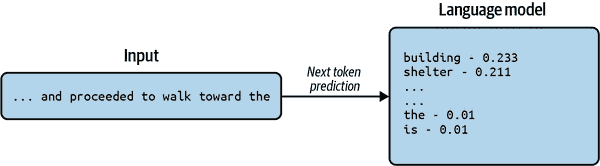
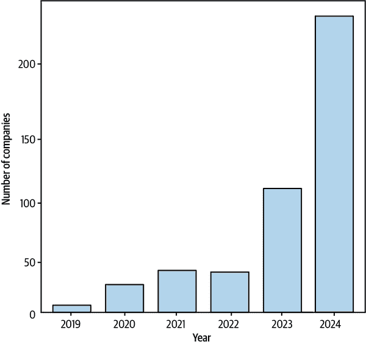

# 第一章. 简介

人工智能不再是科幻小说和反乌托邦好莱坞电影的领域。它正迅速成为人们生活的一个基本组成部分。我们中的大多数人与人工智能的互动每天都在进行，往往甚至没有意识到这一点。

人工智能目前的进步在很大程度上是由语言建模的进步推动的。大型语言模型（LLMs）代表了最近时期最重大的技术进步之一，标志着科技界的一个新时代。过去类似的转折点包括计算机的诞生，它引领了数字革命，互联网和万维网的诞生，为超连接的世界奠定了基础，以及智能手机的出现，重塑了人类交流。正在进行的 AI 革命有望产生类似的变革性影响。

LLMs 属于被称为生成式 AI 的模型类别。区分因素是这些模型能够对用户查询生成响应，称为*提示*。生成式 AI 包括生成图像、视频、语音、音乐和当然文本的模型。虽然越来越关注将这些所有模态结合到一个单一模型中，但在本书中我们将坚持语言和 LLMs。

在本章中，我们将介绍语言模型，并定义什么使语言模型*大*。我们将简要介绍 LLM 的历史，将其置于自然语言处理（NLP）领域的位置，并讨论其演变。我们将强调 LLM 已经在世界上产生的影响，展示关键用例，同时讨论其优势和局限性。我们还将介绍 LLM 提示，并展示如何有效地与 LLM 交互，无论是通过用户界面还是通过 API。最后，我们将以一个关于构建*Chat with my PDF*聊天机器人原型的小教程结束本章。然后我们将讨论原型的局限性以及限制其适用于生产用例的因素，从而为本书的其余部分奠定基础。

# 定义 LLMs

模型是对现实世界概念或现象的一种近似。一个忠实模型将能够对其近似的概念做出预测。语言模型近似人类语言，通过在大规模文本上训练而构建，从而赋予它各种语言属性，包括语法（句法）和意义（语义）的方面。

训练语言模型的一种方法是将它教会预测已知文本序列中的下一个标记（这相当于一个词或一个子词，但我们现在将忽略这种区别）。模型在大量此类序列上训练，其*参数*通过迭代更新，以便它在其预测上变得更好。

例如，考虑以下出现在训练数据集中的文本序列：

```py
After a physical altercation with the patrons of a restaurant, Alex was feeling
extremely pleased with himself. He walked out with a swagger and confidence
that betrayed his insecurities. Smiling from ear to ear, he noticed rain drops
grazing his face and proceeded to walk toward the hostel.
```

并且语言模型预测了“…和继续走向**_*”之后的下一个词

*这个文本序列有大量的有效延续。它可以是“建筑”或“避难所”，但也可能是“堤坝”或“地下墓穴”。然而，它绝对不可能是“the”或“is”，因为这会违反英语语言的规则。在足够大的文本体上训练后，模型学会“the”和“is”都不是有效的延续。因此，你可以看到，像学习预测文本序列中的下一个单词这样的简单任务，如何使模型在其参数中学习到语言的语法，甚至更复杂的技能。

###### 注意

在实践中，语言模型并不直接输出文本序列中的下一个标记的单个单词或子词。它们输出整个词汇表上的概率分布。（我们将在第三章中探讨这个词汇表是如何定义和构建的）。一个训练良好的模型将对有效延续有高概率，对无效延续有非常低的概率。

图 1-1 简要描述了模型训练过程。模型的预测输出是整个语言词汇表上的概率分布。这与原始序列进行比较，并根据算法更新模型的参数，以便在将来做出更好的预测。这个过程在非常大的数据集上重复进行。我们将在接下来的三章中详细描述模型训练过程。



###### 图 1-1\. 使用下一个标记预测进行模型训练

仅从下一个标记预测中，模型能学到什么极限？这是一个非常重要的问题，决定了 LLM 最终能有多强大。在研究界中存在很多分歧，[一些研究人员](https://oreil.ly/sUAcl)认为下一个标记预测足以在模型中实现人类水平的智能，而[其他人指出](https://oreil.ly/7QG-l)这种范式的不足。我们将在整本书中回到这个问题，特别是在第八章，我们将讨论推理等技能。

当代语言模型基于神经网络。用于训练大型语言模型（LLM）的神经网络架构有多种类型，其中最突出的是 Transformer。我们将在第四章中详细了解神经网络、Transformer 和其他架构。

语言模型可以被训练来模拟不仅限于人类语言，还可以模拟像 Python 或 Java 这样的编程语言。实际上，Transformer 架构和下一个标记预测目标可以应用于根本不是传统意义上的语言序列，例如棋步表示、DNA 序列或航班时刻表。

例如，Adam Karvonen 训练了[Chess-GPT](https://oreil.ly/oluZN)，这是一个仅用便携式游戏表示法（PGN）字符串表示的棋局训练的模型。棋局的 PGN 字符串看起来像“1. e4 d5 2. exd5 Qxd5...”等等。即使没有明确提供游戏规则，只需训练模型预测 PGN 序列中的下一个字符，该模型也能学习到游戏规则，包括王车易位、将军和将军胜等走法；甚至能够战胜专家。这展示了下一个标记预测目标和构成模型基础的 Transformer 架构的强大能力。在第四章中，我们将学习如何从头开始训练自己的 Chess-GPT。

另一个这样的例子是[Geneformer](https://oreil.ly/31DXq)，这是一个在数百万个单细胞转录组（单个细胞中 RNA 分子的表示）上训练的模型，可以用于网络生物学的预测，包括疾病进展、基因剂量敏感性和治疗候选者。

因此，我鼓励你在构思语言模型的创新用例时，超越人类语言的范畴。如果你有一个可以用有限词汇表编码的离散序列的概念或现象（我们将在第三章中更正式地定义词汇表），那么我们可以在其上训练一个有用的模型。

###### 注意

语言的结构是否具有某种特殊性质，使得它适合用下一个标记预测目标进行建模？或者，“语言”这个词在语言模型中只是一个历史巧合，任何标记流都可以用这种范式进行建模？尽管这在研究社区中仍然是一个[争论的话题](https://oreil.ly/nJiQW)，但直接使用这种范式对语音、视频等进行建模并没有取得预期的效果，这可能表明文本的离散性质以及语言提供结构，无论是像英语这样的人类语言，还是像 Python 这样的编程语言，或者是像 DNA 序列这样的特定领域代码，对于建模成功至关重要。

大约在 2019 年，研究人员意识到，增加语言模型的大小（通常通过参数数量来衡量）可以预测性地提高性能，而且似乎没有饱和点。这导致了 Kaplan 等人关于 LLM 缩放定律的工作（见下文边栏），该定律推导出一个数学公式，描述了训练模型所需的计算量（以下简称“计算”）、训练数据集大小和模型大小之间的关系。从那时起，公司和组织一直在训练越来越大的模型。

目前没有关于何时将语言模型视为“大型”的公认惯例。事实上，随着最大模型变得更大，一些几年前还被指定为 LLM 的模型现在被称为小型语言模型（SLM）。在本书中，我们将保持宽容，继续将超过十亿参数的所有语言模型称为“大型”。

“大型”语言模型与较小模型不同的另一个方面是它们所具有的涌现能力。这种能力最初由[Wei 等人](https://oreil.ly/RQfii)提出，是指较大模型所展现的能力，而较小模型则不具备。

根据这一理论，对于需要这些能力的任务，较小模型的性能接近随机。然而，当模型大小达到阈值时，性能突然开始随着大小增加而增加。例如，包括多位数算术运算、算术和逻辑推理等。这也表明，当前模型中完全缺失的某些能力可能在未来更大的模型中展现出来。

这些阈值不是绝对的，随着我们在语言建模、数据质量改进等方面看到更多进展，我们可以预期阈值将降低。

###### 备注

[Schaeffer 等人](https://oreil.ly/OXk6I)声称，在特定模型大小阈值处某些任务性能的突然提升只是用于评估性能的指标所造成的一个现象。这是因为许多指标不分配部分信用，只奖励完全解决任务，因此模型改进可能不会被追踪。另一方面，有人可能会争辩说，对于多步算术等任务，部分正确地得到答案与完全错误一样无用。

关于哪些能力是涌现的，研究社区仍在探索。在第五章中，我们将讨论其对选择适合我们所需用例的正确模型的影响。

###### 警告

很不幸，文献中“涌现属性”这个短语有多个含义。在一些论文中，这个短语用来描述模型没有明确训练的能力。在本书中，我们将坚持[Wei 等人](https://oreil.ly/bkVoj)的定义。

要理解当前大型语言模型（LLM）是如何发展起来的，回顾一下它们的历史是有益的。由于本书的范围不包括更多历史细节，我们将在本节中提供外部资源的链接，以便进一步阅读。*  *# LLMs 的简要历史

要介绍 LLMs 的历史，我们需要从 LLMs 起源的领域——自然语言处理（NLP）的历史开始。有关 NLP 的更详细历史，请参阅 Daniel Jurafsky 的经典著作[*《语音与语言处理》*，第 2 版](https://oreil.ly/zzU9R)。

## 早期年份

该领域起源于 20 世纪 50 年代，由对*机器翻译*的需求推动，即自动将一种语言翻译成另一种语言的任务。早期主要是由符号方法主导；这些是基于[语言理论](https://oreil.ly/ELKSe)的基于规则的算法，受到诺姆·乔姆斯基等语言学家作品的影响。

在 20 世纪 60 年代中期，Joseph Weizenbaum 发布了 ELIZA，这是一个聊天机器人程序，它使用[正则表达式](https://oreil.ly/rIAWY)在用户的输入上应用模式匹配，并选择响应模板来生成输出。ELIZA 由几个脚本组成，其中最著名的是 DOCTOR，它模拟了一位心理治疗师。这个变体会通过将用户输入以问题形式重新表述来回应，类似于治疗师的做法。重新表述是通过用从输入中匹配到的模式匹配词填充预定义模板来完成的。

例如：

```py
User: 'I am not feeling well'
```

```py
ELIZA: 'Do you believe it is normal to be not feeling well?'
```

你可以尝试在线与[ELIZA 聊天](https://oreil.ly/5g0e_)。即使在 ChatGPT 的时代，ELIZA 也能进行一些相当令人信服的对话，尽管它只是基于规则的。

基于规则的系统是脆弱的，难以构建，维护起来也是一个噩梦。随着几十年的推移，符号方法的局限性变得越来越明显，而统计方法相对的有效性确保了它们变得更加普遍。自然语言处理研究员 Frederick Jelinek 曾著名地打趣说，“每当我解雇一个语言学家，语音识别器的性能就会提高。”

基于机器学习的方法在 1990 年代和 2000 年代得到了更广泛的应用。传统的机器学习依赖于人类驱动的特征工程和特征选择，这是一个识别特征（输入的特征）的过程，这些特征对解决任务具有预测性。这些特征可以是统计性的，如平均词长，或者是语言学的，如词性。要了解更多关于传统统计自然语言处理的信息，我推荐阅读 Christopher Manning 的书籍，[*统计自然语言处理基础*](https://oreil.ly/MIC70)。

语言学与现代自然语言处理应用开发的相关性是一个有争议的话题。许多大学课程中的自然语言处理内容已经完全删除了与语言学相关的部分。尽管我直接工作中并不直接使用语言学，但我发现我比预期的更多地依赖于它们来发展关于模型行为的直觉。因此，我推荐 Emily Bender 关于[句法](https://oreil.ly/hWR8S)和[语义](https://oreil.ly/7liiS)的书籍，以了解这个领域的基础知识。

2010 年代见证了深度学习的出现及其对自然语言处理（NLP）的广泛影响。深度学习以其多层神经网络模型为特征，这些模型仅通过原始输入自行学习信息性特征，从而消除了繁琐的特征工程需求。深度学习构成了现代 NLP 和大型语言模型（LLMs）的基础。要深入了解深度学习和神经网络的原则，我推荐阅读[Goodfellow 等人所著的书籍](https://oreil.ly/0gv0D)。对于更多实践性的深度学习培训，我推荐张等人所著的[*《深度学习入门》*](https://oreil.ly/YN_3Y)。

在深度学习的早期，构建特定任务的架构来解决每个任务是惯例。使用的神经网络架构类型包括多层感知器、卷积神经网络、循环神经网络和递归神经网络。要了解更多关于这个 NLP 时代的知识，我推荐 Yoav Goldberg 所著的[*《自然语言处理中的神经网络方法》*](https://oreil.ly/MCOp4)（Springer Cham）。

## 现代 LLM 时代

2017 年，发明了[Transformer 架构](https://oreil.ly/AAuvL)，随后[Howard 等人](https://oreil.ly/E15Yn)等人以及基于 Transformer 的语言模型如[BERT](https://oreil.ly/-Yhwz)发明了高效的*迁移学习*技术。这些进步消除了构建复杂特定任务架构的需求。相反，可以使用相同的 Transformer 模型来训练各种任务。这种新范式将训练步骤分为两个阶段：*预训练*和*微调*。一个初始的大规模预训练步骤用一般语言能力初始化 Transformer 模型。随后，预训练模型可以通过微调过程在更具体的任务上进行训练，如信息提取或情感检测。本书将全面介绍微调。

虽然学术界和开源团体对语言模型做出了关键和重要的贡献，但像 OpenAI、Google、Meta 和 Anthropic 这样的大型科技公司已经在训练和发布越来越大的 LLMs 方面走在前列。特别是 OpenAI 在推进语言建模技术方面发挥了开创性的作用。现代时代 LLMs 演变的轨迹可以通过 OpenAI 训练的 GPT（生成预训练变换器）系列模型每个版本的进步来追踪：

[GPT-1](https://oreil.ly/dFPSE)

这个版本展示了在大规模数据上的无监督预训练，随后是特定任务的监督微调。

[GPT-2](https://oreil.ly/JL-VO)

本版本是首批在大型网络数据上训练的模型之一。这个版本也标志着自然语言提示作为与语言模型交互手段的兴起。它表明，预训练模型可以在没有任何特定任务微调的情况下解决各种任务 *零样本*（无需任何示例即可解决问题）。我们将在本章后面详细讨论零样本和提示。

[GPT-3](https://oreil.ly/lIwad)

受到扩展定律的启发，这个模型比 GPT-2 大一百倍，并普及了上下文/少样本学习，其中模型通过提示中少量示例来学习如何解决给定任务，而无需对模型进行微调。我们将在本章后面了解更多关于少样本学习的内容。

[GPT-4](https://oreil.ly/gY1HL)

本次发布的一个关键方面是用于使模型更具可控性和遵循模型训练者原则和价值观的 *对齐训练*。我们将在 第八章 中了解对齐训练。

[o1](https://oreil.ly/XJSMN)

这是 OpenAI 发布的新一代模型，专注于提高推理能力。这是首批关注扩展推理时间计算能力的模型之一。我们将在 第八章 中进一步讨论推理时间计算。

你可能已经注意到一个趋势：多年来，该领域一直在经历整合效应，越来越多的 NLP 任务流程部分由单个模型端到端执行。在本书中，我们将指出明显的整合效应，并讨论其对 LLMs 未来影响的含义。

LLMs 的历史如果不提及开源对这个领域的影响就不完整。开源模型、数据集、模型架构以及各种开发者库和工具都对这一领域的发展产生了重大影响。本书特别重视开源，对开源 LLM 领域进行了全面调查，并展示了众多开源模型和数据集。

接下来，让我们探讨 LLMs 的应用情况及其对社会的影响至今为止。

# LLMs 的影响

科技界长期以来一直容易受到炒作周期的影响，有令人兴奋的繁荣和令人沮丧的萧条。最近，我们见证了加密/区块链和 Web3 的繁荣，这两者都尚未实现其承诺。AI 是否会走向类似的命运？我们有确凿的证据表明它不会。

在我的公司 Hudson Labs，我们 [分析了](https://oreil.ly/_mTAs) 美国前 4,000 家上市公司季度收益电话会议中的讨论，以追踪加密货币、Web3 和 AI 在企业中的采用情况。

我们观察到，有 85 家公司在其收益电话会议中讨论了 Web3，实际上真正在做的公司更少。加密货币的表现更好，有 313 家公司讨论了它。与此同时，有 2,195 家公司讨论并采用了 LLM，这意味着至少 50%的美国最大上市公司正在使用 LLM 来驱动价值，这对他们来说战略上如此重要，以至于在他们的季度收益电话会议中被讨论。无论有效与否，企业中 LLM 的采用已经成为现实。

图 1-2 显示了公司在收益电话会议中讨论 Web3 的数量随时间的变化。如您所见，Web3 的炒作似乎正在减弱。


###### 图 1-2\. 在收益电话会议中讨论 Web3 的公司随时间的变化

同样，图 1-3 显示了公司在收益电话会议中讨论加密货币/区块链的数量随时间的变化。如您所见，在其顶峰时，只有 5%的公司讨论了加密货币。


###### 图 1-3\. 在收益电话会议中讨论加密货币/区块链的公司随时间的变化

最后，让我们来看看 AI。如前所述，AI 在企业中的采用程度是近期其他任何技术趋势都无法比拟的。这一趋势正在加速，如图 1-4 所示，该图显示了分析师在仅今年前两个月收益电话会议中询问 AI 问题的公司数量。2024 年的急剧上升没有减缓的迹象。



###### 图 1-4\. 在收益电话会议中询问 AI 问题的公司数量（仅前两个月）

注意，这些统计数据仅包括生成式 AI/LLM 的采用，而不包括数据科学/数据分析，其采用在企业中更为普遍。AI 的采用也不仅限于科技公司，从房地产公司到保险公司等各行各业的公司都加入了这一潮流。

# 企业中 LLM 的使用

从同样的分析中，我们观察到了企业中 LLM（大型语言模型）被使用的关键方式：

员工生产力

通过 LLM 的使用提高员工生产力的主要方式是通过像 GitHub Copilot 这样的编码助手。LLM 也被广泛用于帮助撰写营销和推广文本以及自动化营销活动。事实上，第一个主要的 LLM 商业成功故事是营销初创公司[Jasper AI](https://oreil.ly/Byw26)和[Copy.ai](https://oreil.ly/QmhJC)。另一个关键的由 LLM 驱动的生产力提升是通过公司从异构数据源中抽取的广泛知识库上的问答助手。

报告生成

这些包括总结文档、完成日常文书工作，甚至起草合同。总结用例包括总结财务报告、研究论文，甚至音频或通话记录的会议纪要。

聊天机器人

由大型语言模型（LLM）驱动的聊天机器人越来越多地被部署为客户服务代表。它们还被用作公司文档或产品页面的接口。

信息提取和序列标记

近年来，许多企业为语言处理任务开发了复杂的 NLP 管道。其中许多管道正被 LLM 完全或部分取代。这些管道用于解决常见的 NLP 任务，如情感分析、信息提取任务，如实体提取和关系提取，以及序列标记任务，如命名实体识别（NER）。有关 NLP 任务及其详细描述的详细列表，请参阅[Fabio Chiusano 的博客](https://oreil.ly/_11rN)。

翻译

翻译任务包括将文本从一种语言翻译成另一种语言，以及将文本转换为同一语言的不同形式的任务，例如，将非正式文本转换为正式文本，侮辱性文本转换为礼貌文本等等。实时翻译应用如[Erudite 的即时语音翻译](https://oreil.ly/xxENs)承诺让游客尴尬的语言障碍时刻成为过去。

工作流程

LLM 正逐渐被用于促进工作流程自动化，其中一系列任务可以通过由 LLM 驱动的软件系统（称为代理）执行。代理可以与其环境交互（搜索和检索数据、运行代码、连接到其他系统），并且可能自主操作。我们将在第十章（ch10.html#ch10）中更正式地定义代理并探讨如何构建它们。

# 提示（Prompting）

现在我们已经建立了基础知识，让我们开始学习如何有效地使用 LLM。

与 LLM 交互的过程被称为提示（prompting）。尽管一些公司试图通过给它们起名字或赋予一个角色来拟人化 LLM，但记住当你与 LLM 交互时，你是在*提示*它们，而不是像与人一样聊天。记住 LLM 是下一词预测器。这意味着它们生成的文本高度依赖于它们所接收的文本，包括输入（称为*提示*）以及模型迄今为止生成的输出标记。这统称为*上下文*。

通过在上下文中向 LLM 提供正确的文本，你正在为其生成所需类型的输出做好准备。理想的提示将是这个问题的答案：“什么是最理想的 N 个标记的前缀，当将其输入 LLM 时，将最有可能引导它生成正确的答案？”

就本书写作时的情况而言，语言模型还不够智能，无法让你以与人类交谈的方式精确地提示模型并期望获得最佳结果。随着语言模型随着时间的推移而变得更好，提示可以变得更加像人类的对话。那些还记得搜索引擎早期日子的人可能会回忆起，通过输入正确的查询形式来有效地使用搜索引擎被认为是一项非同寻常的技能，但随着搜索引擎的改进，查询可以变得更加自由形式。

当我开始写这本书时，我征求了目标读者对希望涵盖的主题的意见。我收到了最多的关于提示主题的请求，从业者希望了解如何有效地为他们的特定用例创建提示。

提示是现代 LLM 的一个重要方面。实际上，你可能会在任何一个基于 LLM 的项目上花费大量时间迭代提示，这通常不准确地被称为*提示工程*。

###### 小贴士

已有尝试自动优化提示，如[自动提示优化（APO）](https://oreil.ly/SekPA)和[AutoPrompt](https://oreil.ly/upVKC)。我们将在第十三章中进一步讨论这个问题。

管理对提示工程有效性的期望是很重要的。提示并不是解锁隐藏 LLM 能力的魔法咒语。几乎不可能有公司仅仅通过使用其他人不知道的优越提示技巧就比其他公司有显著的优势。另一方面，不遵循基本的提示原则可能会严重阻碍你的 LLM 的性能。

在线有大量的提示教程。我特别推荐[学习提示的指南](https://oreil.ly/CQrzi)。你不需要了解所有的提示技巧就能熟练掌握提示。关于提示，你所需了解的大部分内容可以在几个小时之内学会。更重要的是，与经常使用的 LLM 进行互动，观察它们的输出，并发展对它们行为的直觉。

如果你有过编程经验，我建议从编程的角度来看待提示。在编程中，指令需要明确，不能有歧义。提示的挑战在于它是用自然语言进行的，而自然语言本质上是有歧义的。尽管如此，最好的提示都明确、详细、结构化，几乎没有歧义的空间。我们将在第五章和第十三章中学习更多提示的细微差别。

###### 注意

一个有趣的事实：语言模型对词序不敏感。这一特性甚至在像 BERT 这样的[早期模型](https://oreil.ly/qI_IZ)中也被[观察到](https://oreil.ly/gtDFg)。例如，向 ChatGPT 或你喜欢的 LLM 提供商以混乱的形式提出问题“我如何系鞋带？”比如说“shoe tie my I how do laces？”ChatGPT 会回答“当然！以下是如何系鞋带的逐步说明：…”，就像你提出了一个直接的问题。

接下来，让我们讨论几种提示模式。

## 零样本提示

这是提示的标准方法，其中你向 LLM 提供指令，可选地提供一些输入文本。术语*零样本*指的是没有提供如何解决任务的示例或演示。

考虑一个例子，你的任务是评估餐厅评论中表达的情感。通过零样本提示来实现这一点，你可以发出以下提示：

> *提示:* 根据其情感对给定的段落进行分类。输出可以是积极、消极或中性之一。
> 
> 文本段落：“土豆泥让我想起了我童年的学校午餐。我非常期待再次品尝它们。不！”
> 
> 情感：

一个好的零样本提示将：

+   以精确和明确的方式提供指令。

+   描述输出空间或可接受的输出范围和输出格式。在这个例子中，我们声明输出应该是三个值之一。

+   通过在提示中结束“Sentiment:”，我们增加了 LLM 生成情感值的下一个标记的概率。

模型越好，你越不需要担心这些事情是否正确。

在现实世界的设置中，你的输出格式需要高度可控，以便它能够适应自动化系统。我们将在第五章中讨论更多确保输出可控性的技术。

###### 警告

提示对模型变化敏感。你可能费尽心思构建了一个似乎效果很好的提示，但你可能会注意到，相同的提示对不同的模型不起作用。实际上，如果在此期间底层模型被更新，相同的提示可能在同一个 API 端点上的性能可能会下降。我们称之为*提示漂移*。对提示进行版本控制是个好主意。

## 少样本提示

在我们的零样本提示示例中，LLM 能够解决任务，而无需解释如何解决它。这是因为任务简单且定义明确。在许多情况下，任务可能不容易用自然语言描述。然后我们可以在提示中添加一些示例，这些示例可以是输出或输入-输出对。虽然这被称为少样本学习，但语言模型通过这种提示技术并没有以任何方式更新。

这里是一个少样本提示的例子：

> *提示:* 回文是一个在从左到右拼写时字母相同的单词
> 
> 或者从右到左。
> 
> 回文词的例子：kayak, civic, madam, radar
> 
> 不是回文词的例子：kayla, civil, merge, moment
> 
> 用“是”或“否”回答问题
> 
> “rominmor”这个词是回文吗？
> 
> 答案：

## 思维链提示

如果你只打算学习一种提示技术，那就让它是思维链（CoT）提示，因为它是现有最具影响力的提示技术之一。

如前所述，LLM 的上下文决定了它预测的下一个令牌。因此，我们需要优化上下文中的内容（用户提示+迄今为止生成的输出令牌）以最大化 LLM 生成正确未来令牌的概率。一种方法是在生成之前提示 LLM 进行“思考”。这促使 LLM 生成到达答案的过程，而不是直接生成答案。这可能涉及将输入任务分解为子任务，并依次解决它们。

当 LLM 最终接近生成答案时，它可以依赖一个更相关的上下文，从而增加其生成正确答案的概率。

考虑以下例子：

> *提示:* 解这个方程。34 + 44 + 3 * 23 / 3 * 2。逐步思考。

在接收到“逐步思考”的指令后，LLM 随后将问题分解，并按顺序逐个解决每个步骤：

```py
Given equation:

34 + 44 + 3 * 23 / 3 * 2

First, perform multiplication and division from left to right:

= 34 + 44 + (3 * 23 / 3 * 2)
= 34 + 44 + (69 / 3 * 2)
= 34 + 44 + (23 * 2)
= 34 + 44 + 46

Now, perform addition:

= 78 + 46

Finally, complete the addition:

= 124

So, the solution to the equation is 124.
```

###### 小贴士

许多大型语言模型（LLM）会逐步解决问题，即使没有明确提示它们这样做。这是因为它们已经被调整为以这种方式解决问题。我们将在第五章和第六章中了解更多关于指令调整（instruction-tuning）的内容。经过指令调整的 LLM 更容易被提示。

在可以通过用户界面访问 LLM 的情况下，LLM 提供商可能通过一个隐藏的提示（称为系统提示）将 CoT 提示应用于相关用户提示。

我们是否应该在每个提示中添加“逐步思考”的 CoT 指令，就像游戏中的作弊码一样？[Sprague 等人](https://oreil.ly/3zJDC)评估了 CoT 提示在广泛任务上的效果，发现 CoT 主要有助于需要数学或逻辑推理的任务。对于涉及常识推理的任务，他们发现 CoT 的收益有限。对于基于知识的任务，CoT 甚至可能有害。

注意，算术和逻辑推理也可以通过委托给外部工具（如符号求解器和代码解释器）来执行。我们将在第十章中详细讨论这一点。第十章。

###### 警告

使用 CoT 提示显著增加了模型解决任务时生成的令牌数量，导致成本更高。

## 提示链

通常，你的任务需要多个步骤和大量指令。一种方法是将所有指令塞入一个单独的提示中。另一种方法是把任务分解成多个子任务，并链式连接提示，使得一个提示的输出成为另一个提示的输入。我观察到，提示链式连接在管理整个任务时通常比通过单个提示管理表现得更好。

以一个例子来说明，考虑从表单中提供的文本中提取信息并将输出格式化的任务。如果有缺失或异常值，则需要应用一些特殊的后处理规则。在这种情况下，将任务分成两个提示是一个好习惯，初始提示执行信息提取，第二个提示处理提取信息的后处理。

## 对抗性提示

你可能会注意到，对于某些查询，LLM 拒绝执行你的请求。这是因为它已经被特别训练来拒绝某些类型的请求（我们将在第八章中学习如何实现这种行为）。我们将这种训练称为*对齐训练*，它是为了使模型与开发该模型的实体的价值观和偏好保持一致。

例如，直接要求任何合理的 LLM 提供制造炸弹的指令将会遭到拒绝。然而，截至今天，对齐训练只提供了一层薄弱的安全保障，因为它可以通过巧妙地提示 LLM（称为*对抗性提示*）来绕过。对抗性提示可以手动生成或使用算法生成。这些巧妙措辞的提示会诱使 LLM 生成一个响应，即使它被训练不要这样做。

这些巧妙的提示方案不仅对非法目的有用。在许多情况下，LLM 只是没有以你想要的方式响应，巧妙的提示方案可能有所帮助。这些巧妙的提示方案范围从要求 LLM 采取特定的角色到直接的情感勒索（“如果你不正确响应这个查询，许多孩子将遭受痛苦！”）。虽然有一些工作[显示](https://oreil.ly/q1I_7)在提示中添加情感可能会带来更好的性能，但没有确凿的、持续的证据表明这对特定模型是普遍有效的。因此，我不建议在生产应用中使用这些。

# 通过 API 访问 LLM

你很可能已经通过像 ChatGPT、Gemini 或 Claude 这样的聊天界面与一个 LLM（大型语言模型）互动过了。现在让我们来探讨如何通过 API 来访问它们。我们将以 OpenAI API 为例，来访问其 GPT 系列模型。大多数其他专有模型也通过它们的 API 暴露出类似的参数。

GPT-4o mini 和 GPT-4o 可以通过 OpenAI 的 Chat Completion API 访问。以下是一个示例：

```py
import os
import openai
openai.api_key = <INSERT YOUR KEY HERE>

output = openai.ChatCompletion.create(
  model="gpt-4o-mini",
  messages=[
    {"role": "system", "content": "You are an expert storywriter."},
    {"role": "user", "content": "Write me a short children's story `about` `a` `dog` `and` `an` `elephant` `stopping`
    `being` `friends` `with` `each` `other``.``"}` ``` `]` `)`  `print``(``output``.``choices``[``0``]``.``message``)` ```py
```

```py ``Roles can be system, user, assistant, or tool.    *   The system role is used to specify an overarching prompt.           *   The user role refers to user inputs.           *   The assistant role refers to the model responses.           *   The tool role is used to interact with external software tools.              We will discuss tools in more detail in Chapter 10.    ###### Note    What is the difference between the system and user roles? Which instructions should go into the system prompt and which ones into the user prompt? System prompts are used for dictating the high-level overarching behavior of an LLM, like “You are a financial expert well versed in writing formal reports.” If you are allowing your users to directly interact with the LLM, then the system prompt can be used to provide your own instruction to the LLM along with the user request. My experiments have shown that it doesn’t matter much if you place your instructions in the system prompt versus user prompt. What does matter is the length and number of instructions. LLMs typically can handle only a few instructions at a time. Instructions at the end or the beginning of the prompt are more likely to be adhered to.    Here are some of the parameters made available by OpenAI:    `n`      The number of completions the model has to generate for each input. For example, if we used n = 5 in the given example, it would generate five different children’s stories.      ###### Tip    For tasks with high reliability requirements, I advise generating multiple completions, that is, n > 1 and then using a postprocessing function (which could involve an LLM call) to choose the best one. This is because the LLM samples the generated text from a probability distribution, and in some cases the answer might be wrong/bad just due to an unlucky token sampling. You might have to balance this process against your budget limitations.    `stop` and `max_completion_tokens`      Used to limit the length of the generated output. `stop` allows you to specify end tokens that, if generated, would stop the generation process. An example stop sequence is the newline token. If you ask the model to adhere to a particular output format, like a numbered list of sentences, then to stop generating after a particular number of sentences have been output, you can just provide the final number as a stop parameter.      `presence_penalty` and `frequency_penalty`      Used to limit the repetitiveness of the generated output. By penalizing the probability for tokens that have already appeared in the output, we can ensure that the model isn’t being too repetitive. These parameters can be used while performing more creative tasks.      `logit_bias`      Using `logit_bias`, we can specify the tokens whose generation probability we want to increase or decrease.      `top_p` and `temperature`      Both parameters relate to decoding strategies. LLMs produce a distribution of token probabilities and will sample from this distribution to generate the next token. There are many strategies to choose the next token to generate given the token probability distribution. We will discuss them in detail in Chapter 5. For now, just remember that a higher temperature setting results in more creative and diverse outputs, and a lower temperature setting results in more predictable outputs. This [cheat sheet](https://oreil.ly/DAa66) provides some recommended values for various use cases.      `logprobs`      Provides the most probable tokens for each output token along with their log probabilities. OpenAI limits this to the top 20 most probable tokens. In later chapters, we will discuss how we can leverage `logprobs` information in various forms.`` ```  ```py`` ````# LLMs 的优势和局限性    了解 LLMs 的优势和局限性是构建有用 LLM 应用程序的关键技能。通过本书中的信息和大量的实践操作，你将能够培养这种直觉。一般来说，LLMs 在语言任务方面非常擅长。你几乎永远不会看到它们犯拼写或语法错误。它们在理解用户指令和意图方面比之前的技术有了巨大的改进。它们在大多数 NLP 任务上，如实体和关系提取以及 NER，也表现出最先进的性能。它们在生成代码方面尤其强大，这是 LLMs 通过像 [GitHub Copilot](https://oreil.ly/qvriE) 这样的工具找到最大成功的地方。    大多数 LLM 的局限性归结为 LLMs 的智能还不够。即使是最先进的模型也受到推理能力的重大限制，包括算术推理、逻辑推理和常识推理。（我们将在第八章 Chapter 8 中更正式地定义推理。）LLMs 也无法坚持事实性，因为它们与现实世界缺乏联系。因此，它们倾向于生成可能与现实世界事实和原则不一致的文本，俗称为 *幻觉*。幻觉是 LLMs 的噩梦，也是人们犹豫采用它们的关键原因之一。在第八章 Chapter 8 中，我们将深入研究解决幻觉和解决推理局限性的各种方法。    每天都有大量的 LLM 生成的文章被上传到网络上，其中许多文章登上了搜索引擎结果页的顶部。例如，对于“你能融化鸡蛋吗？”这个查询，由于一个包含错误答案的 AI 生成的网页，[Google](https://oreil.ly/ivvv_) 在一段时间内显示“是的，鸡蛋可以融化”。这种文本通常被称为 AI 污物。因此，搜索引擎有很强的动力准确检测 AI 生成的文本。请注意，由于 LLMs 主要在网页文本上进行训练，未来的 LLMs 也可能被污染文本所污染。    虽然 LLMs 经常被用来辅助创意任务，但它们远远达不到专业作家的水平。当前 LLMs 编写的小说不太可能成为畅销书。LLMs 生成的文本缺乏人类作者所拥有的纯粹独创性和唤起人类情感的能力。一旦你阅读了足够多的 LLM 生成的文本，就很容易发现它们。    每个 LLM 生成的文本都有独特的签名，有些比其他更容易被人类察觉。例如，你可能已经注意到 ChatGPT 倾向于过度使用某些词，如“深入研究”、“锦锈”、“繁忙”等。ChatGPT 也倾向于生成带有解释性从句的句子，如“他吃掉了整个披萨，这表明他很饿。”或者“吸血鬼在一个月内发送了成千上万条短信，这表明有效使用数字技术。”然而，[极其困难](https://oreil.ly/4skjI) 以 100% 的准确率检测 AI 生成的文本。不良行为者也在使用规避技术，例如要求另一个 LLM 重新措辞 LLM 生成的文本，以稀释原始 LLM 的签名。    因此，抄袭检测变得更加困难，包括由于 AI 文本检测器不准确而导致学生被[不公平地指控抄袭](https://oreil.ly/hetca)的情况。这些趋势促使全球大学重新思考如何评估学生，减少对论文的依赖。学生是 LLM 产品的一些最重用户，正如 [ChatGPT 使用量在夏季月份的下降](https://oreil.ly/5xECI)所示。    虽然“深入研究”等词被已知为 LLMs 过度使用，但不应依赖单词频率作为检测 LLM 生成的文本的手段。在我成长于印度学习印度英语的过程中，“深入研究”这个词在我的词汇中出现的频率比普通西方人高得多，这可以在我的写作和出版物中找到，甚至在 ChatGPT 发布之前。这些细微差别表明，需要开发更稳健的技术来发现 LLM 生成的文本。    一种有希望的方法使用句法模板，这是一个具有特定词性（POS）标签顺序的标记序列，通常长度为 5-8 个标记。[Shaib 等人](https://oreil.ly/n_dXJ)表明，即使在旨在增加标记多样性的文本生成策略（也称为解码策略，在第五章 Chapter 5 中详细描述）中使用时，这些模板也会出现在生成的文本中。他们表明，这些模板是在预训练过程的早期阶段学习的。    一个示例模板是：    VBN IN JJ NNS: VBN (过去分词动词) + IN (介词) + JJ (形容词) + NNS (复数名词)。    符合此模板的短语示例包括：    *   Engaged in complex tasks           *   Trained in advanced techniques           *   Entangled in deep emotions           *   Immersed in vivid memories              你有没有注意到任何 LLMs 经常使用或过度使用这个模板？    # 构建你的第一个聊天机器人原型    让我们深入细节，开始构建！    在过去几年中，一个健康的生态系统使实验和原型化 LLM 应用程序变得更加容易。事实上，你可以在大约一百行代码内构建一个 *与你的 PDF 交谈* 问答聊天机器人！    让我们实现一个简单的应用程序，允许用户上传 PDF 文档，并通过聊天界面提供聊天界面，用户可以通过该界面提出有关 PDF 内容的问题并接收对话式响应。    此应用程序的预期工作流程如下：    1.  用户通过用户界面上传他们选择的 PDF。           2.  应用程序使用 PDF 解析库解析 PDF，并将提取的文本分割成可管理的块。           3.  将这些块转换为向量形式，称为嵌入。           4.  当用户通过聊天界面提出查询时，该查询也转换为向量形式。           5.  计算查询向量与每个块向量之间的向量相似度。           6.  检索与最相似的前 k 个向量对应的文本。           7.  将检索到的文本以及查询和任何其他附加指令输入到 LLM 中。           8.  LLM 使用提供的信息生成对用户查询的答案。           9.  将响应显示在用户界面上。                    用户现在可以做出回应（澄清问题、新问题、感谢等）。           10.  在对话的每一轮中，将整个对话历史反馈给 LLM。              图 1-5 展示了此工作流程。    ###### 图 1-5\. 聊天机器人应用程序的工作流程    让我们首先安装所需的库。对于此设置，我们将使用：    [LangChain](https://oreil.ly/g833p)      这个非常流行的框架使构建 LLM 应用程序管道变得容易。      [Gradio](https://oreil.ly/XHqfT)      这个库允许你构建由 LLM 驱动的用户界面。      [Unstructured](https://oreil.ly/sIFEX)      这是一个支持从 PDF 中提取文本的多种方法的 PDF 解析套件。      [Sentence Transformers](https://oreil.ly/UyN1k)      这个库便于从文本中生成嵌入。      [OpenAI](https://oreil.ly/zbroe)      这个 API 提供了对 OpenAI 的 GPT 系列模型的访问。      让我们导入所需的库和函数：    ```py !pip install openai langchain gradio unstructured  from langchain_community.document_loaders import UnstructuredPDFLoader from langchain_community.embeddings import HuggingFaceEmbeddings from langchain_community.vectorstores import Chroma from langchain.chains import ConversationalRetrievalChain from langchain.chat_models import ChatOpenAI import gradio as gr ```    接下来，让我们实现 PDF 加载和解析函数。LangChain 支持多个 PDF 解析库。PDF 解析可以以多种方式执行，包括使用 LLMs。对于此示例，我们将选择 Unstructured 库：    ```py loader = UnstructuredPDFLoader(input_file.name) data = loader.load() ```    `data` 变量包含已分割成段落的解析 PDF。我们将每个段落称为一个块。现在，每个块都使用嵌入模型将其转换为向量表示。LangChain 支持广泛的嵌入模型。对于此示例，我们将使用 Hugging Face 平台上可用的 *all-MiniLM-L6-V2* 嵌入模型：    ```py embeddings = HuggingFaceEmbeddings(model_name="all-MiniLM-L6-v2") ```    现在我们已经加载了嵌入模型，我们可以从数据中生成向量并将它们存储在向量数据库中。LangChain 上有多个向量数据库集成。对于此示例，我们将使用 Chroma，因为它是最简单的：    ```py db = Chroma.from_documents(data, embeddings) ```    向量数据库已准备好向量！我们可以提出查询并获得响应。例如：    ```py query = "How do I request a refund?" docs = db.similarity_search(query) print(docs[0].page_content) ```    此代码检索与表示用户查询的向量最相似的 PDF 中的段落。由于向量编码文本的意义，这意味着表示相似向量的段落具有与查询内容相似的内容。    注意，并不能保证该段落包含查询的答案。使用嵌入，我们只能获取与查询相似的文字。匹配的文本不必包含答案，甚至不必与回答查询相关。    我们将依赖 LLM 来区分无关和相关的上下文。我们向 LLM 提供查询和检索到的文本，并要求它根据提供的信息回答查询。此工作流程可以使用 LangChain 中的 `chain` 实现：    ```py conversational_chain =  ConversationalRetrievalChain.from_llm(ChatOpenAI(temperature=0.1),     retriever=pdfsearch.as_retriever(search_kwargs={"k": 3})) ```    我们使用 `ConversationalRetrievalChain`，它支持以下工作流程：    1.  如果存在，则获取先前的对话历史和当前的用户响应/查询，并创建一个独立的问题。           2.  使用选择的检索方法检索与问题最相似的前 k 个块。           3.  将检索到的块、对话历史、当前用户/响应查询和指令输入到 LLM 中。LLM 生成答案。              我们可以调用链并将其结果附加到聊天历史中：    ```py output = conversational_chain({'question': query, 'chat_history':  conversational_history}) conversational_history += [(query, output['answer'])] ```    我们的聊天机器人已经准备好了。让我们通过连接用户界面来结束它。我们将使用 [Gradio](https://oreil.ly/dzYJv)，这是一个用于构建由 LLM 驱动的用户界面的轻量级 Python 框架：    ```py with gr.Blocks() as app:       with gr.Row():         chatbot = gr.Chatbot(value=[], elem_id='qa_chatbot').style(height=500)      with gr.Row():         with gr.Column(scale=0.80):             textbox = gr.Textbox(                 placeholder="Enter text"             ).style(container=False)           with gr.Column(scale=0.10):         upload_button = gr.UploadButton("Upload a PDF",           file_types=[".pdf"]).style() ```    我们需要一些额外的代码来编写等待用户事件的处理器。请参阅本书的 [GitHub 仓库](https://oreil.ly/llm-playbooks)中的完整代码。    最后，我们初始化应用程序：    ```py if __name__ == "__main__":     app.launch() ```    我们的聊天机器人应用程序已经准备好了！    ###### 注意    为什么我们不能将整个 PDF 输入到 LLM 而不是将其分解成块并检索相关信息？这取决于 LLM 支持的最大有效上下文长度，这限制了它可以接受的输入大小。较大的模型支持足够大的上下文长度，可以容纳多个 PDF，在这种情况下，你可能根本不需要执行块化和嵌入过程。    # 从原型到生产    构建 LLM 应用程序真的这么容易吗？不幸的是，不是。我们已经构建了一个原型，而且是一个相当不错的原型。对于许多非关键用例，此应用程序的性能可能甚至足够。然而，大量用例需要准确性和可靠性保证，而此应用程序无法满足。本书旨在解决原型与生产之间的差距。    在原型教程中，我们将 LLM 视为一个黑盒。但如果你正在使用 LLM 构建严重应用程序，了解底层发生的事情很重要，即使你可能永远不会自己训练 LLM。因此，在第二章 Chapter 2、第三章 Chapter 3 和第四章 Chapter 4 中，我们将逐一介绍构成 LLM 的各个组成部分，并展示它们是如何被训练的。对 LLM 的构成和训练有深入的了解将有助于调试故障模式。    在教程中，我们使用了 OpenAI 的专有 LLM，而没有过多考虑它是否是应用程序的最佳选择。今天，数百甚至数千个 LLM 可用于商业用途。在第五章 Chapter 5 中，我们将探索 LLM 领域，包括开源和专有模型，模型之间差异的相关维度，以及如何选择满足特定用例标准的正确模型。例如，我们 PDF 聊天机器人的一个标准可能是要在严格的预算限制下运行。我们将学习如何评估 LLMs 并评估它们针对特定用例的限制和能力，开发评估指标和基准数据集，并了解自动评估和人工评估中涉及到的陷阱。    如果我们打算上传到 PDF 聊天机器人的 PDF 属于 LLM 似乎不太擅长的专业领域怎么办？如果 LLM 无法遵循用户查询中的指令怎么办？我们可能需要通过在专业领域的数据上微调来更新模型的参数。在第六章 Chapter 6 中，我们将介绍模型微调，了解可能有用的情况，并演示如何构建微调数据集。    标准微调可能不适合我们的目的。也许它太昂贵或效果不佳。在第七章 Chapter 7 中，我们将了解像参数高效微调这样的技术，它只更新模型参数的一小部分。    我们可能会注意到我们的聊天机器人正在产生幻觉，或者它由于推理错误而难以回答问题。在第八章 Chapter 8 中，我们将讨论检测和缓解幻觉的方法，以及增强推理能力的方法，包括各种推理时计算技术。    一个生产级的 PDF 聊天机器人需要满足许多非功能性要求，包括最小化延迟（用户需要等待模型响应的时间）和成本。在第九章 Chapter 9 中，我们将讨论推理优化技术，包括缓存、蒸馏和量化。    我们可能希望通过将 LLM 连接到代码解释器、数据库和 API 来扩展聊天机器人的功能。我们可能还希望聊天机器人能够回答需要分解成多个步骤的复杂查询。在第十章 Chapter 10 中，我们将探索如何将 LLM 与外部工具和数据源接口，并使 LLM 能够分解任务、做出自主决策并与环境接口。    在教程中，我们演示了一种基本的解析、分块和嵌入文档的方法。但在使用过程中，我们可能会注意到向量相似度度量可能无效，并且经常返回无关的文档块。或者检索到的块不包含回答查询所需的所有信息。在第十一章 Chapter 11 中，我们将更详细地探讨嵌入，并学习如何微调我们自己的嵌入。我们还将展示如何更有效地分块数据。    PDF 聊天机器人遵循一种称为检索增强生成（RAG）的范例。RAG 指的是将 LLM 连接到外部数据源的系统，如我们聊天机器人用例中用户上传的 PDF。在第十二章 Chapter 12 中，我们将定义一个全面的 RAG 管道，并学习如何构建健壮的 RAG 系统。    最后，在第十三章 Chapter 13 中，我们将讨论开发 LLM 应用程序的设计模式和编程范式。    本书将涵盖这些主题以及更多内容。我期待着与您一起踏上这段旅程，希望为您提供开发生产级 LLM 应用程序所需的工具、技术和直觉！    # 摘要    在本章中，我们介绍了语言模型，提供了简要的历史，并讨论了它们对世界产生的影响。我们展示了如何使用各种提示技术有效地与模型交互。我们还概述了语言模型的优缺点。我们展示了构建原型应用程序是多么容易，并强调了将它们推向生产所涉及到的挑战。在下一章中，我们将开始探索 LLM 世界，通过介绍构成 LLM 的成分来开始我们的旅程。```py` `````*
