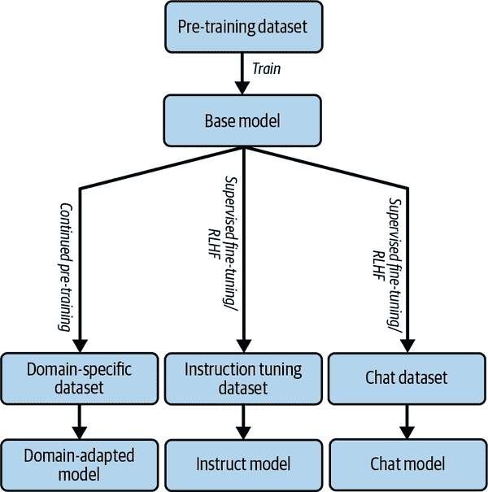
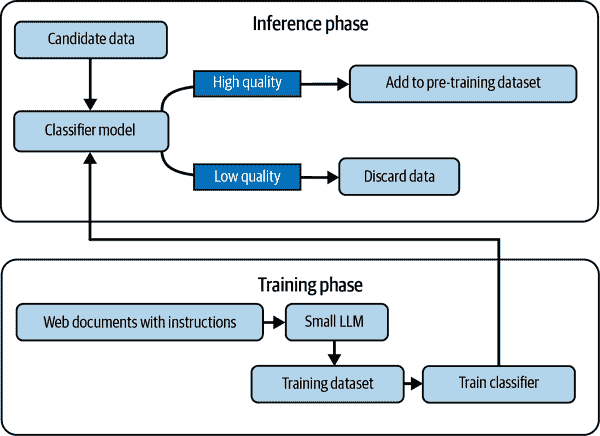

# 第二章\. 预训练数据

在第一章中，我们介绍了语言模型，指出了它们的优点和局限性，探讨了当前和潜在的应用场景，并提出了似乎支配该领域进展的扩展定律。为了为本书的其余部分奠定基础，在接下来的三章中，我们将详细讨论预训练 LLM 的配方以及它们所包含的成分。但是等等，这本书是关于利用预训练 LLM 来设计和构建用户应用的。为什么我们需要讨论从头开始预训练这些巨型模型的细微差别，这对于大多数机器学习从业者来说在他们的一生中可能永远不会做呢？

实际上，这个信息非常重要，因为在预训练过程中做出的许多决策会严重影响下游性能。正如我们在后续章节中将会注意到的，当你理解了训练过程时，失败模式就更容易理解。就像我们喜欢在杂货店的包装上看到成分列表一样，在我们将语言模型用于严重应用之前，我们希望了解制作该模型的成分。

###### 注意

关于一些只能通过 API 访问的专有 LLM，在公共领域可用的信息不多。本书将提供尽可能多的公开信息。虽然信息不足并不意味着我们应该避免使用这些模型，但在做出最终决定选择使用哪个模型时，模型透明度可能是你需要考虑的因素。

# LLM 的成分

让我们从制作 LLM 的成分开始。

从广义上讲，我们有：

预训练数据：它是在什么上训练的？

旧计算机科学的格言“垃圾输入，垃圾输出”在语言建模方面仍然适用。在本章中，我们将探讨流行的预训练数据集，并深入了解为确保向模型提供高质量数据而采取的各种预处理步骤。我们还将展示一些工具，这些工具允许我们探测这些数据集，并了解预训练数据组成如何影响下游任务。

词汇和分词器：它是在什么上训练的？

要在一种语言上构建模型，我们首先必须确定我们正在建模的语言的词汇以及将文本流分解成正确的词汇单元（称为分词）的规则。（我们将把第三章专门用于讨论这些概念。）从语言学的角度来看，人类从意义承载的单词和句子处理语言。语言模型从标记处理语言。我们将探讨当两者之间存在不匹配时的下游影响。

学习目标：它被训练去做什么？

通过预训练语言模型，我们的目标是赋予语言模型在语法、语义、推理等方面的通用技能，希望它能可靠地解决你抛给它的任何任务，即使它没有专门针对该任务进行训练。因此，训练目标应该足够通用，以捕捉所有这些技能。在第四章中，我们将讨论预训练模型所训练的各种任务（学习目标）。你可能想知道 LLM 是否更适合解决与预训练模型训练任务相似的下游任务。我们将测试这个假设，并讨论各种学习目标对任务性能的影响。

架构：它的内部结构是什么？

模型的架构指的是模型的组件，它们如何连接和相互作用，以及它们如何处理输入。每种架构都有自己的归纳偏差，即关于它将用于的数据和任务的假设集合，使模型偏向于某些类型的解决方案。在第四章中，我们将深入探讨 Transformer 架构，正如在第一章中讨论的那样，这是目前主要使用的架构。

让我们看看这些成分如何在图 2-1 中组合在一起。


###### 图 2-1\. 所有成分如何结合在一起形成一个 LLM

使用本章和下一章中描述的过程训练的语言模型被称为*基础模型*。最近，模型提供商通过在更小的数据集上微调基础模型来增强它，以便使其更符合人类的需求和偏好。一些流行的微调模式包括：

+   监督指令微调（SFT），使模型更好地遵循人类指令

+   通过人类反馈的强化学习（RLHF），使模型更好地与人类偏好对齐

+   领域自适应或任务自适应的持续预训练，使模型更好地适应特定领域和任务

根据具体的增强方式，生成的模型被称为*指令模型*、*聊天模型*等。

我们将在第六章中介绍指令和聊天模型，并在第七章中介绍领域自适应和任务自适应的预训练。



###### 图 2-2\. 基础模型及其衍生物之间的关系

# 预训练数据需求

尽管已经证明，高容量模型相对更[样本高效](https://oreil.ly/PbN6F)，但总的来说，今天的语言模型非常样本低效，这意味着它们需要大量的例子来学习一个任务。用人工标注创建如此大的监督数据集是不切实际的，因此，预训练语言模型的主要手段是使用*自监督*学习，其中目标标签存在于你的训练输入中。

使用这种设置，几乎任何类型的文本都可以被包括在预训练数据集中，理论上任何具有结构的非文本信号都可以编码成文本，并作为预训练数据集的一部分。

从我们在第一章中的扩展定律讨论中，我们知道模型性能仅通过更长时间和更多数据的训练就能提高。此外，正如第一章中讨论的，该领域的*巩固效应*提高了对单个语言模型端到端期望的预期。今天，一个模型被期望回答关于世界的事实性问题，运用算术和逻辑推理，编写代码，并提出创新的想法。

所有这些都意味着语言模型预训练所需的数据量是巨大的。现在，关键问题是世界上可用的文本数据是否真的包含了学习我们希望 LLM 学习到的所有技能所需的足够和相关的信号。

注意，仅用文本训练的语言模型只能访问语言形式，即构成句子如“Walter White 把披萨扔到屋顶上。”的字符序列。要理解其含义，语言形式必须映射到作者/说话者的沟通意图。虽然研究社区的一部分认为不能仅从形式中学习意义，但最近的语言模型越来越多地证明并非如此。

要获得完整的情况，语言形式需要与现实世界联系起来。在认知科学中，这种联系被定义为：

> 建立两个对话者之间成功沟通所需的互信息量的过程
> 
> Chandu 等人，[“在 NLP 中‘grounding’的‘grounding’”](https://oreil.ly/kPyXu)

人类文本通常非常不具体，很多沟通意图存在于文本之外，依赖于读者/听者使用他们的常识、世界知识和检测、理解情感隐含意义的能力来解释它。

###### 注意

据估计，我们从文本中理解的信息中只有大约[12%](https://oreil.ly/jg4tW)是明确提到的。有几个理论解释了为什么我们这样沟通，包括[Zipf 的最小努力原则](https://oreil.ly/UX7Nd)，它表明“人类本性是希望以最少的努力获得最大的成果。”

自然语言处理领域已经看到了[大量工作](https://oreil.ly/PbIhT)将语言模型与现实世界联系起来。结合不同模态（如图像、视频、语音和文本）的多模态模型是一个有希望的研究方向，并且它们在未来几年可能会得到更广泛的应用。想象一下，一个模型在训练文本中看到了“披萨”，同时也获得了关于它的外观、声音和味道的信号！

但是，多模态模型真的有助于解决基础问题吗？我们能否仅仅通过向模型提供大量多样化的文本来实现基础的效果？这些问题尚未解决，正如这个[辩论](https://oreil.ly/oacht)所示，双方都有很好的论据。

单独在大量文本上进行训练是否能够使语言模型学习到诸如逻辑推理等技能，这也是一个悬而未决的问题。请注意，互联网上的文本包含大量描述推理步骤的内容，如定理证明、笑话的解释、拼图的逐步答案等等。然而，衍生的文本实在不够多，这导致我们通过使用如 CoT（在第五章中进一步描述）等提示方法来弥补这一不足。有[最新证据](https://oreil.ly/Qlntp)表明，过程监督（为问题解决的每一步提供反馈）与结果监督（仅在最终解决方案上提供反馈）相比，有助于提高算术推理能力。

语言模型必须学习的一项关键技能是处理语言固有的模糊性。在上述的齐夫最小努力原则之后，模糊性使得说话者能够在沟通中的效率-清晰度权衡中做出管理。我们可以留下很多没有说出的内容，因为我们已经与沟通的对象建立了足够的共同基础，并相信他们能够填补这些空白。

早期的语言模型在建模模糊性方面遇到了很多困难。我长期以来一直将这句话作为我的 NLP 演讲中的典范例子，以突出语言的模糊性：“WWE 的约翰·塞纳出人意料地让患有癌症的 7 岁 Make-A-Wish 儿童感到惊喜。”

尽管最先进的模型能够正确地解释这个特定的句子，并且不会错误地将约翰·塞纳识别为邪恶的疾病传播巫师，但[最近的研究](https://oreil.ly/BrSwb)表明，即使是今天最好的模型仍然在处理一般性模糊性方面存在困难。仅仅通过扩大模型和数据规模是否足以让大型语言模型建模模糊性，这是一个悬而未决的问题。

如果我们解决所有这些缺陷的唯一选择是扩大数据集的大小，那么下一个问题是，我们实际上是否拥有足够的数据来让 LLM 学习这些技能。我们是否很快就会面临训练数据不足的风险？在我们领域的某些领域存在一种误解，即我们已经做到了。然而，缺乏原始数据还不是训练模型的瓶颈。例如，有数十亿可以通过抓取或免费 API 访问的公开文档尚未纳入大多数预训练数据集，例如议会程序、法院判决和大多数 SEC 文件。[“Educating Silicon”的“极限下 LLM 训练数据有多少？”](https://oreil.ly/XnmHL)估计了世界上存在的文本量。另一方面，确实，在足够大的规模上，自然发生的数据根本不足以喂养我们的模型。

因此，有人尝试使用由语言模型生成的文本，称为*合成数据*，来训练模型，尽管存在[风险](https://oreil.ly/RdzX0)，即基于 LLM 生成的数据进行训练可能会对模型产生不利影响，因为模型会偏离数据的真实分布。在本章后面，我们将了解创建用于预训练的合成数据背后的过程。

当然，并非所有数据都是平等的。我们可以通过高质量的数据实现更高的样本效率，从而需要更小的数据集大小。我们可以预处理数据，以便过滤掉低质量数据或提高其质量。究竟是什么使得数据成为高质量数据是一个复杂的问题，我们将在本章后面探讨。

# 流行预训练数据集

许多文本在公共领域并不免费可用。这包括隐藏在付费 API 和登录屏幕背后的数据，以及付费书籍和文档，其中许多甚至尚未数字化。像谷歌和 OpenAI 这样的大公司可以负担得起购买这些数据；例如，OpenAI 与*华尔街日报*、《金融时报》和其他新闻机构达成了价值数亿美元的交易，以获取其数据。特定领域的文本通常是专有的，并且仅对大型企业开放（例如，彭博社在训练[BloombergGPT](https://oreil.ly/87r4j)时部分使用了其专有的金融数据）。然而，即使是最大公司训练的模型，其训练数据中也有很大一部分来自公开的数据源。

接下来，我们将介绍一些最流行的通用预训练数据集，这些数据集被用来训练 LLM。虽然这不是一个详尽无遗的列表，但大多数 LLM，包括闭源 LLM，其训练数据中至少有一大部分来自这些来源。我们将把特定领域（针对特定领域，如社交媒体、金融、生物医学等）数据集的讨论推迟到第七章。

###### 小贴士

大多数通用 LLM 被训练成多面手——能够解决来自各种领域的任务。如果你的用例数据域包含在预训练数据集中，与未包含这些数据集的模型相比，在这些数据集上训练的模型在下游任务上可能显示出相对的性能提升，即使预训练数据是无标签的。这意味着，如果你打算在特定领域使用 LLM 进行特定、明确的用例，领域特定模型可能会证明是有希望的。你还可以在你的领域数据上执行 *持续的领域自适应* 或 *任务自适应预训练* 来利用这一现象。这将在第七章（ch07.html#ch07）中详细讨论。

下面是一些通用语言模型常用的数据源示例：

Common Crawl/C4

网络是公开可获取的文本数据最大的来源，因此构成了预训练数据集的一个重要比例。[Common Crawl](https://oreil.ly/dhBvu) 是一个非营利组织，它创建并发布所有网络爬取数据的快照，每月更新一次。然而，正如人们可以想象的那样，这是一个极其粗略的数据集，在准备使用之前需要显著清理。Google 在对 2019 年的 Common Crawl 快照应用了一系列预处理和过滤步骤后，准备了 C4（Colossal Clean Crawled Corpus），这是一个 750GB 的英语语言数据集，并发布了相应的代码。[Dodge 等人](https://oreil.ly/bxmVR) 使用此脚本重现了 C4，并将其公开。C4 已被用于训练包括 T5 系列中所有模型在内的几个知名 LLM。

The Pile

[The Pile](https://oreil.ly/7UAcY) 是来自 Eleuther AI 的 825GB 数据集，它专注于从更多样化的来源发布数据集。数据多样性很重要，因为预训练中的领域内未标记数据有助于该领域的下游性能，多样化的数据集也使得模型能够泛化到之前未见过的任务和领域。为此，The Pile 的数据不仅来自 Common Crawl，还包括 PubMed Central、arXiv、GitHub、FreeLaw 项目、Stack Exchange、美国专利和商标局、Ubuntu IRC、HackerNews、YouTube、PhilPapers、NIH ExPorter、Project Gutenberg 和 Wikipedia 等。The Pile 及其子集已被选为训练几个 LLM 的数据源，包括 [Llama](https://oreil.ly/_8eOD)。

WebText/OpenWebText/OpenWebText2

这些指的是网络文本的一个子集，并且仅限于在 Reddit 上代表出站链接的网页，这些链接至少有三个 *karma*，即用户点赞和踩的绝对差值。假设群众的智慧将只允许高质量链接浮现，这些链接包含人们真正感兴趣的信息。在此数据上训练过的模型包括 GPT-2 和 GPT-3。

Wikipedia

维基百科在几乎所有通用大型语言模型的训练中都扮演着重要角色。维基百科的完整存档包含了有价值的百科全书文本，为模型提供了事实知识。维基百科的编辑系统确保文本遵循高度结构化的格式。然而，在风格上并不多样，因为文本是以正式的方式编写的。因此，仅靠维基百科不足以训练一个基本的语言模型，需要结合包含多样写作风格的数据源。

BooksCorpus/BooksCorpus2

可能是所有前训练数据集中历史影响力最大的一个，这个数据集是知名模型如 BERT、RoBERTa、GPT-2/3 等的训练语料库的一部分。BooksCorpus 包含超过 7,000 本由未发表作者撰写的免费、主要是虚构书籍。原始数据集中 26% 的书籍属于浪漫类型。BooksCorpus 的副本存在于 The Pile 中，称为 BooksCorpus2。

FineWeb

在本书撰写时，[FineWeb](https://oreil.ly/1GyZd) 是世界上最大的公开可用的前训练数据集。由 Hugging Face 发布，FineWeb 拥有 1500 万亿个 token，并从 96 个 Common Crawl 快照中提取，经过严格的清洗和过滤过程。Hugging Face 还发布了 [FineWeb-Edu](https://oreil.ly/8XHH-)，这是 FineWeb 的一个子集，由教育数据组成，这对于使大型语言模型通过标准化测试和流行基准至关重要。

表 2-1 提供了一些最常用数据集的列表，包括它们的大小、发布年份以及访问它们的方式。

表 2-1\. 流行的前训练数据集

| 名称 | 数据来源 | 大小 | 发布年份 | 公开？ | 使用此数据集的模型 |
| --- | --- | --- | --- | --- | --- |
| C4 | Common Crawl | 750GB | 2019 | 是（复制品） | T5, FLAN-T5, UL2, Llama, 等 |
| The Pile | Common Crawl, PubMed Central, Wikipedia, arXiv, Project Gutenberg, Stack Exchange, USPTO, GitHub, 等 | 825GB | 2020 | 是 | GPT-NeoX, GPT-J, Cerebras-GPT, StableLM, Pythia, 等 |
| RedPajama | Common Crawl, GitHub, Wikipedia, arXiv, Stack Exchange, 等 | 1.2T tokens | 2023 | 是 | Red Pajama-INCITE, MPT |
| BooksCorpus | 从 smashwords.com 抽样 | 7400 万句子 | 2015 | 原始数据不再可用 | 包括 BERT、GPT 等在内的多数模型 |
| OpenWebText2 | Reddit 外链 | 65GB | 2020 | 是 | GPT-2, GPT-3 |
| ROOTS | 大科学目录，Common Crawl，GitHub | 1.6T tokens | 2022 | 否（但可请求提供） | BLOOM |
| RefinedWeb | Common Crawl | 5T tokens | 2023 | 是（仅 600B 子集） | Falcon |
| SlimPajama | 从 RedPajama 清洗而来 | 627B tokens | 2023 | 是 | N/A |

表格突出了这样一个事实：大多数模型都是在类似的数据源上训练的。在本章中，我们将限制我们的覆盖范围到基础模型的预训练数据集。我们将在 第六章 中介绍用于增强基础模型的数据集，如指令微调数据集、RLHF 数据集等。

让我们探索这些预训练数据集的内容。使用 Google Colab 笔记本或你选择的代码编辑器，加载 C4 数据集的 `realnewslike` 子集，该子集大约消耗 15 GB：

```py
!pip install datasets
from datasets import dataset
realnewslike = load_dataset("allenai/c4", "realnewslike",
                            streaming=True, split="train")
for i, example in enumerate(realnewslike):
    if "Iceland" in example["text"]:
        print(example)
    if i == 10000:  # Limit to 10,000 iterations for demonstration
        break
```

使用此代码，我们可以观察到在 C4 子集中出现冰岛的所有实例。

# 合成预训练数据

一个新兴趋势是使用 LLM 生成可用于预训练 LLM 的合成数据。在训练包含大量合成数据的 LLM 数据集方面，第一个成功案例之一是微软的 [phi 系列模型](https://oreil.ly/eFphR)。对于 phi-1.5 模型，微软创建了 200 亿个合成数据标记，使用 20,000 个种子主题和来自现实世界网络数据集的样本作为提示。

Hugging Face 发布了 [Cosmopedia](https://oreil.ly/Pdwnw)，这是一个开源的合成数据集，用于训练 SmolLM 系列模型。其种子数据包括经过精心挑选的资源，如斯坦福课程、可汗学院和 WikiHow，以及一般网络数据。

对于精心挑选的资源，通过从可汗学院和其他来源提取课程大纲并提示 Mistral LLM 为各个部分生成详细的长篇教科书来生成合成数据。为了大规模生成多样化的数据，Hugging Face 为每个主题发布了几个变体的提示，例如“为幼儿创建这个主题的教科书”和“为专业人士创建这个主题的教科书”。

对于一般网络数据，Hugging Face 将 RefinedWeb 数据集的一个子集聚类到一百多个主题中。然后，LLM 被提示使用网页片段，并要求在网页所属的主题背景下生成一篇广泛的博客文章。聚类可视化可以在 [Nomic Atlas](https://oreil.ly/t8R-6) 中探索。

# 训练数据预处理

一旦我们收集或获取了数据，我们需要通过运行预处理管道来过滤和清理数据。数据预处理是 LLM 训练管道中最不引人注目且最不被重视的部分，但也许是最重要的。根据我的经验，在这个阶段投入更多努力和资源可以带来显著的下游性能提升。在我们遍历数据处理管道时，我希望你能体会到语言文本的复杂性和处理它的难度。请注意，由于这些数据集非常大，任何预处理步骤都应该非常高效（理想情况下为线性时间）。

图 2-3 展示了用于生成预训练数据集的典型预处理步骤。步骤的顺序不是固定的，但某些步骤之间存在依赖关系。


###### 图 2-3\. 数据收集和预处理流程

让我们详细地走一遍这些步骤。

## 数据过滤和清洗

从 HTML 文件中提取的大多数文本都是乱码，例如来自网站的菜单文本、模板文本和随机的网页碎片。互联网上也有大量的色情和有害/仇恨性语言。例如，以下是 C4 数据集未清洗版本的一个文本样本：

> 跳转到主要内容 跳转到页脚 跳转到电子邮件注册 跳转到反馈表单 MY REWARDS 登出 登录并赚取奖励 0 键盘控制 欢迎来到主要导航。此菜单有三个产品类别的层级。使用和键在当前层级的每个类别之间导航。使用键向下导航一个层级。使用键向上导航一个层级。按键可转到所选类别页面。菜单 热门新品 新品上市 品牌联合性能在线独家快闪必备度假婚礼礼服军装趋势 9 件/33 款造型 The Edit x Express NBA Collection Express + NBA 时尚 NBA 改变游戏规则西装与夹克衫在线购物独家系列

你认为这段文本对语言和任务学习有多大的帮助？

Common Crawl 的数据以原始 HTML 和网页提取文本（WET）格式提供。虽然许多数据集创建者直接使用 WET 文件，但开源组织 Eleuther AI [注意到](https://oreil.ly/hciZS)，WET 文件的质量还有很多需要改进的地方，如上所示，HTML 模板文本仍然突出。因此，为了创建 The Pile，Eleuther AI 使用了 [jusText 库](https://oreil.ly/YRFzZ) 来更可靠地从 HTML 文档中去除模板文本。

让我们通过一个例子来探索使用 jusText 的影响。在你的 Google Colab 或 Jupyter 笔记本中，尝试以下操作：

```py
!pip install justext

import requests
import justext

response =
  requests.get("https://en.wikipedia.org/wiki/Toronto_Transit_Commission")
text = justext.justext(response.content, justext.get_stoplist("English"))
for content in text:
  if content.is_boilerplate:
    print(content.text)
```

输出显示了从标准维基百科文章中过滤出的所有模板文本：

```py
Jump to content
Main menu
Main menu
Navigation
Main page
Contents
Current events
Random article
About Wikipedia
Contact us
Donate
Contribute
Help
Learn to edit
…
```

jusText 正好更积极地去除内容，但对于清理预训练数据集来说通常是可行的，因为可用的文本量很大。用于此任务的某些替代库包括 [Dragnet](https://oreil.ly/URvsq)、[html2text](https://oreil.ly/xk7Hc)、[inscriptis](https://oreil.ly/6-2z1)、[Newspaper](https://oreil.ly/LPXe1) 和 [Trafilatura](https://oreil.ly/zdZxj)。根据 [The Pile](https://oreil.ly/DZG7w) 的创建者，将提取流程分散到多个库中可以降低结果数据集受到任何库引入的偏差的影响。

在网页中去除模板文本是一个具有挑战性的任务。网页还可能包含代码块、表格和数学公式，这些都需要仔细处理。[Meta](https://oreil.ly/bXELJ) 指出，为了准备训练 Llama 3 的数据集，它构建了一个定制的 HTML 解析器。它还提到，Meta 保留了图像中的 *alt* 属性，它发现其中包含有用的信息，如数学内容。

LLMs 也可以用来从网页中准确提取内容。然而，截至本书编写时，考虑到数据集的规模，这样做成本过高。

一旦提取文本，文档就会通过一系列数据过滤步骤。首先，应用基于启发式的基本过滤步骤。虽然不同数据集的细节不同，但以下是一些通常执行的步骤：

模板文本移除

只有以标点符号结束的行，如句号、感叹号和问号，才会被保留。这确保了来自网站的菜单文本被移除。只有包含超过特定阈值的单词的行和包含超过特定阈值的句子的文档会被保留。后者有助于建模长序列，这对于语言模型来说是一个重要的能力。包含“lorem ipsum…”和其他模板文本的文档会被过滤掉。

非英语文本移除

类似于 langdetect、langid、fasttext 和 pycld2 这样的库被用来检测文本的语言。例如，C4 保留 langdetect 判断英语概率大于 0.99 的文本。请注意，这些库也可以用来移除模板文本和网页碎片，因为它们给这些文本的英语概率较低。

搜索引擎优化（SEO）文本/垃圾邮件移除

移除包含大量重复字符序列的文档。移除低比例封闭类词汇的文档。英语中的封闭类词汇是功能词，如“of”，“at”，“the”和“is”。如果一个页面正在进行关键词堆砌和其他 SEO 技巧，那么它们的封闭类词汇比例会较低。

恶俗/侮辱性文本移除

移除包含来自像[“脏话、下流、淫秽或其他不良词汇列表”](https://oreil.ly/w3u_r)等关键词列表中任何单词的文档。

类似于 langdetect 和 langid 这样的工具对于大规模快速确定文本所使用的语言很有帮助，但它们如何处理代码切换文本（包含多种语言，其中英语通常与本地语言交织）呢？

你可以试试！以下是一个关于 Taglish（菲律宾常见的交流模式，即他加禄语+英语）的例子。在你的笔记本中运行以下代码：

```py
!pip install langdetect
from langdetect import detect_langs()
detect_langs("""Pag-uwi ko galing sa paaralan, sobrang pagod ako dahil sa dami
ng aking ginawa sa buong araw. Ang traffic din sa kalsada, nakaka-stress
talaga! Pero nang makarating ako sa aking tahanan, nabuhayan ako ng loob dahil
sa masarap na amoy ng ulam na inihanda ni nanay. Excited na akong kumain
kasama ang aking pamilya at i-share ang mga kwento ko tungkol sa aking mga
kaibigan, guro, at mga natutunan ko sa school. After dinner, magre-relax muna
ako habang nanonood ng TV, and then magre-review ng lessons bago matulog. Ito
ang routine ko pag-uwi mula sa school, at masaya ako na dumating sa bahay namay
naghihintay na pamilya na handang makinig at suportahan ako sa aking
pag-aaral.""")
```

输出：

```py
[tl:0.9999984631271781]
```

```py
detect_langs("""After a long day at school, pagod na pagod talaga ako. The
traffic on the way home didn't help, nakakastress na nga! But upon arriving
home, I felt a sense of relief dahil sa welcoming atmosphere and the delicious
aroma of the ulam na inihanda ni Mommy. Excited na akong mag-share ng
experiences ko today with my family during dinner, kasama ang mga kwento about
my friends, teachers, and interesting lessons sa school. After eating, it's
time for me to chill while watching some TV shows, and then review my lessons
bago ako matulog. This is my daily routine pag-uwi galing school, and I am
grateful na may loving family ako na handang makinig at supportahan ako sa
aking educational journey.""")
```

输出：

```py
[en:0.9999954357601804]
```

根据其过滤标准（英语的概率应大于.99），第二段将被包含在 C4 数据集中。因此，即使声称是纯英语的数据集也经常包含其他语言的文本，导致推理过程中出现令人惊讶的多语言行为。你是否曾想过为什么一些单语模型在机器翻译方面似乎表现良好？这是一个主要原因。

langdetect 的实现方式使其在提供短序列时识别语言的能力较差。例如：

```py
detect_langs('I love you too.')
```

返回

```py
[sk:0.8571379760844766, en:0.14285726700161824]
```

sk 在这里指的是斯洛伐克语。

## 选择优质文档

并非所有数据都是平等的。与关于鞋类品牌的促销性文本相比，高中物理教科书的文本被认为是更高品质的。我们有几种方法可以将质量概念具体化，并将高质量数据与低质量数据区分开来。在本节中，我们将突出介绍几种这样的方法。

### 标记分布 K-L 散度

在这种方法中，那些与参考标记分布差异过大的文档会被移除。实际上，这移除了包含大量异常标记的文档。这是通过使用[库尔巴克-利布勒（K-L）散度](https://oreil.ly/gd5GH)来计算的。

### 基于分类器的方法

我们还可以构建一个用于识别高质量数据的分类器。构建基于质量分类器的一个简单方法是将正类的示例来自像维基百科这样的高质量数据源，而负类的示例则来自 Common Crawl 数据中的随机文档。

Meta 为其[Llama 3 模型](https://oreil.ly/O-CKF)的高质量数据提取使用了多种分类器模型。其中之一是一个[fasttext 分类模型](https://oreil.ly/EWic6)，用于识别文本是否可能被维基百科引用。Meta 还训练了一个分类器，其训练数据由 Llama 2 生成，通过向其提供清洗过的网络文档和质量要求，并要求其判断是否满足质量要求。为了提取包含推理步骤的代码和文本，Meta 构建了能够识别它们的分类器。

图 2-4 展示了如何构建一个分类器来区分高质量和低质量数据。



###### 图 2-4\. 基于分类器的质量过滤

### 质量选择的困惑度

[困惑度](https://oreil.ly/OfycZ)，作为语言模型的一个内在评估指标，在准备预训练数据集的上下文中用于文档过滤，特别是由[CCNet](https://oreil.ly/VF98y)的创建者所使用。困惑度衡量模型预测给定文本的能力；困惑度越低，模型越好。

就像分类器方法一样，我们从我们认为高质量的数据源（如维基百科）中选择文档作为正类。然后，我们使用[KenLM](https://oreil.ly/EU5r3)（一个便于训练 n-gram 语言模型的库）在所选数据上训练一个 5-gram 语言模型。接下来，我们取我们想要过滤的数据集，并计算其中每个段落相对于训练语言模型的困惑度。困惑度越低，它与正类越相似。然后我们可以丢弃困惑度高的文档。

低困惑度不一定总是好事。简短、重复的文本可能具有低困惑度。请注意，写作风格被纳入困惑度计算。如果参考语言模型是在维基百科上训练的，那么非正式风格的文档可能会获得更高的困惑度分数。因此，拥有更复杂的过滤策略将是有益的。

为了解决这个问题，[BERTIN](https://oreil.ly/uI9eV)的创造者引入了困惑度采样的概念。在困惑度采样中，它不仅过滤掉低困惑度文本，还使用一种采样策略，从困惑度概率分布的中间部分进行过采样。

图 2-5 展示了在实际中如何实现困惑度采样。


###### 图 2-5。困惑度采样

让我们探索由维基百科文本训练的模型分配的困惑度分数。下载此[文件](https://oreil.ly/xwYjY)。将文件放置在您的家目录中后，在新的文件中运行此代码：

```py
from model import KenlmModel
model = KenlmModel.from_pretrained("wikipedia", "en")
model.get_perplexity("She was a shriveling bumblebee, and he was a bumbling
banshee, but they accepted a position at Gringotts because of their love for
maple syrup")
```

###### 注意

根据[C4](https://oreil.ly/Nzla7)的分析，向数据集贡献最大比例文本的互联网域名是 patents.google.com。实际上，来自这个域的超过 10%的文本是机器翻译的，例如，来自日本的专利是从日语翻译成英语的。因此，大量的预训练数据实际上并非由人类生成！

驱动于大型语言模型（LLM），互联网预计将广泛普及由 AI 生成的文本。识别文本是由人类还是 LLM 编写的是一个非平凡的任务，并且在大规模上肯定不可行。这将如何影响未来 LLM 的性能是一个开放的研究问题。

尽管进行了所有数据清洗步骤，但在这个规模级别上，生成的数据集仍然不会完美。例如，Eleuther AI [报告](https://oreil.ly/WEBne)称，在 The Pile 中，模板句“从下面的选择中选择您想要访问的论坛”出现了 18 万次。

## 去重

到目前为止，我们已经讨论了数据提取和清洗、语言识别和质量过滤。现在让我们探索管道中最具争议的步骤：去重。

我们知道网络爬取的文本中充斥着大量重复内容。重复内容构成了训练数据集的非小部分，因此对它们的任何决策都将对后续模型产生显著影响。

我们如何定义重复内容？我们将区分三种类型：

完全匹配

两个具有相同文本的序列是精确匹配的重复内容。它们是最容易处理的。

近似匹配

在许多情况下，存在近似重复内容，其中文本序列除了少数字符外完全相同。有时这些序列之所以略有不同，仅是因为 HTML 文本提取伪影和其他过滤过程。

语义重复

语义上传达相同内容但使用不同措辞的重复项。这通常被视为超出范围。

根据它们发生的粒度，重复项也可以进行分类：

文档级别的重复

在准备大多数预训练数据集的过程中，会移除重复文档。然而，在某些数据集（如 The Pile）中，某些子集（如维基百科）被故意重复，以便模型更频繁地看到它们。

序列级别的重复

这些是在多个文档中重复出现的行或句子。在某些情况下，它们可以被大量复制，如服务条款文本、版权声明、网站前言等。

###### 注意

去重是一个非常复杂的过程，通常使用 MinHash 算法来执行。[程浩](https://oreil.ly/2RO9f) 的这篇文档详细介绍了在 Big Science 和 Big Code 开源 LLM 项目中遵循的去重过程。

去重数据有几个好处：

+   通常会将预训练数据集的一个小部分留出用于验证/测试。去重可以确保训练集和测试集之间重叠的去除/减少，这对于无偏评估至关重要。如果没有序列级别的去重，训练集和测试集中常见文本序列的重叠可能性很高。

+   移除重复序列可以减少训练数据集的整体大小。然而，[李等人](https://oreil.ly/k5OwJ) 表明，在较小的数据集上训练的模型的困惑度并未受到影响。因此，模型可以在较短的时间内以相同的效益进行训练。

+   去重还可以减少模型记住其训练数据的倾向。记忆与模型过拟合密切相关，并阻碍了模型泛化的能力。虽然有很多方法可以量化记忆，但我们将关注 *通过生成进行记忆*，即如果一个模型能够逐字逐句地生成一个序列，那么它就被认为已经记住了这个序列。[李等人](https://oreil.ly/xpoz7) 的研究表明，在去重后的序列级别数据集上训练的模型生成的逐字逐句的训练数据量减少了十倍。

###### 小贴士

使用在公共数据集上训练的模型的一个优点是，你可以搜索数据集以查看模型生成的文本是否逐字逐句地存在于数据集中。

图 2-6 展示了基本的训练数据提取攻击流程。


###### 图 2-6\. 对 LLM 的隐私攻击

## 移除个人可识别信息

虽然去重可以减少模型记住训练数据的可能性，但它绝不是记忆问题的万能药。即使在训练集中只出现一次的信息也可能被记住（并泄露）。虽然训练数据中的许多内容是无害的（服务条款文本）甚至可能希望记住（如加拿大首都的事实信息），但个人可识别信息（PII）的记忆是一个主要问题。

让我们看看个人身份信息（PII）包含哪些内容。来自[康奈尔法律](https://oreil.ly/kN3J8)的正式定义如下：

> 可以用来区分或追踪个人身份的信息，无论是单独使用还是与其他个人或识别信息结合使用，这些信息是相关联的或可关联到特定个人的。

根据这个定义，当另一条信息变得公开时，非个人身份信息（PII）可以变成个人身份信息（PII），当它与非个人身份信息（PII）结合使用时，可以用来唯一识别个人。

个人身份信息（PII）的法律定义因司法管辖区而异。例如，欧洲的[通用数据保护条例（GDPR）](https://oreil.ly/F2dGL)规定：

> 应将保护扩展到任何用于直接或间接识别个人（或数据主体）的东西。这可能包括描述“个人的身体、生理、遗传、心理、商业、文化或社会身份”的特征。

大多数开源模型都是在公开可用的数据集上训练的。这些数据集可能包含个人身份信息（PII），但有人可能会想，“嗯，它已经公开了，所以没有必要保护隐私。”这种论点忽略了同意和可发现性控制的重要性。例如，我可能在博客上分享了个人身份信息，我的博客位于互联网的一个隐蔽角落，不容易通过搜索引擎发现，但如果它最终被添加到预训练数据集中，它突然将数据置于聚光灯下，而没有我的同意。这个概念被称为*情境完整性*：数据只应在共享的原始情境中共享。

因此，理想情况下，我们希望能够在数据集中*检测*到个人身份信息（PII），并以某种方式对其进行*修复*，使得个人身份信息（PII）不再存在于训练数据中，或者至少不是可记忆的。*公众人物的个人身份信息*的存在给这个问题增加了复杂性。我们希望我们的模型能够准确回答有关公众人物的客观问题，例如提供他们的出生日期。公众人物的隐私期望较低，展示了透明度和开放性价值观与隐私之间的冲突。确定谁是公众人物以及他们有权获得何种程度的隐私是一个复杂的社会技术挑战。

被认为是私密的包括姓名、地址、信用卡数据、政府身份证明、医疗历史和诊断数据、电子邮件地址、电话号码、个人所属的认同和亲和群体（宗教、种族、工会会员）、地理位置数据等等。

攻击可以是针对性的也可以是非针对性的。在非针对性攻击中，攻击者只是使用模型生成大量文本，然后运行成员推理攻击，以确定其中最有可能被记住的文本。在针对性攻击中，攻击者试图恢复特定个人或一组个人的个人信息。针对性攻击更难执行，因为虽然语言模型擅长记忆，但它们在 *关联* 方面表现不佳，例如，识别一个电子邮件 ID 属于特定个人。

大多数预训练数据集都经历了很少或没有 PII 补救。训练 BLOOM 模型的 Big Science 项目（我是联合负责人）的隐私工作组开发了一个用于 PII 检测和补救的流程，我们将在下一节中讨论。

###### 注意

语言模型也容易受到训练数据中毒攻击。由于大部分训练数据来源于网络爬取的文本，恶意行为者有机会影响训练集的内容。[Tramer 等人](https://oreil.ly/g_A-d) 已经表明，可以通过数据中毒的方式影响不到 0.1% 的训练集，这些数据的效果是使得训练集中的其他数据更容易泄露。

随着大型语言模型越来越多地被用作搜索引擎，对 LLM SEO 的需求正在出现。例如，一家公司可以在其网站上以某种方式撰写内容，使其更有可能在采用困惑度过滤的预训练数据集创建过程中被选中。

图 2-7 展示了一个典型的 PII 处理流程。


###### 图 2-7\. PII 处理流程

### PII 检测

PII 检测的任务类似于第一章中介绍的 NLP 任务 NER（命名实体识别）。然而，并非所有命名实体都构成 PII。对于我们的任务，我们确定的 PII 标签包括：PERSON（人物）、AGE（年龄）、NORP（国籍、种族、宗教、政党隶属、社会经济阶层和工会会员）、STREET_ADDRESS（街道地址）、CREDIT_CARD（信用卡）、GOVT_ID（政府身份证明）、EMAIL_ADDRESS（电子邮件地址）、USER_ID（用户 ID）和 PUBLIC_FIGURE（公众人物）。

我们使用 PUBLIC_FIGURE 标签来识别关于公众人物的信息，因为我们不想过滤掉这些信息。我们还把虚构人物分配了这个标签。

在这个列表中的一些结构化标签，如电子邮件和政府身份证，可以使用正则表达式进行识别。对于其他标签，我们标注了数据集，然后可以使用这些数据集来训练基于 Transformer 的 NER-like 模型。有趣的是，我们观察到高度不一致的标注者间差异（不同的人对相同示例的标注不同），这突显了隐私定义的文化细微差别以及构成个人信息的内容。

这里是检测 SSN（美国社会安全号码）的正则表达式：

```py
ssn_pattern = r"(?!000|666|333)0*(?:[0-6][0-9][0-9]|[0-7][0-6][0-9]|
[0-7][0-7][0-2])-\ [0-9]{2}-\ [0-9]{4}"
```

注意，检测与验证不同。并非所有九位数的 XXX-XX-XXXX 形式的数字都是 SSN！验证是检查字符序列是否映射到有效标识符的过程。例如，SSN 的加拿大对应物，社会保险号（SIN）包含一个校验位，可以用来验证它：

```py
from stdnum.ca import sin
sin_pattern = re.compile(r"\d{3}[-\ ]\d{3}[-\ ]\d{3}", flags=re.X)
for match in sin_pattern.findall(text):
    if sin.is_valid(match):
         print(match)
```

`is_valid()`函数使用[Luhn 校验算法](https://oreil.ly/i34BW)来验证数字序列是否映射到有效的 SIN。相同的算法也用于验证信用卡。以下是检测信用卡号码的正则表达式：

```py
from stdnum import luhn
cc_base_pattern =  r"\b \d (?:\d[ -]?){14} \d \b"
cc_full_pattern = r"""4[0-9]{12}(?:[0-9]{3})? |
 (?:5[1-5][0-9]{2}|222[1-9]|22[3-9][0-9]|2[3-6][0-9]{2}|27[01][0-9]|
 2720)[0-9]{12} |
 3[47][0-9]{13} |
 3(?:0[0-5]|[68][0-9])[0-9]{11} |
 6(?:011|5[0-9]{2})[0-9]{12} |
 (?:2131|1800|35\d{3})\d{11}"""
```

用于检测电子邮件地址的正则表达式如下：

```py
email_pattern = r"[\w\.=-]+ @ [\w\.-]+ \. [\w]{2,3}"
```

###### 注意

在保持假阳性数量低的同时移除结构化 PII 数据已经足够困难，但检测和修复非结构化数据则更加困难。由于这项任务的复杂性和其对模型性能影响的不可确定性，我们决定不将基于 Transformer 的 PII 管道应用于 ROOTS 数据集以训练 BLOOM 模型。

### PII 修复

一旦检测到 PII，就可以进行修复。图 2-8 展示了其中一种修复方案。


###### 图 2-8. PII 修复选项

这里是一个非详尽的修复选项列表：

用特殊标记替换

例如，一个有效的电话号码可以被替换为字符串`<phone number>`。

用相同实体类型的随机标记替换

例如，将名字“Clarietta Richards”替换为“Natasha Bridges”，或任何其他名字。

用打乱顺序的标记替换

在整个数据集中检测到的实体可以进行打乱。

删除整个文档/数据源

如果单个文档或数据源中检测到的 PII 数量高于特定阈值，最好将其删除。例如，据说*pastebin.com*包含大量意外放置的 PII，并建议不要将其包含在训练数据集中。

这些技术对模型下游性能的影响可能各不相同。替换标记如何影响训练困惑度？当在生成的模型上调整时，下游任务如 NER 是否会受到负面影响？特殊标记的替换与随机标记的替换相比如何？这是一个相对未被充分探索的主题，所有这些问题仍然悬而未决。

[Faker](https://oreil.ly/K4QI_)是一个用于促进随机令牌替换的优秀库。它支持为各种 PII 类型生成随机令牌，包括姓名、地址、信用卡号码和电话号码。使用随机令牌的一个危险是，替换过程可能会改变数据集的人口分布，例如，如果替换的名称都是或主要是盎格鲁-撒克逊名称。Faker 支持本地化，可以使用同一地理/文化区域的虚假数据替换。让我们更详细地探索这个库：

```py
from faker import Faker
fake = Faker('en_IN')   # Indian locale
Faker.seed(0)
for i in range(5):
   print(fake.aadhaar_id)
```

此代码生成 12 位假的 Aadhaar ID，这是印度社会保障号码的等价物。请注意，生成的 ID 都是无效的，但仍然遵循相同的格式。同样：

```py
for i in range(5):
   print(fake.address)
```

为选定的区域生成代表性的虚假地址。

###### 注意

从训练数据集中移除 PII（个人身份信息）是防止模型数据泄露的几种解决方案之一。一种有前途的技术是[差分隐私](https://oreil.ly/TRbsf)，它在输入或输出中引入随机性，以提供隐私保护的理论保证。在神经网络中，差分隐私通过[DP-SGD](https://oreil.ly/DVQkl)算法实现，该算法涉及在每个更新结束时进行梯度裁剪和噪声添加。然而，差分隐私会显著减慢训练速度，对模型性能产生负面影响，并使数据集中少数群体的模型效用退化不成比例。除了差分隐私之外，其他方法还包括对抗训练、[模型反学习](https://oreil.ly/_AV3V)、[事后审查和“memfree”解码](https://oreil.ly/5p0z3)。

## 训练集去污

训练集去污是数据预处理的关键步骤，有助于提高 LLM 评估。如果一个预训练数据集包含用于评估其性能的基准测试集的数据，则称其为受污染。污染可能发生在测试数据集由网络文本构建，或者数据集在创建后上传到网络的情况下。有两种类型的污染：^(1)

输入和标签污染

在此设置中，问题和答案（目标标签）都存在于预训练数据集中。

输入污染

在此设置中，只有输入存在于预训练数据集中，但没有目标标签。我们将描述输入污染的影响以及我们如何在第七章中利用它进行积极的应用。

[OpenAI](https://oreil.ly/d7pHK)通过在测试/验证集文本和训练集之间找到 13-gram 重叠，并在匹配文本前后删除 200 个字符来解决 GPT-3 中的训练集污染问题。n-gram 匹配方法是去污中最常用的方法。

然而，[Yang 等人](https://oreil.ly/JjtHS) 指出，如果基准数据的改写或翻译出现在训练数据集中，也可能发生污染。这使得数据污染的检测和去除变得非常困难。由于这个问题，大多数基准结果仍然被高估。

## 数据混合

预训练数据集包含来自广泛领域的数据。最终数据集的制备确保这些领域以最佳比例表示。例如，在 The Pile 数据集中，维基百科、学术文本和较小的子集被 [upsampled](https://oreil.ly/hpHdw) 至最多三倍。还使用了 [DoReMi](https://oreil.ly/5z9u1) 和 [RegMix](https://oreil.ly/VWyzt) 等更复杂的技巧来计算正确的数据混合。Meta 指出，对于 [Llama 3](https://oreil.ly/fMOrb)，它经验性地得出了一种数据混合，其中 50% 的标记关于一般知识，25% 关于数学和推理，17% 代表代码，其余的是非英语标记。

###### 注意

许多预训练数据集现在都包含代码，即使模型并非旨在生成代码。[Aryabumi 等人](https://oreil.ly/Vm0lH) 已经表明，在预训练数据中包含代码可以显著提高不涉及生成代码的下游任务的表现。

现在我们已经讨论了准备预训练数据集所需的所有重要数据收集和预处理步骤，让我们看看各个数据集在预处理步骤上的差异。

###### 小贴士

Hugging Face 的 [DataTrove](https://oreil.ly/lDFm2) 是一个完整的预训练数据集预处理流程代码仓库。您可以查看该仓库以了解本章中介绍的概念是如何大规模实现的。

表 2-2 提供了流行预训练数据集及其所经历的预处理类型列表。

表 2-2\. 预训练数据集及其预处理流程

| 名称 | 提取和清洗 | 质量过滤 | 去重 | 语言识别 | 使用此数据集训练的模型 |
| --- | --- | --- | --- | --- | --- |
| C4 | 移除包含黑名单中单词的页面，移除代码，移除短行和页面 | - | 3 句跨度去重 | langdetect | T5, FLAN-T5, UL2, Llama |
| The Pile | justext 库用于文本提取 | fasttext 分类器 | 文档级，使用 MinHashLSH | pycld2 | GPT-NeoX, GPT-J, Cerebras-GPT, StableLM, Pythia |
| CCNet | - | 混淆度过滤 | 段落级去重 | fasttext |  |
| RedPajama | CCNet 流程 | 区分维基百科文本和随机 C4 文本的分类器 | 段落级去重（针对 Common Crawl） | fasttext | Red Pajama-INCITE, MPT |
| CleanPajama | 低长度过滤器，NFC 规范化 | - | MinHashLSH | - | - |
| 精炼网络 | 通过黑名单进行 URL 过滤，使用 trafilatura 库进行文本提取，重复内容移除 | - | 使用 MinHash 进行模糊文档级去重，使用精确序列级去重 | fasttext | Falcon |
| 根 | 移除具有低封闭类词比例、高黑名单词比例、高字符/词重复比例的文档 | 混淆度过滤 | SimHash, 后缀数组 | fasttext | BLOOM |

# 预训练数据对下游任务的影响

对于一个 LLM 的预训练数据集，我们可以从它那里得出哪些关于下游性能的假设？事实证明，模型在特定任务或输入上的性能与该任务或输入中的显著词在预训练数据集中的频率之间存在相关性。这一现象首先由 [Razeghi 等人](https://oreil.ly/cPYej)观察到，并在 McCoy 等人的论文“自回归的余烬”（“Embers of Autoregression”）中进行了详细研究。

McCoy 等人表明，语言模型在训练数据集中出现频率更高的任务上的表现优于出现频率较低的任务。例如，语言模型在十进制加法上的表现优于九进制加法。它们在按字母顺序排序上的表现也优于按逆字母顺序排序。

类似地，McCoy 等人也表明，对于给定的任务，当输出是预训练数据集中高频文本时，模型的表现相对较好，而不是当文本是低频时。这种现象也适用于输入；与低频输入相比，模型在高频输入上的表现相对较好。

例如，考虑以下句子：“record a be that miles, yes, hour, per fifty clocked he。”我们要求 LLM 反转句子中的单词，这将导致“他每小时五十英里，是的，英里，那是一个记录，”这是一个相当低概率的序列，因为它有奇怪的语构。

在本书撰写时，GPT-4o 返回了错误的答案：“他以每小时五十英里的速度行驶，这是一个记录，”但你可能会注意到，当输出序列的概率更高时，它的表现相对较好。

# 预训练数据集中的偏差和公平性问题

在大型语言模型的产品化过程中，会出现许多伦理问题。这些模型中存在的重大偏差和公平性问题通常会导致大量用例无法发货。在本节中，我们将探讨一些与预训练数据的收集和过滤特别相关的偏差和公平性问题。

LLMs 所接受的数据规模意味着它们不仅仅是构建语言模型，也在构建我们所处的世界模型。这引发了一个问题：我们是否想要按照世界的本来面目来建模，还是按照我们希望它成为的样子来建模。互联网充满了仇恨、暴力和侮辱性语言，经常被用作人类最恶劣冲动的一种出口。其中的文本隐含地编码了对某些人群长期存在的偏见。例如，在《Pile》中，对词共现统计的分析[显示](https://oreil.ly/hu3-b)，“radical”一词与“穆斯林”一词的共现频率显著高于与其他宗教的共现频率。

*偏差放大*的现象使这些问题变得更加关键。研究表明，大型语言模型[放大了](https://oreil.ly/x-ba9)其预训练数据中编码的偏差：它们以比训练数据统计所暗示的更高的比率对某些人群做出有偏见的预测。

那么，我们能否“修复”我们的训练数据，以便我们可以构建一个编码了我们的价值观和原则的世界模型，下游应用将继承这些价值观和原则？在研究界对此有大量的争议。反对者认为，由于存在许多相互交织的复杂偏见维度，很难识别和修复数据中编码的所有社会偏见。价值观并非普遍适用，模型提供者希望保持价值中立，以迎合社会的各个部分。

然而，正如安娜·罗杰斯在她的[论文](https://oreil.ly/hxU_-)中所描述的，这个问题已经变得无关紧要。数据整理已经在进行中，无论我们是否喜欢，模型提供者的价值观和利益已经被编码到模型中。例如，只有一小部分可用数据被选中成为预训练集的一部分。这个选择过程并非价值中立，即使一个人可能没有明确地从这个角度去思考。

维基百科是用于训练 LLMs 的更受欢迎的数据集之一。虽然将维基百科包含在预训练数据集中可能是不言而喻的，但让我们探讨其影响。维基百科由志愿者编辑，其中很大一部分是男性。由于是否一个主题足够有信誉值得拥有维基百科页面取决于主要由男性组成的编辑，我们看到一些来自低级别联赛的男性足球运动员有自己的页面，而大量关于女性的传记文章则被计划删除。

同样，高度影响力的 WebText 数据集来源于 Reddit 的外链。Reddit 是一个以男性为主的网站，[74%的用户](https://oreil.ly/i2RkB)是男性。自然地，Reddit 上发布的链接更有可能迎合男性的兴趣。

在数据过滤阶段也可能引入偏差。之前我们提到，关键词列表常用于过滤掉色情材料和侮辱性文本。然而，使用简单的关键词列表是一种懒惰的方法，不仅存在有效性问题（假阴性），而且无意中[导致](https://oreil.ly/XWBjV)过滤掉由少数族裔社区撰写或关于少数族裔社区的积极文本，以及使用像非裔美国英语和西班牙语系英语这样的方言撰写的文本。英语单词具有多种含义的事实导致某些关于母乳喂养的文档被从 C4 数据集中过滤掉。

总的来说，一个词是否仇恨、侮辱或有毒，取决于社会环境、读者的意图以及目标受众。基于关键词的方法根本无法捕捉这种细微差别。关于是否在预训练阶段或更下游处理这些问题更有效，这是一个开放的研究领域。我们将在第十章中探讨可以用于下游的技术。

###### 注意

[Pythia 模型](https://oreil.ly/r4oAT)的作者通过将最后 7%的训练标记中的男性代词替换为女性代词进行了实验，并注意到对下游任务的去偏影响。

# 摘要

在本章中，我们概述了语言模型的关键组成部分：预训练数据、词汇和分词器、语言目标以及模型架构。我们详细介绍了创建预训练数据集的步骤，包括语言识别、文本提取和清理、质量过滤、去重、PII 移除和测试集净化。我们还提供了一份常用预训练数据集列表以及预处理每个数据集的步骤。在下一章中，我们将探讨语言模型的词汇和分词器：我们希望模型学习到的语言。

^(1) 来自 Dodge 等人，《“大规模清洁爬取语料库案例研究”》，EMNLP 2021。
