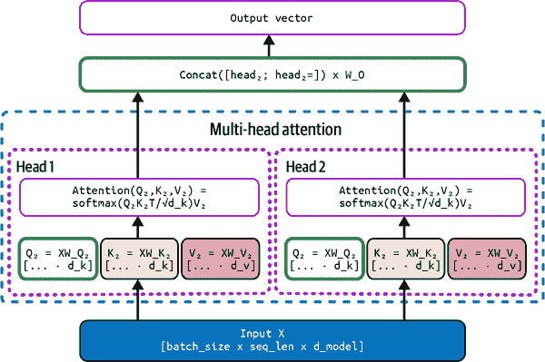
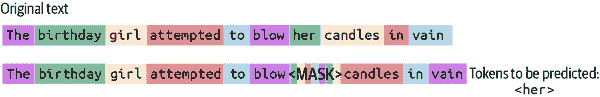

# 第四章\. 架构和学习目标

在第二章 2 和第三章 3 中，我们讨论了构建语言模型的一些关键要素：训练数据集、词汇和分词器。接下来，让我们通过了解模型本身、支撑它们的架构以及它们的学习目标来完善这个拼图。

在本章中，我们将学习语言模型的组成及其结构。现代语言模型主要基于 Transformer 架构，因此我们将主要关注理解它，通过详细研究架构的每个组件。在过去的几年里，已经提出了许多原始 Transformer 架构的变体和替代方案。我们将探讨其中一些有前景的方案，包括混合专家（MoE）模型。我们还将检查语言模型训练中常用的学习目标，包括下一个标记预测。最后，我们将通过学习如何从头开始预训练语言模型，将前三章的概念在实践中结合起来。

# 前言

几乎所有的当代语言模型都是基于神经网络，由称为*神经元*的处理单元组成。虽然现代神经网络与人类大脑的工作方式完全不相似，但神经网络背后的许多思想和使用的术语都受到了神经科学领域的影响。

神经网络中的神经元按照某种配置相互连接。每对神经元之间的连接都关联着一个权重（也称为*参数*），表示连接的强度。这些神经元所扮演的角色以及它们相互连接的方式构成了模型的*架构*。

2010 年代初，多层架构大量涌现，神经元层堆叠在一起，每一层提取输入的越来越复杂的特征。这种范式被称为*深度学习*。

图 4-1 展示了一个简单的多层神经网络，也称为多层感知器。


###### 图 4-1\. 多层感知器

###### 小贴士

想要更全面地了解神经网络，请参阅关于基于神经网络的自然语言处理的[Goldberg 的书籍](https://oreil.ly/oDc6x)。

如第一章所述，语言模型主要是通过自监督学习进行预训练的。训练数据集中的输入文本被标记化并转换为向量形式。然后，输入通过神经网络传播，受到其权重和*激活函数*的影响，后者为模型引入了非线性。模型的输出与预期的输出（称为黄金真理）进行比较。输出权重被调整，以便下次对于相同的输入，输出可以更接近黄金真理。

在实践中，这个过程是通过一个*损失函数*实现的。模型的目标是使损失最小化，损失是模型输出和黄金真理之间的差异。为了最小化损失，使用基于梯度下降的方法，称为反向传播，来更新权重。我强烈建议在深入模型训练之前，先对这种算法有一个直观的理解。

# 表示意义

在上一节中描述基于神经网络的架构时，我们忽略了这样一个事实：输入文本被转换成向量，然后通过网络传播。这些向量由什么组成，它们代表什么？理想情况下，在模型训练完成后，这些向量应该准确地代表文本的某些意义方面，包括其社会含义。为文本或图像等模态开发正确的表示是一个非常活跃的研究领域，被称为*表示学习*。

###### 注意

当从头开始训练语言模型时，这些向量最初没有任何意义，因为它们是随机生成的。在实践中，使用了如 Glorot、He 等初始化算法。有关神经网络初始化的入门指南，请参阅[这份报告](https://oreil.ly/A8Iro)。

数字列表如何代表意义？人类描述一个词或句子的意义已经很困难，更不用说用可以被计算机处理的数值形式来表示它了。一个词的*形式*，即构成它的字母，通常不会提供关于它所代表的意义的任何信息。例如，单词*umbrella*中的字母序列没有任何关于其意义的线索，即使你已经接触到了成千上万的英语单词。

在数值形式中表示意义的突出方式是通过*分布假设*框架。分布假设指出，具有相似意义的词出现在相似的环境中。这个假设的含义最好用一句谚语来表示：

> 你可以通过一个词所伴随的词来了解这个词。
> 
> 约翰·鲁珀特·费尔思，1957

这是我们获取之前未曾遇到的词语意义的主要方式之一，无需查阅词典。我们知道的许多词语并非来自词典或通过明确学习词语的意义，而是通过根据词语出现的上下文来估计意义。

让我们调查分布假设在实际中是如何工作的。自然语言工具包（NLTK）库提供了一个名为*共现视图*的功能，它向您展示给定词语在语料库中出现的周围上下文。

例如，让我们看看“nervous”一词在简·奥斯汀的经典作品《爱玛》中出现的上下文：

```py
from nltk.corpus import gutenberg
from nltk.text import Text
corpus = gutenberg.words('austen-emma.txt')
text = Text(corpus)
text.concordance("nervous")
```

输出看起来像这样：

```py
Displaying 11 of 11 matches:
...spirits required support . He was a nervous man , easily depressed...
...sitting for his picture made him so nervous , that I could only take...
...assure you , excepting those little nervous headaches and palpitations...
...My visit was of use to the nervous part of her complaint , I hope...
...much at ease on the subject as his nervous constitution allowed...
...Her father was growing nervous , and could not understand her....
...
```

# Transformer 架构

既然我们已经对文本以向量形式表示有了直觉，让我们进一步探索今天用于训练语言模型的典型架构，即 Transformer。

在 2010 年代中期，用于自然语言处理任务的占主导地位的架构是循环神经网络，特别是称为长短期记忆（LSTM）的一种变体。虽然对循环神经网络的知识不是本书的先决条件，但我推荐[*《自然语言处理中的神经网络方法》*](https://oreil.ly/CHCTd)以获取更多详细信息。

循环神经网络是序列模型，这意味着它们逐个标记地、顺序地处理文本。一个向量被用来表示整个序列的状态，因此随着序列变长，越来越多的信息需要被捕捉到单个状态向量中。由于处理的顺序性，长距离依赖关系更难捕捉，因为序列开头的内容会更难保留。

这个问题被资深计算机科学家 Ray Mooney 坦率地阐述，他在 2014 年的计算语言学（ACL）会议上评论说：

> 你不能把整个句子的意义塞进一个单一的$&!#*向量！
> 
> Ray Mooney，2014

因此，需要一个能够解决 LSTM 缺陷的架构：在表示长距离依赖关系、依赖于单个向量来表示整个序列的状态以及更多方面。Transformer 架构被设计来解决这个问题。

图 4-2 展示了 2017 年由[Vaswani 等人](https://oreil.ly/tIvGZ)开发的原始 Transformer 架构。如图所示，Transformer 模型通常由堆叠在一起的 Transformer 块组成，称为*层*。每个块的关键组件包括：

+   自注意力

+   位置编码

+   前馈网络

+   归一化块


###### 图 4-2\. Transformer 架构

在第一个块的开头有一个特殊的层，称为*嵌入层*。这是将输入文本中的标记映射到它们对应向量的地方。嵌入层是一个矩阵，其大小为：

```py
Number of tokens in the vocabulary * The vector dimension size
```

在 Hugging Face 上，我们可以使用`transformers`库这样检查嵌入层：

```py
import torch
from transformers import LlamaTokenizer, LlamaModel

tokenizer = LlamaTokenizer.from_pretrained('llama3-base')
model = LlamaModel.from_pretrained('llama3-base')

sentence = "He ate it all"

inputs = tokenizer(sentence, return_tensors="pt")
input_ids = inputs['input_ids']
tokens = tokenizer.convert_ids_to_tokens(input_ids[0])

with torch.no_grad():
    embeddings = model.embeddings(input_ids)

for token, embedding in zip(tokens, embeddings[0]):
    print(f"Token: {token}\n `print``(``f``"Embedding:` `{``embedding``}``\n``"``)`
```

```py` The embedding vectors are the inputs that are then propagated through the rest of the network.    Next, let’s go through each of the components in a Transformer block in detail and explore their role in the modeling process.    ## Self-Attention    The self-attention mechanism draws on the same principle as the distributional hypothesis introduced in “Representing Meaning”, emphasizing the role of context in shaping the meaning of a token. This operation generates representations for each token in a text sequence, capturing various aspects of language like syntax, semantics, and even pragmatics.    In the standard self-attention implementation, the representation of each token is a function of the representation of all other tokens in the sequence. Given a token for which we are calculating its representation, tokens in the sequence that contribute more to the meaning of the token are given more weight.    For example, consider the sequence:    ``` 'Mark told Sam that he was planning to resign.' ```py    Figure 4-3 depicts how the representation for the token *he* is heavily weighted by the representation of the token *Mark*. In this case, the token *he* is a pronoun used to describe Mark in shorthand. In NLP, mapping a pronoun to its referent is called *co-reference resolution*.    ###### Figure 4-3\. Attention map    In practice, self-attention in the Transformer is calculated using three sets of weight matrices called queries, keys, and values. Let’s go through them in detail. Figure 4-4 shows how the query, key, and value matrices are used in the self-attention calculation.    Each token is represented by its embedding vector. This vector is multiplied with the query, key, and value weight matrices to generate three input vectors. Self-attention for each token is then calculated like this:    1.  For each token, the dot products of its query vector with the key vectors of all the tokens (including itself) are taken. The resulting values are called attention scores.           2.  The scores are scaled down by dividing them by the square root of the dimension of the key vectors.           3.  The scores are then passed through a [*softmax function*](https://oreil.ly/b6gHV) to turn them into a probability distribution that sums to 1\. The softmax activation function tends to amplify larger values, hence the reason for scaling down the attention scores in the previous step.           4.  The normalized attention scores are then multiplied by the value vector for the corresponding token. The normalized attention score can be interpreted as the proportion that each token contributes to the representation of a given token.           5.  In practice, there are multiple sets of query, key, and value vectors, calculating parallel representations. This is called multi-headed attention. The idea behind using multiple heads is that the model gets sufficient capacity to model various aspects of the input. The more the number of heads, the more chances that the *right* aspects of the input are being represented.              ###### Figure 4-4\. Self-attention calculation    This is how we implement self-attention in code:    ``` 导入 torch 库，导入 torch.nn 模块，导入 torch.nn.functional 模块  q = wQ(input_embeddings) k = WK(input_embeddings) v = WV(input_embeddings) dim_k = k.size(-1)  attn_scores = torch.matmul(q, k.transpose(-2, -1)) scaled_attn_scores = attn_scores/torch.sqrt(torch.tensor(dim_k,   dtype=torch.float32))  normalized_attn_scores = F.softmax(scaled_attn_scores, dim=-1)  output = torch.matmul(normalized_attn_scores, v) ```py    ###### Note    In some Transformer variants, self-attention is calculated only on a subset of tokens in the sequence; thus the vector representation of a token is a function of the representations of only some and not all the tokens in the sequence.    ## Positional Encoding    As discussed earlier, pre-Transformer architectures like LSTM were sequence models, with tokens being processed one after the other. Thus the positional information about the tokens, i.e., the relative positions of the tokens in a sequence, was implicitly baked into the model. However, for Transformers all calculations are done in parallel, and positional information should be fed to the model explicitly. Several methods have been proposed to add positional information, and this is still a very active field of research. Some of the common methods used in LLMs today include:    Absolute positional embeddings      These were used in the original Transformer implementation by [Vaswani et al.](https://oreil.ly/CDq60); examples of models using absolute positional embeddings include earlier models like BERT and RoBERTa.      Attention with Linear Biases (ALiBi)      In this technique, the attention scores are [penalized](https://arxiv.org/abs/2108.12409) with a bias term proportional to the distance between the query token and the key token. This technique also enables modeling sequences of longer length during inference than what was encountered in the training process.      Rotary Position Embedding (RoPE)      Just like ALiBi, this [technique](https://arxiv.org/abs/2104.09864) has the property of relative decay; there is a decay in the attention scores as the distance between the query token and the key token increases.      No Positional Encoding (NoPE)      A contrarian [technique](https://oreil.ly/QM9dW) argues that positional embeddings in fact are not required and that Transformers implicitly capture positional information.      Models these days are mostly using ALiBi or RoPE, although this is one aspect of the Transformer architecture that is still actively improving.    ## Feedforward Networks    The output from a self-attention block is fed through a [*feedforward network*](https://oreil.ly/Bdphg). Each token representation is independently fed through the network. The feedforward network incorporates a nonlinear activation function like [Rectified Linear Unit (ReLU)](https://oreil.ly/KUqtP) or [Gaussian Error Linear Units (GELU)](https://oreil.ly/MSDKE), thus enabling the model to learn more complex features from the data. For more details on these activation functions, refer to this [blog post from v7](https://oreil.ly/NfOb0).    The feedforward layers are implemented in code in this way:    ``` 导入 torch 库，导入 torch.nn 模块  class FeedForward(nn.Module):     def __init__(self, input_dim, hidden_dim):         super(FeedForward, self).__init__()         self.l1 = nn.Linear(input_dim, hidden_dim)         self.l2 = nn.Linear(hidden_dim, input_dim)         self.selu = nn.SeLU()      def forward(self, x):         x = self.selu(self.l1(x))         x = self.l2(x)         return x   feed_forward = FeedForward(input_dim, hidden_dim) outputs = feed_forward(inputs) ```py    ## Layer Normalization    Layer normalization is performed to ensure training stability and faster training convergence. While the original Transformer architecture performed normalization at the beginning of the block, modern implementations do it at the end of the block. The normalization is performed as follows:    1.  Given an input of batch size `b`, sequence length `n`, and vector dimension `d`, calculate the mean and variance across each vector dimension.           2.  Normalize the input by subtracting the mean and dividing it by the square root of the variance. A small epsilon value is added to the denominator for numerical stability.           3.  Multiply by a scale parameter and add a shift parameter to the resulting values. These parameters are learned during the training process.              This is how it is represented in code:    ``` 导入 torch 库，导入 torch.nn 模块  class LayerNorm(nn.Module):     def __init__(self, dimension, gamma=None, beta=None, epsilon=1e-5):         super(LayerNorm, self).__init__()         self.epsilon = epsilon         self.gamma = gamma if gamma is not None else         nn.Parameter(torch.ones(dimension))         self.beta = beta if beta is not None else         nn.Parameter(torch.zeros(dimension))       def forward(self, x):         mean = x.mean(-1, keepdim=True)         variance = x.var(-1, keepdim=True, unbiased=False)         x_normalized = (x - mean) / torch.sqrt(variance + self.epsilon)         return self.gamma * x_normalized + self.beta  layer_norm = LayerNorm(embedding_dim) outputs = layer_norm(inputs) ```py ````  ```py```` # 损失函数    到目前为止，我们已经讨论了每个 Transformer 块的所有组件。对于下一个 token 预测学习目标，输入通过 Transformer 层传播以生成最终输出，这是一个跨越所有 token 的概率分布。在训练过程中，损失是通过比较输出分布与黄金真实值来计算的。黄金真实值分布将 1 分配给黄金真实 token，将 0 分配给所有其他 token。    有许多可能的方法来量化输出与黄金真实值之间的差异。最流行的一种是交叉熵，其计算公式如下：    ```py Cross-Entropy= −∑(gold truth probability)×log(output probability) ```    例如，考虑以下序列：    ```py 'His pizza tasted ______' ```    假设黄金真实 token 是 *good*，输出概率分布是 (*terrible*: 0.65, *bad*:0.12, *good*:011,…​)    交叉熵计算如下：    ```py −(0×log(0.65)+0×log(0.12)+1×log(0.11)+...)= −log(0.11) ```    由于黄金真实分布值对所有 token 都是 0（除了正确的 token），因此方程可以简化为：    ```py Cross-Entropy = -log(output probability of gold truth token) ```    一旦计算了损失，就计算损失相对于模型参数的梯度，并使用反向传播算法更新权重。    # 内在模型评估    我们如何知道反向传播算法实际上正在工作，并且模型随着时间的推移正在变得更好？我们可以使用内在模型评估或外在模型评估。    外在模型评估涉及在真实世界的下游任务上测试模型的表现。这些任务直接测试模型的表现，但仅限于模型能力的狭窄范围。相比之下，内在模型评估涉及对模型建模语言能力的更一般评估，但没有任何保证其内在评估指标的表现与所有可能的下游任务的表现直接成比例。    最常见的内在评估指标是 *困惑度*。困惑度衡量语言模型准确预测序列中下一个 token 的能力。如果一个模型总能正确预测下一个 token，则其困惑度为 1。困惑度越高，语言模型越差。在最坏的情况下，如果模型随机预测，每个 token 在词汇表中的预测概率为 1/V，则困惑度为 V。    困惑度与交叉熵通过以下公式相关：    ```py Perplexity = 2^Cross-Entropy ```    # Transformer 主干    到目前为止，我们已经描述了 Transformer 规范版本的组件。在实践中，三种主要的架构主干被用来实现 Transformer：    *   仅编码器           *   编码器-解码器           *   仅解码器              让我们详细看看这些。    图 4-5 展示了仅编码器、编码器-解码器和仅解码器架构。    ###### 图 4-5\. 各种 Transformer 主干的可视化    ## 仅编码器架构    当基于 Transformer 的语言模型首次出现时，仅编码器架构非常流行。使用仅编码器架构的标志性语言模型（约在 2018 年）包括 BERT、RoBERTa 等。    自 2021 年以来，由于几个原因，包括：    *   相对较难训练。           *   通常用于训练它们的掩码语言建模目标通常只在少量 token（掩码率）中提供学习信号，因此需要更多的数据才能达到与仅解码器模型相同的表现水平。           *   对于每个下游任务，你需要为每个特定任务训练一个单独的头，这使得使用效率低下。              然而，ModernBERT 的发布似乎重新激发了这一领域。    UL2 语言模型的创造者声称，仅编码器模型应该被认为是过时的。我个人不会走那么远；仅编码器模型仍然是分类任务的绝佳选择。此外，如果你已经围绕仅编码器模型构建了满足你用例的令人满意的管道，我会说如果它没有坏，为什么要修复它？    下面是采用仅编码器模型的指南：    *   RoBERTa 在大多数情况下比 BERT 表现更好，因为它在更多数据上训练了更长的时间，并且它采用了 BERT 发布后学到的最佳实践。           *   DeBERTa 和 ModernBERT 目前被认为是表现最好的仅编码器模型。           *   像 DistilBERT 这样的仅编码器模型的蒸馏版本在性能上与原始模型相差不远，如果你在资源受限的情况下运行，应该考虑它们。              从仅编码器模型构建了几个嵌入模型。例如，在 NLP 领域最重要的库之一，NLP 工具的瑞士军刀 *sentence transformers*，提供了广泛使用的仅编码器嵌入模型。基于仅编码器模型 MPNet 的 all-mpnet-base-v2，在几个任务数据集上进行微调，仍然与更大的嵌入模型具有竞争力。    ## 编码器-解码器架构    这是 Transformer 的原始架构，正如它最初提出的那样。T5 系列模型使用这种架构类型。    在编码器-解码器模型中，输入是文本，输出也是文本。一个标准化的接口确保可以使用相同的模型和训练程序用于多个任务。输入由编码器处理，输出由解码器处理。    ## 仅解码器架构    今天训练的大多数 LLM 使用仅解码器模型。仅解码器模型从 OpenAI 的原始 GPT 模型开始流行起来。仅解码器模型在零样本和少样本学习中表现出色。    解码器模型可以是因果的和非因果的。非因果模型在输入序列上具有双向性，而输出仍然是自回归的（你不能向前看）。    ###### 小贴士    虽然该领域仍在不断发展，但有一些[令人信服的证据](https://oreil.ly/Sb7JS)表明以下结果：    *   仅解码器模型是零样本和少样本泛化的最佳选择。           *   编码器-解码器模型是多任务微调的最佳选择。              最好的两者结合是结合两者：从自回归训练开始，然后在适应步骤中，使用跨度损坏目标进一步使用非因果设置进行预训练。    在本节中，我们讨论了如何根据架构的编码器和解码器的使用方式对架构主干进行分类。在过去一年中取得进展的另一种架构主干类型是专家混合（MoE）范式。让我们详细探讨一下。    ## 专家混合    惊人的是，自从 Transformer 架构发明以来七年中，当前语言模型中使用的 Transformer 实现与原始版本并没有太大的不同，尽管有数百篇论文提出了对其的修改。原始架构证明出人意料的鲁棒性，大多数提出的变体在性能方面几乎没有移动指针。然而，Transformer 的一些组件已经发生了变化，如本章前面讨论的位置编码。    MoE 模型在过去几年中取得了很大的成功。例如，OpenAI 的 GPT-4（未确认）、Google 的 Switch、DeepSeek 的 DeepSeek V3 和 Mistral 的 Mixtral。在本节中，我们将学习开发这种架构背后的动机以及它在实践中是如何工作的。    如第一章中所示，扩展定律规定，随着模型大小和训练数据量的增加，语言模型的表现也会提高。然而，增加模型容量意味着在训练和推理过程中都需要更多的计算。这在推理时间是不希望的，因为延迟要求可能非常严格。我们能否在不增加所需计算的情况下增加模型的容量？    实现这一目标的一种方法是通过条件计算；每个输入（无论是 token 还是整个序列）都看到模型的不同子集，只与最适合处理它的参数交互。这是通过将架构组合成由几个称为专家的组件来实现的，每个输入只激活专家的一个子集。    图 4-6 展示了典型的 MoE 模型。    ###### 图 4-6\. 专家混合    MoE 架构的一个关键组件是 *门控函数*。门控函数有助于决定哪个专家更适合处理给定的输入。门控函数作为应用于每个专家的权重来实现。    专家通常添加到 Transformer 的馈前组件中。因此，如果有八个专家，那么将会有八个馈前网络而不是一个。根据使用的路由策略，对于给定的输入，只有一小部分这些网络会被激活。    路由策略决定了激活专家的数量和类型。存在两种流行的路由策略：    *   Tokens 选择           *   Experts 选择              在 tokens 选择策略中，每个 token 选择 k 个专家。k 通常是一个小数字（~2）。使用这种策略的缺点是需要负载平衡。如果在给定的输入批次中，大多数 token 最终使用相同的专家，那么需要额外的时间来完成计算，因为我们不能从多个专家提供的并行化中受益。    在 experts 选择策略中，每个专家选择它最能处理的 token。这解决了负载平衡问题，因为我们可以指定每个专家选择相同数量的 token。然而，这也导致了不高效的 token-expert 匹配，因为每个专家被限制在批次中只选择有限数量的 token。    # 学习目标    现在我们已经讨论了语言模型的架构，让我们将注意力转向理解它们在预训练过程中训练的任务。    如本章前面所述，语言模型以自监督的方式进行预训练。我们需要训练它们所需的数据规模使得进行监督学习变得过于昂贵，在监督学习中（输入，输出）示例需要来自人类。相反，我们使用一种称为自监督的训练形式，其中数据本身包含目标标签。自监督学习的目标是学习一个作为学习语言语法和语义以及推理、算术和逻辑操作等认知技能的代理的任务，以及（希望）最终达到通用人类智能。这是如何工作的？    例如，让我们以典型的语言建模任务为例：预测序列中的下一个单词。考虑以下序列：    ```py 'Tammy jumped over the' ```    并要求语言模型预测下一个 token。所有可能答案的总数是词汇表的大小。有许多有效的后续序列，如（hedge，fence，barbecue，sandcastle 等），但许多后续序列会违反英语语法规则，如（is，of，the）。在训练过程中，在看到数十亿个序列之后，模型将知道单词“the”后面跟着单词“is”或“of”的可能性非常高，无论周围的环境如何。因此，你可以看到仅预测下一个 token 是多么强大的工具：为了正确预测下一个 token，你最终可以学习越来越多的复杂函数，你可以将它们编码到你的模型连接中。然而，这种范式是否是我们开发通用智能所需要的全部，这是一个悬而未决的问题。    用于预训练 LLM 的自监督学习目标可以大致分为（非详尽）三种类型：    *   全语言建模（FLM）           *   掩码语言建模（MLM）           *   前缀语言建模（PrefixLM）              让我们详细探讨这些。    ## 全语言建模    图 4-7 显示了全语言建模目标正在发挥作用。    ###### 图 4-7\. 全语言建模    这是学习预测序列中下一个 token 的典型语言建模目标，目前是最简单、最常用的训练目标，由 GPT-4 和大量开源模型使用。对于模型看到的每个 token，即训练集中要求语言模型预测的每个 token 都提供了学习信号，这使得它非常高效。    让我们用一个例子来探讨，使用 GPT Neo 模型。    假设我们使用全语言建模目标继续从其公开可用的检查点预训练 GPT Neo 模型。假设当前的训练序列是：    ```py 'Language models are ubiquitous' ```    你可以运行以下代码：    ```py import torch from transformers import AutoTokenizer, GPTNeoForCausalLM   tokenizer = AutoTokenizer.from_pretrained("EleutherAI/gpt-neo-1.3B") model = GPTNeoForCausalLM.from_pretrained("EleutherAI/gpt-neo-1.3B")   input_ids = tokenizer("Language models are", return_tensors="pt") gen_tokens = model.generate(**input_ids, max_new_tokens =1,  output_scores=True, return_dict_in_generate=True) output_scores = gen_tokens["scores"] scores_tensor = output_scores[0] sorted_indices = torch.argsort(scores_tensor[0], descending=True)[:20]   for index in sorted_indices:     token_id = index     token_name = tokenizer.decode([token_id.item()])     token_score = scores_tensor[0][index].item()     print(f"Token: {token_name}, Score: {token_score}") ```    此代码将输入文本 `Language models are` 分词，并通过调用 `generate()` 函数将其馈送到模型。该函数根据给定的序列`Language models are`预测后续内容。它只输出一个 token 并停止生成，因为 `max_new_tokens` 设置为 1。其余代码使其能够输出在应用 softmax 到最后一层之前得分最高的前 20 个 token 的列表。    得分最高的前 20 个 token 如下：    ```py Output: Token:  a, Score: -1.102203369140625 Token:  used, Score: -1.4315788745880127 Token:  the, Score: -1.7675716876983643 Token:  often, Score: -1.8415470123291016 Token:  an, Score: -2.4652323722839355 Token:  widely, Score: -2.657834053039551 Token:  not, Score: -2.6726579666137695 Token:  increasingly, Score: -2.7568516731262207 Token:  ubiquitous, Score: -2.8688106536865234 Token:  important, Score: -2.902832508087158 Token:  one, Score: -2.9083480834960938 Token:  defined, Score: -3.0815649032592773 Token:  being, Score: -3.2117576599121094 Token:  commonly, Score: -3.3110013008117676 Token:  very, Score: -3.317342758178711 Token:  typically, Score: -3.4478530883789062 Token:  complex, Score: -3.521362781524658 Token:  powerful, Score: -3.5338563919067383 Token:  language, Score: -3.550961971282959 Token:  pervasive, Score: -3.563507080078125 ```    似乎每个词都在前 20 个中都是序列的有效后续。地面实况是 token `ubiquitous`，我们可以用它来计算损失并启动反向传播过程以进行学习。    作为另一个例子，考虑以下文本序列：    ```py 'I had 25 eggs. I gave away 12\. I now have 13' ```    运行与之前相同的代码，除了以下更改：    ```py input_ids = tokenizer("'I had 25 eggs. I gave away 12\. I now have",   return_tensors="pt") ```    输出的前 20 个 token 如下：    ```py Token:  12, Score: -2.3242850303649902 Token:  25, Score: -2.5023117065429688 Token:  only, Score: -2.5456185340881348 Token:  a, Score: -2.5726099014282227 Token:  2, Score: -2.6731367111206055 Token:  15, Score: -2.6967623233795166 Token:  4, Score: -2.8040688037872314 Token:  3, Score: -2.839219570159912 Token:  14, Score: -2.847306728363037 Token:  11, Score: -2.8585362434387207 Token:  1, Score: -2.877161979675293 Token:  10, Score: -2.9321107864379883 Token:  6, Score: -2.982785224914551 Token:  18, Score: -3.0570476055145264 Token:  20, Score: -3.079172134399414 Token:  5, Score: -3.111320972442627 Token:  13, Score: -3.117424726486206 Token:  9, Score: -3.125835657119751 Token:  16, Score: -3.1476120948791504 Token:  7, Score: -3.1622045040130615 ```    正确答案的得分是第 17 高，很多数字出现在前 10 位，这表明模型对答案的猜测基本上是随机的，这对于像 GPT Neo 这样的较小模型并不奇怪。    OpenAI API 提供了 `logprobs` 参数，允许你指定需要返回的 token 数量及其 log 概率。截至本书编写时，只有 20 个最可能 token 的 `logprobs` 可用。返回的 token 按其 log 概率顺序排列：    ```py import openai openai.api_key = <Insert your OpenAI key>   openai.Completion.create(   model="gpt-4o",   prompt="I had 25 eggs. I gave away 12\. I now have ",   max_tokens=1,   temperature=0,   logprobs = 10 ) ```    此代码调用较旧的 gpt-4o 模型，要求它生成最多一个 token。输出如下：    ```py "top_logprobs":            {             "\n": -0.08367541,             " 13": -2.8566456,             "____": -4.579212,             "_____": -4.978668,             "________": -6.220278             …           } ```    gpt-4o 非常确信答案是 13，这是正确的。其余的前 20 个概率最高的 token 都与输出格式有关。    ###### 小贴士    在推理过程中，我们不一定需要生成得分最高的 token。几种 *解码策略* 允许你生成更多样化的文本。我们将在[第五章中讨论这些策略。    ## 前缀语言建模    前缀 LM 类似于 FLM 设置。区别在于 FLM 是完全因果的，即在一个从左到右书写的系统（如英语）中，token 不会关注右边的 token（未来）。在前缀 LM 设置中，文本序列的一部分，称为前缀，允许关注前缀中的未来 token。因此，前缀部分是非因果的。为了训练前缀 LM，随机采样前缀长度，并仅对后缀中的 token 计算损失。    ## 掩码语言建模    图 4-8 显示了 BERT 中掩码语言建模目标正在发挥作用。    ###### 图 4-8\. BERT 中的掩码语言建模    在 MLM 设置中，我们不是预测序列中的下一个 token，而是要求模型预测序列中的掩码 token。在 BERT 模型中实现的 MLM 的最基本形式中，15%的 token 被随机选择进行掩码，并用特殊的掩码 token 替换，然后要求语言模型预测原始 token。    T5 模型的创造者使用了对原始 MLM 目标的修改。在这个变体中，15%的 token 被随机选择从序列中删除。连续删除的 token 被替换为单个独特的特殊 token，称为 *哨兵 token*。然后，模型被要求预测和生成由哨兵 token 分隔的删除 token。    例如，考虑以下序列：    > Tempura has always been a source of conflict in the family due to unexplained reasons    假设我们删除了 token“has”，“always”，“of”和“conflict”。序列现在是：    > Tempura <S1> been a source <S2> in the family due to unexplained reasons    其中 S1，S2 是哨兵 token。模型期望输出：    > <S1> has always <S2> of conflict <E>    输出序列由表示序列结束的特殊 token 终止。    仅生成删除的 token 而不是整个序列在计算上更有效，并且节省了训练时间。请注意，与全语言建模不同，损失仅在输入序列中的少量 token（掩码 token）上计算。
