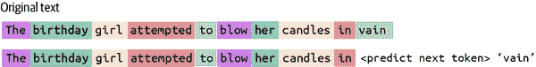
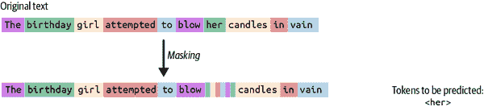
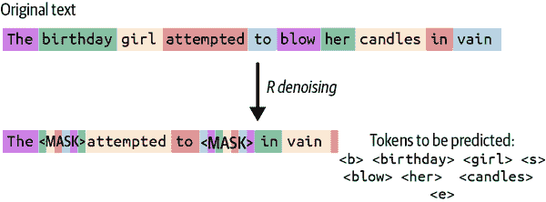
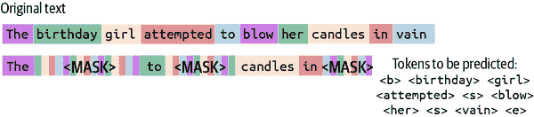

# 第四章. 架构和学习目标

在第二章和第三章中，我们讨论了构建语言模型的关键要素：训练数据集、词汇表和分词器。接下来，让我们通过学习模型本身、支撑它们的架构以及它们的学习目标来完善这个拼图。

在本章中，我们将学习语言模型的组成及其结构。现代语言模型主要基于 Transformer 架构，因此我们将主要关注理解它，通过详细研究架构的每个组件。在过去的几年里，已经提出了几种原始 Transformer 架构的变体和替代方案。我们将探讨其中一些有前景的方案，包括混合专家（MoE）模型。我们还将检查语言模型训练中常用的学习目标，包括下一个标记预测。最后，我们将通过学习如何从头开始预训练语言模型，将前三章的概念在实践中结合起来。

# 前言

几乎所有的当代语言模型都是基于神经网络，由称为*神经元*的处理单元组成。虽然现代神经网络与人类大脑的工作方式完全不相似，但许多神经网络背后的思想和使用的术语都受到了神经科学领域的影响。

神经网络中的神经元按照某种配置相互连接。每对神经元之间的连接都关联着一个权重（也称为*参数*），表示连接的强度。这些神经元所扮演的角色以及它们相互连接的方式构成了模型的*架构*。

2010 年代初，多层架构开始流行，神经元层堆叠在一起，每一层提取输入的更复杂特征。这种范式被称为*深度学习*。

图 4-1 展示了一个简单的多层神经网络，也称为多层感知器。


###### 图 4-1\. 多层感知器

###### 小贴士

若想更全面地了解神经网络，请参阅 [Goldberg 的书籍](https://oreil.ly/oDc6x)关于基于神经网络的自然语言处理。

如第一章所述，语言模型主要是通过自监督学习进行预训练的。训练数据集中的输入文本被标记化并转换为向量形式。然后，输入通过神经网络传播，受到其权重和*激活函数*的影响，后者为模型引入了非线性。模型的输出与预期输出（称为黄金真实值）进行比较。输出权重被调整，以便下次对于相同的输入，输出可以更接近黄金真实值。

实际上，这个过程是通过*损失函数*实现的。模型的目标是最小化损失，即模型输出与黄金真实值之间的差异。为了最小化损失，使用基于梯度下降的方法，称为反向传播，来更新权重。我强烈建议在深入模型训练之前，先对这种算法有一个直观的理解。

# 表示意义

在上一节中描述基于神经网络的架构时，我们忽略了这样一个事实，即输入文本被转换为向量，然后通过网络传播。这些向量由什么组成，它们代表什么？理想情况下，在模型训练后，这些向量应该准确地代表文本的某些方面，包括其社会含义。为文本或图像等模态开发正确的表示是一个非常活跃的研究领域，称为*表示学习*。

###### 注

当从头开始训练语言模型时，这些向量最初没有任何意义，因为它们是随机生成的。在实践中，使用了如 Glorot、He 等初始化算法。有关神经网络初始化的入门指南，请参阅[这份报告](https://oreil.ly/A8Iro)。

一系列数字如何表示意义？人类很难描述一个词或句子的意义，更不用说以计算机可以处理的形式来表示它了。一个词的*形式*，即构成它的字母，通常不会提供关于它所代表的意义的任何信息。例如，单词*umbrella*中的字母序列没有任何关于其意义的线索，即使你已经接触到了成千上万的英语单词。

在数值形式中表示意义的主要方式是通过*分布假设*框架。分布假设指出，具有相似意义的词出现在相似语境中。这个假设的含义最好通过以下谚语来表示：

> 你可以通过一个词所伴随的词群来了解这个词。
> 
> 约翰·鲁伯特·费尔思，1957

这是我们获取我们之前未曾遇到过的词语意义的主要方式之一，而不需要查阅词典。我们知道的许多词语并不是从词典中学习，也不是通过明确学习一个词语的意义来学习的，而是通过根据词语出现的上下文估计意义。

让我们调查分布假设在实际中是如何工作的。自然语言工具包（NLTK）库提供了一个名为*共现视图*的功能，它向您展示给定词语在语料库中出现的上下文。

例如，让我们看看“nervous”一词在简·奥斯汀的经典作品*Emma*中出现的上下文：

```py
from nltk.corpus import gutenberg
from nltk.text import Text
corpus = gutenberg.words('austen-emma.txt')
text = Text(corpus)
text.concordance("nervous")
```

输出看起来是这样的：

```py
Displaying 11 of 11 matches:
...spirits required support . He was a nervous man , easily depressed...
...sitting for his picture made him so nervous , that I could only take...
...assure you , excepting those little nervous headaches and palpitations...
...My visit was of use to the nervous part of her complaint , I hope...
...much at ease on the subject as his nervous constitution allowed...
...Her father was growing nervous , and could not understand her....
...
```

# Transformer 架构

现在我们已经对文本以向量形式表示有了直观的理解，让我们进一步探索今天用于训练语言模型的典型架构，即 Transformer。

在 2010 年代中期，用于 NLP 任务的占主导地位的架构是循环神经网络，特别是称为长短期记忆（LSTM）的变体。虽然对循环神经网络的知识不是本书的先决条件，但我推荐[*自然语言处理中的神经网络方法*](https://oreil.ly/CHCTd)以获取更多详细信息。

循环神经网络是序列模型，这意味着它们逐个标记地、顺序地处理文本。单个向量用于表示整个序列的状态，因此随着序列变长，越来越多的信息需要被捕获在单个状态向量中。由于处理的顺序性，长距离依赖性更难捕捉，因为序列开头的内容更难保留。

这个问题由高级计算机科学家 Ray Mooney 坦率地阐述，他在 2014 年的计算语言学（ACL）会议上评论道：

> 你不能把整个句子%&!$#的意义塞进一个单一的$&!#*向量中！
> 
> Ray Mooney，2014

因此，需要一个能够解决 LSTM 缺陷的架构：在表示长距离依赖性方面的局限性、依赖于单个向量来表示整个序列的状态，以及更多。Transformer 架构被设计用来解决这些问题。

图 4-2 展示了 2017 年由[Vaswani 等人](https://oreil.ly/tIvGZ)开发的原始 Transformer 架构。如图所示，一个 Transformer 模型通常由堆叠在一起的 Transformer 块组成，称为*层*。每个块的关键组件包括：

+   自注意力

+   位置编码

+   前馈网络

+   归一化块


###### 图 4-2\. Transformer 架构

在第一个块的开头有一个称为 *嵌入层* 的特殊层。这是将输入文本中的标记映射到其对应向量的地方。嵌入层是一个矩阵，其大小为：

```py
Number of tokens in the vocabulary * The vector dimension size
```

在 Hugging Face 上，我们可以使用`transformers`库检查嵌入层，如下所示：

```py
import torch
from transformers import LlamaTokenizer, LlamaModel

tokenizer = LlamaTokenizer.from_pretrained('llama3-base')
model = LlamaModel.from_pretrained('llama3-base')

sentence = "He ate it all"

inputs = tokenizer(sentence, return_tensors="pt")
input_ids = inputs['input_ids']
tokens = tokenizer.convert_ids_to_tokens(input_ids[0])

with torch.no_grad():
    embeddings = model.embeddings(input_ids)

for token, embedding in zip(tokens, embeddings[0]):
    print(f"Token: {token}\n
    print(f"Embedding: {embedding}\n")
```

嵌入向量是随后通过网络传播的输入。

接下来，让我们详细探讨 Transformer 块中的每个组件及其在建模过程中的作用。

## 自注意力

自注意力机制借鉴了在“表示意义”中引入的分布假设原理，强调上下文在塑造标记意义中的作用。此操作为文本序列中的每个标记生成表示，捕捉语言的各种方面，如句法、语义，甚至语用学。

在标准的自注意力实现中，每个标记的表示是序列中所有其他标记表示的函数。对于我们要计算其表示的标记，对标记意义贡献更大的序列中的标记被赋予更大的权重。

例如，考虑以下序列：

```py
'Mark told Sam that he was planning to resign.'
```

图 4-3 描述了标记 *he* 的表示受到标记 *Mark* 表示的强烈影响。在这种情况下，标记 *he* 是一个用来简短描述 Mark 的代词。在 NLP 中，将代词映射到其指代物称为 *共指消解*。


###### 图 4-3\. 注意力图

在实践中，Transformer 中的自注意力使用三组称为查询、键和值的权重矩阵来计算。让我们详细了解一下。图 4-4 展示了查询、键和值矩阵在自注意力计算中的使用。

每个标记由其嵌入向量表示。该向量与查询、键和值权重矩阵相乘以生成三个输入向量。然后像这样计算每个标记的自注意力：

1.  对于每个标记，计算其查询向量与所有标记（包括自身）的键向量的点积。这些结果值被称为注意力分数。

1.  分数通过除以键向量维度的平方根来缩小。

1.  然后将分数通过一个[*softmax 函数*](https://oreil.ly/b6gHV)转换为概率分布，其总和为 1。softmax 激活函数倾向于放大较大的值，这就是为什么在上一步中需要缩小注意力分数的原因。

1.  然后将归一化的注意力分数乘以相应标记的值向量。归一化的注意力分数可以解释为每个标记对给定标记表示的贡献比例。

1.  实际上，存在多个查询、键和值向量的集合，计算并行表示。这被称为多头注意力。使用多个头背后的想法是模型获得足够的容量来模拟输入的各个方面。头越多，表示输入的正确方面就越有可能。


###### 图 4-4\. 自注意力计算

这是我们如何在代码中实现自注意力的方式：

```py
import torch
import torch.nn as nn
import torch.nn.functional as F

q = wQ(input_embeddings)
k = WK(input_embeddings)
v = WV(input_embeddings)
dim_k = k.size(-1)

attn_scores = torch.matmul(q, k.transpose(-2, -1))
scaled_attn_scores = attn_scores/torch.sqrt(torch.tensor(dim_k,
  dtype=torch.float32))

normalized_attn_scores = F.softmax(scaled_attn_scores, dim=-1)

output = torch.matmul(normalized_attn_scores, v)
```

###### 注意

在某些 Transformer 变体中，自注意力仅在序列中的子集标记上计算；因此，标记的向量表示是序列中某些标记的表示的函数，而不是所有标记的函数。

## 位置编码

如前所述，Transformer 之前的架构，如 LSTM，是序列模型，标记是依次处理的。因此，标记的位置信息，即标记在序列中的相对位置，被隐式地嵌入到模型中。然而，对于 Transformer，所有计算都是并行进行的，位置信息应该显式地输入到模型中。已经提出了几种方法来添加位置信息，并且这仍然是一个非常活跃的研究领域。今天在 LLM 中使用的常见方法包括：

绝对位置嵌入

这些在原始 Transformer 实现中由[Vaswani 等人](https://oreil.ly/CDq60)使用；使用绝对位置嵌入的模型示例包括早期的 BERT 和 RoBERTa。

带线性偏置的注意力（ALiBi）

在这种技术中，注意力分数被一个与查询标记和键标记之间的距离成比例的偏置项[惩罚](https://arxiv.org/abs/2108.12409)。这种技术还使得在推理过程中能够建模比训练过程中遇到的更长的序列。

旋转位置嵌入（RoPE）

就像 ALiBi 一样，这种[技术](https://arxiv.org/abs/2104.09864)具有相对衰减的特性；随着查询标记和键标记之间距离的增加，注意力分数会衰减。

无位置编码（NoPE）

一种[相反的技术](https://oreil.ly/QM9dW)认为，位置嵌入实际上不是必需的，并且 Transformers 隐式地捕获位置信息。

当前的模型大多使用 ALiBi 或 RoPE，尽管这是 Transformer 架构中仍在积极改进的一个方面。

## 前馈网络

自注意力块的输出通过一个[*前馈网络*](https://oreil.ly/Bdphg)进行处理。每个标记表示独立地通过网络。前馈网络包含非线性激活函数，如[修正线性单元 (ReLU)](https://oreil.ly/KUqtP)或[高斯误差线性单元 (GELU)](https://oreil.ly/MSDKE)，从而使得模型能够从数据中学习更复杂的特征。有关这些激活函数的更多详细信息，请参阅 v7 的这篇[博客文章](https://oreil.ly/NfOb0)。

前馈层在代码中的实现方式如下：

```py
import torch
import torch.nn as nn

class FeedForward(nn.Module):
    def __init__(self, input_dim, hidden_dim):
        super(FeedForward, self).__init__()
        self.l1 = nn.Linear(input_dim, hidden_dim)
        self.l2 = nn.Linear(hidden_dim, input_dim)
        self.selu = nn.SeLU()

    def forward(self, x):
        x = self.selu(self.l1(x))
        x = self.l2(x)
        return x

feed_forward = FeedForward(input_dim, hidden_dim)
outputs = feed_forward(inputs)
```

## 层归一化

层归一化被用来确保训练的稳定性和更快的训练收敛。虽然原始的 Transformer 架构在块的开始处进行归一化，但现代实现是在块的末尾进行。归一化过程如下：

1.  给定一个批大小`b`，序列长度`n`和向量维度`d`的输入，计算每个向量维度的均值和方差。

1.  通过减去均值并除以方差的平方根来归一化输入。为了数值稳定性，在分母中添加了一个小的 epsilon 值。

1.  将一个缩放参数乘以结果值，并将一个偏移参数加到结果值上。这些参数在训练过程中学习。

这是在代码中的表示方式：

```py
import torch
import torch.nn as nn

class LayerNorm(nn.Module):
    def __init__(self, dimension, gamma=None, beta=None, epsilon=1e-5):
        super(LayerNorm, self).__init__()
        self.epsilon = epsilon
        self.gamma = gamma if gamma is not None else
        nn.Parameter(torch.ones(dimension))
        self.beta = beta if beta is not None else
        nn.Parameter(torch.zeros(dimension))

    def forward(self, x):
        mean = x.mean(-1, keepdim=True)
        variance = x.var(-1, keepdim=True, unbiased=False)
        x_normalized = (x - mean) / torch.sqrt(variance + self.epsilon)
        return self.gamma * x_normalized + self.beta

layer_norm = LayerNorm(embedding_dim)
outputs = layer_norm(inputs)
```

# 损失函数

到目前为止，我们已经讨论了每个 Transformer 块的所有组件。对于下一个标记预测学习目标，输入通过 Transformer 层传播以生成最终输出，这是一个跨越所有标记的概率分布。在训练过程中，通过比较输出分布与黄金真实值来计算损失。黄金真实分布将 1 分配给黄金真实标记，并将 0 分配给所有其他标记。

有许多可能的方法来量化输出和黄金真实值之间的差异。最流行的一种是交叉熵，其计算公式如下：

```py
Cross-Entropy= −∑(gold truth probability)×log(output probability)
```

例如，考虑以下序列：

```py
'His pizza tasted ______'
```

假设正确的标记是*good*，而输出概率分布是（*terrible*: 0.65, *bad*:0.12, *good*:011,…）

交叉熵按以下方式计算：

```py
−(0×log(0.65)+0×log(0.12)+1×log(0.11)+...)= −log(0.11)
```

由于正确的标记分布值除了正确的标记外都是 0，因此方程可以简化为：

```py
Cross-Entropy = -log(output probability of gold truth token)
```

一旦计算了损失，就计算损失相对于模型参数的梯度，并使用反向传播算法更新权重。

# 内在模型评估

我们如何知道反向传播算法实际上是否在起作用，以及模型是否随着时间的推移而变得更好？我们可以使用内在模型评估或外在模型评估。

外部模型评估涉及在真实世界的下游任务上测试模型的表现。这些任务直接测试模型的表现，但仅限于模型能力的狭窄范围内。相比之下，内部模型评估涉及对模型建模语言能力的更一般性评估，但无法保证其在内部评估指标上的表现与所有可能的下游任务的表现成比例。

最常见的内在评估指标是*困惑度*。困惑度衡量语言模型准确预测序列中下一个标记的能力。如果一个模型总能正确预测下一个标记，其困惑度为 1。困惑度越高，语言模型的表现越差。在最坏的情况下，如果模型随机预测，每个标记在词汇表中的预测概率为 1/V，那么困惑度为 V。

困惑度与交叉熵通过以下公式相关：

```py
Perplexity = 2^Cross-Entropy
```

# Transformer 骨干

到目前为止，我们描述了 Transformer 规范版本的组件。在实践中，三种主要的架构骨干被用来实现 Transformer：

+   仅编码器

+   编码器-解码器

+   仅解码器

让我们详细看看这些内容。

图 4-5 展示了仅编码器、编码器-解码器和仅解码器架构。


###### 图 4-5.各种 Transformer 骨干的可视化

## 仅编码器架构

当基于 Transformer 的语言模型首次出现时，仅编码器架构非常流行。使用仅编码器架构的标志性语言模型（大约在 2018 年）包括 BERT、RoBERTa 等。

自 2021 年以来，由于几个原因，包括：

+   它们相对较难训练。

+   通常用于训练它们的掩码语言建模目标只在少量标记（掩码率）中提供学习信号，因此需要更多的数据才能达到仅解码器模型相同的表现水平。

+   对于每个下游任务，您需要训练一个单独的任务特定头，这使得使用效率低下。

然而，ModernBERT 的发布似乎重新激发了这一领域。

UL2 语言模型的创造者声称，应将仅编码器模型视为过时。我个人不会走那么远；对于分类任务，仅编码器模型仍然是很好的选择。此外，如果您已经围绕仅编码器模型构建了满足您用例的满意管道，我会说如果它没有坏，为什么要修复它？

下面是一些采用仅编码器模型的指南：

+   RoBERTa 在大多数情况下表现优于 BERT，因为它在更多数据上训练了更长的时间，并且它采用了 BERT 发布后学到的最佳实践。

+   DeBERTa 和 ModernBERT 目前被认为是表现最佳的仅编码器模型。

+   如 DistilBERT 等仅编码器模型的蒸馏版本在性能上与原始模型相差不远，如果你在资源受限的情况下操作，应考虑使用它们。

一些嵌入模型是从仅编码器模型构建的。例如，在 NLP 领域最重要的库之一，NLP 工具的瑞士军刀——*sentence transformers*，提供了广泛使用的仅编码器嵌入模型。基于称为 MPNet 的仅编码器模型并针对几个任务数据集进行微调的 all-mpnet-base-v2，仍然与更大的嵌入模型具有竞争力。

## 编码器-解码器架构

这是 Transformer 的原始架构，正如它最初被提出的那样。T5 系列模型使用这种架构类型。

在编码器-解码器模型中，输入是文本，输出也是文本。一个标准化的接口确保可以使用相同的模型和训练程序用于多个任务。输入由编码器处理，输出由解码器处理。

## 仅解码器架构

目前训练的大多数 LLM 使用仅解码器模型。仅解码器模型从 OpenAI 的原始 GPT 模型开始流行起来。仅解码器模型在零样本和少样本学习中表现出色。

解码器模型可以是因果的和非因果的。非因果模型在输入序列上具有双向性，而输出仍然是自回归的（你不能向前看）。

###### 小贴士

虽然该领域仍在不断发展，但已有一些[令人信服的证据](https://oreil.ly/Sb7JS)支持以下结果：

+   仅解码器模型是零样本和少样本泛化的最佳选择。

+   编码器-解码器模型是多任务微调的最佳选择。

两者兼得的方法是将它们结合起来：首先进行自回归训练，然后在适应步骤中，使用跨度损坏目标以非因果设置进一步预训练。

在本节中，我们讨论了如何根据它们如何使用架构的编码器和解码器来对架构骨干进行分类。在过去一年中取得进展的另一种架构骨干类型是专家混合（MoE）范式。让我们详细探讨一下。

## 专家混合

令人惊讶的是，自从 Transformer 架构发明以来的七年里，当前语言模型中使用的 Transformer 实现与原始版本并没有太大的不同，尽管有数百篇论文提出了对其的修改。原始架构已被证明出人意料地稳健，大多数提出的变体在性能方面几乎没有移动指针。然而，Transformer 的一些组件已经发生了变化，如本章前面讨论的位置编码。

过去几年中，MoE 模型取得了很大的成功。例如，OpenAI 的 GPT-4（未确认）、Google 的 Switch、DeepSeek 的 DeepSeek V3 和 Mistral 的 Mixtral。在本节中，我们将学习开发这种架构的动机以及它在实际中的工作方式。

如第一章所示，缩放定律规定，随着模型大小和训练数据的增加，语言模型的表现也会提高。然而，增加模型容量意味着在训练和推理过程中都需要更多的计算资源。这在推理时间尤其不受欢迎，因为延迟要求可能非常严格。我们能否在不增加所需计算量的情况下增加模型的容量？

实现这一目标的一种方法是通过条件计算；每个输入（无论是标记还是整个序列）都看到模型的不同子集，只与最适合处理它的参数进行交互。这是通过将架构组合成由多个称为专家的组件组成来实现的，每个输入只激活专家的一个子集。

图 4-6 展示了典型的 MoE 模型。


###### 图 4-6\. 专家混合

MoE 架构的关键组成部分是*门控函数*。门控函数有助于决定哪个专家更适合处理给定的输入。门控函数被实现为应用于每个专家的权重。

专家通常被添加到 Transformer 的前馈组件中。因此，如果有八个专家，那么将会有八个前馈网络而不是一个。根据所使用的路由策略，只有这些网络中的一小部分会在给定输入时被激活。

路由策略决定了激活的专家的数量和类型。存在两种流行的路由策略：

+   标记选择

+   专家选择

在标记选择策略中，每个标记选择 k 个专家。k 通常是一个较小的数字（~2）。使用这种策略的缺点是需要负载均衡。如果在给定的输入批次中，大多数标记最终使用相同的专家，那么需要额外的时间来完成计算，因为我们不能从多个专家提供的并行化中受益。

在专家选择策略中，每个专家选择它最能处理的标记。这解决了负载均衡问题，因为我们可以指定每个专家选择相同数量的标记。然而，这也导致了不高效的标记-专家匹配，因为每个专家只能选择一批中有限数量的标记。

# 学习目标

现在我们已经讨论了语言模型的架构，让我们将注意力转向理解它们在预训练过程中训练的任务。

如本章前面所述，语言模型是以自监督的方式进行预训练的。我们需要训练它们的数据规模使得进行监督学习变得成本过高，在监督学习中（输入，输出）示例需要来自人类。相反，我们使用一种称为自监督的训练形式，其中数据本身包含目标标签。自监督学习的目标是学习一个作为学习语言语法和语义、推理、算术和逻辑操作以及其他认知任务等技能的代理任务，并（希望）最终达到一般人类智能。这是如何工作的？

例如，让我们以典型的语言建模任务为例：预测序列中下一个出现的单词。考虑以下序列：

```py
'Tammy jumped over the'
```

并且要求语言模型预测下一个标记。可能的答案总数是词汇表的大小。有许多有效的序列延续，如（hedge，fence，barbecue，sandcastle 等），但许多延续会违反英语语法规则，如（is，of，the）。在训练过程中，在看到数十亿个序列之后，模型将知道单词“the”后面跟着“is”或“of”的可能性非常高，无论周围的环境如何。因此，你可以看到仅预测下一个标记是多么强大的工具：为了正确预测下一个标记，你最终可以学习到越来越多、越来越复杂的函数，你可以将这些函数编码到你的模型连接中。然而，这种范式是否是我们开发通用智能所需要的全部，这是一个悬而未决的问题。

用于预训练 LLM 的自监督学习目标可以大致分为（非穷尽性地）三种类型：

+   完整语言建模（FLM）

+   掩码语言建模（MLM）

+   前缀语言建模（PrefixLM）

让我们详细探讨这些内容。

## 完整语言建模

图 4-7 展示了典型 FLM 目标的工作情况。



###### 图 4-7\. 完整语言建模

这是在序列中预测下一个标记的典型语言建模目标，目前是最简单、最常用的训练目标，被 GPT-4 和大量开源模型所使用。损失是对模型看到的每个标记计算的，即，训练集中被要求由语言模型预测的每个单个标记都为模型提供学习信号，这使得它非常高效。

让我们通过 GPT Neo 模型来探讨一个例子。

假设我们继续从 GPT Neo 模型的公开可用的检查点使用完整语言建模目标进行预训练。假设当前的训练序列是：

```py
'Language models are ubiquitous'
```

你可以运行以下代码：

```py
import torch
from transformers import AutoTokenizer, GPTNeoForCausalLM

tokenizer = AutoTokenizer.from_pretrained("EleutherAI/gpt-neo-1.3B")
model = GPTNeoForCausalLM.from_pretrained("EleutherAI/gpt-neo-1.3B")

input_ids = tokenizer("Language models are", return_tensors="pt")
gen_tokens = model.generate(**input_ids, max_new_tokens =1,

output_scores=True, return_dict_in_generate=True)
output_scores = gen_tokens["scores"]
scores_tensor = output_scores[0]
sorted_indices = torch.argsort(scores_tensor[0], descending=True)[:20]

for index in sorted_indices:
    token_id = index
    token_name = tokenizer.decode([token_id.item()])
    token_score = scores_tensor[0][index].item()
    print(f"Token: {token_name}, Score: {token_score}")
```

这段代码将输入文本`Language models are`进行标记化，并通过调用`generate()`函数将其输入到模型中。该函数根据给定的序列“Language models are.”预测后续内容。它只输出一个标记并停止生成，因为`max_new_tokens`设置为 1。其余的代码使其能够输出在应用最后一层的 softmax 之前得分最高的前 20 个标记列表。

预测得分最高的前 20 个标记是：

```py
Output: Token:  a, Score: -1.102203369140625
Token:  used, Score: -1.4315788745880127
Token:  the, Score: -1.7675716876983643
Token:  often, Score: -1.8415470123291016
Token:  an, Score: -2.4652323722839355
Token:  widely, Score: -2.657834053039551
Token:  not, Score: -2.6726579666137695
Token:  increasingly, Score: -2.7568516731262207
Token:  ubiquitous, Score: -2.8688106536865234
Token:  important, Score: -2.902832508087158
Token:  one, Score: -2.9083480834960938
Token:  defined, Score: -3.0815649032592773
Token:  being, Score: -3.2117576599121094
Token:  commonly, Score: -3.3110013008117676
Token:  very, Score: -3.317342758178711
Token:  typically, Score: -3.4478530883789062
Token:  complex, Score: -3.521362781524658
Token:  powerful, Score: -3.5338563919067383
Token:  language, Score: -3.550961971282959
Token:  pervasive, Score: -3.563507080078125
```

前 20 个标记中的每个词似乎都是序列的有效后续。真实情况是标记`ubiquitous`，我们可以用它来计算损失并启动学习过程中的反向传播过程。

作为另一个例子，考虑以下文本序列：

```py
'I had 25 eggs. I gave away 12\. I now have 13'
```

运行与之前相同的代码，但有所变化：

```py
input_ids = tokenizer("'I had 25 eggs. I gave away 12\. I now have",
  return_tensors="pt")
```

得分最高的前 20 个输出标记是：

```py
Token:  12, Score: -2.3242850303649902
Token:  25, Score: -2.5023117065429688
Token:  only, Score: -2.5456185340881348
Token:  a, Score: -2.5726099014282227
Token:  2, Score: -2.6731367111206055
Token:  15, Score: -2.6967623233795166
Token:  4, Score: -2.8040688037872314
Token:  3, Score: -2.839219570159912
Token:  14, Score: -2.847306728363037
Token:  11, Score: -2.8585362434387207
Token:  1, Score: -2.877161979675293
Token:  10, Score: -2.9321107864379883
Token:  6, Score: -2.982785224914551
Token:  18, Score: -3.0570476055145264
Token:  20, Score: -3.079172134399414
Token:  5, Score: -3.111320972442627
Token:  13, Score: -3.117424726486206
Token:  9, Score: -3.125835657119751
Token:  16, Score: -3.1476120948791504
Token:  7, Score: -3.1622045040130615
```

正确答案的得分是第 17 高。前 10 名中出现了很多数字，这表明模型或多或少是在随机猜测答案，这对于像 GPT Neo 这样的较小模型来说并不奇怪。

OpenAI API 提供了`logprobs`参数，允许您指定需要返回的标记数量及其对数概率。截至本书编写时，只有 20 个最可能标记的`logprobs`可用。返回的标记按其对数概率的顺序排列：

```py
import openai
openai.api_key = <Insert your OpenAI key>

openai.Completion.create(
  model="gpt-4o",
  prompt="I had 25 eggs. I gave away 12\. I now have ",
  max_tokens=1,
  temperature=0,
  logprobs = 10
)
```

这段代码调用旧的 gpt-4o 模型，要求它生成最多一个标记。输出如下：

```py
"top_logprobs": 
          {
            "\n": -0.08367541,
            " 13": -2.8566456,
            "____": -4.579212,
            "_____": -4.978668,
            "________": -6.220278
            …
          }
```

gpt-4o 对答案是 13 非常自信，这是有道理的。其余的前概率标记都与输出格式化相关。

###### 提示

在推理过程中，我们不一定需要生成得分最高的标记。几种*解码策略*允许您生成更多样化的文本。我们将在[第五章中讨论这些策略。

## 前缀语言模型

前缀 LM 与 FLM 设置类似。区别在于 FLM 是完全因果的，即在一个从左到右书写的系统（如英语）中，标记不会关注右边的标记（未来）。在前缀 LM 设置中，文本序列的一部分，称为前缀，被允许关注前缀中的未来标记。因此，前缀部分是非因果的。为了训练前缀 LM，会采样一个随机的前缀长度，并且损失只计算后缀中的标记。

## 掩码语言模型

图 4-8 显示了标准 MLM 目标在工作中的情况。


###### 图 4-8\. BERT 中的掩码语言模型

在 MLM 设置中，我们不是预测序列中的下一个标记，而是要求模型预测序列中的掩码标记。在 BERT 模型中实现的 MLM 最基本的形式中，15%的标记被随机选择进行掩码，并用特殊的掩码标记替换，然后语言模型被要求预测原始标记。

T5 模型的创建者使用了对原始 MLM 目标的修改。在这个变体中，15%的标记被随机选择从序列中删除。连续删除的标记被替换为单个独特的特殊标记，称为*哨兵标记*。然后模型被要求预测并生成由哨兵标记界定的删除的标记。

例如，考虑这个序列：

> 由于不明原因，Tempura 一直是家庭中的冲突来源

假设我们删除了“has”、“always”、“of”和“conflict”这些标记。现在序列如下：

> Tempura <S1> 一直是由于不明原因 <S2> 家庭的来源

其中 S1，S2 是哨兵标记。模型预期输出：

> <S1> has always <S2> of conflict <E>

输出序列以一个表示序列结束的特殊标记结束。

仅生成删除的标记而不是整个序列在计算上更高效，并且可以节省训练时间。注意，与全语言模型不同，损失是在输入序列中只有一小部分标记（掩码标记）上计算的。

让我们在 Hugging Face 上探索这个问题：

```py
from transformers import T5Tokenizer, T5ForConditionalGeneration

tokenizer = T5Tokenizer.from_pretrained("t5-3b")
model = T5ForConditionalGeneration.from_pretrained("t5-3b")

input_ids = tokenizer("Tempura <extra_id_0>  been a source <extra_id_1> in the
family due to unexplained reasons", return_tensors="pt").input_ids
targets = tokenizer("<extra_id_0> has always <extra_id_1> of conflict

<extra_id_2>", return_tensors="pt").input_ids
loss = model(input_ids=input_ids, labels=labels).loss
```

目标可以使用简单的模板函数来准备。

更一般地说，MLM 可以被解释为一种*去噪自动编码器*。你通过添加噪声（掩码、删除标记）来损坏你的输入，然后训练一个模型来重新生成原始输入。BART 通过使用五种不同类型的跨度损坏将这一过程提升到下一个层次。

随机标记掩码

图 4-9 展示了损坏和去噪步骤。



###### 图 4-9\. BART 中的随机标记掩码

随机标记删除

模型需要预测文本中标记被删除的位置。图 4-10 展示了损坏和去噪步骤。


###### 图 4-10\. BART 中的随机标记删除

跨度掩码

文本跨度从文本中采样，跨度长度来自泊松分布。这意味着可能存在零长度跨度。这些跨度从文本中删除，并用一个单独的掩码标记替换。因此，模型现在还必须预测删除的标记数量。图 4-11 展示了损坏和去噪步骤。


###### 图 4-11\. BART 中的跨度掩码

文档打乱

输入文档中的句子被打乱。模型被训练以按正确的顺序排列它们。图 4-12 展示了损坏和去噪步骤。


###### 图 4-12\. BART 中的文档打乱目标

文档旋转

文档被旋转，以便它从一个任意的标记开始。模型被训练以检测文档的正确开始。图 4-13 展示了损坏和去噪步骤。


###### 图 4-13\. BART 的文档旋转目标

## 哪种学习目标更好？

已经证明，使用 FLM 训练的模型在生成方面表现更好，而使用 MLM 训练的模型在分类任务上表现更好。然而，为不同的用例使用不同的语言模型是不高效的。随着[UL2](https://oreil.ly/xJc3U)的引入，这种结合了不同学习目标类型最佳特性的单一模型范式，整合效应仍在持续。

UL2 通过一个称为“混合去噪器”的单一范式模拟了 PLMs、MLMs 和 PrefixLMs 的效果。

使用的去噪器如下：

R-Denoiser

这与 T5 的 span corruption 任务类似。长度为 2-5 个 token 的 span 被替换为一个单一的掩码 token。图 4-14 展示了 R-denoiser 的工作原理。



###### 图 4-14\. UL2 的 R-Denoiser

S-Denoiser

与前缀 LM 类似，文本被分为前缀和后缀。后缀被掩码，而前缀可以访问双向上下文。图 4-15 展示了 S-Denoiser 的工作原理。


###### 图 4-15\. UL2 的 S-Denoiser

X-Denoiser

这代表极端去噪，其中大量文本被掩码（通常超过 50%）。图 4-16 展示了 X-Denoiser 的工作原理。



###### 图 4-16\. UL2 的 X-Denoiser

# 预训练模型

现在我们已经详细了解了构成语言模型的成分，让我们学习如何从头开始预训练一个语言模型。

当今的语言模型正在学习使用一个模型来模拟两种类型的概念：

+   语言，用于传达事实、观点和情感的交流工具。

+   导致在语言中构建文本的底层现象。

对于许多应用领域，我们更感兴趣的是学习如何模拟后者而不是前者。虽然一个能够流利使用语言的模型是受欢迎的，但我们更希望看到它在科学或法律等领域的技能以及推理和算术等技能上有所提高。

这些概念和技能用英语等语言表达，这些语言主要服务于社会功能。人类语言本质上具有歧义性，包含大量冗余，并且通常不是传递底层概念的高效载体。

这引出了一个问题：人类语言是否真的是语言模型学习底层技能和概念的最佳载体？我们能否将语言建模的过程与通过语言表达的概念建模过程分开？

让我们用一个例子来测试这个理论。考虑从头开始训练一个 LLM 来学习如何下棋。

回想一下第二章中语言模型的成分。我们需要：

+   一个预训练数据集

+   词汇表和标记化方案

+   模型架构

+   学习目标

对于训练国际象棋语言模型，我们可以选择具有下一个标记预测学习目标的 Transformer 架构，这是今天实际使用的范式。

对于预训练数据集，我们可以使用来自[Lichess](https://oreil.ly/XmWvv)的棋局数据集，包含数十亿场比赛。我们为训练选择了 2000 万场棋局的子集。

此数据集采用便携式棋谱（PGN）格式，该格式用于以简洁的符号表示棋步序列。

最后，我们必须选择模型的词汇表。由于此模型唯一的目的就是学习国际象棋，我们不需要支持广泛的英语词汇。实际上，我们可以利用 PGN 符号将标记分配给特定的国际象棋概念。

下面是一个 PGN 格式的国际象棋游戏示例，摘自[pgnmentor.com](https://oreil.ly/H3yOs)：

```py
1\. e4 c5 2\. Nf3 a6 3\. d3 g6 4\. g3 Bg7 5\. Bg2 b5 6\. O-O Bb7 7\. c3 e5 8\. a3 Ne7
9\. b4 d6 10\. Nbd2 O-O 11\. Nb3 Nd7 12\. Be3 Rc8 13\. Rc1 h6 14\. Nfd2 f5 15\. f4
Kh7 16\. Qe2 cxb4 17\. axb4 exf4 18\. Bxf4 Rxc3 19\. Rxc3 Bxc3 20\. Bxd6 Qb6+ 21.
Bc5 Nxc5 22\. bxc5 Qe6 23\. d4 Rd8 24\. Qd3 Bxd2 25\. Nxd2 fxe4 26\. Nxe4 Nf5 27.
d5 Qe5 28\. g4 Ne7 29\. Rf7+ Kg8 30\. Qf1 Nxd5 31\. Rxb7 Qd4+ 32\. Kh1 Rf8 33\. Qg1
Ne3 34\. Re7 a5 35\. c6 a4 36\. Qxe3 Qxe3 37\. Nf6+ Rxf6 38\. Rxe3 Rd6 39\. h4 Rd1+
40\. Kh2 b4 41\. c7 1-0
```

车盘的行分配字母 a-h，列分配数字 1-8。除了兵外，每种棋子类型都分配一个大写字母，N 代表骑士，R 代表车，B 代表象，Q 代表后，K 代表王。移动后附加+表示将军，移动后附加%表示将死，0-0 用于表示王车易位。如果您不熟悉国际象棋的规则，请参阅[本指南](https://oreil.ly/EbcfQ)。

基于此符号，词汇表可以包括：

+   为棋盘上的每个方格分配一个单独的标记，总共有 64 个（a1, a2, a3…h6, h7, h8）

+   为每种棋子类型分配一个单独的标记（N, B, R, K, Q）

+   移动数字的标记（1., 2., 3., 等。）

+   特殊移动的标记（+表示将军，x 表示捕获等。）

现在，让我们使用我们特殊的领域特定词汇在这个国际象棋数据集上从头开始训练一个语言模型。该模型直接从 PGN 符号中学习，数据集中没有人类语言文本。本书的[GitHub 仓库](https://oreil.ly/llm-playbooks)包含训练此模型的代码和设置。

训练模型三个 epoch 后，让我们测试模型下棋的能力。我们可以看到，模型似乎已经学会了游戏的规则，而无需在自然语言中明确提供规则。事实上，该模型有时甚至能打败人类玩家，并能执行诸如王车易位之类的移动。

注意，此模型能够使用领域特定语言（PGN）学习概念（国际象棋）。如果概念是用自然语言教授的，我们又会如何呢？

让我们在另一个实验中探讨这个问题。使用与预训练国际象棋语言模型相同的相同数据集，将其通过一个 LLM 运行，将 PGN 中的每个移动转换为英文句子。一个示例游戏可能如下所示：

*白方将兵移动到 e4*

*黑方将象移动到 g7*

等等。在相同数量的游戏上训练一个新的语言模型，但这次使用的是英语数据集。让这个模型的词汇表是通过对训练集进行训练生成的标准英语词汇表。

与在 PGN 数据集上训练的棋类语言模型相比如何？在棋步描述上训练的模型表现更差，并且似乎还没有理解游戏的规则，尽管它与其他模型一样在相同数量的游戏上进行了训练。

这表明，自然语言不一定是最有效的模型学习技能和概念的工具，而特定领域的语言和符号表现更好。

因此，语言设计是一项重要的技能，它使你能够为学习概念和技能创建特定领域的语言。对于你的应用领域，你可以使用现有的特定领域语言或自己创建一个新的。

# 摘要

在本章中，我们详细讨论了 Transformer 架构的各个组成部分，包括自注意力、前馈网络、位置编码和层归一化。我们还讨论了几个变体和配置，如仅编码器、编码器-解码器、仅解码器和 MoE 模型。最后，我们学习了如何将我们对语言模型的知识结合起来，从头开始训练我们自己的模型，以及如何设计特定领域的语言以实现更有效的学习。
