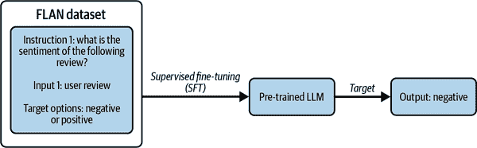
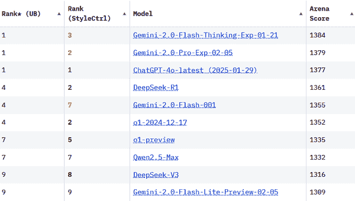

# 第五章\. 将 LLM 适配到您的用例

在本章中，我们将继续我们的 LLM 格局之旅，探索可用于商业用途的各种 LLM，并提供如何选择适合您任务的正确 LLM 的指南。我们还将检查如何加载各种大小的 LLM 并在其上进行推理。然后我们将解码各种用于文本生成的解码策略。我们还将研究如何解释语言模型的输出和中间结果，并调查如 LIT-NLP 等可解释性工具。

# 探索 LLM 格局

看起来每隔几天就会发布一个新的 LLM，许多都声称是业界领先。这些 LLM 之间并没有太大的区别，因此您不需要花费太多时间跟踪新的 LLM 发布。本书的 [GitHub 仓库](https://oreil.ly/llm-playbooks) 尝试跟踪主要发布，但我不能保证它会完全完整。

尽管如此，了解现有的不同类型 LLM 提供商、可用的 LLM 类型以及版权和许可影响是一个好主意。因此，现在让我们通过这个视角来探索 LLM 的格局，并了解我们可用的选择。

## LLM 提供商是谁？

LLM 提供商可以大致分为以下几类：

提供专有 LLM 的公司

这包括像 OpenAI [(GPT)](https://oreil.ly/r-lb1)、Google [(Gemini)](https://oreil.ly/KF9Kh)、Anthropic [(Claude)](https://oreil.ly/T5Wvo)、[Cohere](https://oreil.ly/PiKxN)、[AI21](https://oreil.ly/Y8T3q) 等公司，它们训练专有 LLM 并将其作为 API 端点（LLM-as-a-service）提供。许多这些公司还与云服务提供商合作，以完全托管服务的形式提供对这些模型的访问。主要云服务提供商的相关产品包括 [Amazon Bedrock](https://oreil.ly/FVqRj) 和 [SageMaker JumpStart by Amazon](https://oreil.ly/e0a59)、[Vertex AI by Google](https://oreil.ly/mURoC) 以及 [Azure OpenAI by Microsoft](https://oreil.ly/Ag1r5)。

提供开源 LLM 的公司

这包括那些使 LLM 权重公开并通过提供部署服务来盈利的公司 ([Together AI](https://oreil.ly/urcAf))，那些主要业务将从更多 LLM 采用中受益的公司 ([Cerebras](https://oreil.ly/2cVYY))，以及从 Transformer 早期就开始发布 LLM 的研究实验室（微软、谷歌、Meta、Salesforce 等）。请注意，像谷歌这样的公司已经发布了专有和开源的 LLM。

自组织开源集体和社区研究组织

这包括开创性的社区研究组织 [Eleuther AI](https://oreil.ly/ZSlbG) 和 [Big Science](https://oreil.ly/_NlUD)。这些组织依赖资助来获取计算基础设施。

学术界和政府

由于高资本成本，到目前为止，很少有 LLM 从学术界出现。来自政府/学术界的 LLM 例子包括阿布扎比政府资助的[技术创新研究所](https://oreil.ly/aMwO2)，它发布了[ Falcon 模型](https://oreil.ly/vdhsL)，以及清华大学，它发布了[ GLM 模型](https://oreil.ly/K0_zX)。

表 5-1 展示了 LLM 领域的参与者、他们所属的实体类别以及他们发布的预训练模型。

表 5-1\. LLM 提供商

| 名称 | 类别 | 发布的预训练模型 |
| --- | --- | --- |
| 谷歌 | 公司 | BERT, MobileBERT, T5, FLAN-T5, ByT5, Canine, UL2, Flan-UL2, Pegasus PaLM, PaLMV2, ELECTRA, Tapas, Switch |
| 微软 | 公司 | DeBERTa, DialoGPT, BioGPT, MPNet |
| OpenAI | 公司 | GPT-2, GPT-3, GPT-3.5, GPT-4 |
| 亚马逊 | 公司 | Titan |
| Anthropic | 公司 | Claude, Claude-2 |
| Cohere | 公司 | Cohere Command, Cohere Base |
| Meta | 公司 | RoBERTa, Llama, Llama 2, BART, OPT, Galactica |
| Salesforce | 公司 | CTRL, XGen, EinsteinGPT |
| MosaicML | 公司（被 Databricks 收购） | MPT |
| Cerebras | 公司 | Cerebras-GPT, BTLM |
| Databricks | 公司 | Dolly-V1, Dolly-V2 |
| Stability AI | 公司 | StableLM |
| Together AI | 公司 | RedPajama |
| Ontocord AI | 非营利组织 | MDEL |
| Eleuther AI | 非营利组织 | Pythia, GPT Neo, GPT-NeoX, GPT-J |
| 大科学 | 非营利组织 | BLOOM |
| 清华大学 | 学术机构 | GLM |
| 技术创新研究所 | 学术机构 | Falcon |
| 加州大学伯克利分校 | 学术机构 | OpenLLaMA |
| Adept AI | 公司 | Persimmon |
| Mistral AI | 公司 | Mistral |
| AI21 Labs | 公司 | Jurassic |
| X.AI | 公司 | Grok |

## 模型风味

每个模型通常都会发布多个变体。发布相同模型的不同大小的变体是惯例。例如，Llama 2 有 7B、13B 和 70B 的大小，这些数字指的是模型中的参数数量。

这些日子里，LLM 提供商以各种方式增强他们的预训练模型，使其更易于满足用户任务。增强过程通常涉及以某种方式微调模型，通常包括人工监督。这些微调练习中的一些可能需要数百万美元的人工标注费用。我们将未经过任何增强的预训练模型称为基础模型。

以下章节描述了一些流行的增强类型。

### Instruct-models

指令模型，或称为指令微调模型，擅长遵循自然语言中编写的指令。尽管基础模型拥有强大的能力，但它们就像一个叛逆的青少年；只有通过反复试验和错误地精心设计正确的提示，才能有效地与之互动，这往往很脆弱。这是因为基础模型是在去噪目标或下一词预测目标上训练的，这些目标与用户通常想要解决的问题不同。通过指令微调基础模型，得到的模型能够更有效地响应人类指令并发挥作用。

一个典型的指令微调数据集包括用自然语言表达的各种任务，以及输入-输出对。在第六章中，我们将探讨构建指令微调数据集的各种技术，并演示如何在模型上执行指令微调。

这里是一个来自流行的指令微调数据集[FLAN](https://oreil.ly/YJ_Xr)的例子。

> *提示:* “以下评论的情感是什么？披萨还可以，但服务太糟糕了。我停下来吃了个快速午餐，点了特制披萨，但等了十几分钟后，前面柜台的某人，然后又等披萨，结果花了一个小时。除了我自己，这个地方空无一人，但我得不到任何帮助/服务。选项：- 负面 - 正面”
> 
> *FLAN:* “负面”

在这个例子中，输入包括一个指令，“以下评论的情感是什么？”以人类自然表达的方式表达，以及输入和输出。输入是实际的评论，输出是任务的解决方案，可以是模型生成的或由人类标注的。

图 5-1 演示了指令微调过程。



###### 图 5-1\. 指令微调过程

指令微调是监督微调（SFT）技术范畴下的几种技术之一。除了提高模型有效响应用户任务的能力外，基于 SFT 的方法还可以通过在安全数据集上训练来减少其潜在的危害，这些数据集有助于使模型输出与模型创建者的价值观和偏好保持一致。

实现这种一致性的更高级技术包括基于强化学习的方法，如基于人类反馈的强化学习（RLHF）和基于 AI 反馈的强化学习（RLAIF）。

在 RLHF 训练中，人类标注者根据某些标准（如有用性和无害性）选择或对候选输出进行排序。这些标注用于迭代训练奖励模型，最终导致 LLM 更具可控性，例如，拒绝回答用户的不适当请求。

图 5-2 展示了 RLHF 训练过程。


###### 图 5-2. 基于人类反馈的强化学习

我们将在第八章中详细介绍 RLHF 和其他对齐技术。

除了依赖人类反馈进行对齐训练外，还可以利用 LLM 根据其遵循一组原则（不要种族歧视，不要无礼等）来选择输出。这种技术由 Anthropic 引入，称为 RLAIF。在这种技术中，人类只提供一组期望的原则和价值观（称为[宪法 AI](https://oreil.ly/d8FeW)），而 LLM 的任务是确定其输出是否遵循这些原则。

指令调整模型通常以*instruct*结尾，例如 RedPajama-Instruct。

### 聊天模型

聊天模型是针对多轮对话优化的指令调整模型。例子包括 ChatGPT、Llama 2-Chat、MPT-Chat、OpenAssistant 等。

### 长内容模型

如第一章中所述，基于 Transformer 的 LLM 具有有限的内容长度。为了回顾，内容长度通常指每次调用模型处理的输入和输出标记的总数。现代 LLM 的典型内容长度从 8,000 到 128,000 个标记不等，一些 Gemini 的变体支持超过一百万个标记。一些模型以长内容变体发布；例如，GPT 3.5 默认的上下文大小为 4K，但也有 16K 上下文大小的变体。[MPT](https://oreil.ly/wKqdL)也有一个长内容变体，该变体在 65k 上下文长度上进行了训练，但在推理过程中可以用于甚至更长的上下文。

### 领域自适应或任务自适应模型

LLM 提供商也可能在特定任务（如摘要或金融情感分析）上进行微调。他们还可能产生模型的蒸馏版本，其中较小的模型在特定任务的较大模型输出上进行微调。特定任务微调的例子包括在金融情感分析数据集上微调的[FinBERT](https://oreil.ly/uKUAp)，以及使用命名实体识别数据蒸馏的[UniversalNER](https://oreil.ly/8A0pn)。

## 开源 LLM

开源通常用作一个万能短语，指代具有某些公开方面模型的模型。我们将开源定义为：

> 在许可下发布的软件工件，允许用户*研究*、*使用*、*修改*并将它们*重新分发*给*任何人*和任何*目的*。

对于开源软件的更正式和全面定义，请参阅开源促进会（Open Source Initiative）的[官方定义](https://oreil.ly/7cezH)。

要使一个大型语言模型（LLM）被视为完全开源，以下所有内容都需要公开发布：

模型权重

这包括模型的全部参数和模型配置。能够访问这些内容使我们能够以任何我们认为合适的方式添加或修改模型参数。鼓励发布训练过程中各个阶段的模型检查点。

模型代码

仅发布模型权重类似于提供没有源代码的软件二进制文件。模型代码不仅包括模型训练代码和超参数设置，还包括用于预处理训练数据的代码。发布有关基础设施设置和配置的信息也有助于提高模型的可重复性。在大多数情况下，即使模型代码完全可用，由于资源限制和训练的非确定性，模型可能也不容易重复。

训练数据

这包括用于模型的训练数据，以及理想情况下有关其来源的信息或代码。还鼓励在数据预处理管道的不同阶段发布数据，以及数据被输入到模型中的顺序。训练数据是模型提供者最少公开的组件。因此，大多数开源模型并不是“完全开放”的，因为数据集不是公开的。

由于竞争原因，训练数据通常不会公开。正如第三章和第四章所讨论的，今天的大多数大型语言模型（LLM）都使用相同的架构和训练代码的变体。区分因素通常可以归结为数据内容和预处理。部分训练数据可能通过许可协议获得，这禁止模型提供者公开数据。

不公开训练数据的另一个原因是与训练数据相关的未解决的法律问题，特别是围绕版权的问题。例如，由 Eleuther AI 创建的 The Pile 数据集不再在官方链接上可用，因为它包含受版权保护书籍（Books3 数据集）中的文本。请注意，The Pile 已经过预处理，书籍不是人类可读的形式，并且不容易重复，因为它们被分割、打乱和混合。

大多数训练数据来源于公开网络，因此可能包含在某些司法管辖区非法的暴力或色情内容。尽管有最好的意图和严格的过滤，但这些数据中的一些可能仍然存在于最终数据集中。因此，许多之前公开的数据集现在不再公开，LAION 的图像数据集就是一个例子。

最终，模型发布所依据的许可证决定了您可以使用、修改或重新分发原始或修改后的 LLM 的条款。广义而言，开放 LLM 的发布通常遵循三种类型的许可证：

非商业

这些许可证仅允许研究和个人使用，并禁止将模型用于商业目的。在许多情况下，模型工件通过申请表进行控制，用户必须通过提供有说服力的研究用例来证明他们访问的需求。

知识共享

此类许可证允许商业使用，但所有源代码或衍生作品都需要在相同的许可证下发布，这使得开发专有修改变得更加困难。此条件适用的程度取决于所使用的具体许可证。

宽松

此类许可证允许商业使用，包括在专有应用程序中修改和重新分发，即没有义务将重新分发作为开源。此类别中的一些许可证还允许专利。

正在制定新的许可证类型，这些许可证限制模型在特定用途案例中的使用，通常出于安全原因。一个例子是[Open RAIL-M 许可证](https://oreil.ly/2UVMe)，它禁止在提供医疗建议、执法、移民和庇护程序等用途案例中使用该模型。有关受限用途案例的完整列表，请参阅许可证附件 A。

作为打算在组织中出于商业目的使用开源 LLM 的从业者，最好使用具有宽松许可证的 LLM。宽松许可证的流行例子包括 Apache 2.0 和 MIT 许可证。

[创意共享（CC）许可证](https://oreil.ly/PQy6D)是用于分发开源 LLM 的流行许可证类别。这些许可证的名称类似于 CC-BY-NC-SA 等。这里有一个记住这些名称含义的简单方法：

BY

如果许可证包含此条款，则意味着需要署名。如果只包含 CC-BY，则意味着许可证是宽松的。

SA

如果许可证包含此条款，则意味着重新分发应在此许可证的相同条款下进行。换句话说，它是一个版权左许可证。

NC

NC 代表非商业。因此，如果许可证包含此条款，则模型只能用于研究或个人用途案例。

ND

ND 代表无衍生。如果许可证包含此条款，则不允许对模型进行修改的分发。

###### 备注

现在，具有公开权重和公开代码，并且发布在允许任何人出于任何用途案例重新分发的许可证下的模型被认为是开源模型。然而，可以争论的是，访问训练数据对于检查和研究模型也至关重要，这是我们在之前引入的开源定义的一部分。

表 5-2 显示了可用的各种 LLM、它们发布的许可证以及它们可用的尺寸和版本。请注意，LLM 可能由不同于预训练 LLM 的实体进行指令微调或聊天微调。

表 5-2。可用的 LLM 列表

| 名称 | 可用性 | 尺寸 | 变体 |
| --- | --- | --- | --- |
| GPT-4 | 专有 | 未知 | GPT-4 32K 上下文，GPT-4 8K 上下文 |
| GPT-3.5 Turbo | 专有 | 未知 | GPT-3.5 4K 上下文，GPT-3.5 16K 上下文 |
| Claude Instant | 专有 | 未知 | - |
| Claude 2 | 专有 | 未知 | - |
| MPT | Apache 2.0 | 1B、7B、30B | MPT 65K 故事作家 |
| CerebrasGPT | Apache 2.0 | 111M, 256M, 590M, 1.3B, 2.7B, 6.7B, 13B | CerebrasGPT |
| 稳定性 LM | CC-BY-SA | 7B | - |
| RedPajama | Apache 2.0 | 3B, 7B | RedPajama-INCITE-Instruct, RedPajama-INCITE-Chat |
| GPT-Neo X | Apache 2.0 | 20B | - |
| BLOOM | 开放，限制性使用 | 176B | BLOOMZ |
| Llama | 开放，无商业用途 | 7B, 13B, 33B, 65B | - |
| Llama 2 | 开放，商业用途 | 7B, 13B, 70B | Llama 2-Chat |
| Zephyr | Apache 2.0 | 7B | - |
| Gemma | 开放，限制性使用 | 2B, 7B | Gemma-Instruction Tuned |

# 如何为您的任务选择 LLM

在众多选项中，您如何确保选择适合您任务的正确 LLM？根据您的具体情况，有许多标准需要考虑，包括：

成本

这包括推理或微调成本，以及构建软件框架、监控和可观察性、部署和维护（统称为 LLMOps）的成本。

[每输出令牌时间（TPOT）](https://oreil.ly/mEDRt)

这是一个用于衡量终端用户体验到的文本生成速度的指标。

任务性能

这指的是任务的性能要求以及相关的指标，如精确度或准确性。什么水平的性能是*足够好*的？

任务类型

LLM 将要使用的任务性质，如摘要、问答、分类等。

需要的能力

能力的例子包括算术推理、逻辑推理、规划、任务分解等。许多这些能力，在它们实际存在或近似到一定程度时，是 LLM 的*涌现属性*，如第一章中讨论的那样，并且不是由较小模型展示的。

许可证

您只能使用允许您使用模式的模型。即使某些类型的用例明确允许商业使用，模型也可能有限制。例如，如前所述，Big Science OpenRAIL-M 许可证限制了 LLM 在涉及执法、移民或庇护程序用例中的使用。

内部机器学习/ML/MLOps 人才

内部人才的实力决定了您可以承担的定制化程度。例如，您是否有足够的内部人才来构建推理优化系统？

其他非功能标准

这包括安全、安全、隐私等。云提供商和初创公司已经在实施可以解决这些问题的解决方案。

您可能需要在专有和开源 LLM 之间做出选择。

## 开源与专有 LLM

关于开源软件与专有软件优缺点的争论在科技行业已经司空见惯了几十年，现在我们也在 LLM（大型语言模型）领域看到这一现象变得越来越相关。开源模型最大的优势是它们提供的透明度和灵活性，而不仅仅是成本。自托管开源 LLM 可能会产生大量的工程开销和计算/内存成本，而使用托管服务可能无法始终在延迟、吞吐量和推理成本方面与专有模型相匹配。此外，许多开源 LLM 通过托管服务和第三方部署选项并不容易获得。随着该领域的成熟，这种状况必将发生巨大变化，但在此期间，请针对您的具体情况运行计算，以确定使用每种（类型）模型所产生的成本。

开源模型提供的灵活性有助于您调试、解释和通过您选择的任何类型的训练/微调来增强 LLM，而不是 LLM 提供商提供的受限途径。这使您能够更实质性地将 LLM 与您的偏好和价值观对齐，而不是由 LLM 提供商决定的那些。在整个书中，我们将看到拥有所有标记概率（logits）的完全可用性是一种超级能力。

开源 LLM 的可用性使团队能够开发出对具有盈利动机的大型公司来说可能并不盈利的模型和应用，例如微调模型以支持低资源语言（在互联网上没有显著数据足迹的语言，如印度的地区语言或加拿大的土著语言）。一个例子是[卡纳达 Llama 模型](https://oreil.ly/hoBQ1)，它是在 Llama 2 的基础上，通过不断在卡纳达语言（印度的地区语言）的标记上进行预训练和微调而构建的。

并非所有开源模型都是完全透明的。如前所述，大多数发布开源 LLM 的盈利性公司并不公开其训练数据集。例如，Meta 并未披露用于训练 Llama 2 模型的训练数据集的所有细节。了解用于训练模型的哪些数据集可以帮助您评估是否存在测试集污染，并了解 LLM 可能拥有的知识类型。

就本书撰写时的情况来看，开源模型如 Llama 3.2 和 DeepSeek v3 在某种程度上已经赶上了 OpenAI 或 Anthropic 等公司最先进的专有模型。然而，在推理模型领域，如 OpenAI 的 o3，它使用推理时计算技术（在第八章中讨论）的情况下，专有模型与开源模型之间正在出现一个新的差距。在整个书中，我们将展示开源模型具有优势的场景。

###### 小贴士

总是检查模型提供者是否在 GitHub/Discord/Slack 上有活跃的开发者社区，并且开发团队是否积极参与这些渠道，回应用户评论和问题。如果它们满足你的主要标准，我建议优先考虑具有活跃开发者社区的模型。

## LLM 评估

我们将从这个部分开始，先提出一个警告：在当前 LLM（大型语言模型）领域，评估 LLM 可能是最具挑战性的任务。现有的基准测试方法存在缺陷，容易被操纵，且难以解释。尽管如此，基准测试仍然是你在评估之路上的一个有用起点。我们将从查看当前的公共基准测试开始，然后讨论你如何构建更全面的内部基准测试。

要评估 LLM 在任务性能上的表现，有许多基准数据集可以测试广泛的技能。并非所有技能都与你的用例相关，因此你可以选择专注于特定的基准，这些基准测试的是 LLM 需要表现良好的技能。

这些基准测试的排行榜变化非常频繁，尤其是在只评估开源模型的情况下，但这并不意味着每次榜单上出现新的领先者时，你都需要更换你使用的 LLM。通常，顶级模型之间的差异相当微小。LLM 的精细选择通常不是决定你任务成功与否的最重要标准，你最好将带宽用于清理和理解你的数据，这仍然是项目最重要的组成部分。

让我们看看该领域评估 LLM 的几种流行方式。

### Eleuther AI LM 评估工具

通过[LM 评估工具](https://oreil.ly/SiOXq)，Eleuther AI 支持在超过 400 个不同的基准任务上进行基准测试，评估的技能范围包括开放域问答、算术和逻辑推理、语言任务、机器翻译、有害语言检测等。你可以使用这个工具在[Hugging Face Hub](https://oreil.ly/IHd22)上评估任何模型，这是一个包含数千个预训练和微调模型的平台，并在你选择的基准上进行测试。

这里有一个来自`bigbench_formal_fallacies_syllogisms_negation`基准任务的示例：

```py
 {
    "input": "\"Some football fans admire various clubs, others love `only` `a` `single` `team``.` `But` `who` `is` `a` `fan` `of` `whom` `precisely``?` `The`
    `following` `argument` `pertains` `to` `this` `question``:` `First` `premise``:` `Mario`
    `is` `a` `friend` `of` `FK` \`u017dalgiris` `Vilnius``.` `Second` `premise``:` `Being` `a`
    `follower` `of` `F``.``C``.` `Copenhagen` `is` `necessary` `for` `being` `a` `friend` `of` `FK`
    \`u017dalgiris` `Vilnius``.` `It` `follows` `that` `Mario` `is` `a` `follower` `of` `F``.``C``.`
    `Copenhagen``.`\`"``\n` `Is the argument, given the explicitly stated` ```` `前提``,` `演绎` `有效` `或` `无效``?``",` ```py `"target_scores"``:` `{`         `"valid"``:` `1``,`         `"invalid"``:` `0`     `}` ``` ```py`
```

```py``` ````` ```py`In this task, the model is asked to spot logical fallacies by deducing whether the presented argument is valid given the premises.    There is also support for evaluation of proprietary models using this harness. For example, here is how you would evaluate OpenAI models:    ``` export OPENAI_API_SECRET_KEY=<Key> python main.py \ lm_eval --model openai-completions \         --model_args model=gpt-3.5-turbo \          --tasks bigbench_formal_fallacies_syllogisms_negation ```py    ###### Tip    While choosing or developing a benchmarking task to evaluate, I recommend focusing on picking ones that test the capabilities needed to solve the task of your interest, rather than the actual task itself. For example, if you are building a summarizer application that needs to perform a lot of logical reasoning to generate the summaries, it is better to focus on benchmark tests that directly test logical reasoning capabilities than ones that test summarization performance.```` ```py`` ``````py  ``` `` `### Hugging Face Open LLM Leaderboard    As of the book’s writing, the [Open LLM Leaderboard](https://oreil.ly/tspBY) uses Eleuther AI’s LM Evaluation Harness to evaluate the performance of models on six benchmark tasks:    Massive Multitask Language Understanding (MMLU)      This test evaluates the LLM on knowledge-intensive tasks, drawing from fields like US history, biology, mathematics, and more than 50 other subjects in a multiple choice framework.      AI2 Reasoning Challenge (ARC)      This test evaluates the LLM on multiple-choice grade school science questions that need complex reasoning as well as world knowledge to answer.      Hellaswag      This test evaluates commonsense reasoning by providing the LLM with a situation and asking it to predict what might happen next out of the given choices, based on common sense.      TruthfulQA      This test evaluates the LLM’s ability to provide answers that don’t contain falsehoods.      Winogrande      This test is composed of fill-in-the-blank questions that test commonsense reasoning.      GSM8K      This test evaluates the LLM’s ability to complete grade school math problems involving a sequence of basic arithmetic operations.      Figure 5-3 shows a snapshot of the LLM leaderboard as of the time of the book’s writing. We can see that:    *   Larger models perform better.           *   Instruction-tuned or fine-tuned variants of models perform better.              ###### Figure 5-3\. Snapshot of the Open LLM Leaderboard    The validity of these benchmarks are in question as complete test set decontamination is not guaranteed. Model providers are also optimizing to solve these benchmarks, thus reducing the value of these benchmarks to serve as reliable estimators of general-purpose performance.    ### HELM    [Holistic Evaluation of Language Models (HELM)](https://oreil.ly/MNHDs) is an evaluation framework by Stanford that aims to calculate a wide variety of metrics over a range of benchmark tasks. Fifty-nine metrics are calculated overall, testing accuracy, calibration, robustness, fairness, bias, toxicity, efficiency, summarization performance, copyright infringement, and more. The tasks tested include question answering, summarization, text classification, information retrieval, sentiment analysis, and toxicity detection.    Figure 5-4 shows a snapshot of the HELM leaderboard as of the time of the book’s writing.    ###### Figure 5-4\. Snapshot of the HELM leaderboard    ### Elo Rating    Now that we have seen the limitations of quantitative evaluation, let’s explore how we can most effectively incorporate human evaluations. One promising framework is the [Elo rating system](https://oreil.ly/bTD7I), used in chess to rank players.    [Large model systems organization (LMSYS Org)](https://oreil.ly/HGVz2) has implemented an evaluation platform based on the Elo rating system called the [Chatbot Arena](https://oreil.ly/evgQX). Chatbot Arena solicits crowdsourced evaluations by inviting people to choose between two randomized and anonymized LLMs by chatting with them side-by-side. The leaderboard is found [online](https://oreil.ly/Y6zmN), with models from OpenAi, DeepSeek, Google DeepMind, and Anthropic dominating.    Figure 5-5 shows a snapshot of the Chatbot Arena leaderboard as of the time of the book’s writing.    ###### Figure 5-5\. Snapshot of the Chatbot Arena leaderboard    ### Interpreting benchmark results    How do you interpret evaluation results presented in research papers? Try to methodically ask as many questions as possible, and check if the answers are covered in the paper or other material. As an example, let us take the Llama 2-chat evaluation graphs presented in the [Llama 2 paper](https://oreil.ly/BcgXs). In particular, study Figures 1 and 3, which demonstrate how Llama 2-Chat compares in helpfulness and safety with other chat models. Some of the questions that come to mind are:    *   What does the evaluation dataset look like? Do we have access to it?           *   What is the difficulty level of the test set? Maybe the model is competitive with respect to ChatGPT for easier examples but how does it perform with more difficult examples?           *   What proportion of examples in the test set can be considered difficult?           *   What kinds of scenarios are covered in the test set? What degree of overlap do these scenarios have with the chat-tuning sets?           *   What definition do they use for safety?           *   Can there be a bias in the evaluation due to models being evaluated on the basis of a particular definition of safety, which Llama 2 was trained to adhere to, while other models may have different definitions of safety?              Rigorously interrogating the results this way helps you develop a deeper understanding of what is being evaluated, and whether it aligns with the capabilities you need from the language model for your own tasks. For more rigorous LLM evaluation, I strongly recommend developing your own internal benchmarks.    ###### Warning    Do not trust evaluations performed by GPT-4 or any other LLM. We have no idea what evaluation criteria it uses nor do we have a deeper understanding of its biases.    Robust evaluation of LLMs is further complicated by the sensitivity of the prompts and the probabilistic nature of generative models. For example, I often see papers claiming that “GPT-4 does not have reasoning capabilities,” while not using any prompting techniques during evaluation. In many of these cases, it turns out that the model can in fact perform the task if prompted with CoT prompting. While evaluation prompts need not be heavily engineered, using rudimentary techniques like CoT should be standard practice, and not using them means that the model capabilities are being underestimated.` `` ```py  ``````py ````` ```py`# Loading LLMs    While it is possible to load and run inference on LLMs with just CPUs, you need GPUs if you want acceptable text generation speeds. Choosing a GPU depends on cost, the size of the model, whether you are training the model or just running inference, and support for optimizations. Tim Dettmers has developed a great [flowchart](https://oreil.ly/t6iPQ) that you can use to figure out which GPU best serves your needs.    Let’s figure out the amount of GPU RAM needed to load an LLM of a given size. LLMs can be loaded in various *precisions*:    Float32      32-bit floating point representation, each parameter occupying 4 bytes of storage.      Float16      16-bit floating point representation. Only 5 bits are reserved for the exponent as opposed to 8 bits in Float32\. This means that using Float16 comes with overflow/underflow problems for very large and small numbers.      bfloat16 (BF16)      16-bit floating point representation. Just like Float32, 8 bits are reserved for the exponent, thus alleviating the underflow/overflow problems observed in Float16.      Int8      8-bit integer representation. Running inference in 8-bit mode is around 20% slower than running in Float16.      FP8, FP4      8-bit and 4-bit floating point representation.      We will explore these formats in detail in Chapter 9. Generally, running inference on a model with 7B parameters will need around 7 GB of GPU RAM if running in 8-bit mode and around 14 GB if running in BF16\. If you intend to fine-tune the whole model, you will need a lot more memory.    ## Hugging Face Accelerate    You can run inference on models even if they don’t fit in the GPU RAM. The [*accelerate* library](https://oreil.ly/OYdyf) by Hugging Face facilitates this by loading parts of the model into CPU RAM if the GPU RAM is filled, and then loading parts of the model into disk if the CPU RAM is also filled. [“Accelerate Big Model Inference: How Does it Work?”](https://oreil.ly/J8duc) shows how the accelerate library operates under the hood. This whole process is abstracted from the user, so all you need to load a large model is to run this code:    ``` !pip install transformers accelerate import torch from transformers import AutoTokenizer, AutoModelForCausalLM tokenizer = AutoTokenizer.from_pretrained("EleutherAI/gpt-neox-20B") model = GPTNeoForCausalLM.from_pretrained("EleutherAI/gpt-neox-20B") input_ids = tokenizer("Language models are", return_tensors="pt") gen_tokens = model.generate(**input_ids, max_new_tokens =1) ```py    ## Ollama    There are many tools available that facilitate loading LLMs locally, including on your own laptop. One such library is Ollama, which supports Windows, Mac, and Linux operating systems. Using Ollama, you can load 13B models if your machine has at least 16GB of available RAM. Ollama supports many open models like Mistral, Llama, Gemma, etc. Ollama provides a REST API that you can use to run inference and build LLM-driven applications. It also has several Terminal and UI integrations that enable you to build user-facing applications with ease.    Let’s see how we can use Google’s Gemma 2B model using Ollama. First, download [the version of Ollama](https://oreil.ly/yly44) to your machine based on your operating system. Next, pull the Gemma model to your machine with:    ``` ollama pull gemma:2b ```py    You can also create a Modelfile that contains configuration information for the model. This includes system prompts and prompt templates, decoding parameters like temperature, and conversation history. Refer to the [documentation](https://oreil.ly/ba-1u) for a full list of available options.    An example Modelfile is:    ``` FROM gemma:2b  PARAMETER temperature 0.2  SYSTEM """ You are a provocateur who speaks only in limericks. """ ```py    After creating your Modelfile, you can run the model:    ``` ollama create local-gemma -f ./Modelfile ollama run local-gemma ```py    The book’s GitHub repo contains a sample end-to-end application built using Ollama and one of its UI integrations. You can also experiment with similar tools like [LM Studio](https://oreil.ly/uFsiR) and [GPT4All](https://oreil.ly/XUXhq).    ###### Tip    You can load custom models using Ollama if they are in the GPT-Generated Unified Format (GGUF).    ## LLM Inference APIs    While you can deploy an LLM yourself, modern-day inference consists of so many optimizations, many of them proprietary, that it takes a lot of effort to bring your inference speeds up to par with commercially available solutions. Several inference services like [Together AI](https://oreil.ly/L3zo0) exist that facilitate inference of open source or custom models either through serverless endpoints or dedicated instances. Another option is Hugging Face’s [TGI (Text Generation Inference)](https://oreil.ly/XXFpa), which has been recently [reinstated](https://oreil.ly/BJJlY) to a permissive open source license.    # Decoding Strategies    Now that we have learned how to load a model, let’s understand how to effectively generate text. To this end, several *decoding* strategies have been devised in the past few years. Let’s go through them in detail.    ## Greedy Decoding    The simplest form of decoding is to just generate the token that has the highest probability. The drawback of this approach is that it causes repetitiveness in the output. Here is an example:    ``` input = tokenizer('The keyboard suddenly came to life. It ventured up the',  return_tensors='pt').to(torch_device) output = model.generate(**inputs, max_new_tokens=50) print(tokenizer.decode(output[0], skip_special_tokens=True)) ```py    You can see that the output starts getting repetitive. Therefore, greedy decoding is not suitable unless you are generating really short sequences, like a token just producing a classification task output.    Figure 5-6 shows an example of greedy decoding using the FLAN-T5 model. Note that we missed out on some great sequences because one of the desired tokens has slightly lower probability, ensuring it never gets picked.    ###### Figure 5-6\. Greedy decoding    ## Beam Search    An alternative to greedy decoding is beam search. An important parameter of beam search is the beam size, *n*. At the first step, the top *n* tokens with the highest probabilities are selected as hypotheses. For the next few steps, the model generates token continuations for each of the hypotheses. The token chosen to be generated is the one whose continuations have the highest cumulative probability.    In the Hugging Face `transformers` library, the `num_beams` parameter of the `model.generate()` function determines the size of the beam. Here is how the decoding code would look if we used beam search:    ``` output = model.generate(**inputs, max_new_tokens=50, num_beams = 3) print(tokenizer.decode(output[0], skip_special_tokens=True)) ```py    Figure 5-7 shows an example of beam search using the FLAN-T5 model. Note that the repetitiveness problem hasn’t really been solved using beam search. Similar to greedy decoding, the generated text also sounds very constricted and not humanlike, due to the complete absence of lower probability words.    ###### Figure 5-7\. Beam search    To resolve these issues, we will need to start introducing some randomness and begin sampling from the probability distribution to ensure not just the top two or three tokens get generated all the time.    ## Top-k Sampling    In top-k sampling, the model samples from a distribution of just the k tokens of the output distribution that have the highest probability. The probability mass is redistributed over the k tokens, and the model samples from this distribution to generate the next token. Hugging Face provides the `top_k` parameter in its generate function:    ``` output = model.generate(**inputs, max_new_tokens=50, do_sample=True, top_k=40) print(tokenizer.decode(output[0], skip_special_tokens=True)) ```py    Figure 5-8 shows an example of top-k sampling using the FLAN-T5 model. Note that this is a vast improvement from greedy or beam search. However, top-k leads to problematic generations when used in cases where the probability is dominated by a few tokens, meaning that tokens with very low probability end up being included in the top-k.    ###### Figure 5-8\. Top-k sampling    ## Top-p Sampling    Top-p sampling solves the problem with top-k sampling by making the number of candidate tokens dynamic. Top-p involves choosing the smallest number of tokens whose cumulative distribution exceeds a given probability p. Here is how you can implement this using Hugging Face `transformers`:    ``` output = model.generate(**inputs, max_new_tokens=50, top_p=0.9) print(tokenizer.decode(output[0], skip_special_tokens=True)) ```py    Figure 5-9 shows an example of top-p sampling using the FLAN-T5 model. Top-p sampling, also called nucleus sampling, is the most popular sampling strategy used today.    ###### Figure 5-9\. Top-p sampling    ###### Note    So far, the decoding approaches we have seen operate serially; i.e., each token is generated one at a time, with a full pass through the model each time. This is too inefficient for latency-sensitive applications. In Chapter 9, we will discuss methods like speculative decoding, which can speed up the decoding process.    # Running Inference on LLMs    Now that we have learned how to access and load LLMs and understood the decoding process, let’s begin using them to solve our tasks. We call this *LLM inference*.    You will have seen that LLM outputs are not consistent and sometimes differ wildly across multiple generations for the same prompt. As we learned in the section on decoding, unless you are using greedy search or any other deterministic algorithm, the LLM is sampling from a token distribution.    Some ways to make the generation more deterministic is to set the temperature to zero and keeping the random seed for the sampling constant. Even then, you may not be able to guarantee the same (deterministic) outputs every time you send the LLM the same input.    Sources of nondeterminism range from using multi-threading to floating-point rounding errors to use of certain model architectures (for example, it is known that the [Sparse MoE architecture](https://oreil.ly/pzchE) produces nondeterministic outputs).    Reducing the temperature to zero or close to zero impacts the LLM’s creativity and makes its outputs more predictable, which might not be suitable for many applications.    In production settings where reliability is important, you should run multiple generations for the same input and use a technique like majority voting or heuristics to select the right output. This is very important due to the nature of the decoding process; sometimes the wrong tokens can be generated, and since every token generated is a function of the tokens generated before it, the error can be propagated far ahead.    [Self-consistency](https://oreil.ly/wEE8q) is a popular prompting technique that uses majority voting in conjunction with CoT prompting. In this technique, we add the CoT prompt “Let’s think step by step” to the input and run multiple generations (reasoning paths). We then use majority voting to select the correct output.    # Structured Outputs    We might want the output of the LLM to be in some structured format, so that it can be consumed by other software systems. But this is easier said than done; current LLMs aren’t as controllable as we would like them to be. Some LLMs can be excessively chatty. Ask them to give a Yes/No answer and they respond with “The answer to this question is ‘Yes’.”    One way to get structured outputs from the LLM is to define a JSON schema, provide the schema to the LLM, and prompt it to generate outputs adhering to the schema. For larger models, this works almost all the time, with some schema corruption errors that you can catch and handle.    For smaller models, you can use libraries like [Jsonformer](https://oreil.ly/aSc0f). Jsonformer delegates the generation of the content tokens to the LLM but fills the content in JSON form by itself. Jsonformer is built on top of Hugging Face and thus supports any model that is supported by Hugging Face.    More advanced structured outputs can be facilitated by using libraries like [LMQL](https://oreil.ly/LlkEj) or [Guidance](https://oreil.ly/cFe5s). These libraries provide a programming paradigm for prompting and facilitate controlled generation.    Features available through these libraries include:    Restricting output to a finite set of tokens      This is useful for classification problems, where you have a finite set of output labels. For example, you can restrict the output to be positive, negative, or neutral for a sentiment analysis task.      Controlling output format using regular expressions      For example, you can use regular expressions to specify a custom date format.      Control output format using context-free grammars (CFG)      A CFG defines the rules that generated strings need to follow. For more background on CFGs, refer to [Aditya’s blog](https://oreil.ly/M00us). Using CFGs, we can use LLMs to more effectively solve sequence tagging tasks like NER or part-of-speech tagging.      # Model Debugging and Interpretability    Now that we are comfortable with loading LLMs and generating text using them, we would like to be able to understand model behavior and explore the examples for which the model fails. Interpretability in LLMs is much less developed than in other areas of machine learning. However, we can get partial interpretability by exploring how the output changes upon minor variances in the input, and by analyzing the intermediate outputs as the inputs propagate through the Transformer architecture.    Google’s open source tool [LIT-NLP](https://oreil.ly/YFY4q) is a handy tool that supports visualizations of model behavior as well as various debugging workflows.    Figure 5-10 shows an example of LIT-NLP in action, providing interpretability for a T5 model running a summarization task.    ###### Figure 5-10\. LIT-NLP    LIT-NLP features that help you debug your models include:    *   Visualization of the attention mechanism           *   Salience maps, which show parts of the input that are paid most attention to by the model           *   Visualization of embeddings           *   Counterfactual analysis that shows how your model behavior changes after a change to the input like adding or removing a token.              For more details on using LIT-NLP for error analysis, refer to [Google’s tutorial](https://oreil.ly/zcsLu) on using LIT-NLP with the Gemma LLM where they find errors in few-shot prompts by analyzing incorrect examples and observing which parts of the prompt contributed most to the output (salience).    # Summary    In this chapter, we journeyed through the LLM landscape and noted the various options we have at our disposal. We learned how to determine the criteria most relevant to our tasks and choose the right LLM accordingly. We explored various LLM benchmarks and showed how to interpret their results. We learned how to load LLMs and run inference on them, along with efficient decoding strategies. Finally, we showcased interpretability tools like LIT-NLP that can help us understand what is going on behind the scenes in the Transformer architecture.    In the next chapter, we will learn how to update a model to improve its performance on our tasks of interest. We will walk through a full-fledged fine-tuning example and explore the hyperparameter tuning decisions involved. We will also learn how to construct training datasets for fine-tuning.```` ```py`` ``````
