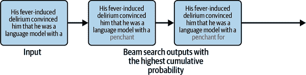
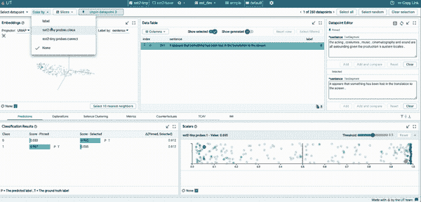

# 第五章\. 将 LLM 适应您的用例

在本章中，我们将继续我们的 LLM 领域之旅，探索可用于商业用途的各种 LLM，并提供如何选择适合您任务的正确 LLM 的指南。我们还将检查如何加载各种大小的 LLM 并在其上进行推理。然后我们将解码各种用于文本生成的解码策略。我们还将研究如何解释语言模型的输出和中间结果，并对 LIT-NLP 等可解释性工具进行概述。

# 探索 LLM 领域

看起来每隔几天就会发布一个新的 LLM，许多都声称是业界领先。这些 LLM 之间并没有太大的区别，因此您不需要花太多时间跟踪新的 LLM 发布。本书的 [GitHub 仓库](https://oreil.ly/llm-playbooks) 尝试跟踪主要发布，但我不能保证它会完整。

然而，了解不同类型的 LLM 提供商、可用的 LLM 种类以及版权和许可影响是一个好主意。因此，现在让我们通过这个视角来探索 LLM 领域，并了解我们可用的选择。

## 哪些是 LLM 提供商？

LLM 提供商可以大致分为以下几种类型：

提供专有 LLM 的公司

这包括像 OpenAI [(GPT)](https://oreil.ly/r-lb1)、Google [(Gemini)](https://oreil.ly/KF9Kh)、Anthropic [(Claude)](https://oreil.ly/T5Wvo)、[Cohere](https://oreil.ly/PiKxN)、[AI21](https://oreil.ly/Y8T3q)等公司，它们训练专有 LLM 并将它们作为 API 端点（LLM-as-a-service）提供。许多这些公司还与云服务提供商合作，以完全托管服务的形式提供对这些模型的访问。主要云服务提供商的相关产品包括 [Amazon Bedrock](https://oreil.ly/FVqRj) 和 [SageMaker JumpStart by Amazon](https://oreil.ly/e0a59)、[Vertex AI by Google](https://oreil.ly/mURoC)、以及 [Azure OpenAI by Microsoft](https://oreil.ly/Ag1r5)。

提供开源 LLM 的公司

这包括那些使 LLM 权重公开并通过提供部署服务来盈利的公司 ([Together AI](https://oreil.ly/urcAf))，那些主要业务将从更多 LLM 采用中受益的公司 ([Cerebras](https://oreil.ly/2cVYY))，以及自 Transformer 早期就一直在发布 LLM 的研究实验室（微软、谷歌、Meta、Salesforce 等）。请注意，像谷歌这样的公司已经发布了专有和开源的 LLM。

自组织开源集体和社区研究组织

这包括开创性的社区研究组织 [Eleuther AI](https://oreil.ly/ZSlbG) 和 [Big Science](https://oreil.ly/_NlUD)。这些组织依赖资助来获得计算基础设施。

学术界和政府

由于高昂的资本成本，到目前为止，还没有很多 LLM（大型语言模型）从学术界走出。来自政府/学术界的 LLM 例子包括阿布扎比政府资助的[技术创新研究所](https://oreil.ly/aMwO2)，它发布了[Falcon 模型](https://oreil.ly/vdhsL)，以及清华大学，它发布了[GLM 模型](https://oreil.ly/K0_zX)。

表 5-1 显示了 LLM 领域的参与者、他们所属的实体类别以及他们发布的预训练模型。

表 5-1\. LLM 提供商

| 名称 | 类别 | 发布的预训练模型 |
| --- | --- | --- |
| Google | 公司 | BERT, MobileBERT, T5, FLAN-T5, ByT5, Canine, UL2, Flan-UL2, Pegasus PaLM, PaLMV2, ELECTRA, Tapas, Switch |
| Microsoft | 公司 | DeBERTa, DialoGPT, BioGPT, MPNet |
| OpenAI | 公司 | GPT-2, GPT-3, GPT-3.5, GPT-4 |
| Amazon | 公司 | Titan |
| Anthropic | 公司 | Claude, Claude-2 |
| Cohere | 公司 | Cohere Command, Cohere Base |
| Meta | 公司 | RoBERTa, Llama, Llama 2, BART, OPT, Galactica |
| Salesforce | 公司 | CTRL, XGen, EinsteinGPT |
| MosaicML | 公司（被 Databricks 收购） | MPT |
| Cerebras | 公司 | Cerebras-GPT, BTLM |
| Databricks | 公司 | Dolly-V1, Dolly-V2 |
| Stability AI | 公司 | StableLM |
| Together AI | 公司 | RedPajama |
| Ontocord AI | 非营利组织 | MDEL |
| Eleuther AI | 非营利组织 | Pythia, GPT Neo, GPT-NeoX, GPT-J |
| 大科学 | 非营利组织 | BLOOM |
| 清华大学 | 学术机构 | GLM |
| 技术创新研究所 | 学术机构 | Falcon |
| 加州大学伯克利分校 | 学术机构 | OpenLLaMA |
| Adept AI | 公司 | Persimmon |
| Mistral AI | 公司 | Mistral |
| AI21 Labs | 公司 | Jurassic |
| X.AI | 公司 | Grok |

## 模型风味

每个模型通常都会发布多个变体。发布相同模型的不同大小的变体是惯例。例如，Llama 2 有 7B、13B 和 70B 三种大小，这些数字指的是模型中的参数数量。

这些天，LLM 提供商以各种方式增强他们的预训练模型，使其更易于用户任务。增强过程通常涉及以某种方式微调模型，通常包括人工监督。这些微调练习中的一些可能需要数百万美元的人工标注费用。我们将未经过任何增强的预训练模型称为基础模型。

以下章节描述了一些流行的增强类型。

### 指令模型

指令模型或指令调整模型专门用于遵循用自然语言编写的指令。虽然基础模型具有强大的能力，但它们就像一个叛逆的青少年；只有通过反复试验和错误地精心设计正确的提示，才能有效地与之互动，这些提示往往很脆弱。这是因为基础模型是在去噪目标或下一词预测目标上训练的，这与用户通常想要解决的问题不同。通过指令调整基础模型，得到的模型能够更有效地响应人类指令并发挥作用。

一个典型的指令调整数据集包括一组用自然语言表达的任务，以及输入-输出对。在第六章中，我们将探讨构建指令调整数据集的各种技术，并演示如何在模型上执行指令调整。

这里是一个来自流行的指令调整数据集[FLAN](https://oreil.ly/YJ_Xr)的例子。

> *提示:* “以下评论的情感是什么？披萨还可以，但服务太糟糕了。我停下来吃了个快速午餐，点了特制披萨，但等了几个小时，先是等前台有人，然后又等披萨。除了我自己，店里空无一人，但我得不到任何帮助/服务。选项：- 负面 - 正面”
> 
> *FLAN:* “负面”

在这个例子中，输入包括一个指令，“以下评论的情感是什么？”以人类自然表达的方式表达，以及输入和输出。输入是实际的评论，输出是任务的解决方案，可以是模型生成的或由人类标注的。

图 5-1 展示了指令调整过程。


###### 图 5-1\. 指令调整过程

指令调整是监督微调（SFT）范畴下的几种技术之一。除了提高模型有效响应用户任务的能力外，基于 SFT 的方法还可以通过在安全数据集上训练来减少其危害性，这些数据集有助于使模型输出与模型创建者的价值观和偏好保持一致。

实现这种对齐的更高级技术包括基于强化学习的方法，如基于人类反馈的强化学习（RLHF）和基于 AI 反馈的强化学习（RLAIF）。

在 RLHF 训练中，人类标注员根据某些标准（如有用性和无害性）选择或对候选输出进行排序。这些标注用于迭代训练奖励模型，最终导致 LLM 更具可控性，例如，拒绝回答用户的不适当请求。

图 5-2 展示了 RLHF 训练过程。


###### 图 5-2\. 来自人类反馈的强化学习

我们将在第八章中详细介绍 RLHF 和其他对齐技术。第八章。

除了依赖人类反馈进行对齐训练外，还可以利用 LLM 根据其遵循一组原则（不要种族歧视，不要无礼等）来选择输出。这种技术由 Anthropic 引入，称为 RLAIF。在这种技术中，人类只提供一组期望的原则和价值观（称为[宪法 AI](https://oreil.ly/d8FeW)），而 LLM 的任务是确定其输出是否遵循这些原则。

指令调整模型通常带有后缀*instruct*，例如 RedPajama-Instruct。

### 聊天模型

聊天模型是针对多轮对话优化的指令调整模型。例如包括 ChatGPT、Llama 2-Chat、MPT-Chat、OpenAssistant 等。

### 长内容模型

如第一章 LLM 简介中所述，基于 Transformer 的 LLM 具有有限的内容长度。为了回顾，内容长度通常指每次调用模型处理的输入和输出标记的总数。现代 LLM 的典型内容长度从 8,000 到 128,000 个标记不等，一些 Gemini 的变体支持超过一百万个标记。一些模型发布了长内容变体；例如，GPT 3.5 默认有 4K 的内容大小，但也有 16K 的内容大小变体。[MPT](https://oreil.ly/wKqdL)也有一个经过 65k 内容长度训练的长内容变体，但在推理过程中可以潜在地用于更长的上下文。

### 领域适应或任务适应模型

LLM 提供商也可能对特定任务，如摘要或金融情感分析进行微调。他们还可能产生模型的精简版本，其中较小的模型针对特定任务的较大模型输出进行微调。特定任务微调的例子包括[FinBERT](https://oreil.ly/uKUAp)，它在金融情感分析数据集上进行微调，以及[UniversalNER](https://oreil.ly/8A0pn)，它使用命名实体识别数据进行精简。

## 开源 LLM

开源通常被用作一个通用术语，用来指代具有某些公开可访问方面的模型。我们将开源定义为：

> 在许可下发布的软件工件，允许用户*研究*、*使用*、*修改*并将它们*重新分发*给*任何人*和任何*目的*。

对于开源软件的更正式和全面的定义，请参阅开源倡议的[官方定义](https://oreil.ly/7cezH)。

要使 LLM 被认为是完全开放的，以下所有内容都需要公开发布：

模型权重

这包括模型的全部参数和模型配置。能够访问这些内容使我们能够以任何我们认为合适的方式添加或修改模型参数。鼓励在训练的各个阶段发布模型检查点。

模型代码

仅发布模型的权重类似于提供软件二进制文件而不提供源代码。模型代码不仅包括模型训练代码和超参数设置，还包括用于预处理训练数据的代码。发布有关基础设施设置和配置的信息也有助于提高模型的可重复性。在大多数情况下，即使模型代码完全可用，由于资源限制和训练的非确定性，模型可能仍然难以重复。

训练数据

这包括用于模型的训练数据，以及理想情况下有关其来源的信息或代码。还鼓励在数据预处理管道的不同阶段发布数据，以及数据被输入到模型中的顺序。训练数据是模型提供者最少发布的组件。因此，大多数开源模型不是“完全开放”的，因为数据集不是公开的。

由于竞争原因，训练数据通常不会公开。正如第三章和第四章所讨论的，今天的大多数大型语言模型（LLM）都使用相同的架构和训练代码的变体。区分因素通常可以归结为数据内容和预处理。部分训练数据可能通过许可协议获得，这禁止模型提供者公开发布数据。

不公开训练数据的另一个原因是与训练数据相关的未解决的法律问题，尤其是围绕版权的问题。例如，由 Eleuther AI 创建的 Pile 数据集在官方链接上已不再可用，因为它包含了受版权保护书籍（Books3 数据集）中的文本。请注意，Pile 数据集已经过预处理，书籍不是以人类可读的形式存在，并且不容易复制，因为它们被分割、打乱和混合。

大多数训练数据来自公开网络，因此可能包含在某些司法管辖区非法的暴力或色情内容。尽管有最好的意图和严格的过滤，这些数据中的一些可能仍然存在于最终数据集中。因此，许多之前公开的数据集现在不再公开，LAION 的图像数据集就是一个例子。

最终，模型发布的许可证决定了您可以使用、修改或重新分发原始或修改后的 LLM 的条款。广义而言，开放 LLM 的分布通常有三种类型的许可证：

非商业

这些许可证仅允许研究和个人使用，并禁止将模型用于商业目的。在许多情况下，模型工件通过申请表进行控制，用户必须通过提供令人信服的研究用例来证明他们访问的需求。

Copy-left

此类许可证允许商业使用，但所有源或衍生作品都需要在相同的许可证下发布，这使得开发专有修改更加困难。此条件适用的程度取决于所使用的具体许可证。

宽松

此类许可证允许商业使用，包括在专有应用程序中修改和重新分发，即没有义务使再分发成为开源。此类许可证中的一些也允许专利。

正在制定新的许可证类型，这些许可证限制模型用于特定用例，通常出于安全原因。一个例子是[Open RAIL-M 许可证](https://oreil.ly/2UVMe)，它禁止在提供医疗建议、执法、移民和庇护程序等用例中使用该模型。有关受限用例的完整列表，请参阅许可证附件 A。

作为打算为商业原因在您的组织中使用开放 LLM 的从业者，最好使用具有宽松许可证的 LLM。宽松许可证的流行例子包括 Apache 2.0 和 MIT 许可证。

[创意共享（CC）许可证](https://oreil.ly/PQy6D)是用于分发开放 LLM 的流行许可证类别。许可证的名称如 CC-BY-NC-SA 等。以下是一个记住这些名称含义的简单方法：

BY

如果许可证包含此条款，则表示需要署名。如果只包含 CC-BY，则表示许可证是宽松的。

SA

如果许可证包含此条款，则表示应在此许可证的相同条款下进行再分发。换句话说，它是一个左派复制许可证。

NC

NC 代表非商业。因此，如果许可证包含此条款，则模型只能用于研究或个人用例。

ND

ND 代表无衍生。如果许可证包含此条款，则不允许分发模型的修改版本。

###### 注意

现在，具有开放权重和开放代码，并且根据允许任何人用于任何用例的许可证发布的模型被认为是开源模型。然而，可以争论的是，访问训练数据对于检查和研究模型也至关重要，这是我们之前介绍的开源定义的一部分。

表 5-2 展示了可用的各种 LLM、它们发布的许可证以及它们可用的尺寸和版本。请注意，LLM 可能由预训练 LLM 的不同实体进行指令调整或聊天调整。

表 5-2\. 可用 LLM 列表

| 名称 | 可用性 | 尺寸 | 变体 |
| --- | --- | --- | --- |
| GPT-4 | 专有 | 未知 | GPT-4 32K 上下文，GPT-4 8K 上下文 |
| GPT-3.5 Turbo | 专有 | 未知 | GPT-3.5 4K 上下文，GPT-3.5 16K 上下文 |
| 克劳德即时 | 专有 | 未知 | - |
| 克劳德 2 | 专有 | 未知 | - |
| MPT | Apache 2.0 | 1B, 7B, 30B | MPT 65K 故事作家 |
| CerebrasGPT | Apache 2.0 | 111M, 256M, 590M, 1.3B, 2.7B, 6.7B, 13B | CerebrasGPT |
| Stability LM | CC-BY-SA | 7B | - |
| RedPajama | Apache 2.0 | 3B, 7B | RedPajama-INCITE-Instruct, RedPajama-INCITE-Chat |
| GPT-Neo X | Apache 2.0 | 20B | - |
| BLOOM | 开源，限制使用 | 176B | BLOOMZ |
| Llama | 开源，无商业用途 | 7B, 13B, 33B, 65B | - |
| Llama 2 | 开源，商业用途 | 7B, 13B, 70B | Llama 2-Chat |
| Zephyr | Apache 2.0 | 7B | - |
| Gemma | 开源，限制使用 | 2B, 7B | Gemma-Instruction Tuned |

# 如何为您的任务选择 LLM

在众多选项中，您如何确保选择适合您任务的正确 LLM？根据您的具体情况，有许多标准需要考虑，包括：

成本

这包括推理或微调成本，以及构建软件框架、监控和可观察性、部署和维护（统称为 LLMOps）的成本。

[每输出令牌时间（TPOT）](https://oreil.ly/mEDRt)

这是一个衡量最终用户体验到的文本生成速度的指标。

任务性能

这指的是任务的性能要求和相关的指标，如精确度或准确性。什么程度的性能是“足够好”的？

任务类型

LLM 将要执行的任务的性质，如摘要、问答、分类等。

需要的能力

能力的例子包括算术推理、逻辑推理、规划、任务分解等。许多这些能力，在它们实际存在或近似存在的程度，是 LLM 的**涌现属性**，如第一章中讨论的，并且不是由较小模型展示的。

许可证

您只能使用允许您使用方式的模型。即使某些模型明确允许商业使用，也可能对某些类型的用例有所限制。例如，如前所述，Big Science OpenRAIL-M 许可证限制了 LLM 在涉及执法、移民或庇护程序用例中的使用。

内部机器学习/机器学习操作人才

内部人才的实力决定了您可以承受的定制化程度。例如，您是否有足够的内部人才来构建推理优化系统？

其他非功能性标准

这包括安全性、安全性、隐私性等。云服务提供商和初创公司已经在实施可以解决这些问题的解决方案。

您可能需要在专有和开源 LLM 之间做出选择。

## 开源与专有 LLM

关于开源软件与专有软件优缺点的辩论在科技行业已经司空见惯了几十年，现在我们也看到它在 LLM 领域变得越来越相关。开源模型最大的优势是它们提供的透明性和灵活性，而不仅仅是成本。自托管开源 LLM 可能会产生大量的工程开销和计算/内存成本，而使用托管服务可能并不总是能够在延迟、吞吐量和推理成本方面与专有模型相匹配。此外，许多开源 LLM 不易通过托管服务和其他第三方部署选项访问。随着该领域的成熟，这种情况肯定会发生戏剧性的变化，但与此同时，请针对你的具体情况运行你的计算，以确定使用每种（类型）模型产生的成本。

开源模型提供的灵活性有助于你调试、解释和通过任何选择的训练/微调来增强 LLM，而不是 LLM 提供商提供的受限途径。这让你能够更实质性地将 LLM 与你的偏好和价值观对齐，而不是由 LLM 提供商决定的那些。在整个书中，我们将看到拥有所有标记概率（logits）的完全可用性是一种超级能力。

开源 LLM 的可用性使得团队能够开发出对具有盈利动机的大型公司来说可能并不赚钱的模型和应用，例如微调模型以支持低资源语言（在互联网上没有显著数据足迹的语言，如印度的地区语言或加拿大的土著语言）。一个例子是建立在 Llama 2 之上的[Kannada Llama 模型](https://oreil.ly/hoBQ1)，它通过持续在卡纳达语标记上进行预训练和微调而构建，卡纳达语是印度的一种地区语言。

并非所有开源模型都是完全透明的。正如之前提到的，大多数发布开源大型语言模型（LLM）的盈利性公司并不公开其训练数据集。例如，Meta 并未披露用于训练 Llama 2 模型的全部训练数据集细节。了解用于训练模型的哪些数据集可以帮助你评估是否存在测试集污染，并理解你可以期望 LLM 拥有什么样的知识。

就本书撰写时的情况而言，开源模型如 Llama 3.2 和 DeepSeek v3 在某种程度上已经赶上了 OpenAI 或 Anthropic 等公司最先进专有模型的水平。然而，在推理模型领域，如 OpenAI 的 o3，这些模型使用推理时间计算技术（在第八章中讨论），专有模型与开源模型之间正在出现一个新的差距。在整个书中，我们将展示开源模型具有优势的场景。

###### 小贴士

总是检查模型提供者是否在 GitHub/Discord/Slack 上有一个活跃的开发者社区，并且开发团队是否积极参与这些渠道，回应用户评论和问题。如果它们满足你的主要标准，我建议优先考虑具有活跃开发者社区的模型。

## LLM 评估

我们将在这个部分开始时提出一个警告：评估大型语言模型（LLM）可能是目前 LLM 领域中最具挑战性的任务。当前的基准测试方法存在缺陷，容易被操纵，且难以解释。尽管如此，基准测试仍然是你在评估道路上的一个有用起点。我们将首先查看当前的公开基准测试，然后讨论如何构建更全面的内部基准测试。

为了评估 LLM 在任务性能上的表现，有许多基准数据集可以测试广泛的各种技能。并非所有技能都与你的用例相关，因此你可以选择专注于特定的基准测试，这些基准测试可以测试 LLM 在你需要其表现良好的技能上。

这些基准测试的排行榜经常变化，尤其是当只评估开源模型时，但这并不意味着每次榜单上出现新的领先者时，你都需要更换你使用的 LLM。通常，顶级模型之间的差异相当微小。LLM 的精细选择通常不是决定你任务成功与否的最重要标准，你最好将带宽用于清理和理解你的数据，这仍然是项目最重要的组成部分。

让我们看看该领域评估 LLM 的几种流行方式。

### Eleuther AI LM 评估工具集

通过 [LM 评估工具集](https://oreil.ly/SiOXq)，Eleuther AI 支持在超过 400 个不同的基准测试任务上进行基准测试，评估的技能范围包括开放域问答、算术和逻辑推理、语言任务、机器翻译、有害语言检测等。你可以使用这个工具在 [Hugging Face Hub](https://oreil.ly/IHd22) 上评估任何模型，这是一个包含数千个预训练和微调模型的平台，并在你选择的基准测试上进行评估。

这里是一个来自 `bigbench_formal_fallacies_syllogisms_negation` 基准测试任务的示例：

```py
 {
    "input": "\"Some football fans admire various clubs, others love
    only a single team. But who is a fan of whom precisely? The
    following argument pertains to this question: First premise: Mario
    is a friend of FK \u017dalgiris Vilnius. Second premise: Being a
    follower of F.C. Copenhagen is necessary for being a friend of FK
    \u017dalgiris Vilnius. It follows that Mario is a follower of F.C.
    Copenhagen.\"\n Is the argument, given the explicitly stated
    premises, deductively valid or invalid?",
    "target_scores": {
        "valid": 1,
        "invalid": 0
    }
```

在这个任务中，模型被要求通过演绎所提出的论点是有效的，来识别逻辑谬误。

此工具集还支持使用该工具评估专有模型。例如，以下是评估 OpenAI 模型的步骤：

```py
export OPENAI_API_SECRET_KEY=<Key>
python main.py \
lm_eval --model openai-completions \
        --model_args model=gpt-3.5-turbo \
         --tasks bigbench_formal_fallacies_syllogisms_negation
```

###### 小贴士

在选择或开发基准任务以评估时，我建议关注挑选那些测试解决你感兴趣的任务所需能力的任务，而不是实际的任务本身。例如，如果你正在构建一个需要大量逻辑推理来生成摘要的摘要应用程序，那么专注于直接测试逻辑推理能力的基准测试比测试摘要性能的基准测试更好。

### Hugging Face Open LLM 领跑者板

截至本书撰写时，[Open LLM Leaderboard](https://oreil.ly/tspBY) 使用 Eleuther AI 的 LM Evaluation Harness 来评估模型在六个基准任务上的性能：

大规模多任务语言理解（MMLU）

此测试在知识密集型任务上评估 LLM，从美国历史、生物学、数学以及超过 50 个其他学科中抽取，采用多项选择框架。

AI2 推理挑战（ARC）

此测试评估 LLM 在需要复杂推理和世界知识的中学科学多项选择题上的表现。

Hellaswag

此测试通过向 LLM 提供一个情境并要求它根据常识从给定选项中预测可能发生的事情来评估常识推理。

TruthfulQA

此测试评估了 LLM 提供不包含虚假信息的答案的能力。

Winogrande

此测试由测试常识推理的填空题组成。

GSM8K

此测试评估了 LLM 完成涉及一系列基本算术运算的中学数学问题的能力。

图 5-3 展示了截至本书撰写时的 LLM 领跑者板快照。我们可以看到：

+   更大的模型表现更好。

+   指令调整或微调的模型表现更好。


###### 图 5-3\. Open LLM 领跑者板的快照

这些基准的有效性受到质疑，因为不能保证完整的测试集去污染。模型提供者也在优化以解决这些基准，从而降低了这些基准作为通用性能可靠估计器的价值。

### HELM

[语言模型全面评估（HELM）](https://oreil.ly/MNHDs) 是斯坦福大学的一个评估框架，旨在在一系列基准任务上计算广泛的指标。总共计算了五十九个指标，测试了准确性、校准、鲁棒性、公平性、偏见、毒性、效率、摘要性能、版权侵权等。测试的任务包括问答、摘要、文本分类、信息检索、情感分析和毒性检测。

图 5-4 展示了截至本书撰写时的 HELM 领跑者板快照。


###### 图 5-4\. HELM 领跑者板快照

### Elo 评分

既然我们已经看到了定量评估的局限性，让我们来探讨如何最有效地融入人工评估。一个有希望的框架是用于棋类比赛的[Elo 评分系统](https://oreil.ly/bTD7I)。

[大型模型系统组织（LMSYS Org）](https://oreil.ly/HGVz2)已经实施了一个基于 Elo 评分系统的评估平台，称为[Chatbot Arena](https://oreil.ly/evgQX)。Chatbot Arena 通过邀请人们通过与他们并肩聊天来选择两个随机化和匿名化的 LLM，从而征集众包评估。排行榜可在[网上](https://oreil.ly/Y6zmN)找到，OpenAi、DeepSeek、Google DeepMind 和 Anthropic 的模型占据主导地位。

图 5-5 展示了在本书撰写时 Chatbot Arena 排行榜的快照。


###### 图 5-5. Chatbot Arena 排行榜快照

### 解释基准结果

你如何解释研究论文中呈现的评估结果？尽量系统地提出尽可能多的问题，并检查答案是否在论文或其他材料中有覆盖。例如，让我们以[Llama 2 论文](https://oreil.ly/BcgXs)中展示的 Llama 2-Chat 评估图为例。特别是研究图 1 和图 3，它们展示了 Llama 2-Chat 与其他聊天模型在有用性和安全性方面的比较。一些可能想到的问题是：

+   评估数据集看起来是什么样子？我们是否有权访问它？

+   测试集的难度级别是多少？也许模型在较简单的例子上与 ChatGPT 具有竞争力，但它在更困难的例子上的表现如何？

+   测试集中有多少比例的例子可以被认为是困难的？

+   测试集中涵盖了哪些类型的场景？这些场景与聊天微调集的重叠程度如何？

+   他们使用的是哪种安全定义？

+   由于评估是基于特定安全定义的，而 Llama 2 被训练遵守这一定义，而其他模型可能有不同的安全定义，评估中是否存在偏见？

以这种方式严格审查结果有助于你更深入地理解正在评估的内容，以及它是否与你从语言模型中需要的自身任务能力相一致。为了进行更严格的 LLM 评估，我强烈建议开发你自己的内部基准。

###### 警告

不要相信 GPT-4 或其他任何 LLM 进行的评估。我们不知道它使用的是什么评估标准，也没有对其偏见有更深入的了解。

对 LLM（大型语言模型）的鲁棒评估因提示的敏感性和生成模型的概率性质而进一步复杂化。例如，我经常看到一些论文声称“GPT-4 没有推理能力”，但在评估过程中并没有使用任何提示技术。在这些案例中，实际上如果使用 CoT 提示，模型确实可以完成这项任务。虽然评估提示不需要过度设计，但使用像 CoT 这样的基本技术应该是标准做法，而不使用它们意味着模型的能力被低估了。

# 加载 LLM

虽然使用 CPU 加载和运行 LLM 的推理是可能的，但如果你想要可接受的文本生成速度，你需要 GPU。选择 GPU 取决于成本、模型的大小、你是否在训练模型或只是运行推理，以及是否支持优化。Tim Dettmers 开发了一个很好的[流程图](https://oreil.ly/t6iPQ)，你可以用它来确定哪种 GPU 最适合你的需求。

让我们计算加载给定大小 LLM 所需的 GPU RAM 量。LLM 可以以各种*精度*加载：

Float32

32 位浮点数表示，每个参数占用 4 字节的存储空间。

Float16

16 位浮点数表示。与 Float32 中的 8 位相比，只有 5 位被保留用于指数。这意味着使用 Float16 会带来非常大和非常小的数字的溢出/下溢问题。

bfloat16 (BF16)

16 位浮点数表示。与 Float32 一样，8 位被保留用于指数，从而缓解了在 Float16 中观察到的下溢/溢出问题。

Int8

8 位整数表示。在 8 位模式下运行推理比在 Float16 模式下运行慢约 20%。

FP8, FP4

8 位和 4 位浮点数表示。

我们将在第九章中详细探讨这些格式。一般来说，在 8 位模式下运行具有 70 亿参数的模型的推理需要大约 7GB 的 GPU RAM，而在 BF16 模式下运行则需要大约 14GB。如果你打算微调整个模型，你需要更多的内存。

## Hugging Face Accelerate

即使模型不适合 GPU RAM，你也可以在模型上运行推理。Hugging Face 的[*accelerate*库](https://oreil.ly/OYdyf)通过在 GPU RAM 填满时将模型的部分加载到 CPU RAM 中，并在 CPU RAM 也填满时将模型的部分加载到磁盘上来简化这个过程。[“加速大模型推理：它是如何工作的？”](https://oreil.ly/J8duc)展示了 accelerate 库在底层是如何工作的。整个过程对用户来说是抽象的，所以你只需要运行以下代码就可以加载大型模型：

```py
!pip install transformers accelerate
import torch
from transformers import AutoTokenizer, AutoModelForCausalLM
tokenizer = AutoTokenizer.from_pretrained("EleutherAI/gpt-neox-20B")
model = GPTNeoForCausalLM.from_pretrained("EleutherAI/gpt-neox-20B")
input_ids = tokenizer("Language models are", return_tensors="pt")
gen_tokens = model.generate(**input_ids, max_new_tokens =1)
```

## Ollama

有许多工具可供使用，可以方便地在本地加载 LLM，包括在你的笔记本电脑上。其中一个这样的库是 Ollama，它支持 Windows、Mac 和 Linux 操作系统。使用 Ollama，如果你的机器至少有 16GB 的可用 RAM，则可以加载 13B 模型。Ollama 支持许多开源模型，如 Mistral、Llama、Gemma 等。Ollama 提供了一个 REST API，你可以使用它来运行推理并构建由 LLM 驱动的应用程序。它还提供了几个终端和 UI 集成，使你能够轻松地构建面向用户的应用程序。

让我们看看如何使用 Ollama 来使用 Google 的 Gemma 2B 模型。首先，根据你的操作系统下载 [Ollama 的版本](https://oreil.ly/yly44) 到你的机器上。接下来，使用以下命令将 Gemma 模型拉取到你的机器上：

```py
ollama pull gemma:2b
```

你也可以创建一个包含模型配置信息的 Modelfile。这包括系统提示和提示模板、解码参数如温度和会话历史。请参阅 [文档](https://oreil.ly/ba-1u) 以获取可用选项的完整列表。

一个示例 Modelfile 是：

```py
FROM gemma:2b

PARAMETER temperature 0.2

SYSTEM """
You are a provocateur who speaks only in limericks.
"""
```

在创建你的 Modelfile 之后，你可以运行模型：

```py
ollama create local-gemma -f ./Modelfile
ollama run local-gemma
```

该书的 GitHub 仓库包含一个使用 Ollama 和其 UI 集成构建的端到端应用程序示例。你还可以尝试类似工具，如 [LM Studio](https://oreil.ly/uFsiR) 和 [GPT4All](https://oreil.ly/XUXhq)。

###### 小贴士

如果你使用 Ollama 加载的模型是 GPT-Generated Unified Format (GGUF)，则可以加载自定义模型。

## LLM 推理 API

虽然你可以自己部署 LLM，但现代推理包含了许多优化，其中许多是专有的，因此要将你的推理速度提升到与商业解决方案相媲美的水平需要付出很多努力。存在一些推理服务，如 [Together AI](https://oreil.ly/L3zo0)，它们通过无服务器端点或专用实例促进开源或自定义模型的推理。另一个选择是 Hugging Face 的 [TGI (文本生成推理)](https://oreil.ly/XXFpa)，它最近已被 [重新授权](https://oreil.ly/BJJlY) 为宽松的开源许可证。

# 解码策略

现在我们已经学会了如何加载模型，让我们了解如何有效地生成文本。为此，在过去的几年中已经设计了几种 *解码* 策略。让我们详细地了解一下。

## 贪婪解码

解码的最简单形式就是生成具有最高概率的标记。这种方法的缺点是会导致输出重复。以下是一个示例：

```py
input = tokenizer('The keyboard suddenly came to life. It ventured up the',

return_tensors='pt').to(torch_device)
output = model.generate(**inputs, max_new_tokens=50)
print(tokenizer.decode(output[0], skip_special_tokens=True))
```

你可以看到输出开始变得重复。因此，除非你正在生成非常短的序列，例如仅产生分类任务输出的标记，否则贪婪解码不适用。

图 5-6 展示了使用 FLAN-T5 模型进行贪婪解码的示例。请注意，我们错过了一些很好的序列，因为其中一个期望的标记的概率略低，确保它永远不会被选中。


###### 图 5-6\. 贪婪解码

## Beam Search

贪婪解码的另一种选择是束搜索。束搜索的一个重要参数是束大小，*n*。在第一步中，选择概率最高的前*n*个标记作为假设。在接下来的几个步骤中，模型为每个假设生成标记的延续。被选中的生成标记是那些延续具有最高累积概率的标记。

在 Hugging Face `transformers`库中，`model.generate()`函数的`num_beams`参数决定了束的大小。以下是我们使用束搜索时的解码代码示例：

```py
output = model.generate(**inputs, max_new_tokens=50, num_beams = 3)
print(tokenizer.decode(output[0], skip_special_tokens=True))
```

图 5-7 展示了使用 FLAN-T5 模型进行束搜索的示例。请注意，束搜索并没有真正解决重复性问题。与贪婪解码类似，由于完全缺乏低概率词汇，生成的文本听起来非常拘谨，不像是人类语言。



###### 图 5-7\. 束搜索

为了解决这些问题，我们需要开始引入一些随机性，并从概率分布中进行采样，以确保不仅仅是前两个或三个标记总是被生成。

## Top-k Sampling

在 top-k 采样中，模型从输出分布中具有最高概率的 k 个标记的分布中进行采样。概率质量重新分配到 k 个标记上，模型从这个分布中进行采样以生成下一个标记。Hugging Face 在其 generate 函数中提供了`top_k`参数：

```py
output = model.generate(**inputs, max_new_tokens=50, do_sample=True, top_k=40)
print(tokenizer.decode(output[0], skip_special_tokens=True))
```

图 5-8 展示了使用 FLAN-T5 模型进行 top-k 采样的示例。请注意，这比贪婪或束搜索有了很大的改进。然而，当在概率主要由少数标记支配的情况下使用时，top-k 会导致生成问题，这意味着具有非常低概率的标记最终会被包含在 top-k 中。


###### 图 5-8\. Top-k 采样

## Top-p Sampling

Top-p 采样通过使候选标记的数量动态化来解决 top-k 采样的问题。Top-p 涉及选择累积分布超过给定概率 p 的最小标记数量。以下是如何使用 Hugging Face `transformers`实现此方法的示例：

```py
output = model.generate(**inputs, max_new_tokens=50, top_p=0.9)
print(tokenizer.decode(output[0], skip_special_tokens=True))
```

图 5-9 展示了使用 FLAN-T5 模型进行 top-p 采样的示例。Top-p 采样，也称为核采样，是目前最流行的采样策略。


###### 图 5-9\. Top-p 采样

###### 注意

到目前为止，我们看到的解码方法都是串行操作的；即每次生成一个标记，每次都要通过整个模型。这对于对延迟敏感的应用来说太低效了。在第九章中，我们将讨论像推测性解码这样的方法，这些方法可以加快解码过程。

# 在 LLMs 上运行推理

现在我们已经学会了如何访问和加载 LLM，并理解了解码过程，让我们开始使用它们来解决我们的任务。我们称之为*LLM 推理*。

你可能已经注意到，LLM 的输出并不一致，有时在相同的提示下多次生成时差异很大。正如我们在解码部分所学到的，除非你使用贪婪搜索或任何其他确定性算法，否则 LLM 是从标记分布中进行采样的。

使生成过程更加确定性的方法之一是将温度设置为零并保持采样随机种子恒定。即便如此，你可能也无法保证每次向 LLM 发送相同的输入时都能得到相同的（确定性）输出。

非确定性的来源包括使用多线程、浮点数舍入错误以及某些模型架构的使用（例如，已知[稀疏 MoE 架构](https://oreil.ly/pzchE)会产生非确定性输出）。

将温度降低到零或接近零会影响 LLM 的创造力，并使其输出更加可预测，这可能不适合许多应用。

在生产环境中，当可靠性很重要时，你应该对相同的输入进行多次生成，并使用如多数投票或启发式算法等技术来选择正确的输出。这非常重要，因为解码过程具有这种性质；有时可能会生成错误的标记，并且由于每个生成的标记都是之前生成的标记的函数，错误可能会传播得很远。

[自洽性](https://oreil.ly/wEE8q)是一种流行的提示技术，它结合了多数投票和 CoT 提示。在这种技术中，我们将 CoT 提示“让我们一步步思考”添加到输入中，并运行多次生成（推理路径）。然后我们使用多数投票来选择正确的输出。

# 结构化输出

我们可能希望 LLM 的输出以某种结构化格式呈现，以便它可以被其他软件系统消费。但这说起来容易做起来难；当前的 LLM 并不像我们希望的那样可控。一些 LLM 可能会过于健谈。如果你要求它们给出是/否的回答，它们可能会回答“这个问题的答案是‘是’”。

从 LLM 获取结构化输出的方法之一是定义一个 JSON 模式，将模式提供给 LLM，并提示它生成符合该模式的输出。对于较大的模型，这几乎总是有效的，可能会有一些模式损坏错误，你可以捕获并处理。

对于较小的模型，你可以使用像[Jsonformer](https://oreil.ly/aSc0f)这样的库。Jsonformer 将内容标记的生成委托给 LLM，但自己以 JSON 形式填充内容。Jsonformer 建立在 Hugging Face 之上，因此支持 Hugging Face 支持的任何模型。

通过使用像[LMQL](https://oreil.ly/LlkEj)或[Guidance](https://oreil.ly/cFe5s)这样的库，可以促进更高级的结构化输出。这些库提供了一种提示编程范式，并促进了受控生成。

这些库提供的功能包括：

将输出限制为有限个标记的集合

这对于分类问题很有用，其中你有一个有限的输出标签集合。例如，你可以将输出限制为正面、负面或中性，用于情感分析任务。

使用正则表达式控制输出格式

例如，你可以使用正则表达式来指定自定义日期格式。

使用上下文无关文法（CFG）控制输出格式

CFG 定义了生成字符串需要遵循的规则。有关 CFG 的更多背景信息，请参阅[Aditya 的博客](https://oreil.ly/M00us)。使用 CFG，我们可以更有效地使用 LLMs 解决序列标记任务，如命名实体识别（NER）或词性标注。

# 模型调试和可解释性

现在我们已经熟悉了加载 LLMs 并使用它们生成文本，我们希望能够理解模型的行为并探索模型失败的例子。在 LLMs 中的可解释性比机器学习的其他领域要少得多。然而，我们可以通过探索输入的微小变化对输出产生的影响，以及通过分析输入在 Transformer 架构中传播时的中间输出，来获得部分可解释性。

Google 的开源工具[LIT-NLP](https://oreil.ly/YFY4q)是一个方便的工具，它支持模型行为的可视化以及各种调试工作流程。

图 5-10 展示了 LIT-NLP 的实际应用示例，为运行摘要任务的 T5 模型提供了可解释性。



###### 图 5-10. LIT-NLP

LIT-NLP 提供的有助于调试模型的功能包括：

+   注意力机制可视化

+   显著性地图，显示模型最关注的输入部分

+   嵌入可视化

+   反事实分析显示了在输入发生变化（如添加或删除标记）后，你的模型行为如何改变。

有关使用 LIT-NLP 进行错误分析的更多详细信息，请参阅[Google 的教程](https://oreil.ly/zcsLu)，其中他们在 Gemma LLM 中使用 LIT-NLP 分析错误示例，并观察哪些提示部分对输出（显著性）贡献最大。

# 摘要

在本章中，我们穿越了 LLM（大型语言模型）的景观，并注意到了我们可用的各种选项。我们学习了如何确定与我们任务最相关的标准，并据此选择合适的 LLM。我们探讨了各种 LLM 基准，并展示了如何解读其结果。我们还学习了如何加载 LLMs 并在其上进行推理，以及高效的解码策略。最后，我们展示了如 LIT-NLP 之类的可解释性工具，这些工具可以帮助我们理解在 Transformer 架构背后发生的事情。

在下一章中，我们将学习如何更新模型以改进其在我们感兴趣的任务上的性能。我们将通过一个完整的微调示例进行操作，并探索其中涉及的超参数调整决策。我们还将学习如何构建用于微调的训练数据集。
