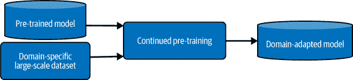
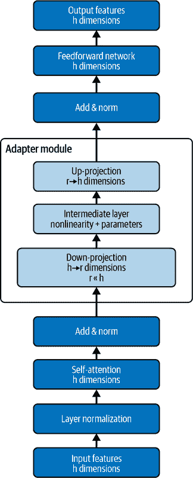
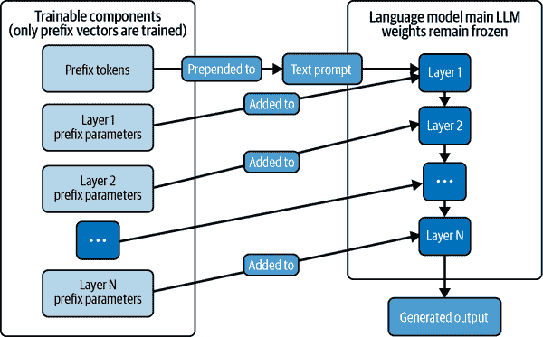
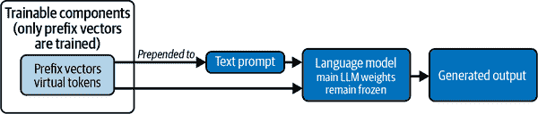
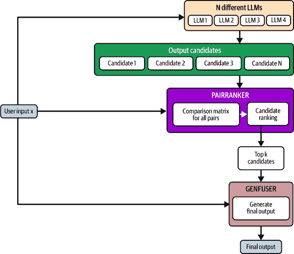

# 第七章：高级微调技术

在上一章中，我们介绍了微调典型 LLM 的规范方法。在现实世界中，更新 LLM 有多种动机，同样也有多种更新方法。在本章中，我们将描述几种高级微调技术，并强调每种技术适用的场景。

你为什么想更新 LLM 的参数？我们已经在之前的章节中提到了这一点，但现在让我们更详细地探讨一下：

领域自适应

我们处理的数据属于一个 LLM 在预训练期间可能没有熟悉的特定领域。在这种情况下，我们希望通过在特定领域的数据上训练来更新模型。

任务自适应

我们关注 LLM 在特定下游任务上的性能。为了提高 LLM 在这些任务上的性能，我们可以在特定任务的数据上对其进行训练。这可以是监督学习或无监督学习。

知识更新

我们希望通过不断用新数据对其进行训练，以保持 LLM（大型语言模型）的知识是最新的。

可控性/可引导性

我们希望控制 LLM 的行为，包括使其更有可能遵循用自然语言编写的用户请求，拒绝某些类型的请求等。实现这一目标的技术统称为对齐训练。我们将把对齐训练的讨论推迟到第八章。

在本章中，我们将学习可用于更新 LLM 以实现上述目的的技术。为此，本章分为三个部分：

持续预训练

主要用于领域自适应和保持 LLM 的知识更新（后者也称为终身学习）。

参数高效微调（PEFT）

一组微调技术，通过仅更新少量模型参数来使微调过程更高效，从而需要更少的内存和计算资源。

模型合并/模型融合

一个令人兴奋的新子领域，探索结合两个或更多模型的参数。我称这为 NLP 的“黑暗艺术”，因为它理解得不好，但如果做得正确，效果惊人。

让我们从我最喜欢的开始：持续预训练！

# 持续预训练

持续预训练的前提很简单。取一个预训练模型检查点，并继续用你自己的数据对其进行预训练。但为什么你想这么做呢？以下是一些持续预训练可以帮助的场景。

+   你在法律、金融或生物医学等特定领域工作。在这些情况下，这些领域的文本在语言和结构上都与自然发生的英语文本不同。例如，法律文本以正式的语调写成的长句为特征，包含法律领域的特定术语。金融文本中穿插着许多数字。法律和金融文本都包含相当比例的模板文本。生物医学文本包含许多不属于标准英语词汇的科学术语。在这些所有情况下，你希望在你选择的领域特定数据上预训练你的 LLM，以便 LLM 接触到领域特定文本的细微差别和特征。这被称为*领域自适应预训练（DAPT）*。

+   将 DAPT 进一步发展，你还可以继续在不仅是从你感兴趣的领域的一般文本，而且是从与你的下游任务具体相关的领域文本上预训练你的模型。这被称为*任务自适应预训练（TAPT）*。

+   你的 LLM 是一个知识的宝库。但这个知识可能会随着时间的推移而变得过时。为了保持其知识的时效性，你会在定期的时间间隔或新数据可用时继续预训练模型。这被称为*终身学习*。

###### 注意

你可能会想，“如果我想得到一个特定领域的 LLM，为什么我不直接用我的领域特定数据从头开始训练一个 LLM 呢？”好吧，你可以，但你的 LLM 的表现可能不会那么好，而且这项练习的成本将远远高于持续预训练。LLM 学习了许多广泛的言语能力，这些能力可能无法仅从领域特定文本中学习到。因此，最好是采用已经预训练的 LLM，该 LLM 是在通用文本上训练的，然后继续用领域特定文本对其进行预训练。

实际上，持续预训练是一项具有挑战性的练习。这是由于灾难性遗忘现象，当 LLM 继续在新和不同的数据上训练时，它会*忘记*之前学到的能力和知识。我们将很快探讨各种对抗灾难性遗忘问题的技术。

持续预训练与微调有何不同？差异主要在于外观和术语相关。就像预训练一样，持续预训练是自监督的，而我们通常在用监督数据集时使用微调这个术语。持续预训练使用与原始预训练设置中使用的相同（但不一定）的学习目标。最后，持续预训练数据集通常比典型的微调数据集大得多。

图 7-1 展示了一般的持续预训练过程。



###### 图 7-1\. 持续预训练过程的示意图

本书[GitHub 仓库](https://oreil.ly/llm-playbooks)包含持续预训练的教程。这种设置与微调没有不同，只是数据集未标记（自监督训练），并且数据集的大小比典型的微调数据集大得多。

如前所述，简单的持续预训练会导致先前学习的能力和知识的灾难性遗忘。存在几种技术可以减轻这个问题：

重放（记忆）

使用原始预训练的训练示例，并将它们与新训练数据混合。

蒸馏

在训练期间，取模型的较旧检查点，并比较较旧表示和当前表示之间的 KL 散度，并对其惩罚。

正则化

在持续训练期间惩罚参数的大幅变化。

参数扩展

在持续预训练过程中向模型添加更多参数。这可以通过增加模型的宽度或深度来完成。

对于更全面的持续学习技术集，请参阅 Jin 等人发表的论文（https://oreil.ly/yNa-H）。在本章中，我们将更深入地探讨重放和参数扩展方法。

## 重放（记忆）

基于重放的技术是减轻灾难性遗忘的最简单技术之一。在这种方法中，我们存储来自原始数据集的预训练示例，并将它们与持续训练数据集交织在一起。因此，数据漂移并不那么明显。

以下公式对我非常有效：从原始预训练数据集的不同子集中采样，并将它们与持续训练数据集混合。在训练开始时，让新数据的比例约为 25%。在训练步骤中，可以逐渐增加到最大比例，如 80%。

如果原始预训练数据集是一个整体，而不是由几个较小的数据集组成，你可能需要自己识别领域，以确保原始预训练集中的所有领域都包括在内。

## 参数扩展

重放方法的替代方案是使用参数扩展技术。一种简单的方法是在模型顶部添加一个或两个新层，并在持续预训练期间仅训练这些参数。你还可以在现有层中插入并训练特定领域的参数模块（称为适配器）。我们将在“参数高效微调”（#parameter-efficient-fine-tuning）中讨论基于适配器的方法。

如前所述，持续预训练也可以用来促进终身学习，模型持续更新以包含新的事实和知识。然而，目前这可能不是新知识学习最有效的范式。你可能更适合使用 RAG。我们将在第十二章中更详细地探讨 RAG。

###### 小贴士

[任务自适应预训练（TAPT）](https://oreil.ly/H38wF) 是领域自适应预训练的有用补充。TAPT 涉及在更小但更特定于任务的未标记数据集上对 LLM 进行持续预训练。为了防止灾难性遗忘，你应该在 TAPT 之前先进行 DAPT，然后随后在下游任务上执行任何监督微调。TAPT 的未标记数据可以选择使用与 DAPT 类似的方法：通过构建数据嵌入并选择与黄金真实句子聚类的数据。

总结来说，持续预训练在拥有大量特定领域文本且领域特征明显由专门的语料库或词汇所表征的情况下非常有效。持续预训练还可以用来帮助 LLM 适应新的语言。

###### 小贴士

特定领域的文本可能包含该领域特有的术语。对我有效的一个策略是添加额外的标记来表示特定领域的术语。

持续预训练需要大量的计算资源。在较小的数据集上进行微调所需的资源要少得多。然而，在大语言模型的时代，我们必须尽一切努力来减少计算和内存需求。因此，接下来让我们讨论一些参数高效的微调技术，这些技术使得在资源受限的环境中微调过程更加可行。

# 参数高效微调

在 PEFT 中，我们不是更新模型的全部参数，而是仅更新一小部分参数。这可以大幅降低计算和存储需求。

我们可以将当前的 PEFT 技术分为三种类型：

添加新参数

这涉及向 LLM 添加一些额外的参数，并仅训练这些参数。

选择参数子集

这涉及选择仅更新 LLM 的一小部分参数，无论是通过事先选择子集还是通过学习适当的子集。

低秩方法

这涉及使用通过找到包含几乎与较大矩阵相同信息的小矩阵来减少训练参数数量的方法。

现在我们将逐一详细说明这些内容。

## 添加新参数

可能你的工作需要你对大量任务进行模型微调。或者，你可能需要通过为每个用户微调模型来驱动个性化。维护和部署如此多的微调模型副本将会很麻烦。

避免更新模型所有参数的一种方法是在模型中添加一些额外的参数，并仅训练这些参数。而不是存储和部署每个微调模型的完整副本，你只需存储新添加的参数。

添加新参数进行微调的常见方法包括：

瓶颈适配器

这些是添加到 Transformer 层的轻量级模块。

前缀微调

这些是针对特定任务的向量，经过训练并附加到输入前。

提示调优（软提示）

这与前缀调优类似，但采用了简化的训练方法。

让我们详细讨论这些技术中的每一个。

### 瓶颈适配器

适配器是附加到 LLM 架构的参数模块。适配器可以以多种方式集成到 LLM 架构中，但在 Transformers 中，常见的方式是在 Transformer 的每一层插入它们。为了减少参数数量，适配器模块的宽度应该远小于底层 Transformer 模型的宽度。这构成了一个 *下投影*，也称为瓶颈。

因此，瓶颈适配器子层由一个下投影矩阵、一个在末尾的上投影矩阵（用于将维度投影回原始大小）以及中间可以以多种方式配置的参数组成。在微调过程中，仅更新适配器模块。原始预训练模型不会被更新。适配器使用接近单位矩阵的初始化来确保训练平稳。

图 7-2 展示了在 Transformer 架构中瓶颈适配器通常插入的位置。请注意，这只是一个可能的配置。



###### 图 7-2\. Transformer 中的适配器模块

这些在实际操作中是如何工作的呢？[*适配器*库](https://oreil.ly/z05rI)非常有用，可以方便地使用这些高级技术微调 LLM。

这是您可以使用适配器库开始使用瓶颈适配器的方法：

```py
from adapters import DoubleSeqBnConfig
adapter_config = DoubleSeqBnConfig()
model.add_adapter("bottleneck_adapter", config=adapter_config)
```

`DoubleSeqBnConfig` 指的是库原生支持的配置，对应于 图 7-2 中所示的适配器架构。但如我之前提到的，您可以按需更改适配器的大小和形状。为此，我们需要使用 `BnConfig`：

```py
from adapters import BnConfig
adapter_config = BnConfig(mh_adapter=True, output_adapter=True,

reduction_factor=32, non_linearity="gelu")
```

这里是这些参数的含义：

`mh_adapter`

指的是在 Transformer 的多头注意力子层之后添加的适配器模块。

`output_adapter`

指的是在 Transformer 的前馈网络子层之后添加的适配器模块。

`reduction_factor`

指的是下投影因子：适配器宽度相对于 Transformer 层宽应该缩小多少？

`non_linearity`

指的是所使用的激活函数，例如 RELU 或 GELU。

请参考适配器库的[文档](https://oreil.ly/n1Pga)以获取更多配置选项。可用的配置选项非常多！

虽然使用瓶颈适配器可以大幅减少微调时间和复杂性，但将参数添加到 Transformer 的所有层会增加推理延迟。通常，使用常用适配器配置的推理时间预计会增加 6%–8%。

###### 小贴士

在推理过程中，通过删除一些适配器层，可以降低推理延迟。[Rücklé等人提出了 AdapterDrop](https://oreil.ly/GM_1X)，这是一组在训练和推理期间删除适配器模块的方法。他们建议在推理期间从 Transformer 的前几层删除适配器，或者从每个最少激活的层修剪适配器。

### 前缀调整

使用基于适配器的微调技术的缺点是，在推理过程中，每个批次只能支持单个适配器实例，即针对特定任务微调的适配器。相比之下，前缀调整允许在同一批次中运行多个任务。

在前缀调整中，我们将特定于任务的向量添加到输入的前缀中。这大大减少了我们需要微调的参数数量。回想一下，提示包含指令、输入以及可选的一些少样本示例。LLM 生成的文本是基于到目前为止生成的输出和提示的。为此，我们添加了额外的上下文，LLM 可以通过这些前缀向量来关注。添加到输入前缀的新标记被称为**虚拟标记**或**软提示**。

图 7-3 展示了前缀调整在 Transformer 中的发生过程。



###### 图 7-3\. 前缀调整

如上图所示，前缀参数被添加到每一层。

前缀调整比瓶颈适配器参数效率更高，仅占用模型参数的 0.1%或更少，而适配器通常占 2%或更多。然而，前缀调整比适配器更难有效训练。前缀调整还减少了模型的序列长度，以适应虚拟标记。

与适配器类似，初始化对于前缀调整非常重要。虚拟标记可以通过选择与模型正在微调的任务相关的单词来初始化。

使用适配器库，我们可以实现前缀调整：

```py
from adapters import PrefixTuningConfig
adapter_config = PrefixTuningConfig()
model.add_adapter("prefix_tuning", config=adapter_config)
```

### 提示调整

提示调整是前缀调整的简化版本。与前缀调整不同，在每一层都没有前缀参数。

图 7-4 展示了提示调整在 Transformer 中的发生过程。



###### 图 7-4\. 提示调整

适配器库为提示调整提供了内置的配置：

```py
from adapters import PromptTuningConfig
adapter_config = PromptTuningConfig()
model.add_adapter("prompt_tuning", config=adapter_config)
```

一些与提示调整相关的配置参数包括：

`prompt_length`

提示标记的长度；10-30 是一个好的开始。

`prompt_init`

初始化这些标记的方法。它们可以通过字符串的嵌入或随机均匀初始化来初始化。

`prompt_init_text`

如果软提示通过字符串初始化，则用于初始化它的文本。这可以是当前任务的描述符。

Lester 等人（[Lester et al.](https://oreil.ly/BPpRu)），他们引入了提示微调，还利用它来执行软提示集成。对于软提示集成，你为每个任务训练几个软提示。然后，对于给定的输入，你分别使用它们作为前缀并生成输出。然后，你可以使用多数投票来从生成的输出中选择正确的输出。

到目前为止，我们已经看到了添加新参数到模型中进行微调的技术。然而，我们可以通过仅微调模型的一小部分参数来实现 PEFT（参数有效的微调），而不需要添加新参数。让我们接下来探索这些方法。

## 子集方法

一种选择子集参数进行微调的简单方法是对 Transformer 的上层进行微调，而将其他所有内容冻结。众所周知，Transformer 的下层在语言的基础方面具有专业性，比如句法，这是我们希望 LLM 保留的。

另一种方法是仅微调 Transformer 的偏置项（在第二章中讨论）。这是由 Zaken 等人提出的，他们表明，通过仅对偏置项进行微调，你可以获得几乎与完全微调模型相同水平的性能。作者观察到，当你的训练数据有限时，这种技术主要有效。

最终，正如我们在这里所看到的，选择这些微调方法中每一种都涉及权衡。机器学习社区正在努力开发这一领域的最佳实践。与此同时，实验是关键！

接下来，让我们看看另一种更新 LLM 参数的方法：通过将其与另一个 LLM 的参数合并。

# 结合多个模型

如果你能够访问多个 LLM（大型语言模型），它们在能力上相互重叠，但各自具有某些独特的特点，你希望在下游任务中以某种方式利用所有模型的能力。这可以通过多种方式实现，包括模型集成、模型融合或合并。LLM 的这个领域还处于起步阶段，还有更多的工作要做以充分利用其全部优势。我将其称为 NLP 的黑暗艺术，因为这些技术的理论基础仍然理解不深。然而，我确实相信，即使有这些警告，它也值得被纳入这本书中，因为其实际效益已经显现。让我们探索其中的一些方法。

## 模型集成

不同的 LLM 可能具有不同但互补的能力，这是由于它们训练规程、训练超参数等的差异所导致的。这在开源 LLM 中尤其如此，我们拥有大量的模型，其中大多数在大量重叠的数据集上训练，在基准评估指标上非常接近。因此，通过允许利用多个模型的互补能力来生成更好的输出，集成方法可能会带来好处。

在 第五章 中，我们讨论了对于生成任务，生成相同输入的多个输出并使用启发式方法选择最佳输出是有用的。我们可以将这个原则扩展到多个模型。每个输入都通过 *n* 个模型。可选地，一个初始步骤可以选择具有最高质量或相关输出的前 k 个模型。这些模型的输出可以组合并通过一个模型（可以是 LLM）输入以生成最终输出。

[江等人](https://oreil.ly/Sipzu) 提出了一个名为 LLM-Blender 的框架，用于实现 LLM 集成。该框架由两个组件组成：

+   PairRanker 对两个模型的输出进行评分，从而选择一个赢家。

+   GenFuser 接收来自 k 个不同模型的输出以生成最终输出。

图 7-5 展示了 LLM-Blender 框架的工作原理。



###### 图 7-5\. LLM-Blender

让我们更深入地了解这些模块中的每一个。

### PairRanker

考虑你拥有 *n* 个不同的模型。对于给定的输入，你将输入提供给这些模型中的每一个以生成输出。现在，对于每一对输出，你可以将它们与输入结合并输入到 PairRanker 模块中。PairRanker 模块被训练来为每个输出提供分数。如果你最终将所有输出对都输入到 PairRanker 模块中，你将找到得分最高的输出（模型）。这个输出可以被视为最终输出。

然而，这仅仅选择了最好的输出，并不一定结合了不同模型的能力。为此，LLM-Blender 框架包含一个名为 GenFuser 的模块。

### GenFuser

对于 GenFuser，我们从 PairRanker 分数中选取前 k 个结果。然后我们将它们一起输入到 GenFuser 中，生成最终输出。在实践中，GenFuser 只是一个经过微调的 LLM，它被调整以接受多个候选输入并生成一个结合了不同候选者特征的输出。

让我们看看它在实际中是如何工作的。我们可以使用 [LLM-Blender 库](https://oreil.ly/F2IcX)：

```py
import llm_blender
from llm_blender.blender.blender_utils import get_topk_candidates_from_ranks

ensemble = llm_blender.Blender()
ensemble.loadranker("llm-blender/PairRM")
ensemnle.loadfuser("llm-blender/gen_fuser_3b")

rank_list = blender.rank(input, candidate_outputs)
top_k = get_topk_candidates_from_ranks(rank_list, candidate_outputs, top_k=4)
final_output = ensemble.fuse(input, top_k)
```

给定一个输入和来自 *n* 个不同语言模型的 `candidate_outputs` 列表，我们使用 PairRanker 对输出进行排名，然后选择排名前 k 的输出并将它们融合以生成最终输出。

虽然集成方法可能有效，但最近对模型融合技术产生了很大兴趣。

## 模型融合

在这种方法中，我们以某种方式结合多个模型的参数。想法是，通过结合多个模型的参数，我们可能能够从每个单独模型所拥有的所有互补能力中受益，在一个单一模型中。

在模型融合中常用的方法包括：

平均

结合多个模型的最简单方法是对它们的参数进行平均。简单的平均已经被证明是非常有效的。

加权平均

在平均过程中，某些模型或甚至模型中的某些层可以被赋予更高的权重。

插值

每个模型可以通过一个因子 w1, w2,…wn 进行加权，其中：

```py
w1 + w2 + w3 +...wn = 1
w1p1 + w2p2 + w3p3 +...wnpn
```

其中 p1, p2, p3…pn 是模型 m1, m2, m3…mn 的参数。

多模型合并的一个好处是模型重用。假设你组织里有一个基础的大型语言模型（LLM）。这个模型被组织中的所有人使用，他们将自己的任务对模型进行微调，然后将微调后的模型上传回来。然后你可以合并所有模型的权重，从而得到一个更强的预训练模型。这个模型可以作为一个新版本的基础模型。这个过程被 Don-Yehiya 等人称为协作下降（ColD）融合（[Don-Yehiya et al.](https://oreil.ly/LTcdf)）。

我们为什么要这样做呢？这个想法是，如果我们想在数据集上微调一个 LLM，那么有一个好的起点将使训练更优化。假设我们已经在一个其他任务上微调了 LLM，那么微调后的 LLM 将比基础 LLM 是一个更好的起点。这被称为交叉训练。这也是一个相对较新的概念，所以请谨慎行事。

你可以不合并模型的全部参数，而只合并其中的一小部分。实际上，我们甚至可以只合并适配器模块。

## 适配器合并

在本章的早期，我们学习了适配器，它们可以用作多种目的，包括领域自适应预训练。虽然你可以为不同的领域训练不同的适配器，但问题仍然在于如何在推理时处理遇到的新领域。一个解决方案是对与最接近的领域相关的适配器进行平均，并使用这个结果来处理新领域。这已经被 Chronopoulou 等人通过 AdapterSoup 框架（[Chronopoulou et al.’s AdapterSoup framework](https://oreil.ly/mKoZ1)）证明是有效的。

另一种结合适配器参数的方法是在第四章中引入的 MoE 框架的上下文中。回想一下，在混合专家模型中，路由函数决定了哪个专家（们）将处理输入。[Wang 等人提出的 AdaMix 框架](https://oreil.ly/pc7Js)将此扩展到适配器模块。我们不是为每一层学习一个适配器模块，而是学习多个专家模块。在推理过程中，所有适配层都被合并。

模型合并是 LLMs 的一个迷人的子领域。即使你不在你的应用中使用它，我也强烈推荐你尝试一下，因为它同时也是一个真正 neat 的工具，可以帮助你理解 LLMs 的工作原理。

# 摘要

在本章中，我们学习了许多高级微调技术，包括经验回放和参数扩展等持续预训练策略；瓶颈适配器、前缀调整、提示调整和子集选择等参数高效微调技术；以及各种类型的模型合并和集成。我们还学习了更新模型权重的各种动机以及不同方法在每种情况下的适用性。

如前一章和本章所讨论的，微调并非万能，不能学习新的能力或必然消化新的知识。在下一章中，我们将讨论 LLMs 的局限性，如较差的可控性、幻觉和推理问题，以及缓解这些问题的技术。
