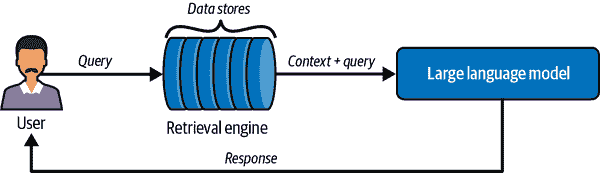
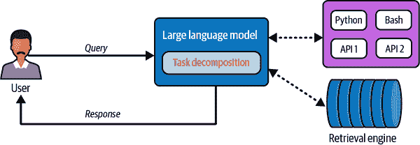
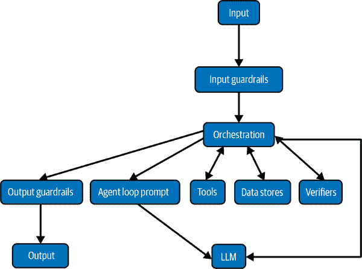

# 第十章\. 与外部工具接口 LLM

在本书的前两部分中，我们已经看到独立的 LLM 在解决各种任务中的影响有多么大。为了有效地利用它们在组织中的全部能力，它们必须集成到现有的数据和软件生态系统中。与传统软件系统不同，LLM 可以生成自主行动来与其他生态系统组件交互，带来了软件世界中前所未有的灵活性。这种灵活性解锁了一大批之前被认为不可能用例。

我们需要 LLM 与软件和外部数据交互的另一个原因是：正如我们所深知的那样，当前的 LLM 存在重大限制，其中一些我们在第一章中讨论过。为了回顾一些关键点：

+   由于重新训练 LLM 或持续更新它们成本高昂，它们有一个知识截止日期，因此对最近的事件一无所知。

+   尽管它们随着时间的推移在变得更好，但 LLM 并不总是能正确处理数学问题。

+   他们无法保证输出的真实性或准确引用其输出的来源。

+   向它们提供自己的数据是一个挑战；微调非同小可，并且情境学习受限于有效上下文窗口的长度。

正如我们在整本书中注意到的那样，巩固效应正在引导我们走向一个未来（除非我们遇到技术障碍），在这个未来中，许多上述限制可能可以在模型内部得到解决。但我们不一定需要等待这一时刻的到来，因为许多这些限制可以通过将任务和子任务卸载到外部工具来解决。

在本章中，我们将定义三种经典的 LLM 交互范式，并提供如何为您的应用程序选择它们的指导。从广义上讲，LLM 需要与之交互的外部实体有两种类型：数据存储和软件/模型，统称为工具。我们将演示如何将 LLM 与各种工具（如 API 和代码解释器）接口。我们将展示如何充分利用 LangChain 和 LlamaIndex 等库，这些库极大地简化了 LLM 的集成。我们将探索需要构建的各种脚手架软件，以促进与环境的无缝交互。我们还将通过演示它们可以作为可以做出自主决定的代理来部署，来推动今天 LLM 的能力极限。

# LLM 交互范式

假设你有一个任务想要让 LLM 来解决。有几种可能的选择：

+   LLM 使用其参数中编码的自身记忆和能力来解决任务。

+   你向 LLM 提供解决任务所需的所有上下文，LLM 使用提供的上下文和其能力来解决它。

+   LLM 没有解决此任务所需的信息或技能，因此你需要更新模型参数（微调等，如第六章 6–第八章 8 中详细说明）以便它能激活解决任务所需的技能和知识。

+   你不知道在解决任务之前需要什么上下文，所以你使用机制自动获取相关上下文并将其插入到提示中（被动方法）。

+   你向 LLM 提供明确的指令，说明如何与外部工具和数据存储交互以解决你的任务，LLM 将遵循这些指令（显式方法）。

+   如果需要，LLM 将任务分解成多个子任务，与它的环境交互以收集解决任务所需的信息/知识，并在它没有解决该子任务所需的能力时将子任务委托给外部模型和工具（自主方法）。

如你所见，最后三个例子涉及 LLM 与其环境的交互（被动、显式和自主）。让我们详细探讨这三种交互范式。

## 被动方法

图 10-1 展示了涉及 LLM 被动与数据存储交互的应用程序的典型工作流程。



###### 图 10-1\. 一个 LLM 被动地与数据存储进行交互

许多用例涉及利用 LLM 来使用自己的数据。例如，在你的公司内部知识库上构建一个问答助手，该知识库分布在多个 Notion 文档中，或者一个航空公司聊天机器人，它能够响应客户关于航班状态或预订政策的查询。

为了允许 LLM 访问外部信息，我们需要两种类型的组件：“数据存储”包含所需信息，以及检索引擎可以从数据存储中根据查询检索相关数据。检索引擎可以由 LLM 本身提供动力，或者它可能只是一个简单的关键词匹配算法。数据存储可以是数据库、知识图谱、向量数据库，甚至只是一些文本文件的集合。数据存储中的数据以表示和索引的形式存在，以提高检索效率。数据表示、索引和检索是足够重要的主题，值得单独成章：我们将推迟对这些内容的详细讨论到第十一章。

当用户提出查询时，检索引擎使用查询来找到与回答此查询最相关的文档或文本片段。在确保这些内容适合 LLM 的上下文窗口后，它们连同查询一起被输入到 LLM 中。LLM 预期将根据提示中提供的相关上下文回答查询。这种方法通常被称为 RAG，尽管正如我们将在第十二章（ch12.html#ch12）中看到的，RAG 指的是一个更广泛的概念。RAG 是一个重要的范式，值得拥有自己的章节，因此我们将推迟对这个范式的详细讨论到第十二章（ch12.html#ch12）。

注意，这个范式的显著特征是 LLM 在交互中的被动性质。LLM 只是响应提示并提供答案。它不知道提示内容中内容的来源。这个范式通常用于构建需要外部信息来理解对话上下文的问答助手或聊天机器人。

###### 注意

从现在开始，我们将把用户对 LLM 的请求称为 *查询*，并将从外部数据存储中检索到的文本单元称为 *文档*。文档可以是完整的文档、段落、段落或句子。

## 明确方法

图 10-2 展示了将 LLM 与外部工具接口的明确方法。


###### 图 10-2\. 明确交互方法在实际中的应用

与被动方法不同，LLM 已不再是被动参与者。我们向 LLM 提供明确的指令，说明如何以及何时调用外部数据存储和工具。LLM 根据预先编程的条件集与环境进行交互。当交互序列固定、范围有限且最好涉及非常少的步骤时，推荐使用这种方法。

对于 AI 数据分析师助手，一个示例交互序列可能是：

1.  用户用自然语言表达查询，要求可视化某些数据趋势

1.  LLM 生成 SQL 来检索解决用户查询所需的数据

1.  在收到数据后，LLM 使用它来生成可以由代码解释器运行的代码，以生成统计数据或可视化

图 10-3 展示了一个为 AI 数据分析师实现的固定交互序列。


###### 图 10-3\. AI 数据分析师的一个示例工作流程

在这个范式下，交互序列是预先确定且基于规则的。LLM 在决定下一步采取哪个步骤时没有任何自主权。我推荐这种方法来构建具有更严格可靠性要求的稳健型应用。

## 自主方法

图 10-4 展示了如何将 LLM 转换为能够独立解决复杂任务的自主代理。



###### 图 10-4\. 典型的由 LLM 驱动的自主代理工作流程

自主方法，或者像我喜欢叫的圣杯方法，将 LLM 转变为一个可以自主通过与环境交互来完成任务的自主代理。以下是一个典型自主代理的工作流程：

1.  用户以自然语言形式提出他们的要求，可选地提供他们希望 LLM 提供答案的格式。

1.  LLM 将用户查询分解为可管理的子任务。

1.  LLM 同步或异步地解决问题的每个子任务。在可能的情况下，LLM 使用自己的记忆和知识来解决特定的子任务。对于 LLM 无法自行回答的子任务，它从可用工具列表中选择一个工具来调用。在可能的情况下，LLM 使用已执行子任务的解决方案的输出作为其他子任务的输入。

1.  LLM 使用子任务的解决方案综合最终答案，以请求的输出格式生成输出。

这个范式足够通用，可以捕捉几乎所有用例。它也是一个有风险的范式，因为我们正在赋予 LLM 过多的责任和代理权。在这个阶段，我不建议将此范式用于任何关键任务应用。

###### 注意

为什么我呼吁在部署代理时要谨慎？人类往往低估了应用程序的准确性要求。对于许多用例，99% 的时间正确仍然不够好，尤其是当失败不可预测且 1% 的失败可能具有潜在的灾难性时。99% 的问题也是长期以来困扰自动驾驶汽车并阻碍其更广泛采用的问题。这并不意味着我们不能部署自主 LLM 代理；我们只需要巧妙的产品设计来保护用户免受其失败的影响。我们还需要强大的人机交互范式。

我们已经多次使用了“代理”这个词，但没有对其进行定义。让我们纠正这一点，并考虑代理的含义以及我们如何构建它们。

# 定义代理

随着基于 LLM 的代理的炒作开始升温，代理的通俗定义已经从其传统定义开始扩展。这是因为真正具有代理性质的系统很难构建，因此存在一种趋势，即改变目标，声称尽最大努力构建的系统已经是代理，尽管从技术上讲可能不符合要求。在这本书中，我们将坚持更保守的代理定义，将其定义为：

> 能够与环境互动并采取自主行动以完成任务的自定义软件系统。

代理的关键特征包括：

他们的自主性质

执行任务所需的步骤不需要指定给代理。代理可以决定执行任何未经人类提示的动作序列。

他们与环境互动的能力

代理可以连接到外部数据源和软件工具，这使得代理能够检索数据、调用工具、执行代码，并在适当的时候提供指令以解决问题。

###### 注意

许多“代理”的定义并不要求它们必须是自主的。根据它们的定义，遵循显式范式的应用程序也可以被称为代理（尽管是非自主或半自主代理）。

我们定义的代理范式非常强大且通用。让我们花点时间来欣赏它。如果一个代理接收到一个它不知道如何解决的问题（并且它*知道*它不知道），那么它不会只是放弃，它可以通过在网络上或知识库中搜索提示，甚至通过收集数据并微调一个可以帮助解决任务的模型来学习自行解决问题。

考虑到这些令人羡慕的能力，机器是否会接管世界？在实践中，当前的自主代理在实际上能实现的事情上有限。它们往往会陷入循环，采取错误的行为，并且无法可靠地自我纠正。构建部分自主代理更为实际，其中 LLM 在其工作流程中得到指导，无论是通过代理编排软件还是通过在循环中的人类。在本章的剩余部分，我们的重点将放在构建能够可靠解决更窄任务类别的实用代理。

# 代理工作流程

使用我们对代理的定义，让我们探讨代理在实际中的工作方式。作为一个例子，让我们考虑一个被要求回答以下问题的代理：

> 在过去 10 年中，苹果公司股价最低时，谁是公司的首席财务官？

假设代理拥有解决此任务所需的所有信息。它可以访问网络、包含股价信息的 SQL 数据库以及包含首席财务官任期信息的知识库。它连接到一个代码解释器，以便它可以生成和运行代码，并且它可以访问金融 API。系统提示包含有关 LLM 可以访问的所有工具和数据存储的详细信息。

为了回答给定的查询，LLM 必须执行以下步骤：

1.  为了计算日期范围，它需要当前日期。如果这个日期没有包含在系统提示中，它要么在网络上搜索以找到当前日期，要么生成代码以返回系统时间，然后由代码解释器执行。

1.  使用当前日期，它通过执行简单的算术运算自行找到日期范围的另一端，或者为它生成代码。步骤 1 和 2 可以合并成一个程序。

1.  它在可用的数据存储列表中找到一个包含股价信息的数据库表。它检索表的架构，将其插入到提示中，并生成一个 SQL 查询，以找到过去 10 年中股价最低的日期。

1.  拿到日期后，它需要找到那天苹果公司的首席财务官。它可以调用搜索引擎 API 来检查那天是否有关于首席财务官的明确提及。

1.  如果搜索引擎查询未能提供结果，它会在其工具列表中找到一个金融 API，并检索并插入 API 文档到其上下文中。然后它生成并调用 API 调用的代码来检索苹果公司首席财务官及其任期的列表。

1.  它使用其算术推理技能来找到与最低股价日期相匹配的首席财务官任期。

1.  它生成最终答案。如果有请求的输出格式，它会尽量遵守那个格式。

根据实现方式，步骤序列可能会有所不同。例如，你可以微调一个模型，使其能够直接生成 API 调用或 SQL 查询的代码，而无需从数据存储或 API 检索模式。

为了执行给定的任务序列，模型首先应该理解给定的任务需要分解成一系列子任务。这被称为任务分解。任务分解和规划可以由 LLM 执行，也可以外包给外部工具。

# 代理系统的组件

虽然任何给定代理系统的具体架构很大程度上取决于它打算支持的使用案例，但它的每个组件都可以归类为以下类型之一：

+   模型

+   工具

+   数据存储

+   代理循环提示

+   边界和验证器

+   编排软件

图 10-5 显示了一个典型的代理系统及其组件的交互方式。



###### 图 10-5\. 一套生产级别的代理系统

让我们探索这些类型中的每一个。

## 模型

语言模型是代理系统的骨架，负责它们的自主性和问题解决能力。一个代理系统可以由多个语言模型组成，每个模型都扮演着不同的角色。

例如，你可以构建一个由两个模型组成的代理；一个模型解决用户任务，另一个模型将其输出转换为用户要求的结构化形式。

###### 小贴士

代理工作流程可能会消耗大量的语言模型令牌，这可能会变得成本高昂。为了控制成本，考虑使用不同大小的多个语言模型，其中较小的（且更便宜的）模型执行更简单的任务。有关如何在这些模型之间完成劳动分工的更多详细信息，请参阅第十三章。

更普遍地说，你可以构建专门针对代理工作流程各个部分的代理。例如，一个代码-LLM 可以用来生成代码，而针对特定任务的微调模型可以用来执行单个工作流程步骤。这种设置可以解释为*多代理架构*。

图 10-6 显示了由多个 LLM 组成的代理系统。


###### 图 10-6\. 具有多个 LLM 的代理系统

最后，任何类型的模型，包括非 LLM 模型，都可以插入到代理系统中以解决特定任务。例如，规划阶段可以使用[符号规划器](https://oreil.ly/sXPWG)。

## 工具

如前所述，可以被 LLM 调用的软件或模型称为工具。像[LangChain](https://oreil.ly/35Lgu)和[LlamaIndex](https://oreil.ly/WF-d1)这样的库为各种软件接口提供了连接器，包括代码解释器、搜索引擎、数据库、ML 模型和各种 API。让我们探索如何在实践中使用其中的一些。

### 网络搜索

LangChain 为主要的搜索引擎如 Google、Bing 和 DuckDuckGo 提供了连接器。让我们试试 DuckDuckGo：

```py
from langchain_community.tools import DuckDuckGoSearchRun

query = "What's the weather today in Toronto?"

search_engine = DuckDuckGoSearchRun()
output = search_engine.run(query)
```

响应可以反馈给语言模型，进一步处理。

### API 连接器

为了说明调用 API，我们将展示 LangChain 的维基百科 API 包装器：

```py
!pip install wikipedia

from langchain.tools import WikipediaQueryRun
from langchain_community.utilities import WikipediaAPIWrapper
wikipedia = WikipediaQueryRun(api_wrapper=WikipediaAPIWrapper())

output = wikipedia.load("Winter Olympics")
```

`load()`函数在维基百科上执行搜索，并返回前 k 个结果页面的文本和元数据信息。（默认为 top-k = 3）。您也可以使用`run()`函数仅返回前 k 个匹配项的页面摘要。

### 代码解释器

接下来，让我们探索如何调用代码解释器并运行任意代码：

```py
from langchain_experimental.utilities import PythonREPL

python = PythonREPL()
python.run("456 * 345")
```

###### 警告

注意，在用户提示下由 LLM 生成的代码运行。用户可能会诱导模型生成恶意代码！

### 数据库连接器

最后，让我们看看如何连接到数据库并运行查询：

```py
import sqlalchemy as sa
from langchain_community.utilities import SQLDatabase

DATABASE_URI = <database_uri>

db = SQLDatabase.from_uri(DATABASE_URI)

output = db.run(
    "SELECT * FROM COMPANIES WHERE Name LIKE :comp;",
    parameters={"comp": "Apple%"},
    fetch="all")
```

`run()`函数执行提供的 SQL 查询，并将响应作为字符串返回。将`*DATABASE_URI*`替换为您自己的数据库和查询，并验证响应。

###### 小贴士

为了提高可定制性，您可以分叉 LangChain 连接器，并将它们重新用于自己的用途。

接下来，让我们看看如何将这些工具与 LLM 在代理工作流程中进行接口连接。

首先，我们需要让 LLM 意识到它可以访问这些工具。实现这一目标的一种方法是通过系统提示向 LLM 提供工具的名称和简短描述，称为*工具列表*。

接下来，LLM 需要能够在工作流程的适当阶段选择正确的工具。例如，如果解决任务的下一步是查找今晚芝加哥的天气，则需要调用网络搜索工具而不是维基百科工具。在本章的后面部分，我们将讨论帮助 LLM 选择正确工具的技术。

在底层，工具调用通常是通过 LLM 生成特殊令牌来实现的，这些令牌表示 LLM 正在进入工具调用模式，以及表示要调用的工具功能和参数的令牌。实际的工具调用是由代理编排框架执行的。

在 LangChain 中，我们可以将工具提供给 LLM，并调用它：

```py
from langchain.agents import initialize_agent, Tool
from langchain.agents import AgentType
from langchain_community.tools import DuckDuckGoSearchRun
from langchain_openai import ChatOpenAI
from langchain_core.messages import HumanMessage

search_engine = DuckDuckGoSearchRun()
model = ChatOpenAI(model="gpt-4o")

tools = [
       Tool(
           name="Search",
           func=search_engine.run,
           description="search engine for answer factual queries"
       )
   ]
agent = initialize_agent(tools, model, verbose=True)
agent.run("What are some tourist destinations in North Germany?")
```

一些模型具有原生的工具调用能力。对于没有这种能力的模型，您可以微调基础模型以赋予它们工具调用能力。在开源模型中，Llama 3.1 Instruct (8B/70B/405B) 是一个具有原生工具调用支持的模型示例。以下是 Llama 3.1 中工具调用是如何工作的。

Llama 3.1 内置了对三个工具的原生支持：Brave 网络搜索、Wolfram|Alpha 数学引擎和代码解释器。这些工具可以通过在系统提示中定义它们来 *激活*：

```py
<|begin_of_text|><|start_header_id|>system<|end_header_id|>
Environment: ipython
Tools: brave_search, wolfram_alpha

Give responses to answers in a concise fashion. <|eot_id|>
```

通过将用户提示附加到系统提示中，我们可以向 LLM 提出一个问题：

```py
<|start_header_id|>user<|end_header_id|>

How many medals did Azerbaijan win in the 2024 Summer Olympics?
<|eot_id|><|start_header_id|>assistant<|end_header_id|>
```

Llama 3.1 响应一个看起来像这样的工具调用：

```py
<|python_tag|>brave_search.call(query="How many medals did Azerbaijan win in `the` `2024` `Summer` `Olympics``?``")<|eom_id|>`
```

```py`` ````<|python_tag|>` 标记是 Llama 3.1 生成的一个特殊标记，用来指示它正在进入工具调用模式。`<|eom_id|>` 特殊标记表示模型尚未结束其回合，并等待接收工具调用的结果。您也可以在提示中提供自己的工具：推荐使用 JSON 格式。#### 提示 如果您有很多工具，那么工具的详细描述可以存储在数据存储中，并且只有在选择时才检索。提示中只需要包含工具的名称和简短描述。以下是一个工具定义的示例，描述了一个可以调用的本地函数：```py <|start_header_id|>user<|end_header_id|>  Here is a list of tools available. While invoking a tool, respond in JSON. The format is as follows:  {"tool_name": tool name, "arguments": dictionary with keys representing  argument names and values representing argument values}.  {     "type": "local_function",     "function": {     "name": "find_citations",     "description": "Find the citations for any claims made",     "parameters": {         "type": "object",         "properties": {         "claim_sentence": {             "type": "string",             "description": "A sentence in the input representing a claim"         },         "model": {             "type": "string",             "enum": ["weak", "strong"],             "description": "The type of citation model to use. A weak model is `preferred` `if` `the` `claim` `sentence` `contains` `entities` `and` `numbers``.` `"` ``` `}`         `},`         `"required"``:` `[``"claim_sentence"``,` `"model"``]`     `}`     `}` `}` ```py ```   `` `工具调用是由模型按照规定的格式以 JSON 格式生成的。#### 注意 实际的工具调用是由代理编排软件执行的。Llama 3.1 随附 [llama-stack-apps](https://oreil.ly/SSmkI)，这是一个简化代理工作流程的库。有时工具调用可能比仅仅返回函数名称及其参数更复杂。例如，查询数据库。为了使 LLM 生成正确的 SQL 查询，您应该在系统提示中提供数据库表的模式。如果数据库有太多的表，那么它们的模式可以由 LLM 按需检索。#### 提示 您可以使用专门的模型来生成代码和 SQL 查询。通用模型可以生成所需结果的文本描述，这可以用作代码 LLM 或文本到 SQL 的 LLM 微调的输入。对于大规模或高风险应用，您可以微调模型以使其在工具使用方面表现得更好。一个很好的微调方案是遵循 Qin 等人的 [ToolLLaMA](https://oreil.ly/Ewlxt)。` `` ```py` `````  ```py``` ````` ```py` ## Data Stores    A typical agent may need to interact with several types of data sources to accomplish its tasks. Commonly used data sources include prompt repositories, session memory, and tools data.    ### Prompt repository    A prompt repository is a collection of detailed prompts instructing the language model how to perform a specific task. If you can anticipate the types of tasks that an agent will be asked to perform while in production, you can construct prompts providing detailed instructions on how to solve them. The prompts can even include directions on how to advance a specific workflow. Let’s look at an example.    Many language models struggle with basic arithmetic operations, even simple questions like:    ``` Is 9.11 greater than 9.9? ```py    Until recently, even state-of-the-art language models claimed that 9.11 is greater than 9.9\. (They were recently updated with a fix after this limitation went viral on [social media](https://oreil.ly/ztWGW).)    If you are aware of such limitations that are relevant to your use case, then you can mitigate a proportion of them using detailed prompts. For the number comparison issue, for example:    > *Prompt:* If you are asked to compare two numbers using the greater than/lesser than operation, then perform the following: >  > Take the two numbers and ensure they have the same number of decimal places. After that, subtract one from the other. If the result is a positive number, then the first number is greater. If the result is a negative number, then the second number is greater. If the result is zero, the two numbers are equal.    Now, if the agent needs to perform a task that includes number comparison, it first retrieves this prompt from the prompt repository. This enables it to overcome its inherent limitation, as it will follow the detailed step-by-step instructions in the prompt.    ###### Note    Why don’t we just add all these prompts to the context window, thus eschewing retrieval? For one, the prompts may be too numerous and may not fit within the context window. Secondly, tokens are expensive, and it is inefficient to include prompts that may not be relevant to the current task. Finally, language models can adhere to only a limited set of concurrent instructions, so it is more efficient to retrieve them on demand.    Prompts can also include input-output examples, known as few-shot learning, as introduced in Chapter 1. Agents can retrieve them on demand to help accomplish their tasks. We will discuss effective ways of retrieving relevant examples in Chapter 12.    Next, let’s explore how agents use session memory to advance their goals.    ### Session memory    We would like to store logs of the steps undertaken by the agent during current and past sessions. These logs can also be augmented with feedback from verification processes, both automated and human. The agent can then retrieve session logs for better context understanding and as a guide to determine next actions in the current workflow. Let’s explore this with an example:    > *Prompt:* Is it going to be warmer tomorrow than today in Paris? Give me details in Celsius.    The agent goes through a sequence of steps to solve this query, which is all logged in the session history. The session history for this query might look like this:    > *User prompt*: Is it going to be warmer tomorrow than today in Paris? Give me details in Celsius. >  > *LLM observation*: The user has a preference for Celsius units for temperature data. >  > *LLM Output*: Let’s perform this step-by-step. >  > 1.  First, let’s retrieve today’s temperature. >      >      > 2.  Next, let’s retrieve tomorrow’s temperature. >      >      > 3.  We calculate the difference and generate the answer. >      >      >  > *External verifier*: Task decomposition is correct >  > *Tool selection:* <WeatherAPI> selected >  > *Tool info retrieval*: Retrieve information relevant to the query *Find temperature data from <WeatherAPI>* >  > *Tool invocation*: get_temperature_curweek(*Paris*) >  > *Tool output* : Weather data - Paris…​ >  > *LLM output*: Today’s temperature is 27 degrees Celsius. Tomorrow’s forecast is 23 degrees Celsius. Therefore, tomorrow is not going to be warmer in Paris than today. >  > *External Verifier*: Arithmetic operation is correct. >  > *Agent*: LLM output is dispatched to the user >  > *User feedback*: User marked this as correct    As we can see, session history can contain very rich information that can provide valuable personalized context to the LLM about the current user as well as guide the model toward the correct agentic workflow.    In more advanced implementations, multiple levels of logging can be defined, so that during retrieval, one can retrieve all the logs of a session or only the important steps, based on the logging level specified.    ###### Tip    Along with session history, the agent could also be provided with access to gold-truth training examples representing correct workflows, which can be used by the agent to guide its trajectory during test time.    Session memory can also include records of interaction between the human and the agentic system. These can be used to personalize models. We will discuss this further in Chapter 12.    Next, let’s explore how the agent can interact with tools data.    ### Tools data    Tools data comprise detailed information necessary to invoke a tool, such as database schemas, API documentation, sample API calls, and more. When the agent decides to invoke a tool, the model retrieves the pertinent tool information from the tools data store.    For example, consider a SQL tool for retrieving data from a database. To generate the right SQL query, the model could retrieve the database schema from the tools data store. The tools data contains information about the tables and columns, the descriptions of each column and their data types, and optionally information about indices and primary/secondary keys.    ###### Note    You can also fine-tune the LLM on a dataset representing valid SQL queries to your database, which can potentially remove the need to consult the schema before generating a query.    To sum it up, agents can use data stores in several ways. They can access prompts and few-shot examples from a prompt repository, they can access agentic workflow history and intermediate outputs by models in previous sessions for better personalized context understanding and workflow guidance, and they can access tool documentation to invoke tools correctly.    Agents can also access external knowledge from the web, databases, knowledge graphs, etc. Retrieving the right information from these sources is an entire sub-system unto itself. We will discuss the mechanics of retrieval in Chapters 11 and 12.    We will now discuss the agent loop prompt, which is responsible for driving the LLM’s behavior during an agentic session.    ## Agent Loop Prompt    Recall that LLMs do not have session memory. But a typical agentic workflow relies on several LLM calls! We need a mechanism to provide information about session state and the expected role of the LLM at any given time in the session. This agent loop is driven by a system prompt.    An example of a simple agent loop system prompt is:    > *Prompt:* You are an AI model currently answering questions. You have access to the following tools: {tool_description}. For each question, you can invoke one or more tools where necessary to access information or execute actions. You can invoke a tool in this format: <TOOLNAME> <Tool Arguments>. The results of these tool calls are not provided to the user. When you are ready with the final answer, output the answer using the <Answer> tag.    I find that a prompt like this is sufficient for most use cases. However, if you feel like the model is not reasoning correctly, you can try ReAct prompting.    ### ReAct    At the time of this writing, ReAct (Reasoning + Acting) prompting is the most popular prompt for the agent loop. A typical ReAct prompt looks like this:    > *Prompt:* You are an AI assistant capable of reasoning and acting. For each question, follow this process: >  > 1.  Thought: Reflect on the current state and plan your next steps. >      >      > 2.  Action: Execute the steps to gather information or call tools. >      >      > 3.  Observation: Record the results of your actions. >      >      > 4.  Final Answer: If you have an answer, provide a final response. Else continue the Thought → Action → Observation → loop until you have an answer.    Despite its popularity, ReAct prompting has been shown to be [brittle](https://oreil.ly/RRZO9).    ### Reflection    The agent loop may include self-verification or correction steps. This was pioneered by [Shinn et al.](https://oreil.ly/xFVt0) with the Reflexion paradigm.    Here is the system prompt for [Reflection-Llama-3.1](https://oreil.ly/foB-P) that uses reflection techniques:    > *Prompt:* You are a world-class AI system, capable of complex reasoning and reflection. Reason through the query inside <thinking> tags, and then provide your final response inside <output> tags. If you detect that you made a mistake in your reasoning at any point, correct yourself inside <reflection> tags.    The <reflection> tags are meant for the model to self-introspect and self-correct. We can also specify conditions when <reflection> tags should be activated, for example, when the agent performs the same action consecutively more than three times (which might mean it is stuck in a loop).    ###### Warning    The effectiveness of reflection-based methods are overstated. They might do more harm than good if they are invoked too often, causing the model to second-guess solutions.    Next, let’s discuss guardrails and verifiers, components that ensure that an agentic system can thrive in production.    ## Guardrails and Verifiers    In production environments, mistakes can be catastrophic. Depending on the use case, the agent might need to adhere to strict standards in factuality, safety, accuracy, and many other criteria.    Safety is ensured by using guardrails, components that ensure models do not overstep their bounds during the course of their workflows. Some examples of guardrails include toxic language detectors, personally identifiable information (PII) detectors, input filters that restrict the type of queries users are permitted to make, and more.    Verifiers ensure that quality standards of the agentic system are so that the agent is able to recover and self-correct from mistakes. As agentic systems are still in their infancy, the importance of good and well-placed verifiers is paramount. Verifiers can be as simple as token-matching tools but can also be fine-tuned models, symbolic verifiers, and so on.    Let’s learn more about guardrails and verifiers.    ### Safety Guardrails    Recall from Chapter 2 that LLMs are trained largely on human-generated web text. Unfortunately a significant proportion of human-generated text contains toxic, abusive, violent, or pornographic content. We do not want our LLM applications to generate content that violates the safety of the user, nor do we want users to misuse the model to generate unsafe content. While we can certainly use techniques like alignment training to make the model less likely to emit harmful content, we cannot guarantee 100% success and therefore need to institute inference-time guardrails to ensure safe usage. Libraries like [Guardrails](https://oreil.ly/F7yax) and NVIDIA’s [NeMo-Guardrails](https://oreil.ly/p7Dqz), and models like [Llama Guard](https://oreil.ly/8S08P) facilitate setting up these guardrails.    The Guardrails library provides a large (and growing) number of data validators to ensure safety and validity of LLM inputs and outputs. Here are some important ones:    Detect PII      This validator can be used to detect personally identifiable information in both the input and output text. [Microsoft Presidio](https://oreil.ly/eG8T1) is employed under the hood to perform the PII identification.      Prompt injection      This validator can detect certain types of adversarial prompting and thus can be used to prevent users from misusing the LLM. The [Rebuff](https://oreil.ly/nIyE5) library is used under the hood to detect prompt injection.      Not safe for work (NSFW) text      This validator detects NSFW text in the LLM output. This includes text with profanity, violence, and sexual content. The *Profanity free* validator also exists for detecting only profanity in text.      Politeness check      This validator checks if the LLM output text is sufficiently polite. A related validator is *Toxic language*.      Web sanitization      This validator checks the LLM output for any security vulnerabilities, including if it contains code that can be executed in a browser. The [Bleach](https://oreil.ly/r3Xrl) library is used under the hood to find potential vulnerabilities and sanitize the output.      What happens if the validation checks fail and there is indeed harmful content in the input or output? Guardrails provides a few options:    Re-ask      In this method, the LLM is asked to regenerate the output, with the prompt containing instructions to specifically abide by the criteria on which the output previously failed validation.      Fix      In this method, the library fixes the output by itself without asking the LLM for a regeneration. Fixes can involve deletion or replacement of certain parts of the input or output.      Filter      If structured data generation is used, this option enables filtering out only the attribute for which the validation failed. The rest of the output will be fed back to the user.      Refrain      In this setting, the output is simply not returned to the user, and the user receives a refusal.      Noop      No action is taken, but the validation failure is logged for further inspection.      Exception      This raises a software exception when the validation fails. Exception handlers can be written to activate custom behavior.      fix_reask      In this method, the library tries to fix the output by itself and then runs validation on the new output. If the validation still fails, then the LLM is asked to regenerate the output.      Let’s look at the PII guardrail as an example:    ``` from guardrails import Guard from guardrails.hub import DetectPII  guard = Guard().use(     DetectPII, ["EMAIL_ADDRESS", "PHONE_NUMBER"], "reask")  guard.validate("The Nobel prize this year was won by Geoff Hinton, `who` `can` `be` `reached` `at` `+``1` `234` `567` `8900``")` ```py   `` `Next, let’s look at how verification modules work.` ``  `` `### Verification modules    As we have seen throughout the book, current LLMs suffer from problems like reasoning limitations and hallucinations that severely limit their robustness. However, production-ready applications need to demonstrate a certain level of reliability to be accepted by users. One way to extend the reliability of LLM-based systems is to use a human-in-the-loop who can manually verify the output and provide feedback. However, in the real world a human-in-the-loop is not always desired or feasible. The most popular alternative is to use external verification modules as part of the LLM system. These modules can range from rule-based programs to smaller fine-tuned LLMs to symbolic solvers. There are also efforts to use LLMs as verifiers, called “LLM-as-a-judge.”    Related components include fallback modules. These modules are activated when the verification process fails and retrying/fixing doesn’t work. Fallback modules can be as simple as messages like, “I am sorry I cannot entertain your request” to more complex workflows.    Let’s discuss an example. Consider an abstractive summarization application that operates on financial documents. To ensure quality and reliability of the generated summaries, we need to embed verification and self-fixing into the system architecture.    How do we verify the quality of an abstractive summary? While single-number metrics are available to automatically quantify the quality of a summary, a more holistic approach would be to define a list of criteria that a good summary should satisfy and verify whether each criterion is fulfilled.    ###### Note    Several single-number quantitative metrics exist for evaluating summaries. These include metrics like [BLEU, ROUGE](https://oreil.ly/LPlFJ), and [BERTScore](https://oreil.ly/gsOGl). BLEU and ROUGE rely on token overlap heuristics and have been shown to be [woefully inadequate](https://oreil.ly/rSzbR). Techniques like BERTScore that apply semantic similarity have been shown to be more promising, but in the end, the reality is that summaries have subjective notions of quality and need a more holistic approach for verification.    For the summarization of financial documents application, here is a list of important criteria:    Factuality      The summary is factually correct and does not make incorrect assumptions or conclusions from the source text.      Specificity      The summary doesn’t *oversummarize*; it avoids being generic and provides specific details, whether numbers or named entities.      Relevance      Also called precision, this is calculated as the percentage of sentences in the summary that are deemed relevant and thus merit inclusion in the summary.      Completeness      Also called recall, this is calculated as the percentage of relevant items in the source document that are included in the summary.      Repetitiveness      The summary should not be repetitive, even if there is repetition in the source document.      Coherence      When read in full, the summary should provide a clear picture of the content in the source document, while minimizing ambiguity. This is one of the list’s more subjective criteria.      Structure      While defining the summarization task, we might specify a structure for the summaries. For example, the summary could be expected to contain some predefined sections and subsections. The generated summary should follow the specified structure.      Formatting      The generated summary should follow proper formatting. For example, if the summary is to be generated as a bulleted list, then all the items in the summary should be represented by bullets.      Ordering      The ordering of the items in the summary should not impede the understanding of the summary content. We also might want to specify an order for the summaries, for example, chronological.      Error handling      In case of errors or omissions in the source document, there should be appropriate error handling.      How do we automatically verify whether a given summary meets all these criteria? We can use a combination of rule-based methods and fine-tuned models. Ultimately, the rigor of the methods used for verification depends on the degree of reliability needed for your application. However, we notice that once we reduce the scope of the verification process to verify fitness of individual criteria rather than the application as a whole, it becomes easier to verify accurately using inexpensive techniques. Let’s look at how we can build verifiers for each criteria of the abstractive summarization task:    Factuality      Verifying whether an LLM-generated statement is factual is extremely difficult if we do not have access to ground truth. But for summarization applications, we do have access to the ground truth. Therefore, we can verify factuality by taking each sentence in the summary and checking whether, given the source text, one can logically conclude the statement in the summary. This can be framed as a natural language inference (NLI) problem, which is a standard NLP task.    In the NLI task, we have a hypothesis and a premise, and the goal is to check if the hypothesis is logically entailed by the premise. In our example, the hypothesis is a sentence in the summary and the premise is the source text.    Training an NLI model specific to your domain might be a cumbersome task. If you do not have access to an NLI model, you can use token overlap and similar statistics to approximate factuality verification.    For numbers and named entities, factuality verification can be performed by using string matches. You can verify if all the numbers and named entities in the summary are indeed present in the source text.      Specificity      One way for a summary to be specific is to include numbers and named entities where relevant. For each sentence in the summary, we can check whether the content in the source document related to the topic of the sentence contains any numbers and named entities, and if these are reflected in the summary. Numbers and named entities can be tagged and detected using regular expressions or libraries like [spaCy](https://oreil.ly/zatAW).      Relevance/precision      We can train a classification model that detects whether a sentence in the summary is relevant. Note that there are limits to this approach. If this classification model was good enough, we could have directly used it to select relevant sentences from the source text to build the summary! In practice, this classification model can be used to remove irrelevant content that is more obvious.      Recall/completeness      What content merits inclusion in the summary is a difficult question, especially if there is a hard limit on the summary length. You can train a ranking model that ranks sentences in the source document by importance, and then verify if the top-ranked sentences are represented in the summary. You can also specify beforehand the type of content that you need represented in the summary and build a classification model for determining which parts of the source document contain pertinent information. Using similarity metrics like embedding similarity, you can then find if the content has been adequately represented in the summary.      Repetitiveness      This can be discovered by using string difference algorithms like the [Jaccard distance](https://oreil.ly/Ny_Ku) or by calculating the embedding similarity between pairs of summary sentences.      Coherence      This is perhaps one of the most difficult criteria to verify. One way to solve this, albeit a more expensive solution, is to build a prerequisite detection model. For each sentence in the summary, we detect if all the sentences that come before it are sufficient prerequisites for understanding the correct sentence. For more information on prerequisite detection techniques, see [Thareja et al.](https://oreil.ly/6JnRs)      Structure      If we specify a predetermined structure (sections and subsections) for the summary, we can easily identify if the structure is adhered to by checking if the desired section and subsection titles are present in the summary. We can also verify using embedding similarity techniques if the content within the sections and subsections is faithful to the title of the section/subsection.      Formatting      This involves checking whether the content is in the appropriate formatting, for example, whether it is a bulleted list or a valid JSON object.      Ordering      The desired order can be chronological, alphabetical, a domain, or task-specific ordering. If it is supposed to be chronological, you can verify by extracting dates in the summary and checking if the summary contains dates in a chronological order. If the ordering requirements are more complex, then verifying adherence to order may become an extremely difficult task.      ###### Tip    Do not expect your verification process to be strictly better than your summary model. If that was the case, you could have used the verification process to generate the summary!    We can also deploy symbolic verifiers like [SAT](https://oreil.ly/lOsg_) (Boolean satisfiability) solvers and logic planners. This type of verification is beyond the scope of this book.    Once verification modules are part of our system architecture, we will also need to decide what action to perform when the verification fails. One option is to just resample from the language model again. Regeneration can be performed for the full output or only for the output that failed verification. We can also develop antifragile architectures that have fallbacks in case of failure, which we will discuss in Chapter 13.    ###### Warning    Adding more verifiers can drastically increase system latency. Thus, their inclusion has to be balanced with accuracy and system latency needs.    Finally, let’s discuss agent orchestration software that connects all these components.` ``  `` `## Agent Orchestration Software    For agentic workflows to proceed smoothly, we need software that connects all the components. Orchestration software manages state; invokes tools; initiates retrieval; pipes buffers; and logs intermediate and final outputs. Many agentic frameworks, both open source and proprietary, perform this function, including [LangChain](https://oreil.ly/7vmlY), [LlamaIndex](https://oreil.ly/uxejK), [CrewAI](https://oreil.ly/Ntxii), [AutoGen](https://oreil.ly/tx3qy), [MetaGPT](https://oreil.ly/HI-Jn), [XAgent](https://oreil.ly/sA_DR), [llama-stack-apps](https://oreil.ly/SBGC_), and so on.    ###### Tip    Agents are a relatively new paradigm, so all these agentic frameworks are expected to change a lot in the coming months and years. These frameworks are implemented in an opinionated fashion and hence are less flexible. For prototyping, I suggest picking LangChain or LlamaIndex for ease of use. For production use, you might want to build a framework internally from scratch or by extending the open source ones. This book’s [GitHub repo](https://oreil.ly/llm-playbooks) contains a rudimentary agentic framework as well.    Now that we have learned all the different agentic system components, it is time to get building! The book’s [GitHub repository](https://oreil.ly/llm-playbooks) contains sample implementations of various types of agents. Try modifying them for your use case to understand the tradeoffs being made.    ###### Tip    The keep it simple, stupid (KISS) principle applies to agents perhaps more than any other recent paradigm. Don’t complicate your agentic architecture unless there is a compelling reason to do so. We will discuss this more in Chapter 13.` `` ```` ```py`` ``````py  ``` `` `# Summary    In this chapter, we discussed the different ways in which LLMs can interface with external tools. We introduced the agentic paradigm and provided a formal definition of agents. We identified the components of an agentic system in detail, exploring models, tools, data stores, guardrails and verifiers, and agentic orchestration software. We learned how to define and implement our own tools.    In the next chapter, we will explore data representation and retrieval, crucial elements of interfacing LLMs with external data.` `` ```
