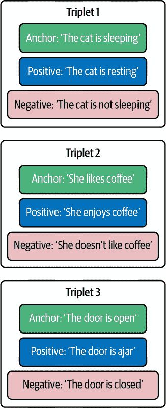

# 第十一章\. 表示学习和嵌入

在上一章中，我们学习了如何将语言模型与外部工具接口，包括数据存储。外部数据可以以文本文件、数据库表和知识图谱的形式存在。数据可以跨越广泛的内容类型，从专有领域的知识库到 LLM 生成的中间结果和输出。

如果数据是有结构的，例如存储在关系数据库中，语言模型可以发出 SQL 查询以检索所需的数据。但如果是非结构化形式的数据呢？

从非结构化文本数据集中检索数据的一种方法是通过关键词搜索或使用正则表达式。对于上一章中提到的苹果公司首席财务官（CFO）的例子，我们可以从包含财务披露的语料库中检索包含 CFO 提及的文本，希望其中包含入职日期或任期信息。例如，你可以使用以下正则表达式：

```py
pattern = r"(?i)\b(?:C\.?F\.?O|Chief\s+Financial\s+Officer)\b"
```

关键词搜索在有效性方面有限。如果语料库中存在 CFO 的入职日期或任期，那么表达这些信息的方式有非常多种。尝试使用上述通用的正则表达式可能会导致大量误报。

因此，我们需要超越关键词搜索。在过去的几十年里，信息检索领域已经发展出多种方法，如 BM25，这些方法塑造了搜索系统。我们将在第十二章中了解更多关于这些方法的内容。在 LLM 时代，基于嵌入的搜索系统正迅速成为实现搜索的标准方式。

在本章中，我们将学习嵌入是如何工作的。我们将探讨语义相似性的概念，并检查各种相似度度量。我们将学习如何使用流行的嵌入模型并评估它们的性能。我们还将展示如何微调嵌入模型以适应特定的用例和领域。我们将展示如何使用稀疏自动编码器（SAEs）来解释这些嵌入。最后，我们将讨论优化嵌入以减少存储需求和计算开销的技术。

# 嵌入简介

表示学习是机器学习的一个子领域，它涉及学习以捕捉数据的有意义特征的方式来表示数据，通常是在低维空间中。在 NLP 的背景下，这涉及到将文本单元（如单词、句子或段落）转换为向量形式，称为嵌入。嵌入捕捉输入的语义（与意义相关）和语用（与社会语境相关）特征。

嵌入可以使用开源库和付费 API 生成。[Sentence Transformers](https://oreil.ly/4OSVd)是一个非常著名的开源库，用于生成嵌入，它提供了与专有模型竞争的嵌入模型。

让我们使用`Sentence Transformers`库生成嵌入：

```py
from sentence_transformers import SentenceTransformer, util
sbert_model = SentenceTransformer('msmarco-distilbert-base-tas-b')
embedding = sbert_model.encode("American pizza is one of the nation's greatest
cultural exports", show_progress_bar=True, device='cuda',

convert_to_tensor=True)
print("Embedding size:", embedding.shape[0])
print(embedding)
```

输出：

```py
Embedding size: 768

tensor([-3.9256e-01,  1.0734e-01,  1.3579e-01,  7.6147e-02,  5.2521e-02,
-6.5887e-03,  1.9225e-01,  3.5374e-01,  2.5725e-01,  5.6408e-02,...])
```

对于这个模型，嵌入大小是 768，这意味着每个向量有 768 个维度。这个特定模型的序列长度是 512，这意味着输入文本被限制在 512 个标记内，超出这个范围将被截断。嵌入向量由浮点数组成，这些浮点数本身是不可解释的。我们将在本章后面讨论解释嵌入的技术。

目前大多数使用的嵌入模型都是基于仅编码器语言模型，我们已在第四章中介绍过。这些底层模型包括 BERT、RoBERTa、MPNet 等，通常在释义/问答/自然语言推理数据集上进行微调。让我们看看如何从这些类型的模型中推导出嵌入（这正是`sentence_transformers.encode()`函数在幕后所做的事情）：

```py
from transformers import AutoTokenizer, AutoModel
import torch

tokenizer=
AutoTokenizer.from_pretrained(
  "sentence-transformers/msmarco-distilbert-base-tas-b")
model =
AutoModel.from_pretrained("sentence-transformers/msmarco-distilbert-base-tas-b")

input = tokenizer(
  'American pizza is one of the nation's greatest cultural exports',
padding=True, truncation=True, return_tensors='pt')

with torch.no_grad():
        output = model(**input, return_dict=True)
       embedding = output.last_hidden_state[:, 0]
print(embedding)
```

在这个例子中，嵌入是从 DistilBERT 模型的最后一层的[CLS]标记中提取的。从模型中提取嵌入的其他方法包括：

+   均值池化，其中取序列中所有标记输出的平均值

+   最大池化，其中取所有标记在每个维度上的最大值

+   加权均值，其中给予最后几个标记更多的权重

+   最后一个标记，其中嵌入只是最后一个标记的编码器输出

###### 小贴士

最后一个标记（或第一个标记）是否包含整个序列的良好表示，很大程度上取决于预训练和微调目标。BERT 的预训练目标（下一句预测）确保了[CLS]标记比，比如说，不使用下一句预测目标的 RoBERTa 具有更丰富的表示，因此其<s>起始序列标记的信息量并不那么丰富。

最近，基于解码器的嵌入模型开始受到重视，如[SGPT 模型系列](https://oreil.ly/AztT9)。OpenAI 为搜索和相似度暴露了一个单一的嵌入端点。OpenAI 嵌入具有更大的最大序列长度（8,192 个标记）和更大的维度大小（1,536–3,072）。Cohere 和 Jina 是其他嵌入提供商的例子。

选择适合您任务的正确模型取决于成本、延迟、存储限制、性能以及您用例的数据域。我建议从 Sentence Transformers 库中提供的有效但小巧的 all-mpnet-base-v2 模型开始，我认为它是 NLP 领域的“工作马”。像往常一样，尝试不同的模型不会有坏处。本章的其余部分将提供有关选择正确模型的更多提示。在章节的后面部分，我们还将展示如何评估嵌入模型并介绍流行的基准。

###### 警告

没有什么是无限压缩的！嵌入大小是固定的，所以您的输入越长，其嵌入中可以编码的信息就越少。管理这种权衡因用例而异。

# 语义搜索

当我们使用嵌入表示大型文本语料库时，可以欣赏嵌入的真正价值。表示数据的数据向量占据我们所说的嵌入空间。在嵌入空间中，相似文本彼此更接近。这一特性使我们能够使用相似度度量来完成诸如聚类或语义搜索等有意义的工作。语义搜索是指考虑查询和文档的意义和上下文的技术，以识别与给定查询最相关的文档。

我们可以通过使用[PCA](https://oreil.ly/Rk1M9)或[t-SNE](https://oreil.ly/0xNrB)等降维技术来可视化嵌入空间。

图 11-1 展示了由[Nomic AI](https://oreil.ly/XsXls)使用其 Atlas 工具创建的，美国国会成员在 X（前身为 Twitter）上发布的帖子嵌入的可视化。您可以在[Nomic 的博客](https://oreil.ly/AORpk)上查看可视化详细版本。

让我们探讨如何使用嵌入进行语义搜索。对于给定的用户查询，我们可以生成查询的嵌入，然后识别在向量空间中最接近它的文档嵌入。与最接近的 k 个向量（k 可以小到 1，但可以根据应用需求变化）对应的文本作为对搜索查询的响应。这个过程被称为*检索*。然后，这些文本与用户查询一起输入到 LLM 提示中，LLM 使用上下文中提供的信息来回答用户查询。这个两步过程传统上被称为*检索器-阅读器*框架，在这个例子中，LLM 扮演的是读者的角色。


###### 图 11-1\. 嵌入空间可视化

作为简单的说明示例，考虑组成我们语料库的两个句子：

```py
chunks = ['The President of the U.S is Joe Biden',
'Ramen consumption has increased in the last 5 months']
```

给定查询“美国总统”，我们可以使用 Sentence Transformers 对查询和块进行编码：

```py
from sentence_transformers import SentenceTransformer, util
sbert_model = SentenceTransformer('msmarco-distilbert-base-tas-b')
chunk_embeddings = sbert_model.encode(chunks, show_progress_bar=True,
device='cuda', normalize_embeddings=True, convert_to_tensor=True)
query_embedding = sbert_model.encode(query, device='cuda',
normalize_embeddings=True, convert_to_tensor=True)
matches = util.semantic_search(query_embedding, chunk_embeddings,
score_function=util.dot_score)
```

输出是：

```py
[[{'corpus_id': 0, 'score': 0.8643729090690613},
  {'corpus_id': 1, 'score': 0.6223753690719604}]]
```

如您所见，第一句话的相似度得分要高得多，因此我们返回第一句话作为查询响应。

###### 注意

对称语义搜索和非对称语义搜索之间有一个区别。在对称搜索中，查询文本的大小与文档文本相似。在非对称搜索中，查询文本比文档文本短得多，例如搜索引擎和问答助手查询。有专门针对仅对称或非对称搜索的模型。在某些模型中，查询和块文本使用不同的模型进行编码。

# 相似度度量

常用的相似度度量包括点积、余弦相似度和欧几里得距离。如果你需要背景信息，请参阅 [Pinecone](https://oreil.ly/X_qcD) 关于相似度度量的教程。在使用嵌入模型时，请使用用于训练模型的相似度度量。你可以在模型卡片或 Hugging Face 模型中心页面上找到此信息。

###### 小贴士

如果你将 `normalize_embeddings` 作为 `encode()` 函数的参数设置为 `True`，它将规范化嵌入到单位长度。这将确保点积和余弦相似度将具有相同的值。请注意，点积比余弦相似度更快。Sentence Transformers 提供了在点积和余弦相似度上训练的[单独的模型](https://oreil.ly/LOu75)，并提到在点积上训练的模型在检索时倾向于更喜欢较长的片段。

虽然语义相似度的概念很强大，但它并不是所有应用的万能药。语义相似度任务是不完全指定的。首先，有几个相似度的概念。相似度指的是被比较的实体之间的相同或相似性。但对于相同的两个实体，有些维度是相似的，而有些则是不同的。

例如，考虑以下三个句子：

> 在公司工作满 25 周年后，波莫伦科先生确认他不会退休。
> 
> 波莫伦科先生昨天宣布了他的退休。
> 
> 波莫伦科先生昨天没有宣布他的退休。

现在我们使用 Sentence Transformers 的 all-mpnet-base-v2 嵌入模型来编码这些句子并计算它们的相似度：

```py
!pip install sentence-transformers

from sentence_transformers import SentenceTransformer, util
model = SentenceTransformer('all-mpnet-base-v2')

sentences = ['After his 25th anniversary at the company, Mr. Pomorenko
confirmed that he is not retiring',  'Mr. Pomorenko announced his retirement
yesterday']
embeddings = model.encode(sentences)
cosine_scores = util.cos_sim(embeddings[0], embeddings[1])
print("Cosine Similarity:", cosine_scores.item())
```

输出：

```py
Cosine Similarity: 0.7870
```

如果你将第二句话替换为“波莫伦科先生昨天没有宣布他的退休”，输出结果将是：

```py
Cosine Similarity: 0.7677!
```

如您所见，这两句话都被认为与第一句话同样相似。在某些方面，这是真的。它们相似是因为它们都谈论波莫伦科先生。它们也相似是因为它们都涉及退休的主题。另一方面，一句话传达了与另一句话相反的意义，通过暗示退休正在发生而不是没有发生。

###### 小贴士

处理由于模型使用不希望的相似度维度（如否定）而产生的假阳性的一种方法是在返回给查询的响应中返回的 top-k 结果中仅增加 k 值。然后，LLM 可以区分假阳性和使用正确信息来回答查询。然而，增加 top-k 也会增加提示的上下文长度，增加延迟和成本。

我们的应用需求决定了哪些相似度维度对我们来说很重要。如果否定关系对我们应用区分很重要，那么在嵌入空间中反映这一点可能是个好主意。这正是微调嵌入模型能派上用场的地方。微调嵌入模型允许你“编辑”你的嵌入空间以满足你的需求。这个过程相对简单，并且可能非常有益。

当你处理具有与通用数据不同的标记分布的特定数据领域时，微调嵌入模型也非常有用。现在让我们讨论如何微调嵌入模型。

# 微调嵌入模型

`SentenceTransformerTrainer` 类（[链接](https://oreil.ly/Jahep)）简化了使用基础模型进行嵌入模型微调的过程。为了微调一个嵌入模型，我们需要一个用于微调的基础模型、一个训练数据集和一个学习目标。

## 基础模型

你可以微调像 all-mpnet-base-v2 这样的微调模型，或者微调像 MPNet 这样的基础模型，all-mpnet-base-v2 就是基于 MPNet 定义的。微调基础模型比进一步微调已经微调过的模型需要更多的训练数据。其他适合微调的候选模型包括[BGE-M3](https://oreil.ly/Sh8pZ)和[jina-embeddings-v3](https://oreil.ly/lFiWX)。通过 Sentence Transformers 可以访问的模型完整列表可以在[线上](https://oreil.ly/Onyuv)找到。记住在使用模型进行商业用途之前检查其许可证。

选择基础模型时需要考虑的一些因素包括基础模型的表现、嵌入模型的大小（这决定了模型编码文本的速度）、模型维度数（这决定了嵌入所占用的存储量），以及许可的影响。MPNet 或 all-mpnet-base-v2 是一个稳固的首选，它在许多项目中都为我提供了良好的服务。

###### 小贴士

如果一个模型已经针对特定任务（如语义搜索）进行了微调，那么在另一个任务上进一步微调它并不是最佳选择。

## 训练数据集

结构化数据集的方法有很多种。最常见的方式是以三元组的形式，包括（锚点，正面，负面）示例。对于一个给定的锚点句子，正面句子是我们希望其在嵌入空间中更接近锚点句子的句子，而负面句子是我们希望其在嵌入空间中与锚点距离更远的句子。例如，为了微调模型以帮助其区分否定句子，我们的训练集可以由三元组组成，其中负面句子与锚点相矛盾，而正面句子则与之相符。

图 11-2 展示了一个用于帮助模型区分否定词的嵌入数据集，该数据集由三元组组成。



###### 图 11-2\. 否定关系的微调数据集

数据集也可以由句子对组成，其中句子可以代表一个 (query, response) 对，或一个 (passage, summary) 对，或一对释义。下游用例决定了所需数据集的类型。The [Sentence Transformers 网站](https://oreil.ly/geI1M) 展示了数据集可以格式化的所有不同方式。

训练数据集可以小到几千个示例，当用于领域自适应时，可以达到数十亿个标记。[billions of tokens](https://oreil.ly/oNI4n)。

注意，某些损失函数需要您的数据集以特定的格式。我们将在下一节详细讨论损失函数。

## 损失函数

回顾我们在 第四章 中关于训练 LLMs 的损失函数的讨论。The [Sentence Transformers 库](https://oreil.ly/9Qaop) 支持广泛的损失函数用于训练嵌入模型。让我们探索一些常用的函数。

对于三元组数据集，你可以计算一个 [triplet loss](https://oreil.ly/yXHNU)。对于一个由 (anchor, positive, negative) 三元组组成的训练数据集，三元组损失最小化锚句和正句之间的距离，并最大化锚句和负句之间的距离。

从数学上讲，损失的计算如下：

损失 = max(d(a, p) – d(a, n) + margin, 0)

其中 d 是距离度量，通常是欧几里得距离。margin 是一个超参数，表示负例应该比正例远离锚点的距离。当使用欧几里得距离作为距离度量时，我建议 margin 为 5，但如果你没有得到足够的结果，请确保调整它。

如果你使用的是由 (query, response)，(passage, summary) 等对组成的数据集，你可以使用 [Multiple Negatives Ranking Loss](https://oreil.ly/oNcsQ)。

在包含 (query, response) 对 (q1, r1), (q2, r2)…(qn, rn) 的批次中，对于每个查询，将有一个正对，例如 (q1, r1) 和 n – 1 个负对，例如 (q1, r2), (q1, r3)…等等。损失函数最小化负对数似然。

###### 小贴士

使用 Sentence Transformers 中可用的 `CachedMultipleNegativesRankingLoss`，这允许你使用更大的批次大小，从而提高性能。

既然我们已经讨论了所有需要的微调成分，让我们使用 `SentenceTransformerTrainer` 类将它们全部组合起来：

```py
from datasets import load_dataset
from sentence_transformers import SentenceTransformer, SentenceTransformerTrainer
from sentence_transformers.losses import TripletLoss

model = SentenceTransformer( "'all-mpnet-base-v2'")

dataset = load_dataset("csv", data_files="negatives_dataset.csv")

loss = TripletLoss(model)

trainer = SentenceTransformerTrainer(
    model=model,
    train_dataset=dataset
    loss=loss
   )
trainer.train()
model.save_pretrained("mpnet_finetuned_negatives")
```

完整的代码可以在书籍的 [GitHub 仓库](https://oreil.ly/llm-playbooks) 中找到。

###### 小贴士

注意过拟合！如果你注意到模型过拟合，你可以降低学习率。

###### 注意

[周等人](https://oreil.ly/BPdRD)表明，在嵌入的上下文中，余弦相似度往往会低估高频词之间的相似性。这是因为高频词在嵌入空间中占据不同的区域，导致与其他词的距离更大。另一方面，低频词在几何上往往更集中。

# 指令嵌入

到目前为止，我们已经看到嵌入模型是专门用于解决特定任务的，如语义搜索或释义。最近的一项发展将嵌入模型和指令微调的概念结合起来，我们在第六章中讨论了这一概念。想象一下，如果你可以使用相同的嵌入模型根据将要使用的任务为同一文档生成不同的嵌入。这样一个模型被称为 Instructor。[Instructor 嵌入](https://oreil.ly/mSIhG)允许你在编码文本时可选地指定领域、文本类型（是否为句子、段落等）和任务。

这里有一个例子：

```py
!pip install InstructorEmbedding

from InstructorEmbedding import INSTRUCTOR
model = INSTRUCTOR('hkunlp/instructor-large')

customized_embeddings = model.encode(
[['Represent the question for retrieving supporting documents:',
  'Who is the CEO of Apple'],
 ['Represent the sentence for retrieval:',
  'Tim Cook is the CEO of Apple'],
 ['Represent the sentence for retrieval:',
  'He is a musically gifted CEO'],
)
```

Instructor 的创建者建议使用以下指令模板：

```py
‘Represent the {domain} {text_type} for {task_objective}:’
```

其中 `{domain}` 表示文本的领域，如法律、金融等。可选的 `{text_type}` 表示正在编码的文本单位，如问题、句子、段落等。`{task_objective}` 表示我们使用嵌入的任务，如语义搜索、释义检测等。

在语义搜索的上下文中，他们建议对查询使用指令“表示用于检索支持文档的问题”，对文档使用指令“表示用于检索的句子”。

指令微调原则应用于检索的另一种方式是使用*基于描述的检索*，其中查询可以是需要检索的文本的描述，而不是需要检索的文本的实例（示例）。[Ravfogel 等人](https://oreil.ly/rp8Q-)已经发布了基于描述的检索模型，在我的经验中，这些模型非常有效。请注意，这些模型具有双编码器设置：使用不同的模型来编码查询和文档。

# 优化嵌入大小

许多应用涉及生成数十亿个嵌入。正如我们所见，现代嵌入有时有数千个维度。如果每个维度都用 float32 表示，那么每个维度需要 4 个字节的内存。因此，存储从 all-mpnet-base-v2 模型生成的 1 亿个向量，该模型有 768 个维度，需要接近 300 GB 的内存！

用 768 维向量表示单个句子并不罕见，几乎总是不超过 40 个标记。我们真的需要 768 个维度来表示 40 个标记吗？现实是嵌入训练非常低效，大量的维度实际上并不有用。

因此，已经开发了几种嵌入截断和量化方法来优化嵌入大小并减少存储和计算需求。如果您在处理超过几百万个向量的环境中工作，这些技术可能对您很有用。让我们看看这些方法中的一些。

## Matryoshka 嵌入

Matryoshka 嵌入是以[俄罗斯套娃](https://oreil.ly/OC6Yj)命名的，它指的是一套按大小递减顺序放置在彼此内部的木制娃娃，起源于俄罗斯。Matryoshka 嵌入的训练方式是，向量的早期维度包含比后期维度更重要的信息。这使得我们可以根据应用对成本、延迟和性能的要求来截断向量。

用于训练这些嵌入的技术称为 Matryoshka 表示学习（MRL）。在 MRL 中，我们首先选择一组截断维度。例如，一个 1,024 维度的向量可以有截断维度 128、256、512 和 768。在训练过程中，我们计算每个截断维度以及完整维度的损失。然后，损失被相加并加权。在我们的例子中，前 128 个维度从计算在向量的前 128、256、512、768 和 1,024 维度的损失中学习。最终结果是，向量的初始维度将编码更重要的信息，因为它们从更丰富的损失中学习。

使用 MRL 进行训练由 Sentence Transformers 库支持。让我们看看它在实际中的应用：

```py
from sentence_transformers import SentenceTransformer
from sentence_transformers import SentenceTransformerTrainer, losses
from datasets import load_dataset

model = SentenceTransformer("all-mpnet-base-v2")
train_dataset = load_dataset("csv", data_files="finetune_dataset.csv")
loss = losses.MultipleNegativesRankingLoss(model)
loss = losses.MatryoshkaLoss(model, loss, [768, 512, 256, 128]])

trainer = SentenceTransformerTrainer(
    model=model,
    train_dataset=train_dataset,
    loss=loss,
)
trainer.train()
```

[汤姆·阿森](https://oreil.ly/sA5fo)在他的实验中观察到，即使在原始嵌入大小的 8.3%时，Matryoshka 模型也能保留 98.37%的原始性能。这使得它成为一种非常有效的技术，当您处理大型数据集时将非常有用。

与我们如何使用 MRL 减少嵌入的有效维度类似，我们也可以减少嵌入模型的有效层数，从而实现更快的推理。这是通过从模型的底层提取嵌入来实现的。为了促进模型的底层与模型的最后一层的嵌入对齐，采用了 K-L 散度损失。这种技术最初由[李等人](https://oreil.ly/fzIPD)的 Espresso 句子嵌入提出。

[汤姆·阿森](https://oreil.ly/DIoTe)在他的实验中观察到，移除一半的层可以将速度提高 2 倍，同时保留原始性能的 85%。

Sentence Transformers 库允许您使用[Matryoshka2dLoss](https://oreil.ly/xzG-a)将 Matryoshka 表示与层减少相结合。

## 二进制和整数嵌入

截断的另一种选择是量化。在二进制和整数量化中，向量的维度数量保持不变，但每个维度由更少的位表示。回想一下，通常嵌入向量以 float32 表示，因此每个维度占用四个字节的内存。

在极端情况下，四个字节可以用一个比特表示，从而在存储需求上减少 32 倍。这种压缩通常是通过牺牲向量值的精度来实现的。

将四个字节的向量转换为单比特向量的简单方法是将原始值为正时分配值为 1，为负时分配值为 0。请注意，您可能需要进行一些缩放以达到最佳效果。将这些比特打包到字节中后，一个 512 维向量可以用 512 / 8 = 64 字节表示，而不是 512 × 4 = 2,048 字节。

使用二进制嵌入的另一个优点是，计算相似性只需要简单的位操作，从而大大加快检索速度。然而，量化对性能有负面影响。

您可以使用 `Sentence Transformers` 库来量化嵌入：

```py
from sentence_transformers.quantization import quantize_embeddings

model = SentenceTransformer("all-mpnet-base-v2")
embeddings = model.encode(["I heard the horses are excited for Halloween.",
"Dalmatians are the most patriotic of dogs.", "This restaurant is making me
nostalgic."])
binary_embeddings = quantize_embeddings(embeddings, precision="binary")
```

`quantize_embeddings` 也支持 int8 量化。在这个方案中，代表每个维度的四个字节被转换成一个整数值，用一个字节表示。这个整数可以是带符号的或无符号的，因此可以表示 -127 到 127 或 0 到 255 之间的值。转换过程使用嵌入的校准数据集指导，从中我们计算出每个维度的最小值和最大值。然后，这些值被用于归一化公式中，将数字从一个范围转换到另一个范围。

###### 小贴士

已经证明，对于某些 [嵌入模型](https://oreil.ly/Mp3pu)，尽管精度降低，但二进制嵌入的性能优于 int8 嵌入。这很大程度上归因于使用的校准数据集和将浮点值映射到 int8 值桶的挑战。

## 产品量化

另一种有希望的量化方法是称为 [*产品量化*](https://oreil.ly/aJq2C)。在这种技术中，向量被分成大小相等的块。然后，这些块被聚类。聚类的数量设置为量化嵌入可以表示的值的数量。例如，如果我们旨在量化到 int8，那么可以表示的值是 256，因此聚类的数量是 256。每个聚类都与一个标识符相关联，这是一个介于 0 和 255 之间的唯一值。每个块属于其质心与块最近的聚类。

因此，原始的 float32 向量现在可以由一个列表表示，该列表对应于块所属的簇标识符。块的大小越大，压缩效果越好。因此，如果将向量分为五个块，则生成的嵌入将只有五个维度。与 int8 和二进制量化不同，产品量化也减少了表示向量所需的维度数。然而，性能下降更大。

通过确定相对产品优先级，如成本、性能和速度等标准，来选择你的量化技术。

###### 小贴士

优化嵌入以存储会带来性能损失。然而，如果文档语料库中存在大量冗余，典型用户查询的答案可能分布在多个文档中，因此用户可能不会感觉到这种性能下降。

现在我们已经看到了各种基于嵌入的检索的实际实现技术，接下来让我们确定需要嵌入到不同向量中的文本单元。

# 块分割

如在“嵌入简介”中所述，嵌入模型支持非常有限的语言长度，随着文本长度的增加，嵌入相似度匹配的有效性会降低。因此，将文档分割成可管理的单元（称为块）并将每个块嵌入到一个或多个向量中是自然而然的。

块可以被定义为文档中语义上连贯且不一定连续的部分。平均块长度取决于语言模型支持的语言长度，以及针对用户查询返回给模型的块数量（top-k）。随着模型变得越来越易于操作并支持更长的上下文长度，允许的块大小也随之增长。

每个块可以由一个单独的向量表示，也可以进一步分解成单元，每个单元由一个单独的向量表示。一个单元可以是句子、段落，甚至是章节。通常，单元越小越好。对于你的应用，测试你预期的用户查询对不同粒度的影响，看看哪种效果最好。

考虑一个场景，其中文档语料库已经被分解为由嵌入表示的单元。对于给定的用户查询，我们可以计算用户查询向量和每个文档向量之间的余弦相似度。然后检索与最相似向量对应的块。这确保了嵌入匹配发生在更低的粒度上，如句子，但模型接收到的却是句子所属的整个块，从而为模型提供了足够的背景上下文。

我经常被机器学习从业者问到的问题之一是，“理想的分块大小是什么，有哪些有效的分块策略？”确定合适的分块大小和边界是从业者在使用基于嵌入的检索时面临的关键挑战。在本节中，我们将讨论一些分块策略，按照复杂度递增的顺序介绍。

在基于嵌入的检索的基本实现中，每个向量都是一个独立的岛屿，与其他岛屿完全断开连接。由向量 A 表示的文本无法以任何方式影响由向量 B 表示的文本。因此，我们需要以某种方式连接这些岛屿，或者尽可能使这些岛屿尽可能自包含。带着这些目标，让我们看看一些超越简单段落或章节分割的分块策略。

## 滑动窗口分块

考虑一种情况，其中嵌入相似度函数将 Chunk 45 中的单位作为与查询向量的最相似向量。然而，在文档中紧接在 Chunk 45 之前的 Chunk 44 中包含有关 Chunk 45 的上下文信息的相关文本。Chunk 44 中的向量与查询具有非常低的相似度得分，因此，Chunk 44 没有被选中用于检索。一种修复方法是通过使用滑动窗口分块，其中每个文本可以出现在多个分块中，从而有效地在连贯的块中表示邻近的上下文。

## 元数据感知分块

您关于文档的任何元数据都可以用来确定分块边界。有用的元数据信息包括段落边界、章节和子章节边界等。如果元数据尚未可用，您可能需要使用文档解析技术来提取这些信息。有几个库可以简化这一过程，包括[Unstructured](https://oreil.ly/CoX46)。

## 布局感知分块

更复杂的一种元数据感知分块是布局感知分块。在这种方法中，我们使用计算机视觉技术来提取文档的布局信息，包括文本元素的位置和范围、标题、副标题、文本的字体大小等；使用这些元数据来指导分块过程。开源和专有工具都可以简化布局提取。它们包括像[Amazon Textractor](https://oreil.ly/fvkiT)、[Unstructured](https://oreil.ly/CoX46)这样的工具，以及布局感知语言模型如[LayoutLMv3](https://oreil.ly/Od5fA)。

例如，使用这种方法，我们可以知道子章节的范围，因此可以在包含该子章节文本的每个分块的开头插入子章节标题。

您还可以使用像 ColPali 这样的技术，这些技术采用视觉模型直接嵌入文档的页面或部分，并在其上进行检索。这可能会完全消除分块的需求，但整体上可能成本更高。

## 语义分块

语义分块背后的原理是相似信息应该被分组到连贯的块中。段落边界为语义分块提供了一个弱信号，但可以采用更高级的方法。一种方法是基于主题对文档进行聚类，每个块包含与同一主题相关的信息。如果对应用有意义，块不必一定由连续的文本构建。一种更高级的方法是使用[基于布林格带分块](https://oreil.ly/1MwK1)。本书的[GitHub 仓库](https://oreil.ly/llm-playbooks)包含这种分块形式的实验实现。

语义分块还可以用来连接不同的块。一旦块被分配，可以根据嵌入相似度将相似的块分组，这样它们就可以与具有最高相似度分数的块一起检索。每个块不必一定由同一文档的内容组成，只要保留每个子块相关的元数据即可。

[LangChain](https://oreil.ly/tm8tk)中提供了一个基本的语义分块实现。

###### 注意

通过 LLM 可以执行高度性能的语义分块。但如果你的数据语料库非常大，这将是一个巨大的成本开销。有时简单的正则表达式就足够了。Jina AI 创建了一个复杂的 50 行[基于正则表达式的分块器](https://oreil.ly/x5UO8)，你可以将其作为初始选项尝试。

尽管使用了所有这些技术，有效的分块仍然是一个问题。考虑以下来自金融文档的现实世界示例：

> 第 5 页：*文档中的所有数字都是以百万为单位的*
> 
> 第 84 页：*相关方交易金额为 213.45 美元*

在这种情况下，相关方交易实际上相当于 2130 万美元，但 LLM 永远不会知道这一点，因为第 5 页的文本不太可能成为同一块的一部分。

一个相关问题是理解范围边界困难。一个子节何时结束，新的子节何时开始？给定示例中第 5 页的规则范围是什么？如果它在文档中间被覆盖怎么办？并非所有文档都有完美的视觉提示或结构。并非所有文档都很好地组织成章节、子章节和段落。这些都是未解决的问题，也是 RAG 失败模式中占相当比例的原因。

## 后期分块

在文本中支持长距离依赖关系的一种方法是通过使用[Jina AI 提出的后期分块](https://oreil.ly/IxTQx)，这是一种方法。回顾本章前面的内容，我们知道嵌入通常是通过从底层语言模型的最后一层池化向量生成的。

由于我们可以访问能够接受整个长文档的单个输入的长上下文语言模型，我们可以使用这样的长上下文模型作为生成嵌入的底层模型。我们将整个文档（或模型可以处理的尽可能大的部分）输入到长上下文模型中，以便为每个输入标记生成向量。如第四章中所述，每个标记向量基于其与序列中所有其他标记的关系封装其含义。这使得可以捕获长上下文依赖关系。

提取嵌入的池化操作是在输入的小段上执行的，其中段边界可以由任何分块算法确定。因此，我们可以有多个嵌入表示同一文档，但每个嵌入代表输入的不同部分。

# 向量数据库

根据您的应用，您可能需要处理数百万或数十亿个向量，每天都需要生成和存储新的向量和相关的元数据标签。向量数据库简化了这一过程。无论是自托管还是基于云，开源还是专有选项都可用。Weviate、Milvus、Pinecone、Chroma、Qdrant 和 LanceDB 是一些流行的向量数据库。更成熟的玩家如 ElasticSearch、Redis 和 Postgres 也提供了向量数据库支持。

鉴于一小部分非常流行的检索用例的普遍性，这些天向量数据库提供的功能正在趋同。

现在我们来看看向量数据库是如何工作的。可能最简单的一个开始使用的是 Chroma，它是开源的，可以在您的本地机器上运行，也可以部署在 AWS 上：

```py
!pip install chromadb

import chromadb
chroma_client = chromadb.Client()

collection = chroma_client.create_collection(name="mango_science")
chunks = ['353 varieties of mangoes are now extinct',
'Mangoes are grown in the tropics']
metadata = [{"topic": "extinction", "chapter": "2"}, {"topic": "regions",
  "chapter": "5"}]
unique_ids = [str(i) for i in range(len(chunks))]

collection.add(
   documents=chunks,
   metadatas=metadata,
   ids=unique_ids
  )
results = collection.query(
   query_texts=["Where are mangoes grown?"],
   n_results=2,
   where={"chapter": { "$ne": "2"}},
   where_document={"$contains":"grown"}
)
```

大多数向量数据库提供以下功能：

+   除了精确搜索外，还支持近似最近邻搜索，以减少延迟

+   能够使用元数据过滤，如 SQL 中的 WHERE 子句

+   能够集成关键词搜索或类似 BM25 的算法

+   支持布尔搜索操作，可以将多个搜索子句通过 AND 或 OR 操作组合

+   能够实时更新或删除数据库中的条目

# 解释嵌入

嵌入学习文本的哪些特征？为什么有时两个句子在嵌入空间中的距离比我们预期的更近或更远？我们能否知道嵌入向量的每个维度代表什么？

与传统技术相比，基于嵌入的检索的一个关键限制是排名决策中缺乏可解释性。有一系列研究致力于提高神经网络、LLMs 和嵌入的可解释性。在第五章中，我们介绍了理解 LLMs 的一些可解释性技术。在本节中，我们将特别关注嵌入的可解释性。理解嵌入空间中表示的特征的好处是，我们可以利用这些知识来引导嵌入以实现我们的目的。

一种赋予可解释性的有希望的技术是使用 SAEs。让我们了解它们的意义以及它们是如何被训练和用于增强可解释性的。

语言模型可能学习数百万个特征，但对于任何给定的输入，只有其中的一小部分特征是相关或被激活的。这就是我们所说的稀疏性。即使它们学习了许多特征，嵌入向量中的维度数量也是有限的。因此，每个维度都对许多可能相互干扰的特征做出贡献。如果你在这些嵌入上训练一个[sparse autoencoder](https://oreil.ly/oiXb7)，你可以推导出独立的可解释特征。

在他的[Prism 项目](https://oreil.ly/efzz1)中，Linus Lee 使用 SAEs 来探索基于 T5 的嵌入模型的特征。

一些已识别的特征包括：

+   句首的否定存在

+   可能性或推测的表达

+   就业和劳动概念

+   句首的所有格语法

对于已识别特征的更长时间列表，请参阅[Linus Lee 的博客文章](https://oreil.ly/efzz1)。

# 摘要

在本章中，我们介绍了嵌入的概念，检查了它们的内部结构，并展示了生成嵌入的各种技术。我们还讨论了在自身数据上微调嵌入的技术。我们学习了如何确定构建嵌入的数据粒度，并在过程中讨论了几种分块技术。最后，我们探讨了可视化和解释嵌入的技术。

在下一章中，我们将探讨 RAG，这是一种迄今为止最流行的嵌入应用范式。我们将介绍典型 RAG 工作流程中涉及的步骤，并详细回顾这些步骤。我们还将讨论构建 RAG 应用时涉及的技术决策，并提供关于如何权衡各种权衡的指导。
