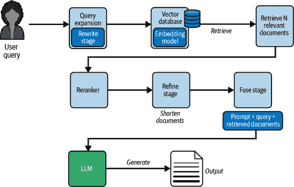
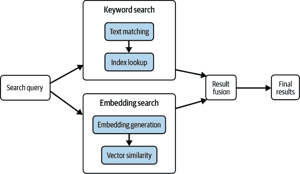
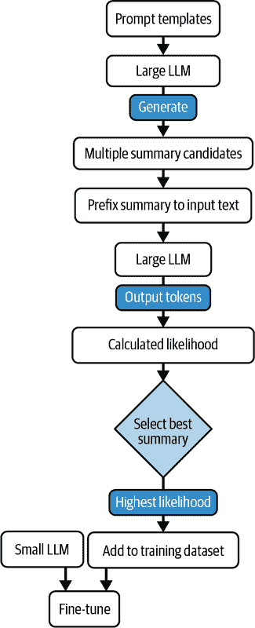
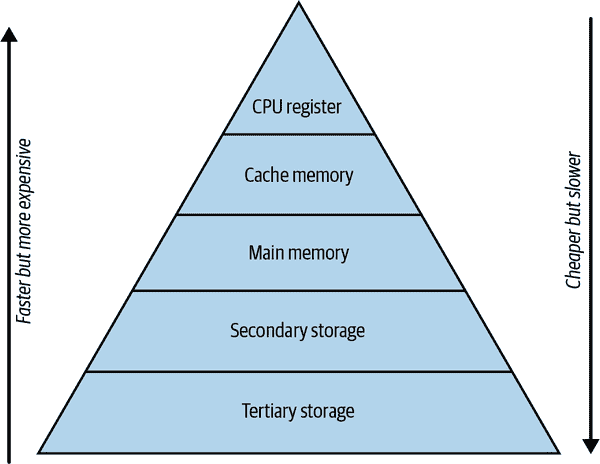
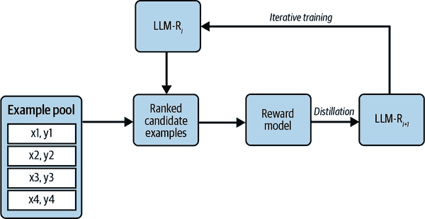
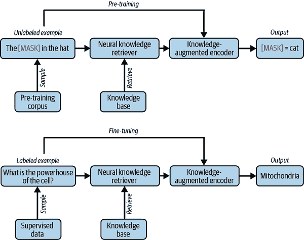

# 第十二章\. 检索增强生成

在第十章中，我们展示了如何通过将 LLM 与外部数据和软件接口来大幅扩展 LLM 的功能。在第十一章中，我们介绍了基于嵌入的检索概念，这是一种从数据存储中检索相关数据的基础技术，用于响应查询。掌握了这些知识，让我们全面探索通过外部数据增强 LLM 的应用范式，即检索增强生成（RAG）。

在本章中，我们将全面审视 RAG 管道，深入探讨构成典型 RAG 应用程序工作流程的每个步骤。我们将探索在实施 RAG 时涉及的各项决策，包括我们可以检索哪些数据，如何检索以及何时检索。我们将强调 RAG 如何帮助不仅在模型推理期间，而且在模型训练和微调期间。我们还将比较 RAG 与其他范式，并讨论 RAG 在与其他替代方案相比时表现优异的场景。

# RAG 的需求

如第十章中所述，RAG 是一个术语，用于描述使用外部数据源增强 LLM 功能的各种技术。以下是我们可能想要使用 RAG 的一些原因：

+   我们需要 LLM 访问我们的私有/专有数据，或者 LLM 预训练数据集之外的数据。使用 RAG 比在私有数据上预训练 LLM 要轻量得多。

+   为了降低幻觉风险，我们希望 LLM 能够通过检索机制引用提供的数据，而不是依赖其自身的内部知识。RAG 促进了这一点。RAG 还使数据引用更加准确，将 LLM 输出与其真实来源连接起来。

+   我们希望 LLM 能够回答关于 LLM 预训练后出现的近期事件和概念的问题。虽然存在像[MEMIT](https://oreil.ly/kxI3j)这样的记忆编辑技术，用于更新 LLM 参数以获得新知识，但它们目前还不可靠或可扩展。正如第七章中讨论的，持续训练 LLM 以保持其知识更新是昂贵且风险较高的。

+   我们希望 LLM 能够回答涉及长尾实体的查询，这些实体在预训练数据集中出现的频率很低。

# 典型的 RAG 场景

既然我们已经看到了*为什么*我们需要 RAG，让我们探索*在哪里*我们可以利用它。最流行的四种场景是：

检索外部知识

这是已经看到很多成功案例并实现商业化的主要用例。正如本章前面所讨论的，我们可以使用 RAG 来填补 LLM 的知识空白或降低幻觉风险。

检索上下文历史

LLM 有一个有限的上下文窗口，但通常我们需要访问比上下文窗口中适合的更多的上下文来回答查询。我们还想与 LLM 进行比上下文窗口中适合的更长时间的对话。在这些情况下，当需要时，我们可以检索对话历史或会话上下文的部分内容。

检索上下文训练示例

少样本学习是一种有效的方法，可以帮助大型语言模型（LLM）熟悉任务的输入输出映射。您可以通过根据当前输入动态选择少样本示例来提高少样本学习的有效性。在推理时，可以从训练示例数据存储中检索这些少样本示例。

检索与工具相关的信息

如第十章所述，LLM 可以作为其工作流程的一部分调用软件工具。可用的工具列表及其描述存储在工具存储中。然后，LLM 可以使用检索来进行工具选择，选择最适合任务的工具。工具相关信息还可以包括 API 文档等。

# 决定何时进行检索

在一个代理工作流程的每个步骤中，LLM 可以使用以下步骤之一来推进其任务：

+   使用其内部能力

+   从几个数据存储中选择

+   从几个软件工具中选择

可能存在 LLM 可以使用其参数化内存完全解决的问题，但一个或多个数据存储也可能包含解决这些问题的必要数据。在这些情况下，鉴于我们之前提出的所有好处，我们是否应该默认使用 RAG？

我们在本章前面看到，LLM 在处理长尾信息方面存在困难，而 RAG 可以成为回答关于长尾实体的有效手段。然而，[Mallen 等人](https://oreil.ly/MF7Y1)表明，对于关于更常见实体的查询，LLM 有时可能比 RAG 更好地回答查询。这是因为检索模型不可避免的局限性，它可能会检索到无关或错误的信息，这可能会误导 LLM。

对于给定的查询，您可以动态确定是使用检索还是依赖 LLM 的参数化内存。确定采取正确方法的规则包括：

+   查询是否关于更频繁出现的实体。例如，LLM 更有可能记住泰勒·斯威夫特的生日，而不是一个地方乐队的替补鼓手的生日，其维基百科页面是一个简短条目。

+   查询是否有时效性限制，即所需的数据可能在 LLM 的知识截止日期之前不存在。

+   模型是否已经根据第七章中描述的持续预训练或记忆调整，以及给定的查询与训练所涉及的概念相关。

如果您使用 LLM 进行通用问答，Mallen 等人表明，您可以使用诸如维基百科之类的来源作为实体的伪流行度指标。如果您的输入中存在的实体在维基百科中的计数超过一个阈值，那么 LLM 可以选择自行回答问题而不使用 RAG。请注意，阈值可能在不同 LLM 之间有所不同。此策略仅在您对 LLM 预先训练的数据集有良好理解的情况下才有效。

动态决定何时检索数据也可以帮助优化模型的延迟和响应性，因为 RAG 管道将引入额外的开销。

###### 小贴士

动态检索主要在您使用非常大的 LLM 时非常有用。对于较小的模型（7B 或以下），几乎总是有益于优先使用 RAG 而不是依赖 LLM 的内部内存。

# RAG 管道

典型的 RAG 应用遵循如第十一章中讨论的*检索-读取*框架。在响应查询时，检索模型识别出与回答查询相关的文档。然后，这些文档被传递给 LLM 作为上下文，LLM 可以依赖这些上下文以及其内部能力来生成响应。在实践中，我们通常需要添加很多功能才能在生产环境中使 RAG 工作。这涉及到在检索-读取框架中添加几个更多可选阶段。在实践中，您的管道阶段可能包括一个*重写-检索-读取-精炼-插入-生成*工作流程，其中一些步骤可能包含多个阶段。在第章的后面，我们将更详细地介绍每个步骤。

图 12-1 展示了 RAG 管道的各个阶段和涉及的组件。



###### 图 12-1\. RAG 管道

###### 小贴士

正如本书的其余部分一样，我们将用户或 LLM 请求检索数据称为查询，并将从数据存储中检索出的文本单元称为文档。

让我们用一个例子来说明。考虑一个回答有关加拿大政治和议会活动的 RAG 应用。该应用可以访问包含议会会议记录的知识库。我们将假设数据使用第十一章中描述的表示技术表示。

当用户提出查询时，我们可能希望在发送给检索器之前重新措辞。在信息检索（IR）领域，这通常被称为查询扩展。查询扩展特别有用，因为查询空间和文档空间之间存在词汇不匹配。用户在查询中可能使用与文档中不同的术语。重新措辞查询可以帮助弥合词汇差距。一般来说，我们希望以这种方式重新措辞查询，以提高检索器检索最相关文档的机会。这一阶段被称为*重写*阶段。

接下来，在*检索*阶段，使用检索模型来检索与查询相关的文档。在第十一章中，我们讨论了基于嵌入的检索，这是 LLM 时代流行的检索范式。检索阶段可以是一个广泛的多阶段管道。

检索可以在一个非常大的文档空间中进行。在这种情况下，使用更高级的检索模型在计算上是不可行的。因此，检索通常分为两步进行，第一步使用更快的方法（这些天通常是基于嵌入的方法）检索一份可能相关的文档列表（优化召回率），第二步根据相关性重新排序检索列表（优化精确率），以便将排名前 k 的文档作为上下文传递给 LLM。这一阶段被称为*重新排序*阶段。

在确定与查询相关的 top-k 文档后，需要将它们传递给 LLM。然而，文档可能不适合上下文窗口，因此需要缩短。它们也可能被重新措辞，使其更有可能让 LLM 使用上下文生成答案。这是在*细化*阶段完成的。

接下来，我们将细化步骤的输出提供给 LLM。默认方法是将所有文档连接到提示中。然而，你也可以一次传递一个，然后合并结果。提示中文档的顺序也可能产生影响。几种这样的技术决定了上下文被输入到 LLM 的方式。这被称为*插入*阶段。

最后，在*生成*阶段，LLM 读取包含查询和上下文的提示并生成响应。生成可以一次性完成，或者检索过程可以与生成交织进行，即模型可以生成一些标记，然后再次调用检索模型以检索更多内容，生成更多标记，然后再次调用检索模型，依此类推。

每个阶段的输出都可以通过一个*验证*阶段来评估输出质量，甚至采取纠正措施。验证阶段可以采用启发式方法或基于 AI 的方法。

在这个例子中，查询是由人类用户生成的。但如果我们将 RAG 放在代理工作流程的背景下考虑，查询可能是由一个 LLM 生成的。在代理工作流程中，代理可以在任何给定时刻确定它需要检索数据以继续其任务，这就会启动上述管道。

除了检索和生成步骤之外，管道中的其余步骤是可选的，是否包含其他步骤取决于你的性能和延迟权衡。

###### 注意

我们的例子涉及在推理时间使用 RAG。RAG 也可以在预训练或微调模型时应用，我们将在本章后面描述。

让我们详细检查管道中的每个步骤。

## 重写

在发出查询后，可能需要对其进行重写以使其更易于检索。重写过程取决于所使用的检索模型。如前所述，查询空间和文档空间之间通常存在不匹配，因为查询所使用的词汇、措辞和语义可能与文档中传达的相关概念大相径庭。

例如，考虑查询：“哪些政治家抱怨预算不平衡？”

数据存储中包含文本“参议员帕克斯顿：‘我实在无法忍受我们巨大的赤字。’”

如果你使用的是更依赖于关键词的传统检索方法，这段文本在检索过程中可能不会被选为相关。使用基于嵌入的方法可以缩小差距，因为相似句子的嵌入在嵌入空间中彼此更接近，但这并不完全解决问题。

###### 小贴士

如果查询来自用户，用户可能会在查询中添加指令，例如，“哪些政治家抱怨预算不平衡？以表格形式提供结果。”在这种情况下，你必须在将查询输入检索管道之前将查询与指令分开。这可以通过 LLM 使用提示技术如 CoT、ReAct 等来完成，这些技术我们在第五章和第十章中分别讨论过。

对于使用传统检索技术的系统，查询重写通常是通过查询扩展技术来执行的，其中查询被添加了相似的关键词。基本的查询扩展技术包括在查询中添加关键词的同义词和其他主题信息。

查询扩展的一个经过良好测试的方法是伪相关性反馈（PRF）。在 PRF 中，原始查询用于检索文档，并从这些文档中提取显著术语并添加到原始查询中。

让我们看看 PRF 如何帮助我们查询“哪些政治家抱怨预算不平衡？”我们使用像 BM25（本章后面将解释）这样的检索技术来返回 k 个候选文档集。然后我们使用像词频或更有效的方法[Tf-IDf](https://oreil.ly/5be9z)来提取这些返回文档中出现的显著术语。对于这个例子，显著的短语是“财政政策”、“赤字”、“财务管理不善”和“预算改革”。将这些短语添加到原始查询中，将导致以下文本：

> “参议员帕克顿：‘我简直无法忍受我们巨大的赤字！’”被成功检索。

近年来，由 LLM 驱动的查询扩展方法越来越受到重视。两个这样的例子是[Query2doc](https://oreil.ly/BDJAN)和[Hypothetical Document Embeddings (HyDE)](https://oreil.ly/tZyUV)。

让我们探索基于 LLM 的查询扩展是如何工作的。我们将给定的查询传递给一个 LLM，并要求它生成一个包含查询答案的假设文档。

> *提示:* 对于提供的查询，用 2 句话或更少的文字生成一个假设文档来回答查询。假设文档是加拿大议会程序的记录，包含下议院和参议院的代表的直接陈述。
> 
> *查询:* 哪些政治家抱怨预算不平衡？

提示包含：

+   生成假设文档的说明

+   生成的文档期望的长度限制

+   描述包含相关文档的文档语料库

+   原始查询

LLM 生成的假设文档如下：

> *LLM:* “尊敬的马克·韦林顿参议员表示，*政府未能平衡预算是不可接受的，这危及我们的经济未来。*同样，艾米丽·弗拉泽议员评论说，*我们不能继续这种不负责任的支出路径而不解决赤字——是时候采取真正的财政责任了。*”

使用这个假设文档作为查询将返回“参议员帕克顿：‘我简直无法忍受我们巨大的赤字！’”这个句子，其相似度得分更高。

虽然这个假设文档在事实上并不准确，甚至可以说是可笑的（加拿大没有名叫马克·韦林顿和艾米丽·弗拉泽的参议员或议员），但它确实包含与实际政治家所说非常相似的措辞和语义。如果我们使用这个文档作为查询（可选地与原始查询结合），那么它与实际政治家谈论该主题的实例在语义上相似的可能性比仅与查询匹配时更高。

假设文档的长度可以与检索单元的典型长度相似。你可以使用一个较小的 LLM 来生成假设文档，因为在这样的设置中我们并不关心事实保证。然而，较小的模型在生成高质量的假设文档方面也不够熟练，所以你将不得不管理这种权衡。LangChain 和 LlamaIndex 都提供了基于假设文档的查询重写的实现。

如果模型已经在包含相关数据的语料库上预训练或微调，那么在提示中添加语料库的描述，如示例所示，将更有可能使生成的文档遵循该数据语料库的结构、格式和语言学。

###### 警告

查询重写技术的一个潜在问题是主题漂移的风险。在假设文档的情况下，文档可能在最初的几个标记之后漂移到不相关的主题。增加查询中标记的 logits 偏置可以部分解决这个问题。PRF 技术也容易受到主题漂移的影响。

你还可以将 PRF 风格的技术与假设文档结合使用。不是生成假设文档来替换或增强查询，而是可以使用它们来提取可以添加到原始查询中的关键词。[Li 等人](https://oreil.ly/cOnMs)提出了一种名为*query2document2keyword*的技术。在这种技术中，LLM 使用查询生成一个假设文档，类似于 HyDE。然后提示 LLM 从这个文档中提取显著关键词。

我们可以通过过滤步骤进一步改进提取的关键词的质量。作者建议使用*自洽性*方法，我们已在第五章中讨论过。概括来说，在自洽性方法中，我们多次重复关键词生成，然后根据它们出现的生成次数选择顶级关键词。

另一种将传统检索与 LLM 驱动的查询重写结合的方法是首先从初始检索步骤返回 top-k 文档，然后使用 LLM 从返回的文档中生成显著关键词并将其添加到查询中。

到目前为止，我们已经讨论了通过修改查询并将其更接近文档空间来弥合查询文档不匹配问题的技术。解决不匹配问题的另一种方法是按照将文档表示得接近查询空间的方式。这种方法的例子包括[doc2query](https://oreil.ly/CGUtP)和[上下文检索](https://oreil.ly/ZJuIu)。虽然如果数据存储非常大，文档重写技术最初可能会有很大的成本，但它们可以在推理时间减少延迟，因为不需要或只需要很少的查询重写。另一方面，查询重写技术易于实现并集成到 RAG 工作流程中。

另一种查询重写形式称为查询分解。对于代理工作流程中的复杂查询，我们可以让 LLM 将任务分解成多个可以顺序或并行执行的查询，具体取决于查询是如何分解的。我们在第十章中讨论了查询分解技术。

###### 注意

如果你的外部数据以结构化形式存在，如数据库，那么查询需要被重写为 SQL 查询或等效查询，如第十章所述。

既然我们已经讨论了管道中的查询重写步骤，让我们继续讨论检索步骤。

## 检索

检索步骤是 RAG 管道中最关键的阶段。原因显而易见：所有 RAG 应用都受检索质量的制约。即使你使用的是世界上最好的语言模型，如果检索步骤没有检索到回答查询所需的正确文档，你也无法得到正确的结果。因此，这个步骤应该专注于提高召回率。

我们在第十一章中详细讨论过的基于嵌入的检索非常受欢迎。然而，传统的信息检索技术不应被忽视。使用哪种技术取决于查询预期的性质（是否可以通过仅关键词或正则表达式匹配来回答其中很大一部分？），查询与文档词汇不匹配的预期程度，延迟和计算限制，以及性能要求。

###### 注意

信息检索（IR）研究领域已经研究了这些问题很长时间。现在，随着检索在 NLP 中的相关性日益增强，我注意到很多人在重新发明轮子，而不是重用 IR 的见解。关于检索研究的见解，可以查看 SIGIR、ECIR、TREC 等领先 IR 研究会议的论文。

当你希望检索包含特定单词或短语的全部文档时，基于嵌入的检索方法并不总是合适的。因此，通常将基于关键词的方法与嵌入方法结合，称为混合搜索。两种方法的结果被合并并输入到检索管道的下一步。大多数向量数据库都支持某种形式的混合搜索。

图 12-2 展示了使用混合搜索的检索阶段。



###### 图 12-2. 混合搜索

我还强烈推荐使用元数据过滤器来提高检索效果。在数据表示和存储阶段收集的元数据越多，检索结果就越好。例如，如果你已经提前对你的数据存储进行了主题建模，你可以通过硬编码的规则或由 LLM 确定的方式，将搜索结果限制在特定主题的子集。

接下来，让我们讨论检索领域最近的一些有希望的进展。

### 生成式检索

如果 LLM 能够识别出响应查询所需检索的正确文档（或文档集），从而消除检索技术的需求，这被称为生成式检索。

生成式检索通过为文档分配称为 docID 的标识符，并教授 LLM 文档与 docID 之间的关联来实现。一个文档可以与一个或多个 docID 相关联。典型的 docID 可以是：

单个标记

每个文档都可以由词汇表中的一个新标记表示。这意味着，在推理过程中，模型只需要为它想要检索的每个文档输出一个标记。[Pradeep 等人](https://oreil.ly/7JYOM)使用了一个 T5 模型，其中编码器词汇表是标准的 T5 词汇表，但解码器词汇表包含 docID。这种方法仅适用于小型文档语料库。

前缀/子集标记

[Tay 等人](https://oreil.ly/1p1C8)使用文档的前 64 个标记作为 docID，而[Wang 等人](https://oreil.ly/lg3g3)使用从文档中随机选择的 64 个连续标记。

聚类标记

您还可以根据其语义（例如使用嵌入）对文档语料库进行层次聚类，docID 可以是层次结构中每个级别的聚类 ID 的连接。

显著关键词标记

文档的 docID 也可以包含代表文档中主题和主题的关键词。例如，一篇关于 Transformer 架构的文档可以用 docID“transformer_self-attention_architecture”来表示。

教授 LLM 文档与 docID 之间关联的一种方法是通过微调模型。这被称为基于训练的索引。然而，微调需要大量资源，并且不适用于频繁向语料库添加新文档的场景。

[Askari 等人](https://oreil.ly/K5TAB)表明，我们可以使用少样本学习来构建一个不需要训练模型的生成式检索系统。首先，对于语料库中的每个文档，使用语言模型生成伪查询。这些伪查询是其中包含文档中答案的查询。然后，将这些伪查询在少样本设置中输入到语言模型，并要求生成 docID。图 12-3 显示了无需训练的生成式检索的实际应用。


###### 图 12-3\. 生成式检索

在推理过程中，模型被提供与图 12-3 中设置类似的查询，并要求生成与查询相关的正确 docID（或 docID 集）。使用约束束搜索以确保模型生成的 docID 对应于语料库中的有效 docID。

###### 小贴士

您还可以使用基于元数据的生成检索来检索文档。例如，模型可以请求检索苹果公司的 2024 年年度报告。模型可以通过微调模型或使用本节所示的小样本学习来生成正确的标识符。

最终，生成检索仅适用于您的文档语料库相对较小、语料库内冗余有限或文档属于一组定义良好的类别（例如，美国所有上市公司的年度报告）的情况。

接下来，让我们讨论紧密耦合的检索器，这是检索空间中的另一个新话题。

### 紧密耦合的检索器

如第十一章中所示，在基于嵌入的检索中，嵌入模型通常独立于检索结果所提供的语言模型。我们将它们称为**松散耦合**的检索器。

相比之下，一个**紧密耦合**的检索器是经过训练的，以便它从 LLM 反馈中学习；模型学会检索文本，以最佳方式定位 LLM 为给定查询生成正确的输出。紧密耦合的检索器可以作为单一架构的一部分与生成 LLM 一起训练，或者它们可以单独使用训练好的 LLM 的反馈进行训练。

后者的一个例子是[张等人](https://oreil.ly/Q__8M)的 LLM-Embedder，这是一个统一的嵌入模型，可以在单个模型中支持各种检索需求，从知识检索到检索最优的少量示例。该模型从两种类型的信号中进行训练：用于训练嵌入模型的对比学习设置（在第十一章第十一章中介绍）和 LLM 反馈。如果检索候选者提高了 LLM 回答查询的性能，它将从 LLM 反馈中获得更大的奖励。

紧密耦合的检索器是您工具箱中用于改进检索的另一个工具。它们绝不是 RAG 管道中的必要步骤。像往常一样，实验将显示它们为您的应用提供了多少提升（如果有的话）。

最后，让我们讨论 GraphRAG，这是一种新兴的检索范式，它利用知识图来实现更好的检索。

### GraphRAG

我们之前讨论的检索方法的一个关键限制是它们无法促进回答需要在不同文档语料库的不同部分之间建立联系的问题，以及涉及总结数据集高级主题的问题。例如，我们之前讨论的所有检索技术在对“在这个数据集中讨论的关键主题是什么？”这样的查询上表现不佳。

解决这些限制的一种方法是通过采用知识图谱。微软发布了[GraphRAG](https://oreil.ly/V4n_S)，一个基于图的知识图谱系统。GraphRAG 通过从底层数据语料库中提取实体和关系来创建知识图谱。然后，该图被用于执行分层语义聚类，并为每个簇生成摘要。这些摘要使得回答主题性问题成为可能，例如，“在这个数据集中讨论的关键主题是什么？”

GraphRAG 需要大量的初始计算来准备知识图谱。这对于更大的数据集来说可能是限制性的。虽然提取实体很容易，但提取相关关系则更困难。

现在我们已经探讨了 RAG 管道的检索阶段，让我们继续到重排序阶段。

## 重排序

检索过程可以被分解为两阶段或多阶段过程，其中第一阶段检索与查询相关的文档列表，随后是一或多个*重排序*阶段，这些阶段将文档按相关性排序。重排序器通常比检索器更复杂，因此仅在检索结果上运行（否则我们就可以直接使用重排序器作为检索器）。

重排序器通常是在特定用例上微调的语言模型。你可以使用类似 BERT 的模型来构建一个相关性分类器，其中给定一个查询和一个文档，模型输出文档与回答查询的相关概率。这些模型被称为*跨编码器*，因为这些模型中查询和文档是共同编码的，与之前讨论的基于嵌入的检索模型不同，后者称为双编码器，其中查询和文档被编码为单独的向量。

作为跨编码器作用的 BERT 模型的输入格式为：

```py
[CLS] query_text [SEP] document_text [SEP]
```

句子转换库提供了访问跨编码器的能力，这些编码器可以用作 RAG 管道中的重排序器：

```py
from sentence_transformers import CrossEncoder
model = CrossEncoder("cross-encoder/ms-marco-MiniLM-L-12-v2", num_labels=1)

query = 'When was the Apple iPhone 15 launched?'
documents = ['Apple iPhone 15 launched with great fanfare in New York',
'He was foolish enough to believe that gifting an iPhone would `save` `the` `relationship``',` ````` `'On September 22, 2023, I lined up at the Central Park store for the launch of` ```py` `the` `iPhone` `15``']` ``` `ranks` `=` `model``.``rank``(``query``,` `documents``)` `for` `rank` `in` `ranks``:`    `print``(``rank``[``'score'``],` `documents``[``rank``[``'corpus_id'``]])` ```py ```` ```py``
```

```py` ``` ``由于我们已将 `num_labels = 1` 设置，该模型将将其视为回归任务，使用 sigmoid 激活函数输出介于 0 和 1 之间的分数。这些天，更多像 [ColBERT (基于 BERT 的上下文化后期交互)](https://oreil.ly/N3fOv) 这样的先进模型被用于重新排序。与刚刚讨论的交叉编码器设置相反，ColBERT 风格的模型允许预先计算文档表示，从而实现更快的推理。在 ColBERT 中，查询和文档分别使用 BERT 进行编码，为查询和文档中的每个标记生成标记级嵌入向量。对于查询中的每个标记，相应的嵌入与文档中每个标记嵌入的嵌入进行比较，生成相似度分数。每个查询标记的最大相似度分数相加，得到最终的关联分数。这种架构称为 *后期交互*，因为查询和文档不是一起编码，而是在处理过程中的后期才交互。后期交互与传统交叉编码器相比节省了时间，因为文档嵌入可以预先创建和存储。 展示了 ColBERT 模型在行动中的样子，说明了查询和文档之间的后期交互。  ###### 图 12-4\. ColBERT    接下来，让我们探索一些高级的重新排序技术。    ### 查询似然模型 (QLM)    QLM 估计给定候选文档作为输入生成查询的概率。您可以将一个 LLM 视为一个 QLM，利用其零样本能力根据查询标记概率对候选文档进行排序。或者，您可以对 LLM 进行微调，以改进其在 QLM 中的适用性。    一个典型的 QLM 提示可能看起来像：“生成一个与给定文档 <文档内容> 最相关的问题”。    在检索阶段从查询中获取与查询相关的 top-k 文档后，将每个文档用此提示输入到 LLM 中。然后使用模型 logits 计算查询标记的概率。然后根据似然度对文档进行排序，提供相关性排名。    ###### 警告    [庄等](https://oreil.ly/QnWWh) 表明，在指令微调训练集中不包含查询生成任务的指令微调模型会失去作为有效零样本 QLM 的能力。这是指令微调模型在未训练任务上与基模型相比性能下降的又一案例。    注意，为了计算查询标记的概率，我们需要访问模型 logits。截至本书编写时，大多数专有模型提供商，包括 OpenAI，尚未提供对模型 logits 的完全访问。因此，将 LLM 作为 QLM 的方法只能使用开源模型。    为了减少延迟，您可能希望 QLM 尽可能小。然而，较小的模型作为 QLM 的效果较差。有效地微调较小的 LLM 以进行查询生成可能是最佳选择。    ### 排序的 LLM 精炼    在本章前面，我们看到了像 BERT 这样的仅编码器模型可以作为重新排序器。最近，解码器 LLM 也被训练以直接以三种方式对候选文档进行排序：    点对点排序      将每个候选文档单独输入到 LLM 中。LLM 提供对其相关性的布尔判断。或者，它也可以提供一个数值分数，尽管这不太可靠。      对偶排序      对于每个候选文档对，LLM 指示哪个文档更相关。为了获得完整的排名，需要进行 N² 次这样的比较。      列表排序      将所有候选文档标记为标识符并输入到 LLM 中，并要求 LLM 根据相应文档的相关性递减顺序生成标识符的排序列表。      通常，点对点排序最容易使用，但可能不是 [最有效的](https://oreil.ly/DvmtC)。列表排序可能需要一个大的上下文窗口，而对偶排序需要大量的比较。对偶排序是这些技术中最有效的，因为它涉及直接比较。图 12-5 展示了点对点、对偶和列表排序的工作方式。    排序 LLM 的例子包括 [RankGPT](https://oreil.ly/6XoOG)、[RankVicuna](https://oreil.ly/00Dan) 和 [RankZephyr](https://oreil.ly/AAbUE)。    这些模型是通过从更大的 LLM 中蒸馏训练的，这是我们首次在 第九章 中学到的技术。例如，训练 RankVicuna 的过程如下：    *   训练集中的查询通过第一级检索器（如 BM25）生成候选文档列表。           *   将此列表传递给更大的 LLM，生成候选文档的排序列表。           *   使用查询和排序列表微调较小的 LLM。              [RankVicuna](https://oreil.ly/cFLSc) 的创建者表明，随着第一级检索的有效性提高，RankVicuna 的性能提升空间会减小，因为回报递减。他们还报告说，通过打乱候选文档的输入顺序来扩充数据集可以提高模型性能。    ###### 图 12-5\. 解码器 LLM 重新排序器    ###### 小贴士    您可以将检索和重新排序阶段的结果结合起来，以获得候选文档的最终相关性排名。例如，这需要强制关键字加权。您还可以通过元数据（如发布日期）对相关性排名进行加权（较新的文档加权更高）。    现在，我们已经讨论了重新排序阶段，让我们继续讨论 RAG 管道的精炼步骤。`` ```py ````  ```py `` `## Refine    Once the candidate texts relevant to the given query are retrieved and selected, they can be fed to the LLM. However, the LLM context window is limited, so we might want to reduce the length of the retrieved texts. We might also want to rephrase it so that it is more amenable to being processed by the LLM. Another possible operation could be to filter out some of the retrieved texts based on certain rules. All of these are conducted during the *refine* stage. In this section, we will discuss two such techniques, summarization and chain-of-note. Let’s start with discussing how we can summarize the retrieved texts.    ###### Tip    The refine stage can be a standalone stage, or it can be paired with the final generate stage, where the final response is provided immediately after refining the retrieved documents, as part of the same prompt or prompt chain.    ### Summarization    Summarization is useful if the retrieval chunks are relatively large. It can be either extractive or abstractive. Extractive summaries extract key sentences from the original text without modifying it. Abstractive summaries are generated from scratch, drawing on content from the original text. The summarizer can also act as a quality filter; it can output an empty summary if the document is irrelevant to the query. Summaries should be relevant, concise, and faithful to the original text.    ###### Note    These summaries are not meant for human consumption but instead meant to be consumed by the LLM. Therefore, they do not always share the same objectives as traditional summarizers. The primary objective here is to generate a summary that helps the LLM output the correct answer.    Should you choose extractive or abstractive summarization? Extractive summaries are almost always faithful as they preserve the meaning of the original text. Abstractive summaries come with the risk of hallucinations. On the other hand, abstractive summaries can potentially be more relevant because of their ability to combine information from different locations within a document and across documents.    While you can leverage the LLM’s zero-shot capabilities for both extractive and abstractive summarization, it is more effective (albeit expensive) to fine-tune them so that the summaries generated are specifically optimized to enable the LLM to generate the correct answer. We will call these tightly-coupled summarizers.    [Xu et al.](https://oreil.ly/XCpyr) introduce techniques for training both extractive and abstractive summarizers. Let’s go through them in detail.    For extractive summarization, we would like to extract a subset of sentences from the retrieved document as its summary. This is done by generating embeddings for the input query and for each sentence in the retrieved document. The top-k sentences that are most similar to the input query in the embedding space are selected as the summary. The embedding distance is a measure of how effective the document sentence is in enabling the LLM to generate the correct output.    The extractive summarizer is trained with contrastive learning, which we discussed in Chapter 11. Each training example in contrastive learning is a triplet: the anchor sentence, positive example similar to the anchor sentence, and negative examples dissimilar to the anchor sentence. To generate the training examples, for each sentence in the retrieved document, we prefix it to the input query and calculate the likelihood of gold truth output tokens being generated. The sentence with the highest likelihood is taken as the positive example. For negative examples, we choose up to five sentences whose likelihood is below a threshold. This dataset is then used to train the model.    For abstractive summarization, we can distill a larger LLM, i.e., use the outputs from it to fine-tune a smaller LLM.    To generate the training dataset, we can construct some prompt templates and use them with a larger LLM to generate zero-shot summaries of our retrieved documents. Note that we are generating a single summary of all the retrieved documents. Similar to the extractive summarization technique, for each generated summary, we prefix it to the input text and calculate the likelihood of the correct output tokens. We choose the summary with the highest likelihood to be part of our training set.    During inference, if prefixing any given summary has a lower likelihood of generating the correct output than not prefixing any summary at all, then we deem the text represented by the summary to be irrelevant, and an empty summary is generated. This allows us to filter out irrelevant documents.    Figure 12-6 depicts the workflow of a tightly-coupled abstractive summarizer during training.    ###### Figure 12-6\. Abstractive summarization    ###### Tip    If you are planning to change your target LLM, you might want to retrain the summary models. While the summarizers can transfer across models, there is still a slight performance degradation.    Tightly-coupled summarizers, while expensive to train initially, can be an effective means of removing irrelevant information from the retrieved text while rephrasing it in a form that reduces ambiguity for the LLM.    ### Chain-of-note    Another way to rephrase the retrieved text is to generate *notes*.    It would be detrimental if the retrieved text contains irrelevant content that might mislead the model. In essence, the LLM has to contend with three types of scenarios:    *   The retrieved documents contain the answer to the user query, and the LLM can use it to generate the correct output.           *   The retrieved documents do not contain the answer to the user query, but they provide valuable context that the LLM can then combine with its internal knowledge to come up with the answer.           *   The retrieved documents are irrelevant to the user query and should be ignored.              LLMs are not very good at distinguishing between relevant and irrelevant context. One way to address this is by generating notes for each retrieved document that contains a summary of the retrieved document along with indicating whether it contains the answer to the user query or only contains relevant context but not the answer outright, or is irrelevant. This technique is called chain-of-note (CoN), introduced by [Yu et al.](https://oreil.ly/hPkKm)    Here is an example of how these notes look:    > *Prompt:* Who succeeded Brian Mulroney as the prime minister of Canada in 1993? >  > Doc 1: Kim Campbell took over the reins of leadership in Canada in 1993, marking her entry into history as the country’s first female Prime Minister in 1993\. Her tenure, however, was short-lived, as she led the Progressive Conservative Party into a challenging federal election later that year. >  > Doc 2: Following Brian Mulroney’s tenure, Canada witnessed the historic appointment of its first female Prime Minister, marking a groundbreaking shift in the nation’s political landscape.    While the first text says Kim Campbell became the prime minister in 1993, it is not apparent whether she immediately succeeded Brian Mulroney or if there was an intervening prime minister. However, the second text makes it clear that it is indeed Kim Campbell, as the text mentions that Brian Mulroney was succeeded by a female prime minister.    The corresponding note generated by the model is the following:    > *LLM:* The first statement mentions that Kim Campbell took over the leadership in Canada in 1993, and the second statement refers to the period following Brian Mulroney’s tenure, leading to the appointment of Canada’s first female prime minister. This sequence implies that Kim Campbell’s assumption of the prime minister role directly followed Brian Mulroney’s tenure, making her his successor.    Using the note as context, the LLM can then generate the correct answer.    The true value of chain-of-note becomes apparent when the context contains irrelevant or insufficient information. The generated note can help the LLM output “I don’t know.”    Consider this query:    > *Prompt:* Did the Green Party of Canada support the proposed 2023 Public Transit bill?    and the retrieved documents are:    > Doc 1: The Green Party of Canada has historically emphasized the importance of sustainable transportation as a key component of their environmental platform, advocating for policies that promote green infrastructure. >  > Doc 2: The proposed 2023 Public Transit bill garnered widespread attention and popularity, reflecting a growing public consensus on the importance of sustainable transportation solutions.    The retrieved documents do not contain the answer to the query. The corresponding note generated is:    > *LLM:* While the first passage indicates the party’s historical emphasis on sustainable transportation, and the second passage mentions the bill’s popularity, neither confirms the party’s support or opposition to the 2023 bill.    Using this note, the LLM can generate “unknown” when the retrieved documents do not contain the answer to the query.    An example of a CoN prompt can be:    > *Prompt:* You are provided a query along with {K} passages that potentially contain information that can be used to answer the query. Write notes summarizing the key points from these passages. Discuss the relevance of each of these passages to the given question and state whether the answer to the query can be deduced from the content in these passages.    Again, we can train tightly-coupled CoN models to make it more effective. This can be done by fine-tuning an LLM to elicit CoN behavior.    To generate the fine-tuning dataset, you can prompt an LLM to generate candidate notes for example queries. Human evaluation can then filter out incorrect or poor-quality notes. The final dataset consists of the CoN prompt, the input query, and the retrieved documents as the input, and the corresponding note and the query answer as the output. An LLM can then be fine-tuned on this dataset.    The authors (Yu et al.) introduce a weighted loss scheme during training. The note can be much longer than the answer, and thus equally weighting the loss across all tokens will lead to the note getting significantly more importance during training. This harms model convergence. The weighted loss scheme involves calculating loss across answer tokens 50% of the time.    Using a CoN step is very useful, especially if the retrieval results are known to contain a lot of noise or there is a higher possibility of no relevant documents available to service the query. CoN behavior is harder for smaller models, thus a sufficiently larger model should be used.    Now that we have discussed the refine step of the RAG pipeline, let’s move to the insert step.    ## Insert    Once we have determined the content to be fed to the LLM that is going to generate the final response to a query, whether the original retrieved documents or their summaries or notes, we need to decide how we are going to arrange it inside the prompt.    The standard approach is to stuff all the content, or at least as much as can fit, into the context window. An alternative is to feed each retrieved document/summary/note prefixed to the input separately to the LLM, and then combine the outputs.    [Liu et al.](https://oreil.ly/LFR8r) show that language models are more adept at recalling information present at the beginning and the end of the context window as compared to the middle. We can exploit this knowledge to reorder the retrieved documents in the prompt.    Let’s say we retrieved 10 documents for the given query. The documents are ordered according to their relevance: Doc1, Doc2,…Doc10\. These documents can now be arranged in the prompt in the following order:    > Doc1, Doc3, Doc5, Doc7, Doc9, Doc10, Doc8, Doc6, Doc4, Doc2    Thus the least relevant documents exist in the middle of the context window, where they are more likely to be ignored by the model due to current long context recall limitations.    Alternative approaches include arranging the documents in order of relevance, for example:    > Doc1, Doc2, Doc3, Doc4, Doc5, Doc6, Doc7, Doc8, Doc9, Doc10    Or in reverse order of relevance, like:    > Doc10, Doc9, Doc8, Doc7, Doc6, Doc5, Doc4, Doc3, Doc2, Doc1    These ordering schemes are useful only if the input context is very long (upwards of 5,000 tokens).    Finally, let’s discuss the generate step in the RAG pipeline.    ## Generate    The LLM generates the final response to the given query during this step. The standard approach is to generate the output all at once. However, you could also interleave the generation and the retrieval process, by generating some output and retrieving more context, and generating some more output, and retrieving more context, and so on.    This approach can be useful in maintaining coherence in long-form text generation. The generated text determines what needs to be retrieved next. This process is called active retrieval.    How do we decide when to stop generating and start a new retrieval step? We could:    *   Retrieve after every N tokens are generated.           *   Retrieve after each textual unit is generated. (A textual unit can be a sentence, paragraph, section, etc.)           *   Retrieve when currently available context is deemed insufficient for generation.              There are several ways to implement the latter. One of them is Forward-Looking Active REtrieval-augmented generation (FLARE). The authors of [FLARE](https://oreil.ly/eZRdy) introduce two methods for active retrieval: FLARE-Instruct and FLARE-Direct.    In FLARE-Instruct, the LLM is prompted to generate queries in a specific syntax whenever it needs additional information to continue coherent generation.    In FLARE-Direct, the LLM generates a candidate-next sentence. If any of the tokens in the generated sentence have probability lower than a threshold, then the retrieval process is activated. If not, then the candidate sentence is accepted as a valid continuation and the generation process continues. If retrieval is to take place, the generated sentence can be used as the query, by masking the low-probability tokens (since they might confuse the retriever if they are irrelevant/incorrect). You can also rephrase the sentence as a question about the low-probability token(s).    Let’s look at an example using FLARE-Instruct:    > *Prompt:* Write an article about Peruth Chemutai, the Ugandan Olympics medal winner.    > *FLARE-Instruct:* Peruth Chemutai [Search(birthdate of Peruth Chemutai)] is a Ugandan long-distance runner who specializes in the 3000 meters steeplechase. She gained international recognition after [Search(what medals did Peruth Chemutai win)] winning the gold medal in the women’s 3000 meters steeplechase at the 2020 Summer Olympics, becoming the first Ugandan woman to win an Olympic gold medal. >  > Early Life >  > Chemutai was born in the [Search(birthplace of Peruth Chemutai)], a region known for [Search(what is the birthplace of Peruth Chemutai known for?)].’    This is a contrived example, as the true benefits of FLARE can be better appreciated on lengthier outputs. As seen in the output, the model generates search queries that can be used to retrieve factually correct information from data sources.    For the same query, using FLARE-Direct, the model generates the candidate article:    > *FLARE-Direct:* Peruth Chemutai ( born July 10, 1999) is a Ugandan long-distance runner who specializes in the 3000 meters steeplechase. She gained international recognition after winning the gold medal in the women’s 3000 meters steeplechase at the 2020 Summer Olympics, becoming the first Ugandan woman to win an Olympic gold medal. >  > Early Life >  > Chemutai was born in the Bukwo District, Uganda, a region known for its challenging terrain and passionate long-distance runners.    The underlined tokens are low-probability tokens, which can be refilled by retrieving relevant text. We can either mask the low-probability tokens and use them as the retrieval query or generate standalone queries like, “When was Peruth Chemutai born?” based on the masked tokens.    A crucial aspect of generation includes adding appropriate citations to ground-truth sources. The LLM can be fine-tuned to make it provide citations along with the answer in response to user queries. One such model is [Cohere’s Command-R](https://oreil.ly/v0KUs) model.    As we can see, the RAG pipeline for knowledge retrieval can be rather lengthy. However, for a lot of RAG applications, latency is a key consideration. This increases the importance of smaller language models or faster, non-LLM-based approaches.    Let’s put it all together by revisiting the RAG pipeline diagram first introduced at the beginning of the chapter. Figure 12-7 depicts the workflow of a comprehensive RAG pipeline.    ###### Figure 12-7\. Comprehensive RAG pipeline    So far, we have focused on using RAG for knowledge retrieval. Let’s now discuss a few other use cases.` `` ```  ```py `` `# RAG for Memory Management    An underrated application of RAG is expanding the context window of an LLM. To recap, an LLM prompt typically contains the following types of (optional) content:    The pre-prompt or *system prompt*      These are the overarching instructions provided to the LLM included at the beginning of every query. Depending on your customization needs, the system prompt could occupy a significant part of the context window.      The input prompt      This includes the current input and the instruction, optional few-shot training examples, and additional context, possibly fetched using retrieval.      Conversational history      This includes the history of conversations/interaction between the user and the LLM. Including this in the context window enables the user to have a long, coherent conversation with the LLM.      Scratchpad      This includes intermediate output generated by the LLM (discussed in Chapter 8), which can be referred to by the LLM when generating future output. Scratchpad content is an artifact of certain prompting techniques like CoT.      In many cases, the LLM’s limited context window is simply insufficient to incorporate all this data. Moreover, we might like to make the conversational history available to the model through perpetuity, which means it keeps growing across time. Making all the conversational history available to the LLM is a key aspect in enabling personalization.    It’s RAG to the rescue! RAG can be employed in facilitating LLM memory management by swapping in and out relevant content in the prompt as suitable. This is reminiscent of how memory management occurs in operating systems. Let’s explore this abstraction further.    In an OS, memory is organized in a hierarchy, with fast (and expensive) memory being directly accessible to a processor, and higher levels of the hierarchy containing larger and slower (but relatively inexpensive) memory. When the processor needs to access some data, it tries to access it from the lowest level in the memory hierarchy. If the data is not present there, it searches the next level in the hierarchy. If present, it swaps the required data into the lower level and swaps out data that is not currently needed. This way, the OS can support a fast main memory that is directly accessible by the processor and a much larger virtual memory that can be swapped in whenever needed.    This is a very simplified explanation of OS memory management. For a more detailed explanation, check out Tony’s [“Operating System — Hierarchy of Memory”](https://oreil.ly/vcciM).    Figure 12-8 shows the memory hierarchy of a typical OS.    ###### Figure 12-8\. Typical OS memory hierarchy    Similarly in LLMs, the context window is analogous to the main memory as it is directly accessible to the LLM. However, we can expand the context window indefinitely by implementing a memory system analogous to the OS virtual memory. This helps in personalizing LLMs, providing them with the full access to a user’s conversational history and their implicit and explicit preferences.    Examples of libraries supporting memory management for LLMs include [Letta (formerly MemGPT)](https://oreil.ly/1p8Vu) and [Mem0](https://oreil.ly/dgJaZ).    ###### Note    An alternative or complement to swapping memory in and out is to recursively summarize the conversational history. However, summarization is a lossy process and may not be able to preserve the semantics of the text. Valuable nuances like the tone of the writer can be lost during summarization.    # RAG for Selecting In-Context Training Examples    As mentioned at the beginning of the chapter, another application of RAG is to dynamically select training examples for few-shot learning by retrieving the optimal examples from a data store containing a list of training examples. For a given input, the retrieved few-shot examples are supposed to maximize the LLM’s chance of generating the correct answer to a user query.    A simple method is to generate embeddings of the input and retrieve examples whose embeddings are most similar to the input embedding. While this technique is a promising start, we can do much better.    [Wang et al.](https://oreil.ly/r8735) introduce a method called LLM Retriever (LLM-R) that trains a model using LLM feedback to retrieve few-shot training examples whose inclusion will increase the probability of the LLM generating the correct answer. Figure 12-9 illustrates the LLM-R technique.    ###### Figure 12-9\. LLM-R workflow    For each input query in the training set, we retrieve the top-k few-shot examples by using a retrieval model like BM25\. We then rerank the examples by using LLM feedback. Each example is prefixed to the input and the probability of the ground-truth output tokens is calculated. The examples are then ranked by decreasing order of their log-probabilities. The ranked examples are then used to train a reward model, which is distilled to train the final retrieval model.    # RAG for Model Training    So far, all the RAG applications we have explored are applied during LLM inference. Can we use RAG during model pre-training and fine-tuning as well? Yes, we can! This is an underrated area of study, and I expect to see more LLMs leveraging this in the coming years. Let’s look at an example in detail.    Retrieval-Augmented Language Model (REALM) is one of the pioneering works in the RAG space. REALM integrates the retrieval and generation tasks into a single model. Figure 12-10 shows the REALM framework for pre-training and fine-tuning.    ###### Figure 12-10\. REALM architecture    The REALM architecture is composed of two components: a knowledge retriever and a knowledge-augmented encoder, which is a BERT-like encoder-only model. Both components are differentiable and thus trained together.    The knowledge retriever is used to generate embeddings for all documents in the external knowledge base. Retrieval is performed by finding documents with maximum embedding similarity to the input. During the masked-language modeling pre-training phase, the retriever loss function encourages it to fetch text that helps predict the masked tokens. The masked tokens are then predicted by attending to both the input text and the retrieved text. The retrieved text is supposed to contain relevant context that makes predicting the masked tokens much easier.    REALM also employs these strategies to optimize training:    *   Named entities or dates are masked so that the model can learn to predict them using retrieved context.           *   Not all masked tokens need external knowledge for their prediction. To accommodate this, an empty document is always added to the retrieved documents.           *   The retrieved documents ideally contain the context required to predict the masked token, and not the token itself. Therefore, trivial retrievals that contain the masked token in the retrieved text are not included.              # Limitations of RAG    While RAG is a powerful paradigm that expands the usefulness of LLMs and reduces hallucinations, it doesn’t resolve all the limitations of LLMs. Some pitfalls of using RAG include:    *   Relying on retrieval of text snippets can cause the LLM to depend on surface-level information to answer queries, rather than a deeper understanding of the problem space.           *   Retrieval becomes the limiting factor of the pipeline. If the retrieval process fails to extract suitable candidate text, the LLM’s powerful capabilities will all be for nothing.           *   Sometimes the retrieval process can extract documents that are contradictory to the knowledge contained in the LLM’s parametric memory. Without access to the ground truth, it is difficult for the LLM to resolve these contradictions.              # RAG Versus Long Context    As discussed in Chapter 5, one of the limitations of LLMs is the limited effective context window available to them. However, this is one of the areas where rapid advances have been made recently. Context windows of at most a few thousand tokens were standard until early 2023, after which companies like [Anthropic](https://oreil.ly/ucbD-) announced support for context windows spanning over 100,000 tokens. In early 2024, Google announced [Gemini 1.5 Pro](https://oreil.ly/rp7pi), with support for one million tokens of context.    To assess the impact on LLM performance as the context size increases, several needle-in-a-haystack tests have been devised. One such implementation by [Greg Kamradt](https://oreil.ly/M8Jc9) facilitates adding a random fact or statement (the needle) to the middle of the context (the haystack) and then asking the LLM questions for which the needle is the answer.    However, it is wise to take these tests with a grain of salt as they often evaluate only the information recall capabilities of an LLM. Moreover, very few problems in the real world are needle-in-the-haystack problems; LLMs are probably not the right tool to solve them anyway. Cheaper and faster retrieval models could adequately perform most needle retrieval tasks.    In many needle-in-a-haystack tests, random sentences or paragraphs are added to the context window as needles, with the rest of the content in the context window being orthogonal to the needle. But this does not mirror the situation in the real world, where most co-occurring text is related in some way. Related text can often act as distractors, preventing the LLM from drawing the right conclusions. In fact, it is one of the reasons for developing rigorous rerank and refine steps in the RAG pipeline!    Long-context models can be useful for analyzing very long documents and also can reduce the complexity of the rerank and refine steps. I recommend empirically calculating the trade-offs where feasible.    Finally, cost is also an important consideration for the long context versus retrieval debate. No doubt, the cost for long-context models will drop significantly in the future, but retrieval will still be relatively cheaper. Forgoing retrieval completely in favor of using long-context models is akin to buying a laptop and storing all your files in RAM instead of disk.    # RAG Versus Fine-Tuning    The debate around using RAG versus fine-tuning boils down to the more fundamental question: what aspects of the task can I perform using the LLM versus relying on external sources?    In cases where external knowledge is required to solve a task, both retrieval and fine-tuning can be used. Retrieval can be used to integrate the knowledge on demand, with the drawback being that the LLM is only exposed to surface-level information and is not provided the chance to learn from connections between the data. On the other end, continued pre-training or fine-tuning can also be used to integrate external knowledge, albeit with an expensive training step.    [Ovadia et al.](https://oreil.ly/Agodo) compared RAG and fine-tuning on tasks requiring external knowledge. They showed that RAG consistently outperformed fine-tuning for knowledge-intensive tasks. As shown earlier in this chapter, LLMs need a lot of samples to memorize a concept or fact. Thus, fine-tuning effectiveness can be improved by repetition or augmentation of the fine-tuning dataset.    Even for knowledge-intensive tasks, RAG versus fine-tuning need not be an either-or decision. If you are working on a specialized domain or need your outputs in a certain style or format, you can fine-tune your LLM on domain- and task-specific data, and use RAG with this fine-tuned model for your downstream applications. In a large proportion of use cases, RAG should be sufficient, and fine-tuning shouldn’t be the first choice of solution.    RAG and fine-tuning can be complementary. Earlier in this chapter, we saw how each step of the RAG pipeline can be optimized using fine-tuning. Similarly, we also saw how RAG can be used to optimize the fine-tuning process. Thus, both retrieval and fine-tuning are powerful parts of your LLM toolkit, and I hope that these chapters have sufficiently prepared you to implement and deploy them in the wild.    # Summary    In this chapter, we conducted a deep dive into the RAG pipeline, exploring in detail the *rewrite-retrieve-rerank-refine-insert-generate* pipeline. We highlighted the effectiveness of RAG in various scenarios, including integration of external knowledge, retrieval of past conversational history, dynamic selection of few-shot learning examples, and tool selection. We also explored the limitations of RAG and scenarios where RAG may not be effective.    In the final chapter, we will explore how we can utilize all the concepts we learned so far to architect and package LLM-driven products that bring value to end users. Effective product design has become all the more important in the age of LLMs, given that a successful LLM product leverages the LLM the best it can for the capabilities it excels at, while at the same time limiting end-user exposure to LLM limitations by means of clever product design. We will also look at several LLM design patterns that put together all the concepts we learned in reusable, debuggable abstractions.` `` ```
