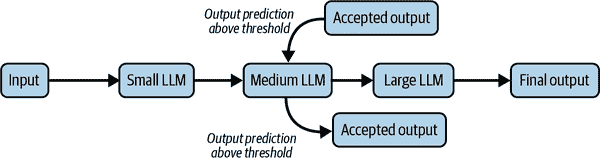

# 第十三章：设计模式和系统架构

在这本书的整个过程中，我们探索了各种技术来适应 LLM 以解决我们的任务，包括上下文学习、微调、RAG 和工具使用。虽然这些技术可能有助于满足你用例的性能要求，但在生产中部署基于 LLM 的应用程序需要遵守各种其他标准，如成本、延迟和可靠性。为了实现这些目标，LLM 应用需要大量的软件支撑和专用组件。

为了达到这个目的，在本章中，我们将讨论各种技术来构建一个生产级别的 LLM 系统，它可以支持有用的应用程序。我们将探讨如何利用多-LLM 架构来平衡成本和性能。最后，我们将探讨将 LLM 应用开发集成到传统软件开发范式中的软件框架，如 DSPy。

如果我们打算将其部署为生产级系统，仅仅将基于 LLM 的应用程序视为一个独立的 LLM 组件是不够的。我们需要将其视为一个系统，由多个软件和模型组件组成，这些组件支持 LLM 并使其可靠、快速且经济高效。这些组件的组成和连接方式被称为 *系统架构*。

让我们从讨论一个特定类型开始：利用多个 LLM（大型语言模型）来解决任务的多-LLM 架构。

# 多-LLM 架构

在这本书的整个过程中，我们讨论了在选择合适的 LLM（大型语言模型）时涉及的权衡。通常，利用多个 LLM 来实现预期的结果是有益的。多-LLM 架构可以存在于以下两种模式（或组合）中：

每个 LLM 都针对不同的子任务进行了专门化

不同的子任务可能需要不同级别的功能。为了最小化成本和延迟，对于每个任务，我们希望使用能够以我们设定的性能阈值解决子任务的最小 LLM。

所有 LLM 都解决相同任务

在这种情况下，所有 LLM 都解决相同任务，但对于每个输入，可能只选择一个或多个 LLM 来解决它。

###### 小贴士

一个特定任务可以通过 LLM 集成来解决，最终输出可以根据某些规则（多数投票、插值等）来选择。有关有思想集成的例子，请参阅[Jiang 等人的集成框架](https://oreil.ly/FEikT)，称为 LLM-Blender。

让我们逐一探讨一些常用的多-LLM 架构。

## LLM 级联

虽然使用最先进的 LLM 来处理所有我们的输入是一个选择，但现实中这可能是成本高昂或延迟敏感的。为了在保持高性能标准的同时优化成本，我们可以利用多个 LLM，组织成级联架构。

让我们通过 LLM 级联来举例说明。假设你有一个使用三个 LLM 的应用程序：一个小型、一个中型和一个大型，如图 图 13-1 所示。



###### 图 13-1. LLM 级联

在推理过程中观察到以下过程：

1.  每个输入都馈送到小型 LLM。

1.  如果小型 LLM 的输出预测的置信度超过阈值，那么我们接受输出作为最终输出。

1.  如果小型 LLM 的输出预测的置信度没有超过阈值，那么我们将输入传递到中型模型。

1.  类似地，如果中间层 LLM 的输出预测的置信度超过阈值，那么我们就停止并接受这个输出作为最终输出。

1.  然而，如果中间层 LLM 的输出预测的置信度没有超过阈值，那么我们将输入传递到大型模型。

1.  大型模型生成最终输出。

当大多数用户输入都可以由小型模型处理时，这种架构最有益。

如果你使用仅编码器模型，如 BERT，输出概率分数可以用作置信度的度量。因此，一组校准良好的模型将使我们能够有效地将输入路由到最合适的模型。（回忆我们在第五章中关于模型校准的讨论。）

对于解码器模型，一种流行的方法是使用自洽性作为置信度的度量。（回忆我们在第一章中关于自洽性的讨论。）如果我们从模型中多次生成，并且输出之间大部分是一致的，那么我们可以说模型对其预测有信心。如果它们不一致，那么我们可以向下移动级联，并将输入应用到级联中的下一个 LLM。

###### 警告

一些工作建议让 LLM 明确声明其输出的置信度。这尚未被证明是有效的。小心要求 LLM 以任何形式验证其工作！

评估置信度的另一种方法是使用边缘采样，如 Ramirez 等人所提出的。[Ramirez et al.](https://oreil.ly/5s1rJ) 在边缘采样方法中，我们生成第一个标记，并使用最可能标记的概率与第二可能标记的概率之间的差异作为边缘。假设边缘越高，模型的置信度就越高。如果边缘低于某个阈值，则将输入发送到级联中的下一个模型。

使用级联的另一种选择是使用路由器方案。

## 路由器

路由器是一个程序或模型，它处理输入查询并将它们调度到适当的模型。使用路由器架构的优势在于，与级联不同，相同的输入不需要在可能多个模型上运行。然而，这种策略的有效性依赖于路由器有效地将输入调度到最优模型，这并不总是能够实现。

路由器可以执行意图分类，即理解用户的意图并将输入分配给能够解决请求任务的合适 LLM。如果架构中的所有 LLM 都旨在解决同一任务，则路由器评估输入查询的难度，并将输入分配给能够充分解决任务的模型中最小的一个。

图 13-2 说明了路由器在挑选合适的模型以解决任务中的作用。


###### 图 13-2\. 路由器

###### 小贴士

路由器也可以用于 RAG 管道。路由器可以评估输入并将其分配给几种不同类型的检索器之一。

使用启发式方法或微调模型可以评估输入查询的复杂性。启发式方法可以基于输入中出现的某些关键词（例如，在 RAG 中，*When*查询比*How*查询更容易回答）或任务的标识（例如，情感分析是一个较容易的任务，可以通过较小的模型完成）。

接下来，让我们讨论专用 LLM。

## 专用 LLM

组织多 LLM 架构的另一种方式是部署各种特定任务的 LLM，每个 LLM 都专门解决某一类任务或子任务。

对于一个复杂的用户查询，可以使用相对强大的 LLM 将其分解为其组成部分子任务。然后，路由器可以将这些子任务分配给最适合处理子任务的专用模型。（回忆我们在第八章中关于任务分解的讨论。）

可以通过在任务和领域特定数据集上微调来构建专用 LLM。

图 13-3 说明了复杂查询如何被划分为几个子任务，每个子任务都被分配给最有可能以成本最优的方式解决它的模型。


###### 图 13-3\. 专用 LLM

现在让我们探讨一些促进更有效的 LLM 应用开发的编程范式。

# 编程范式

正如我们在本章中看到的，生产级的 LLM 系统可以由许多软件组件组成，这些组件有助于使系统更加健壮和可靠。自然地，我们希望使用软件设计模式来帮助我们构建这些系统，使其既高效又易于维护。开发者社区在这方面仍在成熟，经过验证的设计模式的出现还需要更多时间。

在这个阶段，有几种关于 LLM 编程范式的提案。虽然许多尚未经过充分测试，但其中一些范式已经足够成熟，可以支持生产级应用。让我们探讨其中几个主要的。

## DSPy

LLM 应用程序开发是一个高度迭代的过程。在选择正确的 LLM 之前，你可能想尝试几个候选 LLM。你可能从零样本提示开始，这涉及到大量的迭代提示操作，也称为提示工程。如果零样本提示不足，你可能尝试进入少量样本提示，这涉及到迭代各种候选示例。如果少量样本提示不足，你可能想要微调模型，这涉及到迭代准备数据集并尝试模型的各个超参数。*D*eclarative *S*elf-improving Language *P*rograms，以 Pythonic 的方式（DSPy）是一个开源编程框架，旨在抽象化迭代过程的大部分。正如他们的座右铭所说，编程，而不是提示。

DSPy 提供了一个框架，其中应用程序的控制流与需要迭代的变量分离。这些变量可以是提示、LLMs 的参数等。管理应用程序控制流的编程块称为*模块*，执行变量迭代更新的块称为*优化器*。

### 模块

模块是 LLM 应用程序的构建块。每个模块对应于提示链中的底层提示。每种模块类型都是不同提示技术的抽象，例如 CoT。可以使用*签名*声明模块，该签名声明性地提供输入输出规范。

使用签名声明 CoT 提示模块非常简单：

```py
import dspy
summarizer = dspy.ChainOfThought('document -> summary')
```

`ChainOfThought`是一个提供 CoT 提示技术抽象的模块。该模块使用签名`document → summary`声明，该签名以声明性形式指定输入和输出类型。例如，如果你正在构建一个问答应用程序，那么签名可以是`question → answer`。

对于某些应用程序，你可能希望比简短的字符串提供更多的输入输出映射细节。在这种情况下，可以使用 Python 类声明签名。以下是一个示例：

```py
class RAGQA(dspy.Signature):
    """Using only information in the provided context,
 answer the question in the text"""

    context = dspy.InputField(desc="context might be irrelevant")
    text = dspy.InputField()
    answer = dspy.OutputField(desc="Answer in at most two sentences.")

context = "Tempura was invented in New Zealand by a retired rugby player. The `word` `'tempura'` `comes` `from` `the` `German` `opera` `by` `Neubig``.``"` ``` `text` `=` `"Which year was tempura invented in?"` `answer` `=` `dspy``.``ChainOfThought``(``RAGQA``)` `answer``(``context``=``context``,` `text``=``text``)` ```py
```

`` `在这个例子中，指令可以提供在三个地方：    *   文档字符串，包含对任务的更详细描述           *   输入字段，包含任何输入约束的详细信息           *   输出字段，包含任何输出约束的详细信息              请参阅[DSPy 文档](https://oreil.ly/4Vy5c)以获取可用模块的完整列表。我们可以使用这些模块作为构建块来构建复杂的 LLM 应用程序。接下来，让我们看看在底层工作的优化器，它们可以将我们的模块编译成可执行程序。` ``  `` `### 优化器    优化器是更新提示或模型参数的组件。DSPy 原生支持几种优化器。优化器可以用来更新以下之一：    *   指令提示           *   少样本训练示例           *   模型参数（微调）              优化器将需要应用到的模块、评估模块输出的指标以及由输入-输出对或仅输入组成的微调或少样本训练数据作为输入。优化器使用算法来更新提示或参数以优化所需的指标。DSPy 支持像*准确度*或*精确度*或*精确匹配*这样的指标。    如果默认提供的优化器不能满足您的需求，您可以实现自己的模块和优化器。因此，DSPy 是一个强大的框架，它将 LLM 应用程序的控制流与迭代方面（如 LLM 提示和微调）分离，并可能自动化后者。DSPy 的缺点是优化器可能不足以自动工作，可能需要手动干预来正确调整它们。通常情况下，您会发现自己在编写自己的优化器。    现在，让我们探索另一个名为语言模型查询语言（LMQL）的框架。我们已经在第五章的上下文中介绍了这个框架，但在这里我们将看看如何将相同的框架用作开发 LLM 应用程序的编程范式。` ``  ```py`` ````## LMQL    LMQL 是 Python 的超集，它允许使用声明性 Python 代码指定提示、输出约束和程序控制流。以下是一个示例：    ```py import lmql  @lmql.query(model="gpt-4") def jeopardy():     '''lmql  """Generate a Jeopardy! question and answer.  A:[ANSWER]  Q:[QUESTION]""" where STOPS_AT(ANSWER, "?") and \  STOPS_AT(QUESTION, "\n")  '''  jeopardy(model=lmql.model("gpt-4")) ```    在这个例子中，我们要求模型生成一个 Jeopardy!问题。Jeopardy!是一个电视节目，执行了一个智力问答的修改版；主持人提供答案，参赛者提供给定答案的问题。    在 LMQL 中，我们通过定义一个名为`jeopardy`的函数并在文档字符串中提供提示指令来实现这一点。文档字符串包含指令`生成一个 Jeopardy!问题和答案`。`[ANSWER]`和`[QUESTION]`标记是指令 LLM 将根据`WHERE`子句中指定的约束填充的模板。    对于答案（在 Jeopardy 中是问题），我们在生成`?`符号后停止生成。同样，对于问题（在 Jeopardy 中是答案），我们在生成换行符后停止生成。`WHERE`子句可以用来提供生成复杂约束。    LMQL 语法可能需要一段时间才能习惯，但总体上它为开发 LLM 程序提供了一个强大的程序性基础。LMQL 和 DSPy 都有学习曲线，所以我建议在您的前几次迭代中保持耐心。    随着 LLM 和 LLM 驱动的应用程序的成熟，我预计将出现更多的编程范式，并且现有的范式将发生巨大变化。在许多情况下，当前的范式可能过于脆弱，因此在生产中采用它们之前请谨慎并验证它们的有效性。` ``  ```py` `````  `` `# 摘要    在本章中，我们探讨了 LLM 系统的构建和各种系统架构。我们展示了如何利用多 LLM 架构来优化成本和延迟。最后，我们介绍了 LLM 编程框架以简化 LLM 应用程序的开发。` ``
